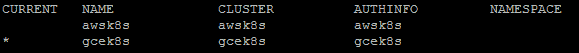
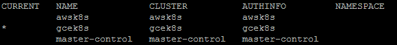
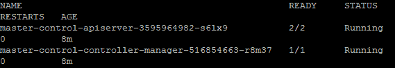
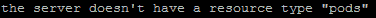
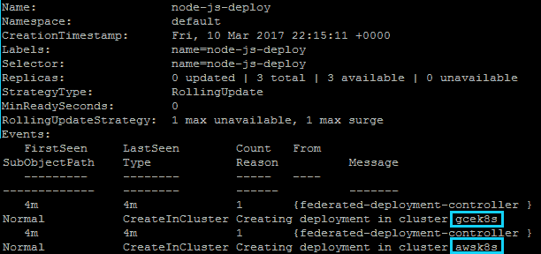
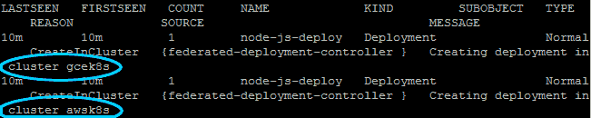
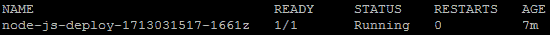
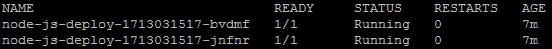
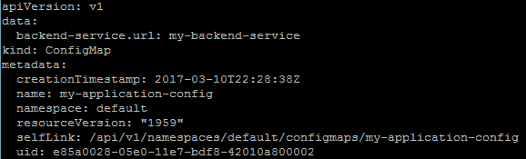
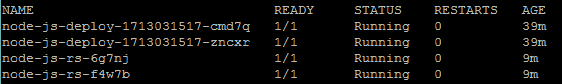

# 第九章：集群联合

本章将讨论新的联合能力以及如何使用它们来管理跨云提供商的多个集群。我们还将介绍核心结构的联合版本。我们将为您介绍联合部署、副本集、配置映射和事件。

本章将讨论以下主题：

+   联合集群

+   将多个集群联合起来

+   跨多个集群检查和控制资源

+   在多个集群中启动资源

# 介绍联合

尽管 **联合** 在 Kubernetes 中仍然非常新颖，但它为高度追求的跨云提供商解决方案奠定了基础。使用联合，我们可以在本地和一个或多个公共云提供商上运行多个 Kubernetes 集群，并管理利用我们组织的全部资源的应用程序。

这开始为避免云提供商锁定和高可用部署铺平道路，可以将应用服务器放置在多个集群中，并允许与我们的联合集群中位于单个点的其他服务进行通信。我们可以提高对特定提供商或地理位置的中断的隔离性，同时提供更大的灵活性，以便扩展和利用总体基础架构。

目前，联合平面支持这些资源（配置映射、守护程序集、部署、事件、入口、命名空间、副本集、密码和服务）。请注意，联合及其组件处于发布的 Alpha 和 Beta 阶段，因此功能可能仍然有些不稳定。

# 设置联合

尽管我们可以使用我们为其余示例运行的集群，但我强烈建议您从头开始。集群和上下文的默认命名可能对联合系统有问题。请注意，`--cluster-context` 和 `--secret-name` 标志旨在帮助您解决默认命名问题，但对于首次联合，可能仍然会令人困惑且不直接。

因此，本章中我们将从头开始演示示例。可以使用新的、独立的云提供商（AWS 和/或 GCE）帐户，或者拆除当前的集群并通过运行以下命令重置 Kubernetes 控制环境：

```
$ kubectl config unset contexts $ kubectl config unset clusters

```

使用以下命令双重检查是否列出了任何内容：

```
$ kubectl config get-contexts $ kubectl config get-clusters

```

接下来，我们将希望将 `kubefed` 命令放到我们的路径上并使其可执行。导航回您解压 Kubernetes 下载的文件夹。`kubefed` 命令位于 `/kubernetes/client/bin` 文件夹中。运行以下命令进入 bin 文件夹并更改执行权限：

```
$ sudo cp kubernetes/client/bin/kubefed /usr/local/bin
$ sudo chmod +x /usr/local/bin/kubefed

```

# 上下文

**上下文**由 Kubernetes 控制平面用于存储多个集群的身份验证和集群配置。这使我们能够访问和管理从同一个 `kubectl` 访问的多个集群。您可以始终使用我们之前使用过的 `get-contexts` 命令查看可用的上下文。

# 用于联邦的新集群

再次确保你导航到 Kubernetes 下载的位置，并进入`cluster`子文件夹：

```
$ cd kubernetes/cluster/

```

在继续之前，请确保你已经安装、验证和配置了 GCE 命令行和 AWS 命令行。如果你需要在新的环境中执行此操作，请参考第一章，*Kubernetes 简介*。

首先，我们将创建 AWS 集群。请注意，我们正在添加一个名为`OVERRIDE_CONTEXT`的环境变量，它将允许我们将上下文名称设置为符合 DNS 命名标准的内容。DNS 是联邦的关键组件，因为它允许我们进行跨集群发现和服务通信。在联邦世界中，这一点至关重要，因为集群可能位于不同的数据中心甚至提供商中。

运行这些命令来创建你的 AWS 集群：

```
$ export KUBERNETES_PROVIDER=aws
$ export OVERRIDE_CONTEXT=awsk8s
$ ./kube-up.sh

```

接下来，我们将使用`OVERRIDE_CONTEXT`环境变量再次创建一个 GCE 集群：

```
$ export KUBERNETES_PROVIDER=gce
$ export OVERRIDE_CONTEXT=gcek8s
$ ./kube-up.sh

```

如果我们现在看一下我们的上下文，我们会注意到我们刚刚创建的`awsk8s`和`gcek8s`。`gcek8s`前面的星号表示它是`kubectl`当前指向并执行的位置：

```
$ kubectl config get-contexts 

```

上述命令应该产生类似以下的内容：



上下文清单

# 初始化联邦控制平面

现在我们有了两个集群，让我们在 GCE 集群中设置联邦控制平面。首先，我们需要确保我们在 GCE 上下文中，然后我们将初始化联邦控制平面：

```
$ kubectl config use-context gcek8s
$ kubefed init master-control --host-cluster-context=gcek8s --dns-zone-name="mydomain.com" 

```

上述命令创建了一个专门用于联邦的新上下文，称为`master-control`。它使用`gcek8s`集群/上下文来托管联邦组件（如 API 服务器和控制器）。它假设 GCE DNS 作为联邦的 DNS 服务。你需要使用你管理的域后缀更新`dns-zone-name`。

默认情况下，DNS 提供商是 GCE。你可以使用`--dns-provider="aws-route53"`将其设置为 AWS `route53`；然而，开箱即用的实现对许多用户仍然存在问题。

如果我们再次检查我们的上下文，我们现在会看到三个上下文：

```
$ kubectl config get-contexts 

```

上述命令应该产生类似以下的内容：



上下文清单 #2

在继续之前，让我们确保所有联邦组件都在运行。联邦控制平面使用`federation-system`命名空间。使用指定了命名空间的`kubectl get pods`命令来监视进度。一旦看到两个 API 服务器 pod 和一个控制器 pod，你就应该准备好了：

```
$ kubectl get pods --namespace=federation-system

```



联邦 pod 清单 #

现在我们已经设置并运行了联邦组件，让我们切换到该上下文以进行下一步：

```
$ kubectl config use-context master-control

```

# 将集群添加到联邦系统中

现在我们有了联邦控制平面，我们可以将集群添加到联邦系统中。首先，我们将加入 GCE 集群，然后再加入 AWS 集群：

```
$ kubefed join gcek8s --host-cluster-context=gcek8s --secret-name=fed-secret-gce
$ kubefed join awsk8s --host-cluster-context=gcek8s --secret-name=fed-secret-aws

```

# 联邦资源

联邦资源允许我们跨多个集群和/或区域部署。当前，Kubernetes 版本 1.5 支持联合 API 中的一些核心资源类型，包括 ConfigMap、DaemonSets、Deployment、Events、Ingress、Namespaces、ReplicaSets、Secrets 和 Services。

让我们来看一个**联邦部署**，它将允许我们在 AWS 和 GCE 上安排 Pods：

```
apiVersion: extensions/v1beta1
kind: Deployment
metadata:
  name: node-js-deploy
  labels:
    name: node-js-deploy
spec:
  replicas: 3
  template:
    metadata:
      labels:
        name: node-js-deploy
    spec: 
      containers: 
      - name: node-js-deploy 
        image: jonbaier/pod-scaling:latest 
        ports: 
        - containerPort: 80

```

*列表 9-1. *`node-js-deploy-fed.yaml`

使用以下命令创建此部署：

```
$ kubectl create -f node-js-deploy-fed.yaml

```

现在让我们尝试列出此部署中的 Pods：

```
$ kubectl get pods

```



联邦上下文中没有 Pods

我们应该看到类似于上述所示的消息。这是因为我们仍在使用 `master-control` 或联邦上下文，该上下文本身不运行 Pods。然而，我们将在联邦平面上看到部署，并且如果我们检查事件，我们将看到部署实际上是在我们的联合集群上创建的：

```
$ kubectl get deployments
$ kubectl describe deployments node-js-deploy 

```

我们应该看到类似以下的内容。请注意，`Events:` 部分显示了我们在 GCE 和 AWS 上的部署情况：



联邦 Pods 部署

我们还可以使用以下命令查看联邦事件：

```
$ kubectl get events

```



联邦事件

所有三个 Pods 都运行可能需要一段时间。一旦发生这种情况，我们就可以切换到每个集群上下文，并在每个集群上看到一些 Pods。请注意，我们现在可以使用 `get pods`，因为我们在各个集群上而不是在控制平面上：

```
$ kubectl config use-context awsk8s
$ kubectl get pods

```



AWS 集群上的 Pods

```
$ kubectl config use-context gcek8s
$ kubectl get pods

```



GCE 集群上的 Pods

我们应该看到三个 Pods 分布在集群中，其中两个在一个集群上，第三个在另一个集群上。Kubernetes 在没有任何手动干预的情况下将其分布在集群中。任何失败的 Pods 将被重新启动，但现在我们增加了两个云提供商的冗余性。

# 联邦配置

在现代软件开发中，将配置变量与应用代码本身分离是很常见的。这样做可以更容易地更新服务 URL、凭据、常见路径等。将这些值放在外部配置文件中意味着我们可以在不重新构建整个应用程序的情况下轻松更新配置。

这种分离解决了最初的问题，但真正的可移植性是当您完全从应用程序中移除依赖关系时实现的。Kubernetes 提供了一个专门用于此目的的配置存储。**ConfigMaps** 是存储键值对的简单结构。

Kubernetes 还支持用于更敏感的配置数据的**Secrets**。这将在第十章 *容器安全性*中更详细地介绍。您可以在单个集群上或在我们此处演示的联邦控制平面上使用该示例，就像我们在这里使用 ConfigMaps 一样。

让我们看一个示例，让我们能够存储一些配置，然后在各种 pod 中使用它。以下清单将适用于联合和单个集群，但我们将继续为此示例使用联合设置。`ConfigMap`种类可以使用文字值、平面文件和目录，最后是 YAML 定义文件创建。以下清单是一个 YAML 定义文件：

```
apiVersion: v1
kind: ConfigMap
metadata:
  name: my-application-config
  namespace: default
data:
  backend-service.url: my-backend-service

```

*Listing 9-2*: `configmap-fed.yaml`

让我们首先切换回我们的联合平面：

```
$ kubectl config use-context master-control

```

现在，使用以下命令创建此清单：

```
$ kubectl create -f configmap-fed.yaml

```

让我们显示我们刚刚创建的`configmap`对象。`-o yaml`标志帮助我们显示完整的信息：

```
$ kubectl get configmap my-application-config -o yaml

```



联合`ConfigMap`描述

现在我们有了一个`ConfigMap`对象，让我们启动一个可以使用`ConfigMap`的联合`ReplicaSet`。这将在我们的集群中创建可以访问`ConfigMap`对象的 pod 的副本。`ConfigMap`可以通过环境变量或挂载卷进行访问。这个示例将使用一个提供文件夹层次结构和每个键内容表示值的挂载卷：

```
apiVersion: extensions/v1beta1
kind: ReplicaSet
metadata:
  name: node-js-rs
spec:
  replicas: 3
  selector:
    matchLabels:
      name: node-js-configmap-rs
  template:
    metadata:
      labels:
        name: node-js-configmap-rs
    spec:
      containers:
      - name: configmap-pod
        image: jonbaier/node-express-info:latest
        ports:
        - containerPort: 80
          name: web
        volumeMounts:
        - name: configmap-volume
          mountPath: /etc/config
      volumes:
      - name: configmap-volume
        configMap:
          name: my-application-config

```

*Listing 9-3*: `configmap-rs-fed.yaml`

使用`kubectl create -f configmap-rs-fed.yaml`创建此 pod。创建后，我们将需要切换上下文到其中一个运行 pod 的集群。您可以随意选择，但我们将在这里使用 GCE 上下文：

```
$ kubectl config use-context gcek8s

```

现在我们专门在 GCE 集群上，让我们检查这里的`configmaps`：

```
$ kubectl get configmaps

```

如您所见，`ConfigMap`本地传播到每个集群。接下来，让我们从我们的联合`ReplicaSet`中找到一个 pod：

```
$ kubectl get pods

```



GCE 集群上的 Pods

让我们从清单中选取一个`node-js-rs` pod 名称，并使用`kubectl exec`运行一个 bash shell：

```
$ kubectl exec -it node-js-rs-6g7nj bash

```

然后更改目录到我们在 pod 定义中设置的`/etc/config`文件夹。列出这个目录会显示一个名为我们之前定义的`ConfigMap`的单个文件：

```
$ cd /etc/config
$ ls

```

如果我们然后用以下命令显示文件的内容，我们应该看到我们之前输入的值：`my-backend-service`：

```
$ echo $(cat backend-service.url)

```

如果我们查看联合集群中任何一个 pod，我们将看到相同的值。这是一种很好的方式，可以将配置从应用程序中解耦并分布到我们的集群中。

# 其他联合资源

到目前为止，我们看到了联合部署、ReplicaSets、事件和 ConfigMaps 在行动中。`DaemonSets`、`Ingress`、`Namespaces`、`Secrets`和`Services`也受到支持。您的具体设置将有所不同，您可能会有一组与我们此处示例不同的集群。如前所述，这些资源仍处于测试阶段，因此值得花些时间尝试各种资源类型，并了解联合构造对您的特定基础设施组合的支持情况。

# 真正的多云

这是一个值得关注的激动人心的领域。随着它的发展，我们有一个真正良好的开始来进行多云实现，并在地区、数据中心甚至云提供商之间提供冗余。

虽然 Kubernetes 提供了一条简便且令人兴奋的多云基础设施路径，但重要的是要注意，生产多云需要比分布式部署更多的东西。从日志记录和监控到合规性和主机加固的全套功能，在多提供商设置中有很多要管理的内容。

真正的多云采用将需要一个精心规划的架构，而 Kubernetes 在追求这一目标上迈出了一大步。

# 摘要

在本章中，我们介绍了 Kubernetes 中的新联邦能力。我们看到了如何将集群部署到多个云提供商，并从单个控制平面管理它们。我们还在 AWS 和 GCE 中的集群中部署了一个应用程序。虽然这些功能是新的，仍主要处于 alpha 和 beta 阶段，但我们现在应该有能力利用它们，并将其作为标准 Kubernetes 运行模型的一部分。

在下一章中，我们将深入探讨另一个高级话题，安全性。我们将介绍安全容器的基础知识，以及如何保护您的 Kubernetes 集群。我们还将研究 Secrets 结构，它使我们能够存储类似于我们之前的 `ConfigMap` 示例中的敏感配置数据。
