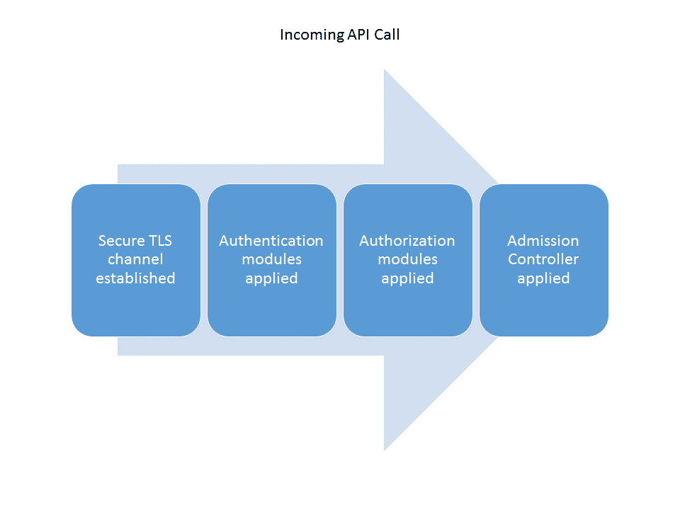
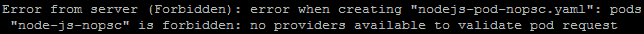
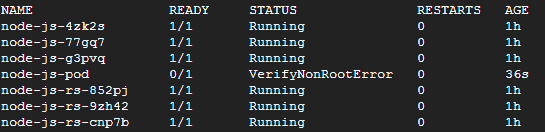

# 第十章：容器安全

本章将从容器运行时级别到主机本身讨论容器安全的基础知识。我们将讨论如何将这些概念应用于在 Kubernetes 集群中运行的工作负载，并讨论一些与运行您的 Kubernetes 集群特定相关的安全关注点和实践。

本章将讨论以下主题：

+   基本容器安全

+   容器镜像安全和持续性漏洞扫描

+   Kubernetes 集群安全

+   Kubernetes 秘密

# 容器安全基础

容器安全是一个深入的主题领域，本身就可以填满一本书。话虽如此，我们将涵盖一些高级别的关注点，并为思考这一领域提供一个起点。

在 第一章* Kubernetes 介绍 * 的 * 容器简介 * 部分，我们看到了 Linux 内核中支持容器技术的一些核心隔离特性。理解容器工作原理的细节是理解管理它们中的各种安全问题的关键。

深入研究的好文章是 *NCC 的白皮书*，*理解和加固 Linux 容器*（您可以在本章末尾的*参考文献*部分的第 1 点中查看更多详细信息）。在 *第七部分* 中，该论文探讨了容器部署中涉及的各种攻击向量，我将总结（您可以在本章末尾的*参考文献*部分的第 1 点中查看更多详细信息）。

# 保持容器受限

论文中讨论的最明显的特征之一是逃避容器结构的孤立/虚拟化。现代容器实现使用命名空间来隔离进程，并允许控制容器可用的 Linux 权限。此外，越来越多地采用安全的默认配置来配置容器环境。例如，默认情况下，Docker 仅启用了一小部分权限（您可以在本章末尾的*参考文献*部分的第 2 点中查看更多详细信息）。网络是另一个逃逸的途径，由于现代容器设置中插入了各种网络选项，这可能是具有挑战性的。

论文中讨论的下一个领域是两个容器之间的攻击。*用户*命名空间模型在这里为我们提供了额外的保护，通过将容器内的 root 用户映射到主机上的较低级别用户。网络当然仍然是一个问题，需要在选择和实施容器网络解决方案时进行适当的勤勉和关注。

容器内部的攻击是另一个向量，与之前的担忧一样，命名空间和网络对于保护至关重要。在这种情况下至关重要的另一个方面是应用程序本身的安全性。代码仍然需要遵循安全编码实践，并且软件应该定期更新和打补丁。最后，容器镜像的效率具有缩小攻击面的附加好处。镜像应该只包含必需的软件包和软件。

# 资源耗尽和编排安全性

与拒绝服务攻击类似，在计算的各个其他领域中，资源耗尽在容器世界中非常相关。虽然 cgroups 对 CPU、内存和磁盘使用等资源使用提供了一些限制，但仍然存在有效的资源耗尽攻击途径。诸如 Docker 等工具为 cgroups 的限制提供了一些起始默认值，Kubernetes 还提供了可以放置在集群中运行的容器组的额外限制。了解这些默认值并为您的部署进行调整至关重要。

尽管 Linux 内核和启用容器的功能给我们提供了一定形式的隔离，但它们对于 Linux 操作系统来说还是相当新的。因此，它们仍然包含自己的错误和漏洞。用于能力和命名空间的内置机制可能会存在问题，跟踪这些问题作为安全容器操作的一部分是很重要的。

NCC 论文涵盖的最后一个领域是容器管理层本身的攻击。Docker 引擎、镜像仓库和编排工具都是重要的攻击向量，应在制定策略时予以考虑。我们将在接下来的章节更深入地研究如何解决镜像仓库和作为编排层的 Kubernetes。

如果你对 Docker 实现的特定安全功能感兴趣，请查看这里：

[`docs.docker.com/engine/security/security/`](https://docs.docker.com/engine/security/security/).

# 镜像仓库

漏洞管理是现代 IT 运营的关键组成部分。零日漏洞正在增加，即使是有补丁的漏洞也可能很难修复。首先，应用程序所有者必须了解其漏洞和潜在补丁。然后，这些补丁必须集成到系统和代码中，通常需要额外的部署或维护窗口。即使对漏洞有所了解，修复也经常有延迟，通常需要大型组织数月时间才能打补丁。

虽然容器极大地改进了更新应用程序和最小化停机时间的过程，但漏洞管理中仍然存在挑战。特别是因为攻击者只需暴露一个这样的漏洞；任何少于 100% 的系统都未打补丁都存在被攻击的风险。

需要的是更快的反馈循环来解决漏洞。持续扫描并与软件部署生命周期结合是加速漏洞信息和修复的关键。幸运的是，这正是最新容器管理和安全工具正在构建的方法。

# 持续漏洞扫描

在这个领域出现了一个开源项目 **Clair**。我们从 *Clair* GitHub 页面了解到：<q>Clair 是一个用于对 [appc](https://github.com/appc/spec) 和 [docker](https://github.com/docker/docker/blob/master/image/spec/v1.md) 容器进行静态分析漏洞的开源项目</q>。

您可以在以下链接访问 Clair：

[`github.com/coreos/clair`](https://github.com/coreos/clair)。

Clair 会针对 **公共漏洞和利用** (**CVEs**) 扫描您的代码。它可以集成到您的 CI/CD 流水线中，并在新构建的响应中运行。如果发现漏洞，它们可以作为反馈进入流水线，甚至停止部署并失败构建。这迫使开发人员在其正常发布过程中意识到并纠正漏洞。

Clair 可以与多个容器镜像仓库和 CI/CD 流水线集成。

Clair 甚至可以部署在 Kubernetes 上：[`github.com/coreos/clair#kubernetes`](https://github.com/coreos/clair#kubernetes)。

Clair 也被用作 CoreOS 的 Quay 镜像仓库中的扫描机制。Quay 提供了许多企业功能，包括持续漏洞扫

[`quay.io/`](https://quay.io/)

Docker Hub 和 Docker Cloud 都支持安全扫描。再次强调，推送到仓库的容器会自动针对 CVE 进行扫描，并根据任何发现发送漏洞通知。此外，还会对代码进行二进制分析，以与已知版本的组件签名进行匹配。

还有一系列其他的扫描工具可用于扫描您的镜像仓库，包括 **OpenSCAP** 以及 **Twistlock** 和 **AquaSec**，我们将在第十二章，*走向生产就绪*中介绍。

# 镜像签名和验证

无论您是在内部使用私有镜像仓库还是在 Docker Hub 等公共仓库上使用，重要的是要知道您正在运行的只是您的开发人员编写的代码。下载时恶意代码或中间人攻击的潜在可能性是保护容器镜像的重要因素。

因此，rkt 和 Docker 都支持签署映像并验证内容未更改的能力。发布者可以在将映像推送到存储库时使用密钥签署映像，用户可以在客户端下载并验证签名后使用：

来自 rkt 文档：

<q>"在执行远程获取的 ACI 之前，rkt 将根据 ACI 创建者生成的附加签名对其进行验证。"</q>

+   [`coreos.com/rkt/docs/latest/subcommands/trust.html`](https://coreos.com/rkt/docs/latest/subcommands/trust.html)

+   [`coreos.com/rkt/docs/latest/signing-and-verification-guide.html`](https://coreos.com/rkt/docs/latest/signing-and-verification-guide.html) 来自 Docker 文档：

    <q>"内容信任使您能够验证从注册表收到的所有数据的完整性和发布者，无论通过哪个渠道。"</q> [`docs.docker.com/engine/security/trust/content_trust/`](https://docs.docker.com/engine/security/trust/content_trust/) 来自 Docker Notary GitHub 页面：

    <q>"Notary 项目包括用于运行和与受信任的集合交互的服务器和客户端。"</q> [`github.com/docker/notary`](https://github.com/docker/notary)

# Kubernetes 集群安全

Kubernetes 在其最新版本中持续添加了许多安全功能，并且具有一套完整的控制点，可用于您的集群；从安全的节点通信到 Pod 安全，甚至是敏感配置数据的存储。

# 安全的 API 调用

在每次 API 调用期间，Kubernetes 都会应用一些安全控制。此安全生命周期在此处描述：



API 调用生命周期

在建立安全 TLS 通信之后，API 服务器通过**授权**和**身份验证**。最后，在请求到达 API 服务器之前，会应用一个**准入控制器**循环。

# 安全的节点通信

Kubernetes 支持在 API 服务器和任何客户端之间包括节点本身之间建立安全通信渠道。无论是 GUI 还是`kubectl`等命令行实用程序，我们都可以使用证书与 API 服务器进行通信。因此，API 服务器是对集群进行任何更改的中心交互点，是一个关键组件以确保安全。

在诸如 GCE 之类的部署中，默认情况下在每个节点上部署了`kubelet`以进行安全通信。此设置使用 TLS 引导启动和新证书 API 与 API 服务器建立安全连接，使用 TLS 客户端证书和**证书颁发机构**（**CA**）集群。

# 授权和身份验证插件

Kubernetes 中用于身份验证和授权的插件机制还处于初期阶段。但是，这些功能在接下来的几个版本中也在继续开发。还有第三方提供者与这里的功能集成。

目前支持身份验证的形式包括令牌、密码和证书，并计划在以后的阶段添加插件功能。支持 OpenID Connect 令牌，还有几个第三方实现，如来自 CoreOS 的 Dex 和来自 Cloud Foundry 的 aser 账户和身份验证。

授权已经支持了三种模式。完整的**RBAC**（即**基于角色的访问控制**）模式仍在进行中，最终将从 Kubernetes 本身引入成熟的基于角色的身份验证。**基于属性的访问控制**（**ABAC**）已经得到支持，并允许用户通过文件中的属性定义权限。最后，支持 webhook 机制，允许通过 REST Web 服务调用与第三方授权进行集成。

请在这里了解更多关于每个领域的信息：

+   [`kubernetes.io/docs/admin/authorization/`](http://kubernetes.io/docs/admin/authorization/)

+   [`kubernetes.io/docs/admin/authentication/`](http://kubernetes.io/docs/admin/authentication/)

# 准入控制器

Kubernetes 还提供了一种与附加验证集成的机制作为最后一步。这可以是图像扫描、签名检查或任何能够以指定方式响应的东西。当进行 API 调用时，会调用该钩子，服务器可以运行其验证。准入控制器还可用于转换请求并添加或更改原始请求。操作运行后，然后发送带有指示 Kubernetes 允许或拒绝调用的状态的响应。

这对于验证或测试图像尤其有帮助，正如我们在上一节中提到的那样。`ImagePolicyWebhook`插件提供了一个准入控制器，允许与额外的图像检查集成。

欲了解更多信息，请访问以下文档中的“使用准入控制器”页面：

[`kubernetes.io/docs/admin/admission-controllers/`](https://kubernetes.io/docs/admin/admission-controllers/).

# Pod 安全策略和上下文

Kubernetes 安全工具箱中的最新添加之一是**Pod 安全策略和上下文**。这允许用户控制容器进程和附加卷的用户和组，限制使用主机网络或命名空间，甚至将根文件系统设置为只读。此外，我们可以限制可用的功能，并为应用于每个 pod 中的容器的标签设置 SELinux 选项。

除了 SELinux 外，Kubernetes 还通过注释添加了对使用 AppArmor 的支持。有关更多信息，请参阅以下文档页面：

[`kubernetes.io/docs/admin/apparmor/`](https://kubernetes.io/docs/admin/apparmor/).

我们将通过一个示例演示如何使用 pod 安全上下文为我们的 pod 添加一些约束。由于功能仍处于 beta 阶段，我们需要启用 beta 扩展 API，并在使用的准入控制器列表中添加`PodSecurityPolicy`。

# 启用 beta API

首先，您需要 SSH 到您的主节点，切换到**root**用户，然后使用您首选的编辑器编辑`/etc/kubernetes/manifests/kube-apiserver.manifest`文件。同样，我们可以通过 Google Cloud CLI 进行 SSH，或者使用 Google Cloud Console，在 VM 实例页面上有一个内置的 SSH 客户端。

最佳实践是不要直接 SSH 到节点本身。然而，在本书的几个地方，我们已经这样做了，用于说明目的。重要的是要了解节点本身运行的情况，并且有时候对于学习和故障排除可能是必要的。话虽如此，当您只需要在集群或 pod 中运行命令时，请使用诸如`kubectl exec`之类的工具。

滚动到命令部分，我们应该看到类似以下清单的内容：

```
"bin/sh",
"-c",
"/usr/local/bin/kube-apiserver --v=2 --cloud-config=/etc/gce.conf --address=127.0.0.1 --allow-
privileged=true --authorization-policy-file=/etc/srv/kubernetes/abac-authz-policy.jsonl --basic-auth-file=/etc/srv/kubernetes/basic_auth.csv --cloud-provider=gce --client-ca-file=/etc/srv/kubernetes/ca.crt 
--etcd-servers=http://127.0.0.1:2379 --etcd-servers-overrides=/events#http://127.0.0.1:4002 --secure-port=443 --tls-cert-file=/etc
/srv/kubernetes/server.cert --tls-private-key-file=/etc/srv/kubernetes/server.key --token-auth-file=/etc/srv/kubernetes/known_tokens.csv --storage-backend=etcd2 --target-ram-mb=180 --service-cluster-ip-range=10.0.0.0/16 --etcd-quorum-read=false --admission-control=NamespaceLifecycle,LimitRanger,ServiceAccount,PersistentVolumeLabel,DefaultStorageClass,ResourceQuota 
--authorization-mode=ABAC --allow-privileged=true 1>>/var/log/kube-apiserver.log 2>&1"

```

你的清单可能会有所不同，所以只需按照下面粗体标记的参数添加。同时，复制原始清单作为备份，以便以后需要时可以恢复：

```
"bin/sh",
"-c",
"/usr/local/bin/kube-apiserver --v=2 --cloud-config=/etc/gce.conf --address=127.0.0.1 
--allow-privileged=true --authorization-policy-file=/etc/srv/kubernetes/abac-authz-policy.jsonl --basic-auth-file=/etc/srv/kubernetes/basic_auth.csv --cloud-provider=gce --client-ca-file=/etc/srv/kubernetes/ca.crt --etcd-servers=http://127.0.0.1:2379 --etcd-servers-overrides=/events#http://127.0.0.1:4002 --secure-port=443 --tls-cert-file=/etc/srv/kubernetes/server.cert --tls-private-key-file=/etc/srv/kubernetes/server.key --token-auth-file=/etc/srv/kubernetes/known_tokens.csv --storage-backend=etcd2 --target-ram-mb=180 --service-cluster-ip-range=10.0.0.0/16 --etcd-quorum-read=false 
--admission-control=NamespaceLifecycle,LimitRanger,ServiceAccount,PersistentVolumeLabel,DefaultStorageClass,ResourceQuota,PodSecurityPolicy --authorization-mode=ABAC --allow-privileged=true --runtime-config=extensions/v1beta1=true,extensions/v1beta1/podsecuritypolicy=true 1>>/var/log/kube-apiserver.log 2>&1"

```

如果你拥有 root shell，保存文件并退出`sudo`。如果一切顺利，Kubernetes 应该注意到清单的更改并重新启动 API 服务器。这可能需要几分钟，在重启期间，`kubectl`可能会失去响应。我通常使用以下命令来观察：

```
$ kubectl get pods --namespace=kube-system

```

观察`STATUS`和`AGE`列。一旦重启成功，我们将有一个`Running`的`STATUS`和一个几分钟或更短的`AGE`。

如果我们在清单中有任何拼写错误，我们可能会在`STATUS`中看到错误，甚至会获得一个永久性无响应的`kubectl`。如果发生这种情况，我们将需要恢复我们之前的参数。如果一切都失败了，您可以重新启动实例。GCE 设置的默认值有一个引导脚本，该脚本将使用默认设置替换清单。

一旦您的 API 服务器更新并运行，我们就可以添加一个安全策略，并运行一个定义了 pod 安全上下文的 pod。该策略在集群级别运行，并强制执行所有 pod 的策略。pod 安全上下文设置在 pod 定义中，并且仅适用于该 pod。

# 创建 PodSecurityPolicy

现在我们已经添加了`PodSecurityPolicy`准入控制器，我们需要在*列表 10-2*下面进一步创建一个示例之前添加一个 pod 安全策略。如果我们现在尝试创建该 pod，我们将看到类似于这样的错误：



没有 PodSecurityPolicy 的 Pod 错误

再次强调，pod 安全策略适用于整个集群：

```
{
  "kind": "PodSecurityPolicy",
  "apiVersion":"extensions/v1beta1",
  "metadata": {
    "name": "default"
  },
  "spec": {
    "privileged": false,
    "seLinux": {
      "rule": "RunAsAny"
    },
    "supplementalGroups": {
      "rule": "RunAsAny"
    },
    "runAsUser": {
      "rule": "RunAsAny"
    },
    "fsGroup": {
      "rule": "RunAsAny"
    },
    "volumes": ["*"],
    "readOnlyRootFilesystem": true
  }
}

```

*列表 10-1*：`default-security-policy.json`

使用以下命令创建：

```
$ kubectl create -f default-security-policy.json

```

上述默认策略不允许容器以特权模式运行。它允许任何 seLinux 标签，任何附加的组 ID，任何用户运行第一个进程，以及任何文件系统的组 ID。它还支持所有类型的卷。

您可以在源代码中找到所有可能的参数，但为方便起见，我创建了以下表格。您可以在我的新网站上找到更多类似这样的便捷查找：

[`www.kubesheets.com`](https://www.kubesheets.com)

| **参数** | **类型** | **描述** | **必需** |
| --- | --- | --- | --- |
| `Privileged` | `bool` | 允许或禁止以特权运行 Pod。 | 否 |
| `DefaultAddCapabilities` | `[]v1.Capaility` | 这定义了添加到容器中的一组默认功能。如果 Pod 指定了一个要删除的功能，那么将覆盖然后添加到这里。值是 POSIX 功能的字符串，减去前缀`CAP_`。例如，`CAP_SETUID` 将是 `SETUID`。[`man7.org/linux/man-pages/man7/capabilities.7.html`](http://man7.org/linux/man-pages/man7/capabilities.7.html) | 否 |
| `RequiredDropCapabilities` | `[]v1.Capaility` | 这定义了必须从容器中丢弃的一组功能。Pod 不能指定这些功能中的任何一个。值是 POSIX 功能的字符串，减去前缀`CAP_`。例如，`CAP_SETUID` 将是 `SETUID`。[`man7.org/linux/man-pages/man7/capabilities.7.html`](http://man7.org/linux/man-pages/man7/capabilities.7.html) | 否 |
| `AllowedCapabilities` | `[]v1.Capaility` | 这定义了一组允许并可以添加到容器中的功能。Pod 可以指定这些功能中的任何一个。值是 POSIX 功能的字符串，减去前缀`CAP_`。例如，`CAP_SETUID` 将是 `SETUID`。[`man7.org/linux/man-pages/man7/capabilities.7.html`](http://man7.org/linux/man-pages/man7/capabilities.7.html) | 否 |
| `Volumes` | `[]FSType` | 此列表定义可以使用的卷。留空以使用所有类型。[`github.com/kubernetes/kubernetes/blob/release-1.5/pkg/apis/extensions/v1beta1/types.go#L1127`](https://github.com/kubernetes/kubernetes/blob/release-1.5/pkg/apis/extensions/v1beta1/types.go#L1127) | 否 |
| `HostNetwork` | `bool` | 允许或禁止 Pod 使用主机网络。 | 否 |
| `HostPorts` | `[]HostPortRange` | 这让我们能够限制可以暴露的可允许主机端口。 | 否 |
| `HostPID` | `bool` | 允许或禁止 Pod 使用主机 PID。 | 否 |
| `HostIPC` | `bool` | 允许或禁止 Pod 使用主机 IPC。 | 否 |
| `SELinux` | `SELinuxStrategyOptions` | 将其设置为这里定义的策略选项之一：[`kubernetes.io/docs/user-guide/pod-security-policy/#strategies`](https://kubernetes.io/docs/user-guide/pod-security-policy/#strategies) | 是 |
| `RunAsUser` | `RunAsUserStrategyOptions` | 将其设置为以下策略选项之一，如此处所定义：[`kubernetes.io/docs/user-guide/pod-security-policy/#strategies`](https://kubernetes.io/docs/user-guide/pod-security-policy/#strategies) | 是 |
| `SupplementalGroups` | `SupplementalGroupsStrategyOptions` | 将其设置为以下策略选项之一，如此处所定义：[`kubernetes.io/docs/user-guide/pod-security-policy/#strategies`](https://kubernetes.io/docs/user-guide/pod-security-policy/#strategies) | 是 |
| `FSGroup` | `FSGroupStrategyOptions` | 将其设置为以下策略选项之一，如此处所定义：[`kubernetes.io/docs/user-guide/pod-security-policy/#strategies`](https://kubernetes.io/docs/user-guide/pod-security-policy/#strategies) | 是 |
| `ReadOnlyRootFilesystem` | `bool` | 将其设置为 `true` 将会拒绝该 pod 或强制其以只读根文件系统运行。 | 否 |

*表 10-1\. Pod 安全策略参数*（你可以在本章末尾的参考文献第 3 点中查看更多详细信息）

现在我们对集群有了一个基本策略，让我们创建一个 `Pod`。首先，我们将创建一个带有我们的 `node-express-info` 容器的 `Pod`：

```
apiVersion: v1
kind: Pod
metadata:
    name: node-js-nopsc
spec:
  containers:
  - name: node-js-nopsc
    image: jonbaier/node-express-info:latest
    ports:
    - containerPort: 80

```

*清单 10-2*: `nodejs-pod-nopsc.yaml`

使用上述清单创建 pod。然后使用 `kubectl exec` 命令获取 pod 内部的 shell。接下来，我们将尝试使用 `touch` 命令创建一个文件：

```
$ kubectl exec -it node-js-nopsc bash root@node-js-nopsc:/src# touch file.txt

```

我们应该会收到类似于 `touch: cannot touch 'file.txt': Read-only file system` 的错误。这是因为我们将 `ReadOnlyFileSystem` 属性设置为 true，所以所有容器（无论是否定义了 pod 安全上下文）现在都以只读根文件系统运行。键入 `exit` 退出此 pod。

# 使用 PodSecurityContext 创建一个 pod

现在我们已经看到了 pod 安全策略的影响，让我们来探索一下 pod 安全上下文。在这里，我们可以定义 `seLinuxOptions`，它让我们能够为 pod 中的容器定义标签上下文。我们还可以定义 `runAsUser`，以指定每个容器将使用的 UID，以及 `runAsNonRoot` 标志，它将简单地阻止以 `UID 0` 或 `root` 运行的容器启动。我们还可以使用 `supplementalGroup` 指定每个容器中第一个进程的组（GID）。最后，我们可以使用 `fsGroup` 指定文件系统所有权和新文件的组（GID）。

*清单 10-4* 是我们先前的 `node-express-info` pod 的一个版本，其中 `runAsNonRoot` 设置为 `true`。重要的是要理解，如果在 `Dockerfile` 中没有定义用户，则 root（`UID 0`）是默认用户。 *清单 10-3* 显示了我们 `node-express-info` 容器的 `Dockerfile`。我们没有定义 `USER` 指令，因此它将以 root 身份运行：

```
FROM node:latest

ADD src/ /src
WORKDIR /src

RUN npm install

ENV PORT=80

CMD ["node", "index.js"]

```

*清单 10-3*: `node-express-info Dockerfile`

```
apiVersion: v1
kind: Pod
metadata:
    name: node-js-pod
spec:
  containers:
  - name: node-js-pod
    image: jonbaier/node-express-info:latest
    ports:
    - containerPort: 80
  securityContext:
    runAsNonRoot: true

```

*清单 10-4*: `nodejs-pod-psc.yaml`

理解安全上下文与容器构建方式之间的关系很重要。如果我们尝试使用 `kubectl create -f nodejs-pod-psc.yaml` 创建上述的 *Listing 10-4*，我们会发现它永远不会启动，并给出 `验证非根错误`：



验证非根错误

理解以安全方式运行容器不仅仅是管理员添加约束的任务。这项工作必须与将正确创建图像的开发人员合作进行。

# 清理工作

我们制定的策略可能对学习和开发来说过于严格，因此您可能希望删除它。您可以使用以下命令执行此操作：

```
$ kubectl delete psp default 

```

您还需要撤消在本节开头对 Kubernetes 主节点上的 `/etc/kubernetes/manifests/kube-apiserver.manifest` 所做的更改。具体来说，您应该从 `admission-control` 部分的列表中删除 `PodSecurityPolicy`。

# 额外的考虑事项

除了我们刚刚审查的功能之外，Kubernetes 还有许多其他构造应该在整个集群强化过程中考虑。在本书的前面，我们看到了为多租户提供逻辑分离的命名空间。虽然命名空间本身不会隔离实际的网络流量，但一些网络插件，如 Calico 和 Canal，提供了额外的网络策略功能。我们还看到了可以为每个命名空间设置的配额和限制，应该用于防止单个租户或项目在集群中消耗过多的资源。

# 保护敏感应用程序数据（秘密）

有时，我们的应用程序需要保存敏感信息。这可以是登录到数据库或服务的凭据或令牌。将这些敏感信息存储在图像本身中是应该避免的。在这里，Kubernetes 在秘密构造中为我们提供了一个解决方案。

**秘密**给了我们一种在资源定义文件中不包含明文版本的敏感信息的存储方式。秘密可以挂载到需要它们的 pod 中，然后在 pod 内部以包含秘密值的文件形式访问。或者，你也可以通过环境变量暴露秘密。

我们可以轻松地使用 YAML 或命令行创建秘密。秘密确实需要进行 base64 编码，但如果我们使用 `kubectl` 命令行，则此编码将为我们执行。

让我们从以下秘密开始：

```
$ kubectl create secret generic secret-phrases --from-literal=quiet-phrase="Shh! Dont' tell"

```

然后我们可以使用以下命令检查秘密：

```
$ kubectl get secrets

```

现在我们已经成功创建了秘密，让我们创建一个可以使用秘密的 pod。通过附加卷的方式，秘密在 pod 中被消耗。在下面的 *Listing 10-5* 中，您会注意到我们使用 `volumeMount` 将秘密挂载到容器中的一个文件夹：

```
apiVersion: v1
kind: Pod
metadata:
  name: secret-pod
spec:
  containers:
  - name: secret-pod
    image: jonbaier/node-express-info:latest
    ports:
    - containerPort: 80
      name: web
    volumeMounts:
      - name: secret-volume
        mountPath: /etc/secret-phrases
  volumes:
  - name: secret-volume
    secret:
      secretName: secret-phrases

```

*Listing 10-5*：`secret-pod.yaml`

使用`kubectl create -f secret-pod.yaml`命令创建此 Pod。一旦创建，我们可以通过`kubectl exec`获取该 Pod 中的 bash shell，然后切换到我们在 Pod 定义中设置的`/etc/secret-phrases`文件夹。列出该目录会显示一个单独的文件，文件名为我们之前创建的秘密：

```
$ kubectl exec -it secret-pod bash
$ cd /etc/secret-phrases
$ ls

```

如果我们显示这些内容，应该会看到我们之前编码的短语`Shh! Dont' tell`：

```
$ cat quiet-phrase

```

通常，这将用于数据库或服务的用户名和密码，或任何敏感凭据和配置数据。

请注意，Secrets 仍处于早期阶段，但它们是生产操作的重要组成部分。这里计划对未来发布进行一些改进。目前，Secrets 仍以明文形式存储在 etcd 服务器中。但是，Secrets 构建确实允许我们控制哪些 Pod 可以访问它，并将信息存储在 tmpfs 上，但不会为每个 Pod 持续存储它。您可能希望对生产就绪系统采取更多保护措施。

# 摘要

我们研究了基本容器安全性和一些重要的考虑因素。我们还涉及了基本镜像安全性和持续漏洞扫描。在本章稍后，我们将查看 Kubernetes 的整体安全功能，包括用于存储敏感配置数据的 Secrets，安全的 API 调用，甚至为在我们集群上运行的容器设置安全策略和上下文。

现在，您应该已经有了一个稳固的起点，用于保护您的集群并向生产环境迈进。为此，下一章将涵盖向生产环境迈进的整体策略，并且还将查看一些第三方供应商提供的填补空白并在路上协助您的工具。

# 参考资料

1.  [`www.nccgroup.trust/globalassets/our-research/us/whitepapers/2016/april/ncc_group_understanding_hardening_linux_containers-10pdf/`](https://www.nccgroup.trust/us/our-research/understanding-and-hardening-linux-containers/)

1.  [`github.com/docker/docker/blob/master/oci/defaults_linux.go#L62-L77`](https://github.com/docker/docker/blob/master/oci/defaults_linux.go#L62-L77)

1.  [`github.com/kubernetes/kubernetes/blob/release-1.5/pkg/apis/extensions/v1beta1/types.go#L1075`](https://github.com/kubernetes/kubernetes/blob/release-1.5/pkg/apis/extensions/v1beta1/types.go#L1075)
