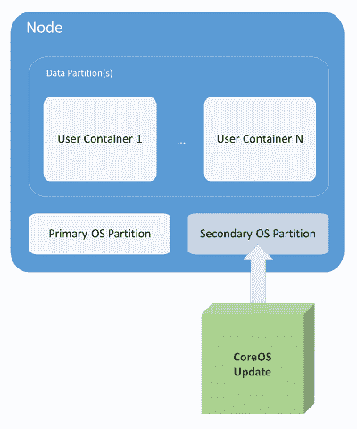
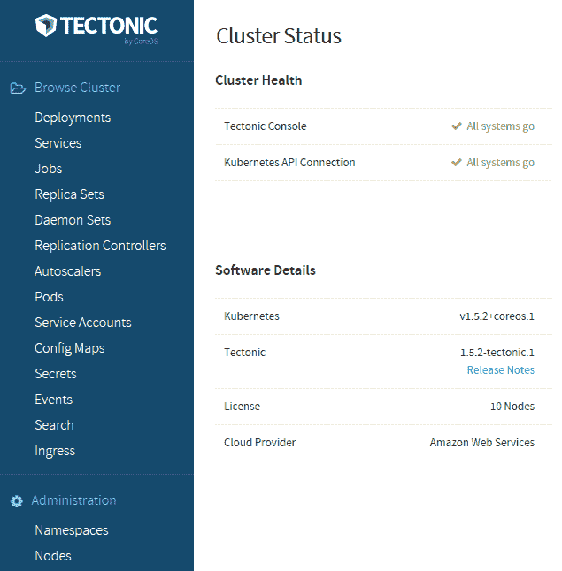
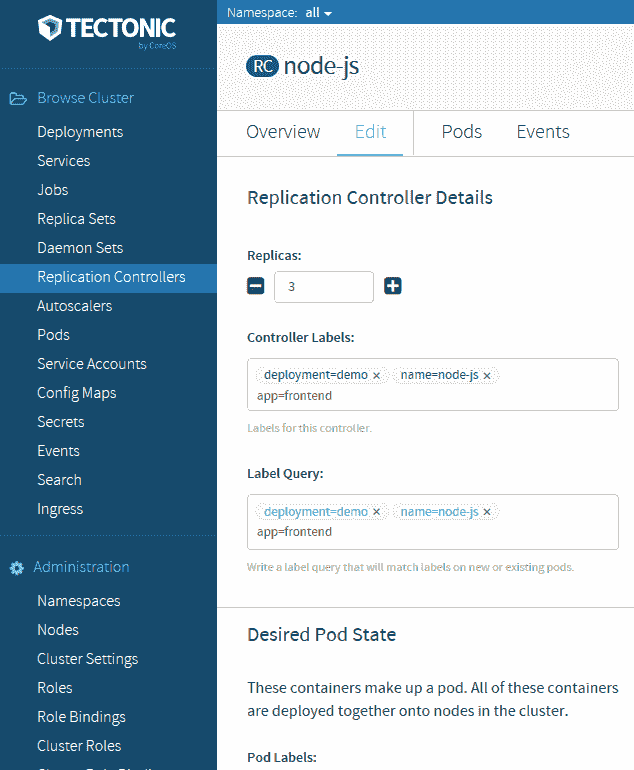
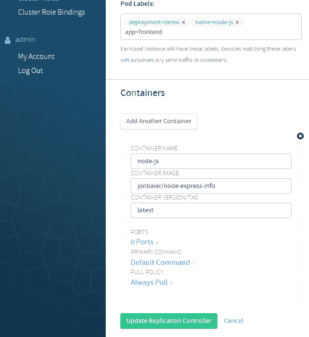
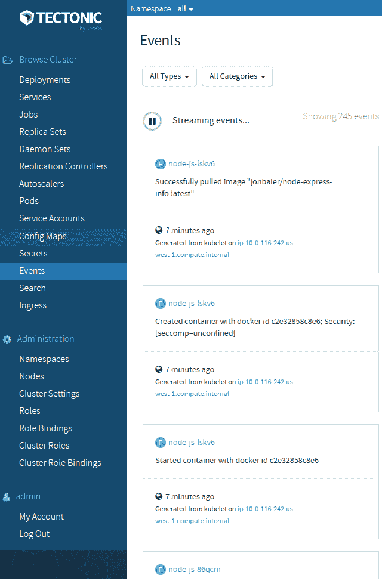
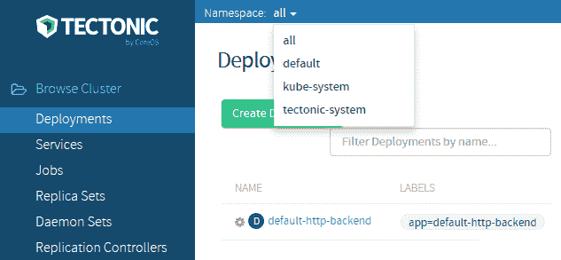

# 使用 OCP、CoreOS 和 Tectonic 扩展 Kubernetes

本章的前半部分将介绍开放标准如何鼓励多样化的容器实现生态系统。我们将查看**开放容器倡议**（**OCI**）及其提供开放容器规范的使命。本章的后半部分将介绍 CoreOS 及其作为主机操作系统的优势，包括性能和对各种容器实现的支持。此外，我们还将简要介绍 CoreOS 提供的 Tectonic 企业版。

本章将讨论以下主题：

+   为什么标准很重要？

+   开放容器倡议和云原生计算基金会

+   容器规范与实现

+   CoreOS 及其优势

+   Tectonic

# 标准的重要性

过去两年来，容器化技术的普及度有了巨大的增长。尽管 Docker 一直处于这一生态系统的中心位置，但容器领域的参与者数量正在增加。目前已经有许多替代方案用于容器化和 Docker 实现本身（**rkt**、**Garden** 等）。此外，还有丰富的第三方工具生态系统，可以增强和补充您的容器基础设施。Kubernetes 明确地位于该生态系统的编排方面，但底线是所有这些工具都构成了构建云原生应用程序的基础。

正如我们在书的开头提到的，容器最吸引人的一个特点是它们能够将我们的应用程序打包部署到各种环境层（即开发、测试和生产）和各种基础设施提供商（如 GCP、AWS、本地部署等）。

要真正支持这种部署灵活性，我们不仅需要容器本身具有共同的平台，还需要底层规范遵循一套共同的基本规则。这将允许实现既灵活又高度专业化。例如，一些工作负载可能需要在高度安全的实现上运行。为了提供这一点，实现将不得不对一些实现的方面做出更多有意识的决定。无论哪种情况，如果我们的容器建立在所有实现都同意并支持的共同结构上，我们将拥有更多的灵活性和自由度。

# 开放容器倡议

首个获得广泛行业参与的倡议之一是 OCI。在 36 家行业合作伙伴中包括 Docker、Red Hat、VMware、IBM、Google 和 AWS，在 OCI 网站上列出了它们的名单：

[`www.opencontainers.org/`](https://www.opencontainers.org/)。

OCI 的目的是将实现（如 Docker 和 rkt）与容器化工作负载的格式和运行时的标准规范分开。根据它们自己的术语，OCI 规范的目标有三个基本原则（你可以在本章末尾的*参考资料*部分的第 1 点中找到更多详细信息）：

+   创建容器镜像格式和运行时的正式规范，这将使符合规范的容器可以在所有主要的、符合规范的操作系统和平台上可移植，而不会受到人为的技术障碍的限制。

+   接受、维护和推进与这些标准相关的项目（**项目**）。它将寻求达成一致的一组容器操作（启动、执行、暂停等）以及与容器运行时相关的运行时环境的标准。

+   将之前提到的标准与其他提议的标准进行协调，包括 appc 规范。

# 云原生计算基金会

另一个也被广泛接受的倡议是**云原生计算基金会**（**CNCF**）。虽然仍然专注于容器化工作负载，但 CNCF 在堆栈中的应用设计层次上运作得更高。其目的是提供一套标准的工具和技术，用于构建、运行和编排云原生应用堆栈。云计算使我们可以访问各种新技术和实践，可以改进和演进我们的经典软件设计。这也特别关注于面向微服务的新范式开发。

作为 CNCF 的创始成员，谷歌已将 Kubernetes 开源项目捐赠为第一步。目标是增加生态系统中的互操作性，并支持与其他项目更好地集成。CNCF 已经在编排、日志记录、监控、追踪和应用程序弹性方面托管了各种项目。

有关 CNCF 的更多信息，请参阅[`cncf.io/.`](https://cncf.io/)

# 标准容器规范

OCI 努力的一个核心结果是创建和发展全面容器规范。该规范有五个所有容器都必须遵循的核心原则，我将简要概述一下（你可以在本章末尾的*参考资料*部分的第 2 点找到更多详细信息）：

+   容器必须具有在所有实现中创建、启动和停止容器的**标准操作**。

+   容器必须是**内容不可知**的，这意味着容器内部应用程序的类型不会改变容器本身的标准操作或发布。

+   容器也必须是**基础设施不可知**的。可移植性至关重要；因此，容器必须能够在 GCE 中与在公司数据中心或开发人员的笔记本电脑上同样轻松地运行。

+   一个容器还必须**设计用于自动化**，这使我们能够在构建、更新和部署流水线之间自动化。虽然这条规则有点模糊，但容器实现不应要求繁琐的手动步骤来创建和发布。

+   最后，实现必须支持**工业级交付**。再次，这涉及到构建和部署流水线，要求对容器在基础设施和部署层之间的可移植性和传输的高效流程。

规范还定义了容器格式和运行时的核心原则。你可以在 GitHub 项目上阅读更多有关规范的信息。

[`github.com/opencontainers/specs`](https://github.com/opencontainers/specs)

虽然核心规范可能有点抽象，但**runC**实现是 OCI 规范的具体示例，以容器运行时和镜像格式的形式呈现。你可以在以下网址的 runC 网站和 GitHub 上阅读更多技术细节：

+   [`github.com/opencontainers/runc`](https://github.com/opencontainers/runc)

+   [`runc.io/`](https://runc.io/)

一系列热门容器工具的支持格式和运行时基于**runC**。这是由 Docker 捐赠给 OCI 的，并且是从 Docker 平台中使用的相同基础工作创建的。自发布以来，它已被许多项目欢迎。

即使是流行的开源 PaaS，**Cloud Foundry**也宣布将在 Garden 中使用 runC。 Garden 为 Deigo 提供容器化基础设施，Deigo 则充当类似 Kubernetes 的编排层。

rkt 的实现最初基于**appc**规范。实际上，appc 规范是 CoreOS 团队早期尝试形成关于容器化的共同规范。现在 CoreOS 正在参与 OCI，并且正在努力将 appc 规范合并到 OCI 中；这应该会导致容器生态系统中更高水平的兼容性。

# CoreOS

虽然规范为我们提供了一个共同基础，但在我们容器的操作系统选择周围也有一些趋势正在演变。有几个特别为运行容器工作负载而开发的定制操作系统。尽管实现各不相同，但它们都具有类似的特征。专注于精简安装基础、原子操作系统更新和签名应用程序以实现高效和安全的运行。

正在受到欢迎的一个操作系统是**CoreOS**。CoreOS 在安全性和资源利用方面都提供了主要好处。它通过完全删除软件包依赖关系来提供资源利用。相反，CoreOS 将所有应用程序和服务都运行在容器中。通过仅提供支持运行容器所需的一小组服务，并且绕过使用虚拟化程序的需要，CoreOS 让我们能够使用更大比例的资源池来运行我们的容器化应用程序。这使得用户可以从他们的基础设施获得更高的性能和更好的容器与节点（服务器）使用比例。

**更多容器操作系统** 最近出现了几个其他容器优化的操作系统。

**Red Hat Enterprise Linux Atomic Host** 专注于安全性，默认启用 **SELinux** 并提供类似于 CoreOS 的 *Atomic* 更新操作系统。请参考以下链接：

网址为[`access.redhat.com/articles/rhel-atomic-getting-started`](https://access.redhat.com/articles/rhel-atomic-getting-started)

**Ubuntu Snappy** 也利用了将操作系统组件与框架和应用程序分离的效率和安全性提升。使用应用程序镜像和验证签名，我们可以获得一个高效的基于 Ubuntu 的操作系统，用于我们的容器工作负载，网址为[`www.ubuntu.com/cloud/tools/snappy`](http://www.ubuntu.com/cloud/tools/snappy)。

**Ubuntu LXD** 运行一个容器虚拟化程序，并提供了一个轻松迁移 Linux-based VMs 到容器的路径：

网址为[`www.ubuntu.com/cloud/lxd`](https://www.ubuntu.com/cloud/lxd)。

**VMware Photon** 是另一个针对 **vSphere** 和 VMware 平台进行优化的轻量级容器操作系统。它运行 Docker、rkt 和 Garden，并且还有一些可以在热门公共云提供商上运行的镜像。请参考以下链接：

网址为[`vmware.github.io/photon/`](https://vmware.github.io/photon/)。

利用容器的隔离性，我们增加了可靠性并降低了每个应用程序更新的复杂性。现在应用程序可以在每个新的容器发布准备就绪时与支持的库一起进行更新：



CoreOS 更新

最后，CoreOS 在安全领域还有一些额外的优势。首先，该操作系统可以作为一个整体单位进行更新，而不是通过单个软件包进行更新（参见上图）。这避免了许多由部分更新引起的问题。为了实现这一点，CoreOS 使用两个分区——一个作为活动的操作系统分区，另一个用于接收完整的更新。一旦更新成功完成，系统将重新启动并提升辅助分区。如果出现任何问题，原始分区可用于回退。

系统所有者还可以控制何时应用这些更新。这使我们可以灵活地优先考虑关键更新，同时与更常见的更新的实际调度一起工作。此外，整个更新都经过签名并通过 SSL 进行传输，以增加整个过程的安全性。

# rkt

CoreOS 生态系统的一个核心组成部分是它自己的容器运行时，名为 rkt。正如我们之前提到的，rkt 是另一种专注于安全性的实现。rkt 的主要优势在于以无守护程序的根用户身份运行引擎，就像 Docker 今天所做的那样。最初，rkt 在建立容器镜像的信任方面也有优势。然而，Docker 的最新更新通过新的**内容信任**功能取得了长足的进步。

简而言之，rkt 仍然是一个专注于在生产环境中运行容器的实现。rkt 使用一种名为**ACI**的图像格式，但它也支持运行基于 Docker 的图像。在过去的一年中，rkt 经历了重大更新，现在已经到了 1.24.0 版本。它作为在生产环境中安全运行 Docker 图像的方法已经获得了很大的动力。

此外，CoreOS 正在与**Intel®**合作，集成新的**Intel®虚拟化技术**，该技术允许容器在更高级别的隔离中运行。这种硬件增强的安全性允许容器在类似于当今我们看到的 hypervisors 的内核中运行，从而提供了与内核隔离相似的隔离。

# etcd

CoreOS 生态系统中另一个值得一提的核心组件是他们的开源 etcd 项目。etcd 是一个分布式且一致的键值存储。使用 RESTful API 与 etcd 进行接口交互，因此很容易与您的项目集成。

如果听起来很熟悉，那是因为我们在第一章中看到了这个过程，*Kubernetes 入门*，在*运行在主节点上的服务*部分。Kubernetes 实际上利用 etcd 来跟踪集群配置和当前状态。K8s 也利用它来进行服务发现。更多详情，请参阅[`github.com/coreos/etcd`](https://github.com/coreos/etcd)。

# 带有 CoreOS 的 Kubernetes

现在我们了解了这些好处，让我们来看一下使用 CoreOS 的 Kubernetes 集群。文档支持多个平台，但其中一个最容易启动的是使用 CoreOS **CloudFormation** 和 CLI 脚本的 AWS。

如果您有兴趣在其他平台上运行带有 CoreOS 的 Kubernetes，您可以在 CoreOS 文档中找到更多详情

[`coreos.com/kubernetes/docs/latest/`](https://coreos.com/kubernetes/docs/latest/)。 [](https://coreos.com/kubernetes/docs/latest/) 我们可以在这里找到 AWS 的最新说明

[`coreos.com/kubernetes/docs/latest/kubernetes-on-aws.html`](https://coreos.com/kubernetes/docs/latest/kubernetes-on-aws.html)。

您可以按照之前提到的说明在 CoreOS 上快速搭建 Kubernetes。您需要在 AWS 上创建一个密钥对，并指定一个区域、集群名称、集群大小和 DNS 以继续。

另外，我们需要创建一个 DNS 记录，并且需要一个像**Route53**这样的服务或者一个生产 DNS 服务。在按照说明操作时，您需要将 DNS 设置为您有权限设置记录的域或子域。在集群运行起来并且有定义动态端点后，我们需要更新记录。

就这样！我们现在有一个运行 CoreOS 的集群。该脚本创建了所有必要的 AWS 资源，例如**虚拟私有云**（**VPCs**）、安全组和 IAM 角色。现在集群已经运行起来，我们可以使用 `status` 命令获取端点并更新我们的 DNS 记录：

```
$ kube-aws status

```

复制紧挨着`Controller DNS Name`列出的条目，然后编辑您的 DNS 记录，将之前指定的域名或子域指向该负载均衡器。

如果您忘记了指定的域名，或者需要检查配置，可以使用您喜欢的编辑器查看生成的 `kubeconifg` 文件。它看起来会像这样：

```
apiVersion: v1
kind: Config
clusters:
- cluster:
    certificate-authority: credentials/ca.pem
    server: https://coreos.mydomain.com
  name: kube-aws-my-coreos-cluster-cluster
contexts:
- context:
    cluster: kube-aws-my-coreos-cluster-cluster
    namespace: default
    user: kube-aws-my-coreos-cluster-admin
  name: kube-aws-my-coreos-cluster-context
users:
- name: kube-aws-my-coreos-cluster-admin
  user:
    client-certificate: credentials/admin.pem
    client-key: credentials/admin-key.pem
current-context: kube-aws-my-coreos-cluster-context

```

在这种情况下，`server` 行将有您的域名。

如果这是一个新的服务器，您需要单独下载 `kubectl`，因为它没有与 `kube-aws` 捆绑在一起：

`**$ wget https://storage.googleapis.com/kubernetes-release/release/v1.0.6/bin/linux/amd64/kubectl**`

我们现在可以使用`kubectl`来查看我们的新集群：

```
$ ./kubectl --kubeconfig=kubeconfig get nodes

```

我们应该会看到一个节点列在 EC2 内部 DNS 作为名称。注意 `kubeconfig`，这告诉 Kubernetes 使用刚刚创建的集群的配置文件的路径。如果我们想要从同一台机器管理多个集群，这也很有用。

# Tect

在 CoreOS 上运行 Kubernetes 是一个很好的开始，但您可能会发现您需要更高级别的支持。来看看**Tectonic**，CoreOS 提供的用于在 CoreOS 上运行 Kubernetes 的企业级产品。Tectonic 使用了我们已经讨论过的许多组件。CoreOS 是操作系统，支持 Docker 和 rkt 运行时。此外，Kubernetes、etcd 和 flannel 被打包在一起，形成了一个完整的集群编排栈。我们在第三章简要讨论了 flannel，*网络、负载均衡器和入口*。它是一个覆盖网络，使用了类似于原生 Kubernetes 模型的模型，并将 etcd 用作后端。

类似于 Red Hat，CoreOS 还提供了类似的支持套餐，为构建在其上的开源软件 Tectonic 提供 24x7 支持。Tectonic 还提供定期的集群更新以及一个漂亮的仪表板，显示了 Kubernetes 的所有组件的视图。**CoreUpdate** 允许用户更多地控制自动更新。此外，它还提供了用于监控、SSO 和其他安全功能的模块。

您可以在此处找到更多信息以及最新的安装说明：

[`coreos.com/tectonic/docs/latest/install/aws/index.html`](https://coreos.com/tectonic/docs/latest/install/aws/index.html).

# 仪表板亮点

这里是 Tectonic 仪表板的一些亮点：



Tectonic 主仪表板

Tectonic 现在已经普遍可用，仪表板已经具有一些不错的功能。如下截图所示，我们可以看到关于我们的复制控制器的很多详细信息，甚至可以使用 GUI 通过点击按钮来进行上下缩放：



Tectonic 复制控制器详细信息

这个图形相当大，所以它跨两页显示：



另一个很好的功能是 Events 页面。在这里，我们可以观看事件直播，暂停，并根据事件严重程度和资源类型进行筛选：



事件流

浏览仪表板系统中任何位置的一个有用功能是命名空间：过滤选项。只需点击显示资源的任何页面顶部旁边的下拉菜单旁边的“Namespace:”，我们就可以按命名空间筛选我们的视图。如果我们想要过滤掉 Kubernetes 系统 pod 或只查看特定的一组资源，这可能会有所帮助：



命名空间过滤

# 摘要

在本章中，我们看到了容器社区中新兴的标准机构，以及它们如何通过开放的规范来塑造技术，使其变得更好。我们还仔细研究了 CoreOS，这是容器和 Kubernetes 社区中的关键参与者。我们探索了他们正在开发的技术，以增强和补充容器编排，并亲自看到了如何在 Kubernetes 中使用其中的一些。最后，我们看了一下 Tectonic 的企业支持套件以及目前可用的一些功能。

在下一章，也就是最后一章中，我们将探讨更广泛的 Kubernetes 生态系统以及可用于将您的集群从开发和测试转移到完全成熟的生产环境的工具。

# 参考资料

1.  [`www.opencontainers.org/faq/`](https://www.opencontainers.org/faq/)（在 OCI 任务有多广泛? 下）

1.  [`github.com/opencontainers/specs/blob/master/principles.md`](https://github.com/opencontainers/specs/blob/master/principles.md)
