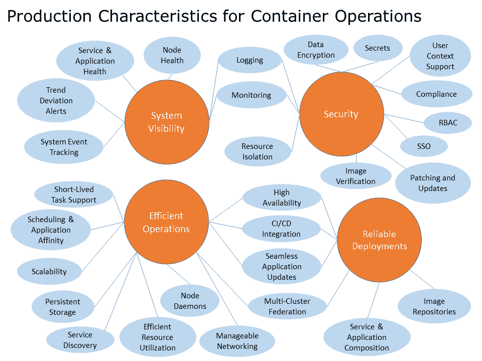

# 朝着生产就绪方向

在本章中，我们将讨论转向生产的考虑因素。我们还将展示 Kubernetes 社区中的一些有用工具和第三方项目，并介绍您可以获取更多帮助的地方。

本章将讨论以下主题：

+   生产特性

+   Kubernetes 生态系统

+   如何获得帮助？

# 准备就绪投入生产

我们通过 Kubernetes 进行了许多典型操作。正如我们所见，K8s 提供了各种功能和抽象，可以减轻容器部署的日常管理负担。

有许多特性定义了一个容器生产就绪系统。以下图表提供了一个高级视图，涵盖了生产就绪集群的主要关注点。这绝不是一个详尽的列表，但旨在为投入生产操作提供一些坚实的基础：

容器运行的生产特性

我们看到了 Kubernetes 的核心概念和抽象如何解决一些这些问题。服务抽象在服务和应用程序级别都内置了服务发现和健康检查。我们还从复制控制器和部署构造中获得无缝应用程序更新和可伸缩性。所有服务、复制控制器、副本集和 Pod 的核心抽象都与核心调度和亲和力规则集一起工作，并为我们提供了易于服务和应用程序组合的功能。

内置支持各种持久存储选项，并且网络模型提供了可管理的网络操作，并提供与其他第三方提供商合作的选项。此外，我们简要介绍了市场上一些热门工具与 CI/CD 集成。

此外，我们还内置了系统事件跟踪，并与主要云服务提供商集成，提供了监控和日志记录的即用即连设置。我们还看到了如何将这些扩展到第三方提供商，如**StackDriver**和**Sysdig**。这些服务还关注节点的整体健康状况，并提供主动的趋势偏差警报。

核心构建还帮助我们解决应用程序和服务层的高可用性问题。调度器可以与自动缩放机制一起在节点级别提供此功能。然后，支持使 Kubernetes 主节点本身高度可用。在第九章中，*集群联合*，我们简要介绍了承诺未来多云和多数据中心模型的新联合功能。

最后，我们探讨了一种新的操作系统类型，为我们提供了精简的基础和用于补丁和更新的安全更新机制。精简的基础，结合调度，可以帮助我们实现高效的资源利用。此外，我们还关注了一些加固问题，并探索了可用的图像信任和验证工具。安全性是一个广泛的话题，针对这个话题存在一系列功能矩阵。

# 准备好，开始吧

尽管仍有一些空白，剩余的安全性和运维问题正在被第三方公司积极解决，我们将在下一节中看到。未来，Kubernetes 项目将继续发展，周围的 K8s 和 Docker 项目以及合作伙伴社区也会不断壮大。社区正在以惊人的速度弥补剩余缺陷。

# 第三方公司

自 Kubernetes 项目最初发布以来，合作伙伴生态系统不断增长。我们在之前的章节中曾关注了 CoreOS、Sysdig 和许多其他公司，但在这个领域有各种项目和公司。我们将突出一些可能在您向生产环境迈进时有用的项目。这绝对不是一个详尽的清单，只是为了提供一些有趣的起点。

# 私有注册表

在许多情况下，组织可能不希望将他们的应用程序和/或知识产权放入公共存储库中。对于这些情况，私有注册表解决方案有助于在端到端安全地集成部署。

谷歌云提供 **Google Container Registry** [`cloud.google.com/container-registry/`](https://cloud.google.com/container-registry/)。

Docker 提供了自己的 **Trusted Registry** [`www.docker.com/docker-trusted-registry`](https://www.docker.com/docker-trusted-registry)。

**Quay.io** 也提供安全的私有注册表、漏洞扫描，并来自 CoreOS 团队 [`quay.io/`](https://quay.io/)。

# 谷歌容器引擎

谷歌是原始 Kubernetes 项目的主要作者，仍然是主要贡献者。尽管本书主要关注在我们自己运行 Kubernetes，谷歌还通过 Google 云平台提供了一个完全托管的容器服务。

在 **Google Container Engine** (**GKE**) 网站上找到更多信息 [`cloud.google.com/container-engine/`](https://cloud.google.com/container-engine/)。

[`cloud.google.com/container-engine/`](https://cloud.google.com/container-engine/)。

Kubernetes 将安装在 GCE 上，并由 Google 工程师进行管理。他们还提供私有注册表和与现有私有网络集成。

**创建您的第一个 GKE 集群** 从 GCP 控制台，在 Compute 中，点击容器引擎，然后点击容器集群。

如果这是您第一次创建集群，在页面中间会有一个信息框。点击创建一个容器集群按钮。

为您的集群和区域选择一个名称。您还将能够为您的节点选择机器类型（实例大小）和您希望在您的集群中有多少个节点（集群大小）。您还将看到一个节点镜像的选择，它让您可以为节点自身选择基础操作系统和机器镜像。主节点由 Google 团队自行管理和更新。保留 Stackdriver Logging 和 Stackdriver Monitoring 勾选状态。单击创建，几分钟后，您将拥有一个新的可以使用的集群。

您需要使用包含在 Google SDK 中的 `kubectl` 来开始使用您的 GKE 集群。有关安装 SDK 的详细信息，请参阅 第一章，*Kubernetes 简介*。一旦我们有了 SDK，我们可以使用以下步骤为我们的集群配置 `kubectl` 和 SDK

[`cloud.google.com/container-engine/docs/before-you-begin#install_kubectl`](https://cloud.google.com/container-engine/docs/before-you-begin#install_kubectl).

# Azure 容器服务

另一个云托管的选择是微软的**Azure 容器服务**（**ACS**）。ACS 非常好，因为它允许您选择诸如 Docker Swarm、Kubernetes 和 Mesos 等行业标准工具。然后，它为您创建一个托管的集群，但使用其中一个工具集作为基础。优点是您仍然可以使用工具的本机 API 和管理工具，但将云基础设施的管理留给 Azure。

了解有关 ACS 的更多信息

[`azure.microsoft.com/en-us/services/container-service/`](https://azure.microsoft.com/en-us/services/container-service/).

# ClusterHQ

ClusterHQ 提供了一种将有状态数据引入您的容器化应用的解决方案。他们提供 Flocker，这是一个用于管理容器持久性存储卷的工具，以及 FlockerHub，为您的数据卷提供存储库。

请参考 ClusterHQ 网站以获取更多信息。

[`clusterhq.com/`](https://clusterhq.com/).

# Portworx

Portworx 是存储领域的另一家参与者。它提供了将持久性存储引入您的容器的解决方案。此外，它还具有用于快照、加密甚至多云复制的功能。

请参考 portworx 网站以获取更多信息。

[`portworx.com/`](https://portworx.com/).

# Shippable

Shippable 是一个持续集成、持续部署和发布自动化平台，内置对各种现代容器环境的支持。该产品标榜支持任何语言，并统一支持打包和测试。

请参考 Shippable 网站以获取更多信息。

[`app.shippable.com/`](https://app.shippable.com/).

# Twistlock

**Twistlock.io** 是一个专为容器量身定制的漏洞和加固工具。它提供了执行策略的能力，根据 CIS 标准进行加固，并扫描任何流行注册表中的图像以查找漏洞。它还提供了与流行 CI/CD 工具的扫描集成，以及为诸如 Kubernetes 等编排工具的 RBAC 解决方案。

请参考 Twistlock 网站获取更多信息。

[`www.twistlock.io/`](https://www.twistlock.io/)。

# AquaSec

AquaSec 是另一个提供各种功能的安全工具。它与流行注册表的图像扫描、策略执行、用户访问控制和容器加固等功能都有涉及。此外，AquaSec 在网络分割方面还具有一些有趣的功能。

请参考 Aqua 的网站获取更多信息。

[`www.aquasec.com/`](https://www.aquasec.com/)。

# Mesosphere（Kubernetes on Mesos）

**Mesosphere** 本身正在围绕开源的 Apache Mesos 项目构建一个商业支持的产品（**DCOS**）。**Apache Mesos** 是一个类似于 Kubernetes 的集群管理系统，提供调度和资源共享，但在更高的层面上。这个开源项目被一些知名公司使用，如 **Twitter** 和 **AirBnB**。

在这些网站上获取有关 Mesos OS 项目和 Mesosphere 提供的更多信息：

+   [`mesos.apache.org/`](http://mesos.apache.org/)

+   [`mesosphere.com/`](https://mesosphere.com/)

由于 Mesos 的模块化特性，它允许在各种平台上使用不同的框架。现在已经有了一个 Kubernetes 框架，所以我们可以利用 Mesos 中的集群管理，同时保持 K8s 中有用的应用级抽象。请参考以下链接：

[`github.com/kubernetes-incubator/kube-mesos-framework`](https://github.com/kubernetes-incubator/kube-mesos-framework)

# Deis

**Deis** 项目提供了基于 Kubernetes 的开源**平台即服务**（**PaaS**）解决方案。这使得公司可以在本地部署或在公共云上部署他们自己的 PaaS。Deis 提供了应用程序组合和部署工具，包管理（在 pod 级别），以及服务经纪等功能。

您可以参考以下网站了解更多关于 Deis 的信息：

[`deis.com/`](https://deis.com/)。

# OpenShift

另一个 PaaS 解决方案是来自红帽的 **OpenShift**。OpenShift 平台使用红帽 Atomic 平台作为运行容器的安全且轻量的操作系统。在第 3 版中，Kubernetes 被添加为在 PaaS 上进行所有容器操作的编排层。这是一个管理大规模 PaaS 安装的绝佳组合。

关于 OpenShift 的更多信息，请访问 [`enterprise.openshift.com/.`](https://enterprise.openshift.com/)

# 想了解更多？

Kubernetes 项目是一个开源项目，因此有广泛的贡献者和爱好者社区。要找到更多帮助的资源之一是 Kubernetes **Slack** 频道：[`slack.kubernetes.io/`](http://slack.kubernetes.io/)

Google 群组中还有一个 Kubernetes 群组。你可以加入它

[`groups.google.com/forum/#!forum/kubernetes-users`](https://groups.google.com/forum/#!forum/kubernetes-users)。

如果你喜欢这本书，你可以在我的博客和 Twitter 页面上找到更多我的文章、操作指南和各种思考：

+   [`medium.com/@grizzbaier`](https://medium.com/@grizzbaier)

+   [`twitter.com/grizzbaier`](https://twitter.com/grizzbaier)

# 摘要

在这最后一章中，我们留下了一些线索，引导你继续你的 Kubernetes 之旅。你应该有一套坚实的生产特性来帮助你入门。在 Docker 和 Kubernetes 的世界中有一个广泛的社区。如果需要在旅途中有一个友好的面孔，我们还提供了一些额外的资源。

到目前为止，我们已经看到了 Kubernetes 的容器操作的全景。你应该对 Kubernetes 如何简化容器部署的管理以及如何计划将容器从开发人员的笔记本迁移到生产服务器上有更多信心。现在出发，开始部署你的容器吧！
