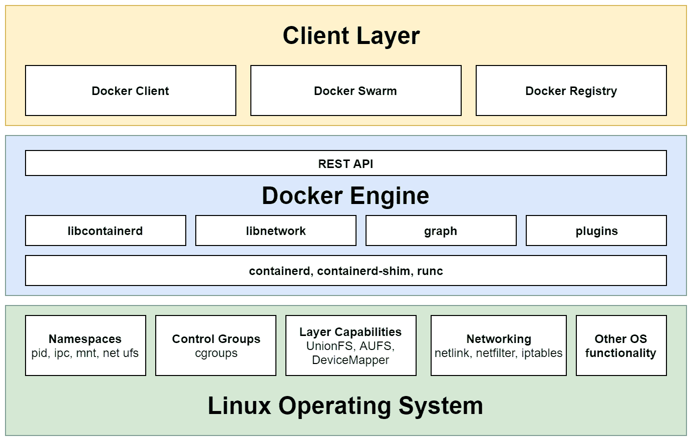
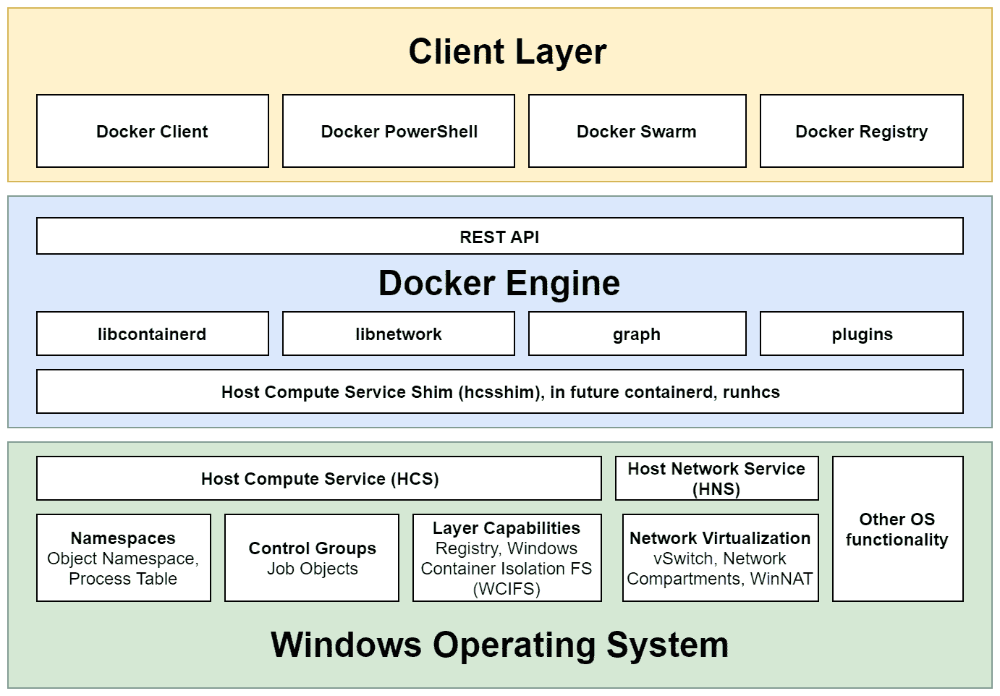
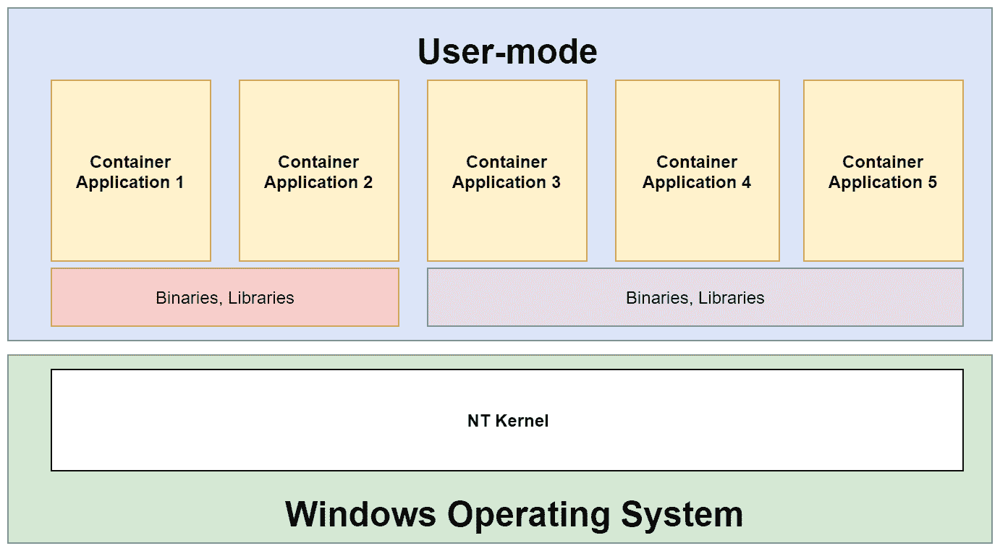
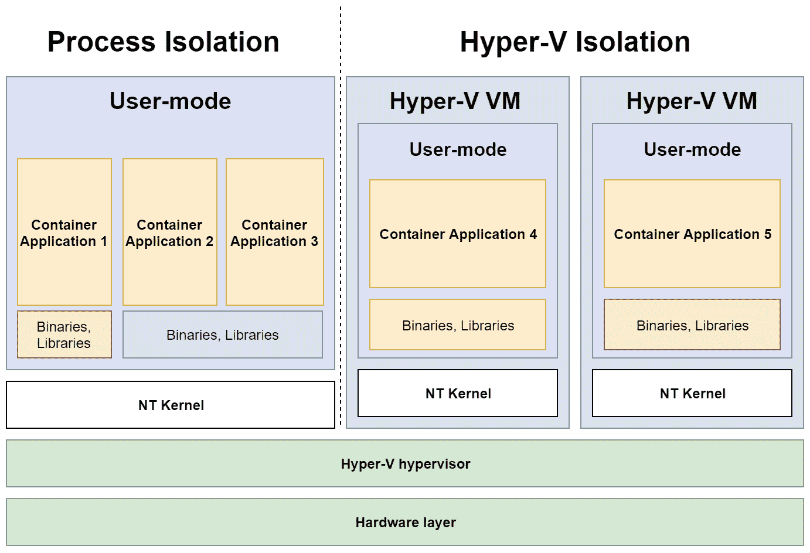
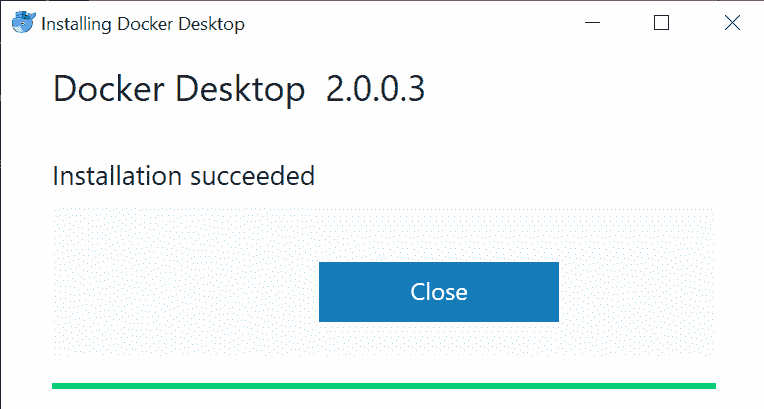
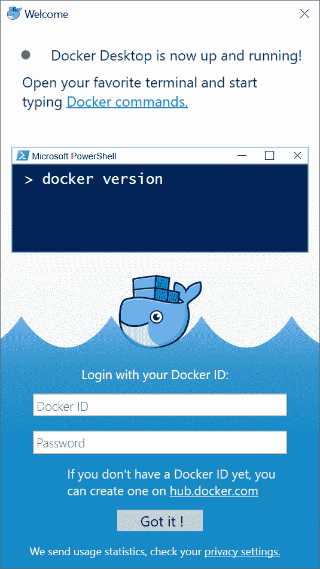
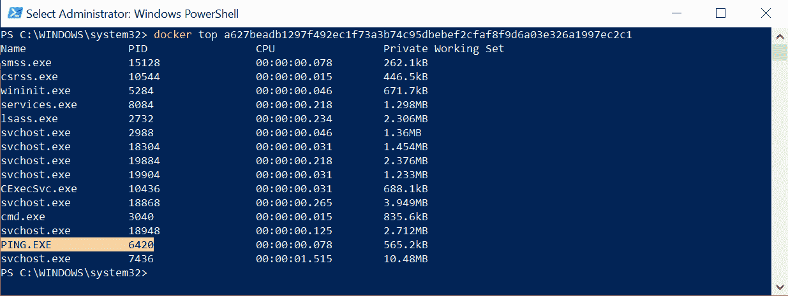
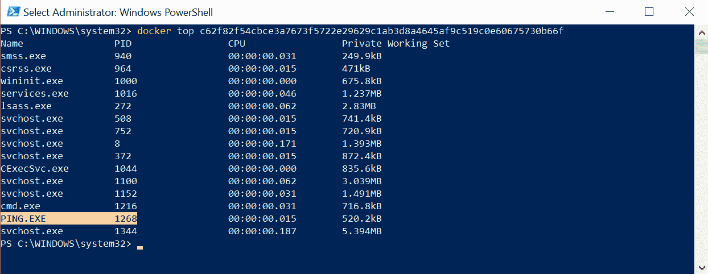
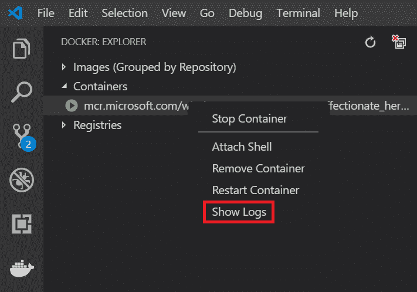

# 一、创建容器

*容器*和*操作系统级虚拟化*的概念源于 Unix V7 操作系统(OS)中的`chroot`系统调用，可追溯到 20 世纪 70 年代末。从简单的进程隔离概念和 *chroot 监狱*开始，其中进程运行在一个明显隔离的根目录中，容器化经历了快速发展，并随着 **Linux 容器** ( **LXC** )和 Docker 的出现成为 2010 年代的主流技术。2014 年，微软宣布在即将发布的 Windows Server 2016 中支持 Docker Engine。这就是 Windows 容器和 Windows 上的 Kubernetes 的故事开始的地方。

在本章中，我们将通过强调 Linux 和 Windows 上的容器化与 Windows 上的容器运行时类型(即 Windows Server Containers(或进程隔离)和 Hyper-V 隔离)之间的重要区别，让您更好地了解 Windows 操作系统的容器。我们还将学习如何为 Windows 10 开发场景安装 Docker Desktop，并创建我们在您的机器上运行的第一个示例容器。

本章将涵盖以下主题:

*   Linux 与 Windows 容器的对比
*   了解 Windows 容器变体
*   为 Windows 工具安装 Docker 桌面
*   建造你的第一个容器

# 技术要求

本章的要求如下:

*   **英特尔虚拟化技术** ( **英特尔 VT** )或 **AMD 虚拟化** ( **AMD-V** )技术特性在 BIOS 中启用
*   至少 4 GB 的内存
*   安装了 Windows 10 专业版、企业版或教育版(1903 版或更高版本，64 位)
*   Visual Studio 代码

有关在 Windows 上运行 Docker 和容器的硬件要求的更多信息，请参考[https://docs . Microsoft . com/en-us/virtual/Windows containers/deploy-containers/system-requirements](https://docs.microsoft.com/en-us/virtualization/windowscontainers/deploy-containers/system-requirements)。

支持从周年更新(版本 1607，内部版本 14393)开始的 Windows 10 版本，但是为了获得最佳体验，建议使用版本 1903，因为它具有所有必要的功能。有关 Windows 10 版本和容器运行时兼容性的更多详细信息，请参考[https://docs . Microsoft . com/en-us/virtualization/Windows containers/deploy-containers/version-compatibility](https://docs.microsoft.com/en-us/virtualization/windowscontainers/deploy-containers/version-compatibility)。

Visual Studio Code 可从官方网页免费下载，网址为:[https://code.visualstudio.com/](https://code.visualstudio.com/)。

您可以从本书的官方 GitHub 资源库下载本章的最新代码示例，网址为:[https://GitHub . com/PacktPublishing/hand-Kubernetes-On-Windows/tree/master/chapter 01](https://github.com/PacktPublishing/Hands-On-Kubernetes-on-Windows/tree/master/Chapter01)。

# Linux 与 Windows 容器的对比

Linux 和 Windows 上的容器化旨在实现相同的目标——创建与其他应用隔离的可预测的轻量级环境。对于 Linux，容器使用的一个经典例子可以是运行一个用 Flask 编写的 Python RESTful API，而不用担心其他应用所需的 Python 模块之间的冲突。类似地，对于 Windows，容器可以用来托管一个**互联网信息服务** ( **IIS** )网络服务器，该服务器与同一台机器上运行的其他工作负载完全隔离。

与传统的硬件虚拟化相比，容器化是以与主机操作系统紧密耦合为代价的，因为它使用相同的内核来提供多个隔离的用户空间。这意味着，如果没有传统硬件虚拟化技术的额外帮助，在 Linux 操作系统上运行 Windows 容器或在 Windows 操作系统上运行 Linux 容器是不可能的。

在本书中，我们将重点介绍 Docker 容器平台，这是在 Windows 上运行容器所必需的。现在，让我们总结一下 Docker Engine 在 Linux 和 Windows 上提供的容器化支持的当前状态，以及在开发和生产场景中可能的解决方案。

# Linux 上的 Docker 容器化

最初，Docker Engine 主要是为 Linux 操作系统开发的，它为 Docker 运行时提供了以下内核特性:

*   **内核命名空间**:这是容器的核心概念，使得创建隔离的流程工作空间成为可能。命名空间对内核资源(如网络堆栈、挂载点等)进行分区，这样每个进程工作区都可以访问自己的一组资源，并确保它们不会被其他工作区的进程访问。这确保了容器的隔离。
*   **控制组**:资源使用限制和隔离是容器化的次要核心概念。在 Linux 上，这个特性是由*cggroups*提供的，它支持资源限制(CPU 使用、RAM 使用等)和对一个进程或一组进程的资源的优先访问。
*   **层文件系统功能**:在 Linux 上， *UnionFS* 是 *union mount* 的众多实现之一，这是一种文件系统服务，允许来自不同文件系统的文件和目录统一到一个透明、一致的文件系统中。这个特性对于包含不可变层的 Docker 容器映像至关重要。在容器运行时，只读层与可写容器层透明地覆盖在一起。

Docker Engine 负责为容器提供基本运行时，抽象容器管理，并使用 REST API 向客户端层公开功能，如 Docker CLI。Linux 上 Docker 的架构可以用下图来概括:



从 Linux 操作系统的角度来看，容器运行时架构如下图所示。这种架构一般适用于 Linux 上的容器引擎，而不仅仅是 Docker:


接下来，我们将看看窗口上的 Docker 容器化。

# Windows 上的 Docker 容器化

2014 年，当微软在即将发布的 Windows Server 2016 中宣布支持 Docker Engine 时，Docker 容器引擎已经在 Linux 上成熟，并被证明是容器管理的行业标准。这一事实推动了 Docker 的设计决策和对 Windows 的容器化支持，最终获得了运行进程隔离的 Windows Server 容器的类似架构。Docker 引擎使用的 Windows 内核功能大致对应于以下内容:

*   **内核命名空间**:该功能由 Windows 内核中的对象命名空间和进程表等提供。
*   **控制组** : Windows 有自己的*作业对象*概念，允许一组流程作为一个单元进行管理。本质上，这个特性提供了与 Linux 上的*cggroups*相似的功能。
*   **层文件系统功能**:*视窗容器隔离文件系统*是一个文件系统驱动程序，为在视窗容器中执行的进程提供虚拟文件系统视图。这类似于 Linux 操作系统的 *UnionFS* 或 *union mount* 的其他实现。

在这些低级功能的基础上，由**主机计算服务** ( **HCS** )和**主机网络服务** ( **HNS** )组成的服务层抽象出一个公共接口，用于运行和管理带有 C#和 Go(HCS him)可用语言绑定的容器。有关当前容器平台工具的更多信息，请参考官方文档，网址为:[https://docs . Microsoft . com/en-us/virtual/windows containers/deploy-containers/container d # HCS](https://docs.microsoft.com/en-us/virtualization/windowscontainers/deploy-containers/containerd#hcs)。

重要的是要知道有两种类型的 Windows 容器:进程隔离的和 Hyper-V 隔离的。它们之间的区别将在下一节中解释——隔离是容器的运行时属性，一般来说，您可以期望它们表现相似，并且仅从安全性和兼容性的角度来看有所不同。

下图总结了 Windows 的容器化体系结构和 Docker 支持:



为了与 Linux 上容器化的高级架构进行比较，下图展示了 Windows 的多容器运行时架构。在这一点上，我们只考虑*进程隔离的 Windows Server 容器*，它与 Linux 上的容器非常相似，但是在下一节中，我们还将介绍 Windows 上容器的 *Hyper-V 隔离*的架构:



接下来，让我们看看 Linux 和 Windows 上的容器之间的一些区别。

# Linux 和 Windows 上容器的主要区别

Linux 和 Windows 上的 Docker 容器原则上旨在解决相同的问题，目前，容器管理体验正在这些平台上开始融合。然而，如果你来自 Linux 生态系统，并且在那里广泛使用了 Docker，你可能会对你能发现的一些差异感到惊讶。让我们简单总结一下。

最大和最明显的限制是 Windows 主机操作系统和 Windows 容器操作系统的兼容性要求。在 Linux 的情况下，您可以放心地假设，如果主机操作系统内核运行 3.10 的最低要求版本，任何 Linux 容器都将运行而没有任何问题，无论它基于哪个发行版。对于 Windows，可以运行基本操作系统版本与不受任何限制地支持的主机操作系统版本完全相同的容器。不支持在旧的主机操作系统上运行较新的容器操作系统版本，而且在新的主机操作系统上运行较旧的容器操作系统版本还需要使用 *Hyper-V 隔离*。例如，运行 Windows Server 版本 1803 build 17134 的主机可以本机使用基本映像版本为 Windows Server 版本 1803 build 17134 的容器，但是运行 Windows Server 版本 1709 build 16299 的容器将需要 Hyper-V 隔离，并且根本不可能用 Windows Server 2019 build 17763 启动容器。下表直观显示了这一原理:

| **主机操作系统版本** | **容器基础映像 OS 版本** | **兼容性** |
| 视窗服务器，版本 1803 构建 17134 | 视窗服务器，版本 1803 构建 17134 | *处理*或 *Hyper-V* 隔离 |
| 视窗服务器，版本 1803 构建 17134 | 视窗服务器，版本 1709 构建 16299 | *高电压*隔离 |
| 视窗服务器，版本 1803 构建 17134 | Windows Server 2019 版本 17763 | 不支持 |
| Windows Server 2019 版本 17763 | Windows Server 2019 版本 17763 | *过程*或 H *yper-V* 隔离 |

有关更详细的兼容性矩阵，请参考微软官方文档，网址为:[https://docs . Microsoft . com/en-us/virtualization/windows containers/deploy-containers/version-compatibility # choose-哪个容器-OS-version-to-use](https://docs.microsoft.com/en-us/virtualization/windowscontainers/deploy-containers/version-compatibility#choose-which-container-os-version-to-use) 。

值得一提的是，Hyper-V 隔离的要求在云环境中或在**虚拟机** ( **虚拟机**)上运行 Docker 时可能是一个明显的限制。在这种情况下，Hyper-V 隔离要求虚拟机管理程序启用嵌套虚拟化功能。我们将在下一节详细介绍 Hyper-V 隔离。

您可能注意到的另一个重要方面是 Linux 和 Windows 容器的基本映像之间的大小差异。目前，最小的 Windows Server 映像`mcr.microsoft.com/windows/nanoserver:1809`的大小为 98 MB，而例如，Alpine Linux 的最小映像`alpine:3.7`的大小仅为 5 MB。完整的 Windows Server 映像(`mcr.microsoft.com/windows/servercore:ltsc2019`)超过 1.5 GB，而 Windows 的基本映像(`mcr.microsoft.com/windows:1809`)为 3.5 GB。但值得一提的是，自 Windows Server 2016 Core 映像首次发布以来，当映像大小为 6 GB 时，这些数字不断下降。

这些差异更多的可以看作是 Windows 上 Docker 容器的局限性。然而，有一个方面 Windows 比 Linux 提供了更多的灵活性——支持在 Windows 上运行 Linux 容器。Windows 10 的 Docker 桌面支持这种开箱即用的场景。虽然这个功能还在开发中，但是在 Hyper-V 隔离的帮助下，可以在 Windows 10 上的 Windows 容器旁边托管 Linux 容器。我们将在下一节中更详细地介绍这个特性。相反的情况是，运行在 Linux 上的 Windows 容器没有本机解决方案，需要在 Linux 主机上手动托管额外的 Windows 虚拟机。

Windows Server also supports running Linux containers, providing that the **Linux Containers on Windows** (**LCOW**) experimental feature is enabled.

在下一节中，我们将重点关注不同 Windows 容器运行时变体之间的差异。

# 了解 Windows 容器变体

Windows 容器有两个不同的隔离级别:进程隔离和 Hyper-V。进程隔离也称为 **Windows 服务器容器** ( **WSC** )。最初，进程隔离仅在 Windows Server 操作系统上可用，而在 Windows 操作系统的桌面版本上，您可以使用 Hyper-V 隔离运行容器。从 Windows 10 开始，版本 1809(2018 年 10 月更新)和 Docker Engine 18.09.1，进程隔离也在 Windows 10 上可用。

In the official documentation, you may find the terms Windows container *types* and *runtimes*. They also refer to the isolation levels, and these terms are used interchangeably.

现在，让我们看看这些隔离级别是如何不同的，它们的用例是什么，以及如何通过指定所需的隔离类型来创建容器。

# 过程隔离

进程隔离容器，也称为 **WSC** ，是 Windows Server 上为容器提供的默认隔离模式。进程隔离的体系结构类似于在 Linux 操作系统上运行容器时的体系结构:

*   容器使用相同的共享内核。
*   使用进程表、对象命名空间和作业对象等特性在内核级别提供隔离。更多信息可以在*视窗码头容器化*部分找到。

下图总结了这一点:


进程隔离为容器提供了轻量级运行时(与 Hyper-V 隔离相比)，并提供了更高的部署密度、更好的性能和更低的启动时间。但是，在使用这种类型的隔离时，您应该考虑几点:

*   Docker 容器基础映像必须与容器主机操作系统的版本相匹配。例如，如果您运行的是 1903 版的 Windows 10，则只能运行使用了 1903 版 Windows 10 或 Windows Server 的基本映像的容器。这意味着您必须为正在发布的每个版本的 Windows 重建映像(只有主要的*功能更新*)。
*   这应该仅用于执行受信任的代码。为了执行不受信任的代码，建议使用 Hyper-V 隔离。

使用 Windows 10，1809 版和更高版本，可以对容器运行时使用进程隔离，前提是您运行的是适用于 Windows 2.0.1.0 *(Edge* 发行版通道)或更高版本的 Docker Desktop 和 Docker Engine 18.09.1+。对于 Windows 10，容器的默认隔离级别是 Hyper-V，为了使用进程隔离，必须在使用`--isolation=process`参数创建容器时明确指定:

```
docker run -d --isolation=process mcr.microsoft.com/windows/nanoserver:1903 cmd /c ping localhost -n 100
```

也可以使用`--exec-opt`参数将该选项指定为 Docker 守护程序的参数。更多详细信息，请参见官方 Docker 文档，网址为:[https://docs . Docker . com/engine/reference/command line/run/# specify-isolation-technology-for-container-isolation](https://docs.docker.com/engine/reference/commandline/run/#specify-isolation-technology-for-container---isolation)。

Using process-isolated containers on the Windows 10 OS is only recommended for development purposes. For production deployments, you should still consider using Windows Server for process-isolated containers.

# 超高压隔离

Hyper-V 隔离是 Windows 容器可用的第二种隔离类型。在这种类型的隔离中，每个容器都在一个专用的最小 Hyper-V 虚拟机中运行，可以简单总结如下:

*   容器不与主机操作系统共享内核。每个容器都有自己的 Windows 内核。
*   隔离是在虚拟机管理程序级别提供的(需要安装 Hyper-V 角色)。
*   主机操作系统版本和容器基础操作系统版本之间没有兼容性限制。
*   对于不可信代码的执行和多租户部署，建议这样做，因为这样可以提供更好的安全性和隔离性。

Hyper-V 隔离架构的详细信息见下图:



选择隔离级别时，您必须考虑这种隔离的成本:

*   与进程隔离相比，Hyper-V 隔离涉及虚拟化开销、更高的内存和 CPU 使用占用，但仍比使用 Windows Nano Server 运行完整虚拟机提供更好的性能。您可以在下表中检查运行具有不同隔离级别的容器的内存需求。
*   与进程隔离相比，容器加速时间更慢。
*   当用于虚拟机上运行的容器时，需要嵌套虚拟化。这可能是某些虚拟机管理程序和云部署的限制。下表显示了 Windows Server 1709 容器的内存需求:

| **容器基础映像** | **过程隔离(WSC)** | **高电压隔离** |
| 纳米服务器 | 30 MB | 110 MB + 1 GB 分页档 |
| 服务器核心 | 45 兆字节 | 360 MB + 1 GB 分页档 |

与进程隔离相比，容器映像保持不变；创建实际容器时，只需指定不同的隔离级别。您可以使用`--isolation=hyperv`参数来完成此操作:

```
docker run -d --isolation=hyperv mcr.microsoft.com/windows/nanoserver:1809 cmd /c ping localhost -n 100
```

请注意，在这种情况下，即使您运行的是 1903 版的 Windows 10，也可以不受任何限制地使用 1809 版的容器基础映像。

Hyper-V isolation is the default level of isolation when running containers on Windows 10, so the `--isolation=hyperv` parameter is not required. The opposite is also true; process isolation is the default level for Windows Server and if you want to use Hyper-V isolation, you have to specify it explicitly. The default isolation level can be changed in the `daemon.json` configuration file by specifying the `isolation `parameter in `exec-opts`. For more information, please refer to [https://docs.docker.com/engine/reference/commandline/dockerd/#daemon-configuration-file](https://docs.docker.com/engine/reference/commandline/dockerd/#daemon-configuration-file) and [https://docs.docker.com/engine/reference/commandline/dockerd/#docker-runtime-execution-options](https://docs.docker.com/engine/reference/commandline/dockerd/#docker-runtime-execution-options).

# Windows 上的 Linux 容器

2017 年 4 月，Docker 宣布推出 LinuxKit，这是一款用于在未搭载 Linux 内核的平台(即 Windows 和 macOS)上运行 Linux 容器的解决方案。LinuxKit 是一个工具包，用于构建可移植的轻量级 Linux 子系统，这些子系统只包含在给定平台上运行 Linux 容器的最低限度。虽然自 2016 年第一次发布以来，Docker 能够在一定程度上在 Windows 上运行 Linux 容器，但 LinuxKit 的发布是开启我们今天所知的 Windows 上的 **Linux 容器** ( **LCOW** )故事的里程碑。

Running Linux containers on Windows is not recommended for production deployments yet. Using LinuxKit and MobyLinuxVM is intended only for Desktop for Windows and development purposes. At the same time, the LCOW feature is still experimental and is not suitable for production.

# LinuxKit 和 MobyLinuxVM

Docker for Windows(这是当时 Docker Desktop for Windows 的最初名称)最终带来了一个基于名为 MobyLinuxVM 的 LinuxKit 的专用 Hyper-V 虚拟机。这个虚拟机的目的是为 Linux 容器提供一个最小的运行时，在技术上可以与 Windows 容器并行运行。

By default, Docker Desktop for Windows runs in Linux containers mode, which utilizes MobyLinuxVM. In order to switch to Windows containers mode, you have to navigate to the Docker Desktop tray icon and select Switch to Windows containers.... Docker will restart and switch to native Windows containers.

在这个解决方案中，MobyLinuxVM 运行自己的 Docker 守护程序，在技术上充当一个单独的容器主机，封装在虚拟机中。类似地，Windows 有自己的 Docker 守护程序，负责 Windows 容器，还提供 Docker 客户端(CLI)，它与两个 Docker 守护程序通信。这种架构可以在下图中看到:


现在，让我们来看看一种在 Windows 上运行 Linux 容器的更新方法:LinuxKit LCOW。

# LinuxKit LCOW 和 Hyper-V 隔离

与 MobyLinuxVM 方法相反，Windows 上的 **Linux 容器** ( **LCOW** )使用 Hyper-V 隔离容器来实现类似的结果。LCOW 适用于 Windows 10，它附带了适用于 Windows 17.10 的 Docker，适用于 Windows Server，版本 1709，它附带了 Docker 企业版的预览版。

与 MobyLinuxVM 相比，主要区别在于可以使用相同的 Docker Daemon 并行运行 Linux 和 Windows 容器。该解决方案是当前支持运行在 Windows 上的 Linux 容器的策略，但作为长期解决方案，2019 年 6 月，Docker 和微软开始合作，将用于 Linux 版本 2 的 Windows Subsystem 集成为 Windows 上的主要 Linux 容器运行时。最终，带有 Docker 桌面的 LinuxKit LCOW 和 MobyLinuxVM 都将退役。

下图显示了 LCOW:


为了在 Docker Desktop(18.02 或更高版本)中启用 LCOW 支持，您必须在 Docker 设置 *>* 守护程序中启用实验特性选项。创建 LCOW 容器需要指定`--platform linux`参数(如果平台选择明确，即映像只存在于 Linux 中，那么在较新版本的 Docker Desktop 中可以省略):

```
docker run -it --platform linux busybox /bin/sh
```

前面的命令将创建一个 busybox Linux 容器，并进入交互式 Bourne shell (sh)。

As of Docker Desktop for Windows 2.0.4.0, it is not possible to run the development Kubernetes cluster provided by Docker <q>("batteries included")</q> with the LCOW feature enabled.

在本节中，您学习了 Windows 平台目前如何支持容器，以及所提供的运行时之间的主要区别。现在，我们可以开始为 Windows 安装 **Docker 桌面了**。

# 为 Windows 工具安装 Docker 桌面

在 Windows 上为 Kubernetes 创建应用需要一个开发和测试 Docker 容器的环境。在本节中，您将学习如何为 Windows 安装 Docker Desktop，这是在 Windows 10 上开发、构建、运输和运行 Linux 和 Windows 容器的推荐工具环境。首先，在继续安装过程之前，让我们回顾一下先决条件和 Docker 的最低要求:

*   至少 4 GB 内存。
*   **英特尔虚拟化技术** ( **英特尔 VT** )或 **AMD 虚拟化** ( **AMD-V** )技术特性在 BIOS 中启用。请注意，如果您使用虚拟机作为开发机器，Windows Docker Desktop 不保证支持嵌套虚拟化。如果您想了解更多关于该场景的信息，请参考[https://docs . docker . com/docker-for-windows/疑难解答/# running-docker-desktop-for-windows-in-nested-virtual-scenarios](https://docs.docker.com/docker-for-windows/troubleshoot/#running-docker-desktop-for-windows-in-nested-virtualization-scenarios)。
*   安装了 Windows 10 专业版、企业版或教育版(1903 版或更高版本，64 位)。当前的 Docker Desktop 支持 1703 或更高版本，但是为了在浏览本书中的示例时获得最佳体验，建议您将其升级到 1903 或更高版本。您可以通过打开“开始”菜单，选择“设置”图标，然后导航到“系统”>“关于”来检查您的 Windows 版本。您将在 Windows 规范下找到必要的详细信息。

Docker Desktop for Windows is also known as Docker for Windows and Docker **Community Edition** (**CE**) for Windows. This is especially important if you are following older installation guides.

If you are interested in the installation of Docker Enterprise for Windows Server, please refer to [Chapter 7](07.html), *Deploying a Hybrid On-Premises Kubernetes Cluster*.

# 稳定通道和边缘通道

根据您的需求，可以从 Windows Docker Desktop 的两个发布渠道中进行选择:**稳定**和**边缘**。如果您同意以下内容，您应该考虑使用稳定频道:

*   您希望推荐的可靠平台能够处理容器。稳定渠道中的发布遵循 Docker 平台稳定发布的发布周期。您可以期待稳定频道的发行每季度进行一次。
*   您需要选择是否发送使用统计数据。

如果您同意以下内容，则应考虑使用边缘通道:

*   你想尽快得到实验特征。这可能是以一些不稳定性和缺陷为代价的。您可以期望 Edge 频道中的发行版每月执行一次。
*   您可以接受正在收集的使用统计数据。

现在，让我们继续安装本身。

# 装置

本节中描述的安装过程遵循 Docker 官方文档中的建议。让我们开始吧:

If you are using chocolatey to manage application packages on your Windows system, it is also possible to use the official trusted package for Docker Desktop, available from: [https://chocolatey.org/packages/docker-desktop.](https://chocolatey.org/packages/docker-desktop)

1.  要下载 Windows Docker Desktop，请导航至[https://hub . Docker . com/editions/community/Docker-ce-Desktop-Windows](https://hub.docker.com/editions/community/docker-ce-desktop-windows)。下载它需要注册服务。您也可以选择直接链接下载稳定频道版本([https://download . Docker . com/win/Stable/Docker % 20 for % 20 windows % 20 installer . exe](https://download.docker.com/win/stable/Docker%20for%20Windows%20Installer.exe))或边缘频道版本([https://download . Docker . com/win/Edge/Docker % 20 desktop % 20 installer . exe](https://download.docker.com/win/edge/Docker%20Desktop%20Installer.exe))。

Docker Desktop for Windows will automatically enable the Hyper-V role if needed and restart the machine. If you are a VirtualBox user or Docker Toolbox user, you will no longer be able to run VirtualBox VMs as Type-1 and Type-2 hypervisors cannot run side by side. You will be still able to access your existing VM images but will not be able to start the VMs. 

2.  导航到安装程序下载到的目录，并双击它。
3.  通过选择使用 Windows 容器而不是 Linux 容器选项，默认情况下启用 Windows 容器支持:


4.  继续安装:



5.  如果安装程序启用了 Hyper-V 角色，系统可能会提示您重新启动计算机。

6.  启动 Docker 桌面应用。
7.  等待直到 Docker 完全初始化。您将看到以下提示:



安装后，我们需要验证 Docker 是否安装正确，是否可以运行一个简单的 *hello world* 容器镜像。

# 验证安装

现在，让我们验证安装是否成功:

1.  通过打开 Powershell 并执行以下命令，确认 Docker 客户端工作正常:

```
docker version
```

2.  您应该会看到类似如下的输出:

```
Client: Docker Engine - Community
 Version: 18.09.2
 API version: 1.39
 Go version: go1.10.8
 Git commit: 6247962
 Built: Sun Feb 10 04:12:31 2019
 OS/Arch: windows/amd64
 Experimental: false

Server: Docker Engine - Community
 Engine:
 Version: 18.09.2
 API version: 1.39 (minimum version 1.12)
 Go version: go1.10.6
 Git commit: 6247962
 Built: Sun Feb 10 04:13:06 2019
 OS/Arch: linux/amd64
 Experimental: false
```

3.  运行基于官方 Powershell 映像的简单容器:

```
docker run -it --rm mcr.microsoft.com/powershell pwsh -c 'Write-Host "Hello, World!"'
```

4.  在该命令的第一次运行期间，将下载丢失的容器映像层。过一段时间，你会看到你好，世界！由 Powershell 写入控制台输出:


5.  恭喜你！您已经成功地为 Windows 安装了 Docker 桌面并运行了第一个容器。

在下一小节中，您将学习如何为容器启用进程隔离。

# 运行过程隔离的容器

在 Windows 10 上，为了运行进程隔离容器，必须在创建容器时明确指定`--isolation=process`参数。正如我们之前提到的，还需要指定与您的操作系统相匹配的容器映像版本。让我们开始吧:

1.  假设您正在运行 Windows 10，版本 **1903** ，让我们执行以下命令，该命令试图在分离(后台)模式下创建一个进程隔离的容器。运行 ping 命令，说明要发送到本地主机的回显请求数，即`100`:

```
docker run -d --rm --isolation=process mcr.microsoft.com/windows/nanoserver:1809 cmd /c ping localhost -n 100
```

mcr.microsoft.com/windows/nanoserver 映像的选定版本是 1809，与您的操作系统版本不匹配。因此，它将失败，并显示一条错误消息，通知您容器的基本映像操作系统版本与主机操作系统不匹配:


2.  现在，让我们执行一个类似的命令，但是现在指定容器基本映像的正确匹配版本(1903):

```
docker run -d --rm --isolation=process mcr.microsoft.com/windows/nanoserver:1903 cmd /c ping localhost -n 100
```

在这种情况下，容器已经成功启动，这可以通过使用`docker ps`命令来验证:


3.  现在，让我们看看进程隔离在实践中与 Hyper-V 隔离有何不同。我们将比较这两种隔离类型的主机操作系统中容器进程的可见性。

4.  首先，获取新创建的进程隔离容器的容器标识。该容器应该运行几分钟，因为它在终止并被自动删除之前对 localhost 执行了 100 次回显请求。在我们的例子中，容器 ID 是`a627beadb1297f492ec1f73a3b74c95dbebef2cfaf8f9d6a03e326a1997ec2c1`。使用`docker top <containerId>`命令，可以列出容器内运行的所有进程，包括它们的**进程标识** ( **进程标识**):

```
docker top a627beadb1297f492ec1f73a3b74c95dbebef2cfaf8f9d6a03e326a1997ec2c1
```

下面的屏幕截图显示了前面命令的输出:



在前面的截图中，`ping.exe`进程在容器内部的 PID 为`6420`。要列出在主机操作系统环境中运行的`ping.exe`进程，请使用 Powershell 中的`Get-Process` cmdlet:

```
Get-Process -Name ping
```

下面的屏幕截图显示了前面命令的输出:


前面的输出揭示了在容器内部运行的`ping.exe`进程从主机上也是可见的，并且具有完全相同的 PID: `6420`。

为了比较，我们将创建一个类似的容器，但是这次指定`--isolation=hyperv`参数，以便实施 Hyper-V 隔离。在 Windows 10 上，当运行默认 Docker 配置时，您可以完全省略`--isolation`参数，因为默认隔离级别是 Hyper-V。我们可以使用以下命令创建容器(使用与主机不同的基本映像操作系统版本):

```
docker run -d --rm --isolation=hyperv mcr.microsoft.com/windows/nanoserver:1809 cmd /c ping localhost -n 100
```

下面的屏幕截图显示了前面命令的输出:


容器已成功启动。这种情况下，容器 ID 为`c62f82f54cbce3a7673f5722e29629c1ab3d8a4645af9c519c0e60675730b66f`。检查容器内运行的流程发现`ping.exe`的 PID 为`1268`:



检查主机上运行的进程时，您会看到没有 PID 为`1268`的`ping.exe`进程(也没有 PID 为`1216`的`cmd.exe`进程，这是容器中的主要进程):


其原因是，在 Hyper-V 容器中运行的进程没有与主机共享内核，因为它们是在独立的轻量级 Hyper-V 虚拟机中执行的，并且它们自己的内核与容器基本映像操作系统版本相匹配。

现在，是时候使用 LCOW 在 Windows 上运行您的第一个 Linux 容器了！

# 运行 LCOW 容器

默认情况下，Windows Docker Desktop 使用 MobyLinuxVM 托管 Linux 容器，这为托管 Linux 容器提供了一个最小的、功能齐全的环境。这种方法仅用于开发和测试目的，因为它在 Windows Server 上不可用。Windows Server 目前对 LCOW 有实验性支持，也有可能在 Docker Desktop 中启用此功能。

要在 Docker Desktop 中启用 LCOW 支持，您必须在 Docker Daemon 中启用实验特性。让我们来看看:

1.  打开 Docker 桌面托盘图标并选择设置。
2.  导航到守护进程选项卡。

3.  启用实验功能复选框:


4.  应用更改。Docker 桌面将重新启动。

打开 PowerShell，通过向`docker run`提供`--platform=linux`参数，创建一个使用 Linux 作为基础映像的容器。在这个例子中，我们在交互模式下创建了一个 busybox 容器，并启动了一个 Bourne shell:

```
docker run --rm -it --platform=linux busybox /bin/sh
```

If the image exists in a version for one platform, it is not necessary to provide the `--platform` parameter. After downloading the image, it is also no longer necessary to specify the `--platform` parameter to run the container.

容器启动后，会出现 Bourne shell 提示(`/ #`)。现在，您可以通过使用`uname`命令来验证您确实在 Linux 容器中运行，该命令打印 Linux 内核信息:

```
uname -a
```

下面的屏幕截图显示了前面命令的输出:


在单独的 Powershell 窗口中，在不关闭容器中的 Bourne shell 的情况下，执行`docker inspect <containerId>`命令，以便使用 Hyper-V 隔离验证容器是否确实在使用 LCOW 运行:


在本节中，您学习了如何为 Windows 工具安装 Docker Desktop 以及如何验证其功能，包括在 Windows 上运行 Linux 容器。在下一节中，您将学习如何在 Visual Studio 代码的帮助下构建第一个 Windows 容器映像。

# 建造你的第一个容器

在前一节中，您已经学习了如何为 Windows 安装 Docker Desktop，以及如何运行简单的 Windows 和 Linux 容器。本节将演示如何使用`Dockerfile`构建自定义 Docker 映像，以及如何在运行的容器上执行最常见的操作，例如访问日志和在容器中执行`exec`。

A Dockerfile is a text file that contains all the commands that the user would execute in order to assemble a container image. As this book does not focus on Docker only, this section will be a short recap of common Docker operations. If you are interested in Dockerfiles themselves and building containers, please refer to the official documentation at: [https://docs.docker.com/engine/reference/builder/](https://docs.docker.com/engine/reference/builder/).

例如，我们将准备一个 Dockerfile，它创建一个微软 IIS 的 Windows 容器映像，托管一个演示 HTML 网页。为了演示操作原理，映像定义不会很复杂。

# 准备 Visual Studio 代码工作区

第一步是准备 Visual Studio 代码工作区。Visual Studio 代码要求您安装额外的扩展来管理 Docker。让我们开始吧:

1.  为此，按下*Ctrl*+*Shift*+*X*打开扩展视图。
2.  在扩展:市场中，搜索`docker`并安装微软官方 Docker 扩展:


All of the operations demonstrated in this section can be performed without Visual Studio Code, in any code/text editor and using the command line. Visual Studio Code is a useful, multi-platform IDE for developing and testing applications running in Docker containers.

安装完成后，Docker Explorer 将变为可用:


3.  您也可以在按下 *Ctrl* + *Shift* + P 并在搜索栏中键入`docker`后，从命令面板中利用新的面向 Docker 的命令:


4.  现在，通过使用 *Ctrl* + *K* 、 *Ctrl* + *O* 快捷方式或导航到文件|打开文件夹来初始化工作空间....

在下一小节中，我们将创建一个演示 HTML 网页，它将托管在 Windows 容器中。

# 创建一个示例网页

我们将通过创建一个极简的 HTML“你好，世界！”网页。这一步模拟了在没有任何容器化的情况下实现应用，是应用开发中常见的场景:您正在运行一个非容器化的应用，然后将其移动到 Docker 容器中。

You can also use the files from this book's GitHub repository to do this, available from: [https://github.com/PacktPublishing/Hands-On-Kubernetes-on-Windows/tree/master/Chapter01/01_docker-helloworld-iis](https://github.com/PacktPublishing/Hands-On-Kubernetes-on-Windows/tree/master/Chapter01/01_docker-helloworld-iis).

使用 *Ctrl* + *N* 快捷方式或导航到文件>新建文件，在工作区的 Visual Studio Code 中添加一个新文件。在新文件中使用以下示例 HTML 代码:

```
<!DOCTYPE html>
<html>
    <head>
        <title>Hello World!</title>
    </head>
    <body>
        <h1>Hello World from Windows container!</h1>
    </body>
</html>
```

将文件(使用 *Ctrl* + S)保存为工作区中的`index.html`。

让我们继续创建 Dockerfile 本身。

# 创建文档文件

由于我们将使用 IIS 在容器中托管网页，我们需要创建一个 **Dockerfile** ，它使用`mcr.microsoft.com/windows/servercore/iis`官方映像作为构建的基础映像。我们将使用带有`windowsservercore-1903`标签的 Docker 映像，以确保我们运行的版本与主机操作系统相匹配，并使使用进程隔离成为可能。

在您的工作区创建一个名为`Dockerfile`的新文件，包含以下内容:

```
FROM mcr.microsoft.com/windows/servercore/iis:windowsservercore-1903

RUN powershell -NoProfile -Command Remove-Item -Recurse C:\inetpub\wwwroot\*
WORKDIR /inetpub/wwwroot
COPY index.html .
```

Visual Studio Code gives you a lot of snippets while writing the Dockerfile, providing that you have named the file following the expected convention. You can also bring up the list of snippets by pressing *Ctrl* + SPACE while editing.

在下一小节中，您将学习如何基于刚刚创建的 Docker 文件手动构建 Docker 映像。

# 构建 Docker 映像

使用`docker build`命令构建 Docker 映像。执行此步骤时，您有两种选择:

*   使用 Visual Studio 代码的命令面板。
*   使用 Powershell 命令行。

在 Visual Studio 代码中，执行以下操作:

1.  使用*Ctrl*+*Shift*+*P*快捷方式打开命令面板。
2.  搜索 Docker:构建映像并通过提供以下格式的映像名称和标签来执行它(或使用基于目录名称的默认建议名称):

```
<image name>:<tag>
```

3.  如果您登录到自定义注册表或使用 Docker Hub，您还可以指定以下内容:

```
<registry or username>/<image name>:<tag>
```

The concepts of Docker Registry and the public Docker Hub will be covered in [Chapter 3](03.html), *Working with Container Images*.

在本例中，我们将使用以下映像名称和标签:`docker-helloworld-iis:latest`。

Visual Studio 代码命令相当于在 Powershell 中执行以下操作:

1.  将工作目录更改为包含`Dockerfile`的文件夹；例如:

```
cd c:\src\Hands-On-Kubernetes-on-Windows\Chapter01\docker-helloworld-iis
```

2.  在指定`-t`参数的同时执行`docker build`命令，以提供映像名称和标签，并使用当前目录`.`作为构建上下文:

```
docker build -t docker-helloworld-iis:latest .
```

下面的屏幕截图显示了前面命令的输出:


成功构建后，您可以使用`docker-helloworld-iis`本地映像创建新容器。我们将在下一小节中介绍这一点。

# 运行 Windows 容器

现在，让我们用示例网页创建一个进程隔离的 Windows 容器。在 Visual Studio Code 中，导航到命令面板(*Ctrl*+*Shift*+*P*)并找到 Docker: Run 命令。作为映像，选择`docker-helloworld-iis`。带有适当命令的终端将会打开。

这相当于在 Powershell 中执行`docker run`命令，如下所示(如果主机上的端口 *tcp/80* 已经在使用，请使用任何其他可用的端口):

```
docker run -d --rm --isolation=process -p 80:80 docker-helloworld-iis
```

成功启动容器后，在网页浏览器中导航至`http://localhost:80/`。您应该会看到以下输出:


接下来，我们将检查容器日志，这是调试容器问题最有用的工具之一。

# 检查容器日志

在容器中访问主进程的标准输出和标准错误日志对于调试容器化应用的问题至关重要。在使用 Kubernetes 时，这也是一个常见的场景，您可以使用 Kubernetes CLI 工具执行类似的操作。

微软官方 IIS Docker 映像的当前架构没有向`ServiceMonitor.exe`(容器中的主要进程)的`stdout`提供任何日志，因此我们将在之前使用的简单的`ping.exe`示例上演示这一点。运行以下容器以创建容器:

```
docker run -d --rm --isolation=process mcr.microsoft.com/windows/nanoserver:1903 cmd /c ping localhost -n 100
```

现在，在 Visual Studio Code 中，打开命令面板(*Ctrl*+*Shift*+*P*)并执行`Docker: Show Logs`命令，即可检查日志。选择容器名称后，日志将显示在终端中。或者，您可以使用 Docker Explorer 选项卡，展开容器列表，右键单击要检查的容器，然后选择显示日志:



这将在 Visual Studio Code 中打开一个终端，以便您可以从容器的`stdout`和`stderr`实例开始流式传输日志。

对于 PowerShell 命令行，您必须使用`docker logs`命令:

```
docker logs <containerId>
```

还值得注意的是，在调试场景中，您可能会发现`-f`和`--tail`参数很有用:

```
docker logs -f --tail=<number of lines> <containerId>
```

`-f`参数指示实时跟踪日志输出，而`--tail`参数可以仅显示输出中指定数量的最后一行。

除了检查容器日志，您通常还需要将`exec`放入正在运行的容器中。这将在下一小节中介绍。

# 执行到正在运行的容器中

在调试和测试场景中，经常需要在运行的容器中以特定的方式执行另一个进程。这对于在容器中创建外壳实例(对于 Windows，使用`cmd.exe`或`powershell.exe`，对于 Linux，使用`bash`或`sh`)以及交互式调试容器特别有用。这样的操作叫做将`exec`放入一个运行的容器中。

Visual Studio 代码通过 Docker 资源管理器启用此功能。在 Docker Explorer 选项卡中，找到要执行的容器，右键单击它，然后选择附加外壳:


By default, for Windows containers, this command will exec using the `powershell.exe` command. If you are running images based on Windows Nano Server, you will not be able to use `powershell.exe` and you'll have to use `cmd.exe` instead. To customize which command is used during Attach Shell, open Settings (*Ctrl* + *,*), search for docker, and customize the docker.attachShellCommand.windowsContainer setting.

在 Powershell 命令行中，等效的`docker exec`命令如下:

```
docker exec -it <containerId> powershell.exe
```

前面的命令在运行容器内创建了一个新的`powershell.exe`进程，该进程与连接的终端(参数`-it`)处于交互模式。如您所见，一个新的 Powershell 终端交互实例打开:


You can only exec into containers that have the main process running. If the container is exited, terminated, or placed in a paused state, it will **not** be possible to use the `exec` command.

让我们尝试检查容器工作目录中`index.html`的内容:

```
cat .\index.html
```

下面的屏幕截图显示了前面命令的输出:


这揭示了我们之前创建并添加到映像中的`index.html`文件的预期内容。

我们还可以检查托管`index.html`的应用池的 IIS 工作进程(`w3wp.exe`)。这是调试期间的常见情况，此时并非所有日志都可以通过容器输出日志直接获得:

```
cat ..\logs\LogFiles\W3SVC1\u_ex<current date>.log
```

下面的屏幕截图显示了前面命令的输出:


使用`docker exec`是容器工具箱中最强大的命令之一。如果您学会了如何使用它，您将能够调试您的应用，就像它们被托管在一个非容器化的环境中一样。

# 摘要

在本章中，您了解了 Windows 容器体系结构的关键方面，以及 Windows 容器运行时提供的隔离模式之间的差异。我们还介绍了如何为 Windows 安装 Docker Desktop，并演示了如何在 Windows 平台上使用 Docker CLI 执行最重要的操作。

这一章和接下来的两章将是本书其余部分中您将要学习的关于 Windows 上 Kubernetes 的内容的基础。在下一章中，我们将重点讨论在 Windows 容器中管理状态，即在运行容器时如何持久化数据。

# 问题

1.  为了实现容器化，Windows 公开了哪些内核特性？
2.  Linux 和 Windows 上容器化的主要区别是什么？
3.  Hyper-V 隔离和进程隔离有什么区别？什么时候应该使用 Hyper-V 隔离？
4.  我们如何在 Windows 10 上启用 LCOW？
5.  我们可以使用什么命令来访问 Docker 容器中主进程的日志？
6.  我们如何在运行的容器中启动一个新的 Powershell 进程？

你可以在本书的*评估*部分找到这些问题的答案。

# 进一步阅读

本章简要介绍了 Windows 上的 Docker 容器。有关 Windows 容器的更多信息，请参考两本优秀的 Packt 书籍:

*   *Windows 上的 Docker:从 101 到 Windows 上的 Docker 投入生产，在*[https://www . packtpub . com/virtual-and-cloud/Docker-Windows-第二版](https://www.packtpub.com/virtualization-and-cloud/docker-windows-second-edition)。
*   *学习视窗服务器容器，位于*T2。
*   你也可以在[上查看微软关于 Windows 容器的官方文档。](https://docs.microsoft.com/en-us/virtualization/windowscontainers/about/)