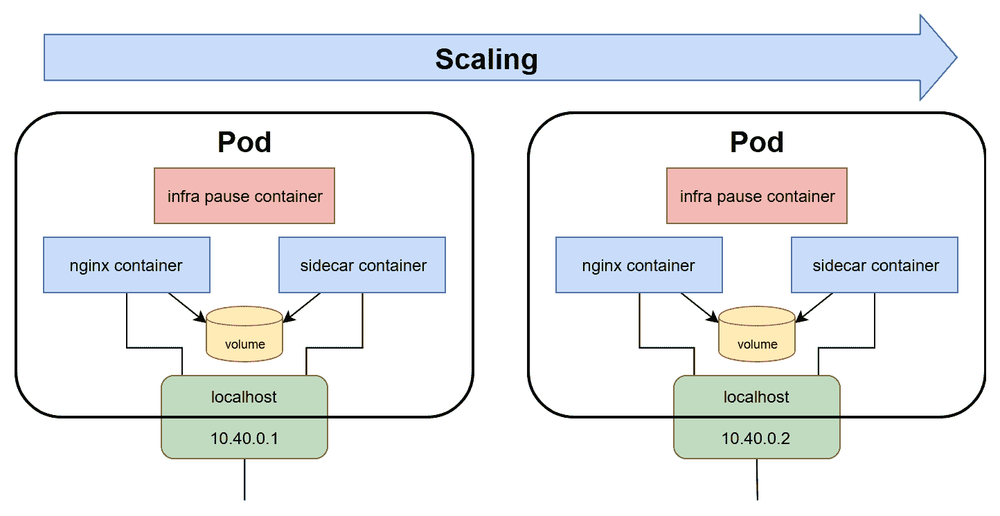
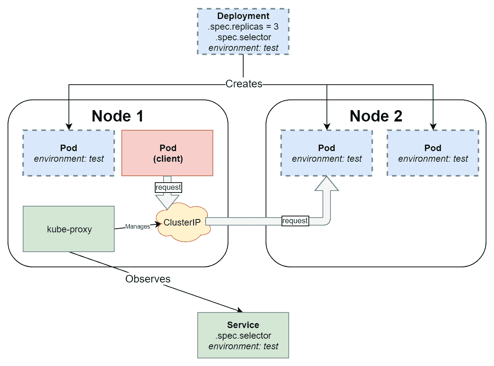
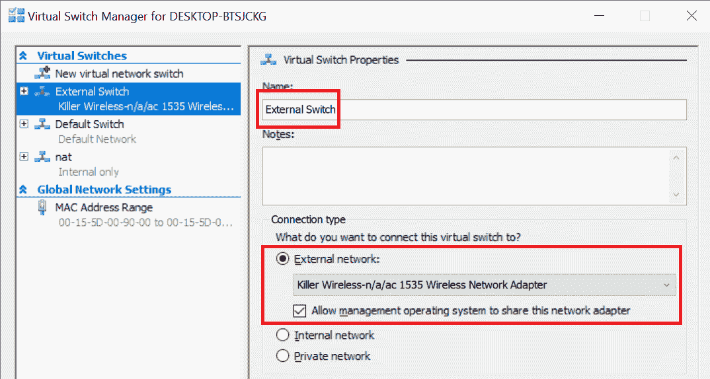
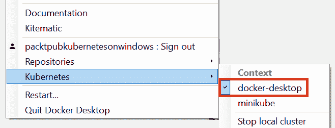

# 四、Kubernetes 概念和Windows支持

在前面的章节中，我们重点讨论了 Windows 平台上的容器化和 Docker 支持。这些概念主要局限于单机场景，其中应用只需要一个容器主机。对于生产级分布式容器系统，您必须考虑不同的方面，例如可伸缩性、高可用性和负载平衡，这总是需要编排在多个主机上运行的容器。

**容器** **流程编排**是在大型动态环境中管理容器生命周期的一种方式——它的范围从供应和部署容器到管理网络，提供容器的冗余和高可用性、自动扩展和缩减容器实例、自动运行状况检查和遥测数据收集。解决容器编排的问题并不简单——这就是为什么**Kubernetes**(简称 k8s，其中 8 表示省略字符的数量)诞生的原因。

Kubernetes 的故事可以追溯到 21 世纪初，博格系统是由谷歌内部开发的，用于大规模管理和调度作业。随后，在 2010 年代初，欧米茄集群管理系统在谷歌开发，作为博格的全新重写。虽然欧米茄仍然只在谷歌内部使用，但在 2014 年，Kubernetes 被宣布为开源容器编排解决方案，其根源来自博格和欧米茄。2015 年 7 月，Kubernetes 1.0 版本发布时，谷歌与 Linux 基金会合作成立**云原生计算基金会** ( **CNCF** )。该基金会旨在增强组织的能力，使其能够在现代动态环境(如公共云、私有云和混合云)中构建和运行可扩展的应用。四年后的 2019 年 4 月，Kubernetes 1.14 发布，为 Windows 节点和 Windows 容器提供生产级支持。这一章是关于Kubernetes目前在 Windows 方面的状态！

**Cloud-native application** is a commonly used term in container orchestration for applications that leverage containerization, cloud computing frameworks, and the loose coupling of components (microservices). But it doesn't necessarily mean that cloud-native applications must run in a cloud – they adhere to a set of principles that make them easy to be hosted on-premises or in the public/private cloud. If you are interested in learning more about CNCF, please refer to the official web page: [https://www.cncf.io/](https://www.cncf.io/).

在本章中，我们将涵盖以下主题:

*   Kubernetes 高级架构
*   永恒的物体
*   Windows 和 Kubernetes 生态系统
*   Windows 上的严格限制
*   从头开始创建自己的开发集群
*   生产集群部署策略
*   托管 Kubernetes 提供程序

# 技术要求

对于本章，您将需要以下内容:

*   安装了 Windows 10 专业版、企业版或教育版(1903 版或更高版本，64 位)
*   适用于 Windows 2.0.0.3 或更高版本的 Docker 桌面
*   Windows 的巧克力包管理器已安装([https://chocolatey.org/](https://chocolatey.org/))
*   已安装 Azure 命令行界面

如何为 Windows 安装 Docker Desktop 及其系统要求在[第 1 章](01.html) *【创建容器】*中进行了介绍。

使用巧克力包管理器不是强制性的，但它使安装和应用版本管理变得更加容易。安装过程记录在这里:[https://chocolatey.org/install](https://chocolatey.org/install)。

对于 Azure CLI，您可以在[第 2 章](02.html) *【管理容器中的状态】* *中找到详细的安装说明。*

要了解托管 Kubernetes 提供程序，您需要自己的 Azure 帐户，以便创建一个带有 Windows 节点的 AKS 实例。如果您还没有为本书的前几章创建帐户，您可以在这里阅读更多关于如何获得个人使用的有限免费帐户的信息:[https://azure.microsoft.com/en-us/free/](https://azure.microsoft.com/en-us/free/)。

您可以从本书的官方 GitHub 资源库下载本章的最新代码示例:[https://GitHub . com/PacktPublishing/hand-Kubernetes-On-Windows/tree/master/chapter 04](https://github.com/PacktPublishing/Hands-On-Kubernetes-on-Windows/tree/master/Chapter04)。

# Kubernetes 高级架构

在本节和下一节中，我们将重点关注 Kubernetes 高级架构及其核心组件。如果你已经熟悉了 Kubernetes，但是你想知道更多关于 Kubernetes 对 Windows 的支持，你可以跳到 *Windows 和 Kubernetes 生态系统*部分。

# 什么是 Kubernetes？

总的来说，Kubernetes 可以看作如下:

*   容器(微服务)编排系统
*   一种用于运行分布式应用的集群管理系统

作为容器编排者，Kubernetes 解决了大规模部署容器化云原生应用时出现的常见挑战。这包括以下内容:

*   在多个容器主机(节点)上调配和部署容器
*   服务发现和负载平衡网络流量
*   自动上下缩放容器实例
*   新容器映像版本的自动展开和回滚
*   根据资源(如中央处理器或内存)对容器进行自动优化装箱
*   应用监控、遥测收集和运行状况检查
*   编排和抽象存储(本地、内部或云)

同时，Kubernetes 也可以被描述为一个集群管理系统——主节点(或高可用性部署中的多个主节点)负责有效协调处理实际容器工作负载的多个工作节点。这些工作负载不仅限于 Docker 容器–Kubernetes 在工作节点上使用**容器运行时接口** ( **CRI** )来抽象容器运行时。最终，集群客户端(例如，DevOps 工程师)可以使用主服务器公开的 RESTful API 来管理集群。集群管理是使用声明性模型来执行的，这使得 Kubernetes 非常强大——您描述期望的状态，Kubernetes 执行所有繁重的工作，以便将集群的当前状态转换为期望的状态。

Imperative cluster management by using ad hoc commands is also possible but it is generally discouraged for production environments. The operations are performed directly on a live cluster and there is no history of previous configurations. In this book, we will use the declarative object configuration technique whenever possible. For a more detailed discussion regarding Kubernetes cluster management techniques, please refer to the official documentation: [https://kubernetes.io/docs/concepts/overview/working-with-objects/object-management/](https://kubernetes.io/docs/concepts/overview/working-with-objects/object-management/).

在下图中可以看到 Kubernetes 的高级架构。我们将在接下来的几个段落中详细介绍每个组件:


我们先来关注一下 Kubernetes 大师的角色，也被称为控制平面。

# 库比特大师-控制平面

在 Kubernetes 集群中，主节点(控制平面)由一组组件组成，这些组件负责关于集群的全局决策，例如调度和部署应用实例到工作节点，以及管理集群事件。此外，主节点公开了一个用于工作节点和管理客户端通信的应用编程接口。

主组件不限于在专用主机上运行；也可以让它们在工作节点上运行。主节点可以充当工作节点，就像 Kubernetes 集群中的任何节点一样。但是，一般来说，出于可靠性原因，不建议这样做——此外，对于生产环境，您应该考虑运行高可用性的 Kubernetes 设置，这需要多个主节点冗余地运行组件。

运行 Kubernetes 主服务的最大限制之一是它们必须托管在 Linux 机器上。不可能有带有主组件的 Windows 机器，这意味着即使您计划只运行 Windows 容器，您仍然需要 Linux 机器作为主组件。目前，还没有计划实现仅限于 Windows 的 Kubernetes 集群，尽管这可能会随着 Linux 2 的 Windows 子系统的发展而改变。

我们将简要介绍构成母版的组件。让我们首先来看看 Kubernetes API 服务器(或`kube-apiserver`，这是这个组件的二进制名称)。

# 多维数据集 apiserver

**Kubernetes API 服务器** ( **kube-apiserver** )是 Kubernetes 控制平面中的核心组件，充当客户端和集群组件之间所有交互的网关。其主要职责如下:

*   公开已经作为一组 RESTful 端点在 HTTPS 实现的集群 API。管理集群的客户端以及内部 Kubernetes 组件都使用该应用编程接口。Kubernetes 集群中的所有资源都被抽象为 Kubernetes API 对象。
*   将集群状态保存在`etcd`集群中–客户端执行的每个操作或集群组件报告的状态更新都必须通过应用编程接口服务器，并保存在集群存储中。
*   用户和服务帐户的身份验证和授权。
*   请求验证。
*   提供*观察*应用编程接口，使用增量通知源向订阅者(例如，其他集群组件)通知集群状态的变化。watch API 是使 Kubernetes 在本质上具有高度可扩展性和分布式的关键概念。

在高可用性 Kubernetes 部署中，`kube-apiserver`托管在多个主节点上，位于一个专用负载平衡器后面。

# etcd 集群

为了保持集群状态，Kubernetes 使用`etcd`——一种分布式的、可靠的键值存储，它利用 Raft 分布式一致性算法来提供顺序一致性。`etcd`集群是控制平面最重要的部分——这是整个集群的真理之源，包括集群的当前状态和期望状态。

一般来说，单节点`etcd`集群只推荐用于测试目的。对于生产场景，您应该始终考虑至少运行一个五成员集群(成员数量为奇数)，以便提供足够的容错能力。

When choosing an `etcd` cluster deployment topology, you can consider either a stacked etcd topology or an external etcd topology. A stacked etcd topology consists of one etcd member per Kubernetes master instance, whereas an external etcd topology utilizes an etcd cluster deployed separately from Kubernetes and is available via a load balancer. You can find out more about these topologies in the official documentation: [https://kubernetes.io/docs/setup/production-environment/tools/kubeadm/ha-topology/](https://kubernetes.io/docs/setup/production-environment/tools/kubeadm/ha-topology/).

由`etcd`公开的*手表*协议也是 Kubernetes 中手表 API 的核心功能，由`kube-apiserver`为其他组件提供。

# 多维数据集调度程序

**Kubernetes 调度器** ( **kube-scheduler** )组件的主要职责是调度容器工作负载(Kubernetes Pods)，并将它们分配给健康的工作节点，这些节点满足运行特定工作负载所需的标准。

A **Pod** is a group of one or more containers with a shared network and storage and is the smallest Deployment unit in the Kubernetes system. We will cover this Kubernetes object in the next section.

计划分两个阶段执行:

*   过滤
*   得分

在过滤阶段，`kube-scheduler`确定能够运行给定 Pod 的节点集。这包括检查节点的实际状态，并验证 Pod 定义指定的任何资源需求。此时，如果没有节点可以运行给定的 Pod，Pod 将无法计划并保持挂起状态。接下来，在评分步骤中，调度器基于一组策略为每个节点分配分数。然后，调度器将 Pod 分配给得分最高的节点。

您可以在官方文档中阅读更多关于可用策略的信息:[https://kubernetes . io/docs/concepts/scheduling/kube-scheduler/# kube-scheduler-implementation](https://kubernetes.io/docs/concepts/scheduling/kube-scheduler/#kube-scheduler-implementation)。

Kubernetes design offers a great deal of extensibility and possibility to replace components. Kube-scheduler is one of the components that's used to demonstrate this principle. Even if its internal business logic is complex (all efficient scheduling heuristics are rather complex...), the scheduler only needs to watch for *unassigned* Pods, determine the best node for them, and inform the API Server about the assignment. You can check out an example implementation of a custom scheduler here: [https://banzaicloud.com/blog/k8s-custom-scheduler/](https://banzaicloud.com/blog/k8s-custom-scheduler/).

现在，我们来看看`kube-controller-manager`。

# kube-控制器-管理器

**Kubernetes 控制器管理器**(**kube-控制器-管理器**)是负责运行集群中核心协调和控制循环的组件。控制器管理器由一组独立运行的独立专用控制器组成。控制器的主要目的是观察应用编程接口服务器暴露的*当前*和*期望的*集群状态，以及试图将*当前*状态转换为*期望的*状态的命令更改。

以`kube-controller-manager`二进制形式发货的最重要的控制器如下:

*   **节点** **控制器(正式名称为节点生命周期)**:观察节点状态，当节点不可用时做出反应。
*   **复制集控制器(replicaset)** :这负责确保每个复制集 API 对象的正确数量的 Pods 正在运行。
*   **部署控制器(deployment)** :负责管理关联的 ReplicaSet API 对象，并执行转出和回退。
*   **端点控制器(端点)**:管理端点 API 对象。
*   **服务帐户控制器(Service Account)和令牌控制器(serviceaccount-token)** :负责为新命名空间创建默认帐户和访问令牌。

你可以把 kube-controller-manager 想象成一个 Kubernetes 大脑，它确保集群的*当前*状态向*期望的*集群状态移动。

# 云控制器管理器

**Kubernetes云控制器管理器** ( **云控制器管理器**)最初是`kube-controller-manager`的一部分，提供特定于云的控制回路。云控制器管理器分离的原因是为了允许云特定的连接器(提供者)代码更容易进化，在大多数情况下，它以不同于核心 Kubernetes 代码的节奏发布。

As of Kubernetes 1.17, cloud-controller-manager is still in its beta stage. You can check the current status of the feature in the official documentation: [https://kubernetes.io/docs/tasks/administer-cluster/running-cloud-controller](https://kubernetes.io/docs/tasks/administer-cluster/running-cloud-controller).

启用云控制器管理器时，必须禁用 kube 控制器管理器中的云特定控制环路。然后，以下控制器将取决于云提供商的实施:

*   **节点控制器**:提供者用于确定一个节点的状态，检测该节点是否被删除。
*   **路由控制器**:需要提供商设置网络路由。
*   **服务控制器**:通过提供商管理负载平衡器。
*   五**卷控制器**:使用提供程序管理存储卷。

作为 kubernetes 的一部分提供的外部云提供商的列表不断演变，可以在官方文档([https://Kubernetes . io/docs/concepts/cluster-administration/cloud-providers/](https://kubernetes.io/docs/concepts/cluster-administration/cloud-providers/))和 Kubernetes 的组织 GitHub 页面([https://github.com/kubernetes?q=cloud-provider-&type =&language =](https://github.com/kubernetes?q=cloud-provider-&type=&language=))中查看。

# Kubernetes 节点–数据平面

在 Kubernetes 集群中，数据平面由负责运行由主节点调度的容器工作负载的节点(以前称为*从属节点*)组成。节点可以是物理裸机或虚拟机，这在设计集群时提供了灵活性。

下图总结了构成 Kubernetes 节点的体系结构和组件:


在 Windows 支持方面，所有节点组件都可以在 Windows 和 Linux 机器上运行。这意味着 Windows Kubernetes 节点对主节点来说是可见的，就像 Linux 节点一样，从这个角度来看，它们只是在它们能够支持的容器类型上有所不同。

Kubernetes 节点的主要组件如下:

*   **kubelet** :主 Kubernetes 代理，它确保容器工作负载(Pods)在节点上执行。
*   **容器运行时**:负责管理容器的软件。它由**容器运行时接口** ( **CRI** )抽象而来。
*   **kube-proxy** :负责管理本地节点网络的网络代理。

先来看看`kubelet`。

# KubernetesKubernetesKubernetesKubernetesKubernetesKubernetesKubernetesKubernetesKubernetesKubernetesKubernetesKubernetesKubernetesKubernetesKubernetesKubernetes

在集群中的每个节点上运行，`kubelet`是一个服务，负责确保由控制平面分配的容器工作负载(Pods)得到执行。此外，它还负责以下事项:

*   向应用编程接口服务器报告节点和POD状态
*   报告资源利用率
*   执行节点注册过程(将新节点加入集群时)
*   执行活动和就绪探测(运行状况检查)并向应用编程接口服务器报告它们的状态

为了执行实际的容器相关操作，kubelet 使用了一个容器运行时。

# 容器运行时

Kubelet 并不直接与 Docker 耦合——事实上，正如我们在本节介绍中提到的，Docker 并不是 Kubernetes 支持的唯一**容器运行时**。为了执行与容器相关的任务，例如，拉一个映像或创建一个新的容器，kubelet 使用了**容器运行时接口** ( **CRI** )，这是一个插件接口，为不同的运行时抽象所有常见的容器操作。

The actual definition of the Container Runtime Interface is a protobuf API specification, which can be found in the official repository: [https://github.com/kubernetes/cri-api/](https://github.com/kubernetes/cri-api/). Any container runtime that implements this specification can be used to execute container workloads in Kubernetes.

目前，在 Linux 上有许多容器运行时可以与 Kubernetes 一起使用。最受欢迎的如下:

*   **Docker**:*传统的* Docker 运行时，由`dockershim`抽象而来，是`kubelet`的 CRI 实现。
*   **CRI-container der**:简而言之，`containerd`是 Docker 的一个组件，负责容器的管理。目前，CRI-containerd 是 Linux 上 Kubernetes 的推荐运行时。更多信息，请访问[https://containerd.io/](https://containerd.io/)。
*   **CRI-O** :遵循**开放容器倡议** ( **OCI** )规范的专用于 CRI 的容器运行时实现。更多信息，请访问[https://cri-o.io/](https://cri-o.io/)。
*   **gVisor** :与 Docker 和 container der 集成的 OCI 兼容的容器沙盒运行时。更多信息，请访问[https://gvisor.dev/](https://gvisor.dev/)。

dockershim 和 CRI-containerd 之间的区别可以在下图中看到:


CRI-containerd 运行时提供了一个简单得多的体系结构，守护程序和进程之间的通信更少，从而消除了传统的 Docker 引擎。该解决方案旨在提供一个精简的 Docker 运行时，为 Kubernetes 公开关键组件。

If you are interested in getting a more historical context regarding Docker and containerd separation, you can read the following article: [http://alexander.holbreich.org/docker-components-explained/](http://alexander.holbreich.org/docker-components-explained/).

对于 Windows，列表要短得多，目前包括 Docker(企业版 18.09+，也由 dockershim 抽象)和对 CRI-containerd 的传入支持。当稳定版本的 container d 1.3 发布并且 *runhcs shim* 得到完全支持时，这一功能有望实现。这也将带来对容器 Hyper-V 隔离的新支持，目前(从 Kubernetes 1.17 开始)在实现时没有将 CRI-containerd 作为有限的实验特性。

# 多维数据集代理

在 Kubernetes 集群中，节点上的网络规则和路由由 kube 代理管理，在每个节点上运行。这些规则允许 Pods 和 Pods 的外部客户端之间的通信，并且是服务 API 对象的重要部分。在 Linux 平台上，kube-proxy 使用 iptables 配置规则(最常见)，而在 Windows 平台上，使用**主机网络服务** ( **HNS** )。

我们将在下一章更详细地介绍 Kubernetes 网络。

# 域名服务器(Domain Name Server)

内部 DNS 服务器是可选的，可以作为附加组件安装，但在标准部署中强烈推荐使用，因为它简化了服务发现和联网。目前，Kubernetes 使用的默认 DNS 服务器是 CoreDNS([https://coredns.io/](https://coredns.io/))。

Kubernetes 会自动将 DNS 服务器的内部静态 IP 地址添加到每个容器的域名解析配置中。这意味着运行在 Pods 中的进程只需知道它们的域名就可以与运行在集群中的服务和 Pods 进行通信，域名将被解析为实际的内部 IP 地址。下一节将介绍 Kubernetes 服务对象的概念。

现在，让我们来看看最常用的 Kubernetes 对象。

# 永恒的物体

Setting up a Kubernetes cluster with Windows nodes is complex and will be covered later in this book, and the principles will be demonstrated on Linux examples. From a Kubernetes API Server perspective, Windows and Linux nodes operate in almost the same way.

在 Kubernetes 集群中，集群状态由 kube-apiserver 组件管理，并保存在`etcd`集群中。状态被抽象并建模为一组 Kubernetes 对象——这些实体描述了应该运行什么容器化的应用，应该如何调度它们，以及关于重新启动或扩展它们的策略。如果您希望在 Kubernetes 集群中实现什么，那么您必须创建或更新 Kubernetes 对象。这种类型的模型被称为**声明模型**——你声明你的意图，Kubernetes负责将集群的当前状态改变为期望的(预期的)状态。声明性模型和维护所需状态的思想是 Kubernetes 如此强大和易于使用的原因。

In this book, we will follow the convention from the official documentation, where objects are capitalized; for example, Pod or Service.

每个Kubernetes物体的解剖结构完全相同；它有两个字段:

*   **规格**:这定义了对象的*期望状态*。这是您在创建或更新对象时定义需求的地方。
*   **状态**:由Kubernetes提供，描述对象的*当前状态*。

使用 Kubernetes 对象总是需要使用 Kubernetes API。最常见的是，您将使用 Kubernetes 的**命令行界面** ( **CLI** )来管理 Kubernetes 对象，该界面以`kubectl`二进制形式出现。也可以直接使用客户端库与 Kubernetes API 进行交互。

The installation of `kubectl` and examples of its usage will be covered in [Chapter 6](06.html), *Interacting with Kubernetes Clusters*.

现在，让我们快速了解一下示例 Kubernetes 对象是如何构造的。当直接与 Kubernetes API 交互时，必须以 JSON 格式指定对象。但是，`kubectl`允许我们使用 YAML 清单文件，当您执行操作时，这些文件会被翻译成 JSON。通常建议使用 YAML 清单文件，您可以期望在文档中找到的大多数示例都遵循这一约定。作为一个例子，我们将使用一个 Pod 的定义，它由一个 nginx web 服务器 Linux 容器组成，存储在一个名为`nginx.yaml`的文件中:

```
apiVersion: v1
kind: Pod
metadata:
  name: nginx-pod-example
  labels:
    app: nginx-host
spec:
  containers:
  - name: nginx
    image: nginx:1.17
    ports:
    - containerPort: 80
```

清单文件中所需的部分如下:

*   `apiVersion`:用于此对象的Kubernetes应用编程接口版本。
*   `kind`:Kubernetes物体的类型。在这种情况下，这是`Pod`。
*   `metadata`:对象的附加元数据。
*   `spec`:对象规格。在示例规范中，nginx 容器使用`nginx:1.17` Docker 映像并暴露端口`80`。该规范对于每个Kubernetes对象是不同的，并且必须遵循应用编程接口文档。比如对于 Pod，可以在这里找到 API 引用:[https://kubernetes . io/docs/reference/generated/kubernetes-API/v 1.17/# Podbspec-v1-core](https://kubernetes.io/docs/reference/generated/kubernetes-api/v1.17/#podspec-v1-core)。

创建 Pod 现在就像运行以下`kubectl apply`命令一样简单:

```
kubectl apply -f nginx.yaml
```

如果您想在没有本地 Kubernetes 集群的情况下尝试这个命令，我们建议在 Kubernetes 操场上使用一个；例如[https://www.katacoda.com/courses/kubernetes/playground](https://www.katacoda.com/courses/kubernetes/playground):

1.  在主窗口中，运行以下`kubectl`命令，该命令将应用托管在 GitHub 上的清单文件:

```
kubectl apply -f https://raw.githubusercontent.com/PacktPublishing/Hands-On-Kubernetes-on-Windows/master/Chapter04/01_pod-example/nginx.yaml
```

2.  几秒钟后，将创建 Pod，其`STATUS`应为`Running`:

```
master $ kubectl get pod -o wide
NAME                READY   STATUS    RESTARTS   AGE   IP          NODE     NOMINATED NODE   READINESS GATES
nginx-pod-example   1/1     Running   0          15s   10.40.0.1   node01   <none>           <none>
```

3.  使用主窗口中的`curl`命令获取 Pod 的 IP(在本例中为`10.40.0.1`)以验证容器是否确实正在运行。您应该会看到默认 nginx 网页的原始内容:

```
curl http://10.40.0.1:80
```

`kubectl` currently offers two declarative approaches for managing Kubernetes objects: manifest files and kustomization files. Using the kustomize approach is much more powerful as it organizes manifest files and configuration generation in a predictable structure. You can learn more about kustomize here: [https://github.com/kubernetes-sigs/kustomize/tree/master/docs](https://github.com/kubernetes-sigs/kustomize/tree/master/docs).

现在，让我们仔细看看 Pod API 对象。

# PODS

Kubernetes 使用 Pods 作为其基本的原子单元进行部署和扩展，并表示在集群中运行的进程-类似于微软 Hyper-V，它是一台虚拟机，您可以将其作为原子单元部署在 Hyper-V 集群中。Kubernetes Pod 由一个或多个容器组成，这些容器共享内核命名空间、IPC、网络堆栈(您用相同的集群 IP 寻址它们，它们可以通过本地主机通信)和存储。要理解 Pods，知道名字的由来就好了:在英语中，Pods 是一群鲸鱼，Docker 用鲸鱼作为它的标志——把鲸鱼想象成 Docker 的容器！

以最简单的形式，您可以创建单容器 Pod–这是我们在本节介绍中演示 nginx Pod 创建时所做的。对于某些场景，您可能需要多容器 Pods，其中主容器伴随着服务于多种目的的附加容器。让我们来看看其中的几个:

*   **Sidecar** **容器**，可执行各种*助手*操作，如日志收集、主容器数据同步等。
*   **适配器** **容器**，可以对主容器的输出进行归一化或数据监控，以便其他服务使用。
*   **大使** **容器**，代理主容器与外界的通信。
*   **初始化** **容器**，这是在 Pod 中的应用容器之前运行的专用容器。例如，他们可以设置环境，这不是在主容器映像中执行的。

Technically, even single-container Pods contain an extra infra container, which is often a pause image. It acts as a *parent* container for all containers in the pod and enables kernel namespaces sharing. If you are interested in more details regarding infra containers, please refer to this article: [https://www.ianlewis.org/en/almighty-pause-container](https://www.ianlewis.org/en/almighty-pause-container).

Pod 的概念可以在下图中看到:



使用 Pods 时，您应该记住几个注意事项:

*   Pod 的容器总是在一个节点上运行，一旦创建了 Pod，它总是绑定到一个节点。
*   您可以通过添加更多的容器来扩展应用，而不是在同一个容器中添加更多的容器。
*   一个POD被认为是“T0”准备好了“T1”，并且能够在“T2”所有的“T3”容器准备好时提供请求。容器的状态由探测器决定，例如活跃度和就绪探测器，可以在规范中定义。
*   豆荚是短暂的。他们被创造，他们死亡，新的被重新创造在他们的位置上(如果需要的话)。
*   当重新创建 Pod 时，它会收到一个新的集群 IP。这意味着您的应用设计永远不应该依赖静态 IP 分配，并假设 Pod 甚至可能在不同的节点上重新创建。

You will rarely create bare Pods independently, as we did in the introduction to the section. In most cases, they are managed through Deployments.

Pods 有一个有限的生命周期，如果里面的容器崩溃或退出，它们可能不会被自动重新创建，这取决于重启策略。要在集群中保持具有特定规格和元数据的所需数量的 Pods，您需要`ReplicaSet`对象。

# 复制集

Kubernetes 在 Pods 之上构建了许多强大的概念，这使得容器管理变得容易和可预测。最简单的是`ReplicaSet` API 对象(ReplicationController 的继承者)，它旨在维护固定数量的健康 Pods(副本)以满足特定条件。换句话说，如果你说*我想要三个 nginx Pods 在我的集群*中运行，ReplicaSet 会为你做。如果 Pod 被销毁，`ReplicaSet`将自动创建一个新的 Pod 副本，以恢复所需的状态。

让我们看一个示例复制集清单`nginx-replicaset.yaml`文件，它创建了 nginx Pod 的三个副本:

```
apiVersion: apps/v1
kind: ReplicaSet
metadata:
  name: nginx-replicaset-example
spec:
  replicas: 3
  selector:
    matchLabels:
      environment: test
  template:
    metadata:
      labels:
        environment: test
    spec:
      containers:
      - name: nginx
        image: nginx:1.17
        ports:
        - containerPort: 80
```

`ReplicaSet`规范有三个主要组成部分:

*   `replicas`:定义应该使用给定的`template`和匹配的`selector`运行的 Pod 副本的数量。可以创建或删除 Pods，以保持所需的数量。
*   `selector`:标签选择器，定义如何识别复制器集将要获取的 Pods。请注意，这可能会导致`ReplicaSet`获得现有的裸荚！
*   `template`:定义 Pod 创建的模板。元数据中使用的标签必须与`selector`完全匹配。

您可以以类似于我们在卡塔科达游乐场应用POD的方式应用`ReplicaSet`清单:

```
kubectl apply -f https://raw.githubusercontent.com/PacktPublishing/Hands-On-Kubernetes-on-Windows/master/Chapter04/02_replicaset-example/nginx-replicaset.yaml
```

您可以使用以下命令观察如何创建三个 Pod 副本:

```
kubectl get pod -o wide -w
```

复制集通过将自己分配给豆荚的`.metadata.ownerReferences`属性来标记新创建或获得的豆荚(如果您好奇，可以使用`kubectl get pod <podId> -o yaml`命令进行检查)。这意味着，如果你创建完全相同的副本集，具有完全相同的选择器，但是具有不同的名称，例如`nginx-replicaset-example2`，它们将不会*从对方那里窃取*豆荚。但是，如果您已经创建了带有匹配标签的裸 Pods，如`environment: test`，复制集将获取它们，如果复制数量过高，甚至可能会删除 Pods！

If you really need to create a single Pod in Kubernetes cluster, it is a much better idea to use a `ReplicaSet` with the `replicas` field set to 1, which will act as a container *supervisor*. In this manner, you will prevent the creation of bare Pods without owners that are tied to the original node only.

这可以在下图中看到:


通常，您不会自己创建副本集，因为它们无法轻松执行滚动更新或回滚到早期版本。为了促进这样的场景，Kubernetes 提供了建立在复制集之上的对象:部署和状态集。让我们先来看看部署。

# 部署

至此，您已经知道了 Pods 和 ReplicaSets 的用途。部署是 Kubernetes 对象，为 Pods 和 ReplicaSets 提供声明性更新。您可以通过使用它们以声明方式执行如下操作:

*   执行新副本集的*展示*。
*   更改 Pod 模板并执行受控卷展栏。旧的复制集将逐渐缩小，而新的复制集将以相同的速度扩大。
*   执行*回滚*到部署的早期版本。
*   放大或缩小副本集。

下图显示了部署与复制集和单元的关系:


You should **avoid** managing ReplicaSets created by a Deployment on your own. If you need to make any changes to the ReplicaSet, perform the changes on the owning Deployment Object.

请注意，*意外*获得由部署管理的副本集的问题不存在。原因是 Pods 和 ReplicaSets 使用了一个特殊的、自动生成的标签`pod-template-hash`，保证了选择的唯一性。

让我们看一下`nginx-deployment.yaml`文件中的部署清单示例:

```
apiVersion: apps/v1
kind: Deployment
metadata:
  name: nginx-deployment-example
spec:
  replicas: 3
  selector:
    matchLabels:
      environment: test
  template:
    metadata:
      labels:
        environment: test
    spec:
      containers:
      - name: nginx
        image: nginx:1.17
        ports:
        - containerPort: 80
```

如您所见，基本结构几乎与`ReplicaSet`相同，但是当您执行声明性更新时，部署的行为有很大的不同。让我们在操场上快速演示一下:

1.  手动创建部署清单文件或使用`wget`命令下载:

```
wget https://raw.githubusercontent.com/PacktPublishing/Hands-On-Kubernetes-on-Windows/master/Chapter04/03_deployment-example/nginx-deployment.yaml
```

2.  使用以下命令应用部署清单文件:

```
kubectl apply -f nginx-deployment.yaml --record
```

The `--record` flag adds a metadata annotation of `kubernetes.io/change-cause` to API objects that were created or modified by the preceding command. This feature allows you to easily track changes in your cluster.

3.  等待部署完全展开(您可以使用`kubectl get deployment -w`观察部署中准备就绪的 Pods 数量)。
4.  现在，更改 YAML 货单模板中的 Pod 规格；例如，将`.spec.template.spec.containers[0].image`更改为`nginx:1.**16**`，并再次应用部署清单。
5.  紧接着，使用以下命令观察卷展栏的进度:

```
master $ kubectl rollout status deployment nginx-deployment-example
Waiting for deployment "nginx-deployment-example" rollout to finish: 1 out of 3 new replicas have been updated...
Waiting for deployment "nginx-deployment-example" rollout to finish: 2 out of 3 new replicas have been updated...
Waiting for deployment "nginx-deployment-example" rollout to finish: 1 old replicas are pending termination...
deployment "nginx-deployment-example" successfully rolled out
```

The Spec of Deployment is much richer than ReplicaSet. You can check the official documentation for more details: [https://kubernetes.io/docs/concepts/workloads/controllers/deployment/#writing-a-deployment-spec](https://kubernetes.io/docs/concepts/workloads/controllers/deployment/#writing-a-deployment-spec). The official documentation contains multiple use cases of Deployments, all of which are described in detail: [https://kubernetes.io/docs/concepts/workloads/controllers/deployment/#use-case](https://kubernetes.io/docs/concepts/workloads/controllers/deployment/#use-case).

如您所见，对部署模板定义的声明性更新导致了新 Pod 副本的顺利推出。旧的复制集缩小了，同时，创建了一个新的复制集，带有新的 Pod 模板，并逐渐扩大。现在，您可以尝试对现有的裸副本集进行`image`更新来执行相同的操作，您会看到...实际上，什么都没发生。这是因为复制集只使用一个 Pod 模板来创建新的 Pod。此类更改不会更新或删除现有的 Pods。

A rollout is only triggered when the `.spec.template` for Deployment is changed. Other changes to the Deployment manifest will not trigger a rollout.

接下来，让我们看看一个类似于部署的概念:状态集合。

# 状态集

部署通常用于部署应用的无状态组件。对于有状态组件，Kubernetes 提供了另一个名为`StatefulSet`的 API 对象。该操作的原理与部署非常相似——它以声明的方式管理复制集和 Pods，并提供平滑的展开和回滚。然而，有一些关键的区别:

*   状态集合确保了 Pods 的确定性(粘性)ID，它由`<statefulSetName>-<ordinal>`组成。对于部署，您将拥有由`<deploymentName>-<randomHash>`组成的随机标识。
*   对于状态集，当扩展复制集时，Pods 以特定的、可预测的顺序启动和终止。
*   在存储方面，Kubernetes 为状态集合中的每个容器创建基于状态集合对象的`volumeClaimTemplates`的 PersistentVolumeClaims，并始终将其附加到具有相同标识的容器。对于部署，如果您选择使用`volumeClaimTemplates`，Kubernetes 将创建一个单独的 PersistentVolumeClaim，并将其附加到部署中的所有 Pods。
*   您需要创建一个无头服务对象，负责管理 Pods 的确定性网络标识(DNS 名称)。无头服务允许我们将服务后面的所有 Pod IPs 作为 DNS A 记录返回，而不是带有服务集群 IP 的单个 DNS A 记录。

statefulset 使用与 Deployments 相似的 Spec–您可以通过查看官方文档了解更多关于 statefulset 的信息:https://kubernetes . io/docs/concepts/workloads/controller/statefleset/。

# daemmonsets

DaemonSet 是另一个控制器支持的对象，类似于复制集，但目标是在集群中的每个节点上运行一个模板化的 Pod 复制(可选匹配选择器)。运行 DaemonSet 最常见的用例如下:

*   管理给定集群节点的监控遥测，例如，运行 Prometheus 节点导出器
*   在每个节点上运行日志收集守护程序，例如`fluentd`或`logstash`
*   运行故障排除 Pods，例如，节点问题检测器([https://github.com/kubernetes/node-problem-detector](https://github.com/kubernetes/node-problem-detector))

开箱即可在您的集群上运行的 DaemonSets 之一是`kube-proxy`。在 kubeadm 执行的标准集群部署中，`kube-proxy`作为 DaemonSet 分发到节点。你也可以在你的卡塔科达游乐场验证这一点:

```
master $ kubectl get daemonset --all-namespaces
NAMESPACE     NAME         DESIRED   CURRENT   READY   UP-TO-DATE   AVAILABLE   NODE SELECTOR   AGE
kube-system   kube-proxy   2         2         2       2            2           <none>          12m
kube-system   weave-net    2         2         2       2            2           <none>          12m
```

如果您想了解更多关于 DaemonSets 的信息，请参考官方文档:[https://kubernetes . io/docs/concepts/workloads/controller/daemmonset/](https://kubernetes.io/docs/concepts/workloads/controllers/daemonset/)。

# 服务

由复制集或部署创建的荚具有有限的生命周期。在某个时候，您可以期望它们被终止，并且具有新 IP 地址的新 Pod 副本将被创建来代替它们。那么，如果您有一个运行 web 服务器 Pods 的部署，该部署需要与作为另一个部署的一部分创建的 Pods 进行通信，例如后端 Pods，该怎么办？网络服务器 Pods 不能假设任何关于 IP 地址或后端 Pods 的域名，因为它们可能会随着时间的推移而改变。服务应用编程接口对象解决了这个问题，它为一组 Pods 提供了可靠的网络。

通常，服务以一组 Pods 为目标，这是由标签选择器决定的。最常见的场景是通过使用完全相同的标签选择器为现有部署公开服务。该服务负责提供可靠的域名和 IP 地址，以及监控选择器结果，并使用匹配 Pods 的当前 IP 地址更新关联的端点对象。

对于内部客户端(集群中的 Pods)，与服务背后的 Pods 的通信是透明的—它们使用服务的集群 IP 或 DNS 名称，流量被路由到其中一个目标 Pods。路由功能由 kube-proxy 提供，但重要的是要知道流量不是通过任何主组件路由的——kube-proxy 在操作系统内核级实现路由，并直接将其路由到适当的 Pod 的 IP 地址。最简单的形式是随机选择目的 Pod，但是有了 **IP 虚拟服务器** ( **IPVS** )代理模式，你可以有更复杂的策略，比如最少连接或者最短预期延迟。

Services can also expose Pods to external traffic.

服务如何工作的原理可以在下图中看到:



让我们展示一个 nginx 部署的示例服务:

1.  如果您在卡塔科达操场上没有正在运行的部署，您可以使用以下命令创建一个:

```
kubectl apply -f https://raw.githubusercontent.com/PacktPublishing/Hands-On-Kubernetes-on-Windows/master/Chapter04/03_deployment-example/nginx-deployment.yaml --record
```

2.  使用以下`kubectl expose`命令为部署公开服务:

```
kubectl expose deployment nginx-deployment-example
```

3.  这个命令是*命令*，应该避免使用*声明*清单。此命令相当于应用以下服务清单:

```
apiVersion: v1
kind: Service
metadata:
  name: nginx-deployment-example
spec:
  selector:
    environment: test
  type: ClusterIP
  ports:
  - port: 80
    protocol: TCP
    targetPort: 80
```

4.  现在，在服务暴露后，创建一个交互式`busybox` Pod 并启动伯恩外壳程序:

```
kubectl run --generator=run-pod/v1 -i --tty busybox --image=busybox --rm --restart=Never -- sh
```

5.  出现容器外壳提示时，下载 nginx Pods 提供的默认网页，同时使用`nginx-deployment-example`服务名作为 DNS 名:

```
wget http://nginx-deployment-example && cat index.html
```

You can also use a **Fully Qualified Domain Name** (**FQDN**), which is in the following form: `<serviceName>.<namespaceName>.svc.<clusterDomain>`. In this case, it is `nginx-deployment-example.default.svc.cluster.local`.

接下来，让我们快速了解一下在 Kubernetes 中提供存储的对象。

# 存储相关对象

在本书中，我们将只在需要时介绍 Kubernetes 存储，因为这是一个广泛而复杂的主题——事实上，存储和管理任何集群的有状态组件通常是最难解决的挑战。如果您对Kubernetes的存储细节感兴趣，请参考官方文档:[https://kubernetes.io/docs/concepts/storage/](https://kubernetes.io/docs/concepts/storage/)。

在 Docker 中，我们使用卷来使用卷插件在本地磁盘或远程/云存储上提供持久性。Docker 卷有一个独立于使用它们的容器的生命周期。在 Kubernetes 中，有一个类似的卷的概念，它与 Pod 紧密耦合，并且具有与 Pod 相同的生命周期。Kubernetes 中的 Volumes 最重要的方面是它们支持多个后备存储提供程序(类型)–这是由 Volume Plugins 以及最近的**容器存储接口** ( **CSI** )抽象出来的，后者是独立于 Kubernetes 核心开发的树外卷插件的接口。例如，您可以将亚马逊网络服务 EBS 卷或微软 Azure 文件中小企业共享作为 Pod 的卷，完整的卷类型列表如下:[https://kubernetes . io/docs/concepts/storage/volumes/#卷类型](https://kubernetes.io/docs/concepts/storage/volumes/#types-of-volumes)。

卷类型之一是**PersistentVolumeClaim**(**PVC**)**、**，旨在将 Pods 与实际存储分离。PersistentVolumeClaim 是一个应用编程接口对象，它对特定类型、类别或大小的存储请求进行建模，比如说*我想要 10 GB 的读/写一次固态硬盘存储*。为了满足这样的请求，需要一个**persistent volume**(**PV**)API Object，这是一个已经由集群的自动化过程提供的存储。PersistentVolume 类型也作为插件实现，与 Volumes 的方式类似。

现在，配置持久卷的整个过程可以是动态的——它需要创建一个**存储类** ( **供应链**)应用编程接口对象，并在定义物理卷时使用它。创建新的存储类时，您需要提供一个带有特定参数的**供应程序**(或插件)，使用给定供应链的每个聚氯乙烯将使用选定的供应程序自动创建一个光伏。

这些依赖关系可以在下图中看到:


当您想要部署一个装载了 PersistentVolume 的 Pod 时，事件的顺序如下:

1.  使用所需的置备程序创建存储集。
2.  创建一个使用 SC 的 PersistentVolumeClaim。
3.  PersistentVolume 是动态配置的。
4.  创建容器时，将聚氯乙烯安装为卷。

The idea of dynamically provisioned PersistentVolumes is complemented by the concept of StatefulSets. StatefulSets define volumeClaimTemplates, which can be used for the dynamic creation of the PersistentVolumeClaims of a given StorageClass. By doing this, the whole process of storage provisioning is fully dynamic – you just create a StatefulSet and the underlying storage objects are managed by the StatefulSet controller. You can find more details and examples here: [https://kubernetes.io/docs/concepts/workloads/controllers/statefulset/#stable-storage](https://kubernetes.io/docs/concepts/workloads/controllers/statefulset/#stable-storage).

Kubernetes 中的这种存储体系结构确保了工作负载的可移植性，这意味着您可以轻松地将部署和持久卷声明移动到不同的集群中。你所需要做的就是提供一个满足聚氯乙烯要求的存储系统。不需要对状态集或聚氯乙烯进行修改。

# Windows 和 Kubernetes 生态系统

最初，Kubernetes 是一个以 Linux 为中心的解决方案——这是因为主流容器化也源于 Linux 平台。2014 年，微软和 Windows 即将加入容器化世界——微软在即将发布的 Windows Server 2016 中宣布支持 Docker Engine。Kubernetes **特别兴趣小组** ( **SIG** ) Windows 于 2016 年 3 月启动，2018 年 1 月，Kubernetes 1.9 为 Windows Server Containers 提供 beta 版支持。这种支持最终在 2019 年 4 月 Kubernetes 1.14 发布时成熟到生产级别。

为什么 Windows 对 Kubernetes 的支持如此重要？Windows 在企业工作负载中占据主导地位，随着 Kubernetes 成为容器编排的事实标准，对 Windows 的支持带来了将绝大多数企业软件迁移到容器的可能性。开发人员和系统操作员现在可以利用相同的工具和管道来部署 Windows 和 Linux 工作负载，以类似的方式扩展它们，并有效地监控它们。从业务角度来看，与普通虚拟机相比，Windows 采用容器意味着更好的运营成本和更好的硬件利用率。

Kubernetes 中的 Windows 容器支持在不断发展，越来越多的限制被新功能所取代。一般来说，您需要记住两个要点:

*   目前，Windows 机器只能作为节点加入集群。在 Windows 上运行主组件没有可能性，也没有计划。运行 Linux 和 Windows 节点的集群被称为混合或异构。
*   您将需要最新稳定版本的 Kubernetes 和最新(或几乎最新)版本的 Windows Server 操作系统来享受所提供的全面支持。例如，对于 Kubernetes 1.17，您需要 Windows Server 1809(半年度渠道版本)或 Windows Server 2019(相同版本，但来自长期服务渠道)，尽管也支持最新的 Windows Server 1903。

目前，关于对Kubernetes的 Windows 支持的文档数量有限，但仍在增长。最好的资源如下:

*   官方 Kubernetes 文档:[https://Kubernetes . io/docs/setup/production-environment/windows/intro-windows-in-Kubernetes/](https://kubernetes.io/docs/setup/production-environment/windows/intro-windows-in-kubernetes/)。
*   官方 Windows 容器化和 Kubernetes 支持文档:[https://docs . Microsoft . com/en-us/virtual/Windows containers/Kubernetes/入门-kubernetes-windows](https://docs.microsoft.com/en-us/virtualization/windowscontainers/kubernetes/getting-started-kubernetes-windows) 。
*   适用于 Windows 的 Azure Kubernetes 引擎 How-Tos:[https://docs . Microsoft . com/en-us/azure/aks/Windows-container-CLI](https://docs.microsoft.com/en-us/azure/aks/windows-container-cli)。
*   SIG-Windows 会议笔记和录音:[https://github . com/kubernetes/community/tree/master/SIG-Windows](https://github.com/kubernetes/community/tree/master/sig-windows)。
*   Kubernetes 发行说明和变更日志(寻找 SIG-Windows 或与 Windows 相关的点):[https://github.com/kubernetes/kubernetes/releases](https://github.com/kubernetes/kubernetes/releases)。
*   用于 Windows 讨论的 Kubernetes 社区论坛:[https://discuss.kubernetes.io/c/general-discussions/windows](https://discuss.kubernetes.io/c/general-discussions/windows)。
*   SIG-Windows 的 Slack 通道(遇到问题真的可以在这里找到很多帮助！):[https://kubernetes.slack.com/messages/sig-windows](https://kubernetes.slack.com/messages/sig-windows)。

让我们来看看目前 Windows 对 Kubernetes 的支持情况以及 1.17 版本的限制。

# Windows 上的严格限制

随着 Kubernetes 的每个新版本的发布和 Windows Server 的新版本的到来，Windows Server 容器支持附带了一组不断变化的限制。一般来说，从 Kubernetes API Server 和 kubelet 的角度来看，在异构(混合)的 Linux/Windows Kubernetes 集群中，Windows 上的容器行为几乎与 Linux 容器相同。然而，细节上有一些关键的区别。首先，让我们看看一些高级的主要限制:

*   Windows 计算机只能作为工作节点加入集群。在 Windows 上运行主组件没有可能性，也没有计划。
*   Windows Server 1809 或 2019 是工作节点上操作系统的最低要求。您不能将 Windows 10 计算机用作节点。
*   容器运行时需要 Docker 企业版(基本版)18.09 或更高版本。Windows Server 操作系统无需额外付费即可获得企业版。
*   Windows Server 操作系统需经过许可([https://www . Microsoft . com/en-us/云平台/Windows-Server-定价](https://www.microsoft.com/en-us/cloud-platform/windows-server-pricing))。Windows 容器映像受微软软件补充许可证的约束。出于开发和评估目的，您还可以使用评估中心:[https://www . Microsoft . com/en-us/eval Center/eval-windows-server-2019](https://www.microsoft.com/en-us/evalcenter/evaluate-windows-server-2019)。
*   运行在 Kubernetes 上的 Windows Server 容器的 Hyper-V 隔离处于实验阶段(alpha)，当前的设计将被弃用，转而使用运行时的容器实现。在那个时候到来之前，进程隔离容器的兼容性规则适用——您必须运行带有与主机操作系统版本相匹配的基本操作系统映像的容器。你可以在[第一章](01.html)、*创造容器*中找到更多细节。
*   不支持 Windows 上的 **Linux 容器** ( **LCOW** )。
*   可能与您最相关的如下:为混合 Linux/Windows 集群设置本地 Kubernetes 开发环境很复杂，目前没有标准解决方案，如 Minikube 或 Docker Desktop for Windows，支持这样的配置。这意味着您需要内部部署的多节点集群或托管云产品来开发和评估您的场景。
*   Windows 节点加入过程不像 Linux 节点那样自动化。Kubeadm 将很快支持加入 Windows 节点的过程，但在此之前，您必须手动完成这项工作(借助 Powershell 脚本的一些帮助)。

对于容器工作负载/计算，一些限制如下:

*   Windows 节点不支持特权容器。这可能会带来一些其他限制，例如运行必须在特权模式下运行的 CSI 插件。
*   Windows 没有内存不足的进程杀手，目前，Pods 不能限制使用的内存。这对于进程隔离的容器来说是正确的，但是一旦容器 Hyper-V 隔离在 Kubernetes 上可用，就可以强制实施限制。
*   您需要指定适当的节点选择器，以防止例如 Linux DaemonSets 试图在 Windows 节点上运行。这在技术上不是一个限制，但是您应该知道您需要为您的部署控制这些选择器。

对于网络，一些限制如下:

*   Windows 节点的网络管理更加复杂，Windows 容器联网类似于虚拟机联网。
*   Windows 上支持的网络插件较少(CNI)。您需要选择一个适用于集群中的 Linux 和 Windows 节点的解决方案，例如，带有主机 gw 后端的法兰绒。
*   L2bridge、l2tunnel 或覆盖网络不支持 IPv6 堆栈。
*   针对 Windows 的 Kube 代理不支持 IPVS 和高级负载平衡策略。
*   从运行 Pod 的节点访问节点端口服务失败。
*   入口控制器可以在 Windows 上运行，但前提是它们支持 Windows 容器；例如*入口-发动机*。
*   不支持从集群内部用 ICMP 数据包 ping 外部网络主机。换句话说，当您使用 ping 测试 Pods 与外部世界的连接时，不要感到惊讶。可以用`curl`或者 Powershell `Invoke-WebRequest`代替。

对于存储，一些限制如下:

*   无法扩展装载的卷。
*   装载到 Pods 的秘密使用节点存储以明文形式写入。这可能会带来安全风险，您需要采取额外的措施来保护集群。
*   Windows 节点仅支持以下卷类型:
    *   FlexVolume （SMB， iSCSI）
    *   azureDisk
    *   azureFile
    *   gcePersistentDisk
    *   awsElasticBlockStore(从 1.16 开始)
    *   虚拟单圈卷(从 1.16 开始)

The following limitations concern Kubernetes 1.17\. Since the list of supported functionalities and current limitations changes, we advise that you check the official documentation for more up to date details: [https://kubernetes.io/docs/setup/production-environment/windows/intro-windows-in-kubernetes/#supported-functionality-and-limitations](https://kubernetes.io/docs/setup/production-environment/windows/intro-windows-in-kubernetes/#supported-functionality-and-limitations).

即使没有支持带有 Windows 节点的本地开发集群，我们还是来看看；对 Windows 工作负载的支持很可能会在不久的将来提供。

# 从头开始创建自己的开发集群

在本节中，您将学习如何设置本地 Kubernetes 集群，以便在 Windows 操作系统上进行开发和学习。我们将使用 minikube，这是官方推荐的工具集，以及用于 Windows Kubernetes 集群的 Docker Desktop。请注意，当前本地集群的工具*不支持*Windows容器，因为它需要一个带有 Linux 主节点和窗口服务器节点的多节点设置。换句话说，这些工具允许您在 Windows 机器上开发运行在 Linux 容器中的 Kubernetes 应用。基本上，它们提供了一个托管单节点 Kubernetes 集群的优化 Linux 虚拟机。

If you wish to experiment, you can use Katacoda Kubernetes playground ([https://www.katacoda.com/courses/kubernetes/playground](https://www.katacoda.com/courses/kubernetes/playground)), which was used to demonstrate Kubernetes objects in this chapter, or Play with Kubernetes ([https://labs.play-with-k8s.com/](https://labs.play-with-k8s.com/)), which is provided by Docker, Inc.

# 迷你库比

**Minikube** 在 Windows、Linux 和 macOS 上都有，旨在用 Kubernetes 为本地开发提供一个稳定的环境。Windows 的关键要求是需要安装虚拟机管理程序。对于 Docker Desktop for Windows 和 Windows 容器，我们已经使用了 Hyper-V，所以这将是我们在这里的选择。如果您尚未启用 Hyper-V，请按照[第 1 章](01.html)、*创建容器*中的安装 Docker Desktop 的说明进行操作，或者按照官方文档进行操作:[https://docs . Microsoft . com/en-us/virtual/Hyper-V on-Windows/快速启动/启用 hyper-v](https://docs.microsoft.com/en-us/virtualization/hyper-v-on-windows/quick-start/enable-hyper-v) 。

要安装 minikube，您需要执行以下步骤:

1.  如果您没有 Hyper-V 虚拟外部网络交换机，请通过从“开始”菜单打开 Hyper-V 管理器并单击虚拟交换机管理器来创建一个...从“操作”选项卡中。
2.  选择外部，然后单击创建虚拟交换机。
3.  使用外部交换机作为虚拟交换机的名称，并选择将用于连接到互联网的网络适配器；例如，您的无线网络适配器:



4.  单击“确定”接受更改。
5.  使用*巧克力*包管理器安装 kubectl (Kubernetes CLI)。在 Powershell 窗口中以管理员身份执行以下命令:

```
choco install kubernetes-cli
```

6.  以管理员身份使用巧克力安装 minikube:

```
choco install minikube
```

7.  将 Hyper-V 设置为 minikube 的默认虚拟化驱动程序:

```
minikube config set vm-driver hyperv
```

8.  默认情况下，将虚拟外部交换机设置为 minikube:

```
minikube config set hyperv-virtual-switch "External Switch"
```

9.  开始 minikube。这可能需要几分钟时间，因为必须设置虚拟机，并且需要初始化 Kubernetes 节点:

```
minikube start
```

If you need to debug issues on the actual minikube VM (for example, connection problems), you can use the `minikube ssh` command or connect to the terminal directly from Hyper-V manager. The login username is `docker` and the password is `tcuser`.

10.  通过运行`kubectl`命令验证安装是否成功，该命令将被配置为连接到 minikube 集群。您应该会看到各种各样的 Pods 在`kube-system`命名空间中运行:

```
kubectl get pods --all-namespaces
```

11.  您可以使用我们在本章中使用的任何示例 Kubernetes 对象，也可以创建自己的对象:

```
kubectl apply -f https://raw.githubusercontent.com/PacktPublishing/Hands-On-Kubernetes-on-Windows/master/Chapter04/03_deployment-example/nginx-deployment.yaml --record
```

12.  最终，您可以尝试在网络浏览器中使用 Kubernetes 仪表板。要初始化并打开仪表板，请运行以下命令:

```
minikube dashboard
```

现在，我们将了解另一种使用 Docker Desktop 进行本地开发的方法。

# 视窗桌面

对于 Windows 用户来说，使用 Docker Desktop for Windows 及其内置的本地 Kubernetes 集群是最简单的方法。如果您在需要代理连接到互联网的环境中工作，也建议您这样做，因为与 minikube 相比，这种设置是无缝的，也更容易。

如果您还没有为 Windows 安装 Docker Desktop，您应该按照[第 1 章](01.html)、*创建容器*中的说明进行操作。要启用本地 Kubernetes 集群，您需要执行以下步骤:

1.  确保您在 Linux 容器模式下运行。DockerDesktopVM 将负责托管 Kubernetes 集群。为此，打开 Windows Docker 桌面的托盘图标，然后单击切换到 Linux 容器....

2.  操作完成后，从托盘图标打开设置。
3.  打开永恒的部分。
4.  选中启用Kubernetes复选框，然后单击应用。
5.  安装过程需要几分钟才能完成。
6.  如果已经设置了 minikube，则需要**将上下文**切换到 kubectl。从命令行运行以下命令:

```
kubectl config use-context docker-desktop
```

7.  或者，您也可以从窗口托盘中的 Docker Desktop 切换上下文:



您将在[第 6 章](06.html)、*与Kubernetes集群*交互中了解更多关于库本特尔配置及其上下文的信息。

8.  现在，您可以开始使用本地 Kubernetes 集群进行黑客攻击。让我们部署 Kubernetes 仪表板:

```
kubectl apply -f https://raw.githubusercontent.com/kubernetes/dashboard/v1.10.1/src/deploy/recommended/kubernetes-dashboard.yaml
```

9.  等到所有POD都运行:

```
 kubectl get pods --all-namespaces --watch
```

10.  获取默认服务帐户令牌。从命令输出中复制`token:`值:

```
kubectl describe secret -n kube-system default
```

11.  为集群启用 kubectl 代理。当您访问仪表板时，此过程应该正在运行:

```
kubectl proxy
```

12.  导航到[http://localhost:8001/API/v1/namespace/kube-system/services/https:kubernetes-dashboard:/:proxy/#！/概述？命名空间=kube-system](http://localhost:8001/api/v1/namespaces/kube-system/services/https:kubernetes-dashboard:/proxy/#!/overview?namespace=kube-system) 。
13.  选择令牌，粘贴默认令牌，然后登录。

Alternative strategies for setting up a local development Kubernetes cluster with Windows containers support involve the automated setup of VMs on your local machine using, for example, vagrant. You can explore some of the small projects on GitHub that use this approach, but you should expect them to be outdated and no longer supported.

在下一节中，我们将简要概述我们可以为 Kubernetes 集群执行的生产集群部署策略，尤其是使用 Windows 节点。

# 生产集群部署策略

生产级集群的部署，甚至是带有 Windows 节点的集群的开发，都需要非常不同的方法。有三个重要问题决定了您部署 Kubernetes 集群的选项:

*   您是在云中部署集群，还是使用内部裸机或虚拟机？
*   是否需要**高可用性** ( **HA** )设置？
*   需要 Windows 容器支持吗？

让我们总结一下目前最流行的部署工具。

# 库比德姆

第一个是**kube dam**([https://github.com/kubernetes/kubeadm](https://github.com/kubernetes/kubeadm))，这是一个命令行工具，专注于以用户友好的方式启动和运行最小可行的安全集群。kubeadm 的一个方面是，它是一个只限于给定机器和 Kubernetes API 通信的工具，因此，总的来说，它旨在作为管理集群整体的其他自动化工具的构造块。其原理很简单:在主节点上使用`kubeadm init`命令，在工作节点上使用`kubeadm join`命令。kubeadm 的特点可以总结如下:

*   您可以在内部环境和云环境中部署集群。
*   支持高可用性集群，但从 1.17 版本开始，该功能仍处于测试阶段。
*   官方 Windows 支持目前计划在 1.18 版本中提供。当前版本的 kubeadm 是启动混合 Kubernetes 集群的良好基础。首先，引导主节点和(可选的)Linux 工作节点，并继续使用微软目前提供的脚本来加入 Windows 节点([https://github.com/microsoft/SDN](https://github.com/microsoft/SDN))或预览 sig-windows-tools GitHub 存储库中的脚本版本([https://github.com/kubernetes-sigs/sig-windows-tools](https://github.com/kubernetes-sigs/sig-windows-tools))。我们将在[第 7 章](07.html)、*中使用这种方法部署混合内部Kubernetes集群*。

如果您计划自动配置您的 Kubernetes 集群，例如使用 Ansible，kubeadm 是一个很好的起点，因为它提供了很好的灵活性和简单的配置。

# 肺

下一个选项是使用**Kubernetes Operations**(**kops**、[https://github.com/kubernetes/kops](https://github.com/kubernetes/kops)，内部使用 kubeadm。Kops 旨在管理云环境中的整个 Kubernetes 集群–您可以将其视为集群的*kube CTL*。其主要特点如下:

*   在亚马逊网络服务(官方支持)、谷歌计算引擎和 OpenStack(均处于测试阶段)上部署集群。除非您运行自己的 OpenStack 部署，否则不支持内部部署。VMware vSphere 支持正处于阿尔法阶段。
*   对高可用性集群的生产级支持。
*   不支持 Windows 节点。

在本书中，由于 kops 缺乏对 Windows 的支持，我们将不再重点介绍它。

# KubernetesKubernetesKubernetesKubernetesKubernetesKubernetesKubernetesKubernetesKubernetesKubernetesKubernetesKubernetesKubernetesKubernetesKubernetesKubernetes

**kubestray**([https://github.com/kubernetes-sigs/kubespray](https://github.com/kubernetes-sigs/kubespray))是一组可配置的 Ansible 行动手册，运行 kubeadm 以引导功能齐全、生产就绪的 Kubernetes 集群。kubespray 和 kops 的主要区别在于 kops 与云提供商的集成更加紧密，而 kubespray 则针对多个平台，包括裸机部署。其特点可概括如下:

*   支持为多个云提供商和裸机安装 Kubernetes 集群。
*   对高可用性集群的生产级支持。
*   目前不支持 Windows 节点，但是随着 kubeadm 对 Windows 节点的支持，kubespray 是扩展其支持的最佳候选。

由于 kubespray 在这一点上不支持 Windows 节点，因此我们在本书中不会重点讨论它。

# AKS 发动机

**AKS 引擎**([https://github.com/Azure/aks-engine](https://github.com/Azure/aks-engine))是一个官方的开源工具，用于在 Azure 上提供自我管理的 Kubernetes 集群。它旨在生成引导 Azure 虚拟机并设置集群的 **Azure 资源管理器** ( **ARM** )模板。

AKS Engine should not be confused with **Azure Kubernetes Service** (**AKS**), which is a fully-managed Kubernetes cluster offering by Azure. AKS Engine is used by AKS internally, though.

其特点可概括如下:

*   仅适用于 Azure 不支持其他平台。
*   高可用性是通过 Azure VMSS(https://kubernetes . io/blog/2018/10/08/support-for-Azure-vmss-cluster-autoscaler-and-user-assigned-identity/)实现的。
*   良好的 Windows 支持–官方测试套件在 AKS 引擎配置上得到验证。我们将在[第 8 章](08.html)*中使用这种方法来部署混合 Azure Kubernetes 引擎服务集群*。

但是，请注意，AKS 引擎提供的实验性功能目前还不能作为托管 AKS 产品使用。这意味着这种方法可能并不总是适合运行生产工作负载，这取决于您使用的 AKS Engine 功能。

# 托管 Kubernetes 提供程序

随着 Kubernetes 的不断普及，由不同的云提供商和专门从事 Kubernetes 的公司提供多种、**完全管理的** Kubernetes 产品。你可以在[https://kubernetes.io/docs/setup/#production-environment](https://kubernetes.io/docs/setup/#production-environment)找到一个很长但不完整的Kubernetes供应商列表(不仅仅是托管的)。在本节中，我们将总结第 1 层云服务提供商的托管服务，以及他们在 Windows 支持方面提供的服务，即:

*   微软 Azure: **Azure Kubernetes 服务** ( **AKS** )
*   谷歌云平台:**谷歌 Kubernetes 引擎** ( **GKE** )
*   亚马逊网络服务:**弹性 Kubernetes 服务** ( **EKS** )

For** managed** Kubernetes providers, the key principle is that you are not responsible for managing the control plane, the data plane, and the underlying cluster infrastructure. From your perspective, you get a ready cluster of a given size (that may scale on demand) with high availability and the appropriate SLAs in place. You just need to deploy your workload! An alternative, less managed approach is the **turnkey cloud solution**, where you manage the control plane, data plane, and upgrades yourself, but the infrastructure is managed by the cloud provider. A good example of such a solution is the **AKS Engine** running on top of Azure VMs.

所有这些云提供商在其托管的 Kubernetes 产品中都有 Windows 容器支持，对于他们来说，该功能目前处于预览阶段。您可以期待对该功能的有限支持和有限的向后兼容性。

Azure Kubernetes Service 于 2019 年 5 月推出 Windows 节点支持，是 Windows Containers 最成熟的产品，其文档中有很好的支持([https://docs . Microsoft . com/en-us/azure/aks/Windows-container-CLI](https://docs.microsoft.com/en-us/azure/aks/windows-container-cli))。该产品内置于 AKS 引擎之上，因此您可以期待类似的功能在那里可用。您可以前往[https://github.com/Azure/AKS/projects/1](https://github.com/Azure/AKS/projects/1)，监控即将推出的 Windows 支持功能的官方路线图。

2019 年 5 月，谷歌 Kubernetes Engine 在其快速发布渠道中宣布支持 Windows Containers。目前，关于这一 alpha 功能的可用信息非常有限——对于谷歌云平台，最常见且经过充分验证的用例是将针对 Windows 的 Kubernetes 直接部署到谷歌计算引擎虚拟机。

亚马逊弹性 Kubernetes 服务在 2019 年 3 月宣布了对 Windows 容器的预览支持。您可以在官方文档中找到更多关于 Windows Containers 支持的详细信息:[https://docs . AWS . Amazon . com/eks/latest/user guide/Windows-support . html](https://docs.aws.amazon.com/eks/latest/userguide/windows-support.html)

# 用窗口节点创建 AKS 集群

要完成本演练，您需要在计算机上安装一个 Azure 帐户和 Azure 命令行界面。你可以在[第二章](02.html) *中找到更多细节，管理容器中的状态*。

The following steps are also available as a Powershell script in the official GitHub repository for this book: [https://github.com/PacktPublishing/Hands-On-Kubernetes-on-Windows/blob/master/Chapter04/05_CreateAKSWithWindowsNodes.ps1](https://github.com/PacktPublishing/Hands-On-Kubernetes-on-Windows/blob/master/Chapter04/05_CreateAKSWithWindowsNodes.ps1).

让我们从启用 AKS 的预览功能开始:

1.  使用 Powershell 中的 Azure 命令行界面安装`aks-preview`扩展:

```
az extension add --name aks-preview
```

2.  将`aks-preview`扩展更新到最新版本:

```
az extension update --name aks-preview
```

3.  为您的订阅注册`WindowsPreview`功能标志，以启用多个节点池。Windows 节点需要单独的节点池。请注意，此操作应该在测试或开发订阅上执行，因为在启用此标志后创建的任何集群都将使用此功能:

```
az feature register `
   --name WindowsPreview `
   --namespace Microsoft.ContainerService
```

4.  此操作将需要几分钟时间。你要等到功能的`Status`是`Registered`才能继续。要检查当前`Status`，运行以下命令:

```
az feature list `
 -o json `
 --query "[?contains(name, 'Microsoft.ContainerService/WindowsPreview')].{Name:name,State:properties.state}"
```

5.  注册该功能后，执行以下命令来传播更改:

```
az provider register `
   --namespace Microsoft.ContainerService
```

6.  现在，等待提供商完成注册，并将状态切换至`Registered`。您可以使用以下命令监控状态:

```
 az provider show -n Microsoft.ContainerService `
 | ConvertFrom-Json `
 | Select -ExpandProperty registrationState
```

The actual cost of AKS is determined by the number and size of the Azure VMs that host the cluster. You can find the predicted costs of running an AKS cluster here: [https://azure.microsoft.com/en-in/pricing/details/kubernetes-service/](https://azure.microsoft.com/en-in/pricing/details/kubernetes-service/). It is advised that you delete the cluster if you are not planning to use it after this walkthrough to avoid extra costs.

启用预览功能后，您可以继续使用 Windows 节点创建实际的 AKS 集群。Kubernetes 的可用版本取决于您创建集群的位置。在本演练中，我们建议使用`westeurope` Azure 位置。按照以下步骤创建集群:

1.  为您的 AKS 集群创建一个专用资源组，例如:`aks-windows-resource-group`:

```
az group create `
   --name aks-windows-resource-group `
   --location westeurope
```

2.  获取给定位置的可用 Kubernetes 版本列表:

```
 az aks get-versions `
 --location westeurope
```

3.  选择想要的。建议您使用最新的；例如`1.15.3`。
4.  使用所选版本创建一个`aks-windows-cluster` AKS 实例，并提供所需的 Windows 用户名和密码(选择一个安全的！).以下命令将创建一个在 VMSS 高可用性模式下运行的双节点 Linux 节点池:

```
az aks create `
 --resource-group aks-windows-resource-group `
 --name aks-windows-cluster `
 --node-count 2 `
 --enable-addons monitoring `
 --kubernetes-version 1.15.3 `
 --generate-ssh-keys `
 --windows-admin-username azureuser `
 --windows-admin-password "S3cur3P@ssw0rd" `
 --enable-vmss `
 --network-plugin azure
```

5.  几分钟后，当 AKS 集群准备就绪时，将名为`w1pool`的 Windows **节点池**添加到集群中—此操作需要几分钟时间。Windows 节点池名称最多有六个字符:

```
az aks nodepool add `
 --resource-group aks-windows-resource-group `
 --cluster-name aks-windows-cluster `
 --os-type Windows `
 --name w1pool `
 --node-count 1 `
 --kubernetes-version 1.15.3
```

6.  如果您尚未安装`kubectl`，请使用 Azure CLI 进行安装:

```
az aks install-cli
```

7.  获取`kubectl`的集群凭证。以下命令将为`kubectl`添加一个新的上下文并切换到它:

```
az aks get-credentials `
   --resource-group aks-windows-resource-group `
   --name aks-windows-cluster
```

8.  请验证集群已成功部署！运行任何`kubectl`命令:

```
kubectl get nodes
kubectl get pods --all-namespaces
```

9.  现在，您可以开始用您的第一个带有 Windows 节点的 Kubernetes 集群进行黑客攻击了！例如，创建一个示例部署，在 Windows 容器中运行官方 ASP.NET 示例的三个副本，公开在负载平衡器类型的服务后面:

```
kubectl apply -f https://raw.githubusercontent.com/PacktPublishing/Hands-On-Kubernetes-on-Windows/master/Chapter04/06_windows-example/windows-example.yaml --record
```

10.  容器创建过程可能需要 10 分钟，因为需要首先拉出 Windows 基本映像。等待外部负载平衡器 IP 可用:

```
PS C:\> kubectl get service
NAME              TYPE           CLUSTER-IP    EXTERNAL-IP     PORT(S)        AGE
kubernetes        ClusterIP      10.0.0.1      <none>          443/TCP        32m
windows-example   LoadBalancer   10.0.179.85   13.94.168.209   80:30433/TCP   12m
```

11.  导航到 web 浏览器中的地址，检查应用是否正常运行:


To delete the AKS cluster, use the `az group delete --name aks-windows-resource-group --yes --no-wait` command.

恭喜你！您已经成功创建了第一个带有 Windows 节点的完全管理的 Kubernetes 集群。在接下来的几章中，我们将研究在 Windows 容器支持下创建 Kubernetes 集群的不同方法。

# 摘要

在本章中，您了解了 Kubernetes 背后的关键理论——它的高级架构和最常用的 Kubernetes API 对象。除此之外，我们还总结了 Kubernetes 目前如何融入 Windows 生态系统，以及 Windows 支持目前存在的局限性。接下来，您学习了如何使用推荐的工具为 Linux 容器设置自己的 Kubernetes 开发环境，例如 minikube 和 Docker Desktop for Windows，以及可能的生产集群部署策略。最后，我们回顾了支持 Windows 容器的托管 Kubernetes 产品，并使用 Windows 节点池成功部署了 Azure Kubernetes 服务集群！

下一章将为您带来更多关于 Kubernetes 体系结构的知识——Kubernetes 网络在总体上以及在 Windows 生态系统中的应用。这将是最后一章，重点介绍Kubernetes的理论及其工作原理。

# 问题

1.  Kubernetes 中的控制平面和数据平面有什么区别？
2.  声明性模型和期望状态的概念是如何工作的，它有什么好处？
3.  容器和 Pod 有什么区别？
4.  部署应用编程接口对象的目的是什么？
5.  Windows 上 Kubernetes 支持的主要限制是什么？
6.  什么是 minikube，应该在什么时候使用？
7.  AKS 和 AKS 发动机有什么区别？

你可以在本书的*评估* 部分找到这些问题的答案。

# 进一步阅读

*   有关 Kubernetes 概念的更多信息，请参考以下 PacktPub 书籍:
    *   *完整的 kubernetes 指南*([https://www . packtpub . com/虚拟化与云/完整的 Kubernetes 指南](https://www.packtpub.com/virtualization-and-cloud/complete-kubernetes-guide))
    *   *Kubernetes 入门-第三版*([https://www . packtpub . com/虚拟化与云/入门-Kubernetes-第三版](https://www.packtpub.com/virtualization-and-cloud/getting-started-kubernetes-third-edition))
    *   *Kubernetes for Developers*([https://www . packtpub . com/虚拟化与云/kubernetes-developers](https://www.packtpub.com/virtualization-and-cloud/kubernetes-developers) )
*   你也可以参考优秀的官方Kubernetes文档([https://kubernetes.io/docs/home/](https://kubernetes.io/docs/home/))，它通常是关于Kubernetes的最新知识来源。对于特定于 Windows 的场景，建议使用官方的微软虚拟化文档:[https://docs . Microsoft . com/en-us/virtuality/Windows containers/kubernetes/入门-kubernetes-windows](https://docs.microsoft.com/en-us/virtualization/windowscontainers/kubernetes/getting-started-kubernetes-windows) 。