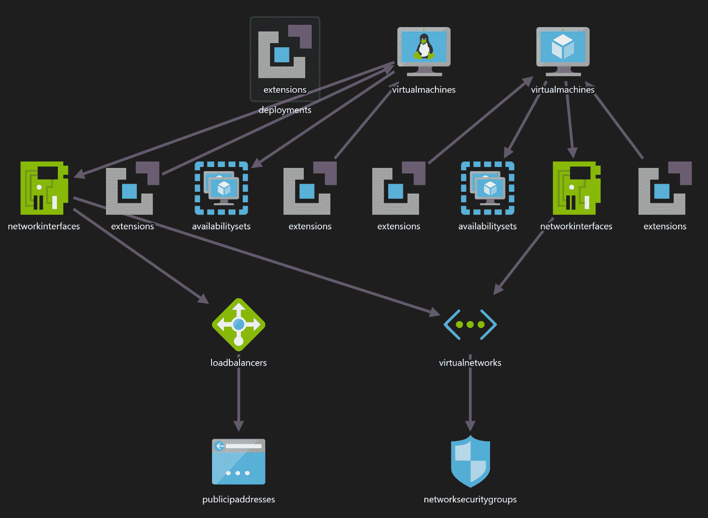
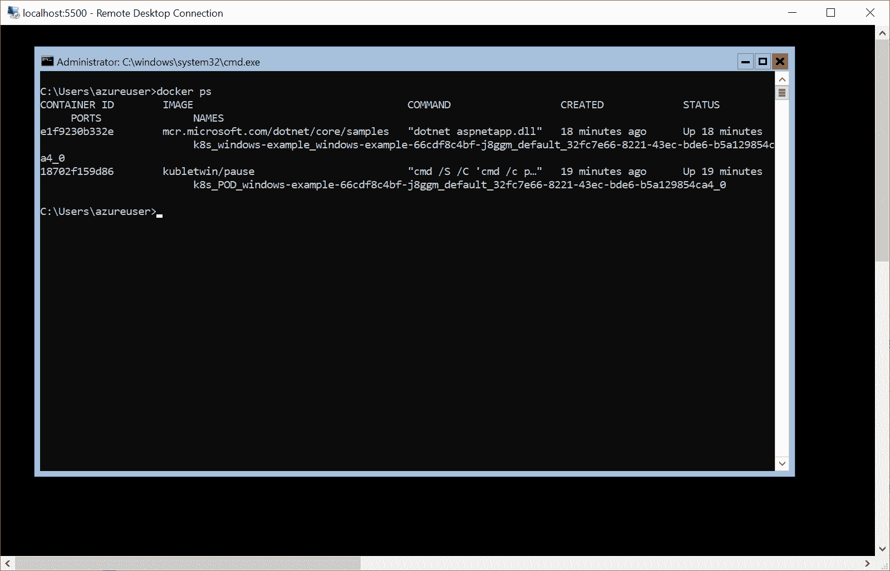
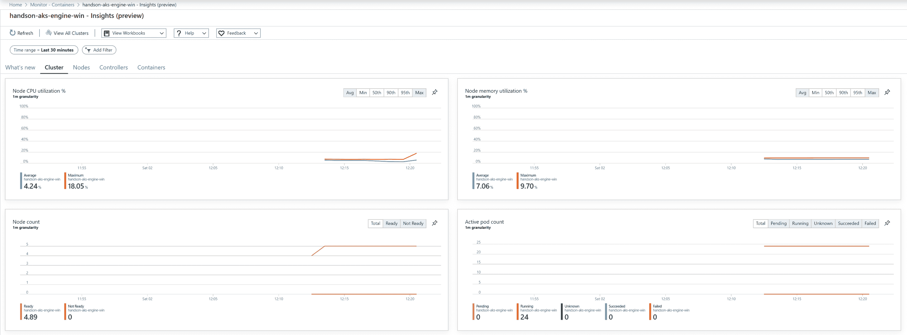
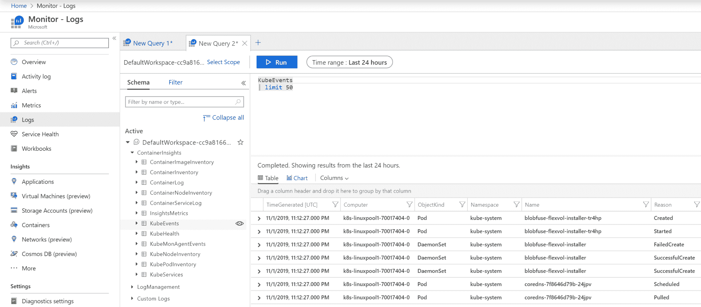

# 八、部署混合 Azure Kubernetes 服务引擎集群

上一章概述了如何在内部环境中创建混合的 Windows/Linux Kubernetes 集群。这种方法也可以用于基础设施即服务云环境中的部署，但是如果您使用的是 Azure，则有更简单的解决方案:**Azure Kubernetes Service**(**AKS**)**Engine**([https://github.com/Azure/aks-engine](https://github.com/Azure/aks-engine))。该项目旨在使用 **Azure 资源管理器** ( **ARM** )模板，提供一种部署自我管理的 Kubernetes 集群的 Azure 本地方式，该模板可以利用 Kubernetes 的所有 Azure 云集成，例如负载平衡器服务。此外，借助 AKS Engine，您可以支持使用 Windows 节点部署 Kubernetes 集群，与内部环境相比，只需要最少的配置和节点准备。换句话说，您将能够在几分钟内调配生产级高可用性混合集群。

简要总结 AKS 引擎与其他概念的关系非常重要，例如 AKS、acs 引擎和 Azure 堆栈:

*   AKS 引擎和 AKS 不是同一个 Azure 产品。AKS 是一项 Azure 服务，可让您创建完全受管的 Kubernetes 集群–我们在[第 4 章](04.html)、 *Kubernetes 概念和 Windows 支持*中概述了 AKS，并演示了如何使用 AKS 部署混合 Windows/Linux 集群。AKS 引擎由 AKS 内部使用，但是您不能使用 AK 管理 AKS
*   acs-engine 是 AKS Engine 的前身，所以你可能会发现很多文档都提到了 acs-engine 而不是 AKS Engine。AKS 发动机是 acs-engine 的向后兼容延续。
*   从技术上讲，如果您使用 Azure 堆栈，也可以将 AKS 引擎用于内部环境。可以在这里阅读更多:[https://docs . Microsoft . com/en-us/azure-stack/user/azure-stack-kubernetes-aks-engine-overview](https://docs.microsoft.com/en-us/azure-stack/user/azure-stack-kubernetes-aks-engine-overview)。

在本章中，我们将重点介绍 AKS Engine，并在 Azure 云中部署一个混合的 Windows/Linux 集群。我们将涵盖以下主题:

*   安装 AKS 发动机
*   创建 Azure 资源组和服务主体
*   使用应用编程接口模型并生成 Azure 资源管理器模板
*   部署集群
*   部署和检查第一个应用

# 技术要求

对于本章，您将需要以下内容:

*   安装了 Windows 10 专业版、企业版或教育版(1903 版或更高版本，64 位)
*   蔚蓝账户
*   Windows 的巧克力包管理器已安装([https://chocolatey.org/](https://chocolatey.org/))
*   如果您想可视化由 AKS 引擎生成的 ARM 模板，可以选择安装 Visual Studio Code

使用巧克力包管理器不是强制性的，但它使安装过程和应用版本管理变得更加容易。安装过程记录在这里:[https://chocolatey.org/install](https://chocolatey.org/install)。

接下来，您将需要自己的 Azure 帐户，以便为 Kubernetes 集群创建 Azure 资源。如果您在前面几章中还没有创建帐户，您可以在这里阅读更多关于如何获得个人使用的有限免费帐户的信息:[https://azure.microsoft.com/en-us/free/](https://azure.microsoft.com/en-us/free/)。

您可以从官方 GitHub 资源库下载本章的最新代码示例:[https://GitHub . com/PacktPublishing/hand-Kubernetes-On-Windows/tree/master/chapter 08](https://github.com/PacktPublishing/Hands-On-Kubernetes-on-Windows/tree/master/Chapter08)。

# 安装 AKS 发动机

AKS 引擎本身是一个命令行工具，可以根据提供的配置文件生成 Azure 资源管理器(ARM)模板。要使用 AKS 引擎，您需要具有前面章节中描述的安装过程的以下组件:

*   **Azure CLI 和**T2【Azure Cloud Shell】:说明可在[第二章](02.html)、*管理容器中的状态*中，在*使用远程/云存储进行容器存储*存储中获得。
*   **kubectl** :说明可在[第 6 章](06.html)、*与 Kubernetes 集群交互*中的*安装 Kubernetes 命令行工具*部分获得。
*   **Windows SSH 客户端:**说明可在[第 7 章](07.html)、*部署混合内部 Kubernetes 集群*中的*使用 Kubernetes 创建 Kubernetes 主节点*部分获得。

机器上安装了所有工具后，您可以继续安装 AKS 引擎本身。Windows 上推荐的安装方法是使用巧克力糖。或者，您可以下载 AKS 引擎二进制文件([https://github.com/Azure/aks-engine/releases/latest](https://github.com/Azure/aks-engine/releases/latest))，提取它们，并将其添加到您的`$env:PATH`环境变量中。要使用巧克力安装 AKS 引擎，请执行以下步骤:

1.  以管理员身份打开 PowerShell 窗口。
2.  要安装`aks-engine`包，请执行以下命令:

```
choco install aks-engine
```

3.  如果要安装特定版本的 AKS Engine，例如`0.42.0`，使用以下命令:

```
choco install aks-engine --version=0.42.0
```

4.  验证您的安装是否成功:

```
PS C:\src> aks-engine version
Version: v0.42.0
GitCommit: 0959ab812
GitTreeState: clean
```

现在，您已经准备好继续下一步——为您的 Kubernetes 集群配置先决条件。让我们从收集初始集群信息和创建 Azure 资源组开始。

# 创建 Azure 资源组和服务主体

在我们使用 AKS 引擎部署 Kubernetes 集群之前，我们需要执行以下初始步骤:

1.  您需要确保您在 Azure 订阅中有适当的权限来创建和分配 Azure 活动目录服务主体。如果您只为浏览创建了一个 Azure 帐户，默认情况下您将拥有权限。
2.  确定您将用于部署集群的 Azure 订阅的`SubscriptionId`。您可以通过打开 PowerShell 窗口并执行以下命令来实现这一点:

```
PS C:\src> az login
PS C:\src> az account list -o table
Name           CloudName    SubscriptionId                        State    IsDefault
-------------  -----------  ------------------------------------  -------  -----------
Pay-As-You-Go  AzureCloud   cc9a8166-829e-401e-a004-76d1e3733b8e  Enabled  True
```

我们将在接下来的段落中使用`cc9a8166-829e-401e-a004-76d1e3733b8e`作为`SubscriptionId`。

3.  确定一个全局唯一的`dnsPrefix`，用于集群中的主机名。或者，您可以依赖 AKS 引擎自动生成的前缀。我们将在接下来的段落中使用`handson-aks-engine-win`作为前缀。
4.  选择要用于部署集群的 Azure 位置。我们将在下面的例子中使用`westeurope`。
5.  为集群的新 Azure 资源组选择一个名称。我们将在接下来的段落中使用`aks-engine-windows-resource-group`。
6.  为窗口节点选择用户名和密码。我们将使用`azureuser`和`S3cur3P@ssw0rd`来达到这个目的–记住使用您自己的安全密码！
7.  生成一个 SSH 密钥对，您可以用它来连接到 Linux 节点。如果您选择在 Windows 节点上安装 OpenSSH 服务器，以后可以使用相同的密钥对来访问 Windows 节点。

The steps described in the next paragraphs for prerequisite creation and AKS Engine Deployment are captured in the PowerShell script available here: [https://github.com/PacktPublishing/Hands-On-Kubernetes-on-Windows/blob/master/Chapter08/01_aks-engine/01_CreateAKSEngineClusterWithWindowsNodes.ps1](https://github.com/PacktPublishing/Hands-On-Kubernetes-on-Windows/blob/master/Chapter08/01_aks-engine/01_CreateAKSEngineClusterWithWindowsNodes.ps1).

现在，请按照以下步骤创建 Azure 资源组和 Azure 活动目录服务主体:

1.  打开一个 PowerShell 窗口，并使用 Azure 命令行界面登录:

```
az login
```

2.  使用以下命令为集群创建 Azure 资源组:

```
az group create `
 --name aks-engine-windows-resource-group `
 --location westeurope
```

3.  为您的集群创建一个 Azure 活动目录服务主体。使用适当的`Subscription ID`和`Resource Group`名称:

```
az ad sp create-for-rbac `
 --role="Contributor" `
 --scopes="/subscriptions/cc9a8166-829e-401e-a004-76d1e3733b8e/resourceGroups/aks-engine-windows-resource-group"
```

Please note that if scope is limited to a given resource group, you will not be able to use the Container Monitoring add-on. We'll cover the configuration of the AAD service principal for this purpose in the next sections.

4.  检查前一个命令的输出，记下`appId`和`password`。您以后无法检索密码:

```
{
 "appId": "7614823f-aca5-4a31-b2a5-56f30fa8bd8e",
 "displayName": "azure-cli-2019-10-19-12-48-08",
 "name": "http://azure-cli-2019-10-19-12-48-08",
 "password": "8737c1e6-b1b1-4c49-a195-f7ea0fe37613",
 "tenant": "86be0945-a0f3-44c2-8868-9b6aa96b0b62"
}
```

最后一步是为访问集群中的 Linux 节点生成 SSH 密钥对:

1.  打开一个 PowerShell 窗口。
2.  如果您已经阅读了前面的章节，您可能已经生成了一个 SSH 密钥对，您可以重用它并跳过下一步。要检查您是否有现有的 SSH 密钥对，请使用以下命令:

```
ls ~\.ssh\id_rsa.pub
```

3.  如果需要生成密钥对，请执行以下命令(建议使用默认值):

```
ssh-keygen
```

现在，您已经拥有了 AKS 引擎部署所需的所有信息。我们需要做的就是准备 AKS 引擎 apimodel，并为我们的集群生成一个 ARM 模板。

# 使用 apimodel 并生成 Azure 资源管理器模板

在其核心，AKS 引擎使用 **apimodel** (或集群定义)JSON 文件来生成 Azure 资源管理器模板，该模板可用于将 Kubernetes 集群直接部署到 Azure。apimodel 的文档和模式可以在这里找到:[https://github . com/Azure/aks-engine/blob/master/docs/topics/cluster definitions . MD](https://github.com/Azure/aks-engine/blob/master/docs/topics/clusterdefinitions.md)。AKS 引擎自带对集群定义中 Windows 节点的现成支持。你可以在官方 AKS Engine GitHub 知识库中找到例子:[https://GitHub . com/Azure/AKS-Engine/tree/master/examples/windows](https://github.com/Azure/aks-engine/tree/master/examples/windows)。

现在让我们基于最小的 Windows 集群示例定义创建一个自定义 API model([https://github . com/Azure/aks-engine/blob/master/examples/Windows/kubernetes . JSON](https://github.com/Azure/aks-engine/blob/master/examples/windows/kubernetes.json))。我们还将包括两个 Linux 节点，以便运行混合的 Windows/Linux 配置(一个 Linux 主节点、两个 Windows 节点和两个 Linux 节点)。请遵循以下步骤:

1.  下载以下文件并保存为`kubernetes-windows.json`:[https://raw . githubusercontent . com/Azure/aks-engine/master/examples/windows/kubernetes . JSON](https://raw.githubusercontent.com/Azure/aks-engine/master/examples/windows/kubernetes.json)。

2.  将`properties.orchestratorProfile.orchestratorRelease`更改为所需的 Kubernetes 版本，例如`1.16`。
3.  将`properties.masterProfile.dnsPrefix`修改为选中的 DNS 前缀。在示例中，我们使用`handson-aks-engine-win`，但是您需要选择您唯一的前缀。
4.  通过向`properties.agentPoolProfiles`添加以下 JSON 对象来添加一个 Linux 节点池:

```
{
    "name": "linuxpool1",
    "count": 2,
    "vmSize": "Standard_D2_v3",
    "availabilityProfile": "AvailabilitySet"
}
```

5.  将`properties.windowsProfile.adminUsername`和`properties.windowsProfile.adminPassword`修改为您为 Windows 节点选择的用户名和密码。
6.  将`~\.ssh\id_rsa.pub`的内容复制到`properties.linuxProfile.ssh.publicKeys.keyData`中。
7.  使用`properties.servicePrincipalProfile.clientId`中的`appId`和`properties.servicePrincipalProfile.secret`中的`password`服务主体。
8.  示例自定义文件包含以下内容:

```
{
 "apiVersion": "vlabs",
    "properties": {
        "orchestratorProfile": {
            "orchestratorType": "Kubernetes",
            "orchestratorRelease": "1.16"
        },
        "masterProfile": {
            "count": 1,
            "dnsPrefix": "handson-aks-engine-win",
            "vmSize": "Standard_D2_v3"
        },
        "agentPoolProfiles": [{
                "name": "linuxpool1",
                "count": 2,
                "vmSize": "Standard_D2_v3",
                "availabilityProfile": "AvailabilitySet"
            },{
                "name": "windowspool2",
                "count": 2,
                "vmSize": "Standard_D2_v3",
                "availabilityProfile": "AvailabilitySet",
                "osType": "Windows",
                "osDiskSizeGB": 128,
                "extensions": [{
                        "name": "winrm"
                    }
                ]
            }
        ],
        "windowsProfile": {
            "adminUsername": "azureuser",
            "adminPassword": "S3cur3P@ssw0rd",
            "sshEnabled": true
        },
        "linuxProfile": {
            "adminUsername": "azureuser",
            "ssh": {
                "publicKeys": [{
                        "keyData": "<contents of ~\.ssh\id_rsa.pub>"
                    }
                ]
            }
        },
        "servicePrincipalProfile": {
            "clientId": "8d4d1104-7818-4883-88d2-2146b658e4b2",
            "secret": "9863e38c-896f-4dba-ac56-7a3c1849a87a"
        },
        "extensionProfiles": [{
                "name": "winrm",
                "version": "v1"
            }
        ]
    }
}
```

apimodel 已准备好供 AKS 引擎使用。使用以下命令生成 ARM 模板:

```
aks-engine generate .\kubernetes-windows.json
```

这将在`_output\<dnsPrefix>`目录中生成 ARM 模板(带参数)、完整的 apimodel 和 kubeconfigs(针对每个可能的 Azure 位置)。您可以检查这些文件，以便了解集群是如何设计的——或者，如果您安装了 Visual Studio Code，您可以使用以下出色的扩展来可视化 ARM 模板–[https://marketplace.visualstudio.com/items?T2:](https://marketplace.visualstudio.com/items?itemName=bencoleman.armview)

1.  在 VS Code 中，安装好扩展后，打开`_output\<dnsPrefix>\azuredeploy.json` ARM 模板文件。
2.  使用以下图标可视化 ARM 模板:


3.  使用以下图标加载 ARM 模板参数`_output\<dnsPrefix>\azuredeploy.parameters.json`:


4.  现在，您可以方便地检查 ARM 模板:



此时，我们已经准备好使用 Azure CLI 继续部署集群了！

# 部署集群

为了从 Azure 资源管理器模板部署 Kubernetes 集群，我们将使用`az group deployment create`命令。这个 Azure CLI 命令需要传递 ARM 模板(`_output\<dnsPrefix>\azuredeploy.json`)和 ARM 参数文件(`_output\<dnsPrefix>\azuredeploy.parameters.json`)。要部署集群，请执行以下步骤:

1.  执行命令:

```
az group deployment create `
 --name kubernetes-windows-cluster `
 --resource-group aks-engine-windows-resource-group `
 --template-file ".\_output\<dnsPrefix>\azuredeploy.json" `
 --parameters ".\_output\<dnsPrefix>\azuredeploy.parameters.json"
```

If you run into any problems, you can check the ARM Deployment failure details in the Azure portal by navigating to your resource group and clicking the Deployment: Failed link in the upper-right corner. For any `InternalServerErrors`, you may just try choosing another Azure location, such as `westus`.

2.  几分钟后，当部署完成时，创建的资源和输出变量的列表将以 JSON 格式返回:

```
      ...
      "agentStorageAccountSuffix": {
        "type": "String",
        "value": ""
      },
      "masterFQDN": {
        "type": "String",
        "value": "<dnsPrefix>.westeurope.cloudapp.azure.com"
      },
      "primaryAvailabilitySetName": {
        "type": "String",
        "value": "windowspool2-availabilitySet-70017404"
      },
      ...
```

3.  提取`masterFQDN`属性。这是你的 Kubernetes 主域名。

Alternatively, you can take the approach of using the `aks-engine deploy` command, which combines customizing cluster definition and generating and deploying an ARM template into one command. Note that in order to use container monitoring features you must use the `aks-engine deploy` command at this point.

现在，我们需要连接到我们的新集群。AKS 引擎与 ARM 模板一起，以`.\_output\<dnsPrefix>\kubeconfig\kubeconfig.<azureLocation>.json`的形式为所有可能的 Azure 位置生成一组`kubeconfigs`。在我们的例子中，我们使用了位置`westeurope`，所以 kubeconfig 是`.\_output\<dnsPrefix>\kubeconfig\kubeconfig.westeurope.json`。要将这个 kubeconfig 用于您的 kubectl，您可以使用[第 6 章](06.html)、*中提供的配置管理技术之一与 Kubernetes 集群*交互。例如，要将此文件与现有的默认 kubeconfig 合并，请执行以下步骤:

1.  检查`.\_output\<dnsPrefix>\kubeconfig\kubeconfig.westeurope.json`的内容，以了解集群名称和上下文名称。两者都应该和你的`<dnsPrefix>`一样。
2.  使用默认 kubeconfig 执行文件的测试合并。使用以下命令:

```
$env:KUBECONFIG=".\_output\<dnsPrefix>\kubeconfig\kubeconfig.westeurope.json;$env:USERPROFILE\.kube\config"
kubectl config view --raw
```

3.  仔细检查输出，以确定合并的配置是否包含您期望的所有集群和上下文。
4.  将合并文件保存为默认配置，并切换到使用新的`<dnsPrefix>`上下文:

```
$env:KUBECONFIG=".\_output\<dnsPrefix>\kubeconfig\kubeconfig.westeurope.json;$env:USERPROFILE\.kube\config"
kubectl config view --raw > $env:USERPROFILE\.kube\config_new 
Move-Item -Force $env:USERPROFILE\.kube\config_new $env:USERPROFILE\.kube\config

kubectl config use-context "<dnsPrefix>"
```

5.  测试与新集群的连接:

```
PS C:\src\temp> kubectl get nodes --all-namespaces
NAME                        STATUS   ROLES    AGE   VERSION
7001k8s000                  Ready    agent    16m   v1.16.1
7001k8s001                  Ready    agent    16m   v1.16.1
k8s-linuxpool1-70017404-0   Ready    agent    13m   v1.16.1
k8s-linuxpool1-70017404-1   Ready    agent    13m   v1.16.1
k8s-master-70017404-0       Ready    master   18m   v1.16.1
PS C:\src\temp> kubectl get pods --all-namespaces
NAMESPACE     NAME                                            READY   STATUS    RESTARTS   AGE
kube-system   azure-cni-networkmonitor-ftnqs                  1/1     Running   0          18m
kube-system   azure-ip-masq-agent-vqdhz                       1/1     Running   0          18m
...
```

Please note that clusters deployed by AKS Engine are billed depending on the resources that have been used in the ARM templates. You should use the Azure pricing calculator in order to determine the predicted cost. If you do not need the cluster anymore, it is advised to delete it to avoid any unwanted costs. To delete the AKS Engine cluster, use the following command: `az group delete --name aks-engine-windows-resource-group --yes --no-wait`.

恭喜你！您已经使用 AKS 引擎在 Azure 上部署了一个功能齐全的混合 Windows/Linux 集群！让我们看看如何向集群部署一个简单的应用，以及如何与集群进行交互。

# 部署和检查第一个应用

在本节中，我们将执行与上一章类似的练习——我们将把一个示例 ASP.NET 核心 3.0 应用(使用一个部署对象)部署到我们的 AKS Engine 集群中，并演示基本的 kubectl 操作。使用 AKS 引擎集群的许多方面与内部集群的情况相同，最大的区别是您可以轻松利用 Azure 功能和集成。为了演示这一点，我们将使用负载平衡器类型的服务而不是节点端口来公开应用。由于 Azure 的 Kubernetes 云提供商，负载平衡器服务将与 Azure 负载平衡器实例本机集成。

# 基本操作

要部署示例应用，请执行以下步骤:

1.  创建包含部署和服务定义的`windows-example.yaml`清单文件。您可以从 GitHub 资源库([https://raw . githubuser content . com/PacktPublishing/hand-On-Kubernetes-On-Windows/master/chapter 08/03 _ Windows-example/Windows-example . YAML](https://raw.githubusercontent.com/PacktPublishing/Hands-On-Kubernetes-on-Windows/master/Chapter08/03_windows-example/windows-example.yaml))下载或直接应用到集群:

```
apiVersion: apps/v1
kind: Deployment
metadata:
  name: windows-example
  labels:
    app: sample
spec:
  replicas: 3
  selector:
    matchLabels:
      app: windows-example
  template:
    metadata:
      name: windows-example
      labels:
        app: windows-example
    spec:
      nodeSelector:
 "beta.kubernetes.io/os": windows
      containers:
      - name: windows-example
        image: mcr.microsoft.com/dotnet/core/samples:aspnetapp-nanoserver-1809
        resources:
          limits:
            cpu: 1
            memory: 800M
          requests:
            cpu: .1
            memory: 300M
        ports:
          - containerPort: 80
---
apiVersion: v1
kind: Service
metadata:
  name: windows-example
spec:
  type: LoadBalancer
  ports:
  - protocol: TCP
    port: 80
  selector:
    app: windows-example
```

清单文件中有三个要点，用粗体标出:

2.  打开一个 PowerShell 窗口，使用`kubectl`应用清单文件。如果你还没有合并你的`kubeconfigs`，记得先设置合适的`$env:KUBECONFIG`变量，然后切换到合适的库比特上下文:

```
kubectl apply -f .\windows-example.yaml
```

3.  等待 Pods 启动—初始映像提取可能需要几分钟时间。您可以使用以下命令观察 Pods 的状态:

```
PS C:\src> kubectl get pods --watch 
NAME                               READY   STATUS    RESTARTS   AGE
windows-example-66cdf8c4bf-f5bd8   1/1     Running   0          101s
windows-example-66cdf8c4bf-g4v4s   1/1     Running   0          101s
windows-example-66cdf8c4bf-xkbpf   1/1     Running   0          101s
```

4.  等待服务的外部 IP 创建。您可以使用以下命令观察服务的状态:

```
PS C:\src> kubectl get services --watch
NAME              TYPE           CLUSTER-IP     EXTERNAL-IP      PORT(S)        AGE
kubernetes        ClusterIP      10.0.0.1       <none>           443/TCP        24m
windows-example   LoadBalancer   10.0.158.121   52.136.234.203   80:32478/TCP   3m55s
```

5.  打开你的互联网浏览器，导航到 Azure 负载平衡器地址——在这个例子中，它是`http://52.136.234.203/`。您应该会看到示例应用网页，它确认部署成功:


执行常见操作，如访问 Pod 容器日志或在 Pod 容器内执行临时流程，与内部集群完全相同–我们将简要介绍如何做到这一点:

1.  要访问作为部署的一部分创建的其中一个 Pods ( `windows-example-66cdf8c4bf-f5bd8`)的日志，请使用以下`kubectl logs`命令:

```
kubectl logs windows-example-66cdf8c4bf-f5bd8
```

2.  例如，要将**执行到同一个 Pod 容器中，启动一个交互式`cmd` shell 并运行`kubectl exec`命令:**

```
kubectl exec -it windows-example-66cdf8c4bf-f5bd8 cmd
```

3.  现在，您可以自由访问和修改容器，这在调试和测试场景中非常有用。例如，您可以获得`appsettings.json`文件的内容:

```
C:\app>type appsettings.json
{
 "Logging": {
 "LogLevel": {
 "Default": "Information",
 "Microsoft": "Warning",
 "Microsoft.Hosting.Lifetime": "Information"
 }
 },
 "AllowedHosts": "*"
}
```

接下来，让我们看看如何连接到 AKS Engine 集群中使用的实际虚拟机。

# 连接到虚拟机

为了连接到 Linux 主虚拟机，您可以使用 SSH 并直接连接到它，因为它暴露在公共网络中:

1.  在 PowerShell 窗口中，执行以下命令(您的公共 SSH 密钥将用于身份验证):

```
ssh azureuser@<dnsPrefix>.westeurope.cloudapp.azure.com
```

2.  现在，您可以执行任何维护或调试操作，例如，访问 kubelet 服务日志:

```
azureuser@k8s-master-70017404-0:~$ sudo journalctl -u kubelet -o cat
Stopped Kubelet.
Starting Kubelet...
net.ipv4.tcp_retries2 = 8
Bridge table: nat
Bridge chain: PREROUTING, entries: 0, policy: ACCEPT
Bridge chain: OUTPUT, entries: 0, policy: ACCEPT
Bridge chain: POSTROUTING, entries: 0, policy: ACCEPT
Chain PREROUTING (policy ACCEPT)
```

对于 Windows 节点(或其他 Linux 节点)，由于虚拟机在私有 IP 范围内，该过程有点复杂。这意味着您需要通过 Linux 主节点使用 SSH 本地端口转发，以便使用远程桌面连接或 SSH 进行连接:

1.  首先，查询您想要连接到的 Windows 节点的私有 IP 地址。您可以使用以下命令查看所有节点的名称:

```
az vm list --resource-group aks-engine-windows-resource-group -o table
```

2.  使用名称获取节点的私有 IP 地址，例如`7001k8s000`:

```
PS C:\src> az vm show -g aks-engine-windows-resource-group -n 7001k8s000 --show-details --query 'privateIps'
"10.240.0.4,10.240.0.5,10.240.0.6,10.240.0.7,10.240.0.8,10.240.0.9,10.240.0.10,10.240.0.11,10.240.0.12,10.240.0.13,10.240.0.14,10.240.0.15,10.240.0.16,10.240.0.17,10.240.0.18,10.240.0.19,10.240.0.20,10.240.0.21,10.240.0.22,10.240.0.23,10.240.0.24,10.240.0.25,10.240.0.26,10.240.0.27,10.240.0.28,10.240.0.29,10.240.0.30,10.240.0.31,10.240.0.32,10.240.0.33,10.240.0.34"
```

3.  使用其中一个私有 IP 创建从本地`5500`端口通过主节点到 Windows 节点上`3389`端口(RDP)的 SSH 隧道:

```
ssh -L 5500:10.240.0.4:3389 azureuser@<dnsPrefix>.westeurope.cloudapp.azure.com
```

4.  在不同的 PowerShell 窗口中，通过隧道启动 RDP 会话:

```
mstsc /v:localhost:5500
```

5.  提供您的 Windows 节点凭据(如在 apimodel 中)并连接:



6.  或者，您也可以从主节点使用 SSH:

```
ssh 10.240.0.4
```

现在，让我们看看如何为容器启用 Azure 日志分析和 Azure 监视器。

# 为容器启用 Azure 日志分析和 Azure 监视器

AKS Engine 自带 Azure 日志分析和 Azure 容器监视器的集成，由运行在集群节点上的**运营管理套件** ( **OMS** )代理提供。部署 Kubernetes 集群时，您可以在 Kubernetes 集群定义中指定一个附加的`container-monitoring`插件–请注意，目前，您必须在创建新集群时启用容器监控；您不能修改现有的集群定义。

此外，只有在使用`aks-engine deploy`命令时，该功能才会出现。如果您想使用此功能，请执行以下步骤:

1.  如果`aks-engine-windows-resource-group`中已经有集群，先删除。
2.  修改您的集群定义(apimodel)，使`properties.orchestratorProfile.kubernetesConfig`属性具有以下内容。或者，您可以使用[https://github . com/PacktPublishing/hand-Kubernetes-On-Windows/tree/master/chapter 08/05 _ Windows-API model-container-monitoring/Kubernetes-Windows . JSON](https://github.com/PacktPublishing/Hands-On-Kubernetes-on-Windows/tree/master/Chapter08/05_windows-apimodel-container-monitoring/kubernetes-windows.json)作为基础:

```
{
    "addons": [{
            "name": "container-monitoring",
            "enabled": true
        }
    ]
}
```

3.  确保您的服务主体(在本例中为`appId: 7614823f-aca5-4a31-b2a5-56f30fa8bd8e`)还拥有您的 Azure 订阅的`Log Analytics Contributor`角色:

```
az role assignment create `
 --assignee 7614823f-aca5-4a31-b2a5-56f30fa8bd8e `
 --role "Log Analytics Contributor" `
 --scope="/subscriptions/cc9a8166-829e-401e-a004-76d1e3733b8e"
```

4.  执行 AKS 引擎部署，使用服务主体`appId`作为`--client-id`，使用`password`作为`--client-secret`:

```
aks-engine deploy `
 --subscription-id cc9a8166-829e-401e-a004-76d1e3733b8e `
 --resource-group aks-engine-windows-resource-group `
 --location westeurope `
 --api-model .\kubernetes-windows.json `
 --client-id 7614823f-aca5-4a31-b2a5-56f30fa8bd8e `
 --client-secret 8737c1e6-b1b1-4c49-a195-f7ea0fe37613 `
 --force-overwrite
```

5.  几分钟后，您的集群将准备好，您可以将默认的 kube nfig 与 AKS Engine kubeconfig 合并。

这个`container-monitoring`插件将使两件事成为可能:

1.  使用 Azure 日志分析使用 Kubernetes 查询语言(https://docs . Microsoft . com/en-us/Azure/Azure-monitor/Log-query/入门门户)查询 Kubernetes 和您的应用日志
2.  使用 Azure Monitor 服务来监控集群中运行的容器([https://docs . Microsoft . com/en-us/Azure/Azure-Monitor/insights/container-insights-overview](https://docs.microsoft.com/en-us/azure/azure-monitor/insights/container-insights-overview))

Note that until the [https://github.com/Azure/aks-engine/issues/2066](https://github.com/Azure/aks-engine/issues/2066) issue in AKS Engine is resolved, Kubernetes 1.16 will not integrate with the Log Analytics and Monitor services properly. You can try deploying your cluster again with a different Kubernetes version in apimodel.

这些服务为运行在 Kubernetes 上的容器化应用提供了监视、警报和调试的基本构造块，您可以利用多个 Azure 门户用户界面功能来简化分析和管理，例如:

1.  使用以下网址访问 Azure 容器监视器:[https://aka.ms/azmon-containers](https://aka.ms/azmon-containers)。Azure Monitor 值得一本单独的、专门介绍其所有功能的书，作为一个快速的例子，您可以探索为监视 Kubernetes 集群而提供的默认仪表板:



2.  使用以下网址访问 Azure 日志分析:[https://portal . Azure . com/# blade/Microsoft _ Azure _ Monitoring/Azure Monitoring browse blade/logs](https://portal.azure.com/#blade/Microsoft_Azure_Monitoring/AzureMonitoringBrowseBlade/logs)。展开 ContainerInsights 数据库，并选择例如 KubeEvents 表。现在，您可以执行一个简单的 Kusto 查询来检查表中有哪些数据:

```
KubeEvents
| limit 50
```

下面的屏幕截图显示了前面命令的输出:



您可以在官方文档中了解更多可用于容器监控的日志分析表:[https://docs . Microsoft . com/en-us/azure/azure-monitor/insights/containers # monitor-containers](https://docs.microsoft.com/en-us/azure/azure-monitor/insights/containers#monitor-containers)。库斯托查询语言文档请参考[https://docs . Microsoft . com/en-us/azure/azure-monitor/log-query/query-language](https://docs.microsoft.com/en-us/azure/azure-monitor/log-query/query-language)。设置适当的监控和日志分析解决方案对于运行分布式应用至关重要**。如果您没有在集群中使用 Azure，您可以考虑不同的解决方案，例如普罗米修斯和弹性搜索，它们提供类似的功能。**

 **# 摘要

在本章中，您已经学习了如何使用 AKS 引擎部署运行在 Azure 上的混合 Windows/Linux Kubernetes 集群。目前，这种方法是运行带有 Windows 节点的自我管理的生产级集群的最合适的解决方案。部署过程很简单–首先，在本地计算机上安装所有先决条件和 AKS 引擎，然后创建专用的 Azure 资源组和 Azure Active Directory 服务主体。之后，您需要为 AKS Engine 定义一个 apimodel(集群定义)JSON 文件，以生成一个 Azure 资源管理器模板，并使用该模板部署集群。此外，您还学习了如何部署一个示例 Windows 容器应用，以及如何使用 kubectl 执行基本操作。除此之外，我们还展示了如何连接到集群中的虚拟机进行调试和监控，以及如何为您的集群启用 Azure Monitor 和 Azure 日志分析。

下一章将进一步关注将应用部署到 Kubernetes 集群，以及如何在集群中执行“第二天”操作。

# 问题

1.  AKS 和 AKS 发动机有什么区别？
2.  AKS Engine 工作原理的基本原理是什么？
3.  你能使用 AKS 引擎管理 AKS 集群吗，反之亦然？
4.  使用 AKS 引擎的前提条件是什么？
5.  AKS 引擎中的 apimodel 是什么？
6.  如何连接到 Kubernetes Linux 主服务器？
7.  如何连接到一个 Kubernetes Windows 节点？

你可以在本书的*评估*中找到这些问题的答案。

# 进一步阅读

*   目前，大多数关于使用 **AKS 引擎**部署混合视窗/Linux 集群的资源都可以在线获得。有关更多详细信息，请查看 GitHub 上的官方文档:
    *   [https://github . com/Azure/aks-engine/blob/master/docs/topics/windows . MD](https://github.com/Azure/aks-engine/blob/master/docs/topics/windows.md)
    *   [https://github . com/Azure/aks-engine/blob/master/docs/topics/windows-and-kubernetes . MD](https://github.com/Azure/aks-engine/blob/master/docs/topics/windows-and-kubernetes.md)
*   总的来说，关于 **AKS** (托管的 Kubernetes Azure 产品，**而不是** AKS 引擎本身)的许多主题都很有用，因为它们涉及到如何将 Kubernetes 与 Azure 生态系统集成。您可以在以下 Packt 书籍中找到更多关于 AKS 本身的信息:
    *   *含 Kubernetes 的 devo PS–第二版*([https://www . packtpub . com/虚拟化与云/devo PS-Kubernetes-第二版](https://www.packtpub.com/virtualization-and-cloud/devops-kubernetes-second-edition))
*   如果您需要疑难解答和常见问题的帮助，可以使用以下指南:
    *   [https://github . com/Azure/aks-engine/blob/master/docs/how to/疑难解答. md](https://github.com/Azure/aks-engine/blob/master/docs/howto/troubleshooting.md)
    *   [https://docs . Microsoft . com/en-us/virtualization/windows containers/kubernetes/common-problems](https://docs.microsoft.com/en-us/virtualization/windowscontainers/kubernetes/common-problems)
    *   [https://kubernetes . io/docs/setup/production-environment/windows/intro-windows-in-kubernetes/#疑难解答](https://kubernetes.io/docs/setup/production-environment/windows/intro-windows-in-kubernetes/#troubleshooting)
    *   [https://tech community . Microsoft . com/t5/Networking-Blog/疑难解答-Kubernetes-Networking-on-Windows-Part-1/ba-p/508648](https://techcommunity.microsoft.com/t5/Networking-Blog/Troubleshooting-Kubernetes-Networking-on-Windows-Part-1/ba-p/508648)-专门针对 Windows 容器联网问题的疑难解答指南**