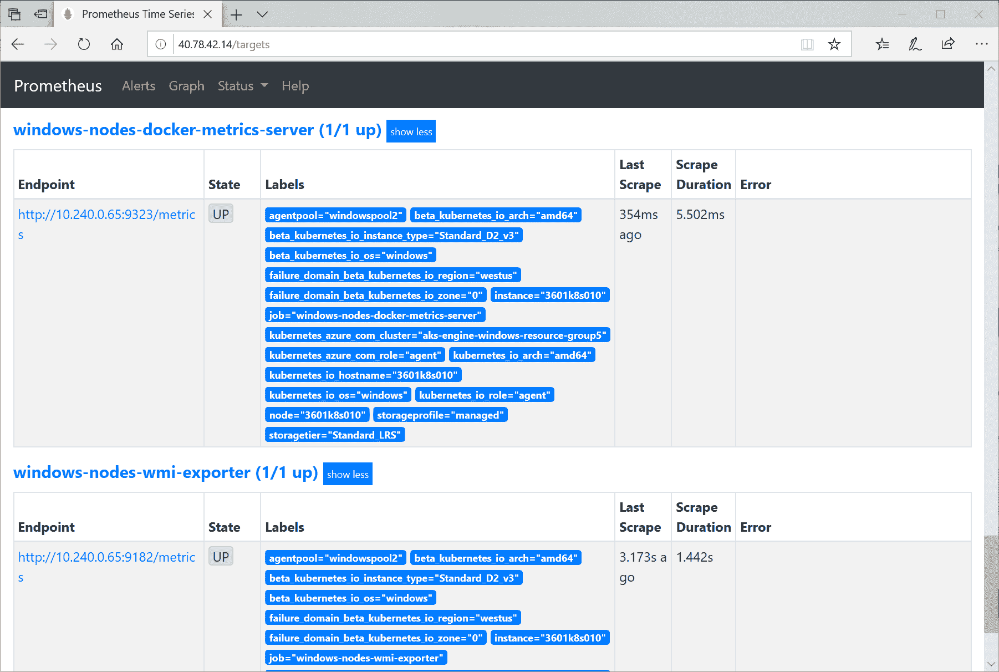
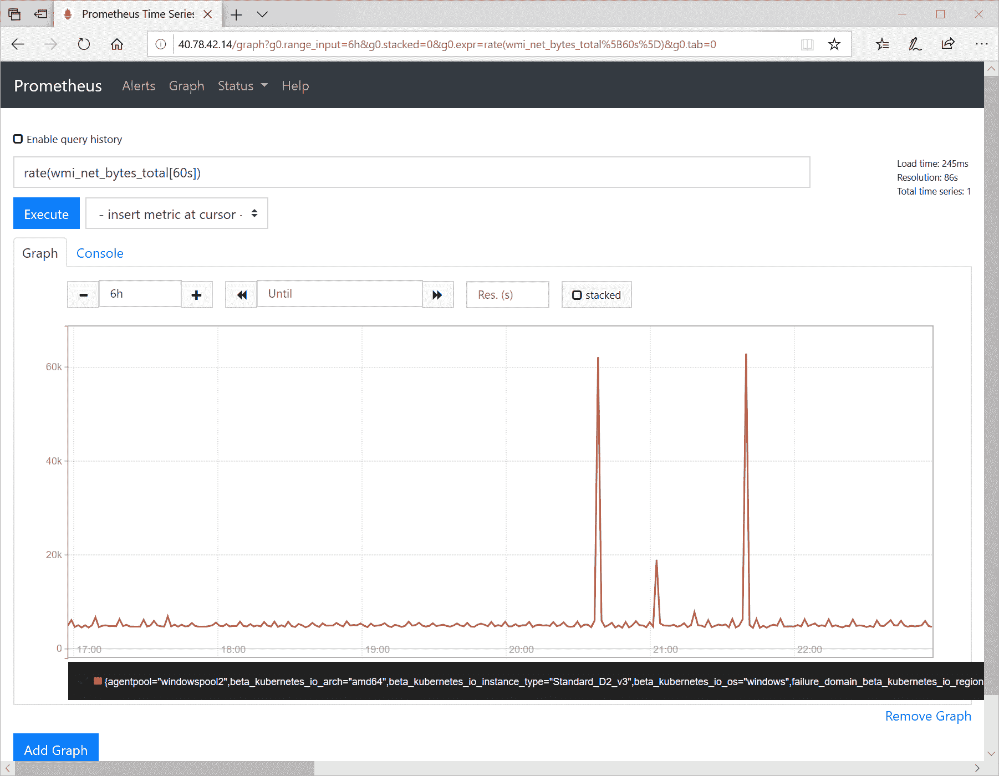
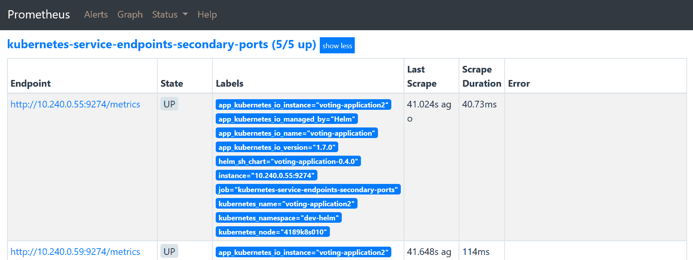
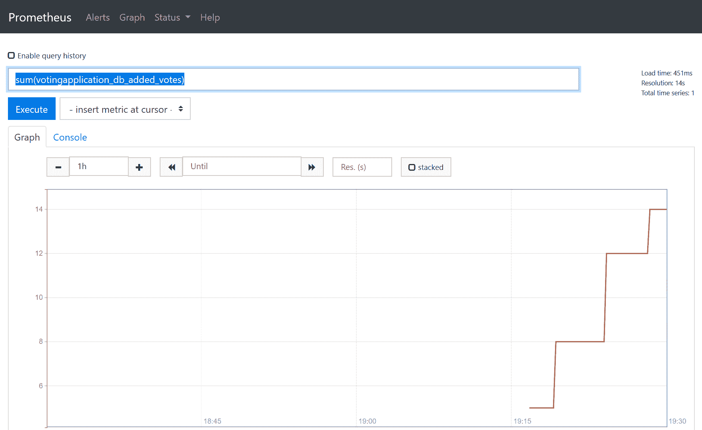
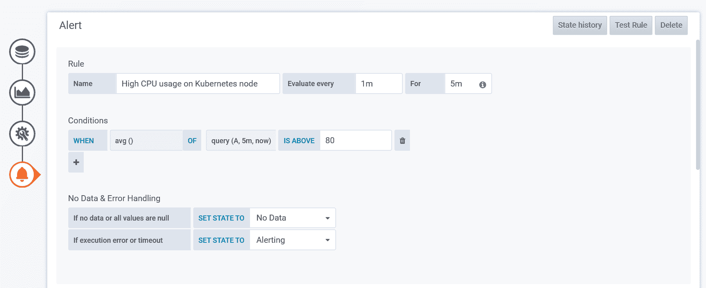

# 十四、使用普罗米修斯监控 Kubernetes 应用

Kubernetes 作为一个容器编排器是一个复杂的分布式系统，需要监控和警报才能正常运行。同时，您需要以同样的方式监控在 Kubernetes 上运行的应用——如果您没有监控和警报，您就不知道您的应用是如何运行的，是否会出现任何故障，或者您是否应该扩展您的工作负载。事实上，与监控和警报相关的挑战是企业采用 Kubernetes 时最常报告的阻碍因素。

幸运的是，这些年来，该市场蓬勃发展，出现了针对日志聚合、遥测收集、警报甚至专用的**应用性能管理** ( **APM** )系统的多种解决方案。我们可以从不同的软件即服务( **SaaS** )解决方案或可在内部托管的开源系统中进行选择，所有这些都只针对 Kubernetes 集群！

但硬币的另一面是:我们受限于能够支持 Windows 容器和基于 Windows 的 Kubernetes 节点的解决方案。Kubernetes 对 Windows 的生产级支持是最近才出现的，没有现成的统包解决方案。因此，本章旨在概括介绍 Kubernetes 可用的监控解决方案，并探讨如何实现自己的支持 Windows 节点的解决方案。

在本章中，我们将涵盖以下主题:

*   可用的监控解决方案
*   设置可观察的窗口节点
*   使用舵角图部署普罗米修斯
*   Windows 性能计数器
*   监控。NET 应用使用`prometheus-net`
*   在格拉夫纳配置仪表板和警报

# 技术要求

对于本章，您将需要以下内容:

*   安装了 Windows 10 专业版、企业版或教育版(1903 版或更高版本，64 位)
*   如果您想要编辑应用的源代码并进行调试，请使用 Microsoft Visual Studio 2019 社区(或任何其他版本)—Visual Studio Code 对 classic 的支持有限。NET 框架
*   头盔已安装
*   蔚蓝账户
*   一个使用 AKS 引擎部署的 Windows/Linux Kubernetes 集群，准备部署上一章中的投票应用

接下来，您将需要自己的 Azure 帐户来为 Kubernetes 集群创建 Azure 资源。如果您还没有创建前几章的帐户，您可以在这里阅读更多关于如何获得个人使用的有限免费帐户的信息:[https://azure.microsoft.com/en-us/free/](https://azure.microsoft.com/en-us/free/)。

使用 AKS 引擎部署 Kubernetes 集群已经在[第 8 章](08.html)、*中介绍了部署混合 Azure Kubernetes 服务引擎集群*。在[第 10 章](10.html)、*部署微软 SQL Server 2019 和 ASP.NET MVC 应用*中已经介绍了向 Kubernetes 部署投票应用。

您可以从官方 GitHub 资源库下载本章的最新代码示例:[https://GitHub . com/PacktPublishing/hand-Kubernetes-On-Windows/tree/master/chapter 14](https://github.com/PacktPublishing/Hands-On-Kubernetes-on-Windows/tree/master/Chapter14)。

# 可用的监控解决方案

监控一词通常用作总括术语，涵盖以下内容:

*   **可观察性**:为你的组件提供可观察性，意味着公开组件内部状态的信息，这样你就可以轻松访问数据，并对组件的实际状态进行推理。换句话说，如果某样东西是可观察的，你就能理解它。提供可观察性的功能的一个众所周知的例子是日志记录。您的应用生成日志，以便您可以检查应用的流和当前状态。可观察性有三大支柱:日志记录、分布式跟踪和度量。分布式跟踪提供了对通过多个服务的请求流的洞察，例如，使用关联标识。度量可以只是应用公开的数字信息，例如计数器或仪表。
*   **监控:**这意味着为您的组件收集可观察到的数据并存储起来，以便进行分析。
*   **分析和警报:**根据收集的监控数据，您可以执行分析，在某个组件被认为不健康时创建规则，并为您的团队配置警报。例如，更复杂的场景涉及异常检测和机器学习。

在 Kubernetes 中，监视比监视单个应用有更多的维度。通常，您可以将 Kubernetes 集群的监控分为以下几个独立的区域:

*   监控 Kubernetes 节点的硬件和操作系统基础设施
*   监控容器运行时
*   监控 Kubernetes 组件和资源本身
*   监控集群中运行的容器化应用

最后，您可以从解决方案是如何托管的以及如何与 Kubernetes 相关联的角度来看监控系统:

*   **内部** **监控**:使用您自己的云或裸机基础设施，您可以提供单独的集群来运行监控工具，也可以使用与应用相同的集群。第二种解决方案要容易得多，但只能考虑小型 Kubernetes 集群。您希望分离应用和监控工作负载；您尤其不希望监控对应用的性能产生负面影响。这种方法的一个例子是部署您自己的 Prometheus([https://prometheus.io/](https://prometheus.io/))实例来收集 Kubernetes 集群中的指标，以及日志分析解决方案，如 **Elasticsearch、Logstash、Kibana** ( **ELK** )堆栈([https://www.elastic.co/what-is/elk-stack](https://www.elastic.co/what-is/elk-stack))。
*   **内部 SaaS** **监控**:如果是在云端运行，可以使用云服务提供商提供的 SaaS 产品，比如在 Azure 上，可以使用 Azure Monitor([https://azure.microsoft.com/en-us/services/monitor/](https://azure.microsoft.com/en-us/services/monitor/))。这种解决方案通常很容易与其他托管服务集成，例如 AKS。另外，对于日志监控，可以利用 Azure Monitor 中的日志分析([https://docs . Microsoft . com/en-us/Azure/Azure-Monitor/Log-query/入门门户](https://docs.microsoft.com/en-us/azure/azure-monitor/log-query/get-started-portal))。
*   **外部 SaaS 监控**:在这种情况下，您可以使用外部公司提供的专用、通用的 SaaS 产品，该产品可以监控您在任何云中甚至内部运行的集群。监控平台的市场很大——著名的例子有 New Relic([https://newrelic.com/platform](https://newrelic.com/platform))和 Dynatrace([https://www . Dynatrace . com/technologies/kubernetes-monitoring/](https://www.dynatrace.com/technologies/kubernetes-monitoring/))。

一般来说，使用内部 SaaS 监控比外部 SaaS 更便宜，但您可能会面临更多供应商锁定的风险，并增加对给定云服务提供商的依赖。使用您自己部署的内部监控是最灵活和最便宜的，但是您必须考虑额外的大型应用带来的管理和操作开销。

There is still the question of what to monitor. You can learn more about the Four Golden Signals in the following online book from Google: [https://landing.google.com/sre/sre-book/chapters/monitoring-distributed-systems/](https://landing.google.com/sre/sre-book/chapters/monitoring-distributed-systems/). Find out about the **USE** (short for**Utilization Saturation and Errors**) method in the following article: [http://www.brendangregg.com/usemethod.html](http://www.brendangregg.com/usemethod.html).

现在，混合的 Windows/Linux Kubernetes 集群出现了。重要的是要知道，监视 Windows 机器与监视 Linux 机器有很大的不同——您不能使用相同的监视代理；它们必须专用于给定的操作系统。

即使在 Docker 的情况下，它集成到操作系统中的方式也不同于 Linux 和 Windows，这也意味着容器运行时监控必须以不同的方式进行。这就是为什么目前在 Kubernetes 中没有监控 Windows 节点的统包解决方案的原因。最接近提供这一点的是 Azure Monitor 中的 Container Monitoring 解决方案([https://docs . Microsoft . com/en-us/Azure/Azure-Monitor/insights/containers](https://docs.microsoft.com/en-us/azure/azure-monitor/insights/containers))，它可以为 Windows 容器提供遥测数据，但还没有与混合 AKS 或 AKS Engine 集成。当然，您仍然可以在属于 AKS 引擎的机器上手动配置它。

那么，我们还有什么其他解决方案呢？作为一个更通用的解决方案，我们建议部署一个 Prometheus 实例，该实例将能够默认监控来自 Linux 工作负载的指标，并且可以扩展到监控 Windows 节点和容器。

Distributed tracing and aggregating logs in your cluster are complex monitoring topics on their own. In this book, we will cover metrics monitoring only. If you are interested in logging solutions for Kubernetes, please check the official documentation: [https://kubernetes.io/docs/concepts/cluster-administration/logging/](https://kubernetes.io/docs/concepts/cluster-administration/logging/). For distributed tracing, consider reading about Jaeger: [https://www.jaegertracing.io/](https://www.jaegertracing.io/).

让我们看看如何使用普罗米修斯为混合Kubernetes集群提供度量监控。

# 普罗米修斯和监视窗口节点

普罗米修斯([https://prometheus.io/](https://prometheus.io/))是一个开源的度量监控系统，它使用 PromQL 语言来探索时间序列数据。它利用了导出器的概念和 HTTP 拉模型，其中导出器在指定的 HTTP 端点上公开数据，并被 Prometheus 服务器定期抓取。或者，它可以使用 HTTP 推送模型，这通常不建议使用，但有时会很有用。用于公开度量的格式是一种简单的文本格式，其中每行代表一个度量值，大致有以下形式:

```
http_requests_total{method="post",code="200"} 190
http_requests_total{method="post",code="400"} 5
```

普罗米修斯将所有数据存储为时间序列，时间序列是同一度量在整个时间内的读数流——出口商只公开度量的当前值，普罗米修斯负责将历史存储为时间序列。在本例中，`http_requests_total`是度量的名称，`method`是标签名称，`"post"`是标签值，`190`是当前度量的值。标签用于为时间序列数据提供维度，然后可以用于各种操作，如 PromQL 中的过滤和聚合。单一阅读的一般格式是`<metric name>{<label name>=<label value>, ...} <metric_value>`。

您可以在官方文档中阅读更多关于这种格式的信息。

在 Prometheus 之上，您通常会使用 Alertmanager 来配置警报和 Grafana([https://grafana.com/](https://grafana.com/))或 Kibana([https://www.elastic.co/products/kibana](https://www.elastic.co/products/kibana))来配置仪表板和可视化。下图从高层次展示了 Prometheus 的体系结构，以及它如何监控在 Kubernetes 中运行的 Linux 工作负载:


Common Prometheus architecture for monitoring Linux containers on Kubernetes

除了标准的 Prometheus 组件之外，集群中的每个Linux 节点上还运行着两个关键的导出器: **cAdvisor** ，负责公开容器运行时指标， **Node** **导出器****负责公开操作系统和硬件指标。对于 Windows，我们可以使用类似的方案，但是我们需要使用不同的导出器，如下图所示:**

 **

Possible Prometheus architecture for monitoring Windows containers on Kubernetes

在这种情况下，为了公开操作系统和硬件指标，我们使用了 WMI 导出器，它专门用于 Windows 机器。它还可以公开一些 Docker 度量，但是我们还可以打开实验性的特性，用 Docker Engine 原生地公开度量，而不需要额外的导出器。您可以在文档中阅读更多关于 Docker 功能的信息:[https://docs.docker.com/config/thirdparty/prometheus/](https://docs.docker.com/config/thirdparty/prometheus/)。

一般来说，在 Windows 上，将导出器部署为收集操作系统指标的 Kubernetes DaemonSets 更有问题。如前几章所述，在 Windows 上，您不能运行特权容器，因此您将无法访问容器运行时信息。这就是为什么在 Kubernetes 中监控 Windows 容器比 Linux 容器稍微难一点的主要原因——我们必须在 Kubernetes 集群之外直接在主机上配置导出器。现在，让我们看看如何在内部场景和 AKS 引擎中实现这一点。

# 设置可观察的窗口节点

普罗米修斯使用的 HTTP 拉模型完美地符合了可观察性和监控本身之间的分离。组件或机器负责公开适当的数据和度量标准——它允许被观察到——普罗米修斯在称为抓取的过程中定期消耗可用的数据。这意味着，如果您有一种在某个 HTTP 端点以普罗米修斯格式公开度量的方法，您可以使用普罗米修斯进行监控！它可以是系统服务公开的硬件遥测，甚至是您自己的度量，可以通过您的。NET 应用。

现在，问题是如何在 Windows 操作系统上收集度量数据并公开它。我们对以下内容感兴趣:

*   硬件相关指标，例如主机的 CPU、内存、网络和输入/输出指标
*   进程、主机操作系统本身和一般性能计数器的指标
*   容器运行时本身的度量
*   单个容器的指标
*   此外，在裸机的情况下，有关硬件指标的信息，如 CPU 温度和 ECC 内存校正计数

对于普罗米修斯来说，对视窗系统出口商的支持仍在扩大，但目前，我们已经可以收集到前面的大部分指标。一般来说，WMI 导出器([https://github.com/martinlindhe/wmi_exporter](https://github.com/martinlindhe/wmi_exporter))是收集 Windows 上所有硬件相关和操作系统相关指标的推荐导出器。对于 Docker 运行时和容器，我们可以使用 Docker([https://docs.docker.com/config/thirdparty/prometheus/](https://docs.docker.com/config/thirdparty/prometheus/))的一个实验特性，该特性支持以 Prometheus 格式公开度量。此外，当在配置中启用容器收集器时，WMI 导出器可以公开一些有用的 Docker 容器指标。

如果您对任何其他 Windows 性能计数器感兴趣，您可以使用 Telegraf([https://www.influxdata.com/time-series-platform/telegraf/](https://www.influxdata.com/time-series-platform/telegraf/))以普罗米修斯格式将其公开为指标。我们将在接下来的部分中这样做，因为有非常有效的用例来监控主机上以及容器内的 Windows 性能计数器。

# 在 Docker 中安装 WMI 导出器并启用度量服务器

现在，我们知道了一些关于如何让普罗米修斯可以观察到一台视窗机器的理论，以及哪些组件可以满足我们的要求。如果你使用巧克力，WMI 出口商的安装相当简单:

```
choco install prometheus-wmi-exporter.install
```

该命令将使用默认配置安装导出器，并在端点`http://0.0.0.0:9182`公开度量，如包的文档中所述:[https://chocolatey . org/packages/Prometheus-wmi-exporter . install](https://chocolatey.org/packages/prometheus-wmi-exporter.install)。对于我们的用例，我们需要启用一些特定的收集器，这些信息可以作为参数传递给安装程序。此外，我们应该使安装无人值守，如果机器上缺少巧克力糖，则安装巧克力糖—我们的 PowerShell 脚本如下所示:

```
if ((Get-Command "choco" -ErrorAction SilentlyContinue) -eq $null) {
 Invoke-Expression ((new-object net.webclient).DownloadString('https://chocolatey.org/install.ps1')) | Out-Null
}

choco install prometheus-wmi-exporter.install -y --force --params "`"/EnabledCollectors:cpu,cs,container,dns,logical_disk,logon,memory,net,os,process,service,system,tcp`""
```

为了启用度量服务器，在`http://0.0.0.0:9323`的 Docker 引擎中，我们可以创建另一个小的 PowerShell 脚本:

```
Set-Content -Value '{ "metrics-addr" : "0.0.0.0:9323", "experimental" : true }' -Path C:\ProgramData\docker\config\daemon.json
Restart-Service Docker -Force
```

现在，您必须考虑如何执行安装。对于内部部署，请考虑以下几点:

*   如果您使用自动化来创建 Kubernetes 集群，例如 Ansible，那么您可以添加额外的配置后步骤。
*   如果您对集群中的计算机使用裸机映像或虚拟机映像，则可以将安装步骤嵌入映像资源调配过程中。
*   如果您使用 Ansible 或 PowerShell 所需状态配置管理您的计算机，您也可以使用这些工具触发安装。

在云部署的情况下，一切都取决于您使用的是托管集群还是非托管集群:

*   对于像 AKS 这样的托管部署，您受限于服务允许的范围；例如，您可以将 VMSS 与自定义脚本扩展一起使用。
*   对于非托管部署，您可以使用与内部部署相同的技术，例如，提供带有预安装服务的自定义虚拟机映像，或者使用专门针对云服务提供商的解决方案。

特别是对于 AKS 引擎，您有三个选项:

*   出于开发和测试的目的，您可以使用 RDP 或 SSH 连接到 Windows 机器并手动执行安装。
*   可以为 Windows 节点使用自定义 VM 镜像([https://github . com/Azure/aks-engine/blob/master/docs/topics/Windows-vhd . MD](https://github.com/Azure/aks-engine/blob/master/docs/topics/windows-vhd.md))。
*   您可以使用 AKS 引擎扩展([)https://github . com/Azure/AKS-Engine/blob/master/docs/topics/Extensions . MD](https://github.com/Azure/aks-engine/blob/master/docs/topics/extensions.md)，它们被实现为作为部署的一部分运行的自定义脚本扩展。

我们将演示如何使用专用扩展定制您的 AKS 引擎集群部署。

# 使用 AKS 引擎的扩展

AKS 引擎扩展是一项功能，它支持在部署中作为配置后步骤的附加定制步骤。例如，您可以执行通过扩展存储库提供的任何 PowerShell 脚本。存储库可以是遵循目录命名惯例的任何 HTTP 服务器，这也包括原始的 GitHub 存储库访问端点。要了解更多关于扩展如何工作的信息，请参考官方文档:[https://github . com/Azure/aks-engine/blob/master/docs/topics/extensions . MD](https://github.com/Azure/aks-engine/blob/master/docs/topics/extensions.md)。你可以用`winrm`扩展作为一个很好的基础来理解实现细节:[https://github . com/Azure/aks-engine/tree/master/extensions/winrm](https://github.com/Azure/aks-engine/tree/master/extensions/winrm)。

Using extensions is possible during the cluster Deployment only. You cannot enable an extension on a running cluster. Additionally, due to the SQL Server Helm chart requiring four volumes to be mounted on a single node, we need to use a larger VM type for Linux nodes, for example, Standard_D4_v3, which supports up to eight volumes. You can read more about the maximum number of volumes mounted per VM in the documentation: [https://docs.microsoft.com/en-us/azure/virtual-machines/windows/sizes-general](https://docs.microsoft.com/en-us/azure/virtual-machines/windows/sizes-general).

在本书的 GitHub 存储库中，您可以找到一个安装 WMI 导出器并在 Windows 上启用 Docker Metrics Server 的扩展:[https://GitHub . com/packt publishing/hand-Kubernetes-On-Windows/tree/master/chapter 14/03 _ aks-engine-Windows-extensions/extensions/Prometheus-exporters](https://github.com/PacktPublishing/Hands-On-Kubernetes-on-Windows/tree/master/Chapter14/03_aks-engine-windows-extensions/extensions/prometheus-exporters/)。让我们看看扩展是如何构建的，以及如何使用扩展部署新的 AKS Engine 集群:

1.  PowerShell 脚本`v1/installExporters.ps1`执行自定义安装逻辑，包含以下内容:

```
Param(
    [Parameter()]
    [string]$PackageParameters = "/EnabledCollectors:cpu,cs,container,dns,logical_disk,logon,memory,net,os,process,service,system,tcp"
)

if ((Get-Command "choco" -ErrorAction SilentlyContinue) -eq $null) {
    Invoke-Expression ((new-object net.webclient).DownloadString('https://chocolatey.org/install.ps1')) | Out-Null
}

choco install prometheus-wmi-exporter.install -y --force --params "`"$PackageParameters`""

Set-Content -Value '{ "metrics-addr" : "0.0.0.0:9323", "experimental" : true }' -Path C:\ProgramData\docker\config\daemon.json
Restart-Service Docker -Force
```

它将使用巧克力安装 WMI 出口商，为码头工人启用度量服务器，然后重新启动码头工人。

2.  `v1/template.json` JSON 文件包含一个触发 PowerShell 脚本的 ARM 模板，其关键部分如下:

```
"properties": {
     "publisher": "Microsoft.Compute",
     "type": "CustomScriptExtension",
     "typeHandlerVersion": "1.8",
     "autoUpgradeMinorVersion": true,
     "settings": {
       "fileUris": [
         "[concat(parameters('artifactsLocation'), 'extensions/prometheus-exporters/v1/installExporters.ps1')]"
        ]
     },
     "protectedSettings": {
       "commandToExecute": "[concat('powershell.exe -ExecutionPolicy bypass \"& ./installExporters.ps1 -PackageParameters ', parameters('extensionParameters'), '\"')]"
     }
}
```

这将配置自定义脚本扩展的属性，该扩展将下载安装脚本，并使用您在集群 apimodel 中传递的参数来执行它。

3.  `v1/template-link.json`是一个通用文件，有占位符要被 AKS 引擎替换。这样，您的模板将链接到部署。
4.  现在，创建一个 GitHub 存储库并推送扩展。确保您遵循目录命名约定，例如，存储库中到`template.json`的完整路径应该是`extensions/prometheus-exporters/v1/template.json`。在示例中，我们将使用以下 GitHub 存储库:[https://github.com/ptylenda/aks-engine-windows-extensions](https://github.com/ptylenda/aks-engine-windows-extensions)。
5.  现在，修改您的 AKS Engine 集群 apimodel，使其使用所有 Windows 节点的扩展([https://github . com/PacktPublishing/hand-On-Kubernetes-On-Windows/blob/master/chapter 14/04 _ AKS-Engine-cluster-with-extensions/Kubernetes-Windows-template . JSON](https://github.com/PacktPublishing/Hands-On-Kubernetes-on-Windows/blob/master/Chapter14/04_aks-engine-cluster-with-extensions/kubernetes-windows-template.json))并确保您使用的是 Linux 节点池的`vmSize`，该池能够装载四个以上的卷:

```
{
  "apiVersion": "vlabs",
  "properties": 
    ...
    "agentPoolProfiles": [
      {
        "name": "linuxpool1",
        "vmSize": "Standard_D4_v3"
        ...
      },
      {        
        "name": "windowspool2",
        ...
        "extensions": [
            {
                "name": "prometheus-exporters",
                "singleOrAll": "all"
            }
        ]
      }
    ],
    ...
    "extensionProfiles": [
      {
        "name": "prometheus-exporters",
        "version": "v1",
        "rootURL": "https://raw.githubusercontent.com/ptylenda/aks-engine-windows-extensions/master/",
        "extensionParameters": "'/EnabledCollectors:cpu,cs,container,dns,logical_disk,logon,memory,net,os,process,service,system,tcp'"
      }
    ]
  }
}
```

作为`rootURL`，您需要提供 HTTP 地址，以便使用扩展名对您的 GitHub 存储库进行原始访问。此外，我们将`'/EnabledCollectors:cpu,cs,container,dns,logical_disk,logon,memory,net,os,process,service,system,tcp'`作为参数传递给扩展，它将在执行 PowerShell 脚本时使用。

6.  现在，以与前面章节相同的方式部署集群。你也可以使用我们常用的 PowerShell 脚本:[https://github . com/packt publishing/hand-On-Kubernetes-On-Windows/blob/master/chapter 14/04 _ AK-engine-cluster-with-extensions/createakenginecluster with windowsnodes . PS1](https://github.com/PacktPublishing/Hands-On-Kubernetes-on-Windows/blob/master/Chapter14/04_aks-engine-cluster-with-extensions/CreateAKSEngineClusterWithWindowsNodes.ps1)。
7.  部署完成后，使用`kubectl get nodes -o wide`命令确定其中一个 Windows 节点的私有 IP，例如`10.240.0.65`。

8.  使用`ssh azureuser@<dnsPrefix>.<azureLocation>.cloudapp.azure.com`命令将 SSH 连接到主节点，并检查 Windows 节点是否在端口`9323`和`9182`上导出指标:

```
azureuser@k8s-master-36012248-0:~$ curl http://10.240.0.65:9323/metrics
# HELP builder_builds_failed_total Number of failed image builds
# TYPE builder_builds_failed_total counter
builder_builds_failed_total{reason="build_canceled"} 0
builder_builds_failed_total{reason="build_target_not_reachable_error"} 0
builder_builds_failed_total{reason="command_not_supported_error"} 0
...
azureuser@k8s-master-36012248-0:~$ curl http://10.240.0.65:9182/metrics
# HELP go_gc_duration_seconds A summary of the GC invocation durations.
# TYPE go_gc_duration_seconds summary
go_gc_duration_seconds{quantile="0"} 0
go_gc_duration_seconds{quantile="0.25"} 0
go_gc_duration_seconds{quantile="0.5"} 0
...
```

恭喜你！现在，您在 AKS 引擎集群中的窗口节点正在公开普罗米修斯可以抓取的指标。在下一节中，我们将在我们的集群中安装普罗米修斯，并将其配置为监控 Linux 和 Windows 节点。

# 使用舵角图部署普罗米修斯

我们的集群基础架构现在可以观察到了—我们可以使用适当的配置文件部署 Prometheus，并开始监控集群。要部署普罗米修斯，我们有几个选择:

*   使用多个清单文件手动部署它。
*   使用`stable/prometheus`舵图([https://github . com/Helm/charts/tree/master/stable/Prometheus](https://github.com/helm/charts/tree/master/stable/prometheus))。该图表提供了普罗米修斯、警报管理器、推送网关、节点导出器(对于 Linux 节点)和 kube 状态度量。

*   使用`stable/prometheus-operator`舵图([https://github . com/Helm/charts/tree/master/stable/Prometheus-operator](https://github.com/helm/charts/tree/master/stable/prometheus-operator))或`kube-prometheus`([https://github.com/coreos/kube-prometheus](https://github.com/coreos/kube-prometheus))。这些解决方案旨在提供一种在 Kubernetes 集群中快速配置多个普罗米修斯集群的方法。

在我们的情况下，最好的选择是使用`stable/prometheus`舵图，因为它需要最小的配置，并且不像通用的普罗米修斯操作符那样复杂。在大规模运行的生产环境中，您绝对应该考虑使用 Prometheus Operator，这样您就可以根据不同的需求轻松部署多个 Prometheus 集群。

# 安装舵图

要使用 Helm 图表部署普罗米修斯，请执行以下步骤:

1.  我们将在一个名为`monitoring`的单独名称空间中部署我们的监控解决方案。此外，我们需要为普罗米修斯数据持久性定义`StorageClass`。创建包含以下内容的`prereq.yaml`清单文件:

```
---
kind: Namespace
apiVersion: v1
metadata:
  name: monitoring
  labels:
    name: monitoring
---
kind: StorageClass
apiVersion: storage.k8s.io/v1beta1
metadata:
  name: azure-disk
provisioner: kubernetes.io/azure-disk
parameters:
  storageaccounttype: Standard_LRS
  kind: Managed
```

2.  使用`kubectl apply -f .\prereq.yaml`命令应用清单文件。

3.  现在，我们需要定义`stable/prometheus`掌舵图([https://github.com/prometheus/prometheus](https://github.com/prometheus/prometheus))的值。该图表是高度可配置的，因此请检查您是否需要覆盖任何附加值。创建`helm-values_prometheus.yaml`文件，并以下列内容开始编辑:

```
server:
  enabled: true
  global:
 scrape_interval: 50s
 scrape_timeout: 15s
 evaluation_interval: 1m
  service:
    type: LoadBalancer
  nodeSelector:
    "kubernetes.io/os": linux
  persistentVolume:
    storageClass: azure-disk

alertmanager:
  enabled: true
  service:
    type: LoadBalancer
  nodeSelector:
    "kubernetes.io/os": linux
  persistentVolume:
    storageClass: azure-disk

nodeExporter:
  enabled: true
  nodeSelector:
    "kubernetes.io/os": linux

pushgateway:
  enabled: true
  nodeSelector:
    "kubernetes.io/os": linux

kubeStateMetrics:
  enabled: true
  nodeSelector:
    "kubernetes.io/os": linux
```

最重要的部分是确保为所有组件设置正确的`nodeSelector`，这样 Pods 就不会在 Windows 机器上被意外调度。此外，我们需要提供`storageClass`的名称，用于处理 PVC。另一个解决方案是将`azure-disk`设置为集群中的默认`storageClass`。在 Helm 图表配置中，您还可以影响刮擦设置，例如您希望执行刮擦作业的频率。最后，我们将使用`LoadBalancer`服务公开普罗米修斯和警报器管理器——当然，这仅适用于开发和测试目的，以便不使用`kubectl proxy`(格拉夫纳需要额外的配置)或使用跳转框。

对于生产场景，请考虑将普罗米修斯的访问权限限制在专用网络上，或者将其暴露在入口后面，使用 HTTPS 并提供安全的身份验证方法。比如可以将 Nginx Ingress 与 Azure Active Directory 集成([https://kubernetes . github . io/Ingress-Nginx/examples/auth/oauth-external-auth/](https://kubernetes.github.io/ingress-nginx/examples/auth/oauth-external-auth/))。

Be careful when setting small `scrape_interval` values. Scraping in too short intervals may cause excessive load for your nodes and Pods and result in instability of the system. You should always evaluate how expensive your exporters are in terms of CPU usage and RAM memory.

4.  继续编辑`helm-values_prometheus.yaml`文件，为普罗米修斯提供刮削配置。我们需要确保我们的 WMI 出口商和码头引擎指标服务器被普罗米修斯服务器刮擦。您只能看到 Docker Engine 指标服务器的以下配置；除了端口号之外，WMI 出口商的配置几乎相同:

```
extraScrapeConfigs: |
   - job_name: windows-nodes-docker-metrics-server
     kubernetes_sd_configs:
       - role: node
     scheme: http
     relabel_configs:
     - action: labelmap
       regex: __meta_kubernetes_node_label_(.+)
     - source_labels: [__address__]
       action: replace
       target_label: __address__
       regex: ([^:;]+):(\d+)
       replacement: ${1}:9323
     - source_labels: [kubernetes_io_os]
       action: keep
       regex: windows
     - source_labels: [__meta_kubernetes_node_name]
       regex: (.+)
       target_label: __metrics_path__
       replacement: /metrics
     - source_labels: [__meta_kubernetes_node_name]
       action: replace
       target_label: node
       regex: (.*)
       replacement: ${1}
...
```

普罗米修斯刮痧配置可能会变得有点复杂；详细说明可以查看官方文档:[https://Prometheus . io/docs/Prometheus/latest/configuration/configuration/](https://prometheus.io/docs/prometheus/latest/configuration/configuration/)。基本配置是抓取用`prometheus.io/scrape: 'true'`标注的 API 资源，所以，比如你想自己的应用 Pod 被抓取，就需要用到这个标注(和`prometheus.io/port`一起)。此外，您可以直接基于 API 资源配置刮擦(`kubernetes_sd_configs`)，在本例中为`node`。之后，我们对节点的 API 返回的标签执行各种操作:我们确保`__address__`特殊标签的最终值包含所需的`9323`端口，我们将`__metrics_path__`定义为`/metrics`，所以最后，我们将刮擦这个 HTTP 端点:`http://<nodeAddress>:9323/metrics`。

5.  使用`values`文件为普罗米修斯安装掌舵图作为`prometheus`版本:

```
helm install prometheus stable/prometheus -n monitoring --values .\helm-values_prometheus.yaml --debug
```

6.  安装过程中，您已经可以为`stable/grafana` Helm 图表定义`helm-values_grafana.yaml`值文件，我们将使用该文件为普罗米修斯部署 Grafana:

```
nodeSelector:
  "kubernetes.io/os": linux

service:
  type: LoadBalancer

persistence:
  enabled: true
  storageClassName: azure-disk
  size: 20Gi
  accessModes:
   - ReadWriteOnce

adminUser: admin
adminPassword: P@ssword

datasources:
  datasources.yaml:
    apiVersion: 1
    datasources:
    - name: Prometheus
      type: prometheus
      url: http://prometheus-server
      access: proxy
      isDefault: true
```

同样，我们需要确保 Grafana 只在 Linux 节点上调度。同样，我们使用负载平衡器公开该服务—您应该为生产部署考虑不同的策略，或者至少为该公共端点提供适当的身份验证。最后一件重要的事情是确保我们的普罗米修斯实例被添加为 Grafana 中的默认数据源。在这里，您应该使用服务名通过域名使用发现。

7.  使用以下命令将`stable/grafana`舵面图安装为`grafana`版本:

```
helm install grafana stable/grafana -n monitoring --values .\helm-values_grafana.yaml --debug
```

8.  现在，等待所有 Pods 准备就绪，服务接收外部 IP:

```
PS C:\src> kubectl get pod,svc -n monitoring
...
NAME                                    TYPE           CLUSTER-IP     EXTERNAL-IP    PORT(S)        AGE
service/grafana                         LoadBalancer   10.0.28.94     104.40.19.54   80:30836/TCP   2h
service/prometheus-alertmanager         LoadBalancer   10.0.0.229     40.78.81.58    80:30073/TCP   2h
service/prometheus-server               LoadBalancer   10.0.219.93    40.78.42.14    80:32763/TCP   2h
...
```

此时，您可以访问三个网络用户界面:

*   普罗米修斯服务器(在我们的例子中，可在`http://40.78.42.14`访问)
*   alert manager(“t0”)
*   Grafana ( `http://104.40.19.54`

# 验证部署

验证您是否可以访问服务的外部 IP 并执行一些基本操作:

1.  打开普罗米修斯服务器的网页界面。
2.  导航至状态并选择目标。
3.  向下滚动到作业刮擦的`windows-nodes-docker-metrics-server`和`windows-nodes-wmi-exporter targets`。它们应该是绿色的，并且执行时没有错误——如果不是这样，您需要验证您的刮擦配置。出于调试目的，您可以将更改直接引入集群中适当的配置映射:



4.  导航到顶部菜单中的图表，并切换到执行按钮下方的图表选项卡。运行一个示例查询`rate(wmi_net_bytes_total[60s])`，该查询根据`wmi_net_bytes_total`计数器度量的最后 60 秒绘制了每秒钟 Windows 节点接收和发送的平均字节数:



5.  打开 Grafana 网络用户界面，使用您在 Helm 图表中提供的凭据登录。
6.  在菜单中单击+并选择仪表板，然后选择添加查询。

7.  输入一个示例 PromQL 查询，`wmi_memory_available_bytes / (1024 * 1024 * 1024)`，它将以 GB 为单位绘制 Windows 节点上的可用内存:


现在，我们确认我们的监控设置工作正常！您可以在官方文档中深入探索 PromQL:[https://Prometheus . io/docs/Prometheus/latest/query/basic/](https://prometheus.io/docs/prometheus/latest/querying/basics/)。这是一种广泛而强大的语言，可以实现您的大部分**服务级别指标** ( **SLIs** )来监控您的**服务级别目标** ( **SLOs** )。

在下一节中，我们将探讨如何使用 Telegraf 配置导出任何 Windows 性能计数器。

# Windows 性能计数器

Windows 提供了一项名为“性能计数器”的功能，用于提供操作系统、服务、应用或驱动程序的性能信息。通常，您使用**Windows Management Instrumentation**(**WMI**)来获取单个指标值，并使用 Perfmon 等更高级的应用在本地可视化性能数据。为了。NET Framework 应用，可以读取运行时直接提供的多个计数器；您可以在文档中找到计数器列表:[https://docs . Microsoft . com/en-us/dotnet/framework/debug-trace-profile/performance-counters](https://docs.microsoft.com/en-us/dotnet/framework/debug-trace-profile/performance-counters)。通过访问这些指标，您可以轻松监控异常抛出的异常数量的异常峰值(即使不分析日志)或分析垃圾收集问题。除此之外，许多经典。NET 框架应用公开自己的性能计数器。

对于 Kubernetes，除了 WMI 导出器收集的标准性能计数器(还不支持自定义查询:[https://github.com/martinlindhe/wmi_exporter/issues/87](https://github.com/martinlindhe/wmi_exporter/issues/87))之外，还有两种情况可以考虑:

*   收集在容器中运行的应用的性能计数器
*   从 Windows 主机收集更多性能计数器

这两个问题都可以使用 Telegraf([https://github.com/influxdata/telegraf](https://github.com/influxdata/telegraf))来解决，这是一个通用的、可扩展的代理，用于收集、处理、聚合和编写度量标准。它支持的输入插件之一是`win_perf_counter`([https://github . com/influx data/telegram/tree/master/plugins/inputs/win _ perf _ Counters](https://github.com/influxdata/telegraf/tree/master/plugins/inputs/win_perf_counters))，可以收集和转换 Windows 上可用的任何性能计数器。同时，Telegraf 能够使用`prometheus_client`输出插件([https://github . com/influx data/Telegraf/tree/master/plugins/outputs/Prometheus _ client](https://github.com/influxdata/telegraf/tree/master/plugins/outputs/prometheus_client))以 Prometheus 格式公开收集的指标。完整的解决方案需要准备一个配置文件，将 Telegraf 安装为 Windows 服务，并确保 Prometheus 能够抓取新的端点。

如果您想从主机上收集更多的性能计数器，在 AKS 引擎上，您可以使用自定义扩展来实现，就像我们为 WMI 导出器和 Docker 度量服务器所做的那样。我们将演示第一个场景:如何丰富您的 Docker 映像，以便您在 Kubernetes 上运行的容器为 Prometheus 公开更多的指标。请注意，您必须始终考虑它对您来说是否是一个有效的用例——在集群中的每个容器中嵌入 Telegraf 会增加 CPU 使用率和内存占用。一般的经验法则是，您应该将这种方法仅用于可能需要调查复杂性能问题的关键组件，或者作为调试目的的特殊操作。

# 通过电话服务扩展码头工人形象

在 Windows 上安装 Telegraf 的过程很简单:它需要解压文件，提供正确的配置文件，并将 Telegraf 注册为 Windows 服务。要为投票应用构建新版本的 Docker 映像，该映像会在端口`9273`暴露性能计数器，您可以使用 GitHub 存储库中的源代码([https://GitHub . com/PacktPublishing/hand-On-Kubernetes-On-Windows/tree/master/chapter 14/06 _ voting-application-telegraf](https://github.com/PacktPublishing/Hands-On-Kubernetes-on-Windows/tree/master/Chapter14/06_voting-application-telegraf))或在先前版本的源代码上执行以下步骤:

1.  在根目录中，创建一个新文件`telegraf.conf`，其中包含 Telegraf 配置。你可以在这里找到这个文件的内容:[https://github . com/PacktPublishing/hand-On-Kubernetes-On-Windows/blob/master/chapter 14/06 _ voting-application-telegraf/telegraf . conf](https://github.com/PacktPublishing/Hands-On-Kubernetes-on-Windows/blob/master/Chapter14/06_voting-application-telegraf/telegraf.conf)。我们仅在以下部分介绍重要部分:

```
...
[[outputs.prometheus_client]]
  listen = "0.0.0.0:9273"
  path = "/metrics"
...
[inputs.win_perf_counters]]
  UseWildcardsExpansion = false
  PrintValid = false

  [[inputs.win_perf_counters.object]]
    # Processor usage, alternative to native, reports on a per core.
    ObjectName = "Processor"
    Instances = ["*"]
    Counters = [
      "% Idle Time",
      "% Interrupt Time",
      "% Privileged Time",
      "% User Time",
      "% Processor Time",
      "% DPC Time",
    ]
    Measurement = "win_cpu"
    # Set to true to include _Total instance when querying for all (*).
    IncludeTotal=true
...
```

我们使用的是`prometheus_client`输出插件和`win_perf_counters`输入插件，这两个插件配置了多个性能计数器。

2.  将此文件添加到`votingapplication.csproj`以将其包含在构建输出中。
3.  修改`Dockerfile.production`文件，使其包括安装 Telegraf 的部分，就在`runtime`阶段的开始:

```
...
FROM mcr.microsoft.com/dotnet/framework/aspnet:4.8-windowsservercore-ltsc2019 AS runtime

WORKDIR /temp
RUN powershell -Command \
    Invoke-WebRequest https://dl.influxdata.com/telegraf/releases/telegraf-1.12.6_windows_amd64.zip -OutFile telegraf.zip \
  ; powershell -Command Expand-Archive -Path telegraf.zip -DestinationPath C:\temp \
  ; Remove-Item -Path telegraf.zip \
  ; mkdir c:\telegraf \
  ; Move-Item -Path c:\temp\telegraf\telegraf.exe -Destination c:\telegraf

WORKDIR /telegraf
RUN powershell -Command \
    mkdir telegraf.d \
  ; .\telegraf.exe --service install --config C:\telegraf\telegraf.conf --config-directory C:\telegraf\telegraf.d
COPY telegraf.conf .
RUN powershell -Command \
    Start-Service telegraf
EXPOSE 9273

...
```

上述命令下载 Telegraf 的最新版本，将其安装为 Windows 服务，并提供前面步骤中的配置。

4.  构建带有标签 1.6.0 的映像，并将其推送到 Docker Hub，如前几章所述。在我们的情况下，将是`packtpubkubernetesonwindows/voting-application:1.6.0`。

The Telegraf configuration can be modified at container runtime by mounting a custom ConfigMap into the `C:\telegraf\telegraf.d` directory in the container. This is a perfect use case for ConfigMaps.

现在，Docker 映像已经准备好，可以在投票应用的 Helm 图表中使用。

# 部署投票应用的可观察版本

为了能够在容器中抓取 Telegraf 公开的性能计数器，我们需要更新 Helm 图表以包含 Docker 映像的新标签，并更新 Pod 注释以进行抓取。您可以在以下网址找到准备好的 Helm 图表:[https://github . com/PacktPublishing/动手-Kubernetes-On-Windows/tree/master/chapter 14/07 _ voting-application-telegraf-Helm](https://github.com/PacktPublishing/Hands-On-Kubernetes-on-Windows/tree/master/Chapter14/07_voting-application-telegraf-helm)或使用以前的版本按照以下步骤操作:

1.  在 Helm 图表的根目录中打开一个 PowerShell 窗口。
2.  在`Chart.yaml`文件中，增加`appVersion`使其与 Docker 映像标签`1.6.0`相等。另外，将图表本身的版本增加到`0.3.0`。
3.  在`templates\service.yaml`文件中，为该服务添加`annotations`，这样普罗米修斯就可以开始在港口`9273`废弃该服务后面的所有POD:

```
apiVersion: v1
kind: Service
metadata:
  name: {{ include "voting-application.fullname" . }}
  ...
  annotations:
    prometheus.io/scrape: "true"
    prometheus.io/port: "9273"
...
```

4.  更新`templates\deployment.yaml`文件，以便投票应用前端 Pod 公开端口`9273`，Telegraf 在该端口导出`/metrics`端点的数据:

```
apiVersion: apps/v1
kind: Deployment
...
spec:
  ...
  template:
    ...
    spec:
    ...
      containers:
        - name: {{ .Chart.Name }}-frontend
          ...
          ports:
            ...
            - name: telegraf
 containerPort: 9273
 protocol: TCP
          ...
```

5.  确保`dev-helm`命名空间存在。创建`dev-helm.yaml`清单文件:

```
kind: Namespace
apiVersion: v1
metadata:
  name: dev-helm
  labels:
    name: dev-helm
```

6.  使用`kubectl apply -f .\dev-helm.yaml`命令应用清单文件。

7.  掌舵图已经准备好了。在投票应用的 Helm 图表根目录中执行以下命令:

```
helm install voting-application . `
 --namespace dev-helm `
 --debug `
 --timeout 900s
```

或者，如果您已经在集群中安装了此图表的早期版本，请使用带有相同参数的`helm upgrade`命令。

8.  等待部署完成；您可以使用`kubectl get pods -n dev-helm -w`命令在另一个 PowerShell 窗口中观察进度。

此时，新版本的投票应用被部署到集群中，普罗米修斯已经在使用默认配置中定义的`kubernetes-service-endpoints`刮削作业刮削 Pods。让我们验证是否一切正常:

1.  在网络浏览器中导航到投票应用的外部 IP，并通过使用网站几分钟来创建一些流量。
2.  在网络浏览器中打开普罗米修斯服务器外部 IP，打开图形面板，并将选项卡更改为图形。
3.  Telegraf 配置设置为输出所有带有`win_`前缀的指标。让我们查询其中一个指标，例如，`win_aspnet_app_Requests_Failed`，它是 ASP.NET 应用中失败请求数量的计数器。使用`rate(win_aspnet_app_Requests_Failed{app_kubernetes_io_name="voting-application"}[5m])`查询，该查询分别给出了每个 Pod 的投票应用在最近五分钟内每秒的平均失败请求率:


现在，您可能想知道为什么我们会在某个时候看到失败请求的数量突然增加——您很可能会在您的普罗米修斯中看到相同的情况。答案是在部署 Helm 图表后的几分钟内运行状况检查(就绪探测)失败。您可能还记得，SQL Server Helm 图表需要 10 分钟才能完全部署。这意味着，在这个时间间隔内，投票应用 Pods 的就绪探测将失败，并显示 HTTP 500 状态代码。

Calculating `rate` and `irate` requires at least two data points per interval in the time series. This means that you should use the interval value at least two times larger than the scraping interval. Otherwise, you will see missing data in the graph.

您可以探索我们为每个 Pod 公开的其他性能计数器 Telegraf 的这种配置获得了大量计数器，例如抛出的异常数。NET CLR 中的锁的数量。NET CLR(这对于检测重锁场景可能非常有用！), .NET CLR 垃圾收集统计信息或 IIS 性能计数器。

在下一节中，我们将添加监控难题的最后一块:直接从。NET 框架应用使用`prometheus-net` NuGet 包。

# 监控。使用普罗米修斯网络的应用

作为监控基础架构的一部分，您需要直接从应用中公开定制的度量标准，这为您的业务逻辑提供了额外的工具和见解。最流行的编程语言都有普罗米修斯的绑定——对于 C#来说，提供与普罗米修斯集成的库之一是`prometheus-net`([https://github.com/prometheus-net/prometheus-net](https://github.com/prometheus-net/prometheus-net))。你可以和经典搭配使用。NET 框架和。NET Core 作为它的目标。NET 标准 2.0。这些功能包括以下内容:

*   导出计数器和仪表
*   测量操作持续时间并创建摘要或直方图
*   跟踪正在进行的操作，并使用并发执行的代码块数量创建量表
*   异常计数

此外，对于 ASP.NET 核心应用，您可以使用专用中间件包([https://www.nuget.org/packages/prometheus-net.AspNetCore](https://www.nuget.org/packages/prometheus-net.AspNetCore))来导出 ASP.NET 指标。不幸的是，对于经典的 ASP.NET MVC，没有对这个特性的支持，但是可以手动实现类似的功能。

# 安装 NuGet 包并添加指标

该库以 NuGet 包的形式提供([https://www.nuget.org/packages/prometheus-net](https://www.nuget.org/packages/prometheus-net))。要在投票应用中启用`prometheus-net`，请按照以下步骤操作，或者，您可以使用现成的源代码版本，网址为:[https://github . com/PacktPublishing/hand-Kubernetes-On-Windows/tree/master/chapter 14/08 _ voting-application-Prometheus-net](https://github.com/PacktPublishing/Hands-On-Kubernetes-on-Windows/tree/master/Chapter14/08_voting-application-prometheus-net):

1.  在 Visual Studio 2019 中打开投票应用解决方案。
2.  右键单击应用项目，然后选择管理获取包....
3.  找到`prometheus-net`包并安装。
4.  我们需要启动一个 HTTP 侦听器来导出指标。在`Global.asax.cs`文件([https://github . com/PacktPublishing/hand-Kubernetes-On-Windows/blob/master/chapter 14/08 _ voting-application-Prometheus-net/global . asax . cs](https://github.com/PacktPublishing/Hands-On-Kubernetes-on-Windows/blob/master/Chapter14/08_voting-application-prometheus-net/Global.asax.cs)中，在开头的`Application_Start`方法中，添加以下几行:

```
var server = new MetricServer(port: 9274);
server.Start();
```

这将在所有网络接口的`/metrics`端点的端口`9274`上显示度量。

5.  在运行在 IIS 上的应用中使用自定义 HTTP 侦听器需要添加网络 ACL 规则，以允许 IIS 应用池用户使用此端口。因此，我们需要扩展`Dockerfile.production`文件以包含以下命令，例如，在 Telegraf 安装之后:

```
RUN "netsh http add urlacl url=http://+:9274/metrics user=\"IIS AppPool\DefaultAppPool\""
EXPOSE 9274
```

现在，应用正在暴露非常基本的。NET 性能计数器。我们想添加一些特定于我们的投票应用的自定义指标。例如，我们将添加两个指标:

*   **计数器**:这是申请开始以来，已经加入数据库的票数。然后，我们可以使用计数器，例如，计算每个时间间隔增加的平均票数。
*   **直方图** : 这是针对时长检索调查结果并汇总。

为此，请遵循以下步骤:

1.  在`SurveyController`类([https://github . com/PacktPublishing/hand-Kubernetes-On-Windows/blob/master/chapter 14/08 _ voting-application-Prometheus-net/controller/surveyors controller . cs](https://github.com/PacktPublishing/Hands-On-Kubernetes-on-Windows/blob/master/Chapter14/08_voting-application-prometheus-net/Controllers/SurveysController.cs)中，将两个指标`DbAddedVotesCount`和`GetSurveyResultOperationDuration`定义为`static readonly`字段:

```
private static readonly Counter DbAddedVotesCount = Metrics.CreateCounter(
    "votingapplication_db_added_votes",
    "Number of votes added to the database.");

private static readonly Histogram GetSurveyResultOperationDuration = Metrics.CreateHistogram(
    "votingapplication_getsurveyresult_duration_seconds",
    "Histogram for duration of GetSurveyResult operation.",
    new HistogramConfiguration { Buckets = Histogram.ExponentialBuckets(0.001, 1.5, 20) });
```

2.  将每个`Vote`添加到数据库后，增加`Vote`控制器动作中的`DbAddedVotesCount`计数器:

```
...
    this.voteLogManager.Append(vote);
    this.db.Votes.Add(vote);
    DbAddedVotesCount.Inc();
}
...
```

3.  测量获取调查结果以创建直方图的时间。在`Results`控制器动作中，将对`GetSurveyResult`的调用封装到`using`块中，并使用`GetSurveyResultOperationDuration`测量时间:

```
SurveyResult result;
using (GetSurveyResultOperationDuration.NewTimer())
{
    result = this.GetSurveyResult(survey);
}

return this.View(result);
```

4.  完成这些更改后，在指标导出端点，您将看到新的指标:

```
# HELP votingapplication_db_added_votes Number of votes added to the database.
# TYPE votingapplication_db_added_votes counter
votingapplication_db_added_votes 3
...
# HELP votingapplication_getsurveyresult_duration_seconds Histogram for duration of GetSurveyResult operation.
# TYPE votingapplication_getsurveyresult_duration_seconds histogram
votingapplication_getsurveyresult_duration_seconds_sum 0.5531466
votingapplication_getsurveyresult_duration_seconds_count 7
votingapplication_getsurveyresult_duration_seconds_bucket{le="0.005"} 0
votingapplication_getsurveyresult_duration_seconds_bucket{le="0.01"} 0
...
```

5.  构建新版本的 Docker 镜像，标记为`1.7.0`，推送至 Docker Hub。我们将在下一节中使用`packtpubkubernetesonwindows/voting-application:1.7.0` Docker 映像。

正如您所看到的，添加导出您自己的度量的功能非常简单，而且不言自明——您不需要对现有的代码库进行重大更改！

现在，让我们部署新版本的应用并测试新的指标。

# 部署新版本的投票应用

我们必须以与上一节相似的方式修改 Helm 图表。必须更新 Docker 映像，并在服务的注释中注册新的刮擦端口—由于 Prometheus 不支持单个刮擦作业([https://github.com/prometheus/prometheus/issues/3756](https://github.com/prometheus/prometheus/issues/3756))中的多个端口，我们需要添加第二个使用新端口的作业。您可以在以下网址找到现成的 Helm 图表:[https://github . com/PacktPublishing/hand-On-Kubernetes-On-Windows/tree/master/chapter 14/09 _ voting-application-promethes-net-Helm](https://github.com/PacktPublishing/Hands-On-Kubernetes-on-Windows/tree/master/Chapter14/09_voting-application-prometheus-net-helm)或使用以前的版本按照以下步骤操作:

1.  在 Helm 图表的根目录中打开 PowerShell 窗口。
2.  在`Chart.yaml`文件中，增加`appVersion`使其等于 Docker 映像标签`1.7.0`。另外，将图表的`version`增加到`0.4.0`。
3.  在`templates\service.yaml`文件中，为端口`9274`的服务添加新的自定义注释`prometheus.io/secondary-port`。我们将在新的刮擦作业中使用这个注释:

```
apiVersion: v1
kind: Service
metadata:
  name: {{ include "voting-application.fullname" . }}
  ...
  annotations:
    ...
    prometheus.io/secondary-port: "9274"
...
```

4.  更新`templates\deployment.yaml`文件，以便投票应用前端 Pod 公开端口`9274`，在此应用公开`/metrics`端点的度量数据:

```
apiVersion: apps/v1
kind: Deployment
...
spec:
  ...
  template:
    ...
    spec:
    ...
      containers:
        - name: {{ .Chart.Name }}-frontend
          ...
          ports:
            ...
            - name: app-metrics
 containerPort: 9274
 protocol: TCP
          ...
```

5.  掌舵图准备好了。投票应用的 Helm 版本可以升级—在投票应用的 Helm 图表根目录中执行以下命令:

```
helm upgrade voting-application . `
 --namespace dev-helm `
 --debug `
 --timeout 900s
```

6.  等待部署完成，您可以使用`kubectl get pods -n dev-helm -w`命令在另一个 PowerShell 窗口中观察进度。

最后一步是添加一个处理`prometheus.io/secondary-port`注释的普罗米修斯刮削作业。将来，使用多个端口进行刮擦应该会更容易，但现在，您必须为此目的添加多个作业:

1.  在普罗米修斯头盔图的`helm-values_prometheus.yaml`文件([https://github . com/packt publishing/hand-On-Kubernetes-On-Windows/blob/master/chapter 14/10 _ Helm _ promethes-net/Helm-values _ promethes . YAML](https://github.com/PacktPublishing/Hands-On-Kubernetes-on-Windows/blob/master/Chapter14/10_helm_prometheus-net/helm-values_prometheus.yaml)中，添加另一个额外的刮擦作业。该作业的定义应该与默认的`kubernetes-service-endpoints`几乎完全相同，默认的`kubernetes-service-endpoints`存在于[https://github . com/helm/charts/blob/master/stable/Prometheus/values . YAML](https://github.com/helm/charts/blob/master/stable/prometheus/values.yaml)中，但有附加的过滤:

```
   - job_name: kubernetes-service-endpoints-secondary-ports
     kubernetes_sd_configs:
     - role: endpoints
     relabel_configs:
     - action: keep
       regex: true
       source_labels:
       - __meta_kubernetes_service_annotation_prometheus_io_scrape
     - action: keep
 regex: (\d+)
 source_labels:
 - __meta_kubernetes_service_annotation_prometheus_io_secondary_port
     ...
     - action: replace
       regex: ([^:]+)(?::\d+)?;(\d+)
       replacement: $1:$2
       source_labels:
       - __address__
       - __meta_kubernetes_service_annotation_prometheus_io_secondary_port
       target_label: __address__     
```

以下操作将仅保留定义了`prometheus.io/secondary-port`注释的目标，并使用它来定义最终的`__address__`进行刮擦。

2.  升级普罗米修斯的头盔版本:

```
helm upgrade prometheus stable/prometheus -n monitoring --values .\helm-values_prometheus.yaml --debug
```

3.  升级完成后，唯一更新的资源是配置图`prometheus-server`。在普罗米修斯重新加载配置之前，您需要等待一会儿。
4.  在普罗米修斯网络用户界面中，导航到状态和目标，并验证新端口的刮擦工作正常；您应该会看到`kubernetes-service-endpoints-secondary-ports`作业的绿色状态:



5.  打开投票应用 web UI，几分钟后添加一些投票。

6.  在图形选项卡中的普罗米修斯网络用户界面中，运行一个示例查询来验证解决方案是否有效。例如，使用`sum(votingapplication_db_added_votes)`从所有 Pods 中获取添加到数据库的投票总数:



我们的解决方案奏效了！通过这种方式，您可以导出在应用代码中定义的任何指标，并创建更复杂的查询，用于监控和分析。

现在，是时候在 Grafana 中配置一个仪表板并添加一些警报了。

# 在格拉夫纳配置仪表板和警报

普罗米修斯服务器的网络用户界面非常有限，大多数情况下仅用于执行基本的临时查询和检查配置。要在普罗米修斯中创建更高级的数据可视化，您可以使用 Grafana([https://grafana.com/](https://grafana.com/))，这是一个支持多个数据库的开源分析和监控解决方案。在前面的部分中，我们已经使用一个 Helm 图表和普罗米修斯一起部署了 Grafana。

Grafana 提供了多种方法来可视化您的监控数据——从简单的**线图**图表和仪表到复杂的热图。您可以在官方文档中找到更多关于如何创建可视化效果的信息:[https://grafana.com/docs/grafana/latest/](https://grafana.com/docs/grafana/latest/)。对于我们的应用，我们将演示如何使用以下可视化配置示例仪表板:

*   视窗节点的中央处理器使用率的折线图
*   IIS 在过去 5 分钟内每秒处理的平均请求数
*   显示过去 5 分钟内添加到数据库的投票数的折线图
*   用于可视化检索调查结果的持续时间直方图的热图

当然，这些图表不足以完全监控您的应用，但我们想展示如何创建仪表板的一般原则。

# 添加可视化效果

首先，让我们创建仪表板，并为 Windows 节点添加第一个 CPU 使用可视化。请执行以下步骤:

1.  导航到 Grafana 网络用户界面，并使用 Helm 图表版本中提供的凭据登录。默认为用户`admin`和密码`P@ssword`。
2.  从侧面板中，单击+按钮并选择仪表板。
3.  点击保存仪表盘按钮，并提供`voting application`作为名称。
4.  选择添加查询。

5.  在第一个指标中提供以下查询:`100 - (avg by (instance) (irate(wmi_cpu_time_total{mode="idle"}[2m])) * 100)`。此查询使用总 CPU 空闲时间的计数器计算最近两分钟的平均 CPU 使用率。
6.  在图例中，提供`{{instance}}`以使用节点主机名作为标签。
7.  从左侧面板中，选择可视化。对于 Y 轴，在单位中选择杂项，然后选择百分比(0-100)。
8.  从左侧面板中，选择常规。将标题改为`Average CPU usage`。您的图表应该显示两个窗口节点的 CPU 利用率:


下一步是为 IIS 在过去 5 分钟内每秒处理的平均请求数创建度量。请遵循以下步骤:

1.  返回仪表板视图，单击添加面板，然后选择添加查询。
2.  在第一个指标中提供以下查询:`sum((rate(win_aspnet_app_Requests_Total[5m]))) by (app_kubernetes_io_instance)`。此查询计算每个 Pod 每秒 5 分钟间隔内的请求速率，并由 Kubernetes 应用进行全局汇总。
3.  从左侧面板中，选择可视化。选择仪表。
4.  在显示区域，选择计算为最后一个(非空)，在字段区域，将单位更改为吞吐量>请求/秒(请求/秒)。
5.  从左侧面板中，选择常规。将标题改为`IIS average number of requests per second in the last 5m`。您的仪表显示的是当前平均每秒请求数:


我们将添加第三个可视化，它显示了一个折线图，其中显示了过去五分钟内添加到数据库中的投票数。请遵循以下步骤:

1.  返回仪表板视图，单击添加面板，然后选择添加查询。
2.  在第一个指标中提供以下查询:`sum(irate(votingapplication_db_added_votes[5m])) by (app_kubernetes_io_instance) * 300`。该查询计算每个 Pod 在 5 分钟间隔内的投票数增长率，并通过 Kubernetes 应用进行全局汇总。当`irate`计算每秒钟的速率时，我们需要乘以`300` (5 分钟)。
3.  将图例格式设置为`Votes in the last 5 minutes`。
4.  从左侧面板中，选择常规。将标题改为`Number of votes added to the database in the last 5m`。现在，您的图表应该如下所示:


最后，我们将添加最后一个可视化，这是一个热图，用于可视化检索调查结果的持续时间直方图。热图是可视化直方图随时间变化的最有效方法，最近，Grafana 扩展了对普罗米修斯直方图度量的热图的本地支持。要创建可视化，请执行以下步骤:

1.  返回仪表板视图，单击添加面板，然后选择添加查询。
2.  在第一个指标中提供以下查询:`sum(increase(votingapplication_getsurveyresult_duration_seconds_bucket[2m])) by (le)`。该查询将转换我们的直方图数据—我们确定每个桶在过去两分钟内的绝对增长率，并用`le`标签总结每个桶，该标签是桶标识符(`le`是**小于或等于**的缩写—普罗米修斯直方图是累积的)。通过这种方式，我们拥有了针对整个应用的全局桶，而不是单个 Pods。
3.  将图例格式更改为`{{le}}`，并将格式设置为`Heatmap`。
4.  从左侧面板中，选择可视化。选择热图。
5.  在 Y 轴区域，选择时间>秒作为单位，选择时间系列时段作为格式。将小数设置为`1`以显示整齐的数字。将空间设置为`0`并将圆形设置为`2`—我们的热图有相对较多的桶，因此它将使显示更加平滑。
6.  在“显示”区域，打开“显示图例”和“隐藏零”。
7.  从左侧面板中，选择常规。将标题改为`Heatmap for duration of getting survey results`。检查您的热图，尤其是在使用自动刷新在多个浏览器选项卡中强调主网页之后！热图在深色主题中通常看起来更好(您可以在“配置”菜单中全局更改):


您可以清楚地看到在每分钟大约 300 个请求的压力测试期间，这个操作是如何执行的。

8.  最后，返回仪表板视图，保存所有更改，并根据需要对可视化效果重新排序:


在下一小节中，我们将展示如何在 Grafana 中配置电子邮件警报。

# 配置警报

Grafana 除了创建可视化和仪表板之外，还能够定义警报规则并向多个渠道发送通知。您可以在官方文档中找到支持的通知渠道列表:[https://grafana . com/docs/grafana/latest/alerting/notifications/](https://grafana.com/docs/grafana/latest/alerting/notifications/)。警报与特定的可视化相关联，因此您需要首先为您的用例准备一个合适的可视化。我们将演示如何为节点上的高 CPU 使用率创建警报。

首先，我们需要配置电子邮件通知通道，因此请按照以下步骤操作:

1.  Grafana 需要 SMTP 配置才能发送电子邮件。为您的电子邮件提供商获取这些详细信息，并修改 Grafana Helm 图表值文件`helm-values_grafana.yaml`，使其包含以下节点:

```
grafana.ini:
  smtp:
    enabled: true
    host: <smtpAddressAndPort>  # For Gmail: smtp.gmail.com:587
    user: <smtpUser>
    password: <smtpPassword>
    skip_verify: true  # Needed for Gmail
    from_address: <emailAddress>
    from_name: <name>
```

Please note that if you would like to use Gmail, you will need to generate an app password if you have 2FA enabled.

2.  升级格拉夫纳的头盔版本:

```
helm upgrade grafana stable/grafana -n monitoring --values .\helm-values_grafana.yaml --debug
```

3.  升级完成后，导航到 Grafana 网络用户界面。从左侧面板中，打开警报并选择通知通道。
4.  单击新建频道。
5.  填写名称，选择类型电子邮件，并提供电子邮件地址。
6.  单击发送测试以测试您的 SMTP 配置是否正确。如果你有任何问题，检查格拉夫纳豆荚的日志。几分钟后，您应该会在收件箱中收到测试电子邮件。

当您确认您的通知通道工作正常时，我们可以继续创建警报本身。当节点上的平均 CPU 使用率超过 80%并持续五分钟以上时，我们希望收到警报。请按照以下步骤配置此类警报:

1.  打开我们的仪表板，选择平均 CPU 使用可视化。从可视化菜单中，选择编辑。
2.  在左侧面板中，打开警报，然后单击创建警报。
3.  如下所示配置警报:



4.  选择您的通知渠道，并根据需要自定义通知消息。
5.  保存仪表板。您会注意到仪表板上有一个指示警报状态的心形图标。

现在，我们需要通过创建一些负载来测试我们的规则。我们可以重用我们在前面章节中创建的`StressCpu`动作。按照以下步骤执行测试:

1.  在你的网络浏览器中，导航到`http://<applicationExternalIp>/Home/StressCpu?value=100`并重复这个动作几次，以确保几个 Pods 开始给节点施加足够的压力。
2.  检查仪表板。您会注意到运行状况仍然是绿色的，但指标已经在红色区域:


3.  从最后五分钟的平均使用率超过 80%开始，等待五分钟。您应该通过通知渠道收到一封电子邮件:


恭喜你！您已经成功地在格拉夫纳为投票应用配置了仪表板，并测试了我们监控系统的警报功能。

# 摘要

在这漫长的一章中，您学习了如何在 Kubernetes 上设置对运行在 Windows 容器中的应用的监控。首先，我们查看了可用的监控解决方案，并确定了适合我们的 Windows 节点用例的解决方案——目前最好的选择是将 Prometheus 的专用实例与 Grafana 一起使用。接下来，您学习了如何使用 WMI 导出器和实验性的 Docker Engine 度量服务，在硬件、操作系统和容器运行时方面使 Windows 节点可观察。我们已经展示了如何使用扩展在 AKS Engine 集群上安装和配置这些代理。

下一步是使用赫尔姆图部署普罗米修斯和格拉夫纳。您需要确保普罗米修斯刮擦作业能够发现 Windows 节点上的新指标端点。之后，我们将重点放在容器和 Windows 性能计数器内部的监控上——我们使用 Telegraf 公开了几个计数器，并配置了 Prometheus 对新端点的抓取。此外，您还学习了如何使用`prometheus-net`库直接从应用代码向普罗米修斯导出自定义指标。最后，作为顶部的樱桃，我们向您展示了如何在 Grafana 中为投票应用配置示例仪表板，以及如何为 Windows 节点上的高 CPU 使用率启用电子邮件警报。

下一章将重点介绍灾难恢复和 Kubernetes 备份策略。

# 问题

1.  为什么可观察性是监控解决方案的关键概念？
2.  使用普罗米修斯可以使用哪些组件来监控 Windows 节点？
3.  什么时候应该使用普罗米修斯操作符？
4.  为什么需要在普罗米修斯中为 Windows 节点配置额外的刮擦作业？
5.  如何将窗口性能计数器从Windows容器导出到普罗米修斯？
6.  使用`prometheus-net`库有什么好处？
7.  如何在普罗米修斯中配置多个端口来抓取单个服务？
8.  使用热图可视化普罗米修斯直方图有什么好处？

你可以在本书的*评估*中找到这些问题的答案。

# 进一步阅读

*   有关 Kubernetes 功能和监控集群的更多信息，请参考以下 Packt 书籍:
    *   *完整的 kubernetes 指南*([https://www . packtpub . com/虚拟化与云/完整的 Kubernetes 指南](https://www.packtpub.com/virtualization-and-cloud/complete-kubernetes-guide))。
    *   *Kubernetes 入门-第三版*([https://www . packtpub . com/虚拟化与云/入门-Kubernetes-第三版](https://www.packtpub.com/virtualization-and-cloud/getting-started-kubernetes-third-edition))。
    *   *面向开发者的 Kubernetes*([https://www . packtpub . com/虚拟化与云/kubernetes-developers](https://www.packtpub.com/virtualization-and-cloud/kubernetes-developers) )。
*   您可以在下面的帕克特书中了解更多关于普罗米修斯的信息:
    *   *用普罗米修斯进行基础设施监控*([https://www . packtpub . com/虚拟化与云/动手-基础设施-监控-普罗米修斯](https://www.packtpub.com/virtualization-and-cloud/hands-infrastructure-monitoring-prometheus) [)。](https://www.packtpub.com/virtualization-and-cloud/hands-infrastructure-monitoring-prometheus)**