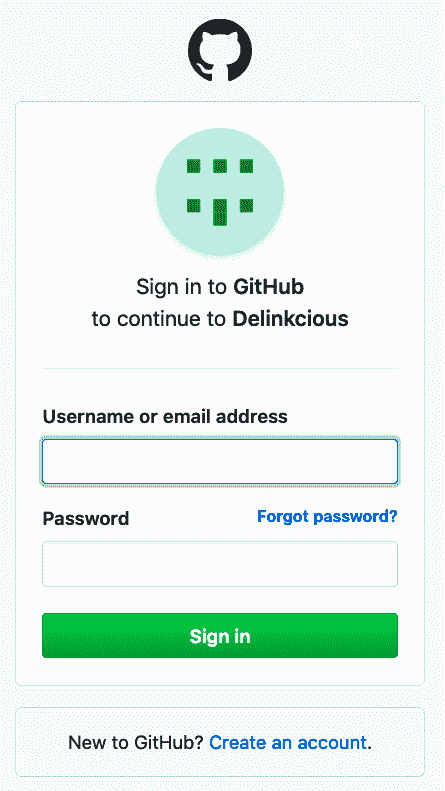
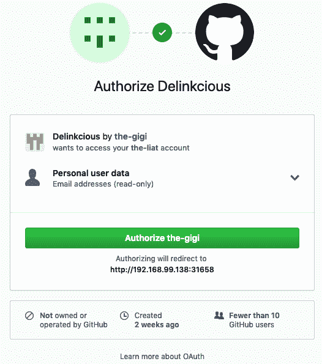
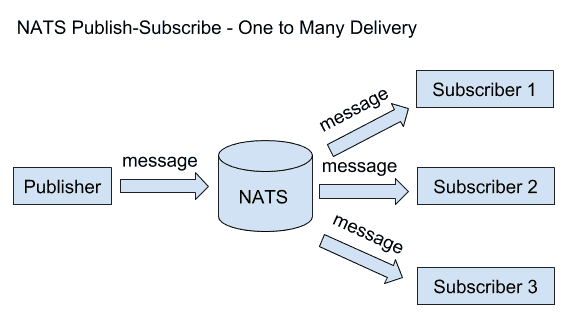

# 七、与世界对话——API和负载平衡器

在这一章中，我们最终将向世界开放 Delinkcious，让用户从集群之外与它进行交互。这一点很重要，因为德林奇用户无法访问集群内部运行的内部服务。我们将通过添加一个基于 Python 的 API 网关服务来显著扩展 Delinkcious 的功能，并向世界公开它(包括社交登录)。我们将添加一个基于 gRPC 的新闻服务，用户可以点击该服务获取他们关注的其他用户的新闻。最后，我们将添加一个消息队列，让服务以松散耦合的方式进行通信。

在本章中，我们将涵盖以下主题:

*   熟悉 Kubernetes 服务
*   东西向与南北向通信
*   了解入口和负载平衡
*   提供和使用公共的 REST 应用编程接口
*   提供和使用内部 gRPC 应用编程接口
*   通过消息队列发送和接收事件
*   准备服务网格

# 技术要求

在本章中，我们将向 Delinkcious 添加一个 Python 服务。没有必要安装任何新的东西。稍后我们将为 Python 服务构建一个 Docker 映像。

# 代码

你可以在这里找到更新的德令状应用:[https://github.com/the-gigi/delinkcious/releases/tag/v0.5](https://github.com/the-gigi/delinkcious/releases/tag/v0.5)

# 熟悉 Kubernetes 服务

豆荚(捆绑在一起的一个或多个容器)是 Kubernetes 中的工作单元。部署确保有足够的吊舱运行。然而，单个豆荚是短暂的。Kubernetes 服务是行动所在，也是您如何将您的 pods 作为一个连贯的服务展示给集群中的其他服务，甚至是外部世界。一个 Kubernetes 服务提供了一个稳定的身份，并且通常以 1:1 的比例映射到一个应用服务(可能是一个微服务或者传统的 fat 服务)。让我们看看所有的服务:

```
$ kubectl get svc
NAME                TYPE      CLUSTER-IP    EXTERNAL-IP   PORT(S)   AGE
api-gateway      LoadBalancer   10.103.167.102  <pending> 80:31965/TCP  6m2s
kubernetes         ClusterIP    10.96.0.1         <none>    443/TCP      25m
link-db            ClusterIP    10.107.131.61     <none>    5432/TCP     8m53s 
link-manager       ClusterIP    10.109.32.254     <none>    8080/TCP     8m53s
news-manager       ClusterIP    10.99.206.183     <none>    6060/TCP     7m45s
news-manager-redis ClusterIP     None             <none>    6379/TCP     7m45s
social-graph-db    ClusterIP    10.106.164.24     <none>    5432/TCP     8m38s
social-graph-manager ClusterIP   10.100.107.79    <none>    9090/TCP     8m37s
user-db             ClusterIP    None             <none>    5432/TCP     8m10s
user-manager        ClusterIP    10.108.45.93     <none>    7070/TCP     8m10s
```

您已经看到了如何使用 Kubernetes 服务部署 Delinkcious 微服务，以及它们如何通过 Kubernetes 提供的环境变量发现并相互调用。Kubernetes 还提供基于 DNS 的发现。

每个服务都可以通过域名在集群内访问:

```
<service name>.<namespace>.svc.cluster.local
```

我更喜欢使用环境变量，因为它允许我在 Kubernetes 之外运行服务进行测试。

以下是如何使用环境变量和域名系统找到`social-graph-manager`服务的 IP 地址:

```
$ dig +short social-graph-manager.default.svc.cluster.local
10.107.162.99

$ env | grep SOCIAL_GRAPH_MANAGER_SERVICE_HOST
SOCIAL_GRAPH_MANAGER_SERVICE_HOST=10.107.162.99
```

Kubernetes 通过指定一个标签选择器将一个服务与其支持的 pods 相关联。例如，如以下代码所示，`news-service`由带有`svc: link`和`app: manager`标签的豆荚支持:

```
spec:
  replicas: 1
  selector:
    matchLabels:
      svc: link
      app: manager
```

然后，Kubernetes 使用`endpoints`资源管理所有与标签选择器匹配的豆荚的 IP 地址，如下所示:

```
$ kubectl get endpoints
NAME                   ENDPOINTS                                            AGE
api-gateway            172.17.0.15:5000                                     1d
kubernetes             192.168.99.137:8443                                  51d
link-db                172.17.0.19:5432                                     40d
.
.
.
social-graph-db        172.17.0.16:5432                                     50d
social-graph-manager   172.17.0.18:9090                                     43d
```

`endpoints`资源总是保持一个服务的所有支持单元的 IP 地址和端口的最新列表。当用另一个 IP 地址和端口添加、移除或重新创建吊舱时，`endpoints`资源被更新。现在，让我们看看 Kubernetes 中有哪些类型的服务。

# 库伯内的典型服务

Kubernetes 服务总是有一个类型。了解何时使用每种类型的服务很重要。让我们看一下各种服务类型及其区别:

*   **集群 IP(默认)**:集群 IP 类型意味着服务只能在集群内部访问。这是默认设置，非常适合微服务之间的通信。出于测试目的，您可以使用`kube-proxy`或`port-forwarding`公开此类服务。这也是查看 Kubernetes 仪表板或内部服务的其他 ui 的好方法，例如 Delinkcious 中的 Argo CD。

如果没有指定集群 IP 的类型，将`ClusterIP`设置为`None`。

*   **节点端口**:节点端口类型的服务通过所有节点上的专用端口向世界公开。您可以通过`<Node IP>:<NodePort>`访问服务。如果您自己运行，节点端口将从您可以通过`--service-node-port-range`控制的范围中选择到 Kubernetes API 服务器(默认情况下，这是 30000-32767)。

您还可以在服务定义中显式指定节点端口。如果您有许多通过您指定的节点端口公开的服务，您必须小心管理这些端口以避免冲突。当请求通过专用节点端口进入任何节点时，kubelet 将负责将其转发到其上有一个后备吊舱的节点(您可以通过端点找到它)。

*   **负载平衡器**:当您的 Kubernetes 集群运行在提供负载平衡器支持的云平台上时，这种类型的服务最为常见。尽管本地集群也有 Kubernetes 感知的负载平衡器，但外部负载平衡器将负责接受外部请求，并通过服务将它们路由到支持单元。通常会有特定于云提供商的复杂情况，例如特殊注释或必须创建双重服务来处理内部和外部请求。我们将使用 LoadBalancer 类型向 minikube 世界公开 Delinkcious，minikube 提供了一个负载平衡器仿真。
*   **外部域名**:这些服务只是将对服务的请求解析为外部提供的域名。如果您的服务需要与不在集群中运行的外部服务进行对话，但是您仍然希望能够找到它们，就像它们是 Kubernetes 服务一样，这将非常有用。如果您计划在某个时候将这些外部服务迁移到集群，这可能会很有用。

现在我们已经了解了服务的含义，让我们来讨论一下集群内部的跨服务通信和在集群外部公开服务之间的区别。

# 东西向与南北向通信

东西方通信是指服务/吊舱/容器在集群内部相互通信。您可能还记得，Kubernetes 通过 DNS 和环境变量公开了集群内部的所有服务。这解决了集群内部的服务发现问题。您可以通过网络策略或其他机制实施进一步的限制。比如在 [第五章](05.html)*用 Kubernetes* 配置微服务，我们建立了链接服务和社交图服务的相互认证。

南北交流是向世界展示服务。理论上，您可以只通过节点端口公开您的服务，但是这种方法受到许多问题的困扰，包括以下问题:

*   你必须自己处理安全/加密传输
*   您无法控制哪些吊舱将实际服务请求
*   您必须让 Kubernetes 为您的服务选择随机端口，或者小心管理端口冲突
*   每个端口只能暴露一个服务(例如梦寐以求的端口`80`不能重复使用)

通过入口控制器和/或负载平衡器使用生产批准的方法来公开您的服务。

# 了解入口和负载平衡

Kubernetes 中的入口概念是关于控制对您的服务的访问，并可能提供额外的功能，例如:

*   SSL 终端
*   证明
*   路由到多个服务

有一个入口资源为其他相关信息定义路由规则，还有一个入口控制器读取集群中定义的所有入口资源(跨所有名称空间)。入口资源接收所有请求，并路由到目标服务，目标服务将这些请求分发到支持单元。入口控制器充当集群范围的软件负载平衡器和路由器。通常，会有一个硬件负载平衡器位于集群的前面，并将所有流量发送到入口控制器。

让我们继续将所有这些概念放在一起，并通过添加一个公共的 API 网关向世界展示 Delinkcious。

# 提供和使用公共的 REST 应用编程接口

在本节中，我们将在 Python 中构建一个全新的服务(API 网关)，以证明 Kubernetes 确实是语言无关的。然后，我们将通过 OAuth2 添加用户身份验证，并在外部公开 API 网关服务。

# 构建基于 Python 的应用编程接口网关服务

应用编程接口网关服务旨在接收来自集群外部的所有请求，并将它们路由到适当的服务。这是目录的结构:

```
$ tree
 .
 ├── Dockerfile
 ├── README.md
 ├── api_gateway_service
 │   ├── __init__.py
 │   ├── api.py
 │   ├── config.py
 │   ├── news_client.py
 │   ├── news_client_test.py
 │   ├── news_pb2.py
 │   ├── news_pb2_grpc.py
 │   └── resources.py
 ├── k8s
 │   ├── api_gateway.yaml
 │   ├── configmap.yaml
 │   └── secrets.yaml
 ├── requirements.txt
 ├── run.py
 └── tests
 └── api_gateway_service_test.py
```

这与 Go 服务有些不同。代码在`api_gateway_service`目录下，也是 Python 包。Kubernetes 资源在`k8s`子目录下，还有一个`tests`子目录。在顶部目录中，`run.py`文件是入口点，如`Dockerfile`中所定义的。`run.py`中的`main()`功能调用从`api.py`模块导入的应用的`app.run()`方法:

```
import os
from api_gateway_service.api import app

def main():
    port = int(os.environ.get('PORT', 5000))
    login_url = 'http://localhost:{}/login'.format(port)
    print('If you run locally, browse to', login_url)
    host = '0.0.0.0'
    app.run(host=host, port=port)

if __name__ == "__main__":
    main()
```

`api.py`模块负责创建 app，挂接路由，实现社交登录。

# 实现社交登录

`api-gateway`服务利用几个 Python 包来帮助通过 GitHub 实现社交登录。稍后，我们将介绍用户流，但首先，我们将看一下实现它的代码。`login()`方法是联系 GitHub，向当前用户请求授权，当前用户必须登录 GitHub，并向 Delinkcious 授权。

`logout()`方法刚刚从当前会话中移除了访问令牌。`authorized()`方法在成功登录后被 GitHub 作为重定向调用，并提供一个访问令牌，在用户的浏览器中显示给用户。此访问令牌必须作为标头传递给 API 网关的所有未来请求:

```
@app.route('/login')
def login():
    callback = url_for('authorized', _external=True)
    result = app.github.authorize(callback)
    return result

@app.route('/login/authorized')
def authorized():
    resp = app.github.authorized_response()
    if resp is None:
        # return 'Access denied: reason=%s error=%s' % (
        #     request.args['error'],
        #     request.args['error_description']
        # )
        abort(401, message='Access denied!')
    token = resp['access_token']
    # Must be in a list or tuple because github auth code extracts the first
    user = app.github.get('user', token=(token,))
    user.data['access_token'] = token
    return jsonify(user.data)

@app.route('/logout')
def logout():
    session.pop('github_token', None)
    return 'OK'
```

当用户传递有效的访问令牌时，Delinkcious 可以从 GitHub 中检索他们的姓名和电子邮件。如果访问令牌丢失或无效，请求将被拒绝，并出现 401 拒绝访问错误。这发生在`resources.py`的`_get_user()`功能中:

```
def _get_user():
    """Get the user object or create it based on the token in the session

    If there is no access token abort with 401 message
    """
    if 'Access-Token' not in request.headers:
        abort(401, message='Access Denied!')

    token = request.headers['Access-Token']
    user_data = github.get('user', token=dict(access_token=token)).data
    if 'email' not in user_data:
        abort(401, message='Access Denied!')

    email = user_data['email']
    name = user_data['name']

    return name, email
```

GitHub 对象是在`api.py`模块的`create_app()`功能中创建和初始化的。首先，它导入了几个第三方库，即`Flask`、`OAuth`和`Api`类:

```
import os

from flask import Flask, url_for, session, jsonify
from flask_oauthlib.client import OAuth
from flask_restful import Api, abort
from . import resources
from .resources import Link
```

然后，它用 GitHub `Oauth`提供程序初始化`Flask`应用:

```
def create_app():
    app = Flask(__name__)
    app.config.from_object('api_gateway_service.config')
    oauth = OAuth(app)
    github = oauth.remote_app(
        'github',
        consumer_key=os.environ['GITHUB_CLIENT_ID'],
        consumer_secret=os.environ['GITHUB_CLIENT_SECRET'],
        request_token_params={'scope': 'user:email'},
        base_url='https://api.github.com/',
        request_token_url=None,
        access_token_method='POST',
        access_token_url='https://github.com/login/oauth/access_token',
        authorize_url='https://github.com/login/oauth/authorize')
    github._tokengetter = lambda: session.get('github_token')
    resources.github = app.github = github
```

最后，设置路由图并存储初始化的`app`对象:

```
api = Api(app)
    resource_map = (
        (Link, '/v1.0/links'),
    )

    for resource, route in resource_map:
        api.add_resource(resource, route)

    return app

app = create_app()
```

# 将流量路由到内部微服务

API 网关服务的主要工作是实现我们在[第 2 章](02.html)、*微服务入门*中讨论的 API 网关模式。例如，下面是它如何将获取链接请求路由到链接微服务的正确方法。

`Link`类派生自`Resource`基类。它从环境中获取主机和端口，并构造基本 URL。

当对`links`端点的获取请求到来时，调用`get()`方法。它从`_get_user()`函数中的 GitHub 令牌中提取用户名，并解析请求 URL 的查询部分以获得其他参数。然后，它向链接管理器服务发出自己的请求:

```
class Link(Resource):
    host = os.environ.get('LINK_MANAGER_SERVICE_HOST', 'localhost')
    port = os.environ.get('LINK_MANAGER_SERVICE_PORT', '8080')
    base_url = 'http://{}:{}/links'.format(host, port)

    def get(self):
        """Get all links

        If user doesn't exist create it (with no goals)
        """
        username, email = _get_user()
        parser = RequestParser()
        parser.add_argument('url_regex', type=str, required=False)
        parser.add_argument('title_regex', type=str, required=False)
        parser.add_argument('description_regex', type=str, required=False)
        parser.add_argument('tag', type=str, required=False)
        parser.add_argument('start_token', type=str, required=False)
        args = parser.parse_args()
        args.update(username=username)
        r = requests.get(self.base_url, params=args)

        if not r.ok:
            abort(r.status_code, message=r.content)

        return r.json()
```

# 利用基本 Docker 映像减少构建时间

当我们为 Delinkcious 构建 Go 微服务时，我们使用了 scratch 映像作为基础，只是复制了 Go 二进制文件。这些映像超级轻便，不到 10 MB。然而，API 网关几乎是 500 MB，即使使用`python:alpine`时也是如此，这比标准的基于 Debian 的 Python 映像要轻得多:

```
$ docker images | grep g1g1.*0.3
g1g1/delinkcious-user              0.3    07bcc08b1d73   38 hours ago    6.09MB
g1g1/delinkcious-social-graph      0.3    0be0e9e55689   38 hours ago    6.37MB
g1g1/delinkcious-news              0.3    0ccd600f2190   38 hours ago    8.94MB
g1g1/delinkcious-link              0.3    9fcd7aaf9a98   38 hours ago    6.95MB
g1g1/delinkcious-api-gateway       0.3    d5778d95219d   38 hours ago    493MB
```

此外，API 网关需要构建一些到本机库的绑定。安装 C/C++工具链，然后构建本机库需要很长时间(超过 15 分钟)。Docker 在这里闪耀着可重用的层和基础映像。我们可以在`svc/shared/docker/python_flask_grpc/Dockerfile`将所有重量级的素材放入一个单独的基础映像中:

```
FROM python:alpine
RUN apk add build-base
COPY requirements.txt /tmp
WORKDIR /tmp
RUN pip install -r requirements.txt
```

`requirements.txt`文件包含执行社交登录并需要使用 gRPC 服务的`Flask`应用的依赖关系(稍后将对此进行详细介绍):

```
requests-oauthlib==1.1.0
Flask-OAuthlib==0.9.5
Flask-RESTful==0.3.7
grpcio==1.18.0
grpcio-tools==1.18.0
```

有了所有这些，我们就可以构建基础映像，然后 API 网关 Dockerfile 就可以基于它了。以下是`svc/shared/docker/python_flask_grpc/build.sh`处的超简单构建脚本，它构建基础映像并将其推送到 DockerHub:

```
IMAGE=g1g1/delinkcious-python-flask-grpc:0.1
docker build . -t $IMAGE
docker push $IMAGE
```

让我们看看`svc/api_gateway_service/Dockerfile`处的 API 网关服务的 Dockerfile。它基于我们的基本形象。然后复制`api_gate_service`目录，暴露`5000`端口，执行`run.py`脚本:

```
FROM g1g1/delinkcious-python-flask-grpc:0.1
MAINTAINER Gigi Sayfan "the.gigi@gmail.com"
COPY . /api_gateway_service
WORKDIR /api_gateway_service
EXPOSE 5000
ENTRYPOINT python run.py
```

好处是，只要重基础映像不变，那么对实际的 API 服务网关代码进行更改将导致快速的 Docker 映像构建。我们说的是几秒钟，而不是 15 分钟。在这一点上，我们有了一个很好的、快速的 API 网关服务的构建-测试-调试-部署。现在是向集群添加入口的好时机。

# 添加入口

在 Minikube 上，您必须启用入口插件:

```
$ minikube addons enable ingress 
 ingress was successfully enabled
```

在其他 Kubernetes 集群上，您可能希望安装自己喜欢的入口控制器(如 Contour、Traefik 或 Ambassador)。

下面的代码用于应用编程接口网关服务的入口清单。通过使用这种模式，我们的整个集群将有一个入口，将每个请求汇集到我们的 API 网关服务，该服务将把它路由到适当的内部服务:

```
apiVersion: extensions/v1beta1
kind: Ingress
metadata:
  name: api-gateway
  annotations:
    nginx.ingress.kubernetes.io/rewrite-target: /
spec:
  rules:
  - host: delinkcio.us
    http:
      paths:
      - path: /*
        backend:
          serviceName: api-gateway
          servicePort: 80
```

单一入口服务简单有效。在大多数云平台上，您按入口资源付费，因为每个入口资源都有一个负载平衡器。您可以轻松地扩展 API 网关实例的数量，因为它是完全无状态的。

Minikube does a lot of magic under the covers with networking, simulating load balancers, and tunneling traffic. I don't recommend using Minikube to test ingress to the cluster. Instead, we will use a service of the LoadBalancer type and access it through the Minikube cluster IP.

# 验证应用编程接口网关在集群外部可用

Delinkcious 使用 GitHub 作为社交登录提供者。你必须有一个 GitHub 账号来跟进。

用户流程如下:

1.  找到描述网址(在 Minikube 上，这将经常改变)。
2.  登录并获取访问令牌。
3.  从集群外部点击德林奇应用编程接口网关。

让我们深入研究一下这个细节。

# 找到美味的网址

在生产集群中，您将配置一个众所周知的域名，并将一个负载平衡器连接到该名称。使用 Minikube，我们可以使用以下命令获取 API 网关服务 URL:

```
$ minikube service api-gateway --url
http://192.168.99.138:31658
```

可以方便地将其存储在环境变量中，以便与命令交互使用，如下所示:

```
$ export DELINKCIOUS_URL=$(minikube service api-gateway --url)
```

# 获取访问令牌

以下是获取访问令牌的步骤:

1.  现在我们有了 API 网关 URL，可以浏览到登录端点，也就是`http://192.168.99.138:31658/login`。如果您已登录 GitHub 帐户，您将看到以下对话框:



2.  接下来，如果这是您第一次登录德林奇，GitHub 将要求您授权德林奇访问您的电子邮件和姓名:



3.  如果您同意这样做，那么您将被重定向到一个页面，该页面将向您显示关于您的 GitHub 配置文件的许多信息，但最重要的是，为您提供一个访问令牌，如下图所示:


让我们也将访问令牌存储在一个环境变量中:

```
$ export DELINKCIOUS_TOKEN=def7de18d9c05ce139e37140871a9d16fd37ea9d
```

既然我们已经获得了从外部访问德林契亚所需的所有信息，让我们进行一次试驾。

# 从集群外部访问美味的 api 网关

我们将使用 HTTPie 在`${DELINKCIOUS_URL}/v1.0/links`命中 API 网关端点。要进行身份验证，我们必须提供访问令牌作为报头，即`"Access-Token: ${DELINKCIOUS_TOKEN}"`。

从头开始，让我们验证没有任何链接:

```
$ http "${DELINKCIOUS_URL}/v1.0/links" "Access-Token: ${DELINKCIOUS_TOKEN}"
HTTP/1.0 200 OK
Content-Length: 27
Content-Type: application/json
Date: Mon, 04 Mar 2019 00:52:18 GMT
Server: Werkzeug/0.14.1 Python/3.7.2

{
    "err": "",
    "links": null
}
```

好的——到目前为止，一切顺利。让我们通过向`/v1.0/links`端点发送一个 POST 请求来添加几个链接。这里是第一个链接:

```
$ http POST "${DELINKCIOUS_URL}/v1.0/links" "Access-Token: ${DELINKCIOUS_TOKEN}" url=http://gg.com title=example
HTTP/1.0 200 OK
Content-Length: 12
Content-Type: application/json
Date: Mon, 04 Mar 2019 00:52:49 GMT
Server: Werkzeug/0.14.1 Python/3.7.2

{
    "err": ""
}
```

这是第二个环节:

```
$ http POST "${DELINKCIOUS_URL}/v1.0/links" "Access-Token: ${DELINKCIOUS_TOKEN}" url=http://gg2.com title=example
HTTP/1.0 200 OK
Content-Length: 12
Content-Type: application/json
Date: Mon, 04 Mar 2019 00:52:49 GMT
Server: Werkzeug/0.14.1 Python/3.7.2

{
    "err": ""
}
```

没有错误。太好了。通过再次获取链接，我们可以看到刚刚添加的新链接:

```
$ http "${DELINKCIOUS_URL}/v1.0/links" "Access-Token: ${DELINKCIOUS_TOKEN}"
HTTP/1.0 200 OK
Content-Length: 330
Content-Type: application/json
Date: Mon, 04 Mar 2019 00:52:52 GMT
Server: Werkzeug/0.14.1 Python/3.7.2

{
    "err": "",
    "links": [
        {
            "CreatedAt": "2019-03-04T00:52:35Z",
            "Description": "",
            "Tags": null,
            "Title": "example",
            "UpdatedAt": "2019-03-04T00:52:35Z",
            "Url": "http://gg.com"
        },
        {
            "CreatedAt": "2019-03-04T00:52:48Z",
            "Description": "",
            "Tags": null,
            "Title": "example",
            "UpdatedAt": "2019-03-04T00:52:48Z",
            "Url": "http://gg2.com"
        }
    ]
}
```

我们已经成功地建立了一个端到端的流程，包括用户身份验证，从而击中了一个 Python API 网关服务，该服务通过其内部的 HTTP REST API 与 Go 微服务对话，并将信息存储在关系数据库中。现在，让我们加大赌注，再增加一项服务。

这一次，它将是一个使用 gRPC 传输的 Go 微服务。

# 提供和使用内部 gRPC 应用编程接口

我们将在本节中实现的服务称为新闻服务。它的工作是跟踪链接事件，如添加链接或更新链接，并向用户返回新事件。

# 定义新闻管理器界面

这个界面公开了一个单一的`GetNews()`方法。用户可以调用它，并从他们关注的用户那里接收链接事件列表。这是 Go 接口和相关的结构。它并没有变得更简单:一个单一的方法，带有一个带有`username`和`token`字段的请求结构，以及一个结果结构。生成的结构包含具有以下信息的`Event`结构列表:`EventType`、`Username`、`Url`和`Timestamp`:

```
type NewsManager interface {
        GetNews(request GetNewsRequest) (GetNewsResult, error)
}

type GetNewsRequest struct {
        Username   string
        StartToken string
}

type Event struct {
        EventType EventTypeEnum
        Username  string
        Url       string
        Timestamp time.Time
}

type GetNewsResult struct {
        Events    []*Event
        NextToken string
}
```

# 实现新闻管理器包

核心逻辑服务的实现在`pkg/news_manager`。我们来看看`new_manager.go`文件。`NewsManager`结构有一个名为`eventStore`的`InMemoryNewsStore`，它为`NewsManager`接口实现了`GetNews()`方法。它将实际获取新闻的工作委托给商店。

但是，它知道分页，并负责将令牌从字符串转换为整数，以匹配存储首选项:

```
package news_manager

import (
        "errors"
        "github.com/the-gigi/delinkcious/pkg/link_manager_events"
        om "github.com/the-gigi/delinkcious/pkg/object_model"
        "strconv"
        "time"
)

type NewsManager struct {
        eventStore *InMemoryNewsStore
}

func (m *NewsManager) GetNews(req om.GetNewsRequest) (resp om.GetNewsResult, err error) {
        if req.Username == "" {
                err = errors.New("user name can't be empty")
                return
        }

        startIndex := 0
        if req.StartToken != "" {
                startIndex, err := strconv.Atoi(req.StartToken)
                if err != nil || startIndex < 0 {
                        err = errors.New("invalid start token: " + req.StartToken)
                        return resp, err
                }
        }

        events, nextIndex, err := m.eventStore.GetNews(req.Username, startIndex)
        if err != nil {
                return
        }

        resp.Events = events
        if nextIndex != -1 {
                resp.NextToken = strconv.Itoa(nextIndex)
        }

        return
}
```

该存储非常简单，只保留用户名和所有事件之间的映射，如下所示:

```
package news_manager

import (
        "errors"
        om "github.com/the-gigi/delinkcious/pkg/object_model"
)

const maxPageSize = 10

// User events are a map of username:userEvents
type userEvents map[string][]*om.Event

// InMemoryNewsStore manages a UserEvents data structure
type InMemoryNewsStore struct {
        userEvents userEvents
}

func NewInMemoryNewsStore() *InMemoryNewsStore {
        return &InMemoryNewsStore{userEvents{}}
}
```

商店实现自己的`GetNews()`方法(与`interface`方法不同的签名)。它只是根据起始索引和最大页面大小为目标用户返回请求的切片:

```
func (m *InMemoryNewsStore) GetNews(username string, startIndex int) (events []*om.Event, nextIndex int, err error) {
        userEvents := m.userEvents[username]
        if startIndex > len(userEvents) {
                err = errors.New("Index out of bounds")
                return
        }

        pageSize := len(userEvents) - startIndex
        if pageSize > maxPageSize {
                pageSize = maxPageSize
                nextIndex = startIndex + maxPageSize
        } else {
                nextIndex = -1
        }

        events = userEvents[startIndex : startIndex+pageSize]
        return
}
```

它还有一种添加新事件的方法:

```
func (m *InMemoryNewsStore) AddEvent(username string, event *om.Event) (err error) {
        if username == "" {
                err = errors.New("user name can't be empty")
                return
        }

        if event == nil {
                err = errors.New("event can't be nil")
                return
        }

        if m.userEvents[username] == nil {
                m.userEvents[username] = []*om.Event{}
        }

        m.userEvents[username] = append(m.userEvents[username], event)
        return
}
```

现在我们已经实现了存储和向用户提供新闻的核心逻辑，让我们看看如何将这一功能公开为 gRPC 服务。

# 将新闻管理器公开为 gRPC 服务

在深入研究新闻服务的 gRPC 实现之前，让我们先来看看这一切都是为了什么。gRPC 是用于互连服务和应用的有线协议、有效载荷格式、概念框架和代码生成工具的集合。它起源于谷歌(因此是 gRPC 中的 g)，是一个高性能和成熟的 RPC 框架。它有许多优点，例如:

*   跨平台
*   行业广泛采用
*   所有相关编程语言的惯用客户端库
*   极其高效的有线协议
*   强类型合同的 Google 协议缓冲区
*   HTTP/2 支持支持双向流
*   高度可扩展(自定义您自己的身份验证、授权、负载平衡和运行状况检查)
*   优秀的文档

底线是，对于内部微服务，它在几乎所有方面都优于基于 HTTP 的 REST APIs。

对于德林奇来说，这非常合适，因为我们选择的作为微服务框架的 Go-kit 对 gRPC 有很好的支持。

# 定义 gRPC 服务合同

gRPC 要求您在受协议缓冲区启发的特殊 DSL 中为您的服务定义合同。它非常直观，让 gRPC 为您生成大量样板代码。我选择将合同和生成的代码放在一个名为**Pb**(T2 协议缓冲区的通用简称)的独立顶层目录中，因为生成代码的不同部分将被服务和消费者使用。在这些情况下，通常最好将共享代码放在一个单独的位置，而不是随意地将其扔进服务或客户端。

以下是`pb/new-service/pb/news.proto`文件:

```
syntax = "proto3";
package pb;

import "google/protobuf/timestamp.proto";

service News {
    rpc GetNews(GetNewsRequest) returns (GetNewsResponse) {}
}

message GetNewsRequest {
    string username = 1;
    string startToken = 2;
}

enum EventType {
    LINK_ADDED = 0;
    LINK_UPDATED = 1;
    LINK_DELETED = 2;
}

message Event  {
        EventType eventType = 1;
        string username = 2;
        string url = 3;
        google.protobuf.Timestamp timestamp = 4;
}

message GetNewsResponse {
        repeated Event events = 1;
        string nextToken = 2;
    string err = 3;
}
```

我们不需要检查每一行的语法和意思。简而言之，请求和响应总是消息。服务级别错误需要嵌入到响应消息中。其他错误，如网络或无效有效负载，将单独报告。一个有趣的花絮是，除了原始数据类型和嵌入消息之外，您还可以使用其他高级类型，例如`google.protobuf.Timestamp`数据类型。这极大地提升了抽象级别，并带来了对日期和时间戳之类的东西进行强类型化的好处，在通过 HTTP/REST 使用 JSON 时，您总是需要对这些东西进行序列化和反序列化。

服务定义很酷，但是我们需要一些实际的代码来连接这些点。让我们看看 gRPC 如何帮助完成这项任务。

# 使用 gRPC 生成服务存根和客户端库

gRPC 模型用于使用名为`protoc`的工具生成服务存根和客户端库。我们需要为新闻服务本身生成 Go 代码，并为使用它的 API 网关生成 Python 代码。

您可以通过运行以下命令来生成`news.pb.go`:

```
protoc --go_out=plugins=grpc:. news.proto
```

您可以通过运行以下命令来生成`news_pb2.py`和`news_pb2_grpc.py`:

```
python -m grpc_tools.protoc -I. --python_out=. --grpc_python_out=. news.proto
```

此时，Go 客户端代码和 Python 客户端代码都可以用来从 Go 代码或 Python 代码调用新闻服务。

# 使用工具包构建新闻管理器服务

这里是`news_service.go`中服务本身的实现。它看起来非常类似于一个 HTTP 服务。让我们剖析重要的部分。首先，它导入了一些库，包括在`pb/news-service-pb`、`pkg/news_manager`中生成的 gRPC 代码，以及一个名为`google.golang.org/grpc`的通用 gRPC 库。在`Run()`功能开始时，它让`service`端口监听环境:

```
package service

import (
        "fmt"
        "github.com/the-gigi/delinkcious/pb/news_service/pb"
        nm "github.com/the-gigi/delinkcious/pkg/news_manager"
        "google.golang.org/grpc"
        "log"
        "net"
        "os"
)

func Run() {
        port := os.Getenv("PORT")
        if port == "" {
                port = "6060"
        }
```

现在，我们需要在目标端口上创建一个标准的 TCP 侦听器:

```
listener, err := net.Listen("tcp", ":"+port)
        if err != nil {
                log.Fatal(err)
        }
```

此外，我们必须连接到 NATS 消息队列服务。我们将在下一节详细讨论这一点:

```
natsHostname := os.Getenv("NATS_CLUSTER_SERVICE_HOST")
        natsPort := os.Getenv("NATS_CLUSTER_SERVICE_PORT")
```

下面是主要的初始化代码。它实例化一个新的新闻管理器，创建一个新的 gRPC 服务器，创建一个新闻管理器对象，并向 gRPC 服务器注册新闻管理器。`pb.RegisterNewsManager()`方法由 gRPC 从`news.proto`文件生成:

```
svc, err := nm.NewNewsManager(natsHostname, natsPort)
        if err != nil {
                log.Fatal(err)
        }

        gRPCServer := grpc.NewServer()
        newsServer := newNewsServer(svc)
        pb.RegisterNewsServer(gRPCServer, newsServer)
```

最后，gRPC 服务器开始监听 TCP 侦听器:

```
fmt.Printf("News service is listening on port %s...\n", port)
        err = gRPCServer.Serve(listener)
        fmt.Println("Serve() failed", err)
}
```

# 实施 gRPC 传输

最后一块拼图是在`transport.go`文件中实现 gRPC 传输。它在概念上类似于 HTTP 传输，但是有一些细节是不同的。让我们把它分解一下，这样就清楚了所有的部分是如何组合在一起的。

首先，所有相关的包裹都是进口的，包括从 go-kit 运输的 gRPC。注意在`news_service.go`中，任何地方都没有提到 go-kit。您绝对可以直接在 Go 中使用通用 gRPC 库实现 gRPC 服务。但是，在这里，go-kit 将通过其服务和端点概念帮助使这变得更加容易:

```
package service

import (
        "context"
        "github.com/go-kit/kit/endpoint"
        grpctransport "github.com/go-kit/kit/transport/grpc"
        "github.com/golang/protobuf/ptypes/timestamp"
        "github.com/the-gigi/delinkcious/pb/news_service/pb"
        om "github.com/the-gigi/delinkcious/pkg/object_model"
)
```

`newEvent()`函数是一个助手，从我们的抽象对象模型到 gRPC 生成的事件对象采用`om.Event`。最重要的部分是转换事件类型和时间戳:

```
func newEvent(e *om.Event) (event *pb.Event) {
        event = &pb.Event{
                EventType: (pb.EventType)(e.EventType),
                Username:  e.Username,
                Url:       e.Url,
        }

        seconds := e.Timestamp.Unix()
        nanos := (int32(e.Timestamp.UnixNano() - 1e9*seconds))
        event.Timestamp = &timestamp.Timestamp{Seconds: seconds, Nanos: nanos}
        return
}
```

对请求进行解码并对响应进行编码非常简单——不需要序列化或反序列化任何 JSON 代码:

```
func decodeGetNewsRequest(_ context.Context, r interface{}) (interface{}, error) {
        request := r.(*pb.GetNewsRequest)
        return om.GetNewsRequest{
                Username:   request.Username,
                StartToken: request.StartToken,
        }, nil
}

func encodeGetNewsResponse(_ context.Context, r interface{}) (interface{}, error) {
        return r, nil
}
```

创建端点类似于您在其他服务中看到的 HTTP 传输。它调用实际的服务实现，然后翻译响应并处理错误(如果有):

```
func makeGetNewsEndpoint(svc om.NewsManager) endpoint.Endpoint {
        return func(_ context.Context, request interface{}) (interface{}, error) {
                req := request.(om.GetNewsRequest)
                r, err := svc.GetNews(req)
                res := &pb.GetNewsResponse{
                        Events:    []*pb.Event{},
                        NextToken: r.NextToken,
                }
                if err != nil {
                        res.Err = err.Error()
                }
                for _, e := range r.Events {
                        event := newEvent(e)
                        res.Events = append(res.Events, event)
                }
                return res, nil
        }
}
```

处理程序从生成的代码中实现 gRPC 新闻接口:

```
type handler struct {
        getNews grpctransport.Handler
}

func (s *handler) GetNews(ctx context.Context, r *pb.GetNewsRequest) (*pb.GetNewsResponse, error) {
        _, resp, err := s.getNews.ServeGRPC(ctx, r)
        if err != nil {
                return nil, err
        }

        return resp.(*pb.GetNewsResponse), nil
}
```

`newNewsServer()`功能将一切联系在一起。它返回一个包装在连接端点、请求解码器和响应编码器的 Go-kit 处理程序中的 gRPC 处理程序:

```
func newNewsServer(svc om.NewsManager) pb.NewsServer {
        return &handler{
                getNews: grpctransport.NewServer(
                        makeGetNewsEndpoint(svc),
                        decodeGetNewsRequest,
                        encodeGetNewsResponse,
                ),
        }
}
```

这可能看起来非常混乱，有所有的层和嵌套函数，但底线是您必须编写非常少的粘合代码(并且可以生成它，这是理想的)，并最终得到一个非常干净、安全(强类型)和高效的 gRPC 服务。

现在我们有了一个可以提供新闻的 gRPC 新闻服务，让我们看看如何向它提供新闻。

# 通过消息队列发送和接收事件

新闻服务需要为每个用户存储链接事件。链接服务知道不同用户何时添加、更新或删除链接。解决这个问题的一种方法是向新闻服务添加另一个应用编程接口，并让链接服务调用这个应用编程接口，并为每个相关事件通知新闻服务。然而，这种方法在链接服务和新闻服务之间建立了紧密的耦合。链接服务并不真正关心新闻服务，因为它不需要任何东西。相反，让我们寻找一个松散耦合的解决方案。链接服务只是将事件发送到通用消息队列服务。然后，独立地，新闻服务将订阅从该消息队列接收消息。这种方法有以下几个好处:

*   不需要更复杂的服务代码
*   非常适合事件通知的交互模型
*   在不更改代码的情况下，很容易向相同的事件添加额外的侦听器

我这里使用的术语，即*消息*、*事件*和*通知*是可以互换的。这种想法是，一个来源有一些信息可以用一种不劳而获的方式与世界分享。

它不需要知道谁对信息感兴趣(这可能是没有人或多个听众)以及它是否被成功处理。Delinkcious 使用 NATS 消息传递系统在服务之间进行松散耦合的通信。

# 什么是 NATS？

NATS([https://nats.io/](https://nats.io/))是一个开源的消息队列服务。这是一个在 Go 中实现的**云原生计算基金会** ( **CNCF** )项目，当你在 Kubernetes 中需要一个消息队列时，它被认为是最有力的竞争者之一。NATS 支持多种消息传递模式，例如:

*   发布-订阅
*   请求-回复
*   排队

NATS 非常通用，可以用于许多用例。它也可以在高可用性集群中运行。对于 Delinkcious，我们将使用发布-订阅模型。下图说明了发布-订阅消息传递模型。发布者发布一条消息，所有订阅者都收到同一条消息:



让我们在集群中部署 NATS。

# 在集群中部署 NATS

首先，让我们安装 NATS 算子([https://github.com/nats-io/nats-operator](https://github.com/nats-io/nats-operator))。NATS 运营商帮助您管理库本内斯的 NATS 集群。下面是安装它的命令:

```
$ kubectl apply -f https://github.com/nats-io/nats-operator/releases/download/v0.4.5/00-prereqs.yaml
$ kubectl apply -f https://github.com/nats-io/nats-operator/releases/download/v0.4.5/10-deployment.yaml
```

NATS 运营商提供了一个 NatsCluster **自定义资源定义** ( **CRD** )我们将使用它在我们的 Kubernetes 集群中部署 NATS。不要被Kubernetes集群关系中的 NATS 集群所迷惑。这非常好，因为我们可以像内置的 Kubernetes 资源一样部署 NATS 集群。以下是`svc/shared/k8s/nats_cluster.yaml`中提供的 YAML 货单:

```
apiVersion: nats.io/v1alpha2
kind: NatsCluster
metadata:
  name: nats-cluster
spec:
  size: 1
  version: "1.3.0"
```

让我们使用`kubectl`来部署它，并验证它是否被正确部署:

```
$ kubectl apply -f nats_cluster.yaml
natscluster.nats.io "nats-cluster" configured

$ kubectl get svc -l app=nats
NAME                TYPE      CLUSTER-IP   EXTERNAL-IP   PORT(S)    AGE
nats-cluster       ClusterIP  10.102.48.27  <none>       4222/TCP    5d
nats-cluster-mgmt  ClusterIP   None         <none>        6222/TCP,8222/TCP,7777/TCP   5d
```

这看起来不错。在端口`4222`上监听的`nats-cluster`服务是 NATS 服务器。另一种服务是管理服务。让我们将一些事件发送到 NATS 服务器。

# 发送与 NATS 的链接事件

大家可能还记得，我们在对象模型中定义了一个`LinkManagerEvents`接口:

```
type LinkManagerEvents interface {
        OnLinkAdded(username string, link *Link)
        OnLinkUpdated(username string, link *Link)
        OnLinkDeleted(username string, url string)
}
```

`LinkManager`包通过其`NewLinkManager()`方法接收该事件链接:

```
func NewLinkManager(linkStore LinkStore,
        socialGraphManager om.SocialGraphManager,
        eventSink om.LinkManagerEvents,
        maxLinksPerUser int64) (om.LinkManager, error) {
        if linkStore == nil {
                return nil, errors.New("link store")
        }

        if eventSink != nil && socialGraphManager == nil {
                msg := "social graph manager can't be nil if event sink is not nil"
                return nil, errors.New(msg)
        }

        return &LinkManager{
                linkStore:          linkStore,
                socialGraphManager: socialGraphManager,
                eventSink:          eventSink,
                maxLinksPerUser:    maxLinksPerUser,
        }, nil
}
```

之后，当添加、更新或删除链接时，`LinkManager`会调用相应的`OnLinkXXX()`方法。例如，当调用`AddLink()`时，`OnLinkAdded()`方法在接收器上为每个从动件调用:

```
if m.eventSink != nil {
                followers, err := m.socialGraphManager.GetFollowers(request.Username)
                if err != nil {
                        return err
                }

                for follower := range followers {
                        m.eventSink.OnLinkAdded(follower, link)
                }
        }
```

这很好，但是这些事件如何到达 NATS 服务器呢？这就是链接服务出现的地方。当实例化`LinkManager`对象时，它将传递一个专用的事件发送器对象作为实现`LinkManagerEvents`的接收器。每当它收到诸如`OnLinkAdded()`或`OnLinkUpdated()`之类的事件时，它会将该事件发布到关于`link-events`主题的 NATS 服务器。暂时忽略`OnLinkDeleted()`事件。这个物体存在于`pkg/link_manager_events package/sender.go`:

```
package link_manager_events

import (
        "github.com/nats-io/go-nats"
        "log"

        om "github.com/the-gigi/delinkcious/pkg/object_model"
)

type eventSender struct {
        hostname string
        nats     *nats.EncodedConn
}
```

以下是`OnLinkAdded()`、`OnLinkUpdated()`和`OnLinkDeleted()`方法的实现:

```
func (s *eventSender) OnLinkAdded(username string, link *om.Link) {
        err := s.nats.Publish(subject, Event{om.LinkAdded, username, link})
        if err != nil {
                log.Fatal(err)
        }
}

func (s *eventSender) OnLinkUpdated(username string, link *om.Link) {
        err := s.nats.Publish(subject, Event{om.LinkUpdated, username, link})
        if err != nil {
                log.Fatal(err)
        }
}

func (s *eventSender) OnLinkDeleted(username string, url string) {
        // Ignore link delete events
}
```

`NewEventSender()`工厂功能接受 NATS 服务的 URL，并将事件发送到该服务，并返回一个`LinkManagerEvents`接口，该接口可以作为`LinkManager`的接收器:

```
func NewEventSender(url string) (om.LinkManagerEvents, error) {
        ec, err := connect(url)
        if err != nil {
                return nil, err
        }
        return &eventSender{hostname: url, nats: ec}, nil
}
```

现在，链接服务所要做的就是找出 NATS 服务器的网址。由于 NATS 服务器作为 Kubernetes 服务运行，它的主机名和端口可以通过环境变量获得，就像 Delinkcious 微服务一样。以下是来自链接服务`Run()`功能的相关代码:

```
natsHostname := os.Getenv("NATS_CLUSTER_SERVICE_HOST")
        natsPort := os.Getenv("NATS_CLUSTER_SERVICE_PORT")

        var eventSink om.LinkManagerEvents
        if natsHostname != "" {
                natsUrl := natsHostname + ":" + natsPort
                eventSink, err = nats.NewEventSender(natsUrl)
                if err != nil {
                        log.Fatal(err)
                }
        } else {
                eventSink = &EventSink{}
        }

        svc, err := lm.NewLinkManager(store, socialGraphClient, eventSink, maxLinksPerUser)
        if err != nil {
                log.Fatal(err)
        }
```

此时，每当为用户添加或更新新链接时，`LinkManager`将为每个关注者调用`OnLinkAdded()`或`OnLinkUpdated()`方法，这将导致该事件被发送到`link-events`主题上的 NATS 服务器，在那里所有订阅者都将接收到它并能够处理它。下一步是新闻服务订阅这些事件。

# 订阅与 NATS 的链接活动

新闻服务使用`pkg/link_manager_events/listener.go`中的`Listen()`功能。它接受 NATS 服务器的网址和一个实现`LinkManagerEvents`接口的事件接收器。它连接到 NATS 服务器，然后订阅`link-events`主题。这与事件发送者将这些事件发送到的主题相同:

```
package link_manager_events

import (
        om "github.com/the-gigi/delinkcious/pkg/object_model"
)

func Listen(url string, sink om.LinkManagerEvents) (err error) {
        conn, err := connect(url)
        if err != nil {
                return
        }

        conn.Subscribe(subject, func(e *Event) {
                switch e.EventType {
                case om.LinkAdded:
                        {
                                sink.OnLinkAdded(e.Username, e.Link)
                        }
                case om.LinkUpdated:
                        {
                                sink.OnLinkAdded(e.Username, e.Link)
                        }
                default:
                        // Ignore other event types
                }
        })

        return
}
```

现在，让我们看看定义`link-events`主题的`nats.go`文件，以及事件发送者和`Listen()`函数都使用的`connect()`函数。连接函数使用`go-nats`客户端建立连接，然后用 JSON 编码器包装它，这允许它发送和接收自动序列化的 Go 结构。这很好:

```
package link_manager_events

import "github.com/nats-io/go-nats"

const subject = "link-events"

func connect(url string) (encodedConn *nats.EncodedConn, err error) {
        conn, err := nats.Connect(url)
        if err != nil {
                return
        }

        encodedConn, err = nats.NewEncodedConn(conn, nats.JSON_ENCODER)
        return
}
```

新闻服务在其`NewNewsManager()`工厂功能中调用`Listen()`功能。首先，它实例化了实现`LinkManagerEvents`的新闻管理器对象。然后，`if`如果提供了 NATS 主机名，则组成一个 NATS 服务器 URL，并调用`Listen()`函数，从而将新闻管理器对象作为接收器传递:

```
func NewNewsManager(natsHostname string, natsPort string) (om.NewsManager, error) {
        nm := &NewsManager{eventStore: NewInMemoryNewsStore()}
        if natsHostname != "" {
                natsUrl := natsHostname + ":" + natsPort
                err := link_manager_events.Listen(natsUrl, nm)
                if err != nil {
                        return nil, err
                }
        }

        return nm, nil
}
```

下一步是对即将到来的事件做些什么。

# 处理链接事件

新闻管理器通过`NewNewsManager()`功能订阅了链接事件，结果是这些事件将作为调用到达`OnLinkAdded()`和`OnlinkUpdated()`(删除链接事件被忽略)。新闻管理器创建一个在抽象对象模型中定义的`Event`对象，用`EventType`、`Username`、`Url`和`Timestamp`填充它，然后调用事件存储的`AddEvent()`函数。以下是`OnLinkAdded()`方法:

```
func (m *NewsManager) OnLinkAdded(username string, link *om.Link) {
        event := &om.Event{
                EventType: om.LinkAdded,
                Username:  username,
                Url:       link.Url,
                Timestamp: time.Now().UTC(),
        }
        m.eventStore.AddEvent(username, event)
}
```

以下是`OnLinkUpdated()`方法:

```
func (m *NewsManager) OnLinkUpdated(username string, link *om.Link) {
        event := &om.Event{
                EventType: om.LinkUpdated,
                Username:  username,
                Url:       link.Url,
                Timestamp: time.Now().UTC(),
        }
        m.eventStore.AddEvent(username, event)
}
```

让我们看看商店用`AddEvent()`方法做了什么。很简单:订阅用户位于`userEvents`地图。如果它们还不存在，则创建一个空条目并添加新事件。如果目标用户呼叫`GetNews()`，他们将收到为他们收集的事件:

```
func (m *InMemoryNewsStore) AddEvent(username string, event *om.Event) (err error) {
        if username == "" {
                err = errors.New("user name can't be empty")
                return
        }
        if event == nil {
                err = errors.New("event can't be nil")
                return
        }
        if m.userEvents[username] == nil {
                m.userEvents[username] = []*om.Event{}
        }
        m.userEvents[username] = append(m.userEvents[username], event)
        return
}
```

以上就是我们对新闻服务及其通过 NATS 服务与链接管理器交互的报道。这是我们在[第 2 章](02.html)、*微服务入门*中讨论的**命令查询责任分离** ( **CQRS** )模式的应用。以下是德令状系统现在的样子:


现在我们已经了解了事件在德林奇是如何处理的，让我们快速了解一下服务网格。

# 了解服务网格

服务网格是运行在集群中的另一层管理。我们将在[第 13 章](13.html)、*服务网格-与 Istio* 合作中特别研究服务网格和 Istio。在这一点上，我只想提到，服务网格通常也扮演入口控制器的角色。

将服务网格用于入口的一个主要原因是，内置的入口资源非常一般，受到限制，并且存在多个问题，例如:

*   没有验证规则的好方法
*   入口资源可能会相互冲突
*   使用特定的入口控制器通常很复杂，需要自定义注释

# 摘要

在这一章中，我们完成了许多任务，并连接了所有的点。特别是，我们实现了两个微服务设计模式(API gateway 和 CQRS)，添加了一个用 Python 实现的全新服务(包括一个拆分的 Docker 基础映像)，添加了一个 gRPC 服务，向我们的集群添加了一个开源消息队列系统(NATS)，并将其与 pub-sub 消息传递集成在一起，最后，通过添加和获取 Delinkcious 的链接，向世界开放了我们的集群，并演示了端到端的交互。

在这一点上，德林奇可以被认为是阿尔法级软件。它是功能性的，但还没有接近生产就绪。在下一章中，我们将通过关注任何软件系统中最有价值的商品——数据，开始让德林契亚变得更加强大。Kubernetes 提供了许多用于管理数据和有状态服务的工具，我们将充分利用这些工具。

# 进一步阅读

有关本章内容的更多信息，您可以参考以下来源:

*   **Kubernetes 服务**:[https://Kubernetes . io/docs/concepts/services-networking/service/](https://kubernetes.io/docs/concepts/services-networking/service/)
*   **将你的应用作为服务公开**:[https://kubernetes . io/docs/tutorials/kubernetes-basic/expose/expose-intro/](https://kubernetes.io/docs/tutorials/kubernetes-basics/expose/expose-intro/)
*   **构建 Oauth 应用**:[https://developer.github.com/apps/building-oauth-apps/](https://developer.github.com/apps/building-oauth-apps/)
*   **高性能 gRPC**:[https://grpc.io/](https://grpc.io/)T4[http://www . devx . com/architect/高性能-服务-with-grpc.html](http://www.devx.com/architect/high-performance-services-with-grpc.html)
*   **NATs message broker**:[https://NATs . io/](https://nats.io/)