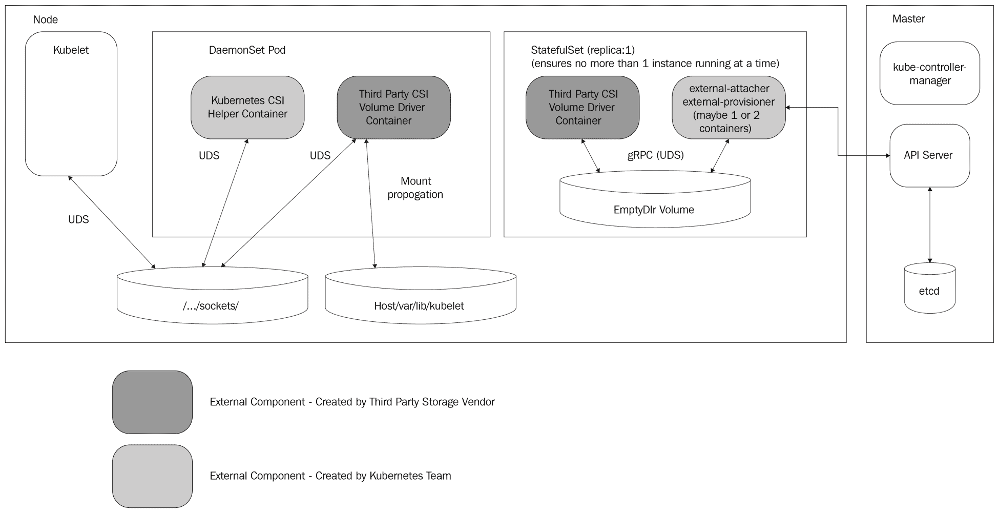

# 十四、微服务和 Kubernetes 的未来

未来的软件系统将更大、更复杂，能够处理更多的数据，并将对我们的世界产生更大的影响。想想自动驾驶汽车和无处不在的机器人。人类处理复杂性的能力不会扩展。这意味着我们将不得不使用分治法来构建那些复杂的软件系统。基于微服务的架构将继续取代单片。然后，挑战将转移到将所有这些微服务协调成一个连贯的整体。这就是 Kubernetes 作为标准编排解决方案的作用。

在本章中，我们将讨论微服务和 Kubernetes 的近期发展。我们将关注不久的将来，因为创新步伐惊人，试图向前看得更远是徒劳的。长期愿景是，人工智能可能会发展到大多数软件开发可以自动化的地步。在这一点上，人类对处理复杂性的限制可能不适用，人工智能开发的软件也不会被人类理解。

因此，让我们抛开遥远的未来，本着动手的精神，讨论未来几年将会出现的相关技术、标准和趋势，您可能希望了解这些技术、标准和趋势。

我们将讨论的主题包括一些微服务主题，例如:

*   微服务与无服务器功能
*   微服务、容器和编排
*   gRPC/gRPC-Web
*   HTTP/3
*   GraphQL(图形 SQL)

我们还将讨论一些 Kubernetes 主题:

*   无与伦比的可扩展性
*   服务网格集成
*   Kubernetes 上的无服务器计算
*   库比特和虚拟机
*   集群自动缩放
*   使用运算符

让我们从微服务开始。

# 微服务的未来

微服务是当今构建现代大规模系统的主要方法。但是，他们会继续是首选吗？我们来看看。

# 微服务与无服务器功能

关于微服务的未来，最大的问题之一是无服务器功能是否会使微服务过时。答案绝对不是。无服务器功能有很多好处，也有一些严重的限制，比如冷启动和时间限制。当函数调用其他函数时，这些限制就会累积。如果您想应用具有指数回退的重试逻辑，函数的执行时间限制是非常有问题的。长期运行的服务可以保持本地状态和与数据存储的连接，并更快地响应请求。但是，对我来说，无服务器功能最大的问题是它们代表一个功能，相当于一个服务的单个端点。我发现封装一个完整领域的服务的抽象很有价值。如果你试图用 10 种方法将一个服务移植到无服务器的函数中，那么你会遇到管理问题。

所有这 10 个函数都需要访问同一个数据存储，并且可能需要修改多个函数。所有的函数都需要相似的访问、配置和凭证来访问各种依赖关系。微服务仍将是大型云原生分布式系统的支柱。然而，许多工作将被卸载到无服务器功能，这是有道理的。我们可能会看到一些完全由无服务器函数组成的系统，但是这些将是被迫的，并且必须做出妥协。

让我们看看微服务和容器之间的共生关系。

# 微服务、容器和编排

当你把一个整体分解成微服务，或者从零开始构建一个基于微服务的系统时，你最终会得到很多服务。您需要打包、部署、升级和配置所有这些微服务。容器解决了包装问题。没有容器，很难扩展基于微服务的系统。随着系统中微服务数量的增长，各种容器和优化调度需要一个专用的解决方案。这是 Kubernetes 擅长的地方。分布式系统的未来是更多的微服务，打包成更多的容器，这需要 Kubernetes 来管理它们。我在这里说 Kubernetes，因为在 2019 年，Kubernetes 赢得了容器编排战。

许多微服务的另一个方面是它们需要通过网络相互通信。在单块中，大多数交互只是函数调用，在微服务环境中，许多交互需要到达端点或进行远程过程调用。输入 gRPC。

# gRPC 和 gRPC-Web

gRPC 是谷歌的远程过程调用协议。多年来，有许多 RPC 协议。我仍然记得 CORBA 和 DCOM 以及 Java RMI 的日子。快进到现代网络，REST 击败 SOAP，成为网络 API 领域的大大猩猩。但是，这些天，gRPC 正在击败 REST。gRPC 提供了一个基于契约的模型，具有强大的类型，基于 protobuf 的高效负载，并且正在自动生成客户端代码。组合非常强大。REST 的最后一个避难所是它的无处不在以及从浏览器中运行的网络应用中调用带有 JSON 有效载荷的 REST APIs 的便利性。

但是，即使是这种优势也正在消失。你总是可以在你的 gRPC 服务前面放一个 REST 兼容的 gRPC 网关，但是我认为这是一个错误的判断。另一方面，gRPC-web 是一个成熟的 JavaScript 库，它允许 web 应用简单地调用 gRPC 服务。参见[https://github . com/grpc/grpc-web/tree/master/packages/grpc-web](https://github.com/grpc/grpc-web/tree/master/packages/grpc-web)。

# GraphQL(图形 SQL)

如果说 gRPC 是集群内部的 REST 杀手，那么 GraphQL 就是边缘的 REST 杀手。GraphQL 只是一个优越的范例。它给了前端开发人员很大的自由来改进他们的设计。它将前端的需求与后端的严格 API 分离开来，并充当了完美的 BFF(后端对前端)模式。见[https://samnewman.io/patterns/architectural/bff/](https://samnewman.io/patterns/architectural/bff/)。

类似于 gRPC 合同，GraphQL 服务的结构化模式对大规模系统非常有吸引力。

此外，GraphQL 解决了传统 REST APIs 可怕的 *N+1* 问题，首先从 REST 端点获取一个 *N* 资源的列表，然后必须再进行 *N* 次调用(每个资源一次)来获取列表中每个 *N* 项的相关资源。

我预计随着开发人员变得更加舒适、意识增强、工具改进以及学习材料变得更加可用，GraphQL 将获得越来越多的关注。

# HTTP/3 来了

网络是建立在 HTTP 之上的。这是毫无疑问的。这个协议进展得如此之好，真是令人惊讶。这里简单回顾一下:1991 年，蒂姆-伯纳斯-李提出 HTTP 0.9 来支持他的万维网的想法。1996 年，超文本传输协议工作组发布了超文本传输协议 1.0 作为信息 RFC 1945，以促进 20 世纪 90 年代末的互联网繁荣。1997 年，HTTP 1.1 的第一个官方 RFC 2068 发布。1999 年，RFC 2616 对 HTTP 1.1 增加了一些改进，并在 20 年内保持主导标准。2015 年，HTTP/2 发布，基于谷歌的 SPDY 协议，各大浏览器都加入了对它的支持。

gRPC 建立在 HTTP/2 之上，它修复了以前版本 HTTP 的许多问题，并提供了以下功能:

*   二进制成帧和压缩
*   使用流的多路复用(同一 TCP 连接上的多个请求)
*   更好的流量控制
*   服务器推送

听起来不错。HTTP/3 会给我们什么？它提供了与 HTTP/2 相同的功能集。然而，HTTP/2 是基于 TCP 的，它不提供流。这意味着流是在 HTTP/2 级别实现的。HTTP/3 基于 QUIC，一种通过 UDP 的可靠传输。细节超出范围，但底线是 HTTP/3 将有更好的性能，并且总是安全的。

广泛采用 HTTP/3 可能还需要一段时间，因为许多企业会在其网络上阻止或限制 UDP 的速率。然而，好处是引人注目的，与 REST APIs 相比，基于 HTTP/3 的 gRPC 在性能上甚至有更大的优势。

这些是未来影响微服务的主要趋势。让我们看看 Kubernetes 接下来会发生什么。

# Kubernetes 的未来

Kubernetes 会留下来。我会大胆预测，说它会存在几十年。不可否认，它是容器编排领域的当前领导者，但更重要的是，它是以超可扩展的方式设计的。任何潜在的改进都可以建立在 Kubernetes 提供的漂亮的构建块之上(例如，服务网格)，或者替换那些构建块(例如网络插件、存储插件和定制调度器)。很难想象一个全新的平台会让 Kubernetes 过时，而不是改进和集成它。

此外，Kubernetes 背后的行业势头以及它在 CNCF 公开开发和管理的方式令人鼓舞。尽管它起源于谷歌，但没有人认为它是谷歌的项目。它被认为是一个真正的开源项目，对每个人都有好处。

现在，考虑一下 Kubernetes 如何满足整个领域的需求，从在笔记本电脑上玩本地 Kubernetes 的爱好者，到开发人员，在本地或云中进行测试，一直到需要认证和支持自己的内部数据中心的大型企业。

几乎唯一反对 Kubernetes 的批评是它很难学。目前确实如此，但会越来越容易。有很多好的培训材料。开发商和运营商将获得经验。信息很容易找到，社区很大，充满活力。

很多人说 Kubernetes 很快会变得无聊，会变成一个看不见的基础设施层。我不同意这种观点。Kubernetes 体验中的一些困难部分，例如设置集群和在集群中安装大量附加软件，将变得令人厌烦，但我认为我们将在未来 5 年内看到大量全面的创新。

让我们深入了解具体的技术和趋势。

# 无与伦比的可扩展性

这是一个简单的电话。Kubernetes 总是被设计成一个可扩展的平台。但是，一些扩展机制需要合并到主 Kubernetes 存储库中。Kubernetes 的开发人员很早就认识到了这些限制，并且全面引入了更松散耦合的机制来扩展 Kubernetes 并替换过去被认为是核心组件的部分。

# 抽象容器运行时

Docker 曾经是 Kubernetes 唯一支持的容器运行时。然后，它为现已停止运行的 RKT 运行时添加了特殊支持。然而，后来它引入了**容器运行时接口** ( **CRI** )作为通过标准接口集成任何容器运行时的方法。以下是一些实现 CRI 的运行时，可以在 Kubernetes 中使用:

*   码头工人(当然)
*   CRI-O(支持任何 OCI 映像)
*   康纳德(2019 年 2 月毕业于 CNCF 大学)
*   弗拉提(Kata containers)
*   P2P 映像分发，可选的基于虚拟机的分发

# 抽象网络

Kubernetes 网络总是需要一个**容器网络接口** ( **CNI** )插件。这是又一个 CNCF 项目。它允许在网络和网络安全领域进行大量创新。

你可以在这里找到一长串支持 CNI 的平台(除了 Kubernetes)和一个更长的插件列表在[https://github.com/containernetworking/cni.](https://github.com/containernetworking/cni)

我预计 CNI 仍将是网络解决方案的标准接口。一个非常有趣的项目是 Cilium，它利用**扩展的 Berkeley 包过滤** ( **eBPF** )在 Linux 内核级别提供非常高性能的网络和安全性，这可能会抵消服务 mesh sidecar 代理的一些开销。

# 抽象存储

Kubernetes 有一个基于卷和持久卷声明的抽象存储模型。它支持树中的大量存储解决方案。这意味着这些存储解决方案必须构建在 Kubernetes 代码库中。

早期(在 Kubernetes 1.2 中)，Kubernetes 团队引入了一种称为 FlexVolume 的特殊类型的插件，它为树外插件提供了一个接口。存储提供商可以提供他们自己的驱动程序来实现 FlexVolume 接口，并且可以在不修改 Kubernetes 本身的情况下充当存储层。但是，灵活卷方法仍然相当笨拙。它需要在每个节点上安装特殊的驱动程序，在某些情况下，也需要在主节点上安装。

在 Kubernetes 1.13 中，**容器存储接口** ( **CSI** )成熟为**通用** ( **GA** )状态，并提供了基于现代 gRPC 的接口，用于实现树外存储插件。很快，Kubernetes 甚至将通过 CSI(在 Kubernetes 1.14 中作为 beta 版引入)支持原始数据块存储。

下图说明了 CSI 在 Kubernetes 集群中的位置，以及它如何巧妙地隔离存储提供商:

Container Storage Interface

趋势是用基于 CSI 的实现替换所有的树内插件和 FlexVolume 插件，这将允许从核心 Kubernetes 代码库中移除大量功能。

# 云提供商界面

Kubernetes 在云平台方面取得了很多成功，例如谷歌的 GKE、微软的 AKS、亚马逊的 EKS、阿里巴巴的 AliCloud、IBM 的云 Kubernetes 服务、DigitalOcean 的 Kubernetes 服务、VMware 的 Cloud PKS 以及 Oracle 的 Kubernetes 容器引擎。

在早期，将 Kubernetes 集成到云平台需要大量的工作，并且涉及定制多个 Kubernetes 控制平面组件，例如 API 服务器、kubelet 和控制器管理器。

为了简化云平台提供商的工作，Kubernetes 推出了**云控制器管理器** ( **CCM** )。CCM 通过一组稳定的接口，抽象出云提供商需要实现的所有部分。现在，Kubernetes 和云提供商之间的接触点正式化了，并且更容易推理和确保集成成功。让我们看一下下图:

Cloud Controller Manager

上图说明了 Kubernetes 集群和主机云平台之间的交互。

# 服务网格集成

我在[第 13 章](13.html)*服务网格-与 Istio* 合作的最后提到，服务网格很重要。它们补充了 Kubernetes，并增加了很多价值。虽然 Kubernetes 提供了资源的管理和调度以及可扩展的 API，但是服务网格提供了管理集群中容器之间流量流动的下一层。

这种共生关系非常强大。在 GKE，Istio 已经是一个按钮点击的距离。我预计大多数 Kubernetes 发行版都会提供安装 Istio 的选项(或者可能是 AWS 应用 mesh，在 EKS 的情况下)作为初始设置的一部分。

在这一点上，我期望许多其他解决方案将 Istio 视为标准组件，并在此基础上进行构建。在这个领域值得关注的一个有趣的项目是 Kyma([https://kyma-project.io/](https://kyma-project.io/))，该项目旨在轻松安装大量同类最佳的云原生组件。Kyna 采用了可扩展和开放的 Kubernetes，并添加了一组自以为是的集成良好的组件，如下所示:

*   舵
*   DEXEDRINE 的简称
*   伊斯汀
*   当地的
*   普罗米修斯
*   格拉凡娜
*   贼鸥
*   无内胎的
*   洛基
*   韦莱罗(旧称方舟)
*   微型汽车

# Kubernetes 上的无服务器计算

正如我们在 [第 9 章](09.html)*中讨论的，在 Kubernetes* 上运行无服务器任务，无服务器计算风靡一时。有很多解决方案。让我们在这里区分两种不同的解决方案:

*   **服务功能** ( **FaaS** )
*   **服务器即服务** ( **SaaS** )

| **法斯** | SaaS |
| **FaaS** 意味着你启动一个函数，要么作为源代码打包成映像，要么作为你构建的预打包映像。然后，该映像将在您的集群上进行调度，并运行至完成。您仍然需要管理和扩展集群中的节点，并确保您有足够的容量来运行长期运行的服务和功能。 | **SaaS** 意味着您不需要调配和管理集群中的节点。您的集群会根据负载自动神奇地增长和收缩。Kubernetes 集群自动缩放器在 Kubernetes 上提供了这种功能。 |

显然，您可以混合和匹配，并运行 Kubernetes 集群自动缩放器，还可以运行一些功能作为服务框架来获得两者的好处。

目前为止，一切顺利。但是，Kubernetes 通常部署在公共云平台上，这些平台有自己的非 Kubernetes 解决方案来解决相同的问题。例如，在 AWS 中，您有 Lambda 函数(FaaS)以及 Fargate 函数(SaaS)。微软 Azure 有 Azure 函数和容器实例，它们使用虚拟库元素，您可以弹性地扩展您的 AKS 集群。谷歌有云功能和云运行。

看看公共云提供商如何将他们的产品与 Kubernetes 集成将会很有趣。谷歌云运行是建立在 Knative 之上的，并且已经可以在你的 GKE 集群或者谷歌的基础设施上运行(所以它独立于 Kubernetes)。

我预测 Knative 将成为其他 FaaS 解决方案在 Kubernetes 上用作构建模块的另一个标准组件，因为它非常便携，并且得到了谷歌和 Pivotal 等主要厂商的支持。它从一开始就被设计成一个松散耦合的可插拔组件集合，允许您交换自己喜欢的组件。

# 库比特和虚拟机

Kubernetes 最初是 Docker 容器的编排平台。许多特定于 Docker 的假设都是内置的。Kubernetes 1.3 增加了对 CoreOS rkt 的特殊支持，并开始了向解耦运行时体验的旅程。Kubernetes 1.5 引入了 CRI，其中 kubelet 通过 gRPC 与容器运行时引擎对话。CRI 在 Kubernetes 1.6 中升级到稳定。

正如我在前面讨论容器运行时的抽象时提到的，CRI 为多个运行时实现打开了大门。一类运行时扩展是轻量级或微型虚拟机。这似乎有点事与愿违，因为容器移动的最大动机之一是虚拟机对于动态云应用来说太重了。

事实证明，当涉及到隔离时，容器并不是傻瓜。对于许多用例来说，安全问题压倒了任何其他问题。解决方案是带回虚拟机，但要轻一些。现在，该行业在容器方面有了一些不错的经验，有可能设计出下一代虚拟机，在铁壳隔离和高性能/低资源之间找到最佳位置。

以下是一些最突出的项目:

*   gVisor
*   爆竹
*   Kata 容器

# gVisor

gVisor 是一个来自谷歌的开源项目。它是位于主机内核前面的用户空间内核沙箱。它公开了一个名为 runsc 的**开放容器倡议** ( **OCI** )界面。它还有一个 CRI 插件，可以直接与 Kubernetes 接口。gVisor 提供的保护只是部分的。如果存在容器漏洞，那么用户内核和特殊的 secomp 策略会提供额外的安全层，但这不是完全隔离。谷歌 AppEngine 使用 gVisor。

# 爆竹

鞭炮是来自 AWS 的开源项目。它是一个虚拟机监视器，使用 KVM 来管理微型虚拟机。它是专门为运行安全的多租户容器和功能以及服务而设计的。它目前只在英特尔处理器上运行，但计划支持 AMD 和 ARM。

AWS Lambda 和 AWS Fargate 已经在使用鞭炮了。目前，鞭炮在 Kubernetes 上不能轻易使用。计划是通过 containerd 提供容器集成。参考链接:[https://github . com/鞭炮-micro VM/鞭炮-container der/](https://github.com/firecracker-microvm/firecracker-containerd/)。

# Kata 容器

这是另一个由 **OpenStack 基金会** ( **OSF** )以 Kata 容器的形式管理的开源解决方案。它结合了英特尔透明容器和 Hyper.sh RunV 的技术。它支持多个虚拟机管理程序，如 QEMU、NEMU，甚至鞭炮。Kata 容器的目标是构建一个基于硬件虚拟化的安全容器运行时，用于工作负载隔离。卡塔容器已经可以通过容器在 Kubernetes 上使用。

很难说这一切会如何改变。已经有一些整合。对安全和有保障的容器运行时有强烈的需求。所有的项目要么已经可以在 Kubernetes 上使用，要么有计划很快集成它们。这可能是对云原生环境最重要但却是看不见的改进之一。主要担心的是，这些轻量级虚拟机可能会给某些用例带来过多的性能开销。

# 集群自动缩放

如果您处理波动的负载(可以肯定地说，任何非平凡的系统都会)，那么您有三个选择:

*   过度配置集群。
*   尝试找到一个神奇的理想大小，并处理停机、超时和性能缓慢的问题。
*   根据需求扩大和缩小集群。

让我们更详细地讨论前面的选项:

*   选项 1 很贵。你为资源付费，你没有充分利用大部分时间。它确实为您带来了一些安宁，但最终，您可能会遇到需求激增的情况，甚至会暂时超过您过度调配的容量。
*   选项 2 实际上不是一个选项。如果你选择了过度供应，却被低估了，你可能会发现自己在那里。
*   选项 3 是你想去的地方。集群的容量与您的工作负载相匹配。您始终可以满足您的服务级别协议和服务级别协议，并且不需要为未使用的容量付费。但是，尝试手动弹性管理集群是行不通的。

解决办法是自动完成。这就是集群自动缩放器的作用。我相信，对于大规模集群，集群自动缩放器将成为一个标准组件。可能还有额外的自定义控制器，也可以根据自定义指标调整集群大小，或者调整节点之外的其他资源。

我完全期望所有大型云提供商投资并解决当前所有与集群自动缩放器相关的问题，并确保其在其平台上完美运行。

Kubernetes 社区中另一个成为最佳实践的突出趋势是通过 Kubernetes 操作符提供复杂的组件。

# 使用运算符

Kubernetes 操作符是封装一些应用的操作知识的控制器。它可以管理安装、配置、更新、故障转移等。操作员通常依靠 CRDs 来保持自己的状态，并能自动响应事件。为操作员提供服务正迅速成为发布新的复杂软件的方式。

Helm 图表可以很好地将位安装到集群上(运营商可能会为此目的使用 Helm 图表)，但是有许多与复杂组件相关的持续管理，例如数据存储、监控解决方案、CI/CD 管道、消息代理和无服务器框架。

这里的趋势非常明显:复杂的项目将提供运营商作为标准功能。

有两个有趣的项目支持这一趋势。

operator hub([https://operatorhub.io/](https://operatorhub.io/))是 Kubernetes 运营商的精选索引，人们可以去那里找到打包好的软件安装在他们的集群上。OperatorHub 由红帽(现在是 IBM 的一部分)、亚马逊、微软和谷歌发起。它按类别和提供商组织得非常好，很容易搜索。以下是主页截图:

Operator hub

操作符非常有用，但是它们需要相当好的关于 Kubernetes 如何工作、控制器、协调逻辑的概念、如何创建 CRD 以及如何与 Kubernetes API 服务器交互的知识。这不是火箭科学，但也不是小事。如果你想开发自己的运营商，有一个项目叫做运营商框架([https://github.com/operator-framework](https://github.com/operator-framework))。操作员框架提供了一个软件开发工具包，使您可以轻松地从操作员开始。在 Go 中，使用 Ansible 或 Helm 编写操作符有一些指南。

运营商显著降低了复杂性，但是如果您需要管理许多集群怎么办？这就是集群联盟的由来。

# 联盟

管理单个大型 Kubernetes 集群并不简单。管理多个地理分布的集群要困难得多。如果您试图将多个集群视为一个大的逻辑集群，这将特别困难。围绕高可用性、故障转移、负载平衡、安全性和延迟，出现了许多挑战。

对于许多非常大的系统，需要多个集群。有时，对于较小的系统也是必要的。以下是一些用例:

*   混合内部/云
*   地理分布的冗余和可用性
*   多提供商冗余和可用性
*   非常大的系统(比单个 Kubernetes 集群能够处理的节点更多)

Kubernetes 试图通过 Kubernetes 联合会 V1 提案和实施来解决这个问题。它失败了，再也没能进入 GA。但是，V2 来了，在 https://github.com/kubernetes-sigs/federation-v2.

所有大型云提供商都有用于混合内部/云系统的产品。其中包括以下内容:

*   Google anthuss(Google anthuss)
*   GKE 内部- AWS 前哨:微软 Azure 堆栈

此外，许多第三方 Kubernetes 解决方案提供多个集群的跨云甚至裸机管理。这一领域最有前途的项目之一是园丁([https://gardener.cloud/](https://gardener.cloud/))，它可以让你管理潜在的数千个集群。它的运作方式是有一个管理许多种子集群(作为定制资源)的花园集群，这些种子集群可以有芽集群。

我认为这是一个自然的过程。一旦行业掌握了管理单个集群的艺术，那么掌握集群的集合将成为下一个挑战。

# 摘要

在这一章中，我们研究了微服务和 Kubernetes 下一步的发展方向。所有指标都表明，微服务和 Kubernetes 将继续是设计、构建、发展和运行云原生、大规模分布式系统的主要因素。这是个好消息。小程序、脚本和移动应用不会消失，但后端系统将变得庞大，处理更多的数据，并负责管理我们生活中越来越大的方面。虚拟现实、传感器和人工智能等技术将需要处理和存储越来越多的数据。

在微服务领域的短期发展中，gRPC 将成为服务间通信的流行传输工具，以及公共接口。网络客户端将能够通过用于网络的 gRPC 消费 gRPC。GraphQL 是另一项创新，与 REST API 相比，这是一项重大改进。该行业仍然需要一些时间来了解如何设计和构建基于微服务的架构。构建单个微服务很简单。构建一个完整的协同微服务系统完全是另外一回事。

容器和 Kubernetes 解决了一些基于微服务的架构所面临的难题。新技术，如服务网格，将很快获得关注。无服务器计算(SaaS 和 FaaS)将帮助开发人员更快地部署和更新应用。容器和虚拟化的融合将带来更安全的系统。运营商将把更大、更有用的积木变成现实。集群联盟将是可扩展系统的新前沿。

在这一点上，你应该很清楚接下来会发生什么，会发生什么。这些知识将让你提前做好计划，并对现在应该投资哪些技术以及哪些技术需要进一步成熟做出自己的评估。

简而言之，我们正处于一个激动人心的新时代的开端，在这个时代，我们将学会如何以前所未有的规模创建可靠的系统。不断学习，掌握所有可用的惊人技术，构建自己的系统，并为社区做出贡献。

# 进一步阅读

阅读列表非常广泛，因为我们讨论了许多值得监控和跟进的新兴项目和技术:

*   **gRPC** ： [https://grpc.io/](https://grpc.io/)
*   **frakti 运行时**:[https://github . com/kubrines/frakti](https://github.com/kubernetes/frakti)
*   **容器**:[https://container d . io/](https://containerd.io/)
*   **普奇容器**:[https://github . com/Alibaba/pouch](https://github.com/alibaba/pouch)
*   **卡塔容器**:[https://katacontainers.io/](https://katacontainers.io/)
*   **Kubernetes 和云提供商**:[https://medium . com/@ the . gigi/Kubernetes 和云提供商-b7a6227d3198](https://medium.com/@the.gigi/kubernetes-and-cloud-providers-b7a6227d3198)
*   **【扩展立方】**:[https://www . YouTube . com/watch？v=qvznu 滑块](https://www.youtube.com/watch?v=qVZnU8rXAEU)
*   **蔚蓝功能**:[https://azure.microsoft.com/en-us/services/functions/](https://azure.microsoft.com/en-us/services/functions/)
*   **Azure 容器实例**:[https://Azure . Microsoft . com/en-us/services/容器-实例/](https://azure.microsoft.com/en-us/services/container-instances/)
*   **谷歌云运行**:[https://Cloud . Google . com/blog/products/less/宣告-Cloud-Run-我们的无服务器计算堆栈的最新成员](https://cloud.google.com/blog/products/serverless/announcing-cloud-run-the-newest-member-of-our-serverless-compute-stack)
*   gvisor:[https://gvisor . dev/](https://gvisor.dev/)
*   **鞭炮:**T2】https://firecracker-microvm.github.io/
*   **卡塔容器**:[https://katacontainers.io/](https://katacontainers.io/)
*   **园丁**:[https://gardener.cloud/](https://gardener.cloud/)
*   **操作员框架**:[https://github.com/operator-framework/operator-sdk](https://github.com/operator-framework/operator-sdk)
*   **HTTP/3 解释**:[https://http3-explained . haxx . se](https://http3-explained.haxx.se)