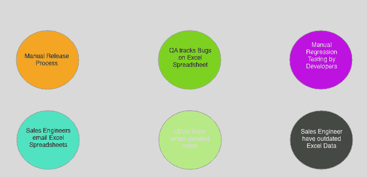
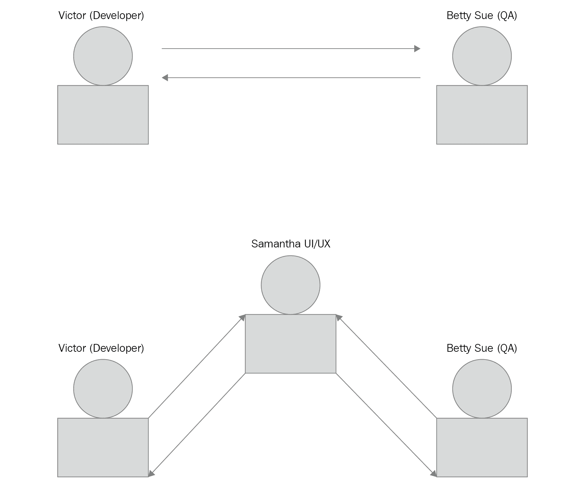
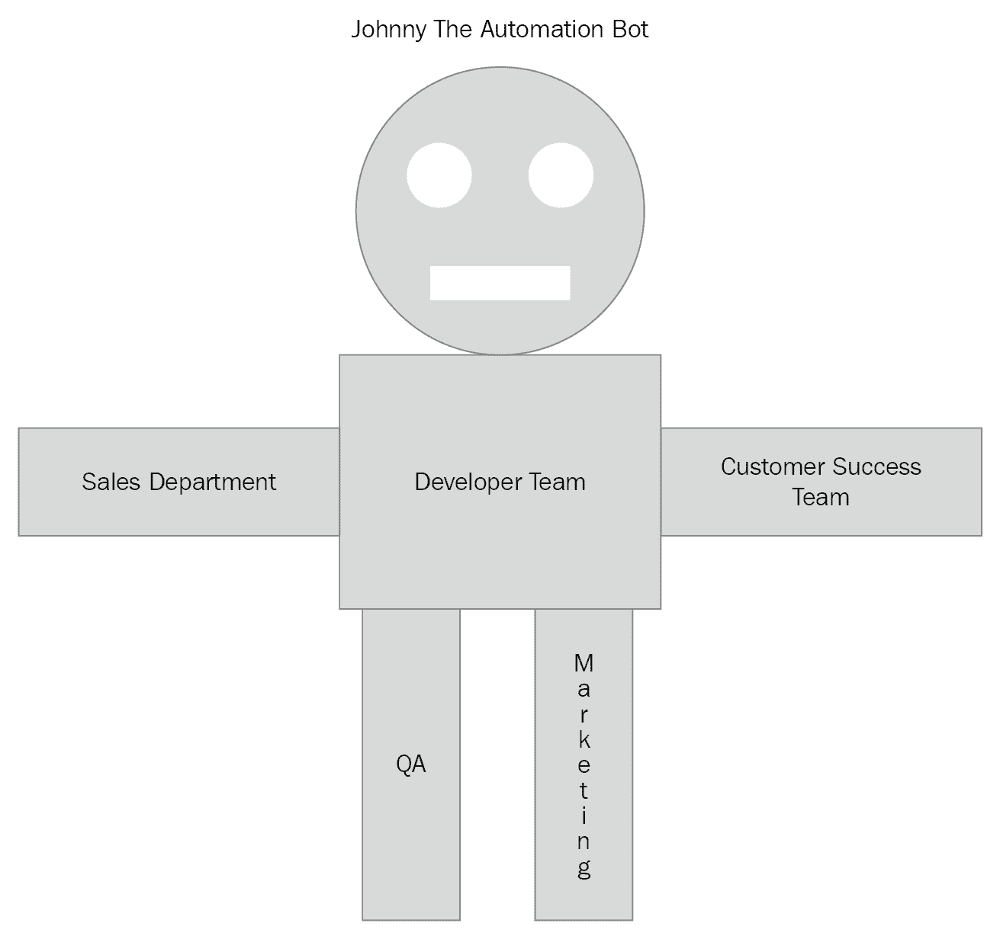
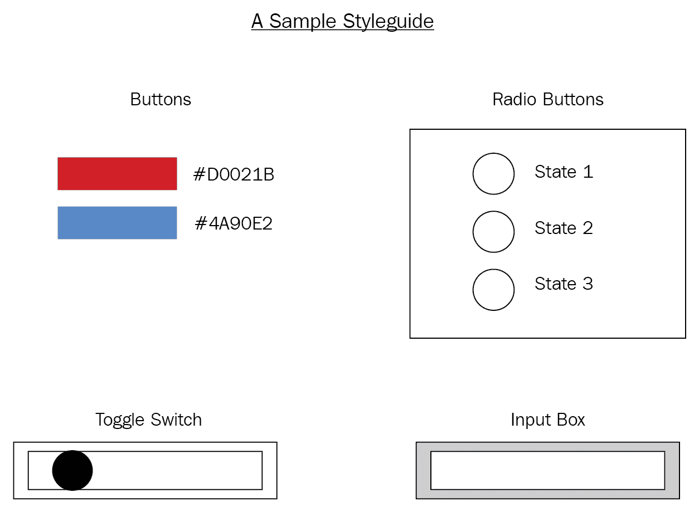
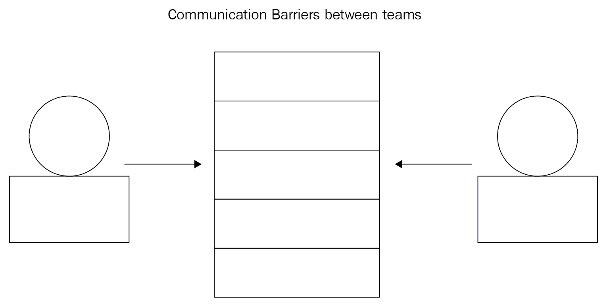
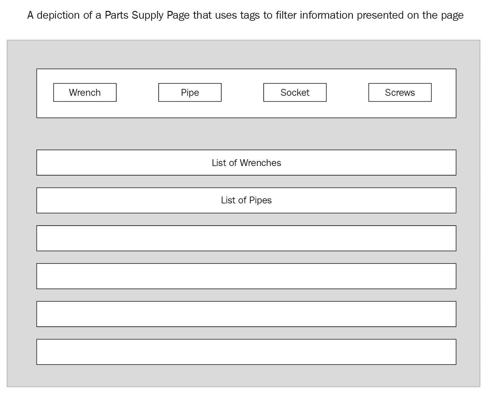
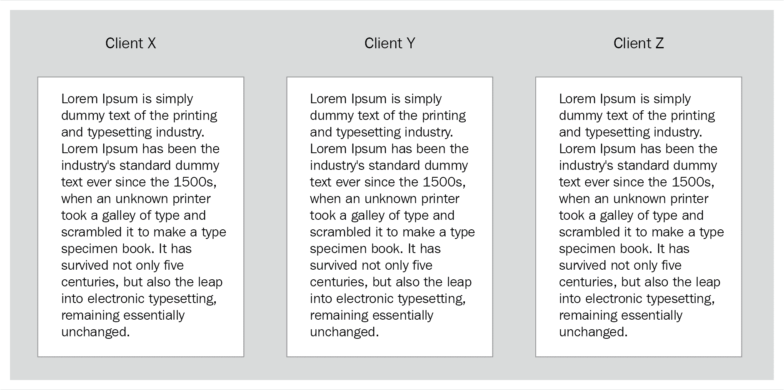

# 自动化测试的 CI/CD

在本书中，我们将探讨**持续集成**（**CI**）和**持续交付**（**CD**）的概念，并使用 Jenkins、Travis CI 和 CircleCI 等工具应用这些概念。我们将编写许多实用脚本，并探索真实世界的 CI/CD 自动化脚本和场景。本章将通过解释一个名为比利·鲍勃机械零件的虚构公司的当前实践来帮助阐明自动化的概念。比利·鲍勃机械零件公司有许多手动流程，并且由于软件发布只由首席开发人员完成，质量保证（QA）和开发团队之间存在一些紧张关系。

本章将涵盖以下主题：

+   手动流程-一个假设的场景

+   员工的挫败感

+   引入自动化

+   开发人员的生产力

+   打破沟通障碍

+   创建协作环境

# 业务场景

本章将描述一个模拟的手动流程以及手动测试和手动流程中固有的缺陷，并将解释如何使用 CI/CD 可以大大提高开发人员的生产力。在这种情况下，每个成员都设置了一套手动流程，完成起来非常耗时。此外，如果 QA 在最新的发布版本中遇到问题，这些步骤必须重新执行。

我们将在我们虚构的公司的多个部门中看到不同的场景。一些场景将关注开发团队、QA 团队、客户成功团队和销售团队的痛点。我们将构建可能发生在这些团队中的场景，识别适合自动化的领域，并且通过这些团队之间的沟通揭示出可以通过自动化大大改进的领域。

以下图表显示了一些业务场景：

# 手动流程-一个假设的场景

贝蒂·苏是比利·鲍勃机械零件公司的 QA 部门的一部分。在比利·鲍勃机械零件公司，有一个中等规模的开发团队。首席开发人员埃里克在季末的星期四早上开始手动发布流程。埃里克需要两天时间来完成发布周期。不幸的是，他是开发团队中唯一能够进行发布的人。埃里克在本地工作站上运行所有测试，并在必要时集成紧急补丁。埃里克完成后，他会将一个 ZIP 文件通过电子邮件发送给 QA 部门的贝蒂·苏。

贝蒂·苏有几名 QA 工程师，并在星期一早上开始新版本的手动测试周期。贝蒂通知埃里克，她已经在最新版本中发现了几个问题。贝蒂准备了一个 Excel 电子表格，记录了最新版本引入的问题。在周末结束时，贝蒂已经将最新版本的问题列表分解为关键、高、中和低优先级的错误。

软件缺陷是软件产品中未按预期运行的缺陷。

在发布周期中，埃里克和贝蒂在解决问题时都要重新执行每个步骤。埃里克必须重新打包所有软件组件，并在本地工作站上重新运行所有测试。贝蒂必须重新进行测试周期，因为她必须检查回归，并确保最新的修复不会破坏软件组件中的现有功能。

迈克尔是团队中的初级开发人员，也在进行手动流程。迈克尔从埃里克那里得到了一个问题清单，并开始处理列表中更重要的错误。迈克尔试图解决每个错误，但没有编写任何回归测试，以确保新代码没有破坏现有功能。当迈克尔完成时，他告诉埃里克他这边一切都很好。不幸的是，埃里克在本地工作站上运行所有测试时看到了测试失败。埃里克告诉迈克尔，在处理错误列表时需要更加小心。

QA 部门的成员迪伦开始测试新版本的部分，并告诉贝蒂该版本存在几个问题。他已经创建了一个问题清单，并将其发送给贝蒂。不幸的是，迪伦所做的一些工作已经被贝蒂重复，因为他们在两个不同的清单中都突出显示了相似的项目。贝蒂告诉迪伦，QA 需要确保不会重复做相同的工作。迪伦回去突出显示他将要测试的版本的部分。

詹妮弗领导客户成功团队，并在质量保证部门通知新版本准备好向客户开放时收到通知。詹妮弗开始准备最新版本功能的视频，并因此向质量保证部门询问新版本的变化。

鲍比是客户成功团队的经验丰富的成员，并开始制作关于最新功能的视频。当发布公司博客上的版本视频时，质量保证部门意识到一些视频错误地说明了仍处于测试版本计划中的功能。詹妮弗现在迅速召集客户成功团队，并要求质量保证部门在将一些功能发送给客户成功团队之前清楚地标记为测试版本。

销售团队一直在通过电子邮件发送销售工程师在与潜在客户会议期间所做的笔记。桑迪手动输入了关于每个潜在客户的详细笔记，并使用 Excel 电子表格对重要的销售信息进行分类。不幸的是，销售团队将新更改的 Excel 电子表格发送给销售部门。有时会出现混乱，因为销售工程师会打开旧的 Excel 文档，并错误地向其他销售工程师提供过时的信息。

UI/UX 团队倾向于使用大量的模型和线框图。通常，在原型阶段，UI/UX 工程师会在模型中嵌入注释，详细说明验证状态和页面交互。维克多在其中一个线框图中看到一个注释，并意识到线框图中嵌入了重要的页面逻辑。维克多询问 UI/UX 团队是否可以与开发团队共享注释。UI/UX 团队还使用艺术板并为每个功能工作创建 ZIP 文件。例如，桑迪被分配了关于新页面 UI 交互的工作，并一直在做详细的笔记。UI/UX 团队的许多工作往往是高度视觉化的，颜色代表着不同的含义。工作的视觉方面往往意味着在 UI 流程的各个阶段应该发生某些动作。开发人员往往处理更具体的项目，因此并不总是清楚自然流程应该发生什么。例如，如果删除一个项目，*是否会弹出一个模态*，即一个小窗口进行确认，还是*立即删除一个项目*？提交表单时，*UI 是否以特定颜色显示错误指示，以另一种颜色显示警告*？*验证应该放在什么位置*？有时，UI 交互流程没有详细描述，开发人员必须与 UI/UX 来回沟通。记录决策文件中的决定原因是很重要的。

# 员工的挫败感

贝蒂·苏给维克多发了一份按优先级分类的问题列表。必须首先处理更高优先级的问题，而较低优先级的问题则稍后处理。维克多拿到了最新发布的问题列表，并通知开发团队他们必须立即停止正在进行的新功能工作，并开始修复最新发布的问题。大卫是团队中的一名高级开发人员，他感到沮丧，因为他之前进展顺利，现在又在匆忙地重新适应一个月前的工作。

迈克尔是团队中的一名初级开发人员，对代码库还不太熟悉，他担心列表上的一个更高优先级的问题。迈克尔急忙解决了更高优先级的问题，但没有考虑编写任何回归测试用例。迈克尔迅速为他的高优先级工单编写了一个补丁，并将补丁发送给了维克多。维克多很快发现了迈克尔的补丁中的回归和破损的测试用例。迈克尔不知道他应该编写回归测试用例来确保没有回归。

发布新补丁的流程没有得到适当的记录，而迈克尔这样的新开发人员经常会产生破坏现有工作的回归。维克多教迈克尔回归测试的概念，迈克尔迅速编写了带有回归测试用例的软件补丁。

一旦维克多准备好了所有的新软件补丁，他就开始进行热修复发布，并在本地机器上重新运行所有测试。贝蒂得到了最新发布的新 ZIP 文件，并再次开始手动测试流程。QA 部门正在手动测试产品的部分，因此测试所有产品部分是一个耗时的任务。贝蒂发现了最新发布的一些问题，并给维克多发送了一个较小的列表，以便在本周晚些时候开始处理。

大卫被维克多突然叫停，并被告知放弃他的新功能工作，因为最新的更改存在缺陷。大卫花了接下来的两个小时试图重新适应最新发布的问题。一旦他确信自己已经追踪到问题，他花了下午时间进行修复。大卫通知维克多最新的更改已经准备好进行测试。维克多开始在他的工作站上运行测试，立即发现由于最新更改，一些集成测试现在失败了，并通知大卫这些问题必须得到解决。大卫现在感到沮丧，他加班到深夜又进行了一次修复。第二天早上，维克多运行了所有的测试，一切都通过了，所以他给贝蒂发送了最新热修复的 ZIP 文件。贝蒂第二天开始进行手动测试流程，不幸的是，她再次发现了一些小问题，并在下午通知维克多最新发布仍然存在一些问题。

维克多此刻承认感到沮丧，他把所有开发人员都召集到一个房间里，并说除非所有问题都得到解决，否则谁也不能离开。在度过了一个漫长的晚上后，所有最新的问题都得到了解决，维克多让每个人回家。第二天早上，维克多打包了最新的发布，并给贝蒂发送了一个新的 ZIP 文件。贝蒂在上一次测试周期后有些担心，但她很高兴所有的错误都得到了解决，并给予了 QA 的批准，并告诉维克多最新发布已经准备就绪。开发团队和 QA 团队一起庆祝了一周工作的结束，并享受了公司赞助的午餐，然后回家过周末。

在 QA 部门测试热修复时，一些 QA 团队成员的工作出现了重叠。Dillon 感到沮丧，因为他的一些工作与 Betty 的工作重叠。QA 部门没有自动化，因此每次发布都需要手动完成所有工作，无论是补丁还是常规发布，QA 都必须重新测试 UI 的所有部分。QA 团队的新成员 Nate 问 Dillon 是否有比手动测试更好的工作方式，但被告知这些做法已经在 QA 部门实施。

客户成功团队的 Tony 对新版本感到沮丧，因为他花了很多时间为客户*X*创建新视频，却被告知他的一些视频无法发布，需要放入储备库。QA 部门在最后一刻做出了停止功能*Y*的决定，但没有将这些信息传达给其他部门。

销售工程师领队之一的 Victor 正在进行公司演示，并向潜在客户展示导出 PDF 功能。在演示过程中，Victor 点击导出 PDF 功能，出现了一个显眼的错误消息。Victor 迅速转移到产品的另一个方面，称这是一个暂时的故障，并表示他将在另一个演示中展示这个功能。Victor 发现其中一个开发人员在后端服务中进行了一个本应该是简单更改的操作，却在生产环境中破坏了导出 PDF 功能。Victor 发现潜在客户已决定选择另一种软件解决方案，现在他显然很沮丧，因为他指望这位新客户来获得年终奖金。

UI/UX 团队的成员 Samantha 被告知她的一份模型缺少验证流程。Samantha 在功能*Z*的原型设计阶段寻求澄清，被告知页面不需要任何验证，但 David 认为需要验证流程。Samantha 显然很沮丧，决定休息一天，现在 David 在功能*Z*的工作上落后了进度。

QA 的 Betty Sue 和开发团队的 John 之间有双向沟通。在寻找自动化帮助的领域时，沟通是至关重要的。随着各方之间的互动次数增加，参与方对手动流程的意识也在增加。手动流程一直隐藏着，直到更多的参与方，如营销、销售、客户成功和开发团队开始更频繁地合作。开发人员特别适合发现手动流程，因为非开发人员并不总能意识到一个流程是手动的，可以被自动化。

# 引入自动化

这是一个名为**Johnny The Automation Bot**的插图，用于描述公司的不同部门。Johnny 的每个肢体代表公司的一个不同部门：

Johnny The Automation Bot 是一个可以极大受益于自动化流程的领域的插图。自动化可以被视为一种程序或系统，其中机器完成了人类通常会做的工作。自动化需要了解正在进行的手动流程，与其他部门进行沟通，并找出哪些流程是手动进行的。CI 和 CD，正如我们将在本书中看到的，是极大增强公司生产力和流程的过程，因为它们消除了开发人员的假设和特定环境设置。

约翰尼自动化机器人的每个部分都有一个可以自动化的领域。销售部门目前正在向销售团队发送 Excel 工作表，并且很难跟上其他销售工程师所做的更改。约翰尼自动化机器人建议销售工程师有一个简单的方法将销售信息上传到公司内部网络，以更好地跟踪销售信息。约翰尼建议开发团队编写一个 Excel 集成，销售工程师可以轻松地将新的销售数据上传到公司内部网络。例如，可以添加一个菜单选项，连接到公司的 API 端点，自动将新的 Excel 更改上传到公司内部网络页面，该页面具有最新的销售信息。

质量保证部门正在手动测试产品，而手动测试是一项耗时且容易出错的活动。约翰尼建议质量保证部门开始使用**Selenium WebDriver**编写验收测试。Selenium 是一个浏览器自动化工具，质量保证部门可以使用诸如 Python 之类的语言来编写验收测试。约翰尼表示，使用 Selenium 编写自动化测试的优势在于可以编写一次并反复重用。这将带来额外的好处，即这些测试可以连接到 CI/CD 流水线中，我们将在本书的后面看到。

贝蒂从质量保证部门发现客户成功团队正在制作一系列视频，教授客户每个构建中的新功能。客户成功团队通过 FTP 上传视频，其中一些团队成员花费大部分时间上传文件。约翰尼自动化机器人建议通过脚本自动化这个过程。该脚本应该足够直观，以便客户成功团队的任何成员都可以运行它，并且应该能够在上传过程中出现任何网络延迟时进行重试。贝蒂分享了质量保证部门编写的一个可以自动化这个过程并作为后台进程运行的脚本。

托尼，客户成功团队的成员，现在在工作日中解放了几个小时的工作时间，可以专注于工作的更重要方面，比如通过创建出色的视频来帮助客户取得成功。托尼已经开始与质量保证团队合作，将开始发布视频并对产品的部分进行用户验收测试。由于手动测试已经委托给客户成功团队，质量保证现在能够更好地测试功能。质量保证正在专注于使用新的库自动化端到端测试套件，这将帮助他们更快地编写测试，并通知开发团队功能出现故障。

营销团队一直在 PowerPoint 幻灯片中嵌入注释，有时在演示或公司展示中注释会丢失或被覆盖。约翰尼建议开发团队创建一个可以将 PowerPoint 幻灯片转换为 markdown 的脚本，然后 markdown 文件可以进行版本控制，因为 markdown 只是文本文件。这将有额外的好处，即营销团队可以与销售团队分享信息，以创建更具说明性的图表。

维克多意识到手动流程正在破坏生产力，并且手动流程具有明显的劣势。维克多可以在发布周期中引入一个自动化系统，任何开发人员都可以通过一个单击部署按钮来运行。与维克多目前正在做的在本地工作站上运行所有测试不同，每个软件构建都可以推送到诸如 GitHub 之类的版本控制系统，并且所有测试都可以在 CI 环境（如 Jenkins）上运行，并且开发人员可以自动收到测试是否通过或失败的通知。例如，布鲁斯是团队中的一名新开发人员，他可以快速阅读开发人员文档，并在几乎没有指导的情况下开始进行下一个发布。约翰自动化机器人对这种做法表示赞许。

贝蒂也有机会自动化手动测试过程。使用诸如**BrowserStack**之类的工具，贝蒂可以编写一系列测试脚本，测试产品的每个部分。在一个小时内，贝蒂可以在测试环境中运行一套验收测试，并让维克多知道发布中的最新问题。维克多可以开始将问题分配给开发团队，并开始编写回归测试用例，以确保当前构建中没有回归。维克多对最新更改的工作原理感到自信，可以指导贝蒂到一个新的 URL，她可以下载最新的软件发布。Johnny 自动化机器人指出，创建 ZIP 文件并通过电子邮件发送的旧做法并不是一个好的做法，因为每次都需要额外的步骤，如果发送了错误的 ZIP 文件，可能会出现错误。约翰建议 QA 部门有一个专用的 URL，所有最新的发布都在那里，并且每个发布都有版本和特定信息，比如热修复。例如，最新的热修复可以是`v5.1.0-hotfix 1`，因此，对于每个热修复，QA 部门都会有一个压缩文件，其中包含最新的构建和一个说明符，比如热修复。如果这个构建是一个常规构建，那么它可以被命名为`v5.1.0`。

维克多发现 QA 部门有一个 Browser Stack 账户。Browser Stack 提供对整套浏览器和移动客户端的访问，这可以帮助自动化 UI 的负载测试。负载测试是使用开发团队用于特殊场景（如负载测试）的自定义服务器进行的。约翰自动化机器人建议使用诸如 Browser Stack 之类的服务，或者拥有一个可以提供必要资源进行负载测试的自定义服务。

维克多发现 QA 团队在测试开发团队编写的电子邮件服务时遇到了问题。约翰自动化机器人建议开发团队确保 QA 拥有可以帮助使用电子邮件服务的脚本。维克多告诉贝蒂，新的电子邮件服务正在代理到**SendGrid**服务，并且开发团队已经编写了一系列 QA 可以使用的脚本。这些脚本有助于编写测试电子邮件，并可以帮助 QA 测试在失败条件下会发生什么。

UI/UX 团队正在将模型上传到**Sketch** - Sketch 是一个原型工具 - 并嵌入有关页面可能的验证状态和流程的注释。这些注释非常详细，对开发团队在公司冲刺中开始功能工作时非常有帮助。Johnny 自动化机器人建议开发团队编写一个插件，可以帮助 UI/UX 团队轻松共享这些信息。维克多决定创建一个 Sketch 插件，该插件可以创建一个带有嵌入式注释的 PDF，UI/UX 团队在原型制作完成后可以通过电子邮件发送给开发团队。这个插件对 UI/UX 团队来说很容易安装，因为他们只需双击文件，它就会自动安装插件。访问 PDF 和嵌入的注释将帮助开发人员了解新功能的用例和 UI 流程。

文森特，一位主要销售工程师，已经与开发团队沟通，他需要及时了解产品的流程变化，特别是在向潜在客户介绍公司路线图上的新功能时。约翰尼自动化机器人建议开发团队利用 Git 提交日志，其中包含有关最新功能更改的详细信息。维克多编写了一个脚本，用于抓取 Git 提交日志并编写一个包含所有最新功能工作的漂亮的 Markdown 文档。反过来，客户成功团队可以与开发团队合作，使用 Markdown 文件在公司博客上详细介绍所有最新功能。

这里有一个共同的主题。部门之间的沟通是发现手动流程并创建帮助自动化流程的合作伙伴关系的关键。除非了解手动流程，否则无法进行自动化，有时，唯一的自动化发生的方式是其他部门传达特定的痛点。

让我们重申一些通过开放协作自动化和增强的流程。维克多通过提供开发团队创建的脚本来帮助 QA 自动化了电子邮件测试服务问题。QA 通过分享一个上传视频并具有重试逻辑的脚本，帮助客户成功团队自动化了视频上传任务。销售部门表示需要更好地了解产品的新功能；这促使开发团队编写了一个从 Git 提交日志中获取信息并生成 Markdown 文件的脚本，客户成功团队使用该文件在公司博客上写了一篇漂亮的博客文章。UI/UX 团队现在在其 Sketch 应用程序中集成了一个插件，他们可以简单地点击一个按钮来生成在原型阶段记录的笔记的 PDF 文档，这反过来有助于开发团队开发新功能。开发团队发现 QA 正在使用一个名为 BrowserStack 的工具，并开始使用它来对产品进行负载测试。营销团队现在拥有营销 PowerPoint 幻灯片的版本副本，并将这些信息分享给销售团队，以创建公司演示的新图表。

UI/UX 团队决定创建一个样式指南，开发人员可以在软件产品中查找常见的 UI 模式。UI/UX 团队发现不同页面中使用了许多不同的样式，这导致许多客户感到困惑。例如，零部件供应页面在一个页面上有一个大蓝色保存按钮和一个红色取消按钮，但在供应商详细信息页面上有一个大红色保存按钮和一个蓝色取消按钮。客户因为 UI 没有统一使用颜色而点击错误的按钮。有时，页面使用确认模态框来添加和删除项目；其他时候，没有确认模态框。UI/UX 团队已经开始制作样式指南，并在公司内部网站上创建一个特殊的 URL，用于存放实时样式指南。其目的是明确创建和列出页面可用的十六进制颜色，设计产品中的所有按钮，并决定页面上表单的外观和行为。

此外，将有一个特殊的小部件页面，其中包含产品中所有专用小部件的 HTML 标记和样式嵌入：

这个样式指南具有十六进制颜色值，并嵌入了一些 HTML 元素和一个切换开关，这是一个专门的小部件，有关闭状态和开启状态。样式指南的目的是让开发人员能够简单地右键单击并复制 HTML 标记和 CSS，并建立统一的 UI 呈现。这是一种自动化形式，因为开发人员可以简单地重用现有的标记和样式，而不必手动创建 HTML 和自定义样式，其中统一性最好使用。每当产品的用户不得不猜测该做什么时，你肯定会招致灾难。

# 开发人员的生产力

由于维克多将 CI/CD 管道引入了构建中，许多耗时的活动现在都被自动化管道所取代。每当软件被推送到版本控制系统（如 Git）等上游时，Jenkins 会触发自动构建，运行所有单元测试和集成测试。开发人员可以迅速知道他们编写的代码是否引入了缺陷。记住，维克多不得不整合所有软件补丁，并在本地工作站上手动运行所有测试。这是乏味、耗时且不必要的。

由于所有软件都是向上游推送的，维克多已经为发布分支设定了代码截止日期，并开始对软件发布二进制文件进行版本控制，以便质量保证人员可以更清晰地划分每个构建版本。维克多立即变得更有效率，因为他可以开始将发布周期委托给团队中的其他开发人员。发布周期中遇到的任何问题都可以由任何开发人员在发布中记录下来。维克多现在有更多时间开始规划下一个软件周期，并在团队中指导初级开发人员。大卫现在很高兴，因为他可以将最新的更改推送到源代码控制，并在 CI 环境中运行所有测试，并更有信心地确保他的更改按预期工作。

贝蒂已经建立了一整套验收测试，检查软件产品的每个部分。产品中的任何回归问题都会立即在 CI 环境中显现出来，并且所有测试都可以每天运行。质量保证团队运行的测试比开发团队的测试更耗时和资源密集，因为它们是端到端的测试，但对于质量保证团队来说，优势在于所有测试都可以每天运行，并且质量保证团队每晚都会收到详细的测试失败报告。贝蒂编写了一组页面对象，帮助质量保证团队的其他成员重用其他测试脚本并减少测试周期。贝蒂现在在质量保证周期中有时间指导质量保证部门的新成员进行测试实践，并教他们如何正确地标记问题，以便开发团队知道最新发布中的问题所在：

这里的螺栓象征着已经就位的流程；在这种情况下，需要自动化的发布流程。

大卫现在可以开始帮助维克多指导团队中的初级开发人员，开发团队已经开始进行午餐学习系列，其他开发人员可以在团队中分享知识。开发团队很快意识到这些午餐学习会议也适用于质量保证部门。在其中一次午餐学习会议中，质量保证部门提出了一个关于协调质量保证和开发团队之间发布的变更。通过这种合作，发布周期从一周的过程缩短到 3 小时的过程。开发团队轮流进行发布工作，以便团队中的每个开发人员都可以学习如何进行发布。值班的开发人员确保质量保证部门有一个可供质量保证开始测试的构建，并且可以使用 CI 系统（如 Jenkins、Travis 或 CircleCI）自动触发此构建。在这些 CI 环境中，您可以设置在指定日期和时间运行的构建触发器。质量保证部门通知开发团队发布中的任何回归，每当开发团队准备推送热修复时，构建都清楚地用以下模式标明 - `vMAJOR.MINOR.PATH-[hotfix]-[0-9]*`。为了清晰起见，这里有一个例子 - `v6.0.0-hotfix-1`。这标明了主要版本`6`，次要版本`0`，补丁版本`0`和热修复编号`1`。这种命名方案有助于质量保证部门区分常规构建和`hotfix`构建。

客户成功团队已经向开发团队传达了一些客户在使用 Billy Bob's Machine Parts 应用程序编程接口（API）服务时遇到问题。客户成功团队询问开发团队是否有任何方法可以帮助新的第三方 API 消费者上手。为了澄清，API 消费者是指正在使用现有 API 的人，而 API 提供者是维护实际 API 服务的人；因此，在这方面，Billy Bob's Machine Part 是提供运行 API 供第三方开发人员使用的 API 提供者。开发团队告诉客户成功团队，他们一直想要创建一个开发者门户，这将帮助 API 消费者轻松地使用 API。然而，开发团队很难说服高层管理层开发者门户的价值，因为没有人要求这个特定的功能。客户成功团队迅速说服了高层管理层，开发者门户对 Billy Bob's Machine Parts API 消费者来说将是一项巨大的资产，API 消费者可以开始使用 API 服务的数据构建漂亮的仪表板。

在其中一次开发者会议中，发现营销团队正在使用 Google Docs 共享文档，但很难找到上传的文档，因为你必须知道你在找什么。维克多很快意识到开发团队可以帮助建立一个公司内部网，销售和营销团队可以以更一致的方式共享数据。几个月后，公司内部网被公开，销售和营销团队兴奋地提到公司内部网已经帮助他们自动化了文档共享流程，过去销售和营销之间的许多会议浪费了无数时间来寻找某些文档。公司内部网暴露了一个过滤机制，可以使用标签系统快速找到文档。公司内部网还实现了一个功能，即销售和营销团队可以编辑共享文档。

销售团队现在有一个很好的工具可以与公司博客一起使用，展示新产品功能。维克多现在可以查看公司博客，了解产品中的最新功能。所有这些都是因为维克多编写的脚本而实现的，该脚本会从 Git 提交日志中提取提交消息，然后发布一个漂亮的 markdown 文件。该脚本在每个发布上都会使用，并列出所有已处理的项目，开发团队将新创建的 markdown 文件发送给客户成功团队，他们又根据这个 markdown 文件撰写了一篇详细介绍最新发布的博客文章。

QA 团队开始处理一个问题单，其中部分限制导致特定的 UI 错误。特别是，如果客户在产品详细页面上有超过 10,000 个零件列表，那么产品详细页面会崩溃，而没有任何有用的指示发生了什么。开发团队发现 QA 团队正在手动在新产品页面上创建新产品。开发团队通过让 QA 了解一个可以通过管理员端点来程序化创建语音邮件的端点来帮助 QA 团队。开发团队帮助编写了一个脚本，通过程序化生成新零件，从而节省了 QA 团队手动创建零件的耗时任务。

# 打破沟通障碍

为了实现自动化，必须打破团队之间的沟通障碍。有时，不同的团队可能认为他们在同一个页面上，但实际上他们在谈论不同的事情。

打破沟通障碍是很重要的，为了解决误解：

有趣的是，在发布周期内仍然有更多的自动化空间。维克多询问贝蒂关于一些在源代码控制中的验收测试。维克多意识到他可以将验收测试集成到 CI 环境中，并创建一个次要构建，每晚运行所有验收测试，并且 QA 将在每天早上得到一份详细最新失败的报告。然后 QA 可以在每天早上审查失败的验收测试，并通知开发团队特定功能*x*已经出现问题，例如零件供应页面，正在处理这个新功能的开发人员需要重新检查新的业务逻辑。

大卫开始与 UI/UX 团队交谈，并发现新公开的 API 端点和构建新页面之间存在瓶颈。前端开发人员在这些页面中模拟数据，并经常对意外的 JSON 负载感到惊讶。前端开发人员有时要等待几周才能发布 API 端点，而他们开始模拟数据而不是坐等，这带来了意想不到的后果，他们开始假设数据模型将会是什么样子，这反过来使得更改页面变得更加困难。大卫让维克多知道存在可以快速为端点搭建数据模型并为 API 端点提供当前数据模型的工具。大卫开始使用 Swagger 作为构建 API 服务中的新 API 的工具。Swagger 有助于减少开发团队和 UI/UX 团队之间的摩擦，因为 UI/UX 团队不必再等待数据模型。资深 UI/UX 开发人员杰森现在可以快速开始构建新页面，因为他确切地知道可以从新 API 端点期望的负载类型。

QA 团队成员阿曼达已经开始与客户成功团队合作进行负载测试和用户验收测试。在用户验收测试周期中添加了验收测试，暴露了核心产品中可以改进 UI/UX 的地方。客户成功团队现在有了测试新页面和暴露可能的 UI 问题的额外责任。验收测试适用于测试顺利的路径场景，也就是当一切都按预期完成时，但用户验收测试可以暴露 UI 中不直观的工作流程。例如，拉里开始测试零部件供应页面中的新过滤功能，并发现为了开始过滤，需要点击复选框。拉里问 QA 为什么过滤不能默认进行，为什么需要复选框；然后开发人员开始着手添加默认过滤：

该图示没有复选框，而只是一个使用输入框的页面，每当用户输入*Enter*、逗号或*Tab*时，就会应用一个新的过滤器，然后页面会自动过滤。如果没有结果显示，则会显示文本“未找到结果”。

客户成功团队成员贾斯汀问 QA 团队成员弗朗西斯是否可以借用 QA 部门测试的新功能视频。贾斯汀意识到 QA 团队拥有一套非常有价值的视频，客户成功团队可以利用它来教客户如何使用最新功能。弗朗西斯为客户成功团队创建了一个内部门户网站，用于 QA 部门发布新视频时使用。客户成功团队一直在为新客户创建入职视频，并设计了一个知识门户，解释如何设置，例如，一个新的零部件供应页面。

销售团队一直在通过个人电子邮件向客户和潜在潜在客户讨论发送笔记。维克多发现销售经理哈里最近丢失了一些有价值的笔记，因为他不小心删除了与潜在客户共进午餐时所做的笔记。维克多告诉哈里公司有一个新的公司内部网，有一个项目页面，可以创建卡片，所以销售团队可以为每个潜在客户创建销售展示。哈里为一个潜在客户创建了一个新的销售展示，并与首席销售执行官吉姆分享。吉姆表达了极大的兴奋，因为他也意识到公司内部网也可以用来创建图表。吉姆使用以下图表向首席销售执行官展示最新的销售线索：

销售团队可以为每个潜在客户创建一个项目展示。公司内部网正在帮助公司内部更多团队整合，因为团队成员正在打破沟通障碍。

开发团队发现客户成功团队一直在使用界面进行耗时且容易出错的流程。领导开发人员维克多制定了一个创建**命令行界面**（**CLI**）的计划，客户成功团队可以利用它来自动化当前手动流程的许多部分。开发团队解释了 CLI 如何可以为客户成功团队节省大量时间，还可以帮助 API 消费者更好地使用 API 服务。CLI 可以快速为界面提供重要的页面数据。随着每个新版本可能会暴露出新的端点，开发团队制定了一个计划，为 CLI 添加与新 API 端点一起使用的额外命令。

CLI 应用程序将与开发者门户倡议协同工作，并提高 API 消费者的采用率。除此之外，开发团队决定启动一个关于 API 消费者可以利用的**软件开发工具包**（**SDK**）的倡议来使用 API。SDK 可以极大地改善和增强 API 提供者的第三方采用，并因此增加 API 的采用率。SDK 特别有用，因为开发人员和质量保证人员使用不同的编程语言。机器零件 API 的开发人员正在使用 Golang 编程语言，而质量保证人员大部分工作都在使用 Python。SDK 将支持许多编程语言，并将帮助 API 消费者快速上手，因为他们可以选择自己喜欢的语言来使用 API 服务。

为了使手动流程自动化，组织内部不同团队之间必须进行沟通。组织中的团队肯定会有手动流程。开发领导、质量保证领导、客户成功领导和 UI/UX 领导开始每月开会，讨论新的实践，并开始寻找公司内需要自动化的其他手动流程。

手动流程本质上并不是坏事，**用户验收测试**（**UAT**）在公司中仍然有效，并且可以帮助揭露自动化测试无法发现的问题。UAT 对于测试自动化测试有时无法发现的边缘情况场景尤其有帮助，就像之前展示的例子一样，客户成功团队测试了一个新功能，并发现零件详情页面只有在复选框被选中时才能进行筛选。

营销、销售和客户成功团队通常使用电子表格应用程序，如 Excel，来计算数字，以及演示应用程序，如 PowerPoint，来创建图表。通常，在 Excel 电子表格中计算的数字会保存多个版本，但团队成员必须通过电子邮件向其他团队成员发送副本。开发人员可以要求营销、销售和客户成功团队以**逗号分隔值**（**CSV**）形式导出 Excel 中的值，这是一个文本文件，更容易处理。这样做的附加价值是公司内部网可以使用数据可视化工具创建漂亮的 HTML 图表和演示文稿。可以利用 D3 等库创建许多不同类型的可视化效果，非常强大。

# 创建协作环境

为了使团队开始合作并公开讨论问题，必须存在一种开放的精神。团队很容易被隔离，意味着他们与其他团队的工作脱节。开发团队很容易选择与质量保证部门保持脱节。问题在于沟通是揭露团队之间手动流程的最重要元素。没有沟通，团队将独立地处理他们认为重要的事项。

不同团队参与的社交活动可以帮助打破障碍，建立友好的环境。通常，开发人员喜欢参加会议，仅仅是为了与其他开发人员进行社交互动，通常会有一个走廊轨道，开发人员在会议中站在外面，而不是参加会议中的活动。

公司可以赞助社交活动，并帮助在不同团队中任命代表，帮助打破团队之间的僵局。例如，在公司保龄球活动中，人们可能会被故意分配到与他们平时工作不同的团队中。一个小的保龄球团队可以由一个开发人员、一个客户成功团队成员、一个 QA 团队成员、一个营销团队成员和一个销售团队成员组成。这可以激发团队成员之间的工作关系，让他们彼此了解，并公开交流他们在公司活动之外遇到的问题。

比利鲍勃机械零件公司安排了一场棒球比赛活动，主要开发人员维克多和主要 QA 成员贝蒂与几名营销团队成员、销售团队成员和客户成功团队成员一起工作。为棒球比赛活动组成了两个团队，并安排了公司烧烤活动，让人们可以一起吃饭并交谈。

鼓励积极合作的另一种方式是改变公司的楼层平面图，使其更加开放。许多软件公司一直在采用开放式平面图，因为它们消除了隔间在人们之间产生的自然分隔。这个想法是，如果你有一个开放的平面图，你更有可能接近不同的团队，因为你可以轻松地走到不同的人面前，而不会感觉自己侵犯了他们的空间。

# 总结

沟通是发现手动流程的关键，重要的是要找到手动流程以便自动化这些手动流程。手动流程往往容易出错且耗时，正如我们在各种业务场景中所阐述的那样。这就是自动化的价值所在，比如实施 CI 构建和编写脚本来自动化手动流程。开发人员和 QA 可以帮助开发可以惠及许多不同部门的自动化脚本，如销售、营销和客户成功。在本章中，您已经了解了自动化相对于手动流程的好处以及开放沟通的价值。

在下一章中，我们将学习 CI 的基础知识。

# 问题

1.  什么是手动流程？

1.  什么是自动化？

1.  为什么打开部门之间的沟通很重要？

1.  CI/CD 代表什么？

1.  自动化脚本为什么有用？

1.  公司内部网的价值是什么？

1.  为什么其他部门应该共享数据？

# 进一步阅读

要更多地了解 CI 并使用流行的 CI/CD 工具，可以考虑阅读

*使用 Jenkins 学习持续集成-第二版* ([`www.amazon.com/dp/1788479351/`](https://www.amazon.com/dp/1788479351/))，作者*Packt Publishing*。
