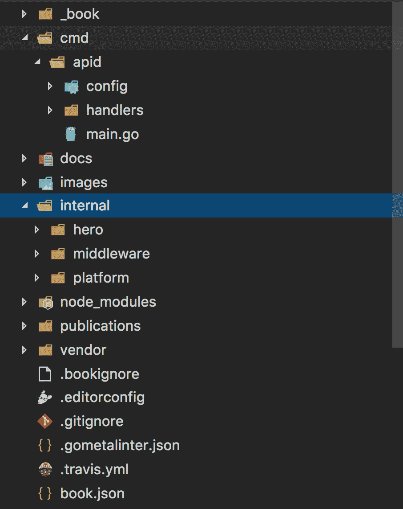

# 第二章：持续集成的基础知识

本章将帮助介绍**持续集成**（**CI**）的概念，并为我们在后续章节中探讨的 CI/CD 概念奠定基础。了解 CI 构建的目的很重要，因为这些概念超越了您可能使用的任何特定的 CI/CD 工具。CI 很重要，因为它有助于保持代码库的健康，并帮助开发人员保持软件系统独立于任何特定的开发人员机器运行。CI 构建强制执行软件组件的独立性和本地环境配置。CI 构建应该与任何一个开发人员的配置解耦，并且应该能够重复和隔离状态。每次运行的构建本质上是独立的，这可以保证软件系统正常工作。

本章将涵盖以下主题：

+   什么是 CI？

+   CI 的价值

+   利用 CI 来减轻风险

+   源代码检入时的软件构建

+   小型构建和大型构建分解

+   CI 构建实践

# 技术要求

本章只假设对版本控制系统有一定的了解，但读者至少应该了解配置文件是什么，并且对编程有基本的了解。我们将简���查看一个示例 makefile，并在本章中提供一些代码片段。

在本章中，我们将查看几个代码示例，包括一个 API Workshop（[`github.com/jbelmont/api-workshop`](https://github.com/jbelmont/api-workshop)），在那里我们将解释一个 Makefile 和一个 Demo Application（[`github.com/jbelmont/advanced-tech-in-wilmington-react-app`](https://github.com/jbelmont/advanced-tech-in-wilmington-react-app)），它使用 React/Node.js/Express.js/RethinkDB，并且我们还将展示一个`gulp.js`脚本文件。

# 什么是 CI？

CI 本质上是一个软件工程任务，其中源代码同时合并和测试在主干上。CI 任务可以执行任何多种任务，包括测试软件组件和部署软件组件。CI 的行为本质上是规定的，可以由任何开发人员、系统管理员或运维人员执行。持续集成是持续的，因为开发人员可以在开发软件时持续集成软件组件。

# 软件构建到底是什么？

软件构建不仅仅是一个编译步骤。软件构建可以包括编译步骤、测试阶段、代码检查阶段和部署阶段。软件构建可以作为一种验证步骤，检查您的软件是否作为一个统一的单元工作。静态编译语言，如 Golang 和 C++，通常具有生成二进制文件的构建工具。例如，Golang 的构建命令，如`go build`，将生成一个静态编译的二进制文件，并对代码库运行 linting。其他语言，如 JavaScript，可以使用诸如`gulp.js`/`grunt.js`之类的工具来执行被认为是构建步骤的操作，例如**缩小** - 将多个 JavaScript 源文件转换为一个文件 - 和**丑化**，它会剥离源文件的注释和任何空白，以及 linting 和运行测试运行器。

# CI 流程步骤概述

开发人员可以向**版本控制** **项目**（**VCP**）系统提交代码，例如 GitHub 和 GitLab。CI 服务器可以轮询仓库以获取更改，或者可以配置 CI 服务器通过 WebHook 触发软件构建。我们稍后将在 Jenkins、Travis 和 Circle CI 中进行讨论。CI 服务器将从 VCP 系统获取最新的软件版本，然后可以执行集成软件系统的构建脚本。CI 服务器应该生成反馈，将构建结果通过电子邮件发送给指定的项目成员。CI 服务器将持续轮询更改，或者将从配置的 WebHook 响应。

# CI 的价值

CI 有很多价值。首先，CI 构建有价值，因为它可以减少风险，软件的健康状况变得可衡量。CI 有助于减少开发者的假设。CI 环境不应依赖环境变量，也不应依赖某个人机器上设置的特定配置文件。

CI 构建应该干净地独立于每个开发者的本地机器，并且应该与任何本地环境解耦。如果一个开发者说构建在他/她的机器上可以运行，但其他开发者无法运行完全相同的代码，那么你就知道构建可能无法正常运行。CI 构建可以帮助解决这些问题，因为 CI 构建与任何给定开发者的设置和环境变量解耦，并且独立运行。

CI 构建应该减少重复的手动流程，构建过程应该在每次构建时都以相同的方式运行。CI 构建过程可能包括编译步骤、测试阶段和报告生成阶段。CI 构建过程应该在开发者向 Git、Subversion 和 Mercurial 等版本控制系统提交代码时运行。CI 构建应该释放开发者的时间，让他们可以从事更有价值的工作，并减少重复手动流程可能带来的错误。

一个良好的 CI 构建应该能够在任何时间、任何地点生成可部署的软件。CI 构建应该提供项目的可见性，并且应该在开发团队中建立对软件的信心。开发者可以放心，CI 构建会比在本地运行构建更容易捕捉到代码变更的问题。

# 利用 CI 来减轻风险

CI 可以帮助减轻软件构建中普遍存在的风险，比如“在我的机器上可以运行”的症状。CI 还有助于统一集成失败点，比如数据库逻辑以及其他类型的问题。

# 但在我的机器上可以运行！

开发者之间的一个共同问题是，一个开发者的机器上可以运行软件构建，但另一个开发者的机器上却无法运行。每个开发者的机器应尽可能地与软件集成相似。完成软件构建所需的一切都需要提交到版本控制系统中。开发者不应该有只存在于他们本地机器上的自定义构建脚本。

# 数据库同步

完成软件构建所需的任何数据库构件都应存储在版本控制中。如果你有一个关系型数据库，那么任何数据库创建脚本、数据操作脚本、SQL 存储过程和数据库触发器都应存储在版本控制中。

例如，如果你使用 NoSQL 数据库系统，比如 MongoDB ([`www.mongodb.com/`](https://www.mongodb.com/))，并且使用 RESTful API，那么一定要在文档中记录 API 端点。记住，开发者可能需要数据库特定的代码来实际运行软件构建。

# 缺少部署自动化阶段

应该使用部署工具自动化软件部署。你使用的部署工具可能因不同的软件架构而有所不同。

以下是一些部署工具的列表：

+   Octopus Deploy ([`octopus.com/`](https://octopus.com/))

+   AWS Elastic Beanstalk ([`aws.amazon.com/elasticbeanstalk/`](https://aws.amazon.com/elasticbeanstalk/))

+   Heroku ([`www.heroku.com/`](https://www.heroku.com/))

+   Google App Engine ([`cloud.google.com/appengine/`](https://cloud.google.com/appengine/))

+   Dokku ([`dokku.viewdocs.io/dokku/`](http://dokku.viewdocs.io/dokku/))

部署工具很有价值，因为它们往往是跨平台的，并且可以在许多不同的软件架构中使用。例如，如果开发人员编写了一个 Bash 脚本，那么其中有一个基本假设，即其他开发人员正在使用类 Unix 系统，而在 Windows 环境中工作的开发人员可能无法运行脚本，这取决于他们使用的 Windows 版本。现在 Windows 10 提供了一个 bash 子系统，Windows 开发人员可以在操作 Windows 操作系统时运行 Unix 命令和脚本。

# 缺陷的晚发现

CI 构建可以帮助防止软件缺陷的晚发现。CI 构建应该具有足够好的测试套件，覆盖代码库的大部分代码。一个健康的代码库可能的度量标准是代码库中 70%或更多的代码覆盖率。稍后我们将讨论代码覆盖率，但任何软件测试都应该被检入源代码，并且应该在 CI 构建上运行测试。您拥有的任何软件测试都应该在 CI 系统上持续运行。

# 测试覆盖率未知

总的来说，高百分比的代码覆盖率表示一个经过充分测试的代码库，但并不一定保证代码库没有软件错误，只是测试套件在整个代码库中具有良好的测试覆盖率。尝试使用代码覆盖工具，以查看您的测试实际上覆盖了多少源代码。

# 代码覆盖工具

以下是一些流行的代码覆盖工具：

+   **Istanbul** ([h](https://istanbul.js.org/)[ttps://istanbul.js.org/](https://istanbul.js.org/))：又一个 JavaScript 代码覆盖工具，可以计算语句、行、函数和分支覆盖率，并通过模块加载器钩子在运行测试时透明地添加覆盖。支持所有 JS 覆盖使用情况，包括单元测试、服务器端功能测试和浏览器测试。专为规模而构建。

+   **Goveralls** ([`github.com/mattn/goveralls`](https://github.com/mattn/goveralls))：用于[`coveralls.io/`](https://coveralls.io/)持续代码覆盖跟踪系统的 Go 集成。

+   **dotCover** ([`www.jetbrains.com/dotcover/`](https://www.jetbrains.com/dotcover/))：JetBrains dotCover 是一个.NET 单元测试运行器和代码覆盖工具，可以与 Visual Studio 集成。

确保您知道您的代码在多大程度上受到单元测试的覆盖。dotCover 可以计算并报告针对.NET Framework、Silverlight 和.NET Core 应用程序的语句级代码覆盖率。

# 项目可见性不足

CI 系统应该配置为以多种方式发送警报：

+   电子邮件

+   短信

+   通过智能手机的推送通知警报

一些软件开发办公室还使用一些其他创造性的方式来发送软件构建的问题通知，比如某种环境光变化或甚至对讲系统。主要的观点是开发人员需要被通知 CI 构建已经中断，以便他们可以快速修复构建。CI 构建不应该保持中断，因为这可能会干扰其他开发人员的工作。

# 源代码检入时的软件构建

软件构建应该在版本控制系统中的每次源代码检入时触发。这是部署流水线中的一个重要步骤，我们将在下一章中看到。

# 软件构建是什么？

软件构建可以仅包括编译软件组件。构建可以包括编译和运行自动化测试，但总的来说，您在构建中添加的进程越多，反馈循环就会变得越慢。

# 脚本工具

建议使用专门用于构建软件的脚本工具，而不是个人脚本。自定义 Shell 脚本或批处理脚本往往不具备跨平台性，并且可能隐藏环境配置。脚本工具是开发一致、可重复的构建解决方案的最有效过程。

以下是一些脚本工具的列表：

+   Make ([`www.gnu.org/software/make/`](https://www.gnu.org/software/make/))

+   Maven ([`maven.apache.org/`](https://maven.apache.org/))

+   Leiningen ([`leiningen.org/`](https://leiningen.org/))

+   Stack ([`docs.haskellstack.org/en/stable/README/`](https://docs.haskellstack.org/en/stable/README/)[)](https://docs.haskellstack.org/en/stable/README/)

# 执行单一命令构建

努力实现单一命令构建，以便简化构建软件的过程，因为您使运行构建过程变得更容易，您将加快采用速度和开发人员参与度。如果构建软件是一个复杂的过程，那么最终只有少数开发人员会真正进行构建，这不是您想要的。

# 简而言之构建您的软件

1.  使用脚本工具（例如 Ant ([`ant.apache.org/`](https://ant.apache.org/)), Make ([`www.gnu.org/software/make/`](https://www.gnu.org/software/make/)), Maven ([`maven.apache.org/`](https://maven.apache.org/)), 或 Rake ([`ruby.github.io/rake/`](https://ruby.github.io/rake/))）创建您的构建

1.  从 CI 构建中开始一个简单的过程

1.  将每个过程添加到构建脚本中以集成您的软件

1.  从命令行或 IDE 运行您的脚本

这是一个示例 makefile，它从我的开源[`github.com/jbelmont/api-workshop`](https://github.com/jbelmont/api-workshop)运行一个 Golang API 服务：

```
BIN_DIR := "bin/apid"
 APID_MAIN := "cmd/apid/main.go"
all: ensure lint test-cover
ensure:
 go get -u github.com/mattn/goveralls
 go get -u github.com/philwinder/gocoverage
 go get -u github.com/alecthomas/gometalinter
 go get -u github.com/golang/dep/cmd/dep
 go get -u golang.org/x/tools/cmd/cover
 dep ensure
lint:
 gometalinter --install
 gometalinter ./cmd/... ./internal/...
compile: cmd/apid/main.go
 CGO_ENABLED=0 go build -i -o ${BIN_DIR} ${APID_MAIN}
test:
 go test ./... -v
test-cover:
 go test ./... -cover
## Travis automation scripts
travis-install:
 go get -u github.com/mattn/goveralls
 go get -u github.com/philwinder/gocoverage
 go get -u github.com/alecthomas/gometalinter
 go get -u github.com/golang/dep/cmd/dep
 go get -u golang.org/x/tools/cmd/cover
 dep ensure
travis-script:
 set -e
 CGO_ENABLED=0 go build -i -o ${BIN_DIR} ${APID_MAIN}
 gometalinter --install
 gometalinter ./cmd/... ./internal/...
 go test ./... -cover
 gocoverage
 goveralls -coverprofile=profile.cov -repotoken=${COVERALLS_TOKEN}
```

以下是使用`gulp.js`的示例构建脚本，该脚本从`sass`源文件生成 CSS 构建并运行 linter。第一块是初始化变量和准备配置对象以供使用：

```
'use strict';

const gulp = require('gulp');
const webpack = require('webpack');
const sourcemaps = require('gulp-sourcemaps');
const sass = require('gulp-sass');
const autoprefixer = require('gulp-autoprefixer');
const uglify = require('gulp-uglify');
const concat = require('gulp-concat');
const runSequence = require('run-sequence');
const gutil = require('gulp-util');
const merge = require('merge-stream');
const nodemon = require('gulp-nodemon');
const livereload = require('gulp-livereload');
const eslint = require('gulp-eslint');

// Load Environment constiables
require('dotenv').config();
const webpackConfig = process.env.NODE_ENV === 'development'
  ? require('./webpack.config.js')
  : require('./webpack.config.prod.js');

const jsPaths = [
  'src/js/components/*.js'
];
const sassPaths = [
  'static/scss/*.scss',
  './node_modules/bootstrap/dist/css/bootstrap.min.css'
];

const filesToCopy = [
  {
    src: './node_modules/react/dist/react.min.js',
    dest: './static/build'
  },
  {
    src: './node_modules/react-dom/dist/react-dom.min.js',
    dest: './static/build'
  },
  {
    src: './node_modules/react-bootstrap/dist/react-bootstrap.min.js',
    dest: './static/build'
  },
  {
    src: './images/favicon.ico',
    dest: './static/build'
  },

  {
    src: './icomoon/symbol-defs.svg',
    dest: './static/build'
  }
];
```

这段代码的第二块是我们设置 gulp 任务的地方：复制 React.js 文件，对 JavaScript 文件进行丑化，创建构建 JavaScript 文件，并从 Sass 文件创建 CSS 文件。

```
gulp.task('copy:react:files', () => {
  const streams = [];
  filesToCopy.forEach((file) => {
    streams.push(gulp.src(file.src).pipe(gulp.dest(file.dest)));
  });
  return merge.apply(this, streams);
});

gulp.task('uglify:js', () => gulp.src(jsPaths)
    .pipe(uglify())
    .pipe(gulp.dest('static/build')));

gulp.task('build:js', (callback) => {
  webpack(Object.create(webpackConfig), (err, stats) => {
    if (err) {
      throw new gutil.PluginError('build:js', err);
    }
    gutil.log('[build:js]', stats.toString({ colors: true, chunks: false }));
    callback();
  });
});

gulp.task('build:sass', () => gulp.src(sassPaths[0])
    .pipe(sourcemaps.init())
    .pipe(sass({
      outputStyle: 'compressed',
      includePaths: ['node_modules']
    }))
    .pipe(autoprefixer({ cascade: false }))
    .pipe(concat('advanced-tech.css'))
    .pipe(sourcemaps.write('.'))
    .pipe(gulp.dest('./static/build'))
    .pipe(livereload()));

gulp.task('build:vendor:sass', () => gulp.src([...sassPaths.slice(1)])
    .pipe(sourcemaps.init())
    .pipe(sass({
      outputStyle: 'compressed',
      includePaths: ['node_modules']
    }))
    .pipe(autoprefixer({ cascade: false }))
    .pipe(concat('vendor.css'))
    .pipe(sourcemaps.write('.'))
    .pipe(gulp.dest('./static/build')));
```

在这段最后的代码中，我们运行一些监视任务，将监视 JavaScript 文件和 Sass 文件中的任何更改，进行 linting，并创建一个 nodemon 进程，该进程将在任何文件更改时重新启动 Node 服务器：

```
gulp.task('watch:js', () => {
  const config = Object.create(webpackConfig);
  config.watch = true;
  webpack(config, (err, stats) => {
    if (err) {
      throw new gutil.PluginError('watch:js', err);
    }
    gutil.log('[watch:js]', stats.toString({ colors: true, chunks: false }));
  });
  gulp.watch('static/js/components/*.js', ['uglify:js', 'build:js']);
});

gulp.task('watch:sass', () => {
  gulp.watch('static/scss/*.scss', ['build:sass']);
});

gulp.task('watch-lint', () => {
  // Lint only files that change after this watch starts
  const lintAndPrint = eslint();
  // format results with each file, since this stream won't end.
  lintAndPrint.pipe(eslint.formatEach());

  return gulp.watch(['*.js', 'routes/*.js', 'models/*.js', 'db/*.js', 'config/*.js', 'bin/www', 'static/js/components/*.jsx', 'static/js/actions/index.js', 'static/js/constants/constants.js', 'static/js/data/data.js', 'static/js/reducers/*.js', 'static/js/store/*.js', 'static/js/utils/ajax.js', '__tests__/*.js'], event => {
    if (event.type !== 'deleted') {
      gulp.src(event.path).pipe(lintAndPrint, {end: false});
    }
  });
});

gulp.task('start', () => {
  nodemon({
    script: './bin/www',
    exec: 'node --harmony',
    ignore: ['static/*'],
    env: {
      PORT: '3000'
    }
  });
});

gulp.task('dev:debug', () => {
  nodemon({
    script: './bin/www',
    exec: 'node --inspect --harmony',
    ignore: ['static/*'],
    env: {
      PORT: '3000'
    }
  });
});

gulp.task('build', (cb) => {
  runSequence('copy:react:files', 'uglify:js', 'build:js', 'build:sass', 'build:vendor:sass', cb);
});

gulp.task('dev', (cb) => {
  livereload.listen();
  runSequence('copy:react:files', 'uglify:js', 'build:sass', 'build:vendor:sass', ['watch:js', 'watch:sass', 'watch-lint'], 'start', cb);
});

gulp.task('debug', (cb) => {
  livereload.listen();
  runSequence('copy:react:files', 'uglify:js', 'build:sass', 'build:vendor:sass', ['watch:js', 'watch:sass', 'watch-lint'], 'dev:debug', cb);
});
```

# 将构建脚本与 IDE 分开

尽量避免将构建脚本与任何特定的**集成开发环境**（**IDE**）耦合。构建脚本不应依赖于任何 IDE。

这很重要，有两个原因：

+   每个开发人员可能使用不同的 IDE /编辑器，并且可能具有不同的配置

+   CI 服务器必须在没有任何人为干预的情况下执行自动化构建

# 软件资产应该是集中的

以下软件资产应该在集中式版本控制存储库上可用：

+   组件，例如源文件或库文件

+   第三方组件，例如 DLL 和 JAR 文件

+   配置文件

+   需要初始化应用程序的数据文件

+   构建脚本和构建环境设置

+   需要一些组件的安装脚本

您必须决定应该放入版本控制的内容。

# 创建一致的目录结构

您必须为软件资产选择一致的目录结构，因为它可以帮助您从 CI 服务器执行脚本检索。

这是我为骨架 React/Redux 应用程序做的一个示例文件夹结构：

+   `ca`（证书颁发机构）

+   `配置`（配置文件）

+   `db`（与数据库相关的内容）

+   `文档`（文档）

+   `图像`

+   `模型`（数据文件）

+   `测试`（所有我的测试文件）

+   `单元`

+   `集成`

+   `e2e`

+   `助手`

+   `静态`

+   `构建`

+   `js`

+   `操作`

+   `组件`

+   `常量`

+   `数据`

+   `reducers`

+   `存储`

+   `实用程序`

+   `scss`

+   `utils`（实用文件）

这是我遵循的另一个目录结构，它是面向包的，并且是由**Golang 社区的 Bill Kennedy**推荐的（[`www.ardanlabs.com/blog/2017/02/package-oriented-design.html`](https://www.ardanlabs.com/blog/2017/02/package-oriented-design.html)）：

+   `工具包`：

+   为现有的不同应用项目提供基础支持的软件包

+   日志记录，配置或 Web 功能

+   `cmd/`：

+   为正在启动，关闭和配置的特定程序提供支持的软件包

+   `内部/`：

+   为项目拥有的不同程序提供支持的软件包

+   CRUD、服务或业务逻辑

+   `internal/platform/`：

+   为项目提供内部基础支持的软件包

+   数据库、身份验证或编组

主要的一点是，你应该遵循一个标准的命名约��，所有开发人员都遵循。这将有助于开发团队的工作，因为他们将熟悉代码中的特定事物。并不是每个人都会同意特定的目录布局，但拥有一个标准是最重要的部分。例如，任何在新服务上工作的人应该能够根据文件夹的命名约定设置项目结构，源文件放在哪里，测试文件放在哪里：



这是我在 GitHub 上为 API Workshop 创建的一个示例目录结构（[`github.com/jbelmont/api-workshop`](https://github.com/jbelmont/api-workshop)）。

# 软件构建应该快速失败。

可以通过以下方式实现：

1.  集成软件组件。

1.  运行真正的单元测试——不依赖于数据库但在隔离环境中运行的单元测试。

1.  确保单元测试能够快速运行。如果一个单元测试需要几分钟的时间，那么这可能是一个问题的迹象。

1.  运行其他自动化流程（重建数据库，检查和部署）。

对于他们的构建，其他步骤是必要的，这取决于每家公司。

# 为任何环境构建

应该为不同的环境设置配置文件和环境变量，例如 dev/prod/test。日志详细程度应该能够根据环境进行设置。开发人员可能需要增加日志以进行调试。应用服务器配置信息可以在构建文件中设置，以及数据库连接信息和框架配置。

这是一个可以使用的示例文本文件。需要注意的一点是，这些文件不应该提交到源代码控制，因为它们可能包含客户机密和 API 密钥：

```
API_URL=http://localhost:8080
PORT=8080
AUTH_ZERO_CLIENT_ID=fakeClientId
AUTH_ZERO_JWT_TOKEN=someFaketToken.FakedToken.Faked
AUTH_ZERO_URL=https://fake-api.com
REDIS_PORT=redis:6379
SEND_EMAILS=true
SMTP_SERVER=fakeamazoninstance.us-east-1.amazonaws.com
SMTP_USERNAME=fakeUsername
SMTP_PASSWORD=FakePassword
SMTP_PORT=587
TOKEN_SECRET="A fake Token Secret"
```

这样的配置文本文件可以帮助其他开发人员连接到第三方服务，并有助于组织客户端秘密信息的存储位置。

# 小型构建和大型构建的分解

通常，小型构建是可以由 CI 服务器快速运行的构建，通常包括编译步骤以及运行所有单元测试。小型构建可以通过运行分阶段构建来优化，这将在*CI 构建实践*部分讨论。

大型构建实际上是运行所有构建任务的一个大型构建。进行大型构建的缺点是会阻止开发人员运行它们。如果软件构建需要很长时间才能运行，那么许多开发人员将避免运行构建。快速运行的较小构建鼓励开发人员不断地在版本控制系统上检入他们的更改，并有助于保持代码库的健康。

# CI 构建实践

CI 构建实践就像是阶梯；它们相互累积。正如我们将在下一章中看到的，CI 构建过程中的每一步都很重要，并提供了确保代码库处于健康状态的保证。

# 私有构建

开发人员在提交代码到存储库之前应该运行私有构建。

这是一个使用 Git 的示例开发人员会话：

1.  从存储库检出要更改的代码：

1.  进入版本控制的文件夹。

1.  `git checkout -b new_branch`。

1.  对代码进行更改：

1.  编辑`myFile.go`。

1.  从存储库获取最新的系统更改：

1.  `git pull`。

1.  在本地机器上运行一个执行所有单元测试和可能的集成测试的构建。

1.  将代码更改提交到存储库。

1.  CI 构建应该自动触发构建并运行存储库中的任何测试。

1.  CI 构建还应该执行其他任务，如报告和调用其他服务（如果需要）。

# 使用 CI 服务器

CI 服务器应该定期轮询版本控制存储库系统（如 GitHub）的更改，或者通过 WebHook 配置以触发软件构建。CI 构建应该按计划执行某些操作-每小时或每天，如果需要的话。您应该确定一个*安静期*，在此期间不执行项目的集成构建。CI 服务器应该支持不同的构建脚本工具，如 Rake、Make、NPM 或 Ant。CI 服务器应该向相关方发送电子邮件，并显示先前构建的历史记录。

CI 服务器应该显示一个 Web 访问的仪表板，以便所有相关方在必要时可以查看集成构建信息。Jenkins、Travis 和 Circle CI 都有 Web 访问的仪表板。CI 服务器应该支持不同的版本控制系统，如 svn、Git 和 mercurial。

# 手动集成构建

手动运行集成构建是减少集成构建错误的一种方法，如果有长时间运行的功能，将很难在 CI 服务器上运行，但要谨慎使用这种技术。例如，您可以指定一个未被使用的机器来执行手动集成任务；尽管使用云，现在只需按需启动服务器实例就更容易了。

# 运行快速构建

努力通过增加计算资源尽快运行软件构建。将运行较慢的测试，如系统级测试，转移到次要构建或每夜构建。将代码检查转移到第三方服务。例如，对于代码覆盖分析，可以使用以下第三方服务：

+   Codecov ([`codecov.io/#features`](https://codecov.io/#features))

+   Coveralls ([`coveralls.io/features`](https://coveralls.io/features)[)](https://coveralls.io/features)

+   代码质量[(](https://coveralls.io/features)[`codeclimate.com/quality/`](https://codeclimate.com/quality/)[)](https://coveralls.io/features)

+   Codacy ([`www.codacy.com/product`](https://www.codacy.com/product)

运行分阶段的构建以促进快速构建。第一次构建可以编译并运行所有单元测试。第二次构建可以运行所有集成测试和系统级测试。您可以有尽可能多的阶段来实现快速构建。可以说，第一次构建应该是最快的，因为这将是开发人员在向代码库签入代码时使用的主要构建。

# 摘要

本章介绍了 CI 概念的基础，并介绍了在开发团队中使用成功的 CI 服务器的技术。我们研究了脚本工具和构建工具。我们讨论了软件构建是什么，创建构建脚本时要遵循的良好实践，以及一些测试概念，如代码覆盖。下一章是关于**持续交付**（**CD**），这是对 CI 的自然延伸，我们将详细介绍部署流水线、配置管理、部署脚本和部署生态系统。

# 问题

1.  什么是软件构建？

1.  什么是分阶段构建？

1.  您能说出一些脚本工具的名称吗？

1.  为什么要遵循命名约定和文件夹结构？

1.  CI 的价值是什么？

# 进一步阅读

阅读的一本好书，更多关于 CI 的内容是《使用 Jenkins 进行持续集成学习-第二版：使用 Jenkins 2 实施持续集成和持续交付的初学者指南》([`www.amazon.com/dp/1788479351/`](https://www.amazon.com/dp/1788479351/))，由 Packt Publishing 出版。
