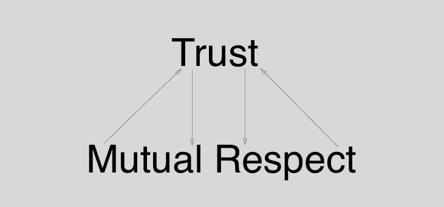
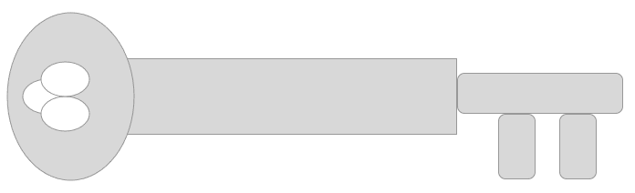
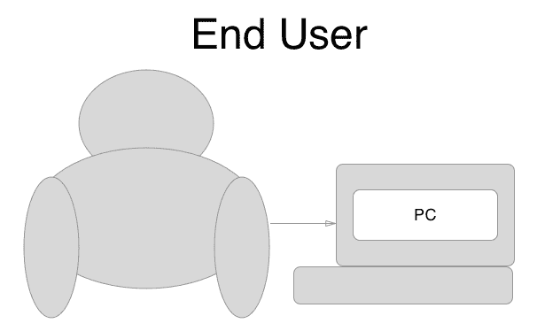
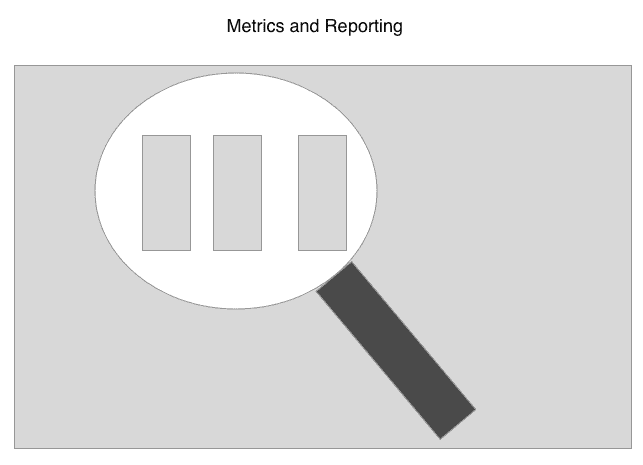

# 第四章：CI/CD 的商业价值

现在我们清楚了自动化、持续集成（CI）和持续交付（CD）的概念，我们需要向业务利益相关者传达这些实践的商业价值，否则我们就会在不考虑这些实践的情况下构建功能。本章将讨论如何说服利益相关者这些价值，以及我们将讨论沟通问题、如何向团队成员传达痛点、在不同团队之间分享责任、了解你的关键利益相关者、演示 CI/CD 的重要性以及从利益相关者那里获得 CI/CD 的批准。

本章将涵盖以下主题：

+   沟通问题

+   向团队成员传达痛点

+   在不同团队之间分享责任

+   了解你的利益相关者

+   CI/CD 的重要性演示

+   从利益相关者那里获得 CI/CD 的批准

# 技术需求

本章假设你已经熟悉自动化和 CI/CD 的概念；如果你对这些主题感到不确定，请在阅读本章之前阅读第一章《自动化测试的 CI/CD》和第二章《持续集成的基础知识》。本章主要讨论如何向利益相关者传达这些实践的价值，因此不会有任何代码示例或需要安装的内容。

# 沟通问题

在任何工作环境中，沟通问题都是不可避免的，但特别是在敏捷工作环境中存在问题。一些沟通问题包括需求的误解、缺乏适当的文档、时区差异、缺乏信任和相互尊重、文化差异、语言障碍和长时间的反馈循环。

# 需求的误解

这是一个需求清单的示例。需求清单的目的是为特定功能列出所有必要的事实。

在敏捷工作环境中，需求的误解是一个常见问题。虽然不可能完全消除需求的误解，但通过确保在功能请求的最初阶段与最终用户或客户进行沟通，可以最大程度地减少这种风险。

重要的是，你正在实施的功能请求必须清晰陈述，并且每个功能都必须有明确的商业意图。这很重要，因为它有助于开发人员、DevOps 人员和 QA/测试人员在实施阶段做好充分准备。

在前期了解关键业务需求将有助于减少团队之间的需求误解，因为缺少需求可能会在开发过程中轻易造成瓶颈。任何关键需求信息都需要得到适当的文档记录。

# 缺乏适当的文档

文档需要在定义任何需求的同时编写，并在功能开发过程中持续更新。只有在一切都尽可能清晰地定义和陈述之后，你才能开始编写实施特定功能的计划。如果开发人员遇到问题并需要向客户澄清，那么答案需要直接放在需求中以供将来参考。

避免有多个包含需求信息的文档，而是使用一个文档包含所有需求信息，否则你就有可能出现信息过时的情况，甚至更糟糕的是，不同的需求分散在不同的地方并相互矛盾。

业务需求应该有一个统一的真相来源，并且所有相关方都应该理解这些需求。

# 时区差异

随着越来越多的团队变得分布式和全球化，时区差异可能会导致沟通瓶颈。在时区差异较大的开发人员需要确保良好的 CI/CD 实践。CI 构建失败和配置管理问题可能会因时区差异而迅速恶化，因为一个时区的团队可能会无法有效地进行工作。在分布式团队中，沟通尤为重要，因为缺乏面对面的互动可能导致沟通失败，最坏的情况下甚至会导致团队之间的敌意。

我曾在一家初创公司工作，那里有 3 小时的时区差异，这本身并不是问题，但每天的站立会议是在我们的工作日结束时进行的，而另一个团队在我们的中午开始工作。自然而然地，这导致了其他团队的更改会阻塞我们，直到我们的中午才能解决。

# 缺乏信任和相互尊重

以下是一张图，说明了信任和相互尊重是相辅相成的，团队需要这一点才能高效运作：

团队之间的信任至关重要，很容易失去，但很难获得。最好有一个优秀的项目经理，可以促进团队之间的沟通，并帮助澄清必然会发生的问题。健康的团队会在功能工作中出现问题时进行开放的沟通，定期进行回顾也有助于排解团队成员之间的挫折感，并建立信任。

如果可能的话，最好能组织团队外出活动，让多个团队之间可以互动并建立合作关系。一些公司会定期举行会议，让团队一起参加有趣的活动，比如体育运动或游戏。定期进行团队建设活动也可以保持团队成员的参与度，并建立合作精神。

# 文化差异和语言障碍

随着敏捷工作环境的全球化，全球团队变得更加普遍。团队之间的文化差异使得沟通成为项目成功的更加重要的因素。幽默可能是一把双刃剑，因为如果幽默被误解，很容易导致分裂和敌意，所以最好能教导团队有关文化规范和习俗，以避免沟通问题。

语言障碍也可能会导致问题，因为对功能请求的需求可能会被误解。最好是由项目经理作为团队之间的联络人，确保所有需求在团队之间清晰地理解，并帮助澄清任何沟通瓶颈。

# 长反馈循环周期

以下是一个反馈循环周期的图示。反馈循环越长，做出改变所需的时间就越长。在部署流水线上，有一个短的反馈循环是非常重要的，这样在必要时可以及时做出改变。

我们在第一章中谈到了长反馈循环，特别是长反馈循环的危险以及缩短反馈循环周期的重要性，以便在正确的时间将正确的信息传递给正确的人。同样，团队之间长时间的反馈循环周期可能会产生问题和自然瓶颈。

理想情况下，团队应尽快获得他们所需的信息，但这并不总是现实。适当的联络人或项目经理可以帮助缩短团队之间的反馈循环，团队需要适当记录任何流程，并确保这些文档对其他团队可见和已知，否则团队之间的流程可能会有所不同。

记住，短的反馈循环会导致更快的响应时间。

# 向团队成员传达痛点

团队成员能够有效地传达阻碍进展的特定痛点或障碍是很重要的。在本节中，我们将讨论几个痛点，包括等待需求信息、部署流水线中未记录的步骤、王国的密钥持有者过多以及沟通渠道过多。

# 等待需求信息

开发人员通常会开始处理特定的故事/功能，但并没有所有必要的需求来完成他们分配的工作。这对开发人员来说尤为棘手，因为他们所处理的任何代码可能需要根据需求与正确完成的距离有多远而被废弃并重新完成。开发人员需要在开始故事之前就提前获得所有的需求；每个功能必须存在抓取所有需求的流程，并且每个故事理想情况下都将有验收测试作为特性工作的行动项来考虑完成。在理想的世界中，开发人员将在开始特定的功能工作之前准备好所有必要的信息，并且在需求文档中指定的特性完成时，故事的验收测试将通过。

在第一章中，*自动化测试的 CI/CD*，我们讨论了比利·鲍勃机械零件公司的例子。现在，想象一下，开发团队的汤姆已经开始了显示供应商名称的工作，并且汤姆发现这个工作的范围似乎很大，他可能无法及时完成。这种情况也因需求文档严重缺乏和开发过程中缺少关键细节而变得复杂。汤姆询问产品负责人是否可以就某些项目提供反馈，但必须等待数天才能获得这些必要信息。

# 部署流水线中未记录的步骤

部署流水线过程中的每个步骤都应适当记录和自动化。我们在第五章中谈到了在 Jenkins 的*安装和基础知识*中尽可能自动化部署流水线的重要性。重申一下，手动流程是有问题的，因为它们是可重复和可靠的。自动化很重要，因为它为部署流水线带来了可重复性和可靠性。每当有人必须执行手动步骤时，就无法保证流程是否会正确执行，并且在每次运行中都以相同的方式执行；只有通过自动化，您才能保证部署流水线阶段的可重复性。

作为 DevOps 团队的一部分，阿尔文正在为软件产品的最新版本进行发布，并在部署流水线中运行一个复杂的手动流程。阿尔文输入了错误的命令，结果清除了生产数据库。幸运的是，阿尔文有一个一天前的备份，他可以将生产数据库恢复到这个备份。如果当时有自动化流程，这种情况就不会发生。

# 王国的密钥只交给少数人

以下图表代表一个关键点，关于王国的关键点要记住的主要事情是只有少数人可以访问/拥有生产环境的密钥：

重要的是要控制谁可以在生产环境中进行更改，许多软件公司通常会选出少数几个甚至一个人可以在生产中进行更改。如果这个特定的个人不可用或离开公司，这可能会成为问题，但一些公司已经实行了开发团队全权拥有特定功能的做法，负责修复部署管道中遇到的问题的是同一个开发人员。在我工作过的一家公司，我们亲切地说，“只有少数人拥有王国的钥匙”。

阿尔文是为数不多的 DevOps 人员之一，拥有王国的钥匙。客户支持代表向开发团队发出关于生产中断的通知，开发团队正在努力恢复生产环境以满足客户需求。阿尔文和另一名 DevOps 成员是唯一可以触及生产环境的人。这个问题变得更加严重，因为阿尔文或其他指定的 DevOps 人员都不可用。

# 太多的沟通渠道

在沟通方面应该有低信号噪音比。如果开发人员通过电子邮件、短信、语音邮件和 Slack 消息收到关于问题的警报，他们可能很快就会忽略并不关注这些问题。重要的是要引起开发人员的注意，以便在遇到问题时及时解决，但你可能不应该像军事指挥中心那样被来自许多不同来源的通知轰炸。

想象一下，布鲁斯是团队中的一名新开发人员，他收到了一个关于他处理的低优先级工单的警报。布鲁斯收到了有关这个工单的电子邮件、短信警报、Slack 消息和电话。布鲁斯经常收到这样的消息，很快就决定忽略它们。在一个下午，布鲁斯因为觉得这是一个毫无意义的警报而忽略了一个高优先级的工单。布鲁斯已经对这些警报麻木不仁了。

在所有这些警报中，噪音太大，真正的信号几乎没有。

# 痛苦驱动开发（PDD）

如果 CI/CD 管道中的某些部分让你感到痛苦，那么自动化这个过程可能是一个好主意。如果你有一个 15 步的过程，在部署管道中容易出错，并且由于执行错误而在发布过程中引起许多问题，那么这可能是其他人在某个时候也会感到痛苦的地方。这个想法是痛苦应该引导你找到更好的解决方案。如果你在处理过程中遇到问题，那么你可能需要自动化这个过程。并不总是为了自动化而自动化一个任务；你需要不断评估你的过程，而 PDD 可以是发现需要改进的过程的有效工具。

吉米在每次提交阶段都遇到了 linting 失败的问题。吉米忘记在将代码推送到代码库之前检查 lint 任务。这尤其麻烦，因为吉米确保运行所有单元测试来检查它们是否通过，但习惯性地忘记检查 linting 错误。吉米决定痛苦已经足够了，需要建立一个新的流程。吉米编写了一个预 Git 推送挂钩脚本，每次 Git 推送到主分支时都会运行 linter。现在，每当有人推送到主分支时，脚本都会运行 linter，以确保不会引入 linting 错误到代码库中。

# 将责任分享给不同的团队

如果可能的话，你应该轮换团队成员，尝试征求开发实践的反馈意见，并尝试创建跨职能团队。

# 轮换团队成员

以下图表象征着团队成员的轮岗。如果可能的话，创建一个团队轮岗，让不同的团队成员可以轮换不同的工作职责，可以帮助团队成员分享责任，建立高效的流程，并有可能激发创新：

通过将团队成员轮岗到不同的团队，可以帮助塑造他们的视角，并提供更广泛的开发实践理解和增加他们的产品知识。这并非总是可能的，特别是对于高度专业化的团队，比如安全团队或机器学习团队，因为任何开发人员有效性所需的上手时间可能会有所不同。如果可能的话，将团队成员轮岗到相关项目和技术中可以帮助防止开发人员的倦怠，并可以帮助开发人员互相学习。变得自满并习惯于事情是如何进行的是很容易的，而通常情况下，一双新的眼睛可以以新的视角看待事物，并帮助开发团队带来必要的变化。

布鲁斯在 API 开发团队工作，并被调入网络工程团队。轮岗期大约为 3 到 6 个月，布鲁斯已经学到了一些对 API 开发团队有帮助的实践。跨培训工程师的一些优势是，他们在其他开发团队学到的技能可以转移到其他团队。布鲁斯学到了一些缓存优化的方法，可以应用在网络层和 OSI 层，这将有助于 API 开发团队。**开放系统互连**（**OSI**）是一个将通过网络发送的信息分解成不同层次的概念模型。OSI 模型有七层——**应用层**（第七层）、**表示层**（第六层）、**会话层**（第五层）、**传输层**（第四层）、**网络层**（第三层）、**数据链路层**（第二层）和**物理层**（第一层）。布鲁斯一直在应用层利用优化策略，但通过对网络层的新知识，他提出了新的优化策略。

# 在开发实践中寻求反馈

团队成员之间的沟通对于团队的长期成功至关重要。开发人员不应该害怕询问为什么以某种特定方式进行事情的反馈，重要的是要创造一个健康的环境，*建设性的批评*是受欢迎的。团队成员可能会对团队流程变得自满，并可能会错过优化流程的机会。

让我们回到我们的例子公司，比利·鲍勃的机械零件公司。假设汤姆最近加入了团队，并注意到在 API 存储库中设置的步骤过于复杂，需要许多步骤才能使特定环境运行起来。汤姆询问是否有人考虑使用构建工具自动化一些步骤，并被告知可以自行自动化他认为有帮助的任何步骤。汤姆决定编写一个 Makefile，可以通过简单运行`make`命令来封装所有开始特定环境的步骤。汤姆向 API 存储库创建了一个拉取请求，并引入了这个新功能，这有助于自动化创建特定环境的步骤。

# 创建跨职能团队

如果可能的话，并且如果你有资源，尝试创建跨职能团队，这样团队成员可以在其他团队成员中分享专业知识。例如，一个团队可以有两到三名开发人员，一个质量保证团队成员，一个安全团队成员，一个 DevOps 团队成员和一个产品负责人，他们都可以一起工作，并且能够开发出效率，否则如果他们独立工作则不会发生。

回到我们的示例公司——想象一下以下跨职能团队的阵容。汤姆、史蒂文和鲍勃都是开发人员，瑞奇是安全团队成员，苏珊是 DevOps 团队成员，尼基是产品负责人。他们都在同一个空间里共同工作，并每天早上进行晨会。现在，团队成员能够全权拥有部署流程的各个阶段，因为他们可以共同合作，互相帮助自动化流程。汤姆和史蒂文使用新库编写了自动化测试套件，瑞奇能够添加第三个构建阶段，对对主分支进行的更改进行安全检查。苏珊在每个项目通过部署流程时添加了监控和报告指标。尼基迅速更新了鲍勃的需求文档，因为他注意到了新功能工作中的边缘情况。团队成员在他们的流程中每一步都进行了公开交流，并且能够优化流程，因为他们之间进行了公开的合作。

# 了解你的利益相关者

对于开发团队来说，了解所有利益相关者是很重要的，因为利益相关者将持有关键信息，这些信息可以帮助团队成功或失败。开发团队应该能够在必要时与项目经理进行沟通，向高管团队成员公开沟通，并能够与最终用户交流。

# 项目经理

尽管产品负责人可能承担项目经理的角色，并且可以帮助促进 Scrum Master 的职责，但最好由不同的人来担任这些角色。项目经理可以被视为适应动态工作环境的变革者。在一天结束时，项目经理希望能够将交付内容交付给最终用户，并且可以帮助打开不同团队之间的沟通渠道。开发人员能够公开沟通，并通知项目经理在他们的功能工作中遇到的任何问题是很重要的。

一些公司还雇佣了负责敏捷工作环境中工作流程和方法的敏捷项目经理。敏捷项目经理将为冲刺计划制定路线图，并确保开发团队中的每个开发人员都得到了按计划分配的工作。这种类型的经理通常会更加了解团队的所有工作，并确保所有利益相关方都拥有完成其交付内容所需的工具和信息。

# 高管团队

公司文化很大程度上会受到高管团队的影响，比如首席执行官（CEO）、首席信息官（CIO）、首席技术官（CTO）和首席运营官（COO）。除非在这些高管层面上运作，否则很难对公司产生广泛的影响。如果开发团队觉得决策是一种命令，并且他们对所做的决定没有发言权，他们可能无法防止本来可以避免的问题。许多公司声称他们有开放式政策，并欢迎建设性的反馈，但通常开发团队在与破碎的流程作斗争时无法发声。

假设汤姆在周末读了一篇博客文章，发现了一种减少自动接受测试套件中反馈循环的方法。汤姆想引入这种变化需要大量工作。汤姆试图在周一早上的站立会议上提到这一点，但被团队拒绝了，因为有更有价值的工作要做。汤姆决定这对上层管理意识到是很重要的。汤姆继续使用开放式政策与首席技术官谈论这个问题，但第二天因未经过适当的领导渠道而受到口头斥责。这样，汤姆无法做出最有利于团队的决定，因为团队成员都没有被授权对工作流程进行更改。

# 最终用户

这是最终用户的描述；最终用户是最重要的利益相关者。您的最终用户的反馈意见最为重要：

最终，最终用户将使用您为产品添加的新功能。在这方面，他们可以帮助澄清开发人员的必要需求。通常情况下，最终用户在看到产品之前并不清楚他们在寻找什么。如果需要，产品所有者必须从客户那里提前获取所有必要的需求，有些软件组织甚至要求产品所有者/客户编写测试，以代码指定必须实现的需求。无论如何，在开发人员开始工作之前，产品所有者和最终用户必须就所请求的功能达成一致。

开发团队基本上与最终用户隔离，不会与任何最终用户接触。然而，对于开发团队来说，了解最终用户在使用软件系统时遇到的具体痛点是很重要的。在这个意义上，开发人员是最有能力对系统进行改变以使最终用户受益的人，但如果开发人员不了解这些痛点，他们将无法进行必要的改变以使最终用户受益。在适当的时候，让开发人员与客户成功团队合作可能会有所帮助，以了解最终用户如何使用软件系统。

# 展示 CI/CD 的重要性

CI/CD 流水线的重要性不容小觑，开发人员需要通过提供指标、报告和一般教育领导层自动化的重要性来证明其重要性。

# 指标和报告

以下图表是图表和图形的描述，您可以用它向利益相关者展示 CI/CD 的重要性。开发图表和图表是一个很好的主意，因为视觉很有说服力。

通常在公司的高管层，数字和 PowerPoint 幻灯片必须证明某事的重要性。开发人员应该能够用指标（图表、图表和任何其他可视形式）说明 CI/CD 如何改进现有流程。已经存在企业解决方案可以帮助生成这些信息，但开发团队可以将这些信息汇总到 Excel 电子表格中。

让我们假设开发团队的鲍勃已经决定，手动流程在发布日期间已经够了，迫切需要自动化。鲍勃汇总了过去 6 个月在紧急修复上花费的时间，以及在发布日出现问题时每个开发人员浪费的工时。鲍勃创建了一个漂亮的可视化图表，帮助说服管理层创建一个处理自动化部署流程的敏捷史诗。

# 教育领导层关于自动化

开发团队不能假设领导了解自动化的含义以及哪些领域适合自动化。最好是由技术代表，如首席技术官，作为自动化的倡导者，并帮助向高管团队解释。像首席技术官这样的人可以成为变革的代理人，代表开发人员发言，但无论是谁传达这些信息，高管团队必须了解自动化的含义以及哪些事情可以自动化。

领导团队往往与开发人员日常工作相距甚远。领导团队对公司有更全局性的关注，并且往往会与其他成员合作，如销售、营销、运营和项目经理。对于高管领导团队来说，了解自动化仍然很重要，以便开发人员有足够的时间来开发自动化部署流水线，并且他们在每个迭代期间有时间进行测试，并不断将自动化流程添加到 CI/CD 构建流水线和部署流水线中。组织的最高层需要对自动化有清晰的理解，以便开发人员、系统管理员和 DevOps 人员可以将自动化实践纳入公司路线图的关键交付成果中。

# 获得利益相关者对 CI/CD 的批准

即使强调自动化的重要性并向利益相关者解释其重要性，您可能需要在没有官方批准的情况下采取行动。许多软件项目都是作为一项未经官方批准的秘密项目开始的。开发人员也可以在本地机器或未使用的机器上工作部署流水线自动化任务。

# 启动秘密项目

术语“秘密项目”的起源有待讨论，但一般的想法是，这是一个由个别人或一组人秘密进行的项目，旨在为组织带来创新和变革。开发人员不一定能够获得对于某项任务的批准，他们可能需要采取替代策略来表达自己的观点。

想象一下，开发团队的鲍勃有一个想法，要编写一个 CLI 应用程序，帮助第三方开发人员利用公司的仪表板。鲍勃试图向高层管理层传达这个想法，但没有成功。鲍勃决定在接下来的几周内编写一个 CLI 应用程序，并决定使用一种名为**Rust**的新编程语言来编写 CLI 项目。鲍勃创建了一个直观的 CLI 应用程序，易于使用和可插拔。鲍勃能够向团队展示这个新应用程序，并说服高层管理层投入资源来开展 CLI 项目。

# 在本地机器上启动 CI/CD

开发团队可能无法获得启动 CI/CD 流水线的财务批准。为了发现并说服他人自动化 CI/CD 流水线的重要性，开发人员可以在自己的机器上复制部署流水线，并向团队和高层管理层展示构建自动化流水线阶段的好处。

如今，像 Azure、AWS 和 Google App Engine 这样的大型云服务提供商可以提供免费的账户计划来提供云服务。通过这种方式，开发人员可以轻松地设置更真实的部署流水线，通过展示一个小项目，并展示 CI/CD 流水线中的所有阶段，如提交阶段、自动化验收测试阶段和可选的安全和容量构建阶段。

# 公司演示

在您的组织中，公司范围的演示可能是获得 CI/CD 批准的最有效方式。一些公司赞助黑客马拉松，您可以在赞助的黑客马拉松上为公司创建一个新的自动化流程。这样做的优势是您可以在公司演示期间将自动化信息传达到组织的最高层。

假设开发团队的汤米正在尝试 Docker，并且有创建每个部署流水线的 Docker 镜像的想法。汤米表明 Docker 容器可以用作 QA 测试软件产品版本的隔离版本控制系统，这也具有环境隔离的优势。汤米构建了这个自动化流程，并在公司演示中展示了这可以节省 QA 部门 25 小时的回归测试工时。CEO 并不知道 QA 在部署过程中花费了很多时间来设置环境进行回归测试。汤米通过令人信服的演示向领导层展示了自动化的重要性。

# 午餐和学习

以下图表只是叉子和刀子的描绘，但主要观点是与他人共进晚餐是打开沟通渠道和团结人们的好方法。您可以在午餐时将自动化演示纳入公司会议中：

您可以邀请高层管理人员，并使用图表和带有指标的幻灯片来解释自动化是什么，并展示手动流程上的花费。通常，高层管理人员更关心活动的货币影响，如果您能向他们展示手动流程的成本，他们会更愿意倾听。

# 总结

传达 CI/CD 的业务价值非常重要，正如本章所阐述的那样。我们从讨论传达问题开始，讨论了一些传达痛点给团队成员的策略。我们讨论了在不同团队成员之间分享责任，了解您的利益相关者，向利益相关者展示为什么 CI/CD 对他们重要，最终从您的利益相关者那里获得 CI/CD 的批准。

下一章将介绍如何在本地环境中设置 Jenkins CI。这一章将介绍本书的第一个 CI/CD 工具。

# 问题

1.  为什么您应该在开始时拥有所有的需求信息？

1.  什么是痛苦驱动开发？

1.  为什么拥有许多沟通渠道是有问题的？

1.  轮换团队成员的一些好处是什么？

1.  要求对现有开发实践进行反馈的好处是什么？

1.  使用指标和报告如何有助于向利益相关者展示 CI/CD 的价值？

1.  为什么需要教育领导层关于自动化？

# 进一步阅读

考虑阅读*Packt Publishing*的*Continuous Integration, Delivery, and Deployment*，因为这本书讨论了软件组织的 CI/CD 的价值：

+   [`www.packtpub.com/application-development/continuous-integration-delivery-and-deployment`](https://www.packtpub.com/application-development/continuous-integration-delivery-and-deployment)
