# Jenkins 的安装和基础知识

本章将帮助您在 Windows、Linux 和 macOS 中安装 Jenkins。我们还将了解 Jenkins UI 的基础知识。

本章将涵盖以下主题：

+   Windows 安装有我们的第一个构建

+   Linux 安装

+   macOS 安装

+   在本地运行 Jenkins

+   管理 Jenkins

# 技术要求

本章是关于使用 Jenkins 进行 CI/CD 流程。在本章中，我们不会讨论 CI/CD 概念，因为我们正在设置环境以使用 Jenkins。

# Windows 安装

有一些初步步骤可以安装 Jenkins。

# 安装 Jenkins 的先决条件

您需要确保已安装 Java，并且从 Jenkins 2.54 开始。Jenkins 现在需要 Java 8。

# 查找您的 Windows 版本

单击开始 Windows 图标，键入`system`在搜索框中，然后单击程序列表中的系统。

现在打开了系统小程序，标题为查看有关计算机的基本信息，在大的 Windows 徽标下找到位于系统区域下的系统区域。

系统类型将显示 64 位操作系统或 32 位操作系统。

# 安装 Java

要安装 Java，请转到 Java 下载页面([`www.oracle.com/technetwork/java/javase/downloads/index.html`](http://www.oracle.com/technetwork/java/javase/downloads/index.html))：

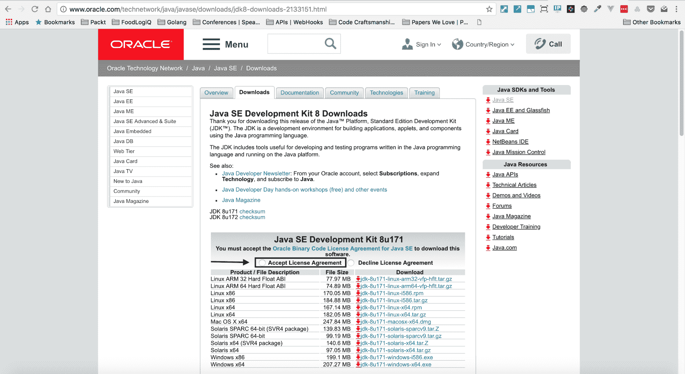

确保点击接受许可协议单选按钮，然后点击 Windows 下载，并确保选择正确的架构；即 32 位或 64 位操作系统。

然后使用安装程序在 Windows 中安装 Java。

# Windows 安装程序

在 Windows 操作系统中安装 Jenkins 相对容易；只需转到 Jenkins 下载页面([`jenkins.io/download/`](https://jenkins.io/download/))：

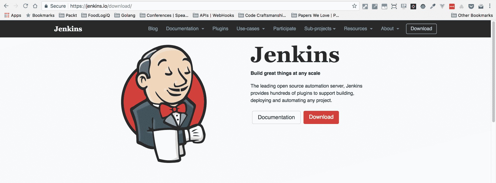

如果您滚动到页面底部，您将看到根据当前版本可以在其上安装 Jenkins 的操作系统列表：

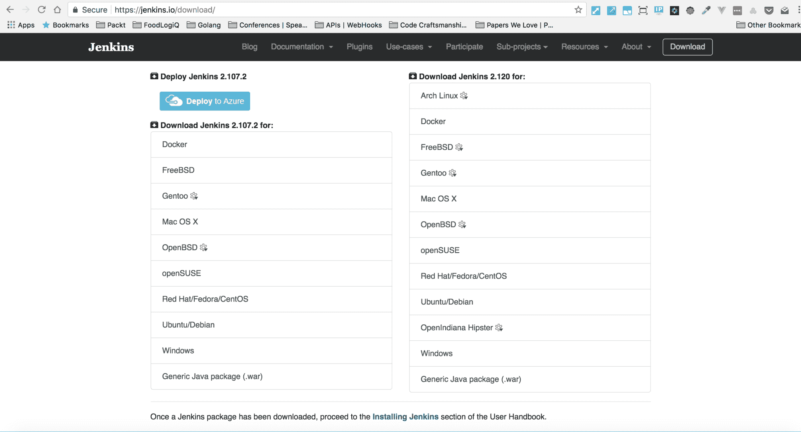

# 在 Windows 中安装 Jenkins

我已从 Jenkins 下载页面下载并解压了 Jenkins 文件，如下图所示：

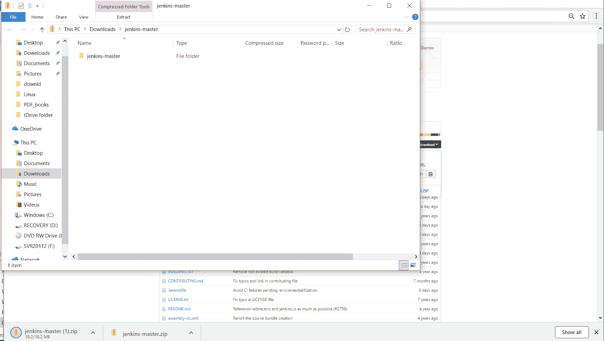

# 在 Windows 中运行 Jenkins 安装程序

以下屏幕截图显示了 Windows 中的 Jenkins 安装程序：

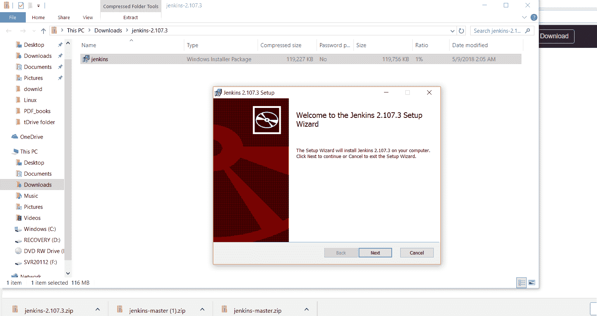

一旦您完成安装程序中的所有步骤，您将看到以下屏幕：

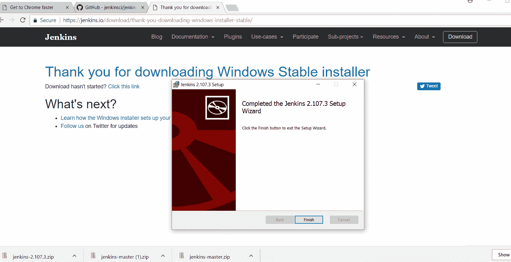

单击**完成**后，您可以在 Web 浏览器中转到`http://localhost:8080`，您将看到以下屏幕截图：

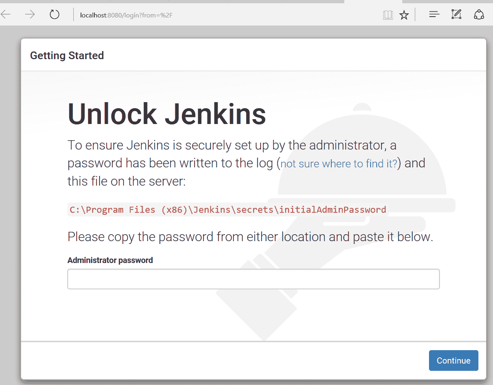

# 使用 Chocolatey 软件包管理器安装 Jenkins

Chocolatey 安装说明可以在[chocolatey.org/install](https://chocolatey.org/install)找到。

您可以使用以下命令在`cmd.exe`中安装 Chocolatey：

```
@"%SystemRoot%\System32\WindowsPowerShell\v1.0\powershell.exe" -NoProfile -InputFormat None -ExecutionPolicy Bypass -Command "iex ((New-Object
```

```
System.Net.WebClient).DownloadString('https://chocolatey.org/install.ps1'))" && SET "PATH=%PATH%;%ALLUSERSPROFILE%\chocolatey\bin"
```

安装了 Chocolatey 后，您只需运行`choco install jenkins`来通过 Chocolatey 安装 Jenkins。

# 在 Windows 中使用命令提示符启动和停止 Jenkins

单击**开始**按钮，键入`cmd`并按*Enter*。这将打开一个命令提示符会话。

接下来，您可以在命令提示符中输入以下命令：

```
cd 'C:\Program Files (x86)\Jenkins'
```

然后您可以使用以下命令：

```
$ C:\Program Files (x86)\Jenkins>jenkins.exe start
$ C:\Program Files (x86)\Jenkins>jenkins.exe stop
$ C:\Program Files (x86)\Jenkins>jenkins.exe restart
```

您还可以使用`curl`并使用以下命令：

```
$ curl -X POST -u <user>:<password> http://<jenkins.server>/restart
$ curl -X POST -u <user>:<password> http://<jenkins.server>/safeRestart
$ curl -X POST -u <user>:<password> http://<jenkins.server>/exit
$ curl -X POST -u <user>:<password> http://<jenkins.server>/safeExit
$ curl -X POST -u <user>:<password> http://<jenkins.server>/quietDown
$ curl -X POST -u <user>:<password> http://<jenkins.server>/cancelQuietDown
```

# Linux 安装

我们将在 Ubuntu 16.04 Digital Ocean Droplet 上安装 Jenkins；请按照 Jenkins 下载页面上的按钮链接上的说明在您特定的 Linux 发行版上安装 Jenkins([`jenkins.io/download/`](https://jenkins.io/download/))。您可以单击 Jenkins 官方支持的 Linux 发行版之一安装 Jenkins，但是，出于本节的目的，我们将看看如何在 Digital Ocean Droplet 上的 Ubuntu 操作系统上安装 Jenkins。

# 在 Ubuntu 上安装 Jenkins

运行以下命令将存储库密钥添加到您的系统中：

```
wget -q -O - https://pkg.jenkins.io/debian/jenkins-ci.org.key | sudo apt-key add -
```

添加密钥后，系统将返回`OK`。

接下来，我们将通过运行此命令将 Debian 软件包存储库地址追加到服务器的`sources.list`中：

```
echo deb https://pkg.jenkins.io/debian-stable binary/ | sudo tee /etc/apt/sources.list.d/jenkins.list
```

接下来，我们需要通过运行以下命令更新系统中的存储库：

```
sudo apt-get update
```

确保安装 Java，因为它是 Jenkins 运行的依赖项，因此运行以下命令：

```
sudo apt install openjdk-9-jre
```

接下来，我们在 Ubuntu 上安装 Jenkins：

```
sudo apt-get install jenkins
```

# 在 Ubuntu 中启动 Jenkins 服务

最后，我们需要通过以下命令启动 Jenkins 服务：

```
sudo systemctl start jenkins
```

现在我们需要确认 Jenkins 已经启动并且没有问题：

```
sudo systemctl status jenkins
```

您应该会得到以下输出：

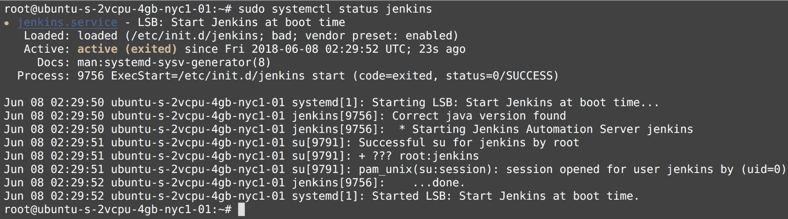

# 打开网络流量防火墙

默认情况下，Jenkins 在 HTTP 端口`8080`上运行，因此我们需要确保该端口允许流量：

```
sudo ufw allow 8080
```

您将得到以下输出：

```
Rules updated
 Rules updated (v6)
```

接下来，我们需要查看规则的状态：

```
sudo ufw status
```

您将看到以下输出：

```
Status: inactive
```

# 解锁 Jenkins 进行首次登录

第一次在 Digital Ocean Droplet 上运行 Jenkins 时，您将看到以下屏幕：

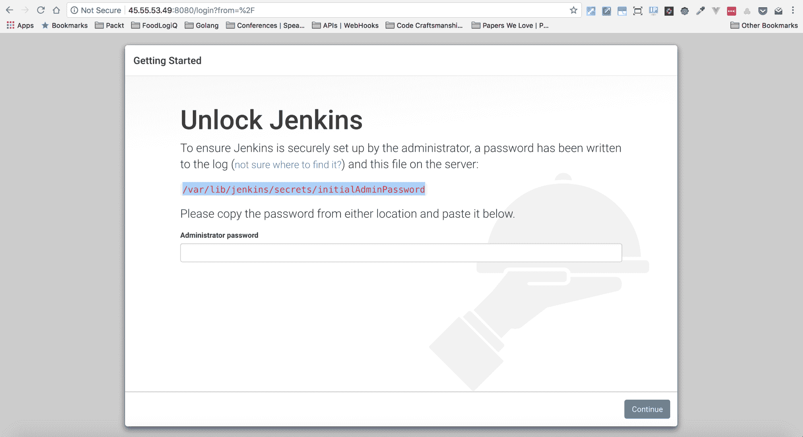

在 Ubuntu 终端会话中运行以下命令：

```
cat /var/lib/jenkins/secrets/initialAdminPassword
```

将打印到标准输出的密码复制到系统剪贴板中，然后将此密码粘贴到初始登录屏幕中，然后单击“继续”按钮。

接下来，您将看到一个屏幕，您可以在其中安装建议的插件或选择要安装的插件：

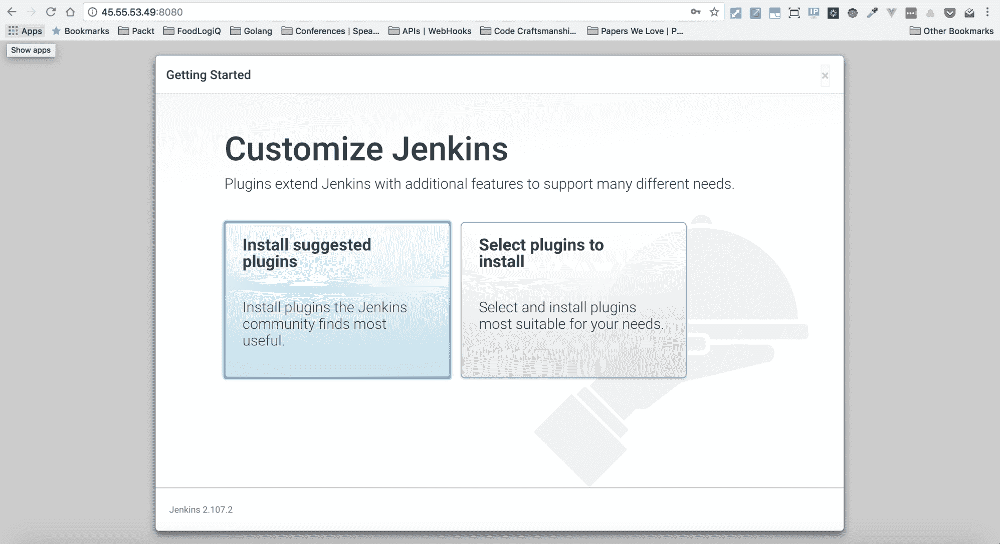

这个屏幕在一开始并不是 100%必要运行，所以您可以单击屏幕右上角的 X：

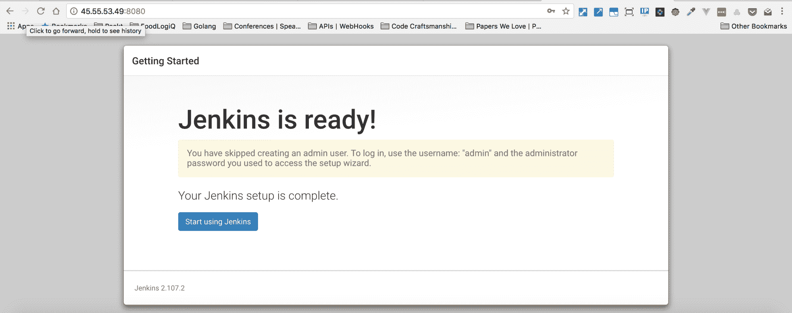

单击 X 并决定启动 Jenkins 后，您将看到此屏幕：

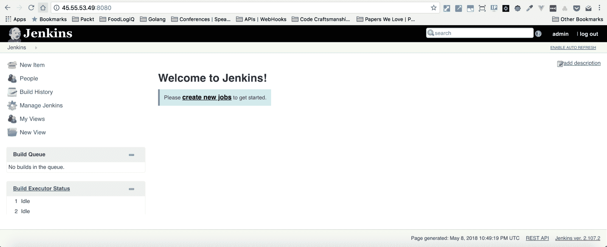

# macOS 安装

在 macOS 上安装 Jenkins 相对容易，您可以通过几种方式完成。

# Jenkins 下载软件包

在本节中，我们将介绍如何使用 Mac 软件包安装程序（`.pkg`）文件安装 Jenkins：

1.  转到 Jenkins 下载 URL（[`jenkins.io/download/`](https://jenkins.io/download/)）。

1.  滚动到页面底部，您应该会看到可以在其上安装 Jenkins 的操作系统列表。

1.  单击 Mac OS X 按钮链接，您应该会看到类似这样的页面：

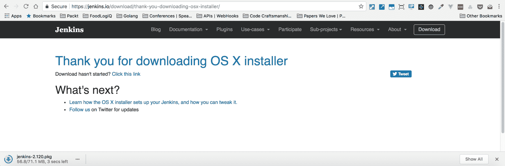

1.  单击浏览器窗口底部可以看到的`.pkg`文件，或者在下载文件夹中双击 Jenkins 的`.pkg`文件：

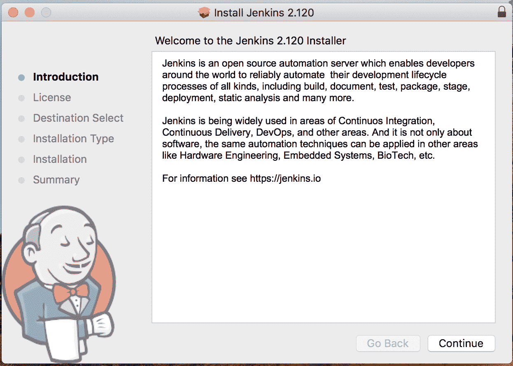

1.  请注意，右下角有两个按钮，分别命名为“返回”和“继续”。只需单击“继续”，您将进入下一个窗口，即许可协议。

1.  单击“继续”，并确保单击“同意”按钮：

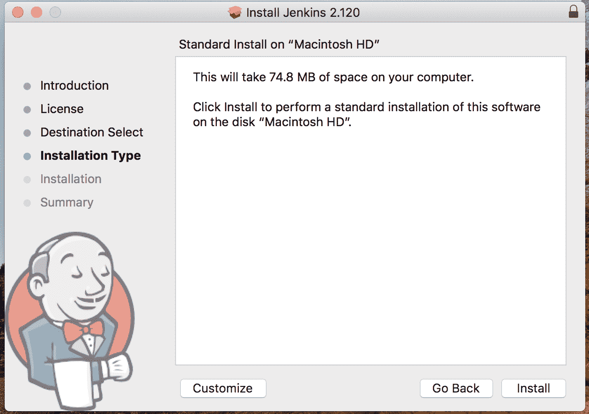

1.  通常，您只需单击“安装”按钮，但如果您想自定义，您可以选择不安装文档等：

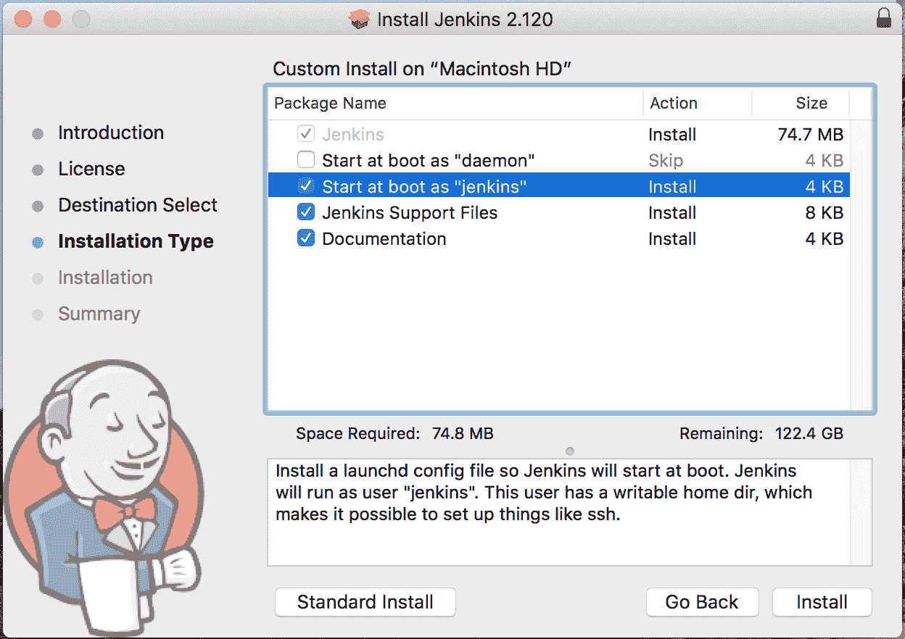

1.  除非您担心磁盘空间，通常最容易的方法是只需单击“标准安装”，然后单击“安装”：

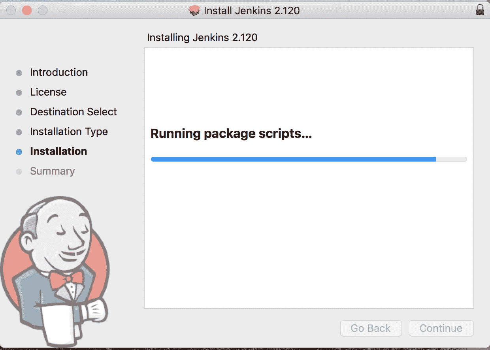

1.  安装脚本运行完成后，您将看到以下屏幕：

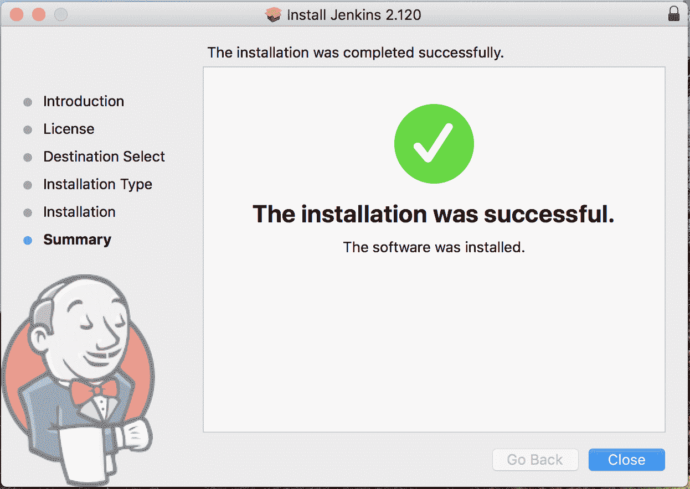

1.  单击“关闭”，Jenkins 应该在您的本地机器上运行。

# 解锁 Jenkins 进行首次登录

第一次在主机上本地运行 Jenkins 时，您将看到以下屏幕：

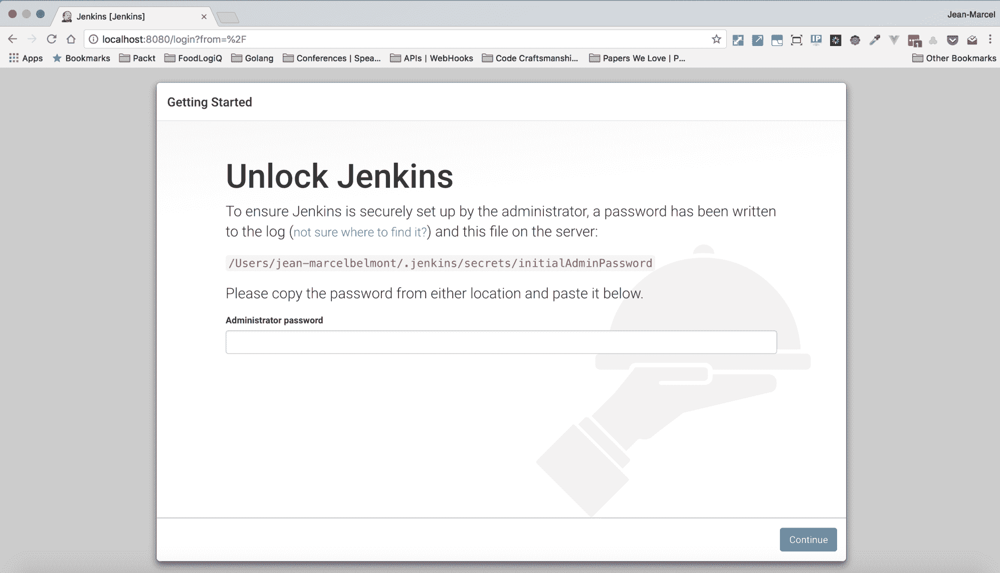

如果 Jenkins 在主用户帐户中运行，请在 Mac 终端中运行以下命令：

```
pbcopy < /Users/jean-marcelbelmont/.jenkins/secrets/initialAdminPassword
```

这将把初始管理员密码复制到系统剪贴板上。如果您的初始密码运行在`Users/Shared/Jenkins`中，也可能会出现这种情况，请尝试以下命令：

```
pbcopy < /Users/Shared/Jenkins/Home/secrets/initialAdminPassword
```

然后，将此密码粘贴到初始登录屏幕，然后单击“继续”：

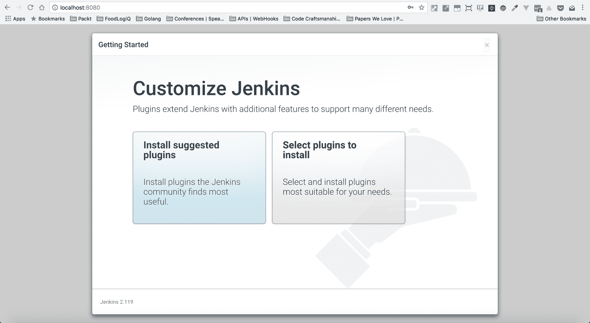

这个屏幕一开始并不是 100%必要运行，所以您可以单击屏幕右上角的 X。单击 X 并决定启动 Jenkins 后，您将看到这个屏幕：

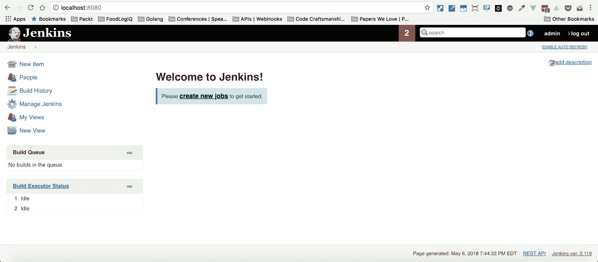

# 通过 Homebrew 安装 Jenkins

您还可以通过 macOS 中的 Homebrew 软件包管理器安装 Jenkins。

如果您尚未安装 Homebrew，请首先转到 Homebrew 页面（[`brew.sh/`](https://brew.sh/)）。

安装 Homebrew 相对容易。单击 Mac Finder 按钮打开终端应用程序，按*Ctrl* + *Shift* + *G*，然后输入`/applications`，并单击“前往”按钮。确保双击`Utilities`文件夹，然后双击终端应用程序图标。

只需将 Homebrew 安装脚本粘贴到终端应用程序提示中：

```
/usr/bin/ruby -e "$(curl -fsSL https://raw.githubusercontent.com/Homebrew/install/master/install)"
```

一旦 Homebrew 安装成功，只需在终端应用程序中运行以下命令：

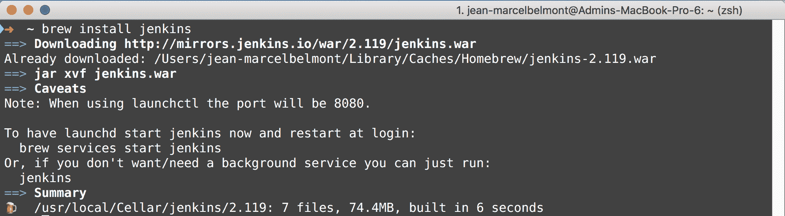

安装 Jenkins 后，您可以通过在终端应用程序中输入以下命令来启动 Jenkins 服务：

```
brew services start jenkins
```

运行此命令后，只需简单地访问`localhost:8080`，然后您可以按照我们在*首次登录解锁 Jenkins*部分中运行的相同步骤。

# 在本地运行 Jenkins

以下是 Jenkins 主仪表板页面的屏幕截图。我们将详细介绍每个项目：

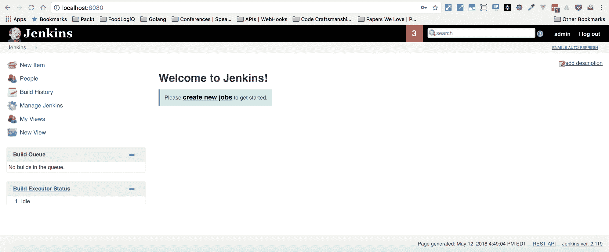

# 创建新项目

在接下来的步骤中，我们将创建一个自由风格项目作为新项目，但根据安装的插件，可能还可以添加更多项目：

1.  如果单击“新建项目”链接，您将进入以下页面：

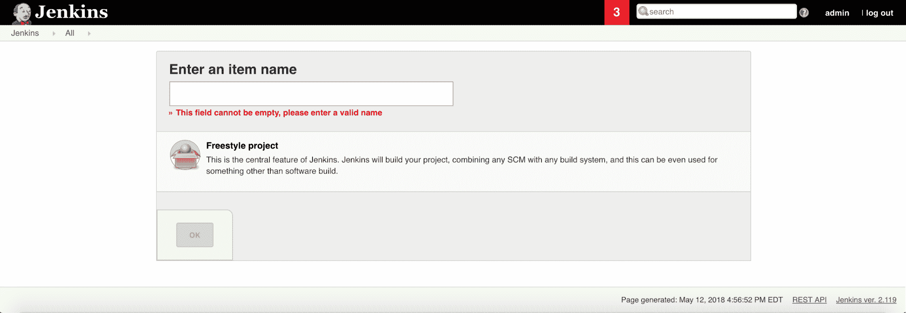

1.  我们还没有安装任何插件，因此我们可以使用的唯一类型的项目是自由风格项目。

1.  让我们为自由风格项目输入一个名称，然后单击“确定”：

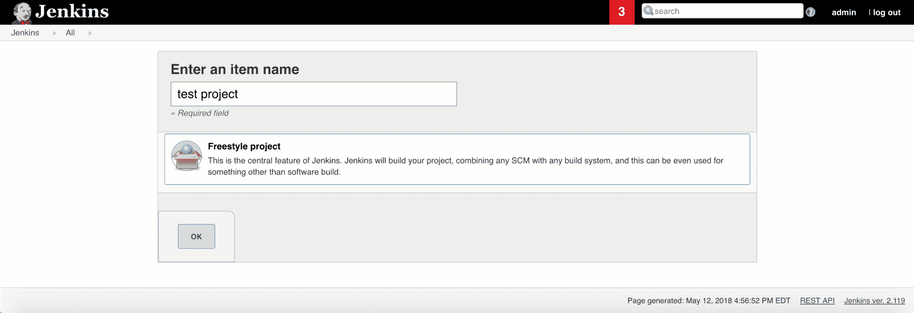

1.  您将看到以下屏幕以配置您的自由风格项目：

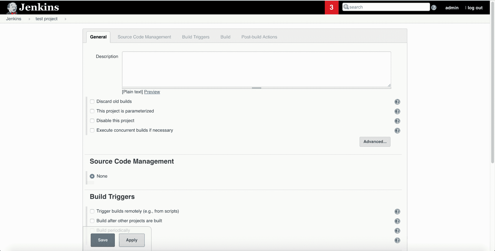

1.  让我们为 Jenkins 创建一个简单的构建，打印出`Hello World`：

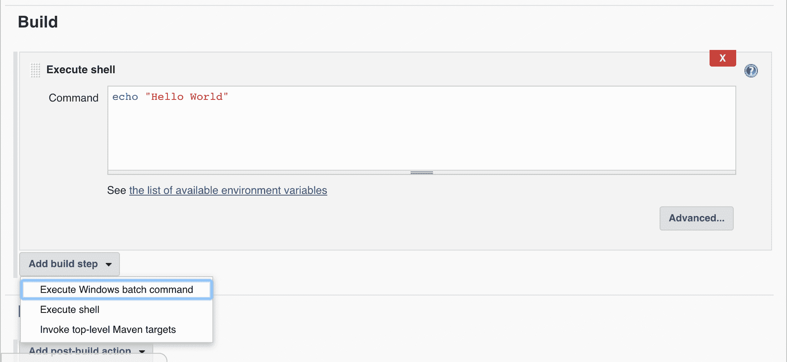

1.  确保单击“添加构建步骤”按钮，然后选择“执行 shell”。

1.  最后，单击“保存”，您将返回到项目仪表板屏幕。

1.  接下来，确保单击“立即构建”按钮以触发构建，您将看到一个文本弹出窗口，上面写着“构建已计划”：

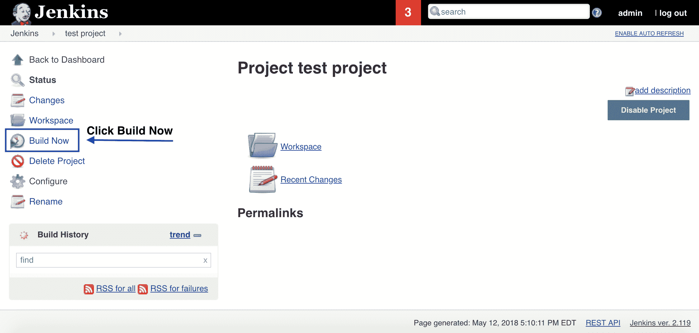

1.  请注意，在以下屏幕截图中，我们的第一个构建标记为#1，在“构建历史”部分：

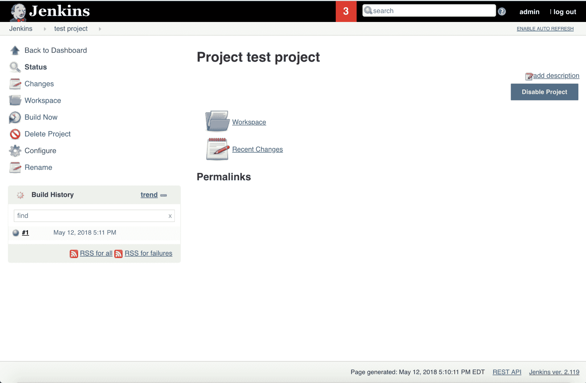

1.  请注意，我们现在有一个“构建历史”部分，通常您会想要查看控制台输出，以查看构建的日志信息。

# 控制台输出

以下是 Jenkins 中典型的**控制台输出**屏幕：

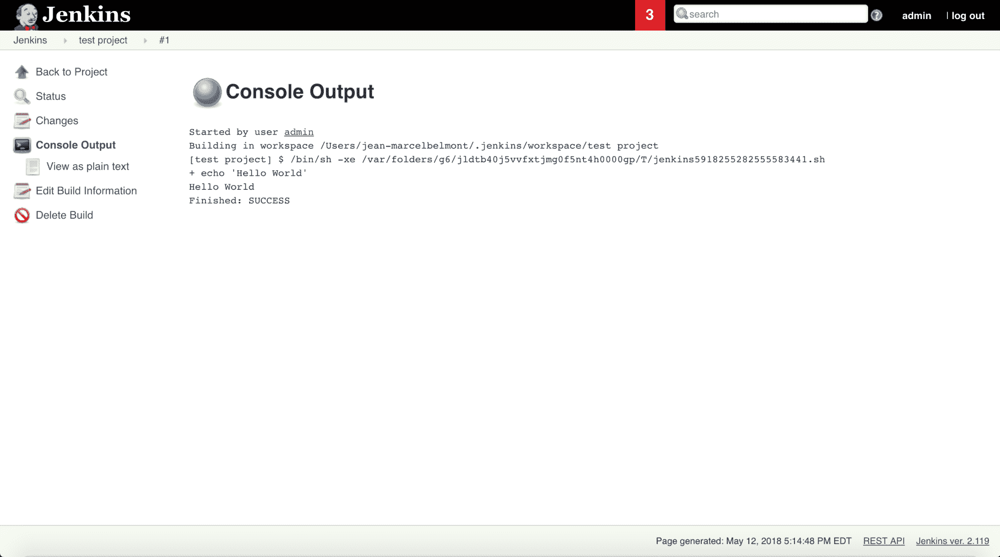

这是一个非常简单的屏幕，我们只是向屏幕打印了`Hello World`。

# 管理 Jenkins

登录到 Jenkins 后，只需单击“管理 Jenkins”链接：

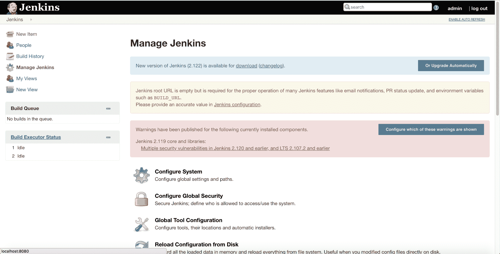

然后确保单击“管理插件”链接：

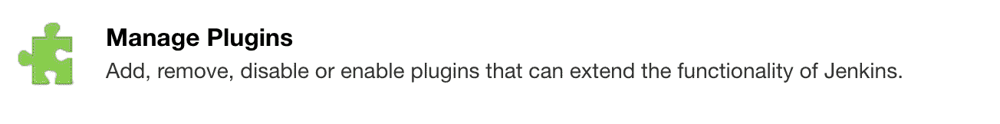

然后您将进入插件页面，看起来像这样：

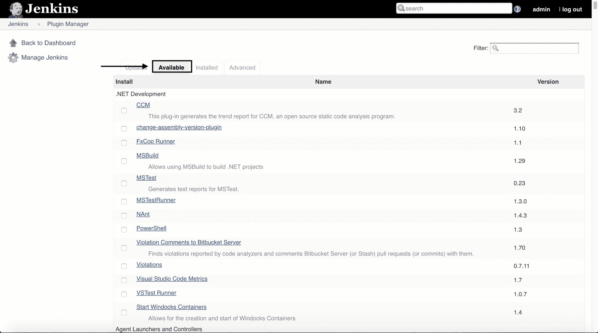

确保单击“可用”选项卡，您将看到可以安装的可用插件列表。

我们将安装 Go 插件（您可以通过使用“筛选”输入框快速找到插件）：

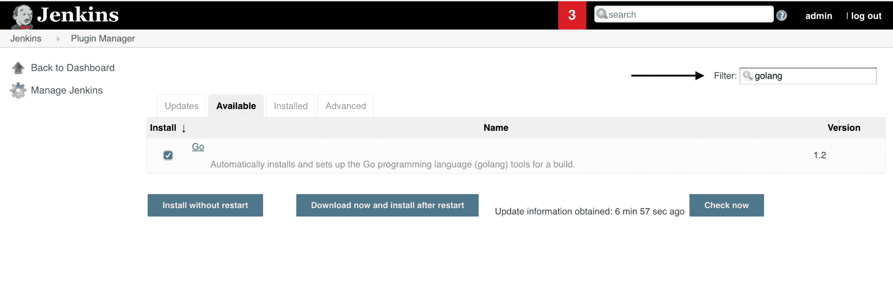

请注意，我们在过滤输入框中输入了`golang`。然后，您可以单击“无需重启安装”按钮或“立即下载并在重启后安装”按钮。我们将使用“无需重启安装”按钮。

单击按钮后，您将看到以下屏幕：

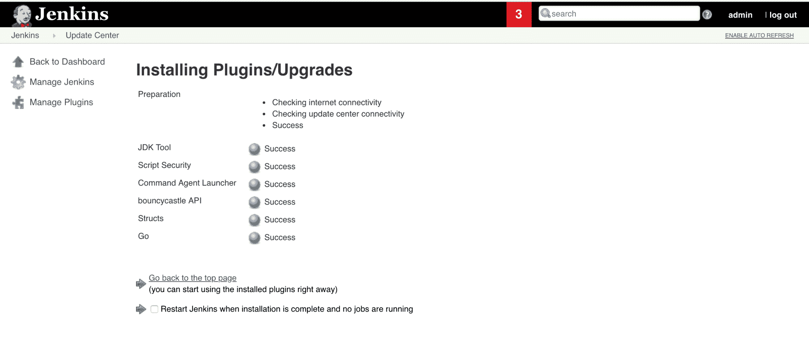

我们将点击“返回到顶部页面”按钮。

让我们回到 Jenkins 仪表板，点击“管理 Jenkins”，然后点击“管理插件”。

确保在过滤输入框中输入`git`：

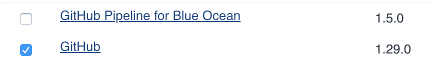

现在我们将点击“立即下载并在重启后安装”按钮。

现在，如果您单击“重启 Jenkins”标志，Jenkins 将重新启动，然后您将被提示登录。

接下来，确保点击“返回仪表板”链接：

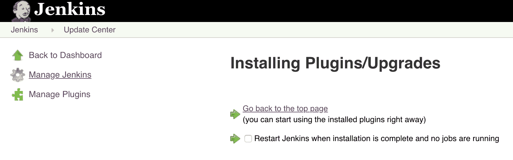

# 配置环境变量和工具

现在我们将看看如何在 Jenkins 仪表板中添加环境变量。确保点击“管理 Jenkins”，然后点击“配置系统”：

然后您需要向全局属性中滚动：

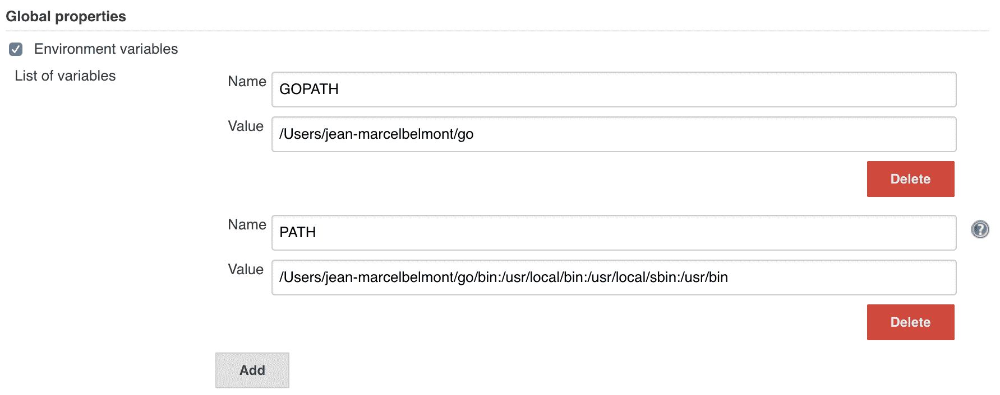

然后确保配置所有工具，比如添加 GitHub 和 golang 的路径。

# 配置作业以轮询 GitHub 版本控制存储库

确保单击“新建项”按钮，现在请注意我们已添加了一个附加项。

现在我们将创建另一个名为“Golang 项目”的 Jenkins 构建作业：

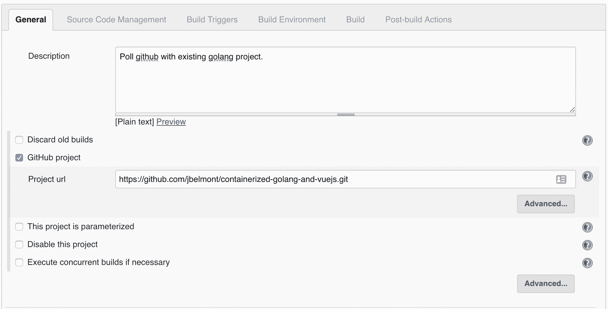

您可以继续向下滚动或单击“源代码管理”选项卡：

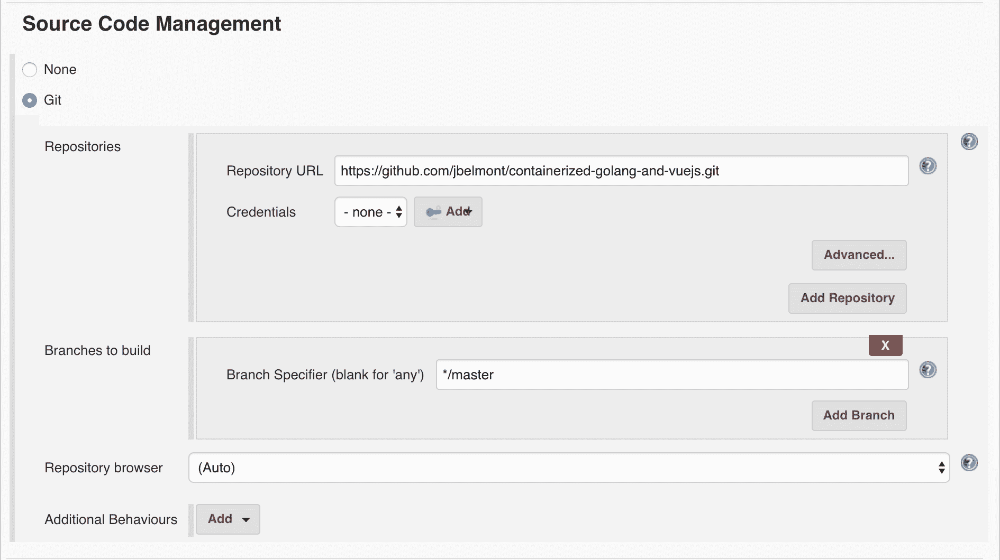

现在，如果您向下滚动，您将进入“构建触发器”部分：

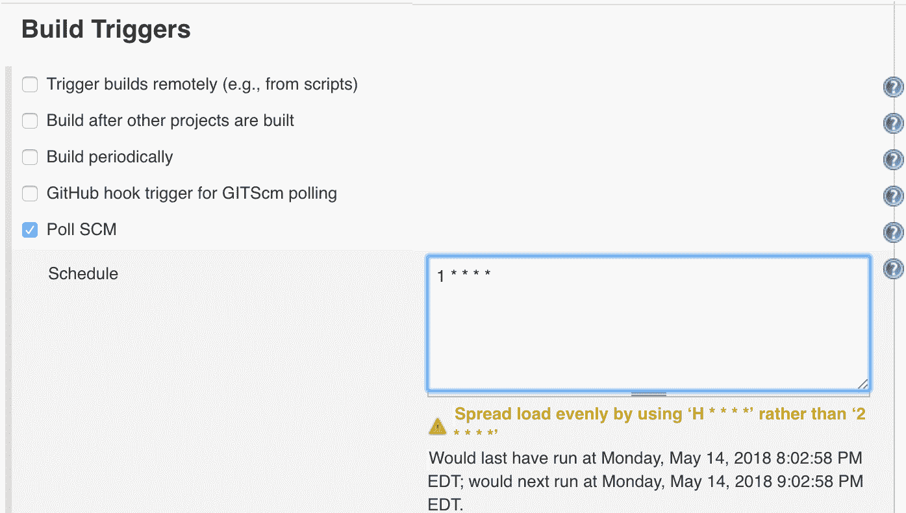

在这里，我们配置了 Jenkins 的轮询并指定了一个 cron 计划。cron 作业显示如下：分钟，小时，日，月和工作日。

您可以在 Linux 手册页下阅读有关 Crontab 的更多信息（[`man7.org/linux/man-pages/man5/crontab.5.html`](http://man7.org/linux/man-pages/man5/crontab.5.html)）。

然后我们添加以下配置：

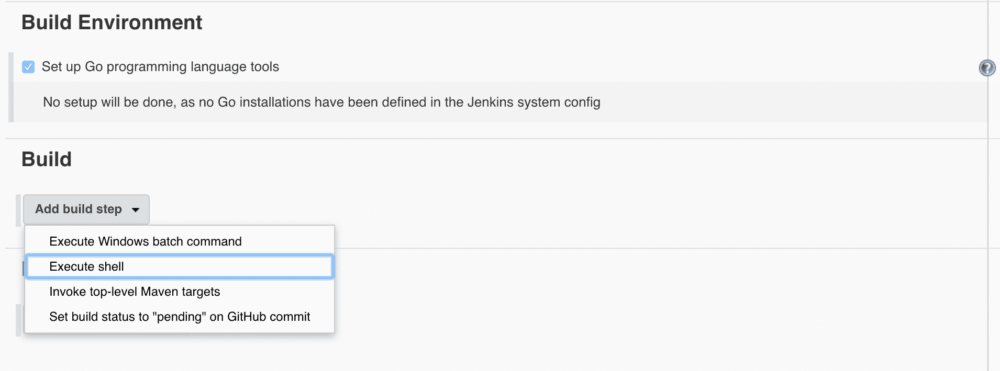

我们将创建另一个 shell 脚本，其中我们执行测试。

确保点击“立即构建”按钮：


然后确保点击构建编号，然后点击控制台输出链接：

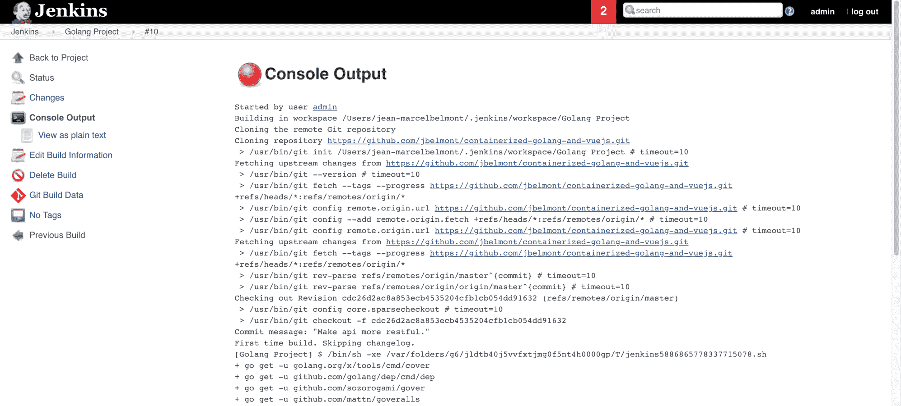

请注意，控制台输出打印出 Jenkins 正在执行的每个步骤。

# 总结

本章介绍了 Jenkins 的安装以及导航 Jenkins UI 的基础知识。下一章将更多地介绍 Jenkins 仪表板和 UI。

# 问题

1.  在 Windows 中，我们用什么软件包管理器来安装 Jenkins？

1.  Jenkins 需要安装哪些先决条件？

1.  在 Windows 操作系统中，重新启动 Jenkins 的一种方法是什么？

1.  我们用什么命令来打开 Linux 中的网络流量防火墙？

1.  我们在 macOS 中用来安装 Jenkins 的软件包管理器叫什么？

1.  您在哪里安装 Jenkins 的插件？

1.  您在哪里配置 Jenkins 的环境变量？

# 进一步阅读

请查看《使用 Jenkins 进行持续集成学习-第二版》（[`www.amazon.com/dp/1788479351`](https://www.amazon.com/dp/1788479351)），由 Packt Publishing 出版。
