# 编写自由样式脚本

本章将详细介绍如何添加新的构建项目、配置构建作业、全局添加环境变量和项目级环境变量。您还将学习如何调试自由样式作业的问题。

本章将涵盖以下主题：

+   创建一个简单的自由样式脚本

+   配置自由样式作业

+   添加环境变量

+   调试自由样式作业的问题

# 技术要求

本章介绍了如何使用 Jenkins 创建简单的自由样式脚本。您应该对 Unix、Bash 有基本的了解，以及环境变量的含义。

# 创建一个简单的自由样式脚本

我们在本章中在 Jenkins 中创建了一个简单的自由样式脚本，但我们将快速回顾一下设置自由样式脚本项目所需做的事情。

# Jenkins 仪表板导航

如果您按照第五章中的说明进行操作，*Jenkins 的安装和基础知识*，那么您应该已经在本地计算机上安装和/或运行了 Jenkins 服务。如果 Jenkins 没有在本地运行，请重新查看第五章，*Jenkins 的安装和基础知识*，并阅读与您的操作系统相对应的部分。

# Jenkins 登录屏幕

如果 Jenkins 正在本地运行，您应该会看到一个登录屏幕。

输入您的用户名和密码信息，然后点击登录按钮。

# Jenkins 仪表板

一旦您登录，您应该会被路由到 Jenkins 仪表板，它看起来像这样：

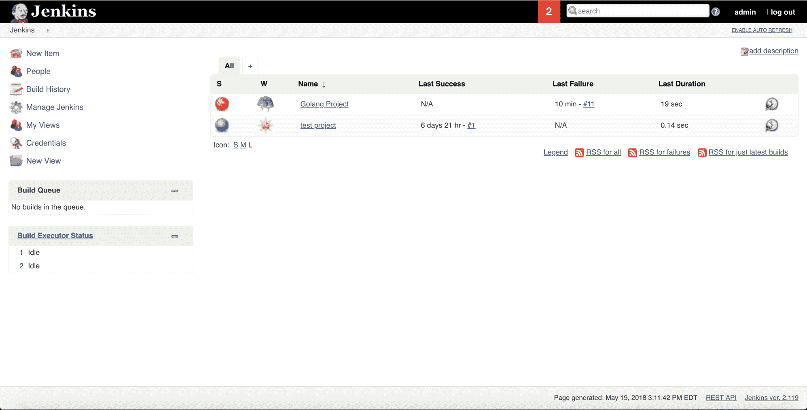

# 添加新的构建作业项目

在 Jenkins 仪表板中，有一个名为“新项目”的链接；确保单击它以添加新项目：

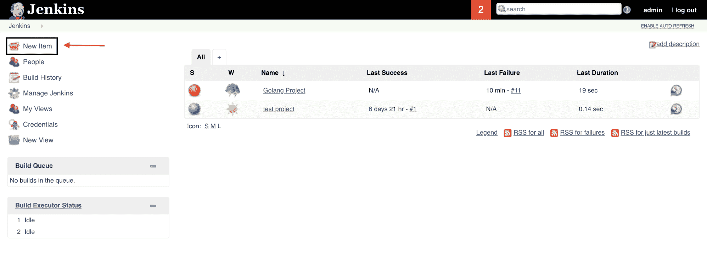

单击新项目后，您将被带到以下屏幕：

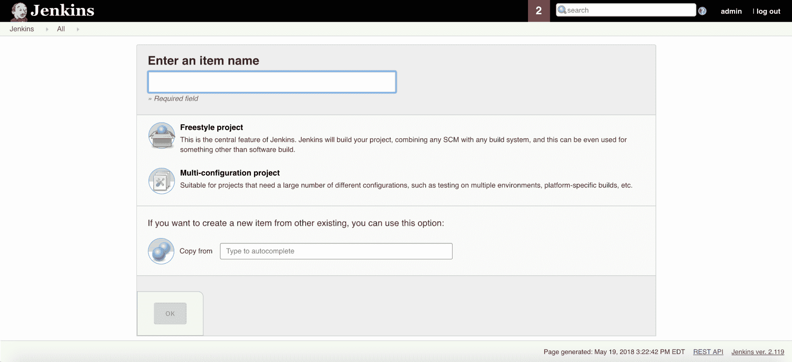

现在，根据您安装的 Jenkins 插件数量，您将在构建项目方面在屏幕上看到更多或更少的内容。我们将在本章中为目的输入一个名为`Freestyle Scripting`的名称，但您可以为构建作业选择任何名称。输入名称后，请确保点击 Freestyle Project 按钮，然后点击 OK 按钮。

# 构建配置选项

每当在 Jenkins 下创建新项目时，您将看到以下屏幕：

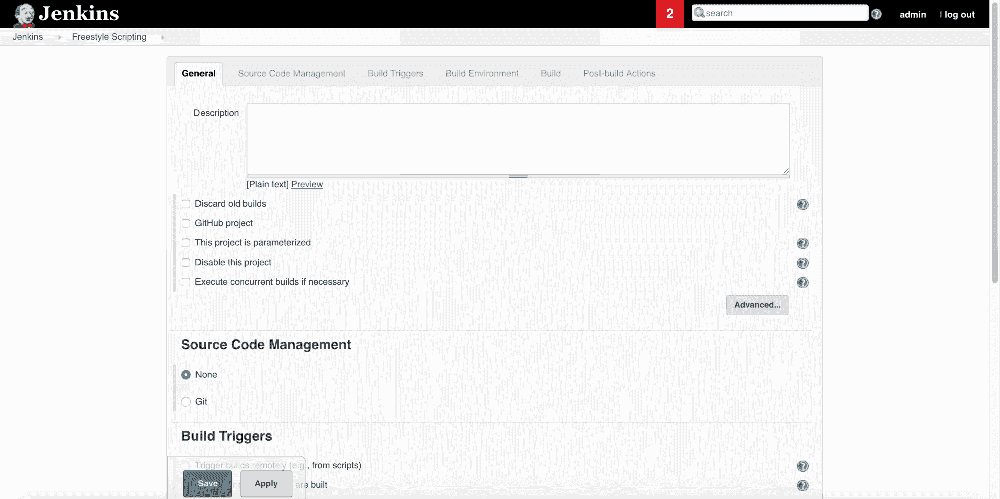

根据您已安装的 Jenkins 插件，您可能会看到更多选项卡或构建配置中的项目。

# 配置自由样式作业

请注意，构建作业配置有多个选项卡。您可以滚动到选项卡中的每个部分，也可以单击选项卡本身。每个选项卡都有不同的功能，您可以在 Jenkins 构建作业中配置它们。

# 一般

一般选项卡包含有关您正在创建的 Jenkins 构建的基本信息，例如描述和其他一般构建信息。查看一般选项卡信息：

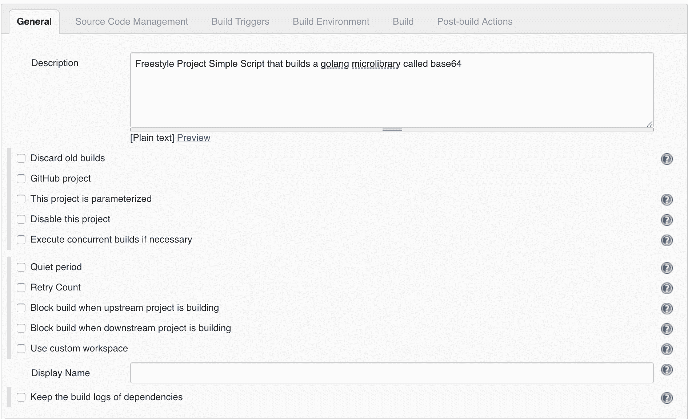

通常由您决定要切换哪些选项；您可以单击问号符号获取信息。让我们看看“安静期”选项的含义：

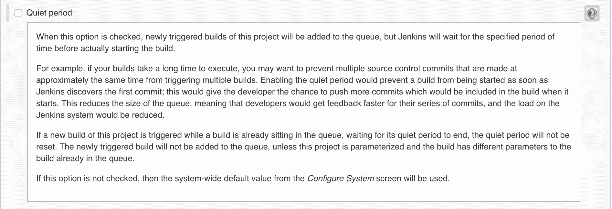

要删除详细信息，只需再次单击问号符号。

# 源代码管理

源代码管理选项卡是您指定正在使用的版本控制管理系统类型的地方，例如 Git、SVN 和 Mercurial。为了构建作业的目的，我们将点击 Git 单选按钮并指定 GitHub 存储库 URL：

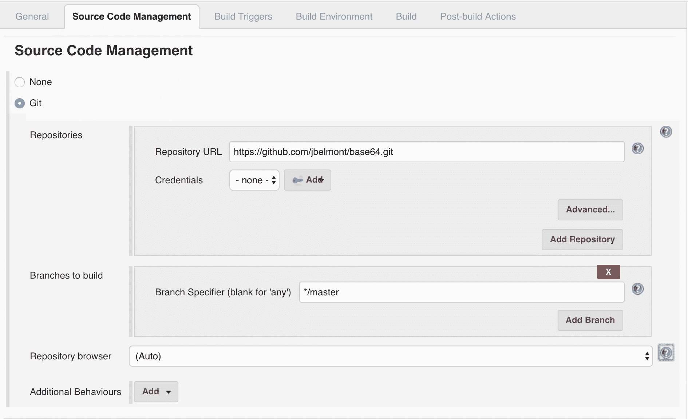

请注意，分支指定器默认为*/master 分支，但您可以通过点击“添加分支”按钮指定任意数量的分支。我们不会添加凭据，因为我们在本地工作，但如果您点击带有钥匙的“添加”按钮，您将看到以下叠加屏幕：

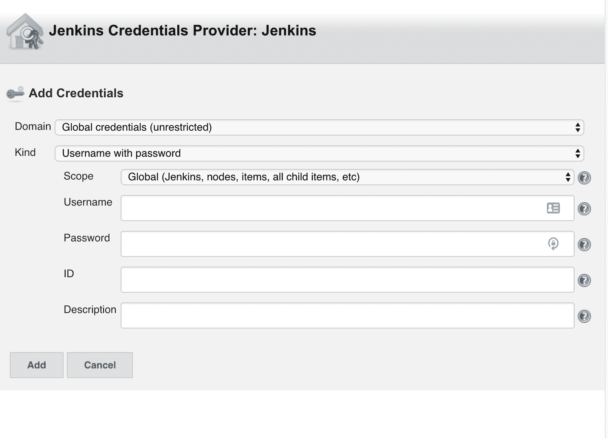

您可以通过点击“种类”输入框选择不同类型的凭据：

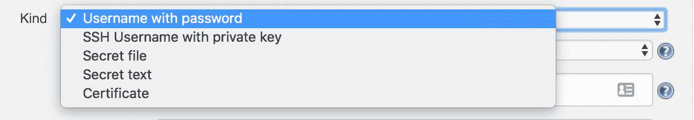

您还可以点击源代码管理选项卡底部的“添加”按钮，您将看到可以添加的其他行为：

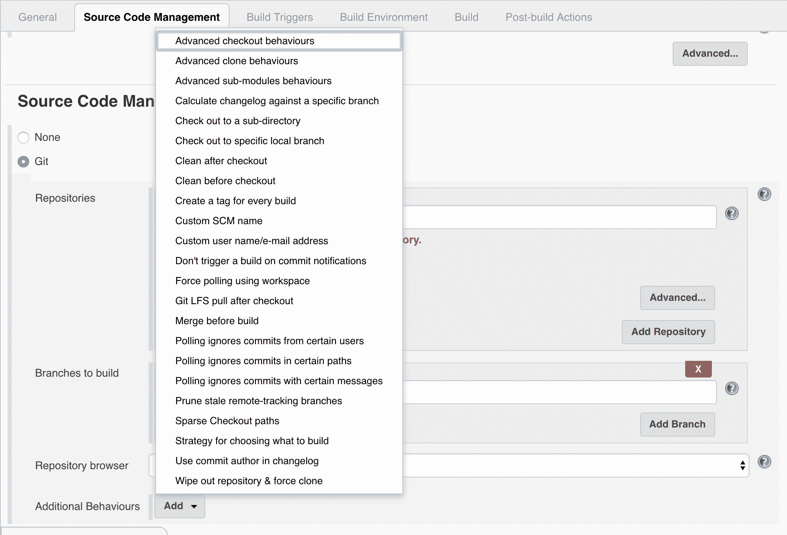

还有许多高级配置选项，比如子模块，您可以进行配置。

# 构建触发器

构建触发器选项卡配置部分涉及配置构建作业触发的时间。这可能包括配置 GitHub 挂钩触发器，每当您将提交推送到 GitHub 的主分支时触发，触发另一个项目构建时触发，定期构建时触发，或者轮询您的版本控制系统以获取更改时触发：

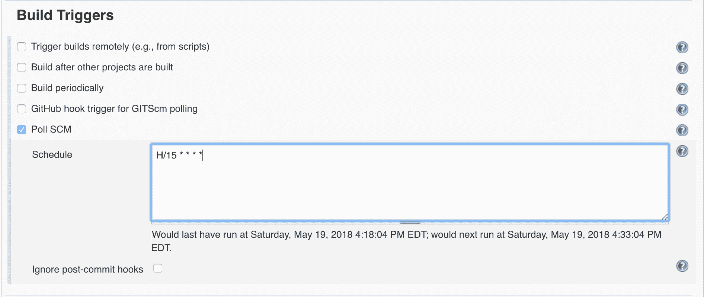

我们勾选了“轮询 SCM”选项，这在我们的情况下是 GitHub，并且使用了一个在特定时间和日期运行 Jenkins 作业的 cron 语法。在我们的情况下，我们将触发轮询作业每 15 分钟运行一次。您可以点击问号符号了解更多语法信息。

稍后，我们将讨论如何使用 GitHub 和 Bitbucket 在您将代码推送到远程存储库时触发 Jenkins 作业，这比轮询更好。

# 构建环境

此部分将根据您安装的 Jenkins 插件的多少而有更多或更少的环境选项可供使用。在我的情况下，我安装了 Golang 和 Node.js 插件，但您可以安装任意数量的环境，比如 Clojure 和 Ruby：

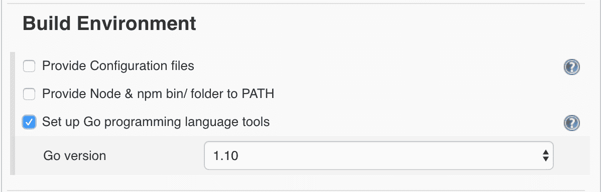

由于我们正在构建一个 Golang 微库，我们在此配置部分中勾选了“设置 Go 编程语言工具”复选框。

# 构建

构建部分是您指定如何构建项目的地方：

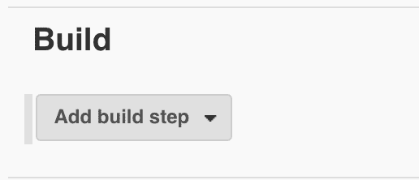

如果您点击“添加构建步骤”按钮，您将看到以下选项：

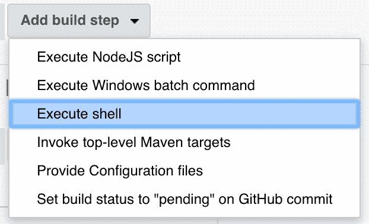

我们将点击“执行 shell”选项，这将为我们提供一个 Unix shell 脚本环境来使用。

请注意，现在我们有一个文本区域可用，我们可以在其中添加 Unix 脚本命令：

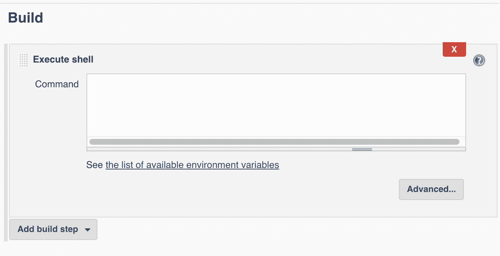

我们将在此 shell 脚本中添加以下命令：`go test`。

# 后置构建操作

在此构建部分，您可以指定成功构建后要运行的任何操作，比如运行代码覆盖和生成 JUnit 报告：

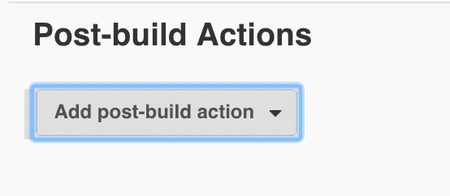

如果您点击“添加后置构建操作”按钮，您将看到以下选项：

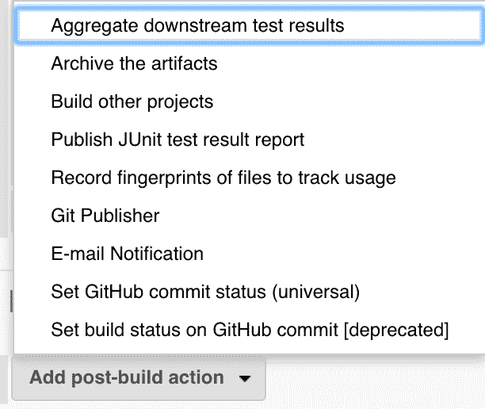

根据您安装的具体 Jenkins 插件，您将看到更多或更少的选项。

一旦您对构建配置满意，点击“应用”按钮，这将保存您当前的配置选项，或者点击“保存”按钮，这将保存您的选项并将您导航到一个新配置的构建项目：

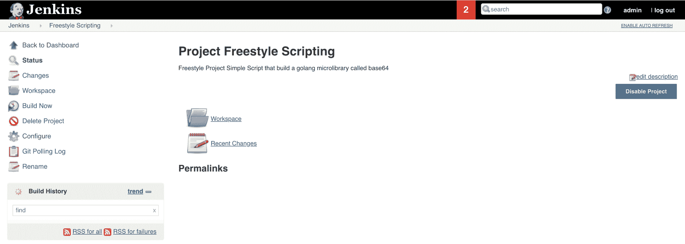

后置构建操作部分非常有价值，因为您可以在成功构建时调用其他服务，比如报告和收集指标。

# 添加环境变量

您可以以多种不同的方式在 Jenkins 中添加环境变量。

# 全局环境变量配置

从 Jenkins 仪表板，点击“管理 Jenkins”按钮：

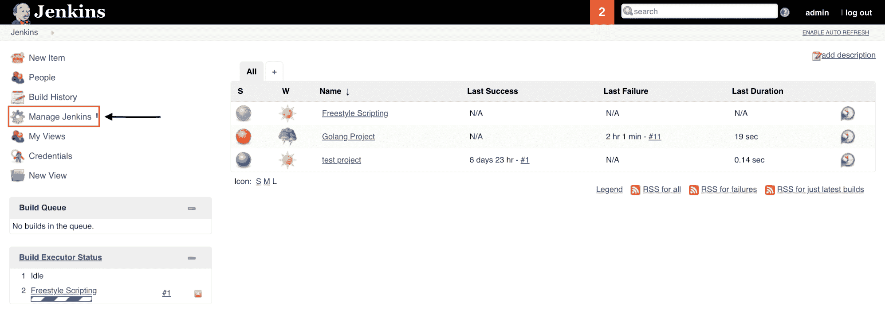

一旦您点击“管理 Jenkins”按钮，您将需要点击“配置系统”按钮：

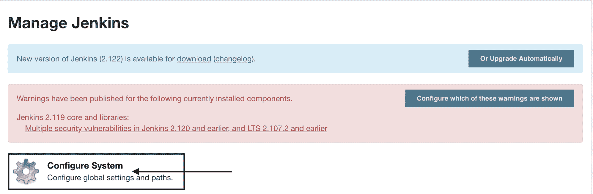

然后您将被导航到“配置系统”部分，然后可以使用全局属性部分添加环境变量：

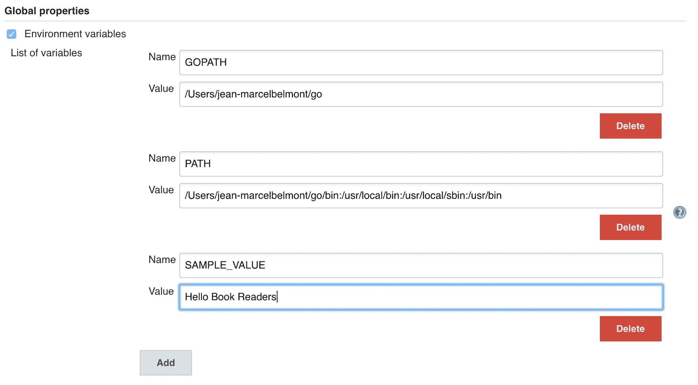

请注意，我在这里添加了一个名称为`SAMPLE_VALUE`的值为`Hello Book Readers`的内容。现在，这个全局属性在 shell 环境变量中作为一个环境变量可用。您可以在这个部分添加尽可能多的环境变量。请注意，这个全局属性现在将对每个作业都可用。

# EnvInject 插件

您还可以为每个特定的构建项选择更细粒度的环境变量设置。

通过执行以下步骤安装 EnvInject 插件（[`wiki.jenkins.io/display/JENKINS/EnvInject+Plugin`](https://wiki.jenkins.io/display/JENKINS/EnvInject+Plugin)）。点击 Jenkins 主仪表板链接：


请确保点击 Jenkins 链接，您将被路由到 Jenkins 仪表板。然后点击“管理 Jenkins”按钮，就像您添加全局属性时所做的那样。

接下来点击“管理插件”按钮，它看起来像这样：

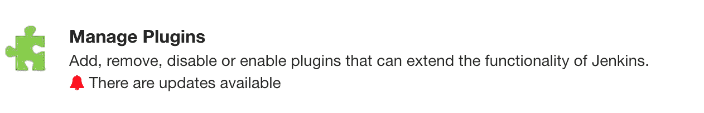

您现在将被带到以下屏幕：

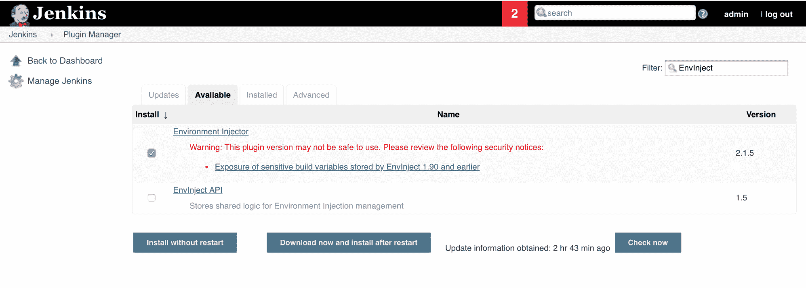

请注意，我们点击了“可用”选项卡，然后将`EnvInject`放入筛选框中。确保点击您想要的 Jenkins 插件，然后点击“无需重启安装”或“立即下载并在重启后安装”按钮。

请注意，我们现在在构建配置区的“构建环境”部分有了一些新的构建选项：

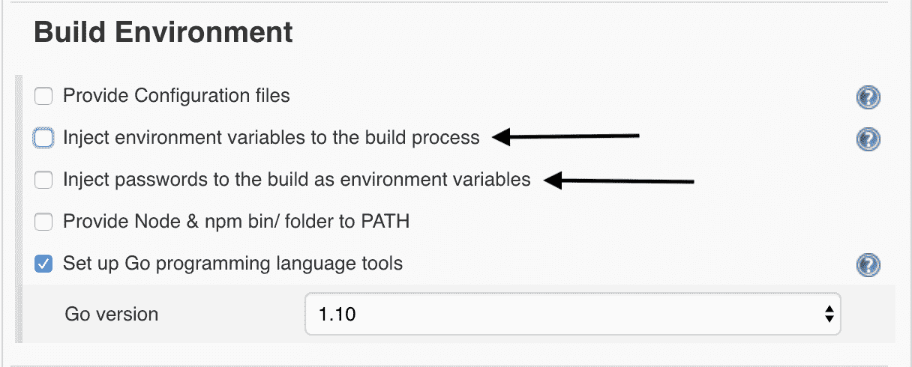

如果您点击“将环境变量注入到构建过程中”，您可以添加您的新环境变量，就像这样：

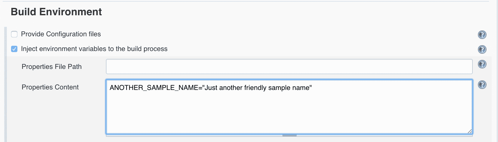

确保保存您的更改。需要注意的一点是，这个环境变量只适用于这个特定的构建项；它不像我们之前设置的全局属性那样是一个全局属性。

# 调试自由样式作业的问题

每当您在 Jenkins 中为一个构建项运行构建时，您可以通过点击您想要查看的特定构建作业来查看构建的所有细节。

# 构建项目视图

这是您需要关注的构建历史：

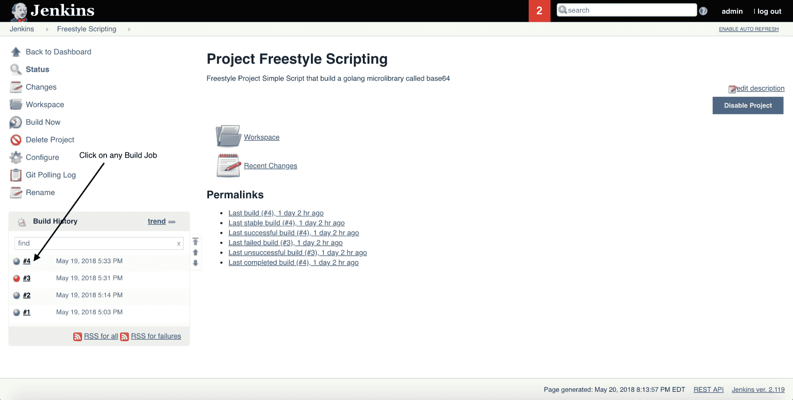

现在，如果您点击一个实际的构建，您将进入以下屏幕：

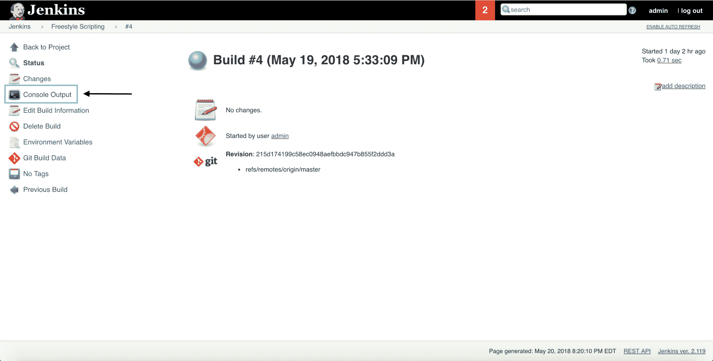

如果您点击“控制台输出”链接，您将看到一个详细的 CI 构建日志，显示 CI 服务器执行的所有步骤。请记住，我们编写了一个自由样式的 shell 脚本。我将添加 shell 脚本的内容供您查看：

```
echo "$SAMPLE_VALUE"
echo "$ANOTHER_SAMPLE_NAME"
go test
```

请注意，我在这里添加了我们之前定义的两个不同的环境变量，并且我只是将它们发送到标准输出。

现在，如果您查看构建作业的输出，您将看到以下输出：

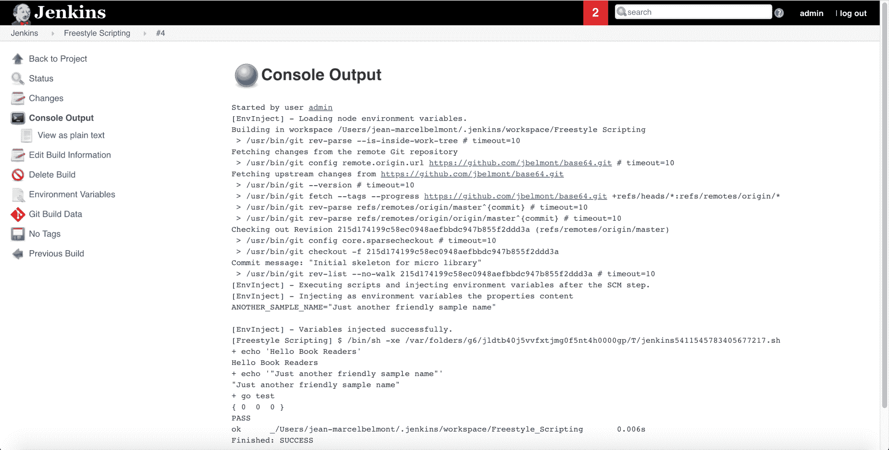

请注意，Jenkins 通过当前登录的用户来启动作业。接下来，EnvInject 插件运行并注入我们在项目中指定的任何环境变量。然后 Jenkins 从 GitHub 仓库获取最新的更改。然后 EnvInject 插件再次运行并注入任何必要的环境变量。

最后一个操作是实际执行 shell 脚本。在前面的屏幕截图中要注意的一件事是，因为在 Jenkins 中启用了执行跟踪，所以 shell 脚本中的每个命令都会被打印到标准输出。请记住，执行跟踪只是意味着在 shell 脚本中运行的每个命令以及命令本身的输出都将显示出来。例如，``echo "$ANOTHER_SAMPLE_NAME"``命令的值为``echo "Hello Book Readers"``，将被打印到标准输出，然后打印出消息`Hello Book Readers`。最后要注意的是，构建显示了文本**PASS**，并以**SUCCESS**完成。

# 调试自由风格脚本的问题

请注意我们如何记录具有简单信息的环境变量。有时候值在 CI 环境中没有被设置，这是您所期望的，这就是将值记录到标准输出中非常有帮助的地方。使用 EnvInject 插件的一个好处是，它将掩盖您注入到构建作业中的密码，以便您不会意外记录机密或保密信息：

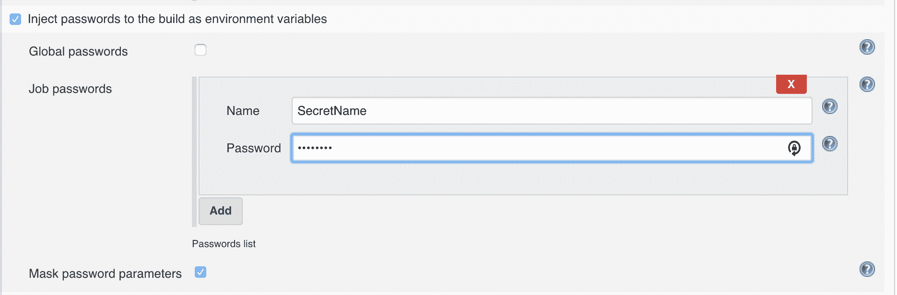

请注意，在前面的屏幕截图中，我们已经检查了将密码注入到构建作业中作为环境变量，并为环境变量指定了名称和密码。如果您在构建作业中意外执行`echo $SecretName`，它将掩盖`$SecretName`的值，以便您不会在构建中泄露机密信息。

# 总结

在本章中，您学习了更多关于 Jenkins 仪表板的知识。您学习了如何添加构建作业项以及配置自由风格构建作业的所有部分，如何将环境变量添加到 Jenkins 作业中，以及如何调试自由风格作业中的问题。

下一章将介绍如何构建 Jenkins 插件，并具体介绍构建过程，包括编写 Java 代码和使用 Maven 构建工具。

# 问题

1.  为什么在构建配置中点击问号符号很有用？

1.  如果您想在构建触发器部分轮询您的版本控制系统，您应该写什么类型的语法？

1.  在构建环境中可以使用多种编程语言吗？

1.  自由风格脚本操作在什么类型的环境中——是 Unix 环境吗？

1.  全局属性和项目级环境变量之间有什么区别？

1.  您认为 Jenkins 为什么在控制台输出中使用执行跟踪？

1.  在构建配置的后构建操作部分的价值是什么？

# 进一步阅读

请查看*使用 Jenkins 进行持续集成学习-第二版*（[`www.amazon.com/dp/1788479351`](https://www.amazon.com/dp/1788479351)），来自 Packt Publishing。
