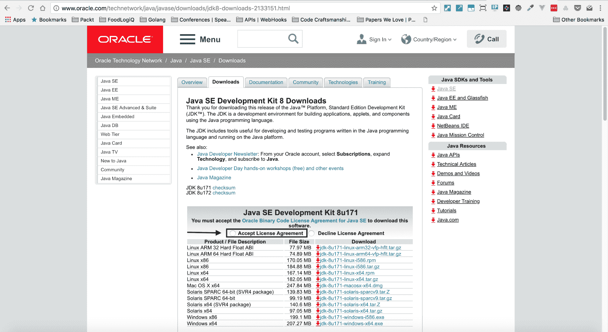

# 第七章：开发插件

本章将详细介绍 Jenkins 中的插件，我们将首先看如何在 Windows、Linux 和 macOS 中设置 Maven。然后我们将通过为 Jenkins 创建一个`Hello World`插件来了解插件开发，然后我们将简要介绍 Jenkins 插件站点以及如何浏览和使用它来找到各种插件。

本章将涵盖以下主题：

+   Jenkins 插件解释

+   构建一个简单的 Jenkins 插件

+   Jenkins 插件开发

+   Jenkins 插件生态系统

# 技术要求

本章是关于在 Jenkins 中构建插件的，您需要对 Java 编程语言有基本的了解，并了解 Maven 等构建工具的用途。

# Jenkins 插件解释

Jenkins CI 已经提供了某些功能，包括构建、部署和自动化软件项目。您通常可以通过 Jenkins 中大量的插件生态系统获得您想要的任何额外行为。

# 插件有什么用？

软件中插件/扩展的目的是为软件组件添加特定功能。诸如 Chrome 的网络浏览器有扩展程序来扩展浏览器的功能，Firefox 有附加组件来实现与 Chrome 中扩展程序相同的目的。其他软件系统中也存在插件，但我们将专门关注 Jenkins 中的插件。

# Jenkins 插件文档

转到插件索引以找到您需要的任何插件，我们将在本章的后面部分讨论这个问题。如果您访问 Jenkins 维基中的插件教程，您将获得创建 Jenkins 插件的完整说明。还有一些 Jenkins 维基之外的教程可以使用。您可以转到 Jenkins 原型库查看`Hello World`插件示例。

# 在 Jenkins 中安装插件

您需要转到 Jenkins 仪表板中的“管理 Jenkins”链接：


点击“管理 Jenkins”链接后，您将被重定向到以`manage`结尾的 URL 路径，例如`http://localhost:8080/manage`，或者根据您是否在本地运行 Jenkins 而有其他域。您需要点击“管理插件”链接，然后确保点击“已安装”选项卡和/或筛选您希望安装的任何插件。我们之前已经介绍过这个，但我们将通过安装我们自己的 Jenkins 插件来安装它，就像安装任何其他 Jenkins 插件一样。

# 构建一个简单的 Jenkins 插件

创建 Jenkins 插件有一些先决条件。您需要安装 Java，如果您一直在跟进，那么应该已经安装了。您还需要安装 Maven 软件项目管理工具（[`maven.apache.org/`](https://maven.apache.org/)）。 

# Java 安装

您需要确保已安装 Java 1.6 或更高版本，我建议您安装 Java 1.9。要安装 Java，请转到 Java 下载页面（[`www.oracle.com/technetwork/java/javase/downloads/index.html`](http://www.oracle.com/technetwork/java/javase/downloads/index.html)）：



确保点击“接受许可协议”单选按钮，然后点击 Windows。下载并确保选择正确的架构，即 32 位或 64 位操作系统。

安装 Java 后，只需使用以下命令验证安装：

```
java -version
```

这应该返回已安装的 Java 的当前版本。

# Maven 安装说明

要安装 Maven，请转到 Maven 安装页面（[`maven.apache.org/install.html`](https://maven.apache.org/install.html)）并确保按照给定操作系统的说明进行操作。

# Windows 安装

您可以在 Windows 上以几种不同的方式安装 Maven，但请确保您至少安装了 Windows 7 操作系统和 Java **软件开发工具包**（**SDK**）1.7 或更高版本。如果您在第五章中跟随了*Jenkins 的安装和基础知识*，那么您应该已经安装了 Java。

# 通过 Chocolatey 软件包管理器安装 Maven

如果您已经安装了 Chocolatey 软件包管理器（[`chocolatey.org/install`](https://chocolatey.org/install)），那么您可以简单地运行以下命令：

```
choco install maven
```

您还可以从 Maven 安装页面（[`maven.apache.org/install.html`](https://maven.apache.org/install.html)）下载 Maven 二进制可执行文件，并且您还需要额外找到 Java 环境变量的值。您可以通过在命令提示符中运行以下命令来找到：

```
echo %JAVA_HOME%
```

然后，您需要通过以下方式将此 Maven 二进制可执行文件添加到 Windows 路径中：

1.  右键单击我的电脑

1.  点击属性

1.  点击高级系统设置

1.  点击环境变量

1.  点击新用户变量，添加 Maven_Home，值为`C:\apache-maven-3.5.3`

1.  将其添加到路径变量中，使用`%Maven_Home%\bin`

1.  在命令提示符中打开，并在桌面上询问`mvn -version`

# 通过 Maven 源代码安装 Maven

首先确保您已安装 Java SDK，您可以在命令提示符中确认：

```
echo %JAVA_HOME%
```

这应该打印出您已安装的 Java 当前版本。接下来，从 Maven 源代码库（[`gitbox.apache.org/repos/asf?p=maven-sources.git`](https://gitbox.apache.org/repos/asf?p=maven-sources.git)）下载 Maven 源代码，然后在 Windows 操作系统中的合适位置解压 Maven 源代码。

`C:\Program Files\Apache\maven`是一个可能的位置，你可以使用。

# 为 Windows 操作系统设置环境变量

您需要使用系统属性将`M2_HOME`和`MAVEN_HOME`变量都添加到 Windows 环境中，并且您需要将环境变量指向您的 Maven 文件夹。

通过附加 Maven `bin`文件夹`%M2_HOME%\bin`来更新 PATH 变量，这样您就可以在系统中的任何位置运行 Maven 可执行文件。

要验证 Maven 是否正确运行，请在命令提示符中运行以下命令：

```
mvn --version
```

该命令应显示当前的 Maven 版本、Java 版本和操作系统信息。

# macOS 安装

您需要确保 macOS 操作系统中已安装 Java SDK。如果您在第五章中跟随了*Jenkins 的安装和基础知识*，那么您应该已经安装了 Java。

# 通过 Homebrew 软件包管理器安装 Maven

首先确保 Java 已安装，通过在 Mac 终端应用程序中运行以下命令：

```
java -version
java version "1.8.0_162"
Java(TM) SE Runtime Environment (build 1.8.0_162-b12)
Java HotSpot(TM) 64-Bit Server VM (build 25.162-b12, mixed mode)
```

您需要在系统上安装 Java 1.7 或更高版本。

接下来，如果您已经安装了 Homebrew 软件包管理器（[`brew.sh/`](https://brew.sh/)），那么您可以通过在 Mac 终端应用程序中发出以下命令来轻松安装 Maven：

```
brew install maven
```

确保在您的`.bashrc`或`.zshrc`文件中设置以下环境变量：

```
export JAVA_HOME=`/usr/libexec/java_home -v 1.8`
```

确保 Maven 已经正确安装，通过在 Mac 终端中运行以下命令：

```
mvn --version
Apache Maven 3.5.3 (3383c37e1f9e9b3bc3df5050c29c8aff9f295297; 2018-02-24T14:49:05-05:00)
Maven home: /usr/local/Cellar/maven/3.5.3/libexec
Java version: 1.8.0_162, vendor: Oracle Corporation
Java home: /Library/Java/JavaVirtualMachines/jdk1.8.0_162.jdk/Contents/Home/jre
Default locale: en_US, platform encoding: UTF-8
OS name: "mac os x", version: "10.13.4", arch: "x86_64", family: "mac"
```

请注意，`mvn`二进制可执行文件打印出了已安装的 Maven 版本、Java 版本和特定于操作系统的信息。

# Unix 安装

我们将在 Ubuntu 16.04 Digital Ocean Droplet 上安装 Maven，但您应该能够在其他 Linux 发行版上运行类似的命令。请按照说明在您特定的 Linux 发行版上安装 Maven。

# 通过 apt-get 软件包管理器安装 Maven

确保 Java 已安装在您的 Linux 发行版中，您可以通过在终端 shell 中运行以下命令来检查：

```
java -version
openjdk version "9-internal"
OpenJDK Runtime Environment (build 9-internal+0-2016-04-14-195246.buildd.src)
OpenJDK 64-Bit Server VM (build 9-internal+0-2016-04-14-195246.buildd.src, mixed mode)
```

如果尚未安装 Java，则运行以下命令：

```
sudo apt-get update && sudo apt install openjdk-9-jre
```

接下来，在终端应用程序中运行以下命令安装 Maven：

```
sudo apt-get install maven
```

接下来，您需要确保您的`JAVA_HOME`环境变量已设置。由于我们在 Ubuntu Linux 操作系统中安装了 Java 1.9，我们将运行以下命令：

```
export JAVA_HOME=/usr/lib/jvm/java-1.9.0-openjdk-amd64/
```

您使用的目录可能不同，但如果您未设置此环境变量，则 Maven 将报告此警告。

通过在终端应用程序中运行以下命令来检查 Maven 是否已正确安装：

```
mvn --version
Apache Maven 3.3.9
Maven home: /usr/share/maven
Java version: 9-internal, vendor: Oracle Corporation
```

```
Java home: /usr/lib/jvm/java-9-openjdk-amd64
Default locale: en_US, platform encoding: UTF-8
OS name: "linux", version: "4.4.0-127-generic", arch: "amd64", family: "unix"
```

请注意，Maven 二进制可执行文件打印出当前安装的 Maven 版本、当前安装的 Java 版本和特定于操作系统的信息，就像 Windows 和 Mac 操作系统一样。

# Jenkins 插件开发

有几个步骤是必要的，以便设置、运行和安装 Jenkins 插件。

# Maven 设置文件

根据您当前的操作系统，您需要创建/编辑`.m2/settings.xml`文件。

通过在命令提示符中发出以下命令，Windows 用户将找到`settings.xml`文件：

```
echo %USERPROFILE%\.m2\settings.xml
```

Mac 操作系统用户可以在`~/.m2/settings.xml`中编辑/创建`settings.xml`文件。

`settings.xml`文件中的`settings`元素包含用于以各种方式配置 Maven 执行的值的元素，例如`pom.xml`，但不应捆绑到任何特定项目或分发给受众。这些值包括本地存储库位置、替代远程存储库服务器和身份验证信息。

将以下内容放入`settings.xml`文件中：


请注意，我们输入了与 Jenkins 插件相关的特定信息。

强烈建议您将您的`settings.xml`文件设置为正确运行您的 Jenkins 插件！

# HelloWorld Jenkins 插件

要创建 Jenkins 插件，您需要使用 Maven 原型，您可以在这里阅读有关它的信息（[`maven.apache.org/guides/introduction/introduction-to-archetypes.html`](https://maven.apache.org/guides/introduction/introduction-to-archetypes.html)）。

我们将发出以下命令以生成 Jenkins 的`Hello World`插件：

```
mvn archetype:generate -Dfilter=io.jenkins.archetypes:hello-world
```

以下是我创建插件的示例运行会话：


请注意，我为原型输入了`1`，然后选择了插件版本`4`，并定义了`jenkins-helloworld-example-plugin`的值，然后按*Enter*获取默认值：


如果一切顺利，您应该在命令提示符中获得`BUILD SUCCESS`的输出。

您需要确保能够构建您的 Jenkins 插件，因此请确保在命令提示符中运行以下命令：

```
// First go into the newly created directory
cd jenkins-helloworld-example-plugin
// Then run the maven build command
mvn package
```

`mvn package`命令将创建一个`target`目录，并运行您在该目录中创建的任何测试：


请注意，Jenkins 原型实际上为我们的`Hello World` Jenkins 插件示例创建了一些测试。

# 文件夹布局说明

以下是新创建的`jenkins-helloworld-example-plugin`目录的屏幕截图：


`src`目录包含 Jenkins 插件的源文件以及插件的测试。

目标目录是通过`mvn`包生成的。还有一个`pom.xml`文件，当我们运行原型子命令时 Maven 创建了它。

**项目对象模型**（**POM**）是 Maven 中的基本工作单元。它是一个包含有关项目和 Maven 用于构建项目的配置详细信息的 XML 文件。它包含大多数项目的默认值。其中包括构建目录，即`target`，源目录，即`src/main/java`，以及测试源目录，即`src/test/java`。

# Jenkins 插件源代码解释

正如我们之前提到的，`src`目录包含了 Jenkins 插件的源文件。为了在 Jenkins 中构建插件，您需要使用 Java 编程语言进行编写。教授 Java 编程语言超出了本书的范围，但我们将简要讨论 Maven 为我们创建的一些文件。

请注意，Maven 创建了一个相当长的目录结构，这是常见的，因此`helloworld`插件的目录结构为`./src/main/java/io/jenkins/plugins/sample/HelloWorldBuilder.java`。测试文件本身位于`./src/test/java/io/jenkins/plugins/sample/HelloWorldBuilderTest.java`。

我在这里包含了`HelloWorldBuild.java`类的源代码：

```
package io.jenkins.plugins.sample;   import hudson.Launcher; /* More Import Statements Here */

public class HelloWorldBuilder extends Builder implements SimpleBuildStep {

    /* Rest of methods in Github Source */

    @Override
    public void perform(Run<?, ?> run, FilePath workspace, Launcher launcher, TaskListener listener) throws InterruptedException, IOException {
        if (useFrench) {
            listener.getLogger().println("Bonjour, " + name + "!");
        } else {
            listener.getLogger().println("Hello, " + name + "!");
        }
    }

    @Symbol("greet")
    @Extension
    public static final class DescriptorImpl extends BuildStepDescriptor<Builder> {

        /* Rest of the source in Github */
}

```

请注意，`HelloWorldBuilder`类扩展了`Builder`类，这是 Jenkins 核心类；还请注意，我们正在使用一个名为`BuildStepDescriptor`的类，这也是一个 Jenkins 类。此文件的源代码可以在我的 GitHub 存储库中的`jenkins-plugin-example`中的`HelloWorldBuilder.java`（[`github.com/jbelmont/jenkins-plugin-example/blob/master/src/main/java/io/jenkins/plugins/sample/HelloWorldBuilder.java`](https://github.com/jbelmont/jenkins-plugin-example/blob/master/src/main/java/io/jenkins/plugins/sample/HelloWorldBuilder.java)）文件中看到。

对于`HelloWorldBuilderTest.java`中的测试用例，我们使用了 Java 编程语言的流行单元测试库 JUnit。

```
package io.jenkins.plugins.sample;   import hudson.model.FreeStyleBuild; /* More Import Statements Here */   public class HelloWorldBuilderTest {

    @Rule
  public JenkinsRule jenkins = new JenkinsRule();   final String name = "Bobby";    @Test
  public void testConfigRoundtrip() throws Exception {
        FreeStyleProject project = jenkins.createFreeStyleProject();
  project.getBuildersList().add(new HelloWorldBuilder(name));
  project = jenkins.configRoundtrip(project);
  jenkins.assertEqualDataBoundBeans(new HelloWorldBuilder(name), project.getBuildersList().get(0));
  }

    /* More test Cases in this file. */

}
```

上述的 Java 测试文件具有诸如`@Rule`，`@Override`，`@Test`和`@DataBoundSetter`等注解，这些注解是一种元数据，提供关于程序的数据，而不是程序本身的一部分。注解对其注释的代码的操作没有直接影响。此文件的源代码可以在我的 GitHub 存储库中的`jenkins-plugin-example`中的`HelloWorldBuilderTest.java`文件中看到（[`github.com/jbelmont/jenkins-plugin-example/blob/master/src/test/java/io/jenkins/plugins/sample/HelloWorldBuilderTest.java`](https://github.com/jbelmont/jenkins-plugin-example/blob/master/src/test/java/io/jenkins/plugins/sample/HelloWorldBuilderTest.java)）。

# 构建 Jenkins 插件

为了构建 Jenkins 插件，您需要在插件目录中运行`mvn install`命令。

`mvn install`命令将构建和测试 Jenkins 插件，并且更重要的是，创建一个名为`pluginname.hpi`的文件；或者在我们的情况下，它将在`target`目录中创建一个名为`jenkins-helloworld-example-plugin.hpi`的文件，我们可以用它来部署到 Jenkins。

我已经在以下屏幕截图中附上了一个示例安装运行：


请注意，此运行通过将我们的 Jenkins 插件安装到多个位置来完成，我们将使用这些位置来安装我们的 Jenkins 插件。

# 安装 Jenkins 插件

现在，为了安装新构建和安装的`HelloWorld`示例插件，我们需要转到 Jenkins 仪表板|管理 Jenkins|管理插件视图，然后点击高级选项卡。如果需要更多细节，请参阅第六章，*编写自由脚本*，*EnvInject 插件*部分。您还可以直接转到插件部分，方法是转到`scheme://domain/pluginManager`；或者，如果您正在本地运行 Jenkins，只需转到`http://localhost:8080/pluginManager/`。

然后确保点击高级选项卡或转到`http://localhost:8080/pluginManager/advanced`：


然后您需要转到*上传插件*部分：


点击选择文件，然后找到我们新创建的`Helloworld` Jenkins 插件，它应该在目录中：

```
jenkins-helloworld-example-plugin/target/jenkins-helloworld-example-plugin.hpi
```

然后确保点击上传按钮。

以下是新安装的`Helloworld`示例插件的屏幕截图：


# Jenkins 插件生态系统

Jenkins 有大量可用的插件，您可以在 Jenkins 插件网站（[`plugins.jenkins.io/`](https://plugins.jenkins.io/)）上找到完整的列表。

# 可用插件列表

以下截图显示了与 Jenkins 中 JSON 相关的插件搜索：


请注意，Jenkins 插件网站除了默认视图之外，还有多个视图可供您使用：


请注意，我点击了中间的图标，但您也可以点击最右边的图标以获得一个小纲要视图。搜索默认为相关搜索项，但您可以选择不同的搜索条件，例如最常安装、趋势和发布日期。

# 摘要

在本章中，您了解了 Java 的 Maven 构建工具以及如何在 Windows、Linux 和 macOS 上安装它。您还学习了如何使用 Maven 构建工具创建 Jenkins 插件，我们简要讨论了一些 Java 语法以及如何使用 Jenkins 仪表板中的管理插件 UI 中的高级选项来安装 Jenkins 插件。我们还研究了 Jenkins 插件生态系统。

# 问题

1.  我们用来创建 Jenkins 插件的构建工具是什么？

1.  我们在 Windows 操作系统中使用了哪个软件包管理器来安装 Maven？

1.  我们在 macOS 操作系统中使用了哪个软件包管理器来安装 Maven？

1.  我们在`HelloWorld`插件中简要讨论的配置文件的名称是什么？

1.  我们可以直接导航到哪个 URL 来管理 Jenkins 中的插件？

1.  我们用来在 Maven 中构建和安装 Jenkins 插件的命令是什么？

1.  Maven 为我们创建了哪种类型的文件，以便我们可以安装 Jenkins 插件？

# 进一步阅读

请查看 Packt Publishing 出版的书籍*扩展 Jenkins*（[`www.amazon.com/dp/B015CYBP2A/ref=dp-kindle-redirect?_encoding=UTF8&btkr=1`](https://www.amazon.com/dp/B015CYBP2A/ref=dp-kindle-redirect?_encoding=UTF8&btkr=1)）了解更多关于 Jenkins 插件的信息。
