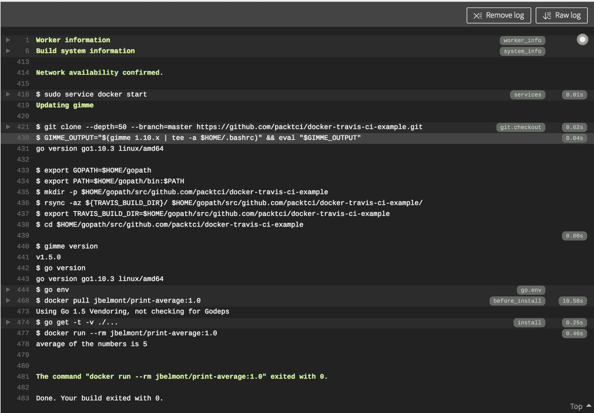

# Travis CI 的安装和基础知识

本章将帮助您设置 Travis **持续集成**（**CI**）。我们将解释托管解决方案（如 Travis CI）的应用嵌入式配置的概念。我们还将解释什么是 YAML 配置以及如何使用它。我们将研究使用 Travis CI 的基础知识，并花一些时间探索 Travis CI 和 Jenkins 之间的一些区别，以及 Travis CI 的概念。我们将介绍 Travis CI 的不同部分，包括语法和构建生命周期，并查看一些实际示例。

本章将涵盖以下主题：

+   Travis CI 介绍

+   Travis CI 先决条件

+   添加一个简单的 Travis CI YAML 配置脚本

+   Travis CI 脚本解析

# 技术要求

本章将需要一些基本的编程技能，并且我们在前几章讨论过的许多 CI 概念将在本章中得到应用。如果您尝试创建一个 GitHub 账户和 Travis CI 账户将会很有帮助。您可以按照*Travis CI 先决条件*部分中的步骤进行操作。一些示例使用了 Docker，这是一种容器技术，因此如果您对容器和 Docker 有一些了解将会很有帮助。您将在本章学习有关 YAML 语法的知识。本章中有一些命令使用了命令行应用程序，因此熟悉命令行应用程序或 CLI 将会很有帮助。

# Travis CI 介绍

Travis CI 是一个托管和自动化的 CI 构建解决方案。Travis CI 使用一个应用内配置文件，使用了 YAML（[`yaml.org/spec/1.2/spec.html`](http://yaml.org/spec/1.2/spec.html)）语法，我们将在本章后面更详细地讨论。由于 Travis CI 托管在云端，因此它具有可以快速在其他环境和不同操作系统中使用的优势，而无需担心设置和安装。这意味着 Travis CI 的设置比 Jenkins 要快得多。

# 比较 Travis CI 和 Jenkins

Jenkins 是一个自包含的开源自动化服务器，可以在组织级别进行定制和配置。请记住，在 Jenkins CI 章节中，我们花了一些时间在 Windows、Linux 和 macOS 上安装 Jenkins。我们还有能力按照自己的意愿配置 Jenkins。虽然这对于在运营、DevOps 等方面有专门团队的软件公司来说非常好，但对于经常是孤独开发者为个人项目设置环境的开源项目来说就不那么好了。

Travis CI 是围绕开源开发原则和易用性而设计的。在 GitHub 中创建项目后，可以在几分钟内设置好 Travis CI。尽管在这方面 Travis CI 不像 Jenkins CI 那样可定制，但它具有快速设置和使用的明显优势。Travis CI 使用一个应用内配置文件来实现这一点，但目前必须与 GitHub（[`github.com/`](https://github.com/)）开发平台一起使用，尽管也许将来可能会扩展到其他平台，如 Bitbucket（[`bitbucket.org/dashboard/overview`](https://bitbucket.org/dashboard/overview)），但这仍然是一个开放的讨论。

# Travis CI 先决条件

要开始使用 Travis CI，您需要创建一个 GitHub 账户，您可以在 GitHub（[`github.com/`](https://github.com/)）上进行操作。

# 创建 GitHub 账户

看一下截图——您所需要做的就是提供用户名、电子邮件和密码，然后点击“注册 GitHub”按钮：


为了本章的目的，我们将创建一个名为`packtci`的 GitHub 用户名。一旦您点击了“注册 GitHub”按钮，您将被带到以下页面：


请注意，您可以在 GitHub 中免费创建无限数量的公共存储库，而私有存储库需要支付月度订阅费。一旦单击“继续”按钮，您将被重定向到以下页面：


如果您愿意，您可以通过滚动到页面底部并单击“跳过此步骤”按钮来跳过所有这些选项。一旦单击“提交”按钮或“跳过此步骤”按钮，您将被带到这个页面：


您应该收到来自 GitHub 的一封电子邮件；请查看以下截图：


您需要单击该链接以验证您在 GitHub 中的帐户，然后您应该已经设置好了您的 GitHub 帐户。

# 创建 Travis CI 帐户

您需要创建一个 Travis CI 帐户才能开始使用 Travis CI。您需要使用您的 GitHub 登录凭据登录。在这里的截图中，请注意您可以单击“注册”按钮或“使用 GitHub 登录”按钮：


在本章中，我单击了“使用 GitHub 登录”按钮，然后输入了我在 GitHub 上创建的用户名为`packtci`的 GitHub 帐户的登录凭据。一旦输入您的 GitHub 凭据，您将被重定向到以下页面：


您需要单击“授权 travis-ci”按钮以完成 Travis CI 设置。一旦单击“授权 travis-ci”按钮，Travis CI 完成最终设置步骤后，您将被重定向到以下页面：


请注意，我们在 Travis CI 中有一个 API 令牌，我们将在以后使用。在这个新帐户中我们没有任何 GitHub 项目，所以没有显示。在本章中，我将创建一个运行一些基本测试的 GitHub 项目。

# 向您的新 GitHub 帐户添加 SSH 密钥

为了创建一个新的 GitHub 存储库，您需要将您的 SSH 密钥添加到您的用户帐户中。如果您的系统中没有任何 SSH 密钥，可以使用以下命令创建：


请注意，我提供了一个电子邮件地址并指定了一种 RSA 类型的加密算法。一旦运行此命令，它将在您的系统上创建一个公钥和私钥。

一旦您创建了 SSH 密钥，您只需要将公钥上传到 GitHub。您需要复制文件的内容；如果您使用 macOS，您可以运行以下命令将其复制到系统剪贴板：

```
ssh-keygen -t rsa -b 4096 -C "myemail@someemailaddress.com"
# This command generates a file in the path that you pick in the interactive prompt which in this case is ~/.ssh/id_rsa_example.pub

pbcopy < ~/.ssh/id_rsa_example.pub
```

您需要进入 GitHub 的设置页面：


然后您需要在设置页面中单击以下按钮：


接下来，您需要单击“新 SSH 密钥”按钮，然后提供一个名称并粘贴您的 SSH 密钥的内容。在下面的截图中，我提供了一个名为`示例 SSH 密钥`的名称，然后粘贴了我的公钥的内容：


您只需要单击“添加 SSH 密钥”按钮，然后您就可以准备好向您在 GitHub 中拥有的任何存储库提交更改。

# 添加一个简单的 Travis CI YAML 配置脚本

我创建了一个示例 GitHub 存储库，您可以在 Github 上的 functional summer 中看到（[`github.com/packtci/functional-summer`](https://github.com/packtci/functional-summer)）。该存储库是一个 Node.js 项目，其中有一个`package.json`脚本，一个名为`summer.js`的文件和一个名为`summer_test.js`的测试文件。我们将在存储库的根目录中的名为`.travis.yml`的文件中为 Travis CI 添加配置。此配置脚本将执行几件事。首先，它将通知 Travis CI 我们正在运行一个 Node.js 项目，然后它将安装项目的依赖项，最后将运行 CI 构建中指定的测试。

# Travis CI YML 脚本内容

我们首先在存储库的根目录创建一个名为`.travis.yml`的文件，然后将以下内容复制到此文件中：

```
language: node_js node_js: - "6.14.1" install: - npm install script: npm test
```

我们将更详细地讨论 YML 脚本的每个条目，但基本上我们对 Travis CI 说的是这是一个 Node.js 项目，我们希望 Travis CI 在 CI 构建中使用 node 版本 6.14.1，然后使用 npm 软件包管理器安装项目所需的所有依赖项，最后使用`npm test`命令运行所有测试。我将提交此更改到`functional-summer`存储库，然后我们将看到如何为该项目切换 Travis CI。

# 将 GitHub 存储库添加到 Travis CI 帐户

第一步是您必须转到[`travis-ci.org/`](https://travis-ci.org/)，然后提供 GitHub 帐户的登录凭据。然后点击屏幕右上角的头像，转到您的个人资料页面，看起来像这样：


接下来，我添加了一张截图，详细说明了将新存储库添加到 Travis CI 的步骤：


请注意，在截图中，我添加了一个文本块，说第一步是点击“同步帐户”按钮，这是必要的，这样 Travis CI 才能看到您已添加到 GitHub 帐户中的任何新存储库。一旦 Travis CI 同步了您的帐户，您就应该能够在您的帐户中看到您的存储库。根据您已经拥有多少项目，您可能需要按存储库名称筛选以找到您的项目。下一步是切换带有您的存储库名称的滑块，就像截图中所示的那样。

在下面的截图中，我们已经在 Travis UI 上切换了`functional-summer`存储库，现在我们只需点击行即可进入这个新添加的 Travis CI 构建作业：


一旦您点击行，您将被重定向到 Travis CI 中的以下页面：


我们还没有触发任何构建，但 Travis CI 有一些默认设置。如果您将更改提交到任何推送的分支，或者在 GitHub 上打开拉取请求，Travis CI 将启动构建。让我们对`functional-summer`存储库进行一些微小的更改，这将触发 Travis CI 中的构建。如果您点击“构建历史”选项卡，您会注意到已创建了一个带有 Git 提交更改的构建：


# Travis CI 作业日志

您可以单击 Travis CI 屏幕左侧的构建作业项目，看起来像这样：


或者，您可以单击“当前”选项卡，以查看已配置存储库的当前执行作业。为了查看作业日志，您需要滚动到“作业日志”选项卡，并查看 Travis CI 构建中的运行命令，对于`functional-summer`存储库，看起来像这样：


请记住，在我们添加到 GitHub 的`.travis.yml`脚本中，我们指定了四件事：

1.  在`.yml`脚本的顶部，我们指定了 Node.js 的语言

1.  我们指定了 Node.js 的版本 6.14.1

1.  我们运行了`npm install`命令来安装项目的所有依赖项

1.  最后，我们运行了`npm test`命令

您可以在作业日志中确认这些步骤是否已运行。请注意，在上一张截图中，有右箭头链接，展开以获取 CI 构建中每个命令的更多详细信息。

# Travis CI 脚本分解

现在我们已经了解了 YAML 语法，我们可以更详细地解释 Travis CI 脚本的各个部分。

# 选择一种编程语言

```
language: go
```

在`.travis.yml`脚本的这一部分中，我们添加了我们将在持续集成构建中使用的编程语言。这通常是您添加到`.travis.yml`脚本中的第一个条目。

Travis CI 支持许多编程语言，例如：

+   C

+   C++

+   使用 Node.js 的 JavaScript

+   Elixir

+   Go

+   Haskell

+   Ruby

您可以查看 Travis CI 文档中的语言([`docs.travis-ci.com/user/languages`](https://docs.travis-ci.com/user/languages))，以获取支持的编程语言的完整列表。

# 选择基础设施

您可以通过在 YML 脚本中使用`sudo`和`dist`字段来设置 Travis CI 中更自定义的环境。

# 具有 Ubuntu Precise (12.04)基础设施的虚拟镜像

您可以在 Travis YML 脚本中使用以下条目来使用 Ubuntu Precise 基础设施：

```
sudo: enabled
dist: precise
```

# 默认基础设施

您可以通过添加此条目来显式设置默认基础设施，即基于容器的 Ubuntu 14.04 环境：

```
sudo: false
```

这并非必须，因为您可以只设置语言，默认基础设施将为您完成。

# 具有 Ubuntu Trusty (14.04)基础设施的虚拟镜像

您可以在 Travis YML 脚本中使用以下条目来使用 Ubuntu Trusty 基础设施：

```
sudo: enabled
dist: trusty
```

# 基于容器的基础设施

您可以在 Travis YML 脚本中使用以下条目来使用基于容器的基础设施：

```
sudo: false
dist: trusty
```

请注意，我们在此处明确将 sudo 权限设置为 false，并使用 Ubuntu Trusty。

# macOS 基础设施

您可以在 Travis YML 脚本中使用以下条目来使用 macOS 基础设施：

```
os: osx
```

# 构建自定义

在 Travis CI 中，您可以以各种方式自定义构建，我们将从解释构建生命周期开始。 

# 构建生命周期

Travis CI 中的构建由两个步骤组成：

+   **安装**：安装所需的任何依赖项。我们在 YML 脚本的安装块中看到了这一步骤。

+   **Script**：运行构建脚本。这可以是一系列要运行的脚本。

# before_install 步骤

这一步骤正式称为**before_install**步骤，您可以在此步骤中安装 CI 构建中的任何其他依赖项，并启动自定义服务。

# install 步骤

我们已经在**install**步骤中看到了这一步骤，您可以在此步骤中安装 CI 构建所需的任何依赖项。

# before_script 步骤

在**before_script**步骤中，您可以指定在执行脚本块之前需要执行的任何命令。例如，您可能有一个 PostgreSQL ([`www.postgresql.org/`](https://www.postgresql.org/)) 数据库，并且需要在运行任何测试之前对数据库进行填充。

# 脚本步骤

在**script**步骤中，您可以执行对健康代码库至关重要的任何命令。例如，通常会运行代码库中的任何测试，对代码库进行 lint。 一个 linter 或 lint 工具是分析代码库以查找任何与编程相关的错误、软件错误、样式错误或可能具有**代码异味**的代码的工具。

# after_script 步骤

在**after_script**步骤中，您可以执行任何有用的命令，例如报告和分析。您可能需要发布代码覆盖率报告或在代码库中创建指标报告。

# 构建生命周期列表

以下是 Travis CI 的完整生命周期：

+   可选安装：**apt 插件**

+   可选安装：**缓存组件**

+   **before_install**

+   **install**

+   **before_script**

+   **script**

+   可选：**before_cache**

+   **after_success**或**after_failure**

+   **before_deploy**

+   **deploy**

+   **after_deploy**

+   **after_script**

# 构建失败行为

如果在 before_install、install 或 before_script 生命周期事件中发生错误，则 CI 构建将立即出错，CI 构建将停止。

如果在脚本生命周期事件中发生错误，则构建将失败，但 CI 构建将继续运行。

如果在 after_success、after_failure、after_script 和 after_deploy 生命周期事件中发生错误，则构建将不会标记为失败，但如果其中任何生命周期事件导致超时，则构建将标记为失败。

# 为 CI 构建安装第二种编程语言

您可以通过在**before_install**生命周期事件中添加条目来轻松安装另一种编程语言。最好指定您的主要语言，然后是次要语言。

# 带有多种语言的示例 Travis CI YML 脚本

在 Travis CI YML 脚本中，我们将 Go 版本 1.10 指定为主要编程语言，然后将 Node.js 指定为次要语言。我们在 before_install 生命周期事件中安装 Node.js 依赖项，然后运行 Golang 测试，然后是 Node.js 测试：

```
language: go go: - "1.10" env: - NODE_VERSION="6" before_install:
 - nvm install $NODE_VERSION install: - npm install script: - go test
 - npm test
```

如果您想进一步探索此示例，请查看`multiple-languages`存储库（[`github.com/packtci/multiple-languages`](https://github.com/packtci/multiple-languages)）。

# Travis CI 中的 Docker

Docker 可以在 Travis CI 中使用，启用 Docker 的唯一步骤是将以下条目添加到您的 Travis CI YML 脚本中：

```
sudo: required

services:
 - docker
```

请注意，我们在`services`块中添加了一个条目，并添加了 Docker 的列表条目。

# 带有 Dockerfile 的示例 Travis CI YML 脚本

在 Travis YML 脚本中，我们指定了`sudo`权限，Golang 编程语言，然后指定了 Docker 服务，下载了自定义 Docker 镜像`jbelmont/print-average:1.0`，然后运行 Docker 容器并将其删除：

```
sudo: required

language: go

services:
  - docker

before_install:
  - docker pull jbelmont/print-average:1.0

script:
  - docker run --rm jbelmont/print-average:1.0
```

我已经添加了 Travis CI 构建的截图供您参考：



请注意，Docker 正在 CI 构建中运行，因为我们在 Travis CI 中指定了 Docker 作为要运行的服务。当我们运行 Docker 容器时，它会打印出在`docker-travis-ci-example`存储库中的`main.go`中计算的平均值（[`github.com/packtci/docker-travis-ci-example`](https://github.com/packtci/docker-travis-ci-example)）。您可以在 Docker Hub 上查看我的 Docker 镜像（[`hub.docker.com/r/jbelmont/print-average/`](https://hub.docker.com/r/jbelmont/print-average/)）。

# Travis CI 中的 GUI 和无头浏览器

您可以以几种方式在 Travis CI 中运行无头浏览器。您可以利用 X 虚拟帧缓冲，或简称为 XVFB，您可以在 XVFB 文档中了解更多信息（[`www.x.org/archive/X11R7.6/doc/man/man1/Xvfb.1.xhtml`](https://www.x.org/archive/X11R7.6/doc/man/man1/Xvfb.1.xhtml)）。我们将使用 Puppeteer（[`pptr.dev/`](https://pptr.dev/)）来使用无头 Chrome，这是由 Google 开发的库，提供了一个高级 API 来使用无头 Chrome。

# 带有无头 Chrome、Puppeteer 和 Jest 测试库的 Travis yml 脚本示例

在 Travis YML 脚本中，我们在 Travis CI 构建中设置了许多不同的操作。首先，我们将语言设置为`node_js`，然后将`node_js`的版本设置为`8.11`，然后设置了一个名为`dist: trusty`的新属性，该属性将 Travis CI 环境设置为 Ubuntu 14.04，称为**Trusty**。然后我们使用 add-ons 块添加了最新的稳定版本的 Chrome。然后我们在 CI 构建上的端口`9222`上运行了稳定版本的 Google Chrome，然后我们使用`cache`块，以便在每次 CI 构建运行时缓存`node_modules`。然后我们安装我们的 Node.js 依赖项，最后我们使用 Jest 库运行 Node.js 测试：

```
language: node_js

node_js:
 - "8.11"

dist: trusty

sudo: false

addons:
 chrome: stable

before_install:
 - google-chrome-stable --headless --disable-gpu --remote-debugging-port=9222 http://localhost &

cache:
 directories:
 - node_modules

install:
 - npm install

script:
 - npm test
```

在第一张截图中，请注意我们在 Travis CI 构建中以`headless`模式运行`google-chrome`的部分，然后安装依赖项：


在第二个截图中，我们使用 Google Chrome Puppeteer 库运行测试。请注意，构建以`0`的退出状态运行，并成功完成：


您可以在[`travis-ci.org/packtci/puppeteer-headless-chrome-travis-yml-script/jobs/395882388#L70`](https://travis-ci.org/packtci/puppeteer-headless-chrome-travis-yml-script/jobs/395882388#L70)找到此 Travis CI 构建，并且您可以在[`github.com/packtci/puppeteer-headless-chrome-travis-yml-script`](https://github.com/packtci/puppeteer-headless-chrome-travis-yml-script)和 GitHub 上找到此存储库的源代码。

# 摘要

在本章中，我们已经讨论了 Travis CI 的许多方面，包括 Travis CI 和 Jenkins 之间的区别。我们介绍了一些先决条件操作，以便设置 Travis CI 并学会将 SSH 密钥添加到您的 GitHub 帐户。然后我们详细解释了 Travis CI 构建作业，并详细介绍了 YAML 语法。然后我们探讨了许多 Travis YML 脚本的真实示例，并解释了 Travis CI 中的构建生命周期，并介绍了不同方面，例如启动 Docker 等服务及其在 Travis CI 中的用途。

在下一章中，我们将介绍所有 Travis CLI 命令，解释如何在 Linux、macOS 和 Windows 上安装 Travis CLI，并介绍如何使用 Travis CLI 命令自动化任务，如加密凭据。

# 问题

1.  Jenkins 和 Travis CI 之间的主要区别是什么？

1.  Travis CI 可以在 Bitbucket 中工作吗？

1.  如何将新存储库添加到 Travis CI 中？

1.  YAML 中的标量变量是什么？

1.  YAML 中的列表是什么？

1.  YAML 中锚点的作用是什么？

1.  在 Travis CI 构建中是否可以使用辅助编程语言？

1.  如何在 Travis CI 构建中使用 docker？

# 进一步阅读

您可以通过查看 Travis CI 网站上的用户文档（[`docs.travis-ci.com/`](https://docs.travis-ci.com/)）来进一步探索 Travis CI 中的概念。
