# Travis CI CLI 命令和自动化

在上一章中，我们向您展示了如何在软件项目中配置 Travis CI，并解释了如何使用 Travis CI 的基础知识。本章将帮助您在操作系统上安装 Travis CLI，并且我们将介绍 Travis CI 中所有不同类型的命令，例如一般 API 命令，存储库命令等。我们将介绍 CLI 命令可以使用的不同选项，并且我们还将详细介绍每个命令的含义。我们还将通过使用我们的访问令牌和 curl REST 客户端直接查看使用 Travis API。我们将简要介绍 Travis Pro 和 Enterprise 版本。

本章将涵盖以下主题：

+   Travis CLI 安装

+   Travis CLI 命令

# 技术要求

本章将需要一些基本的 Unix 编程技能和关于使用命令行终端应用程序的知识。如果您使用的是 Windows 操作系统，则考虑使用命令提示符或 PowerShell 应用程序。如果您使用的是 macOS 操作系统，则使用默认安装的终端应用程序。如果您使用的是 Linux，则应该已经安装或可用终端。

# Travis CLI 安装

安装 Travis CLI 的第一个先决条件是在您的操作系统上安装 Ruby（[`www.ruby-lang.org/en/documentation/installation/`](https://www.ruby-lang.org/en/documentation/installation/)），并确保它是 1.9.3 或更高版本。

您可以通过在命令行或终端中运行以下命令来检查是否已安装 Ruby：

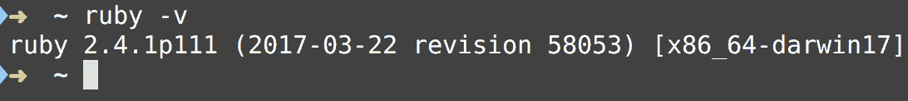

# Windows 安装

Travis CLI 用户文档在[`github.com/travis-ci/travis.rb#windows`](https://github.com/travis-ci/travis.rb#windows)上建议您使用 RubyInstaller ([`rubyinstaller.org/`](http://rubyinstaller.org/))在 Windows 操作系统上安装最新版本的 Ruby。

我们需要在 RubyInstaller 下载站点上选择 Ruby Devkit 版本 2.5.1，然后确保接受许可协议，然后选择适当的安装选项。确保安装开发工具链。

当安装程序窗口关闭时，将打开一个命令提示符，您需要选择一个选项；您可以只需按 Enter 键在系统上安装所有三个选项。安装过程可能需要一段时间才能完成。我的安装大约花了 20 分钟来更新 GPG 密钥并安装 Ruby 编程语言所需的其他依赖项：

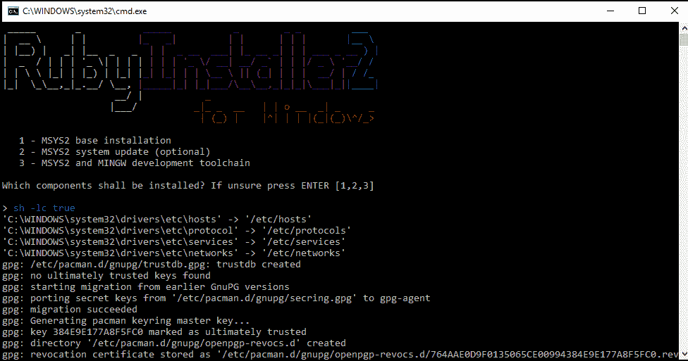

在这里，我们已经在系统上安装了 Ruby 版本 2.5.1，正如我们所期望的那样：

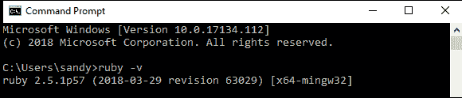

在这一步中，我们在 Windows 命令提示符中安装 Travis RubyGems：

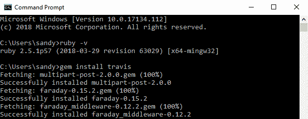

在最后一步中，我们验证 Travis CLI RubyGem 是否已安装在我们的系统上；它报告版本`1.8.8`：

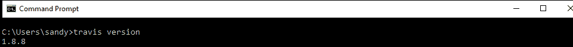

# Linux 安装

Linux 操作系统有多个不同的软件包管理器，因此如何在系统上安装 Ruby 取决于您的特定 Linux 操作系统。我们将在 DigitalOcean 服务器上的 Ubuntu 14.04 上安装 Ruby 和 Travis CLI：

1.  在 Ubuntu 上安装 Ruby，请运行以下命令：

```
sudo apt-get install python-software-properties
sudo apt-add-repository ppa:brightbox/ruby-ng
sudo apt-get update
sudo apt-get install ruby2.1 ruby-switch
sudo ruby-switch --set ruby2.1
```

1.  接下来，通过运行以下命令确认 Ruby 已安装：

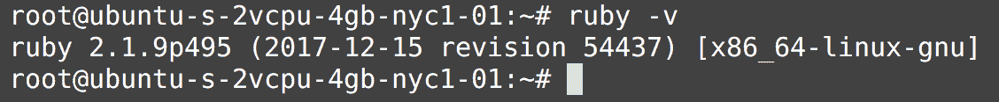

1.  接下来，我们需要使用以下命令安装 Travis CLI RubyGem：

```
gem install travis -v 1.8.8 --no-rdoc --no-ri
```

1.  最后一步是使用以下命令检查 Travis CLI 是否已安装：

```
travis version
1.8.8
```

# macOS 安装

您需要安装 Xcode 命令行工具，可以使用以下命令来执行：

```
xcode-select --install
```

如果您已经安装了 Xcode 命令行工具，则在终端中会显示以下信息：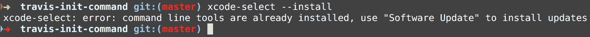

Ruby 已预安装在当前的 macOS 操作系统上，因此您只需要运行以下命令来安装 Travis CLI：

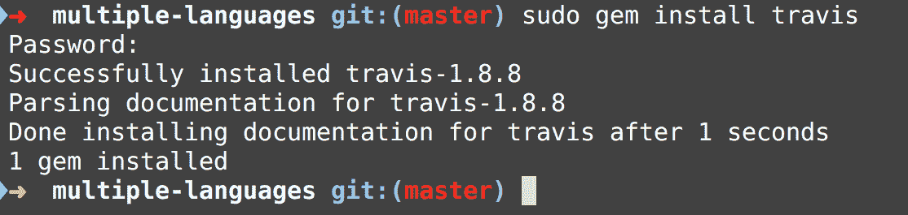

这里我使用了`sudo`，因为我需要提升的管理员权限来安装 RubyGem。

如果您在终端中看到此消息，您将知道 Travis CLI 已安装：

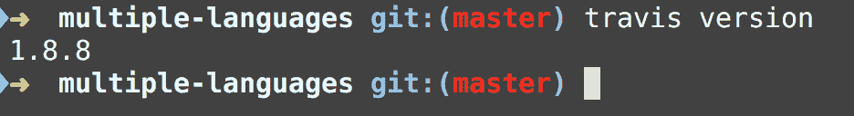

这里我使用的是 Travis CLI 版本`1.8.8`，但您的特定版本可能不同。

# Travis CLI 命令

Travis CLI 功能齐全，与 GitHub 中的 Travis API（[`github.com/travis-ci/travis-api`](https://github.com/travis-ci/travis-api)）一起使用，并且具有以下三种不同形式的 CLI 命令：

+   **非 API 命令**：

+   非 API 命令文档（[`github.com/travis-ci/travis.rb#non-api-commands`](https://github.com/travis-ci/travis.rb#non-api-commands)）

+   这些命令包括`help`和`version`，不直接命中 Travis CI API

+   **常规 API 命令**：

+   常规 API 命令文档 ([`github.com/travis-ci/travis.rb#general-api-commands`](https://github.com/travis-ci/travis.rb#general-api-commands))

+   这些命令直接命中 Travis API，并继承非 API 命令的所有选项

+   **存储库命令**：

+   存储库命令文档（[`github.com/travis-ci/travis.rb#repository-commands`](https://github.com/travis-ci/travis.rb#repository-commands)[)](https://github.com/travis-ci/travis.rb#repository-commands)

+   这些命令具有常规 API 命令的所有选项，另外您可以指定要通信的 repo 所有者/名称

Travis CLI 库是用 Ruby 编程语言编写的，如果您想直接与其交互，请准备在 GitHub 的*Ruby Library*部分阅读更多内容（[`github.com/travis-ci/travis.rb#ruby-library`](https://github.com/travis-ci/travis.rb#ruby-library)）。

我们将使用我们在第九章中创建的`packtci` GitHub（[`github.com/packtci`](https://github.com/packtci)）用户，在*创建 GitHub 帐户*部分创建的`packtci` Travis CI 帐户。

# 非 API 命令

非 API Travis CLI 命令包括`help`和`version`命令。这些命令不直接命中 Travis API，而是打印有关 Travis CLI 的有用信息。

# 打印帮助信息

`help`命令将显示特定命令接受的参数和选项。

在下面的截图中，我们在命令行终端中运行`travis help`命令：

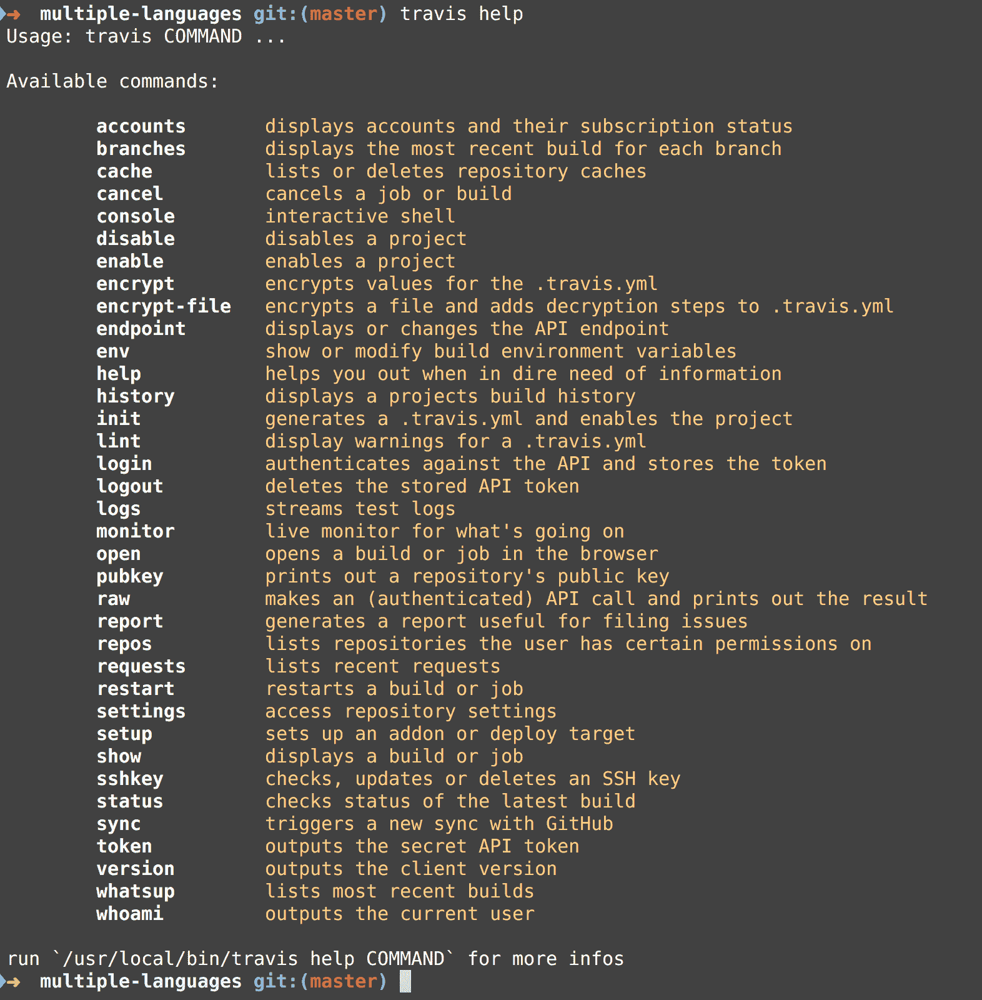

如果您想获取特定命令的帮助，只需使用`travis help COMMAND`。

以下是有关 Travis 中`whoami`命令的更多信息的截图：

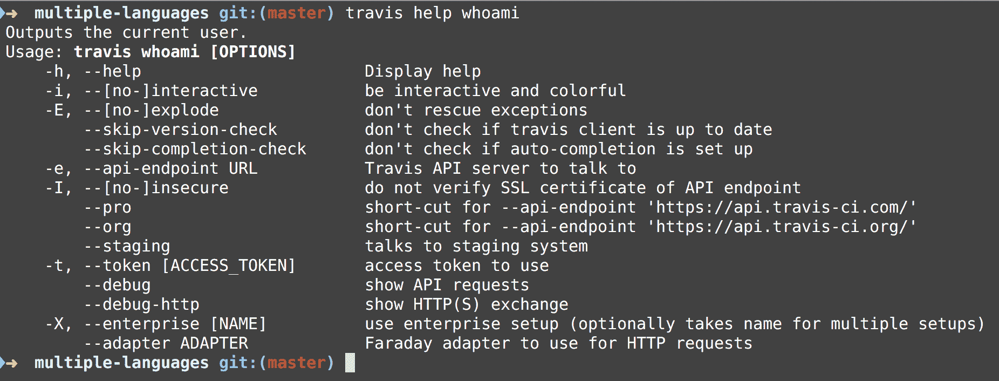

# 打印版本信息

`version`命令显示安装在系统上的当前 Travis CLI 客户端。以下截图显示了 Travis CLI 的当前客户端版本为`1.8.8`：


# API 命令

API 命令直接命中 Travis API，有些需要您拥有适当的访问令牌，您可以使用`travis login`命令获取。

# 登录到 Travis CI

`login`命令通常是您需要使用的第一个命令，以便与 Travis API 一起工作，因为它会对您进行身份验证。

`login`命令将要求您输入 GitHub 用户名和密码，但不会将这些凭据发送到 Travis CI。相反，它使用您的用户名和密码创建一个 GitHub API 令牌，然后将令牌显示给 Travis API，然后运行一系列检查以确保您是您所说的人。然后它会给您一个 Travis API 的访问令牌，并最终 Travis 客户端将再次删除 GitHub 令牌。只要您成功运行`travis login`命令，所有这些步骤都会在幕后发生。

以下截图显示我们尝试运行`travis accounts`命令，并通知我们需要登录：

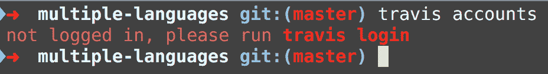

在下面的截图中，我们运行`travis login`命令并提供 GitHub 用户名和密码：

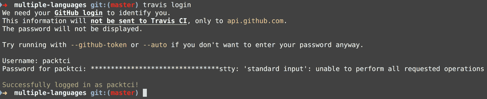

现在我们已成功登录到 Travis CI 系统，并且 Travis CI 已经为我们发放了一个访问令牌。

# 显示当前访问令牌

`token`命令用于显示当前访问令牌。截图中的访问令牌已经被隐藏，以确保安全：

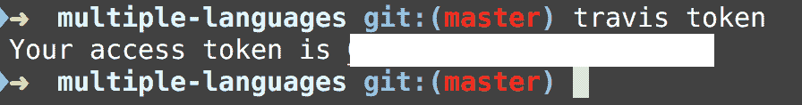

# 注销 Travis CI

`logout`命令将注销您在 Travis CI 中的登录并删除您的访问令牌。

请注意，在下面的截图中，我们发出`travis logout`命令后，`travis token`命令显示我们需要重新登录：

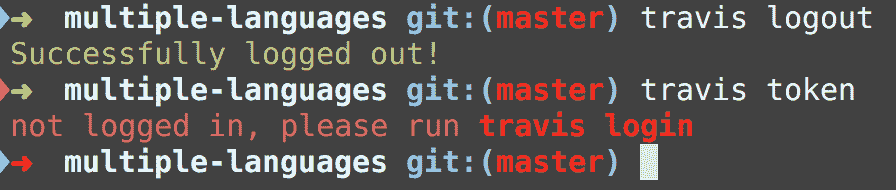

我们需要重新登录到 Travis CI 以再次获取令牌。在下面的截图中，我们重新登录到 Travis，然后获取另一个访问令牌，以便我们可以向 Travis API 发出命令：

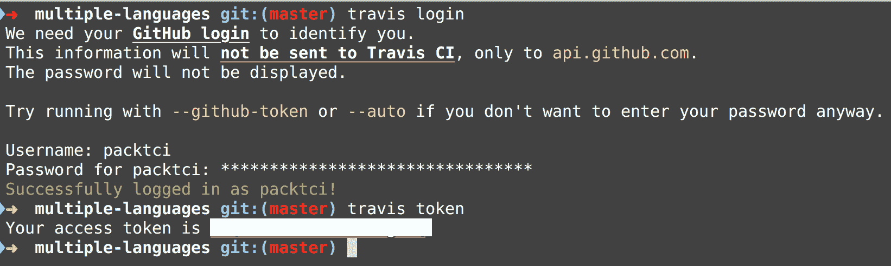

# 显示帐户信息

`accounts`命令用于列出您可以为其设置存储库的所有帐户。请记住，当我们之前运行此命令时，Travis 通知我们需要登录到 Travis 才能执行此命令。在下面的截图中，Travis 通知我们我们已经订阅了 Travis 中的四个不同存储库：

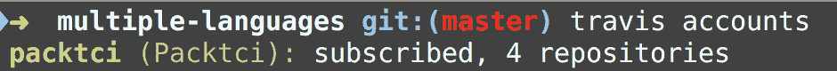

# 显示 Travis 命令的帮助信息

请记住，我们可以通过运行以下命令在 Travis 中找到特定命令的所有选项：

```
travis help
```

在下面的截图中，我们为`accounts`命令运行`help`命令：

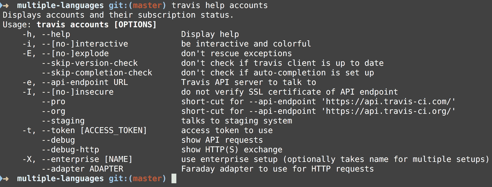

有一个名为`--debug`的选项，我们将使用它来调试发送到 Travis API 的 HTTP 请求。在下面的截图中，我们获得了有关发送到 Travis 的请求的其他信息，例如命中的端点是`GET "accounts/" {:all=>true}`以及其他信息：

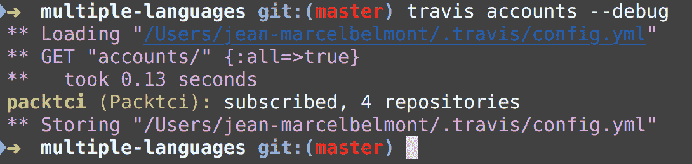

# 交互式控制台会话

`console`命令将您放入一个交互式的 Ruby 会话中，其中所有实体都被导入到全局命名空间中，并确保您已经通过 Travis 进行了身份验证，如果您正在设置正确。在下面的截图中，我按下了*Tab*并在控制台会话中获得了自动完成：

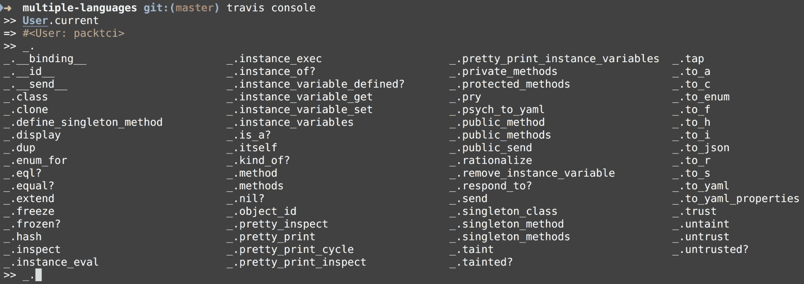

还要注意，当前登录的用户是`packtci`。

# 打印 API 端点信息

`endpoint`命令打印出我们正在使用的 API 端点。请注意，在截图中，我们正在使用 Travis API 的免费开源版本：

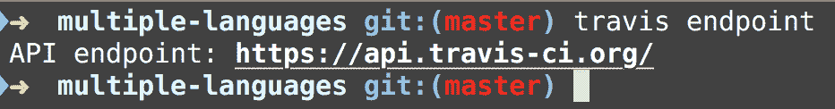

Travis 的 PRO 版本使用以下端点：[`api.travis-ci.com/`](https://api.travis-ci.com/)。

# 进行实时监控，查看当前正在运行的所有 CI 构建

`travis monitor`命令将对已登录帐户中的所有 CI 构建进行实时监控。在下面的截图中，Travis CI 目前没有任何活动：

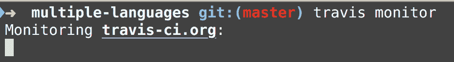

让我们为`puppeteer-headless-chrome-travis-yml-script`仓库（[`github.com/packtci/puppeteer-headless-chrome-travis-yml-script`](https://github.com/packtci/puppeteer-headless-chrome-travis-yml-script)）添加一个单元测试用例，然后将此更改推送到 GitHub 版本控制系统。在以下截图中，我们将更改推送到存储库中：

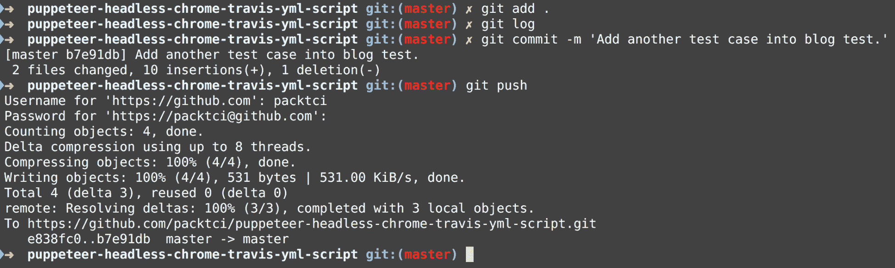

现在，如果我们回到 Travis 监视器正在运行的终端会话中，我们将看到已启动构建，然后它被传递：

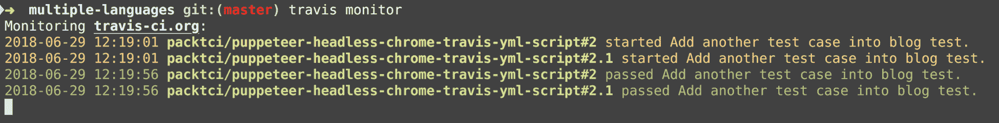

我们有一个`2.1`的构建作业；在`.travis.yml`文件中，我们没有指定任何其他构建作业，因此 Travis CI 将所有构建作业捆绑到一个构建作业中。

您可以在此网址阅读有关 Travis CI 构建阶段的更多信息：[`docs.travis-ci.com/user/build-stages/`](https://docs.travis-ci.com/user/build-stages/)。

# 发起 Travis CI API 调用

您可以通过使用`travis raw RESOURCE`命令直接对 Travis API 进行 API 调用。请记住，我们始终可以使用`travis help COMMAND`来查找如何在 Travis CLI 中使用特定命令。在以下截图中，我们对`raw`命令运行`help`命令：

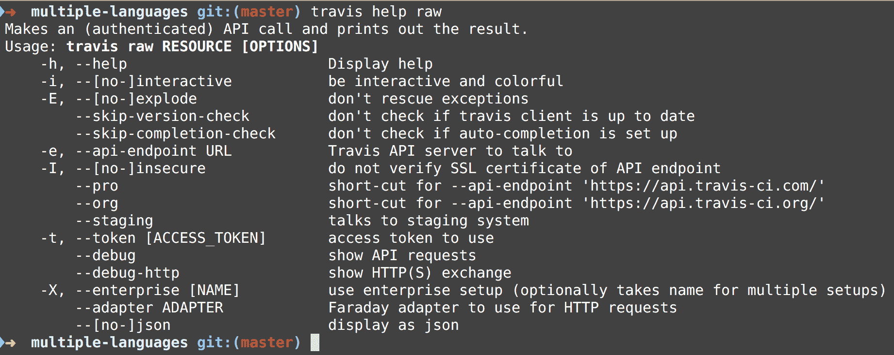

现在我们知道如何运行`raw`命令，让我们向 Travis API 的此端点发出请求：

```
GET /config
```

如果您想查看 Travis API 的开发人员文档，则需要转到以下网址：[`developer.travis-ci.com/`](https://developer.travis-ci.com/)。

确保登录并授权 Travis CI 作为 GitHub 的第三方应用程序。在以下截图中，我们为`packtci` GitHub 用户授权 Travis CI：

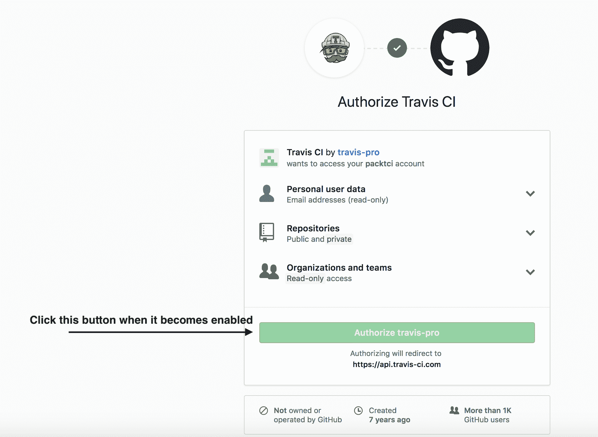

然后，您可以在以下网址查看 Travis CI 的 API 文档：[`developer.travis-ci.com/`](https://developer.travis-ci.com/)。在以下截图中，我们对`/config`端点进行 GET 请求，并在`raw`命令中使用以下两个不同的选项：

+   `--json`

+   `--debug`

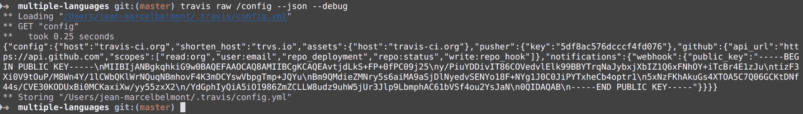

在不久的将来，Travis API 计划废弃 V2 API，只有 V3 API 将得到官方支持。您可以使用 API 资源浏览器对 V3 API 进行 REST 调用：

```
GET /owner/{owner.login}
```

在以下截图中，我们使用`API 资源浏览器`对以下端点进行 REST 调用：

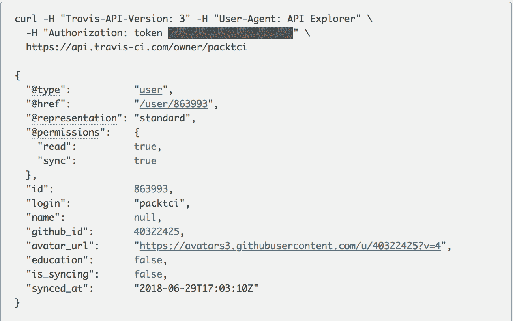

您可以转到此网址的 API 资源浏览器：[`developer.travis-ci.com/explore/`](https://developer.travis-ci.com/explore/)。然后在输入框中输入资源，看起来像这样：

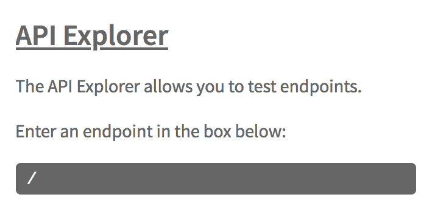

# 使用 curl 进行 API V3 REST 调用

我们将发出`travis token`命令，以便我们可以将访问令牌复制到系统剪贴板：

```
travis token
```

接下来，我们将运行`travis endpoint`命令并复制 URL：

```
travis endpoint
API endpoint: https://api.travis-ci.org/
```

我们将以以下方式发出`curl`请求：

```
curl -X GET \
 -H "Content-Type: application/json" \
 -H "Travis-API-Version: 3" \
 -H "Authorization: token $(travis token)" \
https://api.travis-ci.org/repos
```

请注意，在此 curl 请求中，我们使用了`travis token`cli 命令，该命令将返回此特定 HTTP 标头的有效令牌。此 HTTP 请求将返回一个 JSON 响应有效负载，我们将使用它来复制特定的存储库 ID，以便进行以下 REST 调用以查找`functional-summer`存储库的所有环境变量（[`github.com/packtci/functional-summer`](https://github.com/packtci/functional-summer)）：

```
curl -X GET \
 -H "Content-Type: application/json" \
 -H "Travis-API-Version: 3" \
 -H "Authorization: token $(travis token)" \
https://api.travis-ci.org/repo/19721247/env_vars
```

在此`GET`请求中，我们从`functional-summer`存储库获取所有环境变量，并收到以下 JSON 响应：

```
{
  "@type": "env_vars",
  "@href": "/repo/19721247/env_vars",
  "@representation": "standard",
  "env_vars": [

  ]
}
```

让我们发出`POST`请求，向`functional-summer`存储库添加一个环境变量：

```
curl -X POST \
  -H "Content-Type: application/json" \
  -H "Travis-API-Version: 3" \
  -H "Authorization: token $(travis token)" \
  -d '{ "env_var.name": "MOVIE", "env_var.value": "ROCKY", "env_var.public": false }' \
  https://api.travis-ci.org/repo/19721247/env_vars
```

现在，当我们对环境变量进行`GET`请求时，我们看到已设置名为`MOVIE`的环境变量：

```
curl -X GET \
 -H "Content-Type: application/json" \
 -H "Travis-API-Version: 3" \
 -H "Authorization: token $(travis token)" \
https://api.travis-ci.org/repo/19721247/env_vars
{
 "@type": "env_vars",
 "@href": "/repo/19721247/env_vars",
 "@representation": "standard",
 "env_vars": [
 {
 "@type": "env_var",
 "@href": "/repo/19721247/env_var/1f64fa82-2cad-4270-abdc-13d70fa8faeb",
 "@representation": "standard",
 "@permissions": {
 "read": true,
 "write": true
 },
 "id": "1f64fa82-2cad-4270-abdc-13d70fa8faeb",
 "name": "MOVIE",
 "public": false
 }
 ]
}
```

# 打印重要的系统配置信息

`report`命令打印出重要的系统配置信息，如下截图所示：

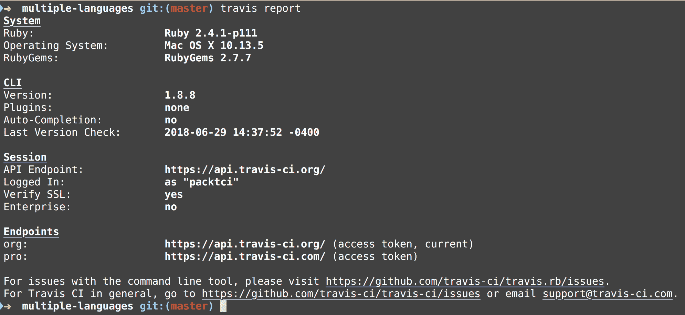

# 列出当前登录用户有权限访问的所有存储库

`repos`命令将列出存储库，无论它们是活动的还是不活动的，并且有各种可以使用的选项。在下面的截图中，我们使用了`-m`选项来匹配`packtci` GitHub 用户的所有存储库：

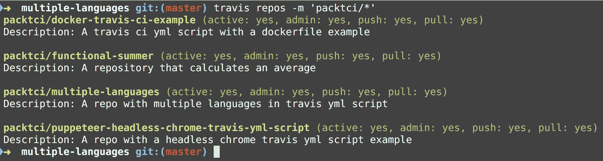

# 在 GitHub 中为任何新的或过时的存储库与 Travis CI 进行同步

`sync`命令帮助您更新 GitHub 用户的信息以及任何新的或修改的存储库。让我们在 GitHub 中添加另一个存储库，名为`functional-patterns`（[`github.com/packtci/functional-patterns`](https://github.com/packtci/functional-patterns)）。在下面的截图中，我们使用`sync`命令，以便 Travis CI 意识到新存储库，然后使用`repos`命令确认它显示在我们可以访问的存储库列表中：

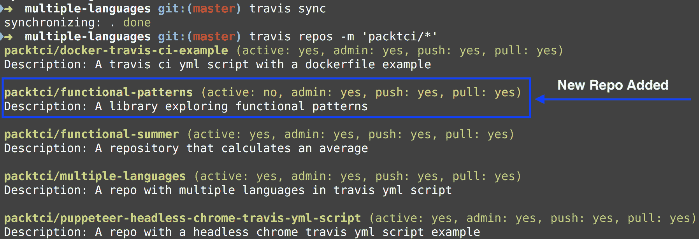

`sync`命令可以替换我们在第九章中所采取的步骤，即单击同步帐户按钮以同步我们帐户中的所有存储库信息。

# lint - 一个 Travis YML 脚本

`lint`命令非常有用，因为它检查您的 Travis YML 脚本中是否有正确的语法。让我们在`functional-patterns`存储库（[`github.com/packtci/functional-patterns`](https://github.com/packtci/functional-patterns)）中创建一个 Travis YML 脚本。我们将为`.travis.yml`脚本添加以下条目：

```
language: blah node_js: 8.11
```

现在让我们运行`lint`命令来检查语法。在下面的截图中，Travis 通知我们正在使用`blah`的非法值，并且它将默认为`ruby`作为语言：

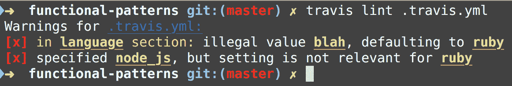

让我们修复语言条目以使用 Node.js，然后再次运行`lint`命令：

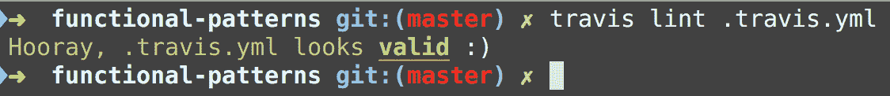

`lint`命令报告我们现在在`.travis.yml`脚本中有有效的语法。

# 获取组织或用户的当前构建信息

`whatsup`命令让您查看最近在 Travis 中发生的活动。当我们运行这个`whatsup`命令时，它给了我们 Travis CI 中最近的活动：

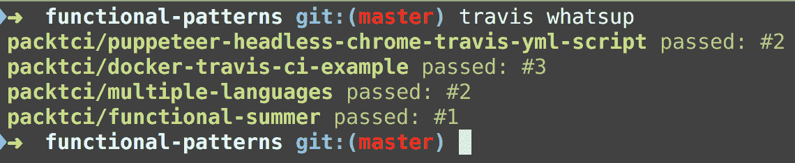

在`packtci` Travis 帐户中，只有一个用户，但是您可以在 Travis CI 帐户中拥有许多用户，因此只查看您的存储库可能更有用。记住，我们可以使用`help`命令查找特定命令的更多选项。作为练习，使用`help`命令查找仅显示您自己的存储库的选项。

# 查找当前登录用户信息

`whoami`命令对于查找 Travis CI 帐户当前登录的用户非常有用：

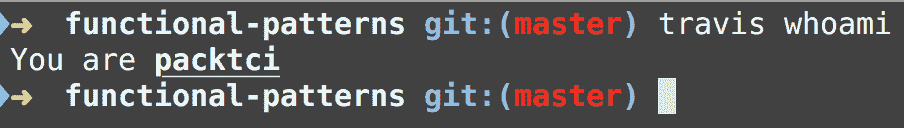

`whoami`命令报告`packtci`，正如我们所期望的那样。

# 存储库命令

存储库命令具有 API 命令的所有选项，此外，您还可以使用`--repo owner/name`选项指定要使用的特定存储库。

# 显示 Git 版本控制中每个分支的最新构建信息

`branches`命令显示版本控制中每个分支的最新构建信息：

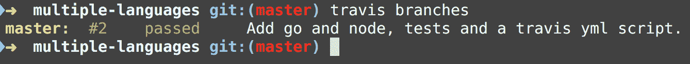

当您运行此命令时，可能会显示更多的分支。

# 列出所有存储库的缓存信息

`cache`命令可以列出存储库中的所有缓存：

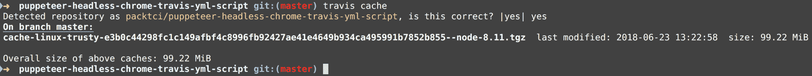

# 删除给定存储库的缓存信息

`cache`命令还可以删除存储库中的缓存，如果您使用`-d`、`--delete`选项：

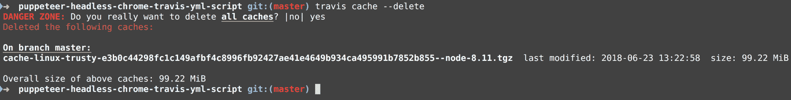

我们收到了一条红色的警告消息，要求我们确认删除缓存。

# 在 Travis CI 中启用存储库

`enable`命令将在您的 GitHub 存储库中激活 Travis CI：

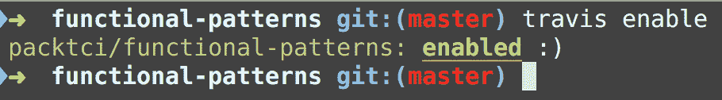

`enable`命令有助于替换我们在第九章中所采取的手动步骤，即激活 Travis CI 中的存储库，在那里我们在 Travis web 客户端中点击滑块按钮以激活存储库。

# 在 Travis CI 中禁用存储库

`disable`命令将使您的 GitHub 存储库中的 Travis CI 处于非活动状态：

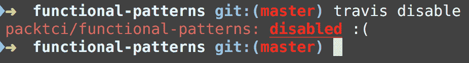

# 取消 Travis CI 中的最新构建

让我们使用以下命令启用`functional-patterns`存储库：

```
travis enable
```

现在让我们使用以下命令向存储库推送提交：

```
git commit --amend --no-edit
```

先前的`git`命令允许您重用之前使用的`git commit`命令，但您需要发出以下命令：

```
git push -f
```

让我们查看 Travis CI 中存储库的当前状态；构建在 Travis CI 中正式创建可能需要一段时间：

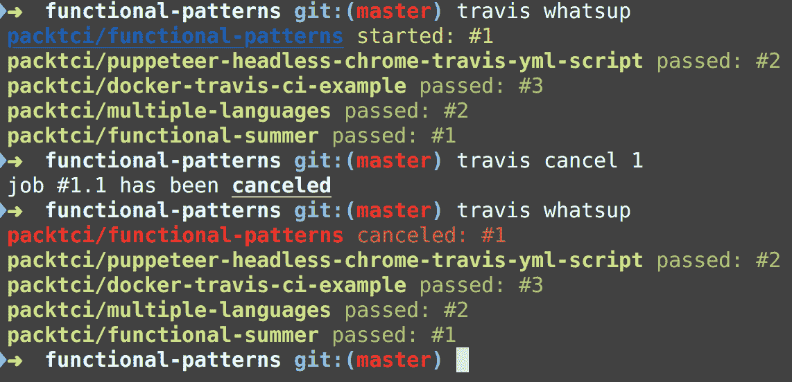

在上一张屏幕截图中，我们发出了`whatsup`命令来查看构建的当前状态，并注意到`packtci/functional-patterns`开始了作业编号`1`。然后我们发出了`travis cancel`命令，并提供了一个参数`1`。这并不完全必要，因为这是当前的构建，所以我们可以只发出`travis cancel`命令。当我们运行`travis whatsup`命令时，构建被取消。

# 加密环境变量或部署密钥

`encrypt`命令允许您加密存储在环境变量和/或部署密钥中的秘密值，这些值您不希望公开显示：

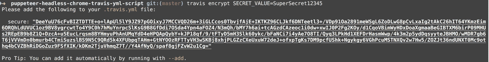

# 在 Travis CI 中添加环境变量

我们将在我们的`.travis.yml`脚本的`env`块中添加这个条目。您可以在[`docs.travis-ci.com/user/environment-variables`](https://docs.travis-ci.com/user/environment-variables)的文档中阅读有关在 Travis CI 中使用环境变量的更多信息。一般来说，您可以通过在您的`.travis.yml`脚本中添加一个名为`env`的块来添加环境变量。

我在`.travis.yml`脚本中添加了一个示例片段：

```
env:
    DB_URL=http://localhost:8078
    global:
        secure: "DeeYuU76cFvBIZTDTTE+o+lApUl5lY9JZ97pGOixyJ7MCCVQD26m+3iGLCcos0TbvjfAjE+IKTKZ96CLJkf6DNTeetl3+/VDp91Oa2891meWSgL6ZoDLwG8pCvLxaIg2tAkC26hIT64YKmzEim6ORQhLdUVUC1oz9BV8ygrcwtTo4Y9C0h7hMuYnrpcSlKsG9B8GfDdi7OSda4Ypn4aFOZ4/N3mQh/bMY7h6ai+tcAGzdCAzeoc1i0dw+xwIJ0P2Fg2KOy/d1CqoVBimWyHDxDoaXgmaaBeGIBTXM6birP09MHUs2REpEB9b8Z1Q+DzcA+u5EucLrqsm8BYHmyuPhAnUMqYdD4eHPQApQybY+kJP18qf/9/tFTyD5mH3Slk60ykc/bFaNCi7i4yAe7O8TI/Qyq3LPkHd1XEFDrHasmWwp/4k3m2p5ydDqsyyteJBHMO/wMDR7gb6T6jVVVmDn0bmurb4CTmiSuzslBS9N5C9QRd5k4XFUbpqTAHm+GtNYOOzRFTTyVH3wSKBj8xhjPLGZzCXeUxuW72deJ+ofxpTgKs7DM9pcfUShk+Ngykgy6VGhPcuMSTNXQv2w7Hw5/ZOZJt36ndUNXT0Mc9othq4bCVZBhRiDGoZuz9FSfXIK/kDKm2TjuVhmqZ7T//Y4AfNyQ/spaf8gjFZvW2u1Cg="
```

我们添加了一个名为`DB_URL`的公共环境变量，并使用`global`块添加了一个全局变量，然后将条目粘贴到其中。

如果您愿意，您可以使用`--add`选项自动添加条目，尽管您在`.travis.yml`脚本中的任何注释都将消失，间距也将消失，因此在运行`--add`选项时要注意这一点。

# 加密文件

`encrypt-file`命令将使用对称（AES-256）加密加密整个文件，并将秘密存储在文件中。让我们创建一个名为`secret.txt`的文件，并将以下条目添加到其中：

```
SECRET_VALUE=ABCDE12345
CLIENT_ID=rocky123
CLIENT_SECRET=abc222222!
```

现在让我们加密我们的秘密文件：

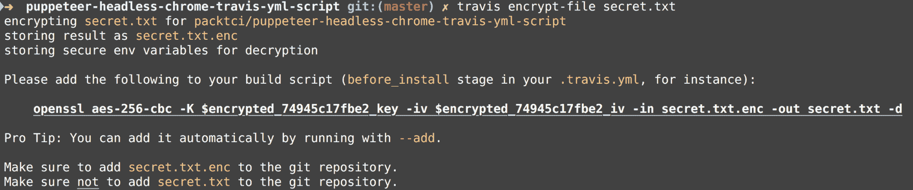

因此，现在我们将把这个条目添加到我们的`.travis.yml`脚本中：

```
before_install: - openssl aes-256-cbc -K $encrypted_74945c17fbe2_key -iv $encrypted_74945c17fbe2_iv -in secret.txt.enc -out secret.txt -d
```

然后它可以为我们解密秘密文本文件中的值。

# 列出环境信息

`env`命令可以列出为存储库设置的所有环境变量：

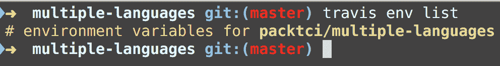

我们没有为此存储库设置任何环境变量。

# 设置环境变量

`env`命令还可以从存储库中设置环境变量：

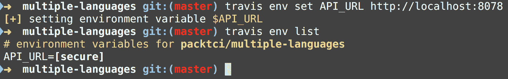

我们设置了一个名为`API_URL`的环境变量，并且它现在显示为多语言存储库的环境变量。

# 删除环境变量

`env`命令还可以从存储库中删除环境变量：

！[](assets/330adbc3-34a5-4966-9786-78af22a56f5a.png)

`travis env`列表命令现在报告我们没有为多语言存储库设置任何环境变量，这是我们所期望的。

# 清除所有环境变量

`env`命令可用于清除存储库中设置的所有环境变量：

！[](assets/5b11b397-cc21-4809-b2dc-c808c00e4f1b.png)

# 列出最近构建的历史信息

`history`命令显示存储库的构建历史：

！[](assets/47f82048-ebfb-4bf8-8ed0-eb70efae4225.png)

`history`命令默认只显示最后 10 个构建，但您可以使用`--limit`选项来限制或扩展构建的数量。

# 在项目上初始化 Travis CLI

`init`命令将帮助您通过为您生成一个`.travis.yml`脚本来在项目中设置 Travis CI。我们在 GitHub 中设置了一个名为`travis-init-command`的新项目（[`github.com/packtci/travis-init-command`](https://github.com/packtci/travis-init-command)）。我们将使用`init`命令在此存储库中设置 Golang：

！[](assets/3e87decb-4ad6-4252-8847-0643b06a2c78.png)

该过程的步骤如下：

1.  第一步是使用`sync`命令，以便 Travis CI 知道这个新存储库

1.  接下来，我们将在 Travis CI 中启用这个新存储库。

1.  接下来，我们将尝试使用 Golang 创建一个`.travis.yml`脚本，但请注意它没有被识别，因此我们再次尝试使用 Go，这次成功了

1.  最后，我们打印出新文件的内容，并注意它将语言设置为 Go，并使用了两个不同版本的 Go

# 打印 CI 构建日志信息

`logs`命令将打印出存储库的 Travis CI 日志的内容，默认情况下它将打印出最新构建的第一个作业。在这里，我们在最近创建的存储库中运行`logs`命令；但是，它不会通过 CI 构建，因为存储库中还没有任何可构建的 Go 文件：

```
travis logs

displaying logs for packtci/travis-init-command#1.1
Worker information
hostname: fb102913-2cd8-41fb-b69b-7e8488a0aa0a@1.production-1-worker-org-03-packet
version: v3.8.2 https://github.com/travis-ci/worker/tree/c370f713bb4195cce20cdc6ce3e62f26b8cf3961
instance: 22589e2 travisci/ci-garnet:packer-1512502276-986baf0 (via amqp)
startup: 1.083854718s
Build system information
Build language: go
Build group: stable
Build dist: trusty
Build id: 399102978
Job id: 399102980
Runtime kernel version: 4.4.0-112-generic
...
The command "go get -v ./..." failed and exited with 1 during .

Your build has been stopped.
```

请注意，正如我们之前注意到的那样，`build`失败了，因为没有任何 Go 文件可以构建。 `logs`命令也可以给出一个特定的构建编号来运行，您还可以给它们一个特定的分支来运行。运行`travis help logs`命令以获取更多选项。

# 打开项目的 Travis web 界面

`open`命令将在 Travis CI web 客户端中打开存储库：

```
travis open
```

在`travis-init-command`存储库（[`github.com/packtci/travis-init-command`](https://github.com/packtci/travis-init-command)）中运行`travis open`将带我们转到以下 URL [`travis-ci.org/packtci/travis-init-command`](https://travis-ci.org/packtci/travis-init-command)。

您可以使用`--print`选项来打印出 URL，而不是默认情况下打开到特定项目视图。运行`travis help open`命令以获取更多选项。

# 打印存储库的公钥信息

`pubkey`命令将打印出存储库的公共 SSH 密钥：

！[](assets/5208a514-128f-4572-9509-3c09b2157d3a.png)

出于安全原因，我删除了公钥信息。您还可以以不同格式显示密钥。例如，如果您使用`--pem`选项，您的密钥将显示如下：

！[](assets/b56b9ecb-27fe-4a3d-8024-ab79eb9bee4f.png)

运行`travis help pubkey`命令以显示此命令的更多选项：

！[](assets/3d27d584-4b6f-4166-ae8c-ae4111b159c5.png)

# 在 Travis CI 中重新启动最新的 CI 构建

`restart`命令将重新启动最新的构建：

！[](assets/fc36f25c-2600-4e08-8733-0783cba99bf4.png)

# 打印 Travis CI 中当前的构建请求

`requests`命令将列出 Travis CI 收到的任何构建请求。我们将在刚刚为`travis-init-command`存储库触发的构建上运行`travis requests`命令：

！[](assets/5a038f86-fbb8-4c35-b3ee-c0ed0b3d64da.png)

由于其中还没有任何可构建的 Go 文件，构建仍然失败。

# 打印特定存储库设置

`settings`命令将显示存储库的设置：

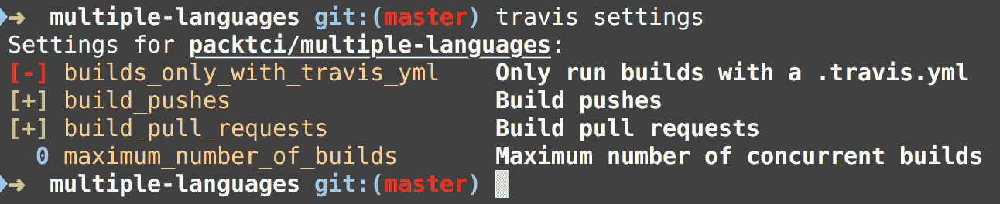

请注意，减号（`-`）表示已禁用，而加号（`+`）表示已启用。

`travis settings`命令也可用于启用、禁用和设置设置：

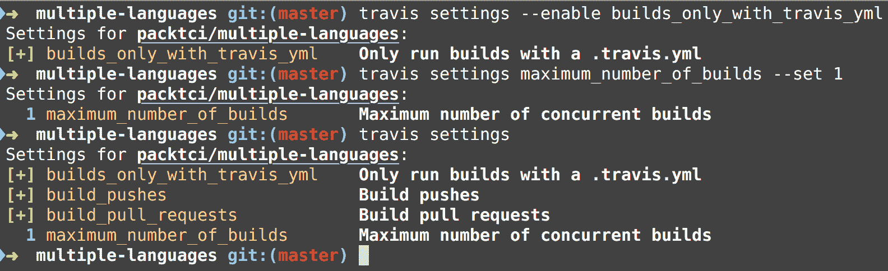

# 配置 Travis CI 附加功能

`setup`命令可帮助您配置 Travis 附加功能：

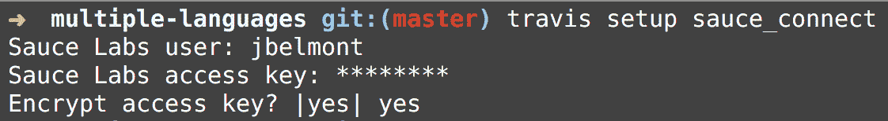

您可以在 Travis CLI 用户文档中查看更多可用的 Travis 附加功能（[`github.com/travis-ci/travis.rb#setup`](https://github.com/travis-ci/travis.rb#setup)）。

# 显示当前 CI 构建的一般信息

`show`命令默认显示有关最近 CI 构建的一般信息：

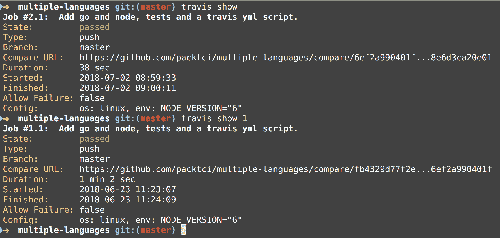

第一个命令`travis show`显示了最近的构建，在下一次运行中，我们提供了一个特定的构建编号。

# 在 Travis CI 中列出 SSH 密钥

`sshkey`命令将检查是否设置了自定义 SSH 密钥：

```
travis sshkey
```

此命令仅适用于 Travis 的 Pro 版本，如果没有 SSH 密钥，它将报告未安装自定义 SSH 密钥。

您可以在用户文档中阅读有关此命令的更多选项（[`github.com/travis-ci/travis.rb#sshkey`](https://github.com/travis-ci/travis.rb#sshkey)）。

# 显示当前构建的状态信息

`status`命令将输出有关项目最后构建的一行消息：

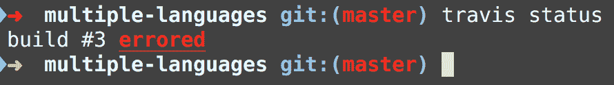

# Travis CI 的 Pro 版本和企业版本选项

默认情况下，一般 API 命令会访问`api.travis-ci.org`端点。Travis Pro 版本具有一些常规 Travis 帐户没有的附加功能和选项，例如使用`sshkey`命令等。您可以在用户文档中阅读有关选项的更多信息（[`github.com/travis-ci/travis.rb#pro-and-enterprise`](https://github.com/travis-ci/travis.rb#pro-and-enterprise)）。

# 显示 Pro 版本的信息选项

如果您在一般 API 命令中使用`--pro`选项，则将访问 Travis Pro 端点`https://api.travis-ci.com/`。例如，如果我们使用`--pro`选项进行以下请求，我们将访问 Travis Pro API：

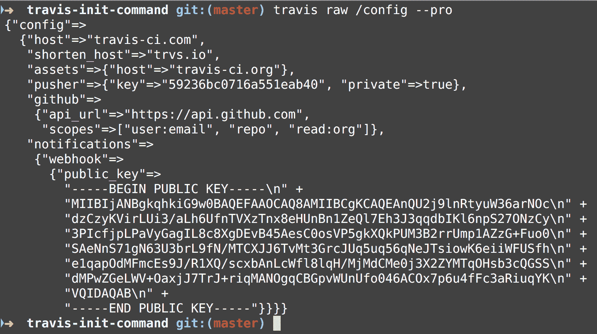

请注意，主机是`travis-ci.com`，这是 Travis PRO。

# 显示企业版本的信息选项

如果您已设置 Travis Enterprise，则可以使用`--enterprise`选项，以便访问您的企业域所在的位置：

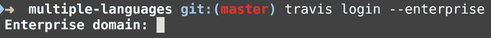

我们没有设置 Travis Enterprise，但如果您设置了，则可以在此处输入您的域。

# 摘要

在本章中，我们已经介绍了如何在 Windows 操作系统、macOS 操作系统和 Linux 操作系统上安装 Ruby 和 Travis CLI RubyGem。我们详细介绍了每个 Travis CLI 命令，并讨论了使用每个命令的各种方式以及每个命令所接受的一些选项。我们还向您展示了如何使用 curl REST 客户端直接调用 Travis API。最后，我们还介绍了 Travis Pro 和 Enterprise 版本中的一些功能。

在下一章中，我们将介绍一些更高级的技术，以记录值并使用 Travis CI 进行调试。

# 问题

1.  根据 Travis 文档，安装 Ruby 在 Windows 操作系统上的推荐方式是什么？

1.  您应该使用哪个命令来打印已安装的 Travis 的当前版本？

1.  您在 Travis CLI 中使用哪个命令来打印有用的信息？

1.  如何获取访问令牌以便在 Travis CLI 中使用一般 API 命令？

1.  您需要使用哪个 HTTP 标头来使用 Travis API 版本 3？

1.  如何打印系统配置信息？

1.  哪个命令检查您的 Travis YML 脚本的语法？

1.  哪个命令可以帮助您在项目中设置 Travis？

# 进一步阅读

您可以在用户文档中进一步探索 Travis CLI 选项（[`github.com/travis-ci/travis.rb`](https://github.com/travis-ci/travis.rb)），您可以在 API 文档中阅读有关使用 Travis API 的更多信息（[`developer.travis-ci.com/`](https://developer.travis-ci.com/)）。
