# 第十一章：Travis CI UI Logging and Debugging

本章将概述 Travis 作业日志和作业日志中的各个部分。本章还将解释如何以几种不同的方式调试 Travis 构建作业，包括使用 Docker 在本地构建，然后以调试模式运行构建。我们将介绍所有获取作业 ID 的不同方式，以及如何在公共存储库中启用调试模式，然后使用 Travis API 以调试模式启动构建。我们将解释如何使用**tmate**，这是一个终端复用器，然后我们将讨论在 Travis Web 客户端中记录环境变量。最后，我们将介绍如何在 Travis CI 中使用 Heroku 进行部署以及如何调试部署失败。

本章将涵盖以下主题：

+   Travis Web 客户端概述

+   使用 Docker 在本地进行调试构建

+   以调试模式运行构建

+   Travis Web UI Logging

+   Travis CI 部署概述和调试

# 技术要求

这一章将需要一些基本的 Unix 编程技能以及一些 bash 脚本知识。对于如何进行 RESTful API 调用的基本理解将会有所帮助，因为我们将使用 curl 作为 REST 客户端来调用 Travis API。对于 Docker 和容器的基本理解也会有所帮助，因为我们将使用 Docker 来运行本地构建。

# Travis Web 客户端概述

我们在第九章中简要介绍了 Travis CI 的 Web 仪表板，*Travis CI 的安装和基础知识*，但让我们再次看看 UI 的不同部分。

# 主仪表板概述

Travis CI Web 客户端有几个必须理解的不同部分：

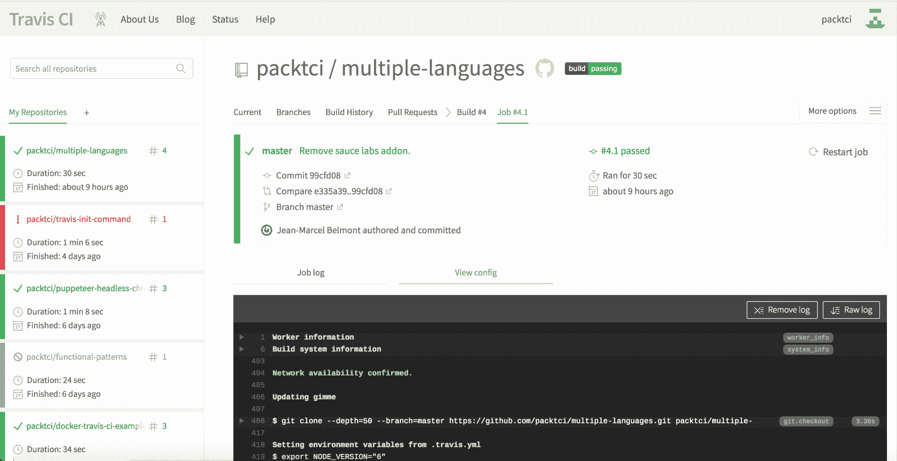

在左侧分割的部分，您可以单独点击您感兴趣的每个存储库。此外，您可以按名称搜索存储库，因为您或您所属的组织可能拥有许多存储库。还请注意，有关上次在项目中运行的最后一个构建以及它是否通过或失败的详细信息，以及有关持续时间和上次运行构建的详细信息。

在右侧分割的部分，您将找到 Travis Web 客户端的主要导航组件。请注意，这里有几个导航链接，例如当前构建，这是您转到存储库时打开的默认链接。如果单击 Branches 链接，您将看到在所有不同分支上触发的所有构建，包括拉取请求。让我们推送一个新分支并在`multiple-languages`（[`github.com/packtci/multiple-languages`](https://github.com/packtci/multiple-languages)）存储库中创建一个拉取请求，看看新的构建如何运行：

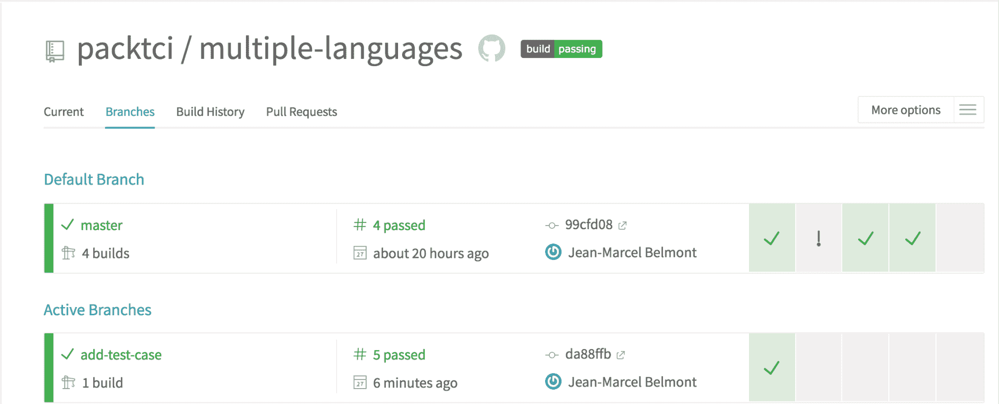

请注意，Travis CI 为我们推送的名为`add-test-case`的新分支创建了一个新的构建：

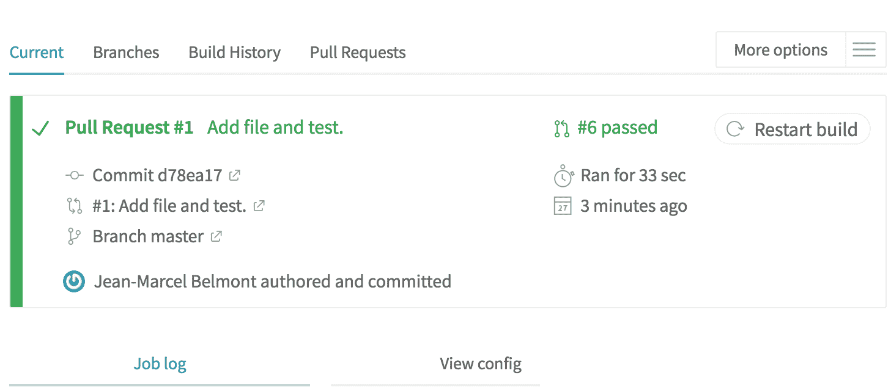

此外，您打开的任何拉取请求也将触发 Travis CI 的新构建：

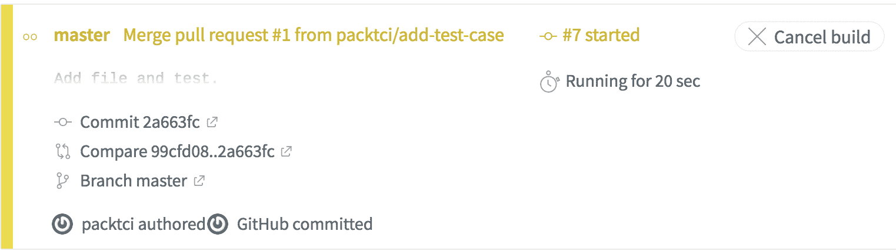

当您将拉取请求合并到另一个分支时，Travis CI 会触发另一个 CI 构建。

# 工作日志概述

Travis CI 中的作业日志以构建系统配置信息开始：

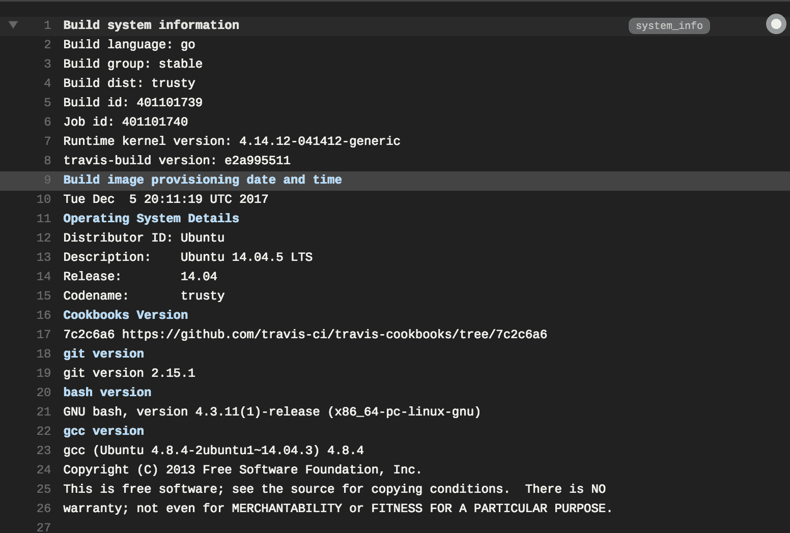

请注意，构建语言设置为`go`，构建操作系统为 Ubuntu Trusty 14.04：

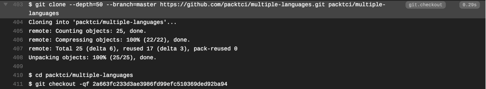

Travis CI 克隆了`multiple-languages`存储库的新副本，这是持续集成的重要方面。请记住，CI 构建应该在每次构建时构建一个新副本，并且不应该有任何假设的环境变量：

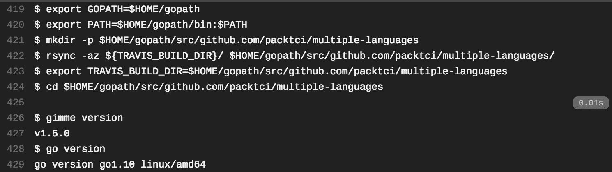

请注意，Travis CI 为我们设置了一些环境变量，包括`GOPATH`和`PATH`环境变量。Travis CI 运行`go version`命令来验证 CI 构建中是否安装了 Go 版本 1.10：

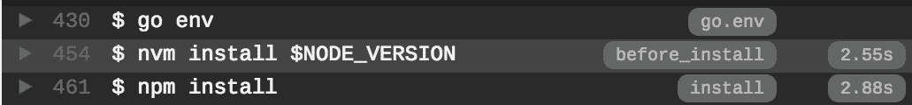

在 CI 构建的这一步中，我们安装了 Node.js 作为我们的第二编程语言。这是可选的，但请注意，Travis CI 在`before_install`右侧有一个构建标签，这是我们在第九章中讨论的构建步骤之一，*Travis CI 的安装和基础知识*，在*构建自定义*部分。还要注意，在`before_install`和`install`生命周期标签的右侧，有一个时间戳，显示了构建步骤实际花费的时间，以人类可读的格式显示为`2.55`秒和`2.88`秒，分别对应`before_install`和`install`生命周期事件：

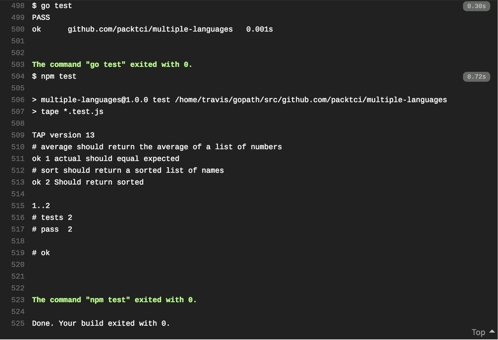

请注意，这里没有脚本构建生命周期的构建标签，因为这是 CI 构建的主要部分。

任何其他生命周期事件，如`after_success`和`after_script`生命周期事件，都将有一个构建标签和一个时间戳。

# 使用 Docker 在本地调试构建

您可以通过拉取文档链接中保存的 Docker 镜像来在本地调试构建，链接为 Troubleshooting Locally in a Docker Image ([`docs.travis-ci.com/user/common-build-problems/#Troubleshooting-Locally-in-a-Docker-Image`](https://docs.travis-ci.com/user/common-build-problems/#Troubleshooting-Locally-in-a-Docker-Image))。您可以在此链接中找到安装 Docker 的说明([`docs.docker.com/install/`](https://docs.docker.com/install/))。

1.  拉取 Go Docker 镜像：

```
docker pull travisci/ci-garnet:packer-1512502276-986baf0
```

请注意，我们运行`docker pull`命令来实际拉取 Docker 镜像

1.  启动交互式 Docker 会话：

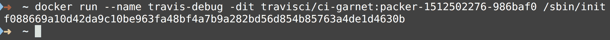

请注意，我们在分离模式下运行了一个交互式 shell 会话

1.  在正在运行的容器中打开登录 shell：

```
docker exec -it travis-debug bash -l
```

此命令使用 Bash shell 启动一个与正在运行的 Docker 容器的交互式 shell 会话

1.  切换到 Travis 用户：

```
su - travis
```

在此命令中，我们切换到 Travis 用户，而不是默认的 root 用户

1.  将`multiple-languages` Git 存储库克隆到主目录中：

```
git clone --depth=50 --branch=master https://github.com/packtci/multiple-languages
cd multiple-languages
```

此命令将我们的`multiple-languages`存储库克隆到本地的 Docker 容器中，然后切换到此目录

1.  检出我们想要在本地测试的 Git 提交。

运行`git log`命令并找到我们想要在本地检出的提交。很可能是我们将要检查的顶级 Git 提交。

```
git log
git checkout 2a663fc233d3ae3986fd99efc510369ded92ba94
```

在这一步中，我们要确保只测试与我们想要测试的更改相对应的更改。

1.  安装库依赖和第二编程语言：

```
NODE_VERSION="6"
nvm install $NODE_VERSION
npm install
```

在这一步中，我们使用**node 版本管理器**（**nvm**）安装 Node.js 作为第二编程语言，然后运行`npm install`命令来安装所有库依赖项

1.  运行脚本构建步骤。

在下面的截图中，我们在本地 Docker 容器中运行`go test`和`npm test`命令，以模拟脚本构建生命周期事件：

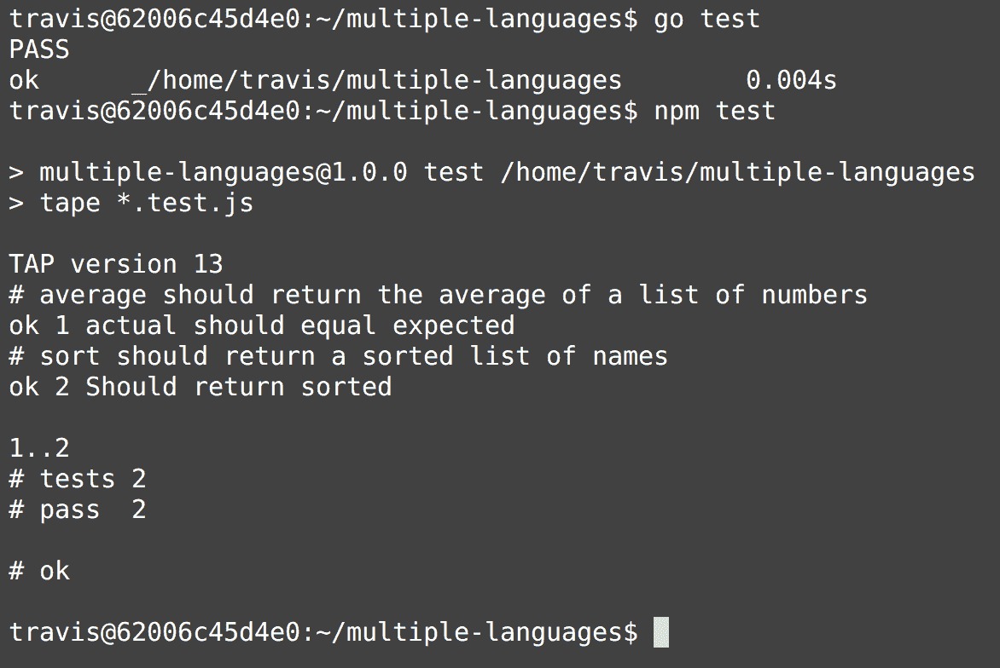

# 以调试模式运行构建

另一种调试构建时间问题的技术是在 Travis CI 中运行调试构建。您需要发送电子邮件至`support@travis-ci.com`，以为公共存储库切换此功能，而私有存储库默认启用调试模式。原因是任何人都可以遇到包含 SSH 访问的日志，然后可以连接到虚拟机，然后可能读取秘密环境信息，例如客户端 ID、密码等。

# 从个人资料页面获取 API 令牌

要通过 API 重新启动调试模式的作业，您需要向作业的调试端点发送一个 `POST` 请求。此请求需要通过将您的 Travis CI API 令牌添加到授权标头来进行身份验证。您可以在 Travis CI 个人资料页中找到您的 API 令牌，用于公共项目。

您需要访问一个 URL，例如 [`travis-ci.org/profile/packtci`](https://travis-ci.org/profile/packtci)。然后您需要在个人资料页面中复制您的 API 令牌，如下所示：

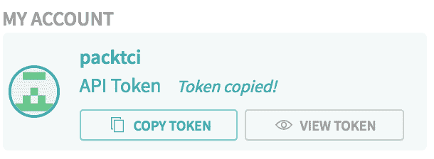

接下来，您需要使用 REST 客户端和 API 令牌来访问调试端点。

# 使用 Travis CLI 获取令牌

您可以使用 Travis CLI 运行以下命令来获取访问令牌：

```
travis token
```

# 从构建日志中获取作业 ID

您可以通过展开“构建系统信息”选项卡并查找“作业 ID”标签来获取作业 ID。在下面的截图中，有一个箭头指向“作业 ID”：

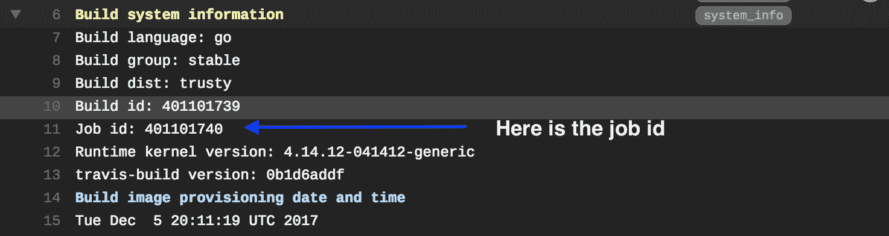

# 从“查看配置”按钮的 URL 中获取作业 ID

如果您点击“查看配置”按钮，URL 将会改变，您可以从 URL 中复制作业 ID。在下面的截图中，我们点击了“查看配置”按钮，如下所示：


然后 URL 改变为这个配置：[`travis-ci.org/packtci/multiple-languages/jobs/401101740/config`](https://travis-ci.org/packtci/multiple-languages/jobs/401101740/config)。

在此 URL 中，作业 ID 是 `401101740`。

# 通过对 /builds 端点进行 API 调用获取作业 ID

您还可以通过调用 Travis API 中的 /builds 端点来获取作业 ID。您需要发起一个 `GET` 请求，并提供有效的访问令牌以进行 REST 调用。以下是使用 `curl` REST 客户端的示例请求：

```
curl -s -X GET \
 -H "Content-Type: application/json" \
 -H "Accept: application/json" \
 -H "Travis-API-Version: 3" \
 -H "Authorization: token $(travis token)" \
 -d '{ "quiet": true }' \
 https://api.travis-ci.org/builds
```

这将获取与存储库关联的所有构建，这可能是一个大的 JSON 负载。您可以使用 **jq** ([`stedolan.github.io/jq/`](https://stedolan.github.io/jq/)) 命令行 JSON 处理器来过滤出作业 ID 信息。以下是相同的 REST 调用，将 JSON 负载传输到 `jq` 命令行实用程序以过滤出与构建对应的作业 ID：

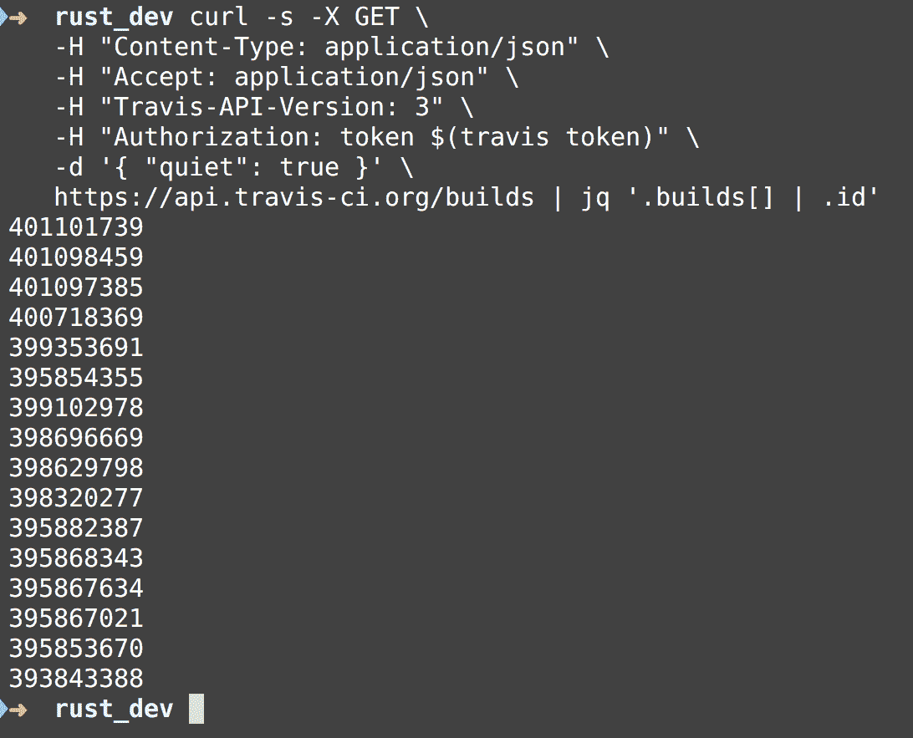

# 通过 API 调用启动调试模式的构建作业

只要您拥有有效的访问令牌，您可以使用任何 REST 客户端来调用 Travis API。

以下是针对作业 ID `40110174` 的调试端点的示例 REST 调用：

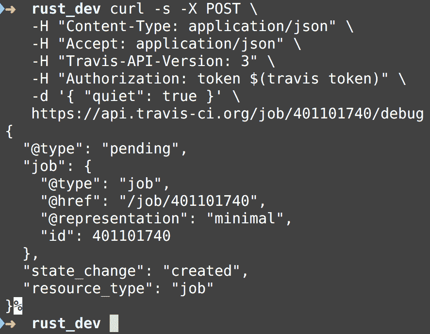

请注意，在此截图中，我们添加了 `Authorization` HTTP 标头，并使用 Travis CLI 通过 Bash 字符串插值打印出我们的访问令牌：

```
Authorization: token $(travis token)
```

还要注意我们使用的是 [`api.travis-ci.org`](https://api.travis-ci.org) 的公共 Travis 端点。

# 获取调试模式的 SSH 会话

如果您返回 Travis web UI 并查看当前作业日志，您将看到以下内容：

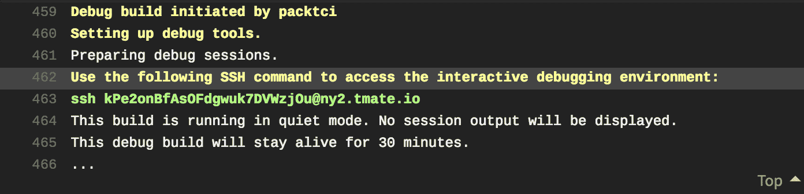

现在，您只需转到命令提示符或终端会话，并输入 `ssh` 命令以启动与当前构建的交互式调试会话：


调试模式的 SSH 会话只会保持 30 分钟，然后您需要发起另一个 API 调用来开始另一个调试会话：

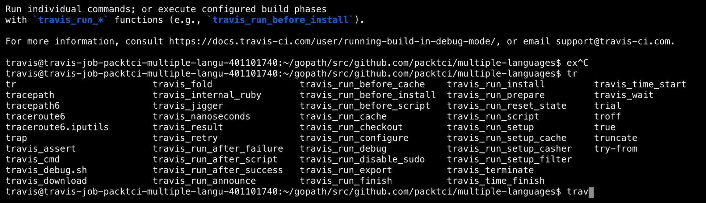

# Travis 调试模式便利 Bash 函数

以下是可用的便利 Bash 函数列表：

+   `travis_run_before_install` 对应 **before_install** 生命周期事件

+   `travis_run_install` 对应 **install** 生命周期事件

+   `travis_run_before_script` 对应 **before_script** 生命周期事件

+   `travis_run_script` 对应 **script** 生命周期事件

+   `travis_run_after_success` 对应 **after_success** 生命周期事件

+   `travis_run_after_failure`对应于**after_failure**生命周期事件

+   `travis_run_after_script`对应于**after_script**生命周期事件

在下面的截图中，我们运行`travis_run_before_install`函数：

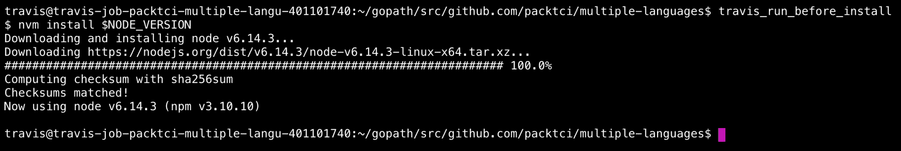

请记住，这是在`before_install`生命周期事件中指定的内容，在`multiple-languages`存储库中：

```
before_install:
 - nvm install $NODE_VERSION
```

现在我们将运行`travis_run_install`便利 Bash 函数，该函数安装了在 Travis `install`生命周期事件中指定的库依赖项：

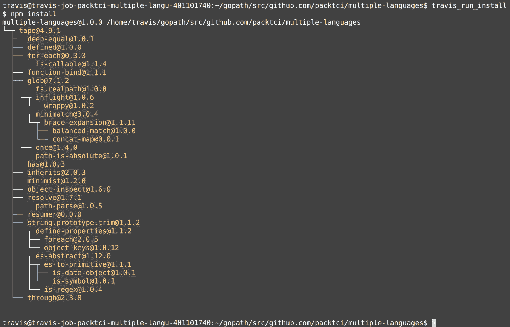

在`multiple-languages`存储库的 Travis YML 脚本中，我们有以下条目：

```
install:
 - npm install
```

请注意，这正是在运行`travis_run_install`便利函数时运行的内容。

接下来，我们运行`travis_run_script`便利函数，该函数运行在 Travis `script`生命周期事件中定义的任何脚本：

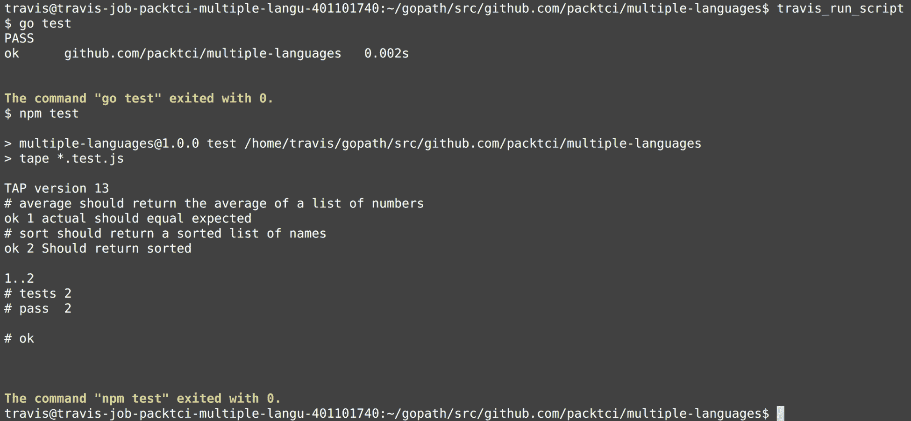

在`multiple-languages`存储库的 Travis YML 脚本中，我们在`script`生命周期事件中有以下条目：

```
script:
 - go test
 - npm test
```

如果我们指定了其他生命周期事件，我们可以使用剩余的便利 Bash 函数。

# tmate shell 会话操作

SSH shell 会话使用了 tmux 的分支（[`github.com/tmux/tmux`](https://github.com/tmux/tmux)），这是一个名为 tmate 的终端复用程序（[`tmate.io/`](https://tmate.io/)），您可以使用它打开窗口，滚动历史记录等。

+   如果您按下*Control-b* ，您将能够上下滚动您的命令历史记录

![

+   要退出历史滚动模式，只需按下字母*q*。

+   如果您按下*Control-b c*，您将创建一个可以使用的新窗口。

+   如果您按下*Control-b [0..9]*，则可以在您创建的任何新窗口之间切换。请注意，这里的括号意味着，例如，Control-b 0，Control-b 1 等，以切换窗口会话。

# Travis Web UI 日志

您当然可以在 Travis CI 中记录一些环境变量，但要小心，不要在日志中记录秘密信息。

# Travis CI 采取的步骤来保护您的特定于环境的变量

Travis CI 默认会隐藏诸如令牌和环境变量之类的任何变量，并简单地显示字符串`[secure]`。

如果您转到构建＃3 [`travis-ci.org/packtci/puppeteer-headless-chrome-travis-yml-script/builds/398696669`](https://travis-ci.org/packtci/puppeteer-headless-chrome-travis-yml-script/builds/398696669))，您将看到以下条目：


请记住，我们在此存储库中添加了以下加密环境变量第十章中的*Travis CI CLI 命令和自动化*：

```
travis encrypt SECRET_VALUE=SuperSecret12345 --add
```

请注意，此命令将以下条目添加到 Travis YML 脚本中：

```
env:
 global:
 secure: 
WLiuzi0CTx/ta5zuoU5K2LeZgzrAhWATUjngx++Azz7Tw4+XqbxeHZ/6ITymE1YLDRMxdIh8hItvkoNCbPmJ6q1To6bdirloWZq2rlZ5BPGYfVY3cuoUuxTAz1uhhfnngkqd76eJfB4lBUfOIVNAg2rpI7QFAQr1aiIKxjthiTms57fR4dusEi/efVO90I7yzFtyxEa0tLTgW9x+dPSt2ApmJ0EP9tftk7M7Uw/F2Gm1/AzWpM1Blklm/iEHF3ZY6Ij/V+ZG2SCpfrF88m50a8nJF1a+KttZz/TTbwqA58dXNokxcD30HB468/oaGMTJxYLFmG3QMfbXuP2wUkuinIEWQxGBEDh3uw11ZhypCGVNvE6vbRpdIIzywcVcX95G1px+Dgcil+c8AebO1wbWlDXMuWNQHC7JjdQspvLUtsLeyyei3LKshTY7LktvhJEG/+sgd5sejeqnzFmLmC9TdbCazLMFWzqhl+SBcmQtFNVuqAGBlMFlT1l54zFnZl7mixetVeBziuS7xGG3XXm0BsYIQnkcJYxNGv8JrFMSoqBTdQV4C20UyyXAw8s+5lu6dGziiMPSUK4KUSVPJ3hyeNiGhLTBsJn4bnTPiJ5ilVdyNM8RD8X2EJRImT3uvGvuFqHraCBrBuZVaW4RtbGX0JYYtMMMr/P84jKrNC3iFD8=
```

请记住，Travis 作业日志中只显示字符串`[secure]`代替此环境变量。

# Travis CI 部署概述和调试

我们在*第三章，持续交付的基础知识*中讨论了软件部署，但是为了回顾一下，部署是开发人员创建的软件的最终产品，您的最终用户将使用它。部署通常在成功的 CI/CD 流水线结束时完成。请记住，CI/CD 流水线可以包括提交阶段，在该阶段构建任何二进制文件并运行单元测试套件，然后是第二阶段，可能运行集成测试，然后可能是第三阶段，包括负载测试和/或安全测试，最后是第四阶段，包括一套验收测试。只有当所有 CI/CD 流水线的阶段都成功完成时，才应启动部署流水线。

在 Travis CI 中部署相对容易/请记住，您可以使用 Travis CLI 轻松设置一些部署工具。

# Travis CI 中支持的提供商

以下是一些支持的提供商，您可以在 Travis CI 中用于部署：

+   AWS CodeDeploy ([`docs.travis-ci.com/user/deployment/codedeploy/`](https://docs.travis-ci.com/user/deployment/codedeploy/))

+   AWS Elastic Beanstalk ([`docs.travis-ci.com/user/deployment/elasticbeanstalk/`](https://docs.travis-ci.com/user/deployment/elasticbeanstalk/))

+   AWS Lambda ([`docs.travis-ci.com/user/deployment/lambda/`](https://docs.travis-ci.com/user/deployment/lambda/))

+   AWS S3 ([`docs.travis-ci.com/user/deployment/s3/`](https://docs.travis-ci.com/user/deployment/s3/))

+   Azure Web App ([`docs.travis-ci.com/user/deployment/azure-web-apps/`](https://docs.travis-ci.com/user/deployment/azure-web-apps/))

+   Bluemix CloudFoundry ([`docs.travis-ci.com/user/deployment/bluemixcloudfoundry/`](https://docs.travis-ci.com/user/deployment/bluemixcloudfoundry/))

+   Chef Supermarket ([`docs.travis-ci.com/user/deployment/chefsupermarket/`](https://docs.travis-ci.com/user/deployment/chefsupermarket/))

+   CloudFoundry ([`docs.travis-ci.com/user/deployment/cloudfoundry/`](https://docs.travis-ci.com/user/deployment/cloudfoundry/))

+   GitHub Pages ([`docs.travis-ci.com/user/deployment/pages/`](https://docs.travis-ci.com/user/deployment/pages/))

+   GitHub Releases ([`docs.travis-ci.com/user/deployment/releases/`](https://docs.travis-ci.com/user/deployment/releases/))

+   Google App Engine ([`docs.travis-ci.com/user/deployment/google-app-engine/`](https://docs.travis-ci.com/user/deployment/google-app-engine/))

+   Google Cloud Storage ([`docs.travis-ci.com/user/deployment/gcs/`](https://docs.travis-ci.com/user/deployment/gcs/))

+   Google Firebase ([`docs.travis-ci.com/user/deployment/firebase/`](https://docs.travis-ci.com/user/deployment/firebase/))

+   Heroku ([h](https://docs.travis-ci.com/user/deployment/heroku/)[ttps://docs.travis-ci.com/user/deployment/heroku/](https://docs.travis-ci.com/user/deployment/heroku/))

+   OpenShift ([`docs.travis-ci.com/user/deployment/openshift/`](https://docs.travis-ci.com/user/deployment/openshift/))

+   npm ([`docs.travis-ci.com/user/deployment/npm/`](https://docs.travis-ci.com/user/deployment/npm/))

+   Surge.sh ([`docs.travis-ci.com/user/deployment/surge/`](https://docs.travis-ci.com/user/deployment/surge/))

有关支持的提供商的完整列表，请转到 Travis 用户文档([`docs.travis-ci.com/user/deployment/#Supported-Providers`](https://docs.travis-ci.com/user/deployment/#Supported-Providers))。

# Travis CI 中的 Heroku 设置

我们可以使用 Travis CLI 来帮助我们在`multiple-languages` ([`github.com/packtci/multiple-languages`](https://github.com/packtci/multiple-languages))存储库中设置 Heroku ([`www.heroku.com/platform`](https://www.heroku.com/platform))。

我们需要做的第一步是确保我们已经使用 Heroku CLI 登录到 Heroku，您可以在[`devcenter.heroku.com/articles/heroku-cli#download-and-install`](https://devcenter.heroku.com/articles/heroku-cli#download-and-install)下载并安装。一旦我们登录，我们将获得一个访问令牌，我们可以使用：

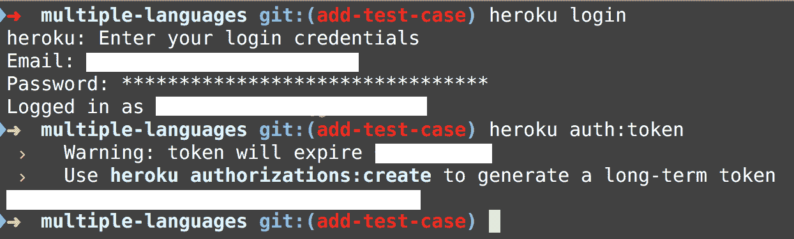

请注意，我们使用了`heroku auth:token`命令来打印出我们的访问令牌。

现在我们只需要使用`travis setup`命令进行设置：

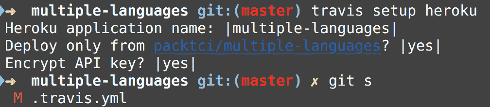

请注意，由于我们已经登录到 Heroku，我们不需要提供访问令牌，`travis setup`命令足够智能，可以为我们抓取它。

`travis setup` 命令会自动更新我们的 Travis YML 脚本，添加 Heroku 提供商信息，现在我们的 Travis TML 脚本看起来是这样的：

```
language: go

go:
 - '1.10'

env:
 - NODE_VERSION="6"

before_install:
 - nvm install $NODE_VERSION

install:
 - npm install

script:
 - go test
 - npm test

deploy:
 provider: heroku
 api_key:
 secure: ueVMBom+3LHS4xhXXi9hbPR8FIIS/z01Z7NW4hngea4WRHq3gU8AY70xz25w/FshMPtaHeCUdZ90eDDvLF5/hwI+9zup/XI4gONiTTOpxpiY3EyHkP2frra0sdSQhYBHETsq4hEQxODE83ClQjx2jCKM3LOTdzI6wrKXpI5UtoD73yIa7AbKCxl8IXGIeNePImyLe6Wl7ovfxq1zcXz5c6Tu6uIqO2VwkvILrQKB41Id6VQN1MpfY1kQMASuRwaiJQ8HCmi0NP8A067v0s83OM9bNVK+KXDTLsVyrovnpidUnVS/Gk2QDNz0Or5xEIM2iXCsQDoa8jGNSCNfPcXq3aYtl2hjgDSVnz28EoxYRBmx365UxzwRVpsgdf1b+sCfd9FBJge7xZqTCGwimoBJvrQH0qvgYzQ855EvmtEyBU5t0JRmU8x/Z74KryO24YHD/hSY0a1REPCnZqjBkBS5FHQprIJm5XQabwU/IOqPMdM1KvMYj34N+dxK0X92sf0TLSAv3/62oquQ7Lkhjl4nAsEa05v+kQNMQdLemYFBZi8/Qf6a4YQPNmLXmKwis1FLTzicccwPE8qJ2H3wPQRQUUZVYQxgjUkh5ni6ikqCkxmZRnNJgCbTWhw3ip1xaWjmm6jtvMhiWiUr6vDgIbvbty120ySBIe3k2P5ARW77fOA=

 app: multiple-languages
 on:
 repo: packtci/multiple-languages
```

# 在 Travis YML 脚本中调试失败

如果我们查看`multiple-languages`项目的构建 8.1（[`travis-ci.org/packtci/multiple-languages/jobs/403102478#L548`](https://travis-ci.org/packtci/multiple-languages/jobs/403102478#L548)），我们可以看到它出错了，正如屏幕截图所示，因为我们实际上在 Heroku 中没有名为`multiple-languages`的应用：

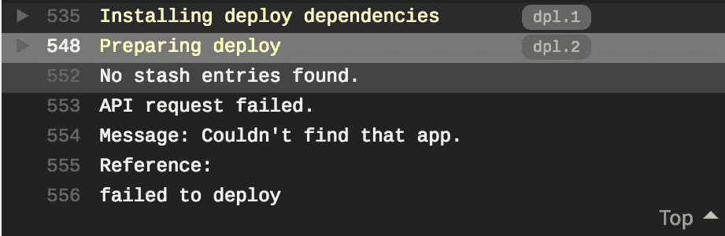

我们只需要在 Heroku 中创建一个名为`multiple-languages`的应用：

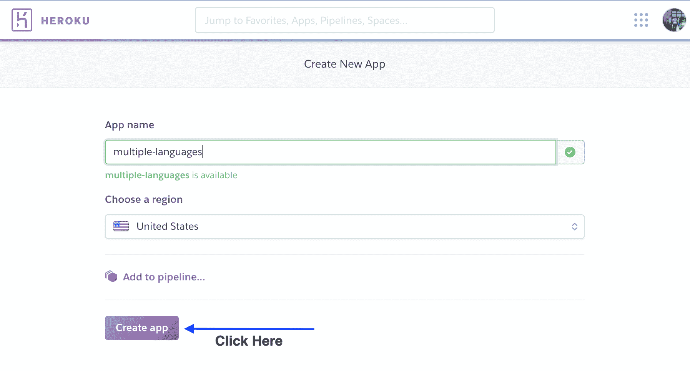

现在让我们使用`travis restart`命令在 Travis 中重新启动构建：

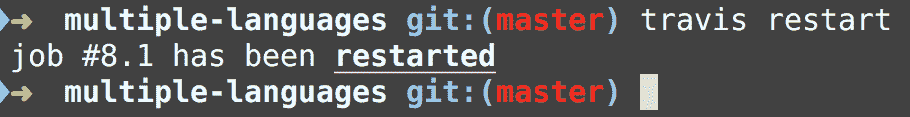

现在让我们再次查看构建 8.1 的作业日志：

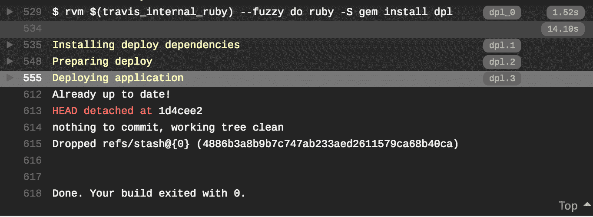

现在，如果我们查看 Heroku 仪表板，我们可以确认我们的应用已成功部署到 Heroku：

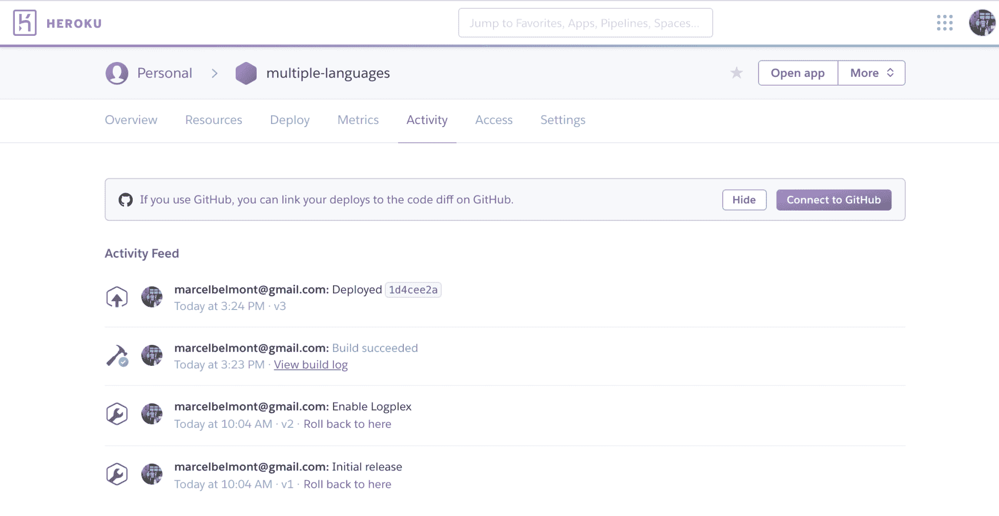

# 总结

在本章中，我们介绍了 Travis 作业日志的概述，并解释了作业日志的不同部分。我们查看了如何使用 Docker 在本地运行构建，并学习了如何使用 Travis API 启用调试模式构建。然后，我们查看了 Travis CI 采取的步骤来保护作业日志中的秘密和密钥。最后，我们查看了如何使用 Travis CLI 部署应用程序，然后查看了如何调试构建失败并在 Travis CI 中获得成功部署。

在下一章中，我们将解释如何在软件项目中设置 Circle CLI，然后介绍 Circle CI UI 的基础知识。

# 问题

1.  当您在 GitHub 中合并拉取请求时，是否会触发另一个构建？

1.  在运行脚本生命周期事件中，Travis 作业日志是否显示标签？

1.  我们如何在 Travis CI 中本地调试构建？

1.  调试构建模式是否适用于公共存储库？

1.  您将如何使用 Travis API 获取作业 ID？

1.  在运行调试模式构建时，您可以使用哪个方便的 bash 函数来进行 before_install 生命周期事件？

1.  您会使用哪个 Travis CLI 命令来设置添加 Heroku 等附加组件以进行部署？

# 进一步阅读

您可以在 Travis 用户文档中进一步探索调试选项和更高级的配置信息：[`docs.travis-ci.com/`](https://docs.travis-ci.com/)。
