# 第十二章：CircleCI 的安装和基础知识

在上一章中，我们展示了如何在本地调试 Travis CI 项目，并更详细地解释了 Travis CI 的 Web 界面。我们还看了如何在 Travis CI 中进行日志记录。本章将帮助您设置 CircleCI，并解释如何创建 Bitbucket 帐户，以及如何在新的 CircleCI 帐户上设置 GitHub 和 Bitbucket。我们将在 Bitbucket 中创建一个简单的 Java 项目，并为其运行 CircleCI 构建。我们还将讨论如何浏览 Bitbucket 的用户界面。最后，我们将通过创建一个新的 GitHub 存储库来结束本章，并讨论一个 CircleCI YML 脚本，该脚本将通过 Docker 镜像安装 Golang 并运行我们的单元测试。

本章将涵盖以下主题：

+   CircleCI 的介绍

+   CircleCI 和 Jenkins 的比较

+   CircleCI 先决条件

+   在 GitHub 中设置 CircleCI

+   在 Bitbucket 中设置 CircleCI

+   CircleCI 配置概述

# 技术要求

本章将需要一些基本的编程技能，并且我们将利用本章将讨论的一些持续集成/持续交付概念。如果您尝试自己创建 Bitbucket 帐户和 CircleCI 帐户，将会很有帮助。您可以按照*CircleCI 先决条件*部分中的步骤进行操作。我们将使用 Maven 创建一个基本的 Java 应用程序，因此了解一些 Java 的基本编程概念将会很有帮助，但如果您了解任何编程语言，应该也能够跟上。基本的 Git 和 Unix 知识将非常有帮助。

# CircleCI

CircleCI 是一个托管和自动化的**持续集成**（**CI**）构建解决方案。CircleCI 使用一个应用程序配置文件，使用 YAML（[`yaml.org/spec/1.2/spec.html`](http://yaml.org/spec/1.2/spec.html)）语法，例如 Travis YML 脚本，我们在第九章中讨论过，*Travis CI 的安装和基础知识*，到第十一章，*Travis CI UI 日志和调试*。由于 CircleCI 托管在云端，它具有快速在其他环境中设置的优势，以及在不同操作系统中使用而无需担心像 Jenkins CI 那样的设置和安装。因此，CircleCI 比 Jenkins 快得多。

# 比较 CircleCI 和 Jenkins

Jenkins 是一个自包含的开源自动化服务器，可以在组织级别进行定制和配置。还记得在 Jenkins CI 章节中，我们花了一些时间在 Windows、Linux 和 macOS 操作系统中安装 Jenkins。我们还可以根据自己的需求配置 Jenkins。虽然这对于在运营、DevOps 等方面拥有专门团队的软件公司来说非常好，但对于通常是孤独开发者为其个人项目设置环境的开源项目来说，情况就不那么理想了。

CircleCI 是围绕开源开发原则和易用性而设计的。在 GitHub 和 Bitbucket 平台上创建项目后，可以在几分钟内设置好 CircleCI。虽然在这方面 CircleCI 不像 Jenkins CI 那样可定制，但它具有快速设置的明显优势。CircleCI 使用应用程序配置文件，使用 YAML 语法，可以在 GitHub（[`github.com/`](https://github.com/)）平台以及 Bitbucket（[`bitbucket.org/`](https://bitbucket.org/)）平台上使用，不同于 Travis CI。

# CircleCI 先决条件

要开始使用 CircleCI，您需要在[`github.com/`](https://github.com/)创建 GitHub 帐户或在[`bitbucket.org/product`](https://bitbucket.org/product)创建 Bitbucket 帐户。

# 创建 GitHub 帐户

我们在第九章中详细介绍了如何创建 GitHub 帐户，在*创建 GitHub 帐户*部分。

# 创建 Bitbucket 帐户

我们将创建一个 Bitbucket 帐户，并再次使用用户名`packtci`作为我们的用户名：

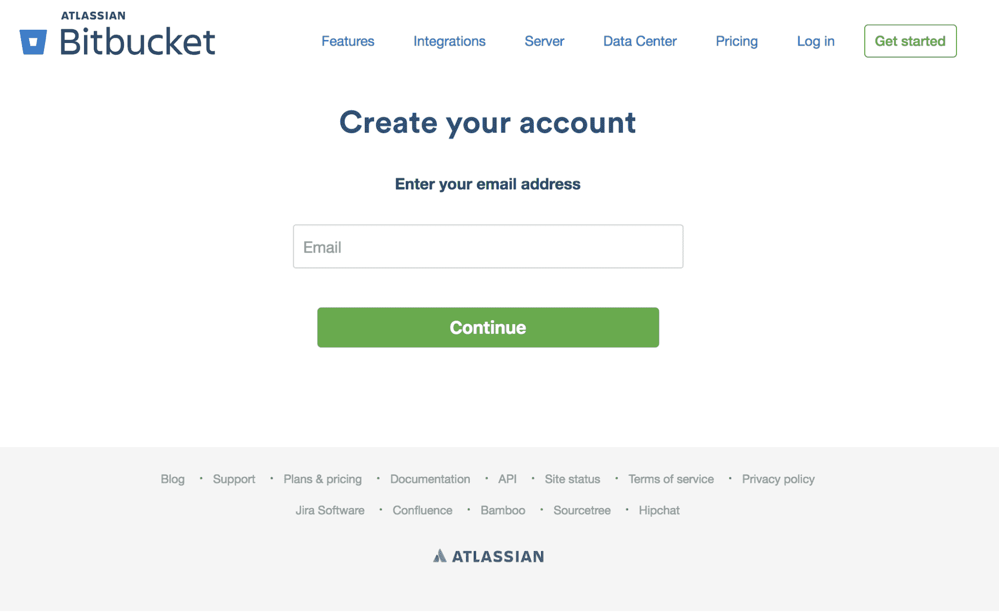

点击绿色的继续按钮后，您将被重定向到以下页面：

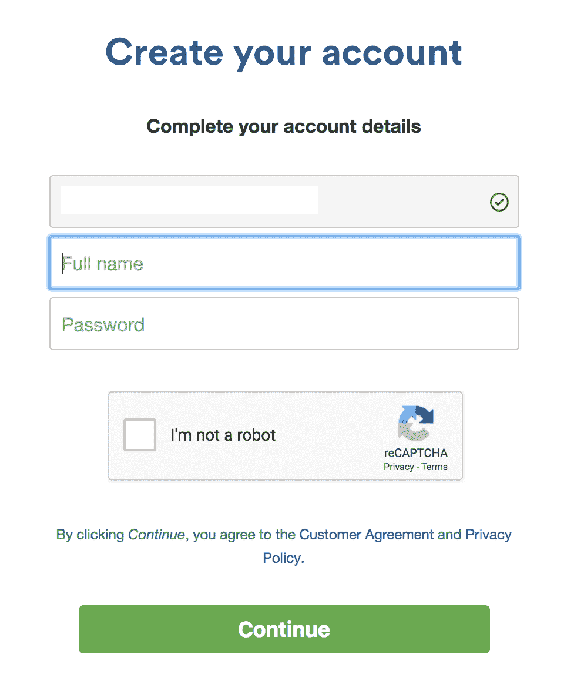

您需要输入您的全名和密码，您在上一页提供的电子邮件地址已经为您设置好。点击绿色的继续按钮后，您将收到一个新 Bitbucket 帐户的验证电子邮件，类似于以下内容：

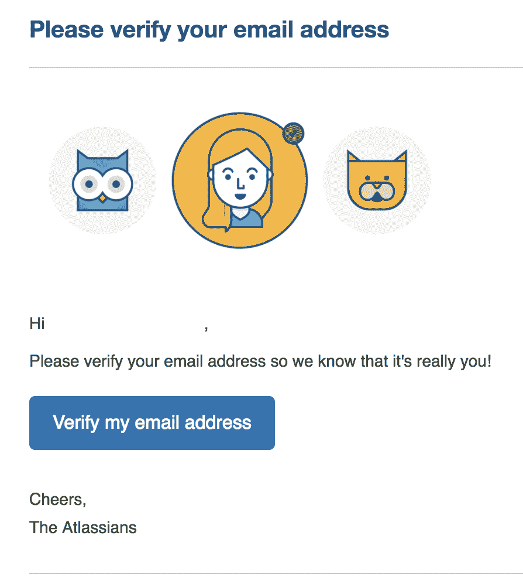

点击验证我的电子邮件地址按钮后，您将被重定向到以下页面：

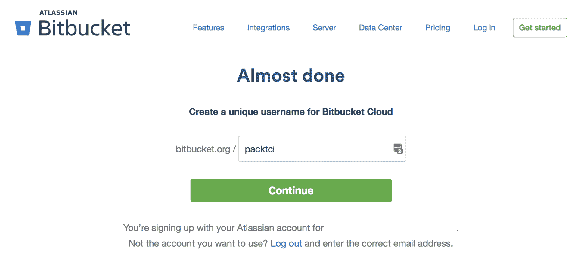

您必须为您的新 Bitbucket 帐户提供一个唯一的用户名，因为您不能使用任何现有的用户名。点击继续按钮后，您将被路由到以下页面：


您可以通过点击跳过按钮来跳过此部分，或者您可以输入您的信息，然后点击提交按钮，您将被路由到以下页面：

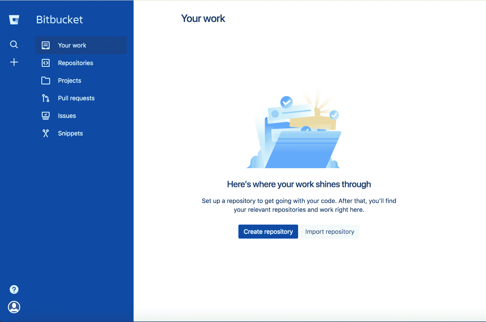

# 创建 CircleCI 帐户

您需要创建一个 CircleCI 帐户才能开始使用 CircleCI，您可以使用您的 GitHub 登录凭据或 Bitbucket 登录凭据：

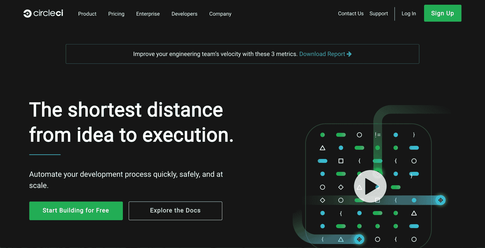

您需要点击注册按钮以创建一个新的 CircleCI 帐户，然后您将被重定向到以下页面：

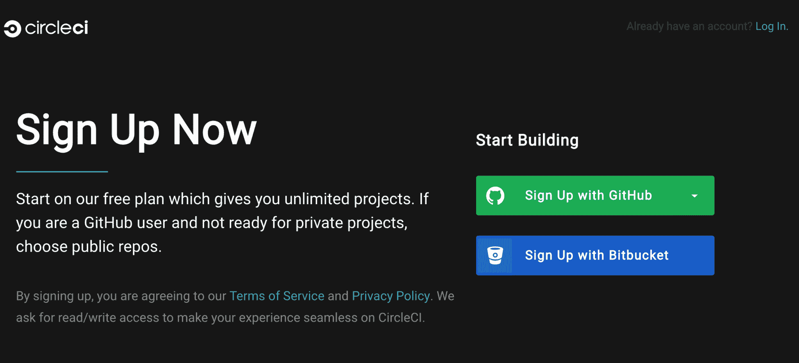

您可以选择其中一个进行注册，但我们将选择*使用 Bitbucket 注册**。一旦您点击按钮，您将被重定向到以下页面：

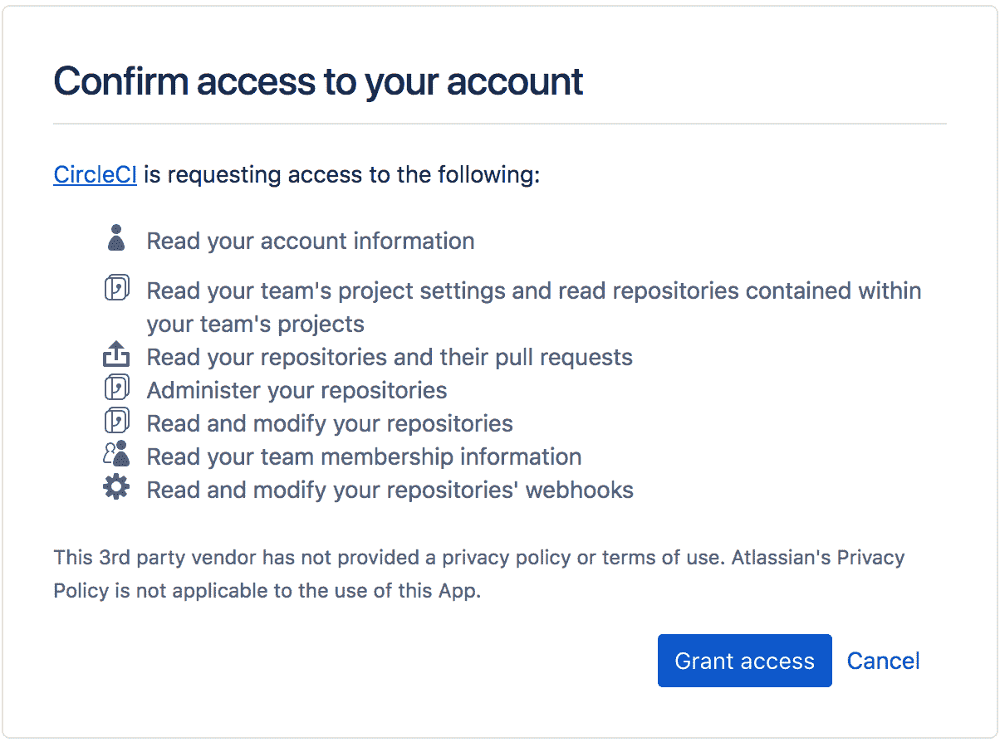

我们将点击授予访问权限按钮，然后我们将被路由到以下页面：

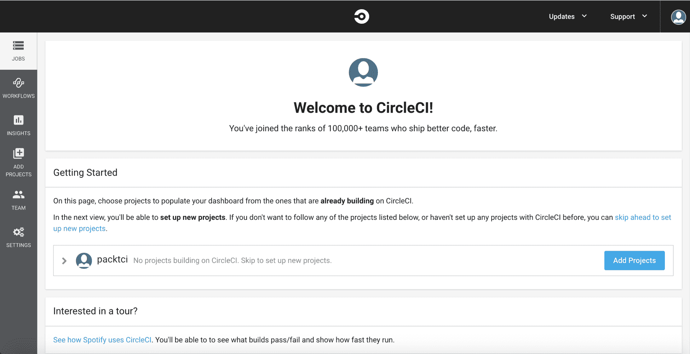

请注意，我们在 CircleCI 中没有设置任何项目，稍后需要添加项目。

即使我们注册了新的 Bitbucket 帐户，我们仍然可以将我们的 GitHub 帐户连接到我们的新 CircleCI 帐户。您需要点击屏幕右上角的头像，然后点击用户设置按钮：

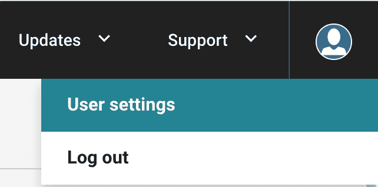

点击用户设置按钮后，您将被路由到显示帐户集成的页面。我们需要通过点击连接按钮将我们的 GitHub 帐户连接到 CircleCI：

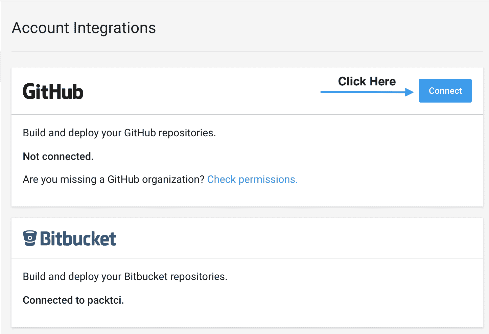

点击连接按钮后，您将被重定向到一个类似于此的授权 CircleCI 应用程序页面：

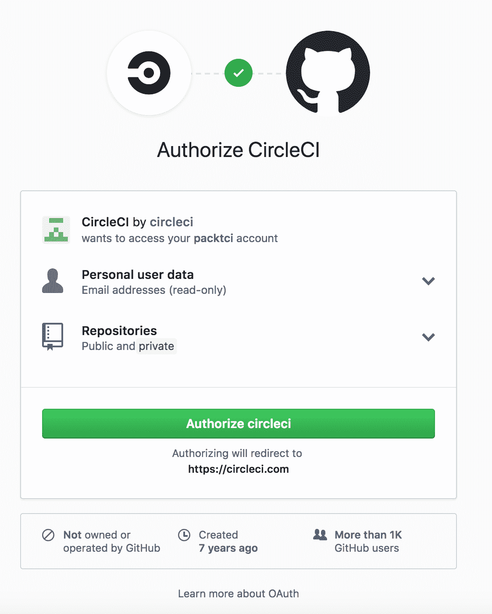

点击授权 circleci 按钮后，您将被重定向到 CircleCI 仪表板页面，现在您将分别拥有两个与您的 GitHub 帐户和 Bitbucket 帐户对应的`packtci`帐户：

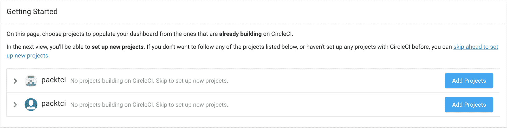

# 在 GitHub 中设置 CircleCI

让我们使用我们的`packtci` ([`github.com/packtci`](https://github.com/packtci)) GitHub 帐户，为 CircleCI 添加一个新项目`functional-summer` ([`github.com/packtci/functional-summer`](https://github.com/packtci/functional-summer))。我们需要做的第一件事是在仪表板上点击 GitHub 的添加项目按钮：


点击添加项目按钮后，您将被路由到以下页面：

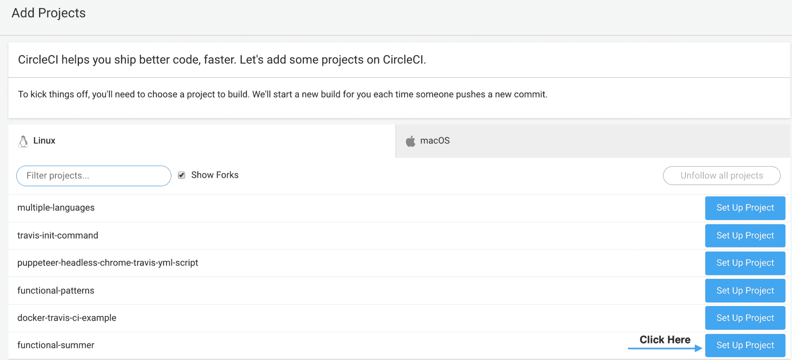

我们将点击`functional-summer` GitHub 存储库的设置项目按钮，并将被路由到一个类似这样的页面：

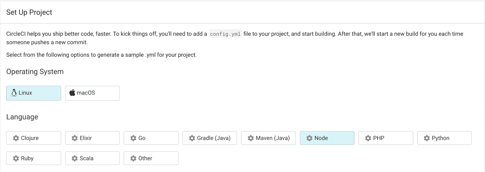

CircleCI 自动选择了 Node 作为我们的语言，因为我们有一个`package.json`文件，并且因为我们在这个存储库中有 JavaScript 文件。不过，我们还没有完成。如果您在此页面向下滚动，您将注意到一些启动 CircleCI 在我们项目中的下一步：

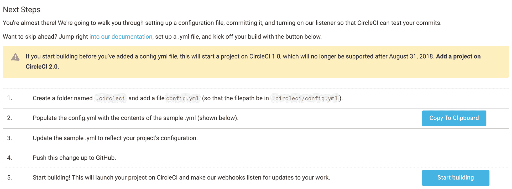

我们需要在项目的根目录中创建一个名为`.circleci`的文件夹，并在此文件夹中添加一个名为`config.yml`的文件。让我们使用 GitHub UI 创建这个文件夹和文件。我们将转到以下 URL：[`github.com/packtci/functional-summer`](https://github.com/packtci/functional-summer)。然后点击创建新文件按钮：

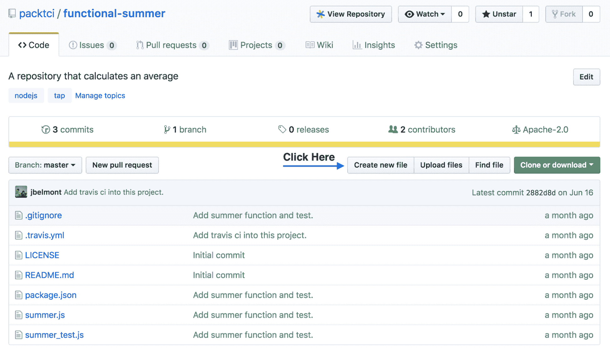

一旦我们点击此按钮，我们将被重定向到 GitHub UI 中的一个类似这样的页面：

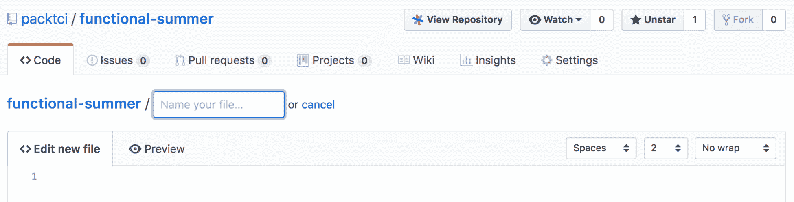

输入我们文件夹的名称为`.circleci`，然后输入`/`字符，然后命名我们的文件为`config.yml`。完成后，它将如下所示：


现在我们需要为我们的`config.yml`文件输入内容，`.circleci`为我们提供了一个样本`config.yml`文件，其中包含我们可以用于新的 CircleCI 项目的值：

```
# Javascript Node CircleCI 2.0 configuration file
#
# Check https://circleci.com/docs/2.0/language-javascript/ for more details
#
version: 2
jobs:
 build:
     docker:
     # specify the version you desire here
     - image: circleci/node:7.10

     # Specify service dependencies here if necessary
     # CircleCI maintains a library of pre-built images
     # documented at https://circleci.com/docs/2.0/circleci-images/
     # - image: circleci/mongo:3.4.4

     working_directory: ~/repo

     steps:
         - checkout

         # Download and cache dependencies
         - restore_cache:
             keys:
              - v1-dependencies-{{ checksum "package.json" }}
              # fallback to using the latest cache if no exact match is found
              - v1-dependencies-

         - run: yarn install

         - save_cache:
             paths:
                 - node_modules
             key: v1-dependencies-{{ checksum "package.json" }}

         # run tests!
         - run: yarn testSetup Circle CI in Atlassian Bitbucket
```

我们将在后面更详细地解释其中的内容，但现在我们将只需将其复制并粘贴到 GitHub UI 编辑器中，然后点击提交新文件按钮：

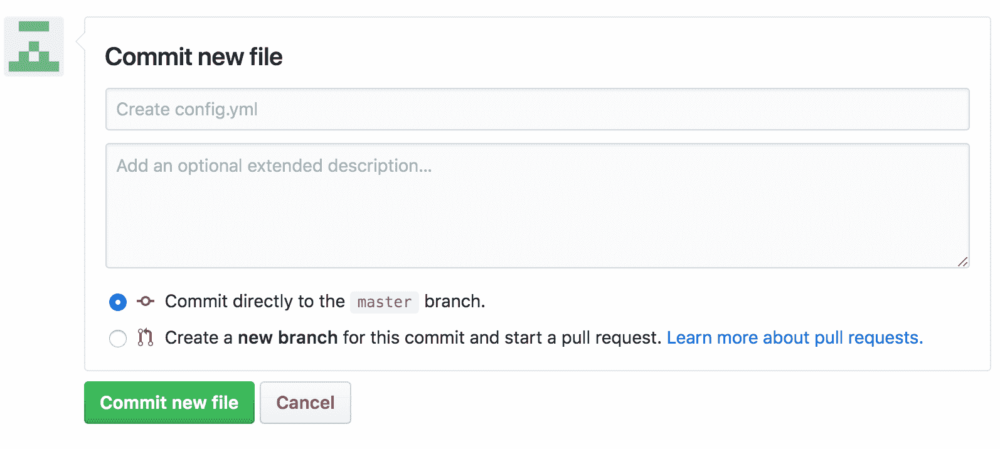

我们需要做的最后一步是回到 CircleCI 的添加项目页面，点击开始构建按钮，启动我们新配置的 CircleCI 项目： 


这也会在 CircleCI 中设置一个 Webhook，以便 CircleCI 监听我们提交到 GitHub 的任何新代码更改。

一旦我们点击开始构建按钮，我们将被重定向到我们的第一个构建作业，使用 CircleCI 构建`functional-summer`存储库：

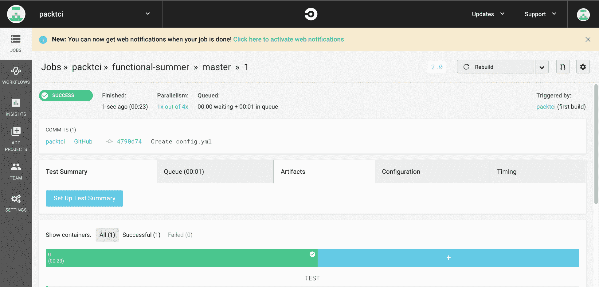

如果我们继续向下滚动，我们将在 CircleCI 应用程序中看到构建的每个步骤：

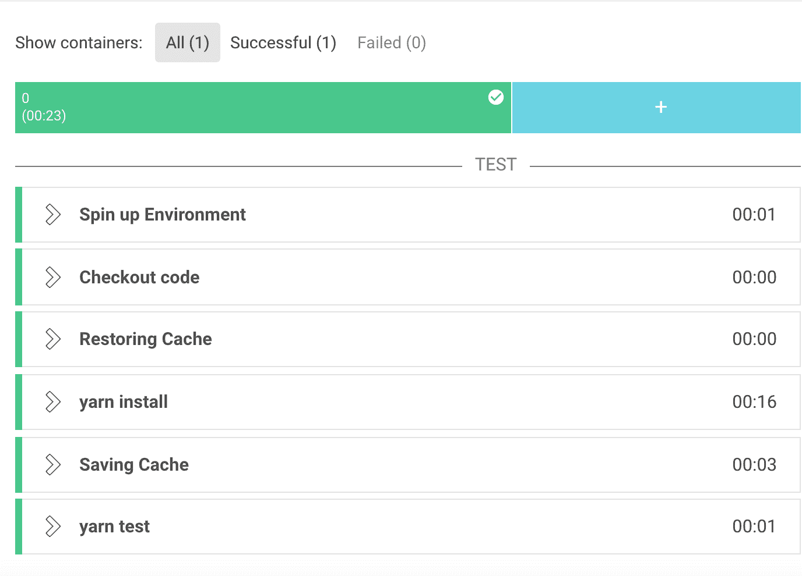

我们将在后面的章节中更详细地解释这一点，但每个步骤都可以展开以显示该步骤的详细信息。例如，如果我们点击 yarn test 步骤，我们将看到以下详细信息：

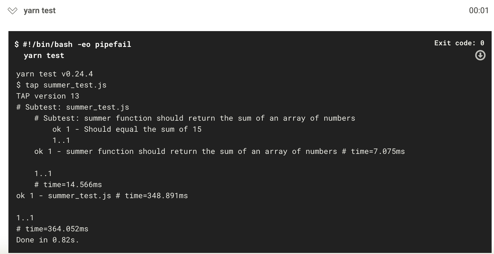

# 在 Bitbucket 中设置 CircleCI

由于我们刚刚创建了一个新的 Bitbucket 账户，我们需要将我们的 ssh 密钥上传到 Bitbucket，以便能够将更改推送到 Bitbucket。我们在第九章中介绍了如何创建 SSH 密钥，在*安装和 Travis CI 基础*章节中，*向新 GitHub 账户添加 SSH 密钥*部分，因此如果您还没有设置任何 SSH 密钥，请阅读该章节。我们已经在*第九章，安装和 Travis CI 基础*的*向新 GitHub 账户添加 SSH 密钥*部分创建了一个 SSH 密钥。我们只需要将公共 ssh 密钥复制到我们的系统剪贴板中，通过运行以下命令：

```
pbcopy < ~/.ssh/id_rsa_example.pub
```

一旦我们将公共 SSH 密钥复制到系统剪贴板中，我们需要转到 Bitbucket 的以下页面：

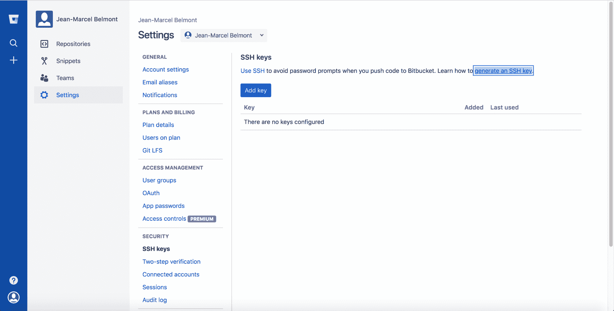

我们需要点击添加密钥按钮。这将打开一个模态窗口，我们在其中输入一个标签和我们的公钥的内容，看起来像这样：

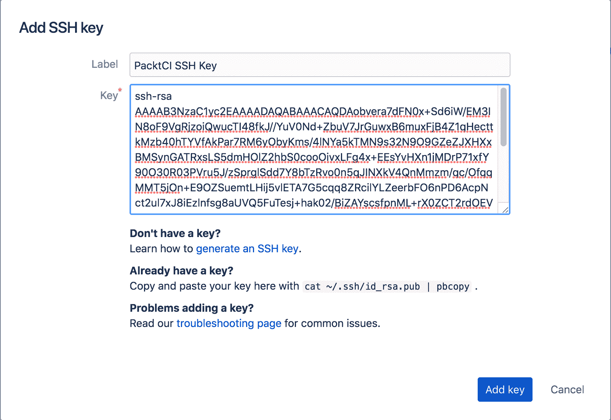

然后点击添加密钥按钮，现在我们已经准备好将更改推送到我们的 Bitbucket 账户。

# 在 Bitbucket 中使用 CircleCI 构建设置新的 Java 项目

我们将通过点击左侧导航窗格中的加号按钮在 Bitbucket 中创建一个名为`java-summer`的新 Java 项目：


接下来，我们将单击“存储库”按钮，它看起来像这样：

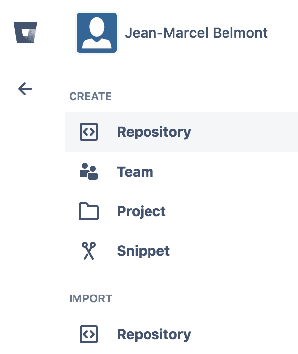

接下来，我们将通过提供存储库名称，将我们的版本控制系统设置为 Git，然后单击“创建存储库”按钮来创建一个新存储库：

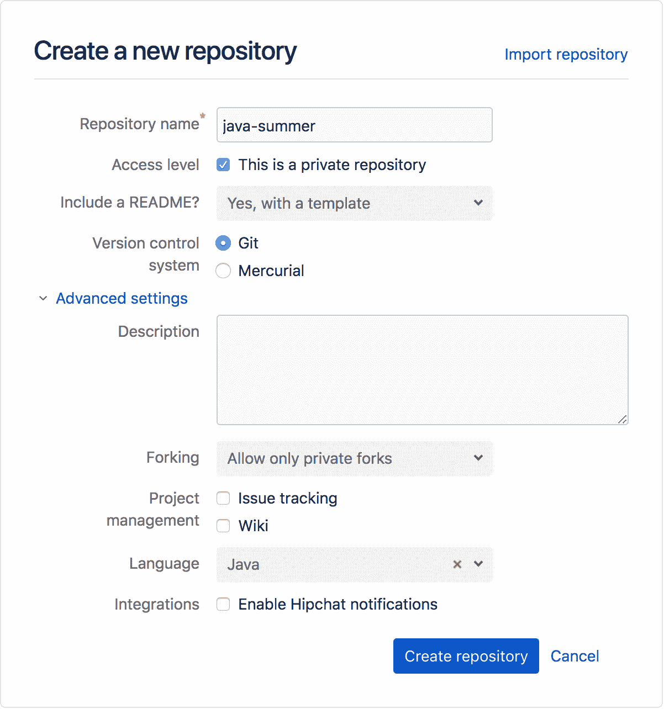

请注意，这里我们点击了可选的高级设置下拉菜单，并将我们的语言设置为 Java 编程语言。一旦我们点击创建存储库按钮，我们将被重定向到一个看起来像这样的页面：

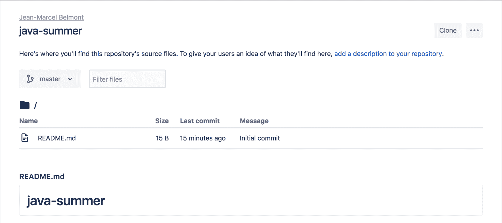

我们将使用 Maven 构建工具创建一个新的 Java 项目，该项目具有一个带有主目录和测试子目录的`src`目录。我们在第七章中详细解释了如何安装和使用 Maven 构建工具，*开发插件*，因此如果您尚未安装 Maven 并且不知道如何使用它，请重新阅读[第七章](https://cdp.packtpub.com/hands_on_continuous_integration_and_delivery/wp-admin/post.php?post=35&action=edit#post_30)，*开发插件*中的适当部分。

要使用 Maven 创建我们的新 Java 项目，我们将发出以下命令：

```
mvn archetype:generate -DgroupId=com.packci.app -DartifactId=java-summer -DarchetypeArtifactId=maven-archetype-quickstart -DinteractiveMode=false
```

我们首先通过在 shell 会话中发出以下命令来克隆我们的存储库：

```
git clone git@bitbucket.org:packtci/java-summer.git java-summer-proj
```

然后我们将复制克隆存储库中隐藏的`.git`目录的内容，并将其粘贴到我们用 Maven 构建工具创建的新`java-summer`文件夹中。假设我们有正确的路径结构，我们可以发出以下命令：

```
mv java-summer-proj/.git java-summer
```

然后我们可以删除`java-summer-proj`文件夹，然后`cd`进入`java-summer`文件夹。然后我们将使用 Java 语言示例配置，您可以在 CircleCI 文档的**language-java** ([`circleci.com/docs/2.0/language-java/`](https://circleci.com/docs/2.0/language-java/))中找到。我们将创建一个名为`.circleci`的文件夹，然后创建一个名为`config.yml`的文件。

我们将提交我们的更改并使用以下命令将其推送到 Bitbucket：

```
git push
```

现在，如果您查看 CircleCI 应用程序，我们可以通过单击应用程序左上角的 packtci Bitbucket 用户帐户来切换到该用户帐户，它看起来像这样：

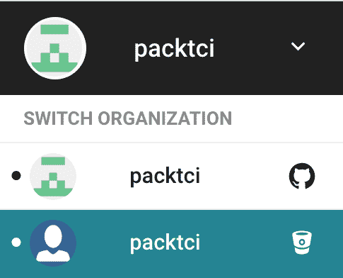

接下来，我们需要在左侧导航窗格中单击“添加项目”按钮，它看起来像这样：


然后我们需要单击“设置项目”按钮，以便 CircleCI 知道我们在 Bitbucket 中的`java-summer`存储库，它看起来像这样：

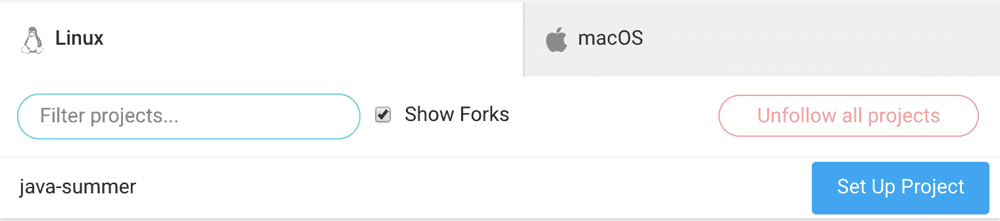

然后我们将被路由到设置项目页面，在这里我们需要选择我们的操作系统，默认情况下在 CircleCI 中为 Linux。然后我们选择我们的构建语言，在我们的情况下应该是 Java。为了清晰起见，我们将在以下截图中再次显示此页面：

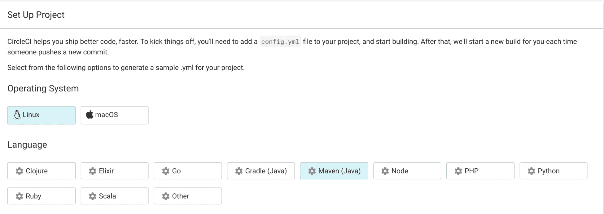

然后我们将把 CircleCI 为我们提供的示例配置文件复制到`.circleci/config.yml`文件中：

```
# Java Maven CircleCI 2.0 configuration file # # Check https://circleci.com/docs/2.0/language-java/ for more details # version: 2
jobs:
 build: docker:  # specify the version you desire here
  - image: circleci/openjdk:8-jdk

      # Specify service dependencies here if necessary
 # CircleCI maintains a library of pre-built images # documented at https://circleci.com/docs/2.0/circleci-images/ # - image: circleci/postgres:9.4    working_directory: ~/repo

    environment:
  # Customize the JVM maximum heap limit
  MAVEN_OPTS: -Xmx3200m

    steps:
  - checkout

      # Download and cache dependencies
  - restore_cache:
 keys:  - v1-dependencies-{{ checksum "pom.xml" }}
          # fallback to using the latest cache if no exact match is found
  - v1-dependencies-

      - run: mvn dependency:go-offline

      - save_cache:
 paths:  - ~/.m2
          key: v1-dependencies-{{ checksum "pom.xml" }}

      # run tests!
  - run: mvn integration-test
```

接下来，我们将提交更改并将其推送到 Bitbucket 版本控制系统，然后我们需要滚动到“下一步”部分，然后简单地单击“开始构建”按钮，它看起来像这样：


这将触发我们对`java-summer`项目的第一次构建，并使 webhook 为存储库工作。一旦我们点击“开始构建”按钮，我们需要点击“作业”按钮，以查看我们触发的新构建：


现在，为了测试 Webhooks 是否监听 Bitbucket 中的代码更改，让我们对`java-summer`文件进行更改，以便它实际上有一个对值数组求和的函数，并使用 JUnit([`junit.org/junit4/javadoc/latest/`](https://junit.org/junit4/javadoc/latest/))添加一个单元测试用例。

让我们在应用文件中添加一个静态函数，就像这样：

```
public static int average(int[] numbers) {
    int sum = 0;
 for (int i = 0; i < numbers.length; i++) {
        sum += numbers[i];
  }
    return sum; }
```

然后让我们添加一个测试用例来测试平均函数，就像这样使用 JUnit：

```
public void testaverage() {
    App myApp = new App();
 int[] numbers = {
            1, 2, 3, 4, 5
  };
  assertEquals(15, myApp.average(numbers)); }
```

我们可以使用`mvn package`命令在本地测试更改，以确保没有出现问题，然后提交我们的更改并将这些更改推送到 Bitbucket 版本控制系统。我们现在应该注意到，由于我们对主分支的代码更改，CircleCI 自动触发了一个构建。

如果我们回到 CircleCI Web 应用程序，我们可以看到触发了一个新的构建，并且通过了：


请注意，在上面的屏幕截图中，CircleCI 显示第二次构建已经触发。它还显示了提交 SHA 哈希和提交消息，并确认构建成功。

# CircleCI 配置概述

CircleCI 使用 YAML([`yaml.org/spec/1.2/spec.html`](http://yaml.org/spec/1.2/spec.html))作为其配置语言的数据序列化语言，Travis CI 也是如此。

# CircleCI 配置概述

我们将在后面的章节中讨论 CircleCI 中的许多概念和配置选项，但是作为概述，让我们看一下基本的`config.yml`文件，并解释一些概念。我们将在 GitHub 中使用我们的`packtci`([`github.com/packtci`](https://github.com/packtci)) Github 用户创建一个新的存储库。您可以在[`github.com/packtci/go-template-example-with-circle-ci`](https://github.com/packtci/go-template-example-with-circle-ci)找到新的存储库。我们还将在 Golang 中创建一个解析模板的函数。然后编写一个解析模板文本的测试用例，然后创建一个 CircleCI `config.yml`文件。我们将把这些代码更改推送到 GitHub，然后最终使用 CircleCI 设置这个新项目。

# 将源文件添加到新的存储库

在新的存储库中，我们添加了一个名为`template.go`的文件，这是我们将要测试的函数：

```
func  parseTemplate(soldier Soldier, tmpl string) *bytes.Buffer { var  buff  =  new(bytes.Buffer) t  := template.New("A template file") t, err  := t.Parse(tmpl) if err !=  nil { log.Fatal("Parse: ", err) return buff } err  = t.Execute(buff, soldier) if err !=  nil { log.Fatal("Execute: ", err) return buff } return buff }
```

我们在`template_test.go`文件中添加了以下单元测试用例来测试`parseTemplate`函数：

```
func  TestParseTemplate(t *testing.T) { newSoldier  := Soldier{ Name: "Luke Cage", Rank: "SGT", TimeInService: 4, } txt  :=  parseTemplate(newSoldier, templateText) expectedTxt  :=  ` Name is Luke Cage Rank is SGT Time in service is 4 ` if txt.String() != expectedTxt { t.Error("The text returned should match") } }
```

然后我们将以下 CircleCI YML 脚本添加到存储库中：

```
version: 2 jobs: build: docker: - image: circleci/golang:1.9 working_directory: /go/src/github.com/packtci/go-template-example-with-circle-ci steps: - checkout - run: name: "Print go version" command: go version - run: name: "Run Unit Tests" command: go test
```

在 CircleCI YML 脚本中添加的第一件事是版本([`circleci.com/docs/2.0/configuration-reference/#version`](https://circleci.com/docs/2.0/configuration-reference/#version))字段。这是一个必填字段，目前**版本 1**仍然受支持，但很快将被弃用，因此建议使用 CircleCI YML 语法的**版本 2**。您可以在以下 CircleCI 博客文章中了解更多信息：[`circleci.com/blog/sunsetting-1-0/`](https://circleci.com/blog/sunsetting-1-0/)。

在这个`config.yml`脚本中，我们接下来要讨论的是作业([`circleci.com/docs/2.0/configuration-reference/#jobs`](https://circleci.com/docs/2.0/configuration-reference/#jobs))字段，它由一个或多个命名作业组成。在我们的情况下，我们有一个名为 build 的作业，如果我们不使用 workflows 字段，则需要这个构建作业。我们将在后面的章节中更详细地讨论这个问题。

然后我们有一个名为`docker`的字段，其中包含了 Golang 的语言镜像。我们还可以有一个服务镜像来运行特定的服务，这将在后面的章节中讨论。

然后我们有一个名为`steps`的字段，它定义了我们想要在 CircleCI 构建中执行的步骤。请注意，`steps`字段中有三个字段条目，分别是`checkout`和两个`run` ([`circleci.com/docs/2.0/configuration-reference/#jobs`](https://circleci.com/docs/2.0/configuration-reference/#jobs)) 命令。run 命令有一个名称和一个命令，但您也可以省略名称，只给出一个命令。

# 新存储库的 CircleCI 构建作业

以下截图显示 CircleCI 构建已通过：

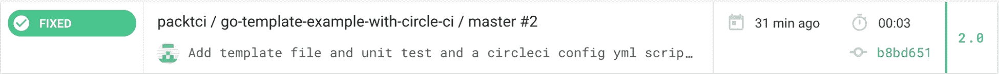

以下是构建作业中的步骤：

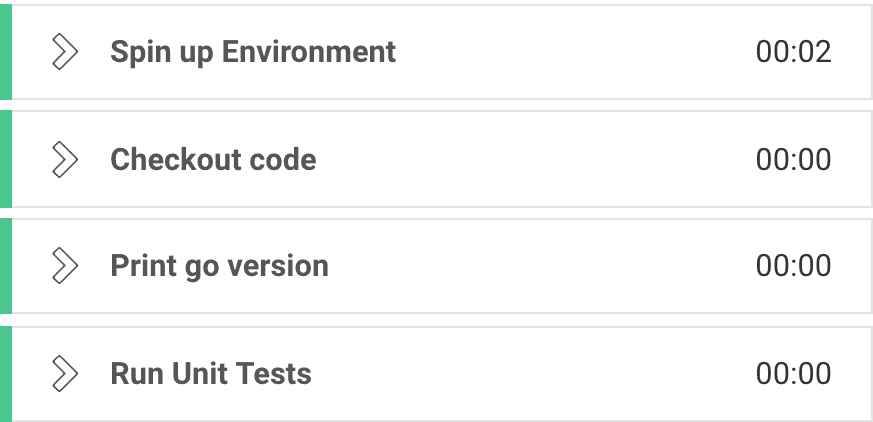

请注意，这里有一个额外的步骤称为 Spin up Environment。此步骤创建一个新的构建环境，特别是对于我们的构建，它创建一个 Golang Docker 镜像，然后设置一些特定于 CircleCI 的环境变量。

# 总结

在本章中，我们介绍了 CircleCI 和 Travis CI 之间的区别，并介绍了 CircleCI 的先决条件。我们创建了一个新的 Bitbucket 帐户，并解释了 Bitbucket UI 的基础知识以及在 Bitbucket 中上传 SSH 密钥以访问存储库的位置。然后我们在 GitHub 和 Bitbucket 中设置了 CircleCI，并解释了 CircleCI Web 应用程序的部分内容以及如何在其中导航。最后，我们简要概述了 CircleCI YAML 配置语法。在下一章中，我们将介绍 CircleCI 命令，并介绍 CircleCI 的一些更高级主题，例如工作流程。

# 问题

1.  Jenkins 和 Travis CI 之间的主要区别是什么？

1.  CircleCI 可以在 Bitbucket 和 GitHub 中都使用吗？

1.  在 CircleCI 中如何设置存储库？

1.  如何在 CircleCI 中查看构建作业？

1.  我们在 Bitbucket 的`java-summer`存储库中使用了哪个构建工具？

1.  应该使用 CircleCI 语法的版本 1 吗？

1.  在 CircleCI 的`config.yml`脚本中，我们在哪个字段中输入我们的构建语言？

# 进一步阅读

您可以通过查看[`circleci.com/docs/2.0/.`](https://circleci.com/docs/2.0/)官方 CircleCI 文档，进一步探索 CircleCI 的概念。
