# CircleCI UI 日志记录和调试

在上一章中，我们深入介绍了 CircleCI CLI 命令，并向您展示了一些自动化任务的技术。在本章中，我们将深入介绍作业日志，并更详细地解释运行步骤。我们将解释工作流程的概念，并向您展示如何使用 CircleCI API 查找项目的最新构建。我们将介绍如何通过在构建中实现缓存来调试慢作业，并最后使用一些故障排除技术来运行具有本地配置 YML 脚本的构建。

本章将涵盖以下主题：

+   作业日志概述

+   在 CircleCI 中调试慢构建

+   日志记录和故障排除技术

# 技术要求

在本章中，我们将介绍一些关于使用 RESTful API 的概念，并将使用`curl`实用程序进行 REST 调用，因此了解 API 是什么以及如何使用 REST 客户端（如`curl`）将是有益的。了解 Unix 编程环境的基本概念也会有所帮助，了解脚本编写和 Bash 环境是有益的。

本章的代码文件可以在以下链接找到：

+   [`github.com/packtci/circleci-jobs-example`](https://github.com/packtci/circleci-jobs-example)

+   [`github.com/packtci/go-template-example-with-circle-ci`](https://github.com/packtci/go-template-example-with-circle-ci)

# 作业日志概述

CircleCI 中的作业日志与 Travis CI 中的不同，因为每个作业中的每个步骤都在单独的非登录 shell 中运行，并且 CircleCI 为作业中的每个步骤设置了一些智能默认值。

# 默认构建作业中的运行步骤

我们将创建一个新的存储库，以演示默认构建作业中的多个作业。该存储库将被称为`circleci-jobs-example`（[`github.com/packtci/circleci-jobs-example`](https://github.com/packtci/circleci-jobs-example)），并将在构建作业中有多个运行声明。我们将使用 Node.js 作为我们的首选编程语言进行演示。请记住，我们需要将新项目添加到 CircleCI 中，以便它能够了解我们的项目。在之前的章节中，我们使用 CircleCI Web UI 添加了项目，但让我们使用 CircleCI API 将新项目添加到 CircleCI 中。

# 通过 API 将项目添加到 CircleCI

我们在第十三章中学习了如何使用 CircleCI API，因此请阅读该章节的*使用 CircleCI API*部分，以获取有关使用 API 的更多详细信息。如果您已经阅读过这部分内容，那么您已经有一个可以使用的 API 令牌。关于在 CircleCI 上关注新项目的 API 端点（[`circleci.com/docs/api/v1-reference/#follow-project`](https://circleci.com/docs/api/v1-reference/#follow-project)）显示您需要进行`POST HTTP`请求并将 API 令牌作为查询字符串参数添加。

# 使用 curl 作为 REST 客户端

我们已经在整本书中使用`curl`作为 REST 客户端，所以您现在应该熟悉如何使用它。我们将向以下端点进行`POST`请求：`https://circleci.com/api/v1.1/project/:vcs-type/:username/:project/follow?circle-token=:token`：

```
curl -X POST "https://circleci.com/api/v1.1/project/github/packtci/circleci-jobs-example/follow?circle-token=$CIRCLECI_API_TOKEN_GITHUB"
```

在这里，我们使用了一个名为`CIRCLECI_API_TOKEN_GITHUB`的环境变量，该变量在我们的本地环境中设置，并且我们从 API 中获得了以下响应：

```
{
  "following" : true,
  "workflow" : false,
  "first_build" : {
    "compare" : null,
    "previous_successful_build" : null,
    "build_parameters" : null,
    "oss" : true,
    "committer_date" : null,
    "body" : null,
    "usage_queued_at" : "2018-08-04T21:36:26.982Z",
    "fail_reason" : null,
    "retry_of" : null,
    "reponame" : "circleci-jobs-example",
    "ssh_users" : [ ],
    "build_url" : "https://circleci.com/gh/packtci/circleci-jobs-example/1",
    "parallel" : 1,
    "failed" : null,
    "branch" : "master",
    "username" : "packtci",
    "author_date" : null,
    "why" : "first-build",
    "user" : {
      "is_user" : true,
      "login" : "packtci",
      "avatar_url" : "https://avatars3.githubusercontent.com/u/40322425?v=4",
      "name" : null,
      "vcs_type" : "github",
      "id" : 40322425
    },
    "vcs_revision" : "abc2ce258b44700400ec231c01529b3b6b8ecbba",
    "vcs_tag" : null,
    "build_num" : 1,
    "infrastructure_fail" : false,
    "committer_email" : null,
    "previous" : null,
    "status" : "not_running",
    "committer_name" : null,
    "retries" : null,
    "subject" : null,
    "vcs_type" : "github",
    "timedout" : false,
    "dont_build" : null,
    "lifecycle" : "not_running",
    "no_dependency_cache" : false,
    "stop_time" : null,
    "ssh_disabled" : true,
    "build_time_millis" : null,
    "picard" : null,
    "circle_yml" : {
      "string" : "version: 2\njobs:\n build:\n docker:\n - image: circleci/node:8.11.3\n steps:\n - checkout\n - run:\n name: Install Dependencies\n command: npm install\n - run:\n name: Run the Sort Test to sort by first name\n command: $(npm bin)/tape sort_test.js\n - run:\n name: Compute Standard Deviation\n command: $(npm bin)/tape standard_deviation_test.js\n - run:\n name: Find the Text and Replace It\n command: $(npm bin)/tape find_text_test.js\n - run: |\n echo \"Generate Code Coverage\"\n npm test\n echo \"Show the coverage\"\n npm run coverage\n "
    },
    "messages" : [ ],
    "is_first_green_build" : false,
    "job_name" : null,
    "start_time" : null,
    "canceler" : null,
    "platform" : "2.0",
    "outcome" : null,
    "vcs_url" : "https://github.com/packtci/circleci-jobs-example",
    "author_name" : null,
    "node" : null,
    "canceled" : false,
    "author_email" : null
  }
}
```

# 从 JSON 响应中解析 build_url 属性

让我们使用终端 shell 会话中的 cat 实用程序将此响应保存到一个名为`circleci-jobs-example-follow.json`的新文件中，就像这样：

```
cat > circleci-jobs-example-follow.json
# Paste the JSON Content from System Clipboard
# Press Enter
# Finally Press enter
```

现在让我们使用`jq`（[`stedolan.github.io/jq/manual/`](https://stedolan.github.io/jq/manual/)）并在 JSON 负载中找到`build_url`属性：

```
cat circleci-jobs-example-follow.json | jq '.first_build.build_url'
```

此命令返回以下构建 URL：`https://circleci.com/gh/packtci/circleci-jobs-example/1`。

现在你可以打开浏览器并粘贴此 URL，或者你可以使用操作系统上可用的命令行实用程序。我们将在 macOS 中使用`open`实用程序，就像这样：

```
open https://circleci.com/gh/packtci/circleci-jobs-example/1
```

前面的命令将在 macOS 中打开默认浏览器并使用您提供的 URL。在 Linux 中，您可能可以使用`xdg-open`，`gnome-open`或`kde-open`，具体取决于您安装的操作系统。无论哪种方式，您都可以简单地打开浏览器并粘贴构建 URL 的条目。

# CircleCI Web UI 作业日志分析

当我们打开通过 API 触发的新工作的 URL 时，UI 的第一部分看起来像这样：

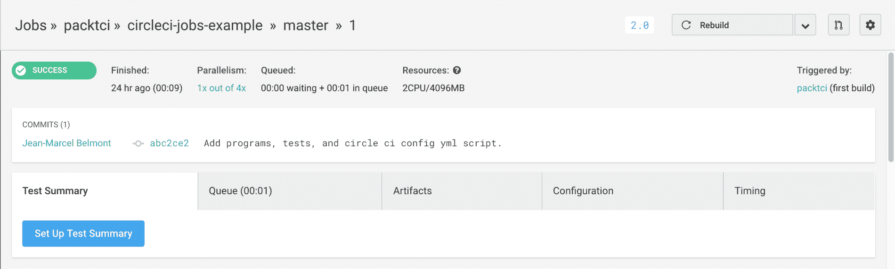

在这里，顶部显示基本信息，例如提交 SHA 哈希、贡献者信息和其他背景信息。如果您在作业日志中进一步向下滚动，您将看到作业的每个部分中运行的步骤：

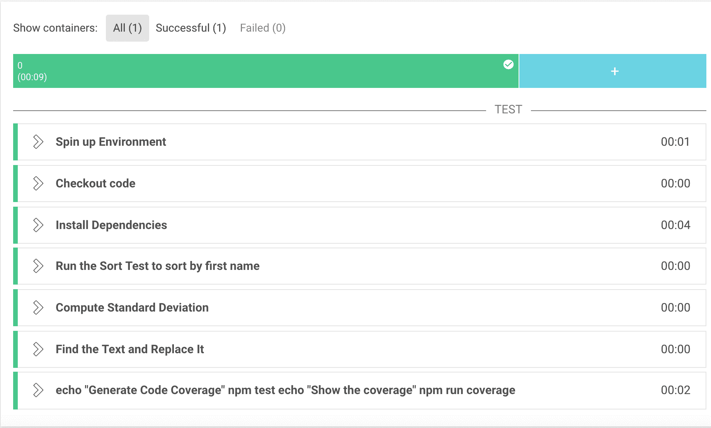

构建完成需要 9 秒，注意到每个构建步骤都有自己的部分，这些部分都很方便地折叠起来。您只需点击每个部分即可获取步骤的详细信息。每个步骤的名称对应于配置 YML 脚本中的`name`字段。

请注意，多行命令的名称使用完整命令的名称作为其名称。

这是多行命令的条目：

```
...
- run: | echo "Generate Code Coverage" npm test echo "Show the coverage" npm run coverage
```

如果我们展开一个步骤，我们将看到每个步骤都有以下共同的条目：

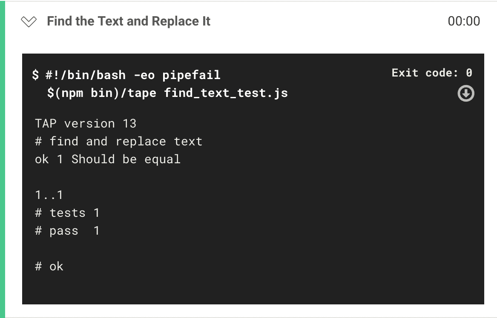

**Shebang**行`#!/bin/bash -eo pipefail`为非登录 shell 设置了一些明智的默认值。

Bash 选项`-e`表示如果语句返回非真值，则脚本应该退出。Bash 选项`-o pipefail`表示使用第一个失败的错误状态，而不是管道中最后一项的错误状态。您可以不在 Shebang 行中添加这些选项，而是可以这样做：

```
#!/usr/bin/env bash 
# Exit script if you try to use an uninitialized variable.  set  -o nounset # Exit script if a statement returns a non-true return value.  set  -o errexit # Use the error status of the first failure, rather than that of the last item in a pipeline.  set  -o pipefail
```

如果我们查看工作中的另一个步骤，我们会看到相同的事情：

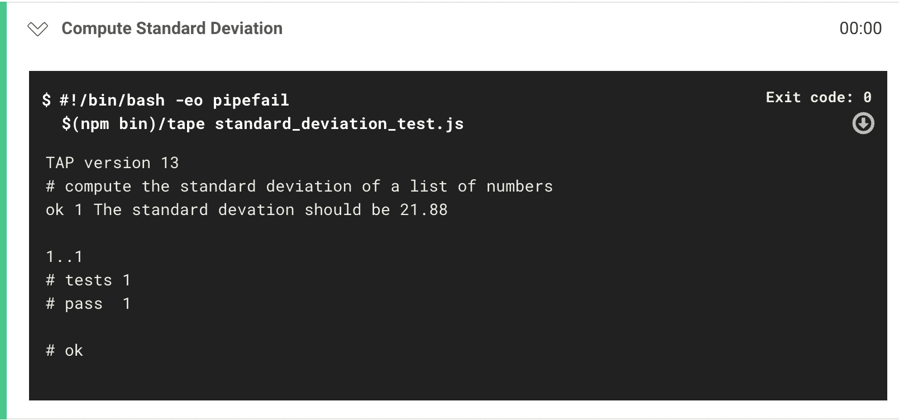

CircleCI 在作业的每个步骤中都这样做，因为它有助于我们解决编写 shell 脚本时出现的问题，并有助于促进编写 shell 脚本的最佳实践。

这是一个可能失败的命令的示例，当使用 Unix 管道时，它将在构建的错误位置报告错误：

```
docker ps -a | grep -v "busybox:latest" | awk '{ print $1 }' - | grep -v "CONTAINER"
```

在这个流水线中，我们列出了所有正在运行、退出或因某种原因终止的容器，然后将其传输到`grep`实用程序中，并排除任何具有文本`busybox:latest`的条目，然后将其传输到`awk`实用程序中，并仅打印第一列。最后，我们将其传输回`grep`并排除文本`CONTAINER`。这个流水线可能在任何一条流水线链中失败，但因为我们使用了选项`set -o pipefail`，脚本将在返回非真选项的第一个命令上失败。这很有帮助，因为默认行为是报告管道中的最后一项。

运行声明命令的另一个方面是，默认情况下它们是使用非登录 shell 执行的。这意味着您必须显式地源化任何隐藏文件，例如**dotfiles**，作为运行的一部分，否则您可能没有准备好使用的环境变量。

这是一个示例来说明这一点：

```
# We source some environment variables here that we need 
source ~/project/.env

npm run security-tests
```

还要注意，退出代码会打印在右上角的每个运行声明中：


您还可以在右上角看到一个有用的按钮，它将使您进一步滚动到您感兴趣的特定运行步骤中。

# 环境变量安全使用的最佳实践

重要的是，不要在`.circleci/config` YML 脚本文件中添加机密信息。如果这样做，可能会在作业日志中泄露机密信息，这些信息可能是公开可访问的。`config.yml`的完整文本对于在 CircleCI 上访问您的项目的开发人员是可见的，因此请将您的机密信息和/或密钥存储在 CircleCI 应用程序中的项目或上下文设置中。在配置中运行脚本可能会暴露机密环境变量，因此在运行步骤中使用`set -o xtrace / set -x`时要小心，因为它们可能会暴露环境变量。

需要注意的一点是，所有环境变量都使用 Hashicorp Vault ([`www.vaultproject.io/`](https://www.vaultproject.io/))进行加密，环境变量使用 AES256-GCM96 进行加密，并且对任何 CircleCI 员工都不可用。

# 使用工作流在作业中运行步骤

根据 Circle CI 文档关于**工作流**（[`circleci.com/docs/2.0/workflows/`](https://circleci.com/docs/2.0/workflows/)），一个工作流是一组规则，用于定义一组作业及其运行顺序。工作流支持使用一组简单的配置键进行复杂的作业编排，以帮助您更早地解决故障。

我们将使用工作流来将我们的作业分成更合适的部分，然后利用一些脚本彼此独立并可以分开运行的事实。通过在 CircleCI 中使用工作流，我们可以加快构建过程。

现在让我们考虑作业的哪些部分可以在我们的构建过程中分解为单独的步骤。我们可以将依赖步骤分解为构建的一个单独部分，然后我们可以将为三个测试运行的各个步骤合并为一个名为测试的步骤。请记住，配置 YML 脚本中的步骤如下所示：

```
...
- run:
 name: Run the Sort Test to sort by first name
 command: $(npm bin)/tape sort_test.js
 - run:
 name: Compute Standard Deviation
 command: $(npm bin)/tape standard_deviation_test.js
 - run:
 name: Find the Text and Replace It
 command: $(npm bin)/tape find_text_test.js
 - run: |
 echo "Generate Code Coverage"
 npm test
 echo "Show the coverage"
 npm run coverage
...
```

在最后一步，我们有命令`npm test`，这个命令引用了`package.json`文件中指定的以下命令：

```
"scripts": { "test": "nyc tape *_test.js", "coverage": "nyc report --reporter=cobertura" }
```

请注意，此命令已经运行了所有测试，然后使用 NYC 代码覆盖率实用程序报告覆盖率。最后一个命令生成了一个 Cobertura XML 报告，我们将在本章后面使用。现在，我们将把一系列步骤重写为它们自己的字段，称为`test`，它将如下所示：

```
test:
 docker:
 - image: circleci/node:8.11.3
 steps:
 - checkout
 - run:
 name: Run Tests and Run Code Coverage with NYC
 command: |
 echo "Generate Code Coverage"
 npm test
 echo "Show the coverage"
 npm run coverage
```

请注意，我给折叠命令一个更合适的名称，并且请注意，我们可以在`command`字段本身使用管道(`|`)运算符使用多行命令。

我们将添加一个部署部分，就像我们在第十三章中所做的那样，*CircleCI CLI 命令和自动化*，这将把我们的应用程序部署到**Heroku** ([`dashboard.heroku.com/apps`](https://dashboard.heroku.com/apps))。如果您不了解 Heroku 是什么，请阅读第十一章，*Travis CI UI 日志和调试*，并阅读*Travis CI 部署概述和调试*部分以获取更多详细信息。

# 向配置 YML 脚本添加工作流部分

我们将在我们的配置 YML 脚本底部添加`workflows`部分，但我们也可以将其添加到配置 YML 脚本的开头。更新后的配置 YML 脚本如下：

```
...
workflows: version: 2 build_test_and_deploy: jobs: - build - test: requires: - build - deploy: requires: - test
```

完成更新配置 YML 脚本后，我们应该使用 CircleCI CLI 确保我们的配置 YML 脚本仍然有效，就像这样：

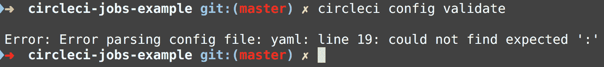

看起来我们在第 19 行的配置 YML 脚本中有问题：

```
...
- run: name: Run Tests and Run Code Coverage with NYC command: | echo "Generate Code Coverage" npm test echo "Show the coverage" npm run coverage
```

这实际上是我们配置 YML 脚本中的一个细微错误，因为我们没有正确缩进多行命令，所以 CircleCI 不知道我们的多行命令从哪里开始。现在更新的配置 YML 脚本部分如下：

```
... - run: name: Run Tests and Run Code Coverage with NYC command: | echo "Generate Code Coverage" npm test echo "Show the coverage" npm run coverage
```

现在让我们再次运行 CircleCI CLI 验证：

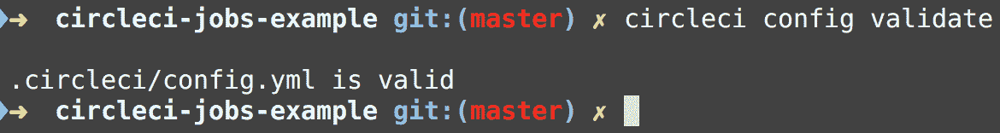

我们的配置 YML 脚本是有效的，现在让我们通过发出以下命令将其提交到源代码控制中：

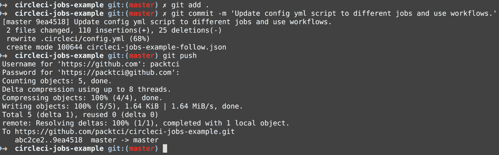

请注意，我们在这里给出了一个描述性的提交消息，在版本控制中这是一个很好的做法，如果你正在处理的任何东西有一个特定的标签，比如 JIRA；你可以像这样添加它，例如：

```
git commit -m '[PACKT-1005] Update config yml script to different jobs and use workflows.'
```

# 使用 CircleCI API 查找最近的构建 URL

我们当然可以使用 CircleCI Web 应用程序，点击`工作流`部分，找到我们最近的构建，但让我们改用 CircleCI API，使用`jq`来解析 JSON 响应有效负载，就像我们以前对其他 API 端点所做的那样。

这是一个命令，它将从`/recent-builds` API 端点的输出传输到`jq`，并从对象数组中返回第一个`build_url`，这将是最近的构建，然后将其传输到系统剪贴板。我们可以在[`circleci.com/docs/api/v1-reference/#recent-builds-project`](https://circleci.com/docs/api/v1-reference/#recent-builds-project)文档中看到最近构建项目中 JSON 的形状：

```
curl -X GET \
 --header "Accept: application/json" \
 "https://circleci.com/api/v1.1/project/github/packtci/circleci-jobs-example?circle-token=$CIRCLECI_API_TOKEN_GITHUB" | jq '.[0].build_url'
```

这将在终端返回以下 URL：[`circleci.com/gh/packtci/circleci-jobs-example/6`](https://circleci.com/gh/packtci/circleci-jobs-example/6)。

现在让我们转到这个 URL 并查看最近的构建；我们会注意到构建失败了：

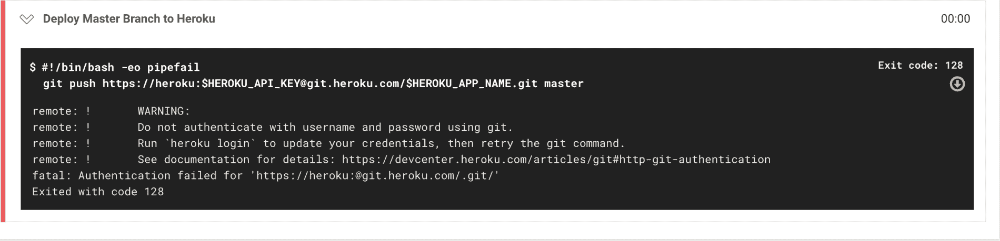

构建失败是因为我们没有设置配置 YML 脚本引用的必要的环境变量，即`HEROKU_API_KEY`和`HEROKU_APP_NAME`。我们在第十三章中介绍了如何设置项目级别的环境变量，*CircleCI CLI 命令和自动化*，但我们只需要复制项目环境级别的变量。如果环境变量相同，CircleCI 有一种简单的方法可以做到这一点：

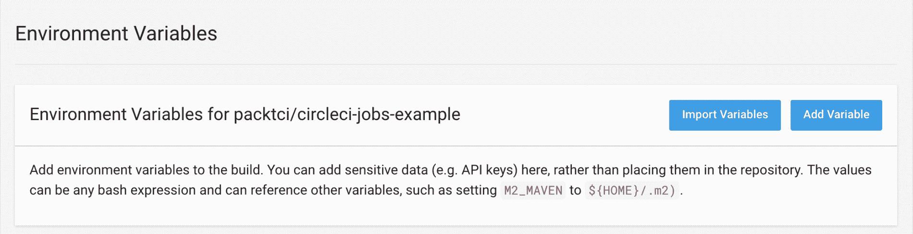

点击导入变量按钮，然后输入要复制的项目，就像这样：

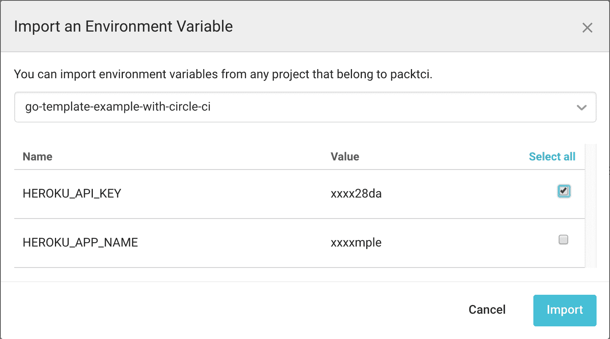

请注意，我只检查了`HEROKU_API_KEY`环境变量，并且我将手动设置`HEROKU_APP_NAME`，因为它对于`circleci-jobs-example`（[`github.com/packtci/circleci-jobs-example`](https://github.com/packtci/circleci-jobs-example)）项目来说是不同的：

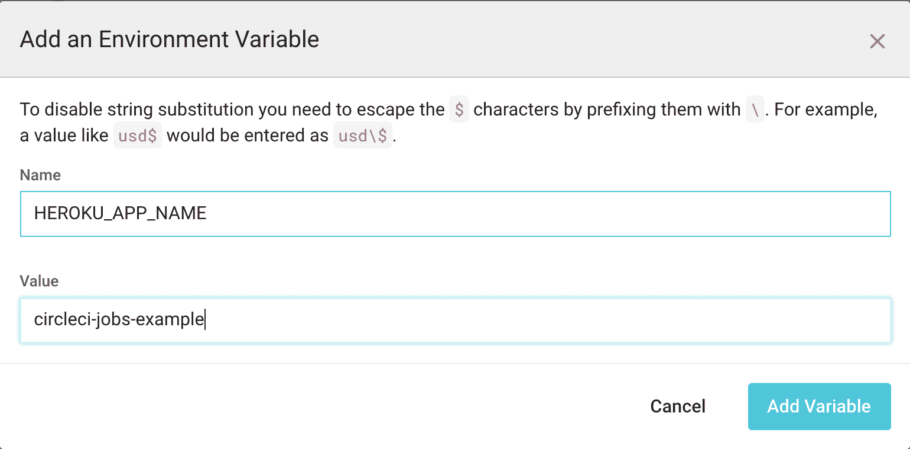

现在，设置了这些环境变量，让我们使用重试构建，使用[`circleci.com/docs/api/v1-reference/#retry-build`](https://circleci.com/docs/api/v1-reference/#retry-build) API 端点。我们将使用`curl`来调用端点，就像这样：

```
curl -X POST https://circleci.com/api/v1.1/project/github/packtci/circleci-jobs-example/6/retry\?circle-token\=$CIRCLECI_API_TOKEN_GITHUB | jq '.build_url'
```

现在我们可以通过复制返回到标准输出的`build_url`值来验证构建是否已修复，即[`circleci.com/gh/packtci/circleci-jobs-example/7`](https://circleci.com/gh/packtci/circleci-jobs-example/7)：

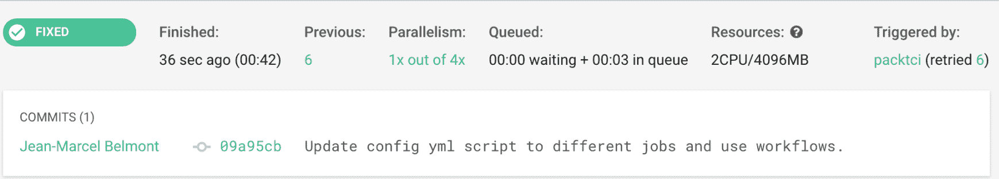

# 在 CircleCI 中调试慢构建

在 CircleCI 中构建可能会因为多种原因而变慢。让我们看一个`go-template-example-with-circleci`（[`circleci.com/workflow-run/533ee47a-a990-4679-826b-7b24221df2ca`](https://circleci.com/workflow-run/533ee47a-a990-4679-826b-7b24221df2ca)）的工作流示例：

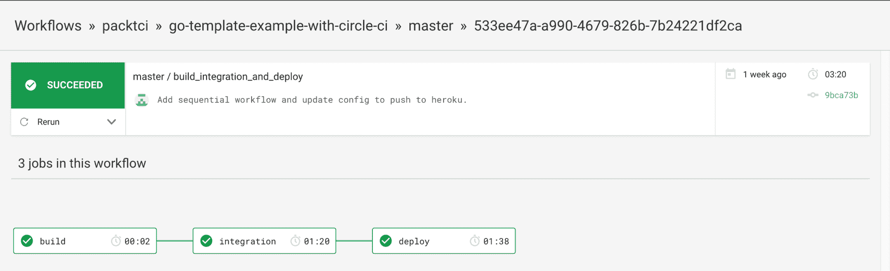

特别要注意的是，集成作业花了一分钟多的时间才完成，部署作业也花了一分钟多的时间，这使得构建需要 3 分钟 20 秒才能完成。如果我们点击集成作业，我们会看到作业中的以下步骤：

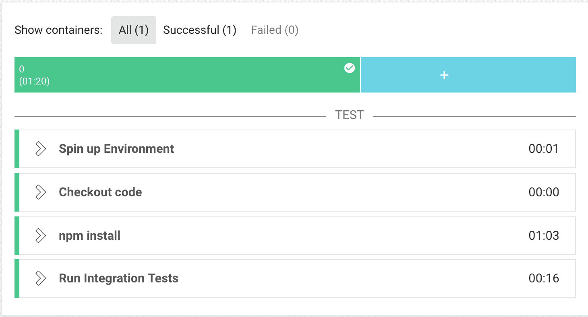

请注意，`npm install`花了 1 分钟 3 秒才完成。让我们打开运行步骤调用`npm install`以获取更多细节：

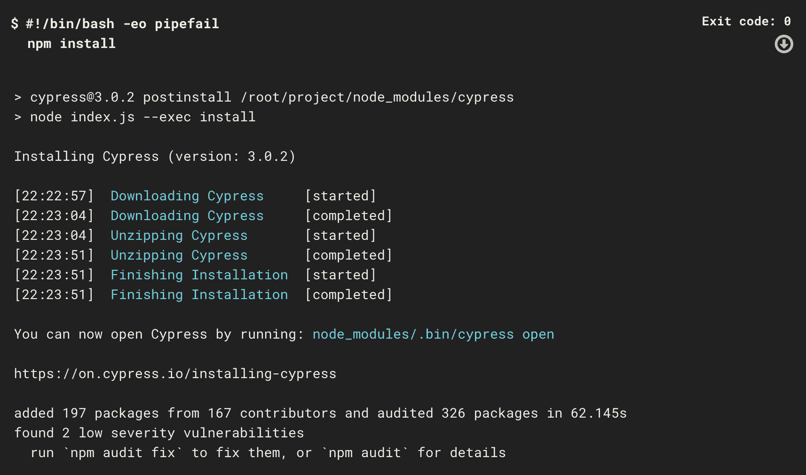

我们唯一的依赖是`cypress.io`，但我们没有缓存这个依赖，所以它将每次运行这个步骤。CircleCI 有一种方法让我们通过利用称为`save_cache`（[`circleci.com/docs/2.0/configuration-reference/#save_cache`](https://circleci.com/docs/2.0/configuration-reference/#save_cache)）和`restore_cache`（[`circleci.com/docs/2.0/configuration-reference/#restore_cache`](https://circleci.com/docs/2.0/configuration-reference/#restore_cache)）的两个字段声明来缓存我们的节点依赖。让我们更新配置 YML 脚本以使用这种缓存策略进行集成构建：

```
integration: docker: - image: cypress/base:8 environment: ## this enables colors in the output TERM: xterm steps: - checkout # special step to restore the dependency cache - restore_cache: key: v2-{{ checksum "package.json" }} - run: npm install # special step to save the dependency cache - save_cache: key: v2-{{ checksum "package.json" }} paths: - ~/.npm
                - ~/.cache  - run: name: "Run Integration Tests" command: npm test
```

注意到我们在`npm install`之前放置了`restore_cache`步骤，然后在`npm install`步骤之后放置了`save_cache`步骤。我们还在两个字段中使用了一个关键字段。关键值是不可变的，我们使用`v2`作为缓存关键值的版本，并获取`package.json`文件的校验和。如果我们想要使任何更改无效缓存，我们可以简单地将缓存值增加一，例如`v3`。还要注意，我们有一个路径字段，并且我们指定路径为`~/.npm`和`~/.cache`目录。Cypress 测试运行程序期望将二进制文件保存到这样的目录中，否则它将抛出错误。让我们将这个更改推送到源代码控制，并触发新的构建并查看作业日志。现在让我们使用对最近构建 API 端点的调用，并复制 URL 并查看构建的情况：

```
curl -X GET \
 --header "Accept: application/json" \
 "https://circleci.com/api/v1.1/project/github/packtci/go-template-example-with-circle-ci?circle-token=$CIRCLECI_API_TOKEN_GITHUB" | jq '.[0].build_url'
```

我们需要复制打印到标准输出的`build_url`条目，并将 URL 粘贴到浏览器中。`build_url`将打开当前构建，从这个页面我们可以轻松地通过点击一个类似这样的链接来导航到该特定作业的工作流程：

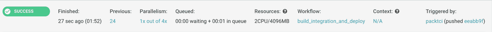

我们可以点击工作流标签下的`build_integration_and_deploy`链接来到工作流。现在我们在集成构建中有以下步骤：

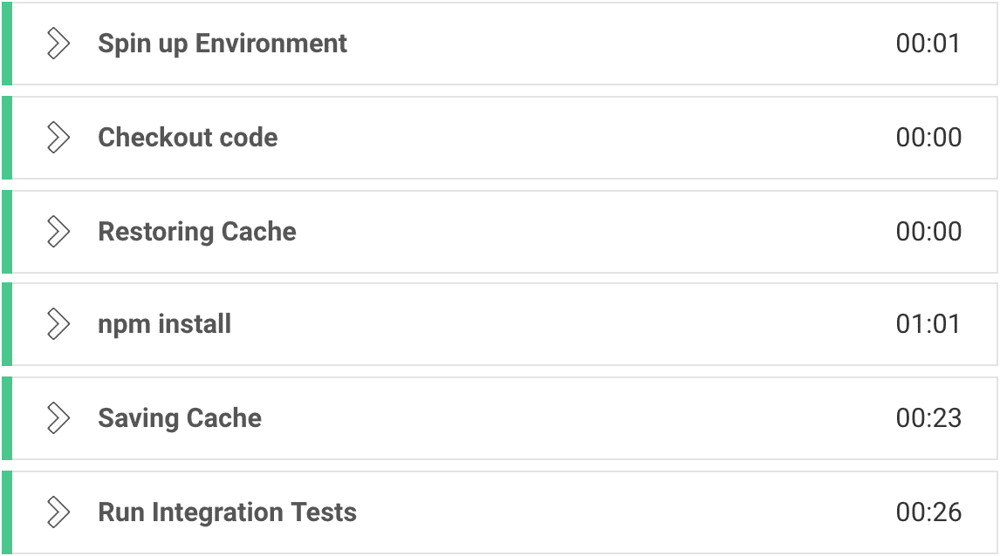

如果我们展开恢复缓存下拉菜单，我们会看到以下内容：

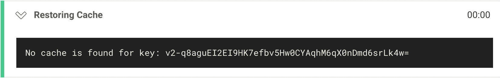

注意到这里没有找到缓存，这是预期的，因为这是添加了这个步骤的构建的第一次运行。

如果我们展开保存缓存按钮，我们会看到以下内容：

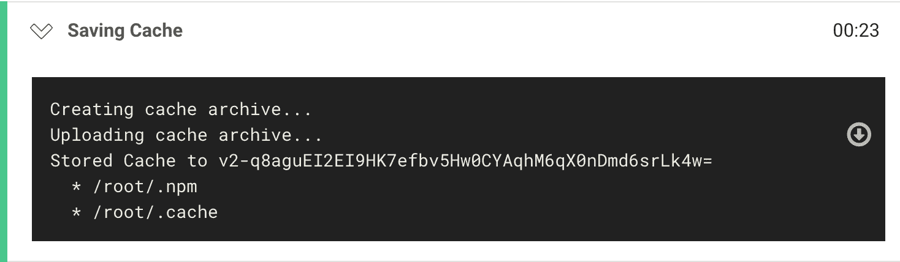

注意到这里创建了一个缓存存档，并存储在配置 YML 脚本中指定的`node_modules`路径中。

让我们在`README.md`文件中进行一个简单的文本更改，并提交更改以触发新的构建。我们将使用 API 找到最新的构建，就像我们一直在做的那样。现在让我们看一下集成作业的新作业日志：

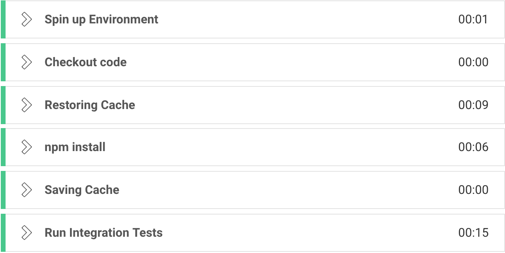

注意到构建时间从 1 分 20 秒减少到 33 秒。如果我们展开恢复缓存下拉菜单，我们会看到以下内容：

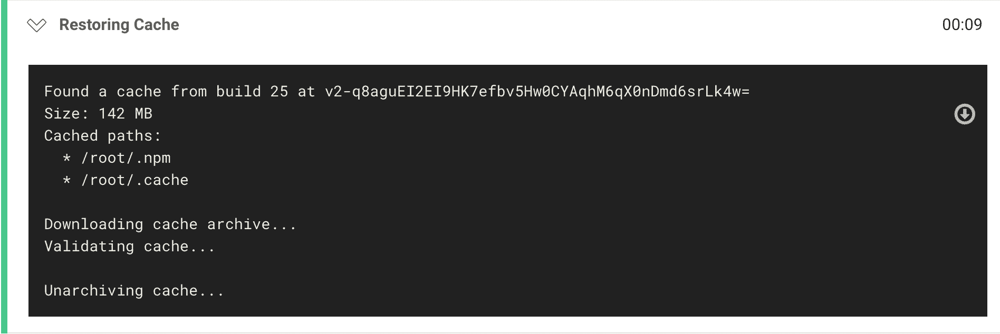

现在让我们看一下保存缓存的步骤：

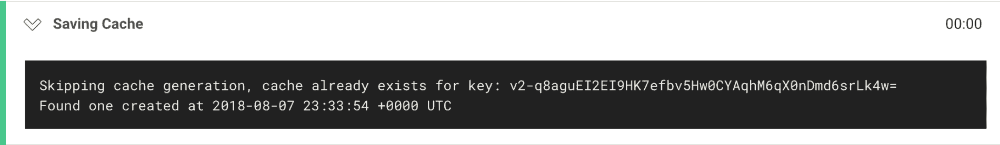

注意到它跳过了缓存生成，因为它能够找到我们从上一次构建中保存的缓存。

# 日志记录和故障排除技术

我们可以使用 CircleCI API 来排除有问题的配置 YML 脚本，而无需进行 Git 提交。我们可以做的一个技巧是创建另一个文件夹，并将我们的配置 YML 脚本的副本放入其中，然后使用这个 YML 脚本作为我们的调试脚本。一旦我们可以验证 YML 脚本工作正常，我们可以更新原始的 YML 脚本。这很有用，因为我们不会用故障排除提交来堵塞 Git 历史，而是直接使用 CircleCI API。

# 使用本地配置 YML 脚本运行构建进行故障排除

假设我们想要尝试存储构建产物，比如项目的代码覆盖率。目前我们正在生成一个覆盖率报告，但在构建过程中没有保存下来供我们查看。这是一个很好的用例，可以创建一个单独的配置 YML 脚本来测试这个新功能。让我们存储`circleci-jobs-example`（[`github.com/packtci/circleci-jobs-example`](https://github.com/packtci/circleci-jobs-example)）项目的覆盖率产物，并且还要更新测试任务以缓存节点依赖，就像我们在前一节中学到的那样。

运行此命令将复制`.circleci`目录的内容并在 shell 中创建一个新目录：

```
cp -r .circleci store_and_cache_experiment
```

现在我们将使用`store_and_cache_experiment`文件夹来运行我们的本地配置 YML 脚本实验。这是我们将要对`store_and_cache_experiment`文件夹中的配置 YML 脚本进行的更改：

```
test:
    docker:
        - image: circleci/node:8.11.3
    steps:
        - checkout
        # special step to restore the dependency cache
        - restore_cache:
             key: v2-{{ checksum "package.json" }}
        # special step to save the dependency cache
        - run:
             name: Install Dependencies
             command: npm install
        - save_cache:
             key: v2-{{ checksum "package.json" }}
             paths:
                 - ~/.npm
                 - ~/.cache
         - run:
             name: Run Tests and Run Code Coverage with NYC
             command: |
                 echo "Generate Code Coverage"
                 npm test
                 echo "Show the coverage"
                 npm run coverage
         - store_artifacts:
             path: coverage
             prefix: coverage
```

我们添加了`save_cache`和`restore_cache`声明更改，还添加了`store_artifacts`声明更改。让我们使用`circleci config validate`命令验证配置 YML 脚本是否仍然有效。现在，为了在本地配置中测试这些更改，而不必进行 Git 提交，我们可以使用 CircleCI API，并在我们的请求正文中提供我们的本地配置 YML 脚本，并引用最近的 Git 提交。我们可以通过运行此命令获取最新的 Git 提交：

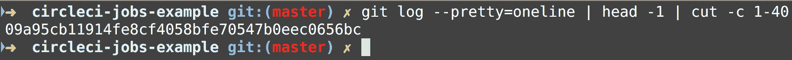

现在我们有一个修订号，可以用于我们将要进行的 API 调用。这是我们将用于调试新配置 YML 脚本更改的命令：

```
#! /bin/bash

curl --user ${CIRCLECI_API_TOKEN_GITHUB}: \ --request POST \ --form revision=09a95cb11914fe8cf4058bfe70547b0eec0656bc \ --form config=@config.yml \ --form notify=false \
 https://circleci.com/api/v1.1/project/github/packtci/circleci-jobs-example/tree/master | jq '.build_url'
```

第一个选项`--user`接受我们保存在环境变量中的 API 令牌，然后后面的`:`表示后面没有密码。下一个选项`--request`是我们指定的`HTTP POST`动词。`--form`修订是我们放置之前得到的 Git 修订号的地方，然后在下一个选项中我们指定`config.yml`脚本。我们为通知指定了一个 false 的表单值，然后提供 URL。在这里，我们指定了 GitHub 的版本控制系统提供者，然后是我们的`packtci`用户名，接着是项目名称，然后是树，最后是我们的分支名称。然后我们将其传输到`jq`实用程序中，并解析出`build_url`。这是 API 端点的清晰表示：

```
POST: /project/:vcs-type/:username/:project/tree/:branch
```

在我们发出 REST 调用之后，我们应该收到一个 JSON 响应，其中包含一个构建 URL 供我们查看，这是我们得到的构建 URL：[`circleci.com/gh/packtci/circleci-jobs-example/8`](https://circleci.com/gh/packtci/circleci-jobs-example/8)。如果我们在 CircleCI Web UI 中查看这个新构建，我们会看到它已经通过了：

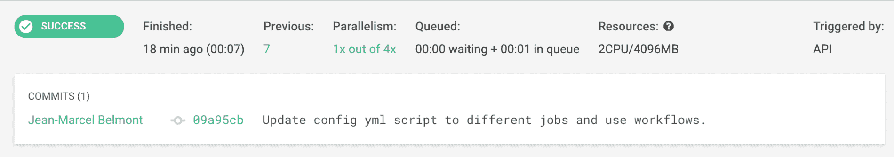

让我们删除故障排除目录和配置 YML 脚本和 shell 脚本，并将配置 YML 脚本复制到`.circleci`目录中，就像这样：

```
cp store_and_cache_experiment/config.yml .circleci
rm -r store_and_cache_experiment
git add .
git commit -m 'Cache and Store artifacts.'
git push
```

现在，如果我们点击当前构建，然后转到工作流链接，我们会看到上传产物步骤已添加到任务中；看起来是这样的：

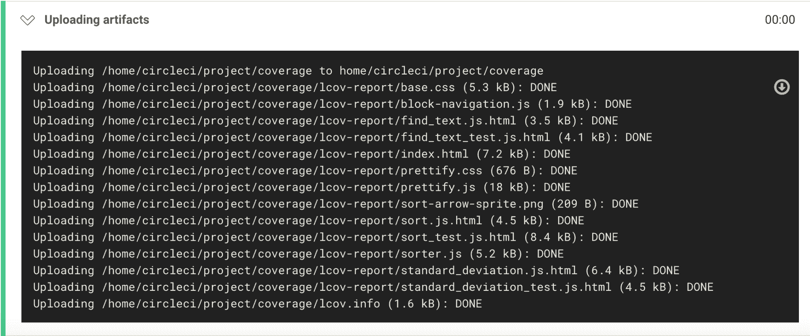

现在我们可以向上滚动并点击 Artifacts 选项卡，看到构建中已保存了一个产物，就像这样：

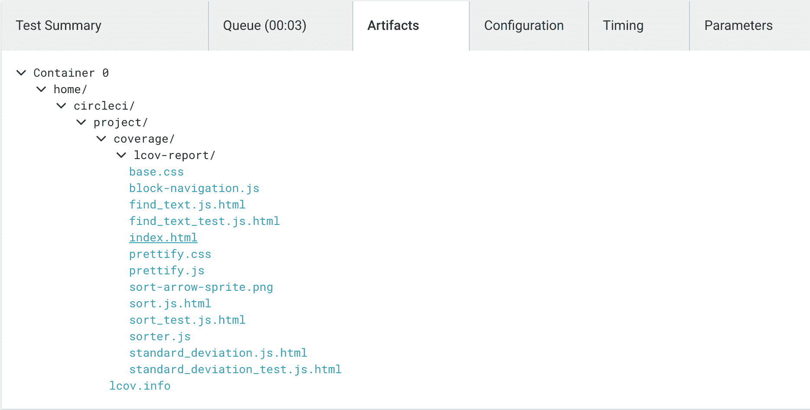

如果我们点击`index.html`，我们将被重定向到一个漂亮的覆盖率报告，看起来像这样：

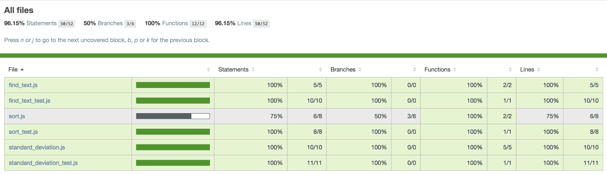

# 摘要

在本章中，我们深入介绍了作业日志，并向您展示了如何使用 CircleCI API 添加项目。我们向您展示了如何分析作业日志，并更详细地解释了 CircleCI 中的工作流程。我们看了如何使用 CircleCI API 找到最近的构建。然后，我们看了如何在 Circle CI 中调试慢构建，并最后向您展示了如何使用本地配置 YML 脚本来尝试对 CircleCI YML 脚本进行新更改的实验。

在下一章中，我们将介绍一些持续集成/持续交付的最佳实践，并研究一些配置管理模式，特别是秘密管理，并在软件公司实施 CI/CD 时提供一些检查表。

# 问题

1.  我们在 CircleCI 中用于关注新项目的 API 端点是什么？

1.  cat 实用程序可以用来创建新文件吗？

1.  如何在 CircleCI 配置 YML 脚本中运行多行命令？

1.  在 CircleCI 中使用`set -x`或脚本中的执行跟踪时是否存在安全漏洞？

1.  我们用什么 CLI 命令来验证我们的配置 YML 脚本？

1.  环境变量可以从 CircleCI 中的其他项目导入吗？

1.  我们在 CircleCI 中使用了哪些声明来缓存我们的依赖关系？

# 进一步阅读

要了解更多关于调试和故障排除以及其他有用信息，请阅读官方的 CircleCI 文档：[`circleci.com/docs/2.0/`](https://circleci.com/docs/2.0/)。
