# 第十五章：最佳实践

在上一章，[第十四章]（c8355d57-1eb8-4e45-93f5-a32513185de3.xhtml），*CircleCI UI 日志记录和调试*中，我们使用 CircleCI 涵盖了更高级的调试和日志记录技术，并介绍了使用 CircleCI API 的更多选项。在本书的最后一章中，我们将介绍不同类型测试的最佳实践，如单元测试、集成测试、系统测试和验收测试。我们将介绍密码管理的最佳实践，并以 Vault 库为例。最后，我们将介绍 CI/CD 中部署的最佳实践，并编写一个自定义的 Go 脚本来创建 GitHub 发布。

本章将涵盖以下主题：

+   CI/CD 中不同类型测试的最佳实践

+   密码和秘密存储的最佳实践

+   部署的最佳实践

# 技术要求

本章将需要一些基本的编程技能，因为我们将在部署脚本和单元测试示例中讨论一些特定于编程语言的材料。熟悉 Unix 编程和 Bash shell 将非常有帮助。

# CI/CD 中不同类型测试的最佳实践

在[第三章]（e80cf8c3-7464-4c16-865b-78e3c264a98e.xhtml），*持续交付的基础知识*中，我们介绍了验收测试，并简要讨论了验收测试套件如何作为回归测试套件。在本节中，我们将讨论您可以进行的不同类型的软件测试，并制定每种测试的最佳实践。我们将介绍以下类型的测试：

+   烟雾测试

+   单元测试

+   集成测试

+   系统测试

+   验收测试

# 烟雾测试

烟雾测试是一种特殊的测试，有助于验证应用程序的基本功能。烟雾测试将假定一些基本实现和环境设置。烟雾测试通常在测试周期开始时运行，作为完整测试套件开始之前的理智检查。

烟雾测试的主要目的是在软件系统的新功能开发中捕捉明显的问题。烟雾测试不是为了详尽无遗，而是为了快速运行。假设一个软件公司遵循敏捷软件开发实践，每两周进行一次冲刺，向产品添加新功能。当新功能合并到发布中，即软件的主干时，烟雾测试失败，这应立即引起警觉，表明新功能可能破坏了现有功能。

您可以创建特定上下文的烟雾测试，用于测试系统中的新功能，这些测试将采用一些基本假设，并断言是否满足要求。您可以在进行任何集成测试之前以及在为暂存环境进行任何部署之前运行这些烟雾测试，并且这些烟雾测试将检查每个暂存环境的不同条件。

# 烟雾测试示例

我们将使用我构建的现有应用程序，该应用程序显示表中的用户列表。该应用程序称为`containerized-golang-and-vuejs`（[`github.com/jbelmont/containerized-golang-and-vuejs`](https://github.com/jbelmont/containerized-golang-and-vuejs)），它展示了如何使用容器、Golang 和 Vue.js 作为参考。我们首先要做的是确保应用程序正在使用名为`make dev`的`makefile`任务运行。此命令执行以下操作：

```
docker-compose up frontend backend db redis
```

总之，此命令会启动四个 Docker 容器，当它运行时，我们应该能够访问`http://localhost:8080`。现实中，烟雾测试会访问运行中的应用程序，但这只是用于演示烟雾测试的目的。我们将使用一个名为**Cypress**（[`www.cypress.io/`](https://www.cypress.io/)）的端到端测试库，但我们也可以使用另一个库。

我们将使用 JavaScript 编写以下简单的冒烟测试：

```
describe('The user list table is shown and buttons', function () { it('successfully loads table', function () { cy.visit('/') cy .get('.users-area-table') .find('tbody tr') .first() .screenshot() }) })
```

您可以在入门指南（[`docs.cypress.io/guides/getting-started/writing-your-first-test.html#`](https://docs.cypress.io/guides/getting-started/writing-your-first-test.html#)）文档中了解更多关于 Cypress 的信息，但这个测试基本上是验证页面是否加载了数据，Cypress 会拍摄屏幕截图，以便我们可以直观地验证页面。

这是 Cypress 库拍摄的屏幕截图：

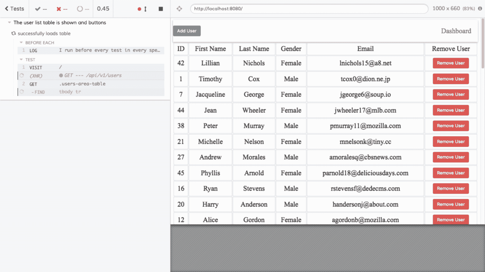

对于这个简单的应用程序，我们可以确信应用程序大致工作正常，但更完整的冒烟测试可能会通过登录界面，然后执行应用程序预期执行的基本操作。

Cypress 的另一个好功能是它可以录制测试的视频，显示测试所采取的所有步骤，这可以进一步验证应用程序是否满足基本要求。

# 单元测试

单元测试可以被认为是软件测试的基础，因为单元测试测试代码的单个块，比如一个函数或一个类/对象。通过单元测试，您可以测试函数和/或类的功能。由于这个事实，单元测试通常会存根或模拟任何外部依赖，以便测试可以完全专注于相关的函数和/或类。

单元测试在测试系统的组件行为正确方面是基础的。单元测试在这方面的限制意味着更容易隔离缺陷发生的位置。单元测试通常用于测试代码分支以及函数如何处理不同类型的输入。开发人员通常会在构建中首先运行单元测试，而 QA 工程师可能会首先运行冒烟测试，然后进行任何单元测试。

个别开发人员将在提交更改到版本控制项目（如 GitHub）之前在他们的工作站上运行单元测试。话虽如此，持续集成服务器（如 Jenkins、Travis CI 和 CircleCI）将在运行任何集成测试之前运行单元测试，正如我们在前几章中所看到的。

# 单元测试示例

我们将查看一个名为`circleci-jobs-example`（[`github.com/packtci/circleci-jobs-example`](https://github.com/packtci/circleci-jobs-example)）的先前项目，该项目有几个单元测试用于测试单个函数。在存储库中，我们有一个名为`sort.js`的文件，其中包含以下函数：

```
/ Takes an array of objects and sorts by First Name
function sortListOfNames(names) {
    return names.sort((a, b) => {
        if (a.firstName < b.firstName) {
            return -1;
        }
        if (a.firstName > b.firstName) {
            return 1;
        }
        if (a.firstName === b.firstName) {
            return 0;
        }
    });
}
```

这个函数接受一个对象数组，并按照`firstName`属性对对象进行排序。对于我们的单元测试，我们只想测试`sortListOfNames`函数是否按字母顺序排序第一个名字。这是我们在`tape.js`（[`github.com/substack/tape`](https://github.com/substack/tape)）测试库中编写的单元测试：

```
test('Test the sort function', t => {
    t.plan(1);

    const names = [
        {
            firstName: 'Sam',
            lastName: 'Cooke'
        },
        {
            firstName: 'Barry',
            lastName: 'White'
        },
        {
            firstName: 'Jedi',
            lastName: 'Knight'
        }
    ];
    const actual = sort.sortListOfNames(names);
    const expected = [
        {
            firstName: 'Barry',
            lastName: 'White'
        },
        {
            firstName: 'Jedi',
            lastName: 'Knight'
        },
        {
            firstName: 'Sam',
            lastName: 'Cooke'
        }
    ];
    t.deepEqual(actual, expected, 'The names should be sorted by the first name.')
});
```

您可以在这里看到，单元测试能够隔离并测试`sortListOfNames`函数的行为，这非常有用，因为如果`sortListOfNames`函数出现任何问题，我们可以快速确定回归发生的位置。当然，虽然这个函数非常基本和简单，但您可以看到单元测试在持续集成构建中捕捉软件回归方面起着重要作用。

# 集成测试

集成测试将测试软件组件组合在一起的方式。虽然单元测试可以帮助验证代码块在隔离状态下的功能，但集成测试可以帮助测试代码块在彼此交互时的情况。集成测试很有用，因为它们可以帮助捕捉软件组件交互时出现的不同类型的问题。

虽然单元测试可能在开发人员的工作站上运行，但集成测试通常在代码检入源代码控制时运行。CI 服务器将检出代码，执行构建步骤，然后进行任何冒烟测试，然后运行单元测试，然后运行集成测试。

由于集成测试是更高级的抽象级别，并且测试软件组件相互交互，它们有助于保护代码库的健康。当开发人员向系统引入新功能时，集成测试可以帮助确保新代码与其他代码块按预期工作。集成测试可以帮助确保系统中的新功能可以安全地部署到环境中。集成测试通常是在开发人员的工作站之外进行的第一种测试类型，并有助于显示是否存在环境依赖性破坏以及新代码是否与外部库、外部服务和/或数据正常行为。

# 集成测试示例

我们将查看一个公共 API，比如 CircleCI，并编写一个集成测试，以访问 API 端点并验证请求的状态代码和主体是否符合我们的预期。这通常是您正在使用的本地 API，并且希望验证正确行为，但作为示例，我们将仅用于说明目的访问 CircleCI。我们将在 GitHub 中使用我们的`packtci`用户创建一个名为`integration-test-example`的新存储库([`github.com/packtci/integration-test-example`](https://github.com/packtci/integration-test-example))。我们将使用几个库，包括`supertest` ([`github.com/visionmedia/supertest`](https://github.com/visionmedia/supertest))，一个 Node.js 库，`baloo` ([`github.com/h2non/baloo`](https://github.com/h2non/baloo))，一个用于访问 API 端点的 Golang 库，最后是`curl`和`bash`。您使用哪个库并不重要；我只是为了演示目的而使用这些库。

# 使用 supertest Node.js 库的 API 测试示例

在这个集成测试示例中，我们访问 CircleCI 中的`GET /projects` ([`circleci.com/docs/api/v1-reference/#projects`](https://circleci.com/docs/api/v1-reference/#projects))端点。以下是测试此端点的代码：

```
'use strict'; const  request  =  require('supertest'); const  assert  =  require('assert'); const  CIRCLECI_API  = { // List of all the projects you're following on CircleCI, with build information organized by branch getProjects:  'https://circleci.com/api/v1.1' }; describe('Testing CircleCI API Endpoints', function() { it('the /projects endpoints should return 200 with a body', function() { return  request(CIRCLECI_API.getProjects) .get(`/projects?circle-token=${process.env.CIRCLECI_API_TOKEN_GITHUB}`) .set('Accept', 'application/json') .expect(200) .then(response  => { assert.ok(response.body.length  >  0, "Body have information") assert.equal(response.body[0].oss, true); }); }); });
```

在这里，我们测试端点是否返回`200`的 HTTP 响应，是否有主体，以及`oss`对象数组中是否有属性。

# 使用 baloo Golang 库的 API 测试示例

在这个集成测试中，我们访问 Travis API 中的`GET /user` ([`developer.travis-ci.com/resource/user#User`](https://developer.travis-ci.com/resource/user#User))端点。以下是测试此端点的代码：

```
package main import ( "errors" "net/http" "os" "testing" "gopkg.in/h2non/baloo.v3" ) var  test  = baloo.New("https://api.travis-ci.com") func assertTravisUserEndpoint(res *http.Response, req *http.Request) error {
  if res.StatusCode != http.StatusOK {
    return errors.New("This endpoint should return a 200 response code")
  }
  if res.Body == nil {
    return errors.New("The body should not be empty")
  }
  return nil
}

func  TestBalooClient(t *testing.T) { test.Get("/user"). SetHeader("Authorization", "token "+os.Getenv("TRAVIS_PERSONAL_TOKEN")). SetHeader("Travis-API-Version", "3"). Expect(t). Status(200). Type("json"). AssertFunc(assertTravisUserEndpoint). Done() }
```

在这里，我们测试响应是否为`200`，并且主体具有值。

# 使用 curl、bash 和 jq 的 API 测试示例

在这个集成测试示例中，我们将访问 CircleCI API 中的最近构建端点`GET: /project/:vcs-type/:username/:project` ([`circleci.com/docs/api/v1-reference/#recent-builds-project`](https://circleci.com/docs/api/v1-reference/#recent-builds-project))。以下是测试此端点的代码：

```
#! /bin/bash GO_TEMPLATE_EXAMPLE_REPO=$(curl -X GET \ --header "Accept: application/json" \ "https://circleci.com/api/v1.1/project/github/packtci/go-template-example-with-circle-ci?circle-token=$CIRCLECI_API_TOKEN_GITHUB" | jq '.[0].author_name' | tr -d "\n") if [[ -n  ${GO_TEMPLATE_EXAMPLE_REPO} ]];  then echo  "The current owner was shown" exit 0 else  echo  "No owner own" exit 1 fi
```

在这里，我们测试是否从应该在 JSON 有效负载中返回的端点接收了`author_name`属性。

# 系统测试

系统测试通常是扩展集成测试的更广泛的集成测试。系统测试将聚合应用程序中的功能组，并且比集成测试的范围更广。系统测试通常在集成测试之后运行，因为它们正在测试应用程序中的更大行为，并且运行时间更长。

# 系统测试示例

系统测试可以包括：

+   **可用性测试**：一种测试类型，测试系统的易用性以及系统满足其拟议功能的整体能力

+   **负载测试**：一种测试类型，用于测量系统在真实负载下的行为

+   **回归测试**：一种测试类型，用于检查系统在添加新功能时是否正常运行

还有其他类型的系统测试，但我们只包括了一些常见的系统测试类型。

# 验收测试

我们在整本书中都讨论了验收测试，但是，验收测试是对应用程序行为的正式验证。验收测试通常是 CI/CD 流水线中的最后一种测试，因为它们运行时间较长，并且在验收测试的验证方面更为复杂。

验收测试也可以作为回归测试套件，因为它们可以保证应用程序的行为符合预期。有一些库使用一种称为**Gherkin**的正式领域特定语言（[`docs.cucumber.io/gherkin/reference/`](https://docs.cucumber.io/gherkin/reference/)）。这些库有特定的文件，写下了所谓的**验收标准**。这些标准规定了新功能需要做什么，对于软件公司来说，编写一个在冲刺开始时失败，一旦满足验收标准就会通过的验收测试并不罕见。

# 验收测试示例

我们可以在我的名为`cucumber-examples`（[`github.com/jbelmont/cucumber-examples`](https://github.com/jbelmont/cucumber-examples)）的存储库中查看一个非常简单的验收测试示例，其中有一个 Gherkin 文件，检查我们的验收标准是否满足了一个简单的计算器程序：

```
# features/simple_addition.feature
Feature: Simple Addition of Numbers
  In order to do simple math as a developer I want to add numbers

  Scenario: Easy Math Problem
    Given a list of numbers set to []
    When I add the numbers together by []
    Then I get a larger result that is the sum of the numbers
```

请注意，Gherkin 语法是人类可读的，意在被阅读为新功能声明的列表。在这里，我们声明我们想要能够进行简单的数学加法运算，然后提供一个场景来实现这一点。以下是实现此功能的代码：

```
const { setWorldConstructor } = require('cucumber')

class Addition {
  constructor() {
    this.summation = 0
  }

  setTo(numbers) {
    this.numbers = numbers
  }

  addBy() {
    this.summation = this.numbers.reduce((prev, curr) => prev + curr, 0);
  }
}

setWorldConstructor(Addition)
```

这个文件是一个执行简单加法的 JavaScript 类，这里还有另一个类，其中列出了一系列将数字相加的场景：

```
const { Given, When, Then } = require('cucumber')
const { expect } = require('chai')

Given('a list of numbers set to []', function () {
    this.setTo([1, 2, 3, 4, 5])
});

When('I add the numbers together by []', function () {
    this.addBy();
});

Then('I get a larger result that is the sum of the numbers', function () {
    expect(this.summation).to.eql(15)
});
```

这是一个非常简单的验收测试，但它旨在说明验收测试是对新功能行为的正式验证。

# 在 CI/CD 流水线中运行不同测试的最佳实践

我们在第三章中描述了以下阶段，*持续交付的基础*：

1.  CI/CD 流水线的第一个阶段通常包括构建和提交阶段。这是您构建流水线其余部分所需的任何构件并在构建中运行单元测试套件的地方。第一阶段旨在运行非常快，因为开发人员需要有一个短的反馈循环，否则您可能会冒着开发人员绕过此阶段的风险。

1.  CI/CD 流水线的第二阶段通常会运行集成测试，因为它们是运行时间较长的测试类型，并且可以在流水线的第一阶段运行并通过后运行。第二阶段是对系统的任何新功能是否破坏了系统集成组件的一层保证。

1.  CI/CD 流水线的第三阶段可能包括一套负载测试、回归测试和安全测试，并且比 CI/CD 流水线的前两个阶段运行时间更长。

1.  第四阶段可以是验收测试的运行阶段，尽管我个人见过一些公司同时运行验收测试套件和集成测试，因此它们的 CI/CD 流水线只有三个阶段。我们在本章中列出的阶段并不是硬性规定，而只是一些建议，因为每个应用程序在行为上都是独特的。

# 密码和秘密存储的最佳实践

正如我们在涵盖 Jenkins、Travis CI 和 CircleCI 的章节中所看到的，每个持续集成服务器都有一种存储安全信息（如密码、API 密钥和秘密）的方法。在 CI 服务器中运行某些操作是危险的，比如在 Bash 中使用`set -x`选项进行执行跟踪。最好是使用 CI 服务器的功能来安全地存储密码和秘密，比如 CircleCI 中每个项目的上下文设置，只有项目所有者才能看到。您也可以使用诸如**Vault**（[`www.vaultproject.io/intro/index.html`](https://www.vaultproject.io/intro/index.html)）这样的工具来安全地存储密码，并可以使用 RESTful API 检索，或者使用**Amazon Key Management Service**（[`aws.amazon.com/secrets-manager/`](https://aws.amazon.com/secrets-manager/)）等工具。我们将简要介绍在本地开发环境中使用 Vault 来满足密码需求，并调用 Vault 的 RESTful API。

# Vault 安装

安装 Vault（[`www.vaultproject.io/`](https://www.vaultproject.io/)）可以在安装 Vault（[`www.vaultproject.io/intro/getting-started/install.html`](https://www.vaultproject.io/intro/getting-started/install.html)）链接中完成。下载 Vault 后，您需要将单个二进制文件移动到操作系统可以找到的`PATH`中。以下是我在本地机器上运行的示例：

```
echo $PATH
## This prints out the current path where binaries can be found

mv ~/Downloads /usr/local/bin
```

最后一个命令将把名为`vault`的二进制文件移动到我的路径中的`/usr/local/bin`目录中，然后我现在应该能够运行`vault`命令并查看帮助菜单，如下所示：

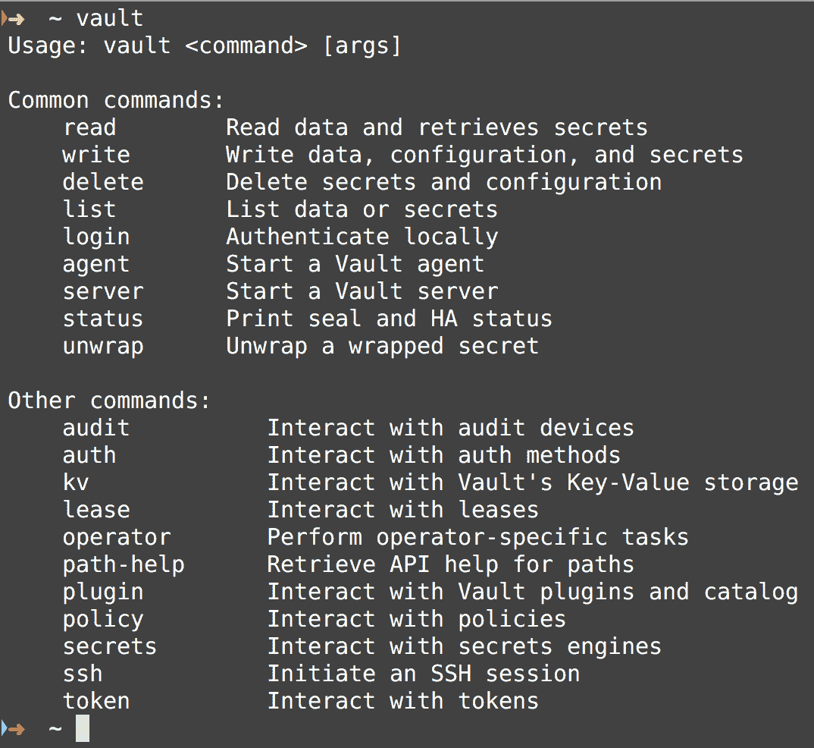

请注意，`vault`命令有`常用命令`和`其他命令`可以运行。

# 启动 Vault 的开发服务器

我们需要运行`vault server -dev`命令来启动开发服务器：

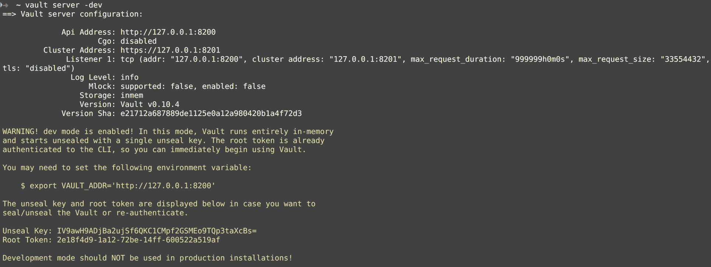

请注意，我们得到了一系列指令，以设置我们的本地开发环境。

请记住，这仅用于演示目的，开发模式不适用于生产实例。

# 检查 Vault 服务器的状态

在以下截图中，我们检查了开发 Vault 服务器的状态：

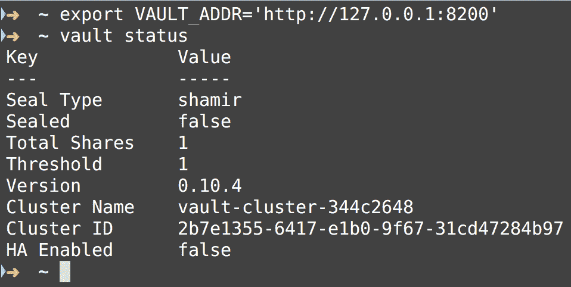

我们首先在新的 shell 中导出`VAULT_ADDR`环境变量，因为我们将使用此命令，然后检查我们的开发 Vault 服务器的状态。

# 在 Vault 中设置 API 密钥

在以下截图中，我们设置了一个 API 密钥，然后使用 Vault 检索它：

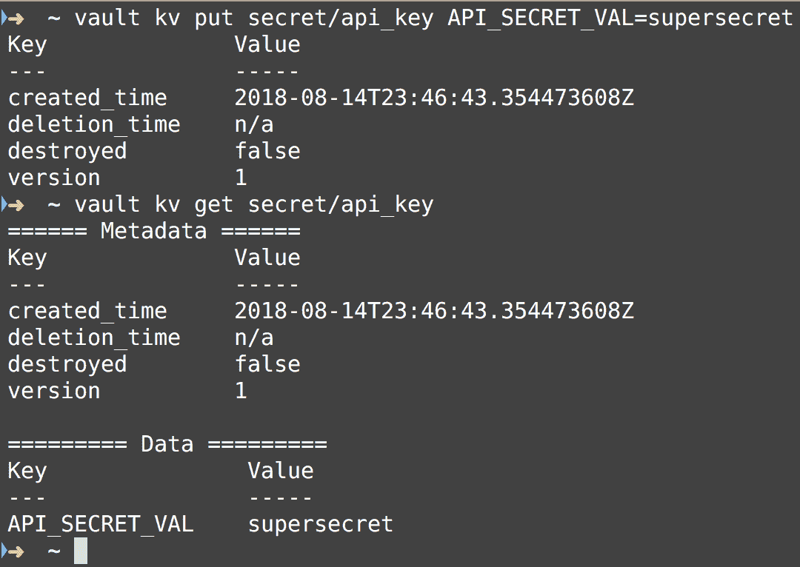

我们还可以列出 Vault 中的所有秘密，如下所示：

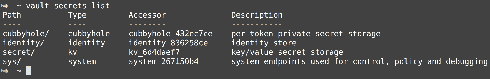

# 使用 Vault RESTful API

请记住，我们正在运行开发 Vault 服务器实例，因此我们可以在本地机器上作为 REST 客户端运行`curl`到 Vault API。让我们运行以下`curl`命令，检查我们的 Vault 实例是否已初始化，此时应该已经初始化：

```
curl http://127.0.0.1:8200/v1/sys/init
```

我们需要创建一个名为`config.hcl`的文件，以便使用以下内容绕过 Vault 的 TLS 默认设置：

```
backend "file" {
 path = "vault"
}

listener "tcp" {
 tls_disable = 1
}
```

我们需要解封 Vault 并登录，如下截图所示：

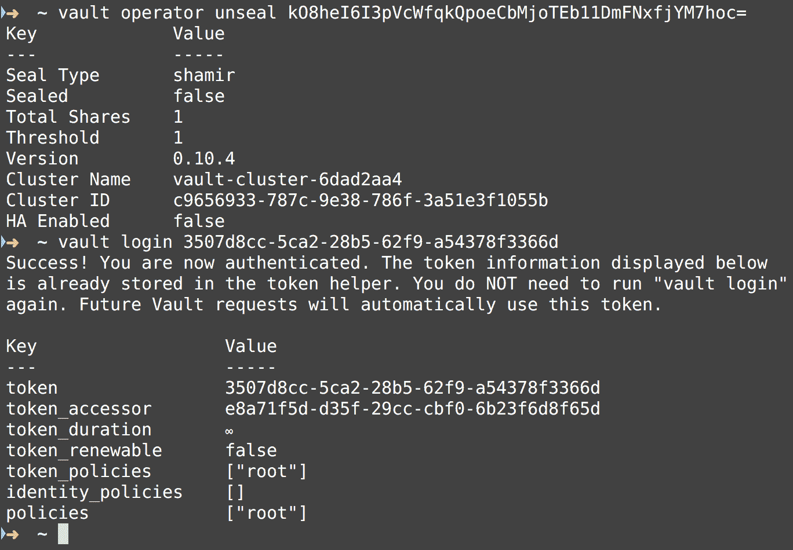

请注意，我们得到了一个令牌，这是我们将需要使用以下 HTTP 标头进行 RESTful API 请求的令牌：`X-Vault-Token: 3507d8cc-5ca2-28b5-62f9-a54378f3366d`。

# Vault RESTful API 端点 GET /v1/sys/raw/logical

以下是用于端点的示例`curl GET`请求：

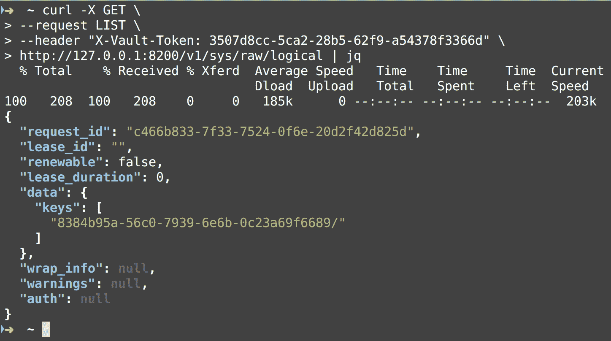

请注意，我们在运行 Vault 登录`ROOT_KEY`命令后从标准输出中打印出的令牌。此端点返回给定路径的密钥列表，在本例中为`/sys/raw/logical`。

# 秘密管理的总体最佳实践

正如我们在整本书中所述，将原始密码和秘密提交到源代码控制中并不是一个好的做法，您需要有一种安全地检索密码的方法来运行 CI/CD 流水线。您可以使用 CI 服务器本身来存储密码和秘密，然后使用环境变量检索它们，或者您可以使用 Vault 等服务来安全地存储密码。请记住，在 CI 环境中使用 shell 脚本的执行跟踪可能是不安全的，因此在调试构建和在 Bash 中使用`set -x`标志时要谨慎。

# 部署最佳实践

在第三章中，*持续交付的基础*，我们讨论了部署是什么，解释了部署流水线，并谈到了部署流水线中的测试门。我们还谈到了部署脚本和部署生态系统。

让我们在部署时突出一些其他好的策略：

+   创建部署清单

+   发布自动化

# 创建部署清单

每家公司都会有独特的限制，因此不可能创建一个满足每家公司限制的部署清单，但是总的来说，以下是一些可能在所有部署中有所帮助的指南。

# 开发人员和运维之间的协作

开发团队和运维之间应该进行沟通，以便正确协调部署。这很关键，因为误解是不可避免的，因此在部署过程中应该进行密切的沟通，以避免中断和数据丢失。

# 自动化发布

手动流程容易出错，因此应尽可能自动化部署，以避免人为错误。手动流程不可重复，也不可持续，因为部署变得更加复杂。最好有自动化脚本，可以排除人为错误。

# 部署脚本示例

在软件部署的位置方面有许多不同的选择。因此，根据项目是开源、私有还是企业，部署脚本可能会有很大的不同。许多开源项目只是为每个新版本创建一个 GitHub 发布（[`help.github.com/articles/creating-releases/`](https://help.github.com/articles/creating-releases/)），并通过使用 Bash 脚本自动化该过程。一些公司可能使用**Heroku**（[`devcenter.heroku.com/start`](https://devcenter.heroku.com/start)）作为他们的提供商，或者一些公司可能使用**AWS CodeDeploy**（[`aws.amazon.com/codedeploy/`](https://aws.amazon.com/codedeploy/)），但最终，您希望自动化您的部署过程，以便有一个标准和自动化的方式来部署您的软件。还很好地拥有一个部署脚本，可以整理版本控制提交，并能够在每个软件发布中显示新功能和错误修复。

# 自动化的 GitHub 发布示例

我们将使用 GitHub API 中的以下端点来自动化发布策略：`POST /repos/:owner/:repo/releases`。此端点的文档可以在[`developer.github.com/v3/repos/releases/#create-a-release`](https://developer.github.com/v3/repos/releases/#create-a-release)找到。我们将在`multiple-languages`（[`github.com/packtci/multiple-languages`](https://github.com/packtci/multiple-languages)）GitHub 存储库中创建一个 Golang 脚本，用于创建新的 GitHub 发布。

# Golang 脚本示例

我们将使用 Golang 发出 HTTP 请求，并为 Go 脚本提供一些命令行参数。这些参数将用于构建以下`request`主体，其形式如下：

```
{
 "tag_name": "v1.0.0",
 "target_commitish": "master",
 "name": "v1.0.0",
 "body": "Description of the release",
 "draft": false,
 "prerelease": false
}
```

以下是部署脚本的第一部分：

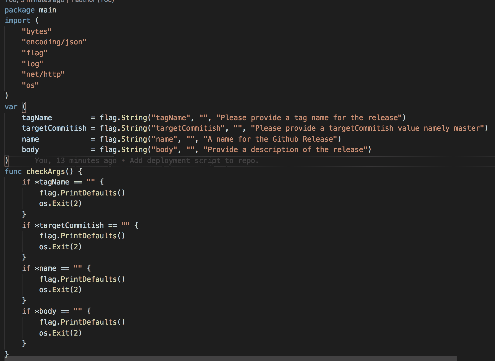

在脚本的这一部分中，我们声明了`main`包，并获取了一些我们需要发出 HTTP 请求的命令行参数。我们需要解析它们并检查它们是否设置，这就是在`main`函数中调用`checkArgs`函数时所做的，如下面的屏幕截图所示：

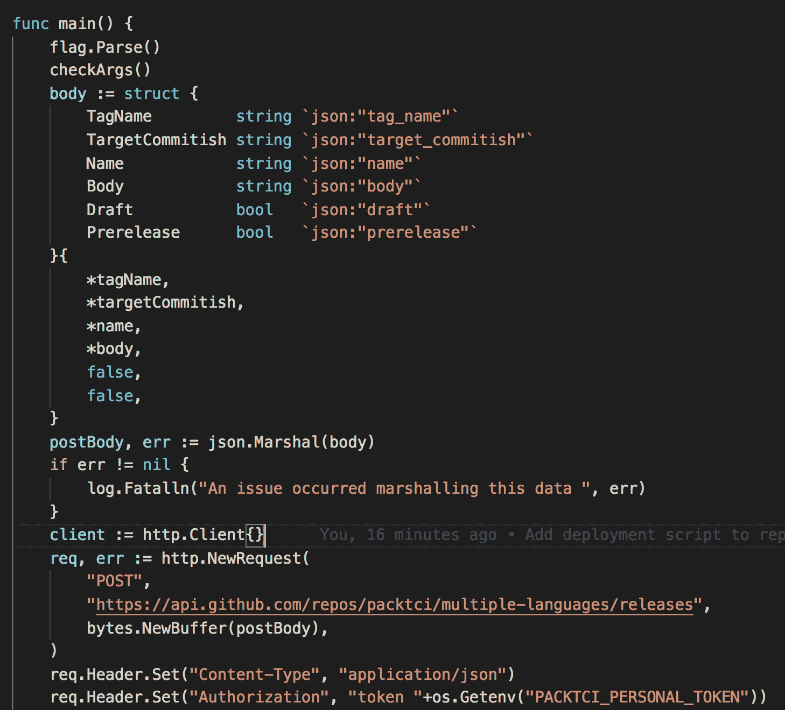

现在，在脚本的第二部分中，我们在`main`函数中，解析命令行参数，然后调用我们的`checkArgs`函数。接下来，我们创建一个匿名结构，用于创建我们的请求体，然后设置 HTTP 请求并设置 HTTP 头。在脚本的最后部分，我们发出请求并打印发布 URL。

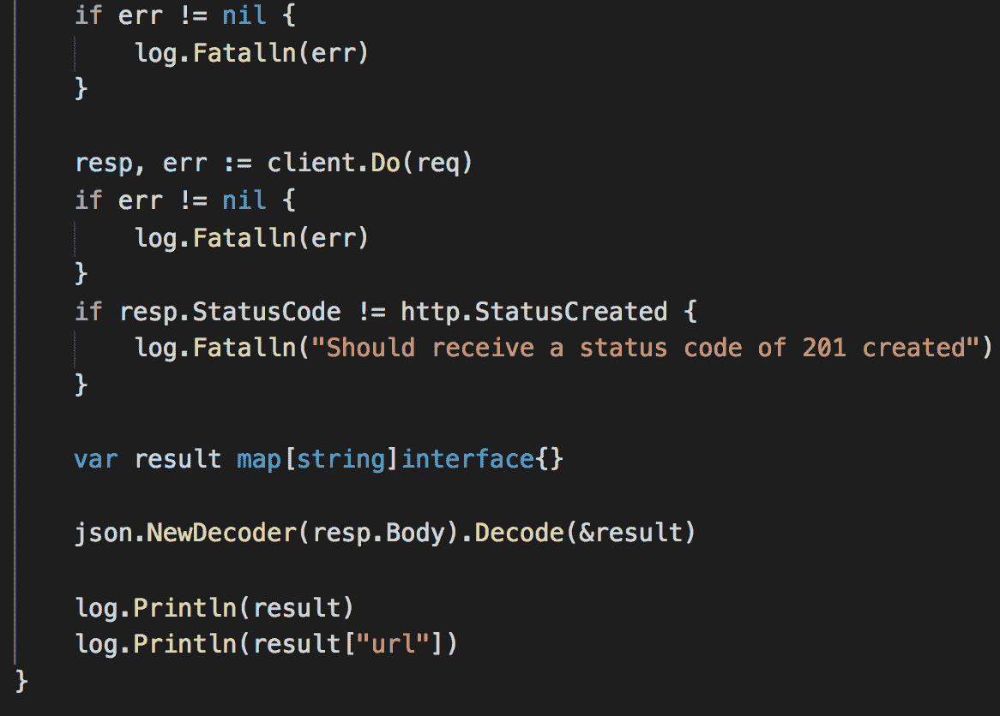

让我们在终端会话中展示这个部署脚本的运行：

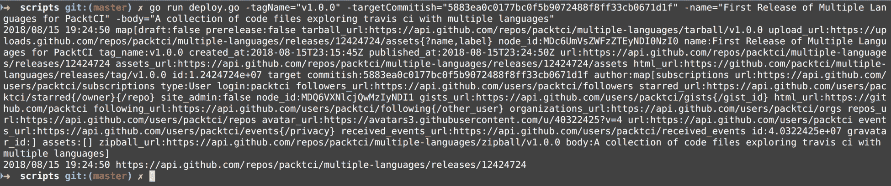

请注意，我们在`go run deploy.go`之后提供了四个命令行参数，脚本在最后打印出了发布 URL。

让我们转到`multiple-languages`（[`github.com/packtci/multiple-languages/releases`](https://github.com/packtci/multiple-languages/releases)）存储库中的 Releases 选项卡，并单击我们的新发布，它看起来像这样：

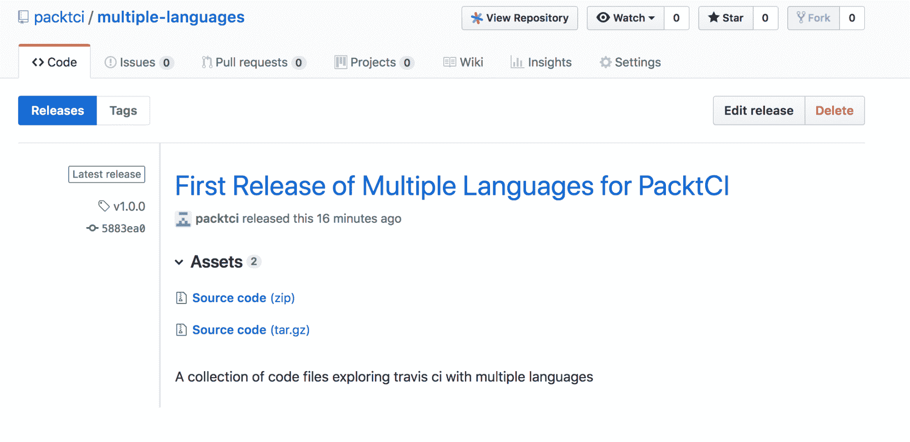

# 部署脚本的最佳实践

在为消费者发布新软件时，最好自动化部署过程。不必像我们在这里所做的那样创建自定义部署脚本，因为有很多优秀的库可供使用，它们比我们编写的这个小脚本更结构化和功能丰富。例如，您可以使用**GoReleaser**（[`goreleaser.com/`](https://goreleaser.com/)）自动化发布脚本，非常适用于 Go 项目。还有许多可用的库是特定于语言的，以及 CI 提供者的选项，例如 TravisCI，可以将您的软件部署到提供者，例如 Google App Engine（[`docs.travis-ci.com/user/deployment/google-app-engine/`](https://docs.travis-ci.com/user/deployment/google-app-engine/)）等。

# 总结

在这最后一章中，我们涵盖了 CI/CD 流水线中不同类型测试的最佳实践，包括单元测试、集成测试、系统测试和验收测试。我们提供了代码示例，并展示了如何使用 Node.js、Golang 和 shell 脚本测试 API 端点的方法。我们介绍了密码管理的最佳实践，并展示了如何使用 Vault 库安全管理秘密以及如何使用 Vault API。我们最后讨论了一些关于部署的最佳实践，包括部署清单、发布自动化以及使用 Golang 编写自定义发布脚本。

这是书的结尾，我希望您已经学到了很多关于 CI/CD、测试和自动化以及使用 Jenkins CI、CircleCI 和 Travis CI 的知识。

# 问题

1.  为什么将集成测试与单元测试分开很重要？

1.  提交阶段是什么？

1.  提到一种系统测试类型。

1.  我们使用的密码管理工具的名称是什么？

1.  为什么在 shell 脚本中要小心执行跟踪？

1.  提到部署清单中的一项内容。

1.  我们提到的 Golang 的部署工具的名称是什么？

# 进一步阅读

您可以查看 Packt Publishing 出版的书籍*Continuous Integration, Delivery, and Deployment*（[`www.packtpub.com/application-development/continuous-integration-delivery-and-deployment`](https://www.packtpub.com/application-development/continuous-integration-delivery-and-deployment)）了解更多有关 CI/CD 最佳实践的知识。
