# 创建容器

*容器*和*操作系统级虚拟化*的概念源自 Unix V7 操作系统（OS）中的`chroot`系统调用，可以追溯到 20 世纪 70 年代末。从最初的进程隔离和*chroot 监狱*的简单概念开始，容器化经历了快速发展，并在 2010 年代成为主流技术，随着**Linux 容器**（**LXC**）和 Docker 的出现。2014 年，微软宣布在即将发布的 Windows Server 2016 中支持 Docker Engine。这是 Windows 容器和 Windows 上的 Kubernetes 故事的开始。

在本章中，我们将通过突出 Windows 操作系统上容器化与 Linux 上的重要区别以及 Windows 上的容器运行时类型，即 Windows Server 容器（或进程隔离）和 Hyper-V 隔离，为您提供更好的理解。我们还将学习如何为 Windows 10 安装 Docker Desktop 以进行开发，并在您的计算机上运行我们的第一个示例容器。

本章将涵盖以下主题：

+   Linux 与 Windows 容器

+   了解 Windows 容器变体

+   安装 Windows 工具的 Docker Desktop

+   构建您的第一个容器

# 技术要求

本章的要求如下：

+   在 BIOS 中启用**Intel 虚拟化技术**（**Intel VT**）或**AMD 虚拟化**（**AMD-V**）技术功能

+   至少 4GB 的 RAM

+   已安装 Windows 10 Pro、企业版或教育版（1903 版本或更高版本，64 位）

+   Visual Studio Code

有关在 Windows 上运行 Docker 和容器的硬件要求的更多信息，请参阅[`docs.microsoft.com/en-us/virtualization/windowscontainers/deploy-containers/system-requirements`](https://docs.microsoft.com/en-us/virtualization/windowscontainers/deploy-containers/system-requirements)。

支持从周年更新（版本 1607，构建 14393）开始的 Windows 10 版本，但建议使用版本 1903 以获得最佳体验，因为它具备所有必要的功能。有关 Windows 10 版本和容器运行时兼容性的更多详细信息，请参阅[`docs.microsoft.com/en-us/virtualization/windowscontainers/deploy-containers/version-compatibility`](https://docs.microsoft.com/en-us/virtualization/windowscontainers/deploy-containers/version-compatibility)。

可以免费从官方网页下载 Visual Studio Code：[`code.visualstudio.com/`](https://code.visualstudio.com/)。

您可以从本书的官方 GitHub 存储库下载本章的最新代码示例：[`github.com/PacktPublishing/Hands-On-Kubernetes-on-Windows/tree/master/Chapter01`](https://github.com/PacktPublishing/Hands-On-Kubernetes-on-Windows/tree/master/Chapter01)。

# Linux 与 Windows 容器

Linux 和 Windows 上的容器化都旨在实现相同的目标 - 创建可预测且轻量的环境，与其他应用程序隔离。对于 Linux，容器使用的一个经典示例可以是运行使用 Flask 编写的 Python RESTful API，而不必担心与其他应用程序所需的 Python 模块之间的冲突。同样，对于 Windows，容器可以用于托管完全与同一台机器上运行的其他工作负载隔离的 Internet Information Services (IIS) web 服务器。

与传统的硬件虚拟化相比，容器化的代价是与主机操作系统紧密耦合，因为它使用相同的内核来提供多个隔离的用户空间。这意味着在 Linux 操作系统上运行 Windows 容器，或者在 Windows 操作系统上运行 Linux 容器，不可能在没有传统硬件虚拟化技术的额外帮助下本地实现。

在本书中，我们将专注于 Docker 容器平台，这是在 Windows 上运行容器所必需的。现在，让我们总结 Docker Engine 提供的 Linux 和 Windows 上容器化支持的当前状态，以及在开发和生产场景中可能的解决方案。

# Linux 上的 Docker 容器化

最初，Docker Engine 主要是为 Linux 操作系统开发的，它为 Docker 运行时提供了以下内核特性：

+   **内核命名空间**：这是容器的核心概念，它使得创建隔离的进程工作空间成为可能。命名空间分割内核资源（比如网络堆栈、挂载点等），这样每个进程工作空间可以访问自己的一组资源，并确保它们不能被其他工作空间的进程访问。这就是确保容器隔离的方式。

+   **控制组**：资源使用限制和隔离是容器化的次要核心概念。在 Linux 上，这个特性由*cgroups*提供，它使得资源限制（CPU 使用率、RAM 使用率等）和优先访问资源对于一个进程或一组进程来说成为可能。

+   **分层文件系统功能**：在 Linux 上，*UnionFS*是*联合挂载*的许多实现之一——这是一个文件系统服务，允许来自不同文件系统的文件和目录被统一到一个透明、一致的文件系统中。这个特性对于由不可变层组成的 Docker 容器镜像至关重要。在容器运行时，只读层会被透明地叠加在一起，与可写的容器层一起。

Docker Engine 负责为容器提供基本运行时，抽象容器管理，并使用 REST API 向客户端层暴露功能，比如 Docker CLI。Docker 在 Linux 上的架构可以用以下图表总结：

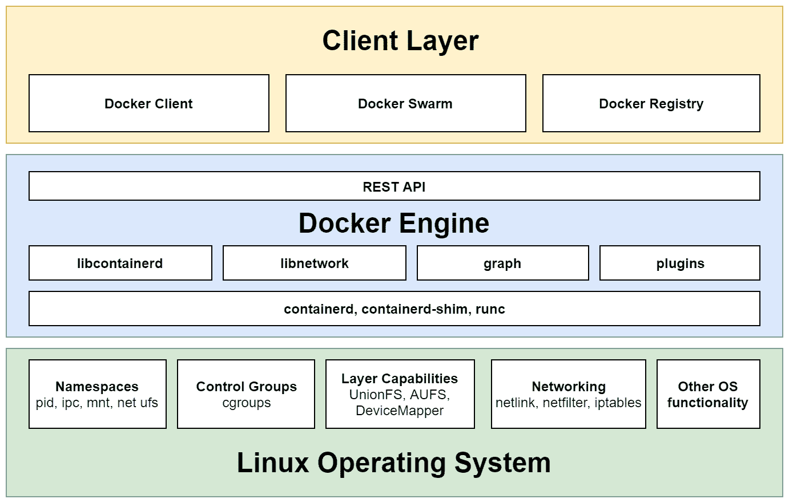

从 Linux 操作系统的角度来看，容器运行时架构如下图所示。这个架构适用于 Linux 上的容器引擎，不仅仅是 Docker。

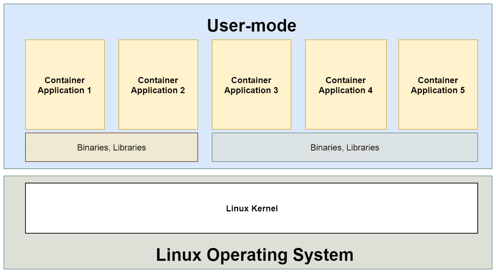

接下来，我们将看一下 Windows 上的 Docker 容器化。

# 在 Windows 上的 Docker 容器化

2014 年，当微软宣布在即将发布的 Windows Server 2016 中支持 Docker Engine 时，Docker 容器引擎在 Linux 上已经成熟，并被证明是容器管理的行业标准。这个事实推动了 Docker 和 Windows 容器化支持的设计决策，最终为运行进程隔离的 Windows Server 容器提供了类似的架构。Docker Engine 使用的 Windows 内核功能大致映射如下：

+   **内核命名空间**：这个功能是由 Windows 内核中的对象命名空间和进程表等提供的。

+   控制组：Windows 有自己的*作业对象*概念，允许一组进程作为单个单元进行管理。基本上，这个功能提供了类似于 Linux 上的*cgroups*的功能。

+   层文件系统功能：*Windows 容器隔离文件系统*是一个文件系统驱动程序，为在 Windows 容器中执行的进程提供虚拟文件系统视图。这类似于 Linux 操作系统上的*UnionFS*或其他*联合挂载*的实现。

在这些低级功能之上，服务层由一个**主机计算服务**（**HCS**）和一个**主机网络服务**（**HNS**）组成，为使用 C#和 Go（hcsshim）提供了运行和管理容器的公共接口。有关当前容器平台工具的更多信息，请参阅官方文档：[`docs.microsoft.com/en-us/virtualization/windowscontainers/deploy-containers/containerd#hcs`](https://docs.microsoft.com/en-us/virtualization/windowscontainers/deploy-containers/containerd#hcs)。

重要的是要知道，Windows 容器有两种类型：进程隔离和 Hyper-V 隔离。它们之间的区别将在下一节中解释 - 隔离是容器的运行时属性，您可以期望它们在一般情况下表现类似，并且只在安全性和兼容性方面有所不同。

以下图表总结了容器化架构和 Docker 对 Windows 的支持：

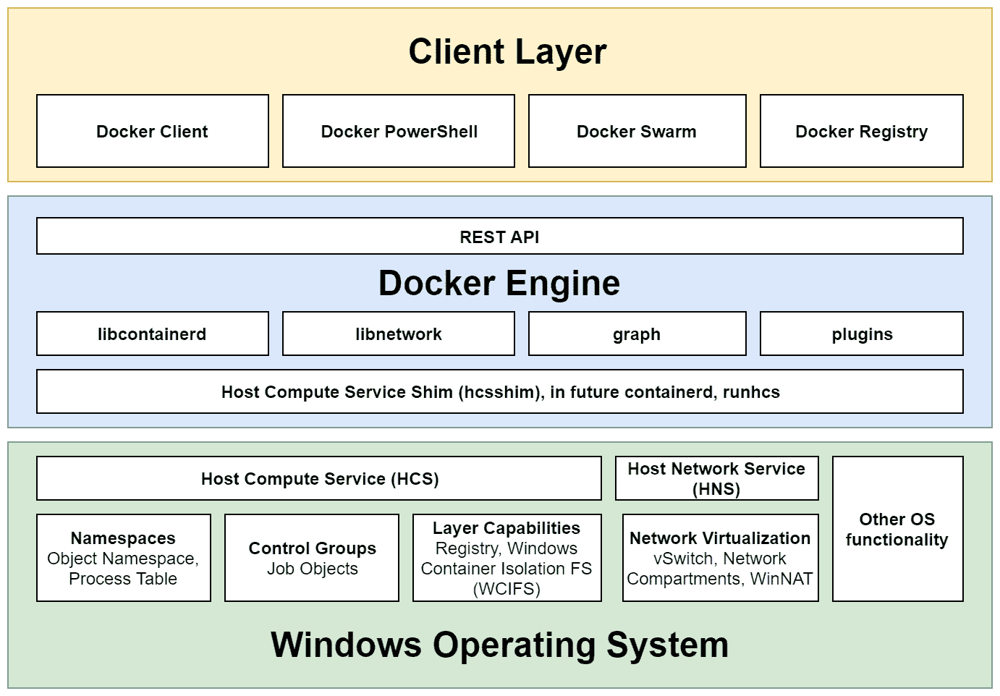

为了与 Linux 上容器化的高级架构进行比较，以下图表展示了 Windows 的多容器运行时架构。在这一点上，我们只考虑*进程隔离的 Windows Server 容器*，它们与 Linux 上的容器非常相似，但在下一节中，我们还将介绍 Windows 上容器的*Hyper-V 隔离*架构：

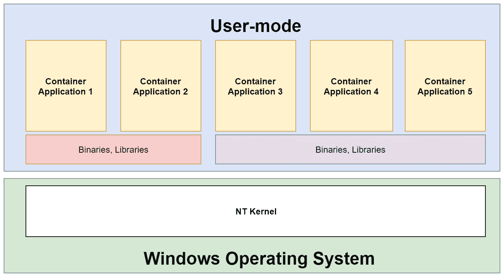

接下来，让我们看一下 Linux 和 Windows 上容器的一些区别。

# Linux 和 Windows 上容器之间的关键区别

Linux 和 Windows 上的 Docker 容器在原则上旨在解决相同的问题，目前，容器管理体验开始在这些平台上趋于一致。然而，如果您来自 Linux 生态系统，并且在那里广泛使用了 Docker，您可能会对一些不同感到惊讶。让我们简要总结一下。

最大且最明显的限制是 Windows 主机操作系统和 Windows 容器操作系统的兼容性要求。在 Linux 的情况下，您可以安全地假设，如果主机操作系统内核运行的是最低要求版本 3.10，那么任何 Linux 容器都将无需任何问题地运行，无论它基于哪个发行版。对于 Windows 来说，可以运行具有与受支持的主机操作系统版本完全相同的基础操作系统版本的容器，而不受任何限制。在旧的主机操作系统上运行更新的容器操作系统版本是不受支持的，而且更重要的是，在更新的主机操作系统上运行旧的容器操作系统版本需要使用*Hyper-V 隔离*。例如，运行 Windows Server 版本 1803 构建 17134 的主机可以原生地使用具有基础镜像版本 Windows Server 版本 1803 构建 17134 的容器，但在需要使用 Hyper-V 隔离的情况下，运行具有 Windows Server 版本 1709 构建 16299 的容器，并且根本无法启动具有 Windows Server 2019 构建 17763 的容器。以下表格可视化了这一原则：

| **主机操作系统版本** | **容器基础镜像操作系统版本** | **兼容性** |
| --- | --- | --- |
| Windows Server，版本 1803 构建 17134 | Windows Server，版本 1803 构建 17134 | *进程*或*Hyper-V*隔离 |
| Windows Server，版本 1803 构建 17134 | Windows Server，版本 1709 构建 16299 | *Hyper-V*隔离 |
| Windows Server，版本 1803 构建 17134 | Windows Server 2019 构建 17763 | 不支持 |
| Windows Server 2019 构建 17763 | Windows Server 2019 构建 17763 | *进程*或*Hyper-V*隔离 |

有关更详细的兼容性矩阵，请参阅官方微软文档：[`docs.microsoft.com/en-us/virtualization/windowscontainers/deploy-containers/version-compatibility#choose-which-container-os-version-to-use`](https://docs.microsoft.com/en-us/virtualization/windowscontainers/deploy-containers/version-compatibility#choose-which-container-os-version-to-use)。

值得一提的是，Hyper-V 隔离的要求可能是云环境或在虚拟机上运行 Docker 时的一个重要限制。在这种情况下，Hyper-V 隔离需要由 hypervisor 启用嵌套虚拟化功能。我们将在下一节详细介绍 Hyper-V 隔离。

在 Linux 和 Windows 容器的基本图像之间的大小差异是你可能注意到的另一个重要方面。目前，最小的 Windows Server 图像`mcr.microsoft.com/windows/nanoserver:1809`大小为 98 MB，而例如，Alpine Linux 的最小图像`alpine:3.7`只有 5 MB。完整的 Windows Server 图像`mcr.microsoft.com/windows/servercore:ltsc2019`超过 1.5 GB，而 Windows 的基本图像`mcr.microsoft.com/windows:1809`为 3.5 GB。但值得一提的是，自 Windows Server 2016 Core 图像首次发布时，图像大小为 6 GB，这些数字不断下降。

这些差异更多地可以看作是 Windows 上 Docker 容器的限制。然而，有一个方面是 Windows 比 Linux 提供更多灵活性的地方 - 支持在 Windows 上运行 Linux 容器。Windows 10 的 Docker Desktop 支持这样的场景。尽管这个功能仍在开发中，但在 Windows 10 上使用 Hyper-V 隔离可以同时托管 Linux 容器和 Windows 容器。我们将在下一节更详细地介绍这个功能。而在 Linux 上运行 Windows 容器的相反情况没有本地解决方案，需要在 Linux 主机上手动托管额外的 Windows 虚拟机。

Windows Server 也支持运行 Linux 容器，前提是启用了**Linux 容器在 Windows 上**（**LCOW**）实验性功能。

在下一节中，我们将重点关注不同 Windows 容器运行时变体之间的差异。

# 理解 Windows 容器的变体

Windows 容器有两种不同的隔离级别：进程和 Hyper-V。进程隔离也被称为**Windows Server 容器**（**WSC**）。最初，进程隔离仅适用于 Windows Server 操作系统，而在 Windows 桌面版本上，您可以使用 Hyper-V 隔离运行容器。从 Windows 10 的 1809 版本（2018 年 10 月更新）和 Docker Engine 18.09.1 开始，进程隔离也适用于 Windows 10。

在官方文档中，您可能会发现 Windows 容器*类型*和*运行时*这些术语。它们也指的是隔离级别，这些术语可以互换使用。

现在，让我们来看看这些隔离级别的区别，它们的用例是什么，以及如何通过指定所需的隔离类型来创建容器。

# 进程隔离

进程隔离容器，也称为**WSC**，是 Windows Server 上容器的默认隔离模式。进程隔离的架构类似于在 Linux OS 上运行容器时的架构：

+   容器使用相同的共享内核。

+   隔离是在内核级别提供的，使用诸如进程表、对象命名空间和作业对象等功能。更多信息可以在*Windows 上的 Docker 容器化*部分找到。

这在以下图表中总结如下：


进程隔离为容器提供了轻量级的运行时（与 Hyper-V 隔离相比），并提供了更高的部署密度、更好的性能和更低的启动时间。然而，在使用这种类型的隔离时，有一些要考虑的要点：

+   Docker 容器基础镜像必须与容器主机操作系统的版本匹配。例如，如果您正在运行 Windows 10，1903 版本，您只能运行使用 Windows 10 或 Windows Server 1903 版本基础镜像的容器。这意味着您必须为每个发布的 Windows 版本重新构建镜像（仅适用于主要*功能更新*）。

+   这应该只用于执行受信任的代码。为了执行不受信任的代码，建议使用 Hyper-V 隔离。

使用 Windows 10，1809 版本及更高版本，可以在容器运行时使用进程隔离，前提是您正在运行 Docker Desktop for Windows 2.0.1.0 *(Edge*发布渠道)或更高版本和 Docker Engine 18.09.1+。对于 Windows 10，容器的默认隔离级别是 Hyper-V，为了使用进程隔离，必须在使用`--isolation=process`参数创建容器时明确指定：

```
docker run -d --isolation=process mcr.microsoft.com/windows/nanoserver:1903 cmd /c ping localhost -n 100
```

此选项也可以作为参数指定给 Docker 守护程序，使用`--exec-opt`参数。有关更多详细信息，请参阅官方 Docker 文档：[`docs.docker.com/engine/reference/commandline/run/#specify-isolation-technology-for-container---isolation`](https://docs.docker.com/engine/reference/commandline/run/#specify-isolation-technology-for-container---isolation)。

在 Windows 10 操作系统上使用进程隔离容器仅建议用于开发目的。对于生产部署，您仍应考虑使用 Windows Server 进行进程隔离容器。

# Hyper-V 隔离

Hyper-V 隔离是 Windows 容器的第二种隔离类型。在这种隔离类型中，每个容器都在一个专用的、最小的 Hyper-V 虚拟机中运行，可以简要总结如下：

+   容器不与主机操作系统共享内核。每个容器都有自己的 Windows 内核。

+   隔离是在虚拟机 hypervisor 级别提供的（需要安装 Hyper-V 角色）。

+   主机操作系统版本和容器基础操作系统版本之间没有兼容性限制。

+   这是推荐用于执行不受信任的代码和多租户部署，因为它提供了更好的安全性和隔离性。

Hyper-V 隔离的详细架构可以在以下图表中看到：

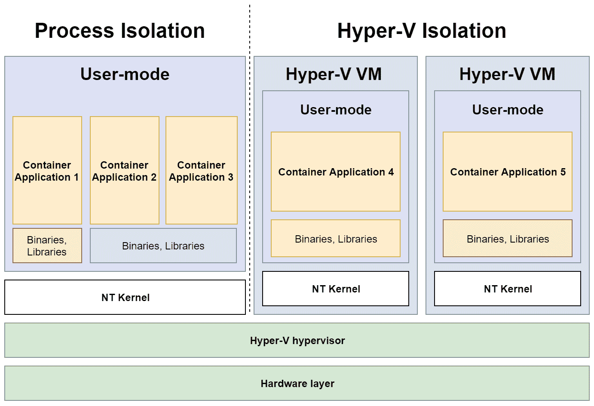

在选择隔离级别时，这种隔离类型会带来一些成本：

+   与进程隔离相比，Hyper-V 隔离涉及虚拟化开销、更高的内存和 CPU 使用量，但仍然比在 Windows Nano Server 上运行完整虚拟机提供更好的性能。您可以在以下表格中查看使用不同隔离级别运行容器的内存要求。

+   与进程隔离相比，容器的启动时间较慢。

+   在虚拟机上运行容器时需要嵌套虚拟化。这可能是一些虚拟化程序和云部署的限制。以下表格显示了 Windows Server 1709 容器的内存要求：

| **容器基础镜像** | **进程隔离（WSC）** | **Hyper-V 隔离** |
| --- | --- | --- |
| Nano Server | 30 MB | 110 MB + 1 GB 页面文件 |
| Server Core | 45 MB | 360 MB + 1 GB 页面文件 |

与进程隔离相比，容器镜像保持不变；在创建实际容器时，只需要指定不同的隔离级别。您可以使用`--isolation=hyperv`参数来实现这一点：

```
docker run -d --isolation=hyperv mcr.microsoft.com/windows/nanoserver:1809 cmd /c ping localhost -n 100
```

请注意，在这种情况下，即使您使用的是 Windows 10 的 1903 版本，也可以使用 1809 版的容器基础镜像而没有任何限制。

在 Windows 10 上运行容器时，Hyper-V 隔离是默认的隔离级别，因此不需要`--isolation=hyperv`参数。反之亦然；进程隔离是 Windows Server 的默认级别，如果要使用 Hyper-V 隔离，必须明确指定。可以通过在`daemon.json`配置文件中指定`exec-opts`中的`isolation`参数来更改默认隔离级别。有关更多信息，请参阅[`docs.docker.com/engine/reference/commandline/dockerd/#daemon-configuration-file`](https://docs.docker.com/engine/reference/commandline/dockerd/#daemon-configuration-file)和[`docs.docker.com/engine/reference/commandline/dockerd/#docker-runtime-execution-options`](https://docs.docker.com/engine/reference/commandline/dockerd/#docker-runtime-execution-options)。

# Windows 上的 Linux 容器

2017 年 4 月，Docker 宣布推出 LinuxKit，这是一个在不带 Linux 内核的平台上运行 Linux 容器的解决方案，即 Windows 和 macOS。LinuxKit 是一个用于构建便携和轻量级 Linux 子系统的工具包，其中只包含在特定平台上运行 Linux 容器所需的最低限度。尽管自 2016 年首次发布以来，Docker 能够在 Windows 上以有限的程度运行 Linux 容器，但 LinuxKit 的宣布是开始今天我们所知的**Windows 上的 Linux 容器**（**LCOW**）故事的里程碑。

在生产部署中，不建议在 Windows 上运行 Linux 容器。使用 LinuxKit 和 MobyLinuxVM 仅适用于 Windows 桌面和开发目的。与此同时，LCOW 功能仍处于实验阶段，不适合生产环境使用。

# LinuxKit 和 MobyLinuxVM

Docker for Windows（当时 Docker Desktop for Windows 的初始名称）最终配备了基于 LinuxKit 的专用 Hyper-V 虚拟机，名为 MobyLinuxVM。这个虚拟机的目的是为 Linux 容器提供一个最小的运行时，从技术上讲可以与 Windows 容器并存。

默认情况下，Docker Desktop for Windows 以 Linux 容器模式运行，使用 MobyLinuxVM。要切换到 Windows 容器模式，必须转到 Docker Desktop 托盘图标，选择切换到 Windows 容器.... Docker 将重新启动并切换到本机 Windows 容器。

在这个解决方案中，MobyLinuxVM 运行自己的 Docker 守护程序，技术上充当一个封装在虚拟机内部的独立容器主机。同样，Windows 有自己的 Docker 守护程序，负责 Windows 容器，并提供 Docker 客户端（CLI），可以与两个 Docker 守护程序通信。这个架构可以在下图中看到：

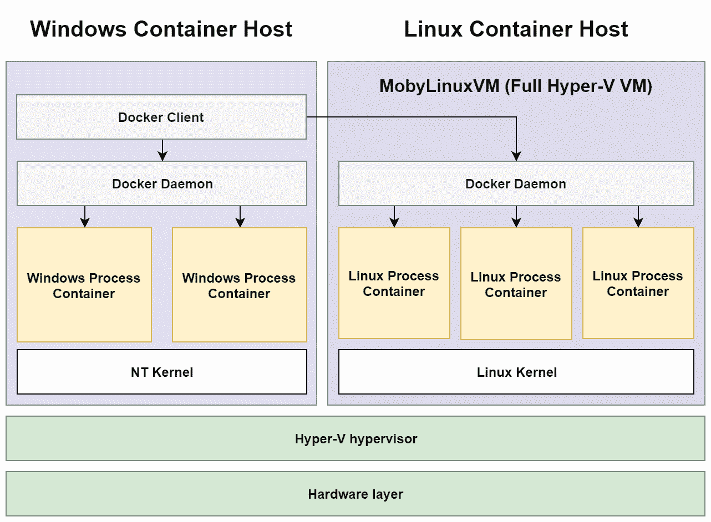

现在，让我们来看一个更为现代的在 Windows 上运行 Linux 容器的方法：LinuxKit LCOW。

# LinuxKit LCOW 和 Hyper-V 隔离

与 MobyLinuxVM 方法相反，**Windows 上的 Linux 容器**（**LCOW**）使用 Hyper-V 隔离容器来实现类似的结果。LCOW 适用于 Windows 10，配备 Docker for Windows 17.10，并适用于 Windows Server 1709 版本，配备 Docker 企业版的预览版本。

与 MobyLinuxVM 相比的主要区别是可以使用*相同的* Docker 守护程序本地运行 Linux 和 Windows 容器。这个解决方案是支持在 Windows 上运行 Linux 容器的当前策略，但作为长期解决方案，在 2019 年 6 月，Docker 和微软开始合作，将 Windows 子系统版本 2 集成为 Windows 上的主要 Linux 容器运行时。最终，LinuxKit LCOW 和带有 Docker Desktop for Windows 的 MobyLinuxVM 将被淘汰。

下图显示了 LCOW：

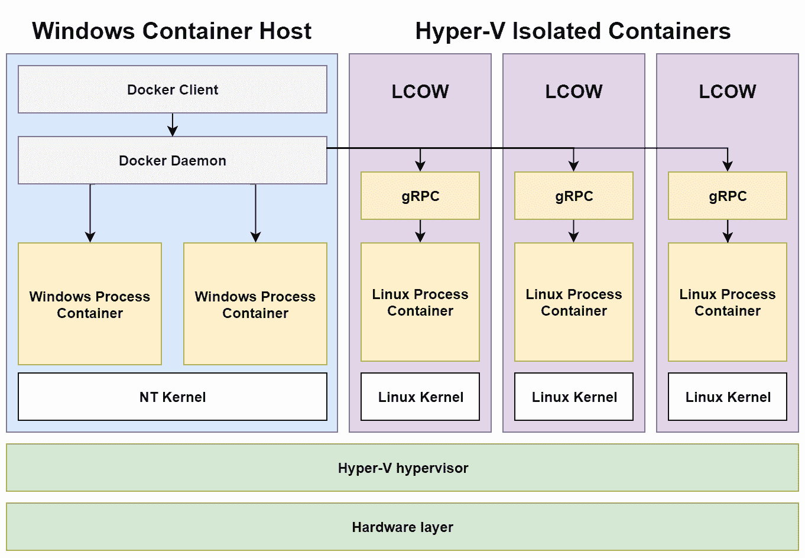

要在 Docker Desktop（18.02 版本或更高版本）中启用 LCOW 支持，必须在 Docker 设置>*守护程序中启用实验性功能选项。创建 LCOW 容器需要指定`--platform linux`参数（如果平台选择是明确的，即镜像只存在于 Linux 中，则在较新版本的 Docker Desktop 中可以省略）：

```
docker run -it --platform linux busybox /bin/sh
```

上述命令将创建一个 busybox Linux 容器，并进入交互式 Bourne shell（sh）。

截至 Docker Desktop for Windows 2.0.4.0 版本，启用 LCOW 功能后，无法运行 Docker 提供的开发 Kubernetes 集群（“一应俱全”）。

在这一部分，您了解了容器目前在 Windows 平台上的支持情况以及所提供运行时之间的关键区别。现在，我们可以开始安装**Windows 的 Docker 桌面**。

# 安装 Windows 的 Docker 桌面工具

在 Windows 上创建 Kubernetes 应用程序需要一个用于开发和测试 Docker 容器的环境。在本节中，您将学习如何安装 Windows 的 Docker 桌面，这是开发、构建、交付和在 Windows 10 上运行 Linux 和 Windows 容器的推荐工具环境。首先，让我们在继续安装过程之前回顾一下先决条件和 Docker 的最低要求：

+   至少 4GB 的 RAM。

+   在 BIOS 中启用**Intel 虚拟化技术** (**Intel VT**)或**AMD 虚拟化** (**AMD-V**)技术。请注意，如果您将 VM 用作开发机器，Windows 的 Docker 桌面不保证支持嵌套虚拟化。如果您想了解更多关于这种情况的信息，请参考[`docs.docker.com/docker-for-windows/troubleshoot/#running-docker-desktop-for-windows-in-nested-virtualization-scenarios`](https://docs.docker.com/docker-for-windows/troubleshoot/#running-docker-desktop-for-windows-in-nested-virtualization-scenarios)。

+   已安装 Windows 10 Pro、企业版或教育版（1903 版本或更高版本，64 位）。当前的 Docker 桌面支持 1703 版本或更高版本，但为了在本书的示例中获得最佳体验，建议您将其升级到 1903 版本或更高版本。您可以通过打开开始菜单，选择设置图标，然后导航到系统 > 关于来检查 Windows 的版本。您将在 Windows 规格下找到必要的详细信息。

Windows 的 Docker 桌面也被称为 Windows 的 Docker 和 Docker **社区版** (**CE**)。如果您正在遵循较旧的安装指南，这一点尤为重要。

如果您对 Windows Server 上的 Docker 企业版的安装感兴趣，请参考第七章，*部署混合本地 Kubernetes 集群*。

# 稳定和边缘渠道

根据您的需求，您可以选择 Windows 的 Docker 桌面的两个发布渠道：**稳定**和**边缘**。如果您满意以下情况，您应该考虑使用稳定渠道：

+   您希望使用推荐和可靠的平台来处理容器。稳定频道中的发布遵循 Docker 平台稳定发布的发布周期。您可以期望稳定频道的发布每季度进行一次。

+   您想选择是否发送使用统计信息。

如果您同意以下内容，可以考虑使用边缘频道：

+   您希望尽快获得实验性功能。这可能会带来一些不稳定性和错误。您可以期望边缘频道的发布每月进行一次。

+   您同意收集使用统计数据。

现在，让我们继续进行安装。

# 安装

本节中描述的安装过程遵循官方 Docker 文档的建议。让我们开始：

如果您在 Windows 系统上使用 chocolatey 来管理应用程序包，也可以使用官方的 Docker Desktop 可信包，网址为：[`chocolatey.org/packages/docker-desktop.`](https://chocolatey.org/packages/docker-desktop)

1.  为了下载 Windows 版 Docker Desktop，请转到[`hub.docker.com/editions/community/docker-ce-desktop-windows`](https://hub.docker.com/editions/community/docker-ce-desktop-windows)。下载需要注册服务。您还可以选择直接链接来下载稳定频道发布（[`download.docker.com/win/stable/Docker%20for%20Windows%20Installer.exe`](https://download.docker.com/win/stable/Docker%20for%20Windows%20Installer.exe)）或边缘频道发布（[`download.docker.com/win/edge/Docker%20Desktop%20Installer.exe`](https://download.docker.com/win/edge/Docker%20Desktop%20Installer.exe)）。

如果需要，Docker Desktop for Windows 将自动启用 Hyper-V 角色并重新启动计算机。如果您是 VirtualBox 用户或 Docker Toolbox 用户，则将无法同时运行 VirtualBox VM，因为 Type-1 和 Type-2 hypervisors 不能同时运行。您仍然可以访问现有的 VM 映像，但无法启动 VM。

1.  转到安装程序下载的目录，然后双击它。

1.  通过选择“使用 Windows 容器而不是 Linux 容器”选项，默认启用 Windows 容器支持：

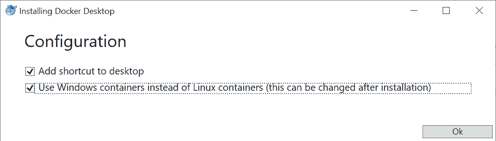

1.  进行安装：

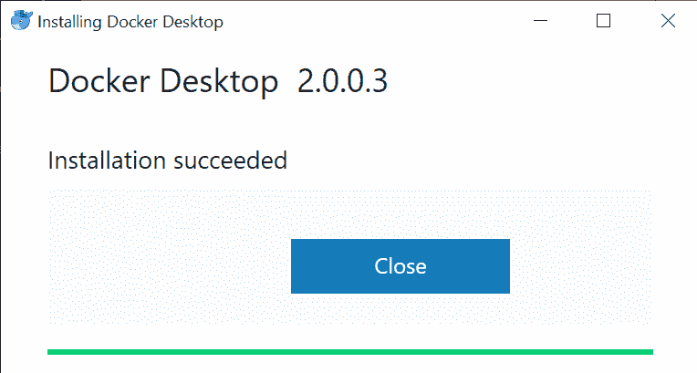

1.  如果安装程序启用了 Hyper-V 角色，可能会提示您重新启动计算机。

1.  启动 Docker 桌面应用程序。

1.  等待 Docker 完全初始化。您将看到以下提示：

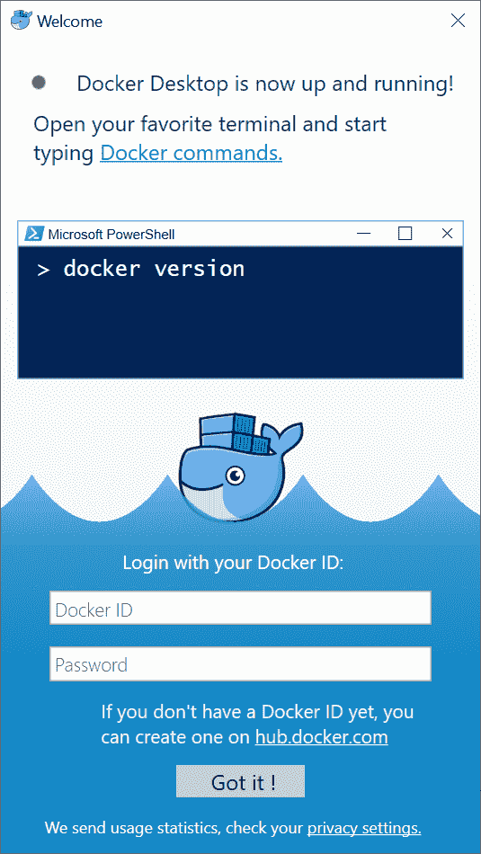

安装后，我们需要验证 Docker 是否已正确安装并能运行一个简单的*hello world*容器镜像。

# 验证安装

现在，让我们验证安装是否成功：

1.  通过打开 Powershell 并执行以下命令来确认 Docker 客户端是否正常工作：

```
docker version
```

1.  您应该看到类似以下的输出：

```
Client: Docker Engine - Community
 Version: 18.09.2
 API version: 1.39
 Go version: go1.10.8
 Git commit: 6247962
 Built: Sun Feb 10 04:12:31 2019
 OS/Arch: windows/amd64
 Experimental: false

Server: Docker Engine - Community
 Engine:
 Version: 18.09.2
 API version: 1.39 (minimum version 1.12)
 Go version: go1.10.6
 Git commit: 6247962
 Built: Sun Feb 10 04:13:06 2019
 OS/Arch: linux/amd64
 Experimental: false
```

1.  运行基于官方 Powershell 镜像的简单容器：

```
docker run -it --rm mcr.microsoft.com/powershell pwsh -c 'Write-Host "Hello, World!"'
```

1.  在运行此命令的第一次运行期间，将下载缺少的容器镜像层。过一段时间后，您将在 Powershell 的控制台输出中看到 Hello, World!：

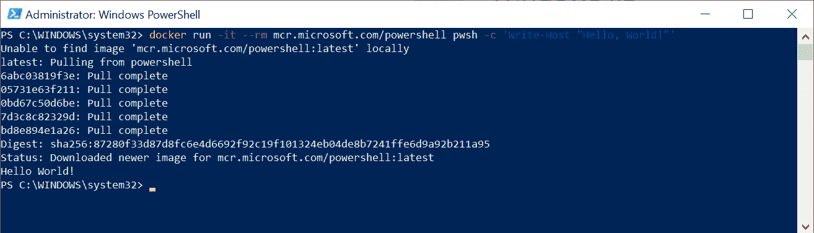

1.  恭喜！您已成功安装了 Windows 版 Docker 桌面并运行了您的第一个容器。

在下一小节中，您将学习如何为容器启用进程隔离。

# 运行进程隔离的容器

在 Windows 10 上，为了运行进程隔离的容器，您必须在创建容器时显式指定`--isolation=process`参数。正如我们之前提到的，还需要指定与您的操作系统匹配的容器镜像版本。让我们开始吧：

1.  假设您正在运行 Windows 10，版本**1903**，让我们执行以下命令，尝试在分离（后台）模式下创建一个进程隔离的容器。运行 ping 命令，指定要发送到本地主机机器的回显请求的数量，即`100`：

```
docker run -d --rm --isolation=process mcr.microsoft.com/windows/nanoserver:1809 cmd /c ping localhost -n 100
```

所选的 mcr.microsoft.com/windows/nanoserver 镜像版本为 1809，与您的操作系统版本不匹配。因此，它将因错误而失败，通知您容器的基本镜像操作系统版本与主机操作系统不匹配：

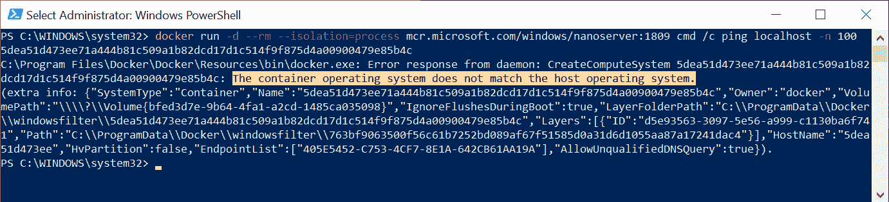

1.  现在，让我们执行类似的命令，但现在指定正确的匹配版本（1903）的容器基本镜像：

```
docker run -d --rm --isolation=process mcr.microsoft.com/windows/nanoserver:1903 cmd /c ping localhost -n 100
```

在这种情况下，容器已成功启动，可以使用`docker ps`命令进行验证：

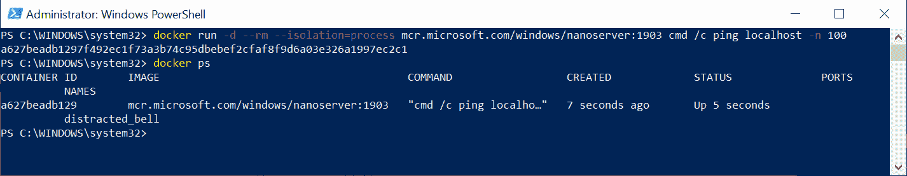

1.  现在，让我们检查进程隔离在实践中与 Hyper-V 隔离有何不同。我们将比较这两种隔离类型之间主机 OS 中容器进程的可见性。

1.  首先，获取您新创建的进程隔离容器的容器 ID。这个容器应该运行几分钟，因为它在终止并自动删除之前会执行 100 次对本地主机的回显请求。在我们的示例中，容器 ID 是`a627beadb1297f492ec1f73a3b74c95dbebef2cfaf8f9d6a03e326a1997ec2c1`。使用`docker top <containerId>`命令，可以列出容器内运行的所有进程，包括它们的**进程 ID**（**PID**）：

```
docker top a627beadb1297f492ec1f73a3b74c95dbebef2cfaf8f9d6a03e326a1997ec2c1
```

以下屏幕截图显示了上述命令的输出：

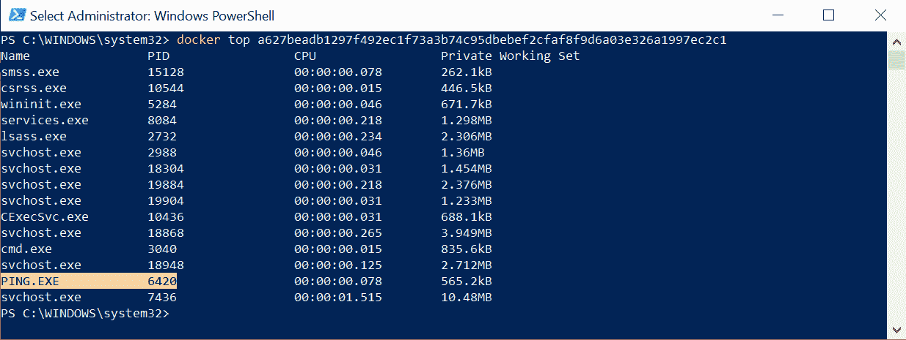

在上述屏幕截图中，容器内的`ping.exe`进程的 PID 为`6420`。为了列出在主机 OS 的上下文中运行的`ping.exe`进程，请在 Powershell 中使用`Get-Process`命令：

```
Get-Process -Name ping
```

以下屏幕截图显示了上述命令的输出：

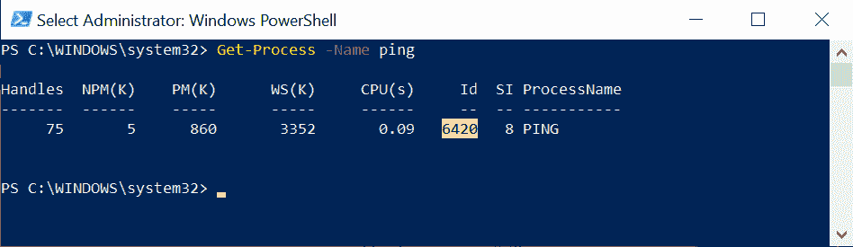

上述输出显示，容器内运行的`ping.exe`进程也可以从主机上看到，并且 PID 完全相同：`6420`。

为了进行比较，我们将创建一个类似的容器，但这次指定`--isolation=hyperv`参数以强制使用 Hyper-V 隔离。在 Windows 10 上，当运行默认的 Docker 配置时，可以完全省略`--isolation`参数，因为默认隔离级别是 Hyper-V。我们可以使用以下命令创建容器（使用与主机不同的基本镜像 OS 版本）：

```
docker run -d --rm --isolation=hyperv mcr.microsoft.com/windows/nanoserver:1809 cmd /c ping localhost -n 100
```

以下屏幕截图显示了上述命令的输出：

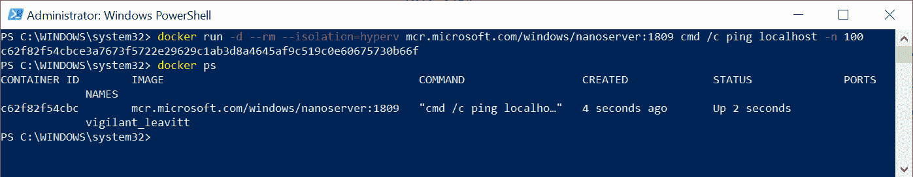

容器已成功启动。在这种情况下，容器 ID 是`c62f82f54cbce3a7673f5722e29629c1ab3d8a4645af9c519c0e60675730b66f`。检查容器内运行的进程会发现`ping.exe`的 PID 为`1268`：

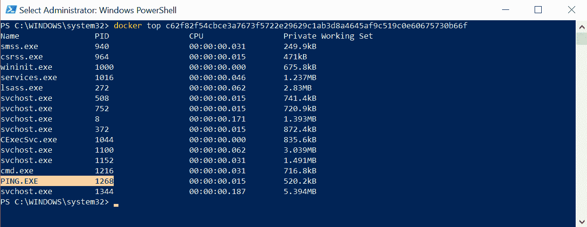

当检查主机上运行的进程时，您会发现没有 PID 为`1268`的`ping.exe`进程（也没有 PID 为`1216`的`cmd.exe`进程，这是容器中的主要进程）。

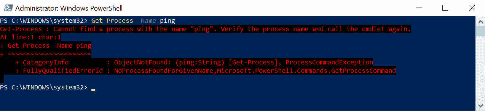

这是因为在 Hyper-V 容器中运行的进程不会与主机共享内核，因为它们在单独的轻量级 Hyper-V VM 中执行，并且具有与容器基础镜像 OS 版本匹配的自己的内核。

现在，是时候在 Windows 上使用 LCOW 运行你的第一个 Linux 容器了！

# 运行 LCOW 容器

默认情况下，Docker Desktop for Windows 使用 MobyLinuxVM 托管 Linux 容器，为其提供了一个最小的、完全功能的环境。这种方法仅用于开发和测试目的，因为它在 Windows Server 上不可用。Windows Server 目前对 LCOW 有实验性支持，也可以在 Docker Desktop 中启用此功能。

要在 Docker Desktop 中启用 LCOW 支持，您必须在 Docker Daemon 中启用实验性功能。让我们来看一下：

1.  打开 Docker Desktop 托盘图标并选择设置。

1.  导航到 Daemon 选项卡。

1.  启用实验性功能复选框：

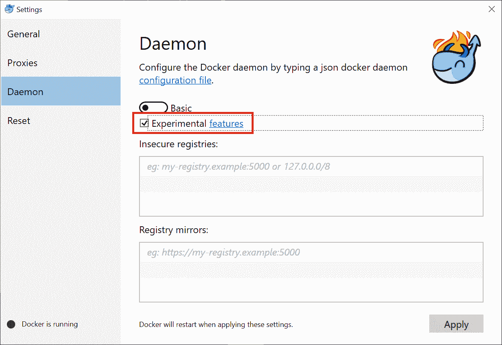

1.  应用更改。 Docker Desktop 将重新启动。

打开 PowerShell 并创建一个使用 Linux 作为基础镜像的容器，通过提供 `--platform=linux` 参数给 `docker run`。在这个例子中，我们以交互模式创建一个 busybox 容器，并启动 Bourne shell：

```
docker run --rm -it --platform=linux busybox /bin/sh
```

如果镜像存在一个平台的版本，则不需要提供 `--platform` 参数。下载镜像后，也不再需要指定 `--platform` 参数来运行容器。

容器启动后，Bourne shell 提示符将出现 (`/ #`)。现在，您可以使用 `uname` 命令验证您确实在 Linux 容器内运行，该命令会打印 Linux 内核信息：

```
uname -a
```

以下截图显示了前面命令的输出：

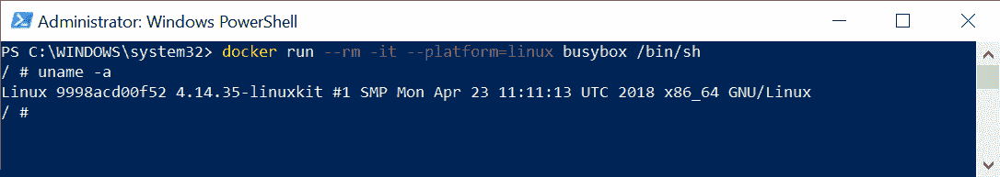

在一个单独的 Powershell 窗口中，在不关闭容器中的 Bourne shell 的情况下，执行 `docker inspect <containerId>` 命令以验证容器确实是使用 LCOW 使用 Hyper-V 隔离运行的：

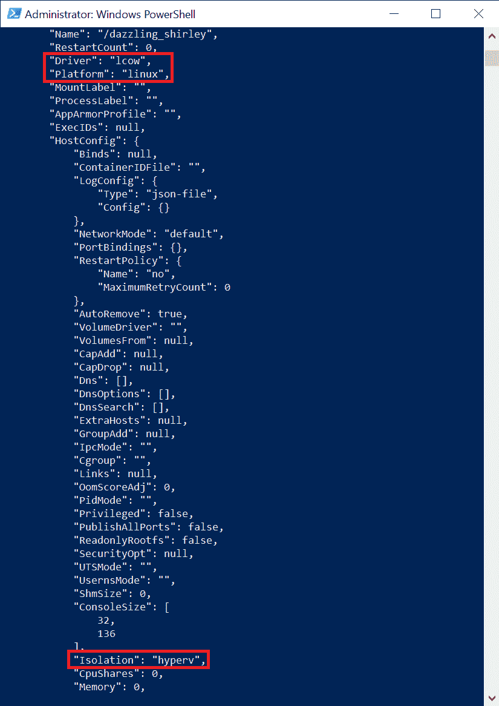

在本节中，您学习了如何安装 Docker Desktop for Windows 工具和验证其功能，包括在 Windows 上运行 Linux 容器。在下一节中，您将学习如何使用 Visual Studio Code 来构建您的第一个 Windows 容器镜像。

# 构建你的第一个容器

在上一节中，您已经学会了如何在 Windows 上安装 Docker Desktop 以及如何运行简单的 Windows 和 Linux 容器。本节将演示如何使用 Dockerfile 构建自定义 Docker 镜像，以及如何执行运行容器的最常见操作，例如访问日志和执行`exec`进入容器。

Dockerfile 是一个文本文件，包含用户执行的所有命令，以组装容器镜像。由于本书不仅关注 Docker，本节将简要回顾常见的 Docker 操作。如果您对 Dockerfile 本身和构建容器感兴趣，请参考官方文档：[`docs.docker.com/engine/reference/builder/`](https://docs.docker.com/engine/reference/builder/)。

例如，我们将准备一个 Dockerfile，创建一个 Microsoft IIS 的 Windows 容器镜像，托管一个演示 HTML 网页。为了演示操作原则，镜像定义不会很复杂。

# 准备 Visual Studio Code 工作区

第一步是准备 Visual Studio Code 工作区。Visual Studio Code 需要您安装一个额外的扩展来管理 Docker。让我们开始吧：

1.  为了做到这一点，按*Ctrl*+*Shift*+*X*打开扩展视图。

1.  在扩展：市场中，搜索`docker`并安装微软官方的 Docker 扩展：

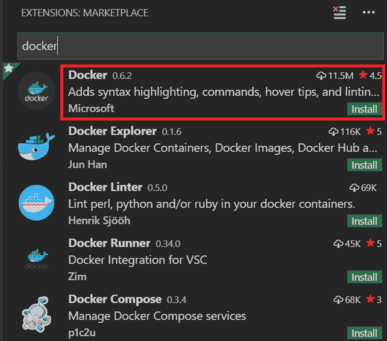

本节演示的所有操作都可以在任何代码/文本编辑器和使用命令行中执行，而无需使用 Visual Studio Code。Visual Studio Code 是一个有用的多平台 IDE，用于开发和测试在 Docker 容器中运行的应用程序。

安装完成后，Docker Explorer 将可用：

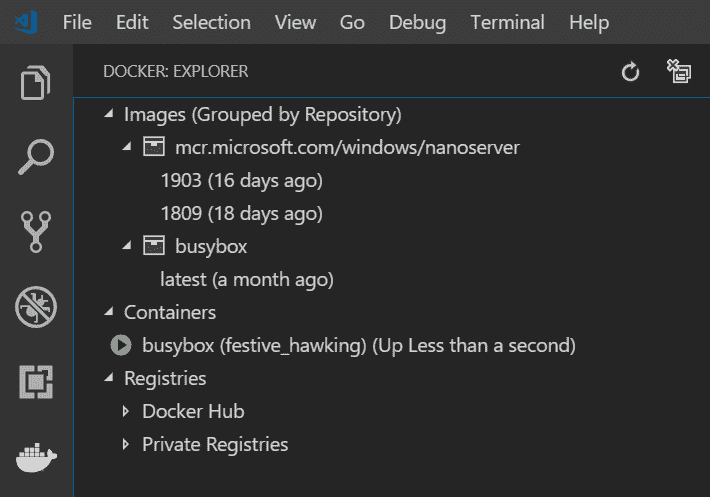

1.  您还可以在按下*Ctrl*+*Shift*+P 后，输入`docker`到搜索栏中，从命令面板中利用新的面向 Docker 的命令。

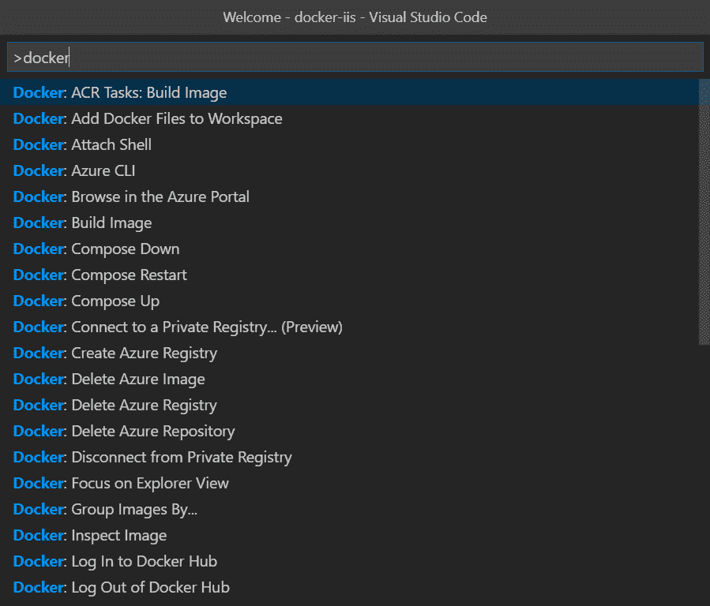

1.  现在，通过使用*Ctrl*+*K*，*Ctrl*+*O*快捷键初始化工作区，打开所需的文件夹或导航到文件|打开文件夹...。

在下一小节中，我们将创建一个演示 HTML 网页，该网页将托管在 Windows 容器中。

# 创建一个示例 HTML 网页

我们将通过创建一个简约的 HTML“Hello World！”网页来开始创建我们的 Docker 镜像。这一步骤模拟了在没有任何容器化的情况下实现应用程序，并且在应用程序开发中是一个常见的场景：您正在运行一个非容器化的应用程序，然后将其移动到 Docker 容器中。

您还可以使用本书的 GitHub 存储库中的文件来执行此操作，该存储库位于：[`github.com/PacktPublishing/Hands-On-Kubernetes-on-Windows/tree/master/Chapter01/01_docker-helloworld-iis`](https://github.com/PacktPublishing/Hands-On-Kubernetes-on-Windows/tree/master/Chapter01/01_docker-helloworld-iis)。

使用*Ctrl* + *N*快捷键或通过导航到文件 > 新建文件在 Visual Studio Code 中的工作区中添加一个新文件。在新文件中使用以下示例 HTML 代码：

```
<!DOCTYPE html>
<html>
    <head>
        <title>Hello World!</title>
    </head>
    <body>
        <h1>Hello World from Windows container!</h1>
    </body>
</html>
```

将文件保存（使用*Ctrl* + S）为`index.html`在您的工作区中。

让我们继续创建 Dockerfile 本身。

# 创建 Dockerfile

由于我们将在容器中使用 IIS 托管网页，因此我们需要创建一个**Dockerfile**，该文件使用`mcr.microsoft.com/windows/servercore/iis`官方镜像作为构建的基础镜像。我们将使用带有`windowsservercore-1903`标签的 Docker 镜像，以确保我们运行与主机操作系统匹配的版本，并使其能够使用进程隔离。

在您的工作区中创建一个名为`Dockerfile`的新文件，其中包含以下内容：

```
FROM mcr.microsoft.com/windows/servercore/iis:windowsservercore-1903

RUN powershell -NoProfile -Command Remove-Item -Recurse C:\inetpub\wwwroot\*
WORKDIR /inetpub/wwwroot
COPY index.html .
```

在编写 Dockerfile 时，Visual Studio Code 会提供许多代码片段，前提是您已经按照预期的约定命名了文件。您还可以在编辑时按*Ctrl* + SPACE 来显示代码片段列表。

在下一小节中，您将学习如何根据刚刚创建的 Dockerfile 手动构建 Docker 镜像。

# 构建 Docker 镜像

使用`docker build`命令来执行构建 Docker 镜像。在执行此步骤时，您有两个选项：

+   使用 Visual Studio Code 的命令面板。

+   使用 Powershell 命令行。

在 Visual Studio Code 中，执行以下操作：

1.  使用*Ctrl* + *Shift* + *P*快捷键打开命令面板。

1.  搜索 Docker: Build Image 并按照以下格式执行它，提供镜像名称和标签（或者使用基于目录名称的默认建议名称）：

```
<image name>:<tag>
```

1.  如果您已登录到自定义注册表或使用 Docker Hub，您还可以指定以下内容：

```
<registry or username>/<image name>:<tag>
```

Docker Registry 和公共 Docker Hub 的概念将在第三章中进行介绍，*使用容器镜像*。

在本示例中，我们将使用以下镜像名称和标签：`docker-helloworld-iis:latest`。

Visual Studio Code 命令相当于在 Powershell 中执行以下操作：

1.  将工作目录更改为包含`Dockerfile`的文件夹；例如：

```
cd c:\src\Hands-On-Kubernetes-on-Windows\Chapter01\docker-helloworld-iis
```

1.  执行`docker build`命令，同时指定`-t`参数以提供镜像名称和标签，并使用当前目录`.`作为构建上下文：

```
docker build -t docker-helloworld-iis:latest .
```

以下屏幕截图显示了前述命令的输出：

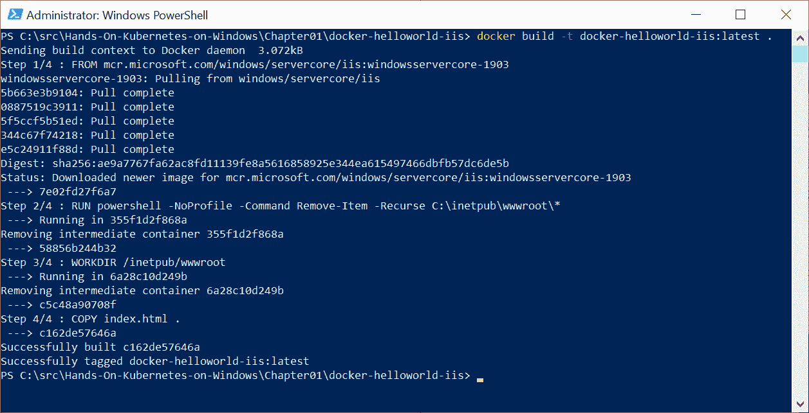

成功构建后，您可以使用`docker-helloworld-iis`本地镜像来创建新的容器。我们将在下一小节中介绍这个过程。

# 运行 Windows 容器

现在，让我们使用示例网页创建一个进程隔离的 Windows 容器。在 Visual Studio Code 中，导航至命令面板（*Ctrl* + *Shift* + *P*），找到 Docker: Run 命令。选择`docker-helloworld-iis`作为镜像。将打开一个带有适当命令的终端。

这相当于在 Powershell 中执行`docker run`命令，如下（如果您的主机机器上的端口*tcp/80*已被占用，请使用其他可用端口）：

```
docker run -d --rm --isolation=process -p 80:80 docker-helloworld-iis
```

成功启动容器后，通过网络浏览器导航至`http://localhost:80/`。您应该会看到以下输出：

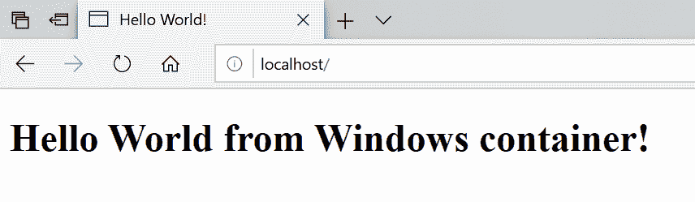

接下来，我们将检查容器日志，这是调试容器问题最有用的工具之一。

# 检查容器日志

访问容器中主进程的标准输出和标准错误日志对于调试容器化应用程序的问题至关重要。这在使用 Kubernetes 时也是常见的情况，您可以使用 Kubernetes CLI 工具执行类似的操作。

官方 Microsoft IIS Docker 镜像的当前架构不会将任何日志输出到`ServiceMonitor.exe`（容器中的主进程）的`stdout`，因此我们将在之前使用的简单`ping.exe`示例上进行演示。运行以下容器以创建容器：

```
docker run -d --rm --isolation=process mcr.microsoft.com/windows/nanoserver:1903 cmd /c ping localhost -n 100
```

现在，在 Visual Studio Code 中，您可以通过打开命令面板（*Ctrl* + *Shift* + *P*）并执行`Docker: Show Logs`命令来检查日志。选择容器名称后，日志将显示在终端中。或者，您可以使用 Docker Explorer 选项卡，展开容器列表，右键单击要检查的容器，然后选择显示日志：

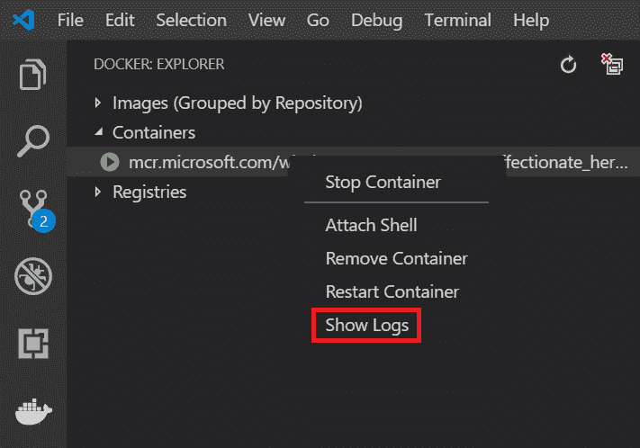

这将在 Visual Studio Code 中打开一个终端，以便您可以开始从容器的`stdout`和`stderr`实例中流式传输日志。

对于 PowerShell 命令行，您必须使用`docker logs`命令：

```
docker logs <containerId>
```

值得注意的是，在调试场景中，您可能会发现`-f`和`--tail`参数很有用：

```
docker logs -f --tail=<number of lines> <containerId>
```

`-f`参数指示实时跟踪日志输出，而`--tail`参数使其仅显示输出的最后几行。

除了检查容器日志之外，您经常需要`exec`进入正在运行的容器。这将在下一小节中介绍。

# 进入正在运行的容器

在调试和测试场景中，通常需要以临时方式在运行的容器内执行另一个进程。这对于在容器中创建一个 shell 实例（对于 Windows，使用`cmd.exe`或`powershell.exe`，对于 Linux，使用`bash`或`sh`）并进行交互式调试特别有用。这样的操作称为执行`exec`进入正在运行的容器。

Visual Studio Code 通过 Docker Explorer 实现了这一点。在 Docker Explorer 选项卡中，找到要进入的容器，右键单击它，然后选择附加 Shell：

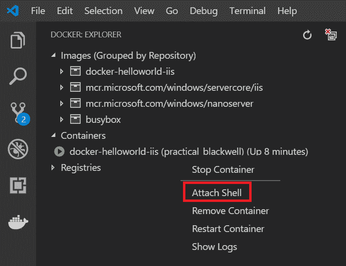

默认情况下，对于 Windows 容器，此命令将使用`powershell.exe`命令进行 exec。如果您正在运行基于 Windows Nano Server 的映像，则将无法使用`powershell.exe`，而必须改用`cmd.exe`。要自定义在附加 Shell 期间使用的命令，请打开设置（*Ctrl* + *,*），搜索 docker，并自定义 docker.attachShellCommand.windowsContainer 设置。

在 Powershell 命令行中，等效的`docker exec`命令如下：

```
docker exec -it <containerId> powershell.exe
```

上述命令在附加终端（`-it`参数）的交互模式下在运行的容器中创建了一个新的`powershell.exe`进程。如您所见，Powershell 终端的新交互式实例已打开：

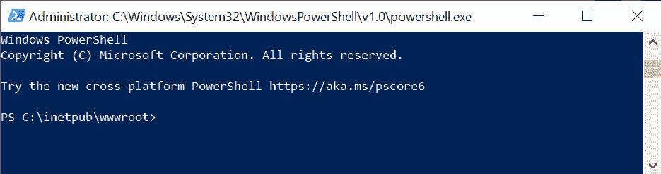

您只能进入正在运行主进程的容器。如果容器已退出、终止或处于暂停状态，则**无法**使用`exec`命令。

让我们尝试检查容器工作目录中`index.html`的内容：

```
cat .\index.html
```

以下截图显示了前述命令的输出：

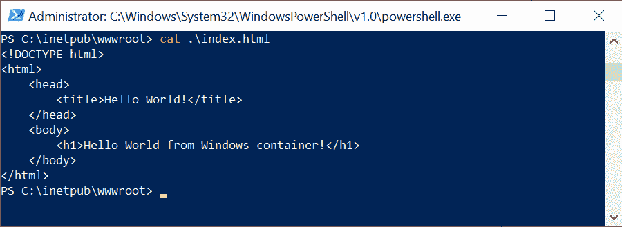

这显示了我们之前创建并添加到镜像中的`index.html`文件的预期内容。

我们还可以检查托管`index.html`的应用程序池的 IIS 工作进程（`w3wp.exe`）。这是在调试期间的常见场景，当不是所有日志都直接通过容器输出日志可用时：

```
cat ..\logs\LogFiles\W3SVC1\u_ex<current date>.log
```

以下截图显示了前述命令的输出：

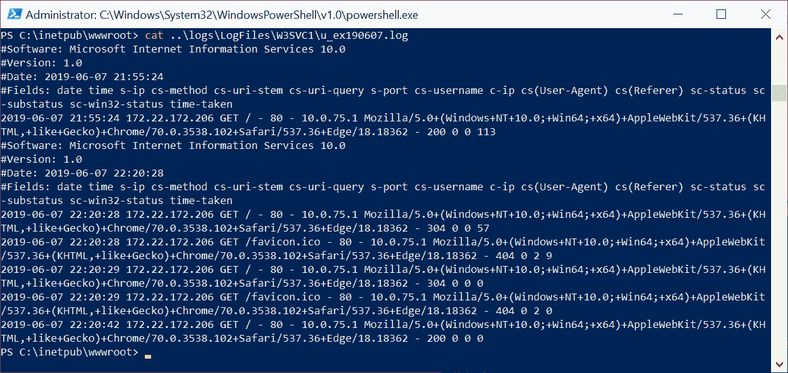

使用`docker exec`是您容器工具箱中最强大的命令之一。如果您学会如何使用它，您将能够几乎像在非容器化环境中托管应用程序一样进行调试。

# 摘要

在本章中，您了解了 Windows 容器架构的关键方面以及 Windows 容器运行时提供的隔离模式之间的区别。我们还介绍了如何在 Windows 平台上安装 Docker Desktop，并演示了如何使用 Docker CLI 执行最重要的操作。

本章和接下来的两章将是本书其余部分关于 Windows 上 Kubernetes 的基础。在下一章中，我们将专注于在 Windows 容器中管理状态，即在运行容器时如何持久化数据。

# 问题

1.  Windows 暴露哪些内核特性以实现容器化？

1.  在 Linux 和 Windows 上容器化之间的主要区别是什么？

1.  Hyper-V 隔离和进程隔离之间有什么区别？何时应该使用 Hyper-V 隔离？

1.  我们如何在 Windows 10 上启用 LCOW？

1.  我们可以使用什么命令来访问 Docker 容器中主进程的日志？

1.  我们如何在运行的容器内启动一个新的 Powershell 进程？

您可以在本书的*评估*部分找到这些问题的答案。

# 进一步阅读

本章对 Windows 上的 Docker 容器进行了回顾。有关 Windows 容器的更多信息，请参考两本优秀的 Packt 图书。

+   在 Windows 上使用 Docker：从 101 到生产环境，请访问[`www.packtpub.com/virtualization-and-cloud/docker-windows-second-edition`](https://www.packtpub.com/virtualization-and-cloud/docker-windows-second-edition)。

+   学习 Windows Server 容器，请访问[`www.packtpub.com/virtualization-and-cloud/learning-windows-server-containers`](https://www.packtpub.com/virtualization-and-cloud/learning-windows-server-containers)。

+   您也可以查阅官方微软关于 Windows 容器的文档，请访问[`docs.microsoft.com/en-us/virtualization/windowscontainers/about/`](https://docs.microsoft.com/en-us/virtualization/windowscontainers/about/)。
