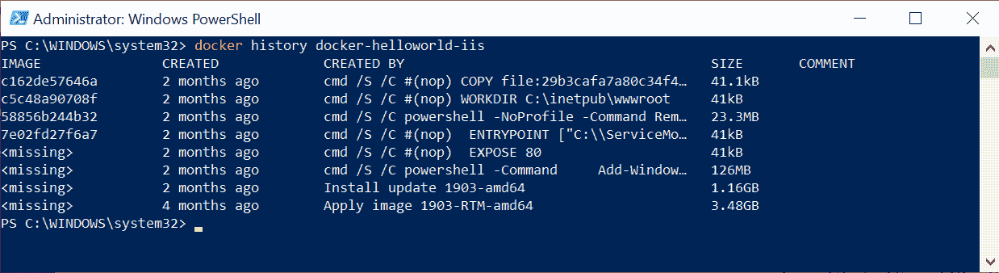
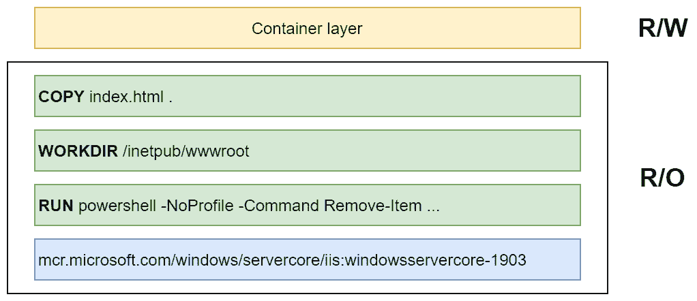
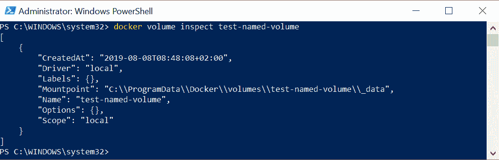
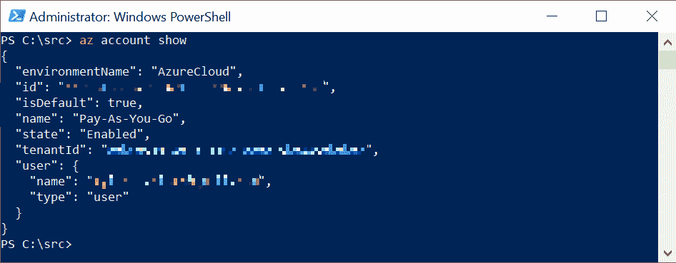
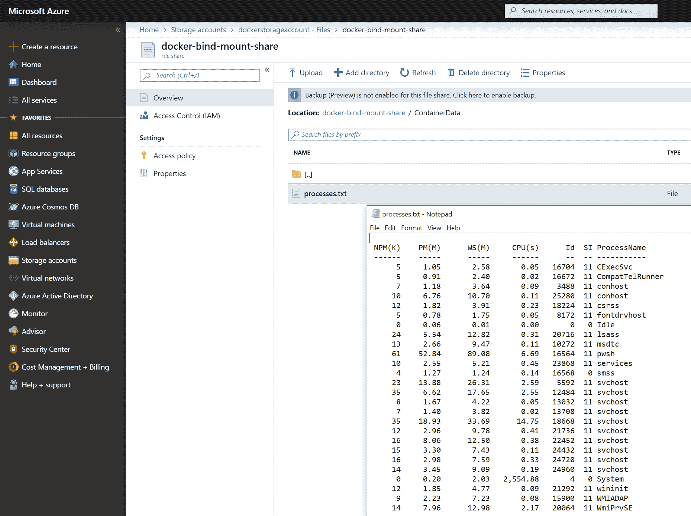
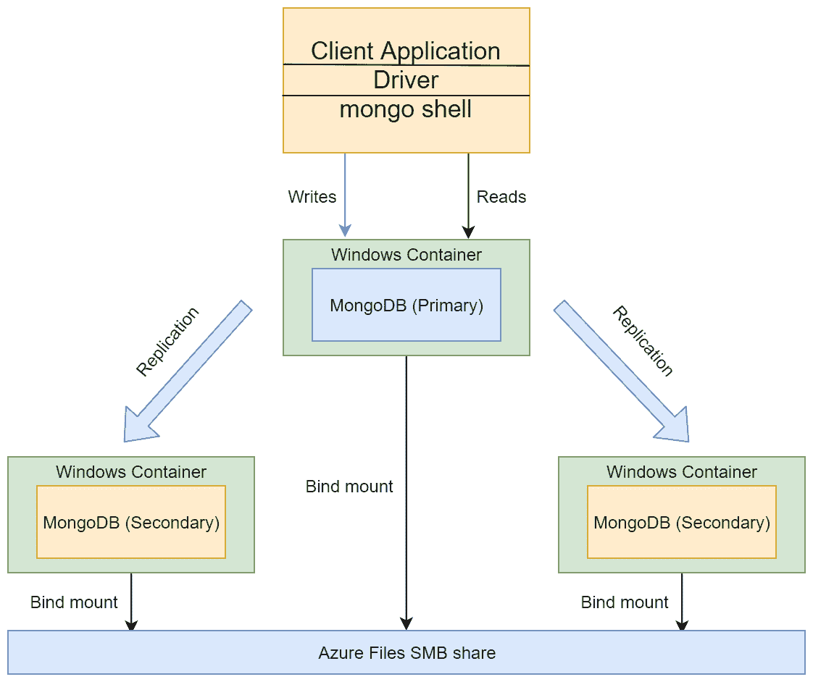
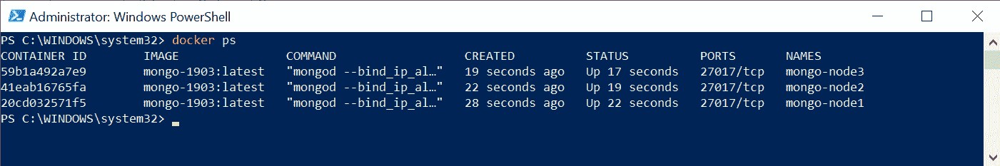
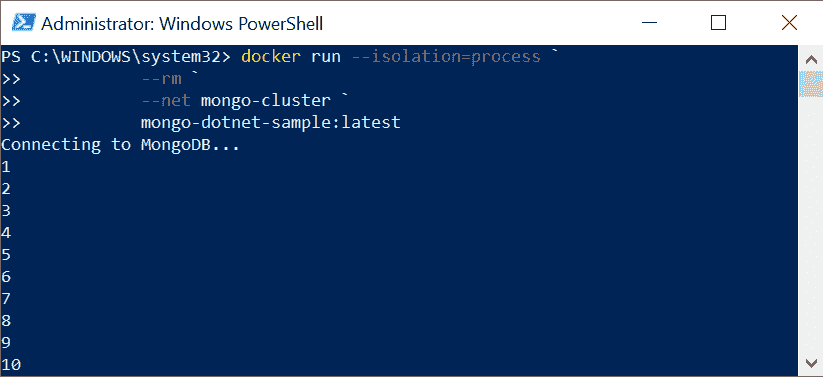
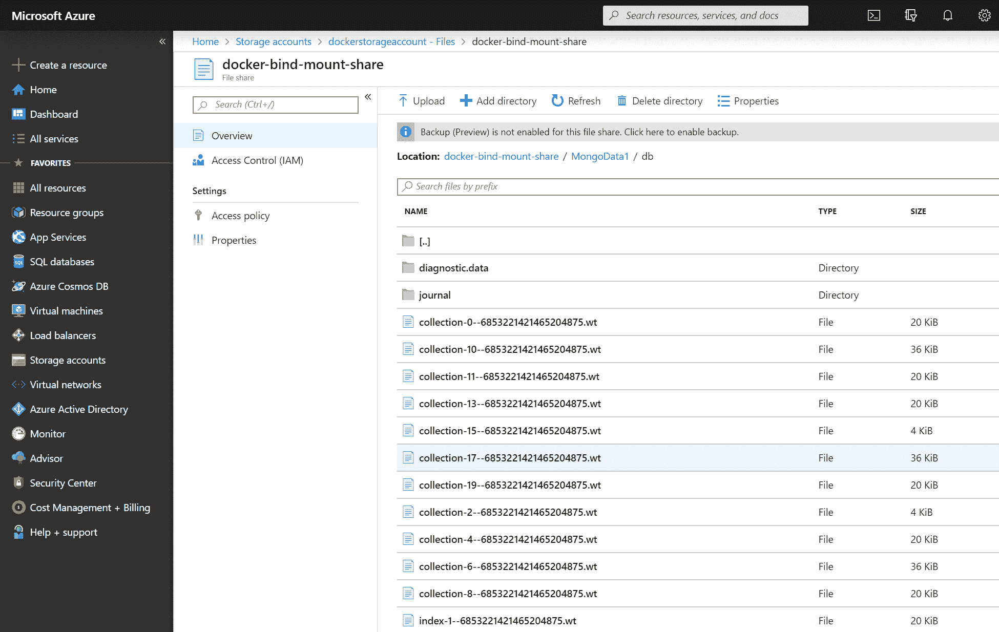

# 第二章：在容器中管理状态

管理应用程序的状态是架构任何软件解决方案时的关键方面之一，无论是单体桌面应用程序还是托管在云环境中的复杂分布式系统。即使系统中的大多数服务都是无状态的，系统的某些部分将是有状态的，例如，托管在云中的 NoSQL 数据库或您自己实现的专用服务。如果您希望设计具有良好可扩展性，您必须确保有状态服务的存储能够适当扩展。在这些方面，托管在 Docker 容器中的服务或应用程序并无二致-您需要管理状态，特别是如果您希望数据在容器重新启动或失败时得以持久化。

在本章中，我们将为您提供更好地理解如何在运行在 Windows 上的 Docker 容器中持久化状态以及这些概念与 Kubernetes 应用程序中数据持久性的关系。您将了解*volumes*和*bind mounts*的概念以及它们如何用于在容器和容器主机之间共享状态。

本章涵盖以下主题：

+   挂载本地卷以用于有状态的应用程序

+   使用远程/云存储进行容器存储

+   在容器内运行集群解决方案

# 技术要求

对于本章，您将需要以下内容：

+   已安装 Windows 10 Pro、企业版或教育版（版本 1903 或更高版本，64 位）

+   已安装 Docker Desktop for Windows 2.0.0.3 或更高版本

Docker Desktop for Windows 的安装及其详细要求在第一章*，创建容器*中已经涵盖。

您还需要自己的 Azure 帐户。您可以在此处阅读有关如何获取个人使用的有限免费帐户的更多信息：[`azure.microsoft.com/en-us/free/`](https://azure.microsoft.com/en-us/free/)。

您可以从本书的官方 GitHub 存储库下载本章的最新代码示例：[`github.com/PacktPublishing/Hands-On-Kubernetes-on-Windows/tree/master/Chapter02`](https://github.com/PacktPublishing/Hands-On-Kubernetes-on-Windows/tree/master/Chapter02)。

# 挂载本地卷以用于有状态的应用程序

要了解有状态应用程序的本机 Docker 存储选项，我们必须看一下层文件系统的组织方式。这个文件系统服务的主要作用是为每个基于 Docker 镜像的容器提供一个单一的虚拟逻辑文件系统。

Docker 镜像由一系列只读层组成，其中每个层对应于 Dockerfile 中的一个指令。让我们来看看上一章中的以下 Dockerfile：

```
FROM mcr.microsoft.com/windows/servercore/iis:windowsservercore-1903

RUN powershell -NoProfile -Command Remove-Item -Recurse C:\inetpub\wwwroot\*
WORKDIR /inetpub/wwwroot
COPY index.html .
```

构建 Docker 镜像时，(*几乎*)每个指令都会创建一个新的层，其中包含给定命令引入的文件系统中的一组差异。在这种情况下，我们有以下内容：

+   `FROM mcr.microsoft.com/windows/servercore/iis:windowsservercore-1903`：这个指令定义了基础层（或一组层）来自基础镜像。

+   `RUN powershell -NoProfile -Command Remove-Item -Recurse C:\inetpub\wwwroot\*`：这个指令创建的层将反映从原始基础镜像中删除`C:\inetpub\wwwroot\`目录中内容。

+   `WORKDIR /inetpub/wwwroot`：即使这个指令不会引起任何文件系统的更改，它仍然会创建**无操作**（**nop**）层来保留这些信息。

+   `COPY index.html .`：这个最后的指令创建了一个层，其中包含`C:\inetpub\wwwroot\`目录中的`index.html`。

如果您有现有的 Docker 镜像，可以使用`docker history`命令自己检查层：

```
docker history <imageName>
```

例如，对于前面的 Dockerfile 生成的图像，您可以期望以下输出：



底部的五个层来自`mcr.microsoft.com/windows/servercore/iis:windowsservercore-1903`基础镜像，而顶部的三个层是我们之前描述的指令的结果。

当创建一个新的容器时，为其创建文件系统，其中包括只读的镜像层和一个可写的顶层，也称为容器层。对于容器，这些层是透明的，进程“看到”它就像是一个常规的文件系统 - 在 Windows 系统上，这是由*Windows 容器隔离文件系统*服务*保证的。容器内部的进程对容器文件系统所做的任何更改都会在可写层中持久保存。这个概念可以在以下图表中看到：



现在我们了解了 Docker 中层文件系统的原则，我们可以专注于*卷*和*绑定挂载*。

# 卷和绑定挂载

此时，似乎为每个容器都有一个可写的容器层就足以为应用程序提供状态持久性。即使您停止并重新启动同一个容器，数据也会被持久化。不幸的是，您会很容易发现容器及其可写层是紧密耦合的，您无法轻松地在不同的容器之间甚至同一图像的新实例之间共享数据。一个简单的情景是：

1.  基于当前的 Dockerfile 构建一个容器镜像。

1.  基于此构建启动一个新的容器。

1.  对可写容器层进行一些修改；例如，容器内的一个进程修改了存储应用程序数据的文件。

1.  现在，您想通过修改 Dockerfile 并添加额外的指令来创建图像的新版本。与此同时，您希望重新创建容器，并重用已经在容器的可写层中修改过的文件中的数据。

您会意识到，使用新的图像版本重新创建容器后，您使用应用程序状态对文件所做的所有更改都将消失。除此之外，使用容器层来存储数据还有更多的缺点：

+   可写层与容器主机紧密耦合，这意味着无法轻松地将数据移动到不同的主机。

+   层文件系统的性能比直接访问主机文件系统差。

+   您不能在不同的容器之间共享可写层。

一个经验法则是要避免将数据存储在可写的容器层中，特别是对于 I/O 密集型应用程序。

Docker 提供了两种持久存储的解决方案，可以挂载到容器中：卷和绑定挂载。在这两种情况下，数据都会暴露为容器文件系统中的一个目录，并且即使容器停止和删除，数据也会被持久化。在性能方面，卷和绑定挂载都直接访问主机的文件系统，这意味着没有层文件系统的开销。还可以使用这些 Docker 功能在多个容器之间共享数据。

绑定挂载提供了一个简单的功能，可以将容器主机中的任何*文件*或*目录*挂载到给定的容器中。这意味着绑定挂载将充当主机和容器之间共享的文件或目录。一般来说，不建议使用绑定挂载，因为它们比卷更难管理，但在某些情况下，绑定挂载是有用的，特别是在 Windows 平台上，卷支持有限。

绑定挂载允许您共享容器主机中的任何文件。这意味着，如果您将敏感目录（例如`C:\Windows\`）挂载到一个不受信任的容器中，您就会面临安全漏洞的风险。

卷提供了与绑定挂载类似的功能，但它们由 Docker 完全管理，这意味着您不必担心容器主机文件系统中的物理路径。您可以创建*匿名*或*命名*卷，然后将它们挂载到容器中。除非您明确使用 Docker 删除卷，否则卷中的任何数据都不会被删除。卷的一个非常常见的用例是为运行数据库实例的容器提供持久存储 - 当容器被重新创建时，它将使用包含前一个容器实例写入的数据的相同卷。

卷的基本功能是在容器主机文件系统中提供存储。还可以使用*卷驱动程序*（*插件*），它们使用卷抽象来访问远程云存储或网络共享。请注意，目前在 Windows 平台上，对卷插件的支持有限，大多数插件只能在 Linux 操作系统上使用。有关可用插件的更多信息，请访问[`docs.docker.com/engine/extend/legacy_plugins/#volume-plugins`](https://docs.docker.com/engine/extend/legacy_plugins/#volume-plugins)。

现在，让我们看看如何在 Docker 卷上执行基本操作。

# 创建和挂载卷

可以使用`docker volume create`命令显式地创建新卷。还可以在容器启动时自动创建命名卷和匿名卷。要手动创建 Docker 命名卷，请按照以下步骤进行操作：

1.  执行以下命令：

```
docker volume create <volumeName>
```

1.  创建后，可以使用`docker volume inspect`命令检查卷的详细信息：



如您所见，使用默认的*local*驱动程序时，卷数据存储为主机文件系统中的常规目录。

要将卷挂载到容器中，您必须使用`docker run`命令的`--mount`或`--volume`（简称参数：`-v`）参数。最初，`--volume`用于独立容器，而`--mount`用于集群容器，但从 Docker 17.06 开始，`--mount`也可以用于独立容器，并且是推荐的做法，因为它提供了更强大的选项。有关这些标志的更多信息可以在官方文档中找到：[`docs.docker.com/storage/volumes/#choose-the--v-or---mount-flag`](https://docs.docker.com/storage/volumes/#choose-the--v-or---mount-flag)。

按照以下步骤学习如何挂载卷：

1.  假设您想要在新的 PowerShell 容器中将`test-named-volume`从上一个示例挂载到`C:\Data`目录下，您必须指定`--mount`参数，如下所示：

```
docker run -it --rm `
 --isolation=process `
 --mount source=test-named-volume,target=C:\Data `
 mcr.microsoft.com/powershell:windowsservercore-1903
```

省略`source=<volumeName>`参数将导致创建一个*匿名*卷，稍后可以使用卷 ID 访问。请记住，如果您使用`--rm`选项运行容器，匿名卷将在容器退出时自动删除。

1.  容器启动并且终端已附加后，请尝试在已挂载卷的目录中创建一个简单的文件：

```
echo "Hello, Volume!" > C:\Data\test.txt
```

1.  现在，退出容器（这将导致容器停止并由于`--rm`标志而自动删除），并在主机上检查卷目录：

```
PS C:\WINDOWS\system32> cat C:\ProgramData\Docker\volumes\test-named-volume\_data\test.txt
Hello, Volume!
```

1.  为了证明命名卷可以轻松地挂载到另一个容器中，让我们基于`mcr.microsoft.com/windows/servercore:1903`镜像创建一个新的容器，并且挂载目标与上一个示例中的不同：

```
docker run -it --rm `
 --isolation=process `
 --mount source=test-named-volume,target=C:\ServerData `
 mcr.microsoft.com/windows/servercore:1903
```

1.  如果您检查容器中的卷目录，您会注意到`test.txt`文件存在并包含预期的内容：

```
C:\>more C:\ServerData\test.txt
Hello, Volume!
```

还可以在 Dockerfile 中使用`VOLUME`命令，以便在容器启动时强制自动创建卷，即使未为`docker run`命令提供`--mount`参数。如果您希望明确告知其他人应用程序的状态数据存储在何处，以及需要确保层文件系统不会引入额外的开销，这将非常有用。您可以在本书存储库中的以下 Dockerfile 中找到`VOLUME`命令的用法示例：[`github.com/PacktPublishing/Hands-On-Kubernetes-on-Windows/blob/master/Chapter02/03_MongoDB_1903/Dockerfile#L44`](https://github.com/PacktPublishing/Hands-On-Kubernetes-on-Windows/blob/master/Chapter02/03_MongoDB_1903/Dockerfile#L44)。

在下一小节中，我们将快速了解如何使用 Docker CLI 删除卷。

# 删除卷

要使用`docker volume rm`命令删除现有的命名或匿名卷，它们不能在任何容器中使用（即使是停止的容器）。标准流程如下：

```
docker stop <containerId>
docker rm <containerId>
docker volume rm <volumeId>
```

对于匿名卷，如果在`docker run`命令中使用`--rm`标志，容器将在退出时被删除，连同其匿名卷。这个标志应根据情况使用——在大多数情况下，它对于测试和开发目的很有用，以便更轻松地进行清理。

在开发过程中，您可能偶尔需要对 Docker 主机上的所有卷进行全面清理，例如，如果您需要释放磁盘空间。Docker CLI 提供了一个专用命令，将删除任何未在任何容器中使用的卷：

```
docker volume prune
```

接下来，我们将看一下绑定挂载及其与卷的区别。

# 使用绑定挂载挂载本地容器主机目录

绑定挂载是容器和主机机器之间共享的最简单的持久存储形式。通过这种方式，您可以在容器中挂载主机文件系统中的任何现有目录。还可以使用主机目录内容“覆盖”容器中的现有目录，这在某些情况下可能很有用。一般来说，卷是推荐的存储解决方案，但有一些情况下绑定挂载可能会有用：

+   在主机和容器之间共享配置。一个常见的用例可能是 DNS 配置或`hosts`文件。

+   在开发场景中，共享在主机上创建的构建产物，以便它们可以在容器内使用。

+   在 Windows 上，将 SMB 文件共享挂载为容器中的目录。

卷可以被视为绑定挂载的 *演进*。它们由 Docker 完全管理，用户看不到与容器主机文件系统的紧密耦合。

为容器创建绑定挂载需要在 `docker run` 命令中指定一个额外的参数 `type=bind`，用于 `--mount` 标志。在这个例子中，我们将主机的 `C:\Users` 目录挂载为容器中的 `C:\HostUsers`：

```
docker run -it --rm `
 --isolation=process `
 --mount type=bind,source=C:\Users,target=C:\HostUsers `
 mcr.microsoft.com/powershell:windowsservercore-1903
```

您可以验证对 `C:\HostUsers` 所做的任何更改也会在主机机器的 `C:\Users` 中可见。

有关 Windows 特定功能和绑定挂载的限制，请参阅 Microsoft 的官方文档：[`docs.microsoft.com/en-us/virtualization/windowscontainers/manage-containers/container-storage#bind-mounts`](https://docs.microsoft.com/en-us/virtualization/windowscontainers/manage-containers/container-storage#bind-mounts)。

在下一节中，我们将学习如何利用绑定挂载来在 Windows 容器中使用远程或云存储。

# 使用远程/云存储作为容器存储

在容器主机文件系统中存储数据不适用于需要高可用性、故障转移和数据备份便捷性的用例。为了提供存储抽象，Docker 提供了卷驱动程序（插件），可用于管理托管在远程机器或云服务中的卷。不幸的是，在撰写本书时，运行在本地的 Windows 容器不支持当前在 Linux OS 上可用的卷插件。这使我们在使用 Windows 容器中的云存储时有三种选择：

+   使用 Docker for Azure 和 Cloudstor 卷插件，这是在 Azure VM 上以 *swarm* 模式运行 Docker 的部分托管解决方案。在本书中，我们不会涵盖 Docker for Azure，因为这个解决方案与 Kubernetes 分开，包括 Azure 提供的托管 Kubernetes 的服务。如果您对此服务的更多细节感兴趣，请参阅 [`docs.docker.com/docker-for-azure/persistent-data-volumes/`](https://docs.docker.com/docker-for-azure/persistent-data-volumes/)。

+   在应用程序代码中直接使用云存储，使用云服务提供商的 SDK。这是最明显的解决方案，但它需要将存储管理嵌入到应用程序代码中。

+   使用绑定挂载和**服务器消息块**（**SMB**）全局映射来挂载 Azure Files，这是一个完全托管的云文件共享，可以通过 SMB 协议访问。

很快，我们将演示如何利用最后一个选项：Azure Files 的 SMB 全局映射。但首先，我们必须安装 Azure CLI 以管理 Azure 资源。

# 安装 Azure CLI 和 Azure PowerShell 模块

为了从命令行高效地管理 Azure 资源，建议使用官方的 Azure CLI。官方安装说明可以在[`docs.microsoft.com/en-us/cli/azure/install-azure-cli-windows?view=azure-cli-latest`](https://docs.microsoft.com/en-us/cli/azure/install-azure-cli-windows?view=azure-cli-latest)找到。让我们开始吧：

1.  从 PowerShell 安装 Azure CLI 需要以管理员身份运行以下命令：

```
Invoke-WebRequest -Uri https://aka.ms/installazurecliwindows -OutFile .\AzureCLI.msi
Start-Process msiexec.exe -Wait -ArgumentList '/I AzureCLI.msi /quiet'
Remove-Item .\AzureCLI.msi
```

1.  安装 Azure CLI 后，您需要重新启动 PowerShell 窗口。接下来，登录到您的 Azure 帐户：

```
az login
```

上述命令将打开您的默认浏览器，并指示您登录到您的 Azure 帐户。

1.  现在，运行以下命令来验证您已经正确登录：

```
az account show
```

您应该能够看到您的订阅详细信息，类似于这样：



除此之外，我们还需要安装 Azure PowerShell 模块，因为一些操作在 Azure CLI 中不可用。

1.  可以使用以下命令为当前登录的用户安装：

```
Install-Module -Name Az -AllowClobber -Scope CurrentUser
```

官方安装步骤可以在这里找到：[`docs.microsoft.com/en-us/powershell/azure/install-az-ps?view=azps-2.5.0#install-the-azure-powershell-module-1`](https://docs.microsoft.com/en-us/powershell/azure/install-az-ps?view=azps-2.5.0#install-the-azure-powershell-module-1)。

1.  如果在导入新安装的模块时遇到问题，您还需要以管理员身份设置 PowerShell 执行策略为`RemoteSigned`：

```
Set-ExecutionPolicy RemoteSigned
```

1.  使用 PowerShell 模块登录到 Azure 必须与 Azure CLI 分开进行，并可以使用以下命令执行：

```
Connect-AzAccount
```

此时，您应该能够使用 Azure CLI 和 Azure PowerShell 模块来管理您的资源，而无需打开 Azure 门户网站！让我们看看如何创建 Azure Files SMB 共享。

# 创建 Azure Files SMB 共享

假设您正在使用全新的 Azure 订阅进行这些示例演练，让我们首先创建一个 Azure 资源组和 Azure 存储帐户：

1.  在 PowerShell 窗口中，执行以下代码：

```
az group create `
 --name docker-storage-resource-group `
 --location westeurope
```

您可以选择最适合您的位置（为了显示可用位置的列表，请运行`az account list-locations`）。在这个例子中，我们使用`westeurope` Azure 位置。

您还可以使用本书的 GitHub 存储库中的 PowerShell 脚本来执行此操作：[`github.com/PacktPublishing/Hands-On-Kubernetes-on-Windows/blob/master/Chapter02/01_CreateAzureFilesSMBShare.ps1`](https://github.com/PacktPublishing/Hands-On-Kubernetes-on-Windows/blob/master/Chapter02/01_CreateAzureFilesSMBShare.ps1)。请记住以管理员身份运行此脚本，因为必须从特权帐户添加 SMB 共享的全局映射。

1.  成功创建 Azure 资源组后，继续创建 Azure 存储帐户：

```
az storage account create `
 --name dockerstorageaccount `
 --resource-group docker-storage-resource-group `
 --location westeurope `
 --sku Standard_RAGRS `
 --kind StorageV2
```

上述命令将在`docker-storage-resource-group`中创建一个名为`dockerstorageaccount`的`general-purpose v2`存储帐户，其中包含`read-access geo-redundant`存储。此操作可能需要几分钟才能完成。

1.  接下来，您必须创建实际的 Azure Files SMB 共享。首先，为您的 Azure 存储帐户创建连接字符串，并将其存储为 PowerShell 中的变量：

```
$azureStorageAccountConnString = az storage account show-connection-string `
 --name dockerstorageaccount `
 --resource-group docker-storage-resource-group `
 --query "connectionString" `
 --output tsv

if (!$azureStorageAccountConnString) {
 Write-Error "Couldn't retrieve the connection string."
}
```

请记住保护好连接字符串，因为它可以用来管理您的存储帐户！

1.  使用存储在`$azureStorageAccountConnString`变量中的连接字符串，创建共享：

```
az storage share create `
 --name docker-bind-mount-share `
 --quota 2 `
 --connection-string $azureStorageAccountConnString 
```

这将创建一个名为`docker-bind-mount-share`的共享，配额限制为 2GB，我们将在 Docker 容器中使用它。

# 在容器中挂载 Azure Files SMB 共享

为了将新的 Azure Files SMB 共享作为容器中的绑定挂载，我们将利用在 Window Server 1709 中引入的*SMB 全局映射*功能。全局映射是专门为此目的而引入的，即在主机上挂载 SMB 共享，以便它们对容器可见。让我们开始吧：

1.  首先确保您已登录，以便可以执行 Azure PowerShell（使用`Connect-AzAccount`命令）。

1.  接下来，让我们定义一些变量，这些变量将在我们即将执行的命令中使用：

```
$resourceGroupName = "docker-storage-resource-group"
$storageAccountName = "dockerstorageaccount"
$fileShareName = "docker-bind-mount-share"
```

这里使用的名称与我们在上一小节中创建 Azure Files SMB 共享时使用的名称完全相同。

1.  下一步是定义`$storageAccount`和`$storageAccountKeys`变量：

```
$storageAccount = Get-AzStorageAccount `
 -ResourceGroupName $resourceGroupName `
 -Name $storageAccountName
$storageAccountKeys = Get-AzStorageAccountKey `
 -ResourceGroupName $resourceGroupName `
 -Name $storageAccountName
```

这些变量将用于检索文件共享详细信息和访问凭据，这两者都是 SMB 全局映射所需的。

1.  现在，*可选地*，您可以使用`cmdkey`命令将共享凭据持久保存在 Windows 凭据管理器中：

```
Invoke-Expression -Command `
 ("cmdkey /add:$([System.Uri]::new($storageAccount.Context.FileEndPoint).Host) " + `
 "/user:AZURE\$($storageAccount.StorageAccountName) /pass:$($storageAccountKeys[0].Value)")
```

1.  我们还需要关于 Azure Files SMB 共享的详细信息，因此让我们定义一个名为`$fileShare`的新变量：

```
$fileShare = Get-AzStorageShare -Context $storageAccount.Context | Where-Object { 
    $_.Name -eq $fileShareName -and $_.IsSnapshot -eq $false
}
```

1.  此时，您还可以检查文件共享详细信息是否已成功检索。通过这样做，您将能够检测出例如`$fileShareName`是否包含了错误的共享名称：

```
if ($fileShare -eq $null) {
    Write-Error "Azure File share not found"
}
```

1.  在创建 SMB 全局映射之前的最后一步是定义一个凭据对象，该对象将用于映射创建：

```
$password = ConvertTo-SecureString `
    -String $storageAccountKeys[0].Value `
    -AsPlainText `
    -Force
$credential = New-Object System.Management.Automation.PSCredential `-ArgumentList "AZURE\$($storageAccount.StorageAccountName)", $password
```

1.  最后，我们可以使用`New-SmbGlobalMapping`命令来为 Azure Files SMB 共享创建映射：

```
New-SmbGlobalMapping `
 -RemotePath "\\$($fileShare.StorageUri.PrimaryUri.Host)\$($fileShare.Name)" `
 -Credential $credential `
 -Persistent $true `
 -LocalPath G:
```

如果您需要删除 SMB 全局映射，可以使用`Remove-SmbGlobalMapping`命令来执行。

上述命令将持久地将 Azure Files SMB 共享挂载为`G:`驱动器。您可以稍后使用此路径进行 Docker 容器的绑定挂载。现在，您可以通过使用 Windows 资源管理器将一些测试文件移动到`G:`驱动器来测试您的映射是否正常工作。

使用绑定挂载进行全局映射的 SMB 共享的原则可以用于任何兼容 SMB 的服务器，例如以下服务器：

+   在您的本地网络中托管的传统文件服务器

+   SMB 协议的第三方实现，例如 NAS 设备

+   基于存储空间直通（S2D）的传统 SAN 或**分布式文件服务器**（**SoFS**）

当作为绑定挂载使用时，全局映射的 SMB 共享对容器来说是透明可见的，就像本地文件系统中的常规目录一样。所有的“繁重工作”都是由容器主机执行的，它负责管理 SMB 共享连接。

让我们通过创建一个简单的 PowerShell 进程隔离容器来演示这个功能：

1.  首先，在我们的演示容器的 SMB 共享中创建一个名为`G:\ContainerData`的目录：

```
 New-Item -ItemType Directory -Force -Path G:\ContainerData
```

1.  现在，我们可以通过将 Azure Files SMB 共享中的新目录作为绑定挂载并将`C:\Data`作为目标来运行容器：

```
docker run -it --rm `
 --isolation=process `
 --mount type=bind,source=G:\ContainerData,target=C:\Data               `mcr.microsoft.com/powershell:windowsservercore-1903
```

有了这个，我们可以轻松证明我们的解决方案有效，并且容器状态文件确实存储在 Azure Cloud 中！

1.  在运行的容器中，创建一个包含数据的文件。例如，获取当前运行的进程列表，并将其存储为`processes.txt`文件：

```
Get-Process > C:\Data\processes.txt
```

1.  现在，登录到 Azure 门户（`https://portal.azure.com/`）并执行以下操作：

1.  从主菜单导航到存储账户。

1.  打开 dockerstorageaccount 账户。

1.  在存储账户菜单中，打开文件服务组下的文件。

1.  从列表中打开 docker-bind-mount-share 文件共享。

您将看到一个熟悉的目录结构。进入 ContainerData 目录，看到`processes.txt`文件确实存在，并包含在容器中存储的数据：



在 Kubernetes 中，可以使用*volumes*（不要与 Docker 卷混淆）以受控方式执行类似的过程。我们将在第十一章中重点介绍这一点，*配置应用程序以使用 Kubernetes 功能*。您也可以参考官方文档：[`kubernetes.io/docs/concepts/storage/`](https://kubernetes.io/docs/concepts/storage/)。

请注意，这种情况也可以通过在本地网络中托管常规 SMB 文件服务器来实现，如果您已经在基础架构中使用它们，这可能是一个合适的解决方案。

恭喜！您已成功创建了一个使用 Azure Cloud 存储来持久保存容器状态的 Windows 容器。在下一节中，我们将学习如何在 Windows 容器中运行 MongoDB，作为多容器解决方案的示例。

# 在容器内运行集群解决方案

MongoDB 是一个免费的开源跨平台、面向文档的数据库程序，可以在集群模式下运行（使用分片和副本集）。在这个例子中，我们将运行一个三节点的 MongoDB 副本集，因为这比完整的分片集群更容易配置，并且足以演示持久存储容器状态数据的原理。

如果您想了解更多关于 MongoDB 和高级分片集群组件的信息，请参考官方文档：[`docs.mongodb.com/manual/core/sharded-cluster-components/`](https://docs.mongodb.com/manual/core/sharded-cluster-components/)。

我们的 MongoDB 副本集架构将如下所示：



主节点负责管理所有写操作，在 ReplicaSet 中只能有一个主节点。次要节点只复制主节点的*oplog*并应用数据操作，以便它们的数据集反映主节点的数据集。这种 MongoDB 部署的主要好处如下：

+   **自动故障转移**：如果主节点不可用，其余次要节点将执行新的领导者选举并恢复集群功能。

+   **可以使用次要节点读取数据**：您可以指定读取偏好，以便客户端将主节点的读取操作卸载。但是，您必须注意异步复制可能导致次要节点与主节点略有不同步。

现在，让我们创建我们的 MongoDB ReplicaSet！

# 创建 MongoDB ReplicaSet

按照以下步骤创建 ReplicaSet：

1.  首先，让我们使用`docker network create`命令为新集群创建一个名为`mongo-cluster`的 Docker 网络：

```
docker network create --driver nat mongo-cluster
```

如果您想了解有关 Docker 网络的更多信息，请参考官方文档：[`docs.docker.com/network/`](https://docs.docker.com/network/)。

有关特定于 Windows 的文档，请访问[`docs.microsoft.com/en-us/virtualization/windowscontainers/container-networking/network-drivers-topologies`](https://docs.microsoft.com/en-us/virtualization/windowscontainers/container-networking/network-drivers-topologies)。

我们将使用 Azure Files SMB 共享（全局映射到`G:`驱动器），这是我们在上一节中创建的，以便使用绑定挂载存储 MongoDB 的状态。

1.  我们需要在我们的 SMB 共享中创建新的目录，每个 MongoDB 节点需要两个：

```
New-Item -ItemType Directory -Force -Path G:\MongoData1\db
New-Item -ItemType Directory -Force -Path G:\MongoData1\configdb
New-Item -ItemType Directory -Force -Path G:\MongoData2\db
New-Item -ItemType Directory -Force -Path G:\MongoData2\configdb
New-Item -ItemType Directory -Force -Path G:\MongoData3\db
New-Item -ItemType Directory -Force -Path G:\MongoData3\configdb
```

目前，Windows 的官方 MongoDB 镜像仅存在于 Windows Server Core 1803 中，这意味着我们必须使用 Hyper-V 隔离在 Windows 1903 上运行这些容器。这意味着我们无法利用 SMB 全局映射，因此我们需要基于 Windows Server Core 1903 创建自己的 MongoDB 镜像。这将使我们能够使用进程隔离。我们要构建的镜像是基于 4.2.0 RC8 版本的官方 MongoDB 镜像，可以在这里找到：[`github.com/docker-library/mongo/blob/a3a213fd2b4b2c26c71408761534fc7eaafe517f/4.2-rc/windows/windowsservercore-1803/Dockerfile`](https://github.com/docker-library/mongo/blob/a3a213fd2b4b2c26c71408761534fc7eaafe517f/4.2-rc/windows/windowsservercore-1803/Dockerfile)。要执行构建，请按照以下步骤进行：

1.  从本书的 GitHub 存储库下载 Dockerfile：[`github.com/PacktPublishing/Hands-On-Kubernetes-on-Windows/blob/master/Chapter02/03_MongoDB_1903/Dockerfile`](https://github.com/PacktPublishing/Hands-On-Kubernetes-on-Windows/blob/master/Chapter02/03_MongoDB_1903/Dockerfile)。

1.  在 PowerShell 中，导航到您下载 Dockerfile 的位置（建议使用新的、单独的目录）。

1.  执行`docker build`命令，以在本地镜像注册表中创建一个名为`mongo-1903`的自定义 MongoDB 镜像：

```
docker build -t mongo-1903:latest .
```

构建过程将需要几分钟，因为 MongoDB 必须在构建容器中下载和安装。

该镜像还将 MongoDB 数据公开为容器内的`C:\data\db`和`C:\data\configdb`卷（[`github.com/PacktPublishing/Hands-On-Kubernetes-on-Windows/blob/master/Chapter02/03_MongoDB_1903/Dockerfile#L44`](https://github.com/PacktPublishing/Hands-On-Kubernetes-on-Windows/blob/master/Chapter02/03_MongoDB_1903/Dockerfile#L44)）。考虑到所有这些，让我们创建我们的第一个 MongoDB 进程隔离容器，命名为`mongo-node1`，它将在后台运行（使用`-d`选项）：

```
docker run -d `
 --isolation=process `
 --volume G:\MongoData1\db:C:\data\db `
 --volume G:\MongoData1\configdb:C:\data\configdb `
 --name mongo-node1 `
 --net mongo-cluster `
 mongo-1903:latest `
 mongod --bind_ip_all --replSet replSet0
```

在运行此容器时，我们提供了一个自定义命令来运行容器进程，即`mongod --bind_ip_all --replSet replSet0`。`--bind_ip_all`参数指示 MongoDB 绑定到容器中可用的所有网络接口。对于我们的用例，`--replSet replSet0`参数确保守护程序以 ReplicaSet 模式运行，期望在名为`replSet0`的 ReplicaSet 中。

成功创建第一个节点后，重复此过程用于下两个节点，适当更改它们的名称和卷挂载点：

```
docker run -d `
 --isolation=process `
 --volume G:\MongoData2\db:C:\data\db `
 --volume G:\MongoData2\configdb:C:\data\configdb `
 --name mongo-node2 `
 --net mongo-cluster `
 mongo-1903:latest `
 mongod --bind_ip_all --replSet replSet0

docker run -d `
 --isolation=process `
 --volume G:\MongoData3\db:C:\data\db `
 --volume G:\MongoData3\configdb:C:\data\configdb `
 --name mongo-node3 `
 --net mongo-cluster `
 mongo-1903:latest `
 mongod --bind_ip_all --replSet replSet0
```

创建过程完成后，您可以使用 `docker ps` 命令验证容器是否正常运行：



上述步骤也已经作为 PowerShell 脚本提供在本书的 GitHub 仓库中：[`github.com/PacktPublishing/Hands-On-Kubernetes-on-Windows/blob/master/Chapter02/02_InitializeMongoDBReplicaset.ps1`](https://github.com/PacktPublishing/Hands-On-Kubernetes-on-Windows/blob/master/Chapter02/02_InitializeMongoDBReplicaset.ps1)。

接下来的阶段是配置 ReplicaSet。我们将使用 mongo shell 来完成这个过程。按照以下步骤进行：

1.  创建一个 mongo shell 实例。如果您已经运行了一个 MongoDB 容器（例如，`mongo-node1`），最简单的方法是 `exec` 进入现有容器并运行 `mongo` 进程：

```
docker exec -it mongo-node1 mongo
```

1.  几秒钟后，您应该会看到 mongo shell 控制台提示符 `>`。您可以使用 `rs.initiate()` 方法初始化 ReplicaSet：

```
rs.initiate(
  {
    "_id" : "replSet0",
    "members" : [
      { "_id" : 0, "host" : "mongo-node1:27017" },
      { "_id" : 1, "host" : "mongo-node2:27017" },
      { "_id" : 2, "host" : "mongo-node3:27017" }
    ]
  }
)
```

上述命令使用我们的三个节点在 `mongo-cluster` Docker 网络中创建了一个名为 `replSet0` 的 ReplicaSet。这些节点可以通过它们在 `mongo-cluster` Docker 网络中的 DNS 名称进行识别。

有关初始化 ReplicaSets 的更多详细信息，请参考官方文档：[`docs.mongodb.com/manual/reference/method/rs.initiate/`](https://docs.mongodb.com/manual/reference/method/rs.initiate/)。

1.  您还可以使用 mongo shell 中的 `rs.status()` 命令来验证初始化状态。在一段时间后，当 ReplicaSet 完全初始化时，在命令的 JSON 输出中，您应该能够看到一个节点中的 ReplicaSet 的 `"stateStr": "PRIMARY"`，以及另外两个节点中的 `"stateStr": "SECONDARY"`。

在下一小节中，我们将通过在另一个容器中生成测试数据并读取它来快速验证我们的 ReplicaSet。

# 编写和读取测试数据

按照以下步骤编写和读取测试数据：

1.  首先，在 ReplicaSet 主节点的 mongo shell 中（提示符为 `replSet0:PRIMARY>` ），让我们在 `demo` 集合中添加 1,000 个示例文档：

```
for (var i = 1; i <= 1000; i++) {
 db.demo.insert( { exampleValue : i } )
}
```

1.  您可以使用 `demo` 集合上的 `find()` 方法快速验证插入的文档：

```
db.demo.find()
```

1.  现在，我们将创建一个在 Docker 容器中运行的最小化.NET Core 3.0 控制台应用程序。这将连接到运行在我们的 Docker 容器中的 ReplicaSet，查询我们的`demo`集合，并将每个文档的`exampleValue`值写入标准输出。

您可以在本书的 GitHub 存储库中找到此源代码和 Dockerfile：[`github.com/PacktPublishing/Hands-On-Kubernetes-on-Windows/tree/master/Chapter02/04_MongoDB_dotnet`](https://github.com/PacktPublishing/Hands-On-Kubernetes-on-Windows/tree/master/Chapter02/04_MongoDB_dotnet)。

如果在执行此场景时，您遇到任何与 MongoDB 的不稳定问题，请考虑将`mongo-1903` Dockerfile 升级到最新的 MongoDB 版本。

为了读取我们的测试数据，我们需要构建应用程序 Docker 镜像，并创建一个在`mongo-cluster`网络中运行的容器。执行以下步骤：

1.  克隆存储库并在 PowerShell 中导航到`Chapter02/04_MongoDB_dotnet`目录。

1.  在当前目录中执行`docker build`以创建`mongo-dotnet-sample` Docker 镜像：

```
docker build -t mongo-dotnet-sample:latest .
```

1.  运行示例容器。这需要连接到`mongo-cluster`网络：

```
docker run --isolation=process `
 --rm `
 --net mongo-cluster `
 mongo-dotnet-sample:latest
```

在输出中，您应该看到一个递增的数字序列，这是我们测试文档中`exampleValue`的值：



如果您感兴趣，可以在 Azure 门户上检查 SMB 共享包含什么内容（[`portal.azure.com/`](https://portal.azure.com/)）：



恭喜！您已成功创建并测试了在 Windows 容器中运行的 MongoDB ReplicaSet，并使用 Azure Files SMB 共享作为绑定挂载来存储数据。让我们快速总结一下本章学到的内容。

# 总结

在本章中，您学习了 Windows 上 Docker 存储的关键方面：使用卷和绑定挂载。在 Azure 的帮助下，您成功设置了 Azure Files SMB 共享，可以使用 SMB 全局映射来存储容器状态数据。最后，您通过设置自己的由 Azure 云存储支持的三节点 MongoDB ReplicaSet 来总结了所有这些，并验证了您的设置！

下一章将是最后一章专注于 Windows 平台上的 Docker。您可以期待学习如何使用 Docker 镜像以及如何在应用程序开发生命周期中使用它们的基础知识。之后，我们将准备开始我们的 Kubernetes 之旅。

# 问题

1.  Docker 存储架构中的容器层是什么？

1.  卷和绑定挂载之间有什么区别？

1.  为什么不建议将容器状态数据存储在容器层中？

1.  如何在容器中透明地挂载 Azure Files SMB 共享？

1.  在运行在 Hyper-V 隔离中的容器中可以使用绑定挂载吗？

1.  什么命令可以删除容器主机上的所有未使用卷？

1.  什么是卷驱动程序（插件）？

您可以在本书的*评估*部分找到这些问题的答案。

# 进一步阅读

+   有关在 Docker 中管理状态和卷的更多信息（不仅限于 Windows），请参考以下 Packt 图书：

+   *学习 Docker- Docker 18.x 基础* ([`www.packtpub.com/networking-and-servers/learn-docker-fundamentals-docker-18x`](https://www.packtpub.com/networking-and-servers/learn-docker-fundamentals-docker-18x))。

+   您还可以参考官方的 Docker 文档，其中对 Docker 本身的可能存储选项进行了很好的概述：[`docs.docker.com/storage/`](https://docs.docker.com/storage/)。
