# 第三章：使用容器图像

基于容器的软件开发生命周期需要简单的图像打包和可靠的分发容器化应用程序的方法-这些是 Docker 生态系统解决的关键方面。我们在前几章中使用了 Dockerfiles 和 Docker 图像。简单来说，Dockerfile 定义了用于创建 Docker 图像的构建指令，这是容器数据的不可变的、分层的快照，可用于实例化容器。这两个概念使我们能够为容器应用程序创建简单和标准化的打包。为了为 Docker 图像提供可靠和可扩展的分发，我们可以使用图像注册表。

在本章中，我们将重点介绍 Docker 注册表的使用，主要是公开访问的 Docker Hub 和私有的 Azure 容器注册表，并且我们还将介绍 Docker 内容信任-用于发布和管理已签名内容集合的概念。通过这个容器图像管理的介绍，您将准备好完全进入 Windows 上的 Kubernetes 世界！

本章将涵盖以下主题：

+   存储和共享容器图像

+   使用云容器构建器

+   图像标记和版本控制

+   确保图像供应链的完整性

# 技术要求

本章，您将需要以下内容：

+   已安装 Windows 10 专业版、企业版或教育版（1903 版或更高版本，64 位）。

+   已安装 Docker Desktop for Windows 2.0.0.3 或更高版本。

+   已安装 Azure CLI。您可以在第二章*，在容器中管理状态*中找到详细的安装说明。

Docker Desktop for Windows 的安装及其详细要求在第一章*，创建容器*中已经涵盖。

要能够使用云托管的注册表，您将需要自己的 Azure 帐户。如果您之前没有为前几章创建帐户，您可以在此处了解如何获取用于个人使用的有限免费帐户：[`azure.microsoft.com/en-us/free/`](https://azure.microsoft.com/en-us/free/)。

您可以从本书的官方 GitHub 存储库下载本章的最新代码示例：[`github.com/PacktPublishing/Hands-On-Kubernetes-on-Windows/tree/master/Chapter03`](https://github.com/PacktPublishing/Hands-On-Kubernetes-on-Windows/tree/master/Chapter03)。

# 存储和共享容器图像

到目前为止，您已经使用`docker pull hello-world`命令拉取了您的第一个`hello-world`容器，甚至使用了`docker run hello-world`命令。在图像拉取期间，底层会发生一些事情：

1.  Docker 引擎连接到所谓的 Docker 镜像注册表。注册表可以被明确指定，但默认情况下，这是官方的公共注册表，称为 Docker Hub（[`hub.docker.com/`](https://hub.docker.com/)）。

1.  Docker 引擎对注册表进行身份验证，如果需要的话。如果您正在运行私有注册表或 Docker Hub 的付费计划，这可能是一个情况。

1.  所选的`hello-world`图像被下载为一组由 SHA256 摘要标识的层。每个层在下载后都会被解压缩。

1.  该图像被存储在本地。

如果执行`docker run`命令并且本地存储中不存在图像，则会发生类似的过程。第一次，它将被拉取，以后将使用本地缓存的图像。 

如果您熟悉 GitHub 或其他源代码仓库托管，您会发现图像管理和图像注册表中有许多类似的概念。

因此，直观地说，图像注册表是一个有组织的、分层的系统，用于存储 Docker 图像。图像的层次结构包括以下级别：

+   **注册表**：这是层次结构的顶层。

+   **存储库**：注册表托管多个存储库，这些存储库是图像的存储单元。

+   **标签**：单个图像的版本标签。存储库将由相同图像名称和不同标签标识的多个图像分组。

注册表中的每个图像都由图像名称和标签标识，并且上面的层次结构反映在最终图像名称中。使用以下方案：`<registryAddress>/<userName>/<repositoryName>:<tag>`，例如，`localregistry:5000/ptylenda/test-application:1.0.0`。在使用 Docker 命令时，其中一些部分是可选的，如果您不提供值，将使用默认值：

+   `<registryAddress>`是用于存储图像的注册表的 DNS 名称或 IP 地址（连同端口）。如果省略此部分，将使用默认的 Docker Hub 注册表（`docker.io`）。目前，没有办法更改注册表地址的默认值，因此，如果您想使用自定义注册表，必须始终提供此部分。

+   `<userName>`标识拥有该镜像的用户或组织。在 Docker Hub 的情况下，这是所谓的 Docker ID。是否需要这部分取决于注册表 - 对于 Docker Hub，如果您没有提供 Docker ID，它将假定官方镜像，这是一组由 Docker 维护和审核的 Docker 仓库。

+   `<repositoryName>`是您帐户中的唯一名称。镜像名称形成为`<registryAddress>/<userName>/<repositoryName>`。

+   `<tag>`是给定镜像仓库中的唯一标签，用于组织镜像，大多数情况下使用版本控制方案，例如`1.0.0`。如果未提供此值，则将使用默认值`latest`。我们将在本章后面重点讨论标记和版本控制镜像。

使用多架构 Docker 镜像变体，可以在相同的镜像名称和标签下拥有不同的镜像，用于不同的架构。镜像的版本将根据运行 Docker 客户端的机器的架构自动选择。可以通过在镜像标签后面显式地使用额外的`@sha256:<shaTag>`部分来明确识别这样的镜像，例如，`docker.io/adamparco/demo:latest@sha256:2b77acdfea5dc5baa489ffab2a0b4a387666d1d526490e31845eb64e3e73ed20`。有关更多详细信息，请访问[`engineering.docker.com/2019/04/multi-arch-images/`](https://engineering.docker.com/2019/04/multi-arch-images/)。

现在您知道 Docker 镜像是如何标识的，让我们来看看如何将镜像推送到 Docker 注册表。

# 将镜像推送到 Docker 注册表

使用注册表共享容器镜像是通过镜像推送来完成的。这个过程将所需的镜像层上传到所选仓库的注册表中，并使其可以被其他具有对给定仓库访问权限的用户拉取。在我们将用于演示的 Docker Hub 的情况下，您的仓库将是公开的，除非您有付费计划。

将镜像推送到 Docker Hub 需要进行身份验证。如果您还没有在 Docker Hub 注册，请转到[`hub.docker.com/`](https://hub.docker.com/)并按照那里的说明操作。注册后，您将需要您的 Docker ID 和密码才能使用`docker login`命令登录到服务中：

```
PS C:\WINDOWS\system32> docker login 
Login with your Docker ID to push and pull images from Docker Hub. If you don't have a Docker ID, head over to https://hub.docker.com to create one.
Username: packtpubkubernetesonwindows
Password:
Login Succeeded
```

在本书中，我们将使用`packtpubkubernetesonwindows` Docker ID 来演示我们的示例。建议您创建自己的帐户，以便能够完全跟随本书中的示例。按照以下步骤：

1.  第一步是创建一个实际可以推送到注册表的镜像。我们将使用以下 Dockerfile 来创建镜像：

```
FROM mcr.microsoft.com/windows/servercore/iis:windowsservercore-1903

WORKDIR /inetpub/wwwroot
RUN powershell -NoProfile -Command ; \
    Remove-Item -Recurse .\* ; \
    New-Item -Path .\index.html -ItemType File ; \
    Add-Content -Path .\index.html -Value \"This is an IIS demonstration!\"
```

此 Dockerfile 创建了一个 IIS Web 主机镜像，用于提供显示 This is an IIS demonstration!的极简网页。

1.  将 Dockerfile 保存在当前目录中。要构建它，请发出以下`docker build`命令：

```
docker build -t <dockerId>/iis-demo .
```

请记住，为了能够将镜像推送到 Docker Hub，您必须在仓库名称中提供您的 Docker ID。

1.  成功构建后，您就可以准备将镜像推送到注册表。这可以通过`docker push`命令来执行：

```
docker push <dockerId>/iis-demo
```

以下截图显示了上述命令的输出：

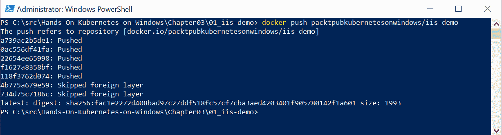

Docker 将镜像作为一组层进行推送，这也优化了推送过程，如果已知的层正在使用。此外，请注意，在基于 Windows 的镜像的情况下，您将看到一个跳过外部层的消息。原因是来自 Docker Hub 以外的注册表的任何层，例如**Microsoft Container Registry**（**MCR**），将不会被推送到 Docker Hub。

现在，您还可以转到 Docker Hub 网页并检查您的镜像详细信息 - 对于示例镜像，您可以在此处检查：[`cloud.docker.com/repository/docker/packtpubkubernetesonwindows/iis-demo/`](https://cloud.docker.com/repository/docker/packtpubkubernetesonwindows/iis-demo/)。任何有权访问您的仓库的用户现在都可以使用`docker pull <dockerId>/iis-demo`命令来使用您的镜像。

您已成功将第一个镜像推送到 Docker Hub！现在，让我们来看看如何将镜像推送到自定义镜像注册表。

# 使用自定义本地注册表

在选择图像存储时，您不仅限于使用默认的 Docker Hub。实际上，在大多数情况下，当您运行生产代码时，您可能希望使用本地托管的 Docker Registry，这是一个用于存储和分发 Docker 镜像的开源、高度可扩展的应用程序。您应该在以下情况下考虑这个解决方案：

+   您希望在隔离网络中分发 Docker 镜像

+   您需要严格控制图像存储和分发的位置

+   您希望补充您的 CI/CD 工作流程，以实现更快速和更可扩展的图像交付。

有关部署 Docker 注册表的详细信息可以在官方文档中找到：[`docs.docker.com/registry/deploying/`](https://docs.docker.com/registry/deploying/)。

对于 Kubernetes 部署，通常的做法是在 Kubernetes 集群旁边甚至内部托管自己的 Docker 注册表。有许多自动化可用于此用例，例如，用于在 Kubernetes 上部署注册表的官方 Helm 图表：[`github.com/helm/charts/tree/master/stable/docker-registry`](https://github.com/helm/charts/tree/master/stable/docker-registry)。

为了使用自定义镜像注册表，您只需要在使用 pull 或 push 命令时在镜像名称中指定注册表地址（如果需要，还需要端口），例如，`localregistry:5000/ptylenda/test-application:1.0.0`，其中`localregistry:5000`是本地托管的 Docker 注册表的域名和端口。实际上，当您为演示 Windows IIS 应用程序拉取图像时，您已经使用了自定义 Docker 镜像注册表：`mcr.microsoft.com/windows/servercore/iis:windowsservercore-1903`。`mcr.microsoft.com`注册表是 MCR，是 Microsoft 发布图像的官方注册表。其他公共注册表和 MCR 之间的主要区别在于，它与 Docker Hub 紧密集成，并利用其 UI 提供可浏览的图像目录。Docker 引擎能够使用任何公开 Docker 注册表 HTTP API（[`docs.docker.com/registry/spec/api/`](https://docs.docker.com/registry/spec/api/)）的系统作为容器镜像注册表。

目前，不可能更改 Docker 引擎的默认容器镜像注册表。除非在镜像名称中指定注册表地址，否则目标注册表将始终假定为`docker.io`。

除了托管自己的本地镜像注册表外，还有一些基于云的替代方案提供私有镜像注册表：

+   **Azure 容器注册表**（**ACR**）[`azure.microsoft.com/en-in/services/container-registry/`](https://azure.microsoft.com/en-in/services/container-registry/)）。我们将在下一节中介绍这个注册表，作为如何使用云托管进行容器构建的演示的一部分。

+   Docker Enterprise 及其 Docker Trusted Registry（[`www.docker.com/products/image-registry`](https://www.docker.com/products/image-registry)）。

+   IBM Cloud 容器注册表（[`www.ibm.com/cloud/container-registry`](https://www.ibm.com/cloud/container-registry)）。

+   Google Cloud 容器注册表（[`cloud.google.com/container-registry/`](https://cloud.google.com/container-registry/)）。

+   RedHat Quay.io 和 Quay Enterprise（[`quay.io`](https://quay.io)）。如果您希望在本地托管注册表以及构建自动化和 Web 目录，Quay 是一个有趣的解决方案，类似于 Docker Hub。

在下一节中，您将学习如何使用 Docker Hub 自动化 Docker 镜像构建，以及如何使用 ACR 托管自己的注册表。

# 使用云容器构建器

Docker Hub 提供的一个功能是**自动构建**（**自动构建**）。这在持续集成和持续部署场景中特别有用，您希望确保对代码存储库的每次推送都会导致构建、发布和可能的部署。

目前，Docker Hub 不支持 Windows 镜像，但这很可能会在不久的将来发生变化。我们将在 Linux 镜像上演示此用法，但所有原则仍然相同。有关 Windows 容器云构建，请查看下一节关于 Azure 容器注册表。

要设置自动构建，请完成以下步骤：

1.  创建一个 GitHub 存储库，其中包含您的应用程序代码，以及定义应用程序的 Docker 镜像的 Dockerfile。

1.  创建一个 Docker Hub 存储库并添加一个自动构建触发器。此触发器也可以在创建存储库后添加。

1.  自定义构建规则。

1.  可选地，启用自动测试。这是 Docker Hub 提供的验证功能，您可以在其中定义测试套件，以便测试每个新的镜像推送。

让我们开始创建一个 GitHub 存储库！

# 创建 GitHub 存储库

如果您没有 GitHub 帐户，可以免费创建一个帐户[`github.com/join`](https://github.com/join)。在本例中，我们将在`hands-on-kubernetes-on-windows`组织中创建一个专用的公共存储库，名为`nginx-demo-index`。让我们开始吧：

1.  转到[`github.com/`](https://github.com/)，使用*+*符号创建一个新存储库：

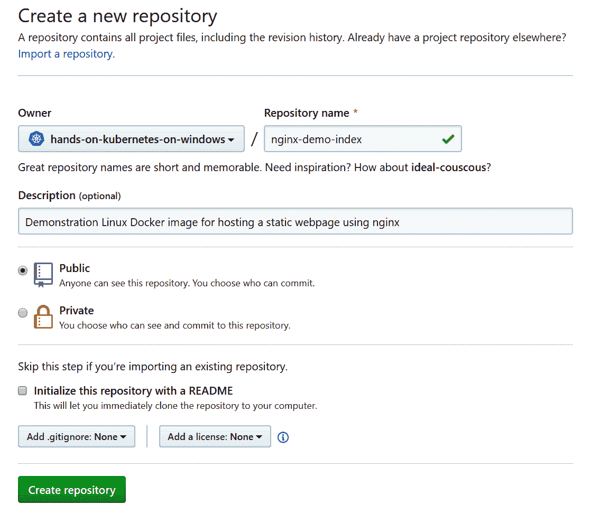

托管组织并非必需；您可以只使用自己的个人命名空间。该仓库旨在仅包含应用程序源代码（在我们的情况下，只是一个静态的`index.html`网页）和构建图像所需的 Dockerfile，这与 Docker 开发的建议最佳实践一致。

1.  在创建了仓库之后，我们可以推送一些图像的源代码。您可以在本书的 GitHub 仓库中找到我们用于托管使用 nginx 的静态网页的最简化 Docker 图像的源代码：[`github.com/PacktPublishing/Hands-On-Kubernetes-on-Windows/tree/master/Chapter03/02_nginx-demo-index`](https://github.com/PacktPublishing/Hands-On-Kubernetes-on-Windows/tree/master/Chapter03/02_nginx-demo-index)。

1.  为了克隆新创建的仓库，在 PowerShell 中，转到您想要拥有该仓库的目录并使用`git clone`命令：

```
git clone https://github.com/<userName>/<repositoryName>.git
```

1.  将所有必需的源文件复制到仓库中，并使用`git push`命令进行推送：

```
git add -A
git commit -am "Docker image source code"
git push -u origin master
```

1.  此时，当您转到 GitHub 网页时，例如[`github.com/hands-on-kubernetes-on-windows/nginx-demo-index`](https://github.com/hands-on-kubernetes-on-windows/nginx-demo-index)，您应该能够看到仓库中的文件：

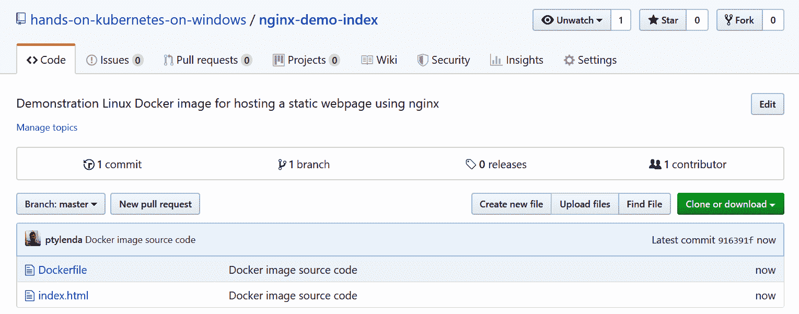

下一步是创建实际的 Docker Hub 仓库并配置自动构建。让我们开始吧！

# 创建具有自动构建的 Docker Hub 仓库

将 Docker Hub 仓库与自动构建集成需要将您的 GitHub 帐户连接到您的 Docker Hub 帐户并创建仓库本身。让我们开始吧：

1.  打开[`hub.docker.com/`](https://hub.docker.com/)，转到帐户设置。在已连接帐户部分，单击 GitHub 提供程序的连接：

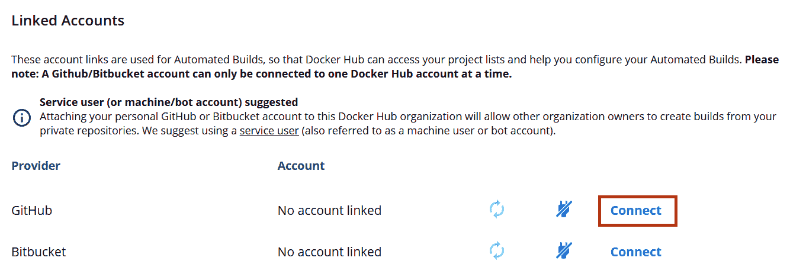

1.  授权 Docker Hub Builder 访问您的仓库。此时，如果需要，您还可以授予对任何组织的访问权限。

1.  连接帐户后，再次打开[`hub.docker.com/`](https://hub.docker.com/)，单击创建仓库部分的*+*按钮：

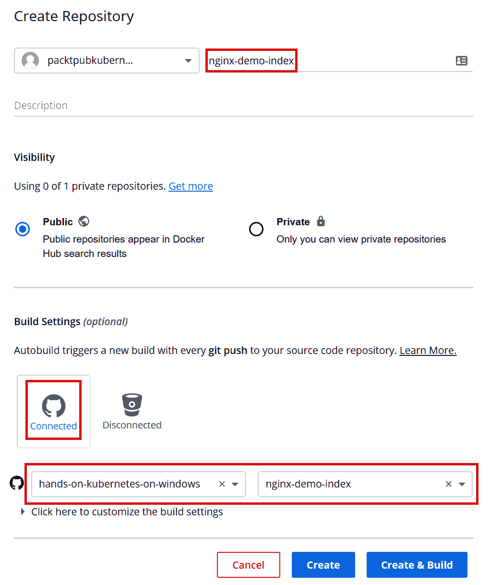

1.  填写所有必需的细节。在我们的情况下，我们的仓库名称将是`packtpubkubernetesonwindows/nginx-demo-index`。

1.  在构建设置中，选择 GitHub 图标，并选择您刚刚创建的 GitHub 存储库，如前面的屏幕截图所示。

1.  通过单击“单击此处自定义构建设置”来检查构建设置，以了解默认配置是什么：

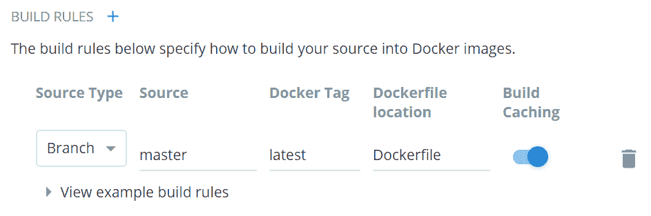

1.  默认设置适用于我们的镜像，因为我们希望在将新代码推送到主分支时触发构建。应该在您的 GitHub 存储库的根目录中使用名为 Dockerfile 的 Dockerfile 来构建镜像。

1.  单击“创建和构建”以保存并立即基于存储库中的当前代码开始构建。

1.  在最近的构建中，您应该看到您的镜像的一个挂起构建：

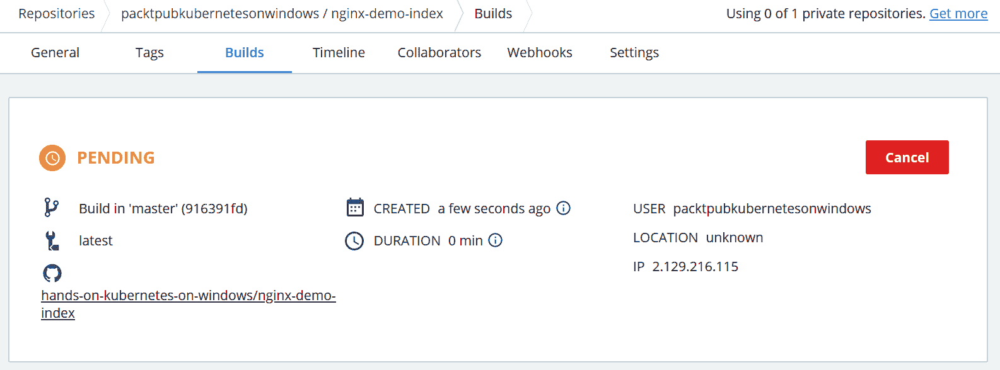

1.  几分钟后，构建应该完成，`packtpubkubernetesonwindows/nginx-demo-index:latest`镜像应该可用。您可以通过使用`docker pull packtpubkubernetesonwindows/nginx-demo-index:latest`命令来验证这一点。

现在，让我们看看如何通过提交新代码轻松触发 Docker 镜像构建。

# 触发 Docker Hub 自动构建

通过在上一节创建的自动构建设置中，触发新的 Docker 镜像构建就像提交新代码到您的 GitHub 存储库一样简单。为了做到这一点，您必须执行以下操作：

1.  对 GitHub 上镜像的源代码进行更改；例如，修改`index.html`文件：

```
<!DOCTYPE html>
<html>
    <head>
        <title>Hello World!</title>
    </head>
    <body>
        <h1>Hello World from nginx container! This is a new version of image for autobuild.</h1>
    </body>
</html>
```

1.  提交并推送代码更改：

```
git commit -am "Updated index.html"
git push -u origin master
```

1.  在 Docker Hub 上的此镜像存储库的构建选项卡中，您几乎立即应该看到已触发新的镜像构建（源提交：[`github.com/hands-on-kubernetes-on-windows/nginx-demo-index/tree/5ee600041912cdba3c82da5331542f48701f0f28`](https://github.com/hands-on-kubernetes-on-windows/nginx-demo-index/tree/5ee600041912cdba3c82da5331542f48701f0f28)）：

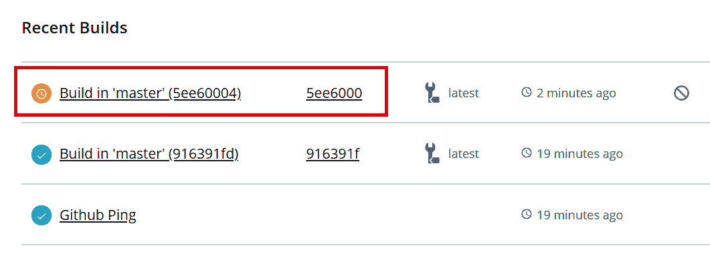

如果您的构建失败，您可以随时检查构建详细信息和构建日志选项卡中的 Docker 构建日志。

1.  构建成功后，在您的 Windows 机器上运行一个新容器来验证您的镜像：

```
docker run -it --rm `
 -p 8080:80 `
 packtpubkubernetesonwindows/nginx-demo-index:latest
```

1.  镜像将自动从 Docker Hub 存储库中拉取。在您的网络浏览器中导航至`http://localhost:8080`。您应该看到以下输出：

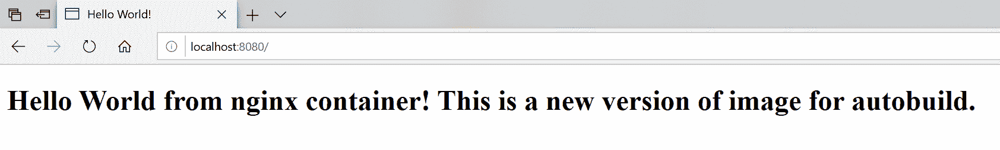

恭喜-您已成功创建并触发了 Docker Hub 上的 Docker 镜像自动构建！在下一节中，您将学习如何为基于 Windows 的图像使用 Azure 容器注册表创建类似的设置。

# 创建 Azure 容器注册表

**Azure 容器注册表**（**ACR**）是 Azure Cloud 提供的完全托管的私有 Docker 注册表。在本节中，我们将使用 Azure CLI 创建 ACR 的新实例。您将学习如何实现与 Docker Hub 提供的类似的构建自动化，但具有构建 Windows 图像和使用私有注册表的可能性。

您可以在第二章*，*管理容器中的状态*中找到 Azure CLI 的详细安装说明。

要创建 Azure 容器注册表实例，请按照以下步骤进行：

1.  确保您已经使用 PowerShell 中的`az login`命令登录到 Azure CLI。然后为 ACR 实例创建一个专用资源组。在本例中，我们将使用`acr-resource-group`资源组和`westeurope`作为 Azure 位置：

```
**az group create `**
 **--name acr-resource-group `**
 **--location westeurope** 
```

您还可以使用本书 GitHub 存储库中提供的 PowerShell 脚本：[`github.com/PacktPublishing/Hands-On-Kubernetes-on-Windows/blob/master/Chapter03/03_CreateAzureContainerRegistry.ps1`](https://github.com/PacktPublishing/Hands-On-Kubernetes-on-Windows/blob/master/Chapter03/03_CreateAzureContainerRegistry.ps1)。请记住提供全局唯一的 ACR 名称，以便能够创建实例。

1.  接下来，使用全局唯一名称创建基本层 ACR 实例（为演示目的，我们提供了`handsonkubernetesonwinregistry`，但您必须提供自己的唯一名称，因为它将成为注册表的 DNS 名称的一部分）：

```
az acr create `
 --resource-group acr-resource-group ` --name handsonkubernetesonwinregistry `
 --sku Basic
```

如果您对 Azure 容器注册表的其他服务层感兴趣，请参考官方文档：[`docs.microsoft.com/en-us/azure/container-registry/container-registry-skus`](https://docs.microsoft.com/en-us/azure/container-registry/container-registry-skus)。

您将获得有关新创建的注册表的详细信息：

```
{
  "adminUserEnabled": false,
  "creationDate": "2019-08-18T21:20:53.081364+00:00",
  "id": "/subscriptions/cc9a8166-829e-401e-a004-76d1e3733b8e/resourceGroups/acr-resource-group/providers/Microsoft.ContainerRegistry/registries/handsonkubernetesonwinregistry",
  "location": "westeurope",
  "loginServer": "handsonkubernetesonwinregistry.azurecr.io",
  "name": "handsonkubernetesonwinregistry",
  "networkRuleSet": null,
  "provisioningState": "Succeeded",
  "resourceGroup": "acr-resource-group",
  "sku": {
    "name": "Basic",
    "tier": "Basic"
  },
  "status": null,
  "storageAccount": null,
  "tags": {},
  "type": "Microsoft.ContainerRegistry/registries"
}
```

最重要的信息是`"loginServer": "handsonkubernetesonwinregistry.azurecr.io"`，这将用于推送和拉取 Docker 镜像。

1.  最后，最后一步是登录到注册表，这样您就可以在 Docker CLI 中使用注册表：

```
az acr login `
 --name handsonkubernetesonwinregistry
```

有了 ACR 设置，我们准备在云环境中使用 ACR 构建 Docker 镜像。

# 使用 Azure 容器注册表构建 Docker 镜像

为了演示目的，我们将使用一个简单的 Windows IIS 映像，用于托管静态 HTML 网页。您可以在本书的 GitHub 存储库中找到 Docker 映像源：[`github.com/PacktPublishing/Hands-On-Kubernetes-on-Windows/tree/master/Chapter03/04_iis-demo-index`](https://github.com/PacktPublishing/Hands-On-Kubernetes-on-Windows/tree/master/Chapter03/04_iis-demo-index)。要在 ACR 中构建映像，请按照以下步骤进行：

1.  使用图像源代码克隆存储库，并在 PowerShell 中导航至`Chapter03/04_iis-demo-index`目录。

1.  执行`az acr build`命令以在云环境中开始 Docker 镜像构建（记得提供 Docker 构建上下文目录，在本例中用*dot*表示当前目录）：

```
az acr build `
 --registry handsonkubernetesonwinregistry `
 --platform windows `
 --image iis-demo-index:latest .
```

1.  使用`az acr build`命令启动 ACR 快速任务。这将上传 Docker 构建上下文到云端，并在远程运行构建过程。几分钟后，构建过程应该完成。您可以期望类似于本地`docker build`命令的输出。

1.  现在，您可以通过在本地机器上运行容器并从 ACR 中拉取映像来验证映像。您需要使用注册表的完整 DNS 名称（在本例中，这是`handsonkubernetesonwinregistry.azurecr.io`）：

```
docker run -it --rm `
 -p 8080:80 `
 handsonkubernetesonwinregistry.azurecr.io/iis-demo-index:latest
```

1.  在 Web 浏览器中导航至`http://localhost:8080`，并验证容器是否按预期运行：

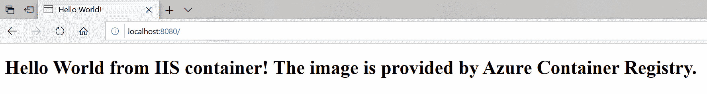

您已成功执行了 ACR 构建快速任务！现在，我们可以开始自动化 ACR 构建触发器，以类似于使用 Docker Hub 的方式对 GitHub 存储库代码推送进行操作。

# Azure 容器注册表的自动构建

Azure 容器注册表提供了类似于 Docker Hub 的功能，用于在代码推送时自动化 Docker 镜像构建。管道是高度可定制的，可以支持同时构建多个容器映像，但在本例中，我们将专注于在 GitHub 存储库代码推送时自动化单个映像构建。

对于更高级的多步骤和多容器场景，请查看官方文档：[`docs.microsoft.com/en-us/azure/container-registry/container-registry-tutorial-multistep-task`](https://docs.microsoft.com/en-us/azure/container-registry/container-registry-tutorial-multistep-task)。

集成 ACR 和 GitHub 可以按以下步骤执行：

1.  创建一个新的 GitHub 存储库并推送 Docker 镜像源代码。在这个例子中，我们将使用来自[`github.com/PacktPublishing/Hands-On-Kubernetes-on-Windows/tree/master/Chapter03/04_iis-demo-index`](https://github.com/PacktPublishing/Hands-On-Kubernetes-on-Windows/tree/master/Chapter03/04_iis-demo-index)的源代码，它将被推送到一个新的 GitHub 存储库，即[`github.com/hands-on-kubernetes-on-windows/iis-demo-index`](https://github.com/hands-on-kubernetes-on-windows/iis-demo-index)。

1.  生成 GitHub **个人访问令牌**（**PAT**）以便在 ACR 中访问存储库。转到[`github.com/settings/tokens/new`](https://github.com/settings/tokens/new)。

1.  输入 PAT 描述并选择 repo:status 和 public_repo 范围（对于私有存储库，您需要使用完整的 repo 范围）：

！[](assets/972e23d8-a90d-4160-b5e2-08abf11d5f1f.png)

1.  点击“生成令牌”按钮。

1.  您将获得一个 PAT 值。将令牌复制到安全位置，因为您将需要它来设置集成。

1.  现在，让我们创建一个名为`iis-demo-index-task`的 ACR 任务。当代码被推送到[`github.com/hands-on-kubernetes-on-windows/iis-demo-index`](https://github.com/hands-on-kubernetes-on-windows/iis-demo-index)时，这将自动触发。所需的参数类似于 Docker Hub 的构建配置：

```
az acr task create `
 --registry handsonkubernetesonwinregistry `
 --name iis-demo-index-task `
 --platform windows `
 --image "iis-demo-index:{{.Run.ID}}" `
 --context https://github.com/hands-on-kubernetes-on-windows/iis-demo-index `
 --branch master `
 --file Dockerfile `
 --git-access-token <gitHubPersonalAccessTokenValue>
```

如果您在使用 Azure CLI 时遇到`az acr task create: 'utputformat' is not a valid value for '--output'. See 'az acr task create --help'.`的错误，请确保您正确地转义/引用 PowerShell 中的花括号。

1.  使用`az acr task run`命令测试您的 ACR 任务定义：

```
az acr task run `
   --registry handsonkubernetesonwinregistry `
   --name iis-demo-index-task
```

1.  在 Docker 镜像的源代码中，引入一个更改并提交并将其推送到 GitHub 存储库。例如，修改静态文本，使其读取如下：

```
Hello World from IIS container! The image is provided by Azure Container Registry and automatically built by Azure Container Registry task.
```

1.  检索 ACR 任务日志以验证任务是否确实被触发：

```
az acr task  logs --registry handsonkubernetesonwinregistry
```

您应该看到类似以下的输出，这表明推送触发了一个新的任务实例：

！[](assets/ba48c49b-f339-4610-907d-fd4037c0eb77.png)

1.  任务完成后，拉取带有 Run ID 标记的镜像（在本例中，这是 cb5）。您也可以使用`latest`标记，但这需要使用`docker rmi`命令删除本地缓存的镜像：

```
docker pull handsonkubernetesonwinregistry.azurecr.io/iis-demo-index:cb5
```

1.  使用`handsonkubernetesonwinregistry.azurecr.io/iis-demo-index:cb5`镜像创建一个新的容器：

```
docker run -it --rm `
 -p 8080:80 `
 handsonkubernetesonwinregistry.azurecr.io/iis-demo-index:cb5
```

1.  在 Web 浏览器中导航至`http://localhost:8080`，并验证容器是否按预期运行。还要验证静态 HTML 页面是否包含代码推送中引入的更改：

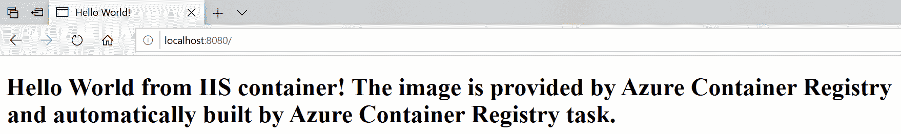

其他云服务提供商也提供类似的设置 Docker 镜像注册表和构建流水线的服务。如果您对 Google Cloud Platform 服务感兴趣，请查看 GCP Cloud Build：[`cloud.google.com/cloud-build/docs/quickstart-docker`](https://cloud.google.com/cloud-build/docs/quickstart-docker)。

您已成功使用 GitHub 和 Azure 容器注册表设置了 Docker 镜像构建流水线 - 祝贺！现在，我们将快速查看图像标记和版本控制的最佳实践。

# 图像标记和版本控制

Docker 镜像使用标签来提供存储库中相同镜像的不同版本 - 每个镜像标签对应于给定的 Docker 镜像 ID。通常在构建镜像时会指定 Docker 镜像的标签，但您也可以使用`docker tag`命令显式添加标签：

```
docker pull mcr.microsoft.com/dotnet/core/sdk
docker tag mcr.microsoft.com/dotnet/core/sdk:latest mydotnetsdk:v1
docker tag mcr.microsoft.com/dotnet/core/sdk:latest mydotnetsdk:v2
```

在此示例中，我们拉取了.NET Core SDK 的`latest`镜像标签（因为没有明确指定），然后在本地镜像缓存中使用`mydotnetsdk:v1`和`mydotnetsdk:v2`标签标记了该镜像。现在，可以在本地机器上执行操作时使用这些标签，如下所示：

```
docker run -it --rm mydotnetsdk:v1
```

让我们来看看`latest`标签，在使用 Docker 时经常使用。

# 使用最新标签

默认情况下，Docker CLI 假定一个特殊的标签称为`latest`。这意味着如果您执行`docker pull applicationimage`命令或`docker run -it applicationimage`命令，或在 Dockerfile 中使用`FROM applicationimage`，将使用`applicationimage:latest`标签。同样，当您执行`docker build -t applicationimage .`时，生成的 Docker 镜像将被标记为`latest`标签，并且每次构建都将产生`applicationimage:latest`的新版本。

重要的是要理解`latest`的行为与任何其他 Docker 镜像标签一样。它可以被视为 Docker 在用户未提供标签时始终使用的默认值。这可能会导致一些混淆，具体如下：

+   在图像构建期间，如果为图像指定了标签，最新标签将不会被添加。这意味着，如果您将`applicationimage:v1`推送到注册表，这并不意味着`applicationimage:latest`将被更新。您必须明确执行。

+   当图像所有者将新的 Docker 镜像版本推送到存储库并再次标记为`latest`标签时，并不意味着您本地缓存的图像将在`docker build`期间被更新和使用。您必须告诉 Docker CLI 尝试使用`docker build`的`--pull`参数来拉取图像的更新版本。

+   在 Dockerfile 的`FROM`指令中使用`latest`标签可能导致在不同时间点构建不同的图像，这通常是不可取的。例如，您可能在`latest`指向 SDK 版本 2.2 时使用`mcr.microsoft.com/dotnet/core/sdk`图像构建您的图像，但几个月后，使用相同的 Dockerfile 构建将导致使用版本 3.0 作为基础。

一般最佳实践（Kubernetes 也是如此）是避免使用`latest`标签部署生产容器，并仅在开发场景和本地环境的便利性使用`latest`标签。同样，为了确保您的 Docker 图像可预测且自描述，应避免在 Dockerfile 中使用带有`latest`标签的基础图像，而是使用特定的标签。

# 语义化版本

为了有效地管理 Docker 图像的版本和标记，您可以使用**语义化版本**（**Semver**）作为一般策略。这种版本方案在图像分发商中被广泛采用，并帮助消费者了解您的图像如何演变。

通常，语义版本建议使用三个数字（主要版本、次要版本和修订版本），用点分隔，`<major>.<minor>.<patch>`，根据需要递增每个数字。例如，2.1.5 表示图像的主要版本是 2，次要版本是 1，当前修订版本为 5。这些发布数字的含义和递增规则与非容器化应用程序的版本化类似。

+   **主要版本**：如果您引入了破坏兼容性或其他破坏性更改的功能，则递增。

+   **次要版本**：如果您引入的功能与先前版本完全兼容，则递增。消费者不需要升级应用程序的用法。

+   **补丁**：如果要发布错误修复或补丁，则递增。

有关 Semver 作为一般概念的更多细节可以在这里找到：[`semver.org/`](https://semver.org/)。

在构建/推送 Docker 图像时使用 Semver 的最佳实践可以总结如下：

+   构建图像的新版本时，始终创建新的**补丁**标签（例如 2.1.5）。

+   始终覆盖现有的主要和次要标签（例如，2 和 2.1）。

+   永远不要覆盖补丁标签。这确保了希望使用特定版本应用程序的图像使用者可以确保随着时间的推移不会发生变化。

+   始终覆盖现有的`latest`标签。

以下一组命令显示了构建和标记新版本`applicationimage` Docker 图像的示例：

```
# New build a new version of image and push latest tag
docker build -t applicationimage:latest .
docker push applicationimage:latest

# New major tag
docker tag applicationimage:latest applicationimage:2
docker push applicationimage:2

# New minor tag
docker tag applicationimage:latest registry:2.1
docker push applicationimage:2.1

# New patch tag
docker tag applicationimage:latest applicationimage:2.1.5
docker push applicationimage:2.1.5
```

还可以引入其他标签，以添加到构建系统 ID 或用于图像构建的 git 提交 SHA-1 哈希的相关性。

# 确保图像供应链的完整性

提供图像供应链的内容信任是管理 Docker 图像中最重要但经常被忽视的主题之一。在任何通过不受信任的媒介（如互联网）进行通信和数据传输的分布式系统中，提供内容信任的手段至关重要，即验证进入系统的数据的来源（发布者）和完整性。对于 Docker 来说，这对于推送和拉取图像（数据）尤为重要，这是由 Docker 引擎执行的。

Docker 生态系统描述了**Docker 内容信任**（**DCT**）的概念，它提供了一种验证数据数字签名的方法，这些数据在 Docker 引擎和 Docker 注册表之间传输。此验证允许发布者对其图像进行签名，并允许消费者（Docker 引擎）验证签名，以确保图像的完整性和来源。

在 Docker CLI 中，可以使用`docker trust`命令对图像进行签名，该命令构建在 Docker Notary 之上。这是用于发布和管理受信任内容集合的工具。签署图像需要具有关联的 Notary 服务器的 Docker 注册表，例如 Docker Hub。

要了解有关私有 Azure 容器注册表的内容信任的更多信息，请参阅[`docs.microsoft.com/en-us/azure/container-registry/container-registry-content-trust`](https://docs.microsoft.com/en-us/azure/container-registry/container-registry-content-trust)。

# 签署图像

例如，我们将对本章中已构建并推送到 Docker Hub 的一个 Docker 镜像进行签名，即`packtpubkubernetesonwindows/iis-demo-index`。要跟进，请在自己的镜像存储库`<dockerId>/iis-demo-index`上执行操作。签名可以通过以下步骤完成：

1.  生成委托密钥对。在本地，可以使用以下命令执行：

```
docker trust key generate <pairName>
```

1.  您将被要求为私钥输入密码。选择一个安全的密码并继续。私人委托密钥将默认存储在`~/.docker/trust/private`中（也在 Windows 上），公共委托密钥将保存在当前工作目录中。

1.  将委托公钥添加到公证服务器（对于 Docker Hub，它是`notary.docker.io`）。加载密钥是针对特定镜像存储库执行的，在 Notary 中，它由**全局唯一名称**（**GUN**）标识。对于 Docker Hub，它们的形式为`docker.io/<dockerId>/<repository>`。执行以下命令：

```
docker trust signer add --key <pairName>.pub <signerName> **docker.io/<dockerId>/<repository>**

**# For example**
**docker trust signer add --key packtpubkubernetesonwindows-key.pub packtpubkubernetesonwindows docker.io/packtpubkubernetesonwindows/iis-demo-index** 
```

1.  如果您是第一次为存储库执行委托，系统将自动要求使用本地 Notary 规范根密钥进行初始化。

1.  给镜像打上一个特定的标签，以便进行签名，如下所示：

```
docker tag packtpubkubernetesonwindows/iis-demo:latest packtpubkubernetesonwindows/iis-demo:1.0.1
```

1.  使用私人委托密钥对新标签进行签名并将其推送到 Docker Hub，如下所示：

```
docker trust sign packtpubkubernetesonwindows/iis-demo:1.0.1
```

1.  或者，这可以通过`docker push`执行，前提是您在推送之前在 PowerShell 中设置了`DOCKER_CONTENT_TRUST`环境变量：

```
$env:DOCKER_CONTENT_TRUST=1
docker tag packtpubkubernetesonwindows/iis-demo:latest packtpubkubernetesonwindows/iis-demo:1.0.2
docker push packtpubkubernetesonwindows/iis-demo:1.0.2
```

1.  现在，您可以检查存储库的远程信任数据：

```
docker trust inspect --pretty docker.io/packtpubkubernetesonwindows/iis-demo:1.0.1
```

接下来，让我们尝试在客户端启用 DCT 运行容器。

# 为客户端启用 DCT

为了在使用 Docker CLI 进行`push`、`build`、`create`、`pull`和`run`时强制执行 DCT，您必须将`DOCKER_CONTENT_TRUST`环境变量设置为`1`。默认情况下，Docker 客户端禁用了 DCT。按照以下步骤：

1.  在当前的 PowerShell 会话中设置`DOCKER_CONTENT_TRUST`环境变量：

```
$env:DOCKER_CONTENT_TRUST=1
```

1.  使用刚刚创建的签名镜像运行一个新容器：

```
docker run -d --rm docker.io/packtpubkubernetesonwindows/iis-demo:1.0.1
```

1.  您会注意到容器可以正常启动。现在，尝试使用未签名的`latest`标签创建一个新容器：

```
PS C:\src> docker run -d --rm docker.io/packtpubkubernetesonwindows/iis-demo:latest
C:\Program Files\Docker\Docker\Resources\bin\docker.exe: No valid trust data for latest.
See 'C:\Program Files\Docker\Docker\Resources\bin\docker.exe run --help'.
```

这个简短的场景展示了如何使用 DCT 来确保用于容器创建的镜像的完整性和来源。

# 摘要

在本章中，您了解了 Docker 生态系统如何提供基础设施来存储和共享容器映像，使用 Docker 注册表进行演示。使用公共 Docker Hub 和使用 Azure CLI 从头开始设置的私有 Azure 容器注册表演示了图像注册表和自动云构建的概念。您还了解了使用语义版本控制方案对图像进行标记和版本控制的最佳实践。最后，您还了解了如何使用**Docker 内容信任**（**DCT**）确保图像的完整性。

在下一章中，我们将深入研究 Kubernetes 生态系统，以了解一些关键概念以及它们目前如何支持 Windows 容器。

# 问题

1.  Docker 注册表是什么，它与 Docker Hub 有何关系？

1.  什么是图像标签？

1.  Docker Hub 的标准图像存储库命名方案是什么？

1.  Azure 容器注册表是什么，它与 Docker Hub 有何不同？

1.  什么是`latest`标签，何时建议使用它？

1.  如何使用语义版本控制对图像进行版本控制（标记）？

1.  为什么要使用 Docker 内容信任？

您可以在本书的*评估*部分找到这些问题的答案。

# 进一步阅读

+   有关管理 Docker 容器映像和映像注册表的更多信息，请参考以下 Packt 图书：

+   *Docker on Windows: From 101 to production with Docker on Windows* ([`www.packtpub.com/virtualization-and-cloud/docker-windows-second-edition`](https://www.packtpub.com/virtualization-and-cloud/docker-windows-second-edition))

+   *Learn Docker – Fundamentals of Docker 18.x* ([`www.packtpub.com/networking-and-servers/learn-docker-fundamentals-docker-18x`](https://www.packtpub.com/networking-and-servers/learn-docker-fundamentals-docker-18x))

+   如果您想了解 Azure 容器注册表及其如何适应 Azure 生态系统的更多信息，请参考以下 Packt 图书：

+   *Azure for Architects – Second Edition* ([`www.packtpub.com/virtualization-and-cloud/azure-architects-second-edition`](https://www.packtpub.com/virtualization-and-cloud/azure-architects-second-edition))

+   您还可以参考官方的 Docker 文档，其中对 Docker Hub ([`docs.docker.com/docker-hub/`](https://docs.docker.com/docker-hub/))和开源 Docker 注册表 ([`docs.docker.com/registry/`](https://docs.docker.com/registry/))进行了很好的概述。
