# Kubernetes 概念和 Windows 支持

在之前的章节中，我们专注于 Windows 平台上的容器化和 Docker 支持。这些概念主要局限于单机场景，即应用程序只需要一个容器主机。对于生产级分布式容器系统，您必须考虑不同的方面，如可伸缩性、高可用性和负载平衡，这总是需要对运行在多个主机上的容器进行编排。

容器编排是在大型动态环境中管理容器生命周期的一种方式，从提供和部署容器到管理网络、提供容器的冗余和高可用性、自动扩展和缩减容器实例、自动健康检查和遥测收集。解决容器编排问题并不是一件简单的事情，这就是为什么 Kubernetes（简称 k8s，其中 8 代表省略的字符数）诞生的原因。

Kubernetes 的故事可以追溯到 21 世纪初的 Borg 系统，这是谷歌内部开发的用于大规模管理和调度作业的系统。随后，在 2010 年代初，谷歌开发了 Omega 集群管理系统，作为对 Borg 的全新重写。虽然 Omega 仍然只在谷歌内部使用，但在 2014 年，Kubernetes 作为开源容器编排解决方案宣布推出，它的根源来自 Borg 和 Omega。2015 年 7 月，Kubernetes 的 1.0 版本发布时，谷歌与 Linux 基金会合作成立了云原生计算基金会（CNCF）。该基金会旨在赋予组织能力，使它们能够在公共、私有和混合云等现代动态环境中构建和运行可扩展的应用程序。四年后的 2019 年 4 月，发布了 Kubernetes 1.14 版本，为 Windows 节点和 Windows 容器提供了生产级支持。本章主要讨论 Kubernetes 在 Windows 方面的当前状态！

**云原生应用**是容器编排中常用的术语，用于指代利用容器化、云计算框架和组件的松耦合（微服务）的应用程序。但这并不一定意味着云原生应用必须在云中运行 - 它们遵循一组原则，使它们易于在本地或公共/私有云中托管。如果您对了解更多关于 CNCF 感兴趣，请参考官方网页：[`www.cncf.io/`](https://www.cncf.io/)。

在本章中，我们将涵盖以下主题：

+   Kubernetes 高级架构

+   Kubernetes 对象

+   Windows 和 Kubernetes 生态系统

+   Windows 上的 Kubernetes 限制

+   从头开始创建您自己的开发集群

+   生产集群部署策略

+   托管的 Kubernetes 提供程序

# 技术要求

本章，您将需要以下内容：

+   已安装 Windows 10 Pro、企业版或教育版（1903 版或更高版本，64 位）

+   已安装 Docker Desktop for Windows 2.0.0.3 或更高版本

+   已安装的 Windows Chocolatey 软件包管理器（[`chocolatey.org/`](https://chocolatey.org/)）

+   已安装 Azure CLI

如何安装 Docker Desktop for Windows 及其系统要求已在第一章*，Creating Containers*中介绍过。

使用 Chocolatey 软件包管理器并非强制，但它可以使安装和应用程序版本管理变得更加容易。安装过程在此处有文档记录：[`chocolatey.org/install`](https://chocolatey.org/install)。

对于 Azure CLI，您可以在第二章*，*Managing State in Containers**中找到详细的安装说明。

要了解托管的 Kubernetes 提供程序，您将需要自己的 Azure 帐户，以便创建具有 Windows 节点的 AKS 实例。如果您之前没有为本书的前几章创建帐户，您可以在此处阅读有关如何获取个人使用的有限免费帐户的更多信息：[`azure.microsoft.com/en-us/free/`](https://azure.microsoft.com/en-us/free/)。

您可以从本书的官方 GitHub 存储库下载本章的最新代码示例：[`github.com/PacktPublishing/Hands-On-Kubernetes-on-Windows/tree/master/Chapter04`](https://github.com/PacktPublishing/Hands-On-Kubernetes-on-Windows/tree/master/Chapter04)。

# Kubernetes 高级架构

在本节和下一节中，我们将重点关注 Kubernetes 的高级架构及其核心组件。如果您已经对 Kubernetes 有一般了解，但想了解更多关于 Kubernetes 对 Windows 的支持，您可以跳到*Windows 和 Kubernetes 生态系统*部分。

# Kubernetes 是什么？

总的来说，Kubernetes 可以被看作是以下内容：

+   容器（微服务）编排系统

+   用于运行分布式应用程序的集群管理系统

作为一个容器编排器，Kubernetes 解决了在大规模部署容器化的云原生应用时出现的常见挑战。这包括以下内容：

+   在多个容器主机（节点）上进行容器的配置和部署

+   服务发现和负载均衡网络流量

+   自动扩展容器实例的规模

+   自动化部署和回滚新的容器镜像版本

+   自动的、最佳的容器资源（如 CPU 或内存）装箱

+   应用程序监控、遥测收集和健康检查

+   编排和抽象存储（本地、本地部署或云端）

与此同时，Kubernetes 也可以被描述为一个集群管理系统 - 主节点（或在高可用部署中的多个主节点）负责有效地协调处理实际容器工作负载的多个工作节点。这些工作负载不仅限于 Docker 容器 - Kubernetes 在工作节点上使用容器运行时接口（CRI）来抽象容器运行时。最终，集群客户端（例如 DevOps 工程师）可以使用主节点暴露的 RESTful API 来管理集群。集群管理使用声明式模型进行，这使得 Kubernetes 非常强大 - 您描述所需的状态，Kubernetes 会为了将集群的当前状态转换为所需的状态而进行所有繁重的工作。

使用临时命令进行命令式集群管理也是可能的，但通常不建议用于生产环境。操作是直接在活动集群上执行的，并且没有先前配置的历史记录。在本书中，我们将尽可能使用声明性对象配置技术。有关 Kubernetes 集群管理技术的更详细讨论，请参阅官方文档：[`kubernetes.io/docs/concepts/overview/working-with-objects/object-management/`](https://kubernetes.io/docs/concepts/overview/working-with-objects/object-management/)。

Kubernetes 的高级架构可以在以下图表中看到。我们将在接下来的几段中逐个介绍每个组件：

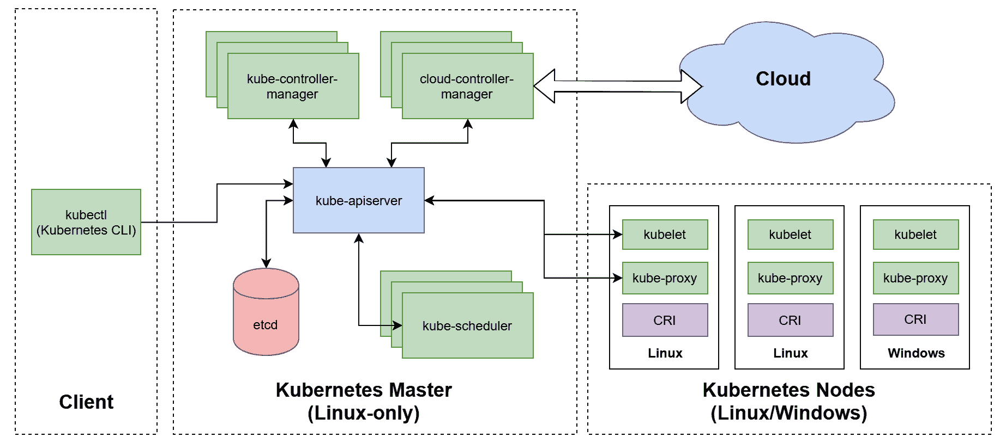

让我们首先关注 Kubernetes 主节点，也称为控制平面的角色。

# Kubernetes 主节点-控制平面

在 Kubernetes 集群中，主节点（控制平面）由一组负责全局决策的组件组成，例如将应用实例调度和部署到工作节点，以及管理集群事件。此外，主节点为工作节点和管理客户端之间的通信公开了 API。

主要组件不限于在专用主机上运行；它也可以在工作节点上运行。主节点可以像 Kubernetes 集群中的任何节点一样充当工作节点。但是，一般来说，由于可靠性原因，不建议这样做-而且对于生产环境，您应该考虑运行高可用性的 Kubernetes 设置，这需要多个主节点运行组件冗余。

运行 Kubernetes 主服务的最显著限制之一是它们必须托管在 Linux 机器上。不可能在 Windows 机器上拥有主组件，这意味着即使您计划仅运行 Windows 容器，您仍然需要 Linux 机器作为主机。目前，尚无计划实施仅限 Windows 的 Kubernetes 集群，尽管随着 Windows 子系统的开发进展，情况可能会发生变化。

我们将简要介绍组成主节点的组件。让我们首先看一下 Kubernetes API 服务器（或`kube-apiserver`，这是该组件的二进制名称）。

# kube-apiserver

**Kubernetes API 服务器**（**kube-apiserver**）是 Kubernetes 控制平面中的核心组件，充当客户端和集群组件之间所有交互的网关。其主要职责如下：

+   公开作为一组通过 HTTPS 的 RESTful 端点实现的集群 API。API 由管理集群的客户端以及内部 Kubernetes 组件使用。Kubernetes 集群中的所有资源都被抽象为 Kubernetes API 对象。

+   在`etcd`集群中持久化集群状态 - 客户端执行的每个操作或集群组件报告的状态更新都必须通过 API 服务器并持久化存储在集群中。

+   用户和服务账户的认证和授权。

+   请求的验证。

+   提供*watch* API 以通知订阅者（例如其他集群组件）有关集群状态变化的增量通知源。观察 API 是使 Kubernetes 高度可扩展和分布式的关键概念。

在高可用的 Kubernetes 部署中，`kube-apiserver`托管在多个主节点上，位于专用负载均衡器后面。

# etcd 集群

为了持久化集群状态，Kubernetes 使用`etcd` - 一个分布式、可靠的键值存储，利用 Raft 分布式一致性算法来提供顺序一致性。`etcd`集群是控制平面中最重要的部分 - 这是整个集群的真相来源，无论是当前状态还是集群的期望状态。

通常，仅建议用于测试目的的单节点`etcd`集群。对于生产场景，您应该始终考虑至少运行一个由五个成员组成的集群（成员数为奇数），以提供足够的容错能力。

在选择`etcd`集群部署拓扑时，可以考虑堆叠的 etcd 拓扑或外部的 etcd 拓扑。堆叠的 etcd 拓扑由每个 Kubernetes 主节点实例的一个 etcd 成员组成，而外部的 etcd 拓扑则利用了一个独立于 Kubernetes 部署的 etcd 集群，并通过负载均衡器可用。您可以在官方文档中了解更多关于这些拓扑的信息：[`kubernetes.io/docs/setup/production-environment/tools/kubeadm/ha-topology/`](https://kubernetes.io/docs/setup/production-environment/tools/kubeadm/ha-topology/)。

`etcd`公开的*watch*协议也是 Kubernetes 中 watch API 的核心功能，由`kube-apiserver`为其他组件提供。

# kube-scheduler

**Kubernetes Scheduler**（**kube-scheduler**）组件的主要责任是调度容器工作负载（Kubernetes Pods）并将它们分配给满足运行特定工作负载所需条件的健康工作节点。

Pod 是 Kubernetes 系统中最小的部署单元，是一个或多个具有共享网络和存储的容器组。我们将在下一节中介绍这个 Kubernetes 对象。

调度分为两个阶段：

+   过滤

+   评分

在过滤阶段，`kube-scheduler`确定能够运行给定 Pod 的节点集。这包括检查节点的实际状态，并验证 Pod 定义中指定的任何资源要求。在这一点上，如果没有节点可以运行给定的 Pod，那么 Pod 将无法调度并保持挂起状态。接下来，在评分步骤中，调度程序根据一组策略为每个节点分配分数。然后，调度程序将 Pod 分配给具有最高分数的节点。

您可以在官方文档中了解更多有关可用策略的信息：[`kubernetes.io/docs/concepts/scheduling/kube-scheduler/#kube-scheduler-implementation`](https://kubernetes.io/docs/concepts/scheduling/kube-scheduler/#kube-scheduler-implementation)。

Kubernetes 设计提供了很大的可扩展性和替换组件的可能性。Kube-scheduler 是用来演示这一原则的组件之一。即使其内部业务逻辑很复杂（所有高效的调度启发式算法都相当复杂...），调度程序只需要监视*未分配*的 Pod，确定最适合它们的节点，并通知 API 服务器进行分配。您可以在这里查看自定义调度程序的示例实现：[`banzaicloud.com/blog/k8s-custom-scheduler/`](https://banzaicloud.com/blog/k8s-custom-scheduler/)。

现在，让我们来看看`kube-controller-manager`。

# kube-controller-manager

**Kubernetes Controller Manager**（**kube-controller-manager**）是负责在集群中运行核心协调和控制循环的组件。控制器管理器由一组独立的专门控制器组成。控制器的主要目的是观察 API 服务器公开的*当前*和*期望*集群状态，并命令试图将*当前*状态转换为*期望*状态的变化。

`kube-controller-manager`二进制文件中提供的最重要的控制器如下：

+   **Node Controller（以前称为 nodelifecycle）**：观察节点的状态，并在节点不可用时做出反应。

+   **ReplicaSet Controller（replicaset）**：负责确保每个 ReplicaSet API 对象运行正确数量的 Pod。

+   **Deployment Controller（deployment）**：负责管理关联的 ReplicaSet API 对象并执行部署和回滚。

+   **Endpoints Controller（endpoint）**：管理 Endpoint API 对象。

+   **Service Account Controller（serviceaccount）和 Token Controller（serviceaccount-token）**：负责为新命名空间创建默认帐户和访问令牌。

您可以将 kube-controller-manager 视为确保集群的*当前*状态朝向*期望*集群状态移动的 Kubernetes 大脑。

# cloud-controller-manager

最初是`kube-controller-manager`的一部分，**Kubernetes Cloud Controller Manager**（**cloud-controller-manager**）提供特定于云的控制循环。分离云控制器管理器的原因是为了更容易地发展特定于云的连接器（提供商）代码，这些代码在大多数情况下以不同的节奏发布。

截至 Kubernetes 1.17，cloud-controller-manager 仍处于测试阶段。您可以在官方文档中检查该功能的当前状态：[`kubernetes.io/docs/tasks/administer-cluster/running-cloud-controller`](https://kubernetes.io/docs/tasks/administer-cluster/running-cloud-controller)。

启用云控制器管理器时，必须禁用 kube-controller-manager 中的特定于云的控制循环。然后，以下控制器将依赖于云提供商的实现：

+   **Node Controller**：用于确定节点的状态并检测节点是否已删除。

+   路由控制器：需要提供者来设置网络路由。

+   服务控制器：通过提供者管理负载均衡器。

+   卷控制器：使用提供者管理存储卷。

作为 Kubernetes 的一部分提供的外部云提供者的列表不断发展，并且可以在官方文档（[`kubernetes.io/docs/concepts/cluster-administration/cloud-providers/`](https://kubernetes.io/docs/concepts/cluster-administration/cloud-providers/)）和 Kubernetes 的组织 GitHub 页面（[`github.com/kubernetes?q=cloud-provider-&type=&language=`](https://github.com/kubernetes?q=cloud-provider-&type=&language=)）上进行检查。

# Kubernetes 节点 - 数据平面

在 Kubernetes 集群中，数据平面由负责运行主控安排的容器工作负载的节点（以前称为*minions*）组成。节点可以是物理裸金属机器或虚拟机器，这在设计集群时提供了灵活性。

以下图表总结了组成 Kubernetes 节点的架构和组件：

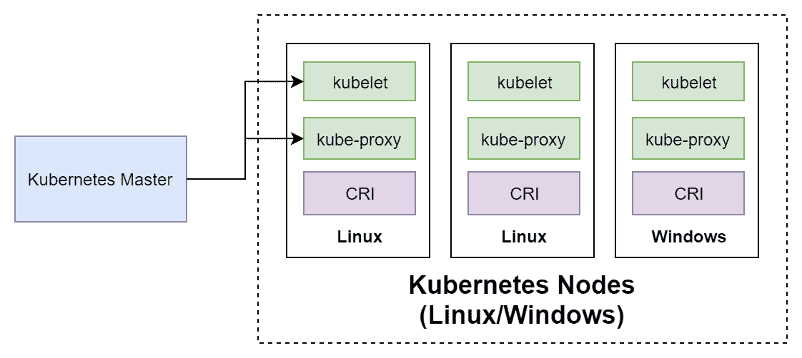

在 Windows 支持方面，所有节点组件都可以在 Windows 和 Linux 机器上运行。这意味着 Windows Kubernetes 节点在与 Linux 节点相同的方式下对主控可见，并且从这个角度来看，它们只在它们可以支持的容器类型上有所不同。

Kubernetes 节点的主要组件如下：

+   kubelet：主要的 Kubernetes 代理，负责确保容器工作负载（Pods）在节点上执行。

+   容器运行时：负责管理容器的软件。它由容器运行时接口（CRI）抽象出来。

+   kube-proxy：负责管理本地节点网络的网络代理。

让我们先来看看`kubelet`。

# kubelet

在集群中的每个节点上运行，`kubelet`是一个负责确保控制平面分配的容器工作负载（Pods）得到执行的服务。此外，它还负责以下工作：

+   报告节点和 Pods 状态给 API 服务器

+   报告资源利用情况

+   执行节点注册过程（加入新节点到集群时）

+   执行活跃性和就绪性探针（健康检查）并将其状态报告给 API 服务器

为执行实际的与容器相关的操作，kubelet 使用容器运行时。

# 容器运行时

Kubelet 并不直接与 Docker 耦合 - 实际上，正如我们在本节介绍中提到的，Docker 并不是 Kubernetes 支持的唯一**容器运行时**。为了执行与容器相关的任务，例如拉取镜像或创建新容器，kubelet 利用**容器运行时接口**（CRI），这是一个为不同运行时抽象所有常见容器操作的插件接口。

容器运行时接口的实际定义是一个 protobuf API 规范，可以在官方存储库中找到：[`github.com/kubernetes/cri-api/`](https://github.com/kubernetes/cri-api/)。任何实现此规范的容器运行时都可以用于在 Kubernetes 中执行容器工作负载。

目前，在 Linux 上可以与 Kubernetes 一起使用的容器运行时有很多。最流行的如下：

+   **Docker**：由`dockershim`抽象出的*传统* Docker 运行时，这是`kubelet`的 CRI 实现。

+   **CRI-containerd**：简而言之，`containerd`是 Docker 的一个组件，负责容器的管理。目前，CRI-containerd 是 Linux 上 Kubernetes 的推荐运行时。更多信息，请访问[`containerd.io/`](https://containerd.io/)。

+   **CRI-O**：专门用于 CRI 的容器运行时实现，遵循**Open Containers Initiative**（OCI）规范。更多信息，请访问[`cri-o.io/`](https://cri-o.io/)。

+   **gVisor**：与 Docker 和 containerd 集成的符合 OCI 标准的容器沙箱运行时。更多信息，请访问[`gvisor.dev/`](https://gvisor.dev/)。

dockershim 和 CRI-containerd 之间的区别可以在下图中看到：

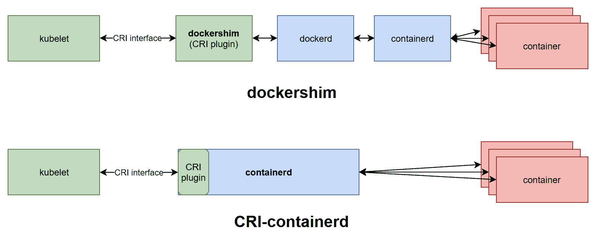

CRI-containerd 运行时提供了一个更简单的架构，守护程序和进程之间的通信更少，从而消除了传统的 Docker 引擎。这个解决方案旨在提供一个裁剪版的 Docker 运行时，暴露出关键的组件供 Kubernetes 使用。

如果您对 Docker 和 containerd 分离的历史背景感兴趣，可以阅读以下文章：[`alexander.holbreich.org/docker-components-explained/`](http://alexander.holbreich.org/docker-components-explained/)。

对于 Windows，支持的列表要短得多，目前包括 Docker（企业版 18.09+，也由 dockershim 抽象）和即将支持的 CRI-containerd。预计当 containerd 1.3 的稳定版本发布并且 *runhcs shim* 得到全面支持时，这将可用。这还将带来对容器的 Hyper-V 隔离的新支持，目前（截至 Kubernetes 1.17）作为有限的实验性功能实现，没有使用 CRI-containerd。

# kube-proxy

在 Kubernetes 集群中，节点上的网络规则和路由由运行在每个节点上的 kube-proxy 管理。这些规则允许 Pod 与外部客户端之间进行通信，并且是 Service API 对象的重要组成部分。在 Linux 平台上，kube-proxy 使用 iptables 配置规则（最常见），而在 Windows 平台上，使用 **Host Networking Service** (**HNS**)。

我们将在下一章更详细地介绍 Kubernetes 网络。

# DNS

内部 DNS 服务器是可选的，并且可以作为附加组件安装，但在标准部署中强烈建议使用，因为它简化了服务发现和网络。目前，Kubernetes 使用的默认 DNS 服务器是 CoreDNS（[`coredns.io/`](https://coredns.io/)）。

Kubernetes 会自动为每个容器的域名解析配置添加一个内部静态 IP 地址的 DNS 服务器。这意味着在 Pod 中运行的进程可以通过知道它们的域名与集群中运行的服务和 Pod 进行通信，这些域名将解析为实际的内部 IP 地址。Kubernetes Service 对象的概念将在下一节中介绍。

现在，让我们来看一下最常用的 Kubernetes 对象。

# Kubernetes 对象

在本书的后面部分将介绍在 Windows 节点上设置 Kubernetes 集群的复杂性，并且将在 Linux 示例上演示原则。从 Kubernetes API 服务器的角度来看，Windows 和 Linux 节点的操作方式几乎相同。

在 Kubernetes 集群中，集群状态由 kube-apiserver 组件管理，并持久存储在`etcd`集群中。状态被抽象和建模为一组 Kubernetes 对象 - 这些实体描述了应该运行什么容器化应用程序，它们应该如何被调度，以及关于重新启动或扩展它们的策略。如果您想在 Kubernetes 集群中实现任何目标，那么您必须创建或更新 Kubernetes 对象。这种模型称为**声明性模型** - 您声明您的意图，Kubernetes 负责将集群的当前状态更改为期望的（预期的）状态。声明性模型和保持期望状态的理念是使 Kubernetes 如此强大和易于使用的原因。

在本书中，我们将遵循官方文档的惯例，其中对象是大写的；例如，Pod 或 Service。

每个 Kubernetes 对象的解剖结构完全相同；它有两个字段：

+   **Spec**：这定义了对象的*期望状态*。这是您在创建或更新对象时定义要求的地方。

+   **Status**：这是由 Kubernetes 提供的，并描述了对象的*当前状态*。

始终需要使用 Kubernetes API 来处理 Kubernetes 对象。最常见的情况是使用 Kubernetes 的**命令行接口**（CLI）来管理 Kubernetes 对象，该接口以`kubectl`二进制文件的形式提供。还可以使用客户端库直接与 Kubernetes API 进行交互。

`kubectl`的安装和其用法示例将在第六章中进行介绍，*与 Kubernetes 集群交互*。

现在，让我们快速看一下示例 Kubernetes 对象的结构。当直接与 Kubernetes API 交互时，对象必须以 JSON 格式指定。然而，`kubectl`允许我们使用 YAML 清单文件，在执行操作时将其转换为 JSON。通常建议使用 YAML 清单文件，并且您可以期望在文档中找到的大多数示例都遵循这个惯例。例如，我们将使用一个包含单个 nginx web 服务器 Linux 容器定义的 Pod 的定义，存储在名为`nginx.yaml`的文件中。

```
apiVersion: v1
kind: Pod
metadata:
  name: nginx-pod-example
  labels:
    app: nginx-host
spec:
  containers:
  - name: nginx
    image: nginx:1.17
    ports:
    - containerPort: 80
```

清单文件中的必需部分如下：

+   `apiVersion`：用于此对象的 Kubernetes API 的版本。

+   `kind`：Kubernetes 对象的类型。在这种情况下，这是`Pod`。

+   `metadata`：对象的附加元数据。

+   `spec`：对象规范。在示例规范中，nginx 容器使用`nginx:1.17` Docker 镜像并暴露端口`80`。每个 Kubernetes 对象的规范都不同，并且必须遵循 API 文档。例如，对于 Pod，您可以在这里找到 API 参考：[`kubernetes.io/docs/reference/generated/kubernetes-api/v1.17/#podspec-v1-core`](https://kubernetes.io/docs/reference/generated/kubernetes-api/v1.17/#podspec-v1-core)。

现在创建 Pod 就像运行以下`kubectl apply`命令一样简单：

```
kubectl apply -f nginx.yaml
```

如果您想尝试此命令而没有本地 Kubernetes 集群，我们建议使用 Kubernetes playground 中的一个；例如，[`www.katacoda.com/courses/kubernetes/playground`](https://www.katacoda.com/courses/kubernetes/playground)：

1.  在主窗口中运行以下`kubectl`命令，它将应用托管在 GitHub 上的清单文件：

```
kubectl apply -f https://raw.githubusercontent.com/PacktPublishing/Hands-On-Kubernetes-on-Windows/master/Chapter04/01_pod-example/nginx.yaml
```

1.  几秒钟后，Pod 将被创建，其`STATUS`应为`Running`：

```
master $ kubectl get pod -o wide
NAME                READY   STATUS    RESTARTS   AGE   IP          NODE     NOMINATED NODE   READINESS GATES
nginx-pod-example   1/1     Running   0          15s   10.40.0.1   node01   <none>           <none>
```

1.  在主窗口中使用`curl`命令获取 Pod 的 IP（在本例中为`10.40.0.1`）以验证容器是否确实在运行。您应该看到默认 nginx 网页的原始内容：

```
curl http://10.40.0.1:80
```

`kubectl`目前提供了两种声明性方法来管理 Kubernetes 对象：清单文件和 kustomization 文件。使用 kustomize 方法更加强大，因为它以可预测的结构组织清单文件和配置生成。您可以在这里了解更多关于 kustomize 的信息：[`github.com/kubernetes-sigs/kustomize/tree/master/docs`](https://github.com/kubernetes-sigs/kustomize/tree/master/docs)。

现在，让我们更仔细地看一下 Pod API 对象。

# Pods

Kubernetes 使用 Pod 作为部署和扩展的基本原子单位，并代表集群中运行的进程 - 从 Microsoft Hyper-V 的类比来说，就像是在 Hyper-V 集群中部署的单个虚拟机。Kubernetes Pod 由一个或多个共享内核命名空间、IPC、网络堆栈（您可以通过相同的集群 IP 地址对其进行寻址，并且它们可以通过 localhost 进行通信）和存储的容器组成。要理解 Pod，了解名称的起源是很有帮助的：在英语中，pod 是一群鲸鱼，而 Docker 使用鲸鱼作为其标志 - 将鲸鱼想象成 Docker 容器！

在最简单的形式中，你可以创建单容器 Pod - 这就是我们在本节介绍中演示 nginx Pod 创建时所做的。对于某些情况，你可能需要多容器 Pod，其中主容器伴随着其他容器，用于多种目的。让我们来看看其中一些：

+   **辅助** **容器**，可以执行各种*辅助*操作，比如日志收集，为主容器进行数据同步等。

+   **适配器** **容器**，可以规范输出或监视主容器的数据，以便其他服务可以使用。

+   **大使** **容器**，代理主容器与外部世界的通信。

+   **初始化** **容器**，这些是在 Pod 中的应用容器之前运行的专门容器。例如，它们可以设置环境，这在主容器镜像中没有执行。

从技术上讲，即使是单容器 Pod 也包含一个额外的基础设施容器，通常是一个暂停镜像。它充当了 Pod 中所有容器的*父*容器，并启用了内核命名空间共享。如果你对基础设施容器的更多细节感兴趣，请参考这篇文章：[`www.ianlewis.org/en/almighty-pause-container`](https://www.ianlewis.org/en/almighty-pause-container)。

Pod 的概念可以在以下图表中看到：

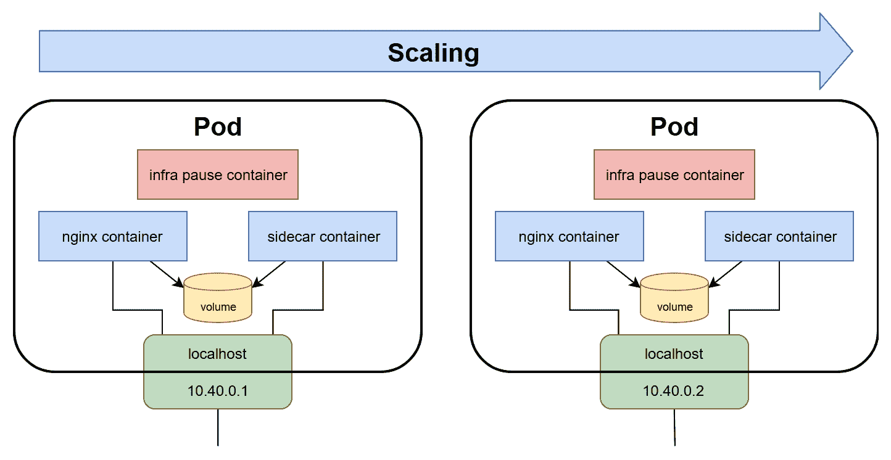

在使用 Pod 时，有一些考虑事项需要牢记在心：

+   Pod 的容器始终在一个节点上运行，一旦 Pod 被创建，它就始终绑定到一个节点上。

+   通过增加更多的 Pod 来扩展你的应用，而不是在同一个 Pod 中增加更多的容器。

+   Pod 被认为是*就绪*并且能够响应请求时，*所有*它的容器都是就绪的。容器的状态由探针来确定，例如存活和就绪探针，这些可以在规范中定义。

+   Pod 是短暂的。它们被创建，它们死亡，如果需要的话，新的 Pod 会被重新创建。

+   当 Pod 被重新创建时，它会获得一个新的集群 IP。这意味着你的应用设计不应该依赖静态 IP 分配，并且假设 Pod 甚至可能在不同的节点上重新创建。

你很少会像我们在本节介绍中那样独立创建裸 Pod。在大多数情况下，它们是通过部署进行管理的。

Pod 具有有限的生命周期，如果容器内部崩溃或退出，根据重启策略，它们可能不会自动重新创建。为了在集群中保持一定数量的具有特定 Spec 和元数据的 Pod，您需要`ReplicaSet`对象。

# 副本集

Kubernetes 在 Pod 的基础上构建了许多强大的概念，使容器管理变得简单和可预测。最简单的概念是`ReplicaSet`API 对象（ReplicationController 的后继者），其目的是维护一定数量的健康 Pod（副本）以满足特定条件。换句话说，如果您说“我希望在我的集群中运行三个 nginx Pod”，ReplicaSet 会为您完成。如果一个 Pod 被销毁，`ReplicaSet`将自动创建一个新的 Pod 副本以恢复所需状态。

让我们看一个示例 ReplicaSet 清单`nginx-replicaset.yaml`文件，创建三个 nginx Pod 的副本：

```
apiVersion: apps/v1
kind: ReplicaSet
metadata:
  name: nginx-replicaset-example
spec:
  replicas: 3
  selector:
    matchLabels:
      environment: test
  template:
    metadata:
      labels:
        environment: test
    spec:
      containers:
      - name: nginx
        image: nginx:1.17
        ports:
        - containerPort: 80
```

`ReplicaSet` Spec 有三个主要组件：

+   `replicas`：定义应使用给定的`template`和匹配的`selector`运行的 Pod 副本的数量。为了保持所需的数量，可能会创建或删除 Pod。

+   `selector`：标签选择器，定义了如何识别 ReplicaSet 将获取的 Pod。请注意，这可能会导致`ReplicaSet`获取现有的裸 Pod！

+   `template`：定义 Pod 创建的模板。元数据中使用的标签必须与`selector`正向匹配。

您可以以类似的方式应用`ReplicaSet`清单，就像我们在 Katacoda 游乐场中应用 Pod 一样：

```
kubectl apply -f https://raw.githubusercontent.com/PacktPublishing/Hands-On-Kubernetes-on-Windows/master/Chapter04/02_replicaset-example/nginx-replicaset.yaml
```

您可以使用以下命令观察如何创建三个 Pod 副本：

```
kubectl get pod -o wide -w
```

ReplicaSets 通过将新创建或获取的 Pod 分配给 Pod 的`.metadata.ownerReferences`属性来标记它们自己（如果您感兴趣，可以使用`kubectl get pod <podId> -o yaml`命令进行检查）。这意味着，如果您创建完全相同的 ReplicaSet，具有完全相同的选择器但名称不同，例如`nginx-replicaset-example2`，它们不会*窃取*彼此的 Pod。但是，如果您已经创建了具有匹配标签的裸 Pod，例如`environment: test`，ReplicaSet 将获取它们，甚至可能删除 Pod，如果副本的数量太高！

如果您真的需要在 Kubernetes 集群中创建单个 Pod，最好使用`ReplicaSet`，将`replicas`字段设置为 1，这将充当容器的*监督者*。通过这种方式，您将防止创建没有所有者且仅与原始节点绑定的裸 Pods。

这可以在以下图表中看到：

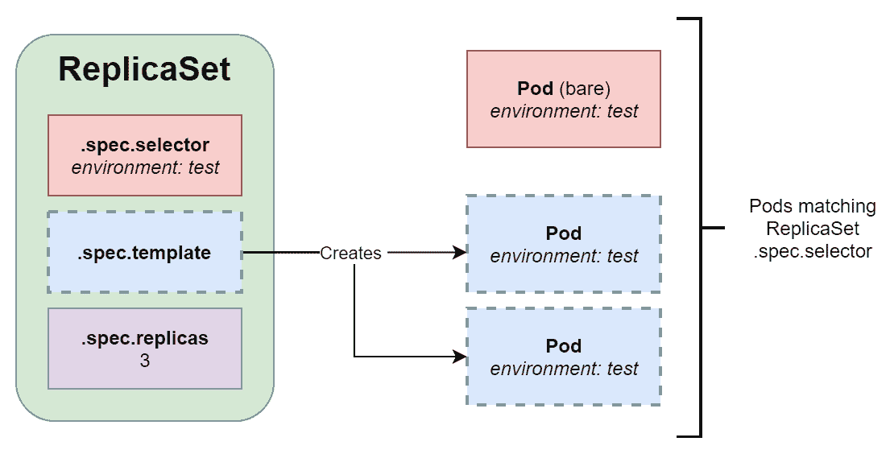

通常，您不会自行创建 ReplicaSets，因为它们无法轻松执行滚动更新或回滚到早期版本。为了促进这种情况，Kubernetes 提供了建立在 ReplicaSets 之上的对象：部署和 StatefulSet。让我们先看一下部署。

# 部署

在这一点上，您已经知道了 Pods 和 ReplicaSets 的目的。部署是 Kubernetes 对象，为 Pods 和 ReplicaSets 提供声明性更新。您可以使用它们来声明性地执行以下操作：

+   执行新的 ReplicaSet 的*滚动*。

+   更改 Pod 模板并执行受控滚动。旧的 ReplicaSet 将逐渐缩减，而新的 ReplicaSet 将以相同的速度扩展。

+   执行*回滚*到部署的早期版本。

+   扩展 ReplicaSet 的规模。

部署与 ReplicaSets 和 Pods 的关系可以在以下图表中看到：

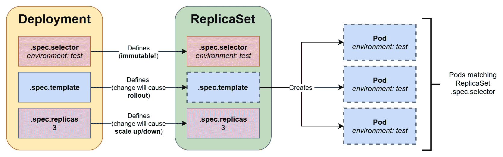

您应该**避免**自行管理由部署创建的 ReplicaSets。如果需要对 ReplicaSet 进行任何更改，请在拥有的部署对象上执行更改。

请注意，由部署管理的 ReplicaSets 的*意外*获取 Pods 的问题不存在。原因是 Pods 和 ReplicaSets 使用一个特殊的、自动生成的标签，称为`pod-template-hash`，确保选择的唯一性。

让我们看一个示例部署清单，在`nginx-deployment.yaml`文件中： 

```
apiVersion: apps/v1
kind: Deployment
metadata:
  name: nginx-deployment-example
spec:
  replicas: 3
  selector:
    matchLabels:
      environment: test
  template:
    metadata:
      labels:
        environment: test
    spec:
      containers:
      - name: nginx
        image: nginx:1.17
        ports:
        - containerPort: 80
```

如您所见，基本结构与`ReplicaSet`几乎相同，但在执行声明性更新时，部署的行为有显著的差异。让我们在示例中快速演示一下：

1.  手动创建部署清单文件，或使用`wget`命令下载它：

```
wget https://raw.githubusercontent.com/PacktPublishing/Hands-On-Kubernetes-on-Windows/master/Chapter04/03_deployment-example/nginx-deployment.yaml
```

1.  使用以下命令应用部署清单文件：

```
kubectl apply -f nginx-deployment.yaml --record
```

`--record`标志将`kubernetes.io/change-cause`的元数据注释添加到之前命令创建或修改的 API 对象中。此功能允许您轻松跟踪集群中的更改。

1.  等待部署完全完成（您可以使用`kubectl get deployment -w`观察部署中就绪的 Pod 数量）。

1.  现在，在 YAML 清单中的模板中更改 Pod 规范；例如，将`.spec.template.spec.containers[0].image`更改为`nginx:1.**16**`，然后再次应用部署清单。

1.  接着，使用以下命令观察部署的进展：

```
master $ kubectl rollout status deployment nginx-deployment-example
Waiting for deployment "nginx-deployment-example" rollout to finish: 1 out of 3 new replicas have been updated...
Waiting for deployment "nginx-deployment-example" rollout to finish: 2 out of 3 new replicas have been updated...
Waiting for deployment "nginx-deployment-example" rollout to finish: 1 old replicas are pending termination...
deployment "nginx-deployment-example" successfully rolled out
```

部署的规范比 ReplicaSet 丰富得多。您可以查看官方文档以获取更多详细信息：[`kubernetes.io/docs/concepts/workloads/controllers/deployment/#writing-a-deployment-spec`](https://kubernetes.io/docs/concepts/workloads/controllers/deployment/#writing-a-deployment-spec)。官方文档包含了部署的多个用例，所有这些用例都有详细描述：[`kubernetes.io/docs/concepts/workloads/controllers/deployment/#use-case`](https://kubernetes.io/docs/concepts/workloads/controllers/deployment/#use-case)。

正如您所看到的，对部署模板定义的声明性更新导致新 Pod 副本的平稳部署。旧的 ReplicaSet 被缩减，同时，一个新的具有新 Pod 模板的 ReplicaSet 被创建并逐渐扩展。现在，您可以尝试对现有的裸 ReplicaSet 执行相同的操作进行`image`更新，然后您会发现...实际上，什么都没有发生。这是因为 ReplicaSet 只使用 Pod 模板来创建新的 Pod。现有的 Pod 不会因此更改而被更新或删除。

只有当对部署的`.spec.template`进行更改时，才会触发部署。对部署清单的其他更改不会触发部署。

接下来，让我们看一个与部署类似的概念：StatefulSets。

# StatefulSets

部署通常用于部署应用程序的无状态组件。对于有状态的组件，Kubernetes 提供了另一个名为`StatefulSet`的 API 对象。这种操作的原则与部署非常相似-它以声明方式管理 ReplicaSets 和 Pod，并提供平稳的部署和回滚。然而，也有一些关键区别：

+   StatefulSets 确保 Pod 具有确定性（粘性）ID，由`<statefulSetName>-<ordinal>`组成。对于部署，您将具有由`<deploymentName>-<randomHash>`组成的随机 ID。

+   对于 StatefulSets，Pod 将按特定的可预测顺序启动和终止，同时扩展 ReplicaSet。

+   在存储方面，Kubernetes 基于 StatefulSet 对象的`volumeClaimTemplates`为 StatefulSet 中的每个 Pod 创建 PersistentVolumeClaims，并始终将其附加到具有相同 ID 的 Pod。对于部署，如果选择使用`volumeClaimTemplates`，Kubernetes 将创建一个单一的 PersistentVolumeClaim，并将其附加到部署中的所有 Pod。

+   您需要创建一个负责管理 Pod 的确定性网络标识（DNS 名称）的无头 Service 对象。无头 Service 允许我们将所有 Pod IP 作为 DNS A 记录返回到 Service 后面，而不是使用 Service Cluster IP 返回单个 DNS A 记录。

StatefulSets 使用与部署类似的 Spec-您可以通过查看官方文档了解有关 StatefulSets 的更多信息：[`kubernetes.io/docs/concepts/workloads/controllers/statefulset/`](https://kubernetes.io/docs/concepts/workloads/controllers/statefulset/)。

# DaemonSets

DaemonSet 是另一个由控制器支持的对象，类似于 ReplicaSet，但旨在在集群中的每个节点上运行*确切一个*模板化的 Pod 副本（可选匹配选择器）。运行 DaemonSet 的最常见用例如下：

+   管理给定集群节点的监控遥测，例如运行 Prometheus Node Exporter

+   在每个节点上运行日志收集守护程序，例如`fluentd`或`logstash`

+   运行故障排除 Pod，例如 node-problem-detector（[`github.com/kubernetes/node-problem-detector`](https://github.com/kubernetes/node-problem-detector)）

在您的集群中可能会默认运行的 DaemonSets 之一是`kube-proxy`。在由 kubeadm 执行的标准集群部署中，`kube-proxy`作为 DaemonSet 分发到节点。您还可以在 Katacoda playground 上验证这一点：

```
master $ kubectl get daemonset --all-namespaces
NAMESPACE     NAME         DESIRED   CURRENT   READY   UP-TO-DATE   AVAILABLE   NODE SELECTOR   AGE
kube-system   kube-proxy   2         2         2       2            2           <none>          12m
kube-system   weave-net    2         2         2       2            2           <none>          12m
```

如果您想了解有关 DaemonSets 的更多信息，请参阅官方文档：[`kubernetes.io/docs/concepts/workloads/controllers/daemonset/`](https://kubernetes.io/docs/concepts/workloads/controllers/daemonset/)。

# 服务

由 ReplicaSets 或 Deployments 创建的 Pods 具有有限的生命周期。在某个时候，您可以期望它们被终止，并且将创建新的 Pod 副本，具有新的 IP 地址。因此，如果您有一个运行 web 服务器 Pods 的 Deployment，需要与作为另一个 Deployment 一部分创建的 Pods 进行通信，例如后端 Pods，那么该怎么办呢？Web 服务器 Pods 不能假设任何关于后端 Pods 的 IP 地址或 DNS 名称的信息，因为它们可能随时间而改变。这个问题通过 Service API 对象得到解决，它为一组 Pods 提供可靠的网络连接。

通常，Services 针对一组 Pods，这是由标签选择器确定的。最常见的情况是通过使用完全相同的标签选择器为现有 Deployment 公开一个 Service。Service 负责提供可靠的 DNS 名称和 IP 地址，以及监视选择器结果并更新相关的 Endpoint 对象，其中包含匹配 Pods 的当前 IP 地址。

对于内部客户端（集群中的 Pods），到 Service 后面的 Pods 的通信是透明的 - 他们使用 Service 的 Cluster IP 或 DNS 名称，流量被路由到其中一个目标 Pods。路由能力由 kube-proxy 提供，但重要的是要知道流量不会通过任何主组件 - kube-proxy 在操作系统内核级别实现路由，并直接将其路由到适当的 Pod 的 IP 地址。在其最简单的形式中，目标 Pod 将被随机选择，但使用 **IP Virtual Server** (**IPVS**) 代理模式，您可以有更复杂的策略，例如最少连接或最短预期延迟。

Services 也可以将 Pods 暴露给外部流量。

Service 的工作原理可以在以下图表中看到：

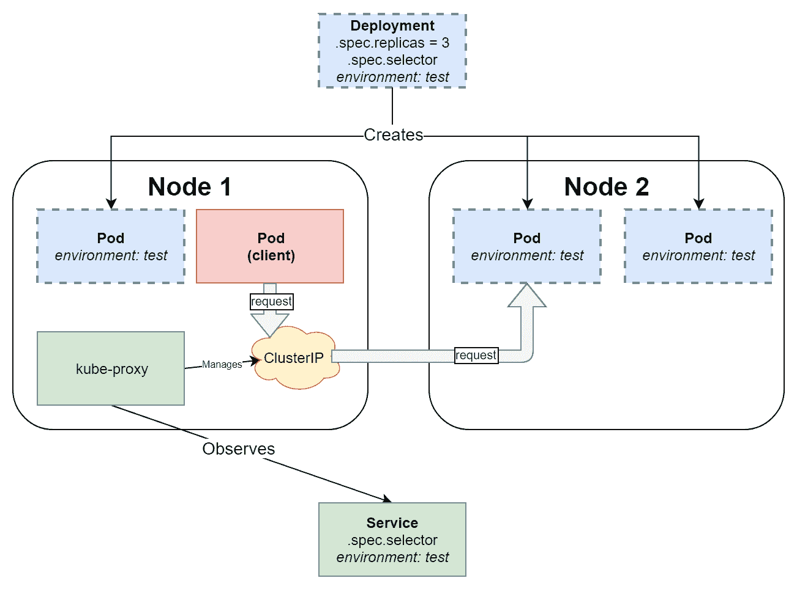

让我们为我们的 nginx Deployment 公开一个示例 Service：

1.  如果您在 Katacoda 游乐场上没有正在运行的 Deployment，可以使用以下命令创建一个：

```
kubectl apply -f https://raw.githubusercontent.com/PacktPublishing/Hands-On-Kubernetes-on-Windows/master/Chapter04/03_deployment-example/nginx-deployment.yaml --record
```

1.  使用以下 `kubectl expose` 命令为一个 Deployment 公开 Service：

```
kubectl expose deployment nginx-deployment-example
```

1.  这个命令是*命令式*的，应该避免使用，而应该使用*声明式*的清单。这个命令相当于应用以下 Service 清单：

```
apiVersion: v1
kind: Service
metadata:
  name: nginx-deployment-example
spec:
  selector:
    environment: test
  type: ClusterIP
  ports:
  - port: 80
    protocol: TCP
    targetPort: 80
```

1.  现在，在 Service 被公开后，创建一个交互式的 `busybox` Pod，并启动 Bourne shell 进程：

```
kubectl run --generator=run-pod/v1 -i --tty busybox --image=busybox --rm --restart=Never -- sh
```

1.  当容器外壳提示出现时，使用`nginx-deployment-example`服务名称作为 DNS 名称下载由 nginx Pods 提供的默认网页：

```
wget http://nginx-deployment-example && cat index.html
```

您还可以使用**完全限定域名**（**FQDN**），其格式如下：`<serviceName>.<namespaceName>.svc.<clusterDomain>`。在这种情况下，它是`nginx-deployment-example.default.svc.cluster.local`。

接下来，让我们快速看一下在 Kubernetes 中提供存储的对象。

# 与存储相关的对象

在本书中，我们只在需要时涵盖 Kubernetes 存储，因为这是一个广泛且复杂的主题-事实上，存储和管理任何集群的有状态组件通常是最难解决的挑战。如果您对 Kubernetes 中的存储细节感兴趣，请参考官方文档：[`kubernetes.io/docs/concepts/storage/`](https://kubernetes.io/docs/concepts/storage/)。

在 Docker 中，我们使用卷来提供持久性，可以是本地磁盘，也可以是远程/云存储，使用卷插件。 Docker 卷有一个独立于消耗它们的容器的生命周期。在 Kubernetes 中，有一个类似的概念，叫做 Volume，它与 Pod 紧密耦合，并且与 Pod 具有相同的生命周期。在 Kubernetes 中，Volume 的最重要的方面是它们支持多个后备存储提供者（类型）-这是由 Volume 插件和最近的**容器存储接口**（**CSI**）抽象出来的，这是一个用于独立于 Kubernetes 核心开发的外部 Volume 插件的接口。例如，您可以将 Amazon Web Services EBS 卷或 Microsoft Azure Files SMB 共享挂载为 Pod 的 Volume-完整的 Volume 类型列表在这里：[`kubernetes.io/docs/concepts/storage/volumes/#types-of-volumes`](https://kubernetes.io/docs/concepts/storage/volumes/#types-of-volumes)。

Volume 类型之一是**PersistentVolumeClaim**（**PVC**），它旨在将 Pod 与实际存储解耦。PersistentVolumeClaim 是一个 API 对象，用于模拟对特定类型、类或大小存储的请求-可以将其视为说“我想要 10GB 的读/写一次 SSD 存储”。为了满足这样的请求，需要一个**PersistentVolume**（**PV**）API 对象，这是集群自动化过程提供的一部分存储。PersistentVolume 类型也以类似于 Volume 的插件方式实现。

现在，持久卷的整个配置过程可以是动态的 - 它需要创建一个 StorageClass（SC）API 对象，并在定义 PVC 时使用它。创建新的 StorageClass 时，您提供一个具有特定参数的供应商（或插件），并且使用给定 SC 的每个 PVC 将自动创建一个 PV。

这些依赖关系可以在以下图表中看到：

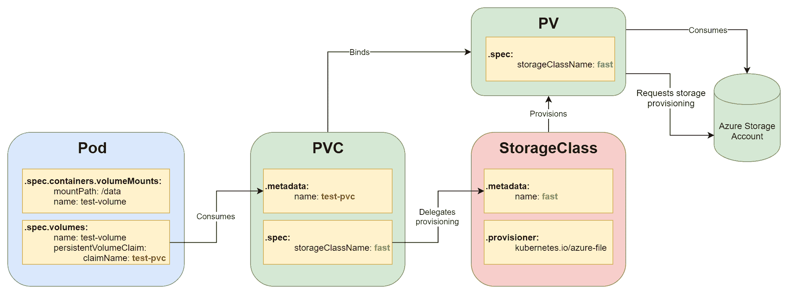

当您想要部署一个挂载了 PersistentVolume 的 Pod 时，事件的顺序将如下：

1.  创建一个带有所需供应商的 StorageClass。

1.  创建一个使用 SC 的 PersistentVolumeClaim。

1.  PersistentVolume 是动态配置的。

1.  在创建 Pod 时，将 PVC 挂载为一个 Volume。

动态配置的 PersistentVolumes 的概念得到了 StatefulSets 的补充。StatefulSets 定义了 volumeClaimTemplates，可以用于动态创建给定 StorageClass 的 PersistentVolumeClaims。通过这样做，整个存储配置过程是完全动态的 - 您只需创建一个 StatefulSet，底层存储对象就由 StatefulSet 控制器管理。您可以在这里找到更多详细信息和示例：[`kubernetes.io/docs/concepts/workloads/controllers/statefulset/#stable-storage`](https://kubernetes.io/docs/concepts/workloads/controllers/statefulset/#stable-storage)。

Kubernetes 中的这种存储架构确保了工作负载的可移植性，这意味着您可以轻松地将部署和 PersistentVolumeClaims 移动到不同的集群。您所需要做的就是提供一个满足 PVC 要求的 StorageClass。无需对 StatefulSet 或 PVC 进行修改。

# Windows 和 Kubernetes 生态系统

最初，Kubernetes 是一个以 Linux 为中心的解决方案 - 这是因为主流的容器化也起源于 Linux 平台。2014 年，微软和 Windows 很快就加入了容器化世界 - 微软宣布将在即将发布的 Windows Server 2016 中支持 Docker Engine。Windows 的 Kubernetes 特别兴趣小组（SIG）于 2016 年 3 月启动，2018 年 1 月，Kubernetes 1.9 为 Windows Server 容器提供了 beta 支持。这种支持最终在 2019 年 4 月 Kubernetes 1.14 发布时成熟到生产级别。

为什么 Windows 对 Kubernetes 的支持如此重要？Windows 在企业工作负载中占据主导地位，而 Kubernetes 作为容器编排的事实标准，对 Windows 的支持带来了将绝大多数企业软件迁移到容器的可能性。开发人员和系统运营商现在可以利用相同的工具和流水线来部署 Windows 和 Linux 工作负载，以类似的方式扩展它们，并有效地监视它们。从商业角度来看，Windows 的容器采用意味着比普通虚拟机更好的运营成本和更好的硬件利用率。

Kubernetes 中的 Windows 容器支持不断发展，越来越多的限制正在被新功能取代。总的来说，有两个关键点需要记住：

+   目前，Windows 机器只能作为节点加入集群。没有可能性，也没有计划在 Windows 上运行主控组件。同时运行 Linux 和 Windows 节点的集群被称为混合或异构。

+   您需要最新稳定版本的 Kubernetes 和最新（或几乎最新）版本的 Windows Server 操作系统才能享受到提供的全面支持。例如，对于 Kubernetes 1.17，您需要 Windows Server 1809（半年频道发布）或 Windows Server 2019（来自长期服务频道的相同发布），尽管最新的 Windows Server 1903 也受支持。

目前，关于 Kubernetes 对 Windows 的支持的文档数量有限，但正在增长。最好的资源如下：

+   官方 Kubernetes 文档：[`kubernetes.io/docs/setup/production-environment/windows/intro-windows-in-kubernetes/`](https://kubernetes.io/docs/setup/production-environment/windows/intro-windows-in-kubernetes/)。

+   官方 Windows 容器化和 Kubernetes 支持文档：[`docs.microsoft.com/en-us/virtualization/windowscontainers/kubernetes/getting-started-kubernetes-windows`](https://docs.microsoft.com/en-us/virtualization/windowscontainers/kubernetes/getting-started-kubernetes-windows)。

+   Azure Kubernetes Engine Windows 操作指南：[`docs.microsoft.com/en-us/azure/aks/windows-container-cli`](https://docs.microsoft.com/en-us/azure/aks/windows-container-cli)。

+   SIG-Windows 会议记录和录音：[`github.com/kubernetes/community/tree/master/sig-windows`](https://github.com/kubernetes/community/tree/master/sig-windows)。

+   Kubernetes 发布说明和更改日志（查找 SIG-Windows 或与 Windows 相关的内容）：[`github.com/kubernetes/kubernetes/releases`](https://github.com/kubernetes/kubernetes/releases)。

+   Kubernetes 社区论坛上有关 Windows 讨论的链接：[`discuss.kubernetes.io/c/general-discussions/windows`](https://discuss.kubernetes.io/c/general-discussions/windows)。

+   SIG-Windows 的 Slack 频道（如果遇到问题，你可以在这里找到很多帮助）：[`kubernetes.slack.com/messages/sig-windows`](https://kubernetes.slack.com/messages/sig-windows)。

让我们来看一下 Kubernetes 对 Windows 的支持的当前状态以及截至 1.17 版本的限制。

# Windows 上的 Kubernetes 限制

Windows Server 容器支持存在一系列限制，随着每个新版本的 Kubernetes 发布和 Windows Server 的新版本的到来，这些限制不断变化。一般来说，从 Kubernetes API 服务器和 kubelet 的角度来看，在异构（混合）Linux/Windows Kubernetes 集群中，Windows 上的容器的行为几乎与 Linux 容器相同。但是，细节上存在一些关键的差异。首先，让我们来看一些高层次的主要限制：

+   Windows 机器只能作为 worker 节点加入集群。在 Windows 上运行 master 组件的可能性和计划都不存在。

+   Worker 节点的操作系统的最低要求是 Windows Server 1809 或 2019。不能使用 Windows 10 机器作为节点。

+   需要 Docker Enterprise Edition（基本版）18.09 或更高版本作为容器运行时。企业版对 Windows Server 操作系统免费提供。

+   Windows Server 操作系统需要许可证（[`www.microsoft.com/en-us/cloud-platform/windows-server-pricing`](https://www.microsoft.com/en-us/cloud-platform/windows-server-pricing)）。Windows 容器镜像需要遵守微软软件补充许可证（[`docs.microsoft.com/en-us/virtualization/windowscontainers/images-eula`](https://docs.microsoft.com/en-us/virtualization/windowscontainers/images-eula)）。对于开发和评估目的，你也可以使用评估中心：[`www.microsoft.com/en-us/evalcenter/evaluate-windows-server-2019`](https://www.microsoft.com/en-us/evalcenter/evaluate-windows-server-2019)。

+   运行在 Kubernetes 上的 Windows Server 容器的 Hyper-V 隔离处于实验阶段（alpha），当前的设计将被 containerd 实现的运行时所取代。在那之前，进程隔离容器的兼容性规则适用 - 你必须使用与主机操作系统版本匹配的基本操作系统镜像运行容器。你可以在 第一章 *创建容器* 中找到更多细节。

+   **Windows 上的 Linux 容器**（LCOW）不受支持。

+   对你来说可能最相关的是：为混合 Linux/Windows 集群设置本地 Kubernetes 开发环境非常复杂，目前没有标准解决方案，比如 Minikube 或 Windows 的 Docker Desktop，支持这样的配置。这意味着你需要一个本地的多节点集群或托管的云服务来开发和评估你的场景。

+   Windows 节点的加入过程不像 Linux 节点那样自动化。Kubeadm 很快将支持加入 Windows 节点的过程，但在那之前，你必须手动进行（借助一些 Powershell 脚本的帮助）。

对于容器工作负载/计算，一些限制如下：

+   Windows 节点不支持特权容器。这可能会带来其他一些限制，比如运行必须以特权模式运行的 CSI 插件。

+   Windows 没有内存进程杀手，目前 Pods 无法在内存使用方面受到限制。这对于进程隔离的容器是真实的，但一旦容器化 Hyper-V 隔离在 Kubernetes 上可用，就可以强制执行限制。

+   你需要指定适当的节点选择器，以防止例如 Linux DaemonSets 尝试在 Windows 节点上运行。这在技术上不是一个限制，但你应该意识到你需要控制这些选择器来部署你的应用。

关于网络，一些限制如下：

+   Windows 节点的网络管理更加复杂，Windows 容器网络类似于 VM 网络。

+   Windows 上支持的网络插件（CNI）较少。你需要选择一个适用于集群中的 Linux 和 Windows 节点的解决方案，例如带有 host-gw 后端的 Flannel。

+   L2bridge、l2tunnel 或覆盖网络不支持 IPv6 栈。

+   Windows 的 Kube-proxy 不支持 IPVS 和高级负载均衡策略。

+   从运行 Pod 的节点访问 NodePort 服务会失败。

+   Ingress Controllers 可以在 Windows 上运行，但只有在它们支持 Windows 容器的情况下；例如，*ingress-nginx*。

+   从集群内部使用 ICMP 数据包对外部网络主机进行 ping 不受支持。换句话说，当您使用 ping 测试从 Pod 到外部世界的连接时，不要感到惊讶。您可以使用`curl`或 Powershell `Invoke-WebRequest`代替。

对于存储，一些限制如下：

+   无法扩展已挂载的卷。

+   挂载到 Pod 的 Secrets 是使用节点存储以明文写入的。这可能存在安全风险，您需要采取额外的措施来保护集群。

+   Windows 节点仅支持以下卷类型：

+   FlexVolume（SMB，iSCSI）

+   azureDisk

+   azureFile

+   gcePersistentDisk

+   awsElasticBlockStore（自 1.16 版起）

+   vsphereVolume（自 1.16 版起）

以下限制涉及 Kubernetes 1.17 版。由于支持的功能和当前限制的列表会发生变化，我们建议您查看官方文档以获取更多最新详细信息：[`kubernetes.io/docs/setup/production-environment/windows/intro-windows-in-kubernetes/#supported-functionality-and-limitations`](https://kubernetes.io/docs/setup/production-environment/windows/intro-windows-in-kubernetes/#supported-functionality-and-limitations)。

即使没有对 Windows 节点的本地开发集群的支持，我们仍然会对它们进行研究；很可能在不久的将来会支持 Windows 工作负载。

# 从头开始创建自己的开发集群

在本节中，您将学习如何在 Windows 操作系统上设置本地 Kubernetes 集群进行开发和学习。我们将使用 minikube，这是官方推荐的工具集，以及 Docker Desktop 用于 Windows Kubernetes 集群。请注意，当前的本地集群工具*不*支持 Windows 容器，因为它需要使用 Linux 主节点和 Windows Server 节点进行多节点设置。换句话说，这些工具允许您在 Windows 计算机上开发运行在 Linux 容器中的 Kubernetes 应用程序。基本上，它们提供了一个优化的 Linux 虚拟机，用于托管一个节点的 Kubernetes 集群。

如果您希望进行实验，可以使用 Katacoda Kubernetes playground（[`www.katacoda.com/courses/kubernetes/playground`](https://www.katacoda.com/courses/kubernetes/playground)），该平台用于演示本章中的 Kubernetes 对象，或者使用由 Docker, Inc.提供的 Play with Kubernetes（[`labs.play-with-k8s.com/`](https://labs.play-with-k8s.com/)）。

# minikube

**Minikube**可用于 Windows、Linux 和 macOS，并旨在为 Kubernetes 的本地开发提供稳定的环境。在 Windows 上的关键要求是需要安装 VM 虚拟化程序。对于 Docker Desktop for Windows 和 Windows 容器，我们已经使用了 Hyper-V，因此这将是我们的选择。如果您尚未启用 Hyper-V，请按照第一章中安装 Docker Desktop for Windows 的说明，*创建容器*，或者按照官方文档：[`docs.microsoft.com/en-us/virtualization/hyper-v-on-windows/quick-start/enable-hyper-v`](https://docs.microsoft.com/en-us/virtualization/hyper-v-on-windows/quick-start/enable-hyper-v)。

要安装 minikube，您需要执行以下步骤：

1.  如果您没有 Hyper-V 虚拟外部网络交换机，请通过从开始菜单打开 Hyper-V 管理器并从操作选项卡中单击 Virtual Switch Manager...来创建一个。

1.  选择 External 并单击 Create Virtual Switch。

1.  使用 External Switch 作为虚拟交换机的名称，并选择要用于连接到互联网的网络适配器；例如，您的 Wi-Fi 适配器：

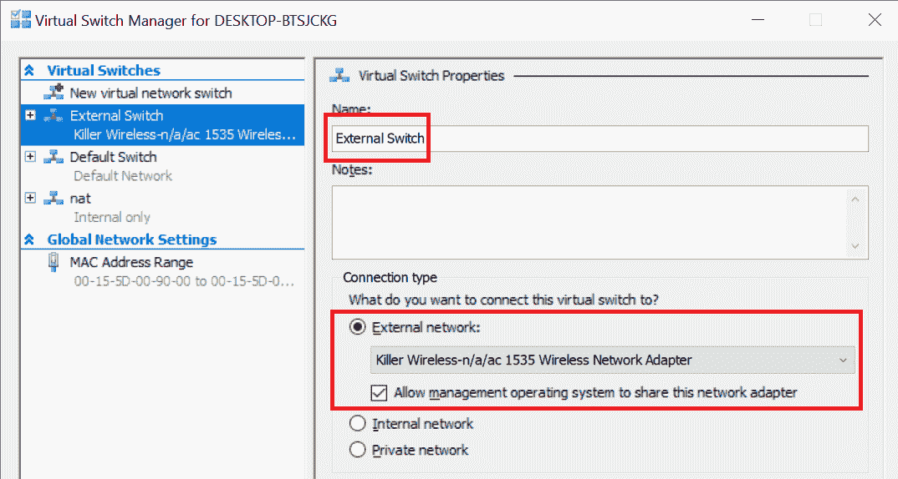

1.  单击确定以接受更改。

1.  使用*Chocolatey*软件包管理器安装 kubectl（Kubernetes CLI）。在 Powershell 窗口中以管理员身份执行以下命令：

```
choco install kubernetes-cli
```

1.  使用 Chocolatey 安装 minikube，也作为管理员：

```
choco install minikube
```

1.  将 Hyper-V 设置为 minikube 的默认虚拟化驱动程序：

```
minikube config set vm-driver hyperv
```

1.  将您的虚拟外部交换机默认设置为 minikube：

```
minikube config set hyperv-virtual-switch "External Switch"
```

1.  启动 minikube。这可能需要几分钟，因为需要设置 VM 并初始化 Kubernetes 节点：

```
minikube start
```

如果您需要在实际的 minikube VM 上调试问题（例如连接问题），您可以使用`minikube ssh`命令或直接从 Hyper-V 管理器连接到终端。登录用户名是`docker`，密码是`tcuser`。

1.  通过运行`kubectl`命令来验证安装是否成功，该命令将配置为连接到 minikube 集群。你应该看到`kube-system`命名空间中运行着各种 Pod：

```
kubectl get pods --all-namespaces
```

1.  你可以使用本章中使用的任何示例 Kubernetes 对象，或者创建你自己的对象：

```
kubectl apply -f https://raw.githubusercontent.com/PacktPublishing/Hands-On-Kubernetes-on-Windows/master/Chapter04/03_deployment-example/nginx-deployment.yaml --record
```

1.  最终，你可以尝试在 web 浏览器中使用 Kubernetes 仪表板。要初始化并打开仪表板，运行以下命令：

```
minikube dashboard
```

现在，我们将看另一种使用 Windows Docker 桌面版进行本地开发的方法。

# Windows 下的 Docker 桌面版

对于 Windows 用户来说，使用 Docker 桌面版和其内置的本地 Kubernetes 集群是最简单的方法。如果你在需要代理连接到互联网的环境中工作，建议使用这种方法，因为与 minikube 相比，设置是无缝的且更容易。

如果你还没有安装 Windows Docker 桌面版，你应该按照第一章 *创建容器*中的说明进行操作。要启用本地 Kubernetes 集群，你需要按照以下步骤进行：

1.  确保你正在 Linux 容器模式下运行。DockerDesktopVM 将负责托管 Kubernetes 集群。为此，打开 Windows Docker 桌面版的托盘图标，然后点击切换到 Linux 容器....

1.  操作完成后，从托盘图标中打开设置。

1.  打开 Kubernetes 部分。

1.  勾选启用 Kubernetes 复选框，然后点击应用。

1.  设置过程将需要几分钟来完成。

1.  如果你已经设置了 minikube，你需要**切换上下文**到 kubectl。从命令行中运行以下命令：

```
kubectl config use-context docker-desktop
```

1.  或者，你也可以从 Windows 托盘中切换 Docker 桌面版的上下文：

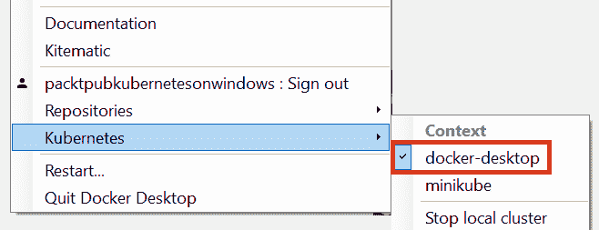

你将在第六章 *与 Kubernetes 集群交互*中了解更多有关 kubectl 配置及其上下文的信息。

1.  现在，你可以开始使用本地 Kubernetes 集群进行开发。让我们部署 Kubernetes 仪表板：

```
kubectl apply -f https://raw.githubusercontent.com/kubernetes/dashboard/v1.10.1/src/deploy/recommended/kubernetes-dashboard.yaml
```

1.  等待所有的 Pod 都处于运行状态：

```
 kubectl get pods --all-namespaces --watch
```

1.  获取默认服务账户令牌。从命令输出中复制`token:`的值：

```
kubectl describe secret -n kube-system default
```

1.  为集群启用 kubectl 代理。在访问仪表板时，这个过程应该在运行中：

```
kubectl proxy
```

1.  导航到[`localhost:8001/api/v1/namespaces/kube-system/services/https:kubernetes-dashboard:/proxy/#!/overview?namespace=kube-system`](http://localhost:8001/api/v1/namespaces/kube-system/services/https:kubernetes-dashboard:/proxy/#!/overview?namespace=kube-system)。

1.  选择令牌，粘贴您的默认令牌，然后登录。

使用 Windows 容器支持设置本地开发 Kubernetes 集群的替代策略涉及在本地机器上使用自动设置的 VM，例如 vagrant。您可以探索 GitHub 上使用此方法的一些小项目，但您应该期望它们已过时且不再受支持。

在下一节中，我们将简要概述我们可以为 Kubernetes 集群执行的生产集群部署策略，特别是带有 Windows 节点的情况。

# 生产集群部署策略

生产级别集群的部署甚至带有 Windows 节点的集群的开发需要非常不同的方法。有三个重要问题决定了您部署 Kubernetes 集群的选项：

+   您是在云中部署集群还是使用本地裸机或虚拟机？

+   您需要**高可用性**（**HA**）设置吗？

+   您需要 Windows 容器支持吗？

让我们总结目前最流行的部署工具。

# kubeadm

第一个是**kubeadm** ([`github.com/kubernetes/kubeadm`](https://github.com/kubernetes/kubeadm))，这是一个命令行工具，专注于以用户友好的方式启动并运行最小可行的安全集群。kubeadm 的一个方面是，它是一个仅限于给定机器和 Kubernetes API 通信的工具，因此，一般来说，它旨在成为管理整个集群的其他自动化工具的构建块。其原则很简单：在主节点上使用`kubeadm init`命令，在工作节点上使用`kubeadm join`。kubeadm 的特性可以总结如下：

+   您可以在本地环境和云环境中部署集群。

+   高可用集群得到支持，但截至 1.17 版本，此功能仍处于测试阶段。

+   目前计划在版本 1.18 上提供官方的 Windows 支持。当前版本的 kubeadm 是启动混合 Kubernetes 集群的良好基础。首先，您可以引导主节点和（可选）Linux 工作节点，然后继续使用微软提供的用于加入 Windows 节点的脚本（[`github.com/microsoft/SDN`](https://github.com/microsoft/SDN)）或在 sig-windows-tools GitHub 存储库中预览脚本的版本（[`github.com/kubernetes-sigs/sig-windows-tools`](https://github.com/kubernetes-sigs/sig-windows-tools)）。我们将在第七章《部署混合本地 Kubernetes 集群》中使用这种方法。

如果您计划自动化 Kubernetes 集群的部署方式，例如使用 Ansible，kubeadm 是一个很好的起点，因为它提供了很大程度的灵活性和易配置性。

# kops

下一个选项是使用**Kubernetes Operations**（**kops**，[`github.com/kubernetes/kops`](https://github.com/kubernetes/kops)），它在内部使用 kubeadm。Kops 旨在管理云环境中的整个 Kubernetes 集群-您可以将其视为*用于集群的 kubectl*。其主要特点如下：

+   在 Amazon Web Services（官方支持）、Google Compute Engine 和 OpenStack（它们都处于测试阶段）上部署集群。除非您正在运行自己的 OpenStack 部署，否则不支持本地部署。VMware vSphere 支持处于 alpha 阶段。

+   对 HA 集群的生产级支持。

+   不支持 Windows 节点。

在本书中，我们不会关注 kops，因为它不支持 Windows。

# kubespray

**Kubespray**（[`github.com/kubernetes-sigs/kubespray`](https://github.com/kubernetes-sigs/kubespray)）是一组可配置的 Ansible playbooks，运行 kubeadm 以引导完全功能的、可用于生产的 Kubernetes 集群。kubespray 和 kops 的主要区别在于，kops 与云提供商更紧密集成，而 kubespray 旨在支持多个平台，包括裸金属部署。其特点可以总结如下：

+   支持为多个云提供商和裸金属机器安装 Kubernetes 集群。

+   对 HA 集群的生产级支持。

+   目前不支持 Windows 节点，但随着 kubeadm 对 Windows 节点的支持，kubespray 是最佳候选来扩展其支持。

由于 kubespray 目前不支持 Windows 节点，我们在本书中不会重点介绍它。

# AKS 引擎

**AKS 引擎**（[`github.com/Azure/aks-engine`](https://github.com/Azure/aks-engine)）是一个官方的开源工具，用于在 Azure 上提供自管理的 Kubernetes 集群。它旨在生成**Azure 资源管理器**（**ARM**）模板，引导 Azure 虚拟机并设置集群。

不应将 AKS 引擎与**Azure Kubernetes 服务**（**AKS**）混淆，后者是 Azure 提供的完全托管的 Kubernetes 集群服务。AKS 引擎在内部由 AKS 使用。

其特点可以总结如下：

+   仅适用于 Azure；不支持其他平台。

+   高可用性是通过 Azure VMSS 实现的（[`kubernetes.io/blog/2018/10/08/support-for-azure-vmss-cluster-autoscaler-and-user-assigned-identity/`](https://kubernetes.io/blog/2018/10/08/support-for-azure-vmss-cluster-autoscaler-and-user-assigned-identity/)）。

+   良好的 Windows 支持-官方测试套件在 AKS 引擎配置上得到验证。我们将在第八章中使用这种方法，*部署混合 Azure Kubernetes 引擎服务集群*。

但是，请注意，AKS 引擎提供了一些实验性功能，这些功能目前作为托管的 AKS 服务还不可用。这意味着，根据您使用的 AKS 引擎功能，这种方法可能并不总是适合运行生产工作负载。

# 托管的 Kubernetes 提供商

随着 Kubernetes 的不断普及，不同的云提供商和专门从事 Kubernetes 的公司提供了多个**完全托管**的 Kubernetes 服务。您可以在[`kubernetes.io/docs/setup/#production-environment`](https://kubernetes.io/docs/setup/#production-environment)找到一个长长的但不完整的 Kubernetes 提供商列表（不仅仅是托管）。在本节中，我们将总结一级云服务提供商的托管服务以及它们在 Windows 支持方面提供的服务，即以下内容：

+   微软 Azure：**Azure Kubernetes 服务**（**AKS**）

+   谷歌云平台：**谷歌 Kubernetes 引擎**（**GKE**）

+   亚马逊网络服务：**弹性 Kubernetes 服务**（**EKS**）

对于托管的 Kubernetes 提供商，关键原则是您不负责管理控制平面、数据平面和基础集群基础设施。从您的角度来看，您会得到一个已准备好的集群（可能会根据需求进行扩展），具有高可用性和适当的 SLA。您只需要部署您的工作负载！另一种较少托管的方法是**即插即用的云解决方案**，在这种情况下，您自己管理控制平面、数据平面和升级，但基础设施由云提供商管理。这种解决方案的一个很好的例子是在 Azure VM 上运行的**AKS Engine**。

所有这些云提供商在其托管的 Kubernetes 提供中都支持 Windows 容器，并且对于所有这些提供商，此功能目前处于预览阶段。您可以期待对该功能的有限支持和有限的向后兼容性。

2019 年 5 月，Azure Kubernetes 服务引入了对 Windows 节点的支持，并且是 Windows 容器的最成熟的提供者，其文档中有很好的支持（[`docs.microsoft.com/en-us/azure/aks/windows-container-cli`](https://docs.microsoft.com/en-us/azure/aks/windows-container-cli)）。这个提供是在 AKS Engine 内部构建的，因此您可以期待类似的功能也可以在那里使用。您可以通过访问[`github.com/Azure/AKS/projects/1`](https://github.com/Azure/AKS/projects/1)来监视即将到来的 Windows 支持功能的官方路线图。

Google Kubernetes 引擎在 2019 年 5 月宣布在其 Rapid 发布通道中支持 Windows 容器。目前，关于这个 alpha 功能的信息有限-对于 Google 云平台来说，部署 Kubernetes 用于 Windows 直接到 Google Compute Engine VMs 是最常见和经过验证的用例。

2019 年 3 月，亚马逊弹性 Kubernetes 服务宣布支持 Windows 容器的预览。您可以在官方文档中找到有关 EKS 中 Windows 容器支持的更多详细信息：[`docs.aws.amazon.com/eks/latest/userguide/windows-support.html`](https://docs.aws.amazon.com/eks/latest/userguide/windows-support.html)

# 创建带有 Windows 节点的 AKS 集群

要完成这个演练，您需要一个 Azure 账户和在您的机器上安装 Azure CLI。您可以在第二章中找到更多详细信息，即*在容器中管理状态*。

以下步骤也可以在本书的官方 GitHub 存储库中作为 Powershell 脚本使用：[`github.com/PacktPublishing/Hands-On-Kubernetes-on-Windows/blob/master/Chapter04/05_CreateAKSWithWindowsNodes.ps1`](https://github.com/PacktPublishing/Hands-On-Kubernetes-on-Windows/blob/master/Chapter04/05_CreateAKSWithWindowsNodes.ps1)。

让我们开始启用 AKS 的预览功能：

1.  使用 Azure CLI 从 Powershell 安装`aks-preview`扩展：

```
az extension add --name aks-preview
```

1.  将`aks-preview`扩展更新到最新可用版本：

```
az  extension  update --name aks-preview
```

1.  为您的订阅注册`WindowsPreview`功能标志，以启用多个节点池。Windows 节点需要单独的节点池。请注意，此操作应在测试或开发订阅上执行，因为在启用此标志后创建的任何集群都将使用此功能：

```
az  feature  register `
   --name WindowsPreview `
   --namespace Microsoft.ContainerService
```

1.  此操作将需要几分钟时间。您必须等到功能的“状态”为“已注册”才能继续。要检查当前的“状态”，运行以下命令：

```
az feature list `
 -o json `
 --query "[?contains(name, 'Microsoft.ContainerService/WindowsPreview')].{Name:name,State:properties.state}"
```

1.  当功能注册后，执行以下命令来传播更改：

```
az  provider  register `
 --namespace Microsoft.ContainerService
```

1.  现在，等待提供程序完成注册并将状态切换为“已注册”。您可以使用以下命令监视状态：

```
 az provider show -n Microsoft.ContainerService `
 | ConvertFrom-Json `
 | Select -ExpandProperty registrationState
```

AKS 的实际成本取决于托管集群的 Azure VM 的数量和大小。您可以在这里找到运行 AKS 集群的预测成本：[`azure.microsoft.com/en-in/pricing/details/kubernetes-service/`](https://azure.microsoft.com/en-in/pricing/details/kubernetes-service/)。建议如果您在完成本教程后不打算使用集群，则删除集群以避免额外费用。

启用预览功能后，您可以继续创建具有 Windows 节点的实际 AKS 集群。Kubernetes 的可用版本取决于您创建集群的位置。在本教程中，我们建议使用`westeurope` Azure 位置。按照以下步骤创建集群：

1.  为您的 AKS 集群创建一个专用资源组，例如`aks-windows-resource-group`：

```
az  group  create `
   --name aks-windows-resource-group `
   --location westeurope
```

1.  获取给定位置的可用 Kubernetes 版本列表：

```
 az aks get-versions `
 --location westeurope
```

1.  选择所需的版本。建议使用最新版本；例如，`1.15.3`。

1.  使用所选版本创建一个`aks-windows-cluster` AKS 实例，并提供所需的 Windows 用户名和密码（选择一个安全的！）。以下命令将创建一个运行在 VMSS 高可用性模式下的 Linux 节点的两节点池：

```
az aks create `
 --resource-group aks-windows-resource-group `
 --name aks-windows-cluster `
 --node-count 2 `
 --enable-addons monitoring `
 --kubernetes-version 1.15.3 `
 --generate-ssh-keys `
 --windows-admin-username azureuser `
 --windows-admin-password "S3cur3P@ssw0rd" `
 --enable-vmss `
 --network-plugin azure
```

1.  几分钟后，当 AKS 集群准备就绪时，将一个名为`w1pool`的 Windows 节点池添加到集群 - 此操作将需要几分钟。Windows 节点池名称的字符限制为六个：

```
az aks nodepool add `
 --resource-group aks-windows-resource-group `
 --cluster-name aks-windows-cluster `
 --os-type Windows `
 --name w1pool `
 --node-count 1 `
 --kubernetes-version 1.15.3
```

1.  如果您尚未安装`kubectl`，请使用 Azure CLI 进行安装：

```
az aks install-cli
```

1.  获取`kubectl`的集群凭据。以下命令将为`kubectl`添加一个新的上下文并切换到它：

```
az aks get-credentials `
   --resource-group aks-windows-resource-group `
   --name aks-windows-cluster
```

1.  验证集群是否已成功部署！运行任何`kubectl`命令：

```
kubectl get nodes kubectl get pods --all-namespaces
```

1.  现在，您可以开始使用具有 Windows 节点的第一个 Kubernetes 集群进行编程！例如，创建一个示例部署，其中在 Windows 容器中运行官方 ASP.NET 示例的三个副本，这些副本位于 LoadBalancer 类型的服务后面：

```
kubectl apply -f https://raw.githubusercontent.com/PacktPublishing/Hands-On-Kubernetes-on-Windows/master/Chapter04/06_windows-example/windows-example.yaml --record
```

1.  容器创建过程可能需要长达 10 分钟，因为需要首先拉取 Windows 基础映像。等待外部负载均衡器 IP 可用：

```
PS C:\> kubectl get service
NAME              TYPE           CLUSTER-IP    EXTERNAL-IP     PORT(S)        AGE
kubernetes        ClusterIP      10.0.0.1      <none>          443/TCP        32m
windows-example   LoadBalancer   10.0.179.85   13.94.168.209   80:30433/TCP   12m
```

1.  在 Web 浏览器中导航到地址以检查您的应用程序是否正常运行：

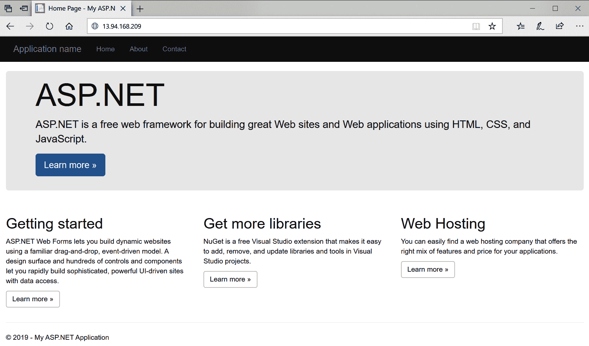

要删除 AKS 集群，请使用`az group delete --name aks-windows-resource-group --yes --no-wait`命令。

恭喜！您已成功创建了您的第一个完全托管的具有 Windows 节点的 Kubernetes 集群。在接下来的几章中，我们将探讨使用不同方法创建支持 Windows 容器的 Kubernetes 集群。

# 总结

在本章中，您了解了 Kubernetes 背后的关键理论 - 其高级架构和最常用的 Kubernetes API 对象。除此之外，我们总结了 Kubernetes 目前如何适应 Windows 生态系统以及 Windows 支持中的当前限制。接下来，您将学习如何使用推荐工具（如 minikube 和 Docker Desktop for Windows）为 Linux 容器设置自己的 Kubernetes 开发环境，以及可用的可能的生产集群部署策略。最后，我们回顾了支持 Windows 容器的托管 Kubernetes 产品，并成功部署了带有 Windows 节点池的 Azure Kubernetes Service 集群！

下一章将为您带来更多关于 Kubernetes 架构的知识-一般情况下以及在 Windows 生态系统中的 Kubernetes 网络。这将是最后一章，重点关注 Kubernetes 的理论和工作原理。

# 问题

1.  Kubernetes 中控制平面和数据平面之间有什么区别？

1.  声明模型和期望状态的概念是如何工作的，它的好处是什么？

1.  容器和 Pod 之间有什么区别？

1.  部署 API 对象的目的是什么？

1.  Kubernetes 在 Windows 上的主要限制是什么？

1.  minikube 是什么，何时应该使用它？

1.  AKS 和 AKS Engine 之间有什么区别？

您可以在本书的*评估*部分找到这些问题的答案。

# 进一步阅读

+   有关 Kubernetes 概念的更多信息，请参考以下 PacktPub 图书：

+   *完整的 Kubernetes 指南* ([`www.packtpub.com/virtualization-and-cloud/complete-kubernetes-guide`](https://www.packtpub.com/virtualization-and-cloud/complete-kubernetes-guide))

+   *开始使用 Kubernetes-第三版* ([`www.packtpub.com/virtualization-and-cloud/getting-started-kubernetes-third-edition`](https://www.packtpub.com/virtualization-and-cloud/getting-started-kubernetes-third-edition))

+   *面向开发人员的 Kubernetes* ([`www.packtpub.com/virtualization-and-cloud/kubernetes-developers`](https://www.packtpub.com/virtualization-and-cloud/kubernetes-developers))

+   您还可以参考优秀的官方 Kubernetes 文档([`kubernetes.io/docs/home/`](https://kubernetes.io/docs/home/))，这始终是关于 Kubernetes 的最新知识来源。对于特定于 Windows 的场景，建议参考官方的 Microsoft 虚拟化文档：[`docs.microsoft.com/en-us/virtualization/windowscontainers/kubernetes/getting-started-kubernetes-windows`](https://docs.microsoft.com/en-us/virtualization/windowscontainers/kubernetes/getting-started-kubernetes-windows)。
