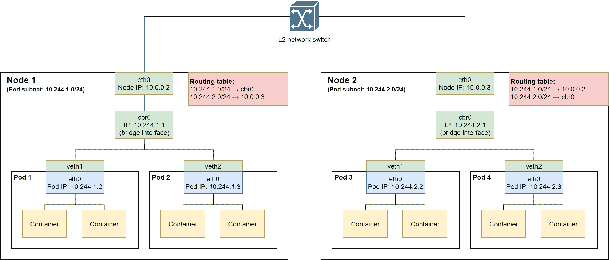
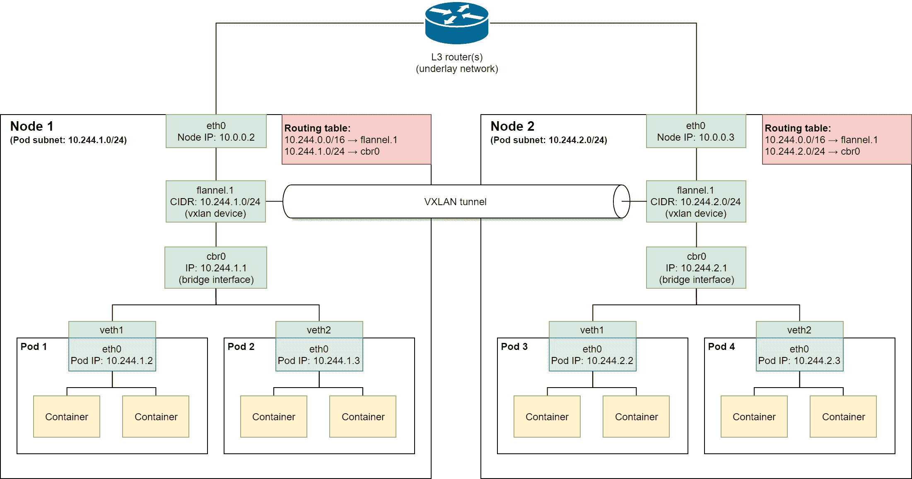
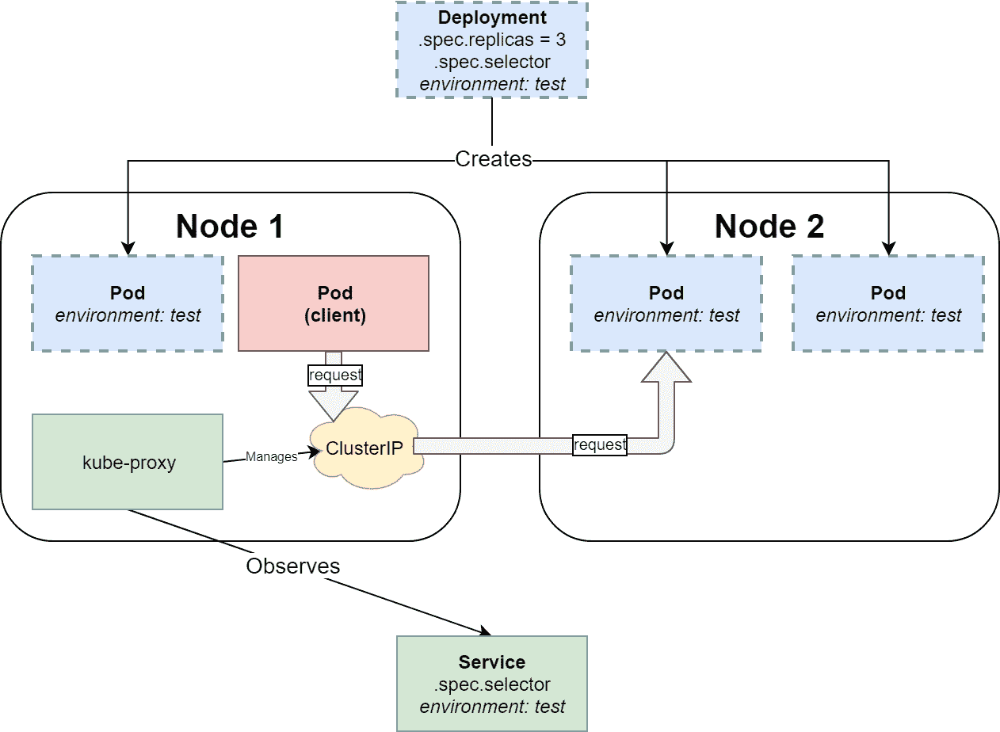
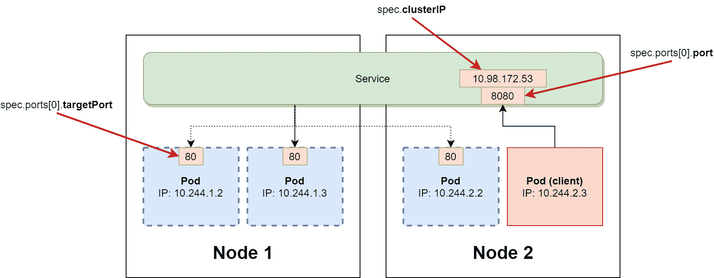
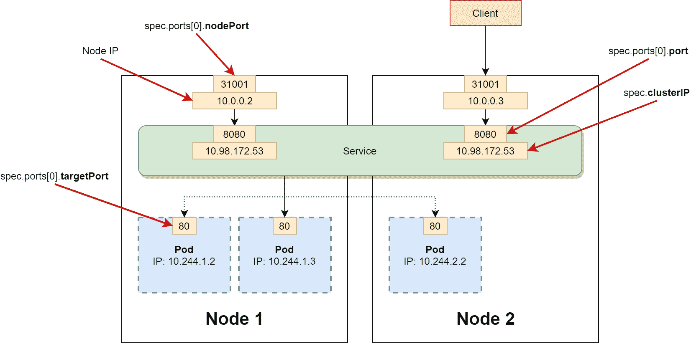
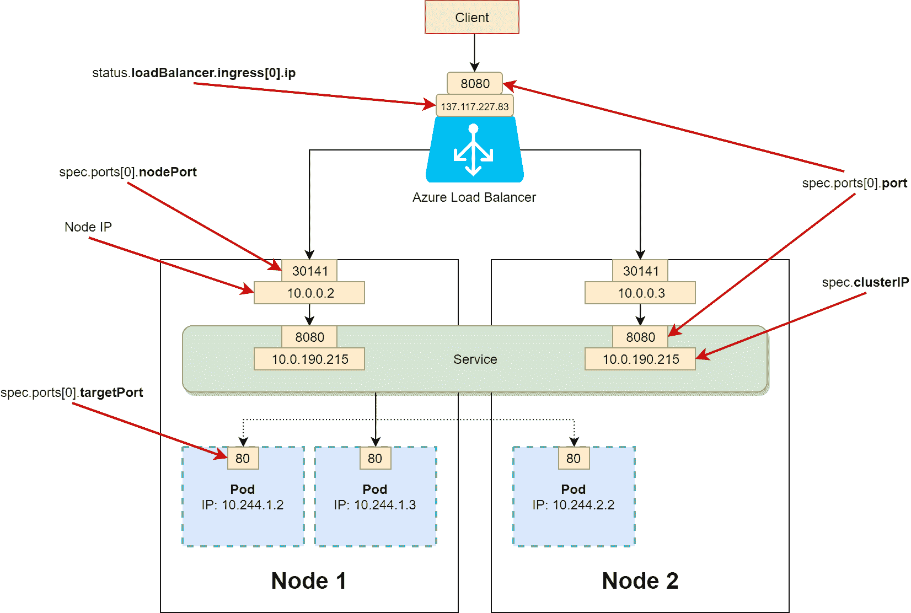
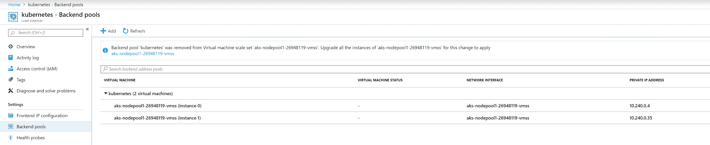
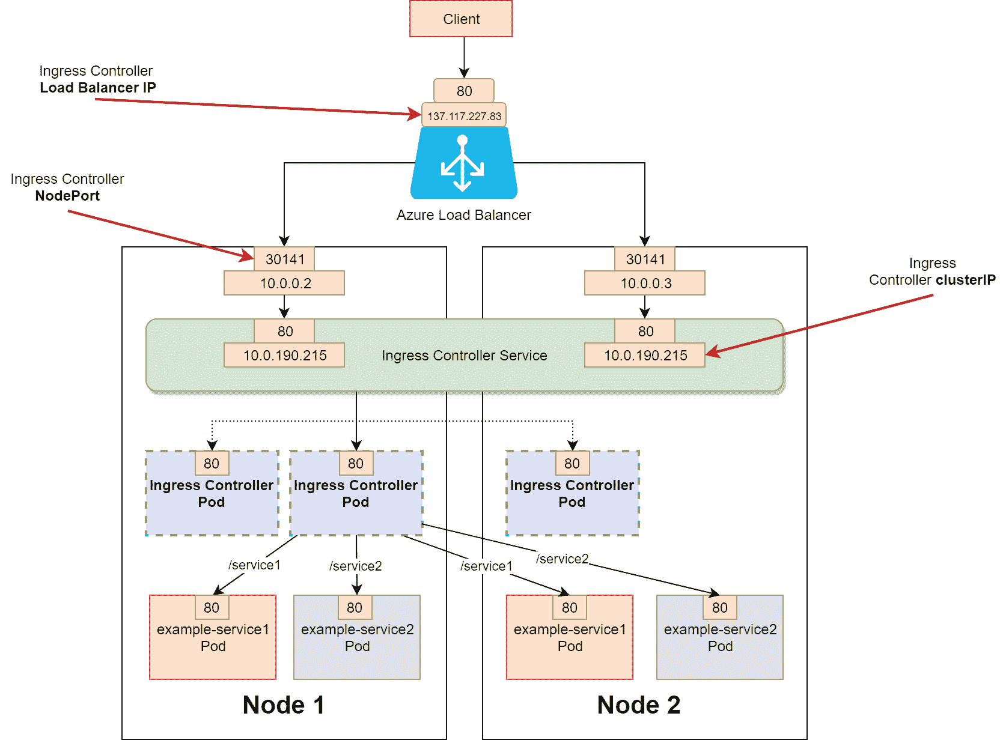
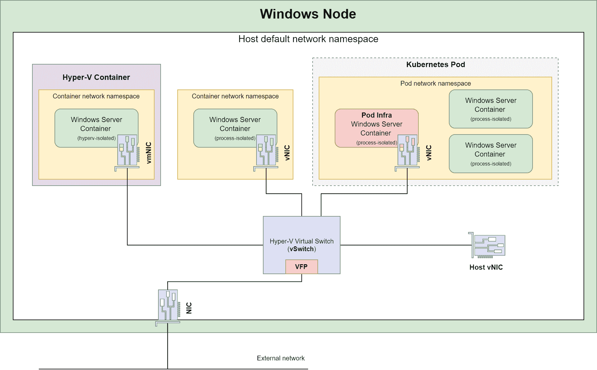

# Kubernetes 网络

对于容器编排，有两个主要挑战需要解决：管理容器主机（节点）和管理容器之间的网络。如果将容器主机集群限制为仅一个节点，网络将会相当简单——对于 Linux 上的 Docker，您将使用默认的桥接网络驱动程序，它创建一个私有网络（内部到主机），允许容器相互通信。对容器的外部访问需要暴露和映射容器端口作为主机端口。但是，现在如果考虑多节点集群，这个解决方案就不太适用——您必须使用 NAT 并跟踪使用了哪些主机端口，而且运行在容器中的应用程序还必须了解网络拓扑。

幸运的是，Kubernetes 通过提供一个具有特定基本要求的网络模型来解决这一挑战——符合规范的任何网络解决方案都可以作为 Kubernetes 中的网络模型实现。该模型的目标是提供透明的容器间通信和对容器的外部访问，而无需容器化应用程序了解底层网络挑战。在本章中，我们将解释 Kubernetes 网络模型的假设以及如何在混合 Linux/Windows 集群中解决 Kubernetes 网络问题。

在本章中，我们将涵盖以下主题：

+   Kubernetes 网络原则

+   Kubernetes CNI 网络插件

+   Kubernetes 中的 Windows 服务器网络

+   选择 Kubernetes 网络模式

# 技术要求

对于本章，您将需要以下内容：

+   安装了 Windows 10 Pro、企业版或教育版（1903 版本或更高版本，64 位）

+   安装了 Docker Desktop for Windows 2.0.0.3 或更高版本

+   如果您想要使用上一章中的 AKS 集群，则需要安装 Azure CLI

Docker Desktop for Windows 的安装和系统要求在第一章中有介绍，创建容器。

对于 Azure CLI，您可以在第二章中找到详细的安装说明，管理容器中的状态。

您可以从官方 GitHub 存储库下载本章的最新代码示例：[`github.com/PacktPublishing/Hands-On-Kubernetes-on-Windows/tree/master/Chapter05`](https://github.com/PacktPublishing/Hands-On-Kubernetes-on-Windows/tree/master/Chapter05)

# Kubernetes 网络原则

作为容器编排器，Kubernetes 提供了一个网络模型，其中包含任何给定网络解决方案必须满足的一组要求。最重要的要求如下：

+   在节点上运行的 Pod 必须能够与所有节点上的所有 Pod 进行通信（包括 Pod 所在的节点），而无需 NAT 和显式端口映射。

+   在节点上运行的所有 Kubernetes 组件，例如 kubelet 或系统守护程序/服务，必须能够与该节点上的所有 Pod 进行通信。

这些要求强制执行了一个平面、无 NAT 的网络模型，这是使 Kubernetes 如此强大、可扩展和易于使用的核心概念之一。从这个角度来看，Pod 类似于在 Hyper-V 集群中运行的 VMs——每个 Pod 都分配了自己的 IP 地址（IP-per-Pod 模型），Pod 内的容器共享相同的网络命名空间（就像 VM 上的进程），这意味着它们共享相同的本地主机并且需要知道端口分配。

简而言之，Kubernetes 中的网络有以下挑战需要克服：

+   **容器内部的 Pod 间通信**：由标准的本地主机通信处理。

+   **Pod 间通信**：由底层网络实现处理。

+   **Pod 到 Service 和外部到 Service 的通信**：由 Service API 对象处理，通信取决于底层网络实现。我们将在本节后面介绍这一点。

+   **当创建新的 Pod 时，kubelet 自动设置网络**：由**容器网络接口**（**CNI**）插件处理。我们将在下一节中介绍这一点。

Kubernetes 网络模型有许多实现，从简单的 L2 网络（例如，带有 host-gw 后端的 Flannel）到复杂的高性能**软件定义网络**（**SDN**）解决方案（例如，Big Cloud Fabric）。您可以在官方文档中找到不同实现的网络模型的列表：[`kubernetes.io/docs/concepts/cluster-administration/networking/#how-to-implement-the-kubernetes-networking-model`](https://kubernetes.io/docs/concepts/cluster-administration/networking/#how-to-implement-the-kubernetes-networking-model)。

本书中，我们将只关注从 Windows 角度相关的实现：

+   L2 网络

+   覆盖网络

让我们从最简单的网络实现 L2 网络开始。

# L2 网络

**第二层**（**L2**）指的是数据链路层，是网络协议设计的七层 OSI 参考模型中的第二层。该层用于在同一局域网中的节点之间传输数据（因此，考虑在 MAC 地址和交换机端口上操作，而不是 IP 地址，IP 地址属于 L3）。对于 Kubernetes，具有在每个 Kubernetes 节点上设置路由表的 L2 网络是满足 Kubernetes 网络模型实现要求的最简单的网络类型。一个很好的例子是带有 host-gw 后端的 Flannel。在高层次上，Flannel（host-gw）以以下方式为 Pod 提供网络：

1.  每个节点都运行一个**flanneld**（或者 Windows 上的**flanneld.exe**）代理，负责从一个称为**Pod CIDR**（**无类别域间路由**）的较大的预配置地址空间中分配子网租约。在下图中，Pod CIDR 是`10.244.0.0/16`，而节点 1 租用了子网`10.244.1.0/24`，节点 2 租用了子网`10.244.2.0/24`。

1.  在大多数情况下，Flannel 代理在集群中进行 Pod 网络安装时部署为**DaemonSet**。可以在这里找到一个示例 DaemonSet 定义：[`github.com/coreos/flannel/blob/master/Documentation/kube-flannel.yml`](https://github.com/coreos/flannel/blob/master/Documentation/kube-flannel.yml)。

1.  Flannel 使用 Kubernetes API 或**etcd**直接存储网络信息和租约数据，具体取决于其配置。

1.  当新节点加入集群时，Flannel 为给定节点上的所有 Pod 创建一个`cbr0`桥接口。节点上的操作系统中的路由表会被更新，其中包含集群中每个节点的一个条目。例如，在下图中的 Node 2 中，路由表有两个条目，分别通过`10.0.0.2`网关（到 Node 1 的节点间通信）路由到`10.244.1.0/24`，以及通过本地`cbr0`接口（Node 1 上 Pod 之间的本地通信）路由到`10.244.2.0/24`。

1.  当创建一个新的 Pod 时，会创建一个新的**veth**设备对。在 Pod 网络命名空间中创建一个`eth0`设备，以及在主机（根）命名空间中对端的`vethX`设备。虚拟以太网设备用作网络命名空间之间的隧道。

1.  为了触发上述操作，kubelet 使用了由 Flannel CNI 插件实现的 CNI：



Flannel 执行的所有操作都可以通过命令行手动执行，但是，Flannel 的目标当然是自动化新节点注册和新 Pod 网络创建的过程，对 Kubernetes 用户来说是透明的。

现在让我们快速分析一下当 Pod 1 中的容器`10.244.1.2`（位于 Node 1 上）想要向 Pod 4 中的容器`10.244.2.3`（位于 Node 2 上）发送 TCP 数据包时会发生什么：

1.  Pod 1 的出站数据包将被发送到`cbr0`桥接口，因为它被设置为`eth0` Pod 接口的默认网关。

1.  由于 Node 1 上的`10.244.2.0/24 → 10.0.0.3`路由表条目，数据包被转发到`10.0.0.3`网关。

1.  数据包通过物理 L2 网络交换机，并在 Node 2 的`eth0`接口接收。

1.  Node 2 的路由表包含一个条目，将流量转发到本地的`cbr0`桥接口的`10.244.2.0/24` CIDR。

1.  数据包被 Pod 2 接收。

请注意，上述示例使用了 Linux 网络接口命名和术语。这个模型的 Windows 实现通常是相同的，但在操作系统级别的原语上有所不同。

使用带有路由表的 L2 网络是高效且简单的设置；然而，它也有一些缺点，特别是在集群规模扩大时：

+   需要节点的 L2 邻接性。换句话说，所有节点必须在同一个本地区域网络中，中间没有 L3 路由器。

+   在所有节点之间同步路由表。当新节点加入时，所有节点都需要更新它们的路由表。

+   由于 L2 网络交换机在转发表中设置新的 MAC 地址的方式，可能会出现可能的故障和延迟，特别是对于短暂存在的容器。

带有 host-gw 后端的 Flannel 对 Windows 有稳定的支持。

一般来说，建议使用覆盖网络，这允许在现有的底层 L3 网络上创建一个虚拟的 L2 网络。

# 覆盖网络

作为一个一般概念，覆盖网络使用封装来创建一个新的、隧道化的虚拟网络，位于现有的 L2/L3 网络之上，称为底层网络。这个网络是在不对底层网络的实际物理网络基础设施进行任何更改的情况下创建的。覆盖网络中的网络服务通过封装与底层基础设施分离，封装是一种使用另一种类型的数据包来封装一种类型的数据包的过程。进入隧道时封装的数据包然后在隧道的另一端进行解封装。

覆盖网络是一个广泛的概念，有许多实现。在 Kubernetes 中，其中一个常用的实现是使用**虚拟可扩展局域网（VXLAN）**协议通过 UDP 数据包进行 L2 以太网帧的隧道传输。重要的是，这种类型的覆盖网络对 Linux 和 Windows 节点都适用。如果你有一个带有 VXLAN 后端的 Flannel 网络，Pods 的网络是以以下方式提供的：

1.  类似于 host-gw 后端，每个节点上都部署了一个 flanneld 代理作为 DaemonSet。

1.  当一个新的节点加入集群时，Flannel 为给定节点上的所有 Pods 创建一个`cbr0`桥接口和一个额外的`flannel.<vni>`VXLAN 设备（一个 VXLAN 隧道端点，或者简称为 VTEP；VNI 代表 VXLAN 网络标识符，在这个例子中是`1`）。这个设备负责流量的封装。IP 路由表只对新节点进行更新。发送到在同一节点上运行的 Pod 的流量被转发到`cbr0`接口，而所有剩余的发送到 Pod CIDR 的流量被转发到 VTEP 设备。例如，在下图中的节点 2，路由表有两个条目，将通信路由到`10.244.0.0/16`通过`flannel.1` VTEP 设备（覆盖网络中的节点间通信），并且将通信路由到`10.244.2.0/24`通过本地的`cbr0`接口（节点 1 上的 Pod 之间的本地通信）。

1.  当创建一个新的 Pod 时，会创建一个新的 veth 设备对，类似于 host-gw 后端的情况：



现在让我们快速分析当 Pod 1 中的容器`10.244.1.2`（在节点 1 上）想要向 Pod 4 中的容器`10.244.2.3`（在节点 2 上）发送 TCP 数据包时会发生什么：

1.  Pod 1 的出站数据包将被发送到`cbr0`桥接口，因为它被设置为`eth0` Pod 接口的默认网关。

1.  由于节点 1 上的`10.244.0.0/16 → flannel.1`路由表条目，数据包被转发到`flannel.1` VTEP 设备。

1.  `flannel.1`使用`10.244.0.0/16`叠加网络中 Pod 4 的 MAC 地址作为内部数据包的目的地址。这个地址是由**flanneld**代理在**转发数据库**（**FDB**）中填充的。

1.  `flannel.1`使用 FDB 确定节点 2 的目标 VTEP 设备的 IP 地址，并使用`10.0.0.3`作为外部封装数据包的目的地址。

1.  数据包通过物理 L2/L3 网络传输，并被节点 2 接收。数据包由`flannel.1` VTEP 设备进行解封装。

1.  节点 2 的路由表包含一个条目，将流量转发到本地的`cbr0`桥接口的`10.244.2.0/24` CIDR。

1.  Pod 2 接收到数据包。

对于 Windows，Flannel 与 Overlay 后端目前仍处于 alpha 功能阶段。

使用 VXLAN 后端而不是 host-gw 后端的 Flannel 具有几个优势：

+   节点之间不需要 L2 邻接。

+   L2 叠加网络不容易受到生成树故障的影响，这种情况可能发生在跨多个逻辑交换机的 L2 域的情况下。

本节中描述的解决方案类似于 Docker 在**swarm 模式**下运行。您可以在官方文档中了解有关 swarm 模式的 Overlay 网络的更多信息：[`docs.docker.com/network/overlay/.`](https://docs.docker.com/network/overlay/.)

前两种网络解决方案是混合 Linux/Windows 集群中最常用的解决方案，特别是在本地运行时。对于其他情况，也可以使用**Open Virtual Network**（**OVN**）和**L2 隧道**进行 Azure 特定实现。

# 其他解决方案

就 Kubernetes 支持的 Windows 网络解决方案而言，还有两种额外的实现可以使用：

+   例如，**Open Virtual Network**（**OVN**）作为 OpenStack 部署的一部分

+   在 Azure 部署中使用**L2 隧道**

OVN 是一个用于实现 SDN 的网络虚拟化平台，它将物理网络拓扑与逻辑网络拓扑解耦。使用 OVN，用户可以定义由逻辑交换机和路由器组成的网络拓扑。Kubernetes 支持使用专用 CNI 插件**ovn-kubernetes**（[`github.com/ovn-org/ovn-kubernetes`](https://github.com/ovn-org/ovn-kubernetes)）进行 OVN 集成。

对于特定于 Azure 的场景，可以使用**Azure-CNI**插件，该插件依赖于**L2Tunnel** Docker 网络驱动程序，直接利用 Microsoft Cloud Stack 功能。简而言之，Pod 连接到现有的虚拟网络资源和配置，并且所有 Pod 数据包直接路由到虚拟化主机，以应用 Azure SDN 策略。Pod 在 Azure 提供的虚拟网络中获得完全的连通性，这意味着每个 Pod 都可以直接从集群外部访问。您可以在官方 AKS 文档中找到有关此解决方案的更多详细信息：[`docs.microsoft.com/bs-latn-ba/azure/aks/configure-azure-cni`](https://docs.microsoft.com/bs-latn-ba/azure/aks/configure-azure-cni)。

# 服务

在上一章中，我们介绍了服务作为 API 对象，并解释了它们如何与部署一起使用。简单回顾一下，服务 API 对象基于标签选择器，使一组 Pod 可以进行网络访问。在 Kubernetes 网络方面，服务是建立在标准网络模型之上的概念，旨在实现以下目标：

+   使用**虚拟 IP**（**VIP**）可靠地与一组 Pod 进行通信。客户端 Pod 不需要知道单个 Pod 的当前 IP 地址，因为这些地址随时间可能会发生变化。外部客户端也不需要知道 Pod 的当前 IP 地址。

+   将网络流量（内部和外部）负载均衡到一组 Pod。

+   在集群中启用服务发现。这需要在集群中运行 DNS 服务附加组件。

Kubernetes 中有四种可用的服务类型，可以在服务对象规范中指定。

+   ClusterIP

+   NodePort

+   LoadBalancer

+   ExternalName

我们将分别讨论每种类型，但首先让我们看看在部署和 Pod 的上下文中**服务**是什么样子的：



上述图表显示了 ClusterIP 类型的最简单的内部 Service 是如何公开管理三个带有`environment: test`标签的 Pod 的现有部署。具有相同标签选择器`environment: test`的 ClusterIP Service 负责监视标签选择器评估的结果，并使用当前的存活和准备好的 Pod IP 更新**endpoint** API 对象。同时，kube-proxy 观察 Service 和 endpoint 对象，以在 Linux 节点上创建 iptables 规则或在 Windows 节点上创建 HNS 策略，用于实现具有 Service 规范中指定的 ClusterIP 值的虚拟 IP 地址。最后，当客户端 Pod 向虚拟 IP 发送请求时，它将使用 kube-proxy 设置的规则/策略转发到部署中的一个 Pod。正如您所看到的，kube-proxy 是实现服务的中心组件，实际上它用于所有服务类型，除了 ExternalName。

# ClusterIP

Kubernetes 中默认的 Service 类型是 ClusterIP，它使用内部 VIP 公开服务。这意味着 Service 只能在集群内部访问。假设您正在运行以下`nginx`部署：

```
apiVersion: apps/v1
kind: Deployment
metadata:
  name: nginx-deployment-example
spec:
  replicas: 3
  selector:
    matchLabels:
      environment: test
  template:
    metadata:
      labels:
        environment: test
    spec:
      containers:
      - name: nginx
        image: nginx:1.17
        ports:
        - containerPort: 80
```

所有清单文件都可以在本书的官方 GitHub 存储库中找到：[`github.com/PacktPublishing/Hands-On-Kubernetes-on-Windows/tree/master/Chapter05`](https://github.com/PacktPublishing/Hands-On-Kubernetes-on-Windows/tree/master/Chapter05)。

您可以使用以下清单文件部署 ClusterIP 类型的 Service：

```
apiVersion: v1
kind: Service
metadata:
  name: nginx-deployment-example-clusterip
spec:
  selector:
    environment: test
  type: ClusterIP
  ports:
  - port: 8080
    protocol: TCP
    targetPort: 80
```

与每种 Service 类型一样，关键部分是`selector`规范，它必须与部署中的 Pod 匹配。您将`type`指定为`ClusterIP`，并在 Service 上分配`8080`作为端口，该端口映射到 Pod 上的`targetPort: 80`。这意味着客户端 Pod 将使用`nginx-deployment-example:8080` TCP 端点与 nginx Pods 进行通信。实际的 ClusterIP 地址是动态分配的，除非您在`spec`中明确指定一个。Kubernetes 集群中的内部 DNS 服务负责将`nginx-deployment-example`解析为实际的 ClusterIP 地址，作为服务发现的一部分。

本节其余部分的图表表示了服务在逻辑上是如何实现的。在幕后，kube-proxy 负责管理所有转发规则和公开端口，就像前面的图表中一样。

这在以下图表中进行了可视化：



ClusterIP 服务是允许外部通信的其他服务类型的基础：NodePort 和 LoadBalancer。

# NodePort

允许对 Pod 进行外部入口通信的第一种服务类型是 NodePort 服务。这种类型的服务被实现为 ClusterIP 服务，并具有使用任何集群节点 IP 地址和指定端口可达的额外功能。为了实现这一点，kube-proxy 在 30000-32767 范围内的每个节点上公开相同的端口（可配置），并设置转发，以便将对该端口的任何连接转发到 ClusterIP。

您可以使用以下清单文件部署 NodePort 服务：

```
apiVersion: v1
kind: Service
metadata:
  name: nginx-deployment-example-nodeport
spec:
  selector:
    environment: test
  type: NodePort
  ports:
  - port: 8080
    nodePort: 31001
    protocol: TCP
    targetPort: 80
```

如果在规范中未指定`nodePort`，则将动态分配使用 NodePort 范围。请注意，服务仍然充当 ClusterIP 服务，这意味着它在其 ClusterIP 端点内部可达。

以下图表可视化了 NodePort 服务的概念：



当您希望在服务前设置自己的负载均衡设置时，建议使用 NodePort 服务。您也可以直接暴露 NodePorts，但请记住，这样的解决方案更难以保护，并可能存在安全风险。

# LoadBalancer

允许外部入口通信的第二种服务类型是 LoadBalancer，在可以创建外部负载均衡器的 Kubernetes 集群中可用，例如云中的托管 Kubernetes 服务。这种类型的服务将 NodePort 的方法与额外的外部负载均衡器结合在一起，该负载均衡器将流量路由到 NodePorts。

您可以使用以下清单文件部署 LoadBalancer 服务：

```
apiVersion: v1
kind: Service
metadata:
  name: nginx-deployment-example-lb
spec:
  selector:
    environment: test
  type: LoadBalancer
  ports:
  - port: 8080
    protocol: TCP
    targetPort: 80
```

请注意，为了应用此清单文件，您需要支持外部负载均衡器的环境，例如我们在第四章中创建的 AKS 集群，*Kubernetes 概念和 Windows 支持*。Katacoda Kubernetes Playground 还能够创建可以从 Playground 终端访问的“外部”负载均衡器。如果您尝试在不支持创建外部负载均衡器的环境中创建 LoadBalancer 服务，将导致负载均衡器入口 IP 地址无限期处于*pending*状态。

为了获得外部负载均衡器地址，请执行以下命令：

```
PS C:\src> kubectl get svc nginx-deployment-example-lb
NAME                          TYPE           CLUSTER-IP     EXTERNAL-IP      PORT(S)          AGE
nginx-deployment-example-lb   LoadBalancer   10.0.190.215   137.117.227.83   8080:30141/TCP   2m23s
```

`EXTERNAL-IP`列显示负载均衡器具有 IP 地址`137.117.227.83`，为了访问您的服务，您必须与`137.117.227.83:8080` TCP 端点通信。此外，您可以看到服务有自己的内部 ClusterIP，`10.0.190.215`，并且公开了 NodePort `30141`。在 AKS 上运行的 LoadBalancer 服务已在以下图表中可视化：



如果您对服务前面的 Azure 负载均衡器的配置感兴趣，您需要转到[`portal.azure.com`](https://portal.azure.com)并导航到负载均衡器资源，您将在那里找到 Kubernetes 负载均衡器实例：



现在，让我们来看看最后一种服务类型：ExternalName。

# ExternalName

在某些情况下，您需要定义一个指向不托管在 Kubernetes 集群中的外部资源的服务。例如，这可能包括云托管的数据库实例。Kubernetes 提供了一种将通信抽象化到这些资源并通过使用 ExternalName 服务在集群服务发现中注册它们的方法。

ExternalName 服务不使用选择器，只是服务名称到外部 DNS 名称的原始映射：

```
apiVersion: v1
kind: Service
metadata:
  name: externalname-example-service
spec:
  type: ExternalName
  externalName: cloud.database.example.com
```

在解析服务 DNS 名称（`externalname-example-service.default.svc.cluster.local`）期间，内部集群 DNS 将响应具有值`cloud.database.example.com`的 CNAME 记录。没有使用 kube-proxy 规则进行实际的流量转发-重定向发生在 DNS 级别。

ExternalName 服务的一个很好的用例是根据环境类型提供外部服务的不同实例，例如数据库。从 Pod 的角度来看，这不需要任何配置或连接字符串更改。

# Ingress

LoadBalancer 服务仅提供 L4 负载平衡功能。这意味着您不能使用以下内容：

+   HTTPS 流量终止和卸载

+   使用相同的负载均衡器进行基于名称的虚拟主机托管多个域名

+   基于路径的路由到服务，例如作为 API 网关

为了解决这个问题，Kubernetes 提供了 Ingress API 对象（不是服务类型），可用于 L7 负载平衡。

Ingress 部署和配置是一个广泛的主题，超出了本书的范围。您可以在官方文档中找到关于 Ingress 和 Ingress 控制器的更详细信息：[`kubernetes.io/docs/concepts/services-networking/ingress/`](https://kubernetes.io/docs/concepts/services-networking/ingress/)。

使用 Ingress 首先需要在您的 Kubernetes 集群中部署一个 Ingress 控制器。Ingress 控制器是一个 Kubernetes 控制器，通常作为一个 DaemonSet 或运行专用 Pod 来处理入口流量负载均衡和智能路由，手动部署到集群中。Kubernetes 中常用的 Ingress 控制器是**ingress-nginx**（[`www.nginx.com/products/nginx/kubernetes-ingress-controller`](https://www.nginx.com/products/nginx/kubernetes-ingress-controller)），它作为一个 nginx web 主机的部署，具有一组规则来处理 Ingress API 对象。Ingress 控制器以一种取决于安装的类型的 Service 暴露出来。例如，对于只有 Linux 节点的 AKS 集群，可以使用以下清单执行 ingress-nginx 的基本安装，将其暴露为 LoadBalancer Service。

```
kubectl apply -f https://raw.githubusercontent.com/kubernetes/ingress-nginx/master/deploy/static/mandatory.yaml
kubectl apply -f https://raw.githubusercontent.com/kubernetes/ingress-nginx/master/deploy/static/provider/cloud-generic.yaml
```

一般来说，Ingress 控制器的安装取决于 Kubernetes 集群环境和配置，并且必须根据您的需求进行调整。例如，对于带有 Windows 节点的 AKS，您需要确保适当的节点选择器被使用，以便正确调度 Ingress 控制器 Pod。

您可以在本书的官方 GitHub 存储库中找到针对带有 Windows 节点的 AKS 的定制 nginx Ingress 控制器定义，以及示例服务和 Ingress 定义：[`github.com/PacktPublishing/Hands-On-Kubernetes-on-Windows/tree/master/Chapter05/05_ingress-example`](https://github.com/PacktPublishing/Hands-On-Kubernetes-on-Windows/tree/master/Chapter05/05_ingress-example)。

当 Ingress 控制器已经安装在集群中时，Ingress API 对象可以被创建并且会被控制器处理。例如，假设您已经部署了两个 ClusterIP 服务`example-service1`和`example-service2`，Ingress 定义可能如下所示：

```
apiVersion: networking.k8s.io/v1beta1
kind: Ingress
metadata:
  name: example-ingress
  annotations:
    nginx.ingress.kubernetes.io/rewrite-target: /
spec:
  rules:
  - http:
      paths:
      - path: /service1
        backend:
          serviceName: example-service1
          servicePort: 80
      - path: /service2
        backend:
          serviceName: example-service2
          servicePort: 80
```

现在，当您对`https://<ingressServiceLoadBalancerIp>/service1`发出 HTTP 请求时，流量将由 nginx 路由到`example-service1`。请注意，您只使用一个云负载均衡器进行此操作，实际的路由到 Kubernetes 服务是由 Ingress 控制器使用基于路径的路由来执行的。

这种设计原则已在以下图表中显示：



对于 AKS，您可以考虑使用 HTTP 应用程序路由附加组件，它可以自动管理 Ingress 控制器和集群的 External-DNS 控制器。更多细节可以在官方文档中找到：[`docs.microsoft.com/en-us/azure/aks/http-application-routing`](https://docs.microsoft.com/en-us/azure/aks/http-application-routing)。

选择是否实现 Ingress 或 Service 的一个一般准则是使用 Ingress 来暴露 HTTP（尤其是 HTTPS）端点，并使用 Service 来处理其他协议。

# Kubernetes CNI 网络插件

在这一章中，我们已经提到了**容器网络接口**（**CNI**）和**CNI 插件**这两个术语，这是在 Kubernetes 网络设置的背景下。事实上，CNI 并不局限于 Kubernetes——这个概念起源于 Rkt 容器运行时，并被采纳为 CNCF 项目，旨在为任何容器运行时和网络实现提供一个简单明了的接口。容器运行时使用 CNI 插件来连接容器到网络，并在需要时将它们从网络中移除。

# 理解 CNI 项目

CNI 项目有三个明确的部分：

+   CNI 规范定义了一个通用的、基于插件的容器网络解决方案的架构，以及 CNI 插件必须实现的实际接口。规范可以在[`github.com/containernetworking/cni/blob/master/SPEC.md`](https://github.com/containernetworking/cni/blob/master/SPEC.md)找到。

+   将 CNI 集成到应用程序中的库可以在与规范相同的存储库中找到：[`github.com/containernetworking/cni/tree/master/libcni`](https://github.com/containernetworking/cni/tree/master/libcni)。

+   CNI 插件的参考实现可以在专用存储库中找到：[`github.com/containernetworking/plugins`](https://github.com/containernetworking/plugins)。

CNI 的规范非常简单明了，可以总结如下：

+   CNI 插件是作为独立的可执行文件实现的。

+   容器运行时负责在与 CNI 插件交互之前为容器准备一个新的网络命名空间（或在 Windows 情况下为网络隔间）。

+   CNI 插件负责将容器连接到由网络配置指定的网络。

+   网络配置以 JSON 格式由容器运行时通过标准输入提供给 CNI 插件。

+   使用环境变量向 CNI 插件提供参数。例如，`CNI_COMMAND`变量指定插件应执行的操作类型。命令集是有限的，包括`ADD`、`DEL`、`CHECK`和`VERSION`；其中最重要的是`ADD`和`DEL`，分别用于将容器添加到网络和从网络中删除容器。

对于 CNI 插件，有三种常见类型的插件，在网络配置期间负责不同的责任：

+   接口创建插件

+   **IP 地址管理（IPAM）**插件负责为容器分配 IP 地址。

+   元插件可以作为其他 CNI 插件的适配器，或为其他 CNI 插件提供额外的配置或转换它们的输出。

目前，在 Windows 上只能使用以下参考实现：host-local IPAM 插件、win-bridge 和 win-Overlay 接口创建插件，以及 flannel 元插件。也可以使用第三方插件；例如，微软提供了 Azure-CNI 插件，用于将容器与 Azure SDN 集成（[`github.com/Azure/azure-container-networking/blob/master/docs/cni.md`](https://github.com/Azure/azure-container-networking/blob/master/docs/cni.md)）。

在 Kubernetes 中，kubelet 在管理 Pod 的生命周期时使用 CNI 插件，以确保 Pod 的连通性和可达性。Kubelet 执行的最基本操作是在创建 Pod 时执行`ADD` CNI 命令，在销毁 Pod 时执行`DELETE` CNI 命令。在某些情况下，CNI 插件也可以用于调整 kube-proxy 的配置。

在部署新集群时，选择 CNI 插件并定义 CNI 插件的网络配置是在 Pod 网络附加组件安装步骤中执行的。最常见的安装方式是通过部署专用的 DaemonSet 来执行，该 DaemonSet 使用 init 容器执行 CNI 插件的安装，并在每个节点上运行额外的代理容器（如果需要的话）。这种安装的一个很好的例子是 Flannel 的官方 Kubernetes 清单：[`github.com/coreos/flannel/blob/master/Documentation/kube-flannel.yml`](https://github.com/coreos/flannel/blob/master/Documentation/kube-flannel.yml)。

# CoreOS Flannel

在使用 Linux/Windows 混合 Kubernetes 集群时，特别是在本地部署时，通常会将**Flannel**作为 Pod 网络附加组件安装（[`github.com/coreos/flannel`](https://github.com/coreos/flannel)）。Flannel 是一个面向多个节点的 Kubernetes 和容器的最小化 L2/L3 虚拟网络提供程序。Flannel 有三个主要组件：

+   在集群中的每个节点上都运行一个**flanneld**（或者在 Windows 机器上是`flanneld.exe`）代理/守护进程，通常作为 Kubernetes 中的一个 DaemonSet 部署。它负责为每个节点分配一个较大的 Pod CIDR 中的独占子网租约。例如，在本章中，我们一直在集群中使用`10.244.0.0/16`作为 Pod CIDR，而在单个节点上使用`10.244.1.0/24`或`10.244.2.0/24`作为子网租约。租约信息和节点网络配置由`flanneld`使用 Kubernetes API 或直接存储在`etcd`中。该代理的主要责任是同步子网租约信息，配置 Flannel 后端，并在节点上为其他组件（如 Flannel CNI 插件）公开配置（作为容器主机文件系统中的文件）。

+   Flannel 的**后端**定义了 Pod 之间的网络是如何创建的。在本章中我们已经使用过的在 Windows 和 Linux 上都支持的后端的例子有 Vxlan 和 host-gw。您可以在[`github.com/coreos/flannel/blob/master/Documentation/backends.md`](https://github.com/coreos/flannel/blob/master/Documentation/backends.md)找到更多关于 Flannel 后端的信息。

+   Flannel **CNI 插件**是由 kubelet 在将 Pod 添加到网络或从网络中移除 Pod 时执行的。Flannel CNI 插件是一个元插件，它使用其他创建接口和 IPAM 插件来执行操作。它的责任是读取`flanneld`提供的子网信息，为适当的 CNI 插件生成 JSON 配置，并执行它。目标插件的选择取决于 Flannel 使用的后端；例如，在 Windows 节点上使用 vxlan 后端，Flannel CNI 插件将调用 host-local IPAM 插件和 win-Overlay 插件。您可以在官方文档中找到有关这个元插件的更多信息：[`github.com/containernetworking/plugins/tree/master/plugins/meta/flannel`](https://github.com/containernetworking/plugins/tree/master/plugins/meta/flannel)。

让我们逐步看看在运行在 vxlan 后端的 Windows 节点上发生的事情——从 Flannel 代理部署到 kubelet 创建 Pod（类似的步骤也发生在 Linux 节点上，但执行不同的目标 CNI 插件）：

1.  `flanneld.exe`代理作为一个 DaemonSet 部署到节点上，或者按照当前 Windows 文档的建议手动启动。

1.  代理读取提供的`net-conf.json`文件，其中包含 Pod CIDR 和`vxlan`后端配置：

```
{
    "Network": "10.244.0.0/16",
    "Backend": {
        "Type": "vxlan",
        "VNI": 4096,
        "Port": 4789
    }
}
```

1.  代理为节点获取一个新的子网租约`10.244.1.0/24`。租约信息存储在 Kubernetes API 中。创建`vxlan0`网络，创建 VTEP 设备，并更新路由表和转发数据库。

1.  子网租约的信息被写入到节点文件系统中的`C:\run\flannel\subnet.env`。这是一个例子：

```
FLANNEL_NETWORK=10.244.0.0/16
FLANNEL_SUBNET=10.244.1.0/24
FLANNEL_MTU=1472
FLANNEL_IPMASQ=true
```

1.  每当一个新节点加入集群时，`flanneld.exe`代理会对路由表和转发数据库进行任何额外的重新配置。

1.  现在，一个新的 Pod 被调度到这个节点上，kubelet 初始化 pod 基础容器，并在 Flannel meta CNI 插件上执行`ADD`命令，使用配置 JSON，该 JSON 将接口创建委托给`win-Overlay`插件，并将 IPAM 管理委托给`host-local`插件。Flannel CNI 插件根据`subnet.env`和这些插件的输入配置生成配置 JSON。

1.  使用`host-local` IPAM 插件租用新的 IP。Flannel 不负责管理 IPAM，它只是从当前节点上的给定子网中检索一个新的空闲 IP 地址。

1.  `win-bridge`插件配置了 Pod 的**主机网络服务**（HNS）端点，并有效地将 Pod 连接到 Overlay 网络。

总之，Flannel 自动化了为 Pod 创建 L2/Overlay 网络的过程，并在创建新 Pod 或新节点加入集群时维护网络。目前，在 Windows 上，L2 网络（host-gw 后端）被认为是稳定的，而 Overlay 网络（vxlan 后端）在 Windows 上仍处于 alpha 阶段——在使用本地 Kubernetes 集群时，这两种后端都很有用。对于 AKS 和 AKS-engine 场景，安装 Pod 网络的最有效方式是使用默认的 Azure-CNI 插件。

# Kubernetes 中的 Windows Server 网络

在高层次上，Windows 节点的 Kubernetes 网络与 Linux 节点类似——kubelet 通过 CNI 与网络操作解耦。主要区别在于 Windows 容器网络的实际实现以及用于 Windows 容器的术语。

Windows 容器网络设置类似于 Hyper-V 虚拟机网络，并且实际上共享许多内部服务，特别是**主机网络服务**（**HNS**），它与**主机计算服务**（**HCS**）合作，后者管理容器的生命周期。创建新的 Docker 容器时，容器会接收自己的网络命名空间（隔间）和位于该命名空间中的**虚拟网络接口控制器**（**vNIC**或在 Hyper-V 中，隔离容器或**vmNIC**）。然后将 vNIC 连接到**Hyper-V 虚拟交换机**（**vSwitch**），该交换机还使用主机 vNIC 连接到主机默认网络命名空间。您可以将此结构宽松地映射到 Linux 容器世界中的**容器桥接口**（CBR）。vSwitch 利用 Windows 防火墙和**虚拟过滤平台**（**VFP**）Hyper-V vSwitch 扩展来提供网络安全、流量转发、VXLAN 封装和负载平衡。这个组件对于 kube-proxy 提供服务功能至关重要，您可以将 VFP 视为 Linux 容器世界中的*iptables*。vSwitch 可以是内部的（不连接到容器主机上的网络适配器）或外部的（连接到容器主机上的网络适配器）；这取决于容器网络驱动程序。在 Kubernetes 的情况下，您将始终使用创建外部 vSwitch 的网络驱动程序（L2Bridge、Overlay、Transparent）。

VFP 利用 Windows 内核功能来过滤和转发网络流量。直到 Kubernetes 1.8，kube-proxy 不支持 VFP，唯一的转发流量的方式是使用**用户空间**模式，该模式在用户空间而不是内核空间中进行所有流量管理。

在创建容器时，所有前述设置都是由 HNS 执行的。HNS 通常负责以下工作：

+   创建虚拟网络和 vSwitches

+   创建网络命名空间（隔间）

+   创建 vNICs（端点）并将它们放置在容器网络命名空间中

+   创建 vSwitch 端口

+   管理 VFP 网络策略（负载平衡、封装）

在 Kubernetes 的情况下，CNI 插件是设置容器网络的唯一方式（对于 Linux，可以选择不使用它们）。它们与 HNS 和 HCS 进行实际通信，以设置所选的网络模式。与标准的 Docker 网络设置相比，Kubernetes 的网络设置有一个重要的区别：容器 vNIC 连接到 pod 基础设施容器，并且网络命名空间在 Pod 中的所有容器之间共享。这与 Linux Pods 的概念相同。

这些结构在以下图表中可视化：



Windows 容器网络架构为 Kubernetes 有一个更重要的概念：网络驱动程序（模式）。在下一节中，我们将介绍选项，并看看它们中哪些适用于 Kubernetes，但首先，让我们快速看一下 Windows 上 Kubernetes 网络的当前限制。

# 限制

Windows 容器网络不断发展，许多功能的实现仍在进行中。目前，Kubernetes 在 Windows 平台上有一些网络限制。

+   Windows Pod 不支持主机网络模式。

+   不支持从节点本身访问 NodePort。

+   L2Bridge、L2Tunnel 和 Overlay 网络驱动不支持 IPv6 堆栈。

+   不支持外部网络的 ICMP。换句话说，您将无法 ping 通 Kubernetes 集群外的 IP 地址。

+   在 vxlan 后端上运行的 Flannel 受限于使用 VNI 4096 和 UDP 端口 4789。

+   不支持容器通信的 IPsec 加密。

+   容器内不支持 HTTP 代理。

+   对于在 Windows 节点上运行的 Ingress 控制器，您必须选择支持 Windows 和 Linux 节点的部署。

您可以期待这个列表变得更短，因为新版本的 Windows Server 和 Kubernetes 即将推出。

# 选择 Kubernetes 网络模式

网络模式（驱动程序）是 Docker 的一个概念，是**容器网络模型**（**CNM**）的一部分。这个规范是由 Docker 提出的，以模块化、可插拔的方式解决容器网络设置和管理的挑战。Docker 的 libnetwork 是 CNM 规范的规范实现。

此时，您可能想知道 CNM 与 CNI 的关系，它们解决了类似的问题。是的，它们是竞争的容器网络规范！对于 Linux 容器，Docker 网络驱动程序和 CNI 的实现可能会有很大的不同。然而，对于 Windows 容器，libnetwork 中实现的网络驱动程序只是 HNS 的一个简单的包装，执行所有的配置任务。CNI 插件，如 win-bridge 和 win-Overlay，也是一样的：调用 HNS API。这意味着对于 Windows 来说，Docker 网络驱动程序和 CNI 插件是平等的，并且完全依赖于 HNS 及其本地网络配置。如果您感兴趣，您可以查看 libnetwork 的 Windows 驱动程序实现，并了解它是如何与 HNS 交互的：[`github.com/docker/libnetwork/blob/master/drivers/windows/windows.go`](https://github.com/docker/libnetwork/blob/master/drivers/windows/windows.go)。

CNI 和 CNM 有着悠久的历史和一些显著的区别。在 Kubernetes 早期，决定不使用 Docker 的 libnetwork，而是选择 CNI 作为容器网络管理的抽象。您可以在 Kubernetes 的博客文章中阅读更多关于这个决定的信息：[`kubernetes.io/blog/2016/01/why-kubernetes-doesnt-use-libnetwork/`](https://kubernetes.io/blog/2016/01/why-kubernetes-doesnt-use-libnetwork/)。如果您对 CNI 与 CNM 的更多细节感兴趣，请参考这篇文章：[`thenewstack.io/container-networking-landscape-cni-coreos-cnm-docker/`](https://thenewstack.io/container-networking-landscape-cni-coreos-cnm-docker/)。

总的来说，对于 Windows 容器，您可以互换使用 Docker 网络驱动程序和 HNS 网络驱动程序这两个术语。

目前 Windows 容器支持五种 HNS 网络驱动程序：

+   l2bridge

+   l2tunnel

+   Overlay

+   透明

+   NAT（在 Kubernetes 中未使用）

您可以使用以下命令手动创建一个新的 Docker 网络：

```
docker network create -d <networkType> <additionalParameters> <name> 
```

某些网络类型需要额外的参数；您可以在官方文档中找到更多详细信息：[`docs.microsoft.com/en-us/virtualization/windowscontainers/container-networking/network-drivers-topologies`](https://docs.microsoft.com/en-us/virtualization/windowscontainers/container-networking/network-drivers-topologies)。Microsoft SDN 仓库还提供了一个简单的 PowerShell 模块，用于与 HNS API 进行交互，您可以使用它来分析您的网络配置：[`github.com/microsoft/SDN/blob/master/Kubernetes/windows/hns.psm1`](https://github.com/microsoft/SDN/blob/master/Kubernetes/windows/hns.psm1)。

您可以在 Microsoft 的支持政策中找到 Windows 容器的官方支持的网络配置：[`support.microsoft.com/da-dk/help/4489234/support-policy-for-windows-containers-and-docker-on-premises`](https://support.microsoft.com/da-dk/help/4489234/support-policy-for-windows-containers-and-docker-on-premises)。

现在让我们逐个了解每种类型的 HNS 网络，以了解它们如何适用于 Kubernetes，何时使用它们，以及它们与 CNI 插件的关系。

# L2Bridge

在 L2Bridge 网络模式下，容器连接到共享的外部 Hyper-V vSwitch，可以访问底层网络。容器还与容器主机共享相同的 IP 子网，容器 IP 地址必须使用与容器主机 IP 相同前缀的静态分配。MAC 地址在进入和离开时被重写为主机的地址（这需要启用 MAC 欺骗；在本地 Hyper-V VM 上测试 Kubernetes 集群时请记住这一点）。

以下 CNI 插件使用 L2Bridge 网络：

+   win-bridge

+   Azure-CNI

+   Flannel 使用 host-gw 后端（作为元插件，它调用 win-bridge）

以下是 L2Bridge 的优点：

+   win-bridge 和 Flannel（host-gw）易于配置

+   在 Windows 中有稳定的支持

+   最佳性能

以下是 L2Bridge 的缺点：

+   节点之间需要 L2 邻接

# L2Tunnel

L2Tunnel 网络模式是 L2Bridge 的特例，在此模式下，*所有* 来自容器的网络流量都被转发到虚拟化主机，以应用 SDN 策略。此网络类型仅适用于 Microsoft Cloud Stack。

以下 CNI 插件使用 L2Tunnel 网络：

+   Azure-CNI

以下是 L2Tunnel 的优点：

+   在 Azure 上的 AKS 和 AKS-engine 中使用，并且有稳定的支持。

+   您可以利用 Azure 虚拟网络提供的功能（[`azure.microsoft.com/en-us/services/virtual-network/`](https://azure.microsoft.com/en-us/services/virtual-network/)）。

L2Tunnel 的缺点包括：

+   它只能在 Azure 上使用

# 覆盖

覆盖网络模式使用 VFP 在外部 Hyper-V vSwitch 上创建 VXLAN 覆盖网络。每个覆盖网络都有自己的 IP 子网，由可定制的 IP 前缀确定。

以下 CNI 插件使用覆盖网络：

+   win-Overlay

+   带有 vxlan 后端的 Flannel（作为元插件，调用 win-Overlay）

覆盖网络的优点包括：

+   子网组织没有限制。

+   节点之间不需要 L2 邻接。您可以在 L3 网络中使用此模式。

+   增强了与底层网络的安全性和隔离性。

覆盖的缺点包括：

+   它目前处于 Windows 的 alpha 功能阶段。

+   您受限于特定的 VNI（4096）和 UDP 端口（4789）。

+   性能比 L2Bridge 差。

# Transparent

在 Windows 上，Kubernetes 支持的最后一个 HNS 网络类型是 Transparent。连接到透明网络的容器将连接到具有静态或动态分配的 IP 地址的外部 Hyper-V vSwitch。在 Kubernetes 中，此网络类型用于支持 OVN，其中逻辑交换机和路由器启用了 Pod 内部的通信。

以下 CNI 插件使用透明网络：

+   ovn-kubernetes

透明网络的缺点包括：

+   如果您想在本地托管的 Kubernetes 中使用这种网络类型，您必须部署 OVN 和 Open vSwitches，这本身就是一个复杂的任务。

# 总结

在本章中，您已经了解了 Kubernetes 中网络的原则。我们介绍了 Kubernetes 网络模型和任何模型实现必须满足的要求。接下来，我们从 Windows 的角度分析了两种最重要的网络模型实现：L2 网络和覆盖网络。在上一章中，您已经了解了 Service API 对象，而在本章中，您更深入地了解了服务在网络模型方面的实现。最后，您了解了 Windows 节点上的 Kubernetes 网络、CNI 插件以及何时使用每种插件类型。

下一章将重点介绍如何使用 Kubernetes 命令行工具（即**kubectl**）从 Windows 机器与 Kubernetes 集群进行交互。

# 问题

1.  实施 Kubernetes 网络模型的要求是什么？

1.  在 Kubernetes 中何时可以使用带有 host-gw 后端的 Flannel？

1.  ClusterIP 和 NodePort 服务之间有什么区别？

1.  使用 Ingress 控制器而不是 LoadBalancer 服务的好处是什么？

1.  CNI 插件是什么，它们如何被 Kubernetes 使用？

1.  内部和外部 Hyper-V vSwitch 之间有什么区别？

1.  CNI 插件和 Docker 网络驱动之间有什么区别？

1.  什么是覆盖网络？

您可以在本书的*评估*部分找到这些问题的答案。

# 进一步阅读

有关 Kubernetes 概念和网络的更多信息，请参考以下 Packt 图书和资源：

+   完整的 Kubernetes 指南（[`www.packtpub.com/virtualization-and-cloud/complete-kubernetes-guide`](https://www.packtpub.com/virtualization-and-cloud/complete-kubernetes-guide)）。

+   开始使用 Kubernetes-第三版（[`www.packtpub.com/virtualization-and-cloud/getting-started-kubernetes-third-edition`](https://www.packtpub.com/virtualization-and-cloud/getting-started-kubernetes-third-edition)）。

+   面向开发人员的 Kubernetes（[`www.packtpub.com/virtualization-and-cloud/kubernetes-developers`](https://www.packtpub.com/virtualization-and-cloud/kubernetes-developers)）。

+   Kubernetes 网络实践（视频）（[`www.packtpub.com/virtualization-and-cloud/hands-kubernetes-networking-video`](https://www.packtpub.com/virtualization-and-cloud/hands-kubernetes-networking-video)）。

+   您还可以参考优秀的官方 Kubernetes 文档（[`kubernetes.io/docs/concepts/cluster-administration/networking/`](https://kubernetes.io/docs/concepts/cluster-administration/networking/)），这始终是关于 Kubernetes 的最新知识来源。

+   对于特定于 Windows 的网络方案，建议参考官方的 Microsoft 虚拟化文档：[`docs.microsoft.com/en-us/virtualization/windowscontainers/kubernetes/network-topologies`](https://docs.microsoft.com/en-us/virtualization/windowscontainers/kubernetes/network-topologies) 用于 Kubernetes 和[`docs.microsoft.com/en-us/virtualization/windowscontainers/container-networking/architecture`](https://docs.microsoft.com/en-us/virtualization/windowscontainers/container-networking/architecture) 用于 Windows 容器网络。
