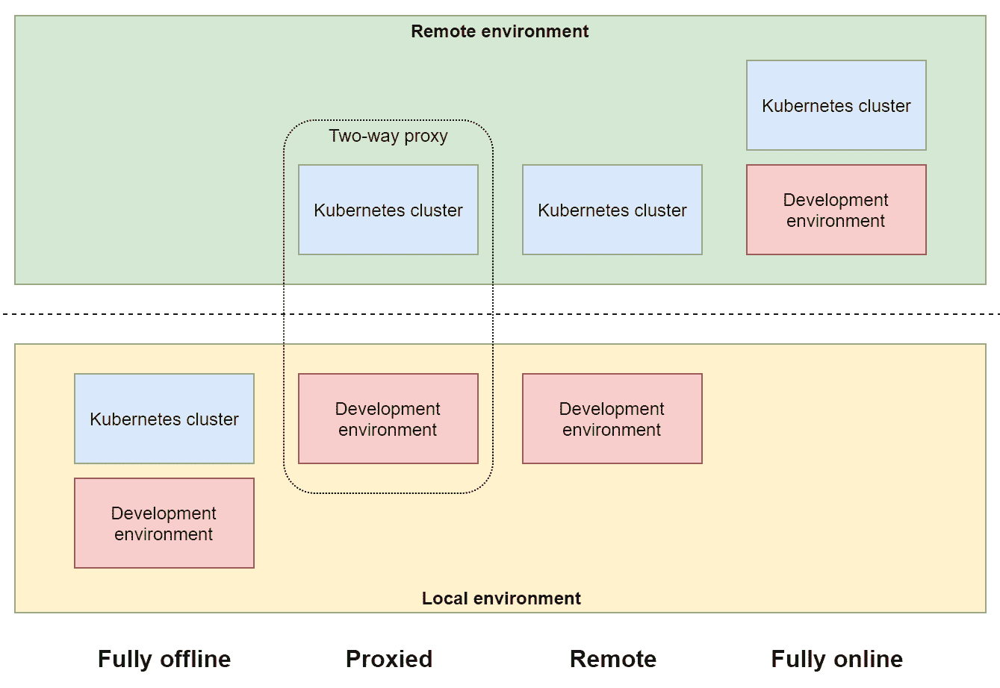
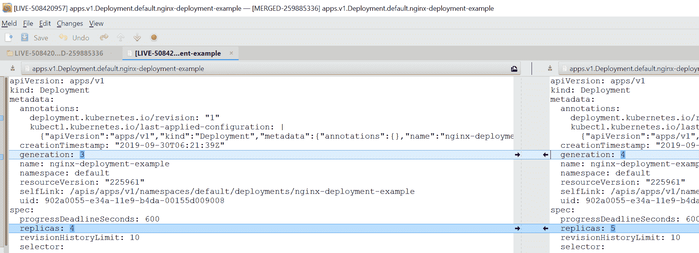

# 第六章：与 Kubernetes 集群交互

作为 Kubernetes 集群的用户或操作员，您需要与 Kubernetes API 交互，以管理 Kubernetes 对象或调试在集群中运行的应用程序。一般来说，有两种方式与 Kubernetes API 通信：您可以直接使用表征状态传输（RESTful）HTTPS 端点，例如用于编程访问，或者您可以使用 kubectl，这是 Kubernetes 命令行工具（或**命令行接口**（**CLI**））。一般来说，kubectl 封装了 RESTful API 通信，并隐藏了有关定位和认证到 Kubernetes API 服务器的复杂性。创建或列出 Kubernetes 对象以及执行 Pod 容器等操作都作为整齐组织的 kubectl 子命令可用-您可以在对集群执行临时操作时使用这些命令，也可以作为应用程序的**持续集成/持续部署**（**CI/CD**）的一部分使用这些命令。

在本章中，我们将为您提供如何在 Windows 机器上安装 kubectl 以及如何使用 kubectl 管理多个 Kubernetes 集群的更好理解。您还将学习管理 Kubernetes 对象和调试容器化应用程序最常见和有用的 kubectl 命令。

本章包括以下主题：

+   安装 Kubernetes 命令行工具

+   访问 Kubernetes 集群

+   使用开发集群

+   查看常见的 kubectl 命令

# 技术要求

本章，您需要安装以下内容：

+   Windows 10 专业版、企业版或教育版（1903 版本或更高版本，64 位）

+   Windows 2.0.0.3 或更高版本的 Docker 桌面版

+   Windows 的 Chocolatey 软件包管理器（[`chocolatey.org/`](https://chocolatey.org/)）

+   Azure CLI

有关 Windows 上 Docker 桌面版的安装和系统要求，请参阅第一章*，*创建容器*。

使用 Chocolatey 软件包管理器并非强制，但它可以使安装过程和应用程序版本管理更加容易。安装过程在此处有文档记录：[`chocolatey.org/install`](https://chocolatey.org/install)。

对于 Azure CLI，您可以在第二章*，*管理容器中的状态**中找到详细的安装说明。

要使用**Azure Kubernetes Service**（**AKS**）进行跟随，您将需要自己的 Azure 帐户和已创建的 AKS 实例。如果您之前没有为前几章创建帐户，您可以在此处阅读有关如何获取个人使用的有限免费帐户的更多信息：[`azure.microsoft.com/en-us/free/`](https://azure.microsoft.com/en-us/free/)。AKS 集群部署在第四章中进行了介绍，*Kubernetes 概念和 Windows 支持*。您还可以在该章节中使用提供的 PowerShell 脚本。

您可以从官方 GitHub 存储库下载本章的最新代码示例：[`github.com/PacktPublishing/Hands-On-Kubernetes-on-Windows/tree/master/Chapter06`](https://github.com/PacktPublishing/Hands-On-Kubernetes-on-Windows/tree/master/Chapter06)。

# 安装 Kubernetes 命令行工具

Kubectl 可在多种操作系统上使用，包括 Windows。如果您在 Linux 上使用 kubectl 有经验，您可以期望唯一的区别是安装过程，命令和基本原则保持不变。对于 Windows，您有几种 kubectl 安装选项，如下所示：

+   直接下载 kubectl 二进制文件。

+   使用 PowerShell Gallery（[`www.powershellgallery.com/`](https://www.powershellgallery.com/)）。

+   使用第三方 Windows 软件包管理器：Chocolatey（[`chocolatey.org/`](https://chocolatey.org/)）或 Scoop（[`scoop.sh/`](https://scoop.sh/)）。

在创建本地开发 Kubernetes 集群时，Docker Desktop for Windows 也可以自动安装 kubectl（可执行文件安装在`C:\Program Files\Docker\Docker\Resources\bin\kubectl.exe`），或者在创建 AKS 集群实例时使用 Azure CLI（使用`az aks install-cli`命令，在`~/.azure-kubectl/kubectl.exe`中安装 kubectl）。这可能会与不同位置已安装的 kubectl 实例产生冲突—您可以始终通过使用`(Get-Command kubectl).Path`命令在 PowerShell 中检查使用哪个 kubectl 安装。切换到不同的 kubectl 安装需要修改`PATH`环境并确保所需的优先级。

您可以在官方文档中找到所有安装类型的详细说明：[`kubernetes.io/docs/tasks/tools/install-kubectl/`](https://kubernetes.io/docs/tasks/tools/install-kubectl/)。我们将演示如何使用 Chocolatey 安装 kubectl，因为这是在 Windows 上安装 kubectl 的最简单和最便捷的方式。按照以下步骤进行操作：

1.  如果您还没有安装 Chocolatey 软件包管理器，您可以在这里找到安装说明：[`chocolatey.org/install`](https://chocolatey.org/install)。

1.  以管理员身份打开 PowerShell 窗口，并使用以下命令安装 kubectl：

```
choco install kubernetes-cli
```

1.  如果您需要将 kubectl 升级到最新版本，请使用以下命令：

```
choco upgrade kubernetes-cli
```

1.  验证 kubectl 是否已安装，例如使用以下命令：

```
kubectl version
```

根据 Kubernetes 版本支持策略，您应该使用一个在 kube-apiserver 的次要版本（较旧或较新）之内的 kubectl 版本。例如，kubectl 1.15 保证可以与 kube-apiserver 1.14、1.15 和 1.16 一起使用。建议您在可能的情况下使用集群的最新 kubectl 版本。

请注意，通过 Chocolatey 安装的 kubectl 版本有时可能比最新的稳定版本要旧。在这种情况下，如果您需要最新的稳定版本，请按照直接下载 kubectl 二进制文件的说明进行操作。

在下一节中，我们将演示如何组织访问多个 Kubernetes 集群。

# 访问 Kubernetes 集群

默认情况下，kubectl 使用位于`~\.kube\config`的`kubeconfig`文件（请注意我们称其为`kubeconfig`，但文件名为`config`），在 Windows 机器上会扩展为`C:\Users\<currentUser>\.kube\config`。这个 YAML 配置文件包含 kubectl 连接到您集群的 Kubernetes API 所需的所有参数。这个配置文件也可以被除 kubectl 之外的其他工具使用，例如*Helm*。

您可以使用`KUBECONFIG`环境变量或`--kubeconfig`标志来强制 kubectl 对个别命令使用不同的`kubeconfig`。对于`KUBECONFIG`环境变量，可以在运行时指定多个`kubeconfig`并合并它们。您可以在官方文档中阅读更多关于此功能的信息：[`kubernetes.io/docs/concepts/configuration/organize-cluster-access-kubeconfig/#merging-kubeconfig-files`](https://kubernetes.io/docs/concepts/configuration/organize-cluster-access-kubeconfig/#merging-kubeconfig-files)。请注意，对于 Windows，您应该用分号分隔`KUBECONFIG`路径，而在 Linux 中，您应该使用冒号。

使用上下文在`kubeconfig`中协调访问多个 Kubernetes 集群。每个上下文包含以下信息：

+   **集群**：Kubernetes API 服务器的地址。

+   **用户**：用户的名称，映射到用户凭据（在`kubeconfig`中指定）。

+   **命名空间**：可选地，您可以提供要使用的默认命名空间。

如果您一直在关注之前的章节，我们演示了 Minikube 的安装和 Windows Docker 桌面上的本地 Kubernetes 集群的安装，您已经使用了在安装这些集群时自动添加的上下文。在使用 kubectl 时，始终有一个上下文标记为当前。您可以使用以下命令查看当前上下文：

```
PS C:\src> kubectl config current-context
minikube
```

列出`kubeconfig`中所有可用的上下文可以通过以下方式完成：

```
PS C:\src> kubectl config get-contexts
CURRENT   NAME                  CLUSTER               AUTHINFO                                                     NAMESPACE
 aks-windows-cluster   aks-windows-cluster   clusterUser_aks-windows-resource-group_aks-windows-cluster
 docker-desktop        docker-desktop        docker-desktop
 docker-for-desktop    docker-desktop        docker-desktop
*         minikube              minikube              minikube
```

如果您想切换到不同的上下文，例如`docker-desktop`，执行以下命令：

```
PS C:\src> kubectl config use-context docker-desktop
Switched to context "docker-desktop".
```

您可以从命令行手动修改现有上下文或添加自己的上下文。例如，以下命令将添加一个新的上下文`docker-desktop-kube-system`，它将连接到`docker-desktop`集群并默认使用`kube-system`命名空间。

```
kubectl config set-context docker-desktop-kube-system `
 --cluster docker-desktop `
 --user docker-desktop `
 --namespace kube-system
```

当您切换到新的上下文并运行任何命令时，例如`kubectl get pods`，它将针对`kube-system`命名空间执行。

在任何给定时间，您可以使用 kubectl 命令的`--cluster`、`--user`、`--namespace`甚至`--context`标志来覆盖当前上下文设置。

通常，在使用托管的 Kubernetes 提供程序或本地开发工具时，配置文件将作为一个单独的文件提供，通过`KUBECONFIG`环境变量进行下载和使用，或者直接合并到当前的`kubeconfig`中作为一个新的上下文（这就是在 AKS 的情况下`az aks get-credentials`命令所做的）。如果需要，您可以使用以下 PowerShell 命令手动合并`kubeconfigs`：

```
$env:KUBECONFIG="c:\path\to\config;~\.kube\config"
kubectl config view --raw
```

该命令的输出可以作为一个新的默认`kubeconfig`使用——在覆盖默认配置文件之前，您应该验证结果是否有效。您可以使用以下代码片段将默认的`kubeconfig`覆盖为合并后的配置：

```
$env:KUBECONFIG="c:\path\to\config;~\.kube\config"
kubectl config view --raw > ~\.kube\config_new
Move-Item -Force ~\.kube\config_new ~\.kube\config
```

请记住`kubeconfig`合并优先规则：如果在两个文件中找到相同的键，则第一个文件中的值将获胜。

现在您知道如何使用 kubeconfig 和 kubectl 上下文来管理对 Kubernetes 集群的访问权限，让我们专注于使用开发集群的策略。

# 使用开发集群

为 Kubernetes 开发应用程序引入了一些在传统开发流水线中不存在的独特挑战。完美的解决方案将是对流水线和流程进行最小的更改，但不幸的是，事情并不像那么简单。首先，您需要维护一个开发 Kubernetes 集群，用于部署、测试和调试您的应用程序。其次，您必须将应用程序容器化并部署到开发集群，可能比在安全的生产集群中具有更大的灵活性和访问权限。

非正式地，对于 Kubernetes 应用程序开发，您有四种模式（概念），如下图所示：



让我们来看看这四种模式：

+   **完全脱机**：在完全脱机（本地）环境中，您的开发环境和 Kubernetes 集群托管在本地机器上。这种配置的一个很好的例子是 Minikube 或 Windows 本地 Kubernetes 集群的 Docker 桌面。在这两种情况下，Kubernetes 集群托管在专用的本地虚拟机（VM）中。这种开发工作流程需要构建 Docker 镜像，将它们推送到镜像注册表（本地或远程），并使用 kubectl 部署应用程序。当然，您可以利用集群在本地运行的事实，登录到集群节点并调试 Pod 容器。从 Windows 容器的角度来看，这需要在 Hyper-V VM 上运行完整的混合 Linux/Windows Kubernetes 集群。这种设置需要一台能够运行至少两个 VM 的本地机器：一个用于 Linux 主节点，一个用于 Windows 工作节点。我们将在第七章中部署一个完全功能的混合集群，*部署混合本地 Kubernetes 集群*。

下一章介绍的部署策略可以用于开发和生产集群。这种方法在开发中的缺点是与 Minikube 或其他完全脱机解决方案相比需要大量配置。不幸的是，目前还没有针对混合开发集群的易用的即插即用解决方案 - 如果您需要尽快为开发创建集群，完全托管的 AKS 是最佳选择。

+   **代理**：在使用代理环境时，您的 Kubernetes 集群托管在远程机器上（但也可以托管在本地 VM 上！）。开发环境仍然在您的本地机器上，但您配置了双向网络代理，以便您可以运行和调试应用程序，就好像您在集群中的 Pod 内部一样。换句话说，您可以简化开发工作流程，并跳过开发和调试场景的 Docker 开销。这可以通过使用诸如 Telepresence（[`www.telepresence.io/`](https://www.telepresence.io/)）之类的工具来实现。不幸的是，目前仅通过 Windows 子系统支持 Windows，这意味着没有本机 Windows 支持。

+   远程：下一个模式是远程模式，您可以在本地针对远程集群进行开发，这些集群可以托管在您的本地数据中心或作为托管的 Kubernetes 提供。这类似于在完全脱机环境中使用，但您必须注意使用托管 Kubernetes 集群的额外成本以及对 Kubernetes 节点的有限访问。对于 Windows，如果您正在运行 AKS，您将无法登录到 Linux 主节点，但如果您使用裸 Azure VM 上的 AKS 引擎进行部署，您可以访问 Linux 主节点和 Windows 节点。这种环境类型的优势在于您可以利用 Kubernetes 的所有云集成，例如负载均衡器服务或云卷。我们将在第八章中介绍 AKS 引擎部署，*部署混合 Azure Kubernetes 服务集群*。

+   完全在线：在完全在线模式下，您的开发环境与 Kubernetes 集群一起远程托管。这种方法的良好示例是 Eclipse Che ([`www.eclipse.org/che/docs/`](https://www.eclipse.org/che/docs/))和 Azure Dev Spaces ([`docs.microsoft.com/en-us/azure/dev-spaces/about`](https://docs.microsoft.com/en-us/azure/dev-spaces/about))，它与 Visual Studio Code 完全集成。在这一点上，对 Windows 节点的支持仍在开发中，并且需要手动配置([`docs.microsoft.com/en-us/azure/dev-spaces/how-to/run-dev-spaces-windows-containers`](https://docs.microsoft.com/en-us/azure/dev-spaces/how-to/run-dev-spaces-windows-containers))。将来，这是为 Windows 容器提供无缝 Kubernetes 开发生命周期的最佳选择。我们将在第十二章中介绍 Azure Dev Spaces，*Kubernetes 开发工作流程*。

有许多工具可以提高您的 Kubernetes 应用程序开发效率，并减少在“一切中间又有一个集群”的开销。例如，对于 Windows 支持，您可能希望查看 Azure Draft ([`draft.sh/`](https://draft.sh/))，它可以使用为您的应用程序自动生成的 Helm 图表简化开发流程，或者 ksync ([`ksync.github.io/ksync/`](https://ksync.github.io/ksync/))，它可用于将本地代码/二进制更改同步到 Pod 容器，无需重新部署。

在下一节中，我们将快速浏览一下您应该掌握的最常见和有用的 kubectl 命令。

# 查看常见的 kubectl 命令

Kubectl 是一个强大的工具，当与 Kubernetes 集群交互时，它提供了您所需的大部分功能。所有 kubectl 命令都遵循相同的语法，如下面的代码片段所示：

```
**kubectl [command] [type] [name] [flags]**

**# Example:**
**kubectl get service kube-dns --namespace kube-system** 
```

`[命令]`、`[类型]`、`[名称]`和`[标志]`的定义如下：

+   `[命令]`指定操作，例如`get`、`apply`、`delete`。

+   `[类型]`是资源类型（详细列表可以在文档中找到：[`kubernetes.io/docs/reference/kubectl/overview/#resource-types`](https://kubernetes.io/docs/reference/kubectl/overview/#resource-types)），以单数、复数或缩写形式（不区分大小写）指定，例如，`service`、`services`、`svc`。您可以使用`kubectl explain [type]`命令找到有关每个资源的更多信息。

+   `[名称]`确定资源的名称（区分大小写）。如果命令允许省略名称，则操作将应用于给定类型的所有资源。

+   `[标志]` 指定了额外的标志，这些标志可以是特定于命令的，也可以是全局的 kubectl 命令，例如，`--namespace kube-system`。

您可以随时使用`kubectl help`或`kubectl [command] --help`来访问关于每个命令如何工作以及可用标志的全面文档。kubectl 的官方参考资料可以在这里找到：[`kubernetes.io/docs/reference/generated/kubectl/kubectl-commands`](https://kubernetes.io/docs/reference/generated/kubectl/kubectl-commands)。

术语*资源*和*对象*在 Kubernetes 中经常可以互换使用，尽管在考虑 Kubernetes 内部时存在一些差异。对象是 Kubernetes 系统实体（抽象概念），而资源是提供对象表示的实际 RESTful API 资源。

一些命令，如 `get` 或 `create`，允许您使用 `-o` 或 `--output` 标志指定输出格式。例如，您可以使用 `-o json` 强制使用 JSON 输出格式，或者使用 `-o jsonpath=<template>` 使用 JSONPath 模板提取信息。这在基于 kubectl 命令实施自动化时特别有用。您可以在这里找到有关输出类型的更多信息：[`kubernetes.io/docs/reference/kubectl/overview/#output-options`](https://kubernetes.io/docs/reference/kubectl/overview/#output-options)。

对于 *Bash* 和 *Zsh*，您可以通过使用自动补全（[`kubernetes.io/docs/tasks/tools/install-kubectl/#enabling-shell-autocompletion`](https://kubernetes.io/docs/tasks/tools/install-kubectl/#enabling-shell-autocompletion)）来提高 kubectl 的生产力。对于 Windows，PowerShell 尚不支持自动补全，但是，如果您使用 Windows Subsystem for Linux 管理 Kubernetes 集群，也可以安装 Bash 自动补全。

# 创建资源

在第四章中，*Kubernetes 概念和 Windows 支持*，我们已经解释了 Kubernetes 中 *命令式* 和 *声明式* 资源管理背后的思想。简而言之，在使用命令式管理时，您依赖于创建、删除和替换资源的命令（可以将其视为脚本中的命令）。另一方面，在声明式管理中，您只描述资源的期望状态，Kubernetes 将执行所有必需的操作，以将资源的当前状态转换为期望状态。

以命令式方式在 Kubernetes 中创建资源可以使用 `kubectl create -f <manifestFile>` 命令。对于声明式方式，您必须使用 `kubectl apply -f <manifestFile>`。请注意，您可以应用 `-R` 标志并递归处理目录而不是单个文件。让我们在 Linux nginx Pods 的示例部署清单文件上演示这一点，您可以从本书的 GitHub 存储库下载：[`github.com/PacktPublishing/Hands-On-Kubernetes-on-Windows/blob/master/Chapter06/01_deployment-example/nginx-deployment.yaml`](https://github.com/PacktPublishing/Hands-On-Kubernetes-on-Windows/blob/master/Chapter06/01_deployment-example/nginx-deployment.yaml)。

假设您将清单文件保存为 `nginx-deployment.yaml` 在当前目录中，使用 PowerShell 执行以下命令来创建 `nginx-deployment-example` 部署：

```
kubectl create -f .\nginx-deployment.yaml
```

您可以直接在 kubectl 中使用清单文件的 URL-例如，`kubectl create -f https://raw.githubusercontent.com/PacktPublishing/Hands-On-Kubernetes-on-Windows/master/Chapter06/01_deployment-example/nginx-deployment.yaml`。在将其部署到集群之前，请始终验证清单文件的内容，特别是从安全角度考虑。

您可以使用`kubectl apply`命令来实现相同的效果，如下所示：

```
kubectl apply -f .\nginx-deployment.yaml
```

在这一点上，这些命令的行为方式相同：它们只是创建 Deployment。但是现在，如果您修改`nginx-deployment.yaml`文件，以便将副本的数量增加到 4，请检查`kubectl create`和`kubectl apply`命令的结果：

```
PS C:\src> kubectl create -f .\nginx-deployment.yaml
Error from server (AlreadyExists): error when creating ".\\nginx-deployment.yaml": deployments.apps "nginx-deployment-example" already exists

PS C:\src> kubectl apply -f .\nginx-deployment.yaml
deployment.apps/nginx-deployment-example configured
```

由于已经创建了 Deployment，因此无法通过命令方式创建它-您需要替换它。在声明性的`apply`命令的情况下，更改已被接受，并且现有的 Deployment 已被扩展为 4 个副本。

对于声明性管理，kubectl 提供了`kubectl diff`命令，该命令显示了集群中资源的当前状态与清单文件中资源的差异。请注意，您需要在`PATH`环境变量中拥有`diff`工具，或者使用任何其他文件比较工具-例如 Meld ([`meldmerge.org/`](http://meldmerge.org/))，并使用`KUBECTL_EXTERNAL_DIFF`环境变量指定它。将`nginx-deployment.yaml`中的`replicas`数量增加到 5，并检查比较结果，如下所示：

```
$env:KUBECTL_EXTERNAL_DIFF="meld"
kubectl diff -f .\nginx-deployment.yaml
```

您可以立即在以下截图中看到，如果执行`kubectl apply`，将受到影响的属性：



一个经验法则是，尽可能坚持使用声明性资源管理，只将命令留给开发/黑客场景。对于 Kubernetes 应用程序的完全声明性管理，请考虑使用带有 Kustomize 的 kubectl。您可以在以下链接了解更多关于这种方法的信息：[`kubernetes.io/docs/tasks/manage-kubernetes-objects/kustomization/`](https://kubernetes.io/docs/tasks/manage-kubernetes-objects/kustomization/)。

# 删除资源

为了删除资源，您可以使用`kubectl delete [type] [name]`命令。这也是仍然建议在声明性集群管理中使用的命令之一，因为它更明确。使用带有`--prune`标志的`kubectl apply`更危险，因为您可能会意外删除更多资源。

使用以下命令删除`nginx-deployment-example`部署：

```
kubectl delete deployment nginx-deployment-example
```

如果您想删除给定类型的所有资源，可以使用`--all`标志而不是资源名称。

# 描述和列出资源

下一个你经常会使用的命令是`kubectl get [type] [name]`，它显示给定类型的资源的详细信息。例如，为了列出当前上下文中默认命名空间中的 Pods，执行以下命令：

```
kubectl get pods
```

您可以使用`--all-namespaces`或`--namespace=<namespace>`全局标志，允许您显示来自其他命名空间的资源，如下面的代码片段所示：

```
kubectl get pods --all-namespaces
```

默认情况下，这个命令显示有限的预定义列。您可以使用`-o wide`标志来查看更多细节，如下所示：

```
kubectl get pods -o wide
```

在某些情况下，您会发现观察资源很有用。以下命令列出所有 Pods，并定期刷新视图以获取最新数据：

```
kubectl get pods --watch
```

还有一个不同的命令，`kubectl describe`，它可以用于显示资源的详细信息，如下面的代码片段所示：

```
kubectl describe pod nginx-deployment-example-7f5cfc59d6-2bvvx
```

`get`和`describe`命令的区别在于，`get`显示来自 Kubernetes API 的资源的纯表示，而`describe`准备了一个包括事件、控制器和其他资源在内的详细描述。

`kubectl get`支持不同于表格的输出，例如，`-o json`或`-o yaml`，这对于与其他工具集成或将资源状态转储到文件非常有用，如下面的代码片段所示：

```
kubectl get pod nginx-deployment-example-7f5cfc59d6-2bvvx -o yaml
```

如果你需要对输出进行更多处理，你可以使用 JSONPath ([`github.com/json-path/JsonPath`](https://github.com/json-path/JsonPath))，它集成到 kubectl 中。例如，以下表达式将列出集群中 Pods 中使用的所有容器镜像：

```
kubectl get pods --all-namespaces -o jsonpath="{.items[*].spec.containers[*].image}"
```

最后，您可能会发现使用单个命令列出所有命名空间中的所有资源很有用，如下所示：

```
kubectl get all --all-namespaces
```

这应该总是给你一个集群中正在发生的事情的很好的概述！

# 编辑资源

如本节前面提到的，通常不鼓励对 Kubernetes 资源进行命令式编辑。`kubectl edit` 是 `kubectl get`、打开您喜欢的文本编辑器和对修改后的清单文件进行 `kubectl apply` 的组合，如下面的代码块所示：

```
kubectl edit deployment nginx-deployment-example
```

在 Windows 机器上，此命令将打开 `notepad.exe`（或任何其他编辑器，如果您指定了 `EDITOR` 或 `KUBE_EDITOR` 环境变量），显示 `nginx-deployment-example` 的当前状态。编辑后，保存文件，关闭编辑器，您的更改将被应用。

另一种方法是使用补丁，可以在声明式管理中使用。`kubectl patch` 通过合并当前资源状态和仅包含修改属性的补丁来更新资源。修补的常见用例是在混合 Linux/Windows 集群中需要强制执行现有 DaemonSet 的节点选择器时。以下 JSON 补丁可用于确保诸如 Flannel 或 kube-proxy 的 DaemonSet 仅在 Linux 节点上运行：

```
{
    "spec": {
        "template": {
            "spec": {
                "nodeSelector": {
                    "beta.kubernetes.io/os": "linux"
                }
            }
        }
    }
}
```

也可以使用 YAML 补丁，但不幸的是，由于 PowerShell 转义规则，我们无法为 `beta.kubernetes.io/os` 选择器演示这一点。在 PowerShell 中，JSON 仍然需要额外的预处理。

为了将此补丁应用到 `nginx-deployment-example` 部署中，将补丁保存为 `linux-node-selector.json` 文件，并运行以下命令：

```
$patch = $(cat .\linux-node-selector.json)
$patch = $patch.replace('"', '\"')
kubectl patch deployment nginx-deployment-example --patch "$patch"
```

您可以在官方文档中找到有关资源修补和合并类型的更多信息：[`kubernetes.io/docs/tasks/run-application/update-api-object-kubectl-patch/`](https://kubernetes.io/docs/tasks/run-application/update-api-object-kubectl-patch/)。

# 运行临时 Pod

在调试场景中，您可能会发现运行临时 Pod 并附加到它很有用。您可以使用 `kubectl run` 命令执行此操作——请注意，此命令可以生成不同的资源，但除了 Pod 之外，所有生成器都已被弃用。以下代码段将创建一个带有一个 `busybox` 容器的 `busybox-debug` Pod，并在容器中运行一个交互式 Bourne shell 会话：

```
kubectl run --generator=run-pod/v1 busybox-debug -i --tty --image=busybox --rm --restart=Never -- sh
```

当 shell 提示符出现时，您可以在集群内执行操作，例如对内部 IP 进行 ping。退出 shell 后，容器将被自动删除。

您可以使用类似的方法为 Windows 节点创建交互式 PowerShell Pod。

# 访问 Pod 容器日志

在调试在 Kubernetes 上运行的应用程序时，容器日志提供了关键信息。您可以使用`kubectl logs`命令访问 Pod 容器日志，类似于您为 Docker CLI 所做的操作，如下所示：

```
kubectl logs etcd-docker-desktop -n kube-system
```

如果 Pod 只运行一个容器，这将起作用。如果 Pod 由多个容器组成，您需要使用`--container`或`--all-containers`标志。

此外，您可能希望尾随日志的`n`行（`--tail=n`标志）并启用日志的实时流（`--follow`标志），如下面的代码片段所示：

```
kubectl logs etcd-docker-desktop -n kube-system --tail=10 --follow
```

# 进入 Pod 容器

在调试在 Kubernetes 上运行的应用程序时，您可以像裸 Docker 容器一样`exec`到运行在 Pod 中的容器。例如，要列出容器当前工作目录中的所有文件，请使用以下`kubectl exec`命令：

```
kubectl exec nginx-deployment-example-5997d7d5fb-p9fbn -- ls -al
```

也可以附加交互式终端并运行 Bash 会话，如下所示：

```
kubectl exec nginx-deployment-example-5997d7d5fb-p9fbn -it bash
```

对于多容器 Pod，您必须使用`--container`标志，否则将选择 Pod 中的第一个容器。

# 复制 Pod 容器文件

Kubectl 为您提供了在您的计算机和 Pod 容器之间复制文件的可能性（双向），类似于 Docker CLI。例如，要将`/var/log/dpkg.log`文件从运行在`nginx-deployment-example-5997d7d5fb-p9fbn` Pod 中的容器复制到当前目录，请执行以下`kubectl cp`命令：

```
kubectl cp nginx-deployment-example-5997d7d5fb-p9fbn:/var/log/dpkg.log dpkg.log
```

一般来说，如果您将 Pod 容器用作源或目的地，您需要指定 Pod 名称和容器文件系统路径，用冒号（`:`）分隔。对于其他命令，如果 Pod 运行多个容器，您需要使用`--container`标志，否则将选择第一个容器。

# 端口转发和代理流量

Kubectl 可以充当访问您的 Kubernetes 集群的简单代理。如果需要直接从本地计算机通信到 Pod 上的特定端口，可以使用端口转发到 Pod。这可以通过使用`kubectl port-forward`命令来实现，而无需手动暴露服务对象。该命令可用于将流量转发到基于其他对象选择器自动选择的 Pod，例如 Deployment，如下所示：

```
kubectl port-forward deployment/nginx-deployment-example 7000:80
```

此命令将所有流量从本地计算机端口`7000`转发到`nginx-deployment-example` Deployment 中一个 Pod 的端口`80`。转到`http://localhost:7000`以验证默认的 nginx 页面是否可访问。完成后终止端口转发命令。

此外，kubectl 可以为您的本地机器提供访问 Kubernetes API 服务器的权限。使用`kubectl proxy`命令将 API 暴露在端口`8080`上，如下所示：

```
kubectl proxy --port=8080
```

现在，当您在浏览器中导航到`http://localhost:8080/api/v1/namespaces/default/pods`时，您将看到当前在集群中运行的 Pod 对象。恭喜您成功设置了 kubectl 端口转发！

# 摘要

在本章中，您已经学会了如何安装和使用 Kubernetes 命令行工具 kubectl。我们已经介绍了如何使用 kubectl 上下文来组织访问多个 Kubernetes 集群，以及处理开发集群的可能策略以及它们如何适用于 Windows 集群。除此之外，您现在还了解了基本的 kubectl 命令以及一些用于调试在 Kubernetes 上运行的应用程序的技术：运行临时 Pod、访问 Pod 容器日志、执行 Pod 容器内部的 exec 操作，以及在本地机器和 Pod 容器之间复制文件的几种技巧。

下一章将重点介绍在本地场景中部署混合 Linux/Windows Kubernetes 集群。我们将演示如何使用 Hyper-V VM 在本地机器上创建一个完全功能的多节点集群。

# 问题

1.  `kubeconfig`是什么？

1.  您如何为 kubectl 设置自定义的`kubeconfig`位置？

1.  kubectl 中上下文的作用是什么？

1.  `kubectl create`和`kubectl apply`命令有什么区别？

1.  什么是 kubectl 资源补丁，以及何时使用它？

1.  从 Pod 容器中显示实时日志的命令是什么？

1.  您如何使用 kubectl 在本地机器和 Pod 容器之间复制文件？

您可以在本书的*评估*部分找到这些问题的答案。

# 进一步阅读

+   有关 Kubernetes 概念和 Kubernetes CLI 的更多信息，请参阅以下 Packt 图书：

+   *完整的 Kubernetes 指南* ([`www.packtpub.com/virtualization-and-cloud/complete-kubernetes-guide`](https://www.packtpub.com/virtualization-and-cloud/complete-kubernetes-guide))

+   *开始学习 Kubernetes-第三版* ([`www.packtpub.com/virtualization-and-cloud/getting-started-kubernetes-third-edition`](https://www.packtpub.com/virtualization-and-cloud/getting-started-kubernetes-third-edition))

+   *面向开发人员的 Kubernetes* ([`www.packtpub.com/virtualization-and-cloud/kubernetes-developers`](https://www.packtpub.com/virtualization-and-cloud/kubernetes-developers))

+   您还可以参考优秀的官方 Kubernetes 文档（[`kubernetes.io/docs/home/`](https://kubernetes.io/docs/home/)）和 kubectl 参考文档（[`kubernetes.io/docs/reference/generated/kubectl/kubectl-commands`](https://kubernetes.io/docs/reference/generated/kubectl/kubectl-commands)）。
