# 部署混合本地 Kubernetes 集群

在之前的章节中，我们更多地从理论角度关注了 Docker 和 Kubernetes 的概念，现在是时候利用这些知识并从头开始部署一个 Kubernetes 集群了。本章的目标是在本地环境中拥有一个功能齐全的混合 Windows/Linux Kubernetes 集群。

根据您的需求，您可以使用这种方法创建一个最小化的本地开发集群（一个充当主节点的 Linux 虚拟机（VM）和一个充当节点的 Windows VM），或者部署一个具有 Linux 和 Windows 节点的生产级本地集群。您不仅限于 Hyper-V 集群——只要设置了适当的网络并且机器能够运行容器化工作负载，这种方法就可以用于裸机、VMware 集群或在云中运行的 VM。使用 kubeadm 创建 Kubernetes 集群可以让您灵活地在任何地方部署集群，只要设置了适当的网络并且机器能够运行容器化工作负载。

我们还建议使用 kubeadm，因为它是一个低级工具，可以深入了解集群的实际创建过程。在未来，您可以期待基于 kubeadm 构建的其他解决方案（如 Kubespray），支持混合集群。但即使如此，仍建议尝试纯 kubeadm 方法来学习 Kubernetes 集群部署的基本步骤。

本章涵盖以下主题：

+   准备 Hyper-V 环境

+   使用 kubeadm 创建 Kubernetes 主节点

+   安装 Kubernetes 网络

+   为 Windows 节点准备虚拟机

+   使用 kubeadm 加入 Windows 节点

+   部署和检查您的第一个应用程序

# 技术要求

对于本章，您将需要以下内容：

+   Windows 10 专业版、企业版或教育版（1903 版本或更高版本，64 位）；至少 16GB RAM 的 Hyper-V 主机（如果选择不安装 Windows Server 和 Ubuntu Server VMs 的桌面体验，则可能更少）。您可以使用任何其他具有 Hyper-V 功能的 Windows 或 Windows Server 版本。对于 Hyper-V，需要在基本输入/输出系统（BIOS）中启用英特尔虚拟化技术（Intel VT）或 AMD 虚拟化（AMD-V）技术功能。

注意：Windows 10 家庭版不能用作 Hyper-V 主机。

+   Linux 主节点 VM 需要至少 15GB 磁盘空间，每个 Windows 节点 VM 需要至少 30GB 磁盘空间。

+   Ubuntu Server 18.04 **长期支持** (**LTS**) **国际标准化组织** (**ISO**) ([`releases.ubuntu.com/18.04.3/ubuntu-18.04.3-live-server-amd64.iso`](http://releases.ubuntu.com/18.04.3/ubuntu-18.04.3-live-server-amd64.iso))。

+   Windows Server 2019 (**长期服务渠道** (**LTSC**), 可用桌面体验) ISO 或 Windows Server 1903 (**半年频道** (**SAC**), 无桌面体验) ISO。您应该查看[`kubernetes.io/docs/setup/production-environment/windows/intro-windows-in-kubernetes/`](https://kubernetes.io/docs/setup/production-environment/windows/intro-windows-in-kubernetes/)，了解有关当前 Windows Server 版本的最新建议。您可以从 Microsoft 评估中心获取评估 ISO([`www.microsoft.com/en-us/evalcenter/evaluate-windows-server-2019`](https://www.microsoft.com/en-us/evalcenter/evaluate-windows-server-2019))，或者，如果您有 Visual Studio 订阅([`my.visualstudio.com/Downloads/Featured`](https://my.visualstudio.com/Downloads/Featured))，您可以下载用于开发和测试目的的 ISO。

+   Kubectl 已安装-安装过程已在第六章中介绍过，*与 Kubernetes 集群交互*。

您可以从官方 GitHub 存储库下载本章的最新代码示例：[`github.com/PacktPublishing/Hands-On-Kubernetes-on-Windows/tree/master/Chapter07`](https://github.com/PacktPublishing/Hands-On-Kubernetes-on-Windows/tree/master/Chapter07)。

# 准备 Hyper-V 环境

集群部署的第一步是为 Kubernetes 主节点和节点 VM 准备 Hyper-V 主机。

如果您选择使用不同的 hypervisor 或裸机，可以跳过本节。

现在，如果您在之前的章节中已在您的计算机上安装了 Windows 的 Docker Desktop，那么 Hyper-V 已启用和配置。您只需要创建一个内部**网络地址转换** (**NAT**)或外部 Hyper-V **虚拟交换机** (**vSwitch**)，然后您就可以开始了。

以下图表显示了我们将在本章中部署的集群设计。请记住，主节点*不*配置为**高可用性**（**HA**）- HA 设置与 Windows 容器的支持无关，您可以在准备 Linux 主节点时执行它，根据官方文档（[`kubernetes.io/docs/setup/production-environment/tools/kubeadm/high-availability/`](https://kubernetes.io/docs/setup/production-environment/tools/kubeadm/high-availability/)）：

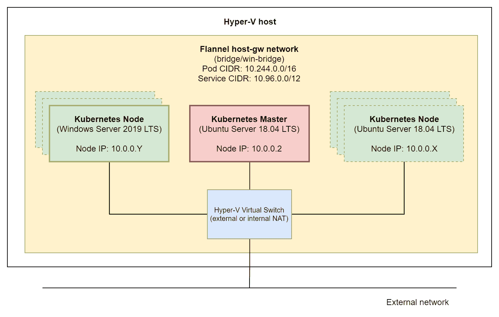

最小部署是一个 Ubuntu Server 18.04 LTS Kubernetes 主节点（具有调度应用程序 Pod 的可能性）和一个 Windows Server 2019 LTS Kubernetes 节点。可选地，您可以决定部署更多的 Windows 和 Linux 节点（在图表中用虚线标记），按照相同的说明或克隆 VM。

# 启用 Hyper-V

首先，让我们启用 Hyper-V 功能，如果您之前没有启用它，如下所示：

1.  以管理员身份打开 PowerShell 窗口。

1.  执行以下命令以启用 Hyper-V 功能：

```
Enable-WindowsOptionalFeature -Online -FeatureName  Microsoft-Hyper-V -All
```

1.  重新启动计算机。

如果您正在使用 Windows Server 作为您的 Hyper-V 主机，可以在官方文档中找到启用 Hyper-V 角色的说明：[`docs.microsoft.com/en-us/windows-server/virtualization/hyper-v/get-started/install-the-hyper-v-role-on-windows-server`](https://docs.microsoft.com/en-us/windows-server/virtualization/hyper-v/get-started/install-the-hyper-v-role-on-windows-server)。

现在，根据您的网络设置，您必须创建一个适当的 Hyper-V vSwitch。您有两个选项：

1.  **内部 NAT Hyper-V vSwitch**：如果您计划仅将集群用于本地开发，请使用此选项。任何外部入站通信（除了您的 Hyper-V 主机机器）都将需要 NAT。在大多数情况下，此选项适用于简单的 Windows 10 开发设置，因为您连接到不允许您自行管理**动态主机配置协议**（**DHCP**）和**域名系统**（**DNS**）的外部网络（以太网或 Wi-Fi）。换句话说，如果您使用外部 vSwitch，您将得到节点的不可预测的 IP 地址分配。没有 DNS，您将无法确保适当的 Kubernetes 集群连接。

1.  **外部 Hyper-V vSwitch**：如果您的网络有一个 DHCP 和 DNS 服务器，您（或网络管理员）可以管理，那么请使用此选项。这在大多数生产部署中都是这样。然后，您需要为 VM 分配适当的**媒体访问控制**（**MAC**）地址，以便获得所需的 IP 地址。

我们将遵循网络的默认网关为`10.0.0.1`，主节点的 IP 地址为`10.0.0.2`，节点具有连续的 IP 地址`10.0.0.X`的约定。

# 创建内部 NAT Hyper-V vSwitch

为了创建内部 NAT vSwitch，请执行以下步骤：

1.  以管理员身份打开 PowerShell 窗口。

1.  执行以下命令创建名为`Kubernetes NAT Switch`的内部 vSwitch：

```
New-VMSwitch -SwitchName "Kubernetes NAT Switch" -SwitchType Internal
```

1.  找到您刚刚创建的 vSwitch 的`ifIndex`。`ifIndex`将需要用于 NAT 网关的创建。您可以通过运行以下命令来执行此操作：

```
Get-NetAdapter
```

以下截图显示了上述命令的输出：

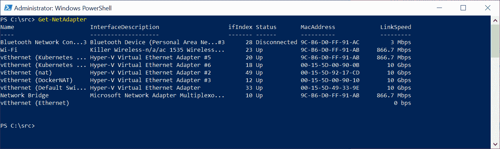

1.  配置 NAT 网关，如下所示：

```
New-NetIPAddress -IPAddress 10.0.0.1 -PrefixLength 8 -InterfaceIndex <ifIndex>
```

1.  创建新的 NAT 网络`Kubernetes NAT Network`，如下所示：

```
New-NetNAT -Name "Kubernetes NAT Network" -InternalIPInterfaceAddressPrefix 10.0.0.0/8
```

如果您使用内部 NAT vSwitch，则必须为每个 VM 提供静态 IP 地址、网关 IP 地址和 DNS 服务器信息。静态 IP 地址必须在 NAT 内部前缀范围内。

请注意，目前您的系统中只能有一个自定义内部 NAT vSwitch。您可以在官方文档中阅读更多信息：[`docs.microsoft.com/en-us/virtualization/hyper-v-on-windows/user-guide/setup-nat-network`](https://docs.microsoft.com/en-us/virtualization/hyper-v-on-windows/user-guide/setup-nat-network)。

# 创建外部 Hyper-V vSwitch

或者，为了创建外部 vSwitch，请执行以下步骤：

1.  使用“开始”菜单启动 Hyper-V 管理器。

1.  从“操作”选项卡中单击“虚拟交换机管理器…”，选择“外部”，然后单击“创建虚拟交换机”。

1.  使用名称`Kubernetes External Switch`，并选择用于连接到互联网的网络适配器，例如您的 Wi-Fi 适配器，如下截图所示：

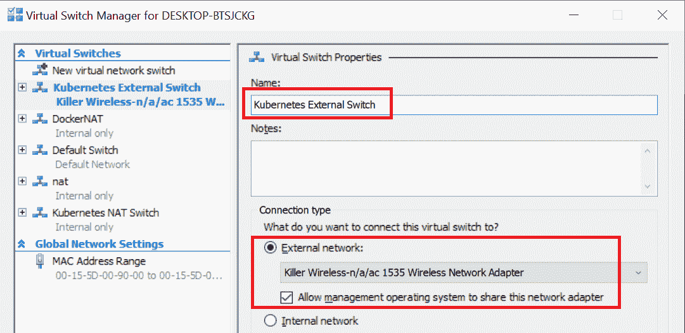

1.  单击“确定”以接受更改。

现在，Hyper-V 环境准备就绪，您可以继续下一步——在运行 Ubuntu Server 18.04 LTS VM 上创建 Kubernetes 主节点。

# 使用 kubeadm 创建 Kubernetes 主节点

对于混合 Windows/Linux Kubernetes 集群，您需要部署一个 Linux 主节点——这一步与仅 Linux 的 Kubernetes 集群几乎相同，并且您可以使用任何支持的操作系统来完成此目的。我们选择了 Ubuntu 服务器 18.04 LTS，因为它得到了广泛的支持（官方和社区支持），具有简单的安装过程，并且易于管理。

本章的说明重点是将 Windows 节点添加到 Kubernetes 集群。主节点的准备步骤很少。如果您在本地机器上部署开发集群，使用 kubeadm 在集群中部署单个控制平面就足够了。对于生产部署，您应该考虑部署一个 HA 主节点配置。您可以在以下网址了解有关 HA 和 kubeadm 的更多信息：[`kubernetes.io/docs/setup/production-environment/tools/kubeadm/high-availability/`](https://kubernetes.io/docs/setup/production-environment/tools/kubeadm/high-availability/)。

如果您还没有下载 Ubuntu 服务器 18.04 LTS 的 ISO 镜像，官方镜像可以在以下网址找到：[`releases.ubuntu.com/18.04.3/ubuntu-18.04.3-live-server-amd64.iso`](http://releases.ubuntu.com/18.04.3/ubuntu-18.04.3-live-server-amd64.iso)。

# 创建虚拟机并安装 Ubuntu 服务器

本小节将指导您完成以下步骤，以准备一个带有 Ubuntu 服务器的新虚拟机：

1.  创建虚拟机

1.  安装 Ubuntu 服务器

1.  配置网络

1.  安装用于与 Hyper-V 集成的额外软件包

1.  建立一个无密码的安全外壳（SSH）登录

# 创建虚拟机

首先，您需要创建一个将用作主节点的虚拟机，运行 Ubuntu 服务器 18.04。要做到这一点，打开 Hyper-V 管理器应用程序，并执行以下步骤：

1.  从“操作”菜单中，选择“新建”，然后点击“虚拟机”。

1.  点击“下一步”，为主节点虚拟机选择一个名称。我们将用`Kubernetes Master`来命名。可选地，配置一个自定义目录来存储虚拟机数据，以确保有足够的磁盘空间来托管虚拟机，如下截图所示：

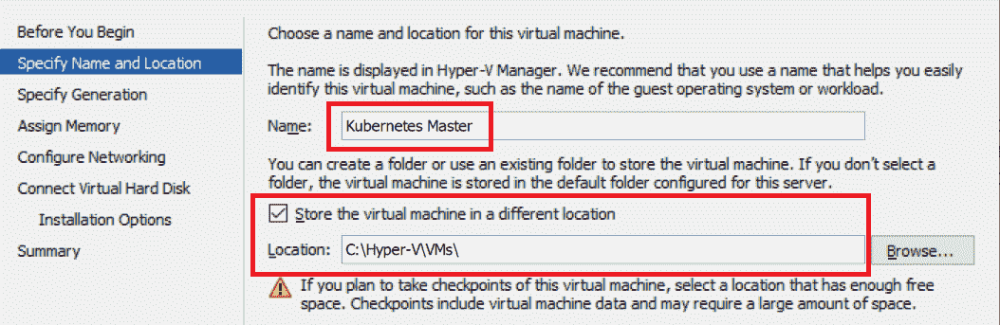

1.  在下一个对话框中，选择第 2 代并继续，如下截图所示：

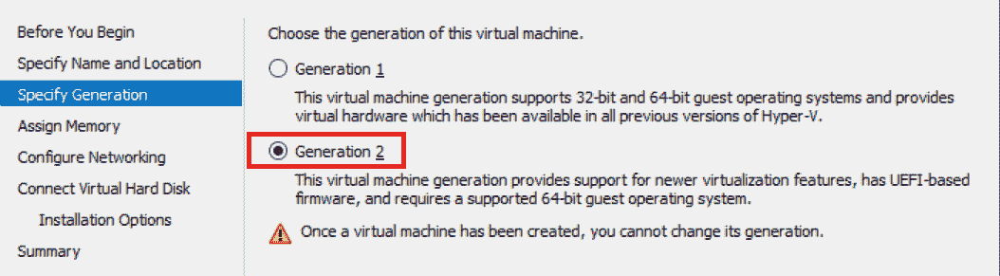

1.  为主节点分配至少`2048` MB 的 RAM。您也可以选择使用动态内存分配功能。您可以在官方文档中找到有关硬件最低要求的更多信息，网址为：[`kubernetes.io/docs/setup/production-environment/tools/kubeadm/install-kubeadm/#before-you-begin`](https://kubernetes.io/docs/setup/production-environment/tools/kubeadm/install-kubeadm/#before-you-begin)。对于生产场景，请考虑使用至少`16384` MB 的 RAM。下面的截图说明了这个过程：

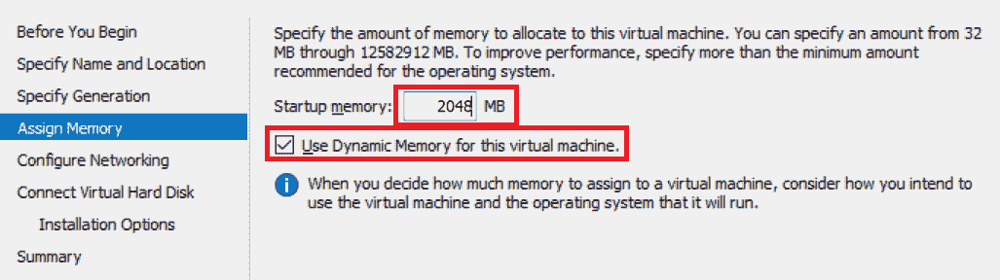

1.  选择内部 NAT 或外部交换作为虚拟机的连接，如下截图所示：

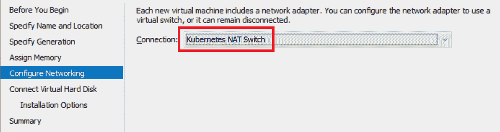

1.  创建一个大小为`250` GB 的新虚拟硬盘。由于**虚拟硬盘 v2**（**VHDX**）是动态可扩展的，因此最好从一开始就分配更多的空间，而不是以后再扩展磁盘和分区。下面的截图说明了这个过程：

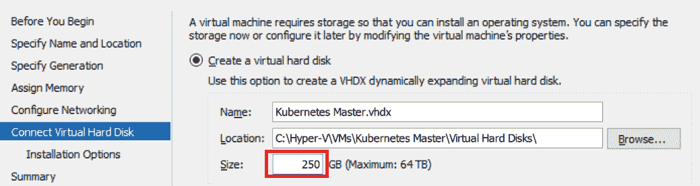

1.  选择从 ISO 安装操作系统，并选择 Ubuntu Server 18.04 LTS 镜像文件，如下截图所示：

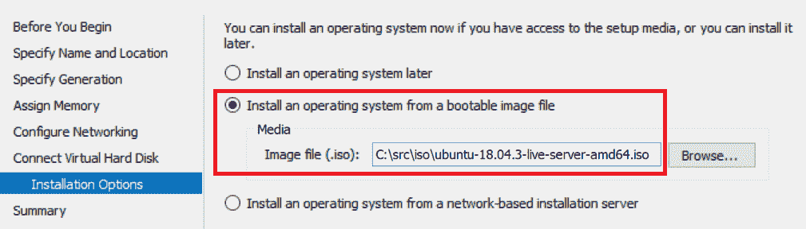

1.  完成虚拟机创建向导。在启动虚拟机之前，我们需要进一步配置它。右键单击 Kubernetes Master VM 并打开设置。

1.  在安全菜单中，确保安全启动模板设置为 Microsoft UEFI 证书颁发机构，如下截图所示：

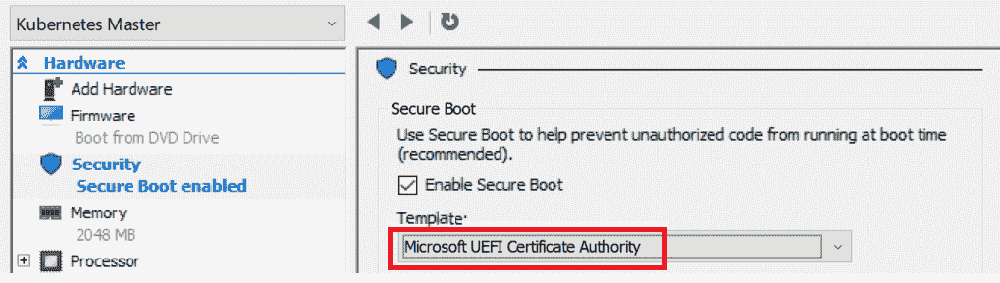

1.  在处理器菜单中，将虚拟处理器的数量设置为至少`2`，如下截图所示：

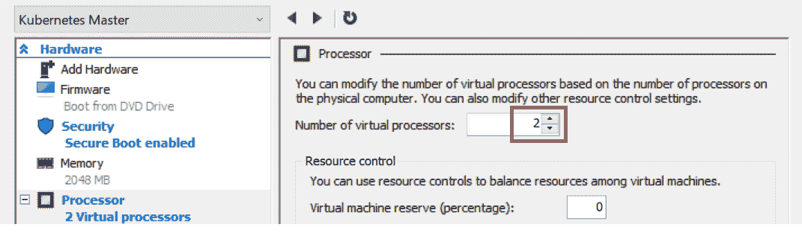

1.  在网络适配器高级功能菜单中，选择为容器启用 MAC 地址欺骗。如果您正在使用外部 vSwitch 并且有外部 DHCP，您可能还想配置静态 DHCP 分配。对于内部 NAT vSwitch，您可以保留默认的动态设置，如下截图所示：

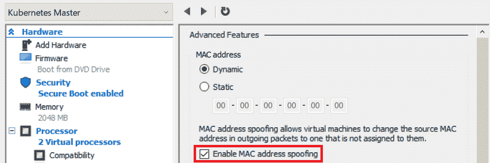

1.  应用所有更改并启动虚拟机。

如果您考虑完全自动化这个过程，您可以选择 Vagrant（[`www.vagrantup.com/`](https://www.vagrantup.com/)）用于开发目的，或者 Packer 用于生产场景（[`www.packer.io/`](https://www.packer.io/)）。使用 Vagrant，您可以轻松地从头开始创建开发 VM，并使用例如 Ansible 自动化配置过程。使用 Packer，您可以为 VM 或云提供商生成机器映像，以便使用**基础设施即代码**（**IaC**）范例。

# 安装 Ubuntu 服务器

主节点的虚拟机已经创建，现在我们需要在虚拟机上安装 Ubuntu Server 18.04 LTS。为了做到这一点，请执行以下步骤：

1.  通过在 Hyper-V 管理器中双击 Kubernetes Master VM 来连接到正在运行的 VM 终端。

1.  等待安装程序初始化。

1.  选择英语作为首选语言。

1.  选择所需的键盘布局。

1.  在网络连接中，根据您的外部网络配置进行操作：

+   如果您使用内部 NAT vSwitch，则必须手动设置配置。打开 eth0 接口并编辑 IPv4，选择手动方法。设置子网`10.0.0.0/8`，地址`10.0.0.2`，网关`10.0.0.1`，名称服务器`8.8.8.8,8.8.4.4`（如果可能，请使用您的提供商的 DNS 服务器地址）。

+   如果您使用外部 vSwitch，请根据您的要求使用自动配置或手动配置网络。

1.  可选地，配置网络代理。请记住，如果您在网络代理后运行，您将稍后需要配置 Docker 以使用代理。

1.  继续使用默认的镜像地址。

1.  在文件系统设置中，配置为使用整个磁盘。

1.  选择默认的磁盘进行安装。

1.  按照建议的文件系统设置进行操作。

1.  在配置文件设置中，您可以配置机器名称和第一个用户名。我们将使用`kubernetes-master`作为机器名称，`ubuntu`作为用户名。

1.  在 SSH 菜单中，选择安装 OpenSSH 服务器。

1.  不要选择任何额外的软件包，并继续安装。

1.  等待安装完成。

1.  重新启动。

可以使用 Kickstart 或 preseed 配置文件自动安装 Ubuntu 服务器。您可以在官方文档中找到更多信息，网址为：[`help.ubuntu.com/lts/installation-guide/i386/ch04s06.html`](https://help.ubuntu.com/lts/installation-guide/i386/ch04s06.html)。这种方法可以与 Vagrant 或 Packer 一起使用。可以在以下网址找到适用于 Packer 的 Ubuntu Server 18.04 的示例 preseed 配置文件：[`github.com/ptylenda/ironic-packer-template-ubuntu1804-kubernetes-ansible-proxy/blob/master/http/preseed.cfg`](https://github.com/ptylenda/ironic-packer-template-ubuntu1804-kubernetes-ansible-proxy/blob/master/http/preseed.cfg)。

让我们来看看网络配置。

# 配置网络

如果您正在使用内部 NAT vSwitch 或外部 vSwitch 与外部基于 Windows 的 DHCP 服务器，则在机器重新启动后需要进行一些额外的网络配置，如下所示：

1.  在 VM 终端窗口中，使用用户名`ubuntu`和您的密码登录。

1.  使用`vim`或`nano`打开以下文件：

```
sudo vim /etc/netplan/01-netcfg.yaml
```

如果您不熟悉 Vim 编辑器，我们强烈建议学习基础知识。例如，可以在以下网址找到一个简明指南：[`eastmanreference.com/a-quick-start-guide-for-beginners-to-the-vim-text-editor`](https://eastmanreference.com/a-quick-start-guide-for-beginners-to-the-vim-text-editor)。Vim 非常适用于在 Linux 和 Windows 上编辑文件，而无需桌面环境。作为替代，您可以使用 nano ([`www.nano-editor.org/`](https://www.nano-editor.org/))。

1.  如果您正在使用内部 NAT vSwitch，请按以下方式强制执行 Kubernetes 主节点的静态 IP 地址配置：

```
network:
  ethernets:
    eth0:
      dhcp4: no
      addresses: [10.0.0.2/8]
      gateway4: 10.0.0.1
      nameservers:
        addresses: [8.8.8.8,8.8.4.4]
  version: 2
```

1.  或者，如果您正在使用外部 vSwitch 和外部基于 Windows 的 DHCP 服务器，请将文件内容设置为以下内容：

```
network:
  ethernets:
    eth0:
      dhcp4: yes
      dhcp-identifier: mac
  version: 2
```

将`dhcp-identifier`设置为`mac`对于使 DHCP 租约正常工作至关重要。

1.  保存文件并使用`sudo reboot`命令重新启动机器。

我们现在将安装一些额外的软件包。

# 安装与 Hyper-V 集成的额外软件包

对于任何网络配置（包括内部 NAT 和外部 vSwitch），您现在应该安装一些额外的虚拟化工具，以启用与 hypervisors 集成的一些专用功能，如下所示：

1.  再次登录到机器上。

1.  通过运行以下命令更新`apt-get`缓存：

```
sudo apt-get update
```

1.  安装额外的虚拟化工具，如下所示：

```
sudo apt-get install -y --install-recommends linux-tools-virtual linux-cloud-tools-virtual
```

1.  重启。

现在，让我们设置一个无密码 SSH 登录。

# 设置无密码 SSH 登录

在这一点上，建议使用 SSH 而不是 VM 终端来管理机器。这将需要以下操作：

1.  在您用于连接到 VM 的 Windows 机器上安装 SSH 客户端（在大多数情况下，您的 VM 主机机器）

1.  生成 SSH 密钥对以禁用 SSH 的密码身份验证

要在 Windows 机器上安装本机 SSH 客户端，请执行以下步骤：

1.  以管理员身份打开 PowerShell 窗口

1.  运行以下命令以获取当前可用版本的 OpenSSH 客户端：

```
PS C:\WINDOWS\system32> Get-WindowsCapability -Online | ? Name -like 'OpenSSH*'
Name : OpenSSH.Client~~~~0.0.1.0
State : NotPresent

Name : OpenSSH.Server~~~~0.0.1.0
State : NotPresent
```

1.  像这样安装客户端：

```
Add-WindowsCapability -Online -Name OpenSSH.Client~~~~0.0.1.0
```

1.  要连接到 Kubernetes 主节点 VM，您需要知道其 IP 地址。如果您使用静态 IP 地址配置，这相当简单——您使用`10.0.0.2`。对于由 DHCP 提供的动态 IP 地址，您需要首先确定它。由于在前面的步骤中安装了虚拟化工具，您可以在 Hyper-V 管理器的网络选项卡中轻松找到它，如下面截图底部所示：

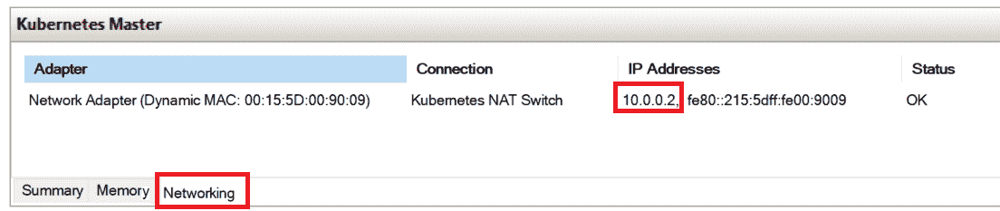

1.  在这种情况下，IP 地址是`10.0.0.2`，我们可以使用它来 SSH 进入 VM，如下所示：

```
PS C:\WINDOWS\system32> ssh ubuntu@10.0.0.2
The authenticity of host '10.0.0.2 (10.0.0.2)' can't be established.
ECDSA key fingerprint is SHA256:X6iv9E7Xixl5GFvV+WxiP10Gbkvh1j3xPsBEV/4YcFo.
Are you sure you want to continue connecting (yes/no)? yes
Warning: Permanently added '10.0.0.2' (ECDSA) to the list of known hosts.
ubuntu@10.0.0.2's password:
Welcome to Ubuntu 18.04.3 LTS (GNU/Linux 4.15.0-65-generic x86_64)
```

如果遇到连接问题，例如`Connection closed by 10.0.0.2 port 22`，您需要重新生成 SSH 主机密钥。在 VM 终端中运行`sudo ssh-keygen -A`，然后尝试重新连接。如果问题仍然存在，请使用`sudo service sshd status`分析 sshd 服务日志。

下一步是为无密码登录到 Kubernetes 主 VM 生成 SSH 密钥对。要做到这一点，请执行以下步骤：

1.  打开 PowerShell 窗口。

1.  运行以下命令生成密钥对。不要指定密码：

```
ssh-keygen.exe
```

1.  现在，您的公钥可在`C:\Users\<user>\.ssh\id_rsa.pub`中找到。使用以下命令将其复制到 Kubernetes Master VM。此命令确保`authorized_keys`文件具有适当的安全访问权限：

```
cat ~/.ssh/id_rsa.pub | ssh ubuntu@10.0.0.2 "cat >> ~/.ssh/authorized_keys && chmod 600 ~/.ssh/authorized_keys"
```

1.  最后一步是测试无密码身份验证，并禁用 SSH 服务器的密码身份验证以获得最佳安全性，如下面的代码片段所示：

```
ssh ubuntu@192.168.43.105
# You should not be asked for password at this point!
```

1.  编辑`/etc/ssh/sshd_config`，如下所示：

```
sudo vim /etc/ssh/sshd_config
```

1.  找到`PasswordAuthentication yes`行并将其注释掉，如下所示：

```
#PasswordAuthentication yes
```

1.  保存更改并重新启动 SSH 服务器，如下所示：

```
sudo service sshd restart
```

1.  重新连接以验证您的配置。

在这一点上，最好为`Kubernetes Master`导出 Hyper-V VM 镜像（或创建检查点）。如果在 Kubernetes 主配置期间出现任何问题，这将使恢复到初始配置变得更容易。

# 安装和配置 Kubernetes 先决条件

为 Kubernetes 主机（以及 Kubernetes 节点）准备 Ubuntu Server 18.04 LTS 机器需要执行以下步骤：

1.  更改操作系统配置，例如禁用交换空间。

1.  安装 Docker 容器运行时。

Ubuntu Server 为 Kubernetes 准备的所有步骤也可以在书籍的官方 GitHub 存储库中作为 bash 脚本找到，网址为：[`github.com/PacktPublishing/Hands-On-Kubernetes-on-Windows/blob/master/Chapter07/02_ubuntu-prepare-node.sh`](https://github.com/PacktPublishing/Hands-On-Kubernetes-on-Windows/blob/master/Chapter07/02_ubuntu-prepare-node.sh)。

截至 Kubernetes 1.17，**经过验证**的 Docker 版本列表如下：1.13.1、17.03、17.06、17.09、18.06、18.09、19.03。

为了配置操作系统以运行 Kubernetes，执行以下步骤：

1.  打开 PowerShell 窗口。

1.  SSH 进入 Kubernetes 主机，如下所示：

```
ssh ubuntu@10.0.0.2
```

1.  更新`apt-get`并升级所有软件包，如下所示：

```
sudo apt-get update
sudo apt-get dist-upgrade -y
```

1.  安装所需的软件包，如下所示：

```
sudo apt-get install apt-transport-https ca-certificates curl software-properties-common ebtables ethtool -y 
```

1.  禁用当前引导的交换分区，如下所示：

```
sudo swapoff -a
```

1.  永久删除交换分区。编辑`sudo vim /etc/fstab`并删除任何类型为`swap`的行，例如以下行：

```
/swap.img       none    swap    sw      0       0
```

编辑`/etc/fstab`应始终使用创建的文件**备份**执行。此文件中的配置错误可能导致无法引导的系统！

1.  可选地，重新启动计算机以检查交换分区是否未再次挂载。重新启动计算机后，SSH 进入计算机并检查`swap`是否已禁用-列表应为空，如下所示：

```
swapon -s
```

1.  确保在系统引导期间加载`br_netfilter`内核模块。使用`sudo vim /etc/modules-load.d/kubernetes.conf`命令创建文件并设置以下内容：

```
br_netfilter
```

1.  为 Kubernetes 配置`sysctl`变量（Flannel 网络所需）。使用`sudo vim /etc/sysctl.d/99-kubernetes.conf`命令创建一个新文件，并确保文件具有以下内容：

```
net.bridge.bridge-nf-call-ip6tables = 1
net.bridge.bridge-nf-call-iptables = 1
net.bridge.bridge-nf-call-arptables = 1
```

1.  加载`br_netfilter`内核模块以进行当前引导，并使用以下命令重新加载`sysctl`变量：

```
sudo modprobe br_netfilter
sudo sysctl --system
```

此时，您的 Ubuntu 服务器虚拟机已准备好安装 Docker 和 Kubernetes。为了安装 Docker 18.09，这是与 Kubernetes 1.16 一起使用的最新验证版本，请执行以下步骤：

1.  为 Docker `apt`软件包存储库添加官方**GNU 隐私保护**（**GPG**）密钥，如下所示：

```
curl -fsSL https://download.docker.com/linux/ubuntu/gpg | sudo apt-key add -
```

Ubuntu 上 Docker 的最新安装说明可以在以下网址找到：[`docs.docker.com/install/linux/docker-ce/ubuntu/`](https://docs.docker.com/install/linux/docker-ce/ubuntu/)。始终与 Kubernetes 容器运行时安装文档进行交叉检查，因为它包含额外重要信息，可以在以下网址找到：[`kubernetes.io/docs/setup/production-environment/container-runtimes/#docker`](https://kubernetes.io/docs/setup/production-environment/container-runtimes/#docker)。

1.  添加 Docker `apt`软件包存储库，如下所示：

```
sudo add-apt-repository \
 "deb [arch=amd64] https://download.docker.com/linux/ubuntu \
 $(lsb_release -cs) \
 stable"
```

1.  更新`apt-get`缓存以刷新存储库的信息，如下所示：

```
sudo apt-get update
```

1.  安装经过 Kubernetes 使用验证的最新 Docker 版本，如下所示：

```
sudo apt-get install docker-ce=5:18.09.9~3-0~ubuntu-bionic -y
```

1.  通过运行以下命令禁用`docker-ce`软件包的自动更新（这将防止安装未经验证的 Docker 版本）：

```
sudo apt-mark hold docker-ce
```

1.  为 Kubernetes 配置 Docker 守护程序。使用`sudo vim /etc/docker/daemon.json`命令创建一个新文件，并设置以下内容：

```
{
 "exec-opts": ["native.cgroupdriver=systemd"],
 "log-driver": "json-file",
 "log-opts": {
 "max-size": "100m"
 },
 "storage-driver": "overlay2"
}
```

1.  重新加载`systemctl`并重新启动 Docker 守护程序，使用以下命令：

```
sudo systemctl daemon-reload
sudo systemctl restart docker
```

1.  验证 Docker 是否已正确安装，方法是运行`hello-world`容器，如下所示：

```
ubuntu@kubernetes-master:~$ sudo docker run hello-world
Unable to find image 'hello-world:latest' locally
latest: Pulling from library/hello-world
1b930d010525: Pull complete Digest: sha256:c3b4ada4687bbaa170745b3e4dd8ac3f194ca95b2d0518b417fb47e5879d9b5f
Status: Downloaded newer image for hello-world:latest

Hello from Docker!
This message shows that your installation appears to be working correctly.
```

如果您在网络代理后面工作，您应该确保您有以下内容：

+   包含适当代理变量的`/etc/environment`（示例指南：[`kifarunix.com/how-to-set-system-wide-proxy-in-ubuntu-18-04/`](https://kifarunix.com/how-to-set-system-wide-proxy-in-ubuntu-18-04/)）。

+   包含具有代理变量的附加文件的`/etc/systemd/system/docker.service.d`目录（示例指南：[`docs.docker.com/config/daemon/systemd/`](https://docs.docker.com/config/daemon/systemd/)）。

您的 Ubuntu 服务器虚拟机现在已准备好作为 Kubernetes 主节点进行初始化。首先，在安装 Kubernetes 二进制文件之前，让我们对集群进行初始规划。

# 规划集群

在开始初始化集群之前，您需要确定 Kubernetes 组件将使用的特定子网和地址范围。这取决于您的外部网络设置（例如，避免任何 IP 地址冲突）以及您计划在集群中运行的 Pod 和服务的数量。一般来说，特别是在本地机器后面的内部 NAT vSwitch 上运行的开发集群，使用默认值是一个好主意。您需要从表中确定以下值用于您的集群： 

|  | **描述** | **默认值** |
| --- | --- | --- |
| **服务子网** | 用于 Pod 访问服务的虚拟子网（不可路由）。节点上运行的`kube-proxy`执行从虚拟 IP 到可路由地址的地址转换。 | `10.96.0.0/12` |
| **集群（Pod）子网** | 集群中所有 Pod 使用的全局子网。一般来说，使用 Flannel 时，每个节点被分配一个较小的/24 子网用于其 Pod。请记住，这个子网必须足够大，以容纳集群中运行的所有 Pod。 | `10.244.0.0/16` |
| **Kubernetes DNS 服务 IP** | 用于集群服务发现和域名解析的`kube-dns`服务的 IP 地址。 | `10.96.0.10` |

这些值将在初始化集群的下一步骤中需要。

# 初始化集群

为了初始化 Kubernetes 的 Ubuntu 主节点并加入 Windows 节点，我们将使用 kubeadm——在 Kubernetes 1.16（以及 1.17）中，这是唯一一个用于混合 Windows/Linux 集群的自动化部署方法。第一步是在 Ubuntu 服务器 VM 上安装 kubeadm、kubelet 和 kubectl。这也在 GitHub 存储库中的脚本中有所涵盖，链接为：[`github.com/PacktPublishing/Hands-On-Kubernetes-on-Windows/blob/master/Chapter07/03_ubuntu-install-kubeadm.sh`](https://github.com/PacktPublishing/Hands-On-Kubernetes-on-Windows/blob/master/Chapter07/03_ubuntu-install-kubeadm.sh)。

安装 kubeadm 和初始化 Kubernetes 主节点的官方说明可以在以下链接找到：[`kubernetes.io/docs/setup/production-environment/tools/kubeadm/install-kubeadm/`](https://kubernetes.io/docs/setup/production-environment/tools/kubeadm/install-kubeadm/) 和 [`kubernetes.io/docs/setup/production-environment/tools/kubeadm/create-cluster-kubeadm/`](https://kubernetes.io/docs/setup/production-environment/tools/kubeadm/create-cluster-kubeadm/)。

SSH 进入 Ubuntu 服务器 VM，并执行以下步骤：

1.  按照以下步骤添加 Kubernetes apt 软件包存储库的 GPG 密钥：

```
curl -s https://packages.cloud.google.com/apt/doc/apt-key.gpg | sudo apt-key add -
```

1.  添加 Kubernetes apt 软件包存储库。使用`sudo vim /etc/apt/sources.list.d/kubernetes.list`命令创建一个新文件，并设置以下内容（请注意，您目前必须使用`kubernetes-xenial`存储库，因为`bionic`目前还不可用）：

```
deb https://apt.kubernetes.io/ kubernetes-xenial main
```

1.  更新`apt-get`并安装所需的软件包，如下：

```
sudo apt-get update
sudo apt-get install kubelet kubeadm kubectl -y
```

1.  通过运行以下代码验证最新的 Kubernetes 版本是否已安装：

```
ubuntu@kubernetes-master:~$ kubeadm version
kubeadm version: &version.Info{Major:"1", Minor:"16", GitVersion:"v1.16.1", GitCommit:"d647ddbd755faf07169599a625faf302ffc34458", GitTreeState:"clean", BuildDate:"2019-10-02T16:58:27Z", GoVersion:"go1.12.10", Compiler:"gc", Platform:"linux/amd64"}
```

1.  通过运行以下命令禁用 Kubernetes 软件包的自动更新（这一点尤为重要，因为任何 Kubernetes 组件的升级都应该经过深思熟虑并以受控的方式进行，考虑到所有的兼容性问题）：

```
sudo apt-mark hold kubelet kubeadm kubectl
```

到目前为止，初始化 Kubernetes 主节点和节点的步骤完全相同。当向集群添加更多专用的 Ubuntu 节点或克隆您的 VM 时，您可以按照相同的步骤进行。如果决定克隆机器，请记住确保每个节点的主机名、MAC 地址和`product_uuid`都是唯一的。在官方文档中了解更多关于如何确保这一点的信息，网址为：[`kubernetes.io/docs/setup/production-environment/tools/kubeadm/install-kubeadm/#verify-the-mac-address-and-product-uuid-are-unique-for-every-node`](https://kubernetes.io/docs/setup/production-environment/tools/kubeadm/install-kubeadm/#verify-the-mac-address-and-product-uuid-are-unique-for-every-node)。

现在，我们准备使用 kubeadm 初始化集群。为了做到这一点，请执行以下步骤：

1.  执行以下命令，假设服务网络为`10.96.0.0/12`，Pod 网络为`10.244.0.0/16`：

```
sudo kubeadm init --service-cidr "10.96.0.0/12" --pod-network-cidr "10.244.0.0/16"
```

1.  仔细检查 kubeadm 初始化输出，并记录`kubeadm join`信息，如下：

```
Your Kubernetes control-plane has initialized successfully!

To start using your cluster, you need to run the following as a regular user:

 mkdir -p $HOME/.kube
 sudo cp -i /etc/kubernetes/admin.conf $HOME/.kube/config
 sudo chown $(id -u):$(id -g) $HOME/.kube/config

You should now deploy a pod network to the cluster.
Run "kubectl apply -f [podnetwork].yaml" with one of the options listed at:
 https://kubernetes.io/docs/concepts/cluster-administration/addons/

Then you can join any number of worker nodes by running the following on each as root:

kubeadm join 10.0.0.2:6443 --token c4kkga.50606d1zr7w0s2w8 \
 --discovery-token-ca-cert-hash sha256:44b2f0f05f79970cc295ab1a7e7ebe299c05fcbbec9d0c08133d4c5ab7fadb0b
```

1.  如果您的 kubeadm 令牌过期（24 小时后），您可以始终使用以下命令创建一个新的：

```
kubeadm token create --print-join-command
```

1.  将**kubectl config** (**kubeconfig**)复制到默认位置，如下：

```
mkdir -p $HOME/.kube
sudo cp -i /etc/kubernetes/admin.conf $HOME/.kube/config
sudo chown $(id -u):$(id -g) $HOME/.kube/config
```

1.  现在，建议将配置复制到 Windows 机器，以便能够在不登录到主节点的情况下管理集群。在 PowerShell 窗口中，执行以下命令：

```
scp ubuntu@10.0.0.2:.kube/config config
$env:KUBECONFIG="config;$env:USERPROFILE\.kube\config"
kubectl config view --raw
```

1.  仔细检查合并的配置，以确保您没有覆盖任何现有集群的配置。您可以在第六章中了解有关合并`kubeconfigs`的更多信息，*与 Kubernetes 集群交互*。如果合并的配置正确，您可以将其保存为`$env:USERPROFILE\.kube\config`，并使用以下命令切换到`kubernetes-admin@kubernetes`上下文：

```
$env:KUBECONFIG="config;$env:USERPROFILE\.kube\config"
kubectl config view --raw > $env:USERPROFILE\.kube\config_new 
Move-Item -Force $env:USERPROFILE\.kube\config_new $env:USERPROFILE\.kube\config

kubectl config use-context "kubernetes-admin@kubernetes"
```

1.  验证配置是否正常工作。按照以下方式检索节点列表（请注意，`NotReady`状态是由于尚未安装 Pod 网络）：

```
PS C:\src> kubectl get nodes
NAME                STATUS     ROLES    AGE   VERSION
kubernetes-master   NotReady   master   22m   v1.16.1
```

1.  如果您不打算添加任何 Ubuntu 节点，可以选择**untaint**主节点，以允许在主节点上调度 Linux Pods。请注意，这仅适用于开发集群。通过运行以下代码来实现：

```
kubectl taint nodes --all node-role.kubernetes.io/master-
```

如果您想重新设置集群，首先需要使用 kubeadm 拆除集群。在官方文档中了解更多关于此过程的信息：[`kubernetes.io/docs/setup/production-environment/tools/kubeadm/create-cluster-kubeadm/#tear-down`](https://kubernetes.io/docs/setup/production-environment/tools/kubeadm/create-cluster-kubeadm/#tear-down)。

您的 Kubernetes 主节点几乎准备就绪。最后一步是安装 Pod 网络。让我们继续！

# 安装 Kubernetes 网络

在使用 kubeadm 初始化 Kubernetes 主节点之后，下一步是安装 Pod 网络。我们在第五章中介绍了 Kubernetes 网络选项，详细解释了混合 Windows/Linux 集群支持的**容器网络接口**（**CNI**）插件。对于本地部署的集群，我们将使用 Flannel 网络和`host-gw`后端（Windows 节点上的`win-bridge` CNI 插件）。请记住，只有在节点之间存在**第 2 层**（**L2**）连接性（没有**第 3 层**（**L3**）路由）时，才能使用此方法。一般来说，`host-gw`后端更可取，因为它处于稳定的功能状态，而覆盖后端对于 Windows 节点仍处于 alpha 功能状态。

如果您对使用覆盖后端的 Flannel 安装感兴趣，请参考官方文档中的详细步骤：[`kubernetes.io/docs/setup/production-environment/windows/user-guide-windows-nodes/#configuring-flannel-in-vxlan-mode-on-the-linux-control-plane`](https://kubernetes.io/docs/setup/production-environment/windows/user-guide-windows-nodes/#configuring-flannel-in-vxlan-mode-on-the-linux-control-plane)。请注意，您需要安装了 KB4489899 补丁的 Windows Server 2019 以进行覆盖网络。

要安装带有`host-gw`后端的 Flannel，请执行以下步骤（在 PowerShell 窗口中或通过 SSH 在 Kubernetes 主节点上）：

1.  下载 Flannel for Kubernetes 的最新官方清单文件，如下所示：

```
# Bash
wget https://raw.githubusercontent.com/coreos/flannel/master/Documentation/kube-flannel.yml

# Powershell
wget https://raw.githubusercontent.com/coreos/flannel/master/Documentation/kube-flannel.yml -OutFile kube-flannel.yml
```

1.  自定义清单，使`net-conf.json`文件部分具有`host-gw`后端类型和正确定义的 Pod 网络（默认值：`10.244.0.0/16`），如下所示：

```
net-conf.json: |
 {
 "Network": "10.244.0.0/16",
 "Backend": {
 "Type": "host-gw"
 }
 }
```

1.  应用修改后的清单，如下所示：

```
kubectl apply -f kube-flannel.yml
```

1.  最新的官方清单不需要额外的补丁来进行仅 Linux 调度，因为它已经涵盖了这一要求。如果您遵循官方指南，可以跳过此步骤。

1.  验证 Pod 网络安装是否成功。您应该能够安排一个运行 Bourne shell 的简单交互式 Pod——只有在您有一个未被污染的主节点用于 Pod 调度或者有其他 Linux 节点时才能工作。通过运行以下代码来实现这一点：

```
PS C:\src> kubectl run --generator=run-pod/v1 busybox-debug -i --tty --image=busybox --rm --restart=Never -- sh
If you don't see a command prompt, try pressing enter.
/ #
```

Kubernetes 主节点完全初始化后，我们可以继续为 Windows 节点准备 VM。

# 为 Windows 节点准备 VM

本节的结构与 Ubuntu Server VM 准备类似。对于 Windows VM，我们将执行以下步骤：

1.  创建 VM

1.  安装 Windows Server 2019

1.  配置网络

1.  安装 SSH 服务器

1.  安装和配置 Kubernetes 先决条件

# 创建 VM

创建 Windows Server 2019 VM 的步骤几乎与 Ubuntu Server 18.04 相同。如果您对该过程的截图感兴趣，请参考前面的部分。

要创建 Windows Server 2019 Kubernetes 节点 VM，请打开 Hyper-V 管理器应用程序并执行以下步骤：

1.  从“操作”菜单中，选择“新建”，然后单击“虚拟机”。

1.  点击“下一步”，选择 Windows 节点 VM 的名称。我们将使用`Kubernetes Windows Node 01`来命名。可选地，配置一个自定义目录来存储 VM 数据，以确保有足够的磁盘空间来托管 VM。每个节点至少需要 30GB 的磁盘空间。

1.  在下一个对话框中，选择“第二代”并继续。

1.  为 Windows 节点分配至少 4096MB 的 RAM。使用更少的内存可能会导致偶尔报告`KubeletHasInsufficientMemory`并阻止 Pod 的调度。由于我们将为此机器启用嵌套虚拟化，动态内存分配功能将不起作用。对于生产场景，考虑分配更多资源。

1.  选择内部 NAT 或外部交换机作为 VM 的连接。这必须是您用于主节点的相同交换机。

1.  创建一个新的虚拟硬盘，大小为 250GB 或更大。由于 VHDX 是动态可扩展的，因此最好从一开始就分配更多的空间，而不是以后再扩展磁盘和分区。

1.  选择从 ISO 安装操作系统，并选择您的 Windows Server 2019（或 1903）镜像文件。

1.  完成 VM 创建向导。在启动 VM 之前，我们需要进一步配置它。右键单击`Kubernetes Windows Node 01`VM 并打开“设置”。

1.  在“处理器”菜单中，将“虚拟处理器数量”设置为至少 2。

1.  在“网络适配器高级功能”菜单中，选择为容器启用 MAC 地址欺骗。如果您使用外部 vSwitch 并且有外部 DHCP，您可能还想配置静态 DHCP 分配。对于内部 NAT vSwitch，您可以保留默认的“动态”设置。

1.  应用所有更改。

1.  在以管理员身份运行的 PowerShell 窗口中使用以下命令启用嵌套虚拟化。

```
Set-VMProcessor -VMName "Kubernetes Windows Node 01" -ExposeVirtualizationExtensions $true
```

该机器现在已准备好启动操作系统安装。

# 安装 Windows Server 2019

Windows Server 2019 的安装过程是使用图形界面执行的。如果您考虑自动化安装过程，例如对于 Vagrant 或 Packer，您应该考虑使用虚拟软驱提供的`Autounattend.xml`文件。您可以在 GitHub 上找到这样一个配置文件的示例，网址为：[`github.com/ptylenda/kubernetes-for-windows/blob/master/packer/windows/http/Autounattend.xml`](https://github.com/ptylenda/kubernetes-for-windows/blob/master/packer/windows/http/Autounattend.xml)。

执行以下步骤来执行安装：

1.  通过在 Hyper-V 管理器中双击`Kubernetes Windows Node 01 VM`来连接。

1.  启动虚拟机，并立即按任意键以从安装到虚拟机中的安装 DVD 启动。

1.  选择语言和区域设置。

1.  点击立即安装。

1.  提供安装产品密钥。

1.  在下一个对话框中，您可以选择是否安装桌面体验。我们建议不安装它，因为这样可以使安装更紧凑，并且将配置留给命令行，这对于**自动化**更好。

1.  阅读并接受许可条款。

1.  选择 Windows Server 的自定义安装。

1.  继续使用默认的安装目标（整个磁盘，无需分区）。

1.  等待安装完成并等待机器重新启动。

1.  在第一次登录时，您必须设置管理员密码。

现在，您已经启动并运行了一个 Windows Server 2019 虚拟机，但在加入 Kubernetes 集群之前，我们需要配置网络并安装先决条件。

# 配置网络

只有在运行内部 NAT vSwitch 时才需要进行额外的网络配置——在这种情况下，您需要配置静态 IP 地址、网关地址和 DNS 服务器信息。如果您正在运行具有外部 DHCP 的外部 vSwitch，则配置应自动执行。

在本指南中，我们遵循 Kubernetes 节点具有以`10.0.0.3`开头的连续 IP 地址的约定。为了将`10.0.0.3`配置为集群中第一个节点的静态 IP 地址，请执行以下步骤：

1.  通过在虚拟机上运行`powershell`命令来启动 PowerShell。

1.  执行以下命令以查找主`Ethernet`接口的`ifIndex`：

```
Get-NetAdapter
```

1.  为接口创建一个新的静态 IP 地址`10.0.0.3`，如下所示：

```
New-NetIPAddress –IPAddress 10.0.0.3 -DefaultGateway 10.0.0.1 -PrefixLength 8 -InterfaceIndex <ifIndex>
```

1.  为接口设置 DNS 服务器信息，如下所示（如果需要，请使用适当的 DNS 服务器）：

```
Set-DNSClientServerAddress –InterfaceIndex <ifIndex> –ServerAddresses 8.8.8.8,8.8.4.4
```

如果您在网络代理后面，可以使用 PowerShell 中的以下命令在机器级别定义适当的环境变量：

**`[Environment]::SetEnvironmentVariable("HTTP_PROXY", "http://proxy.example.com:80/", [EnvironmentVariableTarget]::Machine)`**

**`[Environment]::SetEnvironmentVariable("HTTPS_PROXY", "http://proxy.example.com:443/", [EnvironmentVariableTarget]::Machine)`**

现在让我们看看如何远程访问 Windows Server 虚拟机。

# 安装 SSH 服务器

现在，我们需要一种连接到 VM 而不使用 Hyper-V 终端的方法——如果您愿意，仍然可以使用它，但与使用**远程桌面协议**（**RDP**）或 SSH 相比，它的功能更有限。您有以下选项：

1.  安装 SSH 服务器并使用 Vim 来管理配置文件。

1.  启用 RDP 连接（示例指南：[`theitbros.com/how-to-remotely-enable-remote-desktop-using-powershell/`](https://theitbros.com/how-to-remotely-enable-remote-desktop-using-powershell/)）。

1.  使用 PowerShell 远程连接（示例指南：[`docs.microsoft.com/en-us/powershell/module/microsoft.powershell.core/enable-psremoting?view=powershell-6`](https://docs.microsoft.com/en-us/powershell/module/microsoft.powershell.core/enable-psremoting?view=powershell-6)）。

我们将演示如何在 Windows Server 2019 上启用第一个选项，即 SSH 服务器和 Vim。此选项使得访问我们的 Kubernetes 集群变得统一，您可以在所有节点上使用相同的 SSH 密钥。执行以下步骤：

1.  在 Windows Server 机器的 Hyper-V 终端连接中，通过使用`powershell`命令启动 PowerShell。

1.  通过运行以下代码验证当前可以安装的 SSH 服务器的版本：

```
Get-WindowsCapability -Online | ? Name -like 'OpenSSH*'

Name : OpenSSH.Client~~~~0.0.1.0
State : NotPresent

Name : OpenSSH.Server~~~~0.0.1.0
State : NotPresent
```

1.  安装`OpenSSH.Server`功能，如下所示：

```
Add-WindowsCapability -Online -Name OpenSSH.Server~~~~0.0.1.0
```

1.  启动`sshd`服务，如下所示：

```
Start-Service sshd
```

1.  启用`sshd`服务的自动启动，如下所示：

```
Set-Service -Name sshd -StartupType 'Automatic'
```

1.  确保适当的防火墙规则已经就位（`OpenSSH-Server-In-TCP`），如下所示：

```
Get-NetFirewallRule -Name *ssh*
```

1.  如果不存在，请手动添加，如下所示：

```
New-NetFirewallRule -Name sshd -DisplayName 'OpenSSH Server (sshd)' -Enabled True -Direction Inbound -Protocol TCP -Action Allow -LocalPort 22
```

1.  从开发机器上，验证通过 SSH 连接到`10.0.0.3`的 VM 是否可行，如下所示：

```
PS C:\src> ssh Administrator@10.0.0.3
The authenticity of host '10.0.0.3 (10.0.0.3)' can't be established.
ECDSA key fingerprint is SHA256:VYTfj0b1uZmVgHu9BY17q1wpINNEuzb4dsSGtMFQKw4.
Are you sure you want to continue connecting (yes/no)? yes
Warning: Permanently added '10.0.0.3' (ECDSA) to the list of known hosts.
Administrator@10.0.0.3's password:
Microsoft Windows [Version 10.0.17763.737]
(c) 2018 Microsoft Corporation. All rights reserved.

administrator@WIN-GJD24M0P8DA C:\Users\Administrator>
```

1.  默认情况下，启动具有有限功能的`cmd` shell。通过使用`powershell`命令在 SSH 会话中启动 PowerShell。

1.  将 SSH 的默认 shell 更改为`powershell`，使用以下命令：

```
New-ItemProperty -Path "HKLM:\SOFTWARE\OpenSSH" -Name DefaultShell -Value "C:\Windows\System32\WindowsPowerShell\v1.0\powershell.exe" -PropertyType String -Force
```

1.  安装 Chocolatey 软件包管理器以安装 Vim 编辑器，如下所示：

```
Set-ExecutionPolicy Bypass -Scope Process -Force; iex ((New-Object System.Net.WebClient).DownloadString('https://chocolatey.org/install.ps1'))
```

1.  使用 Chocolatey 安装 Vim，如下所示：

```
 choco install vim -y
```

1.  配置无密码 SSH 登录。使用`vim C:\ProgramData\ssh\administrators_authorized_keys`命令将您的`~/.ssh/id_rsa.pub`公共 SSH 密钥添加到 Windows Server VM 上的`administrators_authorized_keys`。

1.  修复`administrators_authorized_keys`文件的权限，如下所示：

```
icacls C:\ProgramData\ssh\administrators_authorized_keys /remove "NT AUTHORITY\Authenticated Users"
icacls C:\ProgramData\ssh\administrators_authorized_keys /inheritance:r
```

1.  重新启动`sshd`服务，如下所示：

```
Restart-Service -Name sshd -Force
```

所有 Windows 配置操作都可以通过`Autounattend.xml`自动化 Windows 设置（使用常规的`cmd`和`powershell`脚本）和在 Windows 主机上支持的 Ansible 的混合来执行。您可以在此最小示例存储库中检查 Packer 如何使用此方法，网址为：[`github.com/ptylenda/ironic-packer-template-windows2016`](https://github.com/ptylenda/ironic-packer-template-windows2016)。

此时，您的 Windows Server VM 已连接到网络，并准备安装 Kubernetes 的先决条件。

# 安装和配置 Kubernetes 的先决条件

首先，确保 Windows Server 2019 已经更新。为了做到这一点，使用 Hyper-V 终端连接并执行以下步骤：

如果您不想使用第三方模块来管理更新，可以使用`sconfig`命令。目前，这些操作无法通过 SSH 轻松执行，因为它们需要**图形用户界面**（**GUI**）交互。

1.  打开 PowerShell 会话，使用`powershell`命令。

1.  安装用于管理 Windows 更新的`PSWindowsUpdate`自定义模块，如下所示：

```
Install-Module -Name PSWindowsUpdate
```

1.  通过运行以下代码触发 Windows 更新（此过程可能需要一些时间才能完成）：

```
Get-WUInstall -AcceptAll -Install
```

下一步是安装 Docker 和 Kubernetes 本身。可以通过两种方式来实现：

+   手动安装和配置 Docker，如官方微软文档中所述，网址为：[`docs.microsoft.com/en-us/virtualization/windowscontainers/kubernetes/joining-windows-workers`](https://docs.microsoft.com/en-us/virtualization/windowscontainers/kubernetes/joining-windows-workers)

+   使用 Kubernetes `sig-windows-tools`脚本进行半自动化安装，如官方 Kubernetes 文档中所述，网址为：[`kubernetes.io/docs/setup/production-environment/windows/user-guide-windows-nodes/#join-windows-worker-node`](https://kubernetes.io/docs/setup/production-environment/windows/user-guide-windows-nodes/#join-windows-worker-node)

我们将使用第二个选项，因为这是一个更近期的方法，与 kubeadm 支持 Windows 节点一致，从版本 1.16 开始可用。`sig-windows-tools`脚本执行以下操作：

1.  启用 Windows Server 容器功能。

1.  下载所选的容器运行时（Docker 或**容器运行时接口**（**CRI**））。

1.  拉取所需的 Docker 镜像。

1.  下载 Kubernetes 和 Flannel 二进制文件，安装它们，并将它们添加到`$env:PATH`变量中。

1.  下载所选的 CNI 插件。

要在 Windows 上安装 Kubernetes 的所有先决条件，请执行以下步骤：

1.  SSH 进入 Windows Server 节点 VM，如下所示：

```
ssh Administrator@10.0.0.3
```

1.  创建并使用一个新目录，其中将下载`sig-windows-tools`脚本，例如`sig-windows-tools-kubeadm`，如下所示：

```
mkdir .\sig-windows-tools-kubeadm
cd .\sig-windows-tools-kubeadm
```

1.  下载最新的`sig-windows-tools`存储库并解压它。请注意，存储库中的路径可能会更改，因为它目前专门用于`v1.15.0`（您可以在官方文档中查看最新版本，网址为：[`kubernetes.io/docs/setup/production-environment/windows/user-guide-windows-nodes/#preparing-a-windows-node`](https://kubernetes.io/docs/setup/production-environment/windows/user-guide-windows-nodes/#preparing-a-windows-node)）。或者，您可以使用书中 GitHub 存储库中的分支：[`github.com/PacktPublishing/Hands-On-Kubernetes-on-Windows/tree/master/Chapter07/07_sig-windows-tools-kubeadm`](https://github.com/PacktPublishing/Hands-On-Kubernetes-on-Windows/tree/master/Chapter07/07_sig-windows-tools-kubeadm)。这些脚本包含了一些从`sig-windows-tools`中挑选出来的修复 bug，以确保网络正常工作。这一步的代码可以在下面的片段中看到：

```
Invoke-WebRequest -Uri https://github.com/kubernetes-sigs/sig-windo
ws-tools/archive/master.zip -OutFile .\master.zip
tar -xvf .\master.zip --strip-components 3 sig-windows-tools-master/kubeadm/v1.15.0/*
Remove-Item .\master.zip
```

1.  现在，您需要自定义`Kubeclusterbridge.json`文件。这个配置文件是由一个辅助的 PowerShell 模块使用的，它安装先决条件并加入 Windows 节点。在下面的代码块中，您可以找到 Windows Server 2019 节点的配置。您也可以从书的 GitHub 存储库下载它：[`github.com/PacktPublishing/Hands-On-Kubernetes-on-Windows/blob/master/Chapter07/07_sig-windows-tools-kubeadm/Kubeclusterbridge.json`](https://github.com/PacktPublishing/Hands-On-Kubernetes-on-Windows/blob/master/Chapter07/07_sig-windows-tools-kubeadm/Kubeclusterbridge.json)。您需要确保`Images`的版本与您的节点操作系统版本匹配，并且`Network`有适当的`ServiceCidr`和`ClusterCidr`。此外，您需要提供一个`KubeadmToken`和`KubeadmCAHash`，这是在初始化 Kubernetes 主节点时生成的。您可以使用`kubeadm token create --print-join-command`命令在 Kubernetes 主节点上生成一个新的令牌。这一步的代码可以在下面的片段中看到：

```
{
    "Cri" : {
       "Name" : "dockerd",
        "Images" : {
            "Pause" : "mcr.microsoft.com/k8s/core/pause:1.2.0",
            "Nanoserver" : "mcr.microsoft.com/windows/nanoserver:1809",
            "ServerCore" : "mcr.microsoft.com/windows/servercore:ltsc2019"
        }
    },
    "Cni" : {
        "Name" : "flannel",
        "Source" : [{ 
            "Name" : "flanneld",
            "Url" : "https://github.com/coreos/flannel/releases/download/v0.11.0/flanneld.exe"
            }
        ],
        "Plugin" : {
            "Name": "bridge"
        },
        "InterfaceName" : "Ethernet"
    },
    "Kubernetes" : {
        "Source" : {
            "Release" : "1.16.1",
            "Url" : "https://dl.k8s.io/v1.16.1/kubernetes-node-windows-amd64.tar.gz"
        },
        "ControlPlane" : {
            "IpAddress" : "10.0.0.2",
            "Username" : "ubuntu",
            "KubeadmToken" : "<token>",
            "KubeadmCAHash" : "<discovery-token-ca-cert-hash>"
        },
        "KubeProxy" : {
            "Gates" : "WinDSR=true"
        },
        "Network" : {
            "ServiceCidr" : "10.96.0.0/12",
            "ClusterCidr" : "10.244.0.0/16"
        }
    },
    "Install" : {
        "Destination" : "C:\\ProgramData\\Kubernetes"
    }
}
```

1.  此时，您需要切换到 RDP 连接或 Hyper-V 终端连接。安装脚本需要一些交互和无法通过 SSH PowerShell 会话执行的提升权限。

1.  使用`powershell`命令启动 PowerShell 会话，转到`.\sig-windows-tools-kubeadm`目录，并开始安装过程，如下所示：

```
cd .\sig-windows-tools-kubeadm
.\KubeCluster.ps1 -ConfigFile .\Kubeclusterbridge.json -Install
```

1.  在安装过程中，机器将需要重新启动，重新登录后安装将继续。通过检查以下截图中显示的信息，验证加载的配置是否符合预期：

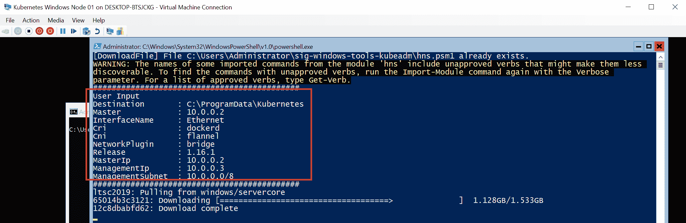

1.  您可能会遇到完全运行的 Docker 守护程序和正在拉取的镜像之间的*竞争条件*。如果出现错误，只需再次重启或使用相同命令重新启动安装过程——请记住在下一次尝试之前关闭现有的 PowerShell 会话并启动一个新的会话。根据您的网络连接情况，下载镜像可能需要一些时间。

1.  镜像已经被拉取，Kubernetes、Flannel 和 CNI 插件已经安装完毕，接下来将会要求您为从新的 Windows 节点访问主节点生成新的 SSH 密钥对——或者您也可以自己操作或重用现有的密钥对。这将使加入过程更加简单，因为加入脚本需要使用 SSH 来检索集群配置。在`10.0.0.2`主节点上执行脚本输出的命令，以将公钥添加到 Ubuntu 用户的`authorized_keys`中，如下截图所示：

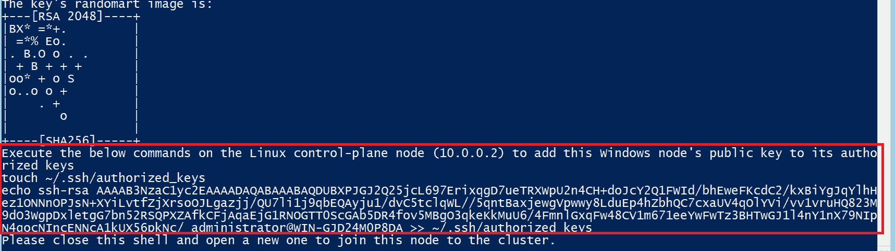

1.  安装完成后，关闭 PowerShell 窗口并打开一个新窗口，使用`powershell`命令。

1.  目前，您需要清理`ContainerBootstrap`调度程序任务，该任务在每次启动后重新运行脚本（这可能在未来的版本中得到修复），操作如下：

```
 Unregister-ScheduledTask -TaskName "ContainerBootstrap"
```

1.  使用`docker images`命令验证 Docker 镜像是否已被拉取，并通过运行`kubectl version`命令验证 Kubernetes 二进制文件是否已安装。

考虑导出 VM 镜像或创建检查点——如果您选择向集群添加更多的 Windows 节点或在加入过程中遇到问题，这将非常有用。现在我们终于可以将第一个 Windows 节点加入集群了！

# 使用 kubeadm 加入 Windows 节点

下一个任务是将我们的 Windows Server 2019 VM 作为 Kubernetes 集群中的节点加入。我们将使用来自 Kubernetes `sig-windows-tools`存储库的相同`KubeCluster.ps1`脚本，该脚本在内部使用**kubeadm**加入集群。该脚本将执行以下操作：

1.  使用 SSH 从`10.0.0.2`主节点检索*kubeconfig*文件。

1.  将**kubelet**注册为 Windows 服务。这将确保 kubelet 进程始终在 Windows 节点上运行。

1.  准备 CNI 插件的配置。

1.  创建**主机网络服务**（**HNS**）网络。

1.  添加防火墙规则（如果需要）。

1.  将**flanneld**和**kube-proxy**注册为 Windows 服务。

如果加入脚本失败，请启动新的 PowerShell 会话并重新运行脚本。

要加入 Windows 节点，请按以下步骤进行：

1.  在 Windows Server VM 的 Hyper-V 终端中，使用`powershell`命令启动新的 PowerShell 会话。

1.  通过运行以下命令导航到带有`sig-windows-tools`脚本的目录：

```
cd .\sig-windows-tools-kubeadm
```

1.  执行加入命令，就像这样：

```
.\KubeCluster.ps1 -ConfigFile .\Kubeclusterbridge.json -Join
```

如果`kubeadm join`命令出现任何问题（例如，挂起的预检查），您可以编辑`KubeClusterHelper.psm1`文件，找到`kubeadm join`命令，并添加`--v=3`参数（或任何其他详细程度）以获得更详细的信息。此外，您可以检查`C:\ProgramData\Kubernetes\logs`目录中的服务日志。还可以验证问题是否已知，网址为[`github.com/kubernetes-sigs/sig-windows-tools/issues`](https://github.com/kubernetes-sigs/sig-windows-tools/issues)——修复可能已经可用。

1.  加入新的 Windows 节点是一个相对快速的过程，几秒钟后，操作应该完成。现在，验证新节点是否在集群中可见，并且具有`Ready`状态，就像这样：

```
PS C:\src> kubectl get nodes
NAME                STATUS   ROLES    AGE   VERSION
kubernetes-master   Ready    master   26h   v1.16.1
win-gjd24m0p8da     Ready    <none>   11m   v1.16.1
```

1.  在 Windows 节点上，使用`ipconfig`命令验证 Flannel 是否已创建`cbr0_ep`接口，如下面的屏幕截图所示：

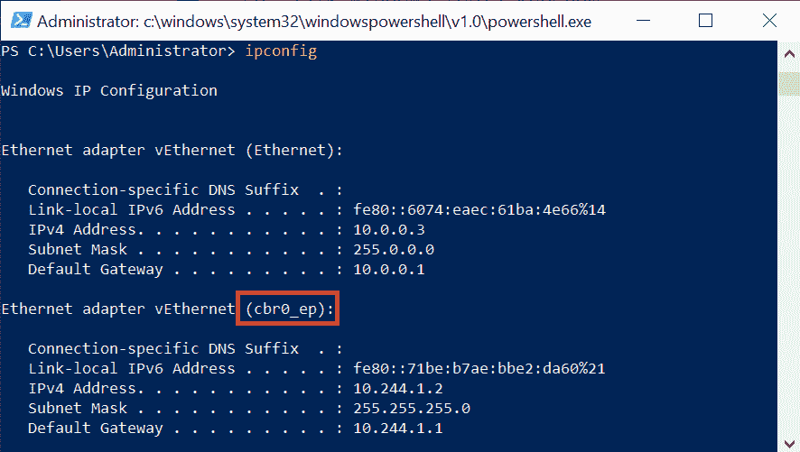

1.  通过创建一个临时的 PowerShell Pod 命名为`powershell-debug`来对新节点进行快速的烟雾测试。 Pod 规范覆盖必须包含`nodeSelector`，与 Windows 节点匹配，如下面的代码块所示：

```
kubectl run `
 --generator=run-pod/v1 powershell-debug `
 -i --tty `
 --image=mcr.microsoft.com/powershell:nanoserver-1809 `
 --restart=Never `
 --overrides='{\"apiVersion\": \"v1\", \"spec\": {\"nodeSelector\": { \"beta.kubernetes.io/os\": \"windows\" }}}'
```

1.  镜像拉取可能需要一些时间。您可以使用以下命令观察 Pod 事件：

```
kubectl describe pod powershell-debug
```

1.  当 Pod 启动时，请验证 DNS 解析和对外部地址的连接 - 例如，通过使用 `ping google.com` 命令，如下截图所示：

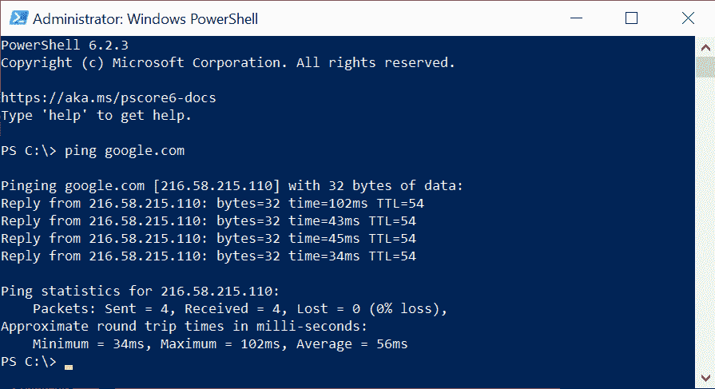

1.  退出容器，然后通过运行以下命令删除 Pod（我们没有使用 `--rm` 标志，以便您可以轻松使用 `kubectl describe` 命令调查任何问题）：

```
kubectl delete pod powershell-debug
```

为了完整起见，为了删除 Windows 节点并重置机器的状态（例如，在配置更改后，为了重新安装和加入），使用相同的 `KubeCluster.ps1` 脚本并执行以下命令：

```
.\KubeCluster.ps1 -ConfigFile .\Kubeclusterbridge.json -Reset
```

恭喜 - 现在，您拥有一个完全功能的混合 Windows/Linux Kubernetes 集群正在运行！您可以选择按照相同的说明或使用 VM 镜像添加更多的 Windows 或 Linux 节点（记得重新生成主机名、MAC 地址和 `product_uuids`）。

# 部署和检查您的第一个应用程序

现在，是时候用新创建的 Kubernetes 集群玩一些游戏了。我们将创建一个最小的 Deployment 与 NodePort Service，将应用程序暴露给用户。应用程序本身是官方的 ASP.NET Core 3.0 示例，打包为 Docker 镜像 - 您可以随意使用任何其他 Windows web 应用程序容器镜像，或者创建您自己的镜像。我们选择了官方示例，以便尽快进行部署，以便我们可以专注于 Kubernetes 操作。

要部署示例应用程序，请执行以下步骤：

1.  创建一个包含 Deployment 和 Service 定义的 `windows-example.yaml` 清单文件。您可以从 GitHub 仓库 ([`raw.githubusercontent.com/PacktPublishing/Hands-On-Kubernetes-on-Windows/master/Chapter07/09_windows-example/windows-example.yaml`](https://raw.githubusercontent.com/PacktPublishing/Hands-On-Kubernetes-on-Windows/master/Chapter07/09_windows-example/windows-example.yaml)) 下载它，或者直接将其应用到集群，如下所示：

```
apiVersion: apps/v1
kind: Deployment
metadata:
  name: windows-example
  labels:
    app: sample
spec:
  replicas: 3
  selector:
    matchLabels:
      app: windows-example
  template:
    metadata:
      name: windows-example
      labels:
        app: windows-example
    spec:
      nodeSelector:
        "beta.kubernetes.io/os": windows
      containers:
      - name: windows-example
        image: mcr.microsoft.com/dotnet/core/samples:aspnetapp-nanoserver-1809
        resources:
          limits:
            cpu: 1
            memory: 800M
          requests:
            cpu: .1
            memory: 300M
        ports:
          - containerPort: 80
---
apiVersion: v1
kind: Service
metadata:
  name: windows-example
spec:
  type: NodePort
  ports:
  - protocol: TCP
    port: 80
    nodePort: 31001
    targetPort: 80
  selector:
    app: windows-example
```

在此清单文件中有三个重要的点，已用粗体标记出来：

+   +   **为 Windows 节点进行调度** 需要使用带有值为 `"beta.kubernetes.io/os": windows` 的 `nodeSelector`。同样，如果您需要为 Linux 节点调度 Pods，在混合集群中应该使用带有值为 `"beta.kubernetes.io/os": linux` 的节点选择器。

+   Pod 定义包括一个基于`mcr.microsoft.com/dotnet/core/samples:aspnetapp-nanoserver-1809`镜像的容器。确保容器主机操作系统版本与容器基础镜像版本之间的**兼容性**非常重要。在这种情况下，Windows Server 2019 LTS 与基于 1809 的镜像兼容。如果您选择使用 Windows Server 1903 节点，则必须使用基于 1903 的镜像。

+   **NodePort Service**将在集群中的每个节点上的端口**31001**上公开。换句话说，您可以期望该应用程序在`10.0.0.2:31001`和`10.0.0.3:31001`端点可用。请注意，对于负载均衡器服务，如果您的基础设施没有负载均衡器，您可以考虑使用**keepalived**（[`github.com/munnerz/keepalived-cloud-provider`](https://github.com/munnerz/keepalived-cloud-provider)）。

1.  打开 PowerShell 窗口，并使用`kubectl`应用清单文件，就像这样：

```
kubectl apply -f .\windows-example.yaml
```

1.  等待 Pod 启动——初始镜像拉取可能需要几分钟。您可以使用以下命令观察 Pod 的状态：

```
PS C:\src> kubectl get pods --watch 
NAME                               READY STATUS   RESTARTS  AGE
windows-example-66cdf8c4bf-4472x   1/1   Running   0        9m17s
windows-example-66cdf8c4bf-647x8   1/1   Running   0        9m17s
windows-example-66cdf8c4bf-zxjdv   1/1   Running   0        9m17s
```

1.  打开你的互联网浏览器，转到`http://10.0.0.2:31001`和`http://10.0.0.3:31001`。您应该看到确认部署成功的示例应用程序网页，如下截图所示：

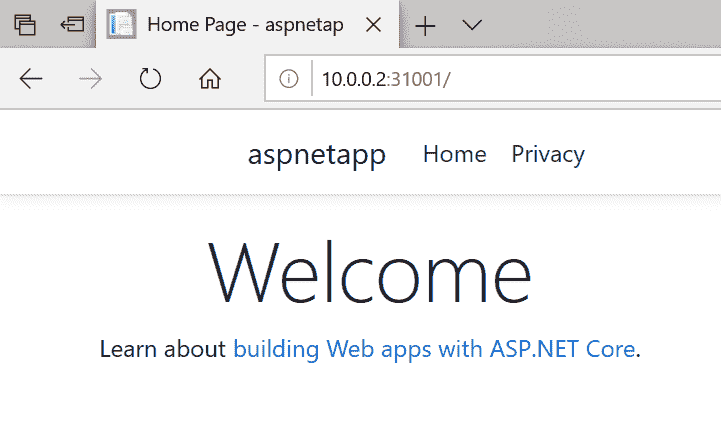

现在，让我们执行两个在调试应用程序时有用的常见操作，如下所示：

1.  检索 Pod 容器日志：要访问部署中一个 Pod（`windows-example-66cdf8c4bf-4472x`）的日志，请使用以下`kubectl logs`命令：

```
PS C:\src> kubectl logs windows-example-66cdf8c4bf-4472x
warn: Microsoft.AspNetCore.DataProtection.Repositories.FileSystemXmlRepository[60]
 Storing keys in a directory 'C:\Users\ContainerUser\AppData\Local\ASP.NET\DataProtection-Keys' that may not be persisted outside of the container. Protected data will be unavailable when container is destroyed.
info: Microsoft.Hosting.Lifetime[0]
 Now listening on: http://[::]:80
info: Microsoft.Hosting.Lifetime[0]
 Application started. Press Ctrl+C to shut down.
info: Microsoft.Hosting.Lifetime[0]
 Hosting environment: Production
info: Microsoft.Hosting.Lifetime[0]
 Content root path: C:\app
warn: Microsoft.AspNetCore.HttpsPolicy.HttpsRedirectionMiddleware[3]
 Failed to determine the https port for redirect.
```

1.  执行进入 Pod 容器以检查应用程序配置。要启动一个新的`cmd` shell（`nanoserver`镜像中不可用 PowerShell），请运行以下`kubectl exec`命令：

```
PS C:\src> kubectl exec -it windows-example-66cdf8c4bf-4472x cmd
Microsoft Windows [Version 10.0.17763.802]
(c) 2018 Microsoft Corporation. All rights reserved.

C:\app>
```

1.  您现在可以自由访问和修改容器，这在调试和测试场景中非常有用。例如，您可以像这样获取`appsettings.json`文件的内容：

```
C:\app>type appsettings.json
{
 "Logging": {
 "LogLevel": {
 "Default": "Information",
 "Microsoft": "Warning",
 "Microsoft.Hosting.Lifetime": "Information"
 }
 },
 "AllowedHosts": "*"
}
```

正如您所看到的，将示例 Windows 应用程序部署到 Kubernetes 集群非常容易，而且您从 Linux Kubernetes 集群中了解的所有调试技术都完全相同。

# 摘要

在本章中，您已经学习了如何在 Hyper-V 主机上创建本地 Windows/Linux Kubernetes 集群的过程。这种方法对于创建本地开发集群以及在云环境之外部署生产集群非常有用。让我们回顾一下程序——我们首先规划了节点、Pod 和 Service 的集群设计和网络**无类域间路由**（**CIDRs**）。然后，我们创建了 Ubuntu Server 18.04 LTS VM——我们的 Kubernetes 主节点。创建主节点需要对操作系统进行初始配置并安装 Docker。使用 kubeadm 进行初始化。下一个重要步骤是安装 Kubernetes Pod 网络，该网络必须与 Linux 和 Windows 节点兼容。在我们的情况下，我们选择了带有`host-gw`后端的 Flannel，这是目前唯一稳定的本地混合集群的网络解决方案。之后，您将学习如何创建 Windows Server 2019 LTS VM 以及如何使用 kubeadm 和`sig-windows-tools`脚本将机器加入 Kubernetes 集群。最后，我们部署了一个示例 ASP.NET Core 3.0 应用程序，并执行了常见操作，如访问容器日志或进入容器。

在下一章中，您将学习如何使用 AKS Engine 执行类似的集群部署。目前，这是在云中部署混合 Kubernetes 集群的最佳和最稳定的方法。

# 问题

1.  何时应该使用内部 NAT Hyper-V vSwitch？外部 vSwitch 有哪些用例？

1.  为准备 Linux 节点或主节点需要哪些配置步骤？

1.  服务子网范围和 Pod 子网范围是什么？

1.  如何生成一个新的 kubeadm 令牌以加入集群？

1.  如何允许将应用程序 Pod 调度到主节点？

1.  在本地集群中，Linux 和 Windows 节点的推荐网络解决方案是什么？

1.  加入集群的 Windows 节点需要执行哪些步骤？

1.  访问 Pod 容器日志的命令是什么？

您可以在本书的后部的*评估*中找到这些问题的答案。

# 进一步阅读

+   目前，关于混合 Windows/Linux 集群部署的大多数资源都可以在线获得。有两个官方指南用于创建这样的集群：

+   Kubernetes 指南，网址为：[`kubernetes.io/docs/setup/production-environment/windows/intro-windows-in-kubernetes/`](https://kubernetes.io/docs/setup/production-environment/windows/intro-windows-in-kubernetes/)。

+   Microsoft 指南，网址为：[`docs.microsoft.com/en-us/virtualization/windowscontainers/kubernetes/getting-started-kubernetes-windows`](https://docs.microsoft.com/en-us/virtualization/windowscontainers/kubernetes/getting-started-kubernetes-windows)。

这两个指南经常更新，因此值得检查它们，因为随着时间的推移，部署过程可能会变得更加简化。

+   您还可以在 Microsoft 的以下**软件定义网络**（**SDN**）存储库中找到有用的信息，网址为：[`github.com/microsoft/SDN/tree/master/Kubernetes/windows`](https://github.com/microsoft/SDN/tree/master/Kubernetes/windows)。它包含许多辅助脚本，逐渐被采用到官方部署说明和 kubeadm 集成中。

+   有关 kubeadm 的用法和文档，请参阅[`kubernetes.io/docs/setup/production-environment/tools/kubeadm/create-cluster-kubeadm/`](https://kubernetes.io/docs/setup/production-environment/tools/kubeadm/create-cluster-kubeadm/)。

+   如果您需要帮助解决问题和常见问题，您可以使用以下指南：

+   [`docs.microsoft.com/en-us/virtualization/windowscontainers/kubernetes/common-problems`](https://docs.microsoft.com/en-us/virtualization/windowscontainers/kubernetes/common-problems)。

+   [`kubernetes.io/docs/setup/production-environment/windows/intro-windows-in-kubernetes/#troubleshooting`](https://kubernetes.io/docs/setup/production-environment/windows/intro-windows-in-kubernetes/#troubleshooting)。

+   [`techcommunity.microsoft.com/t5/Networking-Blog/Troubleshooting-Kubernetes-Networking-on-Windows-Part-1/ba-p/508648`](https://techcommunity.microsoft.com/t5/Networking-Blog/Troubleshooting-Kubernetes-Networking-on-Windows-Part-1/ba-p/508648)——特定于 Windows 容器网络问题的故障排除指南。
