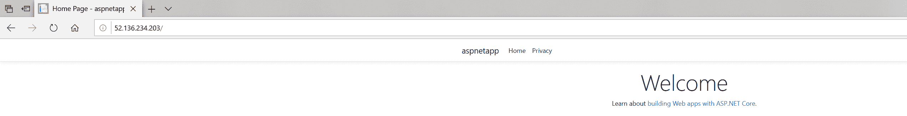
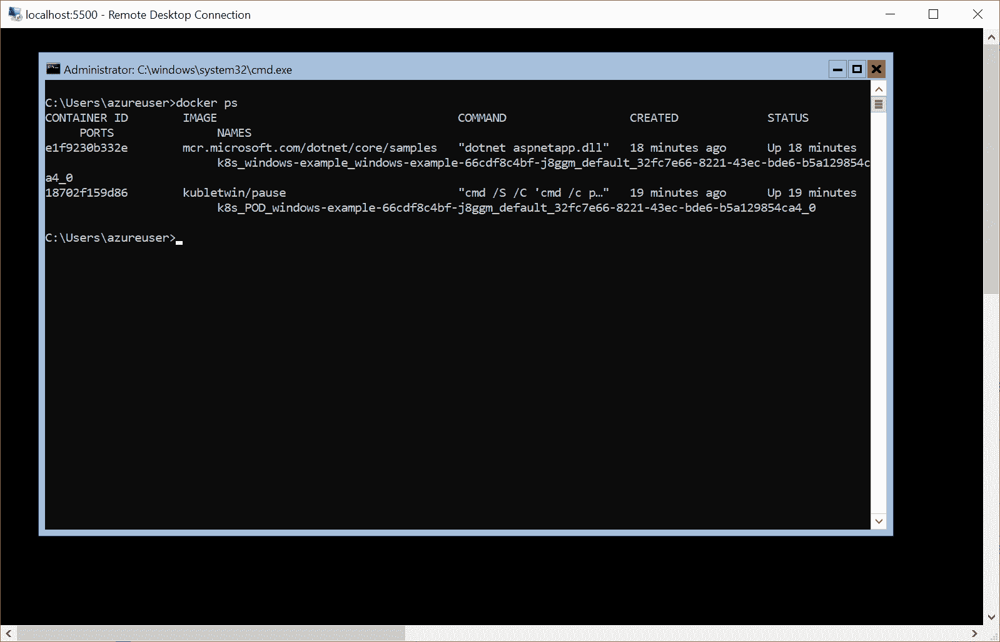
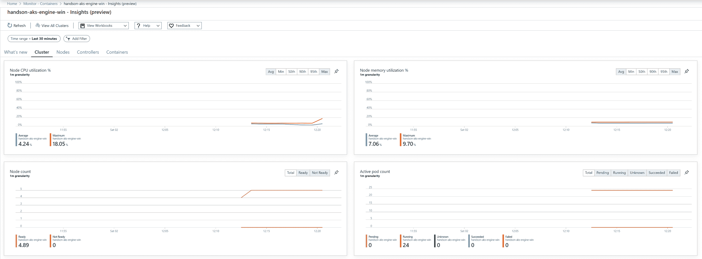
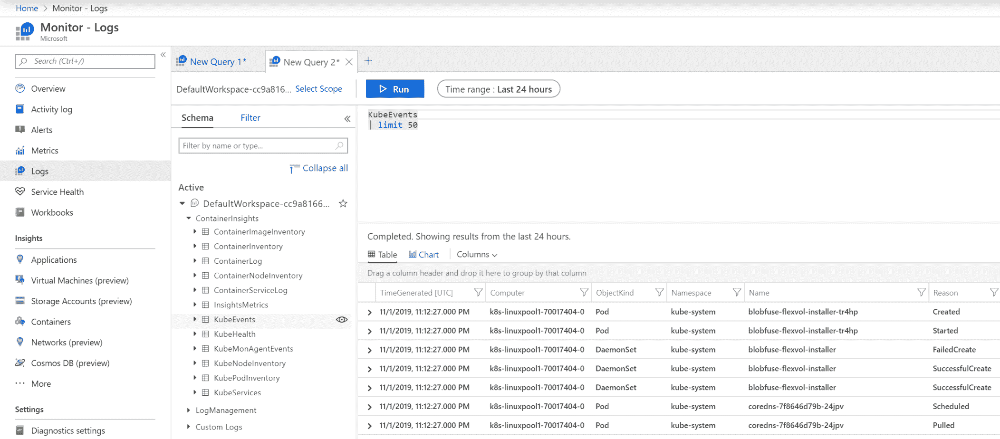

# 部署混合 Azure Kubernetes 服务引擎集群

上一章概述了如何在本地环境中创建混合 Windows/Linux Kubernetes 集群的方法。这种方法也可以用于基础设施即服务云环境中的部署，但如果您使用 Azure，您有一个更简单的解决方案：**Azure Kubernetes 服务**（**AKS**）**引擎** ([`github.com/Azure/aks-engine`](https://github.com/Azure/aks-engine))。该项目旨在提供一种使用**Azure 资源管理器**（**ARM**）模板部署自管理 Kubernetes 集群的 Azure 本地方式，可以利用 Kubernetes 的所有 Azure 云集成，例如负载均衡器服务。此外，使用 AKS Engine，您可以支持使用 Windows 节点部署 Kubernetes 集群，与本地环境相比，需要的配置和节点准备较少。换句话说，您将能够在几分钟内部署一个生产级的高可用混合集群。

AKS Engine 与其他概念（如 AKS、acs-engine 和 Azure Stack）的关系进行简要总结非常重要：

+   AKS Engine 和 AKS 不是相同的 Azure 产品。AKS 是一个 Azure 服务，可以让您创建一个完全托管的 Kubernetes 集群-我们在第四章中概述了 AKS 并演示了如何使用 AKS 部署混合 Windows/Linux 集群，但 AKS Engine 是 AKS 内部使用的，但您不能使用 AKS 来管理 AKS

+   acs-engine 是 AKS Engine 的前身，因此您可能会发现很多文档提到 acs-engine 而不是 AKS Engine。AKS Engine 是 acs-engine 的向后兼容的延续。

+   从技术上讲，如果您使用 Azure Stack，也可以在本地环境中使用 AKS Engine。您可以在这里阅读更多信息：[`docs.microsoft.com/en-us/azure-stack/user/azure-stack-kubernetes-aks-engine-overview`](https://docs.microsoft.com/en-us/azure-stack/user/azure-stack-kubernetes-aks-engine-overview)。

在本章中，我们将重点关注 AKS Engine 并在 Azure 云中部署混合 Windows/Linux 集群。我们将涵盖以下主题：

+   安装 AKS Engine

+   创建 Azure 资源组和服务主体

+   使用 API 模型和生成 Azure 资源管理器模板

+   部署集群

+   部署和检查您的第一个应用程序

# 技术要求

对于本章，您将需要以下内容：

+   已安装 Windows 10 Pro、企业版或教育版（1903 版本或更高版本，64 位）

+   一个 Azure 账户

+   已安装 Windows 的 Chocolatey 软件包管理器（[`chocolatey.org/`](https://chocolatey.org/)）

+   可选地，如果您想要可视化 AKS Engine 生成的 ARM 模板，可以安装 Visual Studio Code

使用 Chocolatey 软件包管理器并非强制，但它可以使安装过程和应用程序版本管理更加简单。安装过程在此处有文档：[`chocolatey.org/install`](https://chocolatey.org/install)。

要跟着做，您需要自己的 Azure 账户以创建 Kubernetes 集群的 Azure 资源。如果您之前还没有创建过账户，您可以在此处了解如何获取个人使用的有限免费账户：[`azure.microsoft.com/en-us/free/`](https://azure.microsoft.com/en-us/free/)。

您可以从官方 GitHub 存储库下载本章的最新代码示例：[`github.com/PacktPublishing/Hands-On-Kubernetes-on-Windows/tree/master/Chapter08`](https://github.com/PacktPublishing/Hands-On-Kubernetes-on-Windows/tree/master/Chapter08)。

# 安装 AKS Engine

AKS Engine 本身是一个命令行工具，可以根据提供的配置文件生成基于 Azure 资源管理器（ARM）模板。要使用 AKS Engine，您需要以下内容，其安装过程在前几章中有描述：

+   **Azure CLI 和 Azure Cloud Shell：** 指南可在第二章中找到，*管理容器中的状态*，在*使用远程/云存储进行容器存储*部分。

+   **kubectl：** 指南可在第六章中找到，*与 Kubernetes 集群交互*，在*安装 Kubernetes 命令行工具*部分。

+   **Windows 下的 SSH 客户端：** 指南可在第七章中找到，*部署混合本地 Kubernetes 集群*，在*使用 kubeadm 创建 Kubernetes 主节点*部分。

在您的计算机上安装了所有工具后，您可以继续安装 AKS Engine 本身。在 Windows 上推荐的安装方法是使用 Chocolatey。或者，您可以下载 AKS Engine 二进制文件（[`github.com/Azure/aks-engine/releases/latest`](https://github.com/Azure/aks-engine/releases/latest)），解压它们，并将它们添加到您的`$env:PATH`环境变量中。要使用 Chocolatey 安装 AKS Engine，请按照以下步骤进行：

1.  以管理员身份打开 PowerShell 窗口。

1.  要安装`aks-engine`软件包，请执行以下命令：

```
choco install aks-engine
```

1.  如果您想安装特定版本的 AKS Engine，例如`0.42.0`，请使用以下命令：

```
choco install aks-engine --version=0.42.0
```

1.  验证您的安装是否成功：

```
PS C:\src> aks-engine version
Version: v0.42.0
GitCommit: 0959ab812
GitTreeState: clean
```

现在，您已经准备好继续下一步-配置 Kubernetes 集群的先决条件。让我们开始收集初始集群信息并创建 Azure 资源组。

# 创建 Azure 资源组和服务主体

在使用 AKS Engine 部署 Kubernetes 集群之前，我们需要执行以下初始步骤：

1.  您需要确保在 Azure 订阅中具有适当的权限来创建和分配 Azure 活动目录服务主体。如果您只是为了进行演示而创建了 Azure 帐户，则默认情况下将具有权限。

1.  确定要用于部署集群的 Azure 订阅的`SubscriptionId`。您可以通过打开 PowerShell 窗口并执行以下命令来执行此操作：

```
PS C:\src> az login
PS C:\src> az account list -o table
Name           CloudName    SubscriptionId                        State    IsDefault
-------------  -----------  ------------------------------------  -------  -----------
Pay-As-You-Go  AzureCloud   cc9a8166-829e-401e-a004-76d1e3733b8e  Enabled  True
```

在接下来的段落中，我们将使用`cc9a8166-829e-401e-a004-76d1e3733b8e`作为`SubscriptionId`。

1.  确定一个全局唯一的`dnsPrefix`，您想要用于集群内主机名的。或者，您可以依赖于 AKS Engine 自动生成的前缀。在接下来的段落中，我们将使用`handson-aks-engine-win`作为前缀。

1.  选择要用于部署集群的 Azure 位置。在接下来的示例中，我们将使用`westeurope`。

1.  为您的集群选择一个新的 Azure 资源组的名称。在接下来的段落中，我们将使用`aks-engine-windows-resource-group`。

1.  为 Windows 节点选择用户名和密码。为此，我们将使用`azureuser`和`S3cur3P@ssw0rd`-请记住使用您自己的安全密码！

1.  生成一个 SSH 密钥对，您可以用它来连接到 Linux 节点。如果您选择在 Windows 节点上安装 OpenSSH 服务器，您以后可以使用相同的密钥对来访问 Windows 节点。

下一段描述的先决条件创建和 AKS Engine 部署步骤已在此处提供的 PowerShell 脚本中捕获：[`github.com/PacktPublishing/Hands-On-Kubernetes-on-Windows/blob/master/Chapter08/01_aks-engine/01_CreateAKSEngineClusterWithWindowsNodes.ps1`](https://github.com/PacktPublishing/Hands-On-Kubernetes-on-Windows/blob/master/Chapter08/01_aks-engine/01_CreateAKSEngineClusterWithWindowsNodes.ps1)。

现在，请按照以下步骤创建 Azure 资源组和 Azure 活动目录服务主体：

1.  打开 PowerShell 窗口并使用 Azure CLI 登录：

```
az login
```

1.  使用以下命令为您的集群创建 Azure 资源组：

```
az group create `
 --name aks-engine-windows-resource-group `
 --location westeurope
```

1.  为您的集群创建 Azure 活动目录服务主体。使用适当的`Subscription ID`和`Resource Group`名称：

```
az ad sp create-for-rbac `
 --role="Contributor" `
 --scopes="/subscriptions/cc9a8166-829e-401e-a004-76d1e3733b8e/resourceGroups/aks-engine-windows-resource-group"
```

请注意，如果范围仅限于特定的资源组，则将无法使用容器监视附加组件。我们将在接下来的章节中介绍为此目的配置 AAD 服务主体。

1.  检查上一个命令的输出，并注意`appId`和`password`。您无法以后检索密码：

```
{
 "appId": "7614823f-aca5-4a31-b2a5-56f30fa8bd8e",
 "displayName": "azure-cli-2019-10-19-12-48-08",
 "name": "http://azure-cli-2019-10-19-12-48-08",
 "password": "8737c1e6-b1b1-4c49-a195-f7ea0fe37613",
 "tenant": "86be0945-a0f3-44c2-8868-9b6aa96b0b62"
}
```

最后一步是为访问集群中的 Linux 节点生成 SSH 密钥对：

1.  打开 PowerShell 窗口。

1.  如果您已经按照前面的章节操作，可能已经生成了一个 SSH 密钥对，您可以重复使用并跳过下一步。要检查是否有现有的 SSH 密钥对，请使用以下命令：

```
ls ~\.ssh\id_rsa.pub
```

1.  如果您需要生成密钥对，请执行以下命令（建议使用默认值）：

```
ssh-keygen
```

现在，您拥有 AKS Engine 部署所需的所有信息。我们需要做的就是准备 AKS Engine apimodel 并为我们的集群生成 ARM 模板。

# 使用 apimodel 并生成 Azure 资源管理器模板

在其核心，AKS Engine 使用一个**apimodel**（或集群定义）JSON 文件来生成可以用于直接部署 Kubernetes 集群到 Azure 的 Azure 资源管理器模板。apimodel 的文档和模式可以在这里找到：[`github.com/Azure/aks-engine/blob/master/docs/topics/clusterdefinitions.md`](https://github.com/Azure/aks-engine/blob/master/docs/topics/clusterdefinitions.md)。AKS Engine 在集群定义中提供了对 Windows 节点的开箱即用支持。您可以在官方 AKS Engine GitHub 存储库中找到示例：[`github.com/Azure/aks-engine/tree/master/examples/windows`](https://github.com/Azure/aks-engine/tree/master/examples/windows)。

现在让我们根据最小的 Windows 集群示例定义（[`github.com/Azure/aks-engine/blob/master/examples/windows/kubernetes.json`](https://github.com/Azure/aks-engine/blob/master/examples/windows/kubernetes.json)）创建一个自定义的 apimodel。我们还将包括两个 Linux 节点，以便运行混合的 Windows/Linux 配置（一个 Linux 主节点，两个 Windows 节点和两个 Linux 节点）。按照以下步骤进行：

1.  下载以下文件，并将其保存为`kubernetes-windows.json`：[`raw.githubusercontent.com/Azure/aks-engine/master/examples/windows/kubernetes.json`](https://raw.githubusercontent.com/Azure/aks-engine/master/examples/windows/kubernetes.json)。

1.  将`properties.orchestratorProfile.orchestratorRelease`更改为所需的 Kubernetes 版本，例如`1.16`。

1.  将`properties.masterProfile.dnsPrefix`修改为所选的 DNS 前缀。在示例中，我们使用`handson-aks-engine-win`，但您需要选择您自己的唯一前缀。

1.  通过将以下 JSON 对象添加到`properties.agentPoolProfiles`中，添加一个 Linux 节点池：

```
{
    "name": "linuxpool1",
    "count": 2,
    "vmSize": "Standard_D2_v3",
    "availabilityProfile": "AvailabilitySet"
}
```

1.  将`properties.windowsProfile.adminUsername`和`properties.windowsProfile.adminPassword`修改为 Windows 节点的所选用户名和密码。

1.  将`~\.ssh\id_rsa.pub`的内容复制到`properties.linuxProfile.ssh.publicKeys.keyData`。

1.  在`properties.servicePrincipalProfile.clientId`中使用服务主体`appId`，在`properties.servicePrincipalProfile.secret`中使用`password`。

1.  一个示例的自定义文件具有以下内容：

```
{
 "apiVersion": "vlabs",
    "properties": {
        "orchestratorProfile": {
            "orchestratorType": "Kubernetes",
            "orchestratorRelease": "1.16"
        },
        "masterProfile": {
            "count": 1,
            "dnsPrefix": "handson-aks-engine-win",
            "vmSize": "Standard_D2_v3"
        },
        "agentPoolProfiles": [{
                "name": "linuxpool1",
                "count": 2,
                "vmSize": "Standard_D2_v3",
                "availabilityProfile": "AvailabilitySet"
            },{
                "name": "windowspool2",
                "count": 2,
                "vmSize": "Standard_D2_v3",
                "availabilityProfile": "AvailabilitySet",
                "osType": "Windows",
                "osDiskSizeGB": 128,
                "extensions": [{
                        "name": "winrm"
                    }
                ]
            }
        ],
        "windowsProfile": {
            "adminUsername": "azureuser",
            "adminPassword": "S3cur3P@ssw0rd",
            "sshEnabled": true
        },
        "linuxProfile": {
            "adminUsername": "azureuser",
            "ssh": {
                "publicKeys": [{
                        "keyData": "<contents of ~\.ssh\id_rsa.pub>"
                    }
                ]
            }
        },
        "servicePrincipalProfile": {
            "clientId": "8d4d1104-7818-4883-88d2-2146b658e4b2",
            "secret": "9863e38c-896f-4dba-ac56-7a3c1849a87a"
        },
        "extensionProfiles": [{
                "name": "winrm",
                "version": "v1"
            }
        ]
    }
}
```

apimodel 已准备好供 AKS Engine 使用。使用以下命令生成 ARM 模板：

```
aks-engine generate .\kubernetes-windows.json
```

这将在`_output\<dnsPrefix>`目录中生成 ARM 模板（带参数）、完整的 apimodel 和 kubeconfigs（对于每个可能的 Azure 位置）。您可以检查这些文件以了解集群的设计方式 - 可选地，如果您安装了 Visual Studio Code，可以使用以下优秀的扩展来可视化 ARM 模板 - [`marketplace.visualstudio.com/items?itemName=bencoleman.armview`](https://marketplace.visualstudio.com/items?itemName=bencoleman.armview)：

1.  在 VS Code 中，安装了扩展程序后，打开`_output\<dnsPrefix>\azuredeploy.json` ARM 模板文件。

1.  使用以下图标可视化 ARM 模板：

！[](assets/0c7a2ed2-e1da-4a5f-8c71-39fcd491d5a0.png)

1.  使用以下图标加载 ARM 模板参数`_output\<dnsPrefix>\azuredeploy.parameters.json`：

！[](assets/2a732b78-e8bc-4bb7-a93d-5fb04f0aceae.png)

1.  您现在可以方便地检查 ARM 模板：

！[](assets/e1cf1e78-dea2-465b-b44d-e4273c0fa74b.png)

此时，我们准备使用 Azure CLI 部署集群！

# 部署集群

为了从 Azure 资源管理器模板部署 Kubernetes 集群，我们将使用`az group deployment create`命令。这个 Azure CLI 命令需要传递 ARM 模板（`_output\<dnsPrefix>\azuredeploy.json`）和 ARM 参数文件（`_output\<dnsPrefix>\azuredeploy.parameters.json`）。要部署集群，请执行以下步骤：

1.  执行命令：

```
az group deployment create `
 --name kubernetes-windows-cluster `
 --resource-group aks-engine-windows-resource-group `
 --template-file ".\_output\<dnsPrefix>\azuredeploy.json" `
 --parameters ".\_output\<dnsPrefix>\azuredeploy.parameters.json"
```

如果遇到任何问题，您可以通过转到资源组并单击右上角的“部署：失败”链接，在 Azure 门户中检查 ARM 部署失败的详细信息。对于任何`InternalServerErrors`，您可以尝试选择另一个 Azure 位置，例如`westus`。

1.  部署完成后，将以 JSON 格式返回创建的资源列表和输出变量：

```
      ...
      "agentStorageAccountSuffix": {
        "type": "String",
        "value": ""
      },
      "masterFQDN": {
        "type": "String",
        "value": "<dnsPrefix>.westeurope.cloudapp.azure.com"
      },
      "primaryAvailabilitySetName": {
        "type": "String",
        "value": "windowspool2-availabilitySet-70017404"
      },
      ...
```

1.  提取`masterFQDN`属性。这是您的 Kubernetes 主 DNS 名称。

或者，您可以采用使用`aks-engine deploy`命令的方法，该命令结合了自定义集群定义和生成并部署 ARM 模板为一条命令。请注意，为了使用容器监视功能，您现在必须使用`aks-engine deploy`命令。

现在，我们需要连接到我们的新集群。 AKS Engine 与 ARM 模板一起生成了一组`kubeconfigs`，用于所有可能的 Azure 位置，格式为`.\_output\<dnsPrefix>\kubeconfig\kubeconfig.<azureLocation>.json`。在我们的情况下，我们使用了位置`westeurope`，因此 kubeconfig 是`.\_output\<dnsPrefix>\kubeconfig\kubeconfig.westeurope.json`。要将此 kubeconfig 用于您的 kubectl，您可以使用第六章中提供的配置管理技术之一，*与 Kubernetes 集群交互*。例如，要将此文件与您现有的默认 kubeconfig 合并，请执行以下步骤：

1.  检查`.\_output\<dnsPrefix>\kubeconfig\kubeconfig.westeurope.json`的内容，以了解集群名称和上下文名称。两者应与您的`<dnsPrefix>`相同。

1.  执行文件与默认 kubeconfig 的测试合并。使用以下命令：

```
$env:KUBECONFIG=".\_output\<dnsPrefix>\kubeconfig\kubeconfig.westeurope.json;$env:USERPROFILE\.kube\config"
kubectl config view --raw
```

1.  仔细检查输出，以确定合并的配置是否包含您期望的所有集群和上下文。

1.  将合并后的文件保存为默认配置，并切换到使用新的`<dnsPrefix>`上下文：

```
$env:KUBECONFIG=".\_output\<dnsPrefix>\kubeconfig\kubeconfig.westeurope.json;$env:USERPROFILE\.kube\config"
kubectl config view --raw > $env:USERPROFILE\.kube\config_new 
Move-Item -Force $env:USERPROFILE\.kube\config_new $env:USERPROFILE\.kube\config

kubectl config use-context "<dnsPrefix>"
```

1.  测试与您的新集群的连接：

```
PS C:\src\temp> kubectl get nodes --all-namespaces
NAME                        STATUS   ROLES    AGE   VERSION
7001k8s000                  Ready    agent    16m   v1.16.1
7001k8s001                  Ready    agent    16m   v1.16.1
k8s-linuxpool1-70017404-0   Ready    agent    13m   v1.16.1
k8s-linuxpool1-70017404-1   Ready    agent    13m   v1.16.1
k8s-master-70017404-0       Ready    master   18m   v1.16.1
PS C:\src\temp> kubectl get pods --all-namespaces
NAMESPACE     NAME                                            READY   STATUS    RESTARTS   AGE
kube-system   azure-cni-networkmonitor-ftnqs                  1/1     Running   0          18m
kube-system   azure-ip-masq-agent-vqdhz                       1/1     Running   0          18m
...
```

请注意，由 AKS Engine 部署的集群根据在 ARM 模板中使用的资源计费。您应该使用 Azure 定价计算器来确定预计成本。如果您不再需要该集群，建议删除以避免任何不必要的费用。要删除 AKS Engine 集群，请使用以下命令：`az group delete --name aks-engine-windows-resource-group --yes --no-wait`。

恭喜！您已经使用 AKS Engine 在 Azure 上部署了一个功能齐全的混合 Windows/Linux 集群！让我们看看如何将一个简单的应用程序部署到集群，并与集群进行交互。

# 部署和检查您的第一个应用程序

在这一部分，我们将执行与上一章类似的练习 - 我们将部署一个示例的 ASP.NET Core 3.0 应用程序（使用部署对象）到我们的 AKS Engine 集群，并演示基本的 kubectl 操作。与在本地集群的工作许多方面保持一致 - 最大的区别是您可以轻松地利用 Azure 的功能和集成。为了演示这一点，我们将使用 LoadBalancer 类型的服务来暴露应用程序，而不是 NodePort。由于 Kubernetes 云提供程序为 Azure，LoadBalancer 服务将与 Azure 负载均衡器实例进行本地集成。

# 基本操作

要部署示例应用程序，请按照以下步骤进行：

1.  创建一个`windows-example.yaml`清单文件，其中包含一个部署和服务定义。您可以从 GitHub 存储库（[`raw.githubusercontent.com/PacktPublishing/Hands-On-Kubernetes-on-Windows/master/Chapter08/03_windows-example/windows-example.yaml`](https://raw.githubusercontent.com/PacktPublishing/Hands-On-Kubernetes-on-Windows/master/Chapter08/03_windows-example/windows-example.yaml)）下载它，或者直接将其应用到集群中：

```
apiVersion: apps/v1
kind: Deployment
metadata:
  name: windows-example
  labels:
    app: sample
spec:
  replicas: 3
  selector:
    matchLabels:
      app: windows-example
  template:
    metadata:
      name: windows-example
      labels:
        app: windows-example
    spec:
      nodeSelector:
 "beta.kubernetes.io/os": windows
      containers:
      - name: windows-example
        image: mcr.microsoft.com/dotnet/core/samples:aspnetapp-nanoserver-1809
        resources:
          limits:
            cpu: 1
            memory: 800M
          requests:
            cpu: .1
            memory: 300M
        ports:
          - containerPort: 80
---
apiVersion: v1
kind: Service
metadata:
  name: windows-example
spec:
  type: LoadBalancer
  ports:
  - protocol: TCP
    port: 80
  selector:
    app: windows-example
```

在这个清单文件中有三个重要的点，已经用粗体标记出来：

+   +   **为 Windows 节点调度**需要使用`nodeSelector`，其值为`"beta.kubernetes.io/os": windows`。同样，如果您需要为 Linux 节点调度 Pods，您应该在混合集群中使用`"beta.kubernetes.io/os": linux`节点选择器。这与本地集群完全相同。

+   Pod 定义包括一个基于`mcr.microsoft.com/dotnet/core/samples:aspnetapp-nanoserver-1809`镜像的容器。确保容器的主机操作系统版本与容器的基本镜像版本**兼容**非常重要-这个要求与本地集群中的要求相同。您可以使用 AKS Engine apimodel JSON 文件中的`properties.windowsProfile`中的自定义`windowsSku`属性来控制 AKS Engine 集群中的 Windows Server 版本。您可以在官方文档中阅读更多内容：[`github.com/Azure/aks-engine/blob/master/docs/topics/windows-and-kubernetes.md#choosing-the-windows-server-version`](https://github.com/Azure/aks-engine/blob/master/docs/topics/windows-and-kubernetes.md#choosing-the-windows-server-version)。对于现有集群，您可以使用`kubectl get nodes -o wide`命令检查节点的 Windows Server 版本。

+   服务规范的类型设置为`LoadBalancer`。这将导致为服务创建一个外部可访问的 Azure 负载均衡器。您可以在第五章中了解更多关于这种类型服务的信息，*Kubernetes Networking*。

1.  打开 PowerShell 窗口并使用`kubectl`应用清单文件。如果您还没有合并您的`kubeconfigs`，请记得首先设置正确的`$env:KUBECONFIG`变量，并切换到适当的 kubectl 上下文：

```
kubectl apply -f .\windows-example.yaml
```

1.  等待 Pod 启动-初始镜像拉取可能需要几分钟。您可以使用以下命令观察 Pod 的状态：

```
PS C:\src> kubectl get pods --watch 
NAME                               READY   STATUS    RESTARTS   AGE
windows-example-66cdf8c4bf-f5bd8   1/1     Running   0          101s
windows-example-66cdf8c4bf-g4v4s   1/1     Running   0          101s
windows-example-66cdf8c4bf-xkbpf   1/1     Running   0          101s
```

1.  等待服务的外部 IP 创建。您可以使用以下命令观察服务的状态：

```
PS C:\src> kubectl get services --watch
NAME              TYPE           CLUSTER-IP     EXTERNAL-IP      PORT(S)        AGE
kubernetes        ClusterIP      10.0.0.1       <none>           443/TCP        24m
windows-example   LoadBalancer   10.0.158.121   52.136.234.203   80:32478/TCP   3m55s
```

1.  打开您的互联网浏览器并导航到 Azure 负载均衡器地址-在这个例子中，它是`http://52.136.234.203/`。您应该看到示例应用程序的网页，这证实了部署成功：



执行常见操作，如访问 Pod 容器日志或在 Pod 容器内执行临时进程，与本地集群完全相同-我们将简要回顾如何做到这一点：

1.  为了访问作为部署的一部分创建的一个 Pod（`windows-example-66cdf8c4bf-f5bd8`）的日志，使用以下`kubectl logs`命令：

```
kubectl logs windows-example-66cdf8c4bf-f5bd8
```

1.  要**exec**到相同的 Pod 容器中，例如，启动一个交互式`cmd` shell 并运行`kubectl exec`命令：

```
kubectl exec -it windows-example-66cdf8c4bf-f5bd8 cmd
```

1.  您现在可以自由访问和修改容器，这在调试和测试场景中非常有用。例如，您可以获取`appsettings.json`文件的内容：

```
C:\app>type appsettings.json
{
 "Logging": {
 "LogLevel": {
 "Default": "Information",
 "Microsoft": "Warning",
 "Microsoft.Hosting.Lifetime": "Information"
 }
 },
 "AllowedHosts": "*"
}
```

接下来，让我们看看如何连接到在 AKS Engine 集群中使用的实际虚拟机。

# 连接到虚拟机

要连接到 Linux 主虚拟机，您可以使用 SSH 并直接连接到它，因为它暴露在公共网络中：

1.  在 PowerShell 窗口中，执行以下命令（您的公共 SSH 密钥将用于身份验证）：

```
ssh azureuser@<dnsPrefix>.westeurope.cloudapp.azure.com
```

1.  现在，您可以执行任何维护或调试操作，例如访问 kubelet 服务日志：

```
azureuser@k8s-master-70017404-0:~$ sudo journalctl -u kubelet -o cat
Stopped Kubelet.
Starting Kubelet...
net.ipv4.tcp_retries2 = 8
Bridge table: nat
Bridge chain: PREROUTING, entries: 0, policy: ACCEPT
Bridge chain: OUTPUT, entries: 0, policy: ACCEPT
Bridge chain: POSTROUTING, entries: 0, policy: ACCEPT
Chain PREROUTING (policy ACCEPT)
```

对于 Windows 节点（或其他 Linux 节点），该过程会更加复杂，因为 VM 位于私有 IP 范围内。这意味着您需要通过 Linux 主节点使用 SSH 本地端口转发来连接远程桌面连接或 SSH：

1.  首先，查询要连接的 Windows 节点的私有 IP 地址。您可以使用以下命令查看所有节点的名称：

```
az vm list --resource-group aks-engine-windows-resource-group -o table
```

1.  使用名称获取节点的私有 IP 地址，例如`7001k8s000`：

```
PS C:\src> az vm show -g aks-engine-windows-resource-group -n 7001k8s000 --show-details --query 'privateIps'
"10.240.0.4,10.240.0.5,10.240.0.6,10.240.0.7,10.240.0.8,10.240.0.9,10.240.0.10,10.240.0.11,10.240.0.12,10.240.0.13,10.240.0.14,10.240.0.15,10.240.0.16,10.240.0.17,10.240.0.18,10.240.0.19,10.240.0.20,10.240.0.21,10.240.0.22,10.240.0.23,10.240.0.24,10.240.0.25,10.240.0.26,10.240.0.27,10.240.0.28,10.240.0.29,10.240.0.30,10.240.0.31,10.240.0.32,10.240.0.33,10.240.0.34"
```

1.  使用其中一个私有 IP 来创建一个 SSH 隧道，从您的本地`5500`端口通过主节点到`3389`端口（RDP）连接到 Windows 节点：

```
ssh -L 5500:10.240.0.4:3389 azureuser@<dnsPrefix>.westeurope.cloudapp.azure.com
```

1.  在另一个 PowerShell 窗口中，通过隧道启动一个 RDP 会话：

```
mstsc /v:localhost:5500
```

1.  提供您的 Windows 节点凭据（如在 apimodel 中）并连接：



1.  或者，您也可以从主节点使用 SSH：

```
ssh 10.240.0.4
```

现在，让我们看看如何为容器启用 Azure Log Analytics 和 Azure Monitor。

# 启用 Azure Log Analytics 和 Azure Monitor for containers

AKS Engine 集成了 Azure Log Analytics 和 Azure Monitor for containers，这是由运行在集群节点上的**运营管理套件**（**OMS**）代理提供的。在部署 Kubernetes 集群时，您可以在 Kubernetes 集群定义中指定一个额外的`container-monitoring`附加组件 - 请注意，目前，您必须在创建新集群时启用容器监控；您不能修改现有的集群定义。

此外，此功能仅在使用`aks-engine deploy`命令时才能使用。如果您想使用此功能，请执行以下步骤：

1.  如果您在`aks-engine-windows-resource-group`中有现有的集群，请先删除它。

1.  修改您的集群定义（apimodel），使`properties.orchestratorProfile.kubernetesConfig`属性具有以下内容。或者，您可以使用[`github.com/PacktPublishing/Hands-On-Kubernetes-on-Windows/tree/master/Chapter08/05_windows-apimodel-container-monitoring/kubernetes-windows.json`](https://github.com/PacktPublishing/Hands-On-Kubernetes-on-Windows/tree/master/Chapter08/05_windows-apimodel-container-monitoring/kubernetes-windows.json)作为基础：

```
{
    "addons": [{
            "name": "container-monitoring",
            "enabled": true
        }
    ]
}
```

1.  确保您的服务主体（在本例中为`appId: 7614823f-aca5-4a31-b2a5-56f30fa8bd8e`）还具有 Azure 订阅的`Log Analytics Contributor`角色：

```
az role assignment create `
 --assignee 7614823f-aca5-4a31-b2a5-56f30fa8bd8e `
 --role "Log Analytics Contributor" `
 --scope="/subscriptions/cc9a8166-829e-401e-a004-76d1e3733b8e"
```

1.  执行 AKS Engine 部署，使用服务主体`appId`作为`--client-id`，`password`作为`--client-secret`：

```
aks-engine deploy `
 --subscription-id cc9a8166-829e-401e-a004-76d1e3733b8e `
 --resource-group aks-engine-windows-resource-group `
 --location westeurope `
 --api-model .\kubernetes-windows.json `
 --client-id 7614823f-aca5-4a31-b2a5-56f30fa8bd8e `
 --client-secret 8737c1e6-b1b1-4c49-a195-f7ea0fe37613 `
 --force-overwrite
```

1.  几分钟后，您的集群将准备就绪，您可以将默认 kubeconfig 与 AKS Engine kubeconfig 合并。

这个`container-monitoring`附加组件将使两件事情成为可能：

1.  使用 Azure Log Analytics 来使用 Kusto 查询语言查询 Kubernetes 和您的应用程序日志（[`docs.microsoft.com/en-us/azure/azure-monitor/log-query/get-started-portal`](https://docs.microsoft.com/en-us/azure/azure-monitor/log-query/get-started-portal)）

1.  使用 Azure Monitor 服务来监视在您的集群中运行的容器（[`docs.microsoft.com/en-us/azure/azure-monitor/insights/container-insights-overview`](https://docs.microsoft.com/en-us/azure/azure-monitor/insights/container-insights-overview)）

请注意，在 AKS Engine 中的[`github.com/Azure/aks-engine/issues/2066`](https://github.com/Azure/aks-engine/issues/2066)问题得到解决之前，Kubernetes 1.16 将无法正确集成 Log Analytics 和 Monitor 服务。您可以尝试使用不同的 Kubernetes 版本在 apimodel 中重新部署您的集群。

这些服务为在 Kubernetes 上运行的容器化应用程序提供了监视、警报和调试的基本构建模块-您可以利用多个 Azure 门户 UI 功能来使分析和管理更加容易，例如：

1.  使用以下 URL 访问 Azure Monitor for containers：[`aka.ms/azmon-containers`](https://aka.ms/azmon-containers)。Azure Monitor 值得拥有一本单独的书籍来覆盖其所有功能-例如，您可以探索为监视您的 Kubernetes 集群提供的默认仪表板：



1.  使用以下 URL 访问 Azure 日志分析：[`portal.azure.com/#blade/Microsoft_Azure_Monitoring/AzureMonitoringBrowseBlade/logs`](https://portal.azure.com/#blade/Microsoft_Azure_Monitoring/AzureMonitoringBrowseBlade/logs)。展开 ContainerInsights 数据库，并选择，例如，KubeEvents 表。您现在可以执行一个简单的 Kusto 查询来检查表中的数据：

```
KubeEvents
| limit 50
```

以下屏幕截图显示了前面命令的输出：



您可以在官方文档中了解有关容器监视的 Log Analytics 表的更多信息：[`docs.microsoft.com/en-us/azure/azure-monitor/insights/containers#monitor-containers`](https://docs.microsoft.com/en-us/azure/azure-monitor/insights/containers#monitor-containers)。有关 Kusto 查询语言的文档，请参阅[`docs.microsoft.com/en-us/azure/azure-monitor/log-query/query-language`](https://docs.microsoft.com/en-us/azure/azure-monitor/log-query/query-language)。建立适当的监视和日志分析解决方案对于运行分布式应用程序至关重要。如果您没有在 Azure 上使用集群，您可以考虑不同的解决方案，例如 Prometheus 和 Elasticsearch，它们提供类似的功能。

# 摘要

在本章中，您已经学会了如何使用 AKS Engine 在 Azure 上部署运行的混合 Windows/Linux Kubernetes 集群。目前，这种方法是运行具有 Windows 节点的自管理生产级集群的最合适解决方案。部署过程很简单-首先，在本地机器上安装所有先决条件和 AKS Engine，然后创建一个专用的 Azure 资源组和 Azure 活动目录服务主体。之后，您需要为 AKS Engine 定义一个 apimodel（集群定义）JSON 文件，以生成 Azure 资源管理器模板，并使用该模板部署集群。此外，您已经学会了如何部署一个示例 Windows 容器应用程序，以及如何使用 kubectl 执行基本操作。除此之外，我们还展示了如何连接到集群中的虚拟机进行调试和监视，并如何为您的集群启用 Azure Monitor 和 Azure 日志分析。

下一章将进一步关注将应用程序部署到 Kubernetes 集群以及如何在集群中执行“第二天”的操作。

# 问题

1.  AKS 和 AKS Engine 之间有什么区别？

1.  AKS Engine 的基本工作原理是什么？

1.  您能使用 AKS Engine 管理 AKS 集群，反之亦然吗？

1.  使用 AKS Engine 的先决条件是什么？

1.  AKS Engine 中的 apimodel 是什么？

1.  如何连接到 Kubernetes Linux 主节点？

1.  如何连接到 Kubernetes Windows 节点？

您可以在本书的*评估*中找到这些问题的答案。

# 进一步阅读

+   目前，关于使用 AKS Engine 部署混合 Windows/Linux 集群的大多数资源都可以在网上找到。请查看 GitHub 上的官方文档以获取更多详细信息：

+   [`github.com/Azure/aks-engine/blob/master/docs/topics/windows.md`](https://github.com/Azure/aks-engine/blob/master/docs/topics/windows.md)

+   [`github.com/Azure/aks-engine/blob/master/docs/topics/windows-and-kubernetes.md`](https://github.com/Azure/aks-engine/blob/master/docs/topics/windows-and-kubernetes.md)

+   一般来说，许多关于 AKS（托管的 Kubernetes Azure 提供的内容，而不是 AKS Engine 本身）的主题都很有用，因为它们涉及如何将 Kubernetes 与 Azure 生态系统集成。您可以在以下 Packt 书籍中找到有关 AKS 本身的更多信息：

+   *使用 Kubernetes 进行 DevOps-第二版* ([`www.packtpub.com/virtualization-and-cloud/devops-kubernetes-second-edition`](https://www.packtpub.com/virtualization-and-cloud/devops-kubernetes-second-edition))

+   如果您需要帮助解决问题和常见问题，可以使用以下指南：

+   [`github.com/Azure/aks-engine/blob/master/docs/howto/troubleshooting.md`](https://github.com/Azure/aks-engine/blob/master/docs/howto/troubleshooting.md)

+   [`docs.microsoft.com/en-us/virtualization/windowscontainers/kubernetes/common-problems`](https://docs.microsoft.com/en-us/virtualization/windowscontainers/kubernetes/common-problems)

+   [`kubernetes.io/docs/setup/production-environment/windows/intro-windows-in-kubernetes/#troubleshooting`](https://kubernetes.io/docs/setup/production-environment/windows/intro-windows-in-kubernetes/#troubleshooting)

+   [`techcommunity.microsoft.com/t5/Networking-Blog/Troubleshooting-Kubernetes-Networking-on-Windows-Part-1/ba-p/508648`](https://techcommunity.microsoft.com/t5/Networking-Blog/Troubleshooting-Kubernetes-Networking-on-Windows-Part-1/ba-p/508648) - 专门针对 Windows 容器网络问题的故障排除指南
