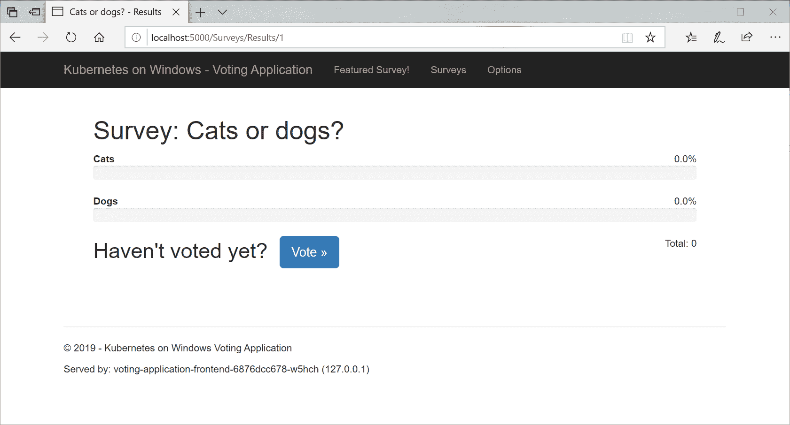
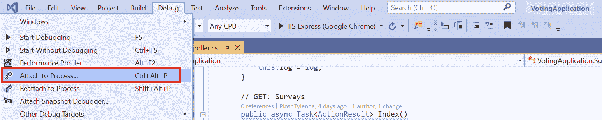
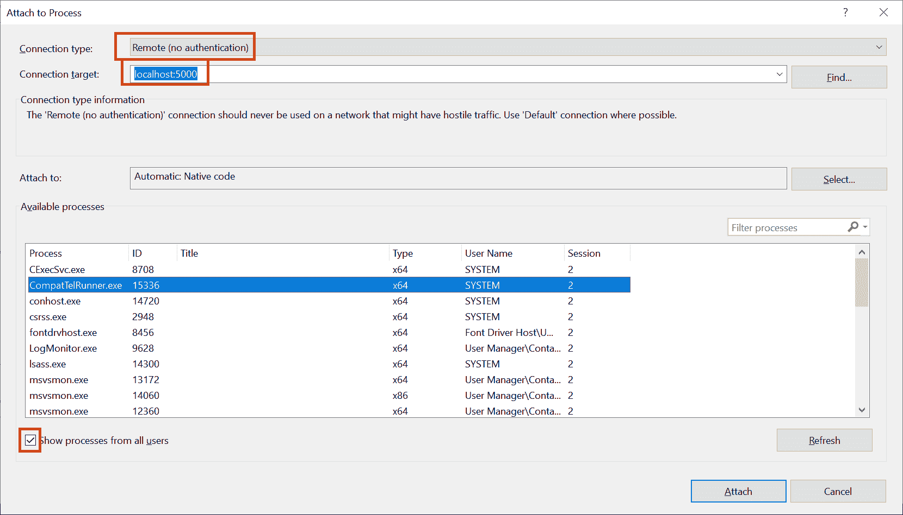
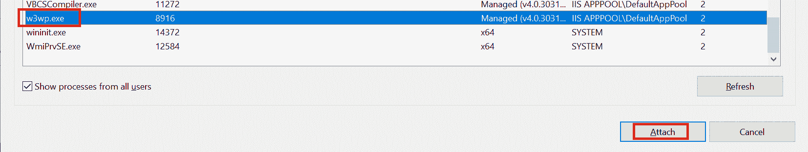
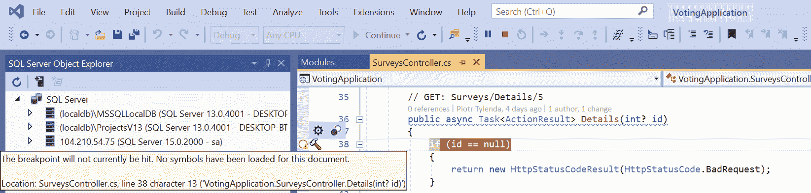
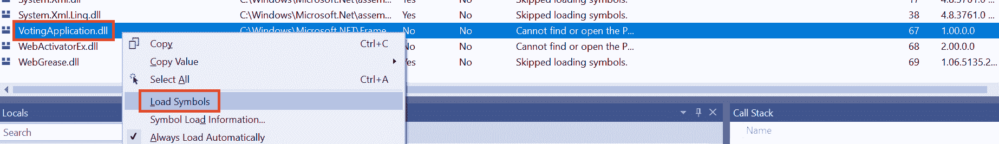
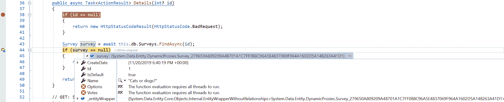

# 部署 Microsoft SQL Server 2019 和 ASP.NET MVC 应用程序

之前的章节为您提供了一个部署和操作混合 Windows/Linux Kubernetes 集群的瑞士军刀，现在，您已经掌握了部署真实 Windows 容器应用程序到 Kubernetes 集群的所有基本知识。本章将重点演示如何处理使用 C# .NET Framework 4.8 和 ASP.NET MVC 5 编写的简单投票应用程序的容器化和部署，其中 Microsoft SQL Server 2019 用于持久层。技术栈的选择可能看起来是传统的（为什么不使用.NET Core？！），但这是有意为之——如果您正在考虑在 Kubernetes 中使用 Windows 容器，那么您很可能需要经典的.NET Framework 运行时，因为您还没有准备好迁移到.NET Core。

迁移现有应用程序到 Kubernetes 的主题是广泛的，本书不会对其进行全面覆盖。有许多关于这一过程的最佳实践文档，但我们将专注于基本方法，主要是为了演示部署而不是专注于.NET Framework 应用程序的实现和迁移。本章的目标是展示以下内容：

+   如何快速将 Windows .NET Framework 应用程序容器化

+   如何注入环境配置，如 SQL 连接字符串

+   Windows 容器日志的推荐方法

+   如何远程调试应用程序

更准确地说，在本章中，我们将涵盖以下主题：

+   创建并发布 ASP.NET MVC 应用程序到 Docker Hub

+   准备**Azure Kubernetes 服务引擎**（**AKS 引擎**）

+   部署故障转移 Microsoft SQL Server 2019

+   部署 ASP.NET MVC 应用程序

+   访问应用程序

+   扩展应用程序

+   调试应用程序

# 技术要求

对于本章，您将需要以下内容：

+   安装 Windows 10 专业版、企业版或教育版（1903 版或更高版本，64 位）。

+   Microsoft Visual Studio 2019 社区版（或其他任何版本），如果您想编辑应用程序的源代码并对其进行调试。**Visual Studio Code**（**VS Code**）对经典.NET Framework 的支持有限。

+   Azure 账户。

+   使用 AKS 引擎部署的 Windows/Linux Kubernetes 集群。

要跟着做，您需要自己的 Azure 账户，以便为 Kubernetes 集群创建 Azure 资源。如果您之前还没有为前几章创建账户，您可以在这里了解如何获得用于个人使用的有限免费账户：[`azure.microsoft.com/en-us/free/`](https://azure.microsoft.com/en-us/free/)。

使用 AKS Engine 部署 Kubernetes 集群已在第八章中进行了介绍，*部署混合 Azure Kubernetes 服务引擎集群*。

您可以从官方 GitHub 存储库下载本书章节的最新代码示例，网址为：[`github.com/PacktPublishing/Hands-On-Kubernetes-on-Windows/tree/master/Chapter10`](https://github.com/PacktPublishing/Hands-On-Kubernetes-on-Windows/tree/master/Chapter10)。

# 创建并发布一个 ASP.NET MVC 应用程序到 Docker Hub

为了演示部署一个真实的 Windows 容器应用程序，我们将为一个投票应用程序创建一个 Docker 镜像，这是一个用于创建调查的小型 C# .NET Framework 4.8 Web 应用程序。该应用程序使用经典的 ASP.NET MVC 5 堆栈实现，因为它最适合演示如何处理 Windows 应用程序的容器化。传统的.NET Framework 应用程序，特别是企业级应用程序，严重依赖于仅在 Windows 上可用的功能，比如**Windows Communication Foundation**（**WCF**）。在许多情况下，您可能很幸运地轻松迁移到.NET Core，并使用 Linux 容器来托管您的应用程序，但对于.NET Framework 堆栈的某些部分，甚至在.NET 5 中也可能永远不会发生。

关于我们的投票应用程序，有一些假设，如下：

+   本文中没有任何对 Kubernetes 或 Windows 容器的依赖。该应用程序不知道自己是由容器编排系统托管的。

+   **Entity Framework 6.3**（**EF 6.3**）([`docs.microsoft.com/en-us/ef/ef6/`](https://docs.microsoft.com/en-us/ef/ef6/))采用了基于代码的方式作为**对象关系映射**（**ORM**）。

+   Microsoft SQL Server 用于投票数据存储-这是您在 ASP.NET MVC 应用程序中看到的常见堆栈。对于本地开发，我们使用 Microsoft SQL（MSSQL）Server Express LocalDB（[`docs.microsoft.com/en-us/sql/database-engine/configure-windows/sql-server-express-localdb?view=sql-server-ver15`](https://docs.microsoft.com/en-us/sql/database-engine/configure-windows/sql-server-express-localdb?view=sql-server-ver15)），而对于 Kubernetes 部署，我们将使用托管在 Linux 容器中的 MSSQL Server 2019（[`docs.microsoft.com/en-us/sql/linux/quickstart-install-connect-docker?view=sql-server-ver15&pivots=cs1-bash`](https://docs.microsoft.com/en-us/sql/linux/quickstart-install-connect-docker?view=sql-server-ver15&pivots=cs1-bash)）。

+   Serilog（[`serilog.net/`](https://serilog.net/)）已被选择为日志框架。

+   Ninject（[`github.com/ninject/Ninject`](https://github.com/ninject/Ninject)）将所有内容绑定为依赖注入器。

+   我们使用简单的“肥”控制器，其中包含所有业务逻辑和数据访问层（因此没有存储库或其他设计模式）。这是特意选择的，以使应用程序尽可能紧凑。

+   大多数视图和控制器都基于标准的 MVC 5 脚手架，用于 EF 模型。

+   视图模型的使用仅限于绝对必要的地方。

您可以在该书的官方 GitHub 存储库中找到应用程序源代码，网址为[`github.com/PacktPublishing/Hands-On-Kubernetes-on-Windows/tree/master/Chapter10/01_voting-application-src`](https://github.com/PacktPublishing/Hands-On-Kubernetes-on-Windows/tree/master/Chapter10/01_voting-application-src)。要打开`VotingApplication.sln`解决方案文件，您需要 Visual Studio 2019。也可以通过使用`docker build`命令执行构建，如下一小节所述。在本节结束时，您将拥有一个用于投票应用程序的 Docker 镜像，准备在 Kubernetes 中使用。您可以按照步骤进行，或选择使用 Docker Hub 上提供的现成镜像，网址为[`hub.docker.com/repository/docker/packtpubkubernetesonwindows/voting-application`](https://hub.docker.com/repository/docker/packtpubkubernetesonwindows/voting-application)。

# 使用环境变量注入配置

在开发容器友好的应用程序时，您需要考虑如何注入配置数据，例如数据库连接字符串。一个经验法则是，您不应该将任何地址、用户名、密码或连接字符串硬编码到您的代码中。您应该始终能够在运行时注入这样的配置，并且一般来说，非容器化应用程序也是如此。Kubernetes 为您提供了多种方法来注入运行时配置，如下所示：

+   向容器命令传递参数

+   为容器定义系统环境变量

+   将 ConfigMaps 或 Secrets 挂载为容器卷

+   可选地使用 PodPresets 封装所有内容

您可以在官方文档中了解更多关于它们的信息（[`kubernetes.io/docs/tasks/inject-data-application/`](https://kubernetes.io/docs/tasks/inject-data-application/)）。重要的是，所有这些特性都使用标准的操作系统级原语，如文件或环境变量，与容器化应用程序集成。这意味着，如果您设计得当，您可以在 Kubernetes 内外不做任何更改地使用它。

我们将演示如何使用环境变量将 MSSQL Server 连接字符串注入到我们的应用程序中。这种方法是最简单的，但它有一个重要的限制——当容器正在运行时，您无法修改容器的环境变量。一旦设置了变量，它将在整个容器生命周期内保持相同的值。如果您需要能够在不重新启动容器的情况下修改配置，您应该看一下 ConfigMaps（与 Secrets 结合使用），这在下一章节中描述：第十一章，*配置应用程序以使用 Kubernetes 功能*。

我们的投票应用程序使用`VotingApplicationContextFactory`类来为**Model-View-Controller**（MVC）控制器创建 EF DbContext。让我们来看看这个类的`Create()`方法（可在[`github.com/PacktPublishing/Hands-On-Kubernetes-on-Windows/blob/master/Chapter10/01_voting-application-src/Factories/VotingApplicationContextFactory.cs`](https://github.com/PacktPublishing/Hands-On-Kubernetes-on-Windows/blob/master/Chapter10/01_voting-application-src/Factories/VotingApplicationContextFactory.cs)找到）。

```
public object Create(IContext context)
{
 var connectionString = Environment.GetEnvironmentVariable("CONNECTIONSTRING_VotingApplication");
 if (!string.IsNullOrEmpty(connectionString))
 {
 var safeConnectionString = SanitizeConnectionString(connectionString);
 this.log.Info("Using custom connection string provided by environment variable: {0}", safeConnectionString);
 return new VotingApplicationContext(connectionString);
 }

 this.log.Info("Using default connection string");
 return new VotingApplicationContext();
}
```

以下是您可以使用的一种常见模式，特别是在 Linux 世界中，那里更常依赖于环境变量：

1.  检查您选择的环境变量`CONNECTIONSTRING_VotingApplication`是否已定义。

1.  如果是，使用变量中的重写连接字符串创建 EF DbContext。

1.  如果没有，使用标准连接字符串创建 EF DbContext。在这种情况下，它将从`Web.config`应用程序文件中检索。

您可以遵循这种模式，特别是当您不使用自定义配置文件时。这种解决方案为您提供了很大的灵活性，您也可以在不使用容器运行应用程序时使用它！

另一种方法是将整个`Web.config`文件作为 Kubernetes ConfigMap 对象注入。我们将在下一章中探讨这种可能性。

这显示了一个重要的原则，即在容器化任何应用程序时应该考虑应用程序（系统）的外部接口以及它如何与外部世界通信。这是您可以影响或监视在容器中运行的应用程序的唯一方法。提供和注入配置是您的应用程序的外部接口之一。同样，日志记录为您的应用程序定义了一个输出接口，让我们看看您如何在 Windows 容器中处理这个问题。

# 为 Windows 容器配置日志记录日志监视器

Kubernetes 本身提供了简单的工具来浏览 Pod 容器日志。通常情况下，您将不得不实现一个良好的集群级日志记录解决方案，例如使用 Elasticsearch、Logstash、Kibana 堆栈或使用 Azure Log Analytics（如前几章中简要演示的）。官方文档对日志记录解决方案的可能架构进行了很好的概述：[`kubernetes.io/docs/concepts/cluster-administration/logging/`](https://kubernetes.io/docs/concepts/cluster-administration/logging/)。在所有情况下，您都需要将容器中的应用程序日志暴露给外部世界。从高层次来看，有三种主要方法：

+   使用容器的标准输出(stdout)和标准错误(stderr)入口点，并让容器运行时处理日志记录。稍后可以使用节点级别的日志代理（例如 Fluentd、Elastic Beats 或 Logstash）来转发日志到任何外部日志解决方案。如果您的容器化应用程序默认将所有内容写入控制台输出，这种方法特别有效。

+   在您的应用程序 Pod 中使用额外的辅助容器，该容器从文件系统、事件日志或其他来源收集日志，并将其公开为 stdout 或直接传输到外部日志解决方案。如果您的应用程序将日志记录到容器内的多个目的地，这种方法非常有用。

+   将日志流嵌入到应用程序本身中。例如，在 C#应用程序中，您可以使用 log4net 和专用的 Elasticsearch appender ([`github.com/ptylenda/log4net.ElasticSearch.Async`](https://github.com/ptylenda/log4net.ElasticSearch.Async)) 来将日志流式传输到您的 Elasticsearch 集群。这种方法的限制最多——它会对外部日志系统产生严重依赖，并且可能会对性能产生影响，这种影响很难与应用程序本身的工作负载分离。

对于 Windows 应用程序，将日志记录到 stdout 并不常见，特别是对于旧应用程序以及在使用 Internet Information Services (IIS) 托管您的 Web 应用程序时。在大多数情况下，对于 Windows 来说，更常见的是使用 Event Tracing for Windows (ETW)、事件日志或自定义日志文件。例如，我们的投票应用程序是使用 IIS 进行托管的。此外，在容器化模式下运行时，IIS 不提供公开应用程序的 stdout 的功能。您必须依赖事件日志或自己的日志文件。除此之外，IIS 本身会在标准位置`c:\inetpub\logs`中公开额外的应用程序日志，并将其自己的事件流传输到 ETW。

您可以以两种方式处理投票应用程序的日志收集：

+   使用额外的边车容器运行，例如，Elastic Beats 或 Winlogbeat（[`www.elastic.co/products/beats/winlogbeat`](https://www.elastic.co/products/beats/winlogbeat)），它收集应用程序容器的所有日志并将其暴露给 stdout（[`www.elastic.co/guide/en/beats/filebeat/current/console-output.html`](https://www.elastic.co/guide/en/beats/filebeat/current/console-output.html)）或任何其他支持的输出。日志需要使用 Pod 内部容器之间的卷进行共享。

+   扩展容器镜像与最近发布的 Windows 容器日志监视器（[`github.com/microsoft/windows-container-tools`](https://github.com/microsoft/windows-container-tools)）。有关架构的更多详细信息可以在这里找到：[`techcommunity.microsoft.com/t5/Containers/Windows-Containers-Log-Monitor-Opensource-Release/ba-p/973947`](https://techcommunity.microsoft.com/t5/Containers/Windows-Containers-Log-Monitor-Opensource-Release/ba-p/973947)。该工具使用的方法与边车容器不同。在 Docker 镜像中，您不是直接启动应用程序，而是使用适当的 JSON 配置文件启动`LogMonitor.exe`，并将启动应用程序的命令行作为`LogMonitor.exe`的参数。换句话说，`LogMonitor.exe`充当应用程序进程的监督者，并将根据配置文件从不同来源收集的日志打印到 stdout。计划进一步扩展此解决方案以用于边车容器模式。

我们将使用日志监视器，因为它易于集成和配置。应用程序的 Dockerfile 的详细信息将在下一小节中显示。假设启动应用程序（在本例中为 IIS）的命令是`C:\ServiceMonitor.exe w3svc`，使用 Log Monitor 的一般模式是以以下方式自定义 Dockerfile：

```
WORKDIR /LogMonitor
COPY LogMonitor.exe LogMonitorConfig.json .
SHELL ["C:\\LogMonitor\\LogMonitor.exe", "powershell.exe"]

ENTRYPOINT C:\ServiceMonitor.exe w3svc
```

我们应用程序的`LogMonitoringConfig.json`文件（[`github.com/PacktPublishing/Hands-On-Kubernetes-on-Windows/blob/master/Chapter10/01_voting-application-src/LogMonitorConfig.json`](https://github.com/PacktPublishing/Hands-On-Kubernetes-on-Windows/blob/master/Chapter10/01_voting-application-src/LogMonitorConfig.json)）具有以下 JSON 配置：

```
{
  "LogConfig": {
    "sources": [
      {
        "type": "EventLog",
        "startAtOldestRecord": true,
        "eventFormatMultiLine": false,
        "channels": [
          {
            "name": "system",
            "level": "Error"
          }
        ]
      },
      {
        "type": "EventLog",
        "startAtOldestRecord": true,
        "eventFormatMultiLine": false,
        "channels": [
          {
            "name": "VotingApplication",
            "level": "Verbose"
          }
        ]
      },
      {
        "type": "File",
        "directory": "c:\\inetpub\\logs",
        "filter": "*.log",
        "includeSubdirectories": true
      },
      {
        "type": "ETW",
        "providers": [
          {
            "providerName": "IIS: WWW Server",
            "ProviderGuid": "3A2A4E84-4C21-4981-AE10-3FDA0D9B0F83",
            "level": "Information"
          },
          {
            "providerName": "Microsoft-Windows-IIS-Logging",
            "ProviderGuid ": "7E8AD27F-B271-4EA2-A783-A47BDE29143B",
            "level": "Information",
            "keywords": "0xFF"
          }
        ]
      }
    ]
  }
}
```

此配置文件订阅日志监视器到`系统`日志和 Windows 事件日志中的`VotingApplication`日志，监视`C:\inetpub\logs`中的日志，并收集 IIS 的 ETW 数据。事件日志中的`VotingApplication`日志包含我们应用程序中由 Serilog 生成的所有日志。这在`NinjectWebCommon`类中配置（[`github.com/PacktPublishing/Hands-On-Kubernetes-on-Windows/blob/master/Chapter10/01_voting-application-src/App_Start/NinjectWebCommon.cs`](https://github.com/PacktPublishing/Hands-On-Kubernetes-on-Windows/blob/master/Chapter10/01_voting-application-src/App_Start/NinjectWebCommon.cs)），在那里我们初始化了日志记录器的输出，如下所示：

```
private static void RegisterServices(IKernel kernel)
{
    Log.Logger = new LoggerConfiguration()
        .ReadFrom.AppSettings()
        .Enrich.FromLogContext()
        .WriteTo.EventLog(source: "VotingApplication", logName: "VotingApplication", manageEventSource: false)
        .CreateLogger();

    kernel.Bind<VotingApplicationContext>().ToProvider(typeof(VotingApplicationContextFactory)).InRequestScope();
    kernel.Bind<IDateTimeProvider>().To<DateTimeProvider>().InRequestScope();
}
```

请注意，由于 Windows 容器不在特权模式下运行，我们无法自动在事件日志中创建日志（`manageEventSource: false`）。这必须在构建时在 Dockerfile 中完成。

通过这个设置，我们的投票应用程序将把我们自己的所有日志，以及系统和 IIS 的日志一起打印到容器的 stdout 中。这意味着您可以使用`docker logs`命令（在运行独立容器时）或`kubectl logs`命令轻松地对它们进行调查。如果与 Azure Log Analytics 集成，您的日志将可以使用 Kusto 进行查询。

# 创建 Dockerfile

下一步是为我们的应用程序准备一个 Dockerfile。您可以查看官方文档，了解如何在 Dockerfile 中构建.NET Framework 应用程序的方法，网址为[`github.com/microsoft/dotnet-framework-docker/tree/master/samples/dotnetapp`](https://github.com/microsoft/dotnet-framework-docker/tree/master/samples/dotnetapp)。我们的 Dockerfile 必须包括以下步骤：

1.  恢复 NuGet 软件包。

1.  构建应用程序，最好使用发布配置文件到本地文件系统。

1.  复制用于应用 EF 迁移的工具（由 EF NuGet 软件包提供）。

1.  在事件日志中创建`VotingApplication`日志。

1.  复制日志监视器二进制文件和配置。

1.  将投票应用程序二进制文件复制到`C:\inetpub\wwwroot`以进行 IIS 托管。

我们需要更深入地讨论 EF 迁移的话题。在没有应用程序停机时间并且应用程序有多个副本的情况下应用 EF 数据库迁移是一个复杂的任务。您需要确保迁移可以回滚，并且数据库架构与旧版本和新版本的应用程序完全兼容。换句话说，不兼容的更改，比如重命名，必须特别处理，以使它们在各个步骤之间具有向后兼容性。这个过程的框架可能如下所示 - 例如，对于实体的列重命名：

1.  应用添加具有新名称的新列的数据库迁移。

1.  推出一个新版本的应用程序，对旧列和新列进行写入。读取应该使用旧列进行，因为它始终具有正确的数据。

1.  执行一个从旧列复制数据到新列的作业。

1.  推出一个新版本的应用程序，从新列中读取。

1.  推出一个新版本的应用程序，只写入新列。

1.  应用数据库迁移，删除旧列。

正如您所看到的，为在 Kubernetes 中运行的应用程序正确处理数据库迁移而不中断需要严格的规则和兼容性/回滚测试 - 我们已经将这个话题带到您的注意中，但详细的解决方案不在本书的范围之内。Spring 有一篇很好的文章解释了如何解决这个问题（[`spring.io/blog/2016/05/31/zero-downtime-deployment-with-a-database`](https://spring.io/blog/2016/05/31/zero-downtime-deployment-with-a-database)），Weaveworks 也有一篇专门针对 Kubernetes 的文章：[`www.weave.works/blog/how-to-correctly-handle-db-schemas-during-kubernetes-rollouts`](https://www.weave.works/blog/how-to-correctly-handle-db-schemas-during-kubernetes-rollouts)。

为了应用迁移，我们将使用相同的 Docker 镜像 - EF 数据库迁移是使用应用程序程序集和 EF 命令行工具应用的，我们将在镜像中提供。然后，迁移（和数据库种子）将使用适合运行一次性任务的 Kubernetes 作业来运行。在实际情况下，这应该被安排为您的**持续集成/持续部署**（**CI/CD**）过程的一部分，伴随着 Kubernetes 部署的推出。

投票应用程序包含一个名为`Dockerfile.production`的 Dockerfile（[`github.com/PacktPublishing/Hands-On-Kubernetes-on-Windows/blob/master/Chapter10/01_voting-application-src/Dockerfile.production`](https://github.com/PacktPublishing/Hands-On-Kubernetes-on-Windows/blob/master/Chapter10/01_voting-application-src/Dockerfile.production)），它的层基于我们刚刚总结的内容。让我们逐步分析它：

1.  Dockerfile 定义了一个多阶段构建，这意味着在整个构建过程中使用了多个基础镜像。第一阶段是 Web 应用程序构建，使用了一个`mcr.microsoft.com/dotnet/framework/sdk`镜像。这个镜像包含了所有不需要运行时的.NET Framework 构建工具。其代码如下所示：

```
FROM mcr.microsoft.com/dotnet/framework/sdk:4.8-windowsservercore-ltsc2019 AS build
ARG PUBLISH_PROFILE=DockerPublishProfile.pubxml
ARG BUILD_CONFIG=Release

WORKDIR /app

COPY *.sln ./
COPY *.csproj ./
COPY *.config ./
RUN nuget restore

COPY . .
RUN msbuild /p:DeployOnBuild=true /p:PublishProfile=$env:PUBLISH_PROFILE /p:Configuration=$env:BUILD_CONFIG
```

这些层的组织方式使得在构建过程中最大化了层缓存的利用——例如，只有在特定解决方案配置文件更改时才运行`nuget restore`。

1.  构建过程由标准的`msbuild`命令执行，使用了一个名为`DockerPublishProfile.pubxml`的专用发布配置文件，其形式如下：

```
<Project ToolsVersion="4.0" >
  <PropertyGroup>
    <WebPublishMethod>FileSystem</WebPublishMethod>
    <PublishProvider>FileSystem</PublishProvider>
    <LastUsedBuildConfiguration>Release</LastUsedBuildConfiguration>
    <LastUsedPlatform>Any CPU</LastUsedPlatform>
    <SiteUrlToLaunchAfterPublish />
    <LaunchSiteAfterPublish>True</LaunchSiteAfterPublish>
    <ExcludeApp_Data>False</ExcludeApp_Data>
    <publishUrl>obj\Docker\publish</publishUrl>
    <DeleteExistingFiles>True</DeleteExistingFiles>
  </PropertyGroup>
</Project>
```

原则上，它执行`FileSystem`发布到`obj\Docker\publish`，这稍后将用于创建最终镜像。

1.  接下来，我们基于专门用于运行时场景的`mcr.microsoft.com/dotnet/framework/aspnet`镜像开始第二个和最后一个构建阶段，如下所示：

```
FROM mcr.microsoft.com/dotnet/framework/aspnet:4.8-windowsservercore-ltsc2019 AS runtime

WORKDIR /ef6
COPY --from=build /app/packages/EntityFramework.6.3.0/tools/net45/any/ .
```

在第一步中，我们执行 EF6 迁移命令行工具的复制，这些工具是通过 EF NuGet 包提供的。关键在于使用`--from=build`参数从上一个阶段复制。

1.  接下来是为我们的投票应用程序创建一个专用的事件日志（这个要求在前面的小节中提到过），如下所示：

```
RUN powershell.exe -Command New-EventLog -LogName VotingApplication -Source VotingApplication
```

1.  复制`LogMonitor`二进制文件和配置，同时覆盖容器的 shell 命令，如下所示：

```
WORKDIR /LogMonitor
ADD https://github.com/microsoft/windows-container-tools/releases/download/v1.0/LogMonitor.exe .
COPY --from=build /app/LogMonitorConfig.json .
SHELL ["C:\\LogMonitor\\LogMonitor.exe", "powershell.exe"]
```

1.  将前一个阶段的`build`工件复制到`C:\inetpub\wwwroot`的 IIS 应用程序目录中，如下所示：

```
WORKDIR /inetpub/wwwroot
COPY --from=build /app/obj/Docker/publish/. .
```

1.  最后，将镜像的默认入口点定义为启动 IIS 服务的`ServiceMonitor.exe`。这是一个标准的方法，在`mcr.microsoft.com/dotnet/framework/aspnet`基础镜像中可以看到。唯一的区别是整个进程树将在日志监视器的监督下运行。其代码如下所示：

```
ENTRYPOINT C:\ServiceMonitor.exe w3svc
```

就是这样！Dockerfile 定义了 ASP.NET MVC 应用程序的完整构建过程——您可以选择性地扩展它，添加一个测试阶段，执行适当的测试。现在，让我们构建镜像并将其推送到镜像注册表。

# 构建和推送 Docker 镜像

这个过程的确切细节已在第三章中进行了介绍，*使用容器镜像*。简而言之，您可以在这里使用两种方法：

1.  在本地机器上执行镜像的手动构建并将其推送到公共 Docker Hub。目前，在 Docker Hub 上无法为 Windows 容器镜像设置自动构建。

1.  如果您有兴趣将自动构建和 GitHub 挂钩集成到您的应用程序中，您可以使用**Azure 容器注册表**（**ACR**），如前面提到的章节中所述。

为了简单起见，我们将执行手动构建并将镜像推送到 Docker Hub。在实际情况下，您应该至少在 CI/CD 流水线中使用带有 GitHub 集成的 ACR。让我们执行 Docker 镜像的构建——在示例中，我们将使用`packtpubkubernetesonwindows/voting-application`镜像仓库名称，但如果您在跟随操作，应该使用您自己的`<dockerId>/voting-application`仓库。执行以下步骤：

1.  打开 PowerShell 窗口，导航到主`voting-application`源目录。

1.  使用以下命令执行 Docker 构建（记住最后的句点，它指定了构建上下文目录）：

```
docker build -t packtpubkubernetesonwindows/voting-application -f .\Dockerfile.production .
```

1.  等待构建完成，并相应地标记镜像。这对于 Kubernetes 部署至关重要，因为我们可以指定要推出的镜像的特定版本（使用最新版本会产生歧义，通常不建议使用）。建议使用语义版本控制，如第三章中所述的*使用容器镜像*，并且在以下代码块中进行了说明：

```
docker tag packtpubkubernetesonwindows/voting-application:latest packtpubkubernetesonwindows/voting-application:1.0.0
docker tag packtpubkubernetesonwindows/voting-application:latest packtpubkubernetesonwindows/voting-application:1.0
docker tag packtpubkubernetesonwindows/voting-application:latest packtpubkubernetesonwindows/voting-application:1
```

1.  将所有标记推送到镜像仓库，如下所示：

```
docker push packtpubkubernetesonwindows/voting-application
```

1.  现在，您可以验证 Docker Hub 页面上的标记是否正确可见，例如，[`hub.docker.com/repository/docker/packtpubkubernetesonwindows/voting-application/tags?page=1`](https://hub.docker.com/repository/docker/packtpubkubernetesonwindows/voting-application/tags?page=1)。

此时，我们的 Docker 镜像可以在本地使用（您需要使用环境变量提供有效的连接字符串到 SQL Server），也可以在 Kubernetes 中使用。让我们开始准备 AKS Engine 集群部署！

# 准备 AKS Engine

如果您已经按照第八章 *部署混合 Azure Kubernetes 服务引擎集群*创建了一个混合 Windows/Linux Kubernetes 集群，并且已经准备就绪，您可以在本节中验证集群的拓扑是否符合要求。如果您还没有部署 AKS Engine 集群，我们将在书籍的 GitHub 存储库中提供一个快速部署的 PowerShell 脚本。

我们的投票应用程序可以托管在尽可能小的混合 Windows/Linux 集群上，一个 Linux 主节点和一个 Windows 节点，其中 Linux 主节点充当常规节点。然而，为了充分演示部署的原则，我们将使用一个类似于生产环境的集群：一个运行在**虚拟机规模集**（**VMSS**）**高可用性**（**HA**）模式下的 Linux 主节点，两个 Linux 节点和两个 Windows 节点。我们在上一章中已经使用了这种配置来部署 AKS Engine 集群。为了快速从头部署 AKS Engine 集群，您可以执行以下步骤：

1.  从书籍的 GitHub 存储库下载以下 PowerShell 脚本：[`github.com/PacktPublishing/Hands-On-Kubernetes-on-Windows/blob/master/Chapter08/01_aks-engine/01_CreateAKSEngineClusterWithWindowsNodes.ps1`](https://github.com/PacktPublishing/Hands-On-Kubernetes-on-Windows/blob/master/Chapter08/01_aks-engine/01_CreateAKSEngineClusterWithWindowsNodes.ps1)。

1.  在 PowerShell 窗口中，使用适当的参数执行脚本，如下所示：

```
.\01_CreateAKSEngineClusterWithWindowsNodes.ps1 `
 -azureSubscriptionId <subscriptionId> `
 -dnsPrefix <globallyUniqueDnsPrefix> `
 -windowsPassword <windowsNodesPassword>
```

1.  该脚本将在 Azure 中使用`aks-engine-windows-resource-group`资源组将集群部署到 West Europe 位置。如果 AKS Engine 部署出现问题，您可以尝试指定不同的区域，例如`-azureLocation westus`。

1.  当部署完成后，您需要确保您的默认 kubeconfig 包含新集群的上下文。您可以通过使用以下命令快速合并由 AKS Engine 为 West Europe 位置生成的 kubeconfig 与默认 kubeconfig（在覆盖默认配置文件之前，请记得仔细检查`config_new`文件的内容，以避免任何丢失）：

```
$env:KUBECONFIG=".\_output\<globallyUniqueDnsPrefix>\kubeconfig\kubeconfig.westeurope.json;$env:USERPROFILE\.kube\config"
kubectl config view --raw > $env:USERPROFILE\.kube\config_new
 Move-Item -Force $env:USERPROFILE\.kube\config_new $env:USERPROFILE\.kube\config
```

1.  在新的 PowerShell 窗口中，通过运行以下命令来验证您是否能够访问集群，例如：

```
kubectl get nodes
```

运行这种规模的 AKS Engine 集群可能成本高昂，因此您应该始终检查**虚拟机**（**VM**）托管的预估成本。如果您不再需要该集群，可以使用`az group delete --name aks-engine-windows-resource-group --yes`命令来简单地删除它，也可以选择提供`--no-wait`参数。

此时，您已经准备好运行 Microsoft SQL Server 2019 和投票应用程序的集群，所以让我们继续！

# 部署故障转移 Microsoft SQL Server 2019

从 MSSQL Server 2017 开始，可以将其托管在 Linux Docker 容器中。由于我们的应用程序需要 MSSQL Server 进行数据持久化，因此我们将部署最新版本的 MSSQL Server 2019 到我们的 Kubernetes 集群中。目前，可以以以下两种模式将 MSSQL Server 部署到 Kubernetes 中：

1.  一个单节点实例，故障转移由 Kubernetes 部署和 Azure 磁盘持久卷保证。

1.  使用专用的 Kubernetes 操作员（[`kubernetes.io/docs/concepts/extend-kubernetes/operator/`](https://kubernetes.io/docs/concepts/extend-kubernetes/operator/)）的多节点 HA 集群。

第二种模式在**社区技术预览**（**CTP**）2.0 版本中作为预览版本发布（[`cloudblogs.microsoft.com/sqlserver/2018/12/10/availability-groups-on-kubernetes-in-sql-server-2019-preview/`](https://cloudblogs.microsoft.com/sqlserver/2018/12/10/availability-groups-on-kubernetes-in-sql-server-2019-preview/)），但目前，在**一般可用性**（**GA**）版本中，Docker 镜像和 Kubernetes 清单不兼容。如果您感兴趣，可以在[`github.com/microsoft/sql-server-samples/tree/master/samples/features/high%20availability/Kubernetes/sample-manifest-files`](https://github.com/microsoft/sql-server-samples/tree/master/samples/features/high%20availability/Kubernetes/sample-manifest-files)上检查此类部署的官方清单文件。

因此，我们将以更简单的单节点故障转移模式部署 SQL Server。要做到这一点，请执行以下步骤：

1.  打开 PowerShell 窗口。

1.  为新的 Kubernetes 命名空间创建一个`dev.yaml`清单文件，内容如下，并使用`kubectl apply -f .\dev.yaml`命令应用它：

```
kind: Namespace
apiVersion: v1
metadata:
  name: dev
  labels:
    name: dev
```

1.  为使用 Azure Disk provisioner 的 Kubernetes 存储类创建一个`storage-class.yaml`清单文件，并使用`kubectl apply -f .\storage-class.yaml`命令应用它，如下所示：

```
kind: StorageClass
apiVersion: storage.k8s.io/v1beta1
metadata:
  name: azure-disk
provisioner: kubernetes.io/azure-disk
parameters:
  storageaccounttype: Standard_LRS
  kind: Managed
```

1.  创建一个`pvc.yaml`清单文件，为 SQL Server 实例定义一个`mssql-data`**持久卷索赔**（**PVC**）。这个 PVC 将用于在容器中的`/var/opt/mssql`中挂载数据。使用`kubectl apply -f .\pvc.yaml`命令应用该清单，如下所示：

```
kind: PersistentVolumeClaim
apiVersion: v1
metadata:
  namespace: dev
  name: mssql-data
  annotations:
    volume.beta.kubernetes.io/storage-class: azure-disk
spec:
  accessModes:
  - ReadWriteOnce
  resources:
    requests:
      storage: 8Gi
```

1.  定义一个 Kubernetes `mssql` Secret，其中包含 SQL Server 的**系统管理员**（**SA**）用户密码，使用您自己的安全密码，如下所示：

```
kubectl create secret generic -n dev mssql --from-literal=SA_PASSWORD="S3cur3P@ssw0rd"
```

1.  创建一个`sql-server.yaml`清单文件，为 SQL Server 定义 Kubernetes 部署，如下所示：

```
kind: Deployment
apiVersion: apps/v1
metadata:
  namespace: dev
  name: mssql-deployment
spec:
  replicas: 1
  selector:
    matchLabels:
      app: mssql
  template:
    metadata:
      labels:
        app: mssql
    spec:
      terminationGracePeriodSeconds: 10
      initContainers:
      - name: volume-mount-permissions-fix  # (1)
        image: busybox
        command: ["sh", "-c", "chown -R 10001:0 /var/opt/mssql"]
        volumeMounts:
        - name: mssqldb
          mountPath: /var/opt/mssql
      containers:
      - name: mssql
        image: mcr.microsoft.com/mssql/server:2019-GA-ubuntu-16.04
        ports:
        - containerPort: 1433
        env:
        - name: MSSQL_PID  # (2)
          value: "Developer"
        - name: ACCEPT_EULA
          value: "Y"
        - name: MSSQL_SA_PASSWORD  # (3)
          valueFrom:
            secretKeyRef:
              name: mssql
              key: SA_PASSWORD  # (4)
        volumeMounts:  # (5)
        - name: mssqldb
          mountPath: /var/opt/mssql
      volumes:
      - name: mssqldb
        persistentVolumeClaim:
          claimName: mssql-data
      nodeSelector:
        "beta.kubernetes.io/os": linux
```

这个清单文件有几个重要部分，如下所示：

1.  首先，我们需要一个额外的`volume-mount-permissions-fix`初始化容器，这是为了确保在挂载 PVC 后，目录对于 SQL Server 有适当的访问权限——该容器将在常规 Pod 容器创建之前运行。这是如何使用初始化容器的一个很好的例子。

1.  其次，我们需要接受**最终用户许可协议**（**EULA**），使用`ACCEPT_EULA`环境变量，并选择适当的 SQL Server 版本，使用`MSSQL_PID`环境变量。

1.  我们将使用 Developer 版本，因为我们的应用仅用于开发目的。您可以在图像的文档中阅读有关这些变量使用的更多信息，网址为[`hub.docker.com/_/microsoft-mssql-server`](https://hub.docker.com/_/microsoft-mssql-server)。此外，您需要提供一个`MSSQL_SA_PASSWORD`环境变量，其中包含实例的 SA 用户密码。

1.  为此，我们使用了之前创建的`mssql` Secret 中的值。

1.  接下来，我们需要将`mssql-data` PVC 提供的卷挂载到`/var/opt/mssql`路径。

1.  这将提供类似于 SQL Server 共享磁盘故障转移实例的故障转移。最后，我们必须确保`nodeSelector`设置为仅选择 Linux 机器。

现在，继续使用以下步骤进行部署：

1.  使用`kubectl apply -f .\sql-server.yaml`命令应用清单文件。

1.  创建一个`sql-server-service.yaml`清单文件，为您的 SQL Server 实例创建一个 Kubernetes 服务。根据您的需求，您可以使用`ClusterIP`类型，或者，如果您将 SQL Server 实例暴露给 Kubernetes 集群外的连接（例如，用于**SQL Server Management Studio**（**SSMS**）），您可以使用`LoadBalancer`类型。使用`kubectl apply -f .\sql-server-service.yaml`命令应用清单文件，如下所示：

```
kind: Service
apiVersion: v1
metadata:
  namespace: dev
  name: mssql-deployment
spec:
  selector:
    app: mssql
  ports:
    - protocol: TCP
      port: 1433
      targetPort: 1433
  type: LoadBalancer
```

1.  您可以使用以下命令观察 Pod 的创建：

```
PS C:\src> kubectl get pods -n dev --watch
NAME                                READY   STATUS    RESTARTS   AGE
mssql-deployment-58bcb8b89d-7f9xz   1/1     Running   0          8m37s
```

此时，在`dev`命名空间中运行着一个 MSSQL Server 2019 实例，可以在集群内部使用`mssql-deployment`的**域名系统**（**DNS**）名称进行访问。此外，如果您创建了一个 LoadBalancer 服务，可以使用 SSMS 验证实例，提供服务的外部 IP 地址、用户 SA 和您选择的密码。

现在我们可以继续创建投票应用程序的清单文件，并将应用程序部署到集群中。

# 部署 ASP.NET MVC 应用程序

最后，是大秀的时刻！我们将使用标准的 Kubernetes 部署现在部署我们的投票应用程序，并在下一节中使用 LoadBalancer 服务将其暴露给外部用户。首先，我们需要简要总结我们的应用程序的正确部署所需的内容，如下所示：

+   将使用`packtpubkubernetesonwindows/voting-application:1.0.0` Docker 镜像来部署该应用程序。如果您已将图像推送到自己的图像存储库，则需要相应更改清单文件。我们明确指定`1.0.0`标签，因为我们希望避免拉取意外的容器图像版本。您可以在文档中阅读有关容器图像的最佳实践的更多信息[`kubernetes.io/docs/concepts/configuration/overview/#container-images`](https://kubernetes.io/docs/concepts/configuration/overview/#container-images)。

+   该应用程序需要设置`CONNECTIONSTRING_VotingApplication`环境变量，如果需要自定义连接字符串。在我们的部署情况下，连接字符串应具有以下形式：`Data Source=mssql-deployment;Initial Catalog=VotingApplication;MultipleActiveResultSets=true;User Id=sa;Password=$(MSSQL_SA_PASSWORD);`，其中`$(MSSQL_SA_PASSWORD)`将从 Kubernetes Secret 中检索。

+   应用初始数据库迁移是为了填充数据库数据。我们将使用 Kubernetes Job 来执行这个操作——这种方法可以在您的 CI/CD 流水线中进行泛化。迁移本身是使用`ef6.exe database update`命令执行的——镜像已经包含了这个可执行文件在`C:/ef6/`目录中。请注意，在生产环境中，您可能希望创建一个单独的 Docker 镜像，专门用于迁移，其中包含所有所需的工具。这样，您可以保持应用程序镜像的干净和尽可能小。

+   我们暂时不会创建专用的活跃性和就绪性探针，这将在下一章节中进行演示：第十一章，*配置应用程序使用 Kubernetes 功能*。

要部署投票应用程序，请执行以下步骤：

1.  打开 PowerShell 窗口。

1.  创建一个名为`voting-application.yaml`的 Kubernetes 部署清单文件，内容如下：

```
apiVersion: apps/v1
kind: Deployment
metadata:
  namespace: dev
  name: voting-application-frontend
  labels:
    app: voting-application
spec:
  replicas: 5  # (1)
  minReadySeconds: 5  # (2)
  strategy:  # (3)
    type: RollingUpdate
    rollingUpdate:
      maxUnavailable: 25%
      maxSurge: 25%
  selector:
    matchLabels:
      app: voting-application
  template:
    metadata:
      name: voting-application-frontend
      labels:
        app: voting-application
    spec:
      nodeSelector:  # (4)
        "beta.kubernetes.io/os": windows
      containers:
      - name: frontend
        image: packtpubkubernetesonwindows/voting-application:1.0.0  # (5)
        env:
        - name: MSSQL_SA_PASSWORD  # (6b)
          valueFrom:
            secretKeyRef:
              name: mssql
              key: SA_PASSWORD  # (6a)
        - name: CONNECTIONSTRING_VotingApplication  # (6c)
          value: "Data Source=mssql-deployment;Initial Catalog=VotingApplication;MultipleActiveResultSets=true;User Id=sa;Password=$(MSSQL_SA_PASSWORD);"
        ports:
          - containerPort: 80
        resources:
          limits:
            cpu: 500m
          requests:
            cpu: 500m
```

让我们解释一下这个清单文件中最重要的部分：

1.  我们将其定义为一个具有`5`个初始副本的部署——在我们的情况下，前端应用程序是无状态的，因此我们可以根据需要进行扩展。

1.  为了防止 IIS 仍在初始化的 Pod 被访问，我们添加了`minReadySeconds: 5`，以便有一个简单的机制。在下一章中，我们将配置适当的就绪性和活跃性探针。

1.  我们还明确将部署更新策略设置为`RollingUpdate`，最大不可用 Pod 数量为`25%`，允许我们在部署过程中创建多达预期数量的`25%`的 Pod（这由`maxSurge`参数控制）。

1.  接下来，记得设置适当的`nodeSelector`，只部署到 Windows 节点。

1.  指定要使用特定标签的镜像——如果使用自己的镜像，相应地更新它。

1.  为了创建数据库的连接字符串，我们必须首先从`mssql` Secret `(6a)`中检索 SA 用户密码，并初始化`MSSQL_SA_PASSWORD`环境变量`(6b)`，该变量可用于创建存储在`CONNECTIONSTRING_VotingApplication`变量中的实际连接字符串（6c）。正如所示，您可以使用现有环境变量来初始化新的环境变量：`Data Source=mssql-deployment;Initial Catalog=VotingApplication;MultipleActiveResultSets=true;User Id=sa;Password=$(MSSQL_SA_PASSWORD);`。当您想要从 Secret 中检索值并用它来定义另一个变量时，这是一种常见的模式。

现在，请按以下步骤继续部署：

1.  使用`kubectl apply -f .\voting-application.yaml`命令应用清单文件。等待 Pod 启动，如下所示：

```
PS C:\src> kubectl get pods -n dev
NAME                                           READY   STATUS    RESTARTS   AGE
mssql-deployment-58bcb8b89d-7f9xz              1/1     Running   0          19h
voting-application-frontend-6876dcc678-kdmcw   1/1     Running   0          19m
voting-application-frontend-6876dcc678-mhdr9   1/1     Running   0          19m
voting-application-frontend-6876dcc678-qsmst   1/1     Running   0          19m
voting-application-frontend-6876dcc678-w5hch   1/1     Running   0          19m
voting-application-frontend-6876dcc678-zqr26   1/1     Running   0          19m
```

应用程序已成功部署。在访问之前，我们首先需要应用初始数据库迁移——从技术上讲，您可以在不播种数据库的情况下访问应用程序，因为架构将自动初始化，但表中将没有任何数据。要执行数据库迁移，请执行以下步骤：

1.  为 Kubernetes Job 创建一个名为`ef6-update-database.yaml`的清单文件，内容如下：

```
apiVersion: batch/v1
kind: Job
metadata:
  namespace: dev
  name: voting-application-ef6-update-database3
  labels:
    app: voting-application
spec:
  ttlSecondsAfterFinished: 600  # (1)
  template:
    spec:
      nodeSelector:  # (2)
        "beta.kubernetes.io/os": windows
      containers:
      - name: ef6-update-database
        image: packtpubkubernetesonwindows/voting-application:1.0.0  # (3)
        command: ["c:/ef6/ef6.exe",  # (4)
                  "database", "update", 
                  "--verbose",
                  "--assembly", "/inetpub/wwwroot/bin/VotingApplication.dll",
                  "--connection-string", "Data Source=mssql-deployment;Initial Catalog=VotingApplication;MultipleActiveResultSets=true;User Id=sa;Password=$(MSSQL_SA_PASSWORD);",
                  "--connection-provider", "System.Data.SqlClient",
                  "--config", "/inetpub/wwwroot/Web.config"]
        env:
        - name: MSSQL_SA_PASSWORD
          valueFrom:
            secretKeyRef:
              name: mssql
              key: SA_PASSWORD
      restartPolicy: Never
      nodeSelector:
        "beta.kubernetes.io/os": windows
  backoffLimit: 4
```

关键点在于设置**生存时间**（**TTL**）秒值，以便触发作业创建的 Pod 的自动清理`(1)`，并确保 Pod 在 Windows 节点上执行`(2)`。最后一部分是设置容器镜像`(3)`。在我们的情况下，我们使用与应用程序相同的镜像，因为它包含所有迁移工具。`(4)`命令是特定于 EF 的，但通常情况下，您必须使用`--assembly`参数提供包含迁移的.NET 程序集的路径，并使用`--connection-string`参数提供适当的连接字符串。

1.  使用`kubectl apply -f .\ef6-update-database.yaml`命令应用清单文件。

1.  等待作业运行完成，如下所示：

```
PS C:\src> kubectl get jobs -n dev
NAME                                      COMPLETIONS   DURATION   AGE
voting-application-ef6-update-database    1/1           50s        103s
```

1.  您可以使用标准的`kubectl logs`命令检查日志，但是您必须提供`jobs`前缀，如下所示：

```
PS C:\src> kubectl logs -n dev jobs/voting-application-ef6-update-database
Specify the '-Verbose' flag to view the SQL statements being applied to the target database.
Target database is: 'VotingApplication' (DataSource: mssql-deployment, Provider: System.Data.SqlClient, Origin: Explicit).
No pending explicit migrations.
Applying automatic migration: 201911201840183_AutomaticMigration.
CREATE TABLE [dbo].[Options] (
...
```

1.  现在，如果出现任何问题，例如您无法访问日志（因为 Pod 甚至没有启动）或所有作业执行都以失败结束，最好的调查方法是描述作业对象并找到它创建的 Pod，如下所示：

```
PS C:\src> kubectl describe job -n dev voting-application-ef6-update-database
...
Events:
 Type    Reason            Age    From            Message
 ----    ------            ----   ----            -------
 Normal  SuccessfulCreate  6m23s  job-controller  Created pod: voting-application-ef6-update-database-chw6s
```

1.  使用这些信息，您可以描述任何未正确启动的 Pod，或者甚至可以直接使用作业名称描述它们，如下所示：

```
kubectl describe pod -n dev voting-application-ef6-update-database
```

我们的应用程序已经准备就绪 - 即使尚未为其创建 LoadBalancer 服务。为此，我们将使用前几章中描述的技术，如下所示：

1.  在 PowerShell 窗口中，执行以下命令，将所有网络流量从本地主机端口`5000`转发到`voting-application`部署中一个 Pod 的端口`80`，如下所示：

```
PS C:\src> kubectl port-forward -n dev deployment/voting-application-frontend 5000:80
Forwarding from 127.0.0.1:5000 -> 80
Forwarding from [::1]:5000 -> 80
```

1.  在不关闭 PowerShell 会话的情况下，打开您的网络浏览器并导航到`http://localhost:5000`。您应该会看到以下屏幕：



恭喜！您已成功部署了投票应用程序 - 现在，我们可以继续使用 LoadBalancer 服务公开部署。

# 访问应用程序

在本节中，我们将通过创建 LoadBalancer 类型的 Kubernetes 服务，向外部用户公开我们的投票应用程序。服务在第五章中已经进行了深入讨论，*Kubernetes 网络*。在本节结束时，任何拥有您的新服务的外部 IP 的人都将能够访问该应用程序。

要创建服务，请执行以下步骤：

1.  打开 PowerShell 窗口。

1.  为 Kubernetes 服务创建`voting-application-service.yaml`清单文件，内容如下：

```
apiVersion: v1
kind: Service
metadata:
  namespace: dev
  name: voting-application-frontend
  labels:
    app: voting-application
spec:
  type: LoadBalancer (1)
  ports:
  - protocol: TCP
    port: 80 (2)
  selector:
    app: voting-application
```

在这里，关键点是确保服务类型为`LoadBalancer (1)`，并为服务使用正确的端口`(2)`。在我们的情况下，物理 Azure 负载均衡器上的端口将与应用程序 Pod 的端口相同，因此我们不需要指定`targetPort`参数。

1.  使用`kubectl apply -f .\voting-application-service.yaml`命令应用清单文件。

1.  等待为新服务提供外部 IP，如下所示：

```
PS C:\src> kubectl get svc -n dev -w
NAME                          TYPE           CLUSTER-IP     EXTERNAL-IP      PORT(S)          AGE
mssql-deployment              LoadBalancer   10.0.134.237   104.210.54.75    1433:31446/TCP   21h
voting-application-frontend   LoadBalancer   10.0.50.43     104.42.142.217   80:32357/TCP     62s
```

1.  在这种情况下，外部 IP 是`104.42.142.217`。使用您的网络浏览器并导航到`http://104.42.142.217`。

1.  您可以尝试多次刷新页面，并从不同的浏览器访问。您将在页面页脚看到您被不同的 Pod 提供服务。如果您在开始时遇到任何延迟，那是因为当第一次访问时，IIS 启动了给定 Pod 中的应用程序池。代码可以在以下片段中看到：

```
Served by: voting-application-frontend-6876dcc678-zqr26 (10.240.0.44)
```

现在应用程序对所有外部用户都是可访问的！现在，我们将看看如何扩展应用程序。

# 扩展应用程序

在我们的设计中，唯一可以扩展的组件是 ASP.NET MVC 前端。SQL Server 无法扩展，因为它在单个节点上以自动故障转移模式运行。真正扩展 SQL Server 需要使用**可用性组**（**AG**）和专用的 Kubernetes Operator，如前面的部分所述。

在上一章中，我们展示了不同的声明性和命令式方法，介绍了如何扩展部署。现在我们将展示最安全的、声明性的扩展部署的方法。自动扩展将不在此处涵盖，因为它在下一章中有更详细的描述：第十一章，*配置应用程序以使用 Kubernetes 功能*。要将前端部署从 5 个副本扩展到 10 个，请执行以下步骤：

1.  打开 PowerShell 窗口。

1.  修改您现有的`voting-application.yaml`清单文件，更改副本的数量，如下所示：

```
apiVersion: apps/v1
kind: Deployment
metadata:
  ...
spec:
  replicas: 10
```

1.  使用`kubectl apply -f .\voting-application.yaml`命令应用清单文件。

1.  观察滚动的状态，如下面的代码块所示：

```
PS C:\src> kubectl get deployments -n dev -w
NAME                          READY   UP-TO-DATE   AVAILABLE   AGE
mssql-deployment              1/1     1            1           21h
voting-application-frontend   6/10    10           5           125m
```

1.  最终您会发现它永远不会达到 10 个就绪的副本！发生了什么？答案是我们已经耗尽了两个 Windows 节点的 CPU 预留限制——每个节点都安排了四个 Pod，每个 Pod 预留了`500m`的 CPU。如果您检查 Standard_D2_v3 Azure VM 的规格，您会发现它有两个 vCPU，这意味着我们已经预留了所有资源。您可以通过检查处于`Pending`状态的 Pod 来验证这个理论，如下所示：

```
PS C:\src> kubectl get pods -n dev
NAME                                            READY   STATUS      RESTARTS   AGE
...
voting-application-frontend-6876dcc678-9ssc4    0/1     Pending     0          6m1s
...
```

1.  描述处于`Pending`状态的一个 Pod，如下所示：

```
PS C:\src> kubectl describe pod -n dev voting-application-frontend-6876dcc678-9ssc4
Events:
 Type     Reason            Age        From               Message
 ----     ------            ----       ----               -------
 Warning  FailedScheduling  <unknown>  default-scheduler  0/5 nodes are available: 2 Insufficient cpu, 3 node(s) didn't match node selector.
```

在这种情况下，我们可以做什么？考虑以下选项：

+   通过添加更多的 Windows 节点来扩展您的 Kubernetes 集群。

+   不要扩展集群；减少部署的 CPU 限制。

+   不要扩展集群；不要更改部署的 CPU 限制，而是减少 CPU 请求以进行超额分配。您可以通过查看官方文档深入了解这个概念：[`kubernetes.io/docs/concepts/configuration/manage-compute-resources-container/#how-pods-with-resource-limits-are-run`](https://kubernetes.io/docs/concepts/configuration/manage-compute-resources-container/#how-pods-with-resource-limits-are-run)。

一般来说，为了决定要做什么，您必须了解应用程序的要求以及在低 CPU 可用性下的行为。作为演示，我们将执行 CPU 资源的超额分配，如下所示：

1.  修改`voting-application-service.yaml`清单文件。

1.  将请求的 CPU 值更改为`250m`，保持限制值不变。请注意，我们还需要修改`maxUnavailable`以允许在部署期间不可用的 Pods 数量更多。使用先前的`25%`值，我们将遇到死锁情况，因为已经有 10 个 Pod 中的 2 个不可用。此代码如下所示：

```
apiVersion: apps/v1
kind: Deployment
...
spec:
  strategy:
    ...
    rollingUpdate:
      maxUnavailable: 50%
  ...
  template:
    ...
    spec:
      ...
      containers:
      - name: frontend
        ...
        resources:
          limits:
            cpu: 500m
          requests:
            cpu: 250m
```

1.  使用`kubectl apply -f .\voting-application.yaml`命令应用清单文件，并观察部署如何扩展到 10 个副本。

现在您了解了如何扩展我们的投票应用程序，我们可以转到本章的最后一节，展示如何调试应用程序。

# 调试应用程序

调试应用程序是一个广泛的话题，涉及许多技术，具体取决于需求——可能涉及详细的遥测、跟踪或性能计数器分析。从开发者的角度来看，有一种技术特别重要：与代码调试器一起工作。容器化工作负载的一个问题是，使用诸如 Visual Studio 之类的标准工具进行调试相对较重——进程不在本地运行，您不能像本地进程一样轻松附加调试器。在本节中，我们将展示以下内容：

+   如何访问日志监视器生成的应用程序日志

+   如何通过`kubectl`端口转发启用 Visual Studio 远程调试

访问应用程序日志很简单，因为它涉及标准的`kubectl logs`命令。在生产场景中，您可能会使用 Azure Log Analytics 或 Elasticsearch 更有效地浏览日志。要访问投票应用程序日志，请执行以下命令，该命令将从部署中的所有 Pod 加载日志：

```
PS C:\src> kubectl logs -n dev deployment/voting-application-frontend
...
<Source>EventLog</Source><Time>2019-11-20T22:51:17.000Z</Time><LogEntry><Channel>VotingApplication</Channel><Level>Information</Level><EventId>55509</EventId><Message>Using custom connection string provided by environment variable: "data source=mssql-deployment;initial catalog=VotingApplication;multipleactiveresultsets=true;user id=sa;password=*****" </Message></LogEntry>
...
```

当前的日志设置非常详细，但您可以在 Windows 事件日志中看到 Serilog 记录的所有日志消息，例如前面的行来自`VotingApplicationContextFactory`类([`github.com/PacktPublishing/Hands-On-Kubernetes-on-Windows/blob/master/Chapter10/01_voting-application-src/Factories/VotingApplicationContextFactory.cs#L28`](https://github.com/PacktPublishing/Hands-On-Kubernetes-on-Windows/blob/master/Chapter10/01_voting-application-src/Factories/VotingApplicationContextFactory.cs#L28))。

现在，让我们转向更复杂的情景，即通过`kubectl`端口转发进行 Visual Studio 远程调试。这种用例尚未有文档记录，但它涉及到从非容器化部署中已知的标准技术。我们将执行以下操作：

1.  为调试创建一个专用的 Docker 镜像，其中安装了 Visual Studio 2019 远程工具([`docs.microsoft.com/en-us/visualstudio/debugger/remote-debugging?view=vs-2019`](https://docs.microsoft.com/en-us/visualstudio/debugger/remote-debugging?view=vs-2019))。

1.  使用特殊标签将镜像推送到注册表。

1.  修改我们的部署，以使用新的镜像——对于生产情景，您可能更愿意创建一个单独的部署。

1.  从容器中复制**程序数据库**（**PDB**）符号文件。我们必须执行此步骤，因为在容器中构建应用程序可能会导致略有不同的输出程序集和符号。

1.  使用`kubectl`端口转发功能将远程调试器暴露给本地开发机。

1.  使用转发的远程调试器将 Visual Studio 附加到`w3wp.exe`进程。

1.  加载任何丢失的调试符号。

在我们的情景中，由于我们正在运行经典的.NET Framework，我们受限于传统的 Visual Studio 远程调试器。对于.NET Core，有更多的方法，涉及到 Visual Studio Enterprise 和 Visual Studio Code。您可以在[`github.com/Microsoft/vssnapshotdebugger-docker`](https://github.com/Microsoft/vssnapshotdebugger-docker)上阅读有关在 Linux 上运行的.NET Core 的 Visual Studio Enterprise 快照调试，以及使用 Azure Dev Spaces 的 Visual Studio Code 的更多信息[`microsoft.github.io/AzureTipsAndTricks/blog/tip228.html`](https://microsoft.github.io/AzureTipsAndTricks/blog/tip228.html)。

让我们从创建用于调试的修改后的 Dockerfile 开始。

# 创建一个调试 Dockerfile 并发布一个调试镜像。

为了创建一个调试 Dockerfile，我们将使用我们的原始`Dockerfile.production`文件并进行轻微修改。 结果文件是`Dockerfile.debug`（[`github.com/PacktPublishing/Hands-On-Kubernetes-on-Windows/blob/master/Chapter10/01_voting-application-src/Dockerfile.debug`](https://github.com/PacktPublishing/Hands-On-Kubernetes-on-Windows/blob/master/Chapter10/01_voting-application-src/Dockerfile.debug)）。 让我们总结其内容：

1.  Dockerfile 中的构建阶段看起来几乎相同-唯一的区别是我们正在使用调试配置进行构建。 这将确保我们生成了适当的调试程序集，以及 PDB 符号，如下所示：

```
FROM mcr.microsoft.com/dotnet/framework/sdk:4.8-windowsservercore-ltsc2019 AS build
ARG PUBLISH_PROFILE=DockerPublishProfileDebug.pubxml
ARG BUILD_CONFIG=Debug

WORKDIR /app

COPY *.sln ./
COPY *.csproj ./
COPY *.config ./
RUN nuget restore

COPY . .
RUN msbuild /p:DeployOnBuild=true /p:PublishProfile=$env:PUBLISH_PROFILE /p:Configuration=$env:BUILD_CONFIG
```

1.  在最终的构建阶段，我们首先下载并安装 Visual Studio 2019 远程工具。 我们正在公开端口`4020`，因为我们将使用该端口托管远程调试器，如下面的代码块所示：

```
FROM mcr.microsoft.com/dotnet/framework/aspnet:4.8-windowsservercore-ltsc2019 AS runtime

WORKDIR /temp
RUN powershell.exe -Command Invoke-WebRequest https://aka.ms/vs/16/release/RemoteTools.amd64ret.enu.exe -OutFile VS_RemoteTools.exe 
RUN powershell.exe -Command ./VS_RemoteTools.exe /install /quiet
EXPOSE 4020
```

1.  图像的其余部分保持不变，除了`ENTRYPOINT`。 我们修改它，以便远程调试器进程（`msvsmon.exe`）在后台启动。 原则上，在容器中在后台启动另一个进程并不是一种推荐的做法，但在我们的情况下，我们希望以最快的方式启动远程调试器以及其他服务。 此命令的语法是特定于 Powershell 的，并且可以在以下代码块中看到：

```
ENTRYPOINT Start-Process -NoNewWindow 'C:\Program Files\Microsoft Visual Studio 16.0\Common7\IDE\Remote Debugger\x64\msvsmon.exe' -ArgumentList /nostatus,/silent,/noauth,/anyuser,/nosecuritywarn,/port,4020; C:\ServiceMonitor.exe w3svc
```

调试 Dockerfile 准备就绪后，我们可以创建图像并将其推送到 Docker Hub。 请执行以下步骤：

1.  我们将使用一种约定，即调试图像的标记将在标记中带有`-debug`后缀-例如，对于生产标记 1.0.0，我们将使用调试标记`1.0.0-debug`。 另一种选择是为调试图像创建一个新的专用图像存储库。 要构建图像，请在投票应用程序源的根目录中执行以下命令（相应地使用您自己的图像存储库名称）：

```
docker build -t packtpubkubernetesonwindows/voting-application:1.0.0-debug -f .\Dockerfile.debug .
```

1.  构建完成后，将新图像推送到 Docker Hub，如下所示：

```
docker push packtpubkubernetesonwindows/voting-application:1.0.0-debug
```

图像推送后，我们准备推出应用程序的调试部署。

# 更新 Kubernetes 部署

如前所述，为了简单起见，我们将重用相同的 Kubernetes 部署和服务以启用调试。 我们需要对原始`voting-application.yaml`清单文件进行以下修改：

```
apiVersion: apps/v1
kind: Deployment
metadata:
  ...
spec:
  replicas: 1
  ...
  template:
    ...
    spec:
      ...
      containers:
      - name: frontend
        image: packtpubkubernetesonwindows/voting-application:1.0.0-debug
        imagePullPolicy: Always
```

将副本的数量修改为`1`，确保在调试时，我们只有一个 Pod 接收流量。这意味着我们可以轻松地使用调试器在**用户界面**（UI）中断任何操作。除此之外，我们还需要将镜像更新为我们的新`packtpubkubernetesonwindows/voting-application:1.0.0-debug`标签，并将`imagePullPolicy`设置为`Always`，以便更轻松地引入更改。例如，如果您发现了一个错误并希望快速重新部署镜像并重新连接，您可以使用相同的标签构建镜像，推送它，并手动删除部署中当前运行的 Pod。这将重新创建 Pod，并且由于`Always`策略，镜像将再次被拉取。

现在，使用`kubectl apply -f .\voting-application.yaml`命令应用清单文件。我们的设置已经准备好连接 Visual Studio 调试器。

# 连接 Visual Studio 远程调试器

最后一步是使用远程调试器将您的 Visual Studio 2019 连接到运行在容器内部的 IIS 应用程序池进程。这个过程并不是完全自动化的（但可以脚本化），并且可以进一步统一容器镜像和本地开发机器之间的 PDB 符号。要连接调试器，请执行以下步骤：

1.  打开 PowerShell 窗口。

1.  使用以下标准命令确定您的应用程序 Pod 的名称：

```
kubectl get pods -n dev
```

1.  使用`kubectl cp`命令将`VotingApplication.pdb`文件复制到当前目录，具体如下：

```
PS C:\src> kubectl cp -n dev voting-application-frontend-66b95ff674-mmsbk:/inetpub/wwwroot/bin/VotingApplication.pdb VotingApplication.pdb
tar: Removing leading '/' from member names
```

1.  或者，您可以在本地使用 Docker 执行此操作，通过创建临时容器并使用以下命令复制文件：

```
$id = $(docker create packtpubkubernetesonwindows/voting-application:1.0.0-debug)
docker cp $id`:/inetpub/wwwroot/bin/VotingApplication.pdb VotingApplication.pdb
docker rm -v $id
```

1.  使用`kubectl port-forward`命令将所有流量从本地的`5000`端口转发到 Pod 中的`4020`端口，这是 Visual Studio 远程调试器暴露的地方，具体如下：

```
PS C:\src> kubectl port-forward -n dev deployment/voting-application-frontend 5000:4020
Forwarding from 127.0.0.1:5000 -> 4020
Forwarding from [::1]:5000 -> 4020
```

1.  现在，您已经准备好将 Visual Studio 2019 连接到远程调试器。在 Visual Studio 中打开`VotingApplication.sln`，并导航到调试 > 附加到进程...，如下截图所示：



1.  在对话框中，将连接类型设置为远程（无身份验证），将连接目标设置为转发端口`localhost:5000`，选择显示所有用户的进程，并单击刷新按钮，如下截图所示：



1.  您应该看到容器中运行的所有进程列表。如果在这一点上遇到连接问题，您可以在 Kubernetes 中执行进入容器，并检查`msvsmon.exe`进程是否仍在运行。如果没有，您可以重新创建容器或使用与 Dockerfile 中相同的命令手动启动进程，就像这样：

```
PS C:\src> kubectl exec -n dev -it voting-application-frontend-66b95ff674-vn256 powershell
Windows PowerShell
Copyright (C) Microsoft Corporation. All rights reserved.
PS C:\inetpub\wwwroot> Get-Process
...
 218      12     2240       9016       0.06  12360   2 msvsmon
```

1.  现在，在浏览器中导航到服务的外部 IP。我们需要确保 IIS 应用程序池进程（`w3wp.exe`）已启动。

1.  在“附加到进程”对话框中，刷新进程列表，找到`w3wp.exe`进程，并单击“附加”按钮，如下截图所示：



1.  调试器已附加，但可能缺少符号。您可以通过在代码的任何位置设置断点来验证这一点，如下截图所示：



1.  如果是这种情况，要加载自定义 PDB 符号，请导航到调试 > 窗口 > 模块，找到`VotingApplication.dll`程序集，右键单击，然后选择“加载符号”，如下截图所示：



1.  导航到您复制了`VotingApplication.pdb`文件的目录。符号将自动加载，断点将变得可触发。

1.  在 Web 浏览器中，执行应该触发断点的操作。

1.  现在，根据您的连接速度，Visual Studio 可能会在调试器完全附加之前冻结一段时间（甚至几分钟）。但是，经过这一最初的小问题后，调试体验应该是令人满意的，如下截图所示：



恭喜——您已成功远程附加调试器到运行在 Kubernetes Pod 内的进程！

# 总结

在本章中，您已经学会了如何将 ASP.NET MVC 应用程序部署到 Kubernetes 集群，以及如何将容器化的 Microsoft SQL Server 2019 部署到其中。我们展示了如何使现有的.NET Framework 应用程序适合云环境，以及如何为这些应用程序创建健壮的 Dockerfile。接下来，我们为我们的投票应用程序准备了一个 AKS Engine 集群部署，并以单节点故障转移模式部署了由 Azure Disk 支持的 Microsoft SQL Server 2019。该应用程序是使用 Kubernetes 部署部署到集群中的，并且我们使用了 Kubernetes Job 来应用 EF 数据库迁移。之后，您将了解有关扩展 Kubernetes 部署和计算资源超额分配的更多信息。最后，您将深入了解如何通过`kubectl`端口转发使用 Visual Studio 2019 的远程调试器来调试在 Kubernetes Pod 中运行的.NET Framework 应用程序。

下一章将重点介绍更高级的 Kubernetes 功能-我们将扩展我们的投票应用程序，充分利用 Kubernetes 的功能。

# 问题

1.  在 Kubernetes Pod 中运行应用程序注入配置的可能方式有哪些？

1.  微软提供的 Windows 容器日志监视器的目的是什么？

1.  为什么对于复制的应用程序迁移数据库架构是一项具有挑战性的任务？

1.  为什么我们要使用由 Azure Disk 支持的持久卷来存储 Microsoft SQL Server 数据？

1.  如何将 EF 数据库迁移应用到在 Kubernetes 中运行的应用程序？

1.  Kubernetes 中的 CPU/内存资源超额分配是什么？

1.  为什么您需要使用`kubectl`端口转发才能连接到容器中的 Visual Studio 远程调试器？

您可以在本书的*评估*部分找到这些问题的答案。

# 进一步阅读

+   有关 Kubernetes 应用程序管理的更多信息，请参考以下 Packt 图书：

+   *完整的 Kubernetes 指南* ([`www.packtpub.com/virtualization-and-cloud/complete-kubernetes-guide`](https://www.packtpub.com/virtualization-and-cloud/complete-kubernetes-guide)).

+   *开始使用 Kubernetes-第三版* ([`www.packtpub.com/virtualization-and-cloud/getting-started-kubernetes-third-edition`](https://www.packtpub.com/virtualization-and-cloud/getting-started-kubernetes-third-edition)).

+   *面向开发人员的 Kubernetes* ([`www.packtpub.com/virtualization-and-cloud/kubernetes-developers`](https://www.packtpub.com/virtualization-and-cloud/kubernetes-developers)).

+   对于在 Kubernetes 集群中运行的应用程序的替代调试方法（例如 Telepresence），您可以阅读以下文章：

+   [`kubernetes.io/docs/tasks/debug-application-cluster/local-debugging/`](https://kubernetes.io/docs/tasks/debug-application-cluster/local-debugging/).

+   [`www.telepresence.io/tutorials/kubernetes`](https://www.telepresence.io/tutorials/kubernetes).
