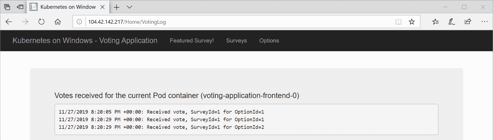

# 第十一章：配置应用程序以使用 Kubernetes 功能

上一章演示了如何在 Kubernetes 中处理容器化的 Windows 应用程序-现在，我们将扩展我们的投票应用程序，以使用更先进的功能，使编排更加健壮和自动化。多年来，Kubernetes 已经扩展了越来越多的功能，从细粒度的基于角色的访问控制（RBAC）或 Secrets 管理到使用水平 Pod 自动缩放器（HPA）进行自动缩放，这是容器编排的圣杯。当然，我们无法在本书的范围内涵盖所有这些功能，但我们将包括一些最有用的功能，以帮助运行容器化的 Windows 应用程序。另外，请记住，当您运行本地 Kubernetes 集群时，一些功能是不可用的，例如特定于云的 StorageClass 提供程序-我们将要呈现的所有示例都假定您正在运行 AKS Engine Kubernetes 集群。

在本章中，我们将涵盖以下主题：

+   使用命名空间隔离应用程序

+   使用活动探针和就绪探针进行健康监控

+   指定资源限制和配置自动缩放

+   使用 ConfigMaps 和 Secrets 管理应用程序配置

+   在 Windows 节点上管理持久数据存储

+   为部署配置滚动更新

+   RBAC

# 技术要求

在本章中，您将需要以下内容：

+   安装了 Windows 10 Pro、企业版或教育版（1903 版或更高版本，64 位）

+   Microsoft Visual Studio 2019 Community（或任何其他版本），如果您想编辑应用程序的源代码并对其进行调试-Visual Studio Code 对经典.NET Framework 的支持有限

+   一个 Azure 帐户

+   使用 AKS Engine 部署的 Windows/Linux Kubernetes 集群，准备部署上一章的投票应用程序

要跟着做，您需要自己的 Azure 帐户来为 Kubernetes 集群创建 Azure 资源。如果您之前还没有为前几章创建帐户，您可以阅读有关如何获取个人使用的有限免费帐户的更多信息[`azure.microsoft.com/en-us/free/`](https://azure.microsoft.com/en-us/free/)。

使用 AKS Engine 部署 Kubernetes 集群已在第八章中进行了介绍，*部署混合 Azure Kubernetes 服务引擎集群*。将投票应用程序部署到 Kubernetes 已在第十章中进行了介绍，*部署 Microsoft SQL Server 2019 和 ASP.NET MVC 应用程序*。

您可以从官方 GitHub 存储库下载本章的最新代码示例，网址为[`github.com/PacktPublishing/Hands-On-Kubernetes-on-Windows/tree/master/Chapter11`](https://github.com/PacktPublishing/Hands-On-Kubernetes-on-Windows/tree/master/Chapter11)。

# 使用命名空间隔离应用程序

在上一章中，我们已经使用了一个命名空间（名为`dev`）来将应用程序的组件逻辑地分组到现有物理 Kubernetes 集群中的虚拟集群中。命名空间的一般原则是提供资源配额和对象名称的范围——给定命名空间内的名称必须是唯一的，但它们不必在不同的命名空间中是唯一的。默认情况下，Kubernetes 提供以下开箱即用的命名空间：

+   `kube-system`：由 Kubernetes 系统创建的对象的命名空间，例如`kube-apiserver`或`kube-proxy` Pods。

+   `kube-public`：一个可以被所有用户阅读的命名空间，也不需要经过身份验证——它将在由 kubeadm 引导的集群中创建，并且通常用于系统使用。

+   `default`：没有其他命名空间的对象的命名空间。

根据您的需求和团队的规模，您可能更愿意仅使用对象标签（小团队）或在命名空间级别分隔对象（大团队）：

+   对于小团队，其中单个开发人员能够理解整个系统（大约 10 个微服务），并且整个开发环境可以使用本地集群（如在 VM 上运行的 minikube 或 kubeadm 部署）进行托管，可以仅使用默认命名空间来部署生产服务。或者，您可以为生产工作负载使用专用命名空间，并为开发/分段环境使用单独的命名空间。

+   对于快速增长的中等规模团队，在这种团队中，单个开发人员不在整个系统范围内工作，为每个子团队提供专用的命名空间可能更容易，特别是如果在本地 Kubernetes 集群上无法创建整个开发环境。

+   对于大型团队，子团队几乎独立运作，为每个团队单独创建生产和开发命名空间可能是一个好主意。您还可以考虑为每个命名空间使用资源配额和使用 RBAC。

+   对于企业组织来说，个别团队甚至可能不知道其他团队的存在，创建单独的集群可能比使用命名空间来划分单个集群更容易。这样可以更轻松地管理资源和计费，并在出现问题时提供更好的部署边界。

在创建服务对象时，命名空间会影响服务的**完全限定域名**（**FQDN**）。FQDN 的形式为`<service-name>.<namespace-name>.svc.cluster.local`—这意味着如果您在 Pod 中调用服务时使用`<service-name>`，调用将被限定在此 Pod 所在的命名空间。请注意，跨命名空间调用服务是可能的，但您需要指定 FQDN。

让我们演示如何为您的对象创建一个命名空间。

# 创建命名空间

要创建一个名为`prod`的命名空间，您可以使用以下命令：

```
kubectl create namespace prod
```

与其他对象一样，通常建议使用声明性对象配置管理，并将清单文件应用到 Kubernetes 集群。以下的`namespace-prod.yaml`清单文件将创建`prod`命名空间，另外指定了`ResourceQuota`对象，用于确定此命名空间的总 CPU 和内存配额：

```
---
kind: Namespace
apiVersion: v1
metadata:
  name: prod
  labels:
    name: prod
---
apiVersion: v1
kind: ResourceQuota
metadata:
  namespace: prod
  name: default-resource-quota
spec:
  hard:
    requests.cpu: 500m
    requests.memory: 1Gi
    limits.cpu: "1"
    limits.memory: 2Gi
```

要应用清单文件，请执行以下命令：

```
kubectl apply -f .\namespace-prod.yaml
```

然后，您可以使用`kubectl describe`命令来检查我们的命名空间中使用了多少资源。

```
PS C:\src> kubectl describe resourcequota -n prod
Name:            default-resource-quota
Namespace:       prod
Resource         Used  Hard
--------         ----  ----
limits.cpu       0     1
limits.memory    0     2Gi
requests.cpu     0     500m
requests.memory  0     1Gi
```

Kubernetes 中的资源配额是高度可定制的，可以应用于不同的资源，并使用复杂的选择器进行范围限定。您可以在官方文档中了解更多信息：[`kubernetes.io/docs/concepts/policy/resource-quotas/`](https://kubernetes.io/docs/concepts/policy/resource-quotas/)。

现在，您已经知道如何管理命名空间，让我们看看如何使用`kubectl`命令有效地使用它们。

# kubectl 命令和命名空间

`kubectl`命令按照惯例操作命名空间范围的对象，使用`--namespace`或`-n`标志来指定应用于命令的命名空间。如果您需要查询所有命名空间中的对象，可以使用`--all-namespaces`标志。例如，要列出`prod`命名空间中的所有 Pods，请使用以下命令：

```
kubectl get pods -n prod
```

在之前的章节中，您经常使用了这个构造。但是，值得知道的是，如果命令没有提供命名空间，它将使用当前 kubeconfig 上下文中设置为默认的命名空间。换句话说，它不一定是默认的命名空间 - 这完全取决于您的上下文设置。我们在第六章中深入讨论了上下文，*与 Kubernetes 集群交互* - 为了完整起见，我们将展示如何更改当前上下文中使用的命名空间。要在当前上下文中永久设置`prod`命名空间，请使用以下命令：

```
kubectl config set-context --current --namespace=prod
```

现在，任何支持指定命名空间的命令将默认使用`prod`命名空间。

# 删除命名空间

与其他对象类似，建议以命令方式删除命名空间。要删除`prod`命名空间，请执行以下命令：

```
kubectl delete namespace prod
```

请注意，此命令将删除此命名空间中的所有对象，这意味着这是一个极具破坏性的命令，应谨慎使用！

在下一节中，我们将看到如何使用探针配置容器监视活动性和就绪性。

# 使用活动性和就绪性探针进行健康监控

在 Kubernetes 中，探针由 kubelet 用于确定 Pod 的状态 - 您可以使用它们来自定义如何检查 Pod 是否准备好为您的流量提供服务，或者容器是否需要重新启动。您可以为在 Pod 中运行的每个容器配置三种类型的探针：

+   **就绪探针**：用于确定给定容器是否准备好接受流量。只有当 Pod 的所有容器都准备就绪时，Pod 才被视为准备就绪。不准备就绪的 Pod 将从服务端点中删除，直到它们再次准备就绪为止。

+   **活动性探针**：用于检测容器是否需要重新启动。这可以帮助解决容器陷入死锁或其他问题的情况，当容器进程处于活动状态但无法正常运行时。重新启动容器可能会增加该情况下 Pod 的可用性。

+   **启动探针**：这是用于确定容器是否已完全启动的附加探针-在此探针成功返回之前，就绪和存活探针都是禁用的。这对于由于某些初始化而具有长启动时间的容器特别有用。通过这种方式，您可以避免存活探针的过早终止。

默认情况下，Pod 容器上没有配置探针。但是，只有在 Pod 容器已启动（在 Docker 意义上）并且重新启动容器（当然取决于您的重新启动策略）后，Kubernetes 才会提供流量。

所有类型的探针都可以使用三种类型的处理程序操作进行配置：

+   运行命令（`exec`）-如果容器中运行的给定命令返回非零退出代码，则探针处于失败状态。

+   执行 HTTP GET 请求（`httpGet`）-只有当容器对 HTTP GET 请求做出大于或等于 200 且小于 400 的 HTTP 代码响应时，探针才处于成功状态。

+   在指定端口向容器打开 TCP 套接字（`tcpSocket`）-如果可以建立连接，则探针处于成功状态。

您还应考虑使用终止优雅期限来正确管理 Pod 的容器化应用程序生命周期，并在接收到 SIGTERM 信号时使应用程序优雅地退出（[`cloud.google.com/blog/products/gcp/kubernetes-best-practices-terminating-with-grace`](https://cloud.google.com/blog/products/gcp/kubernetes-best-practices-terminating-with-grace)）。请注意，对于 Windows Pod，截止优雅期限在 Kubernetes 1.17 版本中不受支持。

在处理具有许多依赖组件的大型分布式系统时，使用探针时存在一些注意事项和最佳实践。我们将在解释每种类型的探针时详细介绍细节-反映示例的投票应用程序源代码可以在官方 GitHub 存储库中找到，网址为[`github.com/PacktPublishing/Hands-On-Kubernetes-on-Windows/tree/master/Chapter11/02_voting-application-probes-src`](https://github.com/PacktPublishing/Hands-On-Kubernetes-on-Windows/tree/master/Chapter11/02_voting-application-probes-src)。首先，让我们看一下最受欢迎的探针，即就绪探针。

# 就绪探针

在 Kubernetes 中使用就绪探针来确定 Pod 容器是否准备好接受来自 Kubernetes 服务的流量——不准备好的 Pod（只有所有容器都被认为准备好的 Pod 才算准备好）将从服务端点列表中删除，直到它们再次准备好。换句话说，这是一个通知给定 Pod 可以用于服务请求的信号。

就就绪探针而言，有一些已经建立的最佳实践是您应该考虑的：

+   只要您的容器可能无法在容器启动后立即准备好为流量提供适当的服务，就使用此探针。

+   确保在就绪探针评估期间检查缓存预热或数据库迁移状态。您还可以考虑在尚未启动的情况下启动预热的实际过程，但要谨慎使用——就绪探针将在 Pod 的生命周期中不断执行，这意味着您不应该为每个请求执行任何昂贵的操作。或者，您可能希望为此目的使用在 Kubernetes 1.16 中新引入的启动探针。

+   对于暴露 HTTP 端点的微服务应用程序，考虑始终配置 `httpGet` 就绪探针。这将确保在容器成功运行但 HTTP 服务器尚未完全初始化时，所有情况都得到覆盖。

+   在应用程序中为就绪检查使用一个单独的专用 HTTP 端点是一个好主意，例如，一个常见的约定是使用 `/health`。

+   如果您在此类探针中检查依赖项（外部数据库和日志记录服务）的状态，请注意共享依赖项，例如投票应用程序中的 SQL Server。在这种情况下，您应该考虑使用探针超时，该超时大于外部依赖项的最大允许超时时间，否则可能会出现级联故障，可用性降低，而不是偶尔增加的延迟。

对于使用 IIS（Internet Information Services 的缩写）托管的 Web 应用程序，就绪探针非常有意义——IIS 应用程序池需要完全启动，数据库迁移可能尚未应用。例如，我们将为我们的投票应用程序配置一个简单的就绪探针，如下所示：

+   ASP.NET MVC 应用程序将实现一个专用控制器，用于提供 `/health` 请求。

+   将检查未决的数据库迁移。请注意，这将间接验证数据库连接状态，这在某些情况下可能是不可取的。因此，我们将使用大于 30 秒的探针超时（默认的 SQL 命令超时）。

+   控制器操作将返回一个简单的 JSON。在检查失败的情况下，HTTP 状态将为 503，在成功的情况下为 200。

要为投票应用程序添加就绪探针，请按照以下步骤进行：

1.  健康检查控制器操作的实现可以在`HealthController`类中找到（[`github.com/PacktPublishing/Hands-On-Kubernetes-on-Windows/blob/master/Chapter11/02_voting-application-probes-src/Controllers/HealthController.cs`](https://github.com/PacktPublishing/Hands-On-Kubernetes-on-Windows/blob/master/Chapter11/02_voting-application-probes-src/Controllers/HealthController.cs)），如下所示：

```
public ActionResult CheckHealth()
{
    this.Response.TrySkipIisCustomErrors = true;

    if (!this.db.Database.CompatibleWithModel(throwIfNoMetadata: true))
    {
        this.Response.StatusCode = (int)HttpStatusCode.ServiceUnavailable;
        return this.Json(new { status = "Database migrations pending" }, JsonRequestBehavior.AllowGet);
    }

    return this.Json(new { status = "Ok" }, JsonRequestBehavior.AllowGet);
}
```

1.  另外，您需要记住在`RouteConfig`类（[`github.com/PacktPublishing/Hands-On-Kubernetes-on-Windows/blob/master/Chapter11/02_voting-application-probes-src/App_Start/RouteConfig.cs`](https://github.com/PacktPublishing/Hands-On-Kubernetes-on-Windows/blob/master/Chapter11/02_voting-application-probes-src/App_Start/RouteConfig.cs)）中修改应用程序的路由配置，然后是默认路由映射。

```
routes.MapRoute(
    name: "Health",
    url: "health",
    defaults: new { controller = "Health", action = "CheckHealth" });
```

1.  与上一章一样，构建应用程序的 Docker 镜像，将其标记为 1.1.0 版本，并将其推送到 Docker Hub。在我们的演示案例中，我们将使用`packtpubkubernetesonwindows/voting-application:1.1.0`镜像。

1.  修改部署清单文件`voting-application.yaml`，以包括`frontend`容器的以下就绪探针配置：

```
apiVersion: apps/v1
kind: Deployment
metadata:
  namespace: dev
  name: voting-application-frontend
  ...
spec:
  ...
  template:
    ...
    spec:
      ...
      containers:
      - name: frontend
        image: packtpubkubernetesonwindows/voting-application:1.1.0
        ...
        readinessProbe:
          httpGet:
            path: /health
            port: 80
          initialDelaySeconds: 30
          periodSeconds: 10
          timeoutSeconds: 40
          successThreshold: 1
          failureThreshold: 3
        ...
```

探针被配置为调用`/health`端点，这将执行我们之前实现的控制器操作。探针配置中的重要部分如下：

+   +   将`initialDelaySeconds`设置为`30`秒，以允许 IIS 完全初始化。原来，对在`ServiceMonitor.exe`监督下运行的应用程序进行过早调用可能会导致容器过早退出（也许是`ServiceMonitor.exe`实现中的一个错误）。

+   `timeoutSeconds`设置为`40`秒，以超过默认设置为`30`秒的 SQL Server 数据库超时。

1.  现在，使用`kubectl apply -f .\voting-application-readiness-probe.yaml`命令应用清单文件。

1.  像往常一样，使用`kubectl get pods -n dev`和`kubectl describe`命令来检查部署过程。在 Pod 事件中，你可以验证 Pod 是否有任何就绪失败。

1.  在 Web 浏览器中，当你导航到应用程序时，你不应该遇到任何 IIS 应用程序池启动延迟——Web 服务器将通过就绪检查进行预热。

现在，让我们来看看另一个确定 Pod 容器存活状态的探针。

# 存活探针

第二种探针是存活探针，它可以在清单中类似于就绪探针进行配置。存活探针用于确定是否需要重新启动 Pod 容器。当进程尚未退出但无法处理任何操作时，这种类型的探针可能对恢复死锁或其他类型的容器问题有用。

与就绪探针类似，关于何时以及如何使用存活探针，有一些指导方针。

+   存活探针应该谨慎使用。错误的配置可能导致服务和容器重启循环中的级联故障。作为一个快速实验，你可以重新部署投票应用程序清单，其中用存活探针替换就绪探针，配置类似但超短的超时和延迟——你将遇到多次随机崩溃和应用程序的可用性不佳！

+   除非你有充分的理由，否则不要使用活跃探针。一个充分的理由可能是你的应用程序中存在一个已知的死锁问题，但尚未找到根本原因。

+   执行简单快速的检查来确定进程的状态，而不是它的依赖关系。换句话说，在存活探针中不要检查外部依赖的状态——这可能会导致由于大量容器重启而产生级联故障，并且会过载一小部分服务 Pod。

+   如果你的容器中运行的进程能够在遇到无法恢复的错误时崩溃或退出，那么你可能根本不需要存活探针。

+   使用保守的`initialDelaySeconds`设置，以避免任何过早的容器重启并陷入重启循环。

如果您不确定`ServiceMonitor.exe`和`LogMonitor.exe`入口进程的内部情况，那么由 IIS 托管的 Web 应用程序可能是使用活动探针的一个很好的选择。理论上，它们应该在 IIS 或 IIS 应用程序池出现问题时使容器崩溃，但让我们假设我们需要自己实现这些检查。我们将实现一个活动探针，它将使用`exec`处理程序检查 IIS 应用程序池是否正在运行。为此，请按照以下步骤进行操作：

1.  使用`Deployment`为我们的应用程序修改`voting-application.yaml`清单文件。为`frontend`容器添加以下活动探针配置：

```
apiVersion: apps/v1
kind: Deployment
metadata:
  namespace: dev
  name: voting-application-frontend
  ...
spec:
  ...
  template:
    ...
    spec:
    ...
    containers:
    - name: frontend
    image: packtpubkubernetesonwindows/voting-application:1.1.0
    ...
    livenessProbe:
      exec:
        command:
        - powershell.exe
        - -Command
        - if ((Get-WebAppPoolState DefaultAppPool).Value -ne "Started") { throw "Default IIS App Pool is NOT started" }
        initialDelaySeconds: 45
        periodSeconds: 10
        timeoutSeconds: 10
        successThreshold: 1
        failureThreshold: 3
        ...
```

探针被配置为执行 PowerShell 命令，`if ((Get-WebAppPoolState DefaultAppPool).Value -ne "Started") { throw "Default IIS App Pool is NOT started" }`，该命令检查默认的 IIS 应用程序池是否处于`Started`状态。如果不是，则将抛出异常，并且 PowerShell 进程将以非零退出代码退出，导致探针进入失败状态。

1.  现在，使用`kubectl apply -f .\voting-application-readiness-probe.yaml`命令应用清单文件。

1.  再次使用`kubectl get pods -n dev`和`kubectl describe`命令检查滚动升级过程。在 Pod 事件中，您可以验证 Pod 是否有任何活动失败。

在使用`exec`处理程序时，您应该仔细分析所选命令的行为。据报道，`exec`处理程序在某些情况下会导致僵尸进程膨胀。

最后，让我们快速看一下最后一种类型的探针，即启动探针。

# 启动探针

最近在 Kubernetes 1.16 中引入了启动探针，以支持容器可能需要比设置在就绪探针中的`initialDelaySeconds + failureThreshold * periodSeconds`更多时间进行初始化的情况。通常情况下，您应该为启动探针使用与就绪探针相同的处理程序配置，但使用更长的延迟。如果容器在`initialDelaySeconds + failureThreshold * periodSeconds`内未准备好进行就绪探针，则容器将被终止，并受到 Pod 的重启策略的影响。

我们的投票应用程序不需要专门的启动探针，但在部署清单文件中的示例定义可能如下所示：

```
apiVersion: apps/v1
kind: Deployment
metadata:
  namespace: dev
  name: voting-application-frontend
  ...
spec:
  ...
  template:
    ...
    spec:
      ...
      containers:
      - name: frontend
        image: packtpubkubernetesonwindows/voting-application:1.1.0
        ...
        startupProbe:
          httpGet:
            path: /health
            port: 80
          initialDelaySeconds: 30
          periodSeconds: 60
          timeoutSeconds: 40
          successThreshold: 1
          failureThreshold: 5
        ...
```

在下一节中，我们将专注于为 Pod 分配资源限制以及如何为我们的投票应用程序配置自动缩放。

# 指定资源限制和配置自动缩放

作为容器编排器，Kubernetes 默认提供了两个重要功能，帮助管理您的集群资源：

+   Pod 容器的资源请求和限制

+   HPA，它允许根据 CPU 资源使用情况（稳定支持）、内存资源使用情况（beta 支持）或自定义指标（也是 beta 支持）自动扩展您的部署或有状态集

让我们首先看一下指定资源请求和限制。

# 资源请求和限制

当您创建一个 Pod 时，可以指定其容器需要多少计算资源 - 我们已经在上一章中对投票应用程序分配资源进行了简短的练习。一般来说，计算资源是 CPU 和 RAM 内存 - Kubernetes 还能够管理其他资源，例如 Linux 上的 HugePages 或本地节点上的临时存储。

Kubernetes 资源模型提供了两类资源之间的额外区分：可压缩和不可压缩。简而言之，可压缩资源可以轻松进行限流，而不会造成严重后果。这样的资源的一个完美例子是 CPU - 如果您需要限制给定容器的 CPU 使用率，容器将正常运行，只是速度较慢。另一方面，我们有不可压缩资源，如果不加限制会造成严重后果 - 内存分配就是这样一个资源的例子。

有两份很棒的设计提案文件描述了 Kubernetes 资源模型（[`github.com/kubernetes/community/blob/master/contributors/design-proposals/scheduling/resources.md`](https://github.com/kubernetes/community/blob/master/contributors/design-proposals/scheduling/resources.md)）和资源服务质量（[`github.com/kubernetes/community/blob/master/contributors/design-proposals/node/resource-qos.md`](https://github.com/kubernetes/community/blob/master/contributors/design-proposals/node/resource-qos.md)）。我们强烈建议阅读它们，以充分了解 Kubernetes 资源管理的愿景以及已经实现的功能。

您可以为 Pod 容器指定两个值，关于资源分配：

+   `requests`：这指定了系统提供的特定资源的保证数量。你也可以反过来想，这是 Pod 容器从系统中需要的特定资源的数量，以便正常运行。Pod 的调度取决于`requests`值（而不是`limits`）。

+   `limits`：这指定了系统提供的特定资源的最大数量。如果与`requests`一起指定，这个值必须大于或等于`requests`。根据资源是可压缩还是不可压缩，超出限制会产生不同的后果——可压缩资源（CPU）将被限制，而不可压缩资源（内存）可能会导致容器被杀死。

使用不同的`requests`和`limits`值允许资源超额分配，这对于有效处理资源使用的短暂突发情况并在平均情况下更好地利用资源是有用的。如果根本不指定限制，容器可以在节点上消耗任意数量的资源。这可以通过命名空间资源配额（本章前面介绍的）和限制范围来控制——你可以在文档中阅读更多关于这些对象的信息[`kubernetes.io/docs/concepts/policy/limit-range/`](https://kubernetes.io/docs/concepts/policy/limit-range/)。

我们在 Kubernetes 中的 Windows 节点上涵盖了资源管理支持的详细信息，详见第四章，*Kubernetes 概念和 Windows 支持*。重要的是，Windows 目前缺乏对内存杀手的支持（Kubernetes 中即将推出的 Hyper-V 容器功能可能会提供一些内存限制的支持）。这意味着超出 Windows 容器内存的`limits`值不会导致任何限制或容器重启。在这里，经验法则是仔细使用`requests`来管理内存调度，并监视任何突然的内存分页。

在深入配置细节之前，我们需要了解 Kubernetes 中用于测量 CPU 资源和内存的单位是什么。对于 CPU 资源，基本单位是**Kubernetes CPU**（**KCU**），其中`1`等同于例如 Azure 上的 1 个 vCPU，GCP 上的 1 个 Core，或者裸机上的 1 个超线程核心。允许使用小数值：`0.1`也可以指定为`100m`（毫 CPU）。对于内存，基本单位是字节；当然，您可以指定标准单位前缀，如`M`，`Mi`，`G`或`Gi`。

为了演示如何使用资源`limits`和`requests`，请按照以下步骤操作：

1.  修改`voting-application.yaml`部署配置，使其不指定任何更新`strategy`，并为 CPU 和内存设置资源分配：

```
apiVersion: apps/v1
kind: Deployment
metadata:
  namespace: dev
  name: voting-application-frontend
  ...
spec:
  replicas: 5
  ...
  # strategy:
  ...
  template:
    ...
    spec:
      ...
      containers:
      - name: frontend
        ...        
        resources:
          limits:
            cpu: 1000m
          requests:
            cpu: 1000m
            memory: 256Mi
```

对于内存，我们遵循 Windows 节点的当前建议——我们只指定了想要请求多少内存。为了模拟资源耗尽，我们指定了一个大的请求值，将消耗 Windows 节点的所有集群 CPU。这是因为两个具有 Azure VM 类型 Standard_D2_v3 的节点每个都有两个 vCPU，并且运行五个副本，我们总共需要五个 vCPU。需要删除更新`strategy`以避免在部署过程中出现任何死锁。

1.  使用`kubectl apply -f .\voting-application.yaml`命令应用配置文件。

1.  现在，仔细观察您的部署中新 Pod 的创建。您会注意到有一些 Pod 显示`Pending`状态：

```
PS C:\src> kubectl get pods -n dev
NAME                                            READY   STATUS      RESTARTS   AGE
voting-application-frontend-54bbbbd655-nzt2n    1/1     Running     0          118s
voting-application-frontend-54bbbbd655-phdhr    0/1     Pending     0          118s
voting-application-frontend-54bbbbd655-qggc2    1/1     Running     0          118s
...
```

1.  这是预期的，因为`voting-application-frontend-54bbbbd655-phdhr` Pod 无法被调度到任何节点，因为没有可用的 CPU 资源。要检查实际原因，描述 Pod 并检查 `Events`：

```
PS C:\src> kubectl describe pod -n dev voting-application-frontend-54bbbbd655-phdhr
Events:
 Type     Reason            Age        From                 Message
 ----     ------            ----       ----                 -------
 Warning  FailedScheduling  <unknown>  default-scheduler    0/5 nodes are available: 2 Insufficient cpu, 3 node(s) didn't match node selector.
```

1.  正如预期的那样，由于所有匹配节点选择器的节点上都没有足够的 CPU 资源，Pod 无法被调度。让我们通过降低 Pod 容器的 `requests` 和 `limits` CPU 值来解决这个问题——修改 `voting-application.yaml` 配置文件，使 `requests` 设置为 `250m`，`limits` 设置为 `500m`。

1.  使用`kubectl apply -f .\voting-application.yaml`命令应用配置文件，并观察成功的部署。

现在您知道如何为您的容器分配和管理资源，我们可以演示如何使用 HPA 对您的应用程序进行自动缩放。

# HPA

Kubernetes 的真正力量在于 HPA 实现的自动扩展，它是由`HorizontalPodAutoscaler` API 对象支持的专用控制器。在高层次上，HPA 的目标是根据当前 CPU 利用率或其他自定义指标（包括同时使用多个指标）自动扩展部署或 StatefulSet 中副本的数量。根据指标值确定目标副本数量的算法的详细信息可以在[`kubernetes.io/docs/tasks/run-application/horizontal-Pod-autoscale/#algorithm-details`](https://kubernetes.io/docs/tasks/run-application/horizontal-pod-autoscale/#algorithm-details)找到。HPA 是高度可配置的，在本书中，我们将介绍基于目标 CPU 使用率自动扩展的标准场景。

我们的投票应用程序公开了不需要太多 CPU 的功能，这意味着可能很难按需触发自动扩展。为了解决这个问题，我们将添加一个专用的控制器动作，可以模拟具有给定目标百分比值的恒定 CPU 负载。用于压力模拟的`packtpubkubernetesonwindows/voting-application:1.2.0` Docker 镜像的源代码可以在[`github.com/PacktPublishing/Hands-On-Kubernetes-on-Windows/tree/master/Chapter11/08_voting-application-hpa-src`](https://github.com/PacktPublishing/Hands-On-Kubernetes-on-Windows/tree/master/Chapter11/08_voting-application-hpa-src)找到。如果您想自定义应用程序，请在 Visual Studio 2019 中打开您的解决方案，并按照以下步骤操作：

1.  定义`StressCpuWorker`类（[`github.com/PacktPublishing/Hands-On-Kubernetes-on-Windows/blob/master/Chapter11/08_voting-application-hpa-src/Services/CpuStressWorker.cs`](https://github.com/PacktPublishing/Hands-On-Kubernetes-on-Windows/blob/master/Chapter11/08_voting-application-hpa-src/Services/CpuStressWorker.cs)），其中包含用于模拟 CPU 压力的主要工作代码：

```
private void StartCpuStress()
{
    this.logger.Info($"Environment.ProcessorCount: {Environment.ProcessorCount}");

    for (int i = 0; i < Environment.ProcessorCount; i++)
    {
        var thread = new Thread(
            () =>
                {
                    var watch = new Stopwatch();
                    watch.Start();

                    while (this.isEnabled)
                    {
                        if (watch.ElapsedMilliseconds <= this.targetCpuLoad)
                        {
                            continue;
                        }

                        Thread.Sleep(100 - this.targetCpuLoad);

                        watch.Reset();
                        watch.Start();
                    }
                });

        thread.Start();
    }
}
```

此代码将启动多个线程，数量将等于环境中当前可用的处理器数量，然后通过几乎空的`while`循环来对每个逻辑处理器进行`this.targetCpuLoad`毫秒的压力测试。在剩余的 100 毫秒“段”中，线程将进入睡眠状态——这意味着平均而言，我们应该将所有可用的 CPU 负载到`this.targetCpuLoad`百分比。当然，这取决于分配给容器的处理器数量——这个数字可能会根据您的`requests`和`limits`值而变化；您可以随时检查 Pod 日志，以查看此 Pod 可用的逻辑处理器数量。另请注意，即使容器有两个逻辑处理器可用，也不意味着容器能够充分利用它们；负载可能会受到`limits`值的限制。

1.  在`HomeController`类中（[`github.com/PacktPublishing/Hands-On-Kubernetes-on-Windows/blob/master/Chapter11/08_voting-application-hpa-src/Controllers/HomeController.cs`](https://github.com/PacktPublishing/Hands-On-Kubernetes-on-Windows/blob/master/Chapter11/08_voting-application-hpa-src/Controllers/HomeController.cs)），添加一个新的控制器操作，可以通过`/Home/StressCpu?value={targetPercent}`路由访问。请注意，我们允许通过 GET 请求（而不是 PUT）执行此操作，以便在使用 Web 浏览器时交互更加简单。此外，将`IStressCpuWorker`注入到构造函数中——最终操作实现如下：

```
public ActionResult StressCpu([FromUri] int value)
{
    this.Response.StatusCode = (int)HttpStatusCode.Accepted;
    var host = Dns.GetHostEntry(string.Empty).HostName;

    if (value < 0)
    {
        this.cpuStressWorker.Disable();
        return this.Json(new { host, status = $"Stressing CPU turned off" }, JsonRequestBehavior.AllowGet);
    }

    if (value > 100)
    {
        value = 100;
    }

    this.cpuStressWorker.Enable(value);
    return this.Json(new { host, status = $"Stressing CPU at {value}% level" }, JsonRequestBehavior.AllowGet);
}
```

如果提供正值，此实现将启用 CPU 压力测试；如果提供负值，将禁用压力测试。

1.  在`NinjectWebCommon`类中配置依赖注入（[`github.com/PacktPublishing/Hands-On-Kubernetes-on-Windows/blob/master/Chapter11/08_voting-application-hpa-src/App_Start/NinjectWebCommon.cs`](https://github.com/PacktPublishing/Hands-On-Kubernetes-on-Windows/blob/master/Chapter11/08_voting-application-hpa-src/App_Start/NinjectWebCommon.cs)）。确保`StressCpuWorker`类被解析为单例：

```
kernel.Bind<ICpuStressWorker>().To<CpuStressWorker>().InSingletonScope();
```

1.  使用标签`1.2.0`构建 Docker 镜像，并将其推送到您的存储库，就像我们之前做的那样。

准备好镜像后，我们可以继续部署投票应用的新版本并配置自动缩放。为此，请执行以下步骤：

1.  修改`voting-application.yaml`清单文件，并确保您使用图像的`1.2.0`标记，并且`resources`指定如下：

```
resources:
  limits:
    cpu: 500m
  requests:
    cpu: 400m
    memory: 256Mi
```

1.  在 PowerShell 窗口中，使用`kubectl apply -f .\voting-application.yaml`命令应用清单文件。

1.  等待部署完成，并使用此命令观察 Pod 的 CPU 使用情况：

```
PS C:\src> kubectl top pod -n dev
NAME                                           CPU(cores)   MEMORY(bytes)
mssql-deployment-58bcb8b89d-7f9xz              339m         903Mi
voting-application-frontend-6b6c9557f8-5wwln   117m         150Mi
voting-application-frontend-6b6c9557f8-f787m   221m         148Mi
voting-application-frontend-6b6c9557f8-rjwmj   144m         164Mi
voting-application-frontend-6b6c9557f8-txwl2   120m         191Mi
voting-application-frontend-6b6c9557f8-vw5r9   160m         151Mi
```

当 IIS 应用程序池完全初始化时，每个 Pod 的 CPU 使用率应稳定在`150m`左右。

1.  为 HPA 创建`hpa.yaml`清单文件：

```
apiVersion: autoscaling/v1
kind: HorizontalPodAutoscaler
metadata:
  namespace: dev
  name: voting-application-frontend
spec:
  minReplicas: 1
  maxReplicas: 8
  targetCPUUtilizationPercentage: 60
  scaleTargetRef:
    apiVersion: apps/v1
    kind: Deployment
    name: voting-application-frontend
```

此 HPA 将自动将`voting-application-frontend`部署扩展到`1`到`8`个副本之间，尝试将 CPU 使用率定位到`60`％。请注意，此目标使用率较高，在生产环境中，您应考虑使用更低、更合适的值。此清单文件与使用`kubectl autoscale deployment/voting-application-frontend -n dev --cpu-percent=60 --min=1 --max=8`命令创建的 HPA 大致相同。

1.  使用`kubectl apply -f .\hpa.yaml`命令应用清单文件。

1.  HPA 受到延迟的影响，以避免频繁波动（即副本计数频繁波动）。默认延迟为五分钟。这意味着在应用后，您应该期望一些延迟，直到 HPA 扩展部署。使用`kubectl describe`命令监视 HPA 的状态：

```
PS C:\src> kubectl describe hpa -n dev voting-application-frontend
...
Metrics:                                               ( current / target )
 resource cpu on pods (as a percentage of request): 37% (150m) / 60%
Events:
 Type     Reason                        Age   From                       Message
 ----     ------                        ----  ----                       -------
...
 Normal   SuccessfulRescale             8m6s  horizontal-Pod-autoscaler  New size: 4; reason: All metrics below target
 Normal   SuccessfulRescale             3m3s  horizontal-Pod-autoscaler  New size: 3; reason: All metrics below targetcpu
```

随着时间的推移，您会注意到 HPA 倾向于缩减到单个副本，因为 CPU 负载不足。

1.  让我们使用我们的专用端点增加 CPU 负载。在 Web 浏览器中，转到以下 URL：`http://<serviceExternalIp>/Home/StressCpu?value=90`。这将开始以 90％的目标水平压力 CPU-请记住，根据 Pod 分配的逻辑处理器的方式，实际使用情况可能会有所不同。

1.  您可以执行多个请求，以确保部署中的更多 Pod 开始对 CPU 施加压力。

1.  过一段时间，观察 HPA 事件中发生了什么：

```
 Normal   SuccessfulRescale             7m44s            horizontal-Pod-autoscaler  New size: 4; reason: cpu resource utilization (percentage of request) above target
 Normal   SuccessfulRescale             7m29s               horizontal-Pod-autoscaler  New size: 5; reason: cpu resource utilization (percentage of request) above target
 Normal   SuccessfulRescale             2m25s               horizontal-Pod-autoscaler  New size: 8; reason: cpu resource utilization (percentage of request) above target
```

由于 CPU 资源利用率超过了 60％的目标，部署会自动扩展！添加更多 Pod 后，平均利用率将下降，因为并非所有 Pod 都在执行 CPU 压力测试。

对于 AKS 和 AKS Engine 集群，可以利用集群自动缩放器根据资源需求自动调整集群中节点的数量。您可以在官方 Azure 文档([`docs.microsoft.com/en-us/azure/aks/cluster-autoscaler`](https://docs.microsoft.com/en-us/azure/aks/cluster-autoscaler))和 Azure 上配置集群自动缩放器的指南中阅读更多信息([`github.com/kubernetes/autoscaler/blob/master/cluster-autoscaler/cloudprovider/azure/README.md`](https://github.com/kubernetes/autoscaler/blob/master/cluster-autoscaler/cloudprovider/azure/README.md))。

恭喜，您已成功为投票应用程序配置了 HPA。我们接下来要演示的 Kubernetes 功能是使用 ConfigMaps 和 Secrets 注入配置数据。

# 使用 ConfigMaps 和 Secrets 管理应用程序配置

为在 Kubernetes 上运行的应用程序提供配置，有几种可能的方法，记录在[`kubernetes.io/docs/tasks/inject-data-application/`](https://kubernetes.io/docs/tasks/inject-data-application/)中：

+   向容器命令传递参数

+   为容器定义系统环境变量

+   将 ConfigMaps 或 Secrets 挂载为容器卷

+   可选地，使用 PodPresets 将所有内容包装起来。

本节将重点介绍使用 ConfigMaps 和 Secrets，它们在许多方面都很相似，但目的却非常不同。

首先，让我们来看看 Secrets。在几乎每个应用程序中，您都必须管理访问依赖项的敏感信息，例如密码、OAuth 令牌或证书。将这些信息作为硬编码值放入 Docker 镜像是不可能的，因为存在明显的安全问题和非常有限的灵活性。同样，直接在 Pod 清单文件中定义密码是不推荐的——清单文件应该保存在源代码控制中，绝对不是存储这种敏感信息的地方。为了管理这种类型的信息，Kubernetes 提供了 Secret 对象，它可以保存技术上任何类型的由键值对组成的数据。可选地，可以在`etcd`中对 Secrets 进行加密，这在生产场景中是推荐的。

现在，我们将演示如何使用`kubectl`创建一个通用（不透明）的 Secret。您也可以使用清单文件来实现这个目的，但是如何生成这些清单文件取决于您的 CI/CD 流水线（您不希望将这些清单文件提交到源代码控制中！）。要为 SQL Server 密码创建一个 Secret，请执行以下步骤：

1.  打开一个 PowerShell 窗口。

1.  假设您想在`dev`命名空间中创建一个名为`mssql`的 Secret，其中`SA_PASSWORD`键下保存着`S3cur3P@ssw0rd`，则执行以下命令：

```
kubectl create secret generic -n dev mssql --from-literal=SA_PASSWORD="S3cur3P@ssw0rd"
```

1.  现在，该 Secret 可以作为容器中的卷（作为文件或目录）来使用，或者用于为容器定义环境变量。对于投票应用程序，更容易使用具有 SQL Server 密码的 Secret 作为环境变量。在部署清单中，可以通过以下方式实现这一点：

```
apiVersion: apps/v1
kind: Deployment
metadata:
  namespace: dev
  name: voting-application-frontend
  ...
spec:
  ...
  template:
    ...
    spec:
      ...
      containers:
      - name: frontend
        image: packtpubkubernetesonwindows/voting-application:1.2.0
        env:
        - name: MSSQL_SA_PASSWORD
          valueFrom:
            secretKeyRef:
              name: mssql
              key: SA_PASSWORD
        - name: CONNECTIONSTRING_VotingApplication
          value: "Data Source=mssql-deployment;Initial Catalog=VotingApplication;MultipleActiveResultSets=true;User Id=sa;Password=$(MSSQL_SA_PASSWORD);"
```

这里的关键概念是使用`secretKeyRef`来引用我们刚刚创建的`mssql` Secret 中`SA_PASSWORD`键的值。该值被注入到`MSSQL_SA_PASSWORD`环境变量中（但是当使用`kubectl describe`时，您无法看到该值！），应用程序在容器中运行时可以访问该值。在我们的情况下，我们使用这个变量来定义另一个环境变量，名为`CONNECTIONSTRING_VotingApplication`。当您需要创建一个包含密码的连接字符串时，这是一个常见的模式，但请记住，这可能比使用卷更不安全。

在使用 Secrets 作为环境变量和作为挂载卷时，有一个重要的区别：通过卷提供的 Secret 数据将在 Secret 更改时进行更新。根据您的需求和实现细节，您可能希望选择将 Secrets 作为卷进行挂载。当然，这要求您的应用程序意识到 Secrets 文件可能发生变化，这意味着它需要积极监视文件系统，并刷新任何凭据提供者、连接字符串或证书，这些通常保存在内存中。将 Secrets 作为不可变的配置值是最佳选择（无论是作为卷挂载还是作为环境变量），这样可以使您的应用程序更可预测，更简单。但是，如果您的架构有限制，希望尽可能少地重新启动 Pod，那么将 Secrets 作为卷进行注入，并在应用程序中实现自动刷新可能是建议的解决方案。

从安全的角度来看，将 Secrets 作为环境变量注入在 Linux 上是不太安全的，因为当具有 root 权限时，您可以从`/proc/<pid>/environ`中枚举出一个进程的所有环境变量。在 Windows 节点上，问题更加复杂：您仍然可以访问进程的环境变量，但卷目前无法使用内存文件系统。这意味着 Secrets 会直接存储在节点的磁盘存储上。

为了存储应用程序的非敏感配置数据，Kubernetes 提供了 ConfigMap 对象。这是另一个概念，您可以使用它来完全解耦 Docker 镜像（构建产物）和运行时配置数据。从 API 的角度来看，这个概念类似于 Secrets——您可以存储键值对，并将它们注入到容器的环境变量中，或者使用卷将它们挂载为文件或目录。为了演示这一点，我们将创建一个 ConfigMap 来存储一个名为`customErrors.config`的配置文件，该文件在 ASP.NET MVC 应用程序的`Web.config`文件中被引用，并使用卷进行挂载。

如第四章中所述，*Kubernetes 概念和 Windows 支持*，截至 Kubernetes 1.17 版本，不支持在 Windows 上将卷`subPath`挂载为文件。这意味着无法轻松地使用 ConfigMap 覆盖整个 ASP.NET MVC 的`Web.config`文件。

请按照以下步骤操作：

1.  首先，我们需要对投票应用程序源代码进行一些小的更改（[`github.com/PacktPublishing/Hands-On-Kubernetes-on-Windows/tree/master/Chapter11/10_voting-application-configmap-src`](https://github.com/PacktPublishing/Hands-On-Kubernetes-on-Windows/tree/master/Chapter11/10_voting-application-configmap-src)）。我们将从`<system.web>`节点中提取`<customErrors>`节点到一个子目录中的单独文件中。在`Web.config`文件中，将`<system.web>`节点更改为：

```
  <system.web>
    <compilation debug="true" targetFramework="4.8" />
    <httpRuntime targetFramework="4.8" />
    <customErrors configSource="config\customErrors.config" />
  </system.web>
```

1.  在`config`目录中创建`customErrors.config`文件，内容如下。我们将在接下来的步骤中使用 ConfigMap 进行覆盖：

```
<customErrors mode="On" />
```

1.  使用`1.3.0`标签构建一个 Docker 镜像，并将其发布到 Docker Hub，就像之前的示例一样。

1.  创建`voting-application-customerrors-config.yaml`清单文件，用于定义具有以下形式的 ConfigMap，并包含文件（[`github.com/PacktPublishing/Hands-On-Kubernetes-on-Windows/blob/master/Chapter11/10_voting-application-configmap-src/config/customErrors.config`](https://github.com/PacktPublishing/Hands-On-Kubernetes-on-Windows/blob/master/Chapter11/10_voting-application-configmap-src/config/customErrors.config)）作为`data`：

```
kind: ConfigMap 
apiVersion: v1 
metadata: 
  namespace: dev 
  name: voting-application-customerrors-config
  labels: 
    app: voting-application
data: 
  customErrors.config: |
    <customErrors mode="On" />
```

可以使用`kubectl`命令以命令方式创建 ConfigMaps，但我们想演示 ConfigMap 清单文件的结构。重要的部分是在使用 YAML 多行字符串时保持正确的缩进以适应更大的配置文件（`|`）。

1.  使用`kubectl apply -f .\voting-application-customerrors-config.yaml`命令应用清单文件。

1.  修改`voting-application.yaml`清单文件以在容器中将我们的 ConfigMap 作为目录挂载（记得使用新的 Docker 镜像标签）：

```
apiVersion: apps/v1
kind: Deployment
metadata:
  namespace: dev
  name: voting-application-frontend
  ...
spec:
  ...
  template:
    ...
    spec:
      ...
      containers:
      - name: frontend
        image: packtpubkubernetesonwindows/voting-application:1.3.0
        ...
        volumeMounts:
        - name: customerrors-config-volume
          mountPath: C:\inetpub\wwwroot\config\
        ...
      volumes:
      - name: customerrors-config-volume
        configMap:
          name: voting-application-customerrors-config
```

这里的重要部分是将`voting-application-customerrors-config` ConfigMap 作为卷（`customerrors-config-volume`）引用，并将其挂载到容器中的`C:\inetpub\wwwroot\config\`。如果当前在 Windows 上支持`subPath`挂载，我们可以只覆盖单个文件而不是整个目录。

1.  使用`kubectl apply -f .\voting-application.yaml`命令应用清单文件。

1.  现在，在浏览器中导航到`http://<serviceExternalIp>/Home/StressCpu`地址。这将触发一个异常-我们没有在 URL 中提供所需的请求参数。您应该会看到一个自定义错误页面，只是通知“在处理您的请求时发生错误”。

1.  关闭自定义错误页面，并修改`voting-application-customerrors-config.yaml`清单文件的 ConfigMap，使其包含节点：

```
  customErrors.config: |
    <customErrors mode="Off" />
```

1.  使用`kubectl apply -f .\voting-application-customerrors-config.yaml`命令应用清单文件。

根据 IIS 是否能够监视`C:\inetpub\wwwroot\config\`目录中的更改，IIS 应用程序池可能不会在 Pod 中重新加载。在这种情况下，`exec`进入容器并执行`Restart-WebAppPool DefaultAppPool`命令。

1.  再次导航到`http://<serviceExternalIp>/Home/StressCpu`。如果您的 IIS 应用程序池已重新加载，您将看到完整的异常详细信息，而不是自定义错误页面。

通过这种方式，我们已经演示了如何在 Windows Pods 中使用 Secrets 和 ConfigMaps。现在，是时候熟悉在 Windows 节点上管理持久数据存储了。

# 在 Windows 节点上管理持久数据存储

在第四章 *Kubernetes 概念和 Windows 支持*中，我们已经涵盖了 Kubernetes 中一些与存储相关的概念，如**PersistentVolumes**（**PV**）、**PersistentVolumeClaims**（**PVC**）和**StorageClasses**（**SC**），以及它们在 Windows 工作负载中的支持。在容器化应用程序中管理状态和存储以及使用 StatefulSets 是一个广泛且复杂的主题，不在本书的范围内——官方文档提供了一个很好的介绍，可以在[`kubernetes.io/docs/concepts/storage/`](https://kubernetes.io/docs/concepts/storage/)找到。对于 Windows Pods 的 PersistentVolume 支持的关键要点是，您可以使用一些现有的卷插件，但不是全部。在 Windows 上，支持以下内容：

+   树内卷插件：azureDisk、azureFile、gcePersistentDisk、awsElasticBlockStore（自 1.16 版起）和 vsphereVolume（自 1.16 版起）

+   FlexVolume 插件：SMB 和 iSCSI

+   CSI 卷插件（树外插件）

这意味着，对于 Windows 节点，在 AKS 或 AKS Engine 集群的情况下，您只能使用 azureDisk 和 azureFile in-tree 卷插件，从技术上讲，您可以将 FlexVolume SMB 插件与 Azure Files SMB 共享相结合。对于本地场景，您必须依赖于配置为使用自己的存储或连接到作为外部云服务公开的 SMB 共享的 FlexVolume SMB 或 iSCSI 插件。如果您在 vSphere 上运行，当然可以利用 vsphereVolume 插件。总的来说，在本地运行的混合 Windows/Linux 集群中处理持久卷仍然很困难。

对于本地集群，使用 Rook（[`rook.io/`](https://rook.io/)）来编排存储并与 Kubernetes 集成是一个很好的解决方案。不幸的是，即使是用于消耗卷的 Windows 也没有支持。

我们的投票应用程序已经在 Linux Pod 中运行 SQL Server 时使用了 PersistentVolumes - 在这种情况下，我们一直在使用 StorageClass 与`kubernetes.io/azure-disk`供应程序，它在内部使用 azureDisk 卷插件。这种情况涉及 Linux Pod - 现在，我们将为 Windows Pod 使用 PersistentVolumes。投票应用程序在前端容器中没有特定的数据持久化需求，但作为一个纯粹的例子，我们将展示如何为每个 Pod 存储一个投票日志。

此更改的源代码可在[`github.com/PacktPublishing/Hands-On-Kubernetes-on-Windows/tree/master/Chapter11/12_voting-application-persistentvolume-src`](https://github.com/PacktPublishing/Hands-On-Kubernetes-on-Windows/tree/master/Chapter11/12_voting-application-persistentvolume-src)上找到。我们不会详细介绍实现细节，但更改很简单：

+   添加一个新的`VoteLogManager`类（[`github.com/PacktPublishing/Hands-On-Kubernetes-on-Windows/blob/master/Chapter11/12_voting-application-persistentvolume-src/Services/VoteLogManager.cs`](https://github.com/PacktPublishing/Hands-On-Kubernetes-on-Windows/blob/master/Chapter11/12_voting-application-persistentvolume-src/Services/VoteLogManager.cs)），它管理`C:\data\voting.log`文件 - 您可以向日志中添加新的投票并读取日志内容。此日志文件将使用 Kubernetes PersistentVolume 进行持久化。

+   在`SurveyController`类中添加每个投票后，通知`VoteLogManager`。

+   在`HomeController`类中添加一个新的控制器操作`VotingLog`，返回投票日志的内容。然后，您可以使用`http://<serviceExternalIp>/Home/VotingLog`访问当前提供的副本的投票日志。

要部署应用程序，请执行以下步骤：

1.  为投票应用程序构建一个标记为`1.4.0`的 Docker 镜像，并像之前的示例一样将其推送到 Docker Hub。

1.  我们需要将部署转换为 StatefulSet。因此，您首先需要从集群中删除部署：

```
kubectl delete deployment -n dev voting-application-frontend
```

1.  创建`StorageClass`清单`sc.yaml`，内容如下。我们将使用`kubernetes.io/azure-disk`提供程序来使用 azureDisk 卷插件：

```
kind: StorageClass
apiVersion: storage.k8s.io/v1beta1
metadata:
  name: azure-disk
provisioner: kubernetes.io/azure-disk
parameters:
  storageaccounttype: Standard_LRS
  kind: Managed
```

1.  使用`kubectl apply -f sc.yaml`命令应用清单文件。

1.  将部署转换为 StatefulSet，并使用 Docker 镜像的`1.4.0`版本。完整的清单文件可以在[`github.com/PacktPublishing/Hands-On-Kubernetes-on-Windows/blob/master/Chapter11/13_persistentvolume/voting-application.yaml`](https://github.com/PacktPublishing/Hands-On-Kubernetes-on-Windows/blob/master/Chapter11/13_persistentvolume/voting-application.yaml)找到。我们将需要的更改与之前的`voting-application.yaml`清单文件进行对比，如下所示：

```
apiVersion: apps/v1
kind: StatefulSet
...
spec:
  replicas: 5
  serviceName: voting-application-frontend  # (1)
  ...
  template:
    ...
    spec:
      ...
      initContainers:  # (2)
      - name: volume-mount-permissions-fix
        image: packtpubkubernetesonwindows/voting-application:1.4.0
        command: ["powershell.exe", "-Command", "iisreset.exe /START; icacls.exe c:\\data /grant '\"IIS AppPool\\DefaultAppPool\":RW'"]
        volumeMounts:
        - mountPath: C:/data
          name: voting-log-volume
      containers:
      - name: frontend
        image: packtpubkubernetesonwindows/voting-application:1.4.0
        ...
        volumeMounts:  # (3)
        - mountPath: C:/data
          name: voting-log-volume
  volumeClaimTemplates:  # (4)
  - metadata:
      name: voting-log-volume
      labels:
        app: voting-application
    spec:
      accessModes:
        - ReadWriteOnce
      resources:
        requests:
          storage: 100Mi
      storageClassName: azure-disk
```

StatefulSet 需要提供负责此 StatefulSet 的服务名称（`1`）。除此之外，我们还定义了`volumeClaimTemplates`（`4`），用于为此 StatefulSet 中的每个 Pod 副本创建专用的 PersistentVolumeClaim。我们引用此 PVC 来将卷挂载为容器中的`C:/data`目录（`3`），其中`voting.log`将被持久化。此外，我们还需要为 IIS App Pool 用户提供适当的读/写权限以访问`C:/data`目录，否则 Web 应用程序将无法访问我们的 PersistentVolume。这是通过在`init`容器（`2`）中执行`icasls.exe`来实现的。请注意，您需要首先启动 IIS（`iisreset.exe /START`）以便在分配权限之前正确创建 IIS App Pool 用户！

1.  使用`kubectl apply -f .\voting-application.yaml`命令应用清单文件。

1.  当 StatefulSet 准备就绪时，打开网页浏览器并投几次票。

1.  在网页浏览器中打开`http://<serviceExternalIp>/Home/VotingLog`，根据您到达的 Pod 副本不同，您将看到不同的结果：



好的，现在我们知道在容器中写入目录的操作正常工作。但让我们证明这个目录确实由 PersistentVolume 挂载支持。为此，请执行以下步骤：

1.  将`statefulset`缩减到`0`个副本。这将删除 StatefulSet 的所有 Pod：

```
kubectl scale statefulset/voting-application-frontend -n dev --replicas=0
```

1.  等待所有 Pod 终止，并使用`kubectl get pods -n dev`命令观察。

1.  扩展`statefulset`，例如，到`5`个副本：

```
kubectl scale statefulset/voting-application-frontend -n dev --replicas=5
```

1.  等待 Pod 创建并变为就绪。由于我们的就绪探针，这可能需要几分钟。

1.  在网页浏览器中导航至`http://<serviceExternalIp>/Home/VotingLog`。您应该看到每个 Pod 副本的投票日志完全相同。这表明所有 Pod 都像以前一样挂载了相同的 PersistentVolumes。

恭喜！您已成功在 Windows Pod 中为投票应用程序挂载了 azureDisk 持久卷。接下来，我们将看看如何为您的应用程序配置滚动更新。

# 为`Deployments`配置滚动更新

在生产场景中，您肯定需要一种部署策略，为您的应用程序提供零停机更新。作为容器编排器，Kubernetes 提供了不同的构建模块，可用于实现蓝绿部署、金丝雀部署或滚动部署。Kubernetes 部署对象完全支持执行滚动更新部署——在这种部署类型中，应用程序的新版本通过逐渐交换旧副本与新副本来推出，所有这些副本都在同一个服务后面。这意味着，在推出过程中，最终用户将访问应用程序的旧版本或新版本之一。

为了确保在 Kubernetes 中对部署进行真正的零停机更新，您需要配置适当的探测器，特别是就绪性。通过这种方式，只有当副本能够正确响应请求时，用户才会被重定向到一个副本。

让我们看看如何为投票应用程序实现滚动部署。实际上，在先前的示例中，我们已经在使用这种方法，现在我们将更详细地解释配置。按照以下步骤：

1.  使用 `kubectl delete statefulset -n dev voting-application-frontend` 命令删除我们在上一节中创建的 StatefulSet。

1.  让我们回到我们用于 HPA 演示的 `voting-application.yaml` 部署清单文件。您可以在 GitHub 仓库中找到该文件，网址为 [`github.com/PacktPublishing/Hands-On-Kubernetes-on-Windows/blob/master/Chapter11/14_rollingupdate/voting-application.yaml`](https://github.com/PacktPublishing/Hands-On-Kubernetes-on-Windows/blob/master/Chapter11/14_rollingupdate/voting-application.yaml)。

1.  滚动更新部署的配置如下：

```
apiVersion: apps/v1
kind: Deployment
metadata:
  namespace: dev
  name: voting-application-frontend
  ...
spec:
  replicas: 5
  minReadySeconds: 5
  strategy:
    type: RollingUpdate
    rollingUpdate:
      maxUnavailable: 1
      maxSurge: 1
  ...
    spec:
      ...
      containers:
      - name: frontend
        image: packtpubkubernetesonwindows/voting-application:1.2.0
        ...
```

为了为 Deployment 对象定义滚动更新部署的关键部分是`strategy`。要配置滚动更新，您需要使用`type`和`RollingUpdate`值（这也是默认值）。另一种方法是使用 recreate，它将简单地杀死所有 Pod，然后创建新的 Pod——通常情况下，除非与更复杂的模式（如蓝绿部署）结合使用，您不希望在生产中使用这种策略类型。对于`RollingUpdate`类型，您可以定义`maxUnavailable`，它表示在更新期间有多少个 Pod 可以处于非就绪状态。同样，`maxSurge`定义了在部署期间可以创建的 Pod 的最大数量，超过所需 Pod 数量。您可以将这些值指定为数字或百分比——默认情况下，它们都设置为 25%。为了更好地理解这些数字在实践中的含义，让我们分析一下我们的例子。当您触发 Deployment 的部署时，希望的副本数量为`5`，可能会发生以下事件序列：

+   +   创建了一个新的 Pod。现在，我们总共有六个 Pod，所以我们已经达到了`maxSurge`设置的限制。

+   `maxUnavailable`设置为`1`，我们有五个就绪的 Pod，所以可以终止一个旧的 Pod。我们总共有五个 Pod，其中四个是就绪的。

+   创建了一个新的 Pod。现在我们总共有六个 Pod，但只有四个是就绪的。部署必须等待更多的 Pod 就绪才能继续。

+   其中一个新的 Pod 就绪了。我们总共有六个 Pod，其中五个是就绪的，这意味着一个旧的 Pod 可以被终止，然后创建一个新的 Pod。

+   这个过程逐渐持续，直到所有五个新的 Pod 都就绪为止。

1.  让我们看看它在实践中是如何工作的。首先，使用`kubectl apply -f .\voting-application.yaml`命令应用清单文件——这将创建应用的初始版本。

1.  对现有部署的滚动更新可以通过实时编辑对象或使用`kubectl rollout`命令来进行。一般来说，最好使用声明性方法：更改清单文件，然后再次应用。在清单文件中将容器镜像标签更改为`packtpubkubernetesonwindows/voting-application:1.4.0`，然后使用`kubectl apply -f .\voting-application.yaml`命令进行应用。

1.  在那之后，立即开始使用以下命令观察`rollout status`：

```
PS C:\src> kubectl rollout status -n dev deployment/voting-application-frontend
Waiting for deployment "voting-application-frontend" rollout to finish: 2 out of 5 new replicas have been updated...
Waiting for deployment "voting-application-frontend" rollout to finish: 3 out of 5 new replicas have been updated...
Waiting for deployment "voting-application-frontend" rollout to finish: 4 out of 5 new replicas have been updated...
Waiting for deployment "voting-application-frontend" rollout to finish: 1 old replicas are pending termination...
Waiting for deployment "voting-application-frontend" rollout to finish: 4 of 5 updated replicas are available...
deployment "voting-application-frontend" successfully rolled out
```

1.  在部署过程中，您可以使用诸如`kubectl rollout undo -n dev deployment/voting-application-frontend`或`kubectl rollout pause -n dev deployment/voting-application-frontend`之类的命令来控制部署的滚动。但是，您也可以通过修改清单文件并再次应用来实现相同的效果，甚至包括暂停。

1.  您可以在部署过程中尝试访问应用程序。我们已经正确配置了就绪探针，因此您不会遇到应用程序的意外响应！

StatefulSets 也具有可定制的部署策略。由于状态持久性，该策略与部署的策略有些不同。您可以在官方文档中阅读更多内容，网址为[`kubernetes.io/docs/concepts/workloads/controllers/statefulset/#update-strategies`](https://kubernetes.io/docs/concepts/workloads/controllers/statefulset/#update-strategies)。

现在，让我们专注于 Kubernetes 中的另一个重要主题：基于角色的访问控制（RBAC）。

# 基于角色的访问控制

Kubernetes 带有内置的 RBAC 机制，允许您配置细粒度的权限集并将其分配给用户、组和服务账户（主体）。通过这种方式，作为集群管理员，您可以控制集群用户（内部和外部）与 API 服务器的交互方式，他们可以访问哪些 API 资源以及可以执行哪些操作（动词）。

Kubernetes 中的身份验证是高度可配置和可扩展的；您可以在官方文档中阅读更多内容，网址为[`kubernetes.io/docs/reference/access-authn-authz/authentication/`](https://kubernetes.io/docs/reference/access-authn-authz/authentication/)。在 AKS Engine 集群中，可以轻松集成 Azure Active Directory（AAD）；您可以在[`github.com/Azure/aks-engine/blob/master/docs/topics/aad.md`](https://github.com/Azure/aks-engine/blob/master/docs/topics/aad.md)找到更多详细信息。

使用 RBAC 涉及两组 API 资源：

+   `Role`和`ClusterRole`：它们定义了一组权限。`Role`中的每个规则都说明了允许对哪些 API 资源使用哪些动词。`Role`和`ClusterRole`之间唯一的区别是`Role`是命名空间范围的，而`ClusterRole`不是。

+   `RoleBinding`和`ClusterRoleBinding`：它们将用户或一组用户与给定角色关联起来。类似地，`RoleBinding`是命名空间范围的，`ClusterRoleBinding`是集群范围的。`ClusterRoleBinding`与`ClusterRole`配合使用，`RoleBinding`与`ClusterRole`或`Role`配合使用。

Kubernetes 使用宽松的 RBAC 模型 - 没有拒绝规则；默认情况下拒绝一切，并且您必须定义允许规则。RBAC 的使用有详细的文档，并且所有功能都在官方文档中介绍，可在[`kubernetes.io/docs/reference/access-authn-authz/rbac/`](https://kubernetes.io/docs/reference/access-authn-authz/rbac/)上找到。您应该考虑 RBAC 策略的两个关键点：

+   使用最小权限原则。您的应用程序应仅访问其自己的资源（建议您使用具有对该应用程序的 Secrets 或 ConfigMaps 访问权限的专用服务帐户来运行每个应用程序）。用户应根据其在项目中的角色拥有受限制的访问权限（例如，QA 工程师可能只需要对集群具有只读访问权限）。

+   将`RoleBinding`分配给组而不是单个用户。这将使您的权限管理更加容易。请注意，这需要与外部身份验证提供程序集成才能发挥最佳作用。

让我们演示如何使用`Role`和`RoleBinding`来限制对部署的访问权限，使其仅能访问最少的所需 ConfigMaps 和 Secrets。我们将为 ASP.NET MVC 应用程序执行此操作，并且使用类似的方法可以作为额外的练习用于 SQL Server。为此，我们将使用用于演示 ConfigMaps 的投票应用程序 Docker 镜像`packtpubkubernetesonwindows/voting-application:1.3.0`。此部署在运行时需要 ConfigMaps 和 Secrets。请按照以下步骤配置 RBAC：

1.  创建`serviceaccount.yaml`清单文件，用于专用 ServiceAccount，命名为`voting-application`：

```
apiVersion: v1
kind: ServiceAccount
metadata:
  name: voting-application
  namespace: dev
```

1.  使用`kubectl apply -f .\serviceaccount.yaml`命令应用清单文件。

1.  为`Role`创建`role.yaml`清单文件，用于读取应用程序的 Secrets 和 ConfigMaps：

```
apiVersion: rbac.authorization.k8s.io/v1
kind: Role
metadata:
  namespace: dev
  name: voting-application-data-reader
rules:
- apiGroups: [""]
  resources: ["configmaps"]
  resourceNames: ["voting-application-customerrors-config"]
  verbs: ["get"]
- apiGroups: [""]
  resources: ["secret"]
  resourceNames: ["mssql"]
  verbs: ["get"]
```

1.  使用`kubectl auth reconcile -f .\role.yaml`命令来应用`Role`。建议使用`kubectl auth reconcile`而不是`kubectl apply`。

1.  为`RoleBinding`创建`rolebinding.yaml`清单文件，将我们的 ServiceAccount 与前面的角色关联起来：

```
apiVersion: rbac.authorization.k8s.io/v1
kind: RoleBinding
metadata:
  namespace: dev
  name: voting-application-data-reader
subjects:
- kind: ServiceAccount
  name: voting-application
roleRef:
  kind: Role
  name: voting-application-data-reader
  apiGroup: rbac.authorization.k8s.io
```

1.  使用`kubectl auth reconcile -f .\rolebinding.yaml`命令应用`RoleBinding`。

1.  检查 RBAC 是否允许 ServiceAccount 访问 ConfigMap。您可以使用`kubectl auth can-i get configmap/voting-application-customerrors-config -n dev --as system:serviceaccount:dev:voting-application`命令，或者使用`kubectl auth can-i --list -n dev --as system:serviceaccount:dev:voting-application`命令可视化所有可访问的 API 资源。

1.  修改`voting-application.yaml`清单文件，使部署使用`voting-application` ServiceAccount：

```
apiVersion: apps/v1
kind: Deployment
metadata:
  namespace: dev
  name: voting-application-frontend
  ...
spec:
  ...
  template:
    ...
    spec:
      serviceAccountName: voting-application
      ...
```

1.  使用`kubectl apply -f .\voting-application.yaml`命令应用部署清单文件。

您可以执行类似的操作，例如通过定义允许对所有 API 资源进行只读访问的角色来为集群中的用户进行操作。

恭喜！您已成功为投票应用程序设置了 RBAC。

# 摘要

在本章中，我们演示了 Kubernetes 的几个常用高级功能。首先，您了解了 Kubernetes 中命名空间的目的以及如何管理它们。然后，我们介绍了就绪、存活和启动探针，这些用于监视 Pod 容器的生命周期，并为您提供了一组在处理探针时的推荐实践以及如何避免常见陷阱。接下来是学习如何指定 Pod 资源请求和限制，以及如何结合 HPA 进行自动缩放。为了将配置数据（包括敏感密码）注入到我们的应用程序中，我们使用了 ConfigMaps 和 Secrets。除此之外，我们还演示了如何在运行在 Windows 节点上的 StatefulSets 中使用 PersistentVolumes（由 azureDisk Volume 插件支持）。最后，您了解了如何处理部署对象的滚动更新，以及 Kubernetes 中 RBAC 的目的。

下一章将重点介绍使用 Kubernetes 的开发工作流程，以及在创建 Kubernetes 应用程序时如何与其他开发人员合作。

# 问题

1.  何时应考虑使用 Kubernetes 命名空间？

1.  就绪和存活探针之间有什么区别？

1.  使用不当配置的存活探针有哪些风险？

1.  Pod 容器的资源`requests`和`limits`值有什么区别？

1.  HPA 中冷却延迟的目的是什么？

1.  ConfigMaps 和 Secrets 之间有什么区别？

1.  StatefulSet 规范中的`volumeClaimTemplates`是什么？

1.  在使用滚动更新部署时，为什么要确保就绪探针的正确配置？

1.  在 Kubernetes 中使用 RBAC 时，最重要的经验法则是什么？

您可以在本书的*评估*部分找到这些问题的答案。

# 进一步阅读

+   有关 Kubernetes 功能和应用程序管理的更多信息，请参考以下 Packt 图书：

+   *The Complete Kubernetes Guide* by Jonathan Baier, Gigi Sayfan, Et al ([`www.packtpub.com/virtualization-and-cloud/complete-kubernetes-guide`](https://www.packtpub.com/virtualization-and-cloud/complete-kubernetes-guide)).

+   *Getting Started with Kubernetes - Third Edition* by Jonathan Baier, Jesse White ([`www.packtpub.com/virtualization-and-cloud/getting-started-kubernetes-third-edition`](https://www.packtpub.com/virtualization-and-cloud/getting-started-kubernetes-third-edition)).

+   *Kubernetes for Developers* by Joseph Heck ([`www.packtpub.com/virtualization-and-cloud/kubernetes-developers`](https://www.packtpub.com/virtualization-and-cloud/kubernetes-developers)).
