# 第十二章：使用 Kubernetes 的开发工作流程

让我们面对现实吧——Kubernetes 应用程序开发并不简单。在前几章中，我们主要关注了 Kubernetes 的集群供应和运营方面，这本身就有其复杂性。作为在 Windows 上使用 Kubernetes 的软件开发人员，您将面临完全不同的挑战。事实上，您可能需要调整设计方法，采用云优先、云原生、Kubernetes 优先或其他现代方法。您已经看到，Kubernetes 擅长处理从未设计时就意味着要在容器中托管的 Windows 应用程序，但要充分利用 Kubernetes 的功能，您必须扭转这种依赖关系，开始将 Kubernetes 视为设计的中心和开发环境。

在本章中，我们将演示一些流行的工具，您可以在 Windows 上的开发工作流程中使用，从 Visual Studio 2019 和 Visual Studio Code 的基本集成开始，到使用 Azure Application Insights 进行高级快照调试结束。您还将学习如何使用 Helm（版本 3）为您的 Kubernetes 应用程序创建可再分发的软件包。最后，我们将介绍 Azure Dev Spaces，它极大地简化了整个团队的 Kubernetes 开发。

本章将重点讨论以下主题：

+   使用 Kubernetes 的开发工具

+   使用 Helm 打包应用程序

+   使用 Azure Application Insights 调试容器化应用程序

+   使用 Kubernetes 仪表板

+   使用 Azure Dev Spaces 团队中的微服务开发

# 技术要求

对于本章，您将需要以下内容：

+   已安装 Windows 10 Pro、Enterprise 或 Education（1903 版或更高版本；64 位）。

+   Microsoft Visual Studio 2019 Community（或任何其他版本），如果您想编辑应用程序的源代码并对其进行调试。请注意，对于快照调试器功能，您需要企业版。

+   Microsoft Visual Studio Code，如果您想使用图形界面管理 Kubernetes 集群。

+   Windows 的 Chocolatey 软件包管理器（[`chocolatey.org/`](https://chocolatey.org/)）。

+   Azure 账户。

+   使用 Azure Kubernetes Service（AKS）引擎部署的 Windows/Linux Kubernetes 集群，准备部署前几章中的投票应用程序。

使用 Chocolatey 软件包管理器并非强制性，但它可以使安装过程和应用程序版本管理变得更加容易。安装过程在[`chocolatey.org/install`](https://chocolatey.org/install)中有文档记录。

要跟随操作，您需要自己的 Azure 帐户以创建 Kubernetes 集群的 Azure 资源。如果您尚未为之前的章节创建帐户，您可以阅读有关如何获取个人使用的有限免费帐户的更多信息，网址为[`azure.microsoft.com/en-us/free/`](https://azure.microsoft.com/en-us/free/)。

使用 AKS 引擎部署 Kubernetes 集群已在第八章中进行了介绍，*部署混合 Azure Kubernetes 服务引擎集群*。将 Voting 应用程序部署到 Kubernetes 已在第十章中进行了介绍，*部署 Microsoft SQL Server 2019 和 ASP.NET MVC 应用程序*。

您可以从官方*GitHub*存储库中下载本书章节的最新代码示例，网址为[`github.com/PacktPublishing/Hands-On-Kubernetes-on-Windows/tree/master/Chapter12`](https://github.com/PacktPublishing/Hands-On-Kubernetes-on-Windows/tree/master/Chapter12)。

# 使用 Kubernetes 的开发工具

在 Windows 上日常开发.NET 应用程序时，您很可能会使用 Visual Studio 2019 或 Visual Studio Code。在本节中，我们将向您展示如何安装用于 Kubernetes 的附加扩展，以便为容器编排器引导应用程序。

Visual Studio 2019 和 Visual Studio Code 目前对在 Kubernetes 中管理 Windows 容器的支持非常有限。您将无法使用大多数功能，例如与 Azure Dev Spaces 集成，尽管这可能会在未来发生变化。在.NET Core 的情况下，您可以在 Windows 上开发并依赖于 Linux Docker 镜像。

首先，让我们看看如何在 Visual Studio 2019 中启用 Kubernetes 支持。

# Visual Studio 2019

最新版本的 Visual Studio 带有预定义的 Azure 开发工作负载，您可以直接从 Visual Studio 安装程序应用程序轻松安装。您无需安装任何其他扩展即可在 Visual Studio 中获得 Kubernetes 支持。

如果您之前在 Visual Studio 的早期版本中使用过 Visual Studio Tools for Kubernetes（现已弃用），那么您可以在最新版本的 Visual Studio 的 Azure 开发工作负载中期望类似的功能。

要安装 Azure 开发工作负载，请按照以下步骤操作：

1.  在 Windows 的开始菜单中，搜索 Visual Studio Installer 应用程序。

1.  选择您的 Visual Studio 版本，点击更多，然后选择修改。

1.  选择 Azure 开发并通过点击修改来接受更改：

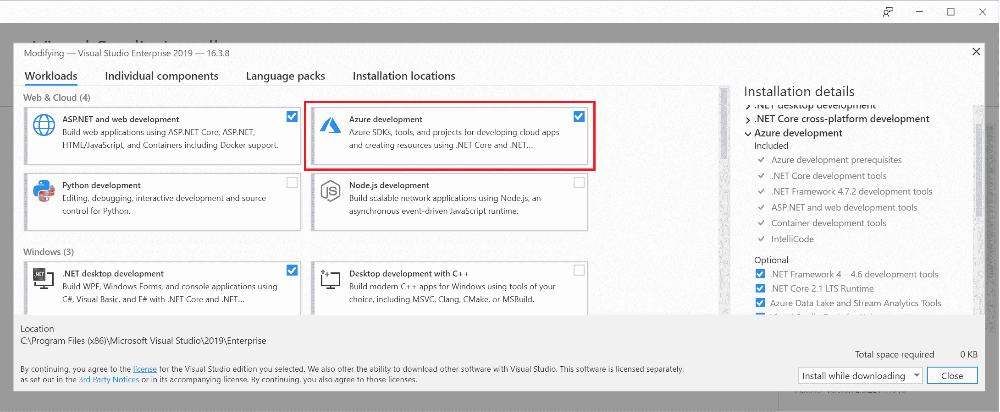

1.  等待安装完成并启动 Visual Studio。

现在，您可以为 Kubernetes 的容器应用程序创建新项目，其中包括以下内容：

+   *ASP.NET* Core

+   用于打包的 Helm 图表

+   用于在 AKS 上进行快速迭代开发的 Azure Dev Spaces

也可以为现有的 ASP.NET Core 添加 Kubernetes/Helm 支持：

1.  在解决方案资源管理器中右键单击项目。

1.  导航到添加|容器编排器支持

1.  选择 Kubernetes/Helm。

不幸的是，Visual Studio 2019 目前对于管理 Kubernetes 集群的功能有限。作为替代，您可以使用 Visual Studio Code 来完成这项任务。

# Visual Studio Code

对于 Visual Studio Code，您可以使用微软提供的两个*官方*扩展：

+   **Kubernetes** **(**`ms-kubernetes-tools.vscode-kubernetes-tools`**)**：使您能够在树视图中探索 Kubernetes 集群，管理 Kubernetes 对象，并为编辑清单文件和 Helm 图表提供智能感知。

+   **Azure Dev Spaces (**`azuredevspaces.azds`**)**：启用 Azure Dev Spaces 集成，类似于您在 Visual Studio 2019 中的功能。

要安装这两个扩展，打开 Visual Studio Code 并按照以下步骤操作：

1.  打开扩展面板（*Ctrl*+*Shift*+*X*）。

1.  在 Marketplace 中搜索 Kubernetes。

1.  点击安装。

1.  重复相同步骤以安装 Azure Dev Spaces。

在右侧菜单中，您现在可以使用 Kubernetes 面板，它会自动加载您的 kubeconfig。这个扩展特别适用于处理包含清单文件的工作空间，因为您会得到自动完成、YAML 语法高亮显示和验证。

您可以从树视图或使用命令（*Ctrl*+*Shift*+*P*）来管理您的集群——这可以代替在 PowerShell 中执行`kubectl`命令。例如，您可以查看容器的日志：

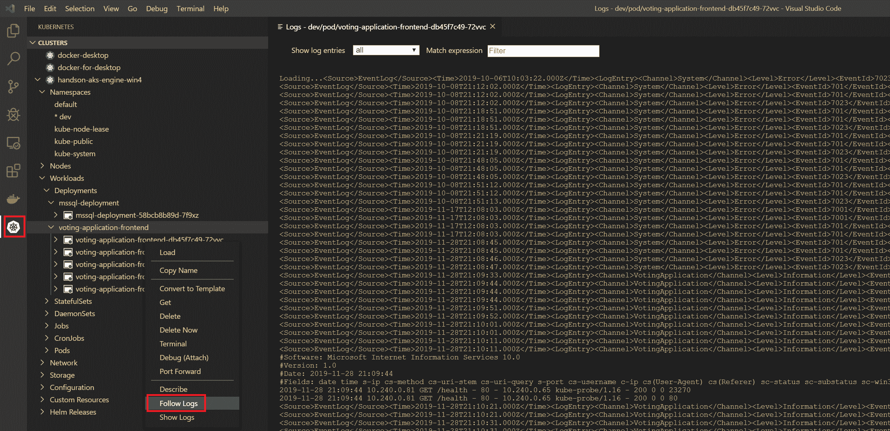

Visual Studio Code 目前是 Windows 中用于处理 Kubernetes 和 Helm 的最有用和最先进的工具。 在下一节中，我们将展示如何使用 Helm 打包应用程序。

# 使用 Helm 打包应用程序

应用程序需要打包以便轻松重新分发和管理依赖关系。 在 Windows 中，您可以使用 Chocolatey，在 Ubuntu 中，您可以使用**APT**（Advanced Package Tool 的缩写），而对于 Kubernetes，您可以使用 Helm 作为包管理器（[`v3.helm.sh/`](https://v3.helm.sh/)）。 还有一些替代方案，比如 Kustomize（它在`kubectl`中具有本机支持）和 Kapitan，但总的来说，Helm 目前被认为是行业标准，拥有最大的 Helm 图表官方存储库（[`github.com/helm/charts`](https://github.com/helm/charts)）。

Helm 的主要用例如下：

+   将流行软件部署到您的 Kubernetes 集群。 软件包以 Helm 图表的形式分发。

+   共享您自己的应用程序作为 Helm 图表。 这可以包括为最终用户打包产品或将 Helm 用作系统中微服务的内部包和依赖项管理器。

+   确保应用程序获得适当的升级，包括依赖关系管理。

+   为您的需求配置软件部署。 Helm 图表基本上是 Kubernetes 清单的通用**另一种标记语言**（**YAML**）参数化模板。 Helm 使用 Go 模板（[`godoc.org/text/template`](https://godoc.org/text/template)）进行参数化。 如果您熟悉 Go，那么您会感到很亲切； 如果不熟悉，那么您会发现它与其他模板系统非常相似，比如 Mustache。

请注意，Helm 的架构在最近发布的 3.0.0 版本中发生了 drastical 变化。

以前，Helm 需要在 Kubernetes 上部署一个名为 Tiller 的专用服务，负责与 Kubernetes API 的实际通信。 这引发了各种问题，包括安全性和 RBAC（Role-Based Access Control 的缩写）问题。 从 Helm 3.0.0 开始，不再需要 Tiller，图表管理由客户端完成。 您可以在官方 FAQ 中阅读有关旧版 Helm 版本之间的区别的更多信息[`helm.sh/docs/faq/#changes-since-helm-2`](https://helm.sh/docs/faq/#changes-since-helm-2)。

Helm 被分发为一个带有类似 kubectl 的 CLI 的客户端（库）。现在可以使用客户端执行 Helm 中的所有操作。让我们在您的 Windows 机器上安装 Helm。

# 安装 Helm

建议在 Windows 机器上使用 Chocolatey 安装 Helm。要安装 Helm，请按照以下步骤进行：

1.  以管理员身份打开 PowerShell 窗口。

1.  执行以下安装命令：

```
 choco install kubernetes-helm
```

1.  安装完成后，请验证您是否运行版本`3.0.0`或更高版本：

```
PS C:\src> helm version
version.BuildInfo{Version:"v3.0.0", GitCommit:"e29ce2a54e96cd02ccfce88bee4f58bb6e2a28b6", GitTreeState:"clean", GoVersion:"go1.13.4"}
```

1.  检查是否有使用`helm repo list`命令添加的任何存储库。如果没有（在版本 3.0.0 中），添加官方的`stable`存储库并更新：

```
helm repo add stable https://kubernetes-charts.storage.googleapis.com
helm repo update
```

1.  现在，尝试搜索一些 Helm 图表，例如，让我们检查是否有 Microsoft SQL Server 的图表：

```
PS C:\src> helm search hub mssql
URL                                             CHART VERSION   APP VERSION     DESCRIPTION
https://hub.helm.sh/charts/stable/mssql-linux   0.10.1          14.0.3023.8     SQL Server 2017 Linux Helm Chart
```

**Helm Hub** ([`hub.helm.sh/`](https://hub.helm.sh/))提供了一个用户友好的界面，用于浏览官方 Helm 存储库([`github.com/helm/charts`](https://github.com/helm/charts))。

我们找到了一个在 Linux 容器中运行的 SQL Server 的稳定图表。它基于 2017 年的版本，但我们仍然可以将其用于我们的投票应用程序。

# 使用 Helm 部署 Microsoft SQL Server

现在让我们来看看如何将 Microsoft SQL Server 部署到我们的 AKS Engine 集群。每个图表的结构都是相似的：

+   在`root`目录中，您可以找到一个详细的自述文件，其中描述了如何安装图表以及可能的参数是什么([`github.com/helm/charts/tree/master/stable/mssql-linux`](https://github.com/helm/charts/tree/master/stable/mssql-linux))。

+   `Chart.yaml`文件包含图表元数据，包括依赖信息。

+   `templates`目录包含所有用于 Kubernetes 清单的 Go 模板。

+   `values.yaml`文件定义了可以使用 CLI 参数或提供 YAML 文件来覆盖的图表的默认值。

安装 Helm 图表的过程很简单：为您的需求定义正确的值（可能需要分析模板以了解发生了什么），然后运行`helm install`命令。查看 SQL Server 的图表，我们需要指定以下`values.yaml`文件：

```
acceptEula:
  value: "y"

edition:
  value: Developer

sapassword: "S3cur3P@ssw0rd"

service:
  type: LoadBalancer

persistence:
  enabled: true
  storageClass: azure-disk

nodeSelector:
  "kubernetes.io/os": linux
```

使用 Helm 部署 SQL Server，请按照以下步骤进行：

1.  打开 PowerShell 窗口。

1.  将前面的文件保存为`values.yaml`在当前目录中。

1.  创建先决条件。我们需要`dev-helm`命名空间和`azure-disk` StorageClass。创建以下`prereq.yaml`清单文件：

```
---
kind: Namespace
apiVersion: v1
metadata:
  name: dev-helm
  labels:
    name: dev-helm
---
kind: StorageClass
apiVersion: storage.k8s.io/v1beta1
metadata:
  name: azure-disk
provisioner: kubernetes.io/azure-disk
parameters:
  storageaccounttype: Standard_LRS
  kind: Managed
```

1.  使用`kubectl apply -f .\prereq.yaml`命令应用清单文件。

1.  执行 Helm 图表安装的干运行。您将能够看到将应用哪些 Kubernetes 清单文件：

```
helm install demo-mssql stable/mssql-linux `
 --namespace dev-helm `
 --values .\values.yaml `
 --debug `
 --dry-run
```

此命令将执行`stable/mssql-linux`作为`demo-mssql` Helm 发布在`dev-helm`命名空间的安装干运行。

1.  如果您对结果满意，请执行安装：

```
helm install demo-mssql stable/mssql-linux `
 --namespace dev-helm `
 --values .\values.yaml
```

1.  使用以下命令观察 SQL Server 的部署：

```
kubectl get all --all-namespaces -l release=demo-mssql
```

1.  您还可以使用 Helm CLI 检查状态：

```
helm status -n dev-helm demo-mssql
```

1.  使用 SQL Server Management Studio 或 SQL Tools 容器验证 SQL Server 是否正常运行。您可以使用服务的外部 IP 地址——我们已经暴露了一个负载均衡器服务。

管理 Helm 发布的命令与 kubectl 类似，都是命名空间范围的。

正如你所看到的，使用 Helm 在集群中快速引导复杂的应用程序非常高效。现在，让我们为我们的投票应用程序准备一个 Helm 图表。我们将使用一个 SQL Server 图表作为依赖。

# 为我们的投票应用程序创建一个 Helm 图表

为了将我们的投票应用程序打包为 Helm 图表，我们将使用上一章中用于水平 Pod 自动缩放演示的清单文件。您可以在书的 GitHub 存储库中找到基本的清单文件。

为了准备 Helm 图表，我们需要按照以下步骤进行：

1.  收集所有必需的 Kubernetes 清单文件，并确定哪些部分应该被参数化。我们将用这些来创建 Helm 模板文件和“默认值”文件。

1.  为我们的应用程序定义所有的依赖关系，并为它们定义适当的参数值。我们将把这些参数注入到我们父图表的“默认值”文件中。

1.  将 Entity Framework 数据库迁移转换为安装后和升级后的 Helm 钩子。

这里的大部分工作是将原始的 Kubernetes 清单文件转换为 Helm 模板。在接下来的几个步骤中，我们将只展示这个过程的相关部分。为了获得最佳的编码体验，请使用 Visual Studio Code 编辑 Helm 图表。您可以在 Github 存储库[`github.com/PacktPublishing/Hands-On-Kubernetes-on-Windows/tree/master/Chapter12/03_voting-application-helm`](https://github.com/PacktPublishing/Hands-On-Kubernetes-on-Windows/tree/master/Chapter12/03_voting-application-helm)中找到我们投票应用程序的最终 Helm 图表。

请按照以下步骤创建您的 Helm 图表：

1.  首先，让我们从集群中卸载 SQL Server Helm 发布。我们将自动将此图表作为 Voting 应用程序父图表的依赖项安装：

```
helm uninstall -n dev-helm demo-mssql
```

1.  运行以下命令创建 Helm 图表脚手架：

```
helm create voting-application
```

这将创建一个名为`voting-application`的目录，其中包含 Helm 图表的基本结构和模板。我们将重复使用其中的大部分内容。

1.  使用`cd .\voting-application\`导航到图表目录，并修改`Chart.yaml`文件中的图表元数据：

```
apiVersion: v2
name: voting-application
description: Voting Application (Windows Containers) Helm chart
type: application
version: 0.1.0
appVersion: 1.4.0
dependencies:
  - name: mssql-linux
    version: 0.10.1
    repository: https://kubernetes-charts.storage.googleapis.com
sources:
- https://github.com/hands-on-kubernetes-on-windows/voting-application
```

这里代码的最重要部分涉及定义适当的依赖关系和设置适当的`apiVersion`，这将在模板中用作 Docker 镜像标签。从官方稳定存储库`https://kubernetes-charts.storage.googleapis.com`中添加`mssql-linux`的最新图表版本（`0.10.1`）。

1.  使用`cd .\templates\`命令导航到`templates`目录。我们将在原始形式中使用`reuse _helpers.tpl`（其中包含模板助手函数）、`service.yaml`、`serviceaccount.yaml`和`ingress.yaml`。这些清单模板将产生我们需要的内容，无需任何更改。

1.  下一步是为我们的 Deployment 定义一个清单模板，命名为`deployment.yaml`；您应该检查图表脚手架中的原始`deployment.yaml`文件，因为您可以在我们的模板中使用其中的大部分内容。此模板的最终版本可以在[`github.com/PacktPublishing/Hands-On-Kubernetes-on-Windows/blob/master/Chapter12/03_voting-application-helm/templates/deployment.yaml`](https://github.com/PacktPublishing/Hands-On-Kubernetes-on-Windows/blob/master/Chapter12/03_voting-application-helm/templates/deployment.yaml)找到。例如，让我们解释一下如何对 Docker 镜像标签进行参数化并注入 SQL Server 密码：

```
apiVersion: apps/v1
kind: Deployment
metadata:
  name: {{ include "voting-application.fullname" . }}
  labels:
    {{- include "voting-application.labels" . | nindent 4 }}
spec:
  ...
  template:
    ...
    spec:
      ...
      containers:
        - name: {{ .Chart.Name }}-frontend
          ...
          image: "{{ .Values.image.repository }}:{{ .Chart.AppVersion }}"
          imagePullPolicy: {{ .Values.image.pullPolicy }} 
          env:
          - name: MSSQL_SA_PASSWORD
            valueFrom:
              secretKeyRef:
                name: {{ .Release.Name }}-mssql-linux-secret
                key: sapassword
          - name: CONNECTIONSTRING_VotingApplication
            value: "Data Source={{ .Release.Name }}-mssql-linux;Initial Catalog=VotingApplication;MultipleActiveResultSets=true;User Id=sa;Password=$(MSSQL_SA_PASSWORD);"
```

让我们一步一步地分析。`{{ include "voting-application.fullname" . }}`短语向您展示了如何包含在`_helpers.tpl`中定义的模板，并将其用作部署名称。如果有更高级的模板逻辑，您应该始终使用此文件来定义可重用的模板。

Pod 容器的 Docker 镜像定义为`"{{ .Values.image.repository }}:{{ .Chart.AppVersion }}"`；您可以使用`.Values`来引用在`values.yaml`文件中定义的变量，使用`.Chart`来引用图表元数据。最后，我们使用了`{{ .Release.Name }}-mssql-linux-secret`来引用由依赖的 SQL Server 图表创建的秘密。

您需要了解依赖图表的内部结构，以了解应使用什么值（[`github.com/helm/charts/blob/master/stable/mssql-linux/templates/secret.yaml`](https://github.com/helm/charts/blob/master/stable/mssql-linux/templates/secret.yaml)[)。](https://github.com/helm/charts/blob/master/stable/mssql-linux/templates/secret.yaml)

不幸的是，Helm 没有一个简单的引用过程来从依赖图表中获取这些值，因此您必须要么按照 Helm 使用的约定硬编码名称（我们这样做了），要么在`_helpers.tpl`中定义一个专用模板（这是一种更清晰的方法，但也更复杂）。

1.  定义 RBAC 角色和 RoleBindings，我们创建了两个额外的模板文件，`rolebinding.yaml`和`role.yaml`。您可以在[`github.com/PacktPublishing/Hands-On-Kubernetes-on-Windows/tree/master/Chapter12/03_voting-application-helm/templates`](https://github.com/PacktPublishing/Hands-On-Kubernetes-on-Windows/tree/master/Chapter12/03_voting-application-helm/templates)中找到内容。为应用程序定义 RBAC 清单可以是有条件的；您可以在官方 Helm 图表中看到这种做法。

1.  我们需要定义的最后一个清单是用于运行 Entity Framework 数据库迁移的 Helm 钩子（[`helm.sh/docs/topics/charts_hooks/`](https://helm.sh/docs/topics/charts_hooks/)）（[`github.com/PacktPublishing/Hands-On-Kubernetes-on-Windows/blob/master/Chapter12/03_voting-application-helm/templates/post-install-job.yaml`](https://github.com/PacktPublishing/Hands-On-Kubernetes-on-Windows/blob/master/Chapter12/03_voting-application-helm/templates/post-install-job.yaml)）。钩子就像任何其他清单模板一样，但它具有额外的注释，确保清单在图表发布的生命周期的某个特定点应用。此外，如果钩子是 Kubernetes 作业，Helm 可以等待作业完成并进行清理。我们希望这个钩子是一个作业，与我们已经用于 EF 迁移的相同类型，并且希望它在安装或升级发布后执行。让我们看看如何在`post-install-job.yaml`文件中定义我们作业的注释：

```
apiVersion: batch/v1
kind: Job
metadata:
  name: {{ .Release.Name }}-ef6-database-migrate
  ...
  annotations:
    "helm.sh/hook": post-install,post-upgrade
    "helm.sh/hook-weight": "-5"
    "helm.sh/hook-delete-policy": hook-succeeded
spec:
  backoffLimit: 10
```

将清单模板转换为钩子的关键注释是`"helm.sh/hook"`。我们使用`post-install`和`post-upgrade`值来确保钩子在安装后和 Helm 发布升级后执行。`"helm.sh/hook-weight"`短语用于确定钩子的顺序，在我们的情况下并不重要，因为我们只有一个钩子。

`"helm.sh/hook-delete-policy"`短语定义了作业实例应在何种情况下自动删除。我们希望仅在成功的钩子执行时删除它们；否则，我们希望保留资源，以便我们可以调试问题。

请注意，我们将作业的`backoffLimit`指定为`10`；在 SQL Server pod 创建时间较长的情况下，我们需要这个值，这种情况下可能需要几分钟；如果我们不这样做，钩子将失败得太快。

1.  最后一步是在图表的根目录中的`values.yaml`文件中提供默认模板值（[`github.com/PacktPublishing/Hands-On-Kubernetes-on-Windows/blob/master/Chapter12/03_voting-application-helm/values.yaml`](https://github.com/PacktPublishing/Hands-On-Kubernetes-on-Windows/blob/master/Chapter12/03_voting-application-helm/values.yaml)）。让我们来看看文件中的一些重要部分：

```
...
image:
  repository: packtpubkubernetesonwindows/voting-application
  pullPolicy: IfNotPresent
...
nodeSelector: 
  "kubernetes.io/os": windows
...
mssql-linux:
  acceptEula:
    value: "y"
  edition:
    value: Developer
  sapassword: "S3cur3P@ssw0rd"
  service:
    type: LoadBalancer
  persistence:
    enabled: true
    storageClass: azure-disk
  nodeSelector:
    "kubernetes.io/os": linux
```

您可以组织值；但是，它们已经方便地排列好了。例如，关于 Docker 镜像的所有内容都被分组到图像节点中，然后您可以在图表中引用图像存储库名称为`{{ .Values.image.repository }}`。要记住的一个非常重要的事情是提供适当的`nodeSelector`，以确保 pod 仅安排在 Windows 节点上。最后，使用其名称为依赖图表定义值。

在这里，我们使用了`mssql-linux`，因为这是我们在`Chart.yaml`文件中引用的图表。您可以在文档中阅读有关管理依赖项和定义值的更多信息[`helm.sh/docs/topics/charts/#chart-dependencies`](https://helm.sh/docs/topics/charts/#chart-dependencies)。

Helm 的许多方面都基于惯例。您可以在文档中找到有关实施图表的最佳实践的更多信息[`helm.sh/docs/topics/chart_best_practices/`](https://helm.sh/docs/topics/chart_best_practices/)。使用`helm lint`命令检查图表是否存在任何问题。

我们的投票应用程序的图表已准备就绪。现在，我们将在`dev-helm`命名空间中将此图表安装到我们的 Kubernetes 集群中：

1.  在图表的`root`目录中打开 PowerShell 窗口。

1.  确保从存储库中获取所有依赖的图表：

```
helm dependency update
```

1.  执行 Helm 图表安装的`dry run`以检查清单文件：

```
helm install voting-application . `
 --namespace dev-helm `
 --debug `
 --dry-run
```

此命令将打印所有解析的清单文件，这些文件将应用于当前目录中图表的安装，使用默认值。

1.  现在，安装图表。我们需要为安装提供扩展的超时，因为我们的 Entity Framework 数据库迁移作业可能需要几分钟才能成功。这取决于 SQL Server 初始化和准备连接的速度。使用以下命令：

```
helm install voting-application . `
 --namespace dev-helm `
 --debug `
 --timeout 900s
```

1.  安装将需要一些时间；您可以在单独的 PowerShell 窗口中观察单个 Kubernetes 对象的部署进度。

```
kubectl get all -n dev-helm
```

1.  安装结束后，使用`kubectl get -n dev-helm svc -w voting-application`获取我们的投票应用程序的 LoadBalancer 服务的外部 IP 地址。在 Web 浏览器中导航到该地址并享受！

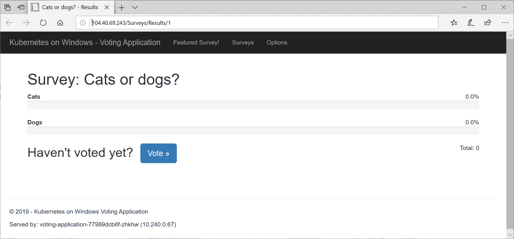

在生产环境中，您应该使用 Helm 图表存储库来管理您的图表。您可以在[`v3.helm.sh/docs/topics/chart_repository/`](https://v3.helm.sh/docs/topics/chart_repository/)了解有关设置存储库的更多信息。此外，为了*声明性*地管理 Helm 图表的发布，类似于`kubectl apply`，您可以考虑使用`Helmfile`（[`github.com/roboll/helmfile`](https://github.com/roboll/helmfile)）。

在下一节中，您将学习如何轻松将 Azure Application Insights 添加到在 Windows 容器中运行的 ASP.NET MVC 应用程序中。我们还将向您展示如何执行刚刚安装的 Helm 发布的升级。

# 使用 Azure Application Insights 调试容器化应用程序

Azure Application Insights 是 Azure Monitor 的一部分，为您的应用程序提供**应用程序性能管理**（**APM**）功能。它是一个庞大的平台，在 Azure 门户中具有丰富的**用户界面**（**UI**）,提供以下功能（以及其他功能）：

+   请求监控和跟踪，包括多个微服务之间的分布式跟踪

+   异常监控和快照调试

+   收集主机机器的性能计数器

+   智能异常检测和警报

+   轻松的日志收集和分析

对我们来说最有趣的功能是快照调试，它可以帮助诊断在不建议使用附加远程调试器的生产部署中的问题。为此，如果您想使用 Visual Studio 分析快照，您将需要 Visual Studio 2019 企业版。或者，您可以在 Azure 门户本身进行分析，该门户具有轻量级的基于 Web 的调试器。

或者，您可以使用 Istio 服务网格提供的带外仪器应用程序监控，在 Azure 上运行的 Kubernetes 应用程序，如[`docs.microsoft.com/en-us/azure/azure-monitor/app/kubernetes`](https://docs.microsoft.com/en-us/azure/azure-monitor/app/kubernetes)中所述。

启用 Azure Application Insights 与快照调试，我们需要按照以下步骤进行：

1.  在 Visual Studio 项目中启用 Azure Application Insights。

1.  安装`Microsoft.ApplicationInsights.SnapshotCollector` NuGet 包。

1.  配置快照调试并修改 Serilog 配置以使用发送日志到`System.Diagnostics.Trace`的接收器。

1.  添加演示异常。

1.  构建一个新的 Docker 镜像并将其推送到 Docker Hub。

1.  升级 Helm 发布。

之后，我们将能够直接在 Azure 门户中分析跟踪图、应用程序日志和异常。请注意，此日志收集解决方案与我们在第八章中演示的不同，*部署混合 Azure Kubernetes 服务引擎集群*，在那里我们使用 Azure Log Analytics 来处理 AKS Engine。它们使用相同的 Azure 服务，但在新解决方案中，我们将仅获取应用程序日志——在 Azure Log Analytics 视图中看不到 Kubernetes 或容器运行时日志。

# 启用 Azure 应用程序洞察

请按照以下步骤在我们的投票应用程序中启用 Azure 应用程序洞察。或者，您可以使用 Github 存储库中提供的现成源代码[`github.com/PacktPublishing/Hands-On-Kubernetes-on-Windows/tree/master/Chapter12/04_voting-application-azure-application-insights-src`](https://github.com/PacktPublishing/Hands-On-Kubernetes-on-Windows/tree/master/Chapter12/04_voting-application-azure-application-insights-src)。

如果选择这样做，您需要在 Helm 发布升级期间的后续步骤中提供自己的 Azure 应用程序洞察密钥：

1.  在 Visual Studio 2019 中打开`VotingApplication`解决方案。

1.  在解决方案资源管理器中，右键单击`VotingApplication`项目，选择添加，然后选择应用程序洞察遥测...：

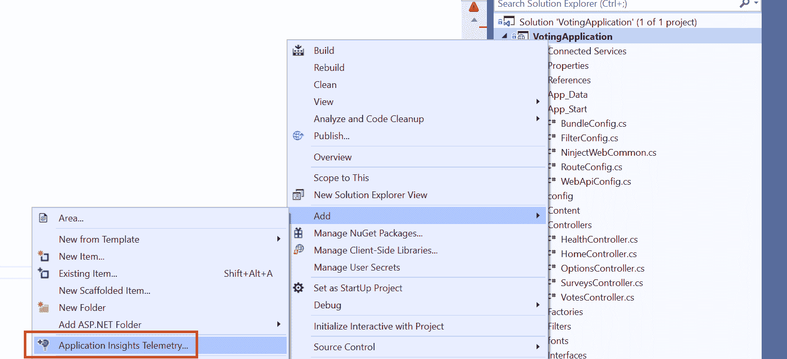

1.  点击开始。

1.  登录 Azure 并提供一个新的资源组和资源名称（或使用默认值）。

1.  点击注册。该操作将需要几分钟的时间。一旦时间过去，将在您的 Azure 订阅中创建一个新的 Azure 应用程序洞察实例，并将适当的 NuGet 包添加到 Visual Studio 项目中。

1.  更新 CodeLens 的资源并启用它来从`System.Diagnostics`中收集跟踪：

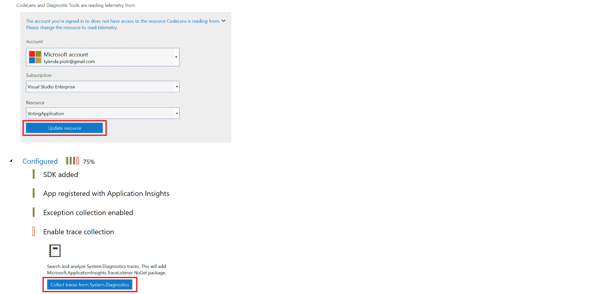

1.  我们不希望将仪表键硬编码到 Docker 镜像中。应用程序洞察支持注入`APPINSIGHTS_INSTRUMENTATIONKEY`环境变量的能力。导航到解决方案中的`ApplicationInsights.config`文件，找到以下 XML 节点，记下密钥以供进一步使用，并删除 XML 节点：

```
<InstrumentationKey>4e810bf1-58c4-4af7-a67d-36fcdcf24a2f</InstrumentationKey>
```

1.  搜索解决方案中所有的仪表键的出现。您会在`_Layout.cshtml`中找到另一个；用以下值替换它：

```
instrumentationKey: '@Microsoft.ApplicationInsights.Extensibility.TelemetryConfiguration.Active.InstrumentationKey'
```

1.  在解决方案资源管理器中右键单击`VotingApplication`项目，然后选择`管理 Nuget Packages...`。安装以下 NuGet 包`Microsoft.ApplicationInsights.SnapshotCollectorandSerilog.Sinks.Trace`。

1.  配置快照调试器。在`ApplicationInsights.config`文件中，确保在根节点`ApplicationInsights`中有以下 XML 节点：

```
<TelemetryProcessors>
 <Add Type="Microsoft.ApplicationInsights.SnapshotCollector.SnapshotCollectorTelemetryProcessor, Microsoft.ApplicationInsights.SnapshotCollector">
 <IsEnabled>true</IsEnabled>
 <IsEnabledInDeveloperMode>false</IsEnabledInDeveloperMode>
 <ThresholdForSnapshotting>1</ThresholdForSnapshotting>
 <MaximumSnapshotsRequired>3</MaximumSnapshotsRequired>
 <MaximumCollectionPlanSize>50</MaximumCollectionPlanSize>
 <ReconnectInterval>00:15:00</ReconnectInterval>
 <ProblemCounterResetInterval>1.00:00:00</ProblemCounterResetInterval>
 <SnapshotsPerTenMinutesLimit>3</SnapshotsPerTenMinutesLimit>
 <SnapshotsPerDayLimit>30</SnapshotsPerDayLimit>
 <SnapshotInLowPriorityThread>true</SnapshotInLowPriorityThread>
 <ProvideAnonymousTelemetry>false</ProvideAnonymousTelemetry>
 <FailedRequestLimit>3</FailedRequestLimit>
 </Add>
</TelemetryProcessors>
```

1.  在`NinjectWebCommon.cs`文件的`RegisterServices`方法中注册 Serilog sink。您的日志记录器配置应如下所示：

```
Log.Logger = new LoggerConfiguration()
                 .ReadFrom.AppSettings()
                 .Enrich.FromLogContext()
                 .WriteTo.EventLog(source: "VotingApplication", logName: "VotingApplication", manageEventSource: false)
                 .WriteTo.Trace()
                 .CreateLogger();
```

1.  在`HomeController.cs`文件中，添加一个新的控制器动作`TestException`，我们将用于测试快照调试。它应该只是抛出一个未处理的异常：

```
public ActionResult TestException()
{
    throw new InvalidOperationException("This action always throws an exception!");
}
```

此时，我们的投票应用程序已完全配置为使用 Azure Application Insights。现在可以使用以下步骤升级 Helm 发布：

1.  使用`1.5.0`标签构建一个新的 Docker 镜像，就像我们在之前的章节中所做的那样，并将其推送到 Docker Hub。在我们的情况下，它将被称为`packtpubkubernetesonwindows/voting-application:1.5.0`。

1.  导航到应用程序的 Helm 图表所在的目录。

1.  在`Chart.yaml`文件中，使用`1.5.0`（与 Docker 镜像标签相同）作为`appVersion`。根据我们的最佳实践建议，更改图表的版本，例如使用`0.2.0`。

1.  在`values.yaml`文件中，添加您的仪表键，并将`replicaCount`增加到`5`：

```
azureApplicationInsightsKey: 4e810bf1-58c4-4af7-a67d-36fcdcf24a2f
replicaCount: 5
```

1.  现在，我们需要将仪表键注入到`Voting`应用程序的`Deployment`中的 pod 模板中。修改`templates\deployment.yaml`，以便将`azureApplicationInsightsKey`注入到`APPINSIGHTS_INSTRUMENTATIONKEY`环境变量中：

```
apiVersion: apps/v1
kind: Deployment
metadata:
  name: {{ include "voting-application.fullname" . }}
  ...
spec:
  ...
  template:
    ...
    spec:
      ...
      containers:
        - name: {{ .Chart.Name }}-frontend
          ...
          env:
          - name: APPINSIGHTS_INSTRUMENTATIONKEY
            value: {{ .Values.azureApplicationInsightsKey }}
          ...
```

1.  使用图表的新版本执行 Helm 发布的`dry run`。

```
helm upgrade voting-application . `
 --namespace dev-helm `
 --debug `
 --dry-run
```

1.  运行`upgrade`：

```
helm upgrade voting-application . `
 --namespace dev-helm `
 --debug `
 --timeout 900s
```

1.  等待所有副本升级到新版本。

现在，您的应用程序应该正在运行并将所有遥测发送到 Azure Application Insights。您可以从 Azure 门户导航到 Application Insights（[`portal.azure.com/`](https://portal.azure.com/)），或者通过在 Visual Studio 中右键单击`Connected Services`下的`Application Insights`并选择`Open Application Insights Portal`来直接打开它：

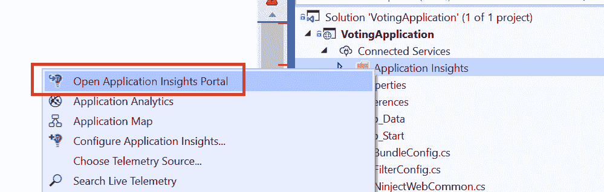

您可以探索当前配置中提供的多个开箱即用的功能，例如将遥测数据可视化为应用程序地图，显示应用程序中不同组件之间的依赖关系及其当前状态：

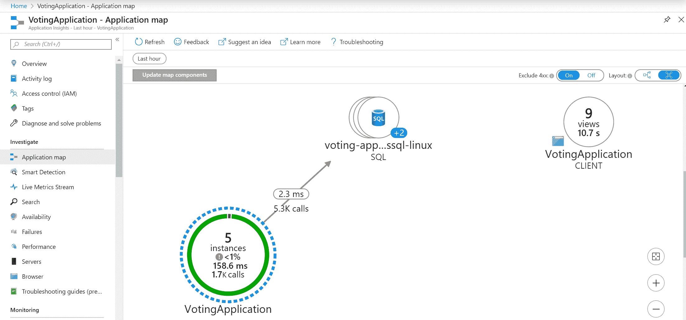

如果您对最终用户请求的整体性能感兴趣，可以查看基于 ASP.NET MVC 遥测的专用仪表板：

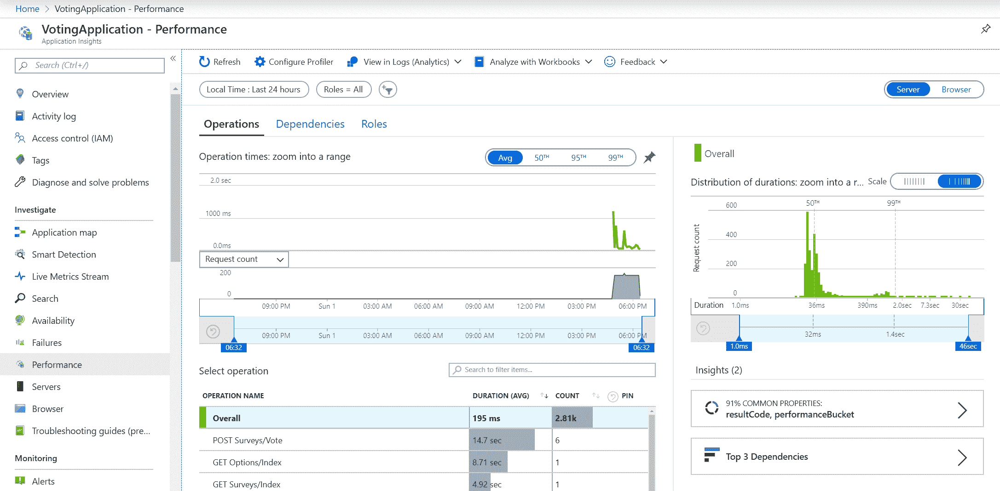

当然，您还可以检查由 Serilog 汇集的应用程序**日志**。此视图中最重要的功能是使用 Kusto 语言（[`docs.microsoft.com/en-us/azure/kusto/query/`](https://docs.microsoft.com/en-us/azure/kusto/query/)）运行复杂查询的可能性，该语言专为分析日志数据而设计：

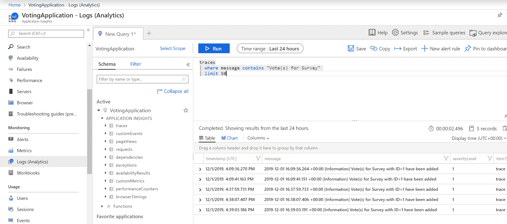

您可以在官方文档中了解有关 Azure 应用程序洞察功能的更多信息[`docs.microsoft.com/en-us/azure/azure-monitor/app/app-insights-overview`](https://docs.microsoft.com/en-us/azure/azure-monitor/app/app-insights-overview)。

现在，让我们看看如何使用快照调试器来调试您的容器化应用程序，即使您没有访问远程调试器也可以。

# 快照调试器

Azure 应用程序洞察服务提供了快照调试器，这是一个用于监视应用程序异常遥测的功能，包括生产场景。每当出现未处理的异常（顶部抛出），快照调试器都会收集可以直接在 Azure 门户中分析的托管内存转储，或者针对更高级的场景，使用 Visual Studio 2019 企业版。如果您在安装程序中选择了 ASP.NET 工作负载，则 Visual Studio 将默认安装此功能。

快照调试可以为不使用 ASP.NET MVC 的常规.NET 应用程序进行配置。您可以在文档中了解更多信息[`docs.microsoft.com/en-us/azure/azure-monitor/app/snapshot-debugger-vm#configure-snapshot-collection-for-other-net-applications`](https://docs.microsoft.com/en-us/azure/azure-monitor/app/snapshot-debugger-vm#configure-snapshot-collection-for-other-net-applications)。

在前面的段落中，我们已经通过安装`Microsoft.ApplicationInsights.SnapshotCollector` NuGet 包并提供额外的配置来启用了应用程序中的快照调试。现在，我们可以在我们的投票应用程序中测试此功能：

1.  在您的网络浏览器中，导航到始终引发异常的测试端点：`http://<serviceExternalIp>/Home/TestException`。触发此端点两次；默认情况下，我们必须多次触发相同的异常才能触发快照收集。

1.  您将看到我们投票应用程序的默认错误页面。与此同时，快照已经被收集，对最终用户几乎没有性能影响。

1.  在 Azure 门户中为我们的投票应用程序导航到应用程序洞察。

1.  打开“失败”窗格，并在查看“操作”选项卡时选择“操作”按钮，或在查看“异常”选项卡时选择“异常”按钮：

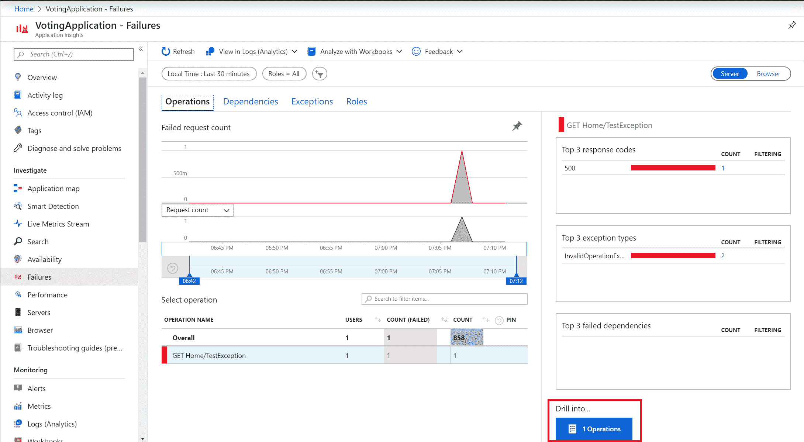

1.  从右侧选择示例操作窗格并打开异常发生之一。

1.  一开始，您在时间轴上看不到任何快照；您必须首先添加应用程序洞察快照调试器角色。要做到这一点，请单击（看不到快照？排除故障）：

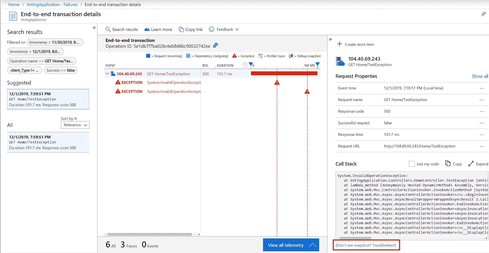

1.  单击添加应用程序洞察快照调试器角色：

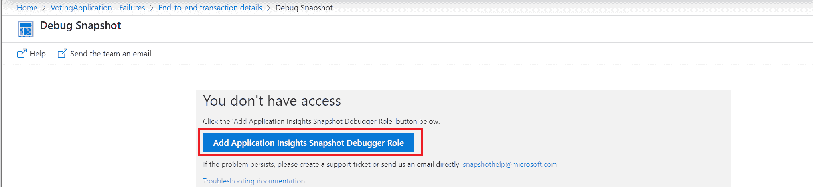

1.  之后，将执行基本的健康检查。请记住，快照上传需要几分钟的时间，因此，如果您遇到任何健康检查失败，请在几分钟后重试。

1.  现在，在端到端事务详细信息视图中，您将看到代表调试快照的小图标。单击其中一个：

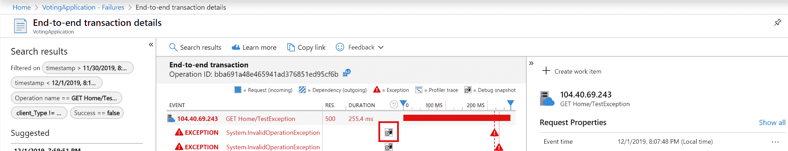

1.  调试快照视图为您提供了轻量级的调试器功能，包括代码反编译。要在 Visual Studio 2019 Enterprise 中分析快照，请单击“下载快照”按钮：

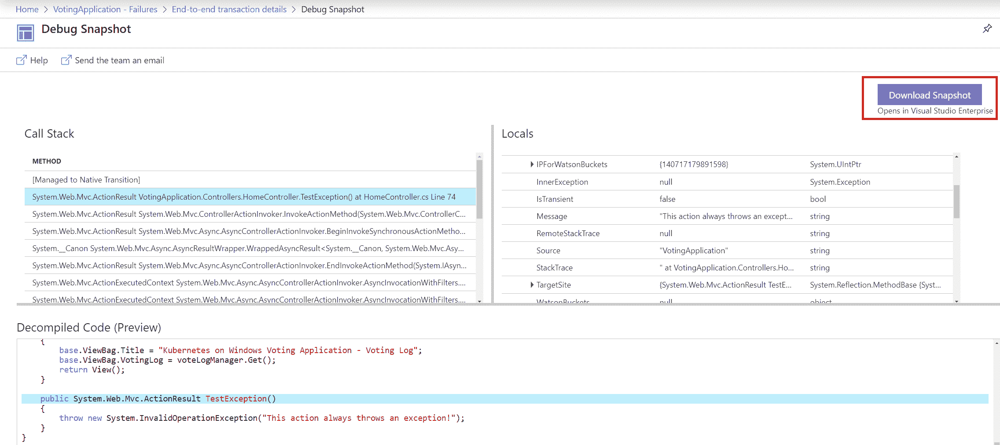

1.  文件下载完成后，双击在 Visual Studio 中打开它。

1.  在 Visual Studio 中，根据您的需求，单击“仅使用托管调试”或“调试托管内存”。当您分析内存泄漏和其他与内存相关的问题时，第二个选项非常有用。

1.  您可能需要选择源代码位置，以便查看源代码视图（[`docs.microsoft.com/en-us/visualstudio/debugger/specify-symbol-dot-pdb-and-source-files-in-the-visual-studio-debugger?view=vs-2019`](https://docs.microsoft.com/en-us/visualstudio/debugger/specify-symbol-dot-pdb-and-source-files-in-the-visual-studio-debugger?view=vs-2019)）。

1.  现在，您可以使用您一直使用的所有调试工具，例如，您可以分析并行堆栈视图：

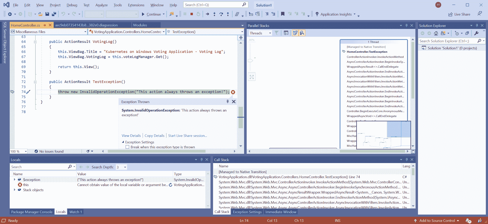

如果在使用快照调试器时遇到任何其他问题，请查看官方的故障排除指南[`docs.microsoft.com/en-us/azure/azure-monitor/app/snapshot-debugger-troubleshoot`](https://docs.microsoft.com/en-us/azure/azure-monitor/app/snapshot-debugger-troubleshoot)。

快照调试器甚至具有更多功能，可以设置实时快照点，以便您可以在不等待异常的情况下创建快照。不幸的是，目前此功能仅适用于在 Linux 容器中运行应用程序的 Azure 应用服务工作负载或托管的 AKS 集群。您可以在文档中找到更多信息[`docs.microsoft.com/en-us/visualstudio/debugger/debug-live-azure-applications?view=vs-2019`](https://docs.microsoft.com/en-us/visualstudio/debugger/debug-live-azure-applications?view=vs-2019)。

在下一节中，我们将介绍 Kubernetes 仪表板。

# 使用 Kubernetes 仪表板

Kubernetes 仪表板（[`github.com/kubernetes/dashboard`](https://github.com/kubernetes/dashboard)）是默认的基于 Web 的用户界面，用于部署、管理和排除运行在 Kubernetes 上的应用程序。通常建议您使用声明性的 kubectl 管理集群，而不是使用仪表板，但它仍然是一个有用的工具，可以查看集群概述，分析日志，并快速执行到 pod 容器中。

要使用仪表板，您必须首先安装它。您有以下选项可以这样做：

+   通过运行`kubectl apply -f https://raw.githubusercontent.com/kubernetes/dashboard/v2.0.0-beta6/aio/deploy/recommended.yaml`来使用官方清单进行部署。您可以在文档中的[`kubernetes.io/docs/tasks/access-application-cluster/web-ui-dashboard/`](https://kubernetes.io/docs/tasks/access-application-cluster/web-ui-dashboard)中再次检查最新版本。

+   使用`helm install kubernetes-dashboard stable/kubernetes-dashboard`命令安装 Helm 图表。

+   在 AKS Engine 中，使用默认启用的`kubernetes-dashboard`附加组件。

重要的是要知道 Kubernetes API 和 Kubernetes 仪表板有严格的兼容性规则。 您可以在官方发布页面[`github.com/kubernetes/dashboard/releases`](https://github.com/kubernetes/dashboard/releases)上检查矩阵。 目前，AKS Engine 部署了版本`1.10.1`的仪表板，与 Kubernetes API 的最新版本不兼容。 这意味着我们将使用官方清单部署仪表板。 AKS Engine 集群默认为启用 RBAC 的集群，因此我们需要配置 RBAC 以便作为集群管理员使用仪表板。

# 部署 Kubernetes 仪表板

要部署和配置 RBAC，请按照以下步骤进行：

1.  打开 PowerShell 窗口。

1.  使用官方清单部署 Kubernetes 仪表板：

```
kubectl apply -f https://raw.githubusercontent.com/kubernetes/dashboard/v2.0.0-beta6/aio/deploy/recommended.yaml
```

1.  为`admin-user`创建`serviceaccount.yaml`清单文件：

```
apiVersion: v1
kind: ServiceAccount
metadata:
 name: admin-user
 namespace: kubernetes-dashboard
```

1.  使用`kubectl apply -f serviceaccount.yaml`命令应用清单文件。

1.  创建`clusterrolebinding.yaml`清单文件，为此用户授予`cluster-admin`角色：

```
apiVersion: rbac.authorization.k8s.io/v1
kind: ClusterRoleBinding
metadata:
  name: admin-user
roleRef:
  apiGroup: rbac.authorization.k8s.io
  kind: ClusterRole
  name: cluster-admin
subjects:
- kind: ServiceAccount
  name: admin-user
  namespace: kubernetes-dashboard
```

1.  使用`kubectl apply -f clusterrolebinding.yaml`命令应用清单文件。

1.  要获取此用户的令牌，请在 PowerShell 中使用以下代码段，并复制`token:`后面的值：

```
kubectl -n kubernetes-dashboard describe secrets ((kubectl -n kubernetes-dashboard get secrets | Select-String "admin-user-token") -Split "\s+")[0]
```

在授予将用于访问仪表板的 ServiceAccount 的`cluster-admin`角色时，您需要了解任何安全影响。 拥有`admin-user` ServiceAccount 令牌的任何人都将能够在您的集群中执行任何操作。 在生产场景中，考虑创建仅公开必要功能的角色。

现在，您可以访问仪表板。 要做到这一点，请按照以下步骤进行：

1.  在 PowerShell 窗口中，使用`kubectl proxy`命令启动连接到 API 的代理。 仪表板未公开为外部服务，这意味着我们必须使用代理。

1.  打开 Web 浏览器，转到`http://localhost:8001/api/v1/namespaces/kubernetes-dashboard/services/https:kubernetes-dashboard:/proxy/`。

1.  使用令牌选项进行身份验证，并提供我们在前面步骤中检索到的令牌。

1.  您将被重定向到集群的概述：

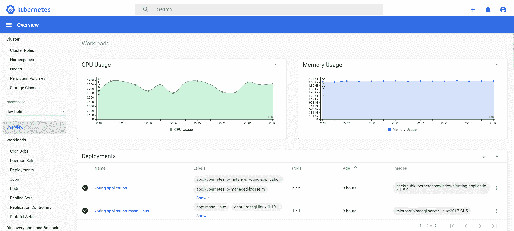

Kubernetes 仪表板具有多个功能，涵盖了`kubectl`提供的许多功能。在接下来的部分中，我们将探讨如何访问容器日志并执行到 Pod 容器中，因为它们在调试场景中非常有用。

# 访问 Pod 容器日志

Kubernetes 仪表板为您提供了一个方便的界面，可以快速访问 pod 容器日志。要访问我们投票应用程序的一个 pod 的日志，请按照以下步骤进行：

1.  在菜单中，导航到工作负载 | Pod。

1.  找到我们投票应用程序的一个 pod。在右侧，点击三个点按钮，然后选择日志。

1.  您将被重定向到日志视图，在那里您可以实时检查日志，就像使用`kubectl logs`命令一样：

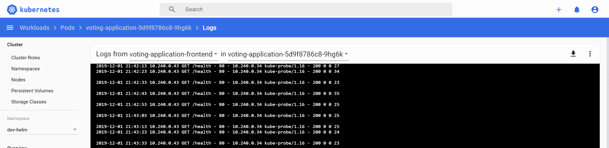

接下来，让我们看看如何`exec`到一个 Pod 容器中。

# 在 Pod 容器中执行命令

与访问日志类似，您可以`exec`到 Pod 容器中以运行临时命令。在调试问题或快速引入开发集群中的配置更改时，这种方法非常有用。执行以下步骤：

1.  在菜单中，导航到工作负载 | Pod。

1.  找到我们投票应用程序的一个 pod。在右侧，点击三个点按钮，然后选择`e``xec`。

1.  几秒钟后，PowerShell 终端将打开。您可以运行任意的 PowerShell 命令并修改容器状态：

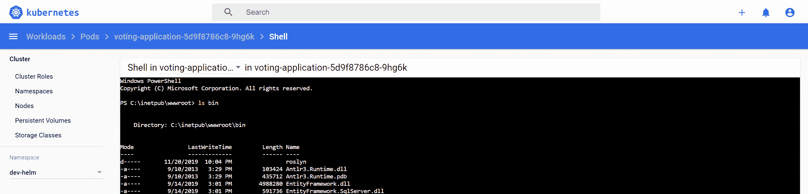

恭喜！您已成功部署了 Kubernetes 仪表板，现在又多了一个有用的调试工具。在下一节中，您将学习如何使用 Azure Dev Spaces 改进 Kubernetes 的开发环境。

# 在团队中使用 Azure Dev Spaces 进行微服务开发

Azure Dev Spaces（[`docs.microsoft.com/en-us/azure/dev-spaces/`](https://docs.microsoft.com/en-us/azure/dev-spaces/)），也称为**AZDS**（**Azure Dev Spaces**的缩写），是微软提供的增强 Kubernetes 开发体验的最新产品之一。该服务为使用 AKS 集群的团队提供了快速和迭代的开发体验。请注意，目前仅支持托管的 AKS 集群，这意味着您无法为此服务使用 AKS Engine。此外，当前版本不支持开发 Windows 容器应用程序；可以与现有的 Windows pod 进行交互，但它们不会由 AZDS 管理（[`docs.microsoft.com/en-us/azure/dev-spaces/how-to/run-dev-spaces-windows-containers`](https://docs.microsoft.com/en-us/azure/dev-spaces/how-to/run-dev-spaces-windows-containers)）。从这个角度来看，AZDS 对于 Windows 容器应用程序开发并不有用，但由于很可能很快会得到支持，我们将为您概述这一产品。

AZDS 的主要特点如下：

+   您可以最小化本地开发环境设置。您可以在 AKS 中直接调试和测试分布式应用程序的所有组件，而无需替换或模拟依赖关系（开发/生产一致性）。

+   您可以将 Kubernetes 集群组织成共享和私有的 Dev Spaces。

+   它可以独立更新微服务，而不影响 AKS 集群和其他开发人员的其余部分。您可以开发自己的服务版本，在隔离环境中进行测试，并在准备好与其他团队成员共享时更新实例，以便所有人都能看到。

+   它与 Visual Studio Code 和 Visual Studio 2019 完全集成，包括它们的远程调试功能。也可以从 Azure CLI 进行管理。

+   它可以将您的本地计算机连接到 Kubernetes 集群，并测试或调试本地应用程序（带有或不带有容器），并使用所有依赖项（[`docs.microsoft.com/en-us/azure/dev-spaces/how-to/connect`](https://docs.microsoft.com/en-us/azure/dev-spaces/how-to/connect)）。此功能类似于 telepresence。

+   它通过增量代码编译在容器中提供更快的开发循环，每当检测到代码更改时。

要创建 AKS 集群，您可以使用我们在第四章中提供的 Powershell 脚本，*Kubernetes 概念和 Windows 支持*（[`github.com/PacktPublishing/Hands-On-Kubernetes-on-Windows/blob/master/Chapter04/05_CreateAKSWithWindowsNodes.ps1`](https://github.com/PacktPublishing/Hands-On-Kubernetes-on-Windows/blob/master/Chapter04/05_CreateAKSWithWindowsNodes.ps1)）。

该脚本还可以仅创建具有两个节点 Linux 池的集群。 按照以下步骤创建启用了 AZDS 的 AKS 集群：

1.  下载脚本并使用适当的参数执行。 您需要选择支持 AZDS 的 Azure 位置（[`docs.microsoft.com/en-us/azure/dev-spaces/about#supported-regions-and-configurations`](https://docs.microsoft.com/en-us/azure/dev-spaces/about#supported-regions-and-configurations)）并选择该位置可用的 Kubernetes 版本（使用`az aks get-versions --location <azureLocation>`命令）。 在此示例中，我们将在`westeurope`位置创建一个名为`devspaces-demo`的 AKS 集群实例，并选择 Kubernetes 版本`1.15.4`。 请务必选择不包含保留字或商标的集群名称，否则您将无法启用 AZDS：

```
.\05_CreateAKSWithWindowsNodes.ps1 `
 -windowsPassword "S3cur3P@ssw0rd" `
 -azureLocation "westeurope" `
 -kubernetesVersion "1.15.4"
 -aksClusterName "devspaces-demo"
 -skipAddingWindowsNodePool $true
```

1.  集群部署大约需要 15 分钟。 完成后，将添加并设置名为`aks-windows-cluster`的`kubectl`的新上下文为默认值。

1.  使用以下命令为集群启用 AZDS：

```
az aks use-dev-spaces `
 --resource-group "aks-windows-resource-group" `
 --name "devspaces-demo"
```

1.  将安装 AZDS CLI。 在提示时将`default`命名空间用作 Dev Space。

现在 AKS 集群已启用 AZDS，我们可以演示在 Visual Studio 2019 中创建新的 ASP.NET Core 3.0 Kubernetes 应用程序并直接在集群中进行调试有多么容易。 按照以下步骤创建应用程序：

1.  打开 Visual Studio 2019 并选择创建新项目。

1.  找到适用于 Kubernetes 的容器应用程序模板，然后单击“下一步”。

1.  选择项目名称和位置，然后单击“下一步”。

1.  选择 Web 应用程序（模型-视图-控制器）类型，然后单击“创建”。

1.  我们需要对默认配置进行小的更改。 在`charts\azds-demo\values.yaml`文件中，确保使用以下代码启用`ingress`：

```
ingress:
 enabled: true
```

1.  默认情况下，Kestrel 监听端口`5000`。我们需要将端口更改为`80`，以便与 Dockerfile 和 Kubernetes Service 兼容。在`Program.cs`文件中，确保应用程序启动如下所示：

```
public static IHostBuilder CreateHostBuilder(string[] args) =>
        Host.CreateDefaultBuilder(args)
            .ConfigureWebHostDefaults(webBuilder =>
            {
                webBuilder
                    .UseUrls("http://0.0.0.0:80")
                    .UseStartup<Startup>();
            });
```

启用了 AZDS 支持的项目具有`azds.yaml`文件，其中定义了 Dev Spaces 配置、Dockerfile 和具有 Helm 图表的`charts`目录，准备好由 AZDS 部署到集群。现在，让我们将应用程序部署到我们的 AKS 集群中的`default` Dev Space 中：

1.  从项目的启动设置中，选择 Azure Dev Spaces：

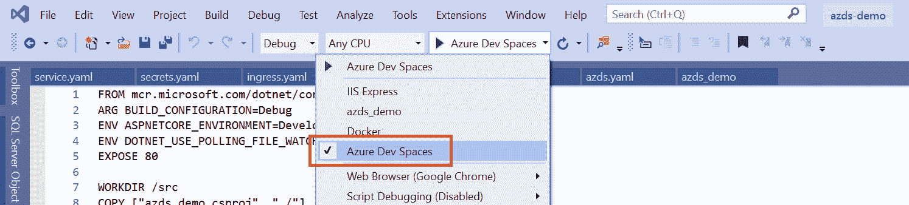

1.  选择`devspaces demo AKS cluster`和`default space`，并将其标记为公开访问，然后继续点击确定。

1.  AZDS 将构建 Dockerfile，安装 Helm 图表，并附加调试器。在 Web 浏览器中，Ingress 公共端点将自动打开，例如[h](http://default.azds-demo.2dpkt6cj7f.weu.azds.io/)[t](http://default.azds-demo.2dpkt6cj7f.weu.azds.io)[tp:/](http://default.azds-demo.2dpkt6cj7f.weu.azds.io/)[/default.azds-demo.2dpkt6cj7f.weu.azds.io/](http://default.azds-demo.2dpkt6cj7f.weu.azds.io/)。

1.  在`HomeController.cs`文件中，在索引控制器操作中添加断点。刷新浏览器中的网页，您将看到断点被捕获，就像应用程序在本地环境中进行调试一样！

1.  停止调试并在`Index.cshtml`文件中引入更改。例如，将主标题更改为以下内容：

```
<h1 class="display-4">Welcome - Modified</h1>
```

1.  再次使用 Azure Dev Spaces 配置启动应用程序。在输出窗口中，您将看到应用程序被快速重建，并且一段时间后，修改后的主页将再次在 Web 浏览器中打开：

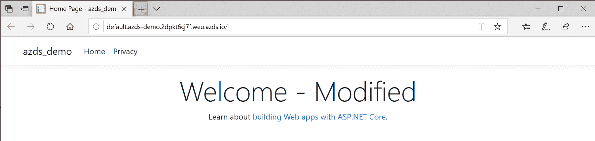

要了解团队开发中更多的 AZDS 场景，请查看官方文档[`docs.microsoft.com/en-us/azure/dev-spaces/team-development-netcore-visualstudio`](https://docs.microsoft.com/en-us/azure/dev-spaces/team-development-netcore-visualstudio)。

所有这些都发生在 AKS 集群上。正如您所看到的，与在正常的开发循环中构建 Docker 镜像、推送它并部署新的部署相比，开发迭代要快得多。

要删除 AKS 集群，请使用`az group delete --name aks-windows-resource-group --yes`命令。

恭喜！您已成功为您的 AKS 集群设置了 Azure Dev Spaces。

# 总结

本章重点介绍了作为开发人员如何通过 Kubernetes 集群改进开发体验。首先，我们学习了如何为 Visual Studio Code 和 Visual Studio 2019 配置必要的开发扩展。接下来，您学习了如何使用 Helm 打包 Kubernetes 应用程序，首先是通过使用 Microsoft SQL Server 的官方 Helm 图表，然后是通过为我们的投票应用程序创建一个专用图表。

接下来，我们学习了如何将 Azure Application Insights 集成到您的应用程序中，以及如何利用高级功能，如快照调试器，以便在 Windows pod 的生产场景中调试问题。使用我们新的带有 Application Insights 仪表的 Docker 镜像，我们学习了如何执行 Helm 发布升级。我们介绍了 Kubernetes Dashboard，这是最常用的 Kubernetes Web UI。最后，您了解了 Azure Dev Spaces 服务是什么，以及在使用 AKS 集群时如何使用它来增加开发迭代速度。

在下一章中，我们将专注于安全这一重要主题，特别是在 Windows 容器的背景下。

# 问题

1.  Helm 是什么，为什么应该使用它？

1.  Helm 版本二和三之间最大的区别是什么？

1.  如何在 Helm 图表中实现自动的 Entity Framework 数据库迁移？

1.  如何执行安装为 Helm 图表的应用程序的新版本的发布？

1.  快照调试器是什么，如何在生产场景中使用它？

1.  为什么不建议使用 Kubernetes Dashboard 来修改集群中的资源？

1.  使用 Azure Dev Spaces 的优势是什么？

您可以在本书的*评估*部分找到这些问题的答案。

# 进一步阅读

+   有关 Kubernetes 功能以及如何管理应用程序的更多信息，请参考以下 PacktPub 图书：

+   *完整的 Kubernetes 指南*（[`www.packtpub.com/virtualization-and-cloud/complete-kubernetes-guide`](https://www.packtpub.com/virtualization-and-cloud/complete-kubernetes-guide)）

+   *开始使用 Kubernetes-第三版*（[`www.packtpub.com/virtualization-and-cloud/getting-started-kubernetes-third-edition`](https://www.packtpub.com/virtualization-and-cloud/getting-started-kubernetes-third-edition)）

+   开发者的 Kubernetes（[`www.packtpub.com/virtualization-and-cloud/kubernetes-developers`](https://www.packtpub.com/virtualization-and-cloud/kubernetes-developers)）

+   如果您对学习 Azure 应用洞察感兴趣，请参考以下 PacktPub 图书：

+   开发者的 Azure 实践（[`www.packtpub.com/virtualization-and-cloud/hands-azure-developers`](https://www.packtpub.com/virtualization-and-cloud/hands-azure-developers)）

+   Azure 架构师-第二版（[`www.packtpub.com/virtualization-and-cloud/azure-architects-second-edition`](https://www.packtpub.com/virtualization-and-cloud/azure-architects-second-edition)）

+   有关 Helm 的更多信息，您可以查看以下 PacktPub 图书：

+   精通 Kubernetes-第二版（[`www.packtpub.com/application-development/mastering-kubernetes-second-edition`](https://www.packtpub.com/application-development/mastering-kubernetes-second-edition)）
