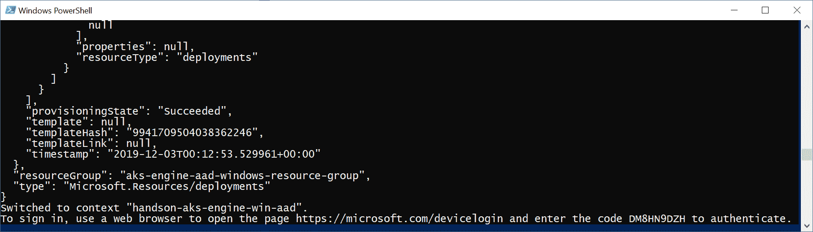
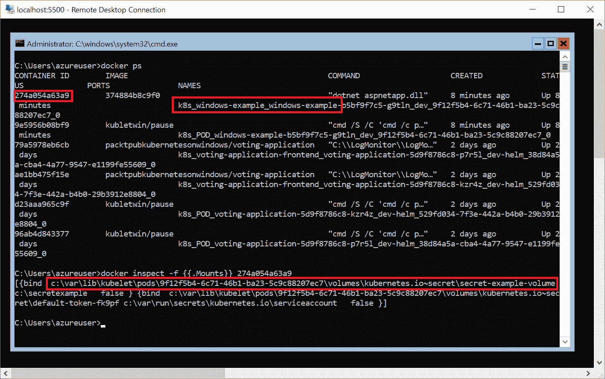
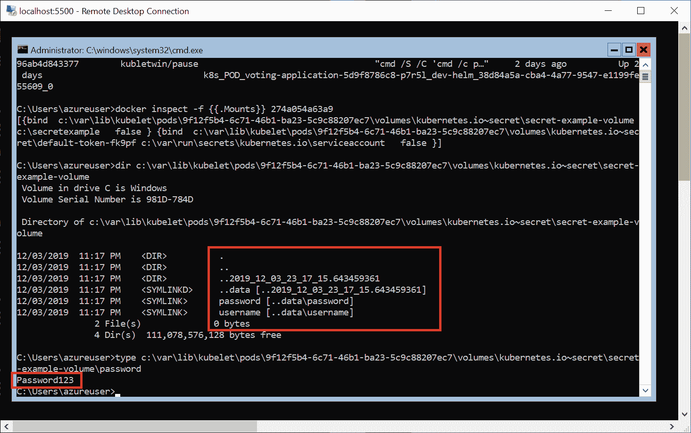

# 保护 Kubernetes 集群和应用程序

安全性这个话题值得特别关注——Kubernetes 是一个庞大而复杂的系统，在这个系统中安全性并不明显，潜在的攻击向量也不会立即显现。如果考虑到这个系统可以执行的强大操作以及它与操作系统内部的深度集成，那么在 Kubernetes 中考虑安全性就更加重要了。只是为了让您了解，如果您忽视了配置细节，事情可能会变得很糟糕，可以看一下有关特斯拉因为 Kubernetes Dashboard 的*公共*、*未经身份验证*端点而被加密挖矿的文章[`blog.heptio.com/on-securing-the-kubernetes-dashboard-16b09b1b7aca`](https://blog.heptio.com/on-securing-the-kubernetes-dashboard-16b09b1b7aca)。

在本章中，我们将为您提供保护 Kubernetes 集群的一般最佳实践，包括 Windows 工作负载的视角。Windows 节点有一些限制——例如，只能直接从节点存储（而不是内存）中以明文形式挂载密钥，但它们在不同方面也比 Linux 节点更安全。

本章将涵盖以下主题：

+   保护 Kubernetes 集群

+   保护 Windows 上的容器运行时

+   使用网络策略部署安全应用程序

+   Windows 机器上的 Kubernetes 密钥

# 技术要求

对于本章，您将需要以下内容：

+   已安装的 Windows 10 Pro、企业版或教育版（1903 版本或更高版本，64 位）

+   Azure 账户

+   使用 AKS Engine 部署的 Windows/Linux Kubernetes 集群

要跟着做，您需要自己的 Azure 账户，以便为 Kubernetes 集群创建 Azure 资源。如果您之前没有在前几章创建过账户，您可以阅读更多关于如何获取个人使用的有限免费账户的信息[`azure.microsoft.com/en-us/free/`](https://azure.microsoft.com/en-us/free/)。

使用 AKS Engine 部署 Kubernetes 集群已在第八章中介绍过，*部署混合 Azure Kubernetes 服务引擎集群*。

您可以从官方 GitHub 存储库下载本书章节的最新代码示例[`github.com/PacktPublishing/Hands-On-Kubernetes-on-Windows/tree/master/Chapter13`](https://github.com/PacktPublishing/Hands-On-Kubernetes-on-Windows/tree/master/Chapter13)。

# 保护 Kubernetes 集群

在本节中，我们将提供一些关于如何保护 Kubernetes 集群的一般指导。此外，我们将探讨在 AKS Engine 集群中使用 Azure Active Directory（AAD）集成进行 API 用户身份验证的主题。本章提供的最佳实践清单并不详尽，因此请始终查阅最新的官方文档，以确保您遵循建议。

现在，让我们逐个讨论以下各小节中的一般建议清单。

# 使用内置 RBAC 进行授权

我们已经在第十一章中介绍了 Kubernetes 提供的基于角色的访问控制（RBAC）用于 API 授权。这种机制允许您配置细粒度的权限集，并将其分配给用户、组和服务帐户。通过这种方式，作为集群管理员，您可以控制集群用户（内部和外部）与 API 服务器的交互方式，他们可以访问哪些 API 资源以及可以执行哪些操作。同时，您应该使用命名空间来创建资源之间的第一个边界。这也使得应用 RBAC 策略更加容易。

对于 RBAC，使用最小特权原则，并倾向于将 RoleBindings 分配给组，而不是单个用户，以减少管理开销。如果使用外部身份验证提供者，您可以轻松地与提供者提供的组集成。在引导集群时，建议您同时使用 Node 和 RBAC 授权器（对 API 服务器使用`--authorization-mode=Node,RBAC`参数），结合 NodeRestriction 准入插件。这是 AKS Engine 初始化集群的默认方式。

# 使用外部身份验证提供者

所有 API 调用都必须经过身份验证。这对外部（普通）用户以及内部 Kubernetes 基础设施的成员（例如 kubelet）都是如此。在基础设施的情况下，这些用户通常使用带有令牌或 X509 客户端证书的 ServiceAccounts，这些证书是在引导集群时创建的。Kubernetes 本身不提供管理访问集群的普通外部用户的手段；这应该委托给一个可以与 Kubernetes 集成的外部身份验证提供者，例如通过认证代理。

您应选择适合您的组织并遵循用户的常见访问模式的身份验证机制。例如，如果您正在运行 AKS 引擎，很可能已经在 Azure 订阅中使用 Azure Active Directory 来管理用户和角色。除此之外，您应考虑使用组来使 RBAC 策略管理更加简单，并与 AAD 更加集成。

除了 AAD 之外，认证代理和认证 webhook 还可以让您有可能与不同的协议集成，例如 LDAP、SAML 或 Kerberos。

在本节的最后，我们将演示如何为您的 AKS 引擎集群启用 AAD 集成。

# 使用 kubeadm 引导集群

如果您手动部署集群，请使用 kubeadm，它可以安全地引导集群。它可以生成一个自签名的 CA 来为集群中的所有组件设置身份，生成用于加入新节点的令牌（TLS 引导），并提供证书管理功能([`kubernetes.io/docs/tasks/administer-cluster/kubeadm/kubeadm-certs/`](https://kubernetes.io/docs/tasks/administer-cluster/kubeadm/kubeadm-certs/))。初始化一个安全的 Kubernetes 集群是 kubeadm 的首要设计重点([`github.com/kubernetes/kubeadm/blob/master/docs/design/design_v1.10.md`](https://github.com/kubernetes/kubeadm/blob/master/docs/design/design_v1.10.md))。

# 禁用公共 API 访问

对于生产场景，仅使用 RBAC 授权进行 Kubernetes API 的适当用户身份验证可能不足够（从安全角度来看），如果 API 是公开访问的。为了减少 Kubernetes API 的攻击向量，考虑*禁用*公共 API 访问，以及不直接将任何 Kubernetes 节点暴露给互联网。当然，这将需要您使用 VPN 或 jumpbox 主机来访问 API，但这绝对更安全。

AKS 引擎可以通过对集群 apimodel 进行简单更改来为您配置此功能。您可以在官方文档中阅读有关禁用公共 API 访问的更多信息[`github.com/Azure/aks-engine/blob/master/docs/topics/features.md#private-cluster`](https://github.com/Azure/aks-engine/blob/master/docs/topics/features.md#private-cluster)。或者，您可以考虑加固主 VM 的 NAT 入站规则，限制允许通过 HTTPS 和 SSH 连接到机器的 IP 范围。

# 禁用公共仪表板

与 Kubernetes API 类似，您应该禁用公开访问的 Kubernetes 仪表板。在常见的安装中，仪表板可能会暴露为一个 LoadBalancer 服务；在最坏的情况下，这将是一个具有`cluster-admin`角色的 ServiceAccount。推荐的做法是永远不要使用 LoadBalancer 服务公开 Kubernetes 仪表板，并始终使用`kubectl proxy`来访问页面。

此外，Kubernetes 仪表板的 ServiceAccount 应具有足够满足您用例的**最低权限**。您很可能永远不会在生产环境中使用 Kubernetes 仪表板来创建或编辑部署，那么为什么您需要对这些敏感的 API 资源具有写访问权限呢？

# 以非特权模式运行容器

在 Kubernetes 中，可以指定一个 pod 是否具有特权。特权 pod 可能包含以特权模式运行的容器，这基本上意味着容器可以访问主机上的所有设备，这与在主机上以 root（或管理员）权限运行的进程具有类似的权限。

确保您的 pod 容器在操作系统中以非特权模式运行是一个良好的做法；这遵循了最小权限原则。此外，您应该考虑使用 PodSecurityPolicy admission controller 来强制执行一组规则，一个 pod 必须满足才能被调度。一个示例的限制性策略可以在[`raw.githubusercontent.com/kubernetes/website/master/content/en/examples/policy/restricted-psp.yaml`](https://raw.githubusercontent.com/kubernetes/website/master/content/en/examples/policy/restricted-psp.yaml)找到。

请注意，在 Windows 容器的情况下，不支持运行特权容器。此外，对于 Windows 工作负载，请考虑使用**组管理服务帐户**（gMSAs，[`kubernetes.io/docs/tasks/configure-pod-container/configure-gmsa/`](https://kubernetes.io/docs/tasks/configure-pod-container/configure-gmsa/)）。

# 加密数据的静态存储

数据在静止状态下加密被认为是一种普遍的良好做法（有时是法律强制要求）对于所有系统。在 Kubernetes 中，您需要确保 etcd 集群数据被加密。这将为您的 API 资源和秘密提供额外的安全层，否则这些信息将以未加密的形式保存在 etcd 中。在官方 Kubernetes 文档中，有关在静止状态下加密秘密的内容被单独讨论。

对于秘密，您应该始终使用延迟绑定，通过将秘密注入到 pod 中作为卷或环境变量。请注意，在 Linux 上将秘密注入为环境变量是不太安全的；当您拥有 root 权限时，您可以从`/proc/<pid>/environ`枚举出一个进程的所有环境变量。在 Windows 节点上，问题甚至更加复杂：您仍然可以访问进程的环境变量，但卷目前无法使用内存文件系统。这意味着秘密随后直接存储在节点磁盘上。这意味着您应该考虑加密您的 Windows 节点存储，以最小化凭据的暴露。我们将在接下来的章节中讨论这个问题。

# 使用网络策略

网络策略充当您的 pod 之间的防火墙，允许您控制容器化应用程序的网络访问。在 Kubernetes 集群中，默认情况下，pod 之间没有网络通信的限制——基本上，所有的流量都是可能的。使用一种宽松的网络策略模型是一种良好的做法，它默认拒绝所有流量，并只允许连接，如果已经定义了专用的网络策略。

您可以在官方文档中阅读更多关于支持 AKS Engine 上网络策略的网络提供商的信息。请注意，目前这些提供商不支持 Windows pod，除了 Tigera Essentials 订阅服务的企业版本提供的 Calico（https://www.tigera.io/media/pr-calico-for-windows）。

# 保护镜像供应链和扫描镜像

在第三章中，*使用容器镜像*，我们描述了如何使用**Docker Content Trust**（**DCT**）对 Docker 镜像进行签名和验证。您应该在生产中考虑使用这种方法来进行 Docker 镜像流水线。此外，考虑整合开源工具，如**Anchore**（[`github.com/anchore/anchore-engine`](https://github.com/anchore/anchore-engine)）和**Clair**（[`github.com/quay/clair`](https://github.com/quay/clair)），这些工具可以帮助您识别常见的漏洞和曝光（**CVEs**）并加以缓解。

# 旋转基础设施凭据和证书

一般来说，凭据或令牌的有效期越短，攻击者利用这种凭据的难度就越大。利用这一原则为在您的集群中使用的证书和令牌设置较短的生命周期，并在可能的情况下实施**自动轮换**。当您发现自己受到攻击时，这可以成为您的秘密武器；如果您能有效地轮换证书，您可以随时轮换它们，并使任何被截获的凭据无效。

对于 AKS 和 AKS Engine，考虑使用与**Azure Key Vault**集成，这将使您的秘密和证书管理和轮换变得更加容易。您可以在官方文档中阅读更多信息，网址为[`github.com/Azure/kubernetes-keyvault-flexvol`](https://github.com/Azure/kubernetes-keyvault-flexvol)。

此外，考虑集成一个认证提供者，用于发放具有短期有效期的用户令牌。您可以使用这种方法来提供**及时特权访问管理**，这可以大大限制用户拥有资源的*上帝模式*访问的时间。

# 启用审计日志

**审计日志**应始终在生产集群中可用。这将使监视和警报设置对访问异常和意外 API 调用进行监控成为可能。您越早发现任何禁止的 API 响应，就越有可能及时做出反应，防止攻击者获取对集群的访问权限。您可以在官方文档中阅读有关 Kubernetes 审计的更多信息，网址为[`kubernetes.io/docs/tasks/debug-application-cluster/audit/`](https://kubernetes.io/docs/tasks/debug-application-cluster/audit/)。

在设置生产集群时，请确保阅读官方 Kubernetes 指南以保护集群。您可以在[`kubernetes.io/docs/tasks/administer-cluster/securing-a-cluster/`](https://kubernetes.io/docs/tasks/administer-cluster/securing-a-cluster/)找到更多详细信息。

现在，在我们已经了解了 Kubernetes 集群的最重要的安全最佳实践之后，我们将看看如何在 AKS Engine 集群中启用**Azure Active Directory**（AAD）进行客户端身份验证。

# 集成 AAD 与 AKS Engine

AKS Engine 可以轻松与 AAD 集成，以提供 Kubernetes API 客户端身份验证。与 AAD **组**一起，这种方法可以用于为映射到 AAD 组的用户组创建 RoleBindings 和 ClusterRoleBindings。

让我们看看如何创建一个具有 AAD 集成的 AKS Engine 集群，并为集群管理员创建一个 AAD 组。这种方法可以扩展到管理多个具有不同 RBAC 绑定的 AAD 组。

不支持将 AAD 集成添加到现有的 AKS Engine 集群。因此，您需要在集群部署时做出这个决定。

为服务器和客户端配置 AAD 应用程序的步骤，以及创建管理员 AAD 组的步骤，已经作为 Powershell 脚本提供，方便您使用。您可以使用该脚本或按照以下步骤操作：

1.  打开 PowerShell 窗口，并使用全局唯一的 DNS 前缀定义`$dnsPrefix`变量，稍后将用于 AKS Engine 部署，例如：

```
$dnsPrefix = "handson-aks-engine-win-aad"
```

1.  创建一个将代表 Kubernetes API 服务器的 AAD 服务器应用程序，并将`appId`存储以供进一步使用作为`$serverApplicationId`变量：

```
$serverApplicationId = az ad app create `
 --display-name "${dnsPrefix}Server" `
 --identifier-uris "https://${dnsPrefix}Server" `
 --query appId -o tsv
```

1.  更新此应用程序的组成员资格声明：

```
az ad app update `
 --id $serverApplicationId `
 --set groupMembershipClaims=All
```

1.  创建一个将用于 Azure 平台身份验证的**服务主体**：

```
az ad sp create `
 --id $serverApplicationId
```

1.  获取服务主体的**密钥**并将其存储以供进一步使用作为`$serverApplicationSecret`变量：

```
$serverApplicationSecret = az ad sp credential reset `
 --name $serverApplicationId `
 --credential-description "AKSPassword" `
 --query password -o tsv
```

1.  现在，为服务器应用程序添加权限以读取目录数据、登录和读取用户配置文件：

```
az ad app permission add `
 --id $serverApplicationId `
 --api 00000003-0000-0000-c000-000000000000 `
 --api-permissions e1fe6dd8-ba31-4d61-89e7-88639da4683d=Scope 06da0dbc-49e2-44d2-8312-53f166ab848a=Scope 7ab1d382-f21e-4acd-a863-ba3e13f7da61=Role
```

1.  授予权限：

```
az ad app permission grant `
 --id $serverApplicationId `
 --api 00000003-0000-0000-c000-000000000000 
az ad app permission admin-consent `
 --id $serverApplicationId
```

1.  接下来的步骤将类似，但将适用于代表 kubectl 的 AAD **客户端应用程序**。创建该应用程序并将`appId`存储为`$clientApplicationId`变量以供进一步使用：

```
$clientApplicationId = az ad app create `
 --display-name "${dnsPrefix}Client" `
 --native-app `
 --reply-urls "https://${dnsPrefix}Client" `
 --query appId -o tsv
```

根据您的 AAD 租户配置，您可能需要额外的权限来创建服务主体。您可以在官方文档中阅读更多内容[`docs.microsoft.com/en-us/azure/active-directory/develop/howto-create-service-principal-portal#required-permissions`](https://docs.microsoft.com/en-us/azure/active-directory/develop/howto-create-service-principal-portal#required-permissions)。

1.  为应用程序创建服务主体：

```
az ad sp create `
 --id $clientApplicationId
```

1.  确定服务器应用程序的 OAuth2 ID 并将其存储为`$oauth2PermissionId`：

```
$oauth2PermissionId = az ad app show 
 --id $serverApplicationId `
 --query "oauth2Permissions[0].id" -o tsv
```

1.  使用 OAuth2 ID 允许客户端和服务器应用程序之间的身份验证流程：

```
az ad app permission add `
 --id $clientApplicationId `
 --api $serverApplicationId `
 --api-permissions $oauth2PermissionId=Scope

az ad app permission grant `
 --id $clientApplicationId `
 --api $serverApplicationId
```

1.  为 AKS Engine 管理员创建名为`AksEngineAdmins`的 AAD 组，并将其 ID 存储为`$adminGroupId`变量：

```
$adminGroupId = az ad group create `
 --display-name AksEngineAdmins `
 --mail-nickname AksEngineAdmins `
 --query "objectId" -o tsv
```

1.  我们想要将当前用户添加到这个组。首先，让我们检索用户的`objectId`并将其存储为`$currentUserObjectId`变量：

```
$currentUserObjectId = az ad signed-in-user show `
 --query "objectId" -o tsv
```

1.  将用户添加到 AKS Engine 管理员组：

```
az ad group member add `
 --group AksEngineAdmins `
 --member-id $currentUserObjectId
```

1.  确定当前订阅的 AAD 租户 ID 并将其存储为`$tenantId`变量：

```
$tenantId = az account show `
 --query "tenantId" -o tsv
```

1.  基于前面的变量打印 JSON 对象，该对象将在 AKS Engine apimodel 中使用：

```
echo @"
"aadProfile": {
 "serverAppID": "$serverApplicationId",
 "clientAppID": "$clientApplicationId",
 "tenantID": "$tenantId",
 "adminGroupID": "$adminGroupId"
}
"@
```

我们已经准备好部署带有 AAD 集成的 AKS Engine。为此，我们将使用一个 PowerShell 脚本，几乎与我们在之前章节中使用的方式完全相同([`github.com/PacktPublishing/Hands-On-Kubernetes-on-Windows/blob/master/Chapter13/02_aks-engine-aad/CreateAKSEngineClusterWithWindowsNodes.ps1`](https://github.com/PacktPublishing/Hands-On-Kubernetes-on-Windows/blob/master/Chapter13/02_aks-engine-aad/CreateAKSEngineClusterWithWindowsNodes.ps1))，以及 apimodel 模板([`github.com/PacktPublishing/Hands-On-Kubernetes-on-Windows/blob/master/Chapter13/02_aks-engine-aad/kubernetes-windows-template.json`](https://github.com/PacktPublishing/Hands-On-Kubernetes-on-Windows/blob/master/Chapter13/02_aks-engine-aad/kubernetes-windows-template.json))。执行 AKS Engine 部署，按照以下步骤进行：

1.  下载 PowerShell 脚本和 apimodel 模板。

1.  在文件位置打开 PowerShell 窗口。

1.  在`kubernetes-windows-template.json`文件中，用前面段落中的自己的值替换`aadProfile`。

1.  使用适当的参数执行脚本：

```
.\CreateAKSEngineClusterWithWindowsNodes.ps1 `
 -azureSubscriptionId <azureSubscriptionId> `
 -dnsPrefix <dnsPrefix> `
 -windowsPassword 'S3cur3P@ssw0rd' `
 -resourceGroupName "aks-engine-aad-windows-resource-group" `
 -azureLocation "westus"
```

1.  几分钟后，脚本将执行`kubectl get pods`命令，并提示您在 Web 浏览器中进行*身份验证*：



1.  导航到 URL，提供代码并登录。之后，您将成功在 Kubernetes API 服务器中进行身份验证，并能够使用 kubectl。

1.  要检查允许您访问的 ClusterRoleBinding 的定义，请执行以下命令：

```
PS C:\src> kubectl describe clusterrolebinding aad-default-admin-group
Name:         aad-default-admin-group
Labels:       addonmanager.kubernetes.io/mode=EnsureExists
 kubernetes.io/cluster-service=true
Annotations:  <none>
Role:
 Kind:  ClusterRole
 Name:  cluster-admin
Subjects:
 Kind   Name                                  Namespace
 ----   ----                                  ---------
 Group  18d047eb-83f9-4740-96be-59555e88138f
```

根据您的需求，您现在可以配置更多的 AAD 组，创建角色并为它们提供适当的 RoleBindings。在下一节中，我们将看看如何确保 Windows 容器运行时安全运行。

# 在 Windows 中保护容器运行时

在保护容器运行时方面，Windows 容器与 Linux 容器有些不同。对于 Windows 容器，操作系统使用一个`Job`对象（不要与 Kubernetes 的`Job`对象混淆！）每个容器一个，具有用于在给定容器中运行的所有进程的系统命名空间过滤器。这提供了与主机机器的逻辑隔离，无法禁用。您可以在第一章中阅读有关 Windows 容器架构的更多信息，*创建容器*。

这一事实有一个后果：在 Windows 中，**特权**容器不可用，尽管在 Linux 中可用。此外，随着 Kubernetes 对 Hyper-V 容器的支持即将到来，您将能够进一步保护容器运行时并强制执行更好的隔离。

对于 Linux 容器，您可以考虑在 Pod 中使用`securityContext`以作为**非特权**用户运行（其 ID 与`0`不同）：

```
apiVersion: v1
kind: Pod
metadata:
  name: secured-pod
spec:
  securityContext:
    runAsUser: 1000
```

此外，您可以强制执行 PodSecurityPolicies，在调度 Pod 之前由准入控制器进行验证。通过这种方式，例如，您可以确保给定命名空间中没有以特权模式运行的 Pod。您必须使用 RBAC 来正确配置策略访问。

AKS Engine 默认启用了 PodSecurityPolicy 准入控制器，并提供了特权和受限策略。

对于 Windows 容器，标准的`securityContext`不适用，因为它是用于 Linux 容器的。Windows 容器在`securityContext`内部有一个专门的对象，名为`windowsOptions`，它可以启用一些目前仍处于**alpha**状态的 Windows 特定功能：

+   使用不同的用户名配置正在运行的 Pod 容器（[`kubernetes.io/docs/tasks/configure-pod-container/configure-runasusername/`](https://kubernetes.io/docs/tasks/configure-pod-container/configure-runasusername/)）。

+   为 Pod 容器配置组管理的服务帐户（gMSA）（[`kubernetes.io/docs/tasks/configure-pod-container/configure-gmsa/`](https://kubernetes.io/docs/tasks/configure-pod-container/configure-gmsa/)）。gMSA 是一种特定类型的 Active Directory 帐户，提供自动密码管理、简化的服务主体名称管理，并且可以将管理委托给多个服务器上的其他管理员。Azure Active Directory 支持 gMSA（[`docs.microsoft.com/en-us/azure/active-directory-domain-services/create-gmsa`](https://docs.microsoft.com/en-us/azure/active-directory-domain-services/create-gmsa)）。

在下一节中，您将了解更多关于网络策略以及它们如何用于在 Kubernetes 上部署更安全的应用程序。

# 使用网络策略部署安全应用程序

在 Kubernetes 中，您可以使用网络策略为应用程序部署提供更好的网络隔离粒度。它们由`NetworkPolicy`对象表示，定义了一组 Pod 如何相互通信以及一般网络端点——可以将它们视为 OSI 模型第 3 层的网络分割的基本防火墙。当然，它们并不是高级防火墙的替代品。

`NetworkPolicy`对象使用标签选择器来识别它们附加到的 Pod。同样，标签选择器和 IP CIDR 用于为这些 Pod 定义入口和出口规则的目标。只有当网络策略具有与给定 Pod 匹配的标签选择器时，才会使用给定的网络策略。如果没有与给定 Pod 匹配的网络策略，它可以接受任何流量。

# 网络策略支持

为了使用网络策略，您需要使用一个支持网络策略的**网络提供商**（用于安装 Pod 网络，如第五章中所述，*Kubernetes 网络*）。最受欢迎的有以下几种：

+   Calico ([`www.projectcalico.org/`](https://www.projectcalico.org/))

+   Cilium ([`cilium.io/`](https://cilium.io/))

+   Kube-router ([`www.kube-router.io/`](https://www.kube-router.io/))

+   Romana ([`romana.io/`](https://romana.io/))

+   Weave Net ([`www.weave.works/docs/net/latest/overview/`](https://www.weave.works/docs/net/latest/overview/))

不幸的是，目前没有*任何*支持 Windows 节点的网络提供商，这意味着您只能在 Linux 集群中使用网络策略。唯一宣布即将支持 Windows 节点和网络策略的网络提供商是 Calico 的企业版本，作为**Tigera Essentials**订阅服务的一部分提供（[`www.tigera.io/media/pr-calico-for-windows`](https://www.tigera.io/media/pr-calico-for-windows)）。您目前可以在私人预览版本中尝试此服务，包括 Windows 节点支持。请注意，如果您使用 AKS 或 AKS Engine，则仅限于与**Azure**或**kubenet**网络 CNI 插件一起使用 Calico 或 Cilium。

有关 AKS Engine 配置网络策略支持的更多详细信息，请参阅官方文档[`github.com/Azure/aks-engine/tree/master/examples/networkpolicy`](https://github.com/Azure/aks-engine/tree/master/examples/networkpolicy)。此外，对于托管的 AKS，您可以考虑使用**高级网络**功能，允许您配置自己的 VNet，定义 Azure 网络安全组，并提供将您的 Pod 连接到 VNet 的自动连接功能-您可以在官方文档中阅读更多[`docs.microsoft.com/en-us/azure/aks/configure-azure-cni`](https://docs.microsoft.com/en-us/azure/aks/configure-azure-cni)。

让我们看看如何使用网络策略来强制执行集群中的 Pod 隔离。

# 配置网络策略

从安全的角度来看，网络策略很重要，因为默认情况下，Kubernetes 允许集群中的**所有对所有**通信。命名空间只提供了简单的隔离，仍然允许 pod 通过 IP 地址相互通信。在较大的集群或多租户场景中，你必须提供更好的网络隔离。尽管 Windows 节点目前还不支持网络策略（但最终***将***支持），我们认为让你了解如何使用原生 Kubernetes 构建来实现网络分割是很重要的。

如果你有一个使用 Calico 网络的 AKS Engine Linux 集群，并且使用 Azure CNI 插件，你可以跟着配置你的 pod 的网络策略。使用这样的配置部署 AKS Engine 只需要对集群 apimodel 进行简单的更改，即在`properties.orchestratorProfile`中添加以下属性：

```
"kubernetesConfig": {
    "networkPolicy": "calico",
    "networkPlugin": "azure"
}
```

现在，我们将创建一个网络策略，*阻止所有*进入`default`命名空间中所有 pod 的流量。这与集群默认情况相反——命名空间中的 pod 将无法相互通信，除非你明确允许。之后，我们将部署一个简单的 Nginx web 服务器，后面是一个负载均衡器服务，并尝试从集群中的不同 pod 内部和 Azure 负载均衡器外部进行通信。然后，我们将创建一个网络策略，作为**白名单规则**，只针对 web 服务器的 TCP 端口 80。请按照以下步骤创建默认拒绝所有规则并部署 Nginx web 服务器：

1.  为`NetworkPolicy`对象在`default`命名空间中拒绝所有进入流量创建一个名为`default-deny-all-ingress.yaml`的清单文件：

```
apiVersion: networking.k8s.io/v1
kind: NetworkPolicy
metadata:
  namespace: default
  name: default-deny-all-ingress
spec:
  podSelector: {}
  policyTypes:
  - Ingress
```

这是通过使用空的`podSelector`来实现的，它将选择所有的 pod。

1.  使用`kubectl apply -f .\default-deny-all-ingress.yaml`命令应用清单文件。

1.  如果你想更好地理解任何网络策略的影响，可以使用以下命令：

```
kubectl describe networkpolicy default-deny-all-ingress
```

1.  为 Nginx 部署创建一个名为`nginx-deployment.yaml`的简单清单文件：

```
apiVersion: apps/v1
kind: Deployment
metadata:
  namespace: default
  name: nginx-deployment
spec:
  selector:
    matchLabels:
      app: nginx
  replicas: 2
  template:
    metadata:
      labels:
        app: nginx
    spec:
      containers:
      - name: nginx
        image: nginx:1.7.9
        ports:
        - containerPort: 80
```

1.  使用`kubectl apply -f .\nginx-deployment.yaml`命令应用清单文件。

1.  为部署的负载均衡器服务创建一个名为`nginx-service.yaml`的清单文件：

```
apiVersion: v1
kind: Service
metadata:
  namespace: default
  name: nginx-service
  labels:
    app: nginx
spec:
  type: LoadBalancer
  ports:
  - protocol: TCP
    port: 80
  selector:
    app: nginx
```

1.  使用`kubectl apply -f .\nginx-service.yaml`命令应用清单文件。

在定义非常严格的出口规则时要小心。使用拒绝所有出口规则，您将阻止 pod 访问 Kubernetes DNS 服务。

通过部署我们的 Nginx web 服务器和在`default`命名空间中拒绝所有入口流量到 pod 的默认规则，我们可以测试与 web 服务器的连接。

1.  等待服务的外部 IP 出现，使用`kubectl get svc -w`命令，并在网络浏览器中打开该地址。您会看到连接挂起并最终超时，这是预期的。

1.  让我们使用交互模式中运行 Bourne shell 的`busybox` pod 来检查这一点：

```
kubectl run --generator=run-pod/v1 busybox-debug -i --tty --image=busybox --rm --restart=Never -- sh
```

1.  在 pod 中的 shell 会话中，尝试获取 Nginx 托管的网页。您可以使用服务的 DNS 名称和其中一个 pod 的 IP。在这两种情况下都会失败：

```
wget http://nginx-service:80
wget http://10.240.0.30:80
```

现在，让我们创建一个网络策略，允许 TCP 端口`80`上的入口流量到 Nginx pod。之后，您将能够从集群中的两个 pod 以及 Azure 负载均衡器进行通信。要配置策略，请按照以下步骤进行：

1.  让`busybox`交互会话保持运行，并打开一个新的 PowerShell 窗口。

1.  创建一个名为`default-nginx-allow-ingress.yaml`的清单文件，允许 TCP 端口`80`上的入口流量到所有带有标签`app=nginx`的 pod，来自所有来源：

```
apiVersion: networking.k8s.io/v1
kind: NetworkPolicy
metadata:
  namespace: default
  name: default-nginx-allow-ingress
spec:
  podSelector:
    matchLabels:
      app: nginx
  ingress:
  - from: []
    ports:
    - protocol: TCP
      port: 80
```

1.  使用`kubectl apply -f .\default-nginx-allow-ingress.yaml`命令应用清单文件。

1.  在您的网络浏览器中，再次导航到服务的外部 IP。现在，您应该能够毫无问题地访问网页！

1.  类似地，在`busybox` pod 容器中使用`wget`尝试相同的操作。您也将能够访问网页。

1.  作为练习，为了证明端口过滤正常工作，您可以修改网络策略以使用不同的端口，或者在 TCP 端口上运行不同于`80`的 Nginx。

恭喜！您已成功使用网络策略在 Kubernetes 集群中配置了宽松的网络规则。从*permissive*网络策略模型开始是一个很好的做法，您可以拒绝所有入口流量到您的 pod（有时也是所有出口流量从 pod），并通过特定的网络策略允许连接。请注意，为此，您应该以可预测的方式组织网络策略，使用命名约定。这将使您的网络规则管理变得更加容易。

在接下来的部分中，我们将探讨如何在 Windows 机器上处理 Kubernetes secrets。

# Windows 机器上的 Kubernetes secrets

在第四章中，*Kubernetes 概念和 Windows 支持*，我们提到 Windows 节点支持的限制之一是，挂载到 pod 的 Kubernetes secrets 作为卷写入节点磁盘存储（而不是 RAM 内存）时是明文。原因是 Windows 目前不支持将内存文件系统挂载到 pod 容器。这可能带来安全风险，并需要额外的操作来保护集群。同时，将 secrets 作为环境变量挂载也有其自己的安全风险——如果有系统访问权限，可以枚举进程的环境变量。在可以从内存文件系统挂载 secrets 作为卷之前，除了使用 Azure Key Vault 等第三方提供者，没有完全安全的解决方案来为 Windows 容器注入 secrets。

在 Kubernetes etcd 集群中*at rest*加密 secrets 是一个不同且重要的主题，在官方文档中有介绍：[`kubernetes.io/docs/tasks/administer-cluster/encrypt-data/`](https://kubernetes.io/docs/tasks/administer-cluster/encrypt-data/)。

让我们进行一个小实验，以更好地理解问题和可能的影响。您将需要在前几章中使用的带有 Windows 节点的 AKS 引擎集群。请按照以下步骤进行：

1.  打开 PowerShell 窗口，并创建一个包含用户名`admin`和密码`Password123`的 Base64 编码的`secret-example.yaml`清单文件：

```
apiVersion: v1
kind: Secret
metadata:
  name: secret-example
type: Opaque
data:
  username: YWRtaW4=
  password: UGFzc3dvcmQxMjM=
```

1.  使用`kubectl apply -f .\secret-example.yaml`命令应用清单文件。

1.  创建`windows-example-deployment.yaml`清单文件，用于部署在 Windows 上运行的示例 ASP.NET 应用程序，并在 pod 的`C:\SecretExample`目录中挂载`secret-example` secret：

```
apiVersion: apps/v1
kind: Deployment
metadata:
  name: windows-example
  labels:
    app: sample
spec:
  replicas: 1
  selector:
    matchLabels:
      app: windows-example
  template:
    metadata:
      name: windows-example
      labels:
        app: windows-example
    spec:
      nodeSelector:
        "beta.kubernetes.io/os": windows
      containers:
      - name: windows-example
        image: mcr.microsoft.com/dotnet/core/samples:aspnetapp-nanoserver-1809
        ports:
          - containerPort: 80
        volumeMounts:
        - name: secret-example-volume
          mountPath: C:\SecretExample
          readOnly: true
      volumes:
      - name: secret-example-volume
        secret:
          secretName: secret-example
```

1.  使用`kubectl apply -f .\windows-example-deployment.yaml`命令应用清单文件。

1.  使用`kubectl get pods -o wide`命令确定运行 pod 的 Windows 节点。在我们的情况下，是`2972k8s011`。

1.  请按照第八章中的*部署混合 Azure Kubernetes 服务引擎集群*的子章节*连接到虚拟机*中的说明，创建到节点`2972k8s011`的远程桌面连接。

1.  当命令行提示初始化时，使用`docker ps`命令来识别运行我们应用程序的 Docker 容器的 ID。接下来，运行`docker inspect -f {{.Mounts}} <containerID>`命令来获取 Docker 卷数据在*主机*磁盘存储上的*物理*位置：



1.  现在，只需使用这个路径，检查目录内容，并使用`type <filePath>`命令来显示与我们秘密对象中`password`键对应的文件的内容：



正如您所看到的，我们已经毫无问题地检索到了`Password123`的值。在使用内存中的*tmpfs*文件系统将卷挂载到秘密中的 Linux 系统上，这并不容易！

这种当前设计存在明显的安全问题：任何能够访问节点磁盘存储数据的人都可以获取您的秘密（当前使用的）*明文*。这不仅涉及到对机器本身（物理或远程）的访问，还涉及到存储 Docker 卷的磁盘的*备份*。

为了在一定程度上缓解这个问题，您应该为 Windows 节点磁盘使用*磁盘加密*。在内部部署的场景中，您可以考虑使用 BitLocker，在 Windows 服务器操作系统上有原生支持；您可以在官方文档中找到更多详细信息[`docs.microsoft.com/en-us/windows/security/information-protection/bitlocker/bitlocker-how-to-deploy-on-windows-server`](https://docs.microsoft.com/en-us/windows/security/information-protection/bitlocker/bitlocker-how-to-deploy-on-windows-server)。

对于 Azure 部署来说，好消息是 Azure VM 磁盘始终在 Azure 数据中心*静态加密*。如果您的场景要求您在 VM 操作系统级别提供加密，那么对于托管的 AKS 来说，这个功能目前还不支持（[`github.com/Azure/AKS/issues/629`](https://github.com/Azure/AKS/issues/629)），而对于 AKS Engine，节点 VM 默认情况下是没有加密的（您无法在集群 apimodel 中控制它们），但您可以手动启用它。您可以在官方文档中阅读有关 Windows VM 加密方案的更多信息[`docs.microsoft.com/en-us/azure/virtual-machines/windows/disk-encryption-windows`](https://docs.microsoft.com/en-us/azure/virtual-machines/windows/disk-encryption-windows)。

为了演示如何手动加密 Windows 节点磁盘，让我们为我们集群中的一个节点`2972k8s011`打开加密：

1.  打开 PowerShell 窗口并创建一个名为`AksEngineEncryptionVault`的 Azure 密钥保管库：

```
az keyvault create `
 --resource-group "aks-engine-windows-resource-group" `
 --name "AksEngineEncryptionVault" `
 --location "westeurope"
```

1.  启用密钥保管库用于 Azure VM 的磁盘加密：

```
az keyvault update `
 --resource-group "aks-engine-windows-resource-group" `
 --name "AksEngineEncryptionVault" `
 --enabled-for-disk-encryption "true"
```

1.  为`All`挂载到 VM 的`2972k8s011`节点启用磁盘加密：

```
az vm encryption enable `
 --resource-group "aks-engine-windows-resource-group" `
 --name "2972k8s011" `
 --disk-encryption-keyvault "AksEngineEncryptionVault" `
 --volume-type All
```

1.  加密过程完成后，检查加密功能的当前状态：

```
PS C:\src> az vm encryption show `
>>            --resource-group "aks-engine-windows-resource-group" `
>>            --name "2972k8s011"
{
 "disks": [
 {
 ...
 "name": "2972k8s011_OsDisk_1_1986c424c52c46a39192cdc68c9b9cb9",
 "statuses": [
 {
 "code": "EncryptionState/encrypted",
 "displayStatus": "Encryption is enabled on disk",
 "level": "Info",
 "message": null,
 "time": null
 }
 ]
 }
 ]
}
```

这个过程必须重复进行，对集群中的所有 Windows 节点进行重复，并且在扩展集群时也必须重复进行。

恭喜！您已成功加密了 Windows 节点磁盘，以增加 Kubernetes 密钥安全性。

# 总结

本章主要关注了 Kubernetes 安全性。我们为您提供了 11 条保护 Kubernetes 集群的建议和最佳实践，从使用 RBAC 和集成外部身份验证提供程序，如 Azure Active Directory，到禁用 Kubernetes API 和仪表板的公共访问以及启用审计日志记录。我们演示了如何在 AKS Engine 集群上使用 Azure Active Directory 集成来简化 RBAC 管理和身份验证。接下来，我们讨论了如何在 Kubernetes 中保护容器运行时以及网络策略的作用（目前尚不支持在 Windows 节点上）。

最后，您了解了在 Linux 和 Windows 机器上注入 Kubernetes 密钥的区别，并且看到了，根据当前设计，访问 Windows 机器上的密钥更容易，可能会导致安全问题。为了缓解这一问题，我们向您展示了如何为在集群中用作 Windows 节点的 Azure VM 加密磁盘。

在下一章中，我们将重点讨论如何监视 Kubernetes 集群，特别是运行在 Windows 节点上的.NET 应用程序。

# 问题

1.  为什么应该在 Kubernetes 中使用外部身份验证提供程序，比如 AAD？

1.  禁用对 Kubernetes 仪表板的公共访问为什么重要？

1.  为什么建议对 etcd 数据存储进行加密？

1.  您可以在 Windows 机器上运行特权容器吗？

1.  Kubernetes 中的网络策略是什么，启用它们的先决条件是什么？

1.  Linux 和 Windows 节点在挂载密钥作为卷时的主要区别是什么？

1.  为什么将密钥作为环境变量注入被认为比在 Linux 节点上使用卷不安全？

您可以在本书的*评估*中找到这些问题的答案。

# 进一步阅读

+   有关 Kubernetes 安全性的更多信息，请参考以下 PacktPub 图书：

+   *The Complete Kubernetes Guide*（[`www.packtpub.com/virtualization-and-cloud/complete-kubernetes-guide`](https://www.packtpub.com/virtualization-and-cloud/complete-kubernetes-guide)）。

+   使用 Kubernetes 入门-第三版（[`www.packtpub.com/virtualization-and-cloud/getting-started-kubernetes-third-edition`](https://www.packtpub.com/virtualization-and-cloud/getting-started-kubernetes-third-edition)）。

+   *Kubernetes for Developers*（[`www.packtpub.com/virtualization-and-cloud/kubernetes-developers`](https://www.packtpub.com/virtualization-and-cloud/kubernetes-developers)）。
