# 使用 Prometheus 监控 Kubernetes 应用程序

作为容器编排器的 Kubernetes 是一个复杂的分布式系统，需要监控和警报才能在规模上正常运行。同时，您需要以相同的方式监控在 Kubernetes 上运行的应用程序——如果没有监控和警报，您就不知道应用程序的行为如何，是否发生任何故障，或者是否应该扩展工作负载。事实上，与监控和警报相关的挑战是企业采用 Kubernetes 时最常报告的阻碍之一。

幸运的是，多年来，市场上涌现出了多种日志聚合、遥测收集、警报甚至专门的**应用性能管理**（**APM**）系统的解决方案。我们可以选择不同的软件即服务（**SaaS**）解决方案或开源系统，这些系统可以在本地托管，专门用于 Kubernetes 集群！

但是另一面是：我们受限于可以支持 Windows 容器和基于 Windows 的 Kubernetes 节点的解决方案。在 Kubernetes 中对 Windows 的生产级支持是非常近期的，没有可以立即使用的一揽子解决方案。因此，本章旨在概述 Kubernetes 的可用监控解决方案，并探讨如何实现支持 Windows 节点的自己的解决方案。

在本章中，我们将涵盖以下主题：

+   可用的监控解决方案

+   提供可观察的 Windows 节点

+   使用 Helm 图表部署 Prometheus

+   Windows 性能计数器

+   使用`prometheus-net`监控.NET 应用程序

+   在 Grafana 中配置仪表板和警报

# 技术要求

本章，您将需要以下内容：

+   安装了 Windows 10 Pro、企业版或教育版（1903 版或更高版本，64 位）

+   Microsoft Visual Studio 2019 Community（或任何其他版本），如果您想编辑应用程序的源代码并进行调试——Visual Studio Code 对经典.NET Framework 的支持有限

+   已安装 Helm

+   Azure 账户

+   使用 AKS Engine 部署的 Windows/Linux Kubernetes 集群，准备部署上一章中的投票应用程序

要跟进，您将需要自己的 Azure 帐户来为 Kubernetes 集群创建 Azure 资源。如果您还没有为之前的章节创建帐户，您可以在此处阅读有关如何获取用于个人使用的有限免费帐户的更多信息：[`azure.microsoft.com/en-us/free/`](https://azure.microsoft.com/en-us/free/)。

使用 AKS Engine 部署 Kubernetes 集群已在第八章中进行了介绍，*部署混合 Azure Kubernetes 服务引擎集群*。将投票应用程序部署到 Kubernetes 已在第十章中进行了介绍，*部署 Microsoft SQL Server 2019 和 ASP.NET MVC 应用程序*。

您可以从官方 GitHub 存储库下载本章的最新代码示例：[`github.com/PacktPublishing/Hands-On-Kubernetes-on-Windows/tree/master/Chapter14`](https://github.com/PacktPublishing/Hands-On-Kubernetes-on-Windows/tree/master/Chapter14)。

# 可用的监控解决方案

单词“监控”通常被用作一个涵盖以下内容的总称：

+   **可观察性：**为您的组件提供可观察性意味着公开有关其内部状态的信息，以便您可以轻松访问数据并对组件的实际状态进行推理。换句话说，如果某物是可观察的，您就可以理解它。提供可观察性的一个众所周知的特性示例是日志记录。您的应用程序生成日志，以便您可以检查应用程序的流程和当前状态。可观察性有三个支柱：日志记录、分布式跟踪和指标。分布式跟踪提供了对请求流经多个服务的洞察，例如使用关联 ID。指标可以是应用程序公开的数字信息，例如计数器或量规。

+   **监控：**这意味着收集组件的可观察数据并存储它，以便进行分析。

+   **分析和警报：**基于收集的监控数据，您可以进行分析，当组件被视为不健康时创建规则，并为您的团队配置警报。更复杂的情况涉及异常检测和机器学习。

在 Kubernetes 中，监控比监控单个应用程序还要复杂。通常，您可以将 Kubernetes 集群的监控划分为以下几个独立的领域：

+   监控 Kubernetes 节点的硬件和操作系统基础设施

+   监控容器运行时

+   监控 Kubernetes 组件和资源本身

+   监控在集群中运行的容器化应用程序

最后，您可以从托管解决方案与 Kubernetes 相关的角度来查看监控系统：

+   **本地监控**：使用自己的云或裸金属基础设施，您可以为运行监控工具提供单独的集群，或者使用与应用程序相同的集群。第二种解决方案更容易，但只能考虑用于小型 Kubernetes 集群。您希望分开应用程序和监控工作负载；您特别不希望监控对应用程序的性能产生负面影响。这种方法的一个示例是部署自己的 Prometheus ([`prometheus.io/`](https://prometheus.io/))实例来收集 Kubernetes 集群中的指标，以及日志分析解决方案，例如**Elasticsearch, Logstash, Kibana** (**ELK**) stack ([`www.elastic.co/what-is/elk-stack`](https://www.elastic.co/what-is/elk-stack))。

+   **内部 SaaS 监控**：如果您在云中运行，可以使用云服务提供商提供的 SaaS 产品，例如在 Azure 上，您可以使用 Azure Monitor ([`azure.microsoft.com/en-us/services/monitor/`](https://azure.microsoft.com/en-us/services/monitor/))。这些解决方案通常很容易与其他托管服务集成，例如 AKS。此外，对于日志监控，您可以利用 Azure Monitor 中的 Log Analytics ([`docs.microsoft.com/en-us/azure/azure-monitor/log-query/get-started-portal`](https://docs.microsoft.com/en-us/azure/azure-monitor/log-query/get-started-portal))。

+   **外部 SaaS 监控**：在这种情况下，您可以使用外部公司提供的专用通用 SaaS 产品来监控在任何云中甚至本地运行的集群。监控平台的市场很大，其中一些知名的例子是 New Relic ([`newrelic.com/platform`](https://newrelic.com/platform))和 Dynatrace ([`www.dynatrace.com/technologies/kubernetes-monitoring/`](https://www.dynatrace.com/technologies/kubernetes-monitoring/))。

通常，使用内部 SaaS 监控比使用外部 SaaS 更便宜，但您面临更多的供应商锁定风险，并增加了对特定云服务提供商的依赖性。使用您自己部署的本地监控是最灵活和最便宜的，但您必须考虑随之而来的管理和运营开销，因为这需要额外的大型应用程序。

关于监控的问题仍然存在。您可以在谷歌的以下在线书籍中了解更多关于四个黄金信号的信息：[`landing.google.com/sre/sre-book/chapters/monitoring-distributed-systems/`](https://landing.google.com/sre/sre-book/chapters/monitoring-distributed-systems/)。在以下文章中了解**USE**（即**Utilization Saturation and Errors**）方法：[`www.brendangregg.com/usemethod.html`](http://www.brendangregg.com/usemethod.html)。

现在，混合 Windows/Linux Kubernetes 集群进入了视野。重要的是要知道，监控 Windows 机器与监控 Linux 机器有很大不同——您不能使用相同的监控代理；它们必须专门针对特定的操作系统。

即使在 Docker 的情况下，它与操作系统的集成方式与 Linux 和 Windows 不同，这也意味着容器运行时监控必须以不同的方式进行。这就是为什么目前在 Kubernetes 中没有用于监控 Windows 节点的即插即用解决方案的原因。提供最接近的是 Azure Monitor 中的容器监控解决方案（[`docs.microsoft.com/en-us/azure/azure-monitor/insights/containers`](https://docs.microsoft.com/en-us/azure/azure-monitor/insights/containers)），它可以为 Windows 容器提供遥测数据，但尚未与混合 AKS 或 AKS Engine 集成。当然，您仍然可以在 AKS Engine 的机器上手动配置它。

那么，我们还有什么其他解决方案吗？作为更通用的解决方案，我们建议部署一个 Prometheus 实例，它将能够默认监控来自 Linux 工作负载的指标，并可以扩展到监控 Windows 节点和容器。

在您的集群中进行分布式跟踪和聚合日志是复杂的监控主题。在本书中，我们只会涵盖度量监控。如果您对 Kubernetes 的日志记录解决方案感兴趣，请查看官方文档：[`kubernetes.io/docs/concepts/cluster-administration/logging/`](https://kubernetes.io/docs/concepts/cluster-administration/logging/)。对于分布式跟踪，请考虑阅读关于 Jaeger 的信息：[`www.jaegertracing.io/`](https://www.jaegertracing.io/)。

让我们看看如何使用 Prometheus 为混合 Kubernetes 集群提供度量监控。

# Prometheus 和监控 Windows 节点

Prometheus ([`prometheus.io/`](https://prometheus.io/)) 是一个用于度量监控的开源系统，使用 PromQL 语言来探索时间序列数据。它利用了“exporters”和 HTTP 拉取模型的概念，其中 exporters 在指定的 HTTP 端点上公开数据，并定期被 Prometheus 服务器抓取。另外，它还可以使用 HTTP 推送模型，通常不建议使用，但有时会很有用。用于公开度量的格式是一个简单的文本格式，其中每一行代表一个度量的值，大致形式如下：

```
http_requests_total{method="post",code="200"} 190
http_requests_total{method="post",code="400"} 5
```

Prometheus 将所有数据存储为时间序列，这些时间序列是同一度量的读数流，覆盖了整个时间范围。exporters 仅公开度量的当前值，而 Prometheus 负责将历史存储为时间序列。在这个例子中，`http_requests_total`是度量的名称，`method`是标签名称，`"post"`是标签值，`190`是当前的度量值。标签用于为您的时间序列数据提供维度，然后可以在 PromQL 中用于各种操作，如过滤和聚合。单个读数的一般格式是`<metric name>{<label name>=<label value>, ...} <metric_value>`。

您可以在官方文档中阅读更多关于这种格式的信息：[`github.com/prometheus/docs/blob/master/content/docs/instrumenting/exposition_formats.md`](https://github.com/prometheus/docs/blob/master/content/docs/instrumenting/exposition_formats.md)。

在 Prometheus 之上，您通常会使用 Alertmanager 来配置警报和 Grafana（[`grafana.com/`](https://grafana.com/)）或 Kibana（[`www.elastic.co/products/kibana`](https://www.elastic.co/products/kibana)）来创建仪表板和可视化。以下图表显示了 Prometheus 在高层次上的架构以及它如何监视在 Kubernetes 中运行的 Linux 工作负载：

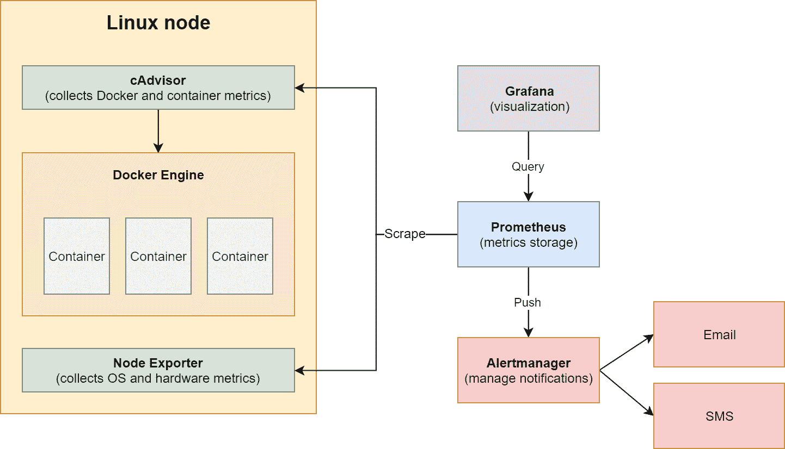

用于监视 Kubernetes 上 Linux 容器的常见 Prometheus 架构

除了标准的 Prometheus 组件之外，在集群中每个 Linux 节点上运行着两个关键的导出器：**cAdvisor**，它公开容器运行时指标，以及**Node Exporter**，它负责公开操作系统和硬件指标。对于 Windows，我们可以使用类似的方案，但我们需要使用不同的导出器，如下图所示：

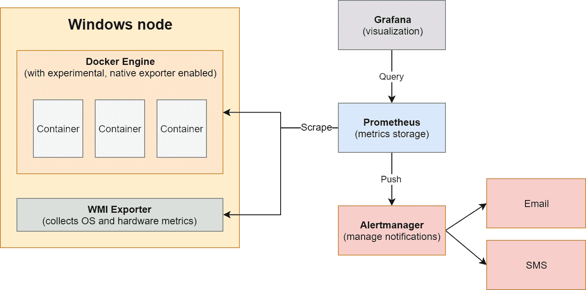

用于监视 Kubernetes 上 Windows 容器的可能的 Prometheus 架构

在这种情况下，为了公开操作系统和硬件指标，我们使用专门用于 Windows 机器的 WMI Exporter。它还可以公开一些 Docker 指标，但我们还可以打开使用 Docker Engine 本地公开指标的实验性功能，而无需额外的导出器。您可以在文档中阅读更多关于这个 Docker 功能的信息：[`docs.docker.com/config/thirdparty/prometheus/`](https://docs.docker.com/config/thirdparty/prometheus/)。

一般来说，在 Windows 上，部署导出器作为收集操作系统指标的 Kubernetes DaemonSets 更加困难。正如前几章中提到的，在 Windows 上，您无法运行特权容器，因此无法访问容器运行时信息。这就是为什么在 Kubernetes 中监视 Windows 容器比监视 Linux 容器要困难一些的主要原因——我们必须在 Kubernetes 集群之外直接在主机上配置导出器。现在，让我们看看在本地场景和 AKS Engine 中如何实现这一点。

# 提供可观察的 Windows 节点

Prometheus 使用的 HTTP 拉模型与可观察性和监视本身之间的关注点分离完全一致。组件或机器负责暴露适当的数据和指标-它允许被观察-而 Prometheus 定期消耗可用数据，这个过程称为抓取。这意味着如果您有一种方法可以在某个 HTTP 端点以 Prometheus 格式暴露指标，您就可以使用 Prometheus 进行监视！它可以是系统服务暴露的硬件遥测，甚至是您在.NET 应用程序中通过额外的 HTTP 端点访问的自己的指标。

现在，有一个问题，如何在 Windows 操作系统上收集指标数据并将其暴露出来。我们对以下内容感兴趣：

+   与主机机器相关的指标，例如 CPU、内存、网络和 I/O 指标

+   进程和主机操作系统本身的指标以及性能计数器通常

+   容器运行时本身的指标

+   单个容器的指标

+   在裸机上，此外，关于硬件指标的信息，如 CPU 温度和 ECC 内存校正计数。

对于 Prometheus 来说，在 Windows 上支持出口器的支持仍在扩展，但目前，我们已经可以收集大部分前述的指标。总的来说，WMI Exporter（[`github.com/martinlindhe/wmi_exporter`](https://github.com/martinlindhe/wmi_exporter)）是在 Windows 上收集所有与硬件和操作系统相关的指标的推荐出口器。对于 Docker 运行时和容器，我们可以使用 Docker 的一个实验性功能（[`docs.docker.com/config/thirdparty/prometheus/`](https://docs.docker.com/config/thirdparty/prometheus/)）来以 Prometheus 格式暴露指标。此外，当在配置中启用容器收集器时，WMI Exporter 还可以暴露一些有用的 Docker 容器指标。

如果您对任何其他 Windows 性能计数器感兴趣，可以使用 Telegraf（[`www.influxdata.com/time-series-platform/telegraf/`](https://www.influxdata.com/time-series-platform/telegraf/)）将它们暴露为 Prometheus 格式的指标。我们将在接下来的部分中进行这样的操作，因为在主机上监视 Windows 性能计数器以及容器内部都有非常有效的用例。

# 安装 WMI Exporter 并在 Docker 中启用 Metrics Server

现在，我们对如何使 Windows 机器对 Prometheus 可观察以及哪些组件可以满足我们的要求有了一些了解。如果您使用 Chocolatey，WMI Exporter 的安装非常简单：

```
choco install prometheus-wmi-exporter.install
```

此命令将使用默认配置安装导出器，并在端点`http://0.0.0.0:9182`上公开指标，如软件包文档中所述：[`chocolatey.org/packages/prometheus-wmi-exporter.install`](https://chocolatey.org/packages/prometheus-wmi-exporter.install)。对于我们的用例，我们需要启用一些特定的收集器，并且这些信息可以作为参数传递给安装程序。此外，我们应该使安装无人值守，并在机器上安装 Chocolatey（如果缺少）-我们的 PowerShell 脚本将如下所示：

```
if ((Get-Command "choco" -ErrorAction SilentlyContinue) -eq $null) {
 Invoke-Expression ((new-object net.webclient).DownloadString('https://chocolatey.org/install.ps1')) | Out-Null
}

choco install prometheus-wmi-exporter.install -y --force --params "`"/EnabledCollectors:cpu,cs,container,dns,logical_disk,logon,memory,net,os,process,service,system,tcp`""
```

要在 Docker Engine 中启用 Metrics Server，位于`http://0.0.0.0:9323`，我们可以创建另一个小的 PowerShell 脚本：

```
Set-Content -Value '{ "metrics-addr" : "0.0.0.0:9323", "experimental" : true }' -Path C:\ProgramData\docker\config\daemon.json
Restart-Service Docker -Force
```

现在，您必须考虑如何执行安装。对于本地部署，请考虑以下内容：

+   如果您使用自动化创建 Kubernetes 集群，例如 Ansible，那么您可以添加额外的后配置步骤。

+   如果您在集群中为您的机器使用裸机映像或 VM 映像，您可以将安装步骤嵌入到映像配置过程中。

+   如果您使用 Ansible 或 PowerShell Desired State Configuration 来管理您的机器，您也可以使用这些工具触发安装。

在云部署的情况下，一切取决于您是使用托管还是非托管集群：

+   对于像 AKS 这样的托管部署，您受到服务允许的限制；例如，您可以使用带有自定义脚本扩展的 VMSS。

+   对于非托管部署，您可以使用与本地部署相同的技术，例如提供预安装服务的自定义 VM 映像，或者使用专门针对您的云服务提供商的解决方案。

对于 AKS Engine，您有三个选项：

+   对于开发和测试目的，您可以使用 RDP 或 SSH 连接到 Windows 机器并手动执行安装。

+   您可以为 Windows 节点使用自定义 VM 映像（[`github.com/Azure/aks-engine/blob/master/docs/topics/windows-vhd.md`](https://github.com/Azure/aks-engine/blob/master/docs/topics/windows-vhd.md)）。

+   您可以使用 AKS Engine 扩展([`github.com/Azure/aks-engine/blob/master/docs/topics/extensions.md`](https://github.com/Azure/aks-engine/blob/master/docs/topics/extensions.md))，它们作为部署的一部分运行的自定义脚本扩展。

我们将演示如何使用专用扩展自定义 AKS Engine 集群部署。

# 使用 AKS Engine 的扩展

AKS Engine 扩展是一项功能，它允许在部署的后期步骤中进行额外的自定义步骤。例如，您可以通过扩展存储库执行任何提供的 PowerShell 脚本。存储库可以是遵循目录命名约定的任何 HTTP 服务器，这也包括原始的 GitHub 存储库访问端点。要了解有关扩展如何工作的更多信息，请参阅官方文档：[`github.com/Azure/aks-engine/blob/master/docs/topics/extensions.md`](https://github.com/Azure/aks-engine/blob/master/docs/topics/extensions.md)。您可以使用`winrm`扩展作为了解实现细节的良好基础：[`github.com/Azure/aks-engine/tree/master/extensions/winrm`](https://github.com/Azure/aks-engine/tree/master/extensions/winrm)。

在集群部署期间可以使用扩展。您不能在运行的集群上启用扩展。此外，由于 SQL Server Helm 图表需要在单个节点上挂载四个卷，我们需要为 Linux 节点使用更大的 VM 类型，例如 Standard_D4_v3，该类型支持最多八个卷。您可以在文档中阅读有关每个 VM 挂载的最大卷数：[`docs.microsoft.com/en-us/azure/virtual-machines/windows/sizes-general`](https://docs.microsoft.com/en-us/azure/virtual-machines/windows/sizes-general)。

在本书的 GitHub 存储库中，您可以找到一个安装 WMI Exporter 并在 Windows 上启用 Docker Metrics Server 的扩展：[`github.com/PacktPublishing/Hands-On-Kubernetes-on-Windows/tree/master/Chapter14/03_aks-engine-windows-extensions/extensions/prometheus-exporters`](https://github.com/PacktPublishing/Hands-On-Kubernetes-on-Windows/tree/master/Chapter14/03_aks-engine-windows-extensions/extensions/prometheus-exporters/)。让我们看看扩展是如何构建的，以及如何使用扩展部署新的 AKS Engine 集群：

1.  PowerShell 脚本`v1/installExporters.ps1`执行自定义安装逻辑，并具有以下内容：

```
Param(
    [Parameter()]
    [string]$PackageParameters = "/EnabledCollectors:cpu,cs,container,dns,logical_disk,logon,memory,net,os,process,service,system,tcp"
)

if ((Get-Command "choco" -ErrorAction SilentlyContinue) -eq $null) {
    Invoke-Expression ((new-object net.webclient).DownloadString('https://chocolatey.org/install.ps1')) | Out-Null
}

choco install prometheus-wmi-exporter.install -y --force --params "`"$PackageParameters`""

Set-Content -Value '{ "metrics-addr" : "0.0.0.0:9323", "experimental" : true }' -Path C:\ProgramData\docker\config\daemon.json
Restart-Service Docker -Force
```

它将使用 Chocolatey 安装 WMI Exporter，为 Docker 启用 Metrics Server，并在之后重新启动 Docker。

1.  `v1/template.json` JSON 文件包含一个 ARM 模板，触发 PowerShell 脚本的关键部分如下：

```
"properties": {
     "publisher": "Microsoft.Compute",
     "type": "CustomScriptExtension",
     "typeHandlerVersion": "1.8",
     "autoUpgradeMinorVersion": true,
     "settings": {
       "fileUris": [
         "[concat(parameters('artifactsLocation'), 'extensions/prometheus-exporters/v1/installExporters.ps1')]"
        ]
     },
     "protectedSettings": {
       "commandToExecute": "[concat('powershell.exe -ExecutionPolicy bypass \"& ./installExporters.ps1 -PackageParameters ', parameters('extensionParameters'), '\"')]"
     }
}
```

这将为自定义脚本扩展配置属性，该扩展将下载安装脚本，并使用您在集群 apimodel 中传递的参数执行它。

1.  `v1/template-link.json`是一个通用文件，其中包含要由 AKS Engine 替换的占位符。这样，您的模板将链接到部署。

1.  现在，创建一个 GitHub 仓库并推送扩展。确保您遵循目录命名约定，例如，存储库中`template.json`的完整路径应为`extensions/prometheus-exporters/v1/template.json`。在示例中，我们将使用以下 GitHub 仓库：[`github.com/ptylenda/aks-engine-windows-extensions`](https://github.com/ptylenda/aks-engine-windows-extensions)。

1.  现在，修改您的 AKS Engine 集群 apimodel，使其为所有 Windows 节点使用扩展（[`github.com/PacktPublishing/Hands-On-Kubernetes-on-Windows/blob/master/Chapter14/04_aks-engine-cluster-with-extensions/kubernetes-windows-template.json`](https://github.com/PacktPublishing/Hands-On-Kubernetes-on-Windows/blob/master/Chapter14/04_aks-engine-cluster-with-extensions/kubernetes-windows-template.json)），并确保您使用`vmSize`用于 Linux 节点池，该节点池能够挂载超过四个卷：

```
{
  "apiVersion": "vlabs",
  "properties": 
    ...
    "agentPoolProfiles": [
      {
        "name": "linuxpool1",
        "vmSize": "Standard_D4_v3"
        ...
      },
      {        
        "name": "windowspool2",
        ...
        "extensions": [
            {
                "name": "prometheus-exporters",
                "singleOrAll": "all"
            }
        ]
      }
    ],
    ...
    "extensionProfiles": [
      {
        "name": "prometheus-exporters",
        "version": "v1",
        "rootURL": "https://raw.githubusercontent.com/ptylenda/aks-engine-windows-extensions/master/",
        "extensionParameters": "'/EnabledCollectors:cpu,cs,container,dns,logical_disk,logon,memory,net,os,process,service,system,tcp'"
      }
    ]
  }
}
```

作为`rootURL`，您需要提供 GitHub 仓库的原始访问的 HTTP 地址，该地址带有扩展。此外，我们将`'/EnabledCollectors:cpu,cs,container,dns,logical_disk,logon,memory,net,os,process,service,system,tcp'`作为参数传递给扩展，这些参数将在执行 PowerShell 脚本时使用。

1.  现在，以与前几章相同的方式部署集群。您也可以使用我们通常的 PowerShell 脚本：[`github.com/PacktPublishing/Hands-On-Kubernetes-on-Windows/blob/master/Chapter14/04_aks-engine-cluster-with-extensions/CreateAKSEngineClusterWithWindowsNodes.ps1`](https://github.com/PacktPublishing/Hands-On-Kubernetes-on-Windows/blob/master/Chapter14/04_aks-engine-cluster-with-extensions/CreateAKSEngineClusterWithWindowsNodes.ps1)。

1.  当部署完成后，使用`kubectl get nodes -o wide`命令来确定其中一个 Windows 节点的私有 IP，例如`10.240.0.65`。

1.  使用`ssh azureuser@<dnsPrefix>.<azureLocation>.cloudapp.azure.com`命令 SSH 到主节点，并检查 Windows 节点是否在端口`9323`和`9182`上导出指标：

```
azureuser@k8s-master-36012248-0:~$ curl http://10.240.0.65:9323/metrics
# HELP builder_builds_failed_total Number of failed image builds
# TYPE builder_builds_failed_total counter
builder_builds_failed_total{reason="build_canceled"} 0
builder_builds_failed_total{reason="build_target_not_reachable_error"} 0
builder_builds_failed_total{reason="command_not_supported_error"} 0
...
azureuser@k8s-master-36012248-0:~$ curl http://10.240.0.65:9182/metrics
# HELP go_gc_duration_seconds A summary of the GC invocation durations.
# TYPE go_gc_duration_seconds summary
go_gc_duration_seconds{quantile="0"} 0
go_gc_duration_seconds{quantile="0.25"} 0
go_gc_duration_seconds{quantile="0.5"} 0
...
```

恭喜！现在您的 AKS Engine 集群中的 Windows 节点正在公开可以被 Prometheus 抓取的指标。在下一节中，我们将在我们的集群中安装 Prometheus，并配置它来监视 Linux 和 Windows 节点。

# 使用 Helm 图表部署 Prometheus

我们的集群基础设施现在是可观察的 - 我们可以部署带有适当配置文件的 Prometheus 并开始监视集群。要部署 Prometheus，我们有几个选项：

+   手动使用多个清单文件部署它。

+   使用`stable/prometheus` Helm 图表（[`github.com/helm/charts/tree/master/stable/prometheus`](https://github.com/helm/charts/tree/master/stable/prometheus)）。该图表提供了 Prometheus、Alertmanager、Pushgateway、Node Exporter（用于 Linux 节点）和 kube-state-metrics。

+   使用`stable/prometheus-operator` Helm 图表（[`github.com/helm/charts/tree/master/stable/prometheus-operator`](https://github.com/helm/charts/tree/master/stable/prometheus-operator)）或`kube-prometheus`（[`github.com/coreos/kube-prometheus`](https://github.com/coreos/kube-prometheus)）。这些解决方案旨在提供一种快速在 Kubernetes 集群中部署多个 Prometheus 集群的方法。

在我们的情况下，最好的选择是使用`stable/prometheus` Helm 图表，因为它需要最少的配置，并且不像通用的 Prometheus Operator 那样复杂。在生产环境中，运行大规模，您应该考虑使用 Prometheus Operator，这样您就可以轻松地为不同的需求部署多个 Prometheus 集群。

# 安装 Helm 图表

要使用 Helm 图表部署 Prometheus，请执行以下步骤：

1.  我们将在名为`monitoring`的单独命名空间中部署我们的监控解决方案。此外，我们需要为 Prometheus 数据持久性定义`StorageClass`。创建名为`prereq.yaml`的清单文件，内容如下：

```
---
kind: Namespace
apiVersion: v1
metadata:
  name: monitoring
  labels:
    name: monitoring
---
kind: StorageClass
apiVersion: storage.k8s.io/v1beta1
metadata:
  name: azure-disk
provisioner: kubernetes.io/azure-disk
parameters:
  storageaccounttype: Standard_LRS
  kind: Managed
```

1.  使用`kubectl apply -f .\prereq.yaml`命令应用清单文件。

1.  现在，我们需要为`stable/prometheus` Helm 图表（[`github.com/prometheus/prometheus`](https://github.com/prometheus/prometheus)）定义值。这个图表是高度可配置的，所以请检查是否需要覆盖任何其他值。创建`helm-values_prometheus.yaml`文件，并开始编辑它，内容如下（[`github.com/PacktPublishing/Hands-On-Kubernetes-on-Windows/blob/master/Chapter14/05_helm_prometheus/helm-values_prometheus.yaml`](https://github.com/PacktPublishing/Hands-On-Kubernetes-on-Windows/blob/master/Chapter14/05_helm_prometheus/helm-values_prometheus.yaml)）：

```
server:
  enabled: true
  global:
 scrape_interval: 50s
 scrape_timeout: 15s
 evaluation_interval: 1m
  service:
    type: LoadBalancer
  nodeSelector:
    "kubernetes.io/os": linux
  persistentVolume:
    storageClass: azure-disk

alertmanager:
  enabled: true
  service:
    type: LoadBalancer
  nodeSelector:
    "kubernetes.io/os": linux
  persistentVolume:
    storageClass: azure-disk

nodeExporter:
  enabled: true
  nodeSelector:
    "kubernetes.io/os": linux

pushgateway:
  enabled: true
  nodeSelector:
    "kubernetes.io/os": linux

kubeStateMetrics:
  enabled: true
  nodeSelector:
    "kubernetes.io/os": linux
```

最重要的部分是确保为所有组件设置适当的`nodeSelector`，以便 Pod 不会意外地被调度到 Windows 机器上。此外，我们需要提供`storageClass`的名称，用于处理 PVC。另一个解决方案可能是在集群中将`azure-disk`设置为默认的`storageClass`。在 Helm 图表配置中，您还可以影响抓取设置，例如您希望多久执行一次抓取作业。最后，我们使用`LoadBalancer`服务公开了 Prometheus 和 Alertmanager——当然，这仅适用于开发和测试目的，以便不使用`kubectl proxy`（这需要对 Grafana 进行额外配置）或使用跳板机。

对于生产场景，请考虑将对 Prometheus 的访问限制在私有网络内，或者在其后面暴露 Ingress，使用 HTTPS，并提供安全的身份验证方法。例如，您可以将 Nginx Ingress 与 Azure Active Directory 集成（[`kubernetes.github.io/ingress-nginx/examples/auth/oauth-external-auth/`](https://kubernetes.github.io/ingress-nginx/examples/auth/oauth-external-auth/)）。

在设置较小的`scrape_interval`值时要小心。太短的抓取间隔可能会导致节点和 Pod 的过载，并导致系统不稳定。您应该始终评估您的导出器在 CPU 使用和 RAM 内存方面的成本。

1.  继续编辑`helm-values_prometheus.yaml`文件，并为 Prometheus 提供抓取配置。我们需要确保我们的 WMI Exporter 和 Docker Engine 指标服务器被 Prometheus 服务器抓取。您只能看到 Docker Engine 指标服务器的以下配置；WMI Exporter 的配置几乎相同，除了端口号：

```
extraScrapeConfigs: |
   - job_name: windows-nodes-docker-metrics-server
     kubernetes_sd_configs:
       - role: node
     scheme: http
     relabel_configs:
     - action: labelmap
       regex: __meta_kubernetes_node_label_(.+)
     - source_labels: [__address__]
       action: replace
       target_label: __address__
       regex: ([^:;]+):(\d+)
       replacement: ${1}:9323
     - source_labels: [kubernetes_io_os]
       action: keep
       regex: windows
     - source_labels: [__meta_kubernetes_node_name]
       regex: (.+)
       target_label: __metrics_path__
       replacement: /metrics
     - source_labels: [__meta_kubernetes_node_name]
       action: replace
       target_label: node
       regex: (.*)
       replacement: ${1}
...
```

Prometheus 抓取配置可能会变得有点复杂；您可以查看官方文档以获取详细说明：[`prometheus.io/docs/prometheus/latest/configuration/configuration/`](https://prometheus.io/docs/prometheus/latest/configuration/configuration/)。基本配置会抓取带有`prometheus.io/scrape: 'true'`注释的 API 资源，因此，例如，如果您希望抓取自己的应用 Pod，您需要使用此注释（以及`prometheus.io/port`）。此外，您可以根据 API 资源直接配置抓取（`kubernetes_sd_configs`），在这种情况下是`node`。之后，我们对节点 API 返回的标签执行各种操作：我们确保`__address__`特殊标签的最终值包含所需的`9323`端口，并且我们将`__metrics_path__`定义为`/metrics`，因此最终，我们将抓取此 HTTP 端点：`http://<nodeAddress>:9323/metrics`。

1.  使用`values`文件安装 Prometheus 的 Helm 图表作为`prometheus`发布：

```
helm install prometheus stable/prometheus -n monitoring --values .\helm-values_prometheus.yaml --debug
```

1.  在安装进行的同时，您可以为`stable/grafana` Helm 图表定义`helm-values_grafana.yaml`值文件，我们将使用它来部署 Prometheus 的 Grafana：

```
nodeSelector:
  "kubernetes.io/os": linux

service:
  type: LoadBalancer

persistence:
  enabled: true
  storageClassName: azure-disk
  size: 20Gi
  accessModes:
   - ReadWriteOnce

adminUser: admin
adminPassword: P@ssword

datasources:
  datasources.yaml:
    apiVersion: 1
    datasources:
    - name: Prometheus
      type: prometheus
      url: http://prometheus-server
      access: proxy
      isDefault: true
```

同样，我们需要确保 Grafana 仅安排在 Linux 节点上。同样，我们使用负载均衡器公开服务-您应该考虑不同的生产部署策略，或者至少为此公共端点提供适当的身份验证。最后一个重要的事情是确保我们的 Prometheus 实例被添加为 Grafana 中的默认数据源。在这里，您应该使用服务名称通过 DNS 名称进行发现。

1.  使用以下命令将`stable/grafana` Helm 图表安装为`grafana`发布：

```
helm install grafana stable/grafana -n monitoring --values .\helm-values_grafana.yaml --debug
```

1.  现在，等待所有 Pod 准备就绪并且服务接收到外部 IP：

```
PS C:\src> kubectl get pod,svc -n monitoring
...
NAME                                    TYPE           CLUSTER-IP     EXTERNAL-IP    PORT(S)        AGE
service/grafana                         LoadBalancer   10.0.28.94     104.40.19.54   80:30836/TCP   2h
service/prometheus-alertmanager         LoadBalancer   10.0.0.229     40.78.81.58    80:30073/TCP   2h
service/prometheus-server               LoadBalancer   10.0.219.93    40.78.42.14    80:32763/TCP   2h
...
```

此时，您有三个可以访问的 Web UI：

+   Prometheus 服务器（在我们的示例中，可在`http://40.78.42.14`访问）

+   Alertmanager（`http://40.78.81.58`）

+   Grafana（`http://104.40.19.54`）

# 验证部署

验证您是否可以访问服务的外部 IP 并执行一些基本操作：

1.  打开您的 Prometheus 服务器的 Web UI。

1.  转到状态并选择目标。

1.  向下滚动到由作业抓取的`windows-nodes-docker-metrics-server`和`windows-nodes-wmi-exporter targets`。它们应该是绿色的，并且在没有错误的情况下执行——如果不是这种情况，您需要验证您的抓取配置。出于调试目的，您可以直接向集群中的适当 ConfigMap 引入更改。

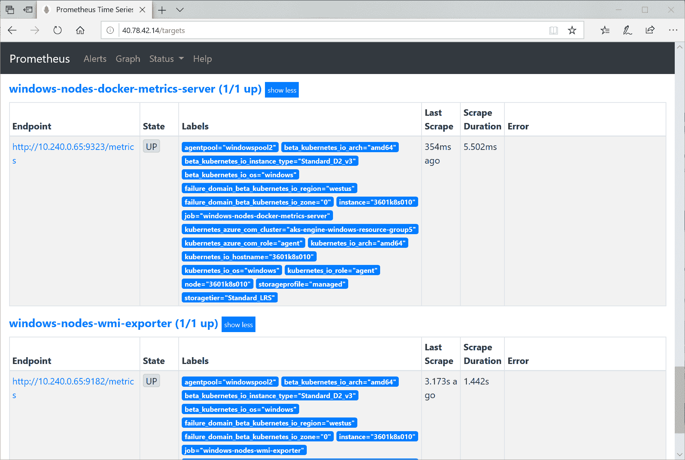

1.  在顶部菜单中导航到图形，并在“执行”按钮下方切换到“图形”选项卡。运行一个示例查询，`rate(wmi_net_bytes_total[60s])`，它将根据最后 60 秒的`wmi_net_bytes_total`计数器指标绘制每秒接收和发送到 Windows 节点的平均字节数：

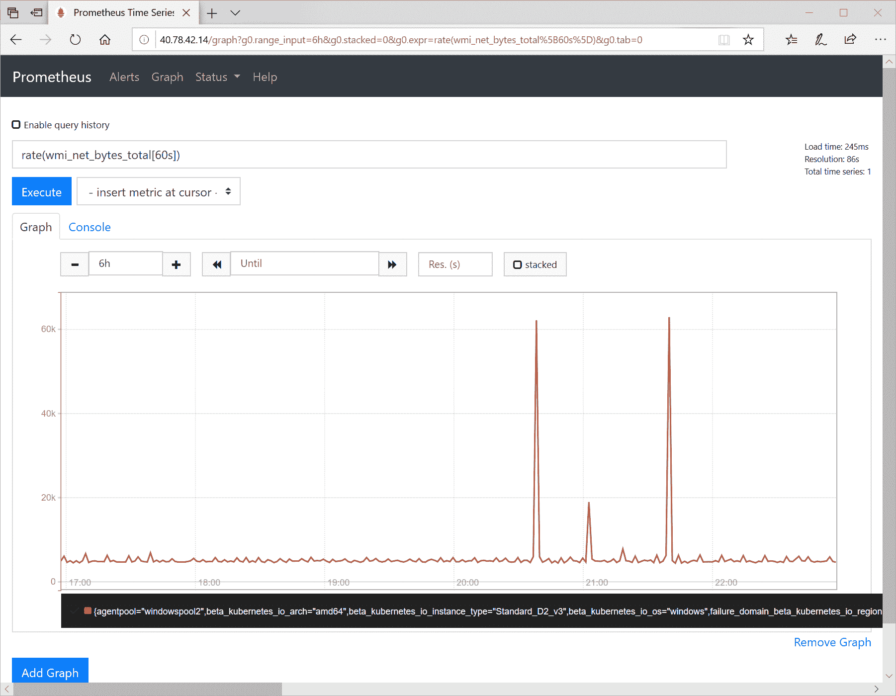

1.  打开 Grafana Web UI，并使用您在 Helm 图表中提供的凭据登录。

1.  在菜单中点击+，选择仪表板，然后选择添加查询。

1.  输入一个示例 PromQL 查询，`wmi_memory_available_bytes / (1024 * 1024 * 1024)`，它将以 GB 为单位绘制 Windows 节点上的可用内存：

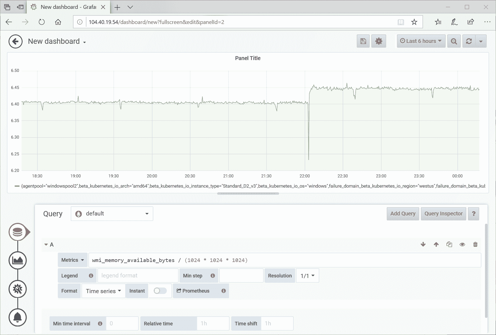

现在，我们确认我们的监控设置正常工作！您可以在官方文档中深入了解 PromQL：[`prometheus.io/docs/prometheus/latest/querying/basics/`](https://prometheus.io/docs/prometheus/latest/querying/basics/)。这是一种广泛而强大的语言，可以实现大部分您的**服务水平指标**（**SLIs**）来监视您的**服务水平目标**（**SLOs**）。

在下一节中，我们将探讨如何配置使用 Telegraf 导出任何 Windows 性能计数器。

# Windows 性能计数器

Windows 提供了一个名为性能计数器的功能，用于提供有关操作系统、服务、应用程序或驱动程序的性能情况。通常，您使用**Windows 管理工具**（**WMI**）来获取单个指标值，并使用更高级的应用程序（如 Perfmon）来在本地可视化性能数据。对于.NET Framework 应用程序，您可以直接读取运行时提供的多个计数器；您可以在文档中找到计数器的列表：[`docs.microsoft.com/en-us/dotnet/framework/debug-trace-profile/performance-counters`](https://docs.microsoft.com/en-us/dotnet/framework/debug-trace-profile/performance-counters)。有了这些指标，您可以轻松监视异常抛出数量的异常波动（甚至无需分析日志）或分析垃圾回收问题。此外，许多经典的.NET Framework 应用程序还公开了自己的性能计数器。

对于 Kubernetes，除了 WMI Exporter 收集的标准性能计数器（尚不支持自定义查询：[`github.com/martinlindhe/wmi_exporter/issues/87`](https://github.com/martinlindhe/wmi_exporter/issues/87)），还有两种情况可以考虑：

+   收集容器中运行的应用程序的性能计数器

+   收集来自 Windows 主机的更多性能计数器

这两个问题都可以使用 Telegraf（[`github.com/influxdata/telegraf`](https://github.com/influxdata/telegraf)）来解决，它是一个通用的、可扩展的代理，用于收集、处理、聚合和编写指标。它支持的输入插件之一是`win_perf_counter`（[`github.com/influxdata/telegraf/tree/master/plugins/inputs/win_perf_counters`](https://github.com/influxdata/telegraf/tree/master/plugins/inputs/win_perf_counters)），可以收集和转换 Windows 上可用的任何性能计数器。同时，Telegraf 能够使用`prometheus_client`输出插件（[`github.com/influxdata/telegraf/tree/master/plugins/outputs/prometheus_client`](https://github.com/influxdata/telegraf/tree/master/plugins/outputs/prometheus_client)）以 Prometheus 格式公开收集的指标。完整的解决方案需要准备一个配置文件，将 Telegraf 安装为 Windows 服务，并确保 Prometheus 抓取新的端点。

如果您想要从主机机器收集更多性能计数器，在 AKS Engine 上，您可以使用自定义扩展来实现，就像我们为 WMI Exporter 和 Docker 指标服务器所做的那样。我们将演示第一个场景：如何丰富您的 Docker 镜像，以便在 Kubernetes 上运行的容器公开更多 Prometheus 指标。请注意，您必须始终考虑这是否对您来说是一个有效的用例——在集群中的每个容器中嵌入 Telegraf 会增加 CPU 使用率和 RAM 内存占用。一个一般的经验法则是，您应该仅对可能需要调查复杂性能问题的关键组件使用此方法，或者作为调试目的的临时操作。

# 使用 Telegraf 服务扩展 Docker 镜像

Windows 上的 Telegraf 安装过程很简单：需要解压文件，提供适当的配置文件，并将 Telegraf 注册为 Windows 服务。要为投票应用程序构建新版本的 Docker 镜像，该镜像在端口`9273`上公开性能计数器，您可以使用 GitHub 存储库中的源代码([`github.com/PacktPublishing/Hands-On-Kubernetes-on-Windows/tree/master/Chapter14/06_voting-application-telegraf`](https://github.com/PacktPublishing/Hands-On-Kubernetes-on-Windows/tree/master/Chapter14/06_voting-application-telegraf))，或者在先前版本的源代码上执行以下步骤：

1.  在根目录中，创建一个名为`telegraf.conf`的新文件，其中包含 Telegraf 配置。您可以在此处找到此文件的内容：[`github.com/PacktPublishing/Hands-On-Kubernetes-on-Windows/blob/master/Chapter14/06_voting-application-telegraf/telegraf.conf`](https://github.com/PacktPublishing/Hands-On-Kubernetes-on-Windows/blob/master/Chapter14/06_voting-application-telegraf/telegraf.conf)。我们只在以下列出了重要部分：

```
...
[[outputs.prometheus_client]]
  listen = "0.0.0.0:9273"
  path = "/metrics"
...
[inputs.win_perf_counters]]
  UseWildcardsExpansion = false
  PrintValid = false

  [[inputs.win_perf_counters.object]]
    # Processor usage, alternative to native, reports on a per core.
    ObjectName = "Processor"
    Instances = ["*"]
    Counters = [
      "% Idle Time",
      "% Interrupt Time",
      "% Privileged Time",
      "% User Time",
      "% Processor Time",
      "% DPC Time",
    ]
    Measurement = "win_cpu"
    # Set to true to include _Total instance when querying for all (*).
    IncludeTotal=true
...
```

我们正在使用`prometheus_client`输出插件和`win_perf_counters`输入插件，它配置了多个性能计数器的收集。

1.  将此文件添加到`votingapplication.csproj`中，以便将其包含在构建输出中。

1.  修改`Dockerfile.production`文件，以便在`runtime`阶段的开头包含安装 Telegraf 的部分：

```
...
FROM mcr.microsoft.com/dotnet/framework/aspnet:4.8-windowsservercore-ltsc2019 AS runtime

WORKDIR /temp
RUN powershell -Command \
    Invoke-WebRequest https://dl.influxdata.com/telegraf/releases/telegraf-1.12.6_windows_amd64.zip -OutFile telegraf.zip \
  ; powershell -Command Expand-Archive -Path telegraf.zip -DestinationPath C:\temp \
  ; Remove-Item -Path telegraf.zip \
  ; mkdir c:\telegraf \
  ; Move-Item -Path c:\temp\telegraf\telegraf.exe -Destination c:\telegraf

WORKDIR /telegraf
RUN powershell -Command \
    mkdir telegraf.d \
  ; .\telegraf.exe --service install --config C:\telegraf\telegraf.conf --config-directory C:\telegraf\telegraf.d
COPY telegraf.conf .
RUN powershell -Command \
    Start-Service telegraf
EXPOSE 9273

...
```

上述命令下载了 Telegraf 的最新版本，将其安装为 Windows 服务，并提供了之前步骤中的配置。

1.  使用标签 1.6.0 构建镜像，并像在之前的章节中一样将其推送到 Docker Hub。在我们的情况下，它将是`packtpubkubernetesonwindows/voting-application:1.6.0`。

Telegraf 配置可以通过将自定义 ConfigMap 挂载到容器中的`C:\telegraf\telegraf.d`目录来在容器运行时进行修改。这是 ConfigMaps 的一个完美用例。

现在，Docker 镜像已准备就绪，可以在投票应用程序的 Helm 图中使用。

# 部署一个可观察的投票应用程序版本

为了能够抓取容器中 Telegraf 公开的性能计数器，我们需要更新 Helm 图以包括 Docker 镜像的新标签，并更新用于抓取的 Pod 注释。您可以在以下位置找到准备好的 Helm 图：[`github.com/PacktPublishing/Hands-On-Kubernetes-on-Windows/tree/master/Chapter14/07_voting-application-telegraf-helm`](https://github.com/PacktPublishing/Hands-On-Kubernetes-on-Windows/tree/master/Chapter14/07_voting-application-telegraf-helm)，或者按照以下步骤使用先前的版本：

1.  在 Helm 图的根目录中打开 PowerShell 窗口。

1.  在`Chart.yaml`文件中，将`appVersion`增加到与 Docker 镜像标签`1.6.0`相等。同时，将图表本身的版本增加到`0.3.0`。

1.  在`templates\service.yaml`文件中，为 Service 添加`annotations`，以便 Prometheus 可以开始在端口`9273`上抓取服务后面的所有 Pod：

```
apiVersion: v1
kind: Service
metadata:
  name: {{ include "voting-application.fullname" . }}
  ...
  annotations:
    prometheus.io/scrape: "true"
    prometheus.io/port: "9273"
...
```

1.  更新`templates\deployment.yaml`文件，以便投票应用程序前端 Pod 在`9273`端口上公开 Telegraf 在`/metrics`端点处导出的数据：

```
apiVersion: apps/v1
kind: Deployment
...
spec:
  ...
  template:
    ...
    spec:
    ...
      containers:
        - name: {{ .Chart.Name }}-frontend
          ...
          ports:
            ...
            - name: telegraf
 containerPort: 9273
 protocol: TCP
          ...
```

1.  确保`dev-helm`命名空间存在。创建`dev-helm.yaml`清单文件：

```
kind: Namespace
apiVersion: v1
metadata:
  name: dev-helm
  labels:
    name: dev-helm
```

1.  使用`kubectl apply -f .\dev-helm.yaml`命令应用清单文件。

1.  Helm 图已准备就绪，可以在投票应用程序的 Helm 图的根目录中执行以下命令：

```
helm install voting-application . `
 --namespace dev-helm `
 --debug `
 --timeout 900s
```

或者，如果您已经在集群中安装了此图的先前版本，请使用相同的参数使用`helm upgrade`命令。

1.  等待部署完成；您可以使用`kubectl get pods -n dev-helm -w`命令在另一个 PowerShell 窗口中观察进度。

此时，投票应用程序的新版本已部署到集群中，并且 Prometheus 已经使用`kubernetes-service-endpoints`抓取作业来抓取 Pod。这在默认配置中已经定义。让我们验证一下是否一切正常：

1.  在网络浏览器中导航到投票应用程序的外部 IP，并使用网站创建一些流量，持续几分钟。

1.  在网络浏览器中打开 Prometheus 服务器的外部 IP，在 Graph 面板中打开，并将选项卡切换到 Graph。

1.  Telegraf 配置设置为输出所有带有`win_`前缀的指标。让我们查询其中一个指标，例如`win_aspnet_app_Requests_Failed`，这是 ASP.NET 应用程序中失败请求的计数器。使用`rate(win_aspnet_app_Requests_Failed{app_kubernetes_io_name="voting-application"}[5m])`查询，该查询为每个 Pod 分别提供了过去五分钟内投票应用程序失败请求的平均每秒速率：

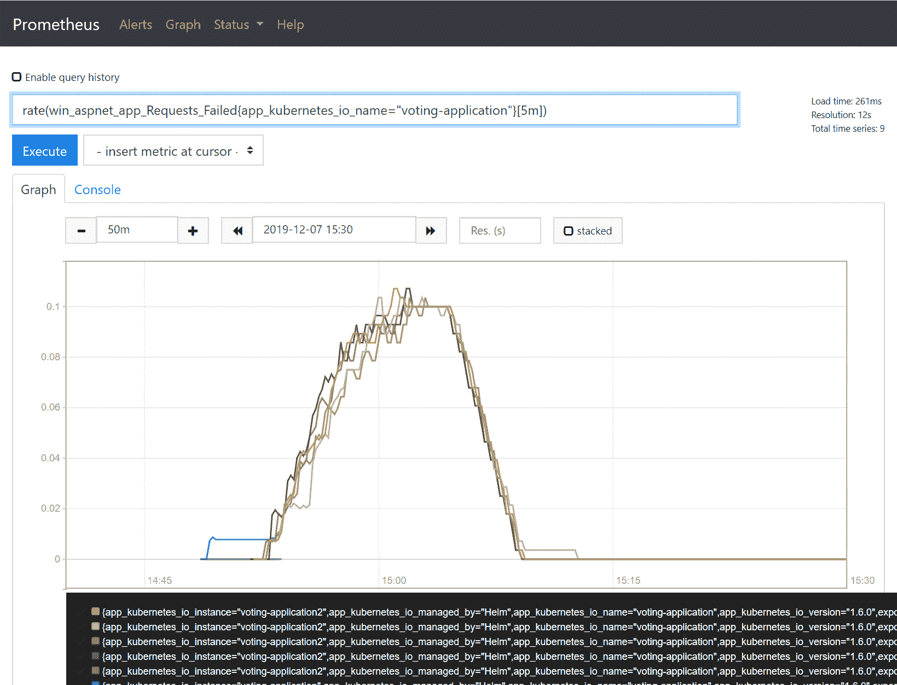

现在，您可能想知道为什么我们在某个时间点看到失败请求数量突然增加-您很可能会在您的 Prometheus 中看到相同的情况。答案是在部署 Helm 图表后的几分钟内出现了失败的健康检查（就绪探针）。您可能还记得，SQL Server Helm 图表需要最多 10 分钟才能完全部署。这意味着在这段时间内，投票应用程序 Pod 的就绪探针将以 HTTP 500 状态代码失败。

计算`rate`和`irate`需要每个时间序列间隔至少两个数据点。这意味着您应该使用间隔值至少比抓取间隔大两倍。否则，您将在图表中看到缺失的数据。

您可以探索我们为每个 Pod 公开的其他性能计数器-Telegraf 的这种配置获得了大量的计数器，例如.NET CLR 中抛出的异常数量，.NET CLR 中的锁定数量（这对于检测重锁定场景可能非常有用！），.NET CLR 垃圾回收统计信息或 IIS 性能计数器。

在下一节中，我们将添加监控谜题的最后一部分：使用`prometheus-net` NuGet 包直接从.NET Framework 应用程序公开自己的指标。

# 使用 prometheus-net 监控.NET 应用程序

作为监控基础设施的一部分，您需要直接从应用程序中公开自定义指标，这些指标提供了对业务逻辑的额外仪表和见解。最流行的编程语言都有与 Prometheus 集成的绑定，对于 C#，提供与 Prometheus 集成的库之一是`prometheus-net`（[`github.com/prometheus-net/prometheus-net`](https://github.com/prometheus-net/prometheus-net)）。您可以将其用于经典的.NET Framework 和.NET Core，因为它针对的是.NET Standard 2.0。其功能包括以下内容：

+   导出计数器和仪表

+   测量操作持续时间，并创建摘要或直方图

+   跟踪正在进行的操作，并创建具有并发执行代码块数量的仪表

+   异常计数

此外，对于 ASP.NET Core 应用程序，您可以使用专用的中间件包（[`www.nuget.org/packages/prometheus-net.AspNetCore`](https://www.nuget.org/packages/prometheus-net.AspNetCore)）来导出 ASP.NET 指标。不幸的是，对于经典的 ASP.NET MVC，不支持此功能，但可以手动实现类似的功能。

# 安装 NuGet 包并添加指标

该库提供为 NuGet 包（[`www.nuget.org/packages/prometheus-net`](https://www.nuget.org/packages/prometheus-net)）。要在投票应用程序中启用`prometheus-net`，请按照以下步骤操作，或者您可以使用可在以下位置找到的源代码的准备版本：[`github.com/PacktPublishing/Hands-On-Kubernetes-on-Windows/tree/master/Chapter14/08_voting-application-prometheus-net`](https://github.com/PacktPublishing/Hands-On-Kubernetes-on-Windows/tree/master/Chapter14/08_voting-application-prometheus-net)：

1.  在 Visual Studio 2019 中打开投票应用程序解决方案。

1.  右键单击 VotingApplication 项目，然后选择管理 NuGet 包....

1.  找到`prometheus-net`包并安装它。

1.  我们需要启动一个 HTTP 监听器来导出指标。在`Global.asax.cs`文件（[`github.com/PacktPublishing/Hands-On-Kubernetes-on-Windows/blob/master/Chapter14/08_voting-application-prometheus-net/Global.asax.cs`](https://github.com/PacktPublishing/Hands-On-Kubernetes-on-Windows/blob/master/Chapter14/08_voting-application-prometheus-net/Global.asax.cs)）中，在`Application_Start`方法的开头，添加以下行：

```
var server = new MetricServer(port: 9274);
server.Start();
```

这将在所有网络接口的`/metrics`端口`9274`处公开指标。

1.  在运行在 IIS 上的应用程序内部使用自定义 HTTP 监听器需要添加网络 ACL 规则以允许 IIS AppPool 用户使用此端口。因此，我们需要扩展`Dockerfile.production`文件以包括以下命令，例如，在 Telegraf 安装后：

```
RUN "netsh http add urlacl url=http://+:9274/metrics user=\"IIS AppPool\DefaultAppPool\""
EXPOSE 9274
```

现在，该应用程序正在公开非常基本的.NET 性能计数器。我们想要添加一些自定义指标，这些指标将特定于我们的投票应用程序。例如，我们将添加两个指标：

+   **计数器**：这是自应用程序启动以来已添加到数据库的投票数。然后，我们可以使用计数器来，例如，计算每个时间间隔添加的平均投票数。

+   **直方图**：这是用于检索调查结果并对其进行总结的持续时间。

要做到这一点，请按照以下步骤进行：

1.  在`SurveyController`类（[`github.com/PacktPublishing/Hands-On-Kubernetes-on-Windows/blob/master/Chapter14/08_voting-application-prometheus-net/Controllers/SurveysController.cs`](https://github.com/PacktPublishing/Hands-On-Kubernetes-on-Windows/blob/master/Chapter14/08_voting-application-prometheus-net/Controllers/SurveysController.cs)）中，定义两个指标，`DbAddedVotesCount`和`GetSurveyResultOperationDuration`，作为`static readonly`字段：

```
private static readonly Counter DbAddedVotesCount = Metrics.CreateCounter(
    "votingapplication_db_added_votes",
    "Number of votes added to the database.");

private static readonly Histogram GetSurveyResultOperationDuration = Metrics.CreateHistogram(
    "votingapplication_getsurveyresult_duration_seconds",
    "Histogram for duration of GetSurveyResult operation.",
    new HistogramConfiguration { Buckets = Histogram.ExponentialBuckets(0.001, 1.5, 20) });
```

1.  在`Vote`控制器操作中递增`DbAddedVotesCount`计数器，在将每个`Vote`添加到数据库后：

```
...
    this.voteLogManager.Append(vote);
    this.db.Votes.Add(vote);
    DbAddedVotesCount.Inc();
}
...
```

1.  测量获取调查结果的时间以创建直方图。在`Results`控制器操作中，将对`GetSurveyResult`的调用包装到`using`块中，并使用`GetSurveyResultOperationDuration`来测量时间：

```
SurveyResult result;
using (GetSurveyResultOperationDuration.NewTimer())
{
    result = this.GetSurveyResult(survey);
}

return this.View(result);
```

1.  在进行这些更改后，在指标导出端点，您将看到新的指标：

```
# HELP votingapplication_db_added_votes Number of votes added to the database.
# TYPE votingapplication_db_added_votes counter
votingapplication_db_added_votes 3
...
# HELP votingapplication_getsurveyresult_duration_seconds Histogram for duration of GetSurveyResult operation.
# TYPE votingapplication_getsurveyresult_duration_seconds histogram
votingapplication_getsurveyresult_duration_seconds_sum 0.5531466
votingapplication_getsurveyresult_duration_seconds_count 7
votingapplication_getsurveyresult_duration_seconds_bucket{le="0.005"} 0
votingapplication_getsurveyresult_duration_seconds_bucket{le="0.01"} 0
...
```

1.  构建一个新版本的 Docker 镜像，将其标记为`1.7.0`，并推送到 Docker Hub。我们将在下一节中使用`packtpubkubernetesonwindows/voting-application:1.7.0` Docker 镜像。

如您所见，添加导出自定义指标的功能非常简单和自解释——您无需对现有代码库进行重大更改！

现在，让我们部署应用程序的新版本并测试新的指标。

# 部署投票应用程序的新版本

我们必须以与上一节相似的方式修改 Helm 图表。必须更新 Docker 镜像并在服务的注释中注册新的抓取端口-由于 Prometheus 不支持在单个抓取作业中使用多个端口（[`github.com/prometheus/prometheus/issues/3756`](https://github.com/prometheus/prometheus/issues/3756)），我们需要添加第二个作业，该作业将使用新端口。您可以在以下位置找到准备好的 Helm 图表：[`github.com/PacktPublishing/Hands-On-Kubernetes-on-Windows/tree/master/Chapter14/09_voting-application-prometheus-net-helm`](https://github.com/PacktPublishing/Hands-On-Kubernetes-on-Windows/tree/master/Chapter14/09_voting-application-prometheus-net-helm)，或者按照以下步骤使用先前的版本：

1.  在 Helm 图表的根目录中打开 PowerShell 窗口。

1.  在`Chart.yaml`文件中，将`appVersion`增加到与 Docker 镜像标签`1.7.0`相等。还要将图表的`version`增加到`0.4.0`。

1.  在`templates\service.yaml`文件中，为端口`9274`的服务添加一个新的自定义注释`prometheus.io/secondary-port`。我们将在新的抓取作业中使用此注释：

```
apiVersion: v1
kind: Service
metadata:
  name: {{ include "voting-application.fullname" . }}
  ...
  annotations:
    ...
    prometheus.io/secondary-port: "9274"
...
```

1.  更新`templates\deployment.yaml`文件，以便投票应用程序前端 Pod 在应用程序在`/metrics`端点处公开度量数据的端口`9274`。

```
apiVersion: apps/v1
kind: Deployment
...
spec:
  ...
  template:
    ...
    spec:
    ...
      containers:
        - name: {{ .Chart.Name }}-frontend
          ...
          ports:
            ...
            - name: app-metrics
 containerPort: 9274
 protocol: TCP
          ...
```

1.  Helm 图表已准备就绪。可以升级投票应用程序的 Helm 发布-在投票应用程序的 Helm 图表的根目录中执行以下命令：

```
helm upgrade voting-application . `
 --namespace dev-helm `
 --debug `
 --timeout 900s
```

1.  等待部署完成，您可以使用`kubectl get pods -n dev-helm -w`命令在另一个 PowerShell 窗口中观察进度。

最后一步是添加一个 Prometheus 抓取作业，该作业将处理`prometheus.io/secondary-port`注释。将来，使用多个端口进行抓取应该更容易，但目前，您必须为此目的添加多个作业：

1.  在 Prometheus Helm 图表的`helm-values_prometheus.yaml`文件（[`github.com/PacktPublishing/Hands-On-Kubernetes-on-Windows/blob/master/Chapter14/10_helm_prometheus-net/helm-values_prometheus.yaml`](https://github.com/PacktPublishing/Hands-On-Kubernetes-on-Windows/blob/master/Chapter14/10_helm_prometheus-net/helm-values_prometheus.yaml)）中，添加另一个额外的抓取作业。这个作业的定义几乎与默认的`kubernetes-service-endpoints`完全相同，该默认作业位于[`github.com/helm/charts/blob/master/stable/prometheus/values.yaml`](https://github.com/helm/charts/blob/master/stable/prometheus/values.yaml)，但有额外的过滤：

```
   - job_name: kubernetes-service-endpoints-secondary-ports
     kubernetes_sd_configs:
     - role: endpoints
     relabel_configs:
     - action: keep
       regex: true
       source_labels:
       - __meta_kubernetes_service_annotation_prometheus_io_scrape
     - action: keep
 regex: (\d+)
 source_labels:
 - __meta_kubernetes_service_annotation_prometheus_io_secondary_port
     ...
     - action: replace
       regex: ([^:]+)(?::\d+)?;(\d+)
       replacement: $1:$2
       source_labels:
       - __address__
       - __meta_kubernetes_service_annotation_prometheus_io_secondary_port
       target_label: __address__     
```

以下操作将仅保留具有定义的`prometheus.io/secondary-port`注释并使用它来定义用于抓取的最终`__address__`的目标。

1.  升级 Prometheus 的 Helm 发布：

```
helm upgrade prometheus stable/prometheus -n monitoring --values .\helm-values_prometheus.yaml --debug
```

1.  升级完成后，唯一更新的资源是 ConfigMap，`prometheus-server`。在 Prometheus 重新加载配置之前，您需要等待一小段时间。

1.  在 Prometheus web UI 中，导航到状态和目标，并验证新端口的抓取是否正常工作；您应该看到`kubernetes-service-endpoints-secondary-ports`作业的绿色状态：

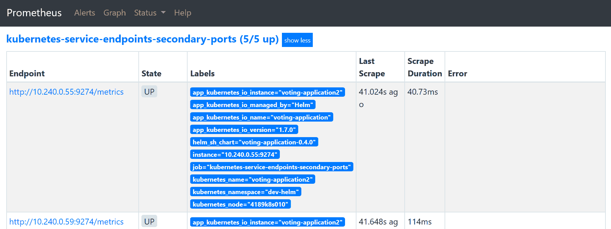

1.  打开投票应用的 Web UI，并在几分钟内添加一些投票。

1.  在 Prometheus web UI 的 Graph 选项卡中，运行一个示例查询来验证解决方案是否有效。例如，使用`sum(votingapplication_db_added_votes)`来获取从所有 Pod 添加到数据库的投票总数：

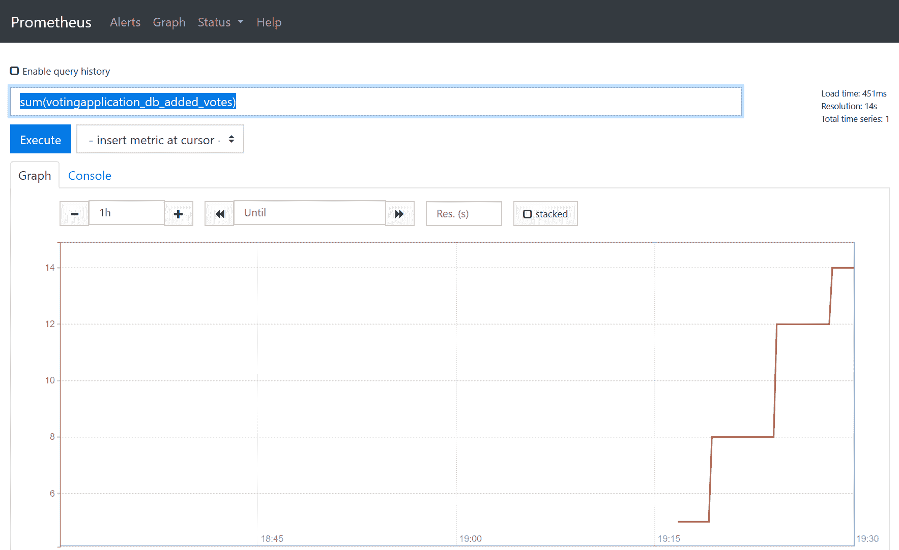

我们的解决方案有效！通过这种方式，您可以导出您在应用程序代码中定义的任何指标，并创建更复杂的查询，用于监视和分析目的。

现在，是时候在 Grafana 中配置仪表板并添加一些警报了。

# 在 Grafana 中配置仪表板和警报

Prometheus 服务器的 Web UI 非常有限，在大多数情况下仅用于执行基本的即席查询和检查配置。要在 Prometheus 中创建更高级的数据可视化，可以使用 Grafana（[`grafana.com/`](https://grafana.com/)），这是一个支持多个数据库的开源分析和监控解决方案。在之前的部分中，我们已经使用 Helm 图表部署了 Grafana 和 Prometheus。

Grafana 提供了多种可视化监控数据的方式，从简单的**线**图和仪表到复杂的热图。您可以在官方文档中找到有关如何创建可视化的更多信息：[`grafana.com/docs/grafana/latest/`](https://grafana.com/docs/grafana/latest/)。对于我们的应用程序，我们将演示如何配置一个示例仪表板，其中包括以下可视化：

+   Windows 节点 CPU 使用率的折线图

+   IIS 在过去 5 分钟内处理的平均每秒请求数的仪表

+   显示在过去 5 分钟内添加到数据库的投票数量的折线图

+   用于可视化检索调查结果持续时间的直方图的热图

当然，这些图表将不足以完全监视您的应用程序，但我们想展示如何创建仪表板的一般原则。

# 添加可视化

首先，让我们创建仪表板，并为 Windows 节点的 CPU 使用率添加第一个可视化。请执行以下步骤：

1.  导航到 Grafana Web UI，并使用 Helm 图表发布中提供的凭据登录。默认用户为`admin`，密码为`P@ssword`。

1.  从侧面板中，单击+按钮，然后选择仪表板。

1.  单击“保存仪表板”按钮，并提供`voting application`作为名称。

1.  选择添加查询。

1.  在第一个指标中提供以下查询：`100 - (avg by (instance) (irate(wmi_cpu_time_total{mode="idle"}[2m])) * 100)`。此查询使用总 CPU 空闲时间的计数器计算了过去两分钟的平均 CPU 使用率。

1.  在图例中，提供`{{instance}}`以使用节点主机名作为标签。

1.  从左侧面板中选择可视化。对于 Y 轴，在单位中选择 Misc 并选择百分比（0-100）。

1.  从左侧面板中选择常规。将标题更改为`平均 CPU 使用率`。您的图表应显示 Windows 节点的 CPU 利用率：

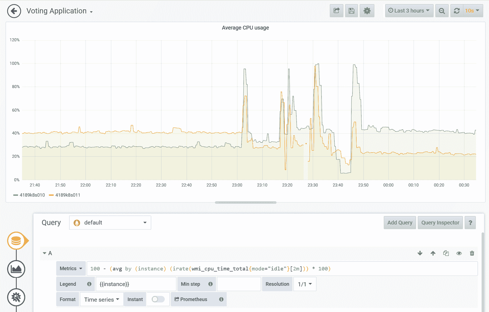

下一步是创建仪表板，显示 IIS 在过去 5 分钟内处理的平均每秒请求数。按照以下步骤进行：

1.  返回仪表板视图，单击添加面板，然后选择添加查询。

1.  在第一个指标中提供以下查询：`sum((rate(win_aspnet_app_Requests_Total[5m]))) by (app_kubernetes_io_instance)`。此查询计算了每个 Pod 的 5 分钟间隔内请求的每秒速率，并通过 Kubernetes 应用程序全局汇总。

1.  从左侧面板中选择“可视化”。选择仪表板。

1.  在“显示”区域，选择 Calc 为 Last（非空），在“字段”区域，将单位更改为吞吐量 > 请求/秒（reqps）。

1.  从左侧面板中选择“常规”。将“标题”更改为“过去 5 分钟内的平均 IIS 请求次数”。您的仪表正在显示当前每秒的平均请求次数：

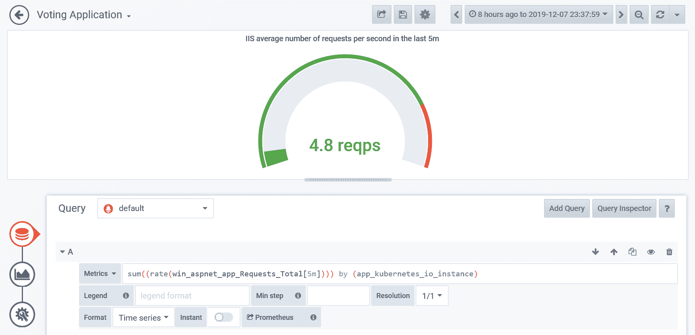

我们将添加第三个可视化，显示过去五分钟内添加到数据库的投票数的折线图。请按照以下步骤操作：

1.  返回仪表板视图，点击“添加面板”，选择“添加查询”。

1.  在第一个指标中提供以下查询：`sum(irate(votingapplication_db_added_votes[5m])) by (app_kubernetes_io_instance) * 300`。该查询计算了每个 Pod 在 5 分钟间隔内投票数量的增加率，并通过 Kubernetes 应用程序全局汇总。我们需要乘以 `300`（5 分钟）因为 `irate` 计算的是每秒的速率。

1.  将图例格式设置为“过去 5 分钟内的投票数”。

1.  从左侧面板中选择“常规”。将“标题”更改为“过去 5 分钟内添加到数据库的投票数”。现在您的图应该如下所示：

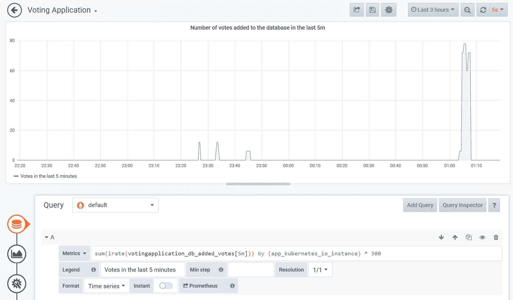

最后，我们将添加最后一个可视化，即用于可视化检索调查结果持续时间直方图的热图。热图是可视化直方图随时间变化的最有效方式，最近，Grafana 扩展了对 Prometheus 直方图指标的热图的本机支持。执行以下步骤创建可视化：

1.  返回仪表板视图，点击“添加面板”，选择“添加查询”。

1.  在第一个指标中提供以下查询：`sum(increase(votingapplication_getsurveyresult_duration_seconds_bucket[2m])) by (le)`。该查询将转换我们的直方图数据——我们确定了最近两分钟内每个桶的绝对增长率，并用标签 `le` 汇总每个桶，这是桶的标识符（`le` 是 **小于或等于** 的缩写—Prometheus 直方图是累积的）。这样，我们就有了整个应用程序全局的桶，而不是单独的 Pod。

1.  将图例格式更改为 `{{le}}`，并将格式设置为 `热图`。

1.  从左侧面板中选择“可视化”。选择“热图”。

1.  在 Y 轴区域，对于单位，选择时间>秒（s），对于格式，选择时间序列桶。将小数设置为`1`以显示整洁的数字。将空间设置为`0`，将舍入设置为`2` - 我们的热图具有相对较多的桶，因此它将使显示更加平滑。

1.  在显示区域，打开显示图例和隐藏零。

1.  从左侧面板中选择常规。将标题更改为`获取调查结果持续时间的热图`。检查您的热图，特别是在多个浏览器选项卡中对主网页进行压力测试后！热图通常在暗色主题下看起来更好（您可以在全局的配置菜单中更改）：

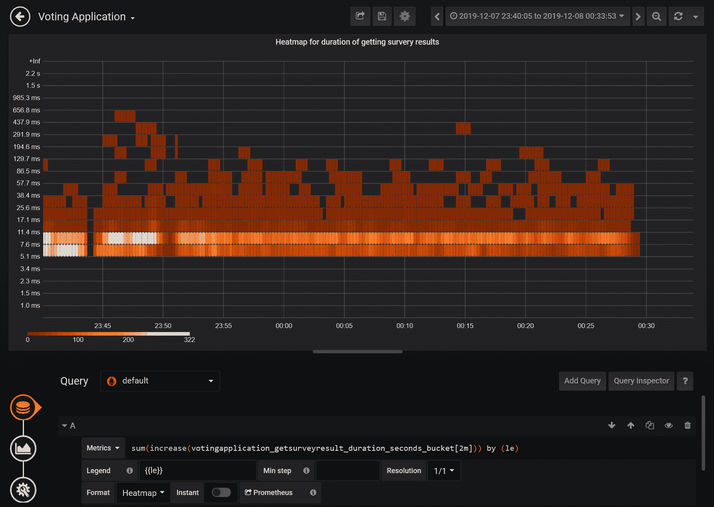

您可以清楚地看到在每分钟约 300 次请求的压力测试期间，此操作的执行情况。

1.  最后，返回仪表板视图，保存所有更改，并按您的意愿重新排列可视化：

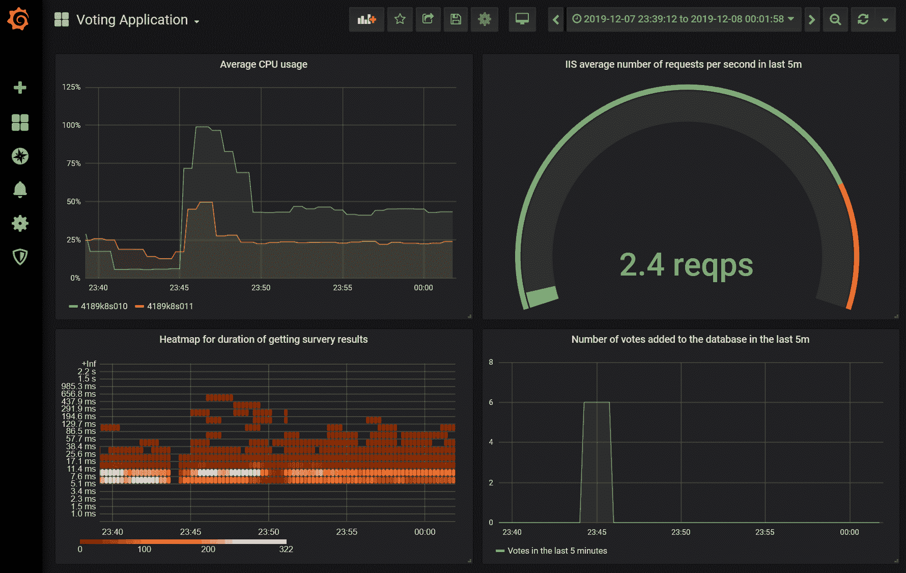

在下一小节中，我们将展示如何在 Grafana 中配置电子邮件警报。

# 配置警报

Grafana 除了创建可视化和仪表板外，还能够定义警报规则并向多个渠道发送通知。您可以在官方文档中找到支持的通知渠道列表：[`grafana.com/docs/grafana/latest/alerting/notifications/`](https://grafana.com/docs/grafana/latest/alerting/notifications/)。警报与特定的可视化相关联，因此您首先需要为您的用例创建适当的可视化。我们将演示如何在节点上创建高 CPU 使用率的警报。

首先，我们需要配置一个电子邮件通知渠道，请按照以下步骤操作：

1.  Grafana 需要 SMTP 配置来发送电子邮件。获取您的电子邮件提供商的详细信息，并修改 Grafana Helm 图表值文件`helm-values_grafana.yaml`，以便其中包含节点：

```
grafana.ini:
  smtp:
    enabled: true
    host: <smtpAddressAndPort>  # For Gmail: smtp.gmail.com:587
    user: <smtpUser>
    password: <smtpPassword>
    skip_verify: true  # Needed for Gmail
    from_address: <emailAddress>
    from_name: <name>
```

请注意，如果您想使用 Gmail，如果启用了 2FA，则需要生成应用程序密码。

1.  升级 Grafana 的 Helm 版本：

```
helm upgrade grafana stable/grafana -n monitoring --values .\helm-values_grafana.yaml --debug
```

1.  升级完成后，转到 Grafana Web UI。从左侧面板中打开警报，并选择通知渠道。

1.  单击新通道。

1.  填写名称，选择电子邮件类型，并提供电子邮件地址。

1.  单击“发送测试”以测试您的 SMTP 配置是否正确。如果有任何问题，请检查 Grafana Pod 的日志。几分钟后，您应该会在收件箱中收到测试电子邮件。

当您确认您的通知渠道正常工作时，我们可以继续创建警报本身。我们希望在节点的平均 CPU 使用率超过 80％超过五分钟时收到警报。请按照以下步骤配置此类警报：

1.  打开我们的仪表板，选择平均 CPU 使用率可视化。从可视化菜单中，选择编辑。

1.  从左侧面板打开警报，然后单击创建警报。

1.  按照以下所示配置警报：

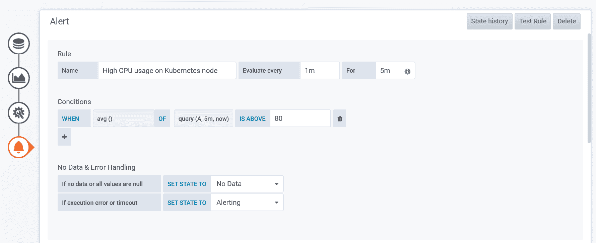

1.  选择您的通知渠道，并可选择自定义通知消息。

1.  保存仪表板。您会注意到仪表板上有一个心形图标，表示警报状态。

现在，我们需要通过创建一些负载来测试我们的规则。我们可以重用在前几章中创建的`StressCpu`操作。按照以下步骤执行测试：

1.  在您的网络浏览器中，导航至`http://<applicationExternalIp>/Home/StressCpu?value=100`，并重复此操作几次，以确保一些 Pod 开始足够地压力节点。

1.  检查仪表板。您会注意到健康状况仍然是绿色的，但指标已经处于红色区域：

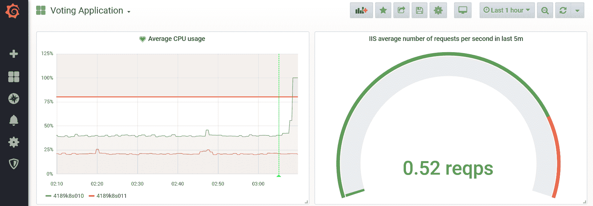

1.  等待五分钟，从平均使用率在过去五分钟内超过 80％的时间点开始。您应该通过您的通知渠道收到一封电子邮件：

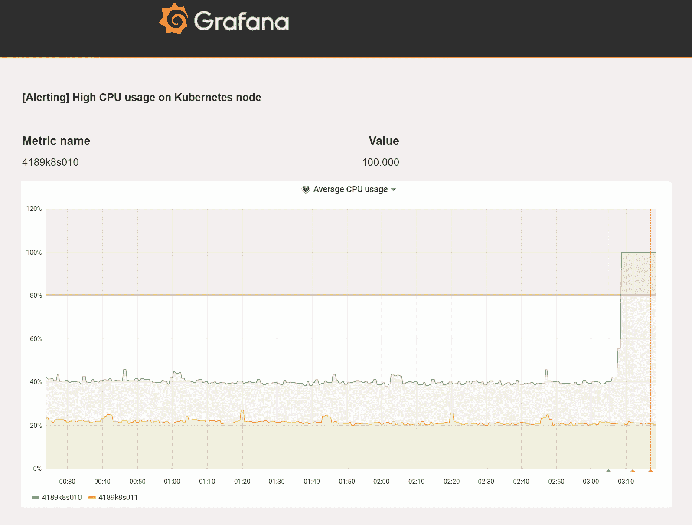

恭喜！您已成功为 Grafana 中的投票应用程序配置了仪表板，并测试了我们监控系统的警报功能。

# 摘要

在这一长章中，您学会了如何在 Kubernetes 上运行的 Windows 容器中设置监控。首先，我们看了可用的监控解决方案，并确定了哪些适合我们的 Windows 节点的用例——目前最好的选择是使用专用的 Prometheus 实例与 Grafana 一起。接下来，您学会了如何使用 WMI Exporter 和实验性的 Docker Engine 指标服务使 Windows 节点在硬件、操作系统和容器运行时方面可观察。我们已经展示了如何在 AKS Engine 集群上使用扩展安装和配置这些代理。

接下来的步骤是使用 Helm 图表部署 Prometheus 和 Grafana。您需要确保 Prometheus 抓取作业能够在 Windows 节点上发现新的指标端点。之后，我们专注于监控容器内部和 Windows 性能计数器-我们使用 Telegraf 公开了几个计数器，并配置了 Prometheus 对新端点的抓取。此外，您还学会了如何使用`prometheus-net`库直接从应用程序代码向 Prometheus 导出自定义指标。最后，作为锦上添花，我们向您展示了如何为投票应用程序在 Grafana 中配置示例仪表板，以及如何为 Windows 节点上的高 CPU 使用率启用电子邮件警报。

下一章将重点介绍灾难恢复和 Kubernetes 备份策略。

# 问题

1.  为什么可观测性是监控解决方案中的关键概念？

1.  您可以使用哪些组件来使用 Prometheus 监视 Windows 节点？

1.  何时应该使用 Prometheus Operator？

1.  为什么您需要为 Windows 节点在 Prometheus 中配置额外的抓取作业？

1.  如何将 Windows 容器中的任何 Windows 性能计数器导出到 Prometheus？

1.  使用`prometheus-net`库的好处是什么？

1.  如何在 Prometheus 中为单个服务配置多个端口进行抓取？

1.  使用热图可视化 Prometheus 直方图有哪些好处？

您可以在本书的*评估*中找到这些问题的答案。

# 进一步阅读

+   有关 Kubernetes 功能和一般集群监控的更多信息，请参考以下 Packt 图书：

+   *完整的 Kubernetes 指南*（[`www.packtpub.com/virtualization-and-cloud/complete-kubernetes-guide`](https://www.packtpub.com/virtualization-and-cloud/complete-kubernetes-guide)）。

+   *开始使用 Kubernetes-第三版*（[`www.packtpub.com/virtualization-and-cloud/getting-started-kubernetes-third-edition`](https://www.packtpub.com/virtualization-and-cloud/getting-started-kubernetes-third-edition)）。

+   *面向开发人员的 Kubernetes*（[`www.packtpub.com/virtualization-and-cloud/kubernetes-developers`](https://www.packtpub.com/virtualization-and-cloud/kubernetes-developers)）。

+   您可以在以下 Packt 图书中了解更多关于 Prometheus 的信息：

+   《使用 Prometheus 进行实时基础设施监控》（[`www.packtpub.com/virtualization-and-cloud/hands-infrastructure-monitoring-prometheus`](https://www.packtpub.com/virtualization-and-cloud/hands-infrastructure-monitoring-prometheus)）。
