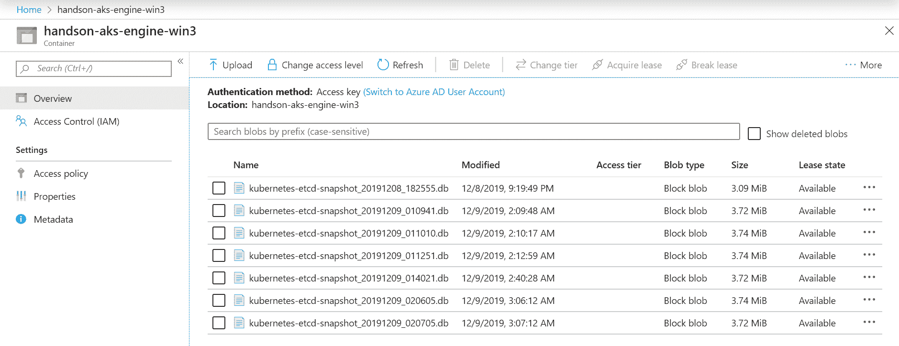

# 灾难恢复

在每个生产系统中，**灾难恢复**（**DR**）和**业务连续性**（**BC**）是您必须牢记的关键概念，以确保应用工作负载的可用性。您必须在早期阶段考虑它们，以规划您的集群架构。谚语*未能准备，实际上是在准备失败*对于操作 Kubernetes 等分布式系统来说再合适不过了。本章将重点介绍运行 Kubernetes 集群时的灾难恢复。本章的范围不包括多区部署和持久卷的异步复制等 BC 最佳实践。

一般来说，灾难恢复包括一套政策、工具和程序，以使关键技术基础设施和系统在自然或人为灾难后能够恢复或继续运行。您可以在 Google 的一篇优秀文章中了解更多关于灾难恢复规划涉及的概念：[`cloud.google.com/solutions/dr-scenarios-planning-guide`](https://cloud.google.com/solutions/dr-scenarios-planning-guide)。灾难恢复和业务连续性的主要区别在于，灾难恢复侧重于在停机后使基础设施恢复运行，而业务连续性则处理在重大事件期间保持业务场景运行。在 Kubernetes 中，灾难恢复的重要之处在于，您可以基本上专注于对集群的数据和状态进行保护：您需要为有状态的组件制定备份和恢复策略。在 Kubernetes 集群中，最重要的有状态组件是 etcd 集群，它是 Kubernetes API 服务器的存储层。

在本章中，我们将涵盖以下主题：

+   Kubernetes 集群备份策略

+   备份 etcd 集群

+   恢复 etcd 集群备份

+   自动化备份

+   替换失败的 etcd 集群成员

# 技术要求

对于本章，您将需要以下内容：

+   安装了 Windows 10 Pro、企业版或教育版（1903 版或更高版本，64 位）

+   在您的 Windows 机器上安装 SSH 客户端

+   Azure 帐户

+   使用 AKS Engine 或本地集群部署的多主 Windows/Linux Kubernetes 集群（适用于某些场景）

要跟着做，您需要自己的 Azure 账户以创建 Kubernetes 集群的 Azure 资源。如果您之前没有为早期章节创建账户，您可以阅读有关如何获取个人使用的有限免费账户的更多信息[`azure.microsoft.com/en-us/free/`](https://azure.microsoft.com/en-us/free/)。

使用 AKS Engine 部署 Kubernetes 集群已在第八章中进行了介绍，*部署混合 Azure Kubernetes 服务引擎集群*。

您可以从官方 GitHub 存储库[`github.com/PacktPublishing/Hands-On-Kubernetes-on-Windows/tree/master/Chapter15`](https://github.com/PacktPublishing/Hands-On-Kubernetes-on-Windows/tree/master/Chapter15)下载本章的最新代码示例。

# Kubernetes 集群备份策略

Kubernetes 的灾难恢复基本上涉及创建集群状态备份和恢复策略。让我们首先看看 Kubernetes 中有哪些有状态的组件：

+   Etcd 集群（[`etcd.io/`](https://etcd.io/)）用于持久化 Kubernetes API 服务器资源的状态。

+   Pod 使用的持久卷。

令人惊讶的是（或者*不*），就是这样！对于主节点组件和运行在工作节点上的 pod，您不涉及任何不可恢复的状态；如果您提供了一个新的替换节点，Kubernetes 可以轻松地将工作负载移动到新节点，提供完整的业务连续性。当您的 etcd 集群被恢复时，Kubernetes 将负责协调集群组件的状态。

让我们看看如何备份和恢复持久卷。这完全取决于您的持久卷是如何提供的。您可以依赖于存储在外部的标准文件系统备份，或者在云支持的 PV 的情况下，您可以使用磁盘快照并将其作为云服务的一部分进行管理。还有一个有趣的快照和恢复功能（目前处于 alpha 状态），用于使用 CSI 插件提供的 PV。这将直接在 Kubernetes 集群级别提供更好的备份和恢复集成。

有一个通用的经验法则，尽量使您的集群工作负载尽可能无状态。考虑使用外部托管服务来存储您的数据（例如，Azure blob 存储，Azure Cosmos DB），这些服务的可用性和数据可靠性由 SLA 保证。

对于 etcd 集群，备份和恢复策略取决于两个因素：您如何存储 etcd 数据以及 Kubernetes 主节点的高可用性拓扑是什么。在 etcd 数据存储的情况下，情况类似于持久卷。如果您使用云卷挂载存储，可以依赖云服务提供商的磁盘快照（这是 AKS Engine 的情况），对于自管理磁盘，可以采用标准的文件系统备份策略。在所有情况下，您还有第三个选择：您可以使用 etcd 本身的快照功能。我们稍后将向您展示如何使用`etcdctl`命令执行 etcd 的快照和恢复。

关于 Kubernetes 主节点的高可用性拓扑，如第四章中所述，*Kubernetes 概念和 Windows 支持*，您可以运行**堆叠**拓扑或**外部**拓扑用于 etcd。在堆叠拓扑中，etcd 成员作为 Kubernetes pod 在*每个*主节点上运行。对于外部拓扑，您在 Kubernetes 集群之外运行 etcd 集群。它可能是完全外部的，部署在单独的专用主机上，也可能与主节点共享相同的主机。后者是 AKS Engine 的情况：它运行外部拓扑，但每个主节点都托管一个 etcd 成员作为本机 Linux 服务。对于这两种拓扑，您可以以相同的方式执行备份；唯一的区别在于如何执行恢复。在堆叠拓扑中，通常用于**kubeadm**部署，您需要在新节点上执行`kubeadm init`覆盖本地 etcd 存储。对于外部拓扑，您可以简单地使用`etcdctl`命令。

etcd 集群的外部拓扑具有更多组件，但通常更好地提供业务连续性和灾难恢复。

此外，如果您运行的是 AKS Engine 集群，您可以考虑使用 Azure Cosmos DB（[`azure.microsoft.com/en-us/services/cosmos-db/`](https://azure.microsoft.com/en-us/services/cosmos-db/)）而不是自行管理的 etcd 集群。Cosmos DB 支持暴露 etcd API，并且可以像本地 etcd 集群一样用作 Kubernetes 的后备存储。这样，您可以获得全球分发、高可用性、弹性扩展和 SLA 中定义的数据可靠性。此外，您还可以获得具有地理复制的自动在线备份。您可以在官方文档的 cluster apimodel 中了解更多关于此功能以及如何配置它的信息，网址为[`github.com/Azure/aks-engine/tree/master/examples/cosmos-etcd`](https://github.com/Azure/aks-engine/tree/master/examples/cosmos-etcd)。

现在，让我们来看看如何备份您的 etcd 集群。

# 备份 etcd 集群

备份 etcd 集群的过程很简单，但有多种方法可以完成这项任务：

+   创建 etcd 存储磁盘的备份或快照。这在云场景中尤为重要，您可以轻松地在 Kubernetes 集群之外管理备份。

+   使用`etcdctl`命令手动对 etcd 进行快照。您需要自行管理备份文件：将它们上传到外部存储，并应用保留策略。

+   使用**Velero**（原名 Heptio Ark ([`velero.io/`](https://velero.io/)）），它可以执行快照，管理外部存储中的快照，并在需要时恢复它们。此外，它还可以使用**Restic**集成（[`velero.io/docs/master/restic/`](https://velero.io/docs/master/restic/)）来执行持久卷的备份。

+   使用**etcd-operator**（[`github.com/coreos/etcd-operator`](https://github.com/coreos/etcd-operator)）在 Kubernetes 之上提供 etcd 集群。您可以轻松管理 etcd 集群并执行备份和恢复操作。如果您计划在环境中管理多个 Kubernetes 集群，可以使用这种方法。

我们将演示第二个选项，即手动快照 etcd——在切换到高级自动化（如 Velero）之前，了解底层发生了什么通常是很重要的。为此任务，您将需要一个多主 Kubernetes 集群；您可以使用 AKS Engine 创建一个。与之前的章节一样，您可以使用 Github 存储库中的准备好的 apimodel 定义[https://github.com/PacktPublishing/Hands-On-Kubernetes-on-Windows/blob/master/Chapter15/01_multimaster-aks-engine/kubernetes-windows-template.json]，并使用我们通常的 PowerShell 脚本[https://github.com/PacktPublishing/Hands-On-Kubernetes-on-Windows/blob/master/Chapter15/01_multimaster-aks-engine/CreateAKSEngineClusterWithWindowsNodes.ps1]部署它。此定义将部署三个主节点以及一个 Linux 工作节点和一个 Windows 节点。

请确保您检查在 Azure 上托管五节点 Kubernetes 集群的预估成本。价格将取决于您部署的区域。

当您的集群准备好后，部署一个应用工作负载，例如，之前章节中的投票应用。然后，按照以下步骤创建 etcd 快照：

1.  打开 PowerShell 窗口，并使用以下命令 SSH 到其中一个主节点：

```
ssh azureuser@<dnsPrefix>.<azureLocation>.cloudapp.azure.com
```

1.  检查您的 Kubernetes 集群配置。使用`kubectl cluster-info dump`命令了解更多关于 etcd 设置的信息。您将看到每个主节点都在运行其自己的本地实例（但是外部到集群）的 etcd，并将其作为参数传递给 Kubernetes API 服务器：

```
azureuser@k8s-master-50659983-0:~$ kubectl cluster-info dump
...
 "--etcd-servers=https://127.0.0.1:2379",
...
```

1.  使用`etcdctl`命令获取 etcd 集群的拓扑结构，该集群在主节点上有成员：

```
azureuser@k8s-master-50659983-0:~$ sudo etcdctl cluster-health
member b3a6773c0e93604 is healthy: got healthy result from https://10.255.255.5:2379
member 721d9c3882dbe6f7 is healthy: got healthy result from https://10.255.255.7:2379
member 72b3415f69c52b2a is healthy: got healthy result from https://10.255.255.6:2379
cluster is healthy
```

您可以在 Azure 门户中检查这些是否是主节点的私有 IP 地址。

1.  按顺序执行以下命令以创建 etcd 的快照：

```
sudo mkdir -p /backup
ETCDCTL_API=3 sudo -E etcdctl \
 --endpoints=https://127.0.0.1:2379 \
 --cacert=/etc/kubernetes/certs/ca.crt \
 --cert=/etc/kubernetes/certs/etcdclient.crt \
 --key=/etc/kubernetes/certs/etcdclient.key \
 --debug \
 snapshot save \
 /backup/kubernetes-etcd-snapshot_$(date +"%Y%m%d_%H%M%S").db
```

1.  备份应该在短时间内完成。您可以使用以下命令检查备份的状态：

```
azureuser@k8s-master-50659983-0:~$ ETCDCTL_API=3 sudo -E etcdctl --write-out=table snapshot status /backup/kubernetes-etcd-snapshot_20191208_182555.db
+----------+----------+------------+------------+
|   HASH   | REVISION | TOTAL KEYS | TOTAL SIZE |
+----------+----------+------------+------------+
| b4422ea6 |    28331 |       1034 |     3.2 MB |
+----------+----------+------------+------------+
```

另外，您应该备份用于访问 etcd 集群的证书和密钥。在我们的情况下，这是不需要的，因为我们将恢复相同的主节点机器。但是在一般的灾难恢复场景中，您将需要它们。

备份准备就绪，让我们看看如何将文件上传到 Azure blob 存储。请注意，*不应*直接在生产主节点上执行这些操作，特别是在*快速*安装 Azure CLI 时。我们演示这一点是为了之后创建一个 Kubernetes **CronJob**，它将运行一个 Docker 容器来执行这些操作。请按照以下步骤操作您的开发集群。

1.  在本地计算机上打开一个 PowerShell 窗口，并使用`az login`命令登录到 Azure。

1.  创建一个服务主体，我们将用它来上传备份到 Azure blob 存储容器：

```
PS C:\src> az ad sp create-for-rbac `
 --role="Storage Blob Data Contributor" `
 --scopes="/subscriptions/<azureSubscriptionId>/resourceGroups/<aksEngineResourceGroupName>"

Creating a role assignment under the scope of "/subscriptions/cc9a8166-829e-401e-a004-76d1e3733b8e/resourceGroups/aks-engine-windows-resource-group"
...
{
 "appId": "89694083-0110-4821-9510-a74eedf7a27c",
 "displayName": "azure-cli-2019-12-08-19-15-41",
 "name": "http://azure-cli-2019-12-08-19-15-41",
 "password": "67b1f492-caea-463f-ac28-69177f52fecf",
 "tenant": "86be0945-a0f3-44c2-8868-9b6aa96b0b62"
}
```

复制`appId`、`password`和`tenant`以供进一步使用。

1.  执行以下命令创建一个专用的`aksenginebackups`存储账户来处理备份。选择与您的 AKS Engine 集群相同的 Azure 位置：

```
az storage account create `
 --name aksenginebackups `
 --resource-group <aksEngineResourceGroupName> `
 --location <azureLocation> `
 --sku Standard_ZRS `
 --encryption blob
```

1.  列出新账户的账户密钥，并复制`key1`的值以供进一步使用：

```
az storage account keys list `
 --account-name $aksenginebackups `
 --resource-group <aksEngineResourceGroupName>
```

1.  继续使用上一段的 SSH 会话来操作您的开发 AKS Engine 集群主节点。执行以下命令安装 Azure CLI：

```
curl -sL https://aka.ms/InstallAzureCLIDeb | sudo bash
```

1.  使用服务主体的`appId`、`password`和`tenant`登录到 Azure：

```
az login --service-principal \
   -u 1775963c-8414-434d-839c-db5d417c4293 \
   -p 276952a9-fa51-44ef-b6c6-905e322dbaed \
   --tenant 86be0945-a0f3-44c2-8868-9b6aa96b0b62
```

1.  为我们的 AKS Engine 集群创建一个新的备份容器。您可以使用任何名称，例如集群的 DNS 前缀：

```
az storage container create \
 --account-name aksenginebackups \
 --account-key "<storageAccountKey>" \
 --name <dnsPrefix>
```

1.  创建一个包含我们在上一段中创建的备份的 blob：

```
sudo az storage blob upload \
 --account-name aksenginebackups \
 --account-key "<storageAccountKey>" \
 --container-name <dnsPrefix> \
 --name kubernetes-etcd-snapshot_20191208_182555.db \
 --file /backup/kubernetes-etcd-snapshot_20191208_182555.db
```

1.  从本地磁盘中删除备份文件：

```
sudo rm /backup/kubernetes-etcd-snapshot_20191208_182555.db
```

为了创建服务主体和存储账户，我们在 GitHub 仓库中提供了一个 PowerShell 脚本，网址为[`github.com/PacktPublishing/Hands-On-Kubernetes-on-Windows/blob/master/Chapter15/02_CreateBlobContainerForBackups.ps1`](https://github.com/PacktPublishing/Hands-On-Kubernetes-on-Windows/blob/master/Chapter15/02_CreateBlobContainerForBackups.ps1)。

您已成功创建了 etcd 快照并将其上传到 Azure blob 存储。现在，我们将演示如何恢复我们刚刚创建的备份。

# 恢复 etcd 集群备份

为了演示对现有 AKS Engine 集群进行 etcd 恢复的场景，我们首先需要修改一些 Kubernetes 对象，以后证明备份恢复已经生效。请注意，本节中显示的所有命令都假定您正在运行使用外部 etcd 拓扑的 AKS Engine，etcd 成员在托管 Kubernetes 主控组件的相同机器上运行。对于其他集群，比如本地 kubeadm 设置，目录的结构将会有所不同。

首先，让我们介绍一些对集群状态的更改。例如，如果您的投票应用程序正在运行，请使用以下命令删除相关的`Deployment`对象：

```
kubectl delete deployment -n dev-helm voting-application
```

过一段时间，所有的 pod 都将被终止——假设这是我们的**灾难事件**，导致集群无法使用。我们将要恢复之前创建并上传到 Azure Blob 存储的名为`kubernetes-etcd-snapshot_20191208_182555.db`的备份！

如果您已经删除了 SQL Server Deployment 以及 PVCs，那么恢复将不会完全成功。正如我们在前面的章节中提到的，对于 PVs，您需要有一个与 etcd 备份协调的单独的备份策略。然后您可以同时恢复 etcd 快照和相关的 PV 快照。

要执行恢复操作，您需要同时连接到所有三个 Kubernetes 节点。这个操作可以按顺序执行，但是主机上停止和启动 etcd 服务必须同时进行。请按照以下步骤进行：

1.  打开三个 PowerShell 窗口（尽量让它们同时打开并可见，以便更容易地发出命令）。每个窗口将用于一个单独的 Kubernetes 主控。

1.  在 Azure 门户中，找到主控节点的私有 IP。您也可以使用 Azure CLI 来完成这个操作。它们应该遵循这样的约定，即主控`0`是`10.255.255.5`，主控`1`是`10.255.255.6`，主控`2`是`10.255.255.7`。

1.  在第一个 PowerShell 窗口中，执行以下命令连接到一个主控节点（在 Azure 负载均衡器后面），并额外使用端口转发，将本地端口`5500`转发到主控`0`的 SSH 端口，端口`5501`转发到主控`1`的 SSH 端口，端口`5502`转发到主控`2`的 SSH 端口：

```
ssh -L 5500:10.255.255.5:22 `
 -L 5501:10.255.255.6:22 `
 -L 5502:10.255.255.7:22 `
 azureuser@<dnsPrefix>.<azureLocation>.cloudapp.azure.com
```

1.  通过这种方式，您可以从本地机器连接到任何您想要的 Kubernetes 主节点。检查您已经连接到哪个主节点，并在剩余的 PowerShell 窗口中创建 SSH 连接到*其他两个*节点，例如：

```
# Connection to Master 0 already established

# Master 1
ssh azureuser@localhost -p 5501

# Master 2
ssh azureuser@localhost -p 5502
```

1.  现在，您有一组 PowerShell 窗口，可以分别管理每个主节点。第一步是安装 Azure CLI。在*所有主节点*上执行以下命令：

```
curl -sL https://aka.ms/InstallAzureCLIDeb | sudo bash
```

1.  使用服务主体的`appId`、`password`和`tenant`登录到 Azure，就像之前一样。在*所有主节点*上执行以下命令：

```
az login --service-principal \
   -u 1775963c-8414-434d-839c-db5d417c4293 \
   -p 276952a9-fa51-44ef-b6c6-905e322dbaed \
   --tenant 86be0945-a0f3-44c2-8868-9b6aa96b0b62
```

1.  下载`kubernetes-etcd-snapshot_20191208_182555.db`快照文件。在所有主节点上执行以下命令：

```
az storage blob download \
 --account-name aksenginebackups \
 --account-key "<storageAccountKey>" \
 --container-name <dnsPrefix> \
 --name kubernetes-etcd-snapshot_20191208_182555.db \
 --file snapshot.db
```

1.  所有 etcd 成员必须从相同的快照文件中恢复。这意味着您必须在所有节点上执行类似的操作，只是使用不同的参数。在每个主节点上，确定 etcd 服务的启动参数（对于 AKS Engine，它作为 systemd 服务运行）。执行以下命令以获取每个主节点的参数：

```
cat /etc/default/etcd
```

1.  您需要捕获每个节点的`--name`、`--initial-cluster`、`--initial-cluster-token`和`--initial-advertise-peer-urls`。更确切地说，`--initial-cluster`和`--initial-cluster-token`对于所有主节点都是相同的。我们将使用这些值在每个主节点上初始化一个*新*的 etcd 成员，例如，在我们的集群中，对于主节点`0`，这些参数如下：

```
--name k8s-master-50659983-0
--initial-cluster k8s-master-50659983-0=https://10.255.255.5:2380,k8s-master-50659983-1=https://10.255.255.6:2380,k8s-master-50659983-2=https://10.255.255.7:2380
--initial-cluster-token k8s-etcd-cluster
--initial-advertise-peer-urls https://10.255.255.5:2380
```

1.  我们可以继续为每个 etcd 集群成员恢复数据。此恢复操作仅创建一个新的数据目录。集群当前正在使用的原始数据目录是`/var/lib/etcddisk`（它是从云卷挂载的）。我们将把数据恢复到`/var/lib/etcdisk-restored`，然后交换内容。使用上一步的参数，使用匹配的参数为每个主节点执行此命令：

```
# Master 0
ETCDCTL_API=3 sudo -E etcdctl snapshot restore snapshot.db \
 --name k8s-master-50659983-0 \
 --initial-cluster k8s-master-50659983-0=https://10.255.255.5:2380,k8s-master-50659983-1=https://10.255.255.6:2380,k8s-master-50659983-2=https://10.255.255.7:2380 \
 --initial-cluster-token k8s-etcd-cluster \
 --initial-advertise-peer-urls https://10.255.255.5:2380 \
 --data-dir=/var/lib/etcddisk-restored \
 --debug

# Master 1
ETCDCTL_API=3 sudo -E etcdctl snapshot restore snapshot.db \
 --name k8s-master-50659983-1 \
 --initial-cluster k8s-master-50659983-0=https://10.255.255.5:2380,k8s-master-50659983-1=https://10.255.255.6:2380,k8s-master-50659983-2=https://10.255.255.7:2380 \
 --initial-cluster-token k8s-etcd-cluster \
 --initial-advertise-peer-urls https://10.255.255.6:2380 \
 --data-dir=/var/lib/etcddisk-restored \
 --debug

# Master 2
ETCDCTL_API=3 sudo -E etcdctl snapshot restore snapshot.db \
 --name k8s-master-50659983-2 \
 --initial-cluster k8s-master-50659983-0=https://10.255.255.5:2380,k8s-master-50659983-1=https://10.255.255.6:2380,k8s-master-50659983-2=https://10.255.255.7:2380 \
 --initial-cluster-token k8s-etcd-cluster \
 --initial-advertise-peer-urls https://10.255.255.7:2380 \
 --data-dir=/var/lib/etcddisk-restored \
 --debug
```

1.  快照数据已准备好用于新的 etcd 集群。但首先，我们需要优雅地停止现有的 Kubernetes 主组件；否则，在恢复后，您将处于不一致的状态。

1.  Kubelet 观察`/etc/kubernetes/manifests`目录，其中存储了主组件的清单文件。对这些清单的任何更改都将由 kubelet 应用于集群；这就是在没有 Kubernetes API 服务器的情况下引导 Kubernetes 主节点的方式。要停止主组件，包括 Kubernetes API 服务器，只需将清单文件移动到另一个目录并在所有主节点上执行以下命令：

```
sudo mv /etc/kubernetes/manifests /etc/kubernetes/manifests-stopped
```

几秒钟后，您将看到主组件的 Docker 容器正在停止（使用`docker ps`命令来查看）。

1.  现在，在所有主节点上停止 etcd 服务：

```
sudo service etcd stop
```

1.  在所有主节点上停止 kubelet 服务：

```
sudo service kubelet stop
```

1.  准备好恢复的主节点的最后一步是删除在主节点上运行但未使用`/etc/kubernetes/manifests`目录启动的所有其他 Docker 容器。在所有主节点上执行以下命令：

```
docker stop $(docker ps -q)
```

1.  对 etcd 成员执行实际的数据目录恢复。在所有主节点上执行以下命令。

```
# Backing up old data directory
sudo mkdir /var/lib/etcddisk-old
sudo mv /var/lib/etcddisk/member /var/lib/etcddisk-old/

# Move the contents of the snapshot directory to the target data directory
sudo mv /var/lib/etcddisk-restored/member /var/lib/etcddisk/
sudo chown etcd -R /var/lib/etcddisk
sudo chgrp etcd -R /var/lib/etcddisk
sudo ls -al /var/lib/etcddisk/member/

# Cleanup
sudo rm -rf /var/lib/etcddisk-restored
```

1.  现在我们可以开始使用恢复的快照引导集群。第一步是启动 etcd 集群。在所有主节点上执行以下命令：

```
sudo service etcd start
```

您可以使用`sudo -E etcdctl cluster-health`命令验证 etcd 集群的健康状况。

1.  将停止的清单文件移回到所有主节点的原始位置。一旦 kubelet 启动，它们将被 kubelet 捡起：

```
sudo mv /etc/kubernetes/manifests-stopped /etc/kubernetes/manifests
```

1.  最后，执行最后一步：在所有主节点上启动 kubelet 服务：

```
sudo service kubelet start
```

您可以使用`docker ps`命令快速验证主组件的容器是否正在启动。

1.  您可以在新的 PowerShell 窗口中检查集群是否已经努力协调恢复的状态：

```
PS C:\src> kubectl get pods --all-namespaces
NAMESPACE     NAME                                               READY   STATUS              RESTARTS   AGE
dev-helm      voting-application-8477c76b67-4lkrm                0/1     CrashLoopBackOff    6          9h
dev-helm      voting-application-8477c76b67-7tbmw                0/1     CrashLoopBackOff    6          9h
dev-helm      voting-application-8477c76b67-dls6q                0/1     ContainerCreating   7          9h
dev-helm      voting-application-8477c76b67-dvcqz                0/1     ContainerCreating   7          9h
dev-helm      voting-application-8477c76b67-xttml                0/1     CrashLoopBackOff    9          9h
dev-helm      voting-application-mssql-linux-8548b4dd44-hdrpc    0/1     ContainerCreating   0          9h
kube-system   azure-cni-networkmonitor-6dr8c                     1/1     Running             1          9h
kube-system   azure-cni-networkmonitor-dhgsv                     1/1     Running             0          9h
...
```

我们的投票应用程序部署正在重新创建。这是一个*好消息*：快照恢复已经*成功*。几分钟后，所有的 pod 都将准备就绪，您可以在 Web 浏览器中导航到外部 IP 并再次享受应用程序。

Kubernetes 的**Openshift**发行版实现了本地 etcd 快照恢复功能。您可以在存储库中的脚本中查看详细信息[`github.com/openshift/machine-config-operator/blob/master/templates/master/00-master/_base/files/usr-local-bin-etcd-snapshot-restore-sh.yaml`](https://github.com/openshift/machine-config-operator/blob/master/templates/master/00-master/_base/files/usr-local-bin-etcd-snapshot-restore-sh.yaml)。那里的步骤大致类似于我们在本节中所做的。

正如您所看到的，手动恢复场景有点复杂，并且容易出错。在生产场景中，当其他方法失败时，您应该使用此方法；通常最好使用自动化备份控制器，例如 Velero（[`velero.io/`](https://velero.io/)）。

在下一节中，您将学习如何使用 Kubernetes CronJobs 在 AKS Engine 上自动化备份过程。

# 自动化备份

在本节中，我们将演示如何使用 Kubernetes CronJob 自动化 etcd 集群的备份过程。为此，我们需要一个 Dockerfile，其中安装了`etcdctl`和 Azure CLI，以便为图像创建快照并将其上传到选定的 Azure blob 容器，就像我们在手动步骤中演示的那样。所有配置和服务主体密码将使用环境变量注入，可以使用 Kubernetes secret 设置。

要为 etcd 快照工作程序创建 Docker 镜像，请按照以下步骤进行：

1.  使用 Linux 机器或切换到 Windows 的 Docker 桌面中的 Linux 容器。

1.  打开一个新的 PowerShell 窗口。

1.  为您的源代码创建一个新目录并导航到该目录。

1.  创建一个名为`Dockerfile`的文件，内容如下：

```
FROM ubuntu:18.04

ARG ETCD_VERSION="v3.3.15"

WORKDIR /temp
RUN apt-get update \
 && apt-get install curl -y \
 && curl -L https://github.com/coreos/etcd/releases/download/$ETCD_VERSION/etcd-$ETCD_VERSION-linux-amd64.tar.gz -o etcd-$ETCD_VERSION-linux-amd64.tar.gz \
 && tar xzvf etcd-$ETCD_VERSION-linux-amd64.tar.gz \
 && rm etcd-$ETCD_VERSION-linux-amd64.tar.gz \
 && cd etcd-$ETCD_VERSION-linux-amd64 \
 && cp etcdctl /usr/local/bin/ \
 && rm -rf etcd-$ETCD_VERSION-linux-amd64

RUN curl -sL https://aka.ms/InstallAzureCLIDeb | bash

WORKDIR /backup-worker
COPY ./docker-entrypoint.sh .
RUN chmod +x docker-entrypoint.sh

ENTRYPOINT ["/backup-worker/docker-entrypoint.sh"]
```

此 Dockerfile 基于 Ubuntu 18.04 Docker 镜像，并从 etcd 的官方发布中安装`etcdctl`命令。此外，我们安装了 Azure CLI，并将`ENTRYPOINT`设置为一个自定义 shell 脚本，该脚本在容器启动时执行快照操作。

1.  现在，创建一个名为`docker-entrypoint.sh`的文件，内容如下。

```
#!/bin/bash

snapshot_file="kubernetes-etcd-snapshot_$(date +"%Y%m%d_%H%M%S").db"

ETCDCTL_API=3 etcdctl \
   --endpoints=$SNAPSHOT_ETCD_ENDPOINTS \
   --cacert=/etc/kubernetes/certs/ca.crt \
   --cert=/etc/kubernetes/certs/etcdclient.crt \
   --key=/etc/kubernetes/certs/etcdclient.key \
   --debug \
   snapshot save \
   $snapshot_file

ETCDCTL_API=3 etcdctl --write-out=table snapshot status $snapshot_file

az login --service-principal \
   -u $SNAPSHOT_AZURE_PRINCIPAL_APPID \
   -p $SNAPSHOT_AZURE_PRINCIPAL_PASSWORD \
   --tenant $SNAPSHOT_AZURE_PRINCIPAL_TENANT

az storage container create \
   --account-name $SNAPSHOT_AZURE_ACCOUNT_NAME \
   --account-key "$SNAPSHOT_AZURE_ACCOUNT_KEY" \
   --name $SNAPSHOT_AZURE_CONTAINER_NAME

az storage blob upload \
   --account-name $SNAPSHOT_AZURE_ACCOUNT_NAME \
   --account-key "$SNAPSHOT_AZURE_ACCOUNT_KEY" \
   --container-name $SNAPSHOT_AZURE_CONTAINER_NAME \
   --name $snapshot_file \
   --file $snapshot_file

rm -f $snapshot_file

echo "Backup $snapshot_file uploaded successfully!"
```

上述脚本自动化了我们在前几节中提供的步骤。这里的想法是，使用环境变量、证书和密钥注入的所有配置和凭据，用于访问 etcd 集群的主机卷必须挂载到指定位置：`/etc/kubernetes/certs/`。对于 AKS Engine 主节点，此映射将是一对一的。

1.  使用包含您的 Docker ID 的标签构建图像 - 我们将使用`packtpubkubernetesonwindows/aks-engine-etcd-snapshot-azure-blob-job`：

```
docker build -t <dockerId>/aks-engine-etcd-snapshot-azure-blob-job .
```

1.  使用版本`1.0.0`标记图像并将图像与所有标记一起推送到 Docker Hub：

```
docker tag <dockerId>/aks-engine-etcd-snapshot-azure-blob-job:latest <dockerId>/aks-engine-etcd-snapshot-azure-blob-job:1.0.0
docker push <dockerId>/aks-engine-etcd-snapshot-azure-blob-job
```

1.  您可以选择在开发环境中直接在 AKS Engine 主节点上运行 Docker 镜像进行测试。SSH 到节点并执行以下命令：

```
docker run \
 -v /etc/kubernetes/certs:/etc/kubernetes/certs \
 -e SNAPSHOT_ETCD_ENDPOINTS=https://10.255.255.5:2379,https://10.255.255.6:2379,https://10.255.255.7:2379 \
 -e SNAPSHOT_AZURE_PRINCIPAL_APPID=1775963c-8414-434d-839c-db5d417c4293 \
 -e SNAPSHOT_AZURE_PRINCIPAL_PASSWORD=276952a9-fa51-44ef-b6c6-905e322dbaed \
 -e SNAPSHOT_AZURE_PRINCIPAL_TENANT=86be0945-a0f3-44c2-8868-9b6aa96b0b62 \
 -e SNAPSHOT_AZURE_ACCOUNT_NAME=aksenginebackups \
 -e SNAPSHOT_AZURE_ACCOUNT_KEY="<storageAccountKey>" \
 -e SNAPSHOT_AZURE_CONTAINER_NAME=<dnsPrefix> \
 packtpubkubernetesonwindows/aks-engine-etcd-snapshot-azure-blob-job:1.0.0
```

过一段时间后，作业将结束，并且快照将上传到我们之前创建的容器中。

有了 Docker 镜像准备好后，我们可以创建一个专用的 Kubernetes **CronJob**来定期运行此操作。请注意，我们为此工作提供了一个最小的设置；您应该考虑在生产环境中使用专用的服务帐户并设置 RBAC。还建议使用 Helm 图表有效地管理此作业。要创建 CronJob，请按照以下步骤进行：

1.  定义一个*本地*文件`etcd-snapshot-secrets.txt`，该文件将用于为您的 CronJob 定义秘密对象：

```
SNAPSHOT_ETCD_ENDPOINTS=https://10.255.255.5:2379,https://10.255.255.6:2379,https://10.255.255.7:2379
SNAPSHOT_AZURE_PRINCIPAL_APPID=1775963c-8414-434d-839c-db5d417c4293
SNAPSHOT_AZURE_PRINCIPAL_PASSWORD=276952a9-fa51-44ef-b6c6-905e322dbaed
SNAPSHOT_AZURE_PRINCIPAL_TENANT=86be0945-a0f3-44c2-8868-9b6aa96b0b62
SNAPSHOT_AZURE_ACCOUNT_NAME=aksenginebackups
SNAPSHOT_AZURE_ACCOUNT_KEY="<dnsPrefix>"
SNAPSHOT_AZURE_CONTAINER_NAME=<dnsPrefix>
```

1.  使用`etcd-snapshot-secrets.txt`文件创建`etcd-snapshot-azure-blob-job-secrets`秘密对象：

```
kubectl create secret generic `
 -n kube-system `
 etcd-snapshot-azure-blob-job-secrets `
 --from-env-file=etcd-snapshot-secrets.txt
```

1.  现在，为 CronJob 本身创建`etcd-snapshot-cronjob.yaml`清单文件：

```
apiVersion: batch/v1beta1
kind: CronJob
metadata:
  name: etcd-snapshot-azure-blob-job
  namespace: kube-system
spec:
  schedule: "0 */6 * * *" # (1)
successfulJobsHistoryLimit: 2
  failedJobsHistoryLimit: 2
  jobTemplate:
    spec:
      ttlSecondsAfterFinished: 21600
      activeDeadlineSeconds: 600
      template:
        spec:
          tolerations:
          - key: node-role.kubernetes.io/master  # (2)
 operator: Exists
 effect: NoSchedule
 nodeSelector:
 node-role.kubernetes.io/master: ""
          containers:
          - name: snapshot-worker
            image: packtpubkubernetesonwindows/aks-engine-etcd-snapshot-azure-blob-job:1.0.0  # (3)
            volumeMounts:
            - mountPath: /etc/kubernetes/certs
              name: etcd-certs
            envFrom:
            - secretRef:
                name: etcd-snapshot-azure-blob-job-secrets  # (4)
          volumes:
          - name: etcd-certs
            hostPath:
              path: /etc/kubernetes/certs  # (5)
          restartPolicy: Never
          hostNetwork: true
```

在这个清单文件中，最重要的部分是定义适当的`schedule` **(1)** 的部分。我们使用了`0 */6 * * *` cron 表达式，这将每 6 小时执行一次快照。为了测试目的，您可以将其设置为`* * * * *`，以便将作业安排在*每分钟*执行一次。接下来，我们需要确保 CronJob 的 pod 可以在主节点上调度。我们通过使用`taints`的`tolerations`和`nodeSelector`来实现这一点 **(2)**。这是因为我们需要访问 etcd 证书和密钥，这些必须从主机文件系统中挂载。我们定义 pod 使用我们刚刚创建的`packtpubkubernetesonwindows/aks-engine-etcd-snapshot-azure-blob-job:1.0.0`镜像 **(3)**。为了为容器填充环境变量，我们使用我们的秘密对象`etcd-snapshot-azure-blob-job-secrets`的`secretRef` **(4)**。最后，我们需要将*主机*目录`/etc/kubernetes/certs`挂载到 pod 容器中，以便工作节点可以访问证书和密钥 **(5)**。

1.  使用`kubectl apply -f .\etcd-snapshot-cronjob.yaml`命令应用清单文件。

1.  等待第一次作业执行：

```
PS C:\src> kubectl get cronjob -n kube-system -w
NAME                           SCHEDULE      SUSPEND   ACTIVE   LAST SCHEDULE   AGE
etcd-snapshot-azure-blob-job   0 */6 * * *   False     0        2m              16m
```

1.  当作业完成时，您可以检查相关 pod 的日志，并在 Azure Portal ([`portal.azure.com/`](https://portal.azure.com/))中验证快照是否已上传到您的 Azure blob 容器：



当使用多个 etcd 集群（用于多个 Kubernetes 部署）时，您可以使用*etcd-operator* ([`github.com/coreos/etcd-operator`](https://github.com/coreos/etcd-operator)) 来实现类似的结果。对于像本演示中的小集群，使用这样一个复杂的解决方案是没有意义的。

恭喜！您已成功设置了一个自动化的 CronJob，用于创建 etcd 集群快照并自动将它们上传到 Azure blob 容器。现在，我们将演示如何替换失败的 etcd 成员，以恢复 etcd 集群的全部操作。

# 替换失败的 etcd 集群成员

作为一个高可用的数据库，etcd 可以容忍少数故障，这意味着大多数集群成员仍然可用和健康；但是，最好尽快替换失败的成员，以改善整体集群健康状况并最小化多数故障的风险。在生产环境中，始终建议将集群大小保持在两个以上的成员。为了从少数故障中恢复，您需要执行两个步骤：

1.  从集群中删除失败的成员。

1.  添加一个新的替换成员。如果有多个失败的成员，依次替换它们。

etcd 文档提供了运行时配置更改的用例列表，您可以在[`etcd.io/docs/v3.3.12/op-guide/runtime-configuration/`](https://etcd.io/docs/v3.3.12/op-guide/runtime-configuration/)中查看。

创建新成员的方式取决于失败的具体情况。如果是主机上的磁盘故障或数据损坏，您可以考虑重用相同的主机，但使用*不同*磁盘上的数据目录。在主机完全故障的情况下，您可能需要提供一个新的机器并将其用作新的替换成员。我们将演示在 AKS Engine 中*重用*相同主机并创建具有不同数据目录的成员的情况。这是一个非常特定的用例，但在所有情况下，整体流程都是相同的。

首先，让我们模拟 etcd 集群成员的故障。为此，请按照以下步骤进行：

1.  使用 SSH 连接到 Kubernetes 主节点之一：

```
ssh azureuser@<dnsPrefix>.<azureLocation>.cloudapp.azure.com
```

假设我们连接到具有私有 IP`10.255.255.5`的主节点`0`。

1.  验证集群健康状态：

```
azureuser@k8s-master-50659983-0:~$ sudo etcdctl cluster-health
member b3a6773c0e93604 is healthy: got healthy result from https://10.255.255.5:2379
member 721d9c3882dbe6f7 is healthy: got healthy result from https://10.255.255.7:2379
member 72b3415f69c52b2a is healthy: got healthy result from https://10.255.255.6:2379
cluster is healthy
```

1.  使用以下命令在主节点`0`上停止 etcd 服务。这将模拟集群中成员的故障：

```
sudo service etcd stop
```

1.  再次检查集群健康状况，但这次只提供主节点`1`和主节点`2`的端点，它们正常运行：

```
azureuser@k8s-master-50659983-0:~$ sudo etcdctl --endpoints=https://10.255.255.6:2379,https://10.255.255.7:2379 cluster-health
failed to check the health of member b3a6773c0e93604 on https://10.255.255.5:2379: Get https://10.255.255.5:2379/health: dial tcp 10.255.255.5:2379: connect: connection refused
member b3a6773c0e93604 is unreachable: [https://10.255.255.5:2379] are all unreachable
member 721d9c3882dbe6f7 is healthy: got healthy result from https://10.255.255.7:2379
member 72b3415f69c52b2a is healthy: got healthy result from https://10.255.255.6:2379
cluster is degraded
```

1.  记录失败成员的 ID，在我们的案例中是`b3a6773c0e93604`。

现在，让我们演示如何替换失败的成员。请按照以下步骤进行：

1.  确定失败成员的 ID。我们已经从之前的命令中获得了这些信息，但通常您可以使用`sudo etcdctl --endpoints=https://10.255.255.6:2379,https://10.255.255.7:2379 member list`命令。

1.  通过 SSH 登录到具有失败成员的机器。

1.  使用其 ID 从集群中删除失败的成员：

```
azureuser@k8s-master-50659983-0:~$ sudo etcdctl --endpoints=https://10.255.255.6:2379,https://10.255.255.7:2379 member remove b3a6773c0e93604
Removed member b3a6773c0e93604 from cluster
```

1.  向集群添加一个名为`k8s-master-50659983-0-replace-0`的新成员；您可以使用任何名称，但通常最好遵循一致的约定。在我们的情况下，该成员将具有与以前相同的 IP 地址：

```
azureuser@k8s-master-50659983-0:~$ sudo etcdctl --endpoints=https://10.255.255.6:2379,https://10.255.255.7:2379 member add k8s-master-50659983-0-replace-0 https://10.255.255.5:2380
Added member named k8s-master-50659983-0-replace-0 with ID af466a622a247b09 to cluster
```

1.  现在，您需要修改 etcd 服务启动参数，以反映此机器上成员的更改。使用文本编辑器（例如`vim`）以 root 身份打开`/etc/default/etcd`。

1.  将`--name`参数修改为`k8s-master-50659983-0-replace-0`。

1.  将`--initial-cluster`参数修改为`k8s-master-50659983-2=https://10.255.255.7:2380,k8s-master-50659983-1=https://10.255.255.6:2380,k8s-master-50659983-0-replace-0=https://10.255.255.5:2380`。

1.  将`--initial-cluster-state`参数修改为`existing`。

1.  最后，修改数据目录参数`--data-dir`为另一个目录，例如`/var/lib/etcddisk-replace-0`。

1.  保存文件。

1.  创建数据目录，确保其归`etcd`所有：

```
sudo mkdir /var/lib/etcddisk-replace-0
sudo chown etcd /var/lib/etcddisk-replace-0
sudo chgrp etcd /var/lib/etcddisk-replace-0
```

1.  启动 etcd 服务：

```
sudo service etcd start
```

1.  过一段时间后，检查集群健康状态：

```
azureuser@k8s-master-50659983-0:~$ sudo etcdctl --endpoints=https://10.255.255.6:2379,https://10.255.255.7:2379 cluster-health
member 1f5a8b7d5b2a5b68 is healthy: got healthy result from https://10.255.255.5:2379
member 721d9c3882dbe6f7 is healthy: got healthy result from https://10.255.255.7:2379
member 72b3415f69c52b2a is healthy: got healthy result from https://10.255.255.6:2379
cluster is healthy
```

成功！新成员是`健康的`，集群的整体状态也是`健康的`！

如果您需要使用具有*不同*IP 地址的新机器作为 etcd 替换成员，请记得为 Kubernetes API 服务器更改`--etcd-servers`参数，并且如果您在 etcd 前面使用负载均衡器，请不要忘记更新负载均衡器配置。

恭喜！您已成功替换了 etcd 集群中的一个失败成员。即使新成员托管在同一台虚拟机上，它也具有一个新的 ID（`1f5a8b7d5b2a5b68`），并且在集群中被视为一个全新的成员。

# 总结

在本章中，您已经了解了为准备 Kubernetes DR 时应牢记的关键要点。您已经了解了整个 Kubernetes 集群中的有状态组件，以及它们需要使用 etcd 集群和持久卷进行备份和恢复策略的事实。接下来，您将学习如何手动为 Kubernetes etcd 集群执行快照，并将其上传到 Azure blob 容器。然后，我们使用此快照将 Kubernetes 集群恢复到先前的状态，并验证了恢复成功。除此之外，您利用了所有新知识，以创建一个用于创建 etcd 快照（用于 AKS Engine）并将其上传到 Azure blob 容器的 Docker 镜像的快照工作者。我们使用此 Docker 镜像创建了一个 Kubernetes CronJob 来执行备份，每 6 小时执行一次。我们最后讨论的主题是如何替换 AKS Engine 中失败的 etcd 成员。有了这些知识，您应该能够为 Kubernetes 集群创建可靠的灾难恢复计划。

本书的最后一章将重点讨论运行 Kubernetes 的生产考虑。您可以将本章视为一组松散耦合的建议和不同生产场景的最佳实践。

# 问题

1.  灾难恢复（DC）和业务连续性（BC）之间有什么区别，它们之间的关系是什么？

1.  在 Kubernetes 中需要备份哪些组件，以确保能够恢复集群状态的可能性？

1.  什么是 etcd 快照？

1.  Velero 和 etcd-operators 是什么，它们的用例是什么？

1.  恢复 etcd 快照的高级步骤是什么？

1.  Kubernetes CronJob 是什么，您如何使用它来自动化 etcd 集群的备份策略？

1.  替换失败的 etcd 集群成员的高级步骤是什么？

您可以在本书的*评估*中找到这些问题的答案。

# 进一步阅读

+   有关 Kubernetes 功能和灾难恢复的更多信息，请参考以下 Packt 图书：

+   *完整的 Kubernetes 指南* ([`www.packtpub.com/virtualization-and-cloud/complete-kubernetes-guide`](https://www.packtpub.com/virtualization-and-cloud/complete-kubernetes-guide))。

+   *开始使用 Kubernetes-第三版* ([`www.packtpub.com/virtualization-and-cloud/getting-started-kubernetes-third-edition`](https://www.packtpub.com/virtualization-and-cloud/getting-started-kubernetes-third-edition))。

+   *面向开发人员的 Kubernetes* ([`www.packtpub.com/virtualization-and-cloud/kubernetes-developers`](https://www.packtpub.com/virtualization-and-cloud/kubernetes-developers)).

+   如果您对 etcd 本身的细节以及如何处理灾难恢复感兴趣，可以参考官方文档[`etcd.io/docs/v3.4.0/op-guide/recovery/`](https://etcd.io/docs/v3.4.0/op-guide/recovery/)。

+   此外，我们建议观看**Cloud Native Computing Foundation** (**CNCF**)关于使用 Velero 的 Kubernetes 备份策略以及在生产环境中操作 etcd 的优秀网络研讨会：

+   [`www.cncf.io/webinars/kubernetes-backup-and-migration-strategies-using-project-velero/`](https://www.cncf.io/webinars/kubernetes-backup-and-migration-strategies-using-project-velero/)

+   [`www.cncf.io/webinars/kubernetes-in-production-operating-etcd-with-etcdadm/`](https://www.cncf.io/webinars/kubernetes-in-production-operating-etcd-with-etcdadm/)
