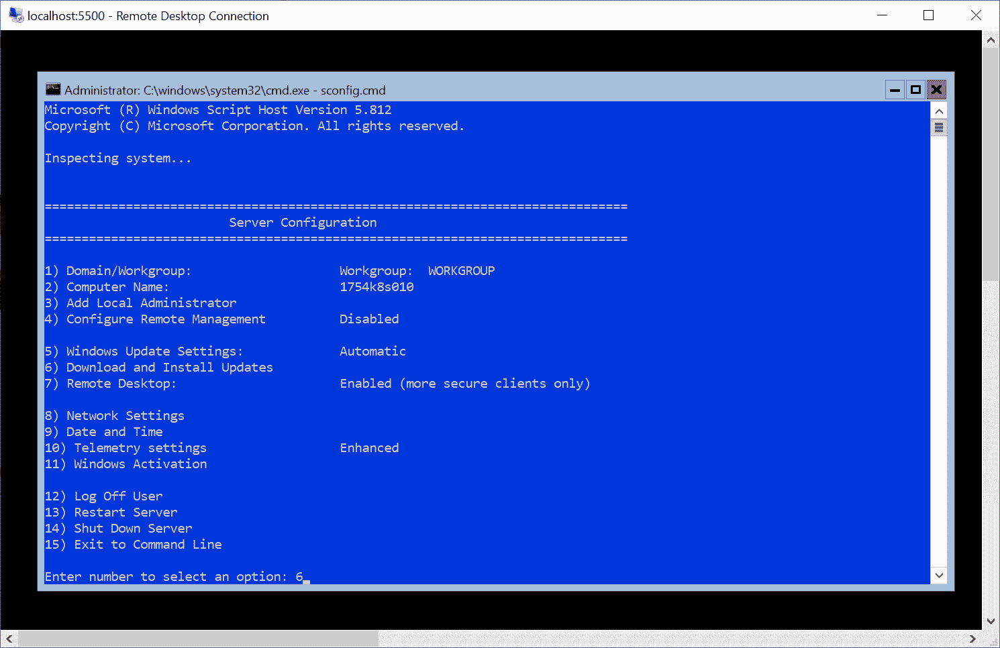
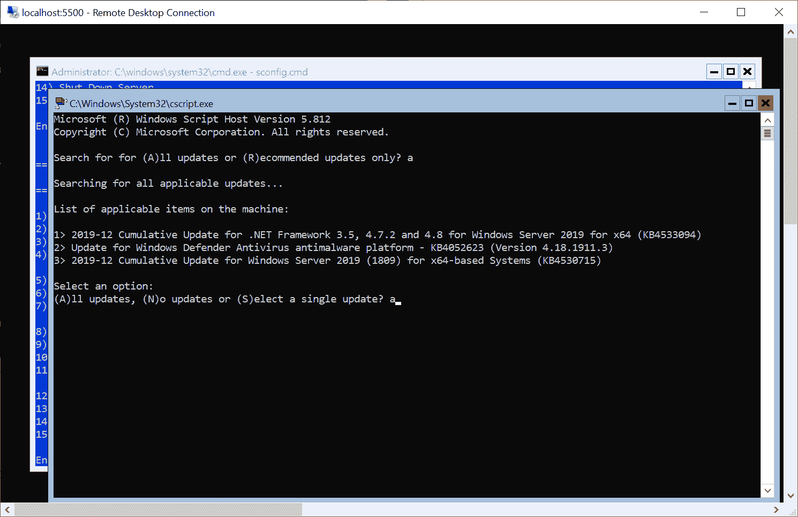

# 第十六章：运行 Kubernetes 的生产考虑

您已经到达本书的最后一章了——干得好！在这一简短的章节中，我们将为您提供运行 Kubernetes 在生产环境中的各种最佳实践和建议。对于每种软件工程方法或工具，总是有两个世界——您如何在开发中使用它以及您如何在生产中使用它。对于 Kubernetes 来说，在生产中运行需要更多的运维开销，因为您希望以高可用性和可靠性运行您的工作负载，通常规模较大。您必须考虑如何对集群本身进行升级，以及如何对底层操作系统进行补丁，确保业务的连续性。如果您在企业数据中心的隔离网络中运行 Kubernetes，您可能需要在 Docker 和 Kubernetes 的所有组件中进行网络代理配置。

此外，确保使用“基础设施即代码”和“不可变基础设施”方法可再生地配置您的集群非常重要。但这还不是全部——您肯定希望以声明方式管理您的集群工作负载（类似于您的基础设施），为此，您可以采用 GitOps 方法。我们在本章描述的所有概念也可以应用于仅 Linux 集群和混合 Windows/Linux 集群。

本书的最后一章将涵盖以下主题：

+   可再生地配置集群

+   Kubeadm 的限制

+   升级集群

+   操作系统补丁

+   为 Docker 守护程序和 Kubernetes 配置网络代理

# 技术要求

对于本章，您将需要以下内容：

+   已安装 Windows 10 专业版、企业版或教育版（1903 版或更高版本，64 位）

+   Azure 帐户

+   已安装 Helm

+   使用 AKS Engine 或本地集群部署的 Windows/Linux Kubernetes 集群

要跟着做，您需要自己的 Azure 帐户来为 Kubernetes 集群创建 Azure 资源。如果您还没有为之前的章节创建帐户，您可以在这里阅读更多关于如何获得个人使用的有限免费帐户：[`azure.microsoft.com/en-us/free/`](https://azure.microsoft.com/en-us/free/)。

使用 AKS Engine 部署 Kubernetes 集群已在第八章中介绍过，*部署混合 Azure Kubernetes 服务引擎集群*。

您可以从官方 GitHub 存储库下载本章的最新代码示例：[`github.com/PacktPublishing/Hands-On-Kubernetes-on-Windows/tree/master/Chapter16`](https://github.com/PacktPublishing/Hands-On-Kubernetes-on-Windows/tree/master/Chapter16)。

# 可重现地配置集群

首先，让我们看看您如何处理配置您的集群和基础设施以及如何在**持续集成**或**持续部署**（**CI/CD**）管道中作为一部分声明性地管理您的应用程序工作负载。在所有情况下，设置任何*基础设施即代码*方法都比仅使用基础设施更加困难和复杂，但最终会有很大的回报。您可以获得配置一致性，在引入复杂更改时的简单性，可测试/可分析的基础设施更改以及开发工作流程的任何阶段的可重现环境。

# 用于集群的基础设施即代码

**基础设施即代码**（**IaC**）简而言之，是仅使用声明性配置文件管理整个 IT 基础设施的概念。这意味着您的基础设施状态被捕获在配置文件中，并且使用专用工具应用环境更改，而不是使用脚本或交互式工具进行物理硬件配置。对于 Azure，您可以使用**Azure 资源管理器**（**ARM**）模板（[`docs.microsoft.com/en-us/azure/azure-resource-manager/resource-group-authoring-templates`](https://docs.microsoft.com/en-us/azure/azure-resource-manager/resource-group-authoring-templates)）来描述您的基础设施，或者使用通用的 IaC 工具，如 Terraform（[`www.terraform.io/`](https://www.terraform.io/)）。实际上，在部署 AKS Engine 集群时，您已间接使用了 ARM 模板，您可以将 AKS Engine 工具视为创建复杂 ARM 模板的另一层抽象。

您甚至可以进一步采用 IaC 方法：**不可变基础设施**（**IM**）。在 IM 的情况下，部署后从不修改任何机器上的任何配置。如果需要进行修复，您必须使用修复的基础镜像构建新的机器，并取消配置旧的机器。这听起来可能很极端，但在虚拟机世界和裸机环境中都可以轻松实现。

Packer ([`www.packer.io/`](https://www.packer.io/)) 是帮助您引入这种虚拟和裸机机器范式的最佳工具之一。但是如果您仔细考虑一下，我们在本书中已经大量使用了 IaC 和 IM，但是在不同的、更高的级别上。

Docker 本身就是*不可变基础设施*的体现，您可以将软件作为不可变的操作系统容器映像进行传送，就像它们是 VM 映像一样。Kubernetes 可以被视为管理您的应用程序工作负载的不可变容器基础设施的平台——每当您创建一个新的 Docker 映像并部署新版本的部署时，您只是在创建新的容器并丢弃旧的容器。如果您使用声明性方法来管理您的 Kubernetes 对象（至少使用`kubectl apply -f`），您最终会得到整洁的*基础设施即代码*。

这篇长篇介绍向我们展示了一些可以被视为为 Kubernetes 提供基础设施和部署集群的建议，从最低到最高级别：

+   始终使用*基础设施即代码*或*不可变基础设施*方法为集群提供底层基础设施，使用适合工作的正确工具。Terraform 或 ARM 模板在这两种情况下都非常适合这项任务。AKS Engine ([`github.com/Azure/aks-engine`](https://github.com/Azure/aks-engine)) 是建立在 ARM 模板之上的*不可变基础设施*工具的完美示例。如果您想为集群节点部署新版本的 VM 映像，您需要创建一个新的节点池并使用新映像，然后停用旧的节点池。避免使用最初并非用于此目的的工具，比如 Ansible。

+   在您的基础设施上创建 Kubernetes 集群本身时，请使用“基础设施即代码”概念。诸如 Ansible（[`www.ansible.com/`](https://www.ansible.com/)）、Powershell Desired State Configuration（[`docs.microsoft.com/en-us/powershell/scripting/dsc/overview/overview?view=powershell-6`](https://docs.microsoft.com/en-us/powershell/scripting/dsc/overview/overview?view=powershell-6)）或专用的 kubespray（[`github.com/kubernetes-sigs/kubespray`](https://github.com/kubernetes-sigs/kubespray)）等工具非常适合这项任务。AKS Engine 将基础设施的提供和集群部署完美地结合在一个工具中。如果您需要托管的 Kubernetes 服务，那么再次使用 Terraform 或 ARM 模板。但是不要将它们用于自管理集群来提供软件，即使它们有能力这样做，它们最初也不是为此而设计的。

+   使用 Docker 和 Kubernetes 集群作为应用工作负载的“不可变基础设施”平台。使用专用的声明性工具来管理这个平台，比如 Kustomize（[`kustomize.io/`](https://kustomize.io/)）或 Helm（[`helm.sh/`](https://helm.sh/)）。将 Helm chart 管理提升到一个更高的、也是声明性的水平——使用 Helmfile（[`github.com/roboll/helmfile`](https://github.com/roboll/helmfile)）或 Flux（[`github.com/fluxcd/flux`](https://github.com/fluxcd/flux)）。您将不必再担心运行`helm upgrade`命令！但是再次强调，不要使用那些本来不是为此而设计的工具，比如 Ansible 或 Terraform，即使它们有被宣传为能够管理 Kubernetes 对象或 Helm Charts 的模块或提供者。您会冒着绑定到一个不具备所有 Kubernetes 功能并很快过时的自定义 API 的风险。

如果您想以声明性方式管理多个 Kubernetes 集群，一定要密切关注目前处于 alpha 状态的 Kubernetes Cluster API（[`cluster-api.sigs.k8s.io/introduction.html`](https://cluster-api.sigs.k8s.io/introduction.html)）。这个 Kubernetes 项目将允许您创建一个特殊的 Kubernetes 管理集群，在那里您可以操作集群或机器作为 Kubernetes 自定义资源。

总之，始终使用正确的工具来完成工作！这就是为什么我们现在将看一看 Flux 和 GitOps 方法。

# 应用工作负载的 GitOps

Flux ([`github.com/fluxcd/flux`](https://github.com/fluxcd/flux)) 是一个工具，它可以自动确保 Kubernetes 集群的状态与 Git 中的配置（清单和 Helm 图表）匹配。这种方法符合 GitOps 的理念，GitOps 是一种由 Weaveworks 提出的管理 Kubernetes 集群和应用程序的方式，其中 Git 仓库是声明性基础设施和应用工作负载的唯一真相来源。这种方法完全符合“基础设施即代码”的范式。此外，你可以很好地分离关注点：开发人员对集群状态或应用程序配置进行更改，这些更改存储在 Git 仓库中（通过完整的 CI 流水线），专用的 GitOps 组件负责将配置应用到 Kubernetes 集群。你可以得到清晰的边界，并且始终可以确保仓库中的内容反映了实际的集群状态。

让我们看看如何使用 Flux 来管理运行我们在本书中实施的投票应用程序的集群。为此，您需要一个 AKS Engine 集群，该集群具有能够处理每个节点超过 4 个卷挂载的 Linux 节点 - 您可以使用以下集群 ApiModel：[`github.com/PacktPublishing/Hands-On-Kubernetes-on-Windows/blob/master/Chapter16/01_aks-engine-flux/kubernetes-windows-template.json`](https://github.com/PacktPublishing/Hands-On-Kubernetes-on-Windows/blob/master/Chapter16/01_aks-engine-flux/kubernetes-windows-template.json)。

Flux 中对 Helm 3 的支持目前处于开发状态。您可以在这里跟踪进展：[`github.com/fluxcd/helm-operator/issues/8`](https://github.com/fluxcd/helm-operator/issues/8)。因此，出于这个原因，我们需要为 Flux 组件使用自定义镜像，但在您阅读本文时，支持可能已经处于稳定状态。

首先，让我们创建我们的仓库，作为 Kubernetes 集群的真相来源。请按照以下步骤操作：

1.  创建一个新的 GitHub 仓库。我们将使用 [`github.com/hands-on-kubernetes-on-windows/voting-application-flux`](https://github.com/hands-on-kubernetes-on-windows/voting-application-flux) 进行演示。

1.  在`charts/voting-application`目录中，放置投票应用 Helm 图表。您可以在这里找到最新的版本（在此版本的 Flux 中，`post-install`钩子和等待功能不正确工作，需要进行小的变通）：[`github.com/PacktPublishing/Hands-On-Kubernetes-on-Windows/tree/master/Chapter16/02_voting-application-flux/charts/voting-application`](https://github.com/PacktPublishing/Hands-On-Kubernetes-on-Windows/tree/master/Chapter16/02_voting-application-flux/charts/voting-application)。

1.  在`namespaces`目录中，创建带有命名空间定义的`demo.yaml`文件：

```
apiVersion: v1
kind: Namespace
metadata:
  labels:
    name: demo
  name: demo
```

1.  在`storageclasses`目录中，创建带有`StorageClass`定义的`azure-disk.yaml`文件：

```
kind: StorageClass
apiVersion: storage.k8s.io/v1beta1
metadata:
  name: azure-disk
provisioner: kubernetes.io/azure-disk
parameters:
  storageaccounttype: Standard_LRS
  kind: Managed
```

1.  在`releases`目录中，创建`voting-application.yaml`文件，其中包含我们投票应用的`HelmRelease`自定义资源。这个自定义资源由 Flux Helm Operator 处理：

```
apiVersion: helm.fluxcd.io/v1 
kind: HelmRelease
metadata:
  name: voting-application
  namespace: demo
  annotations:
    fluxcd.io/automated: "true"
spec:
  releaseName: voting-application
  helmVersion: v3
  timeout: 1200
  wait: false
  rollback:
    enable: false
  chart:
    git: ssh://git@github.com/hands-on-kubernetes-on-windows/voting-application-flux
    ref: master
    path: charts/voting-application
```

1.  将更改推送到您的 GitHub 存储库。

Flux 不遵循任何目录约定——如何定义结构取决于您。它所做的就是在存储库中搜索 YAML 文件。

我们已经定义了我们的存储库的真实来源。现在，让我们将 Flux 部署到我们的集群中，它能够处理 Helm 3 图表。执行以下步骤（或者您可以使用 PowerShell 脚本：([`github.com/PacktPublishing/Hands-On-Kubernetes-on-Windows/blob/master/Chapter16/03_DeployFlux.ps1`](https://github.com/PacktPublishing/Hands-On-Kubernetes-on-Windows/blob/master/Chapter16/03_DeployFlux.ps1)：

1.  以管理员身份打开一个新的 PowerShell 窗口。

1.  使用 Chocolatey 安装`fluxctl`：

```
choco install fluxctl
```

1.  为 Flux 组件创建一个专用的`fluxcd`命名空间：

```
kubectl create namespace fluxcd
```

1.  添加 Flux Helm 存储库：

```
helm repo add fluxcd https://charts.fluxcd.io
```

1.  安装 Flux Helm 图表。您需要确保所有组件的`nodeSelector`设置为在 Linux 节点上运行。将`git.url`值设置为您的 GitHub 存储库：

```
helm upgrade -i flux fluxcd/flux `
 --namespace fluxcd `
 --set "nodeSelector.`"kubernetes\.io/os`"=linux" `
 --set "memcached.nodeSelector.`"kubernetes\.io/os`"=linux" `
 --set "helmOperator.nodeSelector.`"kubernetes\.io/os`"=linux" `
 --set git.url=git@github.com:hands-on-kubernetes-on-windows/voting-application-flux `
 --debug
```

1.  应用 HelmRelease 自定义资源定义的官方清单（这里我们使用来自`helm-v3-dev`分支的开发清单）：

```
kubectl apply -f https://raw.githubusercontent.com/fluxcd/helm-operator/helm-v3-dev/deploy/flux-helm-release-crd.yaml
```

1.  安装 Flux Helm 操作员的 Helm 图表。这是来自开发分支的操作员版本，支持 Helm 3。记得确保 Linux 的`nodeSelector`：

```
helm upgrade -i helm-operator fluxcd/helm-operator `
 --namespace fluxcd `
 --set git.ssh.secretName=flux-git-deploy `
 --set configureRepositories.enable=true `
 --set configureRepositories.repositories[0].name=stable `
 --set configureRepositories.repositories[0].url=https://kubernetes-charts.storage.googleapis.com `
 --set extraEnvs[0].name=HELM_VERSION `
 --set extraEnvs[0].value=v3 `
 --set image.repository=docker.io/fluxcd/helm-operator-prerelease `
 --set image.tag=helm-v3-dev-ca9c8ba0 `
 --set "nodeSelector.`"kubernetes\.io/os`"=linux" 
```

1.  使用`fluxctl`检索必须添加为部署密钥的公共 SSH 密钥：

```
fluxctl identity --k8s-fwd-ns fluxcd
```

1.  复制密钥并在 Web 浏览器中打开您的 GitHub 存储库。

1.  转到设置和部署密钥。

1.  添加具有写访问权限的密钥。

1.  现在，您可以等待一小段时间，直到 Flux 自动同步存储库，或使用此命令强制同步：

```
fluxctl sync --k8s-fwd-ns fluxcd
```

1.  观察使用`kubectl get all -n demo`命令创建组件。您还可以使用`kubectl logs`命令跟踪 Helm 操作员日志，特别是在安装 Helm 发布过程中出现任何问题时：

```
PS C:\src> kubectl get all -n demo
NAME                                                  READY   STATUS    RESTARTS   AGE
pod/voting-application-5cb4987765-7ht4x               0/1     Running   1          2m
pod/voting-application-5cb4987765-dstml               0/1     Running   1          2m
...
```

在前面的步骤中，我们使用了命令式命令，就像 Flux 的官方指南中一样。当然，您也可以使用声明性清单和带有 Helm 发布值的 YAML 文件。

正如您所看到的，整个过程是完全自动的。您在 Git 存储库中定义状态，Flux 会自动处理将更改应用于集群。现在，让我们测试一下在集群状态中推出更改的工作原理。例如，我们将更改我们在 Voting Application 中使用的图像标记，就好像我们正在推出应用程序的新版本一样：

1.  在您的集群状态存储库中，开始编辑`charts/voting-application/Chart.yaml`。

1.  将`version`更改为`0.4.1`以指示图表版本本身已更改。

1.  将`appVersion`更改为不同的 Voting Application 图像标记。例如，我们可以使用`1.5.0`中的一个先前版本。

1.  保存更改，提交到存储库，并推送到 GitHub。

1.  等待更改自动同步或使用`fluxctl sync --k8s-fwd-ns fluxcd`命令强制同步。

1.  执行`kubectl get pods -n demo`命令以查看资源是否正在重新创建：

```
PS C:\src> kubectl get pods -n demo
NAME                                              READY   STATUS              RESTARTS   AGE
voting-application-55fb99587d-rjvmq               0/1     Running             0          16s
voting-application-55fb99587d-whrwv               1/1     Running             0          79s
voting-application-55fb99587d-x9j8q               0/1     ContainerCreating   0          79s
voting-application-5cb4987765-g2lx8               1/1     Terminating         0          21m
```

1.  描述其中一个新的 pod 以验证它是否使用了所需的 Docker 图像标记创建：

```
PS C:\src> kubectl describe pod -n demo voting-application-55fb99587d-rjvmq
...
Containers:
 voting-application-frontend:
 Container ID: docker://61e207885bcfc3bde670702e342345127dcf0d6e782609bc68127078fc007034
 Image: packtpubkubernetesonwindows/voting-application:1.6.0
```

恭喜！您已成功使用 Flux 设置了 GitOps 管道。在生产环境中，您可以通过向您的 Git 存储库添加与 CI/CD 组件集成来轻松扩展管道，例如，在将每个拉取请求合并到集群状态存储库之前进行验证。您可以在以下文章中了解更复杂的管道：[`www.weave.works/blog/what-is-gitops-really`](https://www.weave.works/blog/what-is-gitops-really)。

在下一节中，我们将看一下 kubeadm 在生产用例中的限制。

# Kubeadm 限制

Kubeadm（[`github.com/kubernetes/kubeadm`](https://github.com/kubernetes/kubeadm)）是一个命令行工具，用于提供 Kubernetes 集群，专注于以用户友好的方式执行必要的操作，使得最小可行的安全集群能够运行起来——我们在第四章《Kubernetes 概念和 Windows 支持》中介绍了这个工具，并在第七章《部署混合本地 Kubernetes 集群》中使用了它。这个工具仅限于特定的机器和 Kubernetes API 通信，因此，它通常被设计为其他管理整个集群的自动化工具的构建块。你会发现，诸如 kubespray 之类的其他复杂自动化工具是建立在 kubeadm 之上的。

从 Kubernetes 1.13 开始，kubeadm 被认为是稳定的，并且可以用于生产环境。但即使当前的核心功能集是稳定的，你也应该考虑一些限制，这些限制可能使 kubeadm 不适合你的生产 Kubernetes 部署：

+   kubeadm 对 Windows 节点仅有初始支持，并且关于此支持的 API 可能会发生变化。这使得混合集群的生产部署变得困难——目前唯一的选择是在 Windows 节点上手动配置 Kubernetes 组件，并将它们加入到现有的 Linux 集群中。当然，如果你在 Azure 上运行，你可以使用 AKS 或 AKS Engine 在生产环境中运行 Windows 容器工作负载。

+   使用 kubeadm 现在可以实现高可用的 Kubernetes 集群设置（具有堆叠和内部 etcd 拓扑），但仍然相对复杂。你可以在官方文档中阅读更多信息：[`kubernetes.io/docs/setup/production-environment/tools/kubeadm/high-availability/`](https://kubernetes.io/docs/setup/production-environment/tools/kubeadm/high-availability/)。此外，目前没有简单的方法使用 kubeadm 之后管理 etcd 集群，这意味着诸如 kubespray 之类的解决方案提供了更多的灵活性。但当然，这是以目前不支持 Windows 为代价的。

+   kubeadm 不能用于加入新节点到已经在没有 kubeadm 的情况下引导的现有集群中。

总的来说，对于混合 Windows/Linux Kubernetes 集群，如果不能使用 AKS 或 AKS Engine，那么没有完美的方式来提供生产就绪的集群。使用 kubeadm 仍然是设置这种集群的唯一半自动化方式。

现在，让我们看看如何将您的 Kubernetes 集群升级到更新的版本。

# 升级集群

在生产环境中运行 Kubernetes 集群肯定需要在某个时候将 Kubernetes 组件升级到更新的版本。您执行升级的方式取决于您用于引导和管理集群的工具。但总的来说，高层次的过程如下：

1.  升级主节点上运行的组件。

1.  升级额外的主节点上运行的组件。

1.  升级工作节点。

有一个重要的规则，您必须遵循以确保安全升级：您只能一次升级集群一个次要版本。这意味着，例如，版本为 1.16 的集群只能升级到 1.17，您不能直接跳到 1.18。这是因为 Kubernetes 主组件的版本差异策略，最多只允许运行一个次要版本的差异。Kubernetes 次要版本发布的预期节奏是三个月一次，这意味着您可能需要经常运行升级过程，特别是考虑到每个次要版本将维护大约九个月。您可以在官方文档中阅读所有组件的政策：[`kubernetes.io/docs/setup/release/version-skew-policy/`](https://kubernetes.io/docs/setup/release/version-skew-policy/)。

根据集群的引导方式，确切的升级步骤会有所不同。例如，对于 kubeadm 集群，升级将在同一台机器上进行。但是，如果您使用的是 AKS 或 AKS Engine，该过程将符合*不可变基础设施*范式：主节点和工作节点将依次替换为运行较新版本 Kubernetes 组件的虚拟机。更详细地说，对于主节点，自动升级过程如下：

1.  将节点标记为不可调度，并排空现有的 Pod。

1.  删除物理虚拟机。现在，控制平面的大小为`N-1`个节点。

1.  创建一个新的虚拟机，安装新版本的 Kubernetes 组件。

1.  将新的虚拟机添加到集群，并应用任何现有的标签、注释或节点污点。现在，数据平面的大小再次为`N`。

对于工作节点，该过程类似，并包括以下步骤：

1.  创建一个新的虚拟机，安装新版本的 Kubernetes 组件。

1.  将新的 VM 添加到集群中。现在，数据平面的大小为 `M+1`。

1.  如果已经有任何 pod 被调度到新节点上，请将它们驱逐出去。

1.  将任何现有的标签、注释或污点应用到新节点上。

1.  `Cordon` 旧节点并排空现有的 pod。

1.  删除旧的 VM。现在，数据平面的大小再次为 `M`。

将工作节点升级为添加额外的节点（而不是首先删除现有节点）的原因是为了确保数据平面工作负载的集群容量不会缩小。这确保了升级对用户来说是完全透明的。您可以在以下链接中阅读有关 AKS 升级程序的更多信息：[`docs.microsoft.com/en-us/azure/aks/upgrade-cluster`](https://docs.microsoft.com/en-us/azure/aks/upgrade-cluster)，以及有关 AKS Engine 的信息：[`github.com/Azure/aks-engine/blob/master/docs/topics/upgrade.md`](https://github.com/Azure/aks-engine/blob/master/docs/topics/upgrade.md)。

您可以使用 AKS 和 AKS Engine 中使用的 *不可变基础设施* 方法进行升级，以执行使用不同工具引导的集群的手动升级，只要工具集允许添加新的主节点和工作节点。

现在让我们执行一个使用 AKS Engine 创建的 Kubernetes 集群（带有 Windows 节点）的升级。在本演示中，我们运行的是一个版本为 1.16.1 的集群，这是我们在之前章节中创建的。您将需要集群 ApiModel，这是您用于初始部署的。要执行升级，请按照以下步骤进行：

1.  打开 PowerShell 窗口。确定可用的 Kubernetes 版本，用于升级带有 Windows 节点的 AKS Engine 集群。运行以下命令：

```
PS C:\src> aks-engine get-versions --version 1.16.1 --windows
Version Upgrades
1.16.1 1.17.0-alpha.1, 1.17.0-alpha.2, 1.17.0-alpha.3, 1.17.0-beta.1
```

1.  让我们将集群升级到最新版本 `1.17.0-beta.1`。如果您没有 AKS Engine 服务主体，您必须生成一个新的，因为不可能检索现有主体的密码。要执行此操作，请使用以下命令：

```
az ad sp create-for-rbac `
 --role="Contributor" `
 --scopes="/subscriptions/<azureSubscriptionId>/resourceGroups/<resourceGroupName>"
```

注意 `appId` 和 `password`，在升级命令中会用到它们。

1.  执行以下命令进行升级。您必须指定生成的集群 ApiModel：

```
aks-engine upgrade `
 --subscription-id <azureSubscriptionId> `
 --api-model .\_output\<dnsPrefix>\apimodel.json `
 --location <azureLocation> `
 --resource-group <resourceGroupName> `
 --upgrade-version "1.17.0-beta.1" `
 --auth-method client_secret `
 --client-id <appId> `
 --client-secret <password>
```

1.  升级可能需要大约 50 分钟（每个节点 10 分钟），具体取决于您的集群大小。如果您的集群中使用单节点控制平面，则在升级期间将无法访问 Kubernetes API 一段时间。升级完成后，运行以下命令验证节点是否运行所需版本的 Kubernetes。

```
PS C:\src> kubectl get nodes
NAME                        STATUS   ROLES    AGE     VERSION
1754k8s010                  Ready    agent    17m     v1.17.0-beta.1
1754k8s012                  Ready    agent    26m     v1.17.0-beta.1
k8s-linuxpool1-17543130-0   Ready    agent    3m44s   v1.17.0-beta.1
k8s-linuxpool1-17543130-2   Ready    agent    9m51s   v1.17.0-beta.1
k8s-master-17543130-0       Ready    master   48m     v1.17.0-beta.1
```

在生产集群中，特别是如果您正在运行带有扩展或专用 VM 镜像的定制集群，则建议在使用完全相同规范创建的单独的分段集群中测试升级。

恭喜，您已成功将 AKS Engine 集群升级到版本`1.17.0-beta.1`。在下一节中，您将学习如何在 Kubernetes 中进行操作系统打补丁。

# OS 打补丁

为了确保集群和基础设施的最佳安全性，您必须确保在节点上运行具有最新补丁的操作系统。幸运的是，Kubernetes 在节点维护方面非常灵活。任何维护的一般方法，包括需要重新启动的 OS 补丁，如下所示：

1.  `Cordon`（标记节点为不可调度）节点并排空现有的 pod。

1.  应用所需的更新并重新启动机器。

1.  `Uncordon`节点以使其再次可调度。

或者，如果您使用*不可变基础设施*方法，则必须通过创建新的打补丁机器并删除旧机器来扩展前面的步骤。例如，在 AKS Engine 中，如果您在节点池中使用自定义 VM 镜像，则此场景可能如下所示：

1.  构建新版本的 VM 镜像。

1.  更新 VMSS 的 VM 镜像（https://docs.microsoft.com/en-us/azure/virtual-machine-scale-sets/virtual-machine-scale-sets-upgrade-scale-set#update-the-os-image-for-your-scale-set），可能直接在 ARM 模板中进行。

1.  对于 VMSS 中的每个 VM，依次执行以下操作：`cordon`和排空节点，将 VM 镜像设置为 VMSS 实例的最新版本，并`uncordon`节点。

如果您有兴趣为 AKS Engine Windows 节点创建自定义 VM 映像，您可以阅读以下构建过程的描述，该过程使用 Packer 和 Azure DevOps：[`github.com/Azure/aks-engine/blob/master/docs/topics/windows-vhd.md`](https://github.com/Azure/aks-engine/blob/master/docs/topics/windows-vhd.md)。

为了维护 Windows 节点的手动程序，请执行以下步骤：

1.  假设我们想要打补丁`1754k8s010` Windows 节点。

1.  使用名称获取`1754k8s010`节点的私有 IP 地址：

```
PS C:\src> az vm show -g <resourceGroupName> -n 1754k8s010 --show-details --query 'privateIps'
"10.240.0.35,10.240.0.36,10.240.0.37,10.240.0.38,10.240.0.39,10.240.0.40,10.240.0.41,10.240.0.42,10.240.0.43,10.240.0.44,10.240.0.45,10.240.0.46,10.240.0.47,10.240.0.48,10.240.0.49,10.240.0.50,10.240.0.51,10.240.0.52,10.240.0.53,10.240.0.54,10.240.0.55,10.240.0.56,10.240.0.57,10.240.0.58,10.240.0.59,10.240.0.60,10.240.0.61,10.240.0.62,10.240.0.63,10.240.0.64,10.240.0.65"
```

1.  使用其中一个私有 IP 从本地`5500`端口通过主节点到 Windows 节点上的端口`3389`（RDP）创建 SSH 隧道：

```
ssh -L 5500:10.240.0.35:3389 azureuser@<dnsPrefix>.<azureLocation>.cloudapp.azure.com
```

1.  在另一个 PowerShell 窗口中，通过隧道启动 RDP 会话：

```
mstsc /v:localhost:5500
```

1.  提供您的 Windows 节点凭据（如 ApiModel）并连接。

1.  等待控制台初始化。

1.  现在，您已经准备好进行维护，但首先，我们需要排空节点（这也会首先使节点`cordons`）。在本地计算机上的新的 PowerShell 窗口中，执行以下命令：

```
PS C:\src> kubectl drain 1754k8s010
node/1754k8s010 cordoned
node/1754k8s010 drained
```

1.  当节点被排空时，您可以开始维护程序。例如，您可以使用控制台中的`sconfig.cmd`实用程序手动应用更新：



1.  选择选项`6`并选择要安装的更新：



1.  等待安装结束并重新启动机器（如果需要）。

1.  当节点完全重新启动后，您可以`uncordon`节点以使其再次可调度：

```
PS C:\src> kubectl uncordon 1754k8s010
node/1754k8s010 uncordoned
```

您的节点现在将在集群中再次完全正常运行。

或者，您可以考虑使用 Azure Update Management 来管理集群中操作系统的更新和打补丁。您可以在官方文档中阅读更多信息：[`docs.microsoft.com/en-us/azure/automation/automation-update-management`](https://docs.microsoft.com/en-us/azure/automation/automation-update-management)。

在最后一节中，我们将展示在 Kubernetes 中哪些组件需要额外配置，如果您的生产集群在 HTTP(S)网络代理后运行。

# 为 Docker 守护程序和 Kubernetes 配置网络代理

在企业环境中，使用 HTTP(S)网络代理连接到外部网络，特别是互联网，是一种常见做法。这需要对所有运行在代理后面的组件进行额外的配置成本-我们将简要概述 Kubernetes 中需要使代理意识到使用外部注册表的 Docker 镜像并将代理设置传播到容器的组件。

假设我们的代理地址如下：

+   `http://proxy.example.com:8080/` 用于 HTTP 代理

+   `http://proxy.example.com:9090/` 用于 HTTPS 代理

其他标准代理的配置，例如 SFTP，可以类似地完成。您可能还需要适当的 no-proxy 变量来排除 Kubernetes 节点和本地网络，否则，您将无法在节点之间通信，或者流量将通过代理额外路由！现在，对于 Linux 节点和主节点（假设是基于 Debian 的发行版，如 Ubuntu），您需要确保配置以下设置：

1.  为默认环境`/etc/environment`定义代理设置。这将使 APT 等工具遵守代理设置：

```
HTTP_PROXY=http://proxy.example.com:8080/
HTTPS_PROXY=http://proxy.example.com:9090/
http_proxy=http://proxy.example.com:8080/
https_proxy=http://proxy.example.com:9090/
```

1.  为 Docker 守护程序环境设置代理。这将确保容器也接收代理变量。您可以使用以下内容定义`/etc/systemd/system/docker.service.d/http-proxy.conf`文件：

```
[Service]
Environment="HTTP_PROXY=http://proxy.example.com:8080/" "HTTPS_PROXY=http://proxy.example.com:9090/" 
```

1.  在代理后面的机器上构建 Docker 镜像时，考虑将代理设置作为参数传递：

```
docker build --build-arg http_proxy=http://proxy.example.com:8080/ \
 --build-arg https_proxy=http://proxy.example.com:9090/ \
 -t someimage .
```

对于 Windows 工作节点，您可以采取以下步骤：

1.  以管理员身份从 PowerShell 定义全局环境变量：

```
[Environment]::SetEnvironmentVariable("HTTP_PROXY", "http://proxy.example.com:8080/", [EnvironmentVariableTarget]::Machine)
[Environment]::SetEnvironmentVariable("HTTPS_PROXY", "http://proxy.example.com:9090/", [EnvironmentVariableTarget]::Machine)
```

1.  另外，确保使用 Web 浏览器引擎的任何流量也遵守代理设置：

```
reg add "HKCU\Software\Microsoft\Windows\CurrentVersion\Internet Settings" /v ProxyServer /t REG_SZ /d proxy.example.com:8080 /f
reg add "HKCU\Software\Microsoft\Windows\CurrentVersion\Internet Settings" /v ProxyEnable /t REG_DWORD /d 1 /f
```

这些配置步骤应该让您拉取 Docker 镜像，引导集群，并在连接到外部网络时使 pod 容器意识到这些设置。

# 总结

在本章中，我们重点介绍了在生产环境中运行 Kubernetes 集群的常见操作最佳实践。首先，我们介绍了为 Kubernetes 提供基础设施和可重复部署集群的方法-我们介绍了*基础设施即代码*和*不可变基础设施*的概念，并展示了它们如何适用于 Kubernetes 领域。此外，我们提供了有关为基础设施和集群部署提供最佳工具的建议。接下来，您将了解 GitOps 是什么，以及如何使用 Flux 和 Git 存储库应用这一理念。我们重点关注了升级和修补底层集群基础设施和 Kubernetes 本身的操作方面。最后，您将学习如何确保您的 Kubernetes 集群可以在企业环境中在 HTTP(S)网络代理后运行。

恭喜！这是一个漫长的旅程，进入（几乎）未知的 Windows Kubernetes 领域-祝您在进一步的 Kubernetes 旅程中好运，并感谢您的阅读。

# 问题

1.  *基础设施即代码*和*不可变基础设施*之间有什么区别？

1.  为什么 Kubernetes 被认为是使用*基础设施即代码*方法的平台？

1.  什么是 GitOps？

1.  在您的 Kubernetes 集群中使用 Flux 的好处是什么？

1.  升级 Kubernetes 集群版本的步骤是什么？

1.  对 Kubernetes 节点执行维护的程序是什么？

您可以在本书的*评估*中找到这些问题的答案。

# 进一步阅读

+   关于 Kubernetes 功能和在生产环境中运行集群的更多信息，请参考以下 Packt 图书：

+   *完整的 Kubernetes 指南*（[`www.packtpub.com/virtualization-and-cloud/complete-kubernetes-guide`](https://www.packtpub.com/virtualization-and-cloud/complete-kubernetes-guide)）

+   *开始使用 Kubernetes-第三版*（[`www.packtpub.com/virtualization-and-cloud/getting-started-kubernetes-third-edition`](https://www.packtpub.com/virtualization-and-cloud/getting-started-kubernetes-third-edition)）

+   如果您有兴趣探索*基础设施即代码*概念，您可以查看以下 Packt 图书：

+   *基础设施即代码（IaC）食谱*（[`www.packtpub.com/virtualization-and-cloud/infrastructure-code-iac-cookbook`](https://www.packtpub.com/virtualization-and-cloud/infrastructure-code-iac-cookbook)）

+   Kubernetes 文档提供了一些更多关于运行集群的最佳实践：[`kubernetes.io/docs/setup/best-practices/`](https://kubernetes.io/docs/setup/best-practices/)。
