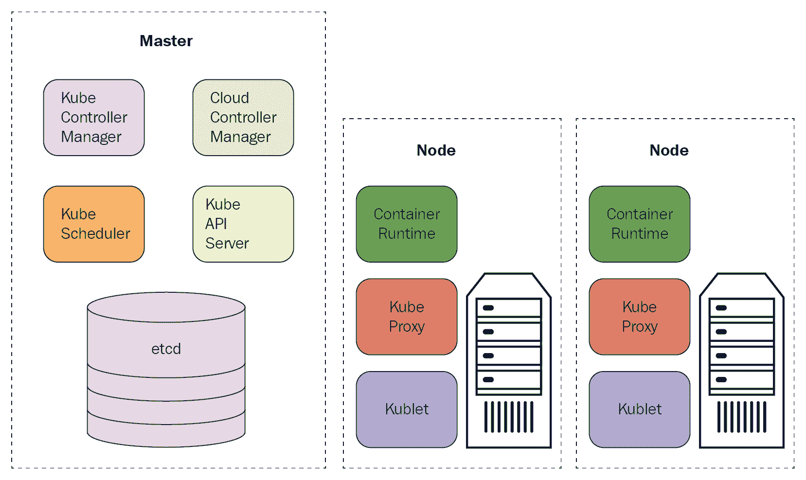
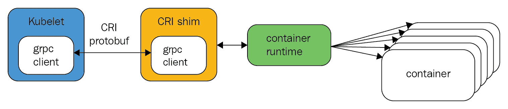
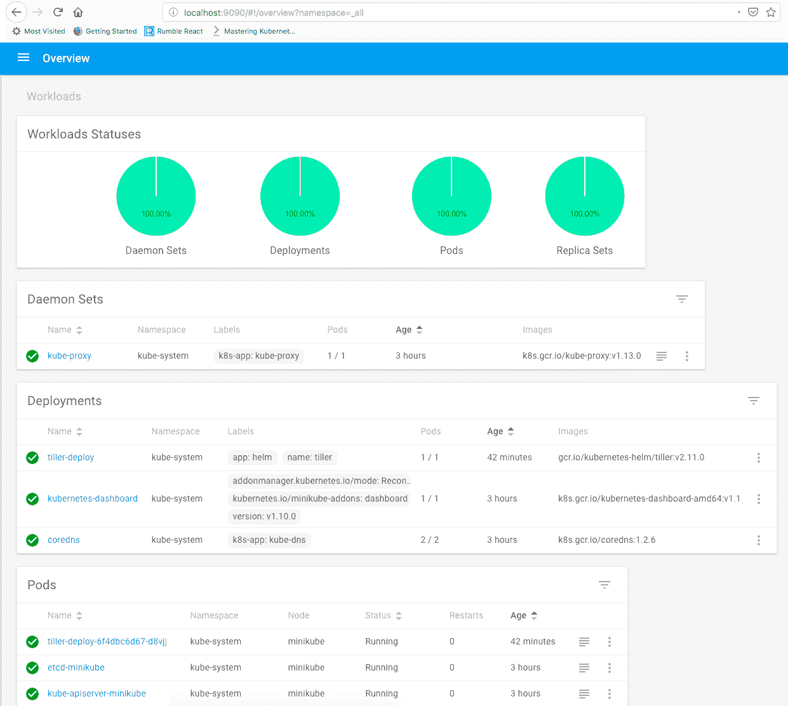

# 开发人员的 Kubernetes 简介

在本章中，我们将向您介绍 Kubernetes。Kubernetes 是一个庞大的平台，在一个章节中很难充分展现它。幸运的是，我们有一整本书来探索它。如果您感到有些不知所措，请不要担心。我会简要提到许多概念和功能。在后面的章节中，我们将详细介绍其中的许多内容，以及这些 Kubernetes 概念之间的联系和互动。为了增加趣味并尽早动手，您还将在本地机器上创建一个 Kubernetes 集群（Minikube）。本章将涵盖以下主题：

+   Kubernetes 简介

+   Kubernetes 架构

+   Kubernetes 和微服务

+   创建一个本地集群

# 技术要求

在本章中，您将需要以下工具：

+   Docker

+   Kubectl

+   Minikube

# 安装 Docker

要安装 Docker，请按照这里的说明操作：[`docs.docker.com/install/#supported-platforms`](https://docs.docker.com/install/#supported-platforms)。我将在 macOS 上使用 Docker。

# 安装 kubectl

要安装 kubectl，请按照这里的说明操作：[`kubernetes.io/docs/tasks/tools/install-kubectl/`](https://kubernetes.io/docs/tasks/tools/install-kubectl/)。

Kubectl 是 Kubernetes 的 CLI，我们将在整本书中广泛使用它。

# 安装 Minikube

要安装 Minikube，请按照这里的说明操作：[`kubernetes.io/docs/tasks/tools/install-minikube/`](https://kubernetes.io/docs/tasks/tools/install-minikube/)。

请注意，您还需要安装一个 hypervisor。对于 macOS，我发现 VirtualBox 是最可靠的。您可能更喜欢另一个 hypervisor，比如 HyperKit。当您开始使用 Minikube 时，将会有更详细的说明。

# 代码

+   本章的代码在这里可用：[`github.com/PacktPublishing/Hands-On-Microservices-with-Kubernetes/tree/master/Chapter01`](https://github.com/PacktPublishing/Hands-On-Microservices-with-Kubernetes/tree/master/Chapter01)

+   我们将一起构建的 Delinkcious 示例应用程序还有另一个 Git 存储库：[`github.com/the-gigi/delinkcious`](https://github.com/the-gigi/delinkcious)

# Kubernetes 简介

在这一部分，您将了解 Kubernetes 的全部内容，它的历史以及它是如何变得如此受欢迎的。

# Kubernetes - 容器编排平台

Kubernetes 的主要功能是在一组机器（物理或虚拟）上部署和管理大量基于容器的工作负载。这意味着 Kubernetes 提供了将容器部署到集群的手段。它确保遵守各种调度约束，并将容器有效地打包到集群节点中。此外，Kubernetes 会自动监视您的容器，并在它们失败时重新启动它们。Kubernetes 还会将工作负载从有问题的节点重新定位到其他节点上。Kubernetes 是一个非常灵活的平台。它依赖于计算、内存、存储和网络的基础设施层，并利用这些资源发挥其魔力。

# Kubernetes 的历史

Kubernetes 和整个云原生领域发展迅猛，但让我们花点时间回顾一下我们是如何到达这里的。这将是一个非常简短的旅程，因为 Kubernetes 于 2014 年 6 月从谷歌推出，仅仅几年前。当 Docker 变得流行时，它改变了人们打包、分发和部署软件的方式。但很快就显而易见，Docker 本身无法满足大型分布式系统的规模。一些编排解决方案变得可用，比如 Apache Mesos，后来是 Docker 自己的 swarm。但它们从未达到 Kubernetes 的水平。Kubernetes 在概念上基于谷歌的 Borg 系统。它汇集了谷歌工程十年的设计和技术卓越性，但它是一个新的开源项目。在 2015 年的 OSCON 上，Kubernetes 1.0 发布了，大门敞开了。Kubernetes 及其生态系统的增长以及背后的社区，与其技术卓越性一样令人印象深刻。

Kubernetes 在希腊语中意味着舵手。你会注意到许多与 Kubernetes 相关项目的航海术语。

# Kubernetes 的现状

Kubernetes 现在是家喻户晓的名字。DevOps 世界几乎将容器编排与 Kubernetes 等同起来。所有主要的云服务提供商都提供托管的 Kubernetes 解决方案。它在企业和初创公司中无处不在。虽然 Kubernetes 仍然年轻，创新不断发生，但这一切都是以非常健康的方式进行的。核心非常稳固，经过了严格测试，并在许多公司的生产中使用。有一些非常大的参与者在合作并推动 Kubernetes 的发展，比如谷歌（显然）、微软、亚马逊、IBM 和 VMware。

**Cloud Native Computing Foundation**（**CNCF**）开源组织提供认证。每 3 个月，都会推出一个新的 Kubernetes 版本，这是数百名志愿者和有偿工程师合作的结果。有一个庞大的生态系统围绕着商业和开源项目的主要项目。稍后您将看到，Kubernetes 灵活和可扩展的设计鼓励了这个生态系统，并有助于将 Kubernetes 集成到任何云平台中。

# 了解 Kubernetes 架构

Kubernetes 是软件工程的奇迹。Kubernetes 的架构和设计是其成功的重要组成部分。每个集群都有一个控制平面和数据平面。控制平面由多个组件组成，例如 API 服务器，用于保持集群状态的元数据存储，以及负责管理数据平面中的节点并为用户提供访问权限的多个控制器。生产中的控制平面将分布在多台机器上，以实现高可用性和鲁棒性。数据平面由多个节点或工作节点组成。控制平面将在这些节点上部署和运行您的 pod（容器组），然后监视更改并做出响应。

以下是一个说明整体架构的图表：



让我们详细审查控制平面和数据平面，以及 kubectl，这是您用来与 Kubernetes 集群交互的命令行工具。

# 控制平面

控制平面由几个组件组成：

+   API 服务器

+   etcd 元数据存储

+   调度程序

+   控制器管理器

+   云控制器管理器

让我们来审查每个组件的作用。

# API 服务器

**kube-api-server**是一个大型的 REST 服务器，向世界公开 Kubernetes API。您可以在控制平面中拥有多个 API 服务器实例，以实现高可用性。API 服务器将集群状态保存在 etcd 中。

# etcd 存储

完整的集群存储在 etcd（[`coreos.com/etcd/`](https://coreos.com/etcd/)）中，这是一个一致且可靠的分布式键值存储。**etcd 存储**是一个开源项目（最初由 CoreOS 开发）。

通常会有三个或五个 etcd 实例以实现冗余。如果您丢失了 etcd 存储中的数据，您将丢失整个集群。

# 调度程序

kube 调度器负责将 pod 调度到工作节点。它实现了一个复杂的调度算法，考虑了很多信息，比如每个节点上的资源可用性，用户指定的各种约束条件，可用节点的类型，资源限制和配额，以及其他因素，比如亲和性，反亲和性，容忍和污点。

# 控制器管理器

kube 控制器管理器是一个包含多个控制器的单个进程，以简化操作。这些控制器监视集群的事件和变化，并做出相应的响应：

+   节点控制器：负责在节点宕机时发现并做出响应。

+   复制控制器：确保每个复制集或复制控制器对象有正确数量的 pod。

+   端点控制器：为每个服务分配一个列出服务 pod 的端点对象。

+   服务账户和令牌控制器：使用默认服务账户和相应的 API 访问令牌初始化新的命名空间。

# 数据平面

数据平面是集群中运行容器化工作负载的节点的集合。数据平面和控制平面可以共享物理或虚拟机。当你运行单节点集群（比如 Minikube）时，当然会发生这种情况。但是，通常在一个生产就绪的部署中，数据平面会有自己的节点。Kubernetes 在每个节点上安装了几个组件，以便通信、监视和调度 pod：kubelet、kube 代理和容器运行时（例如 Docker 守护程序）。

# kubelet

kubelet 是一个 Kubernetes 代理。它负责与 API 服务器通信，并在节点上运行和管理 pod。以下是 kubelet 的一些职责：

+   从 API 服务器下载 pod 的秘密

+   挂载卷

+   通过容器运行时接口（CRI）运行 pod 容器

+   报告节点和每个 pod 的状态

+   探测容器的存活状态

# kube 代理

kube 代理负责节点的网络方面。它作为服务的本地前端运行，并且可以转发 TCP 和 UDP 数据包。它通过 DNS 或环境变量发现服务的 IP 地址。

# 容器运行时

Kubernetes 最终运行容器，即使它们是组织在 pod 中的。Kubernetes 支持不同的容器运行时。最初，只支持 Docker。现在，Kubernetes 通过基于 gRPC 的**CRI**接口运行容器。



每个实现 CRI 的容器运行时都可以在由**kubelet**控制的节点上使用，如前图所示。

# Kubectl

**Kubectl**是一个你应该非常熟悉的工具。它是你的 Kubernetes 集群的**命令行接口**（**CLI**）。我们将在整本书中广泛使用 kubectl 来管理和操作 Kubernetes。以下是 kubectl 在您的指尖上提供的功能的简短列表：

+   集群管理

+   部署

+   故障排除和调试

+   资源管理（Kubernetes 对象）

+   配置和元数据

只需键入`kubectl`即可获得所有命令的完整列表，`kubectl <command> --help`以获取有关特定命令的更详细信息。

# Kubernetes 和微服务-完美匹配

Kubernetes 是一个具有惊人能力和美妙生态系统的平台。它如何帮助您的系统？正如您将看到的，Kubernetes 和微服务之间有非常好的对齐。Kubernetes 的构建块，如命名空间、pod、部署和服务，直接映射到重要的微服务概念和敏捷**软件开发生命周期**（**SDLC**）。让我们深入研究。

# 打包和部署微服务

当您使用基于微服务的架构时，您将拥有大量的微服务。这些微服务通常可以独立开发和部署。打包机制只是容器。您开发的每个微服务都将有一个 Dockerfile。生成的镜像代表该微服务的部署单元。在 Kubernetes 中，您的微服务镜像将在一个 pod 中运行（可能与其他容器一起）。但是，运行在节点上的隔离 pod 并不是非常有弹性。如果 pod 的容器崩溃，节点上的 kubelet 将重新启动 pod 的容器，但是如果节点本身发生了什么事情，pod 就消失了。Kubernetes 具有构建在 pod 上的抽象和资源。

**ReplicaSets** 是具有一定数量副本的 pod 集。当你创建一个 ReplicaSet 时，Kubernetes 将确保你指定的正确数量的 pod 始终在集群中运行。部署资源进一步提供了一个与你考虑和思考微服务方式完全一致的抽象。当你准备好一个微服务的新版本时，你会想要部署它。这是一个 Kubernetes 部署清单：

```
apiVersion: apps/v1
kind: Deployment
metadata:
  name: nginx
  labels:
    app: nginx
spec:
  replicas: 3
  selector:
    matchLabels:
      app: nginx
  template:
    metadata:
      labels:
        app: nginx
    spec:
      containers:
      - name: nginx
        image: nginx:1.15.4
        ports:
        - containerPort: 80
```

该文件可以在 [`github.com/the-gigi/hands-on-microservices-with-kubernetes-code/blob/master/ch1/nginx-deployment.yaml.`](https://github.com/the-gigi/hands-on-microservices-with-kubernetes-code/blob/master/ch1/nginx-deployment.yaml) 找到

这是一个 YAML 文件（[`yaml.org/`](https://yaml.org/)），其中包含一些对所有 Kubernetes 资源通用的字段，以及一些特定于部署的字段。让我们一一分解。你在这里学到的几乎所有内容都适用于其他资源：

+   `apiVersion` 字段标记了 Kubernetes 资源的版本。Kubernetes API 服务器的特定版本（例如 V1.13.0）可以与不同资源的不同版本一起工作。资源版本有两个部分：API 组（在本例中为 `apps`）和版本号（`v1`）。版本号可能包括 **alpha** 或 **beta** 标识：

```
apiVersion: apps/v1
```

+   `kind` 字段指定了我们正在处理的资源或 API 对象是什么。在本章和以后，你将遇到许多种类的资源：

```
kind: Deployment
```

+   `metadata` 部分包含了资源的名称（`nginx`）和一组标签，这些标签只是键值对字符串。名称用于指代特定的资源。标签允许对共享相同标签的一组资源进行操作。标签非常有用和灵活。在这种情况下，只有一个标签（`app: nginx`）：

```
metadata:
  name: nginx
  labels:
    app: nginx
```

+   接下来，我们有一个 `spec` 字段。这是一个 ReplicaSet `spec`。你可以直接创建一个 ReplicaSet，但它将是静态的。部署的整个目的是管理其副本集。ReplicaSet `spec` 中包含什么？显然，它包含了 `replicas` 的数量（`3`）。它有一个带有一组 `matchLabels`（也是 `app: nginx`）的选择器，并且有一个 pod 模板。ReplicaSet 将管理具有与 `matchLabels` 匹配的标签的 pod：

```
spec:
  replicas: 3
  selector:
    matchLabels:
      app: nginx
  template:
     ...
```

+   让我们看一下 pod 模板。模板有两个部分：`metadata`和`spec`。`metadata`是您指定标签的地方。`spec`描述了 pod 中的`containers`。一个 pod 中可能有一个或多个容器。在这种情况下，只有一个容器。容器的关键字段是镜像（通常是 Docker 镜像），其中打包了您的微服务。这是我们想要运行的代码。还有一个名称（`nginx`）和一组端口：

```
metadata:
  labels:
    app: nginx
spec:
  containers:
  - name: nginx
    image: nginx:1.15.4
    ports:
    - containerPort: 80
```

还有更多可选字段。如果您想深入了解，请查看部署资源的 API 参考[`kubernetes.io/docs/reference/generated/kubernetes-api/v1.13/#deployment-v1-apps`](https://kubernetes.io/docs/reference/generated/kubernetes-api/v1.13/#deployment-v1-apps)。

# 暴露和发现微服务

我们使用部署部署了我们的微服务。现在，我们需要暴露它，以便其他集群中的服务可以使用它，并且可能还可以使其在集群外可见。Kubernetes 提供了`Service`资源来实现这一目的。Kubernetes 服务由标签标识的 pod 支持：

```
apiVersion: v1
kind: Service
metadata:
  name: nginx
  labels:
    app: nginx
spec:
  ports:
  - port: 80
    protocol: TCP
  selector:
    app: nginx
```

服务在集群内部使用 DNS 或环境变量相互发现。这是默认行为。但是，如果您想使服务对外部可访问，通常会设置一个入口对象或负载均衡器。我们将在以后详细探讨这个主题。

# 保护微服务

Kubernetes 是为运行大规模关键系统而设计的，安全性是至关重要的。微服务通常比单片系统更具挑战性，因为在许多边界上存在大量内部通信。此外，微服务鼓励敏捷开发，这导致系统不断变化。没有稳定的状态可以一次性确保安全。您必须不断调整系统的安全性以适应变化。Kubernetes 预先配备了几个概念和机制，用于安全开发、部署和运行您的微服务。您仍然需要采用最佳实践，例如最小权限原则、深度安全和最小化影响范围。以下是 Kubernetes 的一些安全功能。

# 命名空间

命名空间可以让您将集群的不同部分相互隔离。您可以创建任意数量的命名空间，并将许多资源和操作范围限定在其命名空间内，包括限制和配额。在命名空间中运行的 pod 只能直接访问其自己的命名空间。要访问其他命名空间，它们必须通过公共 API 进行。

# 服务账户

服务账户为您的微服务提供身份。每个服务账户都将具有与其账户关联的特定特权和访问权限。服务账户非常简单：

```
apiVersion: v1
kind: ServiceAccount
metadata:
  name: custom-service-account
```

您可以将服务账户与 pod 关联（例如，在部署的 pod `spec`中），并且在 pod 内部运行的微服务将具有该身份以及与该账户关联的所有特权和限制。如果不分配服务账户，则 pod 将获得其命名空间的默认服务账户。每个服务账户都与用于对其进行身份验证的秘密相关联。

# 秘密

Kubernetes 为所有微服务提供了秘密管理功能。秘密可以在 etcd 上（自 Kubernetes 1.7 起）加密存储，并且始终在传输过程中进行加密（通过 HTTPS）。秘密是按命名空间管理的。秘密在 pod 中作为文件（秘密卷）或环境变量挂载。有多种方法可以创建秘密。秘密可以包含两个映射：`data`和`stringData`。数据映射中的值的类型可以是任意的，但必须是 base64 编码的。例如，请参考以下内容：

```
apiVersion: v1
kind: Secret
metadata:
  name: custom-secret
type: Opaque
data:
  username: YWRtaW4=
  password: MWYyZDFlMmU2N2Rm
```

以下是 pod 如何将秘密加载为卷：

```
apiVersion: v1
kind: Pod
metadata:
  name: db
spec:
  containers:
  - name: mypod
    image: postgres
    volumeMounts:
    - name: db_creds
      mountPath: "/etc/db_creds"
      readOnly: true
  volumes:
  - name: foo
    secret:
      secretName: custom-secret
```

最终结果是，由 Kubernetes 在 pod 外部管理的 DB 凭据秘密显示为 pod 内部的常规文件，可通过路径`/etc/db_creds`访问。

# 安全通信

Kubernetes 利用客户端证书来完全验证任何外部通信的双方身份（例如 kubectl）。所有从外部到 Kubernetes API 的通信都应该是通过 HTTP 进行的。API 服务器与节点上的 kubelet 之间的内部集群通信也是通过 HTTPS 进行的（kubelet 端点）。但是，默认情况下不使用客户端证书（您可以启用它）。

API 服务器与节点、pod 和服务之间的通信默认情况下是通过 HTTP 进行的，并且没有经过身份验证。您可以将它们升级为 HTTPS，但请注意客户端证书会被检查，因此不要在公共网络上运行工作节点。

# 网络策略

在分布式系统中，除了保护每个容器、pod 和节点之外，还至关重要的是控制网络上的通信。Kubernetes 支持网络策略，这使您可以完全灵活地定义和塑造整个集群中的流量和访问。

# 对微服务进行身份验证和授权

身份验证和授权也与安全性相关，通过限制对受信任用户和 Kubernetes 的有限方面的访问来实现。组织有多种方法来对其用户进行身份验证。Kubernetes 支持许多常见的身份验证方案，例如 X.509 证书和 HTTP 基本身份验证（不太安全），以及通过 webhook 的外部身份验证服务器，这样可以对身份验证过程进行最终控制。身份验证过程只是将请求的凭据与身份（原始用户或冒充用户）进行匹配。授权过程控制着用户被允许做什么。进入 RBAC。

# 基于角色的访问控制

**基于角色的访问控制**（**RBAC**）并非必需！您可以使用 Kubernetes 中的其他机制执行授权。但这是最佳实践。RBAC 基于两个概念：角色和绑定。角色是对资源的权限集，定义为规则。有两种类型的角色：`Role`，适用于单个命名空间，以及`ClusterRole`，适用于集群中的所有命名空间。

这是默认命名空间中的一个角色，允许获取、监视和列出所有的 pod。每个角色都有三个组成部分：API 组、资源和动词：

```
kind: Role
apiVersion: rbac.authorization.k8s.io/v1
metadata:
  namespace: default
  name: pod-reader
rules:
- apiGroups: [""] # "" indicates the core API group
  resources: ["pods"]
  verbs: ["get", "watch", "list"]
```

集群角色非常相似，只是没有命名空间字段，因为它们适用于所有命名空间。

绑定是将一组主体（用户、用户组或服务帐户）与角色关联起来。有两种类型的绑定，`RoleBinding`和`ClusterRoleBinding`，它们对应于`Role`和`ClusterRole`。

```
kind: RoleBinding
apiVersion: rbac.authorization.k8s.io/v1
metadata:
  name: pod-reader
  namespace: default
subjects:
- kind: User
  name: gigi # Name is case sensitive
  apiGroup: rbac.authorization.k8s.io
roleRef:
  kind: Role # must be Role or ClusterRole
  name: pod-reader # must match the name of the Role or ClusterRole you bind to
  apiGroup: rbac.authorization.k8s.io
```

有趣的是，您可以将`ClusterRole`绑定到单个命名空间中的主体。这对于定义应在多个命名空间中使用的角色非常方便，一次作为集群角色，然后将它们绑定到特定命名空间中的特定主体。

集群角色绑定类似，但必须绑定集群角色，并始终适用于整个集群。

请注意，RBAC 用于授予对 Kubernetes 资源的访问权限。它可以调节对您的服务端点的访问权限，但您可能仍然需要微服务中的细粒度授权。

# 升级微服务

部署和保护微服务只是开始。随着您的系统的发展和演变，您将需要升级您的微服务。关于如何进行这些操作有许多重要的考虑，我们稍后将讨论（版本控制、滚动更新、蓝绿部署和金丝雀发布）。Kubernetes 直接支持许多这些概念，并且在其之上构建的生态系统提供了许多不同的风格和有见解的解决方案。

目标通常是零停机时间和安全回滚，如果出现问题。Kubernetes 部署提供了原语，例如更新部署、暂停部署和回滚部署。具体的工作流程是建立在这些坚实的基础之上的。

升级服务的机制通常涉及将其镜像升级到新版本，有时还需要对其支持资源和访问进行更改：卷、角色、配额、限制等。

# 微服务的扩展

使用 Kubernetes 扩展微服务有两个方面。第一个方面是扩展支持特定微服务的 pod 数量。第二个方面是集群的总容量。您可以通过更新部署的副本数量来显式地扩展微服务，但这需要您不断保持警惕。对于长时间内处理请求量有很大变化的服务（例如，工作时间与非工作时间或工作日与周末），这可能需要大量的工作。Kubernetes 提供了基于 CPU、内存或自定义指标的水平 pod 自动扩展，可以自动地扩展您的服务。

以下是如何扩展我们当前固定为三个副本的`nginx`部署，使其在所有实例的平均 CPU 使用率之间在`2`和`5`之间变化：

```
apiVersion: autoscaling/v1
kind: HorizontalPodAutoscaler
metadata:
    name: nginx
    namespace: default
spec:
    maxReplicas: 5
    minReplicas: 2
    targetCPUUtilizationPercentage: 90
    scaleTargetRef:
      apiVersion: v1
      kind: Deployment
      name: nginx
```

结果是 Kubernetes 将监视属于`nginx`部署的 pod 的 CPU 利用率。当一段时间内（默认为 5 分钟）的平均 CPU 超过 90%时，它将添加更多副本，直到最多为 5 个，或者直到利用率低于 90%。HPA 也可以缩小规模，但即使 CPU 利用率为零，它也将始终保持至少两个副本。

# 监控微服务

你的微服务部署并在 Kubernetes 上运行。你可以在需要时更新微服务的版本。Kubernetes 会自动处理修复和扩展。然而，你仍然需要监视你的系统并跟踪错误和性能。这对于解决问题很重要，但也对于通知你潜在的改进、优化和成本削减很重要。

有几类相关信息是重要的，你应该监控：

+   第三方日志

+   应用程序日志

+   应用程序错误

+   Kubernetes 事件

+   指标

当考虑由多个微服务和多个支持组件组成的系统时，日志的数量将是可观的。解决方案是中央日志记录，所有日志都会发送到一个地方，你可以随意切割和分析。当然可以记录错误，但通常有用的是报告带有额外元数据的错误，比如堆栈跟踪，并在专用环境中审查它们（例如 sentry 或 rollbar）。指标对于检测性能和系统健康问题或随时间变化的趋势是有用的。

Kubernetes 提供了几种机制和抽象来监视你的微服务。该生态系统还提供了许多有用的项目。

# 日志记录

有几种实现与 Kubernetes 的中央日志记录的方法：

+   在每个节点上运行一个日志代理

+   向每个应用程序 pod 注入一个日志边车容器

+   让你的应用程序直接发送日志到中央日志服务

每种方法都有其利弊。但是，主要的是 Kubernetes 支持所有方法，并使容器和 pod 日志可供使用。

参考[`kubernetes.io/docs/concepts/cluster-administration/logging/#cluster-level-logging-architectures`](https://kubernetes.io/docs/concepts/cluster-administration/logging/#cluster-level-logging-architectures)进行深入讨论。

# 指标

Kubernetes 附带了 cAdvisor（[`github.com/google/cadvisor`](https://github.com/google/cadvisor)），这是一个用于收集容器指标的工具，集成到 kubelet 二进制文件中。Kubernetes 以前提供了一个名为**heapster**的度量服务器，需要额外的后端和 UI。但是，如今，最佳的度量服务器是开源项目 Prometheus。如果你在 Google 的 GKE 上运行 Kubernetes，那么 Google Cloud Monitoring 是一个不需要在你的集群中安装额外组件的好选择。其他云提供商也与他们的监控解决方案集成（例如，EKS 上的 CloudWatch）。

# 创建本地集群

Kubernetes 作为部署平台的一个优势是，你可以创建一个本地集群，并且只需相对较少的努力，就可以拥有一个非常接近生产环境的真实环境。主要好处是开发人员可以在本地测试他们的微服务，并与集群中的其他服务进行协作。当你的系统由许多微服务组成时，更重要的测试通常是集成测试，甚至是配置和基础设施测试，而不是单元测试。Kubernetes 使这种测试变得更容易，需要更少脆弱的模拟。

在这一部分，你将安装一个本地 Kubernetes 集群和一些额外的项目，然后使用宝贵的 kubectl 命令行工具来探索它。

# 安装 Minikube

Minikube 是一个可以在任何地方安装的单节点 Kubernetes 集群。我在这里使用的是 macOS，但过去我也成功地在 Windows 上使用过。在安装 Minikube 本身之前，你必须安装一个 hypervisor。我更喜欢 HyperKit：

```
$ curl -LO https://storage.googleapis.com/minikube/releases/latest/docker-machine-driver-hyperkit \
 && chmod +x docker-machine-driver-hyperkit \
 && sudo mv docker-machine-driver-hyperkit /usr/local/bin/ \
 && sudo chown root:wheel /usr/local/bin/docker-machine-driver-hyperkit \
 && sudo chmod u+s /usr/local/bin/docker-machine-driver-hyperkit
```

但是，我偶尔会遇到 HyperKit 的问题。如果你无法解决这些问题，我建议使用 VirtualBox 作为 hypervisor。运行以下命令通过 Homebrew 安装 VirtualBox：

```
$ brew cask install virtualbox
```

现在，你可以安装 Minikube 本身。再次使用 Homebrew 是最好的方法：

```
brew cask install minikube
```

如果你不是在 macOS 上，请按照官方说明进行操作：[`kubernetes.io/docs/tasks/tools/install-minikube/`](https://kubernetes.io/docs/tasks/tools/install-minikube/)。

在使用 HyperKit 启动 Minikube 之前，你必须关闭任何 VPN。在 Minikube 启动后，你可以重新启动 VPN。

Minikube 支持多个版本的 Kubernetes。目前，默认版本是 1.10.0，但 1.13.0 已经发布并得到支持，所以让我们使用这个版本：

```
$ minikube start --vm-driver=hyperkit --kubernetes-version=v1.13.0
```

如果您使用 VirtualBox 作为您的 hypervisor，您不需要指定`--vm-driver`：

```
$ minikube start --kubernetes-version=v1.13.0
```

您应该看到以下内容：

```
$ minikube start --kubernetes-version=v1.13.0
Starting local Kubernetes v1.13.0 cluster...
Starting VM...
Downloading Minikube ISO
 178.88 MB / 178.88 MB [============================================] 100.00% 0s
Getting VM IP address...
E0111 07:47:46.013804   18969 start.go:211] Error parsing version semver:  Version string empty
Moving files into cluster...
Downloading kubeadm v1.13.0
Downloading kubelet v1.13.0
Finished Downloading kubeadm v1.13.0
Finished Downloading kubelet v1.13.0
Setting up certs...
Connecting to cluster...
Setting up kubeconfig...
Stopping extra container runtimes...
Starting cluster components...
Verifying kubelet health ...
Verifying apiserver health ...Kubectl is now configured to use the cluster.
Loading cached images from config file.

Everything looks great. Please enjoy minikube!
```

如果这是您第一次启动 Minikube 集群，Minikube 将自动下载 Minikube VM（178.88 MB）。

此时，您的 Minikube 集群已准备就绪。

# Minikube 故障排除

如果遇到问题（例如，如果您忘记关闭 VPN），请尝试删除 Minikube 安装并使用详细日志重新启动：

```
$ minikube delete
$ rm -rf ~/.minikube
$ minikube start --vm-driver=hyperkit --kubernetes-version=v1.13.0 --logtostderr --v=3
```

如果您的 Minikube 安装卡住了（可能在等待 SSH），您可能需要重新启动以解除卡住。如果这样做没有帮助，请尝试以下操作：

```
sudo mv /var/db/dhcpd_leases /var/db/dhcpd_leases.old
sudo touch /var/db/dhcpd_leases
```

然后，再次重启。

# 验证您的集群

如果一切正常，您可以检查您的 Minikube 版本：

```
$ minikube version
minikube version: v0.31.0
```

Minikube 还有许多其他有用的命令。只需输入`minikube`即可查看命令和标志列表。

# 玩转您的集群

Minikube 正在运行，所以让我们玩得开心。在本节中，您的 kubectl 将为您提供良好的服务。让我们从检查我们的节点开始：

```
$ kubectl get nodes
NAME       STATUS    ROLES     AGE       VERSION
minikube   Ready     master    4m        v1.13.0
```

您的集群已经有一些正在运行的 pod 和服务。原来 Kubernetes 正在使用自己的服务和 pod。但是，这些 pod 和服务在命名空间中运行。以下是所有的命名空间：

```
$ kubectl get ns
NAME          STATUS    AGE
default       Active    18m
kube-public   Active    18m
kube-system   Active    18m
```

要查看所有命名空间中的所有服务，可以使用`--all-namespaces`标志：

```
$ kubectl get svc --all-namespaces
NAMESPACE          NAME  TYPE   CLUSTER-IP  EXTERNAL-IP   PORT(S)   AGE
default  kubernetes   ClusterIP   10.96.0.1  <none>   443/TCP       19m
kube-system kube-dns  ClusterIP   10.96.0.10 <none>   53/UDP,53/TCP 19m
kube-system kubernetes-dashboard  ClusterIP 10.111.39.46 <none>        80/TCP          18m
```

Kubernetes API 服务器本身作为默认命名空间中的服务运行，然后我们有`kube-dns`和`kubernetes-dashboard`在`kube-system`命名空间中运行。

要探索仪表板，您可以运行专用的 Minikube 命令`minikube dashboard`。您还可以使用`kubectl`，它更通用，可以在任何 Kubernetes 集群上运行：

```
$ kubectl port-forward deployment/kubernetes-dashboard 9090
```

然后，浏览`http://localhost:9090`，您将看到以下仪表板：



# 安装 Helm

Helm 是 Kubernetes 包管理器。它不随 Kubernetes 一起提供，因此您必须安装它。Helm 有两个组件：一个名为`tiller`的服务器端组件，以及一个名为`helm`的 CLI。

首先，让我们使用 Homebrew 在本地安装`helm`：

```
$ brew install kubernetes-helm
```

然后，正确初始化服务器和客户端类型：

```
$ helm init
$HELM_HOME has been configured at /Users/gigi.sayfan/.helm.

Tiller (the Helm server-side component) has been installed into your Kubernetes Cluster.

Please note: by default, Tiller is deployed with an insecure 'allow unauthenticated users' policy.
To prevent this, run `helm init` with the --tiller-tls-verify flag.
For more information on securing your installation see: https://docs.helm.sh/using_helm/#securing-your-helm-installation
Happy Helming!
```

有了 Helm，您可以轻松在 Kubernetes 集群中安装各种好东西。目前在稳定的图表存储库中有`275`个字符（Helm 术语表示一个包）：

```
$ helm search | wc -l
275
```

例如，查看所有标记为`db`类型的发布：

```
$ helm search db
NAME                               CHART VERSION  APP VERSION    DESCRIPTION
stable/cockroachdb                 2.0.6          2.1.1          CockroachDB is a scalable, survivable, strongly-consisten...
stable/hlf-couchdb                 1.0.5          0.4.9          CouchDB instance for Hyperledger Fabric (these charts are...
stable/influxdb                    1.0.0          1.7            Scalable datastore for metrics, events, and real-time ana...
stable/kubedb                      0.1.3          0.8.0-beta.2   DEPRECATED KubeDB by AppsCode - Making running production...
stable/mariadb                     5.2.3          10.1.37        Fast, reliable, scalable, and easy to use open-source rel...
stable/mongodb                     4.9.1          4.0.3          NoSQL document-oriented database that stores JSON-like do...
stable/mongodb-replicaset          3.8.0          3.6            NoSQL document-oriented database that stores JSON-like do...
stable/percona-xtradb-cluster      0.6.0          5.7.19         free, fully compatible, enhanced, open source drop-in rep...
stable/prometheus-couchdb-exporter 0.1.0          1.0            A Helm chart to export the metrics from couchdb in Promet...
stable/rethinkdb                   0.2.0          0.1.0          The open-source database for the realtime web
jenkins-x/cb-app-slack             0.0.1                         A Slack App for CloudBees Core
stable/kapacitor                   1.1.0          1.5.1          InfluxDB's native data processing engine. It can process ...
stable/lamp                        0.1.5          5.7            Modular and transparent LAMP stack chart supporting PHP-F...
stable/postgresql                  2.7.6          10.6.0         Chart for PostgreSQL, an object-relational database manag...
stable/phpmyadmin                  2.0.0          4.8.3          phpMyAdmin is an mysql administration frontend
stable/unifi                       0.2.1          5.9.29         Ubiquiti Network's Unifi Controller
```

我们将在整本书中大量使用 Helm。

# 摘要

在本章中，您对 Kubernetes 进行了一个快速的介绍，并了解了它与微服务的契合程度。Kubernetes 的可扩展架构赋予了大型企业组织、初创公司和开源组织一个强大的社区，使它们能够合作并围绕 Kubernetes 创建生态系统，从而增加其益处并确保其持久性。Kubernetes 内置的概念和抽象非常适合基于微服务的系统。它们支持软件开发生命周期的每个阶段，从开发、测试、部署，一直到监控和故障排除。Minikube 项目让每个开发人员都可以运行一个本地的 Kubernetes 集群，这对于在类似于生产环境的本地环境中进行 Kubernetes 实验和测试非常有用。Helm 项目是 Kubernetes 的一个很棒的补充，作为事实上的软件包管理解决方案提供了巨大的价值。在下一章中，我们将深入了解微服务的世界，并了解它们为何是开发复杂且快速移动的分布式系统的最佳方法。

# 进一步阅读

+   如果您想了解更多关于 Kubernetes 的信息，我推荐我的书《精通 Kubernetes-第二版》，由 Packt 出版：[`www.packtpub.com/application-development/mastering-kubernetes-second-edition`](https://www.packtpub.com/application-development/mastering-kubernetes-second-edition)
