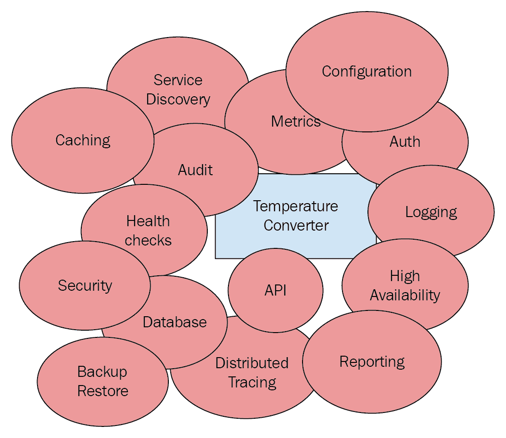
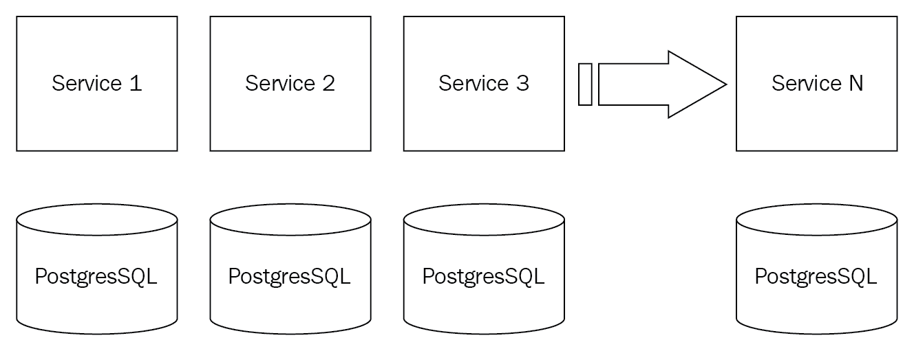
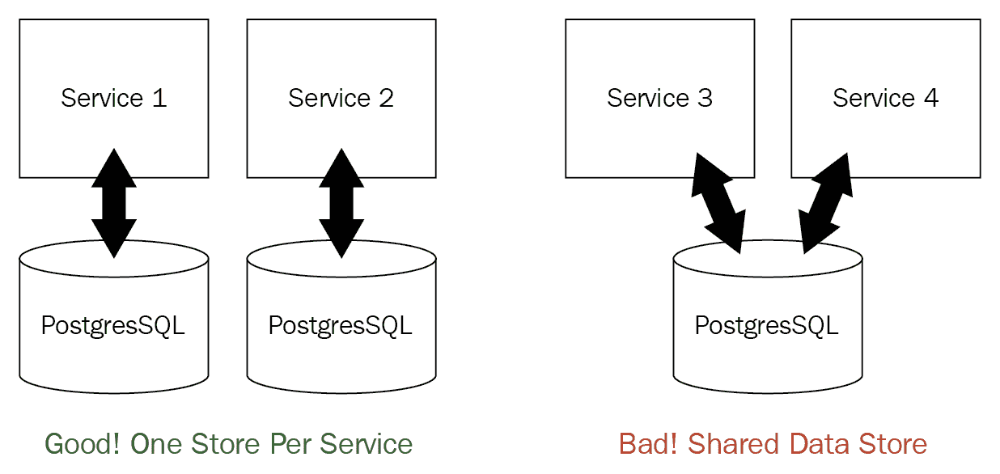
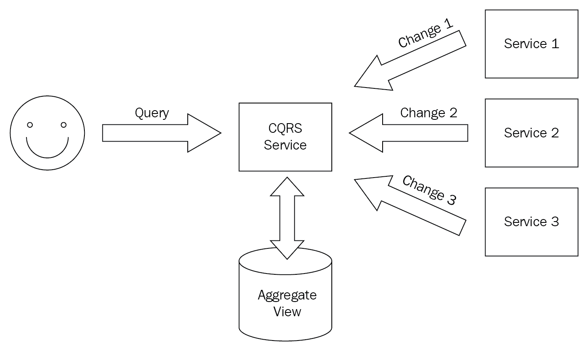
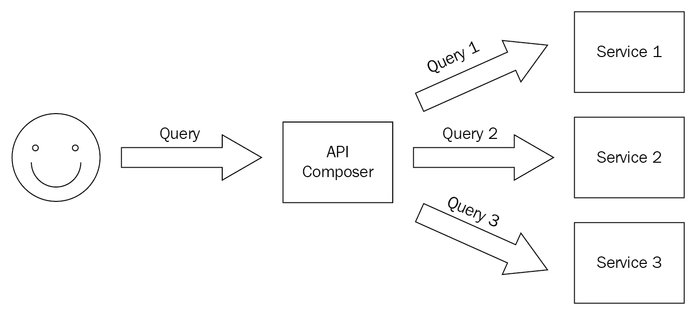

# 开始使用微服务

在上一章中，您了解了 Kubernetes 的全部内容，以及它如何适合作为开发、部署和管理微服务的平台，甚至还在本地 Kubernetes 集群中玩了一点。在本章中，我们将讨论微服务的一般情况，以及为什么它们是构建复杂系统的最佳方式。我们还将讨论解决基于微服务的系统中常见问题的各种方面、模式和方法，以及它们与其他常见架构（如单体和大型服务）的比较。

我们将在本章中涵盖大量材料：

+   在小规模编程中-少即是多

+   使您的微服务自主

+   使用接口和契约

+   通过 API 公开您的服务

+   使用客户端库

+   管理依赖关系

+   编排微服务

+   利用所有权

+   理解康威定律

+   跨多个服务进行故障排除

+   利用共享服务库

+   选择源代码控制策略

+   创建数据策略

# 技术要求

在本章中，您将看到一些使用 Go 的代码示例。我建议您安装 Go 并尝试自己构建和运行代码示例。

# 在 macOS 上使用 Homebrew 安装 Go

在 macOS 上，我建议使用 Homebrew：

```
$ brew install go
```

接下来，请确保`go`命令可用：

```
$ ls -la `which go`
lrwxr-xr-x  1 gigi.sayfan  admin  26 Nov 17 09:03 /usr/local/bin/go -> ../Cellar/go/1.11.2/bin/go
```

要查看所有选项，只需输入`go`。此外，请确保在您的`.bashrc`文件中定义`GOPATH`并将`$GOPATH/bin`添加到您的路径中。

Go 带有 Go CLI，提供了许多功能，但您可能希望安装其他工具。查看[`awesome-go.com/`](https://awesome-go.com/)。

# 在其他平台上安装 Go

在其他平台上，请按照官方说明操作：[`golang.org/doc/install.`](https://golang.org/doc/install)

# 代码

您可以在此处找到本章的代码：[`github.com/PacktPublishing/Hands-On-Microservices-with-Kubernetes/tree/master/Chapter02`](https://github.com/PacktPublishing/Hands-On-Microservices-with-Kubernetes/tree/master/Chapter02)。

# 在小规模编程中-少即是多

想想你学习编程的时候。你写了一些接受简单输入、进行一些处理并产生一些输出的小程序。生活很美好。你可以把整个程序都记在脑子里。

您理解了每一行代码。调试和故障排除都很容易。例如，考虑一个用于在摄氏度和华氏度之间转换温度的程序：

```
package main

import (
        "fmt"
        "os"
        "strconv"
)

func celsius2fahrenheit(t float64) float64 {
        return 9.0/5.0*t + 32
}

func fahrenheit2celsius(t float64) float64 {
        return (t - 32) * 5.0 / 9.0
}

func usage() {
      fmt.Println("Usage: temperature_converter <mode> <temperature>")
      fmt.Println()
      fmt.Println("This program converts temperatures between Celsius and Fahrenheit")
      fmt.Println("'mode' is either 'c2f' or 'f2c'")
      fmt.Println("'temperature' is a floating point number to be converted according to mode")
     os.Exit(1)
}

func main() {
         if len(os.Args) != 3 {
                usage()
          }
          mode := os.Args[1]
          if mode != "f2c" && mode != "c2f" {
                  usage()
          }

          t, err := strconv.ParseFloat(os.Args[2], 64)
          if err != nil {
                  usage()
           }

          var converted float64
           if mode == "f2c" {
                  converted = fahrenheit2celsius(t)
           } else {
                   converted = celsius2fahrenheit(t)
           }
           fmt.Println(converted)
}
```

这个程序非常简单。它很好地验证了输入，并在出现问题时显示了使用信息。程序实际执行的计算只有两行代码，用于转换温度，但代码长度为 45 行。甚至没有任何注释。然而，这 45 行代码非常易读且易于测试。没有第三方依赖（只有 Go 标准库）。没有 IO（文件、数据库、网络）。不需要认证或授权。不需要限制调用速率。没有日志记录，没有指标收集。没有版本控制，健康检查或配置。没有在多个环境中部署和没有在生产中进行监控。

现在，考虑将这个简单的程序集成到一个大型企业系统中。您将不得不考虑其中许多方面。系统的其他部分将开始使用温度转换功能。突然之间，最简单的操作可能会产生连锁影响。系统的其他部分的更改可能会影响温度转换器：



这种复杂性的增加是自然的。大型企业系统有许多要求。微服务的承诺是通过遵循适当的架构指南和已建立的模式，可以将额外的复杂性整齐地打包并用于许多小型微服务，这些微服务共同完成系统目标。理想情况下，服务开发人员大部分时间都可以不受包围系统的影响。然而，提供适当程度的隔离并且仍然允许在整个系统的上下文中进行测试和调试需要付出很大的努力。

# 使您的微服务自主

对抗复杂性的最佳方法之一是使您的微服务自主。自主服务是一种不依赖于系统中其他服务或第三方服务的服务。自主服务管理自己的状态，并且在很大程度上可以不了解系统的其余部分。

我喜欢将自主微服务看作类似于不可变函数。自主服务永远不会改变系统中其他组件的状态。这种服务的好处是，无论系统的其余部分如何发展，以及它们如何被其他服务使用，它们的复杂性都保持不变。

# 使用接口和契约

接口是软件工程师可以使用的最好工具之一。一旦将某物公开为接口，就可以自由更改其背后的实现。接口是在单个进程中使用的构造。它们对于测试与其他组件的交互非常有用，在基于微服务的系统中这种交互非常丰富。以下是我们示例应用程序的一个接口：

```
type UserManager interface {
   Register(user User) error
   Login(username string, authToken string) (session string, err error)
   Logout(username string, session string) error
}
```

`UserManager`接口定义了一些方法，它们的输入和输出。但是，它没有指定语义。例如，如果对已经登录的用户调用`Login()`方法会发生什么？这是一个错误吗？先前的会话是否终止并创建一个新会话？它是否返回现有会话而不出现错误（幂等方法）？这些问题由合同回答。合同很难完全指定，Go 不提供对合同的任何支持。但是，合同很重要，它们总是存在的，即使只是隐含地存在。

一些语言不支持接口作为语言的第一类语法结构。但是，实现相同效果非常容易。动态类型的语言，如 Python，Ruby 和 JavaScript，允许您传递任何满足调用者使用的属性和方法集的对象。静态语言，如 C 和 C++，通过函数指针集（C）或仅具有纯虚函数的结构（C++）来实现。

# 通过 API 公开您的服务

微服务之间有时会通过网络相互交互，有时还会与外部世界进行交互。服务通过 API 公开其功能。我喜欢将 API 想象为通过网络的接口。编程语言接口使用其所编写的语言的语法（例如，Go 的接口类型）。现代网络 API 也使用一些高级表示。基础是 UDP 和 TCP。但是，微服务通常会通过 Web 传输公开其功能，例如 HTTP（REST，GraphQL，SOAP），HTTP/2（gRPC），或者在某些情况下是 WebSockets。一些服务可能模仿其他的线路协议，例如 memcached，但这在特殊情况下很有用。在 2019 年，没有理由直接在 TCP/UDP 上构建自定义协议或使用专有和特定于语言的协议。像 Java RMI，.NET remoting，DCOM 和 CORBA 这样的方法最好留在过去，除非您需要支持一些遗留代码库。

有两种微服务的类别，如下所示：

+   内部微服务只能被通常在相同网络/集群中运行的其他微服务访问，这些服务可以暴露更专业的 API，因为你可以控制这两个服务及其客户端（其他服务）。

+   外部服务对外开放，并且通常需要从 Web 浏览器或使用多种语言的客户端进行消费。

使用标准网络 API 而不是标准语言无关的传输的好处在于它实现了微服务的多语言承诺。每个服务可以用自己的编程语言实现（例如，一个服务用 Go，另一个用 Python），它们甚至可以在以后完全不同的语言中迁移（比如 Rust），而不会造成中断，因为所有这些服务都通过网络 API 进行交互。我们将在后面讨论多语言方法及其权衡。

# 使用客户端库

接口非常方便。你可以在你的编程语言环境中操作，使用本地数据类型调用方法。使用网络 API 是不同的。你需要根据传输方式使用网络库。你需要序列化你的有效负载和响应，并处理网络错误、断开连接和超时。客户端库模式封装了远程服务和所有这些决策，并为你提供一个标准接口，作为服务的客户端，你只需调用它。客户端库在幕后会处理调用网络 API 所涉及的所有仪式。泄漏抽象的法则（[`www.joelonsoftware.com/2002/11/11/the-law-of-leaky-abstractions/`](https://www.joelonsoftware.com/2002/11/11/the-law-of-leaky-abstractions/)）说你实际上无法隐藏网络。然而，你可以很有效地隐藏它，使消费服务不受影响，并使用关于超时、重试和缓存的策略进行正确配置。

gRPC 最大的卖点之一是它为你生成了一个客户端库。

# 管理依赖关系

现代系统有很多依赖关系。有效地管理它们是**软件开发生命周期**（**SDLC**）的重要组成部分。有两种依赖关系：

+   库/包（链接到运行服务进程）

+   远程服务（可通过网络访问）

这些依赖关系中的每一个都可以是内部的或第三方的。您通过语言的包管理系统来管理库或软件包。Go 很长一段时间没有官方的包管理系统，出现了几种解决方案，例如 Glide 和 Dep。如今（Go 1.12），Go 模块是官方解决方案。

您通过发现端点和跟踪 API 版本来管理远程服务。内部依赖和第三方依赖之间的区别在于变化的速度。内部依赖将更快地发生变化。使用微服务时，您将依赖于其他微服务。版本控制和跟踪 API 背后的合同成为开发中非常重要的方面。

# 协调微服务

当将单体系统与基于微服务的系统进行比较时，有一件事是清楚的。一切都更多。单个微服务更简单，更容易理解，修改和排除单个服务的问题。但是，理解整个系统，跨多个服务进行更改和调试问题更具挑战性。还会在单独的微服务之间通过网络发生更多的交互，而在单体系统中，这些交互将在同一进程中发生。这意味着要从微服务中受益，您需要一种纪律严明的方法，需要应用最佳实践，并且需要有您可以使用的良好工具。

# 统一性与灵活性的权衡

假设您有一百个微服务，但它们都非常小且非常相似。它们都使用相同的数据存储（例如，相同类型的关系数据库）。它们都以相同的方式配置（例如，配置文件）。它们都将错误和日志报告给集中日志服务器。它们都使用相同的编程语言实现（例如，Go）。通常，系统将处理几个用例。每个用例将涉及这一百个微服务的一些子集。还将有一些通用微服务在大多数用例中使用（例如，授权服务）。然后，理解整个系统可能并不那么困难，只要有一些良好的文档。您可以单独查看每个用例，并且当您扩展系统并添加更多用例，并且可能增长到一千个微服务时，复杂性仍然受到限制。



一个很好的类比是文件和目录。假设您按流派、艺术家和歌曲组织您的音乐。最初，您有三种流派，20 位艺术家和 200 首歌曲。然后，您扩展了一切，现在有 10 种流派，50 位艺术家和 3,000 首歌曲。组织仍然是相同的旧的流派/艺术家/歌曲的层次结构。当您扩展到一定程度时，规模本身可能会带来新的问题。例如，对于音乐，当您的音乐太多，无法放入硬盘时，您需要一种质量上不同的解决方案（例如，将其保存在云中）。对于微服务也是如此，但分而治之的方法效果很好。如果您达到互联网规模——亚马逊、谷歌、Facebook——那么，是的，您需要更为复杂的解决方案来解决每个方面的问题。

但是，使用统一的微服务，你会牺牲许多好处。例如，团队和开发人员可能被迫使用不适合任务的编程语言，或者他们将不得不遵守严格的日志记录和错误报告的操作标准，即使是针对小型非关键的内部服务。

您需要了解统一与多样化微服务的利弊。这是一个从完全统一的微服务到任何事物都可以的范围，每个微服务都是独特的雪花的光谱。您的责任是在这个光谱上找到系统的最佳位置。

# 利用所有权

由于微服务很小。一个开发人员可以拥有整个微服务并完全了解它。其他开发人员也可能熟悉它，但即使只有一个开发人员熟悉一个服务，新开发人员接手应该也相对简单和无痛，因为范围是如此有限且理想情况下相似。

独占所有权可以非常强大。开发人员需要通过服务 API 与其他开发人员和团队进行沟通，但可以在实现上非常快速地迭代。您可能仍希望团队中的其他开发人员审查内部设计和实现，但即使在极端情况下，所有者完全独立工作且没有监督，潜在的损害也是有限的，因为每个微服务的范围都很小，并且通过明确定义的 API 与系统的其余部分进行交互。

生产力的差异可能令人瞠目结舌。

# 理解康威定律

康威定律的定义如下：

设计系统的组织受限于产生与这些组织的沟通结构相同的设计。

这意味着系统的结构将反映构建它的团队的结构。埃里克·雷蒙德的一个著名变体是：

“如果有四个组建编译器的团队，你将得到一个 4 通道编译器。”

这非常有洞察力，我个人在许多不同的组织中一再见证了这一点。这与基于微服务的系统非常相关。有了许多小的微服务，你不需要为每个微服务专门的团队。会有一些更高级别的微服务组合在一起，以产生系统的某些方面。现在，问题是如何考虑高层结构。有三个主要选项：

+   垂直

+   水平

+   矩阵

在这方面，微服务可能非常重要。作为小型自治组件，它们支持所有结构。但更重要的是，当组织需要从一种方法转变为另一种方法时。通常的轨迹是：水平|垂直|矩阵。

如果软件遵循微服务架构，组织可以以更少的摩擦进行这些转变。这甚至可能成为一个决定性因素。即使不遵循微服务架构的组织决定继续使用不合适的结构，因为打破单体的风险和努力太大。

# 垂直

垂直方法将系统的功能切片，包括多个微服务，并且一个团队完全负责该功能，从设计到实施，再到部署和维护。团队作为孤立体运作，它们之间的沟通通常是有限和正式的。这种方法有利于微服务的一些方面，比如以下内容：

+   多语言

+   灵活性

+   独立移动的部分

+   端到端的所有权

+   垂直切片内部的合同不太正式

+   易于扩展到更多的垂直切片（只需组建另一个团队）

+   跨垂直切片应用变更很困难，特别是随着垂直切片数量的增加。

这种方法在非常大的组织中很常见，因为它具有可扩展性的优势。这也需要大量的创造力和努力来在全面上取得改进。筒仓之间会有工作重复。追求完全重用和协调是徒劳的。垂直方法的诀窍在于找到甜蜜点，将通用功能打包成一种可以被多个筒仓使用的方式，但不需要明确的协调。

# 水平

水平方法将系统视为分层架构。团队结构沿着这些层组织。可能会有一个前端组、后端组和一个 DevOps 组。每个组对他们层面的所有方面负责。垂直功能是通过所有层的不同组之间的协作来实现的。这种方法更适合产品数量较少的较小组织（有时只有一个）。

水平方法的好处在于组织可以在整个水平层面建立专业知识并分享知识。通常，组织从水平组织开始，随着它们的增长，可能扩展到更多的产品，或者可能扩展到多个地理位置，它们会分成更垂直的结构。在每个筒仓内，结构通常是水平的。

# 矩阵

矩阵组织是最复杂的。你有你的垂直筒仓，但组织认识到筒仓之间的重复和变化浪费资源，也使得在筒仓之间转移人员变得具有挑战性，如果它们分散得太多。在矩阵组织中，除了垂直筒仓，还有横切组，他们与所有垂直筒仓合作，并试图带来一定程度的一致性、统一性和秩序。例如，组织可能规定所有垂直筒仓必须将他们的软件部署到 AWS 云上。在这种情况下，可能会有一个云平台组，由垂直筒仓之外管理，并为所有垂直筒仓提供指导、工具和其他共享服务。安全性是另一个很好的例子。许多组织认为安全是必须集中管理的领域，不能任由每个筒仓的心情而定。

# 跨多个服务进行故障排除

由于系统的大多数功能将涉及多个微服务之间的交互，能够跟踪请求从所有这些微服务和各种数据存储中进入是非常重要的。实现这一点的最佳方法之一是分布式跟踪，您可以为每个请求打上标记，并可以从头到尾跟踪它。

调试分布式系统和基于微服务的系统的微妙之处需要很多专业知识。考虑单个请求通过系统的以下方面：

+   处理请求的微服务可能使用不同的编程语言。

+   微服务可以使用不同的传输/协议公开 API。

+   请求可能是异步工作流的一部分，涉及在队列中等待和/或周期性处理。

+   请求的持久状态可能分布在许多由不同微服务控制的独立数据存储中。

当您需要在系统中跨越整个微服务范围调试问题时，每个微服务的自治性变成了一种障碍。您必须构建明确的支持，以便通过聚合来自多个微服务的内部信息来获得系统级别的可见性。

# 利用共享服务库

如果您选择统一的微服务方法，拥有一个所有服务都使用并实现许多横切关注点的共享库（或多个库）非常有用，例如以下内容：

+   配置

+   秘密管理

+   服务发现

+   API 包装

+   日志记录

+   分布式跟踪

这个库可以实现整个工作流程，比如与其他微服务或第三方依赖项交互的身份验证和授权，并为每个微服务进行繁重的工作。这样，微服务只负责正确使用这些库并实现自己的功能。

即使您选择多语言路径并支持多种语言，这种方法也可以工作。您可以为所有支持的语言实现这个库，服务本身可以用不同的语言实现。

然而，共享库的维护和演进以及所有微服务采用它们的速度都会带来成本。一个真正的危险是不同的微服务将使用许多版本的共享库，并且当使用不同版本的共享库的服务进行通信时会导致微妙（或不那么微妙）的问题。

我们将在书中后面探讨的服务网格方法可以为这个问题提供一些答案。

# 选择源代码控制策略

这是一个非常有趣的场景。有两种主要方法：monorepo 和多个 repos。让我们探讨每种方法的利弊。

# Monorepo

在 monorepo 方法中，你的整个代码库都在一个单一的源代码控制存储库中。对整个代码库执行操作非常容易。每当你进行更改时，它立即反映在整个代码库中。版本控制基本上不可行。这对于保持所有代码同步非常有用。但是，如果你确实需要逐步升级系统的某些部分，你需要想出解决方法，比如创建一个带有新更改的单独副本。此外，你的源代码始终保持同步并不意味着你部署的服务都在使用最新版本。如果你总是一次性部署所有服务，你基本上就是在构建一个单体应用。请注意，即使你的更改已经合并，你仍然可能有多个 repo，如果你为第三方开源项目做出贡献（即使你只使用你的更改合并后的上游版本）。

Monorepo 的另一个大问题是，你可能需要大量定制工具来管理你的多个 repo。像谷歌和微软这样的大公司使用多 repo 方法。他们有特殊的需求，定制工具方面并不会阻碍他们。我对于多 repo 方法是否适合较小的组织持保留态度。然而，我会在 Delinkcious（演示应用）中使用 monorepo，这样我们可以一起探索并形成意见。一个主要的缺点是许多现代 CI/CD 工具链使用 GitOps，这会触发源代码控制 repo 中的更改。当只有一个 monorepo 时，你失去了源代码控制 repo 和微服务之间的一对一映射。

# 多个 repos

多 repo 方法恰恰相反。每个项目，通常每个库，都有一个单独的源代码控制存储库。项目之间相互消费，就像第三方库一样。这种方法有几个优点：

+   项目和服务之间清晰的物理边界。

+   源代码控制存储库和服务或项目之间的一对一映射。

+   将服务的部署映射到源代码控制存储库非常容易。

+   统一对待所有依赖项——内部和第三方。

然而，这种方法存在显著的成本，特别是随着服务和项目数量的增长以及它们之间的依赖关系图变得更加复杂时：

+   经常需要在多个存储库中应用变更。

+   通常需要维护存储库的多个版本，因为不同的服务依赖不同的服务。

+   在所有存储库中应用横切变化是困难的。

# 混合

混合方法涉及使用少量存储库。每个存储库包含多个服务和项目。每个存储库与其他存储库隔离，但在每个存储库内，多个服务和项目可以同时开发。这种方法平衡了单存储库和多个存储库的利弊。当存在明确的组织边界和经常存在地理边界时，这可能是有用的。例如，如果一家公司有多个完全独立的产品线，将每个产品线分成自己的单存储库可能是一个好主意。

# 创建数据策略

软件系统最重要的责任之一是管理数据。有许多类型的数据，大多数数据应该在系统故障时幸存，或者您应该能够重建它。数据通常与其他数据有复杂的关系。这在关系数据库中非常明显，但也存在于其他类型的数据中。单体应用通常使用大型数据存储，保存所有相关数据，因此可以对整个数据集执行查询和事务。微服务是不同的。每个微服务都是自治的，负责自己的数据。然而，整个系统需要查询和操作现在存储在许多独立数据存储中并由许多不同服务管理的数据。让我们看看如何使用最佳实践来解决这一挑战。

# 每个微服务一个数据存储

每个微服务一个数据存储是微服务架构的关键元素。一旦两个微服务可以直接访问相同的数据存储，它们就紧密耦合，不再是独立的。有一些重要的细微差别需要理解。多个微服务使用同一个数据库实例可能没问题，但它们不能共享相同的逻辑数据库。

数据库实例是一个资源配置问题。在某些情况下，开发微服务的团队也负责为其提供数据存储。在这种情况下，明智的做法可能是为每个微服务有物理上分开的数据库实例，而不仅仅是逻辑实例。请注意，在使用云数据存储时，微服务开发人员无法控制并且不知道数据存储的物理配置。

我们同意两个微服务不应共享相同的数据存储。但是，如果一个单一的微服务管理两个或更多的数据存储呢？这通常也是不被赞同的。如果您的设计需要两个单独的数据存储，最好为每个专门指定一个微服务：



有一个常见的例外情况——您可能希望由同一个微服务管理内存数据存储（缓存）和持久数据存储。工作流程是服务将数据写入持久存储和缓存，并从缓存中提供查询。缓存可以定期刷新，或者基于更改通知，或者在缓存未命中时刷新。

但即使在这种情况下，使用一个单独的集中式缓存，比如由一个单独的微服务管理的 Redis，可能是更好的设计。请记住，在服务众多用户的大型系统中，每个微服务可能有多个实例。

另一个将数据存储的物理配置和配置从微服务本身抽象出来的原因是，这些配置在不同的环境中可能是不同的。您的生产环境可能为每个微服务有物理上分开的数据存储，但在开发环境中，最好只有一个物理数据库实例，有许多小的逻辑数据库。

# 运行分布式查询

我们同意每个微服务应该有自己的数据存储。这意味着系统的整体状态将分布在多个数据存储中，只能从它们自己的微服务中访问。大多数有趣的查询将涉及多个数据存储中可用的数据。每个消费者只需访问所有这些微服务并聚合所有数据以满足其查询。然而，出于几个原因，这是次优的：

+   消费者深刻了解系统如何管理数据。

+   消费者需要访问存储与查询相关数据的每项服务。

+   更改架构可能需要更改许多消费者。

解决这个问题的两种常见解决方案是 CQRS 和 API 组合。它的很酷之处在于，实现这两种解决方案的服务具有相同的 API，因此可以在不影响用户的情况下从一种解决方案切换到另一种解决方案，甚至混合使用。这意味着一些查询将由 CQRS 提供服务，而另一些查询将由 API 组合提供服务，所有这些都由同一个服务实现。总的来说，我建议从 API 组合开始，只有在存在适当条件并且收益是强制性的情况下才过渡到 CQRS，因为它的复杂性要高得多。

# 采用命令查询职责分离

通过**命令查询职责分离**（**CQRS**），来自各种微服务的数据被聚合到一个新的只读数据存储中，该存储被设计用来回答特定的查询。名称的含义是，您将更新数据（命令）的责任与读取数据（查询）的责任分开（分离）。不同的服务负责这些活动。通常通过观察所有数据存储的变化来实现，并需要一个变更通知系统。您也可以使用轮询，但这通常是不可取的。当已知查询经常使用时，这种解决方案会发挥作用。

以下是 CQRS 在实际中的示例。CQRS 服务（负责查询）从三个微服务（负责更新）接收到变更通知，并将它们聚合到自己的数据存储中。

当查询到来时，CQRS 服务通过访问自己的聚合视图来响应，而不会影响微服务：



优点如下：

+   查询不会干扰更新主数据存储。

+   聚合器服务公开了一个专门针对特定查询的 API。

+   更改数据在幕后的管理方式更容易，而不会影响消费者。

+   快速响应时间。

缺点如下：

+   它给系统增加了复杂性。

+   它复制了数据。

+   部分视图需要明确处理。

# 采用 API 组合

API 组合方法更加轻量级。表面上看，它看起来就像 CQRS 解决方案。它公开了一个 API，可以跨多个微服务回答众所周知的查询。不同之处在于它不保留自己的数据存储。每当有请求进来时，它将访问包含数据的各个微服务，组合结果并返回。当系统不支持事件通知数据更改时，以及对主要数据存储运行查询的负载是可以接受的时，这种解决方案就会发光。

这里是 API 组合在操作中的示例，其中对 API 组合器服务的查询在幕后被转换为对三个微服务的查询：



优点如下：

+   轻量级解决方案。

+   聚合器服务公开了一个专门针对特定查询的 API。

+   结果始终是最新的。

+   没有架构要求，比如事件通知。

缺点如下：

+   任何服务的失败都将导致查询失败。这需要关于重试和超时的策略决策。

+   大量查询可能会影响主要数据存储。

# 使用 saga 来管理跨多个服务的事务

当一切正常时，API 组合器和 CQRS 模式为分布式查询提供了足够的解决方案。然而，维护分布式数据完整性是一个复杂的问题。如果您将所有数据存储在单个关系数据库中，并在架构中指定适当的约束条件，那么您可以依赖数据库引擎来处理数据完整性。但是，当多个微服务在隔离的数据存储中维护您的数据时（关系或非关系），情况就大不相同了。数据完整性是必不可少的，但必须由您的代码来维护。saga 模式解决了这个问题。在深入了解 saga 模式之前，让我们先了解一般的数据完整性。

# 了解 ACID

数据完整性的一个常见度量是修改数据的所有事务都具有 ACID 属性：

+   **原子性**：事务中的所有操作都成功，或者全部失败。

+   **一致性**：事务之前和之后，数据的状态符合所有约束。

+   **隔离性**：并发事务的行为就像被串行化一样。

+   **持久性**：当事务成功完成时，结果被持久化。

ACID 属性并不特定于关系数据库，但通常在这个背景下使用，主要是因为关系模式及其形式约束提供了一种方便的一致性度量。隔离性属性通常会对性能产生严重影响，并且在一些更偏向高性能和最终一致性的系统中可能会放宽。

持久性属性是非常明显的。如果你的数据不能安全持久化，那么所有的努力都没有意义。持久性有不同的级别：

+   **持久性到磁盘**：可以在节点重启时存活，但不能在磁盘故障时存活

+   **多个节点上的冗余内存**：可以在节点和磁盘故障时存活，但不能在所有节点暂时故障时存活

+   **冗余磁盘**：可以在磁盘故障时存活

+   **地理分布式副本**：可以在整个数据中心宕机时存活

+   **备份**：存储大量信息更便宜，但恢复速度较慢，通常滞后于实时

原子性要求也是显而易见的。没有人喜欢部分更改，这可能会违反数据完整性并以难以排查的方式破坏系统。

# 理解 CAP 定理

CAP 定理指出，分布式系统不能同时具备以下三个特性：

+   一致性

+   可用性

+   分区弹性

在实践中，你可以选择 CP 系统或 AP 系统。**CP**系统（一致性和分区弹性）始终保持一致，并且在组件之间存在网络分区时不会提供查询或进行更改。它只在系统完全连接时才能运行。这显然意味着你没有可用性。另一方面，**AP**系统（可用性和分区弹性）始终可用，并且可以以分裂脑的方式运行。当系统分裂时，每个部分可能会继续正常运行，但系统将不一致，因为每个部分都不知道另一部分发生的事务。

AP 系统通常被称为最终一致系统，因为当恢复连接时，某些对账过程会确保整个系统再次同步。一个有趣的变体是冻结系统，在网络分区发生时，它们会优雅地退化，并且两个部分都会继续提供查询，但拒绝对系统的所有修改。请注意，在分区的那一刻，没有保证两个部分是一致的，因为一个部分中的一些事务可能仍未复制到另一部分。通常，这已经足够好了，因为分裂部分之间的差异很小，并且不会随着时间的推移而增加，因为新的更改会被拒绝。

# 将 saga 模式应用于微服务

关系数据库可以通过算法（例如两阶段提交和对所有数据的控制）为分布式系统提供 ACID 合规性。两阶段提交算法分为准备和提交两个阶段。然而，参与分布式事务的服务必须共享相同的数据库。这对于管理自己的数据库的微服务来说是行不通的。

进入 saga 模式。saga 模式的基本思想是对所有微服务的操作进行集中管理，并且对于每个操作，如果由于某种原因整个事务无法完成，将执行一个补偿操作。这实现了 ACID 的原子性属性。但是，每个微服务上的更改立即可见，而不仅仅在整个分布式事务结束时才可见。这违反了一致性和隔离性属性。如果您将系统设计为 AP，也就是**最终一致**，这不是问题。但是，这需要您的代码意识到这一点，并且能够处理可能部分不一致或过时的数据。在许多情况下，这是一个可以接受的妥协。

saga 是如何工作的？saga 是一组在微服务上的操作和相应的补偿操作。当一个操作失败时，将按相反的顺序调用其补偿操作以及所有先前操作的补偿操作，以回滚系统的整个状态。

实现 sagas 并不是一件简单的事，因为补偿操作也可能会失败。一般来说，瞬态状态必须是持久的，并标记为这样，必须存储大量的元数据以实现可靠的回滚。一个好的做法是有一个带外进程频繁运行，并清理在实时未能完成所有补偿操作的失败的 sagas。

一个很好的理解 sagas 的方式是将其视为工作流程。工作流程很酷，因为它们可以实现长时间的过程，甚至涉及人类而不仅仅是软件。

# 总结

在本章中，我们涵盖了很多内容。我们讨论了微服务的基本原则——少即是多——以及将系统分解为许多小型和自包含的微服务可以帮助其扩展。我们还讨论了开发人员在利用微服务架构时面临的挑战。我们提供了大量关于构建基于微服务的系统的概念、选项、最佳实践和务实建议。在这一点上，你应该欣赏到微服务提供的灵活性，但也应该对你可以选择利用它们的许多方式有些担忧。

在本书的其余部分，我们将详细探讨这个领域，并一起使用一些最好的可用框架和工具构建一个基于微服务的系统，并将其部署在 Kubernetes 上。在下一章中，你将会遇到 Delinkcious——我们的示例应用程序——它将作为一个动手实验室。你还将一窥 Go-kit，这是一个用于构建 Go 微服务的微服务框架。

# 进一步阅读

如果你对微服务感兴趣，我建议从以下文章开始阅读：[`www.martinfowler.com/`](https://www.martinfowler.com/)
