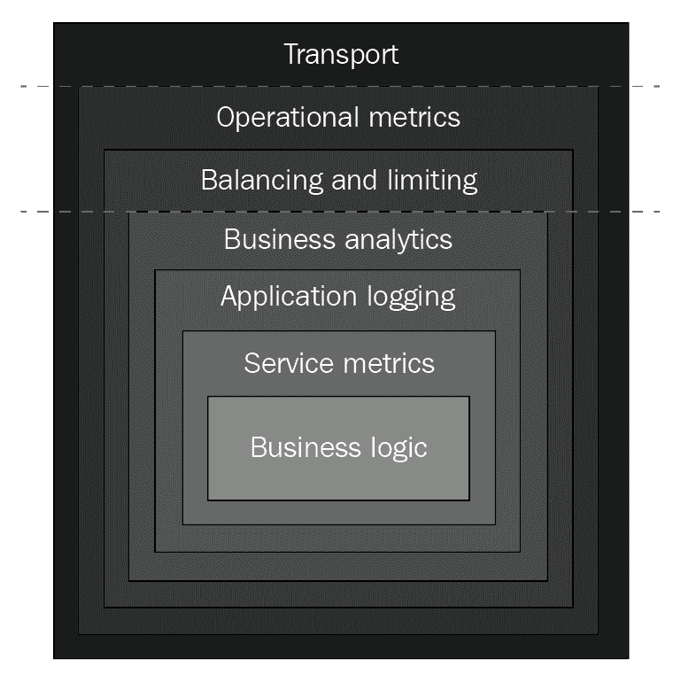

# Delinkcious - 示例应用程序

Delinkcious 是 Delicious（[`en.wikipedia.org/wiki/Delicious_(website)`](https://en.wikipedia.org/wiki/Delicious_(website)）的模仿者。Delicious 曾经是一个管理用户链接的互联网热门网站。它被雅虎收购，然后被转手多次。最终被 Pinboard 收购，后者运行类似的服务，并打算很快关闭 Delicious。

Delinkcious 允许用户将 URL 存储在网络上的酷炫位置，对其进行标记，并以各种方式查询它们。在本书中，Delinkcious 将作为一个实时实验室，演示许多微服务和 Kubernetes 概念，以及在真实应用程序环境中的功能。重点将放在后端，因此不会有时髦的前端 Web 应用程序或移动应用程序。我会把它们留给你作为可怕的练习。

在本章中，我们将了解为什么我选择 Go 作为 Delinkcious 的编程语言，然后看看**Go kit** - 一个我将用来构建 Delinkcious 的优秀的 Go 微服务工具包。然后，我们将使用社交图服务作为一个运行示例，剖析 Delinkcious 本身的不同方面。

我们将涵盖以下主题：

+   Delinkcious 微服务

+   Delinkcious 数据存储

+   Delinkcious API

+   Delinkcious 客户端库

# 技术要求

如果您迄今为止已经跟着本书走过，那么您已经安装了 Go。我建议安装一个好的 Go IDE 来跟随本章的代码，因为需要大量的学习。让我们看看几个不错的选择。

# Visual Studio Code

**Visual Studio Code**，也称为**VS Code**（[`code.visualstudio.com/docs/languages/go`](https://code.visualstudio.com/docs/languages/go)），是微软的开源 IDE。它不是专门针对 Go 的，但通过专门和复杂的 Go 扩展，与 Go 有深度集成。它被认为是最好的免费 Go IDE。

# GoLand

JetBrains 的 GoLand（[`www.jetbrains.com/go/`](https://www.jetbrains.com/go/)）是我个人最喜欢的。它遵循了 IntelliJ IDEA、PyCharm 和其他优秀 IDE 的优良传统。这是一个付费版本，有 30 天的免费试用期。不幸的是，没有社区版。如果您有能力，我强烈推荐它。如果您不能或不想为 IDE 付费（完全合理），请查看其他选项。

# LiteIDE

LiteIDE 或 LiteIDE X ([`github.com/visualfc/liteide`](https://github.com/visualfc/liteide))是一个非常有趣的开源项目。它是最早的 Go IDE 之一，早于 GoLand 和 VS Code 的 Go 扩展。我在早期使用过它，并对其质量感到惊讶。最终我放弃了它，因为使用 GNU Project Debugger（GDB）进行交互式调试时遇到了困难。它正在积极开发，有很多贡献者，并支持所有最新和最伟大的 Go 功能，包括 Go 1.1 和 Go 模块。现在您可以使用 Delve 进行调试，这是最好的 Go 调试器。

# 其他选项

如果您是一个死忠的命令行用户，根本不喜欢 IDE，您有可用的选项。大多数编程和文本编辑器都有某种形式的 Go 支持。Go 维基（[`github.com/golang/go/wiki/IDEsAndTextEditorPlugins`](https://github.com/golang/go/wiki/IDEsAndTextEditorPlugins)）有一个大列表的 IDE 和文本编辑器插件，所以去看看吧。

# 代码

在本章中，没有代码文件，因为您只会了解 Delinkcious 应用程序：

+   它托管在自己的 GitHub 存储库中，可以在以下位置找到：[`github.com/the-gigi/delinkcious`](https://github.com/the-gigi/delinkcious)。

+   查看**v0.1**标签 | 发布：[`github.com/the-gigi/delinkcious/releases/tag/v0.1`](https://github.com/the-gigi/delinkcious/releases/tag/v0.1)。

+   克隆它并使用您喜欢的 IDE 或文本编辑器进行跟进。

+   请记住，本书的一般代码示例在另一个 GitHub 存储库中：[`github.com/PacktPublishing/Hands-On-Microservices-with-Kubernetes/`](https://github.com/PacktPublishing/Hands-On-Microservices-with-Kubernetes/)。

# 选择 Go 用于 Delinkcious

我用许多优秀的语言编写并发布了生产后端代码，如 C/C++、Python、C#，当然还有 Go。我也使用了一些不那么好的语言，但让我们不讨论这些。我决定使用 Go 作为 Delinkcious 的编程语言，因为它是微服务的绝佳语言：

+   Go 编译为单个二进制文件，没有外部依赖（对于简单的 Dockerfile 非常棒）。

+   Go 非常易读和易学。

+   Go 对网络编程和并发有很好的支持。

+   Go 是许多云原生数据存储、队列和框架（包括 Docker 和 Kubernetes）的实现语言。

你可能会说微服务应该是语言无关的，我不应该专注于一种语言。这是真的，但我的目标是在这本书中非常实际，并深入研究在 Kubernetes 上构建微服务的所有细节。为了做到这一点，我不得不做出具体的选择并坚持下去。试图在多种语言中达到相同的深度是徒劳的。也就是说，微服务的边界非常清晰（这是微服务的一个优点），你可以看到在另一种语言中实现微服务将对系统的其余部分造成一些问题。

# 了解 Go kit

您可以从头开始编写您的微服务（使用 Go 或任何其他语言），它们将通过它们的 API 很好地相互交互。然而，在现实世界的系统中，将有大量的共享和/或交叉关注点，您希望它们保持一致：

+   配置

+   秘密管理

+   中央日志记录

+   指标

+   认证

+   授权

+   安全

+   分布式跟踪

+   服务发现

实际上，在大多数大型生产系统中，微服务需要遵守特定的政策。

使用 Go kit（[`gokit.io/`](https://gokit.io/)）。Go kit 对微服务空间采取了非常模块化的方法。它提供了高度的关注点分离，这是构建微服务的推荐方法，以及很大的灵活性。正如网站所说，*少数意见，轻松持有*。

# 使用 Go kit 构建微服务

Go kit 关注的是最佳实践。您的业务逻辑是作为纯 Go 库实现的，它只处理接口和 Go 结构。所有涉及 API、序列化、路由和网络的复杂方面都将被分别放置在明确分离的层中，这些层利用了 Go kit 的概念和基础设施，如传输、端点和服务。这使得开发体验非常好，您可以在最简单的环境中演变和测试应用代码。这是 Delinkcious 服务之一-社交图的接口。请注意，它是纯 Go 的。没有 API、微服务，甚至没有 Go kit 的导入：

```
type SocialGraphManager interface {
   Follow(followed string, follower string) error
   Unfollow(followed string, follower string) error

   GetFollowing(username string) (map[string]bool, error)
   GetFollowers(username string) (map[string]bool, error)
}
```

这个接口的实现位于一个 Go 包中，它完全不知道 Go kit 甚至不知道它被用在微服务中：

```
package social_graph_manager

import (
   "errors"
   om "github.com/the-gigi/delinkcious/pkg/object_model"
)

type SocialGraphManager struct {
   store om.SocialGraphManager
}

func (m *SocialGraphManager) Follow(followed string, follower string) (err error) {
    ...
}

func (m *SocialGraphManager) Unfollow(followed string, follower string) (err error) {
    ...
}

func (m *SocialGraphManager) GetFollowing(username string) (map[string]bool, error) {
    ...
}

func (m *SocialGraphManager) GetFollowers(username string) (map[string]bool, error) {
    ...
}
```

将 Go kit 服务视为一个具有不同层的洋葱是一个很好的思路。核心是您的业务逻辑，上面叠加了各种关注点，如路由、速率限制、日志记录和度量标准，最终通过传输暴露给其他服务或全球：



Go kit 主要通过使用请求-响应模型支持 RPC 风格的通信。

# 理解传输

微服务最大的问题之一是它们通过网络相互交互和与客户端交互；换句话说，至少比在同一进程内调用方法复杂一个数量级。Go kit 通过传输概念明确支持微服务的网络方面。

Go kit 传输封装了所有复杂性，并与其他 Go kit 构造集成，如请求、响应和端点。Go kit 官方支持以下传输方式：

+   HTTP

+   gRPC

+   Thrift

+   net/rpc

但是，在其 GitHub 存储库中还有几种传输方式，包括用于消息队列和发布/订阅的 AMQP 和 NATS 传输。Go kit 传输的一个很酷的功能是，您可以在不更改代码的情况下通过多种传输方式公开相同的服务。

# 理解端点

Go kit 微服务实际上只是一组端点。每个端点对应于您服务接口中的一个方法。端点始终与至少一个传输和一个处理程序相关联，您实现该处理程序以处理请求。Go kit 端点支持 RPC 通信风格，并具有请求和响应结构。

这是`Follow()`方法端点的工厂函数：

```
func makeFollowEndpoint(svc om.SocialGraphManager) endpoint.Endpoint {
   return func(_ context.Context, request interface{}) (interface{}, error) {
      req := request.(followRequest)
      err := svc.Follow(req.Followed, req.Follower)
      res := followResponse{}
      if err != nil {
         res.Err = err.Error()
      }
      return res, nil
   }
}
```

我将很快解释这里发生了什么。现在，只需注意它接受`om.SocialGraphManager`类型的`svc`参数，这是一个接口，并调用其`Follow()`方法。

# 理解服务

这是您的代码插入系统的地方。当调用端点时，它会调用您的服务实现中的相应方法来完成所有工作。端点包装器会完成请求和响应的编码和解码工作。您可以使用最合理的抽象来专注于应用逻辑。

这是`SocialGraphManager`函数的`Follow()`方法的实现：

```
func (m *SocialGraphManager) Follow(followed string, follower string) (err error) {
   if followed == "" || follower == "" {
      err = errors.New("followed and follower can't be empty")
      return
   }

   return m.store.Follow(followed, follower)
}
```

# 理解中间件

正如前面的洋葱图所示，Go kit 是可组合的。除了必需的传输、端点和服务之外，Go kit 还使用装饰器模式可选择地包装服务和端点，以处理横切关注点，例如以下内容：

+   弹性（例如，带有指数回退的重试）

+   身份验证和授权

+   日志记录

+   度量收集

+   分布式跟踪

+   服务发现

+   速率限制

这种以固定核心为基础的方法，使用少量的抽象，如传输、端点和服务，可以通过统一的中间件机制进行扩展，易于理解和使用。Go kit 在为中间件提供足够的内置功能和留出空间以满足您的需求之间取得了平衡。例如，在 Kubernetes 上运行时，服务发现已经为您处理了。很棒的是，在这种情况下你不必绕过 Go kit。您不绝对需要的功能和能力是可选的。

# 理解客户端

在第二章中，*开始使用微服务*，我们讨论了微服务的客户端库原则。一个微服务与另一个微服务交流时，理想情况下会利用通过接口公开的客户端库。Go kit 为编写这种客户端库提供了出色的支持和指导。使用微服务只需接收一个接口。它实际上对于它正在与另一个服务交流这一事实是完全不可知的。在（几乎）所有意图和目的上，远程服务可能正在同一个进程中运行。这对于测试或重构服务并将稍微过大的服务拆分为两个独立服务非常有用。

Go kit 具有类似于服务端点的客户端端点，但工作方向相反。服务端点解码请求，委托工作给服务，并编码响应。客户端端点编码请求，在网络上调用远程服务，并解码响应。

以下是客户端的`Follow()`方法的样子：

```
func (s EndpointSet) Follow(followed string, follower string) (err error) {
   resp, err := s.FollowEndpoint(context.Background(), FollowRequest{Followed: followed, Follower: follower})
   if err != nil {
      return err
   }
   response := resp.(SimpleResponse)

   if response.Err != "" {
      err = errors.New(response.Err)
   }
   return
}
```

# 生成样板

Go kit 的清晰关注点分离和整洁的架构分层是有代价的。代价是大量乏味、令人昏昏欲睡和容易出错的样板代码，用于在不同结构和方法签名之间转换请求和响应。了解 Go kit 如何以通用方式支持强类型接口是有用的，但对于大型项目，首选解决方案是从 Go 接口和数据类型生成所有样板。有几个项目可以完成这项任务，包括 Go kit 本身正在开发的一个名为**kitgen**的项目（[`github.com/go-kit/kit/tree/master/cmd/kitgen`](https://github.com/go-kit/kit/tree/master/cmd/kitgen)）。

目前它被认为是实验性的。我非常喜欢代码生成，并强烈推荐它。然而，在接下来的章节中，我们将看到大量手动样板代码，以清楚地说明发生了什么，并避免任何魔法。

# 介绍 Delinkcious 目录结构

在初始开发阶段，Delinkcious 系统由三个服务组成：

+   链接服务

+   用户服务

+   社交图服务

高级目录结构包括以下子目录：

+   `cmd`

+   `pkg`

+   `svc`

`root`目录还包括一些常见文件，如`README.md`和重要的`go.mod`和`go.sum`文件，以支持 Go 模块。我在这里使用 monorepo 方法，因此整个 Delinkcious 系统将驻留在这个目录结构中，并被视为单个 Go 模块，尽管有许多包：

```
$ tree -L 1
.
├── LICENSE
├── README.md
├── go.mod
├── go.sum
├── cmd
├── pkg
└── svc
```

# cmd 子目录

`cmd`子目录包含各种工具和命令，以支持开发和运营，以及涉及多个参与者、服务或外部依赖的端到端测试；例如，通过其客户端库测试微服务。

目前，它只包含了社交图服务的单个端到端测试：

```
$ tree cmd
cmd
└── social_graph_service_e2e
 └── social_graph_service_e2e.go
```

# pkg 子目录

`pkg`子目录是所有包的所在地。它包括微服务的实现，客户端库，抽象对象模型，其他支持包和单元测试。大部分代码以 Go 包的形式存在，这些包在实际微服务之前很容易开发和测试：

```
$ tree pkg
pkg
├── link_manager
│   ├── abstract_link_store.go
│   ├── db_link_store.go
│   ├── db_link_store_test.go
│   ├── in_memory_link_store.go
│   ├── link_manager.go
│   └── link_manager_suite_test.go
├── link_manager_client
│   └── client.go
├── object_model
│   ├── README.md
│   ├── interfaces.go
│   └── types.go
├── social_graph_client
│   ├── client.go
│   └── endpoints.go
├── social_graph_manager
│   ├── db_scoial_graph_store.go
│   ├── db_social_graph_manager_test.go
│   ├── in_memory_social_graph_manager_test.go
│   ├── in_memory_social_graph_store.go
│   ├── social_graph_manager.go
│   └── social_graph_manager_suite_test.go
└── user_manager
 ├── db_user_manager_test.go
 ├── db_user_store.go
 ├── in_memory_user_manager.go
 ├── in_memory_user_manager_test.go
 ├── in_memory_user_store.go
 └── user_manager_suite_test.go
```

# svc 子目录

`svc`子目录是 Delinkcious 微服务的所在地。每个微服务都是一个独立的二进制文件，有自己的主包。`delinkcious_service`是一个遵循 API 网关模式的公共服务（[`microservices.io/patterns/apigateway.html`](https://microservices.io/patterns/apigateway.html)）：

```
$ tree svc
svc
├── delinkcious_service
│   └── README.md
├── link_service
│   ├── link_service.go
│   └── transport.go
├── social_graph_service
│   ├── social_graph_service.go
│   └── transport.go
└── user_service
 ├── transport.go
 └── user_service.go
```

# 介绍 Delinkcious 微服务

让我们详细检查 Delinkcious 服务，并逐步分析。我们将从内部开始，从服务层开始，一直到传输层。

有三种不同的服务：

+   链接服务

+   用户服务

+   社交图服务

它们共同合作，提供 Delinkcious 的功能，即为用户管理链接并跟踪他们的社交图（关注/粉丝关系）。

# 对象模型

对象模型是所有接口和相关数据类型的集合，由服务实现。我选择把它们都放在一个包里：`github.com/the-gigi/delinkcious/pkg/object_model`。它包含两个文件：`interfaces.go`和`types.go`。

`interfaces.go`文件包含了三个 Delinkcious 服务的接口：

```
package object_model

type LinkManager interface {
   GetLinks(request GetLinksRequest) (GetLinksResult, error)
   AddLink(request AddLinkRequest) error
   UpdateLink(request UpdateLinkRequest) error
   DeleteLink(username string, url string) error
}

type UserManager interface {
   Register(user User) error
   Login(username string, authToken string) (session string, err error)
   Logout(username string, session string) error
}

type SocialGraphManager interface {
   Follow(followed string, follower string) error
   Unfollow(followed string, follower string) error

   GetFollowing(username string) (map[string]bool, error)
   GetFollowers(username string) (map[string]bool, error)
}

type LinkManagerEvents interface {
   OnLinkAdded(username string, link *Link)
   OnLinkUpdated(username string, link *Link)
   OnLinkDeleted(username string, url string)
}
```

`types.go`文件包含了在各种接口方法的签名中使用的结构体：

```
package object_model

import "time"

type Link struct {
   Url         string
   Title       string
   Description string
   Tags        map[string]bool
   CreatedAt   time.Time
   UpdatedAt   time.Time
}

type GetLinksRequest struct {
   UrlRegex         string
   TitleRegex       string
   DescriptionRegex string
   Username         string
   Tag              string
   StartToken       string
}

type GetLinksResult struct {
   Links         []Link
   NextPageToken string
}

type AddLinkRequest struct {
   Url         string
   Title       string
   Description string
   Username    string
   Tags        map[string]bool
}

type UpdateLinkRequest struct {
   Url         string
   Title       string
   Description string
   Username    string
   AddTags     map[string]bool
   RemoveTags  map[string]bool
}

type User struct {
   Email string
   Name  string
}
```

`object_model`包只是使用基本的 Go 类型、标准库类型（`time.Time`）和用户定义的类型来表示 Delinkcious 领域。这都是纯粹的 Go。在这个层次上，没有网络、API、微服务或 Go kit 的依赖或意识。

# 服务实现

下一层是将服务接口实现为简单的 Go 包。在这一点上，每个服务都有自己的包：

+   `github.com/the-gigi/delinkcious/pkg/link_manager`

+   `github.com/the-gigi/delinkcious/pkg/user_manager`

+   `github.com/the-gigi/delinkcious/pkg/social_graph_manager`

请注意，这些是 Go 包名，而不是 URL。

让我们详细检查`social_graph_manager`包。它将`object_model`包导入为`om`，因为它需要实现`om.SocialGraphManager`接口。它定义了一个名为`SocialGraphManager`的`struct`，其中有一个名为`store`的字段，类型为`om.SocialGraphManager`。因此，在这种情况下，`store`字段的接口与管理器的接口是相同的：

```
package social_graph_manager

import (
   "errors"
   om "github.com/the-gigi/delinkcious/pkg/object_model"
)

type SocialGraphManager struct {
   store om.SocialGraphManager
}
```

这可能有点令人困惑。想法是`store`字段实现相同的接口，以便顶级管理器可以实现一些验证逻辑并将繁重的工作委托给存储。您很快就会看到这一点。

此外，`store`字段是一个接口的事实允许我们使用实现相同接口的不同存储。这非常有用。`NewSocialGraphManager()`函数接受一个`store`字段，该字段不能为`nil`，然后返回一个提供的存储的新的`SocialGraphManager`实例。

```
func NewSocialGraphManager(store om.SocialGraphManager) (om.SocialGraphManager, error) {
   if store == nil {
      return nil, errors.New("store can't be nil")
   }
   return &SocialGraphManager{store: store}, nil
}
```

`SocialGraphManager`结构本身非常简单。它执行一些有效性检查，然后将工作委托给它的`store`：

```
func (m *SocialGraphManager) Follow(followed string, follower string) (err error) {
   if followed == "" || follower == "" {
      err = errors.New("followed and follower can't be empty")
      return
   }

   return m.store.Follow(followed, follower)
}

func (m *SocialGraphManager) Unfollow(followed string, follower string) (err error) {
   if followed == "" || follower == "" {
      err = errors.New("followed and follower can't be empty")
      return
   }

   return m.store.Unfollow(followed, follower)
}

func (m *SocialGraphManager) GetFollowing(username string) (map[string]bool, error) {
   return m.store.GetFollowing(username)
}

func (m *SocialGraphManager) GetFollowers(username string) (map[string]bool, error) {
   return m.store.GetFollowers(username)
}
```

社交图管理器是一个非常简单的库。让我们继续剥离洋葱，看看服务本身，它位于`svc`子目录下：[`github.com/the-gigi/delinkcious/tree/master/svc/social_graph_service`](https://github.com/the-gigi/delinkcious/tree/master/svc/social_graph_service)。

让我们从`social_graph_service.go`文件开始。我们将介绍大多数服务相似的主要部分。该文件位于`service`包中，这是我使用的一个约定。它导入了几个重要的包：

```
package service

import (
   httptransport "github.com/go-kit/kit/transport/http"
   "github.com/gorilla/mux"
   sgm "github.com/the-gigi/delinkcious/pkg/social_graph_manager"
   "log"
   "net/http"
)
```

Go kit `http`传输包对于使用 HTTP 传输的服务是必需的。`gorilla/mux`包提供了一流的路由功能。`social_graph_manager`是执行所有繁重工作的服务的实现。`log`包用于记录日志，`net/http`包用于提供 HTTP 服务，因为它是一个 HTTP 服务。

只有一个名为`Run()`的函数。它首先创建一个社交图管理器的数据存储，然后创建社交图管理器本身，并将`store`字段传递给它。因此，`social_graph_manager`的功能是在包中实现的，但`service`负责做出策略决策并传递配置好的数据存储。如果在这一点上出了任何问题，服务将通过`log.Fatal()`调用退出，因为在这个早期阶段没有办法恢复。

```
func Run() {
   store, err := sgm.NewDbSocialGraphStore("localhost", 5432, "postgres", "postgres")
   if err != nil {
      log.Fatal(err)
   }
   svc, err := sgm.NewSocialGraphManager(store)
   if err != nil {
      log.Fatal(err)
   }
```

接下来是为每个端点构建处理程序的部分。这是通过调用 HTTP 传输的`NewServer()`函数来完成的。参数是`Endpoint`工厂函数（我们很快将对其进行审查）、请求解码器函数和`response`编码器函数。对于 HTTP 服务，通常将请求和响应编码为 JSON。

```
followHandler := httptransport.NewServer(
   makeFollowEndpoint(svc),
   decodeFollowRequest,
   encodeResponse,
)

unfollowHandler := httptransport.NewServer(
   makeUnfollowEndpoint(svc),
   decodeUnfollowRequest,
   encodeResponse,
)

getFollowingHandler := httptransport.NewServer(
   makeGetFollowingEndpoint(svc),
   decodeGetFollowingRequest,
   encodeResponse,
)

getFollowersHandler := httptransport.NewServer(
   makeGetFollowersEndpoint(svc),
   decodeGetFollowersRequest,
   encodeResponse,
)
```

此时，我们已经正确初始化了`SocialGraphManager`并且为所有端点准备好了处理程序。现在是时候通过`gorilla`路由器向世界公开它们了。每个端点都与一个路由和一个方法相关联。在这种情况下，`follow`和`unfollow`操作使用 POST 方法，`following`和`followers`操作使用 GET 方法：

```
r := mux.NewRouter()
r.Methods("POST").Path("/follow").Handler(followHandler)
r.Methods("POST").Path("/unfollow").Handler(unfollowHandler)
r.Methods("GET").Path("/following/{username}").Handler(getFollowingHandler)
r.Methods("GET").Path("/followers/{username}").Handler(getFollowersHandler)
```

最后一部分只是将配置好的路由器传递给标准 HTTP 包的`ListenAndServe()`方法。该服务硬编码为监听端口`9090`。在本书的后面，我们将看到如何以灵活和更具产业实力的方式配置这些东西：

```
log.Println("Listening on port 9090...")
log.Fatal(http.ListenAndServe(":9090", r))
```

# 实现支持函数

你可能还记得，`pkg/social_graph_manager`包中的社交图实现完全与传输无关。它根据 Go 实现`SocialGraphManager`接口，不管负载是 JSON 还是 protobuf，以及通过 HTTP、gRPC、Thrift 或任何其他方法传输。服务负责翻译、编码和解码。这些支持函数在`transport.go`文件中实现。

对于每个端点，都有三个函数，它们是 Go kit 的 HTTP 传输`NewServer()`函数的输入：

+   `Endpoint`工厂函数

+   `request`解码器

+   `response`编码器

让我们从`Endpoint`工厂函数开始，这是最有趣的部分。让我们以`GetFollowing()`操作为例。`makeGetFollowingEndpoint()`函数以`SocialGraphManager`接口作为输入（如你之前看到的，在实践中，它将是`pkg/social_graph_manager`中的实现）。它返回一个通用的`endpoint.Endpoint`函数，这是一个接受`Context`和通用`request`并返回通用`response`和`error`的函数：

```
type Endpoint func(ctx context.Context, request interface{}) (response interface{}, err error)
```

`makeGetFollowingEndpoint()`方法的工作是返回一个符合这个签名的函数。它返回这样一个函数，在其实现中，接受通用请求（空接口）和类型，然后将其断言为具体的请求，即`getByUsernameRequest`：

```
req := request.(getByUsernameRequest)
```

这是一个关键概念。我们从一个通用对象跨越边界，这个对象可以是任何东西，到一个强类型的结构体。这确保了，即使 Go kit 端点是以空接口的形式操作，我们的微服务的实现也经过了类型检查。如果请求不包含正确的字段，它会引发 panic。我也可以检查是否可能进行类型断言，而不是引发 panic，这在某些情况下可能更合适：

```
req, ok := request.(getByUsernameRequest)
if !ok {
   ...
}
```

让我们来看看请求本身。它只是一个带有一个名为`Username`的字符串字段的结构体。它有 JSON 结构标签，在这种情况下是可选的，因为 JSON 包可以通过大小写的不同来自动处理与实际 JSON 不同的字段名（例如`Username`与`username`）：

```
type getByUsernameRequest struct {
   Username string `json:"username"`
}
```

请注意，请求类型是`getByUsernameRequest`而不是`getFollowingRequest`，这可能与您期望的一致，以支持它正在支持的操作。原因是我实际上在多个端点上使用相同的请求。`GetFollowers()`操作也需要一个`username`，而`getByUsernameRequest`同时为`GetFollowing()`和`GetFollowers()`提供服务。

此时，我们从请求中得到了用户名，我们可以调用底层实现的`GetFollowing()`方法：

```
followingMap, err := svc.GetFollowing(req.Username)
```

结果是请求用户正在关注的用户的映射和标准错误。但是，这是一个 HTTP 端点，所以下一步是将这些信息打包到`getFollowingResponse`结构体中：

```
type getFollowingResponse struct {
   Following map[string]bool `json:"following"`
   Err       string          `json:"err"`
}
```

以下映射可以转换为`string->bool`的 JSON 映射。然而，Go 错误接口没有直接的等价物。解决方案是将错误编码为字符串（通过`err.Error()`），其中空字符串表示没有错误：

```
res := getFollowingResponse{Following: followingMap}
if err != nil {
   res.Err = err.Error()
}
```

这是整个函数：

```
func makeGetFollowingEndpoint(svc om.SocialGraphManager) endpoint.Endpoint {
   return func(_ context.Context, request interface{}) (interface{}, error) {
      req := request.(getByUsernameRequest)
      followingMap, err := svc.GetFollowing(req.Username)
      res := getFollowingResponse{Following: followingMap}
      if err != nil {
         res.Err = err.Error()
      }
      return res, nil
   }
}
```

现在，让我们来看看`decodeGetFollowingRequest()`函数。它接受标准的`http.Request`对象。它需要从请求中提取用户名，并返回一个`getByUsernameRequest`结构体，以便端点稍后可以使用。在 HTTP 请求级别，用户名将成为请求路径的一部分。该函数将解析路径，提取用户名，准备请求，并返回请求或错误（例如，未提供用户名）：

```
func decodeGetFollowingRequest(_ context.Context, r *http.Request) (interface{}, error) {
   parts := strings.Split(r.URL.Path, "/")
   username := parts[len(parts)-1]
   if username == "" || username == "following" {
      return nil, errors.New("user name must not be empty")
   }
   request := getByUsernameRequest{Username: username}
   return request, nil
```

最后一个支持函数是`encodeResonse()`函数。理论上，每个端点都可以有自己的自定义`response`编码函数。但在这种情况下，我使用了一个通用函数，它知道如何将所有响应编码为 JSON：

```
func encodeResponse(_ context.Context, w http.ResponseWriter, response interface{}) error {
   return json.NewEncoder(w).Encode(response)
}
```

这需要所有响应结构都可以被 JSON 序列化，这是通过将 Go 错误接口转换为端点实现的字符串来处理的。

# 通过客户端库调用 API。

社交图管理器现在可以通过 HTTP REST API 访问。这是一个快速的本地演示。首先，我将启动 Postgres DB（我有一个名为`postgres`的 Docker 镜像），它用作数据存储，然后我将在`service`目录中运行服务本身，即`delinkcious/svc/social_graph_service`：

```
$ docker restart postgres
$ go run main.go

2018/12/31 10:41:23 Listening on port 9090...
```

通过调用`/follow`端点来添加一些关注/被关注的关系。我将使用出色的 HTTPie（[`httpie.org/`](https://httpie.org/)），在我看来，这是一个更好的`curl`。但是，如果你喜欢，你也可以使用`curl`：

```
$ http POST http://localhost:9090/follow followed=liat follower=gigi
HTTP/1.1 200 OK
Content-Length: 11
Content-Type: text/plain; charset=utf-8
Date: Mon, 31 Dec 2018 09:19:01 GMT

{
 "err": ""
}

$ http POST http://localhost:9090/follow followed=guy follower=gigi
HTTP/1.1 200 OK
Content-Length: 11
Content-Type: text/plain; charset=utf-8
Date: Mon, 31 Dec 2018 09:19:01 GMT

{
 "err": ""
}
```

这两个调用使`gigi`用户关注`liat`和`guy`用户。让我们使用`/following`端点来验证这一点：

```
$ http GET http://localhost:9090/following/gigi
HTTP/1.1 200 OK
Content-Length: 37
Content-Type: text/plain; charset=utf-8
Date: Mon, 31 Dec 2018 09:37:21 GMT

{
 "err": "",
 "following": {
 "guy": true
 "liat": true
 }
}
```

JSON 响应中有一个空错误，`following`映射包含了`guy`和`liat`用户，如预期的那样。

虽然 REST API 很酷，但我们可以做得更好。我们不应该强迫调用者理解我们服务的 URL 模式，并解码和编码 JSON 负载，为什么不提供一个客户端库来完成所有这些呢？这对于所有使用少量语言进行交流的内部微服务来说尤其如此，在许多情况下，甚至只有一种语言。服务和客户端可以共享相同的接口，甚至可能有一些共同的类型。此外，Go kit 提供了对客户端端点的支持，这些端点与服务端端点非常相似。这直接转化为一个非常简化的端到端开发者体验，你只需留在编程语言空间。所有端点、传输、编码和解码可以大部分时间保持隐藏，作为实现细节。

社交图服务提供了一个客户端库，位于`pkg/social_graph_client`包中。`client.go`文件类似于`social_graph_service.go`文件，负责在`NewClient()`函数中创建一组端点，并返回`SocialGraphManager`接口。`NewClient()`函数以基本 URL 作为参数，然后使用 Go kit 的 HTTP 传输的`NewClient()`函数构建一组客户端端点。每个端点都需要一个 URL、一个方法（在本例中为`GET`或`POST`）、一个`request`编码器和一个`response`解码器。它就像服务的镜像。然后，它将客户端端点分配给`EndpointSet`结构体，可以通过`SocialGraphManager`接口公开它们：

```
func NewClient(baseURL string) (om.SocialGraphManager, error) {
   // Quickly sanitize the instance string.
   if !strings.HasPrefix(baseURL, "http") {
      baseURL = "http://" + baseURL
   }
   u, err := url.Parse(baseURL)
   if err != nil {
      return nil, err
   }

   followEndpoint := httptransport.NewClient(
      "POST",
      copyURL(u, "/follow"),
      encodeHTTPGenericRequest,
      decodeSimpleResponse).Endpoint()

   unfollowEndpoint := httptransport.NewClient(
      "POST",
      copyURL(u, "/unfollow"),
      encodeHTTPGenericRequest,
      decodeSimpleResponse).Endpoint()

   getFollowingEndpoint := httptransport.NewClient(
      "GET",
      copyURL(u, "/following"),
      encodeGetByUsernameRequest,
      decodeGetFollowingResponse).Endpoint()

   getFollowersEndpoint := httptransport.NewClient(
      "GET",
      copyURL(u, "/followers"),
      encodeGetByUsernameRequest,
      decodeGetFollowersResponse).Endpoint()

   // Returning the EndpointSet as an interface relies on the
   // EndpointSet implementing the Service methods. That's just a simple bit
   // of glue code.
   return EndpointSet{
      FollowEndpoint:       followEndpoint,
      UnfollowEndpoint:     unfollowEndpoint,
      GetFollowingEndpoint: getFollowingEndpoint,
      GetFollowersEndpoint: getFollowersEndpoint,
   }, nil
}
```

`EndpointSet`结构体在`endpoints.go`文件中定义。它包含端点本身，这些端点是函数，并实现了`SocialGraphManager`方法，在其中将工作委托给端点的函数：

```
type EndpointSet struct {
   FollowEndpoint       endpoint.Endpoint
   UnfollowEndpoint     endpoint.Endpoint
   GetFollowingEndpoint endpoint.Endpoint
   GetFollowersEndpoint endpoint.Endpoint
}
```

让我们检查`EndpointSet`结构体的`GetFollowing()`方法。它接受用户名作为字符串，然后调用带有填充输入用户名的`getByUserNameRequest`的端点。如果调用端点函数返回错误，它就会退出。否则，它进行类型断言，将通用响应转换为`getFollowingResponse`结构体。如果其错误字符串不为空，它会从中创建一个 Go 错误。最终，它将响应中的关注用户作为映射返回：

```
func (s EndpointSet) GetFollowing(username string) (following map[string]bool, err error) {
   resp, err := s.GetFollowingEndpoint(context.Background(), getByUserNameRequest{Username: username})
   if err != nil {
      return
   }

   response := resp.(getFollowingResponse)
   if response.Err != "" {
      err = errors.New(response.Err)
   }
   following = response.Following
   return
}
```

# 存储数据

我们已经看到了 Go kit 和我们自己的代码如何接受带有 JSON 负载的 HTTP 请求，将其转换为 Go 结构，调用服务实现，并将响应编码为 JSON 返回给调用者。现在，让我们更深入地了解数据的持久存储。社交图管理器负责维护用户之间的关注/粉丝关系。有许多选项可用于存储此类数据，包括关系数据库、键值存储，当然还有图数据库，这可能是最自然的。在这个阶段，我选择使用关系数据库，因为它熟悉、可靠，并且可以很好地支持所需的操作：

+   关注

+   取消关注

+   获取关注者

+   获取以下

然而，如果我们后来发现我们更喜欢不同的数据存储或者扩展关系型数据库以添加一些缓存机制，那么很容易做到，因为社交图管理器的数据存储被隐藏在一个接口后面。它实际上使用的是同一个接口，即 `SocialGraphManager`。正如您可能记得的那样，社交图管理器包在其工厂函数中接受了一个 `SocialGraphManager` 类型的存储参数：

```
func NewSocialGraphManager(store om.SocialGraphManager) (om.SocialGraphManager, error) {
   if store == nil {
      return nil, errors.New("store can't be nil")
   }
   return &SocialGraphManager{store: store}, nil
}
```

由于社交图管理器通过这个接口与其数据存储进行交互，因此可以在不对社交图管理器本身进行任何代码更改的情况下进行更改实现。

我将利用这一点进行单元测试，其中我使用一个易于设置的内存数据存储，可以快速填充测试数据，并允许我在本地运行测试。

让我们来看看内存中的社交图数据存储，可以在[`github.com/the-gigi/delinkcious/blob/master/pkg/social_graph_manager/in_memory_social_graph_store.go`](https://github.com/the-gigi/delinkcious/blob/master/pkg/social_graph_manager/in_memory_social_graph_store.go)找到。

它几乎没有依赖关系 - 只有 `SocialGraphManager` 接口和标准错误包。它定义了一个 `SocialUser` 结构，其中包含用户名以及它正在关注的用户的名称，以及正在关注它的用户的名称：

```
package social_graph_manager

import (
   "errors"
   om "github.com/the-gigi/delinkcious/pkg/object_model"
)

type Followers map[string]bool
type Following map[string]bool

type SocialUser struct {
   Username  string
   Followers Followers
   Following Following
}

func NewSocialUser(username string) (user *SocialUser, err error) {
   if username == "" {
      err = errors.New("user name can't be empty")
      return
   }

   user = &SocialUser{Username: username, Followers: Followers{}, Following: Following{}}
   return
}
```

数据存储本身是一个名为 `InMemorySocialGraphStore` 的结构，其中包含用户名和相应的 `SocialUser` 结构之间的映射：

```
type SocialGraph map[string]*SocialUser

type InMemorySocialGraphStore struct {
   socialGraph SocialGraph
}

func NewInMemorySocialGraphStore() om.SocialGraphManager {
   return &InMemorySocialGraphStore{
      socialGraph: SocialGraph{},
   }
}
```

这都是相当普通的。`InMemorySocialGraphStore` 结构实现了 `SocialGraphManager` 接口方法。例如，这是 `Follow()` 方法：

```
func (m *InMemorySocialGraphStore) Follow(followed string, follower string) (err error) {
   followedUser := m.socialGraph[followed]
   if followedUser == nil {
      followedUser, _ = NewSocialUser(followed)
      m.socialGraph[followed] = followedUser
   }

   if followedUser.Followers[follower] {
      return errors.New("already following")
   }

   followedUser.Followers[follower] = true

   followerUser := m.socialGraph[follower]
   if followerUser == nil {
      followerUser, _ = NewSocialUser(follower)
      m.socialGraph[follower] = followerUser
   }

   followerUser.Following[followed] = true

   return
```

此时，没有必要过多关注它的工作原理。我想要传达的主要观点是，通过使用接口作为抽象，您可以获得很大的灵活性和清晰的关注点分离，这在您想要在测试期间开发系统或服务的特定部分时非常有帮助。如果您想要进行重大更改，比如更改底层数据存储或可互换使用多个数据存储，那么拥有一个接口是一个救命稻草。

# 总结

在本章中，您仔细了解了 Go kit 工具包，整个 Delinkcious 系统及其微服务，并深入研究了 Delinkcious 的社交图组件。本章的主题是，Go kit 提供了清晰的抽象，如服务、端点和传输，以及用于将微服务分层的通用功能。然后，您可以为松散耦合但内聚的微服务系统添加代码。您还跟随了来自客户端的请求的路径，一直到服务，然后通过所有层返回。在这一点上，您应该对 Go kit 如何塑造 Delinkcious 架构以及它如何使任何其他系统受益有一个大致的了解。您可能会对所有这些信息感到有些不知所措，但请记住，这种复杂性被整齐地打包了起来，您大部分时间可以忽略它，专注于您的应用程序，并获得好处。

在下一章中，我们将讨论任何现代基于微服务的系统中非常关键的部分 - CI/CD 流水线。我们将创建一个 Kubernetes 集群，配置 CircleCI，部署 Argo CD 持续交付解决方案，并了解如何在 Kubernetes 上部署 Delinkcious。

# 进一步阅读

让我们参考以下参考资料：

+   要了解更多关于 Go kit 的信息，请访问[`gokit.io/`](https://gokit.io/)。

+   为了更好地理解 Delinkcious 利用的 SOLID 设计原则，请查看[`en.wikipedia.org/wiki/SOLID`](https://en.wikipedia.org/wiki/SOLID)。
