# 设置 CI/CD 流水线

在基于微服务的系统中，有许多组成部分。Kubernetes 是一个提供了许多构建块的丰富平台。可靠和可预测地管理和部署所有这些组件需要高度的组织和自动化。这就是 CI/CD 流水线的作用。

在本章中，我们将了解 CI/CD 流水线解决的问题，介绍 Kubernetes 的 CI/CD 流水线的不同选项，并最终构建 Delinkcious 的 CI/CD 流水线。

在本章中，我们将讨论以下主题：

+   理解 CI/CD 流水线

+   Kubernetes CI/CD 流水线的选项

+   GitOps

+   自动化的 CI/CD

+   使用 CircleCI 构建您的镜像

+   为 Delinkcious 设置持续交付

# 技术要求

在本章中，您将使用 CircleCI 和 Argo CD。我将向您展示如何稍后在 Kubernetes 集群中安装 Argo CD。要免费设置 CircleCI，请按照它们网站上的*入门*说明[`circleci.com/docs/2.0/getting-started/`](https://circleci.com/docs/2.0/getting-started/)。

# 代码

本章的 Delinkcious 版本可以在[`github.com/the-gigi/delinkcious/releases/tag/v0.2`](https://github.com/the-gigi/delinkcious/releases/tag/v0.2)找到。

我们将在主要的 Delinkcious 代码库上工作，因此没有代码片段或示例。

# 理解 CI/CD 流水线

软件系统的开发生命周期从代码开始，经过测试，生成构件，更多测试，最终部署到生产环境。基本思想是，每当开发人员向其源代码控制系统（例如 GitHub）提交更改时，这些更改都会被**持续集成**（**CI**）系统检测到，并立即运行测试。

这通常会由同行进行审查，并将代码更改（或拉取请求）从特性分支或开发分支合并到主分支。在 Kubernetes 的上下文中，CI 系统还负责构建服务的 Docker 镜像并将其推送到镜像注册表。在这一点上，我们有包含新代码的 Docker 镜像。这就是 CD 系统的作用。

当新镜像可用时，**持续交付**（**CD**）系统将其部署到目标环境。CD 是确保整个系统处于期望状态的过程，通过配置和部署来实现。有时，如果系统不支持动态配置，部署可能会因配置更改而发生。我们将在第五章中详细讨论配置，*使用 Kubernetes 配置微服务*。

因此，CI/CD 流水线是一组工具，可以检测代码更改，并根据组织的流程和政策将其推送到生产环境。通常由 DevOps 工程师负责构建和维护此流水线，并且开发人员大量使用。

每个组织和公司（甚至同一公司内的不同团队）都会有一个特定的流程。在我第一份工作中，我的第一个任务是用许多人都不再理解的递归 makefile 替换基于 Perl 的构建系统（那时候 CI/CD 流水线被称为这样）。该构建系统必须在 Windows 上运行代码生成步骤，使用一些建模软件，在两种不同的 Unix 平台上（包括嵌入式平台）使用两种不同的工具链编译和运行 C++单元测试，并触发 open CVS。我选择了 Python，并不得不从头开始创建一切。

这很有趣，但非常特定于这家公司。通常认为 CI/CD 流水线是由事件驱动的一系列步骤的工作流程。

以下图表展示了一个简单的 CI/CD 流水线：

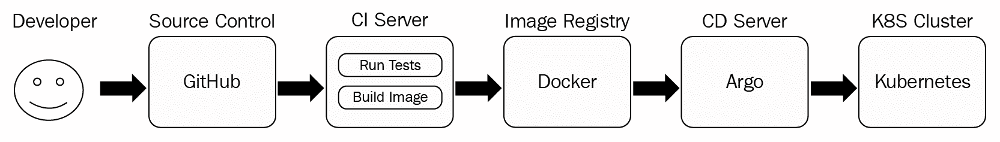

此流水线中的各个阶段的功能如下：

1.  开发人员将他们的更改提交到 GitHub（源代码控制）

1.  CI 服务器运行测试，构建 Docker 镜像，并将镜像推送到 DockerHub（镜像注册表）

1.  Argo CD 服务器检测到有新镜像可用，并部署到 Kubernetes 集群

现在我们已经了解了 CI/CD 流水线，让我们来看一下特定的 CI/CD 流水线选择。

# Delinkcious CI/CD 流水线的选项

为您的系统选择 CI/CD 流水线是一个重大决定。当我为 Delinkcious 面临这个决定时，我调查了几种替代方案。这里没有明显的选择。Kubernetes 发展迅速，工具和流程难以跟上。我评估了几种选择，并选择了 CircleCI 进行持续集成和 Argo CD 进行持续交付。我最初考虑了一个整个 CI/CD 流水线的一站式解决方案，但在审查了一些选项后，我决定更喜欢将它们视为两个单独的实体，并为 CI 和 CD 选择了不同的解决方案。让我们简要回顾一些这些选项（还有很多很多）：

+   Jenkins X

+   Spinnaker

+   Travis CI 和 CircleCI

+   Tekton

+   Argo CD

+   自己动手

# Jenkins X

Jenkins X 是我的首选和最喜欢的。我读了一些文章，看了一些演示，让我想要喜欢它。它提供了您想要的所有功能，包括一些高级功能：

+   自动化的 CI/CD

+   通过 GitOps 进行环境推广

+   拉取请求预览环境

+   对您的提交和拉取请求的自动反馈

在幕后，它利用了成熟但复杂的 Jenkins 产品。Jenkins X 的前提是它将掩盖 Jenkins 的复杂性，并提供一个特定于 Kubernetes 的简化工作流程。

当我尝试实际使用 Jenkins X 时，我对一些问题感到失望：

+   它不能直接使用，故障排除很复杂。

+   它非常主观。

+   它不很好地支持单一代码库方法（或根本不支持）。

我试图让它工作一段时间，但在阅读了其他人的经验并看到 Jenkins X 的 slack 社区频道缺乏响应后，我对 Jenkins X 失去了兴趣。我仍然喜欢这个想法，但在我再次尝试之前，它真的必须非常稳定。

# Spinnaker

Spinnaker 是 Netflix 的开源 CI/CD 解决方案。它有很多好处，包括以下：

+   它已被许多公司采用。

+   它与其他产品有很多集成。

+   它支持很多最佳实践。

Spinnaker 的缺点如下：

+   它是一个庞大而复杂的系统。

+   它有一个陡峭的学习曲线。

+   它不是特定于 Kubernetes 的。

最后，我决定放弃 Spinnaker——不是因为 Spinnaker 本身有任何问题，而是因为我对它没有经验。在开发 Delinkcious 本身和写这本书的过程中，我不想从头开始学习这样一个庞大的产品。你可能会发现 Spinnaker 对你来说是正确的 CI/CD 解决方案。

# Travis CI 和 CircleCI

我更喜欢将 CI 解决方案与 CD 解决方案分开。在概念上，CI 流程的作用是生成一个容器镜像并将其推送到注册表。它根本不需要了解 Kubernetes。另一方面，CD 解决方案必须对 Kubernetes 有所了解，并且理想情况下在集群内运行。

对于 CI，我考虑了 Travis CI 和 CircleCI。两者都为开源项目提供免费的 CI 服务。我选择了 CircleCI，因为它更具备功能完备，并且具有更好的用户界面，这很重要。我相信 Travis CI 也会很好用。我在其他一些开源项目中使用 Travis CI。重要的是要注意，流水线的 CI 部分完全与 Kubernetes 无关。最终结果是镜像仓库中的 Docker 镜像。这个 Docker 镜像可以用于其他目的，而不一定要部署在 Kubernetes 集群中。

# Tekton

Tekton 是一个非常有趣的项目。它是 Kubernetes 原生的，具有很好的步骤、任务、运行和流水线的抽象。它相对年轻，但似乎非常有前途。它还被选为 CD 基金会的首批项目之一：[`cd.foundation/projects/`](https://cd.foundation/projects/)。

看它如何发展将会很有趣。

Tekton 的优点如下：

+   现代设计和清晰的概念模型

+   得到 CD 基金会的支持。

+   建立在 prow 之上（Kubernetes 自身的 CI/CD 解决方案）

+   Kubernetes 原生解决方案

Tekton 的缺点如下：

+   它仍然相当新和不稳定。

+   它没有其他解决方案的所有功能和能力。

# Argo CD

与 CI 解决方案相反，CD 解决方案非常特定于 Kubernetes。我选择 Argo CD 有几个原因：

+   对 Kubernetes 有认识

+   建立在通用工作流引擎（Argo）之上

+   出色的用户界面

+   在您的 Kubernetes 集群上运行

+   用 Go 实现（并不是很重要，但我喜欢它）

Argo CD 也有一些缺点：

+   它不是 CD 基金会或 CNCF 的成员（在社区中认可度较低）。

+   Intuit 是其背后的主要公司，不是一个主要的云原生强大力量。

Argo CD 是一个来自 Intuit 的年轻项目，他们收购了 Argo 项目的原始开发人员- Applatix。我真的很喜欢它的架构，当我尝试过它时，一切都像魔术一样运行。

# 自己动手

我曾简要考虑过创建自己的简单 CI/CD 流水线。操作并不复杂。对于本书的目的，我并不需要一个非常可靠的解决方案，而且很容易解释每个步骤发生了什么。然而，考虑到读者，我决定最好使用现有的工具，这些工具可以直接利用，并且还可以节省我开发一个糟糕的 CI/CD 解决方案的时间。

此时，您应该对 Kubernetes 上的 CI/CD 解决方案有了一个很好的了解。我们审查了大多数流行的解决方案，并选择了 CircleCI 和 Argo CD 作为 Delinkcious CI/CD 解决方案的最佳选择。接下来，我们将讨论 GitOps 的热门新趋势。

# GitOps

GitOps 是一个新的时髦词汇，尽管概念并不是很新。这是*基础设施即代码*的另一种变体。基本思想是您的代码、配置和所需的资源都应该在一个源代码控制存储库中进行描述和存储，并进行版本控制。每当您向存储库推送更改时，您的 CI/CD 解决方案将做出响应并采取正确的操作。甚至可以通过在存储库中恢复到先前版本来启动回滚。当然，存储库不一定是 Git，但 GitOps 听起来比源代码控制运营好得多，大多数人都使用 Git，所以我们就在这里了。

CircleCI 和 Argo CD 都完全支持并倡导 GitOps 模型。当您`git push`代码更改时，CircleCI 将触发并开始构建正确的镜像。当您`git push`更改到 Kubernetes 清单时，Argo CD 将触发并将这些更改部署到您的 Kubernetes 集群。

现在我们清楚了 GitOps 是什么，我们可以开始为 Delinkcious 实施流水线的持续集成部分。我们将使用 CircleCI 从源代码构建 Docker 镜像。

# 使用 CircleCI 构建您的镜像

让我们深入研究 Delinkcious CI 流水线。我们将逐步介绍持续集成过程中的每个步骤，其中包括以下内容：

+   审查源代码树

+   配置 CI 流水线

+   理解构建脚本

+   使用多阶段 Dockerfile 对 Go 服务进行 Docker 化

+   探索 CircleCI 用户界面

# 审查源代码树

持续集成是关于构建和测试的东西。第一步是了解 Delinkcious 中需要构建和测试的内容。让我们再看一下 Delinkcious 源代码树：

```
$ tree -L 2
.
├── LICENSE
├── README.md
├── build.sh
├── cmd
│   ├── link_service_e2e
│   ├── social_graph_service_e2e
│   └── user_service_e2e
├── go.mod
├── go.sum
├── pkg
│   ├── db_util
│   ├── link_manager
│   ├── link_manager_client
│   ├── object_model
│   ├── social_graph_client
│   ├── social_graph_manager
│   ├── user_client
│   └── user_manager
└── svc
 ├── api_gateway_service
 ├── link_service
 ├── social_graph_service
 └── user_service
```

`pkg`目录包含服务和命令使用的包。我们应该运行这些包的单元测试。`svc`目录包含我们的微服务。我们应该构建这些服务，将每个服务打包到适当版本的 Docker 镜像中，并将这些镜像推送到 DockerHub（镜像注册表）。`cmd`目录目前包含端到端测试。这些测试旨在在本地运行，不需要由 CI 管道构建（如果您想将端到端测试添加到我们的测试流程中，可以更改这一点）。

# 配置 CI 管道

CircleCI 由一个标准名称和位置的单个 YAML 文件进行配置，即`<根目录>/.circleci/config.yaml`：

```
version: 2
jobs:
  build:
    docker:
    - image: circleci/golang:1.11
    - image: circleci/postgres:9.6-alpine
      environment: # environment variables for primary container
        POSTGRES_USER: postgres
    working_directory: /go/src/github.com/the-gigi/delinkcious
    steps:
    - checkout
    - run:
        name: Get all dependencies
        command: |
          go get -v ./...
          go get -u github.com/onsi/ginkgo/ginkgo
          go get -u github.com/onsi/gomega/...
    - run:
        name: Test everything
        command: ginkgo -r -race -failFast -progress
    - setup_remote_docker:
        docker_layer_caching: true
    - run:
        name: build and push Docker images
        shell: /bin/bash
        command: |
          chmod +x ./build.sh
          ./build.sh
```

让我们分开来理解发生了什么。第一部分指定了构建作业，下面是必要的 Docker 镜像（`golang`和`postgres`）及其环境。然后，我们有工作目录，`build`命令应该在其中执行：

```
version: 2
jobs:
 build:
 docker:
 - image: circleci/golang:1.11
 - image: circleci/postgres:9.6-alpine
      environment: # environment variables for primary container
        POSTGRES_USER: postgres
    working_directory: /go/src/github.com/the-gigi/delinkcious
```

下一部分是构建步骤。第一步只是检出。在 CircleCI UI 中，我将项目与 Delinkcious GitHub 存储库关联起来，以便它知道从哪里检出。如果存储库不是公共的，那么您还需要提供访问令牌。第二步是一个`run`命令，用于获取 Delinkcious 的所有 Go 依赖项：

```
steps:
- checkout
- run:
    name: Get all dependencies
    command: |
      go get -v ./...
      go get -u github.com/onsi/ginkgo/ginkgo
      go get -u github.com/onsi/gomega/...
```

我必须显式地`go get` `ginkgo`框架和`gomega`库，因为它们是使用 Golang 点符号导入的，这使它们对`go get ./...`不可见。

一旦我们有了所有的依赖，我们就可以运行测试。在这种情况下，我正在使用`ginkgo`测试框架：

```
- run:
    name: Test everything
    command: ginkgo -r -race -failFast -progress
```

下一部分是构建和推送 Docker 镜像的地方。由于它需要访问 Docker 守护程序，因此需要通过`setup_remote_docker`步骤进行特殊设置。`docker_layer_caching`选项用于通过重用先前的层使一切更高效和更快。实际的构建和推送由`build.sh`脚本处理，我们将在下一部分进行查看。请注意，我确保通过`chmod +x`是可执行的：

```
- setup_remote_docker:
    docker_layer_caching: true
- run:
    name: build and push Docker images
    shell: /bin/bash
    command: |
      chmod +x ./build.sh
      ./build.sh
```

我在这里只是浅尝辄止。CircleCI 还有更多功能，包括用于可重用配置、工作流、触发器和构件的 orbs。

# 理解 build.sh 脚本

`build.sh`脚本可在[`github.com/the-gigi/delinkcious/blob/master/build.sh`](https://github.com/the-gigi/delinkcious/blob/master/build.sh)找到。

让我们逐步检查它。我们将在这里遵循几个最佳实践。首先，最好在脚本中添加一个 shebang，其中包含将执行您的脚本的二进制文件的路径 - 也就是说，如果您知道它的位置。如果您尝试编写一个可以在许多不同平台上运行的跨平台脚本，您可能需要依赖路径或其他技术。`set -eo pipefail`将在任何出现问题时立即失败（即使在管道的中间）。

这在生产环境中是强烈推荐的：

```
#!/bin/bash

set -eo pipefail
```

接下来的几行只是为目录和 Docker 镜像的标记设置了一些变量。有两个标记：`STABLE_TAB`和`TAG`。`STABLE_TAG`标记具有主要版本和次要版本，并且在每次构建中不会更改。`TAG`包括 CircleCI 提供的`CIRCLE_BUILD_NUM`，并且在每次构建中递增。这意味着`TAG`始终是唯一的。这被认为是标记和版本化镜像的最佳实践：

```
IMAGE_PREFIX='g1g1'
STABLE_TAG='0.2'

TAG="${STABLE_TAG}.${CIRCLE_BUILD_NUM}"
ROOT_DIR="$(pwd)"
SVC_DIR="${ROOT_DIR}/svc"
```

接下来，我们进入`svc`目录，这是所有服务的父目录，并使用在 CircleCI 项目中设置的环境变量登录到 DockerHub。

```
cd $SVC_DIR
docker login -u $DOCKERHUB_USERNAME -p $DOCKERHUB_PASSWORD
```

现在，我们来到了主要事件。脚本遍历`svc`目录的所有子目录，寻找`Dockerfile`。如果找到`Dockerfile`，它会构建一个镜像，使用服务名称和`TAG`以及`STABLE_TAG`的组合对其进行标记，最后将标记的镜像推送到注册表：

```
cd "${SVC_DIR}/$svc"
    if [[ ! -f Dockerfile ]]; then
        continue
    fi
    UNTAGGED_IMAGE=$(echo "${IMAGE_PREFIX}/delinkcious-${svc}" | sed -e 's/_/-/g' -e 's/-service//g')
    STABLE_IMAGE="${UNTAGGED_IMAGE}:${STABLE_TAG}"
    IMAGE="${UNTAGGED_IMAGE}:${TAG}"
    docker build -t "$IMAGE" .
    docker tag "${IMAGE}" "${STABLE_IMAGE}"
    docker push "${IMAGE}"
    docker push "${STABLE_IMAGE}"
done
cd $ROOT_DIR
```

# 使用多阶段 Dockerfile 对 Go 服务进行 Docker 化

在微服务系统中构建的 Docker 镜像非常重要。您将构建许多镜像，并且每个镜像都会构建多次。这些镜像也会在网络上传输，并且它们是攻击者的目标。考虑到这一点，构建具有以下属性的镜像是有意义的：

+   轻量级

+   提供最小的攻击面

这可以通过使用适当的基础镜像来实现。例如，由于其小的占用空间，Alpine 非常受欢迎。然而，没有什么能比得上 scratch 基础镜像。对于基于 Go 的微服务，您可以创建一个只包含服务二进制文件的镜像。让我们继续剥离洋葱，看看其中一个服务的 Dockerfile。剧透警告：它们几乎完全相同，只是在服务名称方面有所不同。

你可以在[`github.com/the-gigi/delinkcious/blob/master/svc/link_service/Dockerfile`](https://github.com/the-gigi/delinkcious/blob/master/svc/link_service/Dockerfile)找到`link_service`的`Dockerfile`。

我们在这里使用了多阶段的`Dockerfile`。我们将使用标准的 Golang 镜像构建镜像。最后一行中的神秘魔法是构建一个真正静态和自包含的 Golang 二进制文件所需的内容，它不需要动态运行时库：

```
FROM golang:1.11 AS builder
ADD ./main.go main.go
ADD ./service service
# Fetch dependencies
RUN go get -d -v

# Build image as a truly static Go binary
RUN CGO_ENABLED=0 GOOS=linux go build -o /link_service -a -tags netgo -ldflags '-s -w' .
```

然后我们将最终的二进制文件复制到一个基于 scratch 的镜像中，并创建尽可能小和最安全的镜像。我们暴露了`7070`端口，这是服务监听的端口：

```
FROM scratch
MAINTAINER Gigi Sayfan <the.gigi@gmail.com>
COPY --from=builder /link_service /app/link_service
EXPOSE 7070
ENTRYPOINT ["/app/link_service"]
```

# 探索 CircleCI UI

CircleCI 有一个非常友好的 UI。在这里，您可以设置各种项目设置，探索您的构建，并深入到特定的构建中。请记住，我们使用了 monorepo 方法，并且在`build.sh`文件中，我们负责构建多个服务。从 CircleCI 的角度来看，Delinkcious 是一个单一的连贯项目。这是 Delinkcious 项目的视图，显示了最近的构建：

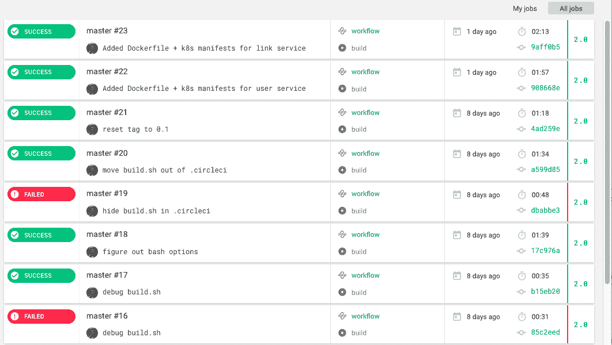

让我们深入研究一下成功的构建。一切都很好，一切都是绿色的：

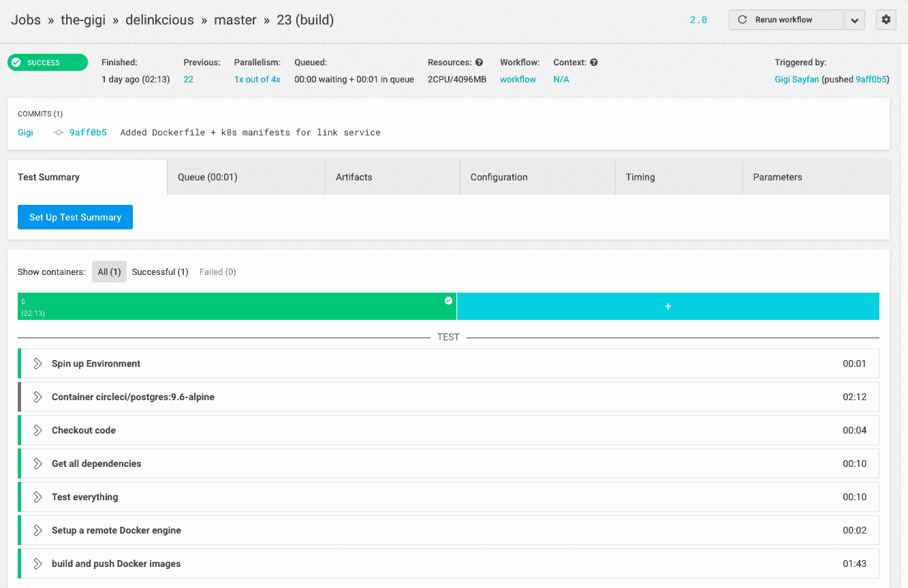

您甚至可以展开任何步骤并检查控制台输出。这是测试阶段的输出：

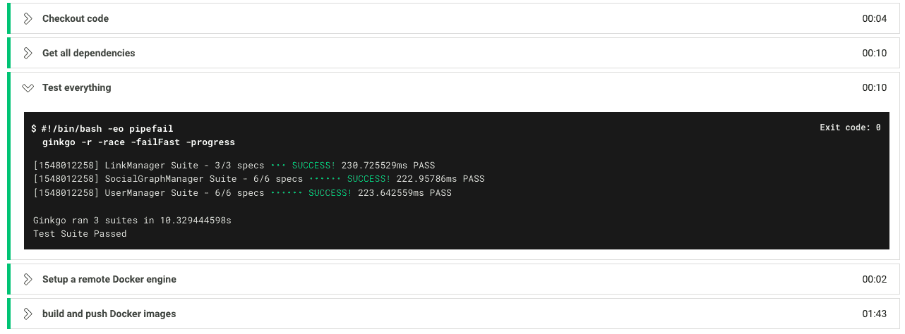

这很酷，但当事情出错时，你需要弄清楚原因时，它甚至更有用。例如，有一次，我试图将`build.sh`脚本隐藏在`.circleci`目录中，紧挨着`config.yaml`文件，但它没有被添加到 Docker 上下文中，并产生了以下错误：

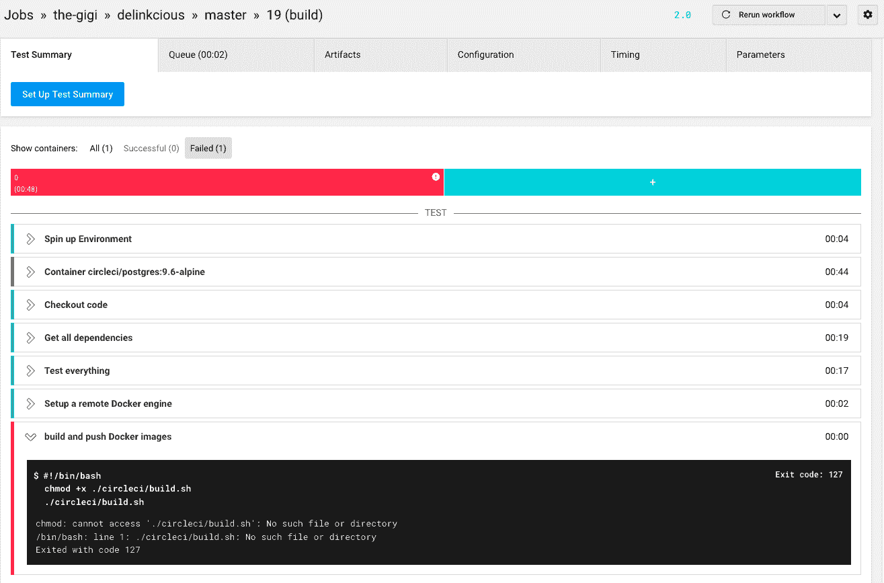

# 考虑未来的改进

Dockerfile 几乎是重复的，并且有一些可以参数化的假设。在 Kubernetes 生态系统中，有一些有趣的项目可以帮助解决这些问题。一些解决方案是用于本地开发的，可以自动生成必要的 Dockerfile，而其他一些则更加针对一致和统一的生产设置。我们将在后面的章节中研究其中一些。在本章中，我希望保持简单，避免用太多选项和间接层来压倒你。

另一个改进的机会是仅测试和构建已更改的服务（或其依赖项已更改）。目前，`build.sh` 脚本总是构建所有图像，并使用相同的标签对它们进行标记。

到目前为止，我们已经使用 CircleCI 和 Docker 构建了完整的 CI 管道。下一阶段是设置 Argo CD 作为持续交付管道。

# 为 Delinkcious 设置持续交付

在我们掌握了 CircleCI 中的持续集成之后，我们可以将注意力转向持续交付。首先，我们将看看将 Delinkcious 微服务部署到 Kubernetes 集群需要什么，然后我们将研究 Argo CD 本身，最后，我们将通过 Argo CD 为 Delinkcious 设置完整的持续交付。

# 部署 Delinkcious 微服务

每个 Delinkcious 微服务在其 `k8s` 子目录中定义了一组 Kubernetes 资源的 YAML 清单。这是 link 服务的 `k8s` 目录：

```
]$ tree k8s
k8s
├── db.yaml
└── link_manager.yaml
```

`link_manager.yaml` 文件包含两个资源：Kubernetes 部署和 Kubernetes 服务。Kubernetes 部署如下：

```
apiVersion: apps/v1
kind: Deployment
metadata:
  name: link-manager
  labels:
    svc: link
    app: manager
spec:
  replicas: 1
  selector:
    matchLabels:
      svc: link
      app: manager
  template:
    metadata:
      labels:
        svc: link
        app: manager
    spec:
      containers:
      - name: link-manager
        image: g1g1/delinkcious-link:0.2
        ports:
        - containerPort: 8080
```

Kubernetes 服务如下：

```
apiVersion: v1
kind: Service
metadata:
  name: link-manager
spec:
  ports:
  - port:  8080
  selector:
    svc: link
    app: manager
```

`db.yaml` 文件描述了 link 服务用于持久化其状态的数据库。可以通过将 `k8s` 目录传递给 `kubectl apply` 来一次性部署两者：

```
$ kubectl apply -f k8s
deployment.apps "link-db" created
service "link-db" created
deployment.apps "link-manager" created
service "link-manager" created
```

kubectl create 和 `kubectl apply` 之间的主要区别是，如果资源已经存在，`create` 将返回错误。

使用 `kubectl` 从命令行部署很好，但我们的目标是自动化这个过程。让我们来了解一下。

# 理解 Argo CD

Argo CD 是 Kubernetes 的开源持续交付解决方案。它由 Intuit 创建，并被包括 Google、NVIDIA、Datadog 和 Adobe 在内的许多其他公司采用。它具有一系列令人印象深刻的功能，如下所示：

+   将应用程序自动部署到特定目标环境

+   CLI 和 Web 可视化应用程序以及所需状态和实际状态之间的差异

+   支持高级部署模式的钩子（蓝/绿和金丝雀）

+   支持多个配置管理工具（普通 YAML、ksonnet、kustomize、Helm 等）

+   对所有部署的应用程序进行持续监控

+   手动或自动将应用程序同步到所需状态

+   回滚到 Git 存储库中提交的任何应用程序状态

+   对应用程序的所有组件进行健康评估

+   SSO 集成

+   GitOps webhook integration (GitHub, GitLab, and BitBucket)

+   用于与 CI 流水线集成的服务帐户/访问密钥管理

+   应用事件和 API 调用的审计跟踪

# Argo CD 是建立在 Argo 上的

Argo CD 是一个专门的 CD 流水线，但它是建立在稳固的 Argo 工作流引擎之上的。我非常喜欢这种分层方法，您可以在这个坚实的通用基础上构建具有 CD 特定功能和能力的工作流程。

# Argo CD 利用 GitOps

Argo CD 遵循 GitOps 方法。基本原则是您系统的状态存储在 Git 中。Argo CD 通过检查 Git 差异并使用 Git 基元来回滚和协调实时状态，来管理您的实时状态与期望状态。

# 开始使用 Argo CD

Argo CD 遵循最佳实践，并期望在 Kubernetes 集群上的专用命名空间中安装：

```
$ kubectl create namespace argocd
$ kubectl apply -n argocd -f https://raw.githubusercontent.com/argoproj/argo-cd/stable/manifests/install.yaml
```

让我们看看创建了什么。 Argo CD 安装了四种类型的对象：pod、service、deployment 和 replica set。以下是 pod：

```
$ kubectl get all -n argocd NAME                                        READY  STATUS RESTARTS  AGE
pod/argocd-application-controller-7c5cf86b76-2cp4z 1/1   Running  1  1m
pod/argocd-repo-server-74f4b4845-hxzw7             1/1   Running  0  1m
pod/argocd-server-9fc58bc5d-cjc95                  1/1   Running  0  1m
pod/dex-server-8fdd8bb69-7dlcj                     1/1   Running  0  1m
```

以下是服务：

```
NAME                                  TYPE        CLUSTER-IP       EXTERNAL-IP  PORT(S) 
service/argocd-application-controller ClusterIP   10.106.22.145    <none>       8083/TCP 
service/argocd-metrics                ClusterIP   10.104.1.83      <none>       8082/TCP 
service/argocd-repo-server            ClusterIP   10.99.83.118     <none>       8081/TCP 
service/argocd-server                 ClusterIP   10.103.35.4      <none>       80/TCP,443/TCP 
service/dex-server                    ClusterIP   10.110.209.247   <none>       5556/TCP,5557/TCP 
```

以下是部署：

```

NAME                                            DESIRED   CURRENT   UP-TO-DATE   AVAILABLE   AGE
deployment.apps/argocd-application-controller   1         1         1            1           1m
deployment.apps/argocd-repo-server              1         1         1            1           1m
deployment.apps/argocd-server                   1         1         1            1           1m
deployment.apps/dex-server                      1         1         1            1           1m

```

最后，以下是副本集：

```
NAME                                                       DESIRED   CURRENT   READY     AGE
replicaset.apps/argocd-application-controller-7c5cf86b76   1         1         1         1m
replicaset.apps/argocd-repo-server-74f4b4845               1         1         1         1m
replicaset.apps/argocd-server-9fc58bc5d                    1         1         1         1m
replicaset.apps/dex-server-8fdd8bb69                       1         1         1         1m
```

然而，Argo CD 还安装了两个**自定义资源定义**（**CRD**）：

```
$ kubectl get crd
NAME                       AGE
applications.argoproj.io   7d
appprojects.argoproj.io    7d
```

CRD 允许各种项目扩展 Kubernetes API 并添加自己的域对象，以及监视它们和其他 Kubernetes 资源的控制器。Argo CD 将应用程序和项目的概念添加到 Kubernetes 的世界中。很快，您将看到它们如何集成，以实现内置 Kubernetes 资源（如部署、服务和 pod）的持续交付目的。让我们开始吧：

1.  安装 Argo CD CLI：

```
$ brew install argoproj/tap/argocd
```

1.  端口转发以访问 Argo CD 服务器：

```
$ kubectl port-forward -n argocd svc/argocd-server 8080:443
```

1.  管理员用户的初始密码是 Argo CD 服务器的名称：

```
$ kubectl get pods -n argocd -l app.kubernetes.io/name=argocd-server -o name | cut -d'/' -f 2
```

1.  登录到服务器：

```
$ argocd login :8080
```

1.  如果它抱怨登录不安全，只需按*y*确认：

```
WARNING: server certificate had error: tls: either ServerName or InsecureSkipVerify must be specified in the tls.Config. Proceed insecurely (y/n)?
```

1.  或者，要跳过警告，请输入以下内容：

```
argocd login --insecure :8080
```

然后，您可以更改密码。

1.  如果您将密码存储在环境变量中（例如`ARGOCD_PASSWORD`），那么您可以使用一行命令登录，而无需进一步提问：

```
argocd login --insecure --username admin --password $ARGOCD_PASSWORD :8080
```

# 配置 Argo CD

记得端口转发到 argocd-server：

```
$ kubectl port-forward -n argocd svc/argocd-server 8080:443
```

然后，您只需浏览到`https://localhost:8080`并提供`admin`用户的密码即可登录：

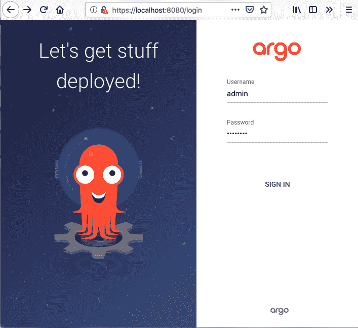

配置 Argo CD 是一种乐趣。它的用户界面非常愉快且易于使用。它支持 Delinkcious monorepo，而且没有假设每个 Git 存储库只包含一个应用程序或项目。

它会要求您选择一个 Git 存储库以监视更改，一个 Kubernetes 集群（默认为安装在其上的集群），然后它将尝试检测存储库中的清单。Argo CD 支持多种清单格式和模板，例如 Helm、ksonnet 和 kustomize。我们将在本书的后面介绍其中一些优秀的工具。为了保持简单，我们已经为每个应用程序配置了包含其原始`k8s` YAML 清单的目录，Argo CD 也支持这些清单。

说到做到，Argo CD 已经准备就绪！

# 使用同步策略

默认情况下，Argo CD 会检测应用程序的清单是否不同步，但不会自动同步。这是一个很好的默认设置。在某些情况下，需要在专用环境中运行更多测试，然后再将更改推送到生产环境。在其他情况下，必须有人参与。然而，在许多其他情况下，可以立即自动部署更改到集群中，而无需人为干预。Argo CD 遵循 GitOps 的事实也使得非常容易将同步回任何先前的版本（包括最后一个）。

对于 Delinkcious，我选择了自动同步，因为它是一个演示项目，部署错误版本的后果是可以忽略不计的。这可以在 UI 中或从 CLI 中完成：

```
argocd app set <APPNAME> --sync-policy automated
```

自动同步策略不能保证应用程序始终处于同步状态。自动同步过程受到一些限制，具体如下：

+   处于错误状态的应用程序将不会尝试自动同步。

+   Argo CD 将仅针对特定提交 SHA 和参数尝试一次自动同步。

+   如果由于任何原因自动同步失败，它将不会再次尝试。

+   您无法使用自动同步回滚应用程序。

在所有这些情况下，您要么必须对清单进行更改以触发另一个自动同步，要么手动同步。要回滚（或者一般地，同步到先前的版本），您必须关闭自动同步。

Argo CD 在部署时提供了另一种修剪资源的策略。当现有资源不再存在于 Git 中时，默认情况下 Argo CD 不会将其删除。这是一种安全机制，用于避免在编辑 Kubernetes 清单时出现错误时破坏关键资源。但是，如果您知道自己在做什么（例如，对于无状态应用程序），您可以打开自动修剪：

```
argocd app set <APPNAME> --auto-prune
```

# 探索 Argo CD

现在我们已经登录并配置了 Argo CD，让我们稍微探索一下。我真的很喜欢 UI，但如果您想以编程方式访问它，也可以通过命令行或 REST API 完成所有操作。

我已经使用三个 Delinkcious 微服务配置了 Argo CD。在 Argo CD 中，每个服务都被视为一个应用程序。让我们来看看应用程序视图：

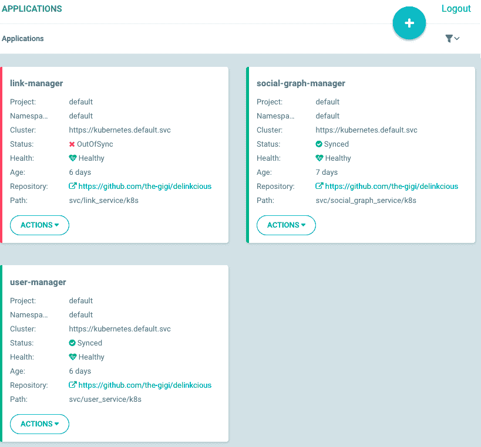

这里有一些有趣的东西。让我们来谈谈每一个：

+   项目是用于分组应用程序的 Argo CD 概念。

+   命名空间是应用程序应安装的 Kubernetes 命名空间。

+   集群是 Kubernetes 集群，即`https://kubernetes.default.svc`，这是安装了 Argo CD 的集群。

+   状态告诉您当前应用程序是否与其 Git 存储库中的 YAML 清单同步。

+   健康状态告诉您应用程序是否正常。

+   存储库是应用程序的 Git 存储库。

+   路径是存储库中`k8s` YAML 清单所在的相对路径（Argo CD 监视此目录以进行更改）。

以下是您从`argocd` CLI 中获得的内容：

```
$ argocd app list
NAME                  CLUSTER                         NAMESPACE  PROJECT  STATUS     HEALTH   SYNCPOLICY  CONDITIONS
link-manager          https://kubernetes.default.svc  default    default  OutOfSync  Healthy  Auto-Prune  <none>
social-graph-manager  https://kubernetes.default.svc  default    default  Synced     Healthy  Auto-Prune  <none>
user-manager          https://kubernetes.default.svc  default    default  Synced     Healthy  Auto-Prune  <none>
```

正如您可以在 UI 和 CLI 中看到的那样，`link-manager`不同步。我们可以通过从“ACTIONS”下拉菜单中选择“同步”来同步它。

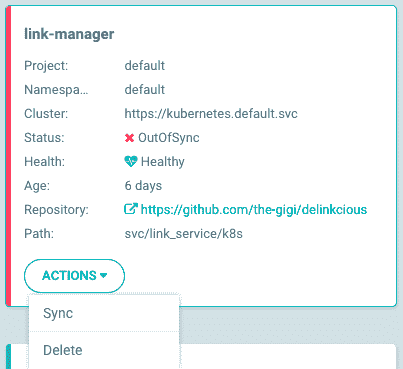

或者，您也可以从 CLI 中执行此操作：

```
$ argocd app sync link-manager
```

UI 最酷的地方之一是它如何呈现与应用程序相关的所有`k8s`资源。点击`social-graph-manager`应用程序，我们会得到以下视图：

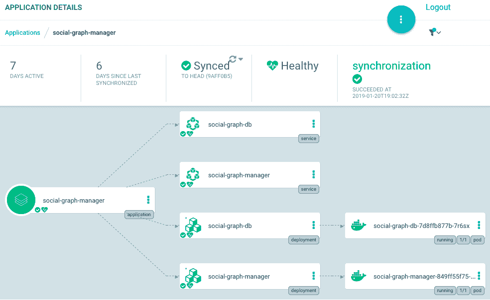

我们可以看到应用程序本身、服务、部署和 Pod，包括运行的 Pod 数量。这实际上是一个经过筛选的视图，如果我们愿意，我们可以将与每个部署相关的副本集和每个服务的端点添加到显示中。但是，大多数情况下这些都不是很有趣，因此 Argo CD 默认不显示它们。

我们可以点击一个服务，查看其信息的摘要，包括清单：

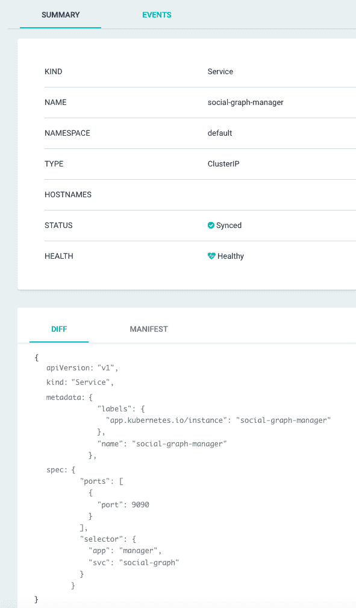

对于 Pods，我们甚至可以检查日志，如下面的截图所示，所有这些都可以在 Argo CD 的 UI 中轻松完成：

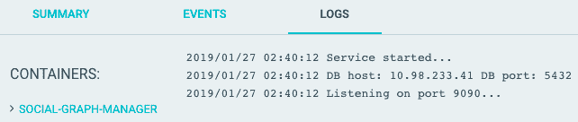

Argo CD 已经可以带您走很远。然而，它还有更多的提供，我们将在本书的后面深入探讨这些内容。

# 总结

在本章中，我们讨论了基于微服务的分布式系统的 CI/CD 流水线的重要性。我们审查了一些针对 Kubernetes 的 CI/CD 选项，并确定了使用 CircleCI 进行 CI 部分（代码更改|Docker 镜像）和 Argo CD 进行 CD 部分（`k8s`清单更改|部署的应用程序）的组合。

我们还介绍了使用多阶段构建构建 Docker 镜像的最佳实践，Postgres DB 的`k8s` YAML 清单，以及部署和服务`k8s`资源。然后，我们在集群中安装了 Argo CD，配置它来构建所有我们的微服务，并探索了 UI 和 CLI。在这一点上，您应该对 CI/CD 的概念以及其重要性有清晰的理解，各种解决方案的利弊以及如何为您的系统选择最佳选项。

然而，还有更多内容。在后面的章节中，我们将通过额外的测试、安全检查和高级多环境部署选项来改进我们的 CI/CD 流水线。

在下一章中，我们将把注意力转向配置我们的服务。配置是开发复杂系统的重要部分，需要大型团队开发、测试和部署。我们将探讨各种传统配置选项，如命令行参数、环境变量和配置文件，以及更动态的配置选项和 Kubernetes 的特殊配置功能。

# 进一步阅读

您可以参考以下来源，了解本章涵盖的更多信息：

+   以下是一些扩展您对 Kubernetes 上 CI/CD 选项的了解的好资源。首先，这是我用于 Delinkcious CI/CD 解决方案的两个项目：

+   **CircleCI**: [`circleci.com/docs/`](https://circleci.com/docs/)

+   **Argo**: [`argoproj.github.io/docs/argo-cd/docs/`](https://argoproj.github.io/docs/argo-cd/docs/)

+   然后，还有这本关于 Kubernetes 的 CI/CD 的免费迷你电子书：

+   [`thenewstack.io/ebooks/kubernetes/ci-cd-with-kubernetes/`](https://thenewstack.io/ebooks/kubernetes/ci-cd-with-kubernetes/)

+   最后，这里有一些我在 Delinkcious 中放弃的其他选项，但可能对你来说是一个不错的选择：

+   Jenkins X: [`jenkins-x.io/`](https://jenkins-x.io/)

+   Spinnaker: [`www.spinnaker.io/`](https://www.spinnaker.io/)
