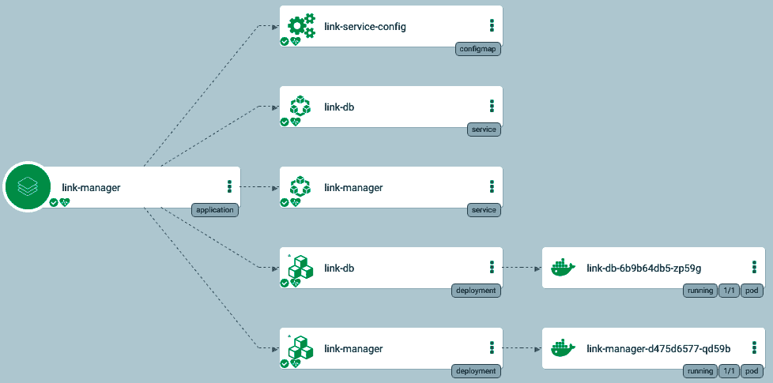
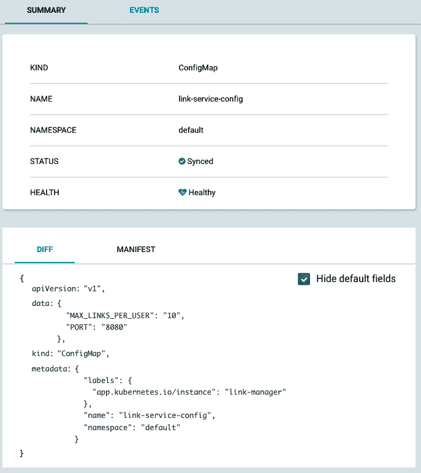

# 使用 Kubernetes 配置微服务

在本章中，我们将进入微服务配置的实际和现实世界领域。配置是构建复杂分布式系统的重要组成部分。一般来说，配置涉及代码应该意识到的系统的任何方面，但并未编码在代码本身中。以下是本章将讨论的主题：

+   配置到底是什么？

+   以老式方式管理配置

+   动态管理配置

+   使用 Kubernetes 配置微服务

在本章结束时，您将对配置的价值有扎实的了解。您还将学会静态和动态配置软件的许多方法，以及 Kubernetes 提供的特殊配置选项（其中之一是其最佳功能）。您还将获得洞察力和知识，以从 Kubernetes 作为开发人员和运营商提供的灵活性和控制中受益。

# 技术要求

在本章中，我们将查看许多 Kubernetes 清单，并扩展 Delinkcious 的功能。不需要安装任何新东西。

# 代码

像往常一样，代码分为两个 Git 存储库：

+   您可以在[`github.com/PacktPublishing/Hands-On-Microservices-with-Kubernetes/tree/master/Chapter05`](https://github.com/PacktPublishing/Hands-On-Microservices-with-Kubernetes/tree/master/Chapter05)找到代码示例

+   您可以在[`github.com/the-gigi/delinkcious/releases/tag/v0.3`](https://github.com/the-gigi/delinkcious/releases/tag/v0.3)找到更新的 Delinkcious 应用程序

# 配置到底是什么？

配置是一个非常重载的术语。让我们为我们的目的清晰地定义它：配置主要是指计算所需的操作数据。配置可能在不同的环境之间有所不同。以下是一些典型的配置项：

+   服务发现

+   支持测试

+   特定于环境的元数据

+   秘密

+   第三方配置

+   功能标志

+   超时

+   速率限制

+   各种默认值

通常，处理输入数据的代码利用配置数据来控制计算的操作方面，而不是算法方面。有一些特殊情况，通过配置，您可以在运行时在不同的算法之间切换，但这已经涉及到灰色地带。让我们为我们的目的保持简单。

在考虑配置时，重要的是要考虑谁应该创建和更新配置数据。可能是代码的开发者，也可能不是。例如，速率限制可能由 DevOps 团队成员确定，但功能标志将由开发人员设置。此外，在不同的环境中，不同的人可能修改相同的值。通常在生产中会有最严格的限制。

# 配置和秘密

秘密是用于访问数据库和其他服务（内部和/或外部）的凭据。从技术上讲，它们是配置数据，但实际上，由于它们的敏感性，它们经常需要在静止时加密并进行更严格的控制。通常会将秘密存储和单独管理，而不是与常规配置分开。

在本章中，我们只考虑非敏感配置。在下一章中，我们将详细讨论秘密。Kubernetes 还在 API 级别将配置与秘密分开。

# 以老式方式管理配置

当我说老式方式时，我的意思是在 Kubernetes 之前的静态配置。但正如您将看到的，老式方式有时是最好的方式，而且通常也得到 Kubernetes 的良好支持。让我们来看看配置程序的各种方式，考虑它们的优缺点，以及何时适用。我们将在这里介绍的配置机制如下：

+   无配置（约定优于配置）

+   命令行参数

+   环境变量

+   配置文件

Delinkcious 主要是用 Go 实现的，但我们将使用不同的编程语言来演示配置选项，只是为了好玩和多样性。

# 约定优于配置

有时，您实际上不需要配置；程序可以只做出一些决定，对其进行文档记录，就这样。例如，输出文件的目录名称可以是可配置的，但程序可以决定它将*输出*，就这样。这种方法的好处是非常可预测的：您不必考虑配置，只需通过阅读程序代码，就可以准确知道它的功能和一切应该在哪里。运营商的工作量很少。缺点是，如果需要更多的灵活性，您就没有办法（例如，可能程序运行的卷上没有足够的空间）。

请注意，约定优于配置并不意味着根本没有配置。这意味着在使用约定时可以减少配置的数量。

这是一个小的 Rust 程序，它将斐波那契序列打印到屏幕上，直到 100。按照约定，它决定不会超过 100。您无法配置它以打印更多或更少的数字而不改变代码：

```
fn main() {
    let mut a: u8 = 0;
    let mut b: u8 = 1;
    println!("{}", a);
    while b <= 100 {
        println!("{}", b);
        b = a + b;
        a = b - a;
    }
}

Output:

0
1
1
2
3
5
8
13
21
34
55
89
```

# 命令行标志

命令行标志或参数是编程的重要组成部分。运行程序时，您提供参数，程序使用这些参数来配置自身。使用它们有利有弊：

+   **优点**：

+   非常灵活

+   熟悉并且在每种编程语言中都可用

+   有关短选项和长选项的最佳实践已经建立

+   与交互式使用文档配合良好

+   **缺点**：

+   参数始终是字符串

+   需要引用包含空格的参数

+   难以处理多行参数

+   命令行参数的数量限制

+   每个参数的大小限制

命令行参数通常用于输入以及配置。输入和配置之间的界限有时可能有点模糊。在大多数情况下，这并不重要，但对于只想通过命令行参数将其输入传递给程序的用户来说，这可能会让他们感到困惑，因为他们会看到一大堆令人困惑的配置选项。

这是一个小的 Ruby 程序，它将斐波那契序列写入到一个作为命令行参数提供的数字。

```
if __FILE__ == $0
  limit = Integer(ARGV[0])
  a = 0
  b = 1
  puts a
  while b < limit
    puts b
    b = a + b
    a = b - a
  end
end
```

# 环境变量

环境变量是另一个受欢迎的选项。当您的程序在可能由另一个程序（或 shell 脚本）设置的环境中运行时，它们非常有用。环境变量通常从父环境继承。它们还用于运行交互式程序，当用户总是希望向程序提供相同的选项（或一组选项）时。与其一遍又一遍地输入带有相同选项的长命令行，不如设置一个环境变量（甚至可能在您的配置文件中）一次，然后无需参数运行程序。一个很好的例子是 AWS CLI，它允许您将许多配置选项指定为环境变量（例如，`AWS_DEFAULT_REGION`或`AWS_PROFILE`）。

这里有一个小的 Python 程序，它会写出斐波那契数列，直到一个作为环境变量提供的数字。请注意，`FIB_LIMIT`环境变量被读取为字符串，程序必须将其转换为整数。

```
import os

limit = int(os.environ['FIB_LIMIT'])
a = 0
b = 1
print(a)
while b < limit:
    print(b)
    b = a + b
    a = b - a
```

# 配置文件

配置文件在有大量配置数据时特别有用，尤其是当这些数据具有分层结构时。在大多数情况下，通过命令行参数或环境变量配置应用程序的选项太过于繁琐。配置文件还有另一个优点，就是可以链接多个配置文件。通常，应用程序会在搜索路径中查找配置文件，例如`/etc/conf`，然后是`home`目录，然后是当前目录。这提供了很大的灵活性，因为您可以拥有通用配置，同时还能够覆盖某些用户或运行时的部分配置。

配置文件非常棒！您应该考虑哪种格式最适合您的用例。有很多选择。配置文件格式会遵循趋势，每隔几年就会有新的亮点。让我们回顾一些旧格式，以及一些新格式。

# INI 格式

INI 文件曾经在 Windows 上非常流行。INI 代表**初始化**。在八十年代，瞎折腾`windows.ini`和`system.ini`以使某些东西工作是非常常见的。格式本身非常简单，包括带有键-值对和注释的部分。这是一个简单的 INI 文件：

```
[section]
a=1
b=2

; here is a comment
[another_section]
c=3
d=4
e=5
```

Windows API 有用于读取和写入 INI 文件的函数，因此许多 Windows 应用程序将它们用作配置文件。

# XML 格式

XML ([`www.w3.org/XML/`](https://www.w3.org/XML/))是 W3C 标准，在九十年代非常流行。它代表**可扩展标记语言**，用于*一切*：数据，文档，API（SOAP），当然还有配置文件。它非常冗长，它的主要特点是自我描述并包含自己的元数据。XML 有模式和许多建立在其之上的标准。有一段时间，人们认为它会取代 HTML（还记得 XHTML 吗？）。那都是过去了。这是一个样本 XML 配置文件：

```
<?xml version="1.0" encoding="UTF-8"?>
    <startminimized value="False">
  <width value="1024">
  <height value = "768">
  <dummy />
  <plugin>
    <name value="Show Warning Message Box">
    <dllfile value="foo.dll">
    <method value = "warning">
  </plugin>
  <plugin>
    <name value="Show Error Message Box">
    <dllfile value="foo.dll">
    <method value = "error">
  </plugin>
  <plugin>
    <name value="Get Random Number">
    <dllfile value="bar.dll">
        <method value = "random">
  </plugin>
</xml>
```

# JSON 格式

JSON（[`json.org/`](https://json.org/)）代表**JavaScript 对象表示法**。随着动态网络应用和 REST API 的增长，它变得越来越受欢迎。与 XML 相比，它的简洁性让人耳目一新，并迅速占领了行业。它的成名之处在于它可以一对一地转换为 JavaScript 对象。这是一个简单的 JSON 文件：

```
{
  "firstName": "John",
  "lastName": "Smith",
  "age": 25,
  "address": {
    "streetAddress": "21 2nd Street",
    "city": "New York",
    "state": "NY",
    "postalCode": "10021"
  },
  "phoneNumber": [
    {
      "type": "home",
      "number": "212 555-1234"
    },
    {
      "type": "fax",
      "number": "646 555-4567"
    }
  ],
  "gender": {
    "type": "male"
  }
}
```

我个人从来不喜欢 JSON 作为配置文件格式；它不支持注释，对数组末尾的额外逗号要求过于严格，将日期和时间序列化为 JSON 总是很麻烦。它也非常冗长，需要用引号、括号，并且需要转义许多字符（尽管它不像 XML 那样糟糕）。

# YAML 格式

你在本书中已经看到了很多 YAML（[`yaml.org/`](https://yaml.org/)），因为 Kubernetes 清单通常是以 YAML 编写的。YAML 是 JSON 的超集，但它还提供了一个更简洁的语法，非常易于阅读，以及更多的功能，比如引用、类型的自动检测和对齐多行值的支持。

这是一个具有比通常在普通 Kubernetes 清单中看到的更多花哨功能的 YAML 文件的示例：

```
# sequencer protocols for Laser eye surgery
---
- step:  &id001                  # defines anchor label &id001
    instrument:      Lasik 3000
    pulseEnergy:     5.4
    pulseDuration:   12
    repetition:      1000
    spotSize:        1mm

- step: &id002
    instrument:      Lasik 3000
    pulseEnergy:     5.0
    pulseDuration:   10
    repetition:      500
    spotSize:        2mm
- step: *id001                   # refers to the first step (with anchor &id001)
- step: *id002                   # refers to the second step
- step:
    <<: *id001
    spotSize: 2mm                # redefines just this key, refers rest from &id001
- step: *id002
```

YAML 不像 JSON 那样受欢迎，但它慢慢地积聚了动力。像 Kubernetes 和 AWS CloudFormation 这样的大型项目使用 YAML（以及 JSON，因为它是超集）作为它们的配置格式。CloudFormation 后来添加了对 YAML 的支持；Kubernetes 从 YAML 开始。

它目前是我最喜欢的配置文件格式；然而，YAML 有它的陷阱和批评，特别是当你使用一些更高级的功能时。

# TOML 格式

进入 TOML（[`github.com/toml-lang/toml`](https://github.com/toml-lang/toml)）—**Tom's Obvious Minimal Language**。TOML 就像是增强版的 INI 文件。它是所有格式中最不为人知的，但自从被 Rust 的包管理器 Cargo 使用以来，它开始获得动力。TOML 在表现形式上介于 JSON 和 YAML 之间。它支持自动检测的数据类型和注释，但它不像 YAML 那样强大。尽管如此，它是最容易被人类阅读和编写的。它支持嵌套，主要是通过点符号而不是缩进。

这是一个 TOML 文件的示例；看看它有多可读：

```
# This is how to comment in TOML.

title = "A TOML Example"

[owner]
name = "Gigi Sayfan"
dob = 1968-09-28T07:32:00-08:00 # First class dates

# Simple section with various data types
[kubernetes]
api_server = "192.168.1.1"
ports = [ 80, 443 ]
connection_max = 5000
enabled = true

# Nested section
[servers]

  # Indentation (tabs and/or spaces) is optional
  [servers.alpha]
  ip = "10.0.0.1"
  dc = "dc-1"

  [servers.beta]
  ip = "10.0.0.2"
  dc = "dc-2"

[clients]
data = [ ["gamma", "delta"], [1, 2] ]

# Line breaks are OK when inside arrays
hosts = [
  "alpha",
  "omega"
]
```

# 专有格式

一些应用程序只是提出了自己的格式。这是一个 Nginx web 服务器的示例配置文件：

```
user       www www;  ## Default: nobody
worker_processes  5;  ## Default: 1
error_log  logs/error.log;
pid        logs/nginx.pid;
worker_rlimit_nofile 8192;

events {
  worker_connections  4096;  ## Default: 1024
}

http {
  include    conf/mime.types;
  include    /etc/nginx/proxy.conf;
  include    /etc/nginx/fastcgi.conf;
  index    index.html index.htm index.php;

  default_type application/octet-stream;
  log_format   main '$remote_addr - $remote_user [$time_local]  $status '
    '"$request" $body_bytes_sent "$http_referer" '
    '"$http_user_agent" "$http_x_forwarded_for"';
  access_log   logs/access.log  main;
  sendfile     on;
  tcp_nopush   on;
  server_names_hash_bucket_size 128; # this seems to be required for some vhosts

  server { # php/fastcgi
    listen       80;
    server_name  domain1.com www.domain1.com;
    access_log   logs/domain1.access.log  main;
    root         html;

    location ~ \.php$ {
      fastcgi_pass   127.0.0.1:1025;
    }
  }
}
```

我不建议为您的应用程序发明另一个构思不周的配置格式。在 JSON、YAML 和 TOML 之间，您应该找到表达性、人类可读性和熟悉度之间的平衡点。此外，所有语言都有库来解析和组合这些熟悉的格式。

不要发明自己的配置格式！

# 混合配置和默认值

到目前为止，我们已经审查了主要的配置机制：

+   约定优于配置

+   命令行参数

+   环境变量

+   配置文件

这些机制并不是互斥的。许多应用程序将支持其中一些，甚至全部。很多时候，会有一个配置解析机制，其中配置文件有一个标准的名称和位置，但您仍然可以通过环境变量指定不同的配置文件，并且甚至可以通过命令行参数为特定运行覆盖甚至那个。你不必走得太远。Kubectl 是一个程序，默认情况下在`$HOME/.kube`中查找其配置文件；您可以通过`KUBECONFIG`环境变量指定不同的文件。您可以通过传递`--config`命令行标志为特定命令指定特殊的配置文件。

说到这一点，kubectl 也使用 YAML 作为其配置格式。这是我的 Minikube 配置文件：

```
$ cat ~/.kube/config
apiVersion: v1
clusters:
- cluster:
 certificate-authority: /Users/gigi.sayfan/.minikube/ca.crt
 server: https://192.168.99.121:8443
 name: minikube
contexts:
- context:
 cluster: minikube
 user: minikube
 name: minikube
current-context: minikube
kind: Config
preferences: {}
users:
- name: minikube
 user:
 client-certificate: /Users/gigi.sayfan/.minikube/client.crt
 client-key: /Users/gigi.sayfan/.minikube/client.key
```

Kubectl 支持在同一配置文件中的多个集群/上下文。您可以通过`kubectl use-context`在它们之间切换；然而，许多经常使用多个集群的人不喜欢将它们全部放在同一个配置文件中，而更喜欢为每个集群单独创建一个文件，然后通过`KUBECONFIG`环境变量或通过命令行传递`--config`来在它们之间切换。

# 十二要素应用程序配置

Heroku 是云平台即服务的先驱之一。2011 年，他们发布了用于构建 Web 应用程序的 12 要素方法论。这是一个相当坚实的方法，并且在当时非常创新。它也恰好是在 Heroku 上轻松部署应用程序的最佳方式。

对于我们的目的，他们网站最有趣的部分是配置部分，可以在[`12factor.net/config`](https://12factor.net/config)找到。

简而言之，他们建议 Web 服务和应用程序始终将配置存储在环境变量中。这是一个安全但有些有限的指导方针。这意味着每当配置更改时，服务都必须重新启动，并且受到环境变量的一般限制。

稍后，我们将看到 Kubernetes 如何支持将配置作为环境变量和配置文件，以及一些特殊的变化。但首先，让我们讨论动态配置。

# 动态管理配置

到目前为止，我们讨论的配置选项都是静态的。你必须重新启动，并且在某些情况下（比如使用嵌入式配置文件），重新部署你的服务来改变它的配置。当配置改变时重新启动服务的好处是你不必担心新配置对内存状态和正在处理的请求的影响，因为你是从头开始的；然而，缺点是你会失去所有正在处理的请求（除非你使用优雅关闭）和任何已经预热的缓存或一次性初始化工作，这可能是相当大的。然而，你可以通过使用滚动更新和蓝绿部署来在一定程度上减轻这种情况。

# 理解动态配置

动态配置意味着服务保持运行，代码和内存状态保持不变，但它可以检测到配置已经改变，并根据新的配置动态调整其行为。从操作员的角度来看，当配置需要改变时，他们只需更新中央配置存储，而不需要强制重新启动/部署代码未改变的服务。

重要的是要理解这不是一个二元选择；一些配置可能是静态的，当它改变时，你必须重新启动服务，但其他一些配置项可能是动态的。

由于动态配置可以改变系统的行为方式，这种改变无法通过源代码控制来捕捉，因此保留更改历史和审计是一个常见的做法。让我们看看什么时候应该使用动态配置，什么时候不应该使用！

# 动态配置何时有用？

动态配置在以下情况下很有用：

+   如果你只有一个服务实例，那么重新启动意味着短暂的中断

+   如果您有要快速切换的功能标志

+   如果您的服务需要初始化或丢弃正在进行中的请求是昂贵的

+   如果您的服务不支持高级部署策略，例如滚动更新，蓝绿色或金丝雀部署

+   重新部署时，新的配置文件可能会从源代码控制中拉取未准备好部署的不相关代码更改

# 何时应避免动态配置？

然而，动态配置并非适用于所有情况。如果您想要完全安全，那么在配置更改时重新启动服务会使事情更容易理解和分析。也就是说，微服务通常足够简单，您可以理解配置更改的所有影响。

在以下情况下，最好避免动态配置：

+   受监管的服务，配置更改必须经过审查和批准流程

+   关键服务，静态配置的低风险胜过动态配置的任何好处

+   动态配置机制不存在，而且好处不足以证明开发这样的机制是合理的

+   现有系统具有大量服务，迁移到动态配置的好处不足以证明成本

+   高级部署策略提供了动态配置的好处，静态配置和重新启动/重新部署

+   跟踪和审计配置更改的复杂性太高

# 远程配置存储

动态配置的一个选项是远程配置存储。所有服务实例可以定期查询配置存储，检查配置是否已更改，并在更改时读取新配置。可能的选项包括以下内容：

+   关系数据库（Postgres，MySQL）

+   键-值存储（Etcd，Redis）

+   共享文件系统（NFS，EFS）

总的来说，如果您的所有/大多数服务已经使用特定类型的存储，通常将动态配置放在那里会更简单。反模式是将配置存储在与服务持久存储相同的存储中。问题在于配置将分布在多个数据存储中，而且一些配置更改是中心化的。跨所有服务管理、跟踪和审计配置更改将会很困难。

# 远程配置服务

更高级的方法是创建一个专门的配置服务。此服务的目的是为所有配置需求提供一站式服务。每个服务将仅访问其配置，并且很容易为每个配置更改实现控制机制。配置服务的缺点是您需要构建它并进行维护。如果不小心的话，它也可能成为**单点故障**（SPOF）。

到目前为止，我们已经非常详细地介绍了系统配置的许多选项。现在，是时候研究一下 Kubernetes 带来了什么了。

# 使用 Kubernetes 配置微服务

使用 Kubernetes 或任何容器编排器，您有各种有趣的配置选项。Kubernetes 为您运行容器。无法为特定运行设置不同的环境选项和命令行参数，因为 Kubernetes 决定何时何地运行容器。您可以将配置文件嵌入到 Docker 镜像中或更改其运行的命令；但是，这意味着为每个配置更改烘烤新镜像并将其部署到集群中。这并不是世界末日，但这是一个繁重的操作。您还可以使用我之前提到的动态配置选项：

+   远程配置存储

+   远程配置服务

但是，当涉及到动态配置时，Kubernetes 有一些非常巧妙的技巧。最创新的动态配置机制是 ConfigMaps。您还可以使用自定义资源更加复杂。让我们深入了解一下。

# 使用 Kubernetes ConfigMaps

ConfigMaps 是由 Kubernetes 每个命名空间管理的 Kubernetes 资源，并且可以被任何 pod 或容器引用。这是`link-manager`服务的 ConfigMap：

```
apiVersion: v1
kind: ConfigMap
metadata:
  name: link-service-config
  namespace: default
data:
  MAX_LINKS_PER_USER: "10"
  PORT: "8080"
```

`link-manager`部署资源通过使用`envFrom`键将其导入到 pod 中：

```
apiVersion: apps/v1
kind: Deployment
metadata:
  name: link-manager
  labels:
    svc: link
    app: manager
spec:
  replicas: 1
  selector:
    matchLabels:
      svc: link
      app: manager
  template:
    metadata:
      labels:
        svc: link
        app: manager
    spec:
      containers:
      - name: link-manager
        image: g1g1/delinkcious-link:0.2
        ports:
        - containerPort: 8080
      envFrom:
      - configMapRef:
          name: link-manager-config
```

这样做的效果是，当`link-manager`服务运行时，ConfigMap 的`data`部分中的键值对将被投影为环境变量：

```
MAX_LINKS_PER_PAGE=10
PORT=9090
```

让我们看看 Argo CD 如何可视化`link-manager`服务具有 ConfigMap。请注意名为`link-service-config`的顶部框：



您甚至可以通过单击 ConfigMap 框从 Argo CD UI 中深入检查 ConfigMap 本身。非常漂亮。



请注意，由于 ConfigMap 作为环境变量被消耗，这是静态配置。如果你想改变其中任何内容，你需要重新启动服务。在 Kubernetes 中，可以通过几种方式来实现：

+   杀死 pod（部署的副本集将创建新的 pod）

+   删除并重新创建部署（这有相同的效果，但不需要显式杀死 pod）

+   应用其他更改并重新部署

让我们看看代码如何使用它。这段代码可以在[svc/link_manager/service/link_manager_service.go](https://github.com/the-gigi/delinkcious/blob/14c91f1c675dea9729d80876a3798897b925712a/svc/link_service/service/link_service.go#L37)找到：

```
port := os.Getenv("PORT")
if port == "" {
   port = "8080"
}

maxLinksPerUserStr := os.Getenv("MAX_LINKS_PER_USER")
if maxLinksPerUserStr == "" {
   maxLinksPerUserStr = "10"
}
```

`os.Getenv()`标准库函数从环境中获取`PORT`和`MAX_LINKS_PER_USER`。这很棒，因为它允许我们在 Kubernetes 集群之外测试服务，并正确配置它。例如，链接服务端到端测试——专为 Kubernetes 之外的本地测试设计——在启动社交图管理器和`link-manager`服务之前设置环境变量：

```
func runLinkService(ctx context.Context) {
   // Set environment
   err := os.Setenv("PORT", "8080")
   check(err)

   err = os.Setenv("MAX_LINKS_PER_USER", "10")
   check(err)

   runService(ctx, ".", "link_service")
}

func runSocialGraphService(ctx context.Context) {
   err := os.Setenv("PORT", "9090")
   check(err)

   runService(ctx, "../social_graph_service", "social_graph_service")
}
```

现在我们已经看过 Delinkcious 如何使用 ConfigMaps，让我们继续进行 ConfigMaps 的工作细节。

# 创建和管理 ConfigMaps

Kubernetes 提供了多种创建 ConfigMaps 的方法：

+   从命令行值

+   从一个或多个文件

+   从整个目录

+   通过直接创建 ConfigMap YAML 清单

最后，所有的 ConfigMaps 都是一组键值对。键和值取决于创建 ConfigMap 的方法。在玩 ConfigMaps 时，我发现使用`--dry-run`标志很有用，这样我就可以在实际创建之前看到将要创建的 ConfigMap。让我们看一些例子。以下是如何从命令行参数创建 ConfigMap：

```
$ kubectl create configmap test --dry-run --from-literal=a=1 --from-literal=b=2 -o yaml
apiVersion: v1
data:
 a: "1"
 b: "2"
kind: ConfigMap
metadata:
 creationTimestamp: null
 name: test
```

这种方法主要用于玩转 ConfigMaps。您必须使用繁琐的`--from-literal`参数逐个指定每个配置项。

从文件创建 ConfigMap 是一种更可行的方法。它与 GitOps 概念很好地配合，您可以保留用于创建 ConfigMaps 的源配置文件的历史记录。我们可以创建一个非常简单的名为`comics.yaml`的 YAML 文件：

```
superhero: Doctor Strange
villain: Thanos
```

接下来，让我们使用以下命令从这个文件创建一个 ConfigMap（好吧，只是一个干燥的`run`）：

```
$ kubectl create configmap file-config --dry-run --from-file comics.yaml -o yaml

apiVersion: v1
data:
 comics.yaml: |+
 superhero: Doctor Strange
 villain: Thanos

kind: ConfigMap
metadata:
 creationTimestamp: null
 name: file-config
```

有趣的是，文件的整个内容都映射到一个键：`comics.yaml`。值是文件的整个内容。在 YAML 中，`|+`表示以下的多行块是一个值。如果我们添加额外的`--from-file`参数，那么每个文件将在 ConfigMap 中有自己的键。同样，如果`--from-file`的参数是一个目录，那么目录中的每个文件都将成为 ConfigMap 中的一个键。

最后，让我们看一个手动构建的 ConfigMap。这并不难做到：只需在`data`部分下添加一堆键值对即可：

```
apiVersion: v1
kind: ConfigMap
metadata:
  name: env-config
  namespace: default
data:
  SUPERHERO: Superman
  VILLAIN: Lex Luthor
```

在这里，我们创建了专门的`SUPERHERO`和`VILLAIN`键。

让我们看看 pod 如何消耗这些 ConfigMap。pod 从`env-config` ConfigMap 中获取其环境。它执行一个命令，监视`SUPERHERO`和`VILLAIN`环境变量的值，并且每两秒钟回显当前值：

```
apiVersion: v1
kind: Pod
metadata:
  name: some-pod
spec:
  containers:
  - name: some-container
    image: busybox
    command: [ "/bin/sh", "-c", "watch 'echo \"superhero: $SUPERHERO villain: $VILLAIN\"'" ]
    envFrom:
    - configMapRef:
        name: env-config
  restartPolicy: Never
```

必须在启动 pod 之前创建 ConfigMap！

```
$ kubectl create -f env-config.yaml
configmap "env-config" created

$ kubectl create -f some-pod.yaml
pod "some-pod" created
```

kubectl 命令非常有用，可以用来检查输出：

```
$ kubectl logs -f some-pod

Every 2s: echo "superhero: $SUPERHERO villain: $VILLAIN"      2019-02-08 20:50:39

superhero: Superman villain: Lex Luthor
```

如预期的那样，值与 ConfigMap 匹配。但是如果我们更改 ConfigMap 会发生什么呢？`kubectl edit configmap`命令允许您在编辑器中更新现有的 ConfigMap：

```
$ kubectl edit configmap env-config

# Please edit the object below. Lines beginning with a '#' will be ignored,
# and an empty file will abort the edit. If an error occurs while saving this file will be
# reopened with the relevant failures.
#
apiVersion: v1
data:
 SUPERHERO: Batman
 VILLAIN: Joker
kind: ConfigMap
metadata:
 creationTimestamp: 2019-02-08T20:49:37Z
 name: env-config
 namespace: default
 resourceVersion: "874765"
 selfLink: /api/v1/namespaces/default/configmaps/env-config
 uid: 0c83dee5-2be3-11e9-9999-0800275914a6

configmap "env-config" edited
```

我们已经将超级英雄和反派更改为 Batman 和 Joker。让我们验证一下更改：

```
$ kubectl get configmap env-config -o yaml

apiVersion: v1
data:
 SUPERHERO: Batman
 VILLAIN: Joker
kind: ConfigMap
metadata:
 creationTimestamp: 2019-02-08T20:49:37Z
 name: env-config
 namespace: default
 resourceVersion: "875323"
 selfLink: /api/v1/namespaces/default/configmaps/env-config
 uid: 0c83dee5-2be3-11e9-9999-0800275914a6
```

新的值已经存在。让我们检查一下 pod 日志。什么都不应该改变，因为 pod 将 ConfigMap 作为环境变量消耗，而在 pod 运行时无法从外部更改：

```
$ kubectl logs -f some-pod

Every 2s: echo "superhero: $SUPERHERO villain: $VILLAIN"    2019-02-08 20:59:22

superhero: Superman villain: Lex Luthor
```

然而，如果我们删除并重新创建 pod，情况就不同了：

```
$ kubectl delete -f some-pod.yaml
pod "some-pod" deleted

$ kubectl create -f some-pod.yaml
pod "some-pod" created

$ kubectl logs -f some-pod

Every 2s: echo "superhero: $SUPERHERO villain: $VILLAIN" 2019-02-08 21:45:47

superhero: Batman villain: Joker
```

我把最好的留到了最后。让我们看看一些动态配置的实际操作。名为`some-other-pod`的 pod 正在将名为`file-config`的 ConfigMap 作为文件进行消耗。首先，它创建了一个名为`config-volume`的卷，该卷从`file-config` ConfigMap 中获取数据。然后，这个卷被挂载到`/etc/config`中。正在运行的命令只是简单地监视`/etc/config/comics`文件：

```
apiVersion: v1
kind: Pod
metadata:
  name: some-other-pod
spec:
  containers:
  - name: some-container
    image: busybox
    command: [ "/bin/sh", "-c", "watch \"cat /etc/config/comics\"" ]
    volumeMounts:
    - name: config-volume
      mountPath: /etc/config
  volumes:
  - name: config-volume
    configMap:
      name: file-config
  restartPolicy: Never
```

这是`file-config` ConfigMap：

```
apiVersion: v1
kind: ConfigMap
metadata:
  name: file-config
  namespace: default
data:
  comics: |+
    superhero: Doctor Strange
    villain: Thanos
```

它有一个名为`comics`（文件名）的键，值是一个多行的 YAML 字符串，其中包含超级英雄和反派条目（`Doctor Strange`和`Thanos`）。说到做到，ConfigMap `data`部分下的 comics 键的内容将被挂载到容器中作为`/etc/config/comics`文件。

让我们验证一下：

```
$ kubectl create -f file-config.yaml
configmap "file-config" created

$ kubectl create -f some-other-pod.yaml
pod "some-other-pod" created

$ kubectl logs -f some-other-pod

Every 2s: cat /etc/config/comics      2019-02-08 22:15:08

superhero: Doctor Strange
villain: Thanos
```

到目前为止，一切看起来都很好。现在是主要的吸引力。让我们将 ConfigMap 的内容更改为超级英雄神奇女侠和反派美杜莎。这次我们将使用`kubectl apply`命令，而不是删除和重新创建 ConfigMap。ConfigMap 被正确更新，但我们也会收到一个警告（可以忽略）：

```
$ kubectl apply -f file-config.yaml
Warning: kubectl apply should be used on resource created by either kubectl create --save-config or kubectl apply
configmap "file-config" configured

$ kubectl get configmap file-config -o yaml
apiVersion: v1
data:
 comics: |+
 superhero: Super Woman
 villain: Medusa

kind: ConfigMap
metadata:
 annotations:
 kubectl.kubernetes.io/last-applied-configuration: |
 {"apiVersion":"v1","data":{"comics":"superhero: Super Woman\nvillain: Medusa\n\n"},"kind":"ConfigMap","metadata":{"annotations":{},"name":"file-config","namespace":"default"}}
 creationTimestamp: 2019-02-08T22:14:01Z
 name: file-config
 namespace: default
 resourceVersion: "881662"
 selfLink: /api/v1/namespaces/default/configmaps/file-config
 uid: d6e892f4-2bee-11e9-9999-0800275914a6
```

请注意前面的注释。有趣的是，它存储了最后一次应用的更改，这在数据中是可用的，而不是以前的值用于历史上下文。

现在，让我们再次检查日志，而不重新启动 pod！

```
$ kubectl logs -f some-other-pod

Every 2s: cat /etc/config/comics     2019-02-08 23:02:58

superhero: Super Woman
villain: Medusa
```

是的，这是一个巨大的成功！现在 pod 打印出了更新的配置信息，无需重新启动。

在本节中，我们演示了如何使用 ConfigMaps 作为文件挂载的动态配置。让我们看看当大规模系统的配置需求由多个团队在长时间内开发时，我们应该做些什么。

# 应用高级配置

对于有大量服务和大量配置的大规模系统，您可能希望有一些消耗多个 ConfigMaps 的服务。这与单个 ConfigMap 可能包含多个文件、目录和文字值的事实是分开的，可以任意组合。例如，每个服务可能有自己特定的配置，但也可能使用一些需要配置的共享库。在这种情况下，您可以为共享库和每个服务单独创建一个 ConfigMap。在这种情况下，服务将同时消耗它们自己的 ConfigMap 和共享库的 ConfigMap。

另一个常见的情况是针对不同环境（开发、暂存和生产）有不同的配置。由于在 Kubernetes 中，每个环境通常都有自己的命名空间，您需要在这里有创意。ConfigMaps 的作用域是它们的命名空间。这意味着即使您在各个环境中的配置是相同的，您仍然需要在每个命名空间中创建一个副本。有各种解决方案可以用来管理这种配置文件和 Kubernetes 清单的泛滥。我不会详细介绍这些内容，只是简单提一下一些更受欢迎的选项，没有特定顺序：

+   Helm: [`helm.sh/`](https://helm.sh/)

+   Kustomize: [`kustomize.io/`](https://kustomize.io/)

+   Jsonnet: [`jsonnet.org/articles/kubernetes.html`](https://jsonnet.org/articles/kubernetes.html)

+   **Ksonnet**：[`github.com/ksonnet/ksonnet`](https://github.com/ksonnet/ksonnet)（不再维护）

您还可以自己构建一些工具来执行此操作。在下一节中，我们将看另一种选择，这种选择非常酷，但更复杂——自定义资源。

# Kubernetes 自定义资源

Kubernetes 是一个非常可扩展的平台。您可以将自己的资源添加到 Kubernetes API 中，并享受 API 机制的所有好处，包括 kubectl 支持来管理它们。是的，就是这么好。您需要做的第一件事是定义自定义资源，也称为 CRD。定义将指定 Kubernetes API 上的端点、版本、范围、种类以及与这种新类型的资源交互时使用的名称。

这里有一个超级英雄 CRD：

```
apiVersion: apiextensions.k8s.io/v1beta1
kind: CustomResourceDefinition
metadata:
  # name must match the spec fields below, and be in the form: <plural>.<group>
  name: superheros.example.org
spec:
  # group name to use for REST API: /apis/<group>/<version>
  group: example.org
  # list of versions supported by this CustomResourceDefinition
  versions:
  - name: v1
    # Each version can be enabled/disabled by Served flag.
    served: true
    # One and only one version must be marked as the storage version.
    storage: true
  # either Namespaced or Cluster
  scope: Cluster
  names:
    # plural name to be used in the URL: /apis/<group>/<version>/<plural>
    plural: superheros
    # singular name to be used as an alias on the CLI and for display
    singular: superhero
    # kind is normally the CamelCased singular type. Your resource manifests use this.
    kind: SuperHero
    # shortNames allow shorter string to match your resource on the CLI
    shortNames:
    - hr
```

自定义资源可以从所有命名空间中访问。当构建 URL 时，范围是相关的，并且在删除命名空间中的所有对象时（命名空间范围 CRD 将与其命名空间一起被删除）。

让我们创建一些超级英雄资源。`antman`超级英雄具有与超级英雄 CRD 中定义的相同的 API 版本和种类。它在`metadata`中有一个名字，而`spec`是完全开放的。你可以在那里定义任何字段。在这种情况下，字段是`superpower`和`size`：

```
apiVersion: "example.org/v1"
kind: SuperHero
metadata:
  name: antman
spec:
  superpower: "can shrink"
  size: "tiny"
```

让我们来看看绿巨人。它非常相似，但在其`spec`中还有一个颜色字段：

```
apiVersion: "example.org/v1"
kind: SuperHero
metadata:
  name: hulk
spec:
  superpower: "super strong"
  size: "big"
  color: "green"
```

让我们从 CRD 本身开始创建整个团队：

```
$ kubectl create -f superheros-crd.yaml
customresourcedefinition.apiextensions.k8s.io "superheros.example.org" created

$ kubectl create -f antman.yaml
superhero.example.org "antman" created

$ kubectl create -f hulk.yaml
superhero.example.org "hulk" created
```

现在让我们用`kubectl`来检查它们。我们可以在这里使用`hr`的简称：

```
$ kubectl get hr
NAME               AGE
antman              5m
hulk                5m
```

我们还可以检查超级英雄的详细信息：

```
$ kubectl get superhero hulk -o yaml
apiVersion: example.org/v1
kind: SuperHero
metadata:
 creationTimestamp: 2019-02-09T09:58:32Z
 generation: 1
 name: hulk
 namespace: default
 resourceVersion: "932374"
 selfLink: /apis/example.org/v1/namespaces/default/superheros/hulk
 uid: 4256d27b-2c51-11e9-9999-0800275914a6
spec:
 color: green
 size: big
 superpower: super strong
```

这很酷，但自定义资源能做什么？很多。如果您考虑一下，您将获得一个带有 CLI 支持和可靠持久存储的免费 CRUD API。只需发明您的对象模型，并创建、获取、列出、更新和删除尽可能多的自定义资源。但它还可以更进一步：您可以拥有自己的控制器，监视您的自定义资源，并在需要时采取行动。这实际上就是 Argo CD 的工作原理，您可以从以下命令中看到：

```
$ kubectl get crd -n argocd
NAME                         AGE
applications.argoproj.io     20d
appprojects.argoproj.io      20d
```

这如何帮助配置？由于自定义资源在整个集群中可用，你可以将它们用于跨命名空间的共享配置。CRDs 可以作为集中的远程配置服务，正如我们在*动态配置*部分中讨论的那样，但你不需要自己实现任何东西。另一个选择是创建一个监视这些 CRDs 的控制器，然后自动将它们复制到适当的 ConfigMaps 中。在 Kubernetes 中，你只受到你的想象力的限制。最重要的是，对于管理配置是一项艰巨任务的大型复杂系统，Kubernetes 为你提供了扩展配置的工具。让我们把注意力转向配置的一个方面，这在其他系统上经常会引起很多困难——服务发现。

# 服务发现

Kubernetes 内置支持服务发现，无需在你的部分进行任何额外的工作。每个服务都有一个 endpoints 资源，Kubernetes 会及时更新该资源，其中包含该服务所有支持的 pod 的地址。以下是单节点 Minikube 集群的 endpoints。请注意，即使只有一个物理节点，每个 pod 都有自己的 IP 地址。这展示了 Kubernetes 的著名的扁平网络模型。只有 Kubernetes API 服务器有一个公共 IP 地址。

```
$ kubectl get endpoints
NAME                   ENDPOINTS             AGE
kubernetes             192.168.99.122:8443   27d
link-db                172.17.0.13:5432      16d
link-manager           172.17.0.10:8080      16d
social-graph-db        172.17.0.8:5432       26d
social-graph-manager   172.17.0.7:9090       19d
user-db                172.17.0.12:5432      18d
user-manager           172.17.0.9:7070       18d
```

通常，你不会直接处理 endpoints 资源。每个服务都会自动通过 DNS 和环境变量向集群中的其他服务公开。

如果你处理发现在 Kubernetes 集群之外运行的外部服务，那么你就得自己解决。一个好的方法可能是将它们添加到 ConfigMap 中，并在这些外部服务需要更改时进行更新。如果你需要管理访问这些外部服务的秘密凭据（这很可能），最好将它们放在 Kubernetes secrets 中，我们将在下一章中介绍。

# 总结

在本章中，我们讨论了与配置相关的一切，但不包括秘密管理。首先，我们考虑了经典配置，然后我们看了动态配置，重点是远程配置存储和远程配置服务。

接下来，我们讨论了 Kubernetes 特定的选项，特别是 ConfigMaps。我们介绍了 ConfigMap 可以被创建和管理的所有方式。我们还看到了一个 pod 可以如何使用 ConfigMap，可以作为环境变量（静态配置），也可以作为挂载卷中的配置文件，当相应的 ConfigMap 被操作员修改时，这些配置文件会自动更新。最后，我们看了更强大的选项，比如自定义资源，并讨论了服务发现这个特殊但非常重要的案例。到这一点，你应该对一般的配置有一个清晰的认识，并了解了在传统方式或 Kubernetes 特定方式下配置微服务的可用选项。

在下一章中，我们将看一下关键的安全主题。部署在 Kubernetes 集群中的基于微服务的系统通常提供基本服务并管理关键数据。在许多情况下，保护数据和系统本身是首要任务。Kubernetes 在遵循最佳实践时提供了多种机制来协助构建安全系统。

# 进一步阅读

以下是一些资源供您使用，以便您可以了解本章讨论的概念和机制的细节：

+   **12 因素应用**：[`12factor.net/`](https://12factor.net/)

+   **Python 中的程序配置**：[`www.drdobbs.com/open-source/program-configuration-in-python/240169310`](http://www.drdobbs.com/open-source/program-configuration-in-python/240169310)

+   **构建动态配置服务**：[`www.compose.com/articles/building-a-dynamic-configuration-service-with-etcd-and-python/`](https://www.compose.com/articles/building-a-dynamic-configuration-service-with-etcd-and-python/)

+   **扩展 Kubernetes（视频）**：[`www.youtube.com/watch?v=qVZnU8rXAEU`](https://www.youtube.com/watch?v=qVZnU8rXAEU)
