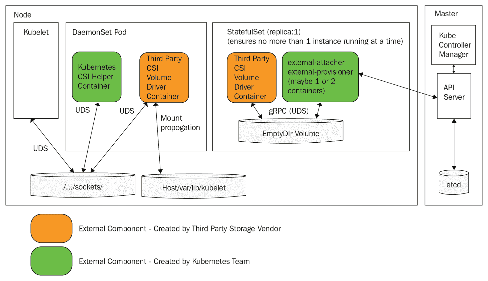
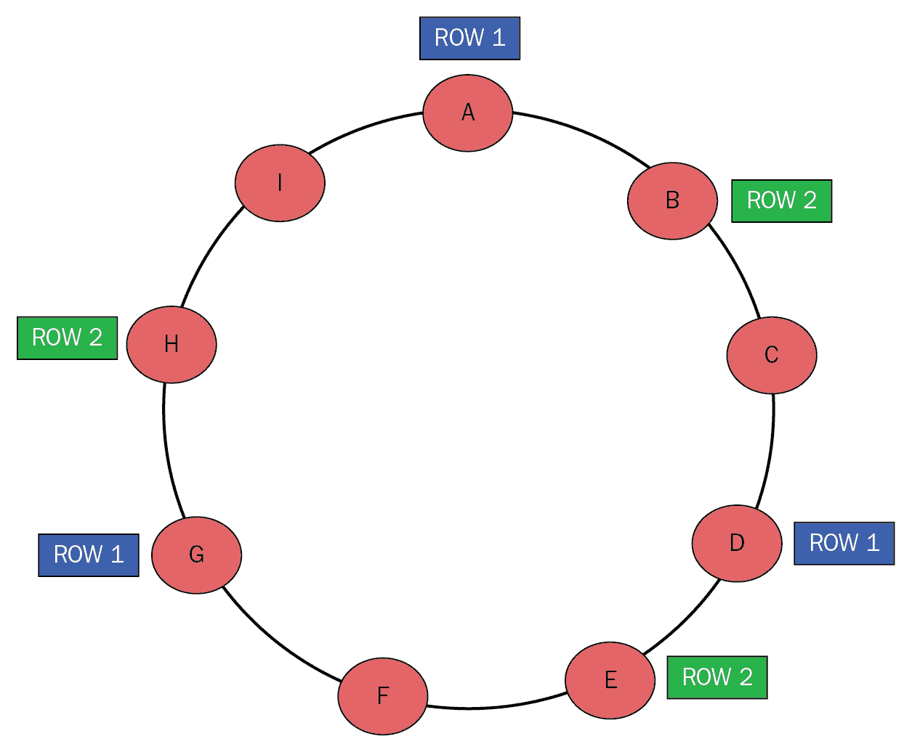

# 使用有状态服务

到目前为止，一切都很有趣。我们构建了服务，将它们部署到 Kubernetes，并对这些服务运行命令和查询。我们通过在部署时调度 Pod 或在出现问题时使 Kubernetes 能够使这些服务正常运行。这对于可以在任何地方运行的无状态服务非常有效。在现实世界中，分布式系统管理重要数据。如果数据库将其数据存储在主机文件系统上，而该主机宕机，您（或 Kubernetes）不能只是在新节点上启动数据库的新实例，因为数据将丢失。

一般来说，通过冗余来防止数据丢失；您可以保留多个副本，存储备份，利用追加日志等。Kubernetes 通过提供整个存储模型以及相关资源的概念来提供帮助，例如卷、卷索赔和 StatefulSets。

在本章中，我们将深入探讨 Kubernetes 存储模型。我们还将扩展 Delinkcious 新闻服务，将其数据存储在 Redis 中，而不是内存中。我们将涵盖以下主题：

+   抽象存储

+   将数据存储在 Kubernetes 集群之外

+   使用 StatefulSets 在 Kubernetes 集群内部存储数据

+   使用本地存储实现高性能

+   在 Kubernetes 中使用关系型数据库

+   在 Kubernetes 中使用非关系型数据存储

# 技术要求

在本章中，我们将检查一些 Kubernetes 清单，使用不同的存储选项，并扩展 Delinkcious 以支持新的数据存储。无需安装任何新内容。

# 代码

代码分为两个 Git 存储库，如下所示：

+   您可以在[`github.com/PacktPublishing/Hands-On-Microservices-with-Kubernetes/tree/master/Chapter08`](https://github.com/PacktPublishing/Hands-On-Microservices-with-Kubernetes/tree/master/Chapter08)找到代码示例

+   您可以在[`github.com/the-gigi/delinkcious/releases/tag/v0.6`](https://github.com/the-gigi/delinkcious/releases/tag/v0.6)找到更新后的 Delinkcious 应用程序

# 抽象存储

Kubernetes 的核心是一个编排引擎，用于管理容器化的工作负载。请注意，这里的关键词是*容器化*。Kubernetes 不关心工作负载是什么，只要它们被打包在容器中；它知道如何处理它们。最初，Kubernetes 只支持 Docker 镜像，然后后来添加了对其他运行时的支持。然后，Kubernetes 1.5 引入了**容器运行时接口**（**CRI**），并逐渐将对其他运行时的显式支持推出了树外。在这里，Kubernetes 不再关心节点上实际部署的容器运行时是什么，只需要与 CRI 一起工作。

类似的情况也发生在网络中，**容器网络接口**（**CNI**）早已定义。Kubernetes 的生命周期很简单。不同的网络解决方案提供它们的 CNI 插件。然而，存储是不同的（直到不是）。在接下来的小节中，我们将介绍 Kubernetes 存储模型，了解树内和树外存储插件之间的区别，最后了解**容器存储接口**（**CSI**），它为 Kubernetes 中的存储提供了一个巧妙的解决方案。

# Kubernetes 存储模型

Kubernetes 存储模型包括几个概念：存储类、卷、持久卷和持久卷索赔。让我们看看这些概念是如何相互作用，允许容器化工作负载在执行期间访问存储的。

# 存储类

存储类是描述可以供应的存储类型的一种方式。通常，在没有指定特定存储类的情况下供应卷时会使用默认存储类。这是 Minikube 中的标准存储类，它在主机上存储数据（即托管节点）。

```
$ kubectl get storageclass
NAME PROVISIONER AGE
standard (default) k8s.io/minikube-hostpath 65d
```

不同的存储类具有与实际后备存储相关的不同参数。卷供应商知道如何使用其存储类的参数。存储类元数据包括供应商，如下所示：

```
$ kubectl get storageclass -o jsonpath='{.items[0].provisioner}'
k8s.io/minikube-hostpath
```

# 卷、持久卷和供应

Kubernetes 中的卷具有与其 pod 相一致的显式生命周期。当 pod 消失时，存储也会消失。有许多类型的卷非常有用。我们已经看到了一些例子，比如 ConfigMap 和 secret 卷。但还有其他用于读写的卷类型。

您可以在这里查看所有卷类型的完整列表：[`kubernetes.io/docs/concepts/storage/volumes/#types-of-volumes`](https://kubernetes.io/docs/concepts/storage/volumes/#types-of-volumes)。

Kubernetes 还支持持久卷的概念。这些卷必须由系统管理员进行配置，而不是由 Kubernetes 本身管理。当您想要持久存储数据时，就可以使用持久卷。管理员可以提前静态配置持久卷。该过程涉及管理员配置外部存储并创建用户可以使用的`PersistentVolume` Kubernetes 对象。

动态配置是动态创建卷的过程。用户请求存储空间，这是动态创建的。动态配置取决于存储类。用户可以指定特定的存储类，否则将使用默认存储类（如果存在）。所有 Kubernetes 云提供商都支持动态配置。Minikube 也支持它（后备存储是本地主机文件系统）。

# 持久卷索赔

因此，集群管理员要么提供一些持久卷，要么集群支持动态配置。现在，我们可以通过创建持久卷索赔来为我们的工作负载索取一些存储空间。但首先，重要的是要理解临时和持久存储之间的区别。我们将在一个 pod 中创建一个临时文件，重新启动 pod，并检查文件是否消失。然后，我们将再次执行相同的操作，但这次将文件写入持久存储，并在重新启动 pod 后检查文件是否仍然存在。

在我们开始之前，让我分享一些方便的 shell 函数和别名，我创建了这些函数和别名，以便快速启动特定 pod 中的交互式会话。Kubernetes 部署会生成随机的 pod 名称。例如，对于`trouble`部署，当前的 pod 名称是`trouble-6785b4949b-84x22`。

```
$ kubectl get po | grep trouble
trouble-6785b4949b-84x22     1/1 Running   1     2h
```

这不是一个很容易记住的名字，而且每当 pod 被重新启动时（由部署自动完成），它也会发生变化。不幸的是，`kubectl exec`命令需要一个确切的 pod 名称来运行命令。我创建了一个名为`get_pod_name_by_label()`的小 shell 函数，它根据标签返回一个 pod 名称。由于 pod 模板中的标签不会改变，这是发现 pod 名称的好方法。然而，可能会有多个来自相同部署的带有相同标签的 pod。我们只需要任何一种类型的 pod，所以我们可以简单地选择第一个。这是函数，我将其别名为`kpn`，这样使用起来更容易：

```
get_pod_name_by_label ()
 {
 kubectl get po -l $1 -o custom-columns=NAME:.metadata.name | tail +2 | uniq
 }

alias kpn='get_pod_name_by_label'
```

例如，`trouble`部署的 pod 可以有一个名为`run=trouble`的标签。这是如何找到实际的 pod 名称：

```
$ get_pod_name_by_label run=trouble
trouble-6785b4949b-84x22
```

使用这个函数，我创建了一个名为`trouble`的别名，它在`trouble` pod 中启动一个交互式的 bash 会话：

```
$ alias trouble='kubectl exec -it $(get_pod_name_by_label run=trouble) bash'
```

现在，我们可以连接到`trouble` pod 并开始在其中工作：

```
$ trouble
root@trouble-6785b4949b-84x22:/#
```

这是一个很长的离题，但这是一个非常有用的技术。现在，让我们回到我们的计划，并创建一个临时文件，如下所示：

```
root@trouble-6785b4949b-84x22:/# echo "life is short" > life.txt
root@trouble-6785b4949b-84x22:/# cat life.txt
life is short
```

现在，让我们杀死这个 pod。`trouble`部署将安排一个新的`trouble` pod，如下所示：

```
$ kubectl delete pod $(get_pod_name_by_label run=trouble)
pod "trouble-6785b4949b-84x22" deleted

$ get_pod_name_by_label run=trouble
trouble-6785b4949b-n6cmj
```

当我们访问新的 pod 时，我们发现`life.txt`如预期般消失了：

```
$ trouble
root@trouble-6785b4949b-n6cmj:/# cat life.txt
cat: life.txt: No such file or directory
```

这是可以理解的，因为它存储在容器的文件系统中。下一步是让`trouble` pod 声明一些持久存储。这里有一个动态提供一吉比特的持久卷索赔：

```
apiVersion: v1
kind: PersistentVolumeClaim
metadata:
  name: some-storage
spec:
  accessModes:
  - ReadWriteOnce
  resources:
    requests:
      storage: 1Gi
  volumeMode: Filesystem
```

这是整个`trouble`部署的 YAML 清单，它作为卷使用这个索赔，并将其挂载到容器中：

```
---
apiVersion: apps/v1
kind: Deployment
metadata:
  name: trouble
  labels:
    run: trouble
spec:
  replicas: 1
  selector:
    matchLabels:
      run: trouble
  template:
    metadata:
      labels:
        run: trouble
    spec:
      containers:
      - name: trouble
        image: g1g1/py-kube:0.2
        imagePullPolicy: Always
        command: ["/bin/bash", "-c", "while true ; do sleep 10 ; done"]
        volumeMounts:
        - name: keep-me
          mountPath: "/data"
      imagePullSecrets:
      - name: private-dockerhub
      volumes:
      - name: keep-me
        persistentVolumeClaim:
          claimName: some-storage
```

`keep-me`卷是基于`some-storage`持久卷索赔的：

```
volumes:
- name: keep-me
  persistentVolumeClaim:
    claimName: some-storage
```

卷被挂载到容器内部的`/data`目录中：

```
volumeMounts:
- name: keep-me
  mountPath: "/data"
```

现在，让我们向`/data`写入一些内容，如下所示：

```
$ trouble
root@trouble-64554479d-tszlb:/# ls /data
root@trouble-64554479d-tszlb:/# cd /data/
root@trouble-64554479d-tszlb:/data# echo "to infinity and be-yond!" > infinity.txt
root@trouble-64554479d-tszlb:/data# cat infinity.txt
to infinity and beyond!
```

最后的状态是删除 pod，并在创建新的 pod 时验证`infinity.txt`文件是否仍然在`/data`中：

```
$ kubectl delete pod trouble-64554479d-tszlb
pod "trouble-64554479d-tszlb" deleted

$ trouble
root@trouble-64554479d-mpl24:/# cat /data/infinity.txt
to infinity and beyond!
```

太好了，它起作用了！一个新的 pod 被创建，并且带有`infinity.txt`文件的持久存储被挂载到了新的容器上。

持久卷也可以用来直接在同一图像的多个实例之间共享信息，因为相同的持久存储将被挂载到使用相同持久存储索赔的所有容器中。

# 树内和树外存储插件

有两种类型的存储插件：内部和外部。内部意味着这些存储插件是 Kubernetes 本身的一部分。在卷子句中，您可以按名称引用它们。例如，在这里，通过名称配置了**Google Compute Engine（GCE）**持久磁盘。Kubernetes 明确知道这样的卷有字段，如`pdName`和`fsType`：

```
volumes:
  - name: test-volume
    gcePersistentDisk:
      pdName: my-data-disk
      fsType: ext4
```

您可以在以下链接找到完整的内部存储插件列表：[`kubernetes.io/docs/concepts/storage/persistent-volumes/#types-of-persistent-volumes`](https://kubernetes.io/docs/concepts/storage/persistent-volumes/#types-of-persistent-volumes)。

还有其他几种专门的卷类型，如`emptyDir`、`local`、`downwardAPI`和`hostPath`，您可以阅读更多相关信息。内部插件的概念有些繁琐。它使 Kubernetes 变得臃肿，并且需要在提供商想要改进其存储插件或引入新插件时改变 Kubernetes 本身。

这就是外部插件出现的地方。其想法是，Kubernetes 定义了一个标准的存储接口和一种提供插件以在运行集群中实现接口的标准方式。然后，集群管理员的工作就是确保适当的外部插件可用。

Kubernetes 支持两种类型的外部插件：FlexVolume 和 CSI。FlexVolume 已经过时。我不会详细介绍 FlexVolume，除了建议您不要使用它。

有关更多详细信息，您可以参考以下链接：[`kubernetes.io/docs/concepts/storage/volumes/#flexVolume`](https://kubernetes.io/docs/concepts/storage/volumes/#flexVolume)

存储的重要组成部分是 CSI。让我们深入了解 CSI 的工作原理以及它是多么巨大的改进。

# 理解 CSI

CSI 旨在解决内部插件的所有问题以及 FlexVolume 插件的繁琐方面。CSI 对存储提供商如此诱人的原因在于，它不仅是 Kubernetes 的标准，而且是行业标准。它允许存储提供商为其存储解决方案编写单个驱动程序，并立即与 Docker、Cloud Foundry、Mesos 和当然还有 Kubernetes 等广泛的容器编排平台兼容。

您可以在[`github.com/container-storage-interface/spec`](https://github.com/container-storage-interface/spec)找到官方规范。

Kubernetes 团队提供了三个组件，它们是旁路容器，并为任何 CSI 存储提供了通用的 CSI 支持。这些组件如下：

+   驱动注册器

+   外部供应商

+   外部连接器

它们的工作是与 kubelet 和 API 服务器进行接口。存储供应商通常会将这些旁路容器与它们的存储驱动实现打包在一个单独的 pod 中，可以部署为 Kubernetes DaemonSet 在所有节点上。

这是一个图表，展示了所有部件之间的交互：



这相当复杂，但这种复杂性是必要的，以分离关注点，允许 Kubernetes 团队进行大量的繁重工作，并让存储供应商专注于他们的存储解决方案。就用户和开发人员而言，这一切都是完全透明的。他们继续通过相同的 Kubernetes 存储抽象（存储类、卷和持久卷索赔）与存储进行交互。

# 标准化 CSI

CSI 优于 in-tree 插件（和 FlexVolume 插件）。然而，目前的混合情况，您可以使用 in-tree 插件（或 FlexVolume 插件）或 CSI 插件，是次优的。Kubernetes 团队有一个详细的计划，将 in-tree 插件迁移到 CSI。

您可以在[`github.com/kubernetes/community/blob/master/contributors/design-proposals/storage/csi-migration.md`](https://github.com/kubernetes/community/blob/master/contributors/design-proposals/storage/csi-migration.md)找到关于这个详细计划的更多信息。

# 将数据存储在 Kubernetes 集群之外

Kubernetes 不是一个封闭的系统。在 Kubernetes 集群内运行的工作负载可以访问集群外运行的存储。当您迁移一个已经存在于存储中、并在 Kubernetes 之外配置和操作的现有应用程序时，这是最合适的。在这种情况下，逐步进行是明智的选择。首先，将工作负载移动为由 Kubernetes 管理的容器运行。这些容器将配置为具有位于集群外的数据存储的端点。稍后，您可以考虑是否值得将这些外部存储引入系统。

还有一些其他使用情况，使用集群外存储是有意义的，比如：

+   您的存储集群使用一些奇特的硬件，或者网络没有成熟的内置或 CSI 插件（希望随着 CSI 成为黄金标准，这种情况会变得罕见）。

+   通过云提供商运行 Kubernetes 可能会太昂贵、风险太大和/或迁移所有数据太慢。

+   组织中的其他应用程序使用相同的存储集群，将所有应用程序和系统迁移到 Kubernetes 通常是不切实际和不经济的。

+   由于监管要求，您必须保留对数据的控制。

在 Kubernetes 之外管理存储有几个缺点：

+   安全性（您需要为您的工作负载提供对单独存储集群的网络访问）。

+   您必须实现存储集群的扩展、可用性、监控和配置。

+   当存储集群端发生变化时，您通常需要在 Kubernetes 端进行相应的配置更改。

+   由于额外的网络跳跃和/或身份验证、授权或加密，可能会遭受性能或延迟开销。

# 使用 StatefulSets 在集群内存储数据

最好将数据存储在 Kubernetes 集群内。这提供了一个统一的一站式管理工作负载和它们所依赖的所有资源的方式（不包括第三方外部服务）。此外，您可以将存储与流线型监控集成，这非常重要。我们将在未来的章节中深入讨论监控。然而，磁盘空间不足是许多系统管理员的苦恼。但是，如果您将数据存储在一个节点上，而您的数据存储 pod 被重新调度到另一个节点，它期望可用的数据却不在那里，这就会出现问题。Kubernetes 的设计者意识到，短暂的 pod 理念对存储不起作用。您可以尝试使用 pod-node 亲和性和 Kubernetes 提供的其他机制来自行管理，但最好使用 StatefulSet，这是 Kubernetes 中管理存储感知服务的特定解决方案。

# 理解 StatefulSet

在其核心，StatefulSet 是一个控制器，管理一组具有一些额外属性的 pod，例如排序和唯一性。StatefulSet 允许其一组 pod 被部署和扩展，同时保留它们的特殊属性。StatefulSets 在 Kubernetes 1.9 中达到了**一般可用性**（**GA**）状态。您可以将 StatefulSet 视为升级版的部署。让我们看一个用户服务的示例 StatefulSet，它使用关系型 PostgresDB 作为其数据存储：

```
apiVersion: apps/v1
kind: StatefulSet
metadata:
  name: user-db
spec:
  selector:
    matchLabels:
      svc: user
      app: postgres
  serviceName: user-db
  replicas: 1
  template:
    metadata:
      labels:
        svc: user
        app: postgres
    spec:
      terminationGracePeriodSeconds: 10
      containers:
      - name: nginx
        image: postgres:11.1-alpine
        ports:
        - containerPort: 5432
        env:
        - name: POSTGRES_DB
          value: user_manager
        - name: POSTGRES_USER
          value: postgres
        - name: POSTGRES_PASSWORD
          value: postgres
        - name: PGDATA
          value: /data/user-db

        volumeMounts:
        - name: user-db
          mountPath: /data/user-db
  volumeClaimTemplates:
  - metadata:
      name: user-db
    spec:
      accessModes: [ "ReadWriteOnce" ]
      # storageClassName: <custom storage class>
      resources:
        requests:
          storage: 1Gi
```

这里有很多内容，但它都是由熟悉的概念组成的。让我们把它分解成组件。

# StatefulSet 组件

StatefulSet 由三个主要部分组成，如下所示：

+   **StatefulSet 元数据和定义**：StatefulSet 元数据和定义与部署非常相似。您有标准的 API 版本，种类和元数据名称；然后，`spec`，其中包括对 pod 的选择器（必须与接下来的 pod 模板选择器匹配），副本的数量（在这种情况下只有一个），以及与部署相比的主要区别，即`serviceName`：

```
apiVersion: apps/v1
kind: StatefulSet
metadata:
  name: user-db
spec:
  selector:
    matchLabels:
      svc: user
      app: postgres
  replicas: 1
  serviceName: user-db
```

StatefulSet *必须*有一个与 StatefulSet 关联的无头服务来管理 pod 的网络标识。在这种情况下，服务名称是`user-db`；这里是为了完整性：

```
apiVersion: v1
kind: Service
metadata:
  name: user-db
spec:
  ports:
  - port: 5432
  clusterIP: None
  selector:
    svc: user
    app: postgres
```

+   **一个 pod 模板**：下一部分是标准的 pod 模板。PGDATA 环境变量（`/data/user-db`）告诉 postgres 从哪里读取和写入数据，必须与`user-db`卷的挂载路径（`/data/user-db`）或子目录相同。这是我们将数据存储与底层存储连接起来的地方：

```
template:
  metadata:
    labels:
      svc: user
      app: postgres
  spec:
    terminationGracePeriodSeconds: 10
    containers:
    - name: nginx
      image: postgres:11.1-alpine
      ports:
      - containerPort: 5432
      env:
      - name: POSTGRES_DB
        value: user_manager
      - name: POSTGRES_USER
        value: postgres
      - name: POSTGRES_PASSWORD
        value: postgres
      - name: PGDATA
        value: /data/user-db
      volumeMounts:
      - name: user-db
        mountPath: /data/user-db
```

+   **卷索赔模板**：最后一部分是卷索赔模板。请注意，这是复数形式；一些数据存储可能需要多种类型的卷（例如，用于日志记录或缓存），这些卷需要它们自己的持久索赔。在这种情况下，一个持久索赔就足够了：

```
volumeClaimTemplates:
- metadata:
    name: user-db
  spec:
    accessModes: [ "ReadWriteOnce" ]
    # storageClassName: <custom storage class>
    resources:
      requests:
        storage: 1Gi
```

现在是深入了解 StatefulSets 的特殊属性以及它们为什么重要的好时机。

# Pod 标识

StatefulSet pod 具有稳定的标识，包括以下三元组：稳定的网络标识，序数索引和稳定的存储。这些总是一起的；每个 pod 的名称是`<statefulset name>-<ordinal>`。

与 StatefulSet 关联的无头服务提供了稳定的网络标识。服务 DNS 名称将如下所示：

```
<service name>.<namespace>.svc.cluster.local
```

每个 pod，*X*，将具有如下稳定的 DNS 名称：

```
<statefulset name>-<ordinal>.<service name>.<namespace>.svc.cluster.local
```

例如，`user-db` StatefulSet 的第一个 pod 将被称为以下内容：

```
user-db-0.user-db.default.svc.cluster.local
```

此外，StatefulSet 的 pod 会自动被分配一个标签，如下所示：

```
statefulset.kubernetes.io/pod-name=<pod-name>
```

# 有序性

StatefulSet 中的每个 pod 都会获得一个序号索引。但是，这有什么作用呢？嗯，一些数据存储依赖于初始化的有序序列。StatefulSet 确保当 StatefulSet 的 pod 被初始化、扩展或缩减时，总是按顺序进行。

在 Kubernetes 1.7 中，有序性限制得到了放宽。对于不需要有序性的数据存储，允许在 StatefulSet 中对多个 pod 进行并行操作是有意义的。这可以在`podPolicy`字段中指定。允许的值有`OrderedReady`用于默认的有序行为，或者*parallel*用于放宽的并行模式，其中可以在其他 pod 仍在启动或终止时启动或终止 pod。

# 何时应该使用 StatefulSet？

当你在云中自己管理数据存储并且需要对数据存储使用的存储有良好的控制时，你应该使用 StatefulSet。主要用例是分布式数据存储，但即使你的数据存储只有一个实例或 pod，StatefulSet 也是有用的。稳定的 pod 标识和稳定的附加存储是非常值得的，尽管有序性当然不是必需的。如果你的数据存储由共享存储层（如 NFS）支持，那么 StatefulSet 可能就不是必要的。

此外，这可能是常识，但如果你不自己管理数据存储，那么你就不需要担心存储层，也不需要定义自己的 StatefulSets。例如，如果你在 AWS 上运行系统并使用 S3、RDS、DynamoDB 和 Redshift，那么你实际上不需要 StatefulSet。

# 比较部署和 StatefulSets

部署旨在管理任何一组 pod。它们也可以用于管理分布式数据存储的 pod。StatefulSets 专门设计用于支持分布式数据存储的需求。然而，有序性和唯一性的特殊属性并不总是必要的。让我们将部署与 StatefulSets 进行比较，自己看看：

+   部署没有关联的存储，而 StatefulSets 有。

+   部署没有关联的服务，而 StatefulSets 有。

+   部署的 pod 没有 DNS 名称，而 StatefulSet 的 pod 有。

+   部署以任意顺序启动和终止 pod，而 StatefulSets 遵循规定的顺序（默认情况下）。

我建议您坚持使用部署，除非您的分布式数据存储需要 StatefulSets 的特殊属性。如果您只需要一个稳定的标识，而不是有序的启动和关闭，那么请使用`podPolicy=Parallel`。

# 审查一个大型 StatefulSet 示例

Cassandra ([`cassandra.apache.org/`](https://cassandra.apache.org/)) 是一个我有很多经验的有趣的分布式数据存储。它非常强大，但需要大量的知识才能正确运行和开发。它也是 StatefulSets 的一个很好的用例。让我们快速回顾一下 Cassandra，并学习如何在 Kubernetes 中部署它。请注意，我们将不会在 Delinkcious 中使用 Cassandra。

# Cassandra 的快速介绍

Cassandra 是一个 Apache 开源项目。它是一个列式数据存储，非常适合管理时间序列数据。我已经使用它来收集和管理来自数千个空气质量传感器网络的数据超过三年。

Cassandra 有一个有趣的建模方法，但在这里，我们关心存储。Cassandra 具有高可用性，线性可扩展性，并且非常可靠（没有 SPOF），通过冗余。Cassandra 节点共享数据的责任（通过分布式哈希表或 DHT 进行分区）。数据的多个副本分布在多个节点上（通常是三个或五个）。

这样，如果 Cassandra 节点出现故障，那么还有其他两个节点具有相同的数据并且可以响应查询。所有节点都是相同的；没有主节点和从节点。节点通过八卦协议不断地与彼此交谈，当新节点加入集群时，Cassandra 会重新分配数据到所有节点。这是一个显示数据如何分布在 Cassandra 集群中的图表：



您可以将节点视为一个环，DHT 算法对每个宽行（工作单元）进行哈希处理，并将其分配给 N 个节点（取决于集群的复制因子）。通过这种对特定节点中的单个行的精确放置，您可以看到 StatefulSet 的稳定标识和潜在的排序属性如何派上用场。

让我们探讨在 Kubernetes 中将 Cassandra 集群部署为 StatefulSet 需要做些什么。

# 使用 StatefulSets 在 Kubernetes 上部署 Cassandra

这是一个截断版本，包括我们应该关注的部分。

第一部分包括`apiVersion`，`kind`，`metadata`和`spec`，正如我们之前所见。名称是`cassandra`，标签是`app: cassandra`。在`spec`中，`serviceName`名称也是`cassandra`，有三个副本：

```
apiVersion: apps/v1
kind: StatefulSet
metadata:
  name: cassandra
  labels:
    app: cassandra
 spec:
   serviceName: cassandra
   replicas: 3
   selector:
     matchLabels:
       app: cassandra 
```

Pod 模板具有匹配的标签`app: cassandra`。容器也被命名为`cassandra`，并使用了一个始终拉取策略的 Google 示例镜像。在这里，`terminationGraceInSeconds`设置为 1,800 秒（即 30 分钟）。这是 StatefulSet 允许 pod 尝试恢复的时间。Cassandra 内置了很多冗余，所以让一个节点尝试恢复 30 分钟是可以接受的。我删除了很多端口、环境变量和就绪检查（省略号）。卷挂载被称为`cassandra-data`，其路径为`/cassandra_data`。这就是 Cassandra 存储其数据文件的地方。

```
template:
  metadata:
    labels:
      app: cassandra
  spec:
    terminationGracePeriodSeconds: 1800
    containers:
    - name: cassandra
      image: gcr.io/google-samples/cassandra:v13
      imagePullPolicy: Always
      ...
      volumeMounts:
      - name: cassandra-data
        mountPath: /cassandra_data
```

最后，卷索赔模板定义了与容器中挂载的名称为`cassandra-data`的卷匹配的持久存储。存储类`fast`在这里没有显示，但通常是运行 Cassandra pod 的同一节点上的本地存储。存储大小为 1 gibibyte。

```
volumeClaimTemplates:
- metadata:
    name: cassandra-data
  spec:
    accessModes: [ "ReadWriteOnce" ]
    storageClassName: fast
    resources:
      requests:
        storage: 1Gi
```

到目前为止，这一切对你来说应该都很熟悉。然而，还有更多成功的 Cassandra 部署要发现。如果你还记得，Cassandra 没有主节点；Cassandra 节点使用 gossip 协议不断地相互交流。

但是 Cassandra 节点如何找到彼此？进入种子提供程序；每当向集群添加新节点时，它都会配置一些种子节点的 IP 地址（在这种情况下为`10.0.0.1`，`10.0.0.2`和`10.0.0.3`）。它开始与这些种子节点交换消息，这些种子节点通知新节点集群中的其他 Cassandra 节点，并通知所有其他现有节点新节点已加入集群。通过这种方式，集群中的每个节点都可以非常快速地了解集群中的每个其他节点。

这是典型 Kubernetes 配置文件（`cassandra.yaml`）中定义种子提供程序的部分。在这种情况下，它只是一个简单的 IP 地址列表。

```
seed_provider:
    - class_name: SEED_PROVIDER
        parameters:
        # seeds is actually a comma-delimited list of addresses.
        # Ex: "<ip1>,<ip2>,<ip3>"
        - seeds: "10.0.0.1,10.0.0.2,10.0.0.3,"
```

种子提供程序也可以是自定义类。这是一个非常好的可扩展设计。在 Kubernetes 中是必要的，因为原始种子节点可能会被移动并获得新的 IP 地址。

为了解决这个问题，有一个自定义的`KubernetesSeedProvider`类，它与 Kubernetes API 服务器通信，并且始终可以返回查询时种子节点的 IP 地址。Cassandra 是用 Java 实现的，自定义种子提供程序也是实现了`SeedProvider` Java 接口的 Java 类。

我们不会详细解析这段代码。需要注意的主要是它与一个名为`cassandra-seed.so`的本地 Go 库进行接口，然后使用它来获取 Cassandra 服务的 Kubernetes 端点：

```
package io.k8s.cassandra;

import java.io.IOException;
import java.net.InetAddress;
import java.util.Collections;
import java.util.List;
import java.util.Map;

...

 /**
 * Create new seed provider
 *
 * @param params
 */
 public KubernetesSeedProvider(Map<String, String> params) {
 }

...
 }
 }

private static String getEnvOrDefault(String var, String def) {
 String val = System.getenv(var);
...
 static class Endpoints {
 public List<InetAddress> ips;
 }
 }
```

完整的源代码可以在[`github.com/kubernetes/examples/blob/master/cassandra/java/src/main/java/io/k8s/cassandra/KubernetesSeedProvider.java`](https://github.com/kubernetes/examples/blob/master/cassandra/java/src/main/java/io/k8s/cassandra/KubernetesSeedProvider.java)找到。

这就是将 Cassandra 连接到 Kubernetes 并使它们能够一起工作的魔力。现在我们已经看到了一个复杂的分布式数据存储如何在 Cassandra 中部署，让我们来看看本地存储，它在 Kubernetes 1.14 中升级为 GA。

# 使用本地存储实现高性能

现在让我们讨论计算和存储之间的关联。速度、容量、持久性和成本之间存在有趣的关系。当您的数据存储在处理器附近时，您可以立即开始处理它，而不是通过网络获取。这就是本地存储的承诺。

有两种主要的本地数据存储方式：内存和本地驱动器。然而，有细微差别；内存是最快的，SSD 驱动器比内存慢大约 4 倍，旋转硬盘比 SSD 驱动器慢大约 20 倍（https://gist.github.com/jboner/2841832）。

现在考虑以下两个选项：

+   将数据存储在内存中

+   将数据存储在本地 SSD 上

# 将数据存储在内存中

就读写延迟和吞吐量而言，保持数据在内存中是性能最高的。有不同的内存类型和缓存，但归根结底，内存非常快。然而，内存也有显著的缺点，例如以下：

+   与磁盘相比，节点的内存要有限得多（也就是说，需要更多的机器来存储相同数量的数据）。

+   内存非常昂贵。

+   内存是短暂的。

有一些用例需要将整个数据集存储在内存中。在这些情况下，数据集要么非常小，要么可以分布在多台机器上。如果数据很重要且不容易生成，那么可以通过以下两种方式解决内存的临时性：

+   保持持久副本。

+   冗余（即在多台机器和可能地理分布的情况下在内存中保留数据）。

# 将数据存储在本地 SSD 上

本地 SSD 的速度不及内存快，但非常快。当然，您也可以始终结合内存缓存（任何体面的数据存储都会利用内存缓存）。当您需要快速性能，但工作集不适合内存，或者您不想支付大内存的高额费用时，使用 SSD 是合适的，因为 SSD 便宜得多，但仍然非常快。例如，Cassandra 建议使用本地 SSD 存储作为其数据的后备存储。

# 在 Kubernetes 中使用关系型数据库

到目前为止，我们在所有服务中都使用了关系型数据库，但是，正如我们很快会发现的那样，我们并没有真正的持久性。首先，我们将看看数据存储在哪里，然后我们将探讨其持久性。最后，我们将迁移其中一个数据库以使用 StatefulSet 来实现适当的持久性和耐久性。

# 了解数据存储的位置

对于 PostgreSQL，有一个`data`目录；可以使用`PGDATA`环境变量设置此目录。默认情况下，它设置为`/var/lib/postgresql/data`：

```
$ kubectl exec -it link-db-6b9b64db5-zp59g env | grep PGDATA
PGDATA=/var/lib/postgresql/data
```

让我们看看这个目录包含什么：

```
$ kubectl exec -it link-db-6b9b64db5-zp59g ls /var/lib/postgresql/data
PG_VERSION pg_multixact pg_tblspc
base pg_notify pg_twophase
global pg_replslot pg_wal
pg_commit_ts pg_serial pg_xact
pg_dynshmem pg_snapshots post-gresql.auto.conf
pg_hba.conf pg_stat postgresql.conf
pg_ident.conf pg_stat_tmp postmaster.opts
pg_logical pg_subtrans postmaster.pid
```

然而，`data`目录可以是临时的或持久的，这取决于它是如何挂载到容器中的。

# 使用部署和服务

通过服务面向数据库 pod，您可以轻松访问数据。当数据库 pod 被杀死时，它将被部署重新启动。但是，由于 pod 可以被调度到不同的节点上，您需要确保它可以访问实际数据所在的存储。否则，它将只是空启动，您将丢失所有数据。这是一个仅用于开发的设置，以及大多数 Delinkcious 服务保持其数据的方式 - 通过运行一个只有其 pod 持久性的 PostgresDB 容器。事实证明，数据存储在运行在 pod 内部的 Docker 容器中。

在 Minikube 中，我可以直接检查 Docker 容器，首先通过 SSH 进入节点，找到 postgres 容器的 ID，然后检查它（也就是说，只有在显示相关信息时）：

```
$ minikube ssh
_ _
_ _ ( ) ( )
___ ___ (_) ___ (_)| |/') _ _ | |_ __
/' _ ` _ `\| |/' _ `\| || , < ( ) ( )| '_`\ /'__`\
| ( ) ( ) || || ( ) || || |\`\ | (_) || |_) )( ___/
(_) (_) (_)(_)(_) (_)(_)(_) (_)`\___/'(_,__/'`\____)

$ docker ps -f name=k8s_postgres_link-db -q
409d4a52a7f5

$ docker inspect -f "{{json .Mounts}}" 409d4a52a7f5 | jq .[1]
{
"Type": "volume",
"Name": "f9d090d6defba28f0c0bfac8ab7935d189332478d0bf03def6175f5c0a2e93d7",
 "Source": "/var/lib/docker/volumes/f9d090d6defba28f0c0bfac8ab7935d189332478d0bf03def6175f5c0a2e93d7/_data",
"Destination": "/var/lib/postgresql/data",
"Driver": "local",
"Mode": "",
"RW": true,
"Propagation": ""
}
```

这意味着，如果容器消失（例如，如果我们升级到新版本），并且当然如果节点消失，那么所有我们的数据都会消失。

# 使用 StatefulSet

使用 StatefulSet，情况就不同了。数据目录被挂载到容器中，但存储本身是由外部管理的。只要外部存储可靠且冗余，我们的数据就是安全的，不管特定容器、pod 和节点发生了什么。我们之前提到过如何使用无头服务为用户数据库定义 StatefulSet。然而，使用 StatefulSet 的存储可能有点具有挑战性。附加到 StatefulSet 的无头服务没有集群 IP。那么，用户服务如何连接到其数据库呢？好吧，我们将不得不帮助它。

# 帮助用户服务定位 StatefulSet pods

无头`user-db`服务没有集群 IP，如下所示：

```
$ kubectl get svc user-db
NAME TYPE CLUSTER-IP EXTERNAL-IP PORT(S) AGE
user-db ClusterIP None <none> 5432/TCP 4d
```

但是，它确实有端点，这些端点是支持服务的所有 pod 在集群中的 IP 地址：

```
$ kubectl get endpoints user-db
NAME ENDPOINTS AGE
user-db 172.17.0.25:5432 4d
```

这是一个不错的选择；端点不会通过环境变量暴露，例如具有集群 IP 的服务（`<service name>_SERVICE_HOST`和`<service name>_SERVICE_PORT`）。因此，为了使服务找到无头服务的端点，它们将不得不直接查询 Kubernetes API。虽然这是可能的，但它增加了服务和 Kubernetes 之间不必要的耦合。我们将无法在 Kubernetes 之外运行服务进行测试，因为它依赖于 Kubernetes API。但是，我们可以欺骗用户服务，并使用配置映射填充`USER_DB_SERVICE_HOST`和`USER_DB_SERVICE_PORT`。

这个想法是 StatefulSet pods 有一个稳定的 DNS 名称。对于用户数据库，有一个 pod，其 DNS 名称是`user-db-0.user-db.default.svc.cluster.local`。在故障排除容器 shell 中，我们可以通过运行`dig`命令来验证 DNS 名称确实解析为用户数据库端点`172.17.0.25`：

```
root@trouble-64554479d-zclxc:/# dig +short us-er-db-0.user-db.default.svc.cluster.local
172.17.0.25
```

现在，我们可以将这个稳定的 DNS 名称分配给`user-manager`服务的配置映射中的`USER_DB_SERVICE_HOST`：

```
apiVersion: v1
kind: ConfigMap
metadata:
  name: user-manager-config
  namespace: default
data:
  USER_DB_SERVICE_HOST: "us-er-db-0.user-db.default.svc.cluster.local"
  USER_DB_SERVICE_PORT: "5432"
```

一旦应用了此配置映射，用户服务将能够通过环境变量找到 StatefulSet 的用户数据库 pod。以下是使用`pkg/db_util/db_util.go`中的这些环境变量的代码：

```
func GetDbEndpoint(dbName string) (host string, port int, err error) {
 hostEnvVar := strings.ToUpper(dbName) + "_DB_SERVICE_HOST"
 host = os.Getenv(hostEnvVar)
 if host == "" {
 host = "localhost"
 }

portEnvVar := strings.ToUpper(dbName) + "_DB_SERVICE_PORT"
 dbPort := os.Getenv(portEnvVar)
 if dbPort == "" {
 dbPort = "5432"
 }

port, err = strconv.Atoi(dbPort)
 return
 }
```

用户服务在其`Run()`函数中调用它以初始化其数据库存储：

```
func Run() {
 dbHost, dbPort, err := db_util.GetDbEndpoint("user")
 if err != nil {
 log.Fatal(err)
 }

store, err := sgm.NewDbUserStore(dbHost, dbPort, "postgres", "postgres")
 if err != nil {
 log.Fatal(err)
 }
 ...
 }
```

现在，让我们看看如何解决管理模式更改的问题。

# 管理模式更改

在使用关系数据库时，最具挑战性的话题之一是管理 SQL 模式。当模式发生变化时，变化可能是向后兼容的（通过添加列）或非向后兼容的（通过将一个表拆分为两个独立的表）。当模式发生变化时，我们需要迁移我们的数据库，还需要迁移受模式更改影响的代码。

如果您可以承受短暂的停机时间，那么该过程可以非常简单，如下所示：

1.  关闭所有受影响的服务并执行 DB 迁移。

1.  部署一个新代码，知道如何处理新模式。

1.  一切都能正常工作。

然而，如果您需要保持系统运行，您将不得不经历一个更复杂的过程，将模式更改分解为多个向后兼容的更改，包括相应的代码更改。

例如，当将一个表拆分为两个表时，可以执行以下过程：

1.  保留原始表格。

1.  添加两个新表。

1.  部署代码，既写入旧表，也写入新表，并且可以从所有表中读取。

1.  将所有数据从旧表迁移到新表。

1.  部署一个只从新表中读取数据的代码更改（现在所有数据都在新表中）。

1.  删除旧表。

关系数据库非常有用；然而，有时正确的解决方案是非关系型数据存储。

# 在 Kubernetes 中使用非关系型数据存储

Kubernetes 和 StatefulSets 并不局限于关系型数据存储，甚至不是为其设计的。非关系型（也称为 NoSQL）数据存储对许多用例非常有用。最通用和流行的内存数据存储之一是 Redis。让我们了解 Redis，并检查如何将 Delinkcious 新闻服务迁移到使用 Redis，而不是将事件存储在临时内存中。

# Redis 简介

Redis 通常被描述为数据结构服务器。由于它将整个数据存储保留在内存中，因此可以高效地对数据执行许多高级操作。当然，你要付出的代价是必须将*所有*数据保留在内存中。这只对小型数据集可能，并且即使如此，也是昂贵的。如果你不访问大部分数据，将其保留在内存中是一种巨大的浪费。Redis 可以用作快速的分布式缓存，用于热数据；因此，即使你不能将其用作内存中整个数据集的分布式缓存，你仍然可以将 Redis 用于热数据（经常使用的数据）。Redis 还支持集群，其中数据在多个节点之间共享，因此它也能处理非常大的数据集。Redis 具有令人印象深刻的功能列表，包括以下内容：

+   它提供了多种数据结构，如列表、哈希、集合、有序集合、位图、流和地理空间索引。

+   它在许多数据结构上提供原子操作。

+   它支持事务。

+   它支持带有 TTL 的自动驱逐。

+   它支持 LRU 驱逐。

+   它启用发布/订阅。

+   它允许可选的持久化到磁盘。

+   它允许将操作可选地附加到日志中。

+   它提供 Lua 脚本。

现在，让我们来看看 Delinkcious 如何使用 Redis。

# 在新闻服务中持久化事件

新闻服务将 Redis 实例作为 StatefulSet 进行配置，如下所示：

```
apiVersion: apps/v1
kind: StatefulSet
metadata:
  name: news-manager-redis
spec:
  serviceName: news-manager-redis
  replicas: 1
  selector:
    matchLabels:
      app: redis
      svc: news-manager
  template:
    metadata:
      labels:
        app: redis
        svc: news-manager
    spec:
      containers:
      - name: redis-primary
        image: redis:5.0.3-alpine
        imagePullPolicy: Always
        ports:
        - containerPort: 6379
          name: redis
        volumeMounts:
        - name: news-manager-redis
          mountPath: /data
  volumeClaimTemplates:
  - metadata:
      name: news-manager-redis
    spec:
      accessModes: [ "ReadWriteOnce" ]
      resources:
        requests:
          storage: 1Gi
```

它由一个无头服务支持：

```
apiVersion: v1
kind: Service
metadata:
  name: news-manager-redis
  labels:
    app: redis
    svc: news-manager
spec:
  selector:
    app: redis
    svc: news-manager
  type: None
  ports:
  - port: 6379
    name: redis
```

我们可以使用相同的技巧，通过使用配置映射将 Redis pod 的 DNS 名称注入到环境变量中：

```
apiVersion: v1
kind: ConfigMap
metadata:
  name: news-manager-config
  namespace: default
data:
  PORT: "6060"
  NEWS_MANAGER_REDIS_SERVICE_HOST: "news-manager-redis-0.news-manager-redis.default.svc.cluster.local"
  USER_DB_SERVICE_PORT: "6379"
```

完成了配置，让我们来看看代码如何访问 Redis。在新闻服务的`Run()`函数中，如果 Redis 的环境变量不为空，它将创建一个新的 Redis 存储：

```
redisHostname := os.Getenv("NEWS_MANAGER_REDIS_SERVICE_HOST")
redisPort := os.Getenv("NEWS_MANAGER_REDIS_SERVICE_PORT")

var store nm.Store
if redisHostname == "" {
store = nm.NewInMemoryNewsStore()
} else {
address := fmt.Sprintf("%s:%s", redisHostname, redisPort)
store, err = nm.NewRedisNewsStore(address)
if err != nil {
log.Fatal(err)
}
}
```

`NewRedisNewStore()`函数在`pkg/new_manager/redis_news_store`中定义。它创建一个新的 Redis 客户端（来自`go-redis`库）。它还调用客户端的`Ping()`方法来确保 Redis 正在运行并且是可访问的：

```
package news_manager

import (
 "github.com/go-redis/redis"
 "github.com/pelletier/go-toml"
 om "github.com/the-gigi/delinkcious/pkg/object_model"
 )

// RedisNewsStore manages a UserEvents data structure
 type RedisNewsStore struct {
 redis *redis.Client
 }

func NewRedisNewsStore(address string) (store Store, err error) {
 client := redis.NewClient(&redis.Options{
 Addr: address,
 Password: "", // use empty password for simplicity. should come from a secret in production
 DB: 0, // use default DB
 })

_, err = client.Ping().Result()
 if err != nil {
 return
 }

store = &RedisNewsStore{redis: client}
 return
 }
```

`RedisNewsStore`将事件存储在 Redis 列表中，并将其序列化为 TOML。这一切都在`AddEvent()`中实现，如下所示：

```
func (m *RedisNewsStore) AddEvent(username string, event *om.Event) (err error) {
 t, err := toml.Marshal(*event)
 if err != nil {
 return
 }
err = m.redis.RPush(username, t).Err()
 return
 }
```

`RedisNewsStore` 实现了 `GetNews()` 方法来按顺序获取事件。首先，它根据起始索引和最大页面大小计算要查询事件列表的起始和结束索引。然后，它获取结果，将它们序列化为 TOML，将它们解组为 `om.Event` 结构，并将它们附加到事件结果列表中。最后，它计算下一个要获取的索引（如果没有更多事件，则为 `-1`）：

```
const redisMaxPageSize = 10

func (m *RedisNewsStore) GetNews(username string, startIndex int) (events []*om.Event, nextIndex int, err error) {
 stop := startIndex + redisMaxPageSize - 1
 result, err := m.redis.LRange(username, int64(startIndex), int64(stop)).Result()
 if err != nil {
 return
 }

for _, t := range result {
 var event om.Event
 err = toml.Unmarshal([]byte(t), &event)
 if err != nil {
 return
 }

events = append(events, &event)
 }

if len(result) == redisMaxPageSize {
 nextIndex = stop + 1
 } else {
 nextIndex = -1
 }

return
 }
```

在这一点上，您应该对非关系型数据存储有很好的掌握，包括何时使用它们以及如何将 Redis 集成为您的服务的数据存储。

# 摘要

在本章中，我们处理了存储和现实世界数据持久性的非常重要的主题。我们了解了 Kubernetes 存储模型、常见存储接口和 StatefulSets。然后，我们讨论了如何在 Kubernetes 中管理关系型和非关系型数据，并迁移了几个 Delinkcious 服务以使用适当的持久性存储通过 StatefulSets，包括如何为 StatefulSet pods 提供数据存储端点。最后，我们使用 Redis 为新闻服务实现了一个非短暂数据存储。在这一点上，您应该清楚地了解了 Kubernetes 如何管理存储，并能够为您的系统选择适当的数据存储，并将它们集成到您的 Kubernetes 集群和服务中。

在下一章中，我们将探索令人兴奋的无服务器计算领域。我们将考虑无服务器模型何时有用，讨论 Kubernetes 的当前解决方案，并通过一些无服务器任务扩展 Delinkcious。

# 进一步阅读

您可以参考以下参考资料获取更多信息：

+   **CSI**: [`medium.com/google-cloud/understanding-the-container-storage-interface-csi-ddbeb966a3b`](https://medium.com/google-cloud/understanding-the-container-storage-interface-csi-ddbeb966a3b)

+   **StatefulSet**: [`kubernetes.io/docs/concepts/workloads/controllers/statefulset/`](https://kubernetes.io/docs/concepts/workloads/controllers/statefulset/)

+   **Cassandra**: [`cassandra.apache.org/`](https://cassandra.apache.org/)

+   **Redis**: [`redis.io/`](http://redis.io/)

+   **程序员应该知道的延迟数字**: [`gist.github.com/jboner/2841832`](https://gist.github.com/jboner/2841832)
