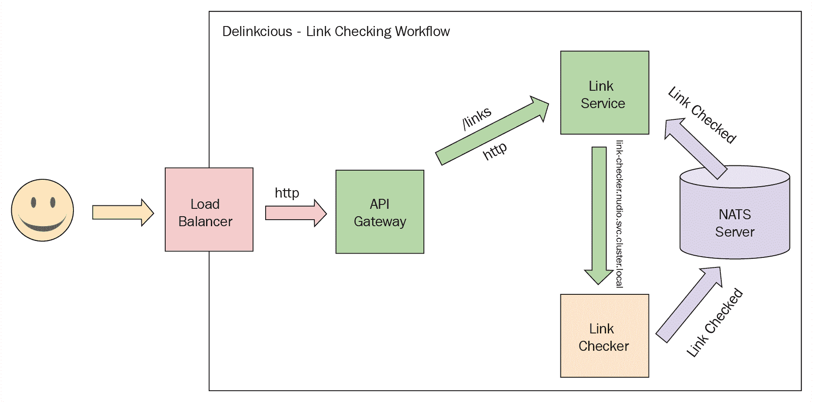
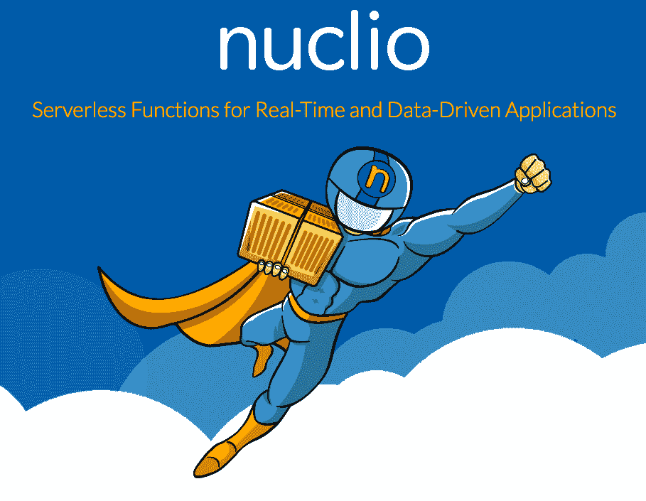
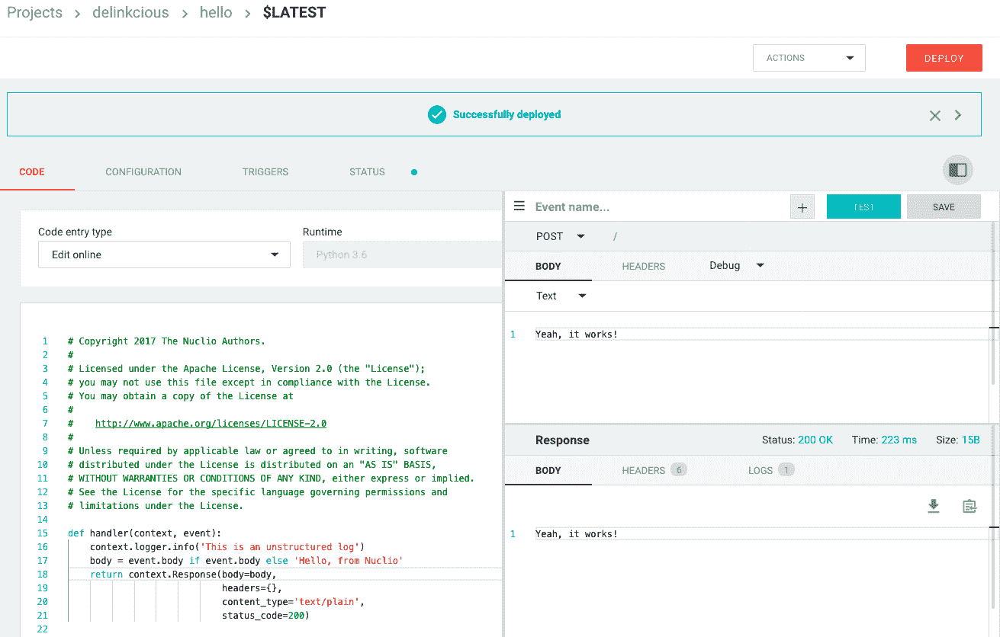

# 第九章：在 Kubernetes 上运行无服务器任务

在本章中，我们将深入探讨云原生系统中最热门的趋势之一：无服务器计算（也称为**函数即服务**或**FaaS**）。我们将解释无服务器意味着什么（剧透警告：它的意义不止一种），以及它与微服务的比较。我们将使用 Nuclio 无服务器框架实现并部署 Delinkcious 的一个很酷的新功能，即链接检查。最后，我们将简要介绍在 Kubernetes 中进行无服务器计算的其他方法。

本章将涵盖以下主题：

+   云中的无服务器

+   使用 Delinkcious 进行链接检查

+   使用 Nuclio 进行无服务器链接检查

# 技术要求

在本章中，我们将安装一个名为 Nuclio 的无服务器框架。首先，让我们创建一个专用命名空间，如下所示：

```
$ kubectl create namespace nuclio
```

这是一个很好的安全实践，因为 Nuclio 不会干扰您集群的其余部分。接下来，我们将应用一些**基于角色的访问控制**（**RBAC**）权限。如果您查看文件（在将其运行在您的集群之前，您应该始终检查 Kubernetes 清单），您会发现大多数权限都限于 Nuclio 命名空间，并且有一些关于 Nuclio 本身创建的**自定义资源定义**（**CRDs**）的集群范围权限；这是一个很好的卫生习惯：

```
$ kubectl apply -f https://raw.githubusercontent.com/nuclio/nuclio/master/hack/k8s/resources/nuclio-rbac.yaml
```

现在让我们部署 Nuclio 本身；它会创建一些 CRD，并部署控制器和仪表板服务。这非常经济和直接，如下所示：

```
$ kubectl apply -f https://raw.githubusercontent.com/nuclio/nuclio/master/hack/k8s/resources/nuclio.yaml
```

现在，让我们通过检查控制器和仪表板 pod 是否成功运行来验证安装：

```
$ kubectl get pods --namespace nuclio
 NAME                               READY     STATUS    RESTARTS   AGE
 nuclio-controller-556774b65-mtvmm   1/1       Running   0          22m
 nuclio-dashboard-67ff7bb6d4-czvxp   1/1       Running   0          22m
```

仪表板很好，但更适合临时探索。对于更严肃的生产使用，最好使用`nuctl` CLI。下一步是从[`github.com/nuclio/nuclio/releases`](https://github.com/nuclio/nuclio/releases)下载并安装`nuctl`。

然后，将可执行文件复制到您的路径中，创建`symlink nuctl`，如下所示：

```
$ cd /usr/local/bin
$ curl -LO https://github.com/nuclio/nuclio/releases/download/1.1.2/nuctl-1.1.2-darwin-amd64
$ ln -s nuctl-1.1.2-darwin-amd64 nuctl
```

最后，让我们创建一个镜像拉取密钥，以便 Nuclio 可以将函数部署到我们的集群中：

```
$ kubectl create secret docker-registry registry-credentials -n nuclio \
 --docker-username g1g1 \
 --docker-password $DOCKERHUB_PASSWORD \
 --docker-server registry.hub.docker.com \
 --docker-email the.gigi@gmail.com

secret "registry-credentials" created
```

您还可以使用其他注册表和适当的凭据；在 Minikube 中，甚至可以使用本地注册表。但是，为了保持一致，我们将使用 Docker Hub 注册表。

# 代码

代码分为两个 Git 存储库，如下所示：

+   您可以在[`github.com/PacktPublishing/Hands-On-Microservices-with-Kubernetes/tree/master/Chapter09`](https://github.com/PacktPublishing/Hands-On-Microservices-with-Kubernetes/tree/master/Chapter09)找到代码示例。

+   您可以在[`github.com/the-gigi/delinkcious/releases/tag/v0.7`](https://github.com/the-gigi/delinkcious/releases/tag/v0.7)找到更新的 Delinkcious 应用程序。

# 云中的无服务器

人们对云中的无服务器有两种不同的定义，特别是在 Kubernetes 的上下文中。第一种意思是您不必管理集群的节点。这个概念的一些很好的例子包括 AWS Fargate（[`aws.amazon.com/fargate/`](https://aws.amazon.com/fargate/)）和 Azure Container Instances（ACI）（[`azure.microsoft.com/en-us/services/container-instances/`](https://azure.microsoft.com/en-us/services/container-instances/)）。无服务器的第二个意思是，您的代码不是部署为长时间运行的服务，而是打包为可以按需调用或以不同方式触发的函数。这个概念的一些很好的例子包括 AWS Lambda 和 Google Cloud Functions。

让我们了解服务和无服务器函数之间的共同点和区别。

# 微服务和无服务器函数

相同的代码通常可以作为微服务或无服务器函数运行。区别主要在于操作。让我们比较微服务和无服务器函数的操作属性，如下所示：

| **微服务** | **无服务器函数** |
| --- | --- |

|

+   始终运行（可以缩减至至少一个）。

+   可以暴露多个端点（如 HTTP 和 gRPC）。

+   需要自己实现请求处理和路由。

+   可以监听事件。

+   服务实例可以维护内存缓存、长期连接和会话。

+   在 Kubernetes 中，微服务直接由服务对象表示。

|

+   按需运行（理论上；它可以缩减到零）。

+   暴露单个端点（通常为 HTTP）。

+   可以通过事件触发或获得自动端点。

+   通常对资源使用和最大运行时间有严格限制。

+   有时，可能会有冷启动（即从零开始扩展）。

+   在 Kubernetes 中，没有原生的无服务器函数概念（作业和定时作业接近）。

|

这应该为您提供一些相对良好的指导，告诉您何时使用微服务，何时使用无服务器函数。在以下情况下，微服务是正确的选择：

+   您的工作负载需要持续运行，或几乎持续运行。

+   每个请求运行的时间很长，无法被无服务器函数的限制所支持。

+   工作负载在调用之间使用本地状态，无法轻松地移动到外部数据存储。

然而，如果您的工作负载很少运行，持续时间相对较短，那么您可能更喜欢使用无服务器函数。

还有一些其他工程考虑要牢记。例如，服务更为熟悉，通常具有各种支持库。开发人员可能更喜欢服务，并希望将代码部署到系统时有一个单一的范例。特别是在 Kubernetes 中，有大量的无服务器函数选项可供选择，很难选择正确的选项。另一方面，无服务器函数通常支持敏捷和轻量级的部署模型，开发人员可以将一些代码放在一起，它就会在集群上神奇地开始运行，因为无服务器函数解决方案负责处理打包和部署的所有业务。

# 在 Kubernetes 中建模无服务器函数

归根结底，Kubernetes 运行容器，因此您知道您的无服务器函数将被打包为容器。然而，在 Kubernetes 中有两种主要表示无服务器函数的方式。第一种是作为代码；在这里，开发人员基本上以某种形式（作为文件或通过将其推送到 Git 存储库）提供函数。第二种是将其构建为实际容器。开发人员构建一个常规容器，无服务器框架负责安排它并将其作为函数运行。

# 函数作为代码

这种方法的好处是，作为开发人员，您完全可以绕过构建图像、标记它们、将它们推送到注册表并将它们部署到集群的整个业务（即部署、服务、入口和 NetworkPolicy）。这对于临时探索和一次性工作也非常有用。

# 函数作为容器

在这里，作为开发人员，您是在熟悉的领域。您使用常规流程构建一个容器，然后稍后将其部署到集群作为无服务器函数。它仍然比常规服务更轻量级，因为您只需要在容器中实现一个函数，而不是一个完整的 HTTP 或 gRPC 服务器，或者注册以监听某些事件。您可以通过无服务器函数解决方案获得所有这些。

# 构建、配置和部署无服务器函数

您已经实现了您的无服务器函数，现在您想要将其部署到集群中。无论您是构建无服务器函数（如果它是一个容器）还是将其提供为函数，通常也需要以某种方式对其进行配置。配置可能包含诸如扩展限制、函数代码位置以及如何调用和触发它的信息。然后，下一步是将函数部署到集群中。这可能是通过 CLI 或 Web UI 的一次性部署，或者也可能与您的 CI/CD 流水线集成。这主要取决于您的无服务器函数是您主要应用程序的一部分，还是您以临时方式启动它以进行故障排除或手动清理任务。

# 调用无服务器函数

一旦无服务器函数在集群中部署，它将处于休眠状态。将有一个控制器不断运行，准备调用或触发函数。控制器应该占用非常少的资源，只需监听传入的请求或事件以触发函数。在 Kubernetes 中，如果您需要从集群外部调用函数，可能会有一些额外的入口配置。然而，最常见的用例是在内部调用函数并向世界公开一个完整的服务。

现在我们了解了无服务器函数的全部内容，让我们为 Delinkcious 添加一些无服务器函数功能。

# 使用 Delinkcious 进行链接检查

Delinkcious 是一个链接管理系统。链接 - 或者，正式称为**统一资源标识符**（**URIs**）- 实际上只是指向特定资源的指针。链接可能存在两个问题，如下所示：

+   它们可能是损坏的（也就是说，它们指向一个不存在的资源）。

+   它们可能指向一个*不良*资源（如钓鱼或注入病毒的网站、仇恨言论或儿童色情）。

检查链接并维护每个链接的状态是链接管理的重要方面。让我们从设计 Delinkcious 执行链接检查的方式开始。

# 设计链接检查

让我们在 Delinkcious 的背景下考虑链接检查。我们应该将当前状态视为未来的改进。以下是一些假设：

+   链接可能是暂时的或永久的中断。

+   链接检查可能是一个繁重的操作（特别是在分析内容时）。

+   链接的状态可能随时改变（也就是说，如果指向的资源被删除，有效链接可能会突然中断）。

具体来说，Delinkcious 链接会按用户冗余存储。如果两个用户添加相同的链接，它将分别为每个用户存储。这意味着，如果在添加链接时进行链接检查，如果*N*用户添加相同的链接，那么每次都会进行检查。这不是很有效，特别是对于许多用户可能添加并且可以从单个检查中受益的热门链接。

考虑以下情况，这甚至更糟：

+   *N*用户添加链接*L*。

+   对于所有这些*N*用户，链接检查*L*都通过了。

+   另一个用户*N+1*添加相同的链接*L*，现在已经损坏（例如，托管公司删除了页面）。

+   只有最后一个用户*N+1*将拥有链接*L*的正确状态，即无效。

+   所有以前的*N*用户仍然会认为链接是有效的。

由于我们在本章中想要专注于无服务器函数，我们将接受 Delinkcious 为每个用户存储链接的方式中的这些限制。将来可能会有更有效和更健壮的设计，如下所示：

+   独立于用户存储所有链接。

+   添加链接的用户将与该链接关联。

+   链接检查将自动反映所有用户的链接的最新状态。

在设计链接检查时，让我们考虑一些以下选项，用于在添加新链接时检查链接：

+   在添加链接时，只需在链接服务中运行链接检查代码。

+   在添加链接时，调用一个单独的链接检查服务。

+   在添加链接时，调用一个无服务器函数进行链接检查。

+   在添加链接时，保持链接处于待定状态，定期对所有最近添加的链接进行检查。

另外，由于链接随时可能会中断，定期对现有链接运行链接检查可能是有用的。

让我们考虑第一个选项，即在链接管理器内部运行链接检查。虽然这样做简单，但也存在一些问题，比如：

+   如果链接检查时间太长（例如，如果目标不可达或内容分类需要很长时间），那么它将延迟对添加链接的用户的响应，甚至可能超时。

+   即使实际的链接检查是异步进行的，它仍然以不可预测的方式占用了链接服务的资源。

+   没有简单的方法可以安排定期检查或临时检查链接，而不对链接管理器进行重大更改。

+   从概念上讲，链接检查是链接管理的一个单独责任，不应该存在于同一个微服务中。

让我们考虑第二个选项，即实施一个专门的链接检查服务。这个选项解决了大部分第一个选项的问题，但可能有些过度。也就是说，当没有必要经常检查链接时，这并不是最佳选项；例如，如果大多数添加的链接都经过了检查，或者链接检查只是定期进行。此外，为了实施一个单一操作的服务，检查链接似乎有些过度。

这让我们剩下了第三和第四个选项，两者都可以通过无服务器函数解决方案有效实施，如下图所示。

让我们从以下简单的设计开始：

+   当添加新链接时，链接管理器将调用一个无服务器函数。

+   新链接最初将处于待定状态。

+   无服务器函数将仅检查链接是否可达。

+   无服务器函数将通过 NATS 系统发送一个事件，链接管理器将订阅该事件。

+   当链接管理器接收到事件时，将更新链接状态从“待定”到“有效”或“无效”。

以下是描述这一流程的图表：



有了一个坚实的设计，让我们继续实施并将其与 Delinkcious 集成。

# 实施链接检查

在这个阶段，我们将独立于无服务器函数实现链接检查功能。让我们从我们的对象模型开始，并向我们的链接对象添加`Status`字段，可能的值为`pending`、`valid`和`invalid`。我们在这里定义了一个名为`LinkStatus`的`alias`类型，并为这些值定义了常量。但是，请注意，它不像其他语言中的强类型`enum`，它实际上只是一个字符串：

```
const (
     LinkStatusPending = "pending"
     LinkStatusValid   = "valid"
     LinkStatusInvalid = "invalid"
 )

 type LinkStatus = string

 type Link struct {
     Url         string
     Title       string
     Description string
     Status      LinkStatus
     Tags        map[string]bool
     CreatedAt   time.Time
     UpdatedAt   time.Time
 }
```

让我们也定义一个`CheckLinkRequest`对象，以后会派上用场。请注意，每个请求都是针对特定用户的，并包括链接的 URL：

```
type CheckLinkRequest struct {
     Username string
     Url      string
 }
```

现在，让我们定义一个接口，`LinkManager`将实现该接口以在链接检查完成时得到通知。该接口非常简单，只有一个方法，用于通知接收者（在我们的例子中是`LinkManager`）用户、URL 和链接状态：

```
type LinkCheckerEvents interface {
     OnLinkChecked(username string, url string, status LinkStatus)
 }
```

让我们创建一个新的包`pkg/link_checker`，以隔离这个功能。它有一个名为`CheckLink()`的函数，接受一个 URL，并使用内置的 Go HTTP 客户端调用其 HEAD HTTP 方法。

如果结果小于 400，则被视为成功，否则将 HTTP 状态作为错误返回：

```
package link_checker

 import (
     "errors"
     "net/http"
 )

 // CheckLinks tries to get the headers of the target url and returns error if it fails
 func CheckLink(url string) (err error) {
     resp, err := http.Head(url)
     if err != nil {
         return
     }
     if resp.StatusCode >= 400 {
         err = errors.New(resp.Status)
     }
     return
 }
```

HEAD 方法只返回一些头部信息，是检查链接是否可达的有效方法，因为即使对于非常大的资源，头部信息也只是一小部分数据。显然，如果我们想将链接检查扩展到扫描和分析内容，这是不够的，但现在可以用。

根据我们的设计，当链接检查完成时，`LinkManager`应该通过 NATS 接收到一个事件，其中包含检查结果。这与新闻服务监听链接事件（如链接添加和链接更新事件）非常相似。让我们为 NATS 集成实现另一个包`link_checker_events`，它将允许我们发送和订阅链接检查事件。首先，我们需要一个包含用户名、URL 和链接状态的事件对象：

```
package link_checker_events

 import (
     om "github.com/the-gigi/delinkcious/pkg/object_model"
 )

 type Event struct {
     Username string
     Url      string
     Status   om.LinkStatus
 }
```

然后，我们需要能够通过 NATS 发送事件。`eventSender`对象实现了`LinkCheckerEvents`接口。每当它接收到调用时，它会创建`link_checker_events.Event`并将其发布到 NATS：

```
package link_checker_events

 import (
     "github.com/nats-io/go-nats"
     om "github.com/the-gigi/delinkcious/pkg/object_model"
     "log"
 )

 type eventSender struct {
     hostname string
     nats     *nats.EncodedConn
 }

 func (s *eventSender) OnLinkChecked(username string, url string, status om.LinkStatus) {
     err := s.nats.Publish(subject, Event{username, url, status})
     if err != nil {
         log.Fatal(err)
     }
 }

 func NewEventSender(url string) (om.LinkCheckerEvents, error) {
     ec, err := connect(url)
     if err != nil {
         return nil, err
     }
     return &eventSender{hostname: url, nats: ec}, nil
 }
```

事件在`link_checker_events`包中定义，而不是在一般的 Delinkcious 对象模型中定义的原因是，这个事件只是为了通过 NATS 与链接检查监听器进行接口交互而创建的。没有必要在包外部暴露这个事件（除了让 NATS 对其进行序列化）。在`Listen()`方法中，代码连接到 NATS 服务器并在队列中订阅 NATS（这意味着即使多个订阅者订阅了同一个队列，也只有一个监听器会处理每个事件）。

当订阅到队列的监听函数从 NATS 接收到事件时，它将其转发到实现`om.LinkCheckerEvents`的事件接收器（同时忽略链接删除事件）：

```
package link_manager_events

 import (
     om "github.com/the-gigi/delinkcious/pkg/object_model"
 )

 func Listen(url string, sink om.LinkManagerEvents) (err error) {
     conn, err := connect(url)
     if err != nil {
         return
     }

     conn.QueueSubscribe(subject, queue, func(e *Event) {
         switch e.EventType {
         case om.LinkAdded:
             {
                 sink.OnLinkAdded(e.Username, e.Link)
             }
         case om.LinkUpdated:
             {
                 sink.OnLinkUpdated(e.Username, e.Link)
             }
         default:
             // Ignore other event types
         }
     })

     return
 }
```

如果您仔细跟随，您可能已经注意到有一个关键部分缺失，这是我们在设计中描述的，即调用链接检查。一切都已经连接好，准备好检查链接，但实际上没有人在调用链接检查。这就是`LinkManager`发挥作用的地方，用来调用无服务器函数。

# 使用 Nuclio 进行无服务器链接检查

在我们深入研究`LinkManager`并关闭 Delinkcious 中的链接检查循环之前，让我们熟悉一下 Nuclio（[`nuclio.io/`](https://nuclio.io/)），并探索它如何为 Delinkcious 提供非常适用的无服务器函数解决方案。

# Nuclio 的简要介绍

Nuclio 是一个经过精心打磨的开源平台，用于高性能无服务器函数。它由 Iguazio 开发，并支持多个平台，如 Docker、Kubernetes、GKE 和 Iguazio 本身。我们显然关心 Kubernetes，但有趣的是 Nuclio 也可以在其他平台上使用。它具有以下功能：

+   它可以从源代码构建函数，也可以提供您自己的容器。

+   这是一个非常清晰的概念模型。

+   它与 Kubernetes 集成非常好。

+   它使用一个名为`nuctl`的 CLI。

+   如果您想要交互式地使用它，它有一个 Web 仪表板。

+   它有一系列方法来部署、管理和调用您的无服务器函数。

+   它提供 GPU 支持。

+   这是一个 24/7 支持的托管解决方案（需要付费）。

最后，它有一个超酷的标志！您可以在这里查看标志：



现在让我们使用 Nuclio 构建和部署我们的链接检查功能到 Delinkcious 中。

# 创建一个链接检查无服务器函数

第一步是创建一个无服务器函数；这里有两个组件：

+   函数代码

+   函数配置

让我们创建一个专门的目录，名为`fun`，用于存储无服务器函数。无服务器函数实际上不属于我们现有的任何类别；也就是说，它们既不是普通的包，也不是服务，也不是命令。我们可以将函数代码和其配置作为一个 YAML 文件放在`link_checker`子目录下。以后，如果我们决定将其他功能建模为无服务器函数，那么我们可以为每个函数创建额外的子目录，如下所示：

```
$ tree fun
 fun
 └── link_checker
 ├── function.yaml
 └── link_checker.go
```

函数本身是在`link_checker.go`中实现的。`link_checker`函数负责在触发时检查链接并向 NATS 发布结果事件。让我们逐步分解，从导入和常量开始。我们的函数将利用 Nuclio GO SDK，该 SDK 提供了一个标准签名，我们稍后会看到。它还导入了我们的 Delinkcious 包：`object_model`，`link_checker`和`link_checker_events`包。

在这里，我们还根据众所周知的 Kubernetes DNS 名称定义 NATS URL。请注意，`natsUrl`常量包括命名空间（默认情况下）。`link_checker`无服务器函数将在 Nuclio 命名空间中运行，但将向运行在默认命名空间中的 NATS 服务器发送事件。

这不是一个问题；命名空间在网络层不是相互隔离的（除非你明确创建了网络策略）：

```
package main

 import (
     "encoding/json"
     "errors"
     "fmt"
     "github.com/nuclio/nuclio-sdk-go"
     "github.com/the-gigi/delinkcious/pkg/link_checker"
     "github.com/the-gigi/delinkcious/pkg/link_checker_events"
     om "github.com/the-gigi/delinkcious/pkg/object_model"
 )

 const natsUrl = "nats-cluster.default.svc.cluster.local:4222"
```

实现 Nuclio 无服务器函数（使用 Go）意味着实现具有特定签名的处理函数。该函数接受 Nuclio 上下文和 Nuclio 事件对象。两者都在 Nuclio GO SDK 中定义。处理函数返回一个空接口（基本上可以返回任何东西）。但是，这里我们使用的是 HTTP 调用函数的标准 Nuclio 响应对象。Nuclio 事件有一个`GetBody()`消息，可以用来获取函数的输入。

在这里，我们使用 Delinkcious 对象模型中的标准 JSON 编码器对`CheckLinkRequest`进行解组。这是调用`link_checker`函数的人和函数本身之间的契约。由于 Nuclio 提供了一个通用签名，我们必须验证在请求体中提供的输入。如果没有提供，那么`json.Unmarshal()`调用将失败，并且函数将返回 400（即，错误的请求）错误：

```
func Handler(context *nuclio.Context, event nuclio.Event) (interface{}, error) { r := nuclio.Response{ StatusCode: 200, ContentType: "application/text", }

body := event.GetBody()
 var e om.CheckLinkRequest
 err := json.Unmarshal(body, &e)
 if err != nil {
     msg := fmt.Sprintf("failed to unmarshal body: %v", body)
     context.Logger.Error(msg)

     r.StatusCode = 400
     r.Body = []byte(fmt.Sprintf(msg))
     return r, errors.New(msg)

 }
```

此外，如果解组成功，但生成的`CheckLinkRequest`具有空用户名或空 URL，则仍然是无效输入，函数也将返回 400 错误：

```
username := e.Username
 url := e.Url
 if username == "" || url == "" {
     msg := fmt.Sprintf("missing USERNAME ('%s') and/or URL ('%s')", username, url)
     context.Logger.Error(msg)

     r.StatusCode = 400
     r.Body = []byte(msg)
     return r, errors.New(msg)
 }
```

在这一点上，函数验证了输入，我们得到了一个用户名和一个 URL，并且准备检查链接本身是否有效。只需调用我们之前实现的`pkg/link_checker`包的`CheckLink()`函数。状态初始化为`LinkStatusValid`，如果检查返回错误，则状态设置为`LinkStatusInvalid`如下：

```
status := om.LinkStatusValid
err = link_checker.CheckLink(url)
if err != nil {
status = om.LinkStatusInvalid
     }
```

但是，不要混淆！`pkg/link_checker`包是实现`CheckLink()`函数的包。相比之下，`fun/link_checker`是一个调用`CheckLink()`的 Nuclio 无服务器函数。

链接已经被检查，我们有了它的状态；现在是时候通过 NATS 发布结果了。同样，我们已经在`pkg/link_checker_events`中完成了所有的艰苦工作。函数使用`natsUrl`常量创建一个新的事件发送器。如果失败，函数将返回错误。如果发送器被正确创建，它将使用用户名、URL 和状态调用其`OnLinkChecked()`方法。最后，它返回 Nuclio 响应（初始化为 200 OK）和无错误，如下所示：

```
    sender, err := link_checker_events.NewEventSender(natsUrl)
     if err != nil {
         context.Logger.Error(err.Error())

         r.StatusCode = 500
         r.Body = []byte(err.Error())
         return r, err
     }

     sender.OnLinkChecked(username, url, status)
     return r, nil
```

然而，代码只是故事的一半。让我们在`fun/link_checker/function.yaml`中审查函数配置。它看起来就像一个标准的 Kubernetes 资源，这不是巧合。

您可以在[`nuclio.io/docs/latest/reference/function-configuration-reference/`](https://nuclio.io/docs/latest/reference/function-configuration-reference/)查看完整规范。

在下面的代码块中，我们指定了 API 版本、种类（`NuclioFunction`），然后是规范。我们填写了描述，运行时字段为 Golang，处理程序定义了实现处理程序函数的包和函数名称。我们还指定了最小和最大副本数，在这种情况下都是`1`。请注意，Nuclio 没有提供缩放到零的方法。每个部署的函数都至少有一个副本等待触发。配置的唯一自定义部分是`build`命令，用于安装`ca-certificates`包。这使用了**Alpine Linux Package Manager**（**APK**）系统。这是必要的，因为链接检查器需要检查 HTTPS 链接，这需要根 CA 证书。

```
apiVersion: "nuclio.io/v1beta1"
 kind: "NuclioFunction"
 spec:
   description: >
     A function that connects to NATS, checks incoming links and publishes LinkValid or LinkInvalid events.
   runtime: "golang"
   handler: main:Handler
   minReplicas: 1
   maxReplicas: 1
   build:
     commands:
     - apk --update --no-cache add ca-certificates
```

好了！我们创建了一个链接检查器无服务器函数和一个配置；现在让我们将其部署到我们的集群中。

# 使用 nuctl 部署链接检查器函数

当 Nuclio 部署函数时，实际上会构建一个 Docker 镜像并将其推送到注册表中。在这里，我们将使用 Docker Hub 注册表；所以，首先让我们登录：

```
$ docker login
Login with your Docker ID to push and pull images from Docker Hub. If you don't have a Docker ID, head over to https://hub.docker.com to create one.
 Username: g1g1
 Password:
 Login Succeeded
```

函数名称必须遵循 DNS 命名规则，因此`link_checker`中的`""`标记是不可接受的。相反，我们将命名函数为`link-checker`并运行`nuctl deploy`命令，如下所示：

```
$ cd fun/link_checker
$ nuctl deploy link-checker -n nuclio -p . --registry g1g1

 nuctl (I) Deploying function {"name": "link-checker"}
 nuctl (I) Building {"name": "link-checker"}
 nuctl (I) Staging files and preparing base images
 nuctl (I) Pulling image {"imageName": "quay.io/nuclio/handler-builder-golang-onbuild:1.1.2-amd64-alpine"}
 nuctl (I) Building processor image {"imageName": "processor-link-checker:latest"}
 nuctl (I) Pushing image {"from": "processor-link-checker:latest", "to": "g1g1/processor-link-checker:latest"}
 nuctl (I) Build complete {"result": {"Image":"processor-link-checker:latest"...}}
 nuctl (I) Function deploy complete {"httpPort": 31475}
```

请注意，目前编写时使用`nuctl`将函数部署到 Docker Hub 注册表的文档是不正确的。我为 Nuclio 团队打开了一个 GitHub 问题（[`github.com/nuclio/nuclio/issues/1181`](https://github.com/nuclio/nuclio/issues/1181)）。希望在您阅读此文时能够修复。

函数已部署到 Nuclio 命名空间，如下所示：

```
$ kubectl get nucliofunctions -n nuclio
 NAME           AGE
 link-checker   42m
```

查看所有配置的最佳方法是再次使用`nuctl`：

```
$ nuctl get function -n nuclio -o yaml
 metadata:
 name: link-checker
 namespace: nuclio
 spec:
 alias: latest
 build:
 path: .
 registry: g1g1
 timestamp: 1554442452
 description: |
A function with a configuration that connects to NATS, listens to LinkAdded events, check the links and send LinkValid or LinkInvalid events.
 handler: main:Handler
 image: g1g1/processor-link-checker:latest
 imageHash: "1554442427312071335"
 maxReplicas: 1
 minReplicas: 1
 platform: {}
 readinessTimeoutSeconds: 30
 replicas: 1
 resources: {}
 runRegistry: g1g1
 runtime: golang
 serviceType: NodePort
 targetCPU: 75
 version: -1
```

正如您所看到的，它大量借鉴了我们的`function.yaml`配置文件。

我们已成功使用`nuctl` CLI 部署了我们的函数，这对开发人员和 CI/CD 系统非常有用。现在让我们看看如何使用 Nuclio Web UI 部署函数。

# 使用 Nuclio 仪表板部署函数

Nuclio 有一个很酷的 Web UI 仪表板。Nuclio 仪表板做得非常好；它作为一个服务安装在我们的集群中。首先，我们需要在访问之前进行一些端口转发：

```
$ kubectl port-forward -n nuclio $(kubectl get pods -n nuclio -l nuclio.io/app=dashboard -o jsonpath='{.items[0].metadata.name}') 8070
```

接下来，我们可以浏览到`localhost:8070`并使用仪表板。仪表板允许您直接从单个屏幕查看、部署和测试（或调用）无服务器函数。这对于临时探索非常有用。

在这里，我稍微修改了`hello`示例函数（用 Python），甚至用文本`Yeah, it works!`进行了测试：



一旦函数在集群中部署，我们可以以不同的方式调用它。

# 直接调用链接检查器函数

使用`nuctl`调用函数非常简单。我们需要提供函数名称（`link-checker`），命名空间，集群 IP 地址和输入到函数的主体：

```
nuctl invoke link-checker -n nuclio --external-ips $(mk ip)
```

# 在 LinkManager 中触发链接检查

在开发函数并希望快速进行编辑-部署-调试周期时，使用`nuctl`是不错的。但是，在生产中，您将希望通过使用 HTTP 端点或其中一个触发器来调用函数。对于 Delinkcious，最简单的方法是让`LinkManager`直接命中 HTTP 端点。这发生在将新链接添加到`LinkManager`的`AddLink()`方法时。它只是调用`triggerLinkCheck`并提供用户名和 URL，如下所示：

```
func (m *LinkManager) AddLink(request om.AddLinkRequest) (err error) {
     ...

     // Trigger link check asynchronously (don't wait for result)
     triggerLinkCheck(request.Username, request.Url)
     return
 }
```

重要的是`AddLink()`方法不必等待链接检查完成。如果记得，链接将立即以*pending*状态存储。稍后，当检查完成时，状态将更改为*valid*或*invalid*。为了实现这一点，`triggerLinkCheck()`函数运行一个 goroutine，立即返回控制。

与此同时，goroutine 准备了`om.CheckLinkRequest`，这是`link_checker`无服务器函数的处理程序所期望的。它通过`json.Marshal()`将其序列化为 JSON，并使用 Go 内置的 HTTP 客户端，向 Nuclio 命名空间中链接检查函数的 URL 发送 POST 请求（在另一个命名空间中命中 HTTP 端点没有问题）。在这里，我们只忽略任何错误；如果出现问题，那么链接将保持在*pending*状态，我们可以稍后决定如何处理它。

```
// Nuclio functions listen by default on port 8080 of their service IP
 const link_checker_func_url = "http://link-checker.nuclio.svc.cluster.local:8080"

func triggerLinkCheck(username string, url string) {
     go func() {
         checkLinkRequest := &om.CheckLinkRequest{Username: username, Url: url}
         data, err := json.Marshal(checkLinkRequest)
         if err != nil {
             return
         }

         req, err := http.NewRequest("POST", link_checker_func_url, bytes.NewBuffer(data))
         req.Header.Set("Content-Type", "application/json")
         client := &http.Client{}
         resp, err := client.Do(req)
         if err != nil {
             return
         }
         defer resp.Body.Close()
     }()
 }
```

我们在这里做了很多工作，但我们保持了一切松散耦合并准备进行扩展。很容易添加更复杂的链接检查逻辑，以便触发链接检查作为 NATS 事件，而不是直接命中 HTTP 端点，甚至用完全不同的无服务器函数解决方案替换 Nuclio 无服务器函数。让我们简要地看一下以下部分中的其他选项。

# 其他 Kubernetes 无服务器框架

AWS Lambda 函数使云中的无服务器函数非常受欢迎。Kubernetes 不是一个完全成熟的无服务器函数原语，但它通过作业和 CronJob 资源非常接近。除此之外，社区开发了大量无服务器函数解决方案（Nuclio 就是其中之一）。以下是一些更受欢迎和成熟的选项，我们将在以下小节中看到：

+   Kubernetes 作业和 CronJobs

+   KNative

+   Fission

+   Kubeless

+   OpenFaas

# Kubernetes 作业和 CronJobs

Kubernetes 部署和服务都是关于创建一组长时间运行的 pod，这些 pod 应该无限期地运行。 Kubernetes Job 的目的是运行一个或多个 pod，直到其中一个成功完成。当您创建一个 Job 时，它看起来非常像一个部署，只是重启策略应该是`Never`。

以下是一个从 Python 打印`Yeah, it works in a Job!!!`的 Kubernetes Job：

```
apiVersion: batch/v1
kind: Job
metadata:
  name: yeah-it-works
spec:
  template:
    spec:
      containers:
      - name: yeah-it-works
        image: python:3.6-alpine
        command: ["python",  "-c", "print('Yeah, it works in a Job!!!')"]
      restartPolicy: Never
```

现在我可以运行这个 Job，观察它的完成，并检查日志，如下所示：

```
$ kubectl create -f job.yaml
 job.batch/yeah-it-works created

 $ kubectl get po | grep yeah-it-works
 yeah-it-works-flzl5            0/1     Completed   0          116s

 $ kubectl logs yeah-it-works-flzl5
 Yeah, it works in a Job!!!
```

这几乎是一个无服务器函数。当然，它没有所有的花里胡哨，但核心功能是存在的：启动一个容器，运行它直到完成，并获取结果。

Kubernetes CronJob 类似于 Job，只是它会按计划触发。如果您不想在第三方无服务器函数框架上增加额外的依赖项，那么您可以在 Kubernetes Job 和 CronJob 对象之上构建一个基本解决方案。

# KNative

KNative（[`cloud.google.com/knative/`](https://cloud.google.com/knative/)）是无服务器函数领域的相对新手，但我实际上预测它将成为主流的首选解决方案，其中有几个原因，例如：

+   这是一个强大的解决方案，可以缩放到零（不像 Nuclio）。

+   它可以在集群内构建镜像（使用 Kaniko）。

+   它是特定于 Kubernetes 的。

+   它有 Google 的支持，并且可以通过 Cloud Run 在 GKE 上使用（[`cloud.google.com/blog/products/serverless/announcing-cloud-run-the-newest-member-of-our-serverless-compute-stack`](https://cloud.google.com/blog/products/serverless/announcing-cloud-run-the-newest-member-of-our-serverless-compute-stack)）。

+   它使用 Istio 服务网格作为基础，而 Istio 变得非常重要（更多信息请参见第十三章，*服务网格-使用 Istio*）。

KNative 有三个独立的组件，如下所示：

+   构建

+   服务

+   事件

它被设计为非常可插拔，以便您可以自己选择构建器或事件源。构建组件负责从源代码到镜像的转换。服务组件负责扩展所需的容器数量以处理负载。它可以根据生成的负载进行扩展，或者减少，甚至可以减少到零。事件组件与在无服务器函数中生成和消耗事件有关。

# Fission

Fission（[`fission.io/`](https://fission.io/)）是来自 Platform9 的开源无服务器框架，支持多种语言，如 Python、NodeJS、Go、C#和 PHP。它可以扩展以支持其他语言。它保持一组准备就绪的容器，因此新的函数调用具有非常低的延迟，但在没有负载时无法实现零缩放。Fission 特别之处在于它能够通过 Fission 工作流（[`fission.io/workflows/`](https://fission.io/workflows/)）组合和链接函数。这类似于 AWS 步函数；Fission 的其他有趣特性包括以下内容：

+   它可以与 Istio 集成进行监控。

+   它可以通过 Fluentd 集成将日志整合到 CLI 中（Fluentd 会自动安装为 DaemonSet）。

+   它提供了 Prometheus 集成，用于指标收集和仪表板可见性。

# Kubeless

Kubeless 是 Bitnami 推出的另一个 Kubernetes 原生框架。它使用函数、触发器和运行时的概念模型，这些模型是使用通过 ConfigMaps 配置的 Kubernetes CRD 实现的。Kubeless 使用 Kubernetes 部署来部署函数 pod，并使用**Horizontal Pod Autoscaler**（**HPA**）进行自动缩放。

这意味着 Kubeless 不能实现零缩放，因为目前 HPA 不能实现零缩放。Kubeless 最主要的亮点之一是其出色的用户界面。

# OpenFaas

OpenFaas（[`www.openfaas.com/`](https://www.openfaas.com/)）是最早的 FaaS 项目之一。它可以在 Kubernetes 或 Docker Swarm 上运行。由于它是跨平台的，它以通用的非 Kubernetes 方式执行许多操作。例如，它可以通过使用自己的函数容器管理来实现零缩放。它还支持许多语言，甚至支持纯二进制函数。

它还有 OpenFaaS Cloud 项目，这是一个完整的基于 GitOps 的 CI/CD 流水线，用于管理您的无服务器函数。与其他无服务器函数项目类似，OpenFaas 有自己的 CLI 和 UI 用于管理和部署。

# 总结

在本章中，我们以一种时尚的方式为 Delinkcious 引入了链接检查！我们讨论了无服务器场景，包括它的两个常见含义；即不处理实例、节点或服务器，以及云函数作为服务。然后，我们在 Delinkcious 中实现了一个松散耦合的解决方案，利用我们的 NATS 消息系统来在链接被检查时分发事件。然后，我们详细介绍了 Nuclio，并使用它来闭环，并让`LinkManager`启动无服务器函数进行链接检查，并稍后得到通知以更新链接状态。

最后，我们调查了许多其他解决方案和 Kubernetes 上的无服务器函数框架。在这一点上，您应该对无服务器计算和无服务器函数有一个扎实的了解。您应该能够就您的系统和项目是否可以从无服务器函数中受益以及哪种解决方案最佳做出明智的决定。很明显，这些好处是真实的，而且这不是一个会消失的时尚。我预计 Kubernetes 中的无服务器解决方案将 consolide（可能围绕 KNative）并成为大多数 Kubernetes 部署的基石，即使它们不是核心 Kubernetes 的一部分。

在下一章中，我们将回到基础知识，并探讨我最喜欢的一个主题，即测试。测试可以成就或毁掉大型项目，在微服务和 Kubernetes 的背景下有许多经验教训可以应用。

# 更多阅读

您可以参考以下参考资料以获取更多信息：

+   Nuclio 文档: [`nuclio.io/docs/latest`](https://nuclio.io/docs/latest)

+   Kubernetes（作业-运行完成）: [`kubernetes.io/docs/concepts/workloads/controllers/jobs-run-to-completion/`](https://kubernetes.io/docs/concepts/workloads/controllers/jobs-run-to-completion/)

+   CronJob: [`kubernetes.io/docs/concepts/workloads/controllers/cron-jobs/`](https://kubernetes.io/docs/concepts/workloads/controllers/cron-jobs/)

+   KNative: [`cloud.google.com/knative/`](https://cloud.google.com/knative/)

+   Fission: [`fission.io/`](https://fission.io/)

+   Kubeless: [`kubeless.io/`](https://kubeless.io/)

+   OpenFaas: [`www.openfaas.com`](https://www.openfaas.com)
