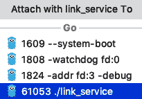

# 第十章：测试微服务

软件是人类创造的最复杂的东西。大多数程序员在编写 10 行代码时都无法避免出现错误。现在，考虑一下编写由大量相互作用的组件组成的分布式系统所需的工作，这些组件由大型团队使用大量第三方依赖、大量数据驱动逻辑和大量配置进行设计和实现。随着时间的推移，许多最初构建系统的架构师和工程师可能已经离开组织或转移到不同的角色。需求变化，新技术被重新引入，更好的实践被发现。系统必须发展以满足所有这些变化。

底线是，如果没有严格的测试，你几乎没有机会构建一个可行的非平凡系统。适当的测试是确保系统按预期工作并在引入破坏性变化之前立即识别问题的骨架。基于微服务的架构在测试方面引入了一些独特的挑战，因为许多工作流涉及多个微服务，可能难以控制所有相关微服务和数据存储的测试条件。Kubernetes 引入了自己的测试挑战，因为它在幕后做了很多工作，需要更多的工作来创建可预测和可重复的测试。

我们将在 Delinkcious 中演示所有这些类型的测试。特别是，我们将专注于使用 Kubernetes 进行本地测试。然后，我们将讨论隔离这个重要问题，它允许我们在不影响生产环境的情况下运行端到端测试。最后，我们将看到如何处理数据密集型测试。

本章将涵盖以下主题：

+   单元测试

+   集成测试

+   使用 Kubernetes 进行本地测试

+   隔离

+   端到端测试

+   管理测试数据

# 技术要求

代码分布在两个 Git 存储库之间：

+   您可以在这里找到代码示例：[`github.com/PacktPublishing/Hands-On-Microservices-with-Kubernetes/tree/master/Chapter10`](https://github.com/PacktPublishing/Hands-On-Microservices-with-Kubernetes/tree/master/Chapter10)

+   您可以在这里找到更新后的 Delinkcious 应用程序：[`github.com/the-gigi/delinkcious/releases/tag/v0.8`](https://github.com/the-gigi/delinkcious/releases/tag/v0.8)

# 单元测试

单元测试是最容易融入代码库的测试类型，但它带来了很多价值。当我说它是最容易的时候，我认为你可以使用最佳实践，比如适当的抽象、关注点分离、依赖注入等等。试图测试一个意大利面代码库并不容易！

让我们简要谈谈 Go 中的单元测试、Ginkgo 测试框架，然后回顾一些 Delinkcious 中的单元测试。

# 使用 Go 进行单元测试

Go 是一种现代语言，认识到测试的重要性。Go 鼓励对于每个`foo.go`文件，都有一个`foo_test.go`。它还提供了 testing 包，Go 工具有一个`test`命令。让我们看一个简单的例子。这是一个包含`safeDivide()`函数的`foo.go`文件。这个函数用于整数除法，并返回一个结果和一个错误。

如果分母非零，则不返回错误，但如果分母为零，则返回“除以零”错误：

```
package main

 import "errors"

 func safeDivide(a int, b int) (int, error) {
         if b == 0 {
                 return 0, errors.New("division by zero")
         }

         return a / b, nil
 }
```

请注意，当两个操作数都是整数时，Go 除法使用整数除法。这样做是为了确保两个整数相除的结果始终是整数部分（小数部分被舍弃）。例如，6/4 返回 1。

这是一个名为`foo_test.go`的 Go 单元测试文件，测试了非零和零分母，并使用了`testing`包。每个`test`函数接受一个指向`testing.T`对象的指针。当测试失败时，它调用`T`对象的`Errorf()`方法：

```
package main

 import (
         "testing"
 )

func TestExactResult(t *testing.T) {
        result, err := safeDivide(8, 4)
        if err != nil {
                t.Errorf("8 / 4 expected 2,  got error %v", err)
        }

        if result != 2 {
         t.Errorf("8 / 4 expected 2,  got %d", result)
        }
} 

func TestIntDivision(t *testing.T) {
        result, err := safeDivide(14, 5)
        if err != nil {
                t.Errorf("14 / 5 expected 2,  got error %v", err)
        }

        if result != 2 {
                   t.Errorf("14 / 5 expected 2,  got %d", result)
        }
}

func TestDivideByZero(t *testing.T) {
        result, err := safeDivide(77, 0)
        if err == nil {
                t.Errorf("77 / 0 expected 'division by zero' error,  got result %d", result)
        }

       if err.Error() != "division by zero" {
               t.Errorf("77 / 0 expected 'division by zero' error,  got this error instead %v", err)
       }
}
```

现在，要运行测试，我们可以使用`go test -v`命令。这是标准 Go 工具的一部分：

```
$ go test -v
=== RUN   TestExactResult
--- PASS: TestExactResult (0.00s)
=== RUN   TestIntDivision
--- PASS: TestIntDivision (0.00s)
=== RUN   TestDivideByZero
--- PASS: TestDivideByZero (0.00s)
PASS
ok      github.com/the-gigi/hands-on-microservices-with-kubernetes-code/ch10    0.010s
```

很好 - 所有测试都通过了。我们还可以看到测试运行花了多长时间。让我们引入一个有意的错误。现在，`safeDivide`减去了，而不是除以：

```
package main

 import "errors"

 func safeDivide(a int, b int) (int, error) {
         if b == 0 {
                 return 0, errors.New("division by zero")
         }

         return a - b, nil
}
```

我们只期望通过零除测试：

```
$ go test -v
=== RUN   TestExactResult
--- FAIL: TestExactResult (0.00s)
 foo_test.go:14: 8 / 4 expected 2,  got 4
=== RUN   TestIntDivision
--- FAIL: TestIntDivision (0.00s)
 foo_test.go:25: 14 / 5 expected 2,  got 9
=== RUN   TestDivideByZero
--- PASS: TestDivideByZero (0.00s)
FAIL
exit status 1
FAIL    github.com/the-gigi/hands-on-microservices-with-kubernetes-code/ch10    0.009s
```

我们得到了我们预期的结果。

`testing`包还有很多内容。`T`对象有其他方法可以使用。它提供了基准测试和常见设置的设施。然而，总的来说，由于测试包的人体工程学，最好不要在`T`对象上调用方法。在没有额外的工具支持的情况下，使用`testing`包管理复杂和分层的测试集也可能会很困难。这正是 Ginkgo 出现的地方。让我们来了解一下 Ginkgo。Delinkcious 使用 Ginkgo 进行单元测试。

# 使用 Ginkgo 和 Gomega 进行单元测试

Ginkgo（[`github.com/onsi/ginkgo`](https://github.com/onsi/ginkgo)）是一个**行为驱动开发**（**BDD**）测试框架。它仍然在底层使用测试包，但允许您使用更好的语法编写测试。它还与 Gomega（[`github.com/onsi/gomega`](https://github.com/onsi/gomega)）很搭配，后者是一个出色的断言库。使用 Ginkgo 和 Gomega 可以获得以下功能：

+   编写 BDD 风格的测试

+   任意嵌套块（`Describe`，`Context`，`When`）

+   良好的设置/拆卸支持（`BeforeEach`，`AfterEach`，`BeforeSuite`，`AfterSuite`）

+   仅关注一个测试或通过正则表达式匹配

+   通过正则表达式跳过测试

+   并行性

+   与覆盖率和基准测试的集成

让我们看看 Delinkcious 如何在其单元测试中使用 Ginkgo 和 Gomega。

# Delinkcious 单元测试

我们将使用`link_manager`包中的`LinkManager`作为示例。它具有非常复杂的交互：它允许您管理数据存储，访问另一个微服务（社交图服务），触发无服务器函数（链接检查器）并响应链接检查事件。这听起来是一组非常多样化的依赖关系，但正如您将看到的，通过设计可测试性，可以在不太复杂的情况下实现高水平的测试。

# 设计可测试性

适当的测试开始于编写测试之前很长时间。即使您实践**测试驱动设计**（**TDD**）并在实现之前编写测试，您仍然需要在编写测试之前设计要测试的代码的接口（否则测试将调用哪些函数或方法？）。对于 Delinkcious，我们采用了非常有意识的方法，包括抽象、层和关注点分离。我们所有的辛勤工作现在将会得到回报。

让我们看看`LinkManager`，并只考虑它的依赖关系：

```
package link_manager

 import (
     "bytes"
     "encoding/json"
     "errors"
     "github.com/the-gigi/delinkcious/pkg/link_checker_events"
     om "github.com/the-gigi/delinkcious/pkg/object_model"
     "log"
     "net/http"
 )
```

正如您所看到的，`LinkManager`依赖于 Delinkcious 对象模型抽象包，`link_checker_events`和标准的 Go 包。`LinkManager`不依赖于任何其他 Delinkcious 组件的实现或任何第三方依赖。在测试期间，我们可以为所有依赖项提供替代（模拟）实现，并完全控制测试环境和结果。我们将在下一节中看到如何做到这一点。

# 模拟的艺术

理想情况下，对象在创建时应注入所有依赖项。让我们看看`NewLinkManager()`函数：

```
func NewLinkManager(linkStore LinkStore,
     socialGraphManager om.SocialGraphManager,
     natsUrl string,
     eventSink om.LinkManagerEvents,
     maxLinksPerUser int64) (om.LinkManager, error) {
     ...
 }
```

这几乎是理想的情况。我们得到了链接存储、社交图管理器和事件接收器的接口。然而，这里有两个未注入的依赖项：`link_checker_events`和内置的`net/http`包。让我们从模拟链接存储、社交图管理器和链接管理器事件接收器开始，然后考虑更困难的情况。

`LinkStore`是在内部定义的一个接口：

```
package link_manager

 import (
     om "github.com/the-gigi/delinkcious/pkg/object_model"
 )

 type LinkStore interface {
     GetLinks(request om.GetLinksRequest) (om.GetLinksResult, error)
     AddLink(request om.AddLinkRequest) (*om.Link, error)
     UpdateLink(request om.UpdateLinkRequest) (*om.Link, error)
     DeleteLink(username string, url string) error
     SetLinkStatus(username, url string, status om.LinkStatus) error
 }
```

在`pkg/link_manager/mock_social_graph_manager.go`文件中，我们可以找到一个模拟社交图管理器，它实现了`om.SocialGraphManager`并且总是从`newMockSocialGraphManager()`函数中提供的关注者中返回`GetFollowers()`方法。这是重用相同的模拟来进行不同测试的一个很好的方法，这些测试需要`GetFollowers()`不同的预定义响应。其他方法只返回 nil 的原因是它们不被`LinkManager`调用，所以不需要提供实际的响应：

```
package link_manager
type mockSocialGraphManager struct { followers map[string]bool }

func (m *mockSocialGraphManager) Follow(followed string, follower string) error { return nil }

func (m *mockSocialGraphManager) Unfollow(followed string, follower string) error { return nil }

func (m *mockSocialGraphManager) GetFollowing(username string) (map[string]bool, error) { return nil, nil }

func (m *mockSocialGraphManager) GetFollowers(username string) (map[string]bool, error) { return m.followers, nil }

func newMockSocialGraphManager(followers []string) *mockSocialGraphManager { m := &mockSocialGraphManager{ map[string]bool{}, } for _, f := range followers { m.followers[f] = true }

return m

}
```

事件接收器有点不同。我们有兴趣验证当调用各种操作，比如`AddLink()`时，`LinkManager`是否正确通知了事件接收器。为了做到这一点，我们可以创建一个测试事件接收器，它实现了`om.LinkManagerEvents`接口，并跟踪接收到的事件。这是在`pkg/link_manager/test_event_sink.go`文件中的代码。`testEventSink`结构体为每种事件类型保留了一个映射，其中键是用户名，值是链接列表。它根据各种事件更新这些映射：

```
package link_manager

import ( om "github.com/the-gigi/delinkcious/pkg/object_model" )

type testEventsSink struct { addLinkEvents map[string][]om.Link updateLinkEvents map[string][]om.Link deletedLinkEvents map[string][]string }

func (s testEventsSink) OnLinkAdded(username string, link om.Link) { if s.addLinkEvents[username] == nil { s.addLinkEvents[username] = []*om.Link{} } s.addLinkEvents[username] = append(s.addLinkEvents[username], link) }

func (s testEventsSink) OnLinkUpdated(username string, link om.Link) { if s.updateLinkEvents[username] == nil { s.updateLinkEvents[username] = []*om.Link{} } s.updateLinkEvents[username] = append(s.updateLinkEvents[username], link) }

func (s *testEventsSink) OnLinkDeleted(username string, url string) { if s.deletedLinkEvents[username] == nil { s.deletedLinkEvents[username] = []string{} } s.deletedLinkEvents[username] = append(s.deletedLinkEvents[username], url) }

func newLinkManagerEventsSink() testEventsSink { return &testEventsSink{ map[string][]om.Link{}, map[string][]*om.Link{}, map[string][]string{}, } }
```

现在我们已经准备好了模拟，让我们创建 Ginkgo 测试套件。

# 启动测试套件

Ginkgo 是建立在 Go 的测试包之上的，这很方便，因为你可以只用`go test`来运行你的 Ginkgo 测试，尽管 Ginkgo 还提供了一个名为 Ginkgo 的 CLI，提供了更多的选项。要为一个包启动一个测试套件，运行`ginkgo bootstrap`命令。它将生成一个名为`<package>_suite_test.go`的文件。该文件将所有的 Ginkgo 测试连接到标准的 Go 测试，并导入`ginkgo`和`gomega`包。这是`link_manager`包的测试套件文件：

```
package link_manager
import ( "testing"
. "github.com/onsi/ginkgo"
. "github.com/onsi/gomega"
)
func TestLinkManager(t *testing.T) { RegisterFailHandler(Fail) RunSpecs(t, "LinkManager Suite") }
```

有了测试套件文件，我们可以开始编写一些单元测试。

# 实现 LinkManager 单元测试

让我们看看获取和添加链接的测试。那里有很多事情要做。这都在`pkg/link_manager/in_memory_link_manager_test.go`文件中。首先，让我们通过导入`ginkgo`，`gomega`和`delinkcious`对象模型来设置场景：

```
package link_manager
import ( . "github.com/onsi/ginkgo" . "github.com/onsi/gomega" om "github.com/the-gigi/delinkcious/pkg/object_model" )
```

Ginkgo 的`Describe`块描述文件中的所有测试，并定义将被多个测试使用的变量：

```
var _ = Describe("In-memory link manager tests", func() { var err error var linkManager om.LinkManager var socialGraphManager mockSocialGraphManager var eventSink testEventsSink
```

`BeforeEach()`函数在每个测试之前调用。它使用`liat`作为唯一的关注者创建一个新的模拟社交图管理器，一个新的事件接收器，并使用这些依赖项初始化新的`LinkManager`，以及一个内存链接存储，从而利用依赖注入实践：

```
BeforeEach(func() {
     socialGraphManager = newMockSocialGraphManager([]string{"liat"})
     eventSink = newLinkManagerEventsSink()
     linkManager, err = NewLinkManager(NewInMemoryLinkStore(),
         socialGraphManager,
         "",
         eventSink,
         10)
     Ω(err).Should(BeNil())
 })
```

这是实际的测试。注意以 BDD 风格定义测试，读起来像英语，*应该添加并获取链接*。让我们一步一步地分解；首先，测试确保`"gigi"`用户没有现有链接，通过调用`GetLinks()`并断言结果为空，使用 Gomega 的`Ω`运算符：

```
It("should add and get links", func() {
     // No links initially
     r := om.GetLinksRequest{
         Username: "gigi",
     }
     res, err := linkManager.GetLinks(r)
     Ω(err).Should(BeNil())
     Ω(res.Links).Should(HaveLen(0))
```

接下来是关于添加链接并确保没有错误发生的部分：

```
    // Add a link
     r2 := om.AddLinkRequest{
         Username: "gigi",
         Url:      "https://golang.org/",
         Title:    "Golang",
         Tags:     map[string]bool{"programming": true},
     }
     err = linkManager.AddLink(r2)
     Ω(err).Should(BeNil())
```

现在，测试调用`GetLinks()`并期望刚刚添加的链接被返回：

```
    res, err = linkManager.GetLinks(r)
     Ω(err).Should(BeNil())
     Ω(res.Links).Should(HaveLen(1))
     link := res.Links[0]
     Ω(link.Url).Should(Equal(r2.Url))
     Ω(link.Title).Should(Equal(r2.Title))
```

最后，测试确保事件接收器记录了`follower "liat"`的`OnLinkAdded()`调用：

```
    // Verify link manager notified the event sink about a single added event for the follower "liat"
     Ω(eventSink.addLinkEvents).Should(HaveLen(1))
     Ω(eventSink.addLinkEvents["liat"]).Should(HaveLen(1))
     Ω(*eventSink.addLinkEvents["liat"][0]).Should(Equal(link))
     Ω(eventSink.updateLinkEvents).Should(HaveLen(0))
     Ω(eventSink.deletedLinkEvents).Should(HaveLen(0))
 })
```

这是一个非常典型的单元测试，执行以下任务：

+   控制测试环境

+   模拟依赖项（社交图管理器）

+   为外部交互提供记录占位符（测试事件接收器记录链接管理器事件）

+   执行被测试的代码（获取链接和添加链接）

+   验证响应（一开始没有链接；添加后返回一个链接）

+   验证任何外部交互（事件接收器接收到`OnLinkAdded()`事件）

我们这里没有测试错误情况，但很容易添加。您可以添加错误输入并检查返回预期错误的测试代码。

# 你应该测试所有吗？

答案是否定的！测试提供了很多价值，但也有成本。添加测试的边际价值正在减少。测试*所有*是困难的，甚至是不可能的。考虑到测试需要时间来开发，它可能会减慢对系统的更改（您需要更新测试），并且当依赖关系发生变化时，测试可能需要更改。测试还需要时间和资源来运行，这可能会减慢编辑-测试-部署周期。此外，测试也可能存在错误。找到您需要进行多少测试的平衡点是一个判断性的决定。

单元测试非常有价值，但还不够。这对于基于微服务的架构尤其如此，因为有很多小组件可能可以独立工作，但无法一起实现系统的目标。这就是集成测试的用武之地。

# 集成测试

集成测试是包括多个相互交互的组件的测试。集成测试意味着在没有或者很少模拟的情况下测试完整的子系统。Delinkcious 有几个针对特定服务的集成测试。这些测试不是自动化的 Go 测试。它们不使用 Ginkgo 或标准的 Go 测试。它们是在出现错误时会 panic 的可执行程序。这些程序旨在测试跨服务的交互以及服务如何与实际数据存储等第三方组件集成。例如，`link_manager_e2e`测试执行以下步骤：

1.  启动社交图服务和链接服务作为本地进程

1.  在 Docker 容器中启动一个 Postgres 数据库

1.  对链接服务运行测试

1.  验证结果

让我们看看它是如何发挥作用的。导入列表包括 Postgres Golang 驱动程序（`lib/pq`），几个 Delinkcious 包，以及一些标准的 Go 包（`context`，`log`和`os`）。请注意，`pq`被导入为破折号。这意味着`pq`名称不可用。以这种未命名模式导入库的原因是它只需要运行一些初始化代码，不会被外部访问。具体来说，`pq`向标准的 Go `database/sql`库注册了一个 Go 驱动程序：

```
package main
import ( "context" _ "github.com/lib/pq" "github.com/the-gigi/delinkcious/pkg/db_util" "github.com/the-gigi/delinkcious/pkg/link_manager_client" om "github.com/the-gigi/delinkcious/pkg/object_model" . "github.com/the-gigi/delinkcious/pkg/test_util" "log" "os" )
```

让我们来看一些用于设置测试环境的函数，首先是初始化数据库。

# 初始化测试数据库

`initDB()`函数通过传递数据库名称（`link_manager`）调用`RunLocalDB()`函数。这很重要，因为如果你是从头开始的，它也需要创建数据库。然后，为了确保测试总是从头开始运行，它删除`tags`和`links`表，如下所示：

```
func initDB() { db, err := db_util.RunLocalDB("link_manager") Check(err)
tables := []string{"tags", "links"}
 for _, table := range tables {
     err = db_util.DeleteFromTableIfExist(db, table)
     Check(err)
 }
}
```

# 运行服务

测试有两个单独的函数来运行服务。这些函数非常相似。它们设置环境变量并调用`RunService()`函数，我们很快就会深入了解。两个服务都依赖于`PORT`环境变量的值，并且每个服务的值都需要不同。这意味着我们必须按顺序启动服务，而不是并行启动。否则，服务可能最终会监听错误的端口：

```
func runLinkService(ctx context.Context) {
     // Set environment
     err := os.Setenv("PORT", "8080")
     Check(err)

     err = os.Setenv("MAX_LINKS_PER_USER", "10")
     Check(err)

     RunService(ctx, ".", "link_service")
 }

 func runSocialGraphService(ctx context.Context) {
     err := os.Setenv("PORT", "9090")
     Check(err)

     RunService(ctx, "../social_graph_service", "social_graph_service")
 }
```

# 运行实际测试

`main()`函数是整个测试的驱动程序。它打开了链接管理器和社交图管理器之间的相互认证，初始化数据库，并运行服务（只要`RUN_XXX_SERVICE`环境变量为`true`）：

```
func main() {
     // Turn on authentication
     err := os.Setenv("DELINKCIOUS_MUTUAL_AUTH", "true")
     Check(err)

     initDB()

     ctx := context.Background()
     defer KillServer(ctx)

     if os.Getenv("RUN_SOCIAL_GRAPH_SERVICE") == "true" {
         runSocialGraphService(ctx)
     }

     if os.Getenv("RUN_LINK_SERVICE") == "true" {
         runLinkService(ctx)
     }
```

现在它已经准备好实际运行测试了。它使用链接管理器客户端连接到本地主机上的端口`8080`，这是链接服务正在运行的地方。然后，它调用`GetLinks()`方法，打印结果（应该为空），通过调用`AddLink()`添加一个链接，再次调用`GetLinks()`，并打印结果（应该是一个链接）：

```
// Run some tests with the client
     cli, err := link_manager_client.NewClient("localhost:8080")
     Check(err)

     links, err := cli.GetLinks(om.GetLinksRequest{Username: "gigi"})
     Check(err)
     log.Print("gigi's links:", links)

     err = cli.AddLink(om.AddLinkRequest{Username: "gigi",
         Url:   "https://github.com/the-gigi",
         Title: "Gigi on Github",
         Tags:  map[string]bool{"programming": true}})
     Check(err)

     links, err = cli.GetLinks(om.GetLinksRequest{Username: "gigi"})
     Check(err)
     log.Print("gigi's links:", links)
```

这个集成测试不是自动化的。它是为了交互式使用而设计的，开发人员可以运行和调试单个服务。如果发生错误，它会立即退出。每个操作的结果只是简单地打印到屏幕上。

测试的其余部分检查了`UpdateLink()`和`DeleteLink()`操作：

```
    err = cli.UpdateLink(om.UpdateLinkRequest{Username: "gigi",
         Url:         "https://github.com/the-gigi",
         Description: "Most of my open source code is here"},
     )

     Check(err)
     links, err = cli.GetLinks(om.GetLinksRequest{Username: "gigi"})
     Check(err)
     log.Print("gigi's links:", links)

     err = cli.DeleteLink("gigi", "https://github.com/the-gigi")
     Check(err)
     Check(err)
     links, err = cli.GetLinks(om.GetLinksRequest{Username: "gigi"})
     Check(err)
     log.Print("gigi's links:", links)
 }
```

通过链接管理器客户端库进行测试确保了从客户端到服务到依赖服务及其数据存储的整个链条都在工作。

让我们来看一些测试助手函数，当我们试图在本地测试和调试微服务之间的复杂交互时，它们非常有用。

# 实现数据库测试助手

在深入代码之前，让我们考虑一下我们想要实现的目标。我们希望创建一个本地空数据库。我们希望将其作为 Docker 容器启动，但只有在它尚未运行时才这样做。为了做到这一点，我们需要检查 Docker 容器是否已经在运行，如果我们应该重新启动它，或者我们应该运行一个新的容器。然后，我们将尝试连接到目标数据库，并在不存在时创建它。服务将负责根据需要创建模式，因为通用的 DB 实用程序对特定服务的数据库模式一无所知。

`db_util`包中的`db_util.go`文件包含所有辅助函数。首先，让我们回顾一下导入的内容，其中包括标准的 Go `database/sql`包和 squirrel - 一个流畅风格的 Go 库，用于生成 SQL（但不是 ORM）。还导入了 Postgres 驱动程序库`pq`：

```
package db_util

 import (
     "database/sql"
     "fmt"
     sq "github.com/Masterminds/squirrel"
     _ "github.com/lib/pq"
     "log"
     "os"
     "os/exec"
     "strconv"
     "strings"
 )
```

`dbParams`结构包含连接到数据库所需的信息，`defaultDbParams()`函数方便地获取填充有默认值的结构：

```
type dbParams struct {
     Host     string
     Port     int
     User     string
     Password string
     DbName   string
 }

 func defaultDbParams() dbParams {
     return dbParams{
         Host:     "localhost",
         Port:     5432,
         User:     "postgres",
         Password: "postgres",
     }
 }
```

您可以通过传递`dbParams`结构中的信息来调用`connectToDB()`函数。如果一切顺利，您将得到一个数据库句柄（`*sql.DB`），然后可以使用它来以后访问数据库：

```
func connectToDB(host string, port int, username string, password string, dbName string) (db *sql.DB, err error) {
     mask := "host=%s port=%d user=%s password=%s dbname=%s sslmode=disable"
     dcn := fmt.Sprintf(mask, host, port, username, password, dbName)
     db, err = sql.Open("postgres", dcn)
     return
 }
```

完成所有准备工作后，让我们看看`RunLocalDB()`函数是如何工作的。首先，它运行`docker ps -f name=postgres`命令，列出名为`postgres`的正在运行的 Docker 容器（只能有一个）：

```
func RunLocalDB(dbName string) (db *sql.DB, err error) {
     // Launch the DB if not running
     out, err := exec.Command("docker", "ps", "-f", "name=postgres", "--format", "{{.Names}}").CombinedOutput()
     if err != nil {
         return
     }
```

如果输出为空，这意味着没有正在运行的容器，因此它会尝试重新启动容器，以防它已经停止。如果这也失败了，它就会运行一个新的`postgres:alpine`镜像的容器，将标准的`5432`端口暴露给本地主机。注意`-z`标志。它告诉 Docker 以分离（非阻塞）模式运行容器，这允许函数继续。如果由于任何原因无法运行新容器，它会放弃并返回错误：

```
    s := string(out)
     if s == "" {
         out, err = exec.Command("docker", "restart", "postgres").CombinedOutput()
         if err != nil {
             log.Print(string(out))
             _, err = exec.Command("docker", "run", "-d", "--name", "postgres",
                 "-p", "5432:5432",
                 "-e", "POSTGRES_PASSWORD=postgres",
                 "postgres:alpine").CombinedOutput()

         }
         if err != nil {
             return
         }
     }
```

此时，我们正在运行一个在容器中运行的 Postgres DB。我们可以使用`defaultDBParams()`函数并调用`EnsureDB()`函数，接下来我们将对其进行检查：

```
p := defaultDbParams()
 db, err = EnsureDB(p.Host, p.Port, p.User, p.Password, dbName)
 return
}
```

为了确保数据库已准备就绪，我们需要连接到 postgres 实例的 Postgres DB。每个 postgres 实例都有几个内置数据库，包括`postgres`数据库。postgres 实例的 Postgres DB 可用于获取有关实例的信息和元数据。特别是，我们可以查询`pg_database`表以检查目标数据库是否存在。如果不存在，我们可以通过执行`CREATE database <db name>`命令来创建它。最后，我们连接到目标数据库并返回其句柄。通常情况下，如果出现任何问题，我们会返回错误：

```
// Make sure the database exists (creates it if it doesn't)

func EnsureDB(host string, port int, username string, password string, dbName string) (db *sql.DB, err error) { // Connect to the postgres DB postgresDb, err := connectToDB(host, port, username, password, "postgres") if err != nil { return }

// Check if the DB exists in the list of databases
 var count int
 sb := sq.StatementBuilder.PlaceholderFormat(sq.Dollar)
 q := sb.Select("count(*)").From("pg_database").Where(sq.Eq{"datname": dbName})
 err = q.RunWith(postgresDb).QueryRow().Scan(&count)
 if err != nil {
     return
 }

 // If it doesn't exist create it
 if count == 0 {
     _, err = postgresDb.Exec("CREATE database " + dbName)
     if err != nil {
         return
     }
 }

 db, err = connectToDB(host, port, username, password, dbName)
 return
}
```

这是一个深入研究自动设置本地测试数据库的过程。在许多情况下，甚至超出微服务范围，这非常方便。

# 实施服务测试助手

让我们看一些测试服务的辅助函数。`test_util`包非常基础，使用 Go 标准包作为依赖项：

```
package test_util

import ( "context" "os" "os/exec" )
```

它提供了一个错误检查函数和两个运行和停止服务的函数。

# 检查错误

关于 Go 的一个让人讨厌的事情是你必须一直进行显式的错误检查。以下片段非常常见；我们调用一个返回结果和错误的函数，检查错误，如果它不是 nil，我们就做一些事情（通常我们只是返回）：

```
...
 result, err := foo()
 if err != nil {
     return err
 }
...
```

`Check()`函数通过决定它将仅仅恐慌并退出程序（或当前的 Go 例程）使得这一点更加简洁。这在测试场景中是一个可以接受的选择，因为你希望一旦遇到任何故障就退出：

```
func Check(err error) { if err != nil { panic(err) } }
```

前面的片段可以缩短为以下内容：

```
...
 result, err := foo()
 Check(err)
...
```

如果您的代码需要检查许多错误，那么这些小的节省会累积起来。

# 在本地运行服务

最重要的辅助函数之一是`RunService()`。微服务通常依赖于其他微服务。在测试服务时，测试代码通常需要运行依赖的服务。在这里，代码在其`target`目录中构建一个 Go 服务并执行它：

```
// Build and run a service in a target directory
func RunService(ctx context.Context, targetDir string, service string) {
   // Save and restore later current working dir
   wd, err := os.Getwd()
   Check(err)
   defer os.Chdir(wd)

   // Build the server if needed
   os.Chdir(targetDir)
   _, err = os.Stat("./" + service)
   if os.IsNotExist(err) {
      _, err := exec.Command("go", "build", ".").CombinedOutput()
      Check(err)
   }

   cmd := exec.CommandContext(ctx, "./"+service)
   err = cmd.Start()
   Check(err)
}
```

运行服务很重要，但在测试结束时清理并停止所有由测试启动的服务也很重要。

# 停止本地服务

停止服务就像调用上下文的`Done()`方法一样简单。它可以用来向使用上下文的任何代码发出完成信号：

```
func StopService(ctx context.Context) { ctx.Done() }
```

正如您所看到的，运行 Delinkcious，甚至只是在没有 Kubernetes 帮助的情况下本地运行 Delinkcious 的一些部分，都涉及大量的工作。当 Delinkcious 运行时，它非常适用于调试和故障排除，但创建和维护这个设置是乏味且容易出错的。

此外，即使所有集成测试都能正常工作，它们也无法完全复制 Kubernetes 集群，可能会有许多未被捕获的故障模式。让我们看看如何使用 Kubernetes 本身进行本地测试。

# 使用 Kubernetes 进行本地测试

Kubernetes 的一个特点是同一个集群可以在任何地方运行。对于真实世界的系统来说，如果您使用的服务在本地不可用，或者访问本地的速度太慢或者太昂贵，那么情况就不总是那么简单。关键是要在高保真度和便利性之间找到一个好的平衡点。

让我们编写一个烟雾测试，让 Delinkcious 通过获取链接、添加链接和检查它们的状态的主要工作流程。

# 编写烟雾测试

Delinkcious 烟雾测试不是自动化的。它可以是，但需要特殊的设置才能在 CI/CD 环境中运行。对于真实的生产系统，我强烈建议您进行自动化的烟雾测试（以及其他测试）。

代码位于`cmd/smoke_test`目录中，由一个名为`smoke.go`的文件组成。它通过 API 网关公开的 REST API 对 Delinkcious 进行测试。我们可以使用任何语言编写这个测试，因为没有客户端库。我选择使用 Go 是为了保持一致性，并突出如何从 Go 中消费原始的 REST API，直接使用 URL、查询字符串和 JSON 负载序列化。我还使用了 Delinkcious 对象模型链接作为方便的序列化目标。

测试期望本地 Minikube 集群中已安装并运行 Delinkcious。以下是测试的流程：

1.  删除我们的测试链接以重新开始。

1.  获取链接（并打印它们）。

1.  添加一个测试链接。

1.  再次获取链接（新链接应该具有*待定*状态）。

1.  等待几秒钟。

1.  再次获取链接（新链接现在应该具有*有效*状态）。

这个简单的烟雾测试涵盖了 Delinkcious 功能的重要部分，例如以下内容：

+   命中 API 网关的多个端点（获取链接、发布新链接、删除链接）。

+   验证调用者身份（通过访问令牌）。

+   API 网关将转发请求到链接管理器服务。

+   链接管理器服务将触发链接检查器无服务器函数。

+   链接检查器将通过 NATS 通知链接管理器新链接的状态。

以后，我们可以扩展测试以创建社交关系，这将涉及社交图管理器，以及检查新闻服务。这将建立一个全面的端到端测试。对于烟雾测试目的，上述工作流程就足够了。

让我们从导入列表开始，其中包括许多标准的 Go 库，以及 Delinkcious 的`object_model`（用于`Link`结构）包和`test_util`包（用于`Check()`函数）。我们可以很容易地避免这些依赖关系，但它们是熟悉和方便的：

```
package main

import ( "encoding/json" "errors" "fmt" om "github.com/the-gigi/delinkcious/pkg/object_model" . "github.com/the-gigi/delinkcious/pkg/test_util" "io/ioutil" "log" "net/http" net_url "net/url" "os" "os/exec" "time" )
```

接下来的部分定义了一些变量。`delinkciousUrl`稍后将被初始化。`delinkciousToken`应该在环境中可用，`httpClient`是我们将用于调用 Delinkcious REST API 的标准 Go HTTP 客户端：

```
var ( delinkciousUrl string delinkciousToken = os.Getenv("DELINKCIOUS_TOKEN") httpClient = http.Client{} )
```

完成前提工作后，我们可以专注于测试本身。它非常简单，看起来非常像冒烟测试的高级描述。它使用以下命令从 Minikube 获取 Delinkcious URL：

```
$ minikube service api-gateway --url http://192.168.99.161:30866
```

然后，它调用`DeleteLink()`、`GetLinks()`和`AddLink()`函数，如下所示：

```
func main() { tempUrl, err := exec.Command("minikube", "service", "api-gateway", "--url").CombinedOutput() delinkciousUrl = string(tempUrl[:len(tempUrl)-1]) + "/v1.0" Check(err)

// Delete link
 deleteLink("https://github.com/the-gigi")

 // Get links
 getLinks()

 // Add a new link
 addLink("https://github.com/the-gigi", "Gigi on Github")

 // Get links again
 getLinks()

 // Wait a little and get links again
 time.Sleep(time.Second * 3)
 getLinks()

}
```

`GetLinks()`函数构造正确的 URL，创建一个新的 HTTP 请求，将身份验证令牌作为标头添加（根据 API 网关社交登录身份验证的要求），并命中`/links`端点。当响应返回时，它检查状态码，并在出现错误时退出。否则，它将响应的主体反序列化为`om.GetLinksResult`结构，并打印链接：

```
func getLinks() { req, err := http.NewRequest("GET", string(delinkciousUrl)+"/links", nil) Check(err)

req.Header.Add("Access-Token", delinkciousToken)
 r, err := httpClient.Do(req)
 Check(err)

 defer r.Body.Close()

 if r.StatusCode != http.StatusOK {
     Check(errors.New(r.Status))
 }

 var glr om.GetLinksResult
 body, err := ioutil.ReadAll(r.Body)

 err = json.Unmarshal(body, &glr)
 Check(err)

 log.Println("======= Links =======")
 for _, link := range glr.Links {
     log.Println(fmt.Sprintf("title: '%s', url: '%s', status: '%s'", link.Title, link.Url, link.Status))
 }

}
```

`addLink()`函数非常相似，只是它使用 POST 方法，并且只检查响应是否具有 OK 状态。该函数接受一个 URL 和一个标题，并构造一个 URL（包括对查询字符串进行编码）以符合 API 网关规范。如果状态不是 OK，它将使用响应的内容作为错误消息：

```
func addLink(url string, title string) { params := net_url.Values{} params.Add("url", url) params.Add("title", title) qs := params.Encode()

log.Println("===== Add Link ======")
 log.Println(fmt.Sprintf("Adding new link - title: '%s', url: '%s'", title, url))

 url = fmt.Sprintf("%s/links?%s", delinkciousUrl, qs)
 req, err := http.NewRequest("POST", url, nil)
 Check(err)

 req.Header.Add("Access-Token", delinkciousToken)
 r, err := httpClient.Do(req)
 Check(err)
 if r.StatusCode != http.StatusOK {
     defer r.Body.Close()
     bodyBytes, err := ioutil.ReadAll(r.Body)
     Check(err)
     message := r.Status + " " + string(bodyBytes)
     Check(errors.New(message))
 }

}
```

太好了！现在，让我们看看测试是如何运行的。

# 运行测试

在运行测试之前，我们应该导出`DELINKCIOUS_TOKEN`并确保 Minikube 正在运行：

```
$ minikube status host: Running kubelet: Running apiserver: Running kubectl: Correctly Configured: pointing to minikube-vm at 192.168.99.160
```

要运行测试，我们只需输入以下内容：

```
$ go run smoke.go
```

结果将打印到控制台。已经有一个无效的链接，即`http://gg.com`。然后，测试添加了新链接，即`https://github.com/the-gigi`。新链接的状态最初是挂起的，然后在几秒钟后，当链接检查成功时，它变为有效：

```
2019/04/19 10:03:48 ======= Links ======= 2019/04/19 10:03:48 title: 'gg', url: 'http://gg.com', status: 'invalid' 2019/04/19 10:03:48 ===== Add Link ====== 2019/04/19 10:03:48 Adding new link - title: 'Gigi on Github', url: 'https://github.com/the-gigi' 2019/04/19 10:03:49 ======= Links ======= 2019/04/19 10:03:49 title: 'gg', url: 'http://gg.com', status: 'invalid' 2019/04/19 10:03:49 title: 'Gigi on Github', url: 'https://github.com/the-gigi', status: 'pending' 2019/04/19 10:03:52 ======= Links ======= 2019/04/19 10:03:52 title: 'gg', url: 'http://gg.com', status: 'invalid' 2019/04/19 10:03:52 title: 'Gigi on Github', url: 'https://github.com/the-gigi', status: 'valid'
```

# Telepresence

Telepresence ([`www.telepresence.io/`](https://www.telepresence.io/)) 是一个特殊的工具。它允许您在本地运行一个服务，就好像它正在您的 Kubernetes 集群内运行一样。为什么这很有趣？考虑我们刚刚实施的冒烟测试。如果我们检测到失败，我们希望执行以下三件事：

+   找到根本原因。

+   修复它。

+   验证修复是否有效。

由于我们只在 Kubernetes 集群上运行冒烟测试时才发现了故障，这可能是我们的本地单元测试未检测到的故障。找到根本原因的常规方法（除了离线审查代码之外）是添加一堆日志记录语句，添加实验性调试代码，注释掉无关的部分并部署修改后的代码，重新运行冒烟测试，并尝试了解出现了什么问题。

将修改后的代码部署到 Kubernetes 集群通常涉及以下步骤：

1.  修改代码

1.  将修改后的代码推送到 Git 存储库（污染您的 Git 历史记录，因为这些更改仅用于调试）

1.  构建镜像（通常需要运行各种测试）

1.  将新镜像推送到镜像注册表

1.  将新镜像部署到集群

这个过程很繁琐，不鼓励临时探索和快速编辑-调试-修复循环。在第十一章中，我们将探索一些工具，可以跳过推送到 Git 存储库并为您自动构建镜像，但镜像仍然会构建并部署到集群。

使用 Telepresence，您只需在本地对代码进行更改，Telepresence 会确保您的本地服务成为集群的一个完整成员。它看到相同的环境和 Kubernetes 资源，可以通过内部网络与其他服务通信，实际上它是集群的一部分。

Telepresence 通过在集群内安装代理来实现这一点，代理会联系并与您的本地服务进行通信。这非常巧妙。让我们安装 Telepresence 并开始使用它。

# 安装 Telepresence

安装 Telepresence 需要 FUSE 文件系统：

```
brew cask install osxfuse
```

然后，我们可以安装 Telepresence 本身：

```
brew install datawire/blackbird/telepresence
```

# 通过 Telepresence 运行本地链接服务

让我们通过 Telepresence 在本地运行链接管理器服务。首先，为了证明真的是本地服务在运行，我们可以修改服务代码。例如，当获取链接时，我们可以打印一条消息，即`"**** 本地链接服务在这里！调用 GetLinks() ****"`。

让我们将其添加到`svc/link_service/service/transport.go`中的`GetLinks`端点：

```
func makeGetLinksEndpoint(svc om.LinkManager) endpoint.Endpoint { return func(_ context.Context, request interface{}) (interface{}, error) { fmt.Println("**** Local link service here! calling GetLinks() ****") req := request.(om.GetLinksRequest) result, err := svc.GetLinks(req) res := getLinksResponse{} for _, link := range result.Links { res.Links = append(res.Links, newLink(link)) } if err != nil { res.Err = err.Error() return res, err } return res, nil } }
```

现在，我们可以构建本地链接服务（使用 Telepresence 推荐的标志），并将`link-manager`部署与本地服务进行交换：

```
$ cd svc/service/link_service
$ go build -gcflags "all=-N -l" .

$ telepresence --swap-deployment link-manager --run ./link_service
T: How Telepresence uses sudo: https://www.telepresence.io/reference/install#dependencies
T: Invoking sudo. Please enter your sudo password.
Password:
T: Starting proxy with method 'vpn-tcp', which has the following limitations: All processes are affected, only one telepresence can run per machine, and you can't use other VPNs. You may need to add cloud hosts and headless services with --also-proxy.
T: For a full list of method limitations see https://telepresence.io/reference/methods.html
T: Volumes are rooted at $TELEPRESENCE_ROOT. See https://telepresence.io/howto/volumes.html for details.
T: Starting network proxy to cluster by swapping out Deployment link-manager with a proxy
T: Forwarding remote port 8080 to local port 8080.

T: Guessing that Services IP range is 10.96.0.0/12\. Services started after this point will be inaccessible if are outside this range; restart telepresence if you can't access a new Service.
T: Setup complete. Launching your command.
2019/04/20 01:17:06 DB host: 10.100.193.162 DB port: 5432
2019/04/20 01:17:06 Listening on port 8080...
```

请注意，当您为以下任务交换部署时，Telepresence 需要`sudo`权限：

+   修改本地网络（通过`sshuttle`和`pf/iptables`）以用于 Go 程序的`vpn-tcp`方法

+   运行`docker`命令（对于 Linux 上的某些配置）

+   挂载远程文件系统以在 Docker 容器中访问

为了测试我们的新更改，让我们再次运行`smoke`测试：

```
$ go run smoke.go 
2019/04/21 00:18:50 ======= Links ======= 2019/04/21 00:18:50 ===== Add Link ====== 2019/04/21 00:18:50 Adding new link - title: 'Gigi on Github', url: 'https://github.com/the-gigi' 2019/04/21 00:18:50 ======= Links ======= 2019/04/21 00:18:50 title: 'Gigi on Github', url: 'https://github.com/the-gigi', status: 'pending' 2019/04/21 00:18:54 ======= Links ======= 2019/04/21 00:18:54 title: 'Gigi on Github', url: 'https://github.com/the-gigi', status: 'valid'
```

查看我们的本地服务输出，我们可以看到在运行`smoke`测试时确实被调用了：

```
**** Local link service here! calling GetLinks() ****
**** Local link service here! calling GetLinks() ****
```

您可能还记得，smoke 测试会在集群中调用 API 网关，因此我们的本地服务被调用表明它确实在集群中运行。有趣的是，我们本地服务的输出不会被 Kubernetes 日志捕获。如果我们搜索日志，什么也找不到。以下命令不会生成任何输出：

```
$ kubectl logs svc/link-manager | grep "Local link service here" 
```

现在，让我们看看如何将 GoLand 调试器连接到正在运行的本地服务。

# 使用 GoLand 附加到本地链接服务进行实时调试

这是调试的终极目标！我们将使用 GoLand 交互式调试器连接到我们的本地链接服务，同时它作为 Kubernetes 集群的一部分在运行。这再好不过了。让我们开始吧：

1.  首先，按照这里的说明准备好使用 GoLand 附加到本地 Go 进程：[`blog.jetbrains.com/go/2019/02/06/debugging-with-goland-getting-started/#debugging-a-running-application-on-the-local-machine`](https://blog.jetbrains.com/go/2019/02/06/debugging-with-goland-getting-started/#debugging-a-running-application-on-the-local-machine)。

1.  然后，在 GoLand 中点击 Run | Attach to Process 菜单选项，将会出现以下对话框：



不幸的是，当 GoLand 成功附加到进程时，Telepresence 错误地认为本地服务已退出，并关闭了到 Kubernetes 集群及其自身控制进程的隧道。

本地链接服务仍在运行，但不再连接到集群。我为 Telepresence 团队打开了一个 GitHub 问题：[`github.com/telepresenceio/telepresence/issues/1003`](https://github.com/telepresenceio/telepresence/issues/1003)。

后来我联系了 Telepresence 开发人员，深入了解了代码，并贡献了最近合并的修复。

请参阅以下 PR（为在 Telepresence 下附加调试器到进程添加支持）：[`github.com/telepresenceio/telepresence/pull/1005`](https://github.com/telepresenceio/telepresence/pull/1005)。

如果您正在使用 VS Code 进行 Go 编程，可以尝试按照这里的信息进行操作：[`github.com/Microsoft/vscode-go/wiki/Debugging-Go-code-using-VS-Code`](https://github.com/Microsoft/vscode-go/wiki/Debugging-Go-code-using-VS-Code)。

到目前为止，我们编写了一个独立的冒烟测试，并使用 Telepresence 来能够在我们的 Kubernetes 集群中本地调试服务。这对于交互式开发来说再好不过了。下一节将处理测试隔离。

# 隔离测试

隔离是测试的一个关键主题。核心思想是，一般来说，您的测试应该与生产环境隔离，甚至与其他共享环境隔离。如果测试不是隔离的，那么测试所做的更改可能会影响这些环境，反之亦然（对这些环境的外部更改可能会破坏假设的测试）。另一种隔离级别是在测试之间。如果您的测试并行运行并对相同的资源进行更改，那么各种竞争条件可能会发生，测试可能会相互干扰并导致错误的负面结果。

如果测试不并行运行，但忽略清理测试 A 可能会导致破坏测试 B 的更改。隔离可以帮助的另一种情况是当多个团队或开发者想要测试不兼容的更改时。如果两个开发者对共享环境进行了不兼容的更改，其中至少一个将遇到失败。隔离有各种级别，它们通常与成本呈反比-更隔离的测试设置成本更高。

让我们考虑以下隔离方法：

+   测试集群

+   测试命名空间

+   跨命名空间/集群

# 测试集群

集群级别的隔离是最高形式的隔离。您可以在完全独立于生产集群的集群中运行测试。这种方法的挑战在于如何保持测试集群/集群与生产集群的同步。在软件方面，通过一个良好的 CI/CD 系统可能并不太困难，但填充和迁移数据通常相当复杂。

测试集群有两种形式：

+   每个开发者都有自己的集群。

+   为执行系统测试而专门设置的集群。

# 每个开发者一个集群

为每个开发人员创建一个集群是最高级别的隔离。开发人员不必担心破坏其他人的代码或受其他人的代码影响。但是，这种方法也有一些显著的缺点，例如：

+   为每个开发人员提供一个成熟的集群通常成本太高。

+   提供的集群通常与生产系统的高保真度不高。

+   通常仍然需要另一个集成环境来协调多个团队/开发人员的更改。

使用 Kubernetes，可能可以将 Minikube 作为每个开发人员的本地集群，并避免许多缺点。

# 系统测试的专用集群

为系统测试创建专用集群是在部署到生产环境之前，整合更改并再次测试的好方法。测试集群可以运行更严格的测试，依赖外部资源，并与第三方服务交互。这样的测试集群是昂贵的资源，您必须仔细管理它们。

# 测试命名空间

测试命名空间是一种轻量级的隔离形式。它们可以与生产系统并行运行，并重用生产环境的一些资源（例如控制平面）。同步数据可能更容易，在 Kubernetes 上，特别是编写自定义控制器来同步和审计测试命名空间与生产命名空间是一个不错的选择。

测试命名空间的缺点是隔离级别降低。默认情况下，不同命名空间中的服务仍然可以相互通信。如果您的系统已经使用多个命名空间，那么您必须非常小心，以保持测试与生产的隔离。

# 编写多租户系统

多租户系统是指完全隔离的实体共享相同的物理或虚拟资源的系统。Kubernetes 命名空间提供了几种机制来支持这一点。您可以定义网络策略，防止命名空间之间的连接（除了与 Kubernetes API 服务器的交互）。您可以定义每个命名空间的资源配额和限制，以防止恶意命名空间占用所有集群资源。如果您的系统已经设置为多租户，您可以将测试命名空间视为另一个租户。

# 跨命名空间/集群

有时，您的系统部署到多个协调的命名空间甚至多个集群中。在这种情况下，您需要更加注意如何设计模拟相同架构的测试，同时要小心测试不要与生产命名空间或集群发生交互。

# 端到端测试

端到端测试对于复杂的分布式系统非常重要。我们为 Delinkcious 编写的冒烟测试就是端到端测试的一个例子，但还有其他几个类别。端到端测试通常针对专用环境运行，比如一个暂存环境，但在某些情况下，它们会直接针对生产环境运行（需要特别注意）。由于端到端测试通常需要很长时间才能运行，并且可能设置起来很慢、费用很高，因此通常不会在每次提交时运行。相反，通常会定期运行（每晚、每个周末或每个月）或临时运行（例如，在重要发布之前）。端到端测试有几个类别。

我们将在以下部分探讨一些最重要的类别，例如以下内容：

+   验收测试

+   回归测试

+   性能测试

# 验收测试

验收测试是一种验证系统行为是否符合预期的测试形式。决定什么是可以接受的是系统利益相关者的责任。它可以简单到一个冒烟测试，也可以复杂到测试代码中所有可能的路径、所有故障模式和所有副作用（例如，写入日志文件的消息）。良好的验收测试套件的主要好处之一是它是描述系统的一种强制性手段，这种描述对于非工程师利益相关者（如产品经理和高层管理人员）是有意义的。理想的情况（我从未在实践中见过）是业务利益相关者能够自己编写和维护验收测试。

这在精神上接近于可视化编程。我个人认为所有的自动化测试都应该由开发人员编写和维护，但你的情况可能有所不同。Delinkcious 目前只公开了一个 REST API，并没有用户界面的 Web 应用程序。大多数系统现在都有成为验收测试边界的 Web 应用程序。在浏览器中运行验收测试是很常见的。有很多好的框架。如果你喜欢使用 Go，Agouti ([`agouti.org/`](https://agouti.org/)) 是一个很好的选择。它与 Ginkgo 和 Gomega 紧密集成，可以通过 PhantomJS、Selenium 或 ChromeDriver 驱动浏览器。

# 回归测试

回归测试是一个很好的选择，当你只想确保新系统不会偏离当前系统的行为时。如果你有全面的验收测试，那么你只需要确保新版本的系统通过所有验收测试，就像之前的版本一样。然而，如果你的验收测试覆盖不足，你可以通过向当前系统和新系统发送相同的输入并验证输出是否相同来获得某种信心。这也可以通过模糊测试来完成，其中你生成随机输入。

# 性能测试

性能测试是一个很大的话题。在这里，目标是衡量系统的性能，而不是其响应的正确性。也就是说，错误可能会显著影响性能。考虑以下错误处理选项：

+   遇到错误时立即返回

+   重试五次，并在尝试之间休眠一秒钟

现在，考虑这两种策略，考虑一个通常需要大约两秒来处理的请求。在一个简单的性能测试中，对于这个请求的大量错误将会增加性能，当使用第一种策略时（因为请求将不会被处理并立即返回），但当使用第二种策略时会降低性能（请求将在失败之前重试五秒）。

微服务架构通常利用异步处理、队列和其他机制，这可能会使系统的实际性能测试变得具有挑战性。此外，涉及大量的网络调用，这可能是不稳定的。

此外，性能不仅仅是响应时间的问题。它可能包括 CPU 和内存利用率、外部 API 调用次数、对网络存储的访问等等。性能也与可用性和成本密切相关。在复杂的云原生分布式系统中，性能测试通常可以指导架构决策。

正如您所看到的，端到端测试是一个相当复杂的问题，必须非常谨慎地考虑，因为端到端测试的价值和成本都不容忽视。管理端到端测试中最困难的资源之一就是测试数据。

让我们来看看一些管理测试数据的方法，它们的优缺点。

# 管理测试数据

使用 Kubernetes 相对容易部署大量软件，包括由许多组件组成的软件，如典型的微服务架构。然而，数据变化要少得多。有不同的方法来生成和维护测试数据。不同的测试数据管理策略适用于不同类型的端到端测试。让我们来看看合成数据、手动测试数据和生产快照。

# 合成数据

合成数据是您以编程方式生成的测试数据。其优缺点如下：

+   **优点**：

+   易于控制和更新，因为它是以编程方式生成的

+   易于创建错误数据以测试错误处理

+   易于创建大量数据

+   **缺点**：

+   您需要编写代码来生成它。

+   可能与实际数据格式不同步。

# 手动测试数据

手动测试数据类似于合成数据，但是您需要手动创建它。其优缺点如下：

+   **优点**：

+   拥有终极控制权，包括验证输出应该是什么

+   可以基于示例数据，并进行轻微调整。

+   快速启动（无需编写和维护代码）

+   无需过滤或去匿名化

+   **缺点**：

+   繁琐且容易出错

+   难以生成大量测试数据

+   难以在多个微服务之间生成相关数据

+   必须在数据格式更改时手动更新

# 生产快照

生产快照实际上是记录真实数据并将其用于填充测试系统。其优缺点如下：

+   **优点**：

+   与真实数据高度一致

+   重新收集确保测试数据始终与生产数据同步

+   **缺点**：

+   需要过滤和去匿名化敏感数据

+   数据可能不支持所有测试场景（例如，错误处理）

+   可能难以收集所有相关数据

# 总结

在本章中，我们涵盖了测试及其各种类型：单元测试，集成测试和各种端到端测试。我们还深入探讨了 Delinkcious 测试的结构。我们探索了链接管理器的单元测试，添加了一个新的冒烟测试，并介绍了 Telepresence，以加速对真实 Kubernetes 集群进行编辑-测试-调试生命周期，同时在本地修改代码。

话虽如此，测试是一个有成本的范围，盲目地添加越来越多的测试并不能使您的系统变得更好或更高质量。在测试数量和质量之间存在许多重要的权衡，例如开发和维护测试所需的时间，运行测试所需的时间和资源，以及测试早期检测到的问题的数量和复杂性。您应该有足够的上下文来为您的系统做出艰难的决策，并选择最适合您的测试策略。

同样重要的是要记住，随着系统的发展，测试也在不断演变，即使是同一组织，测试的水平在风险更高时通常也必须提高。如果您是一个业余开发人员，发布了一个 Beta 产品，有一些用户只是在家里玩玩，您可能在测试上不那么严格（除非它可以节省开发时间）。然而，随着您的公司的发展和吸引更多将您的产品用于关键任务的用户，代码中出现问题的影响可能需要更严格的测试。

在下一章中，我们将探讨 Delinkcious 的各种部署用例和情况。Kubernetes 及其生态系统提供了许多有趣的选项和工具。我们将考虑到生产环境的强大部署以及快速的面向开发人员的场景。

# 进一步阅读

您可以参考以下参考资料，了解本章涵盖的更多信息：

+   **Go 编程语言包测试**：[`golang.org/pkg/testing/`](https://golang.org/pkg/testing/)

+   **Ginkgo**：[`onsi.github.io/ginkgo/`](http://onsi.github.io/ginkgo/)

+   **Gomega**：[`onsi.github.io/gomega/`](http://onsi.github.io/gomega/)

+   **豚鼠**：[`agouti.org/`](https://agouti.org/)

+   **远程呈现**：[`telepresence.io`](https://telepresence.io)
