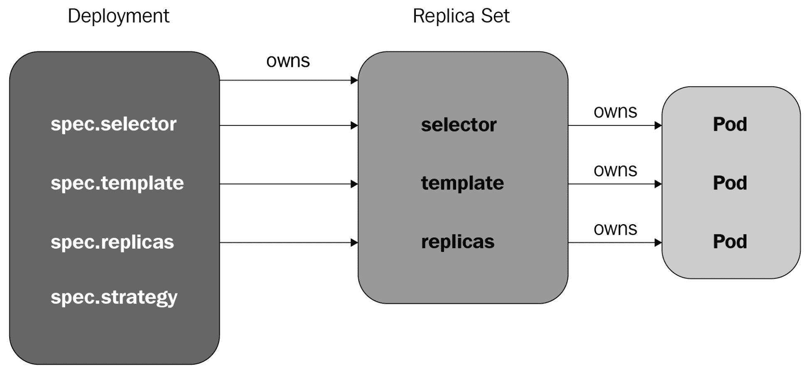
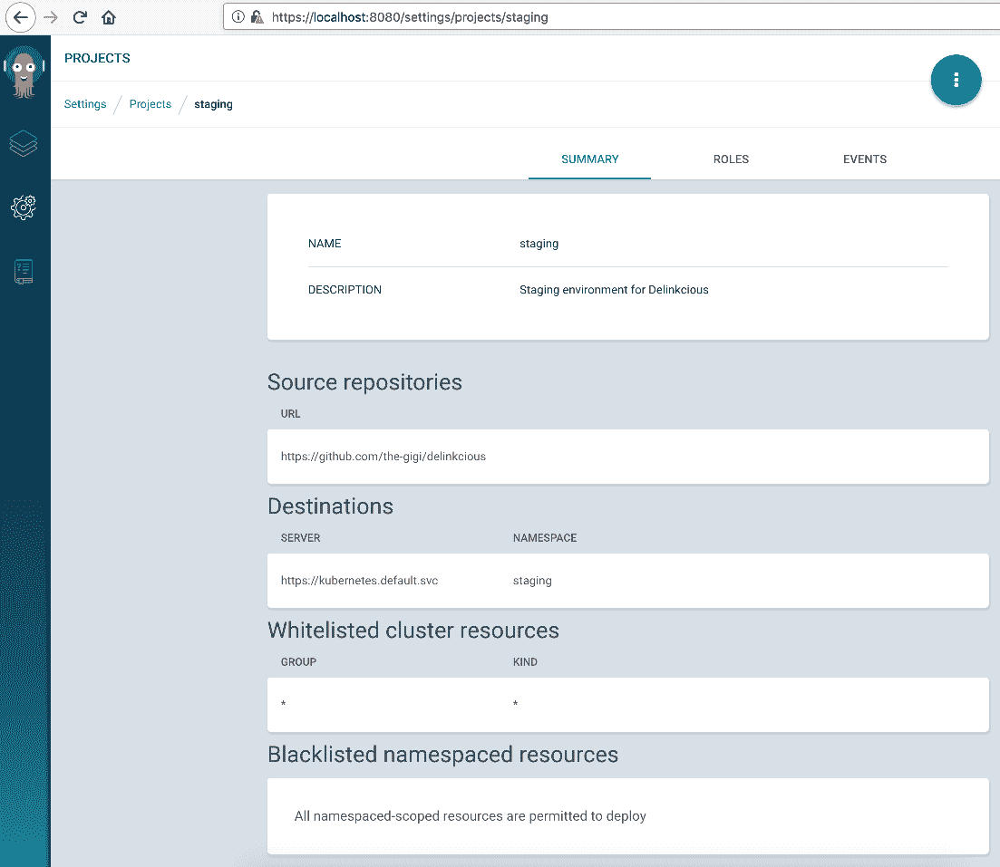
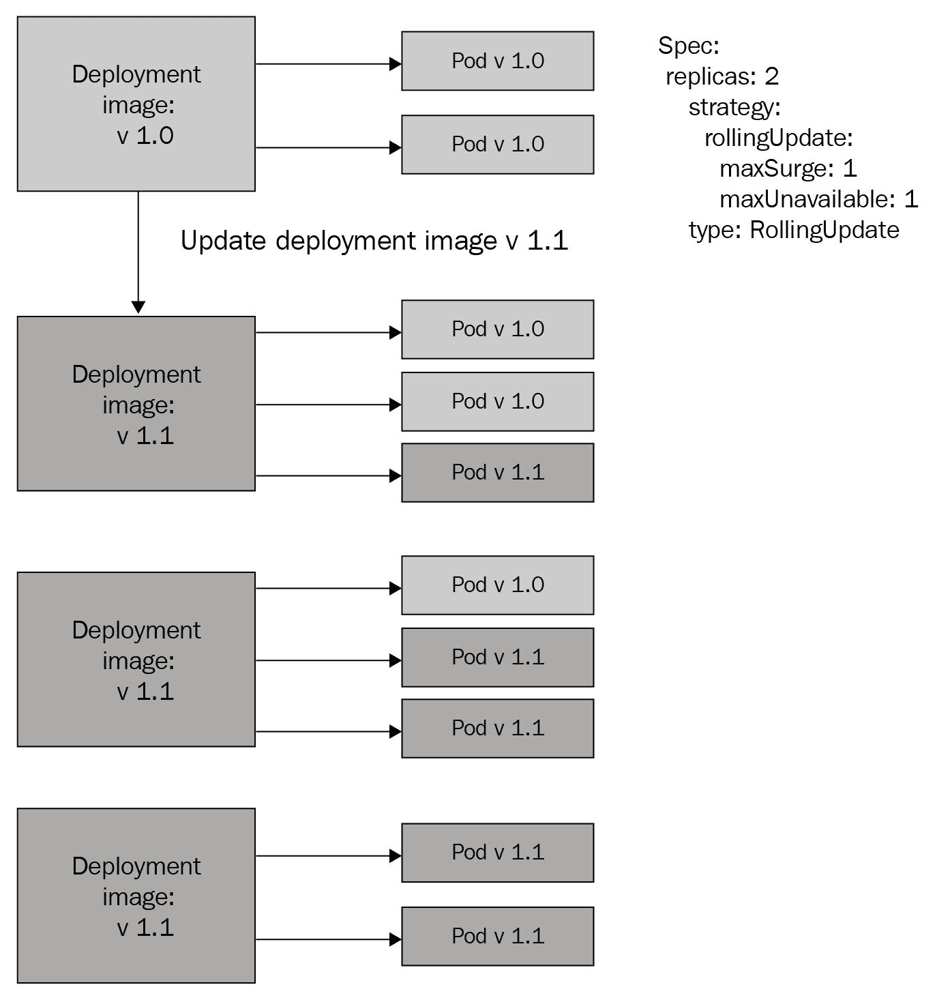
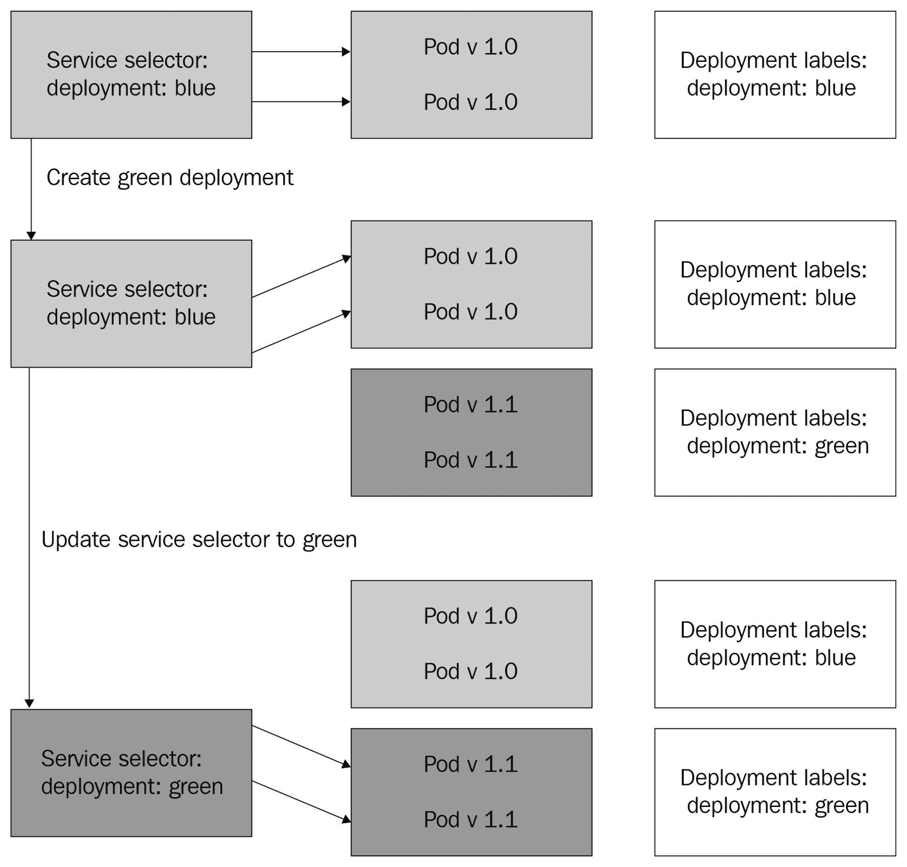
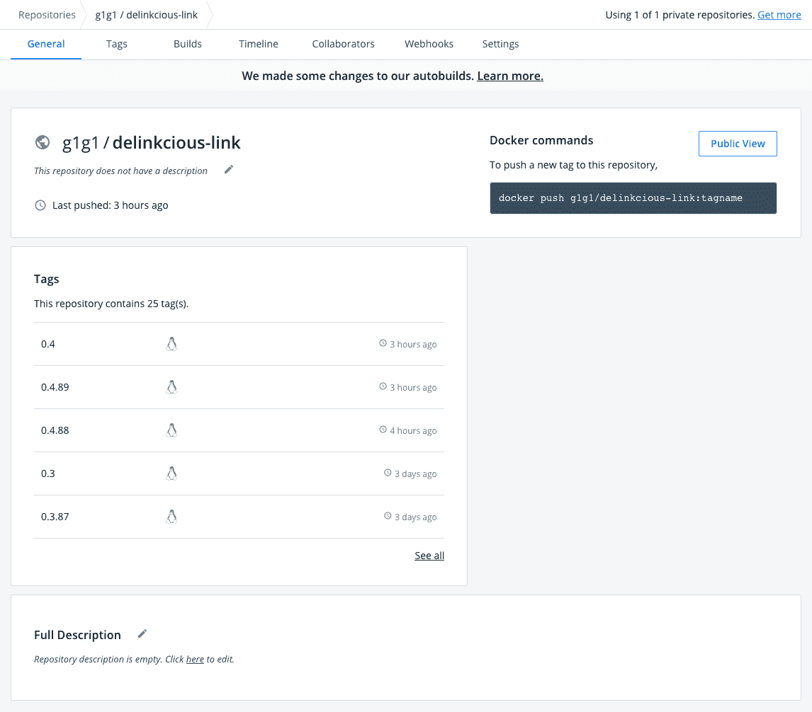
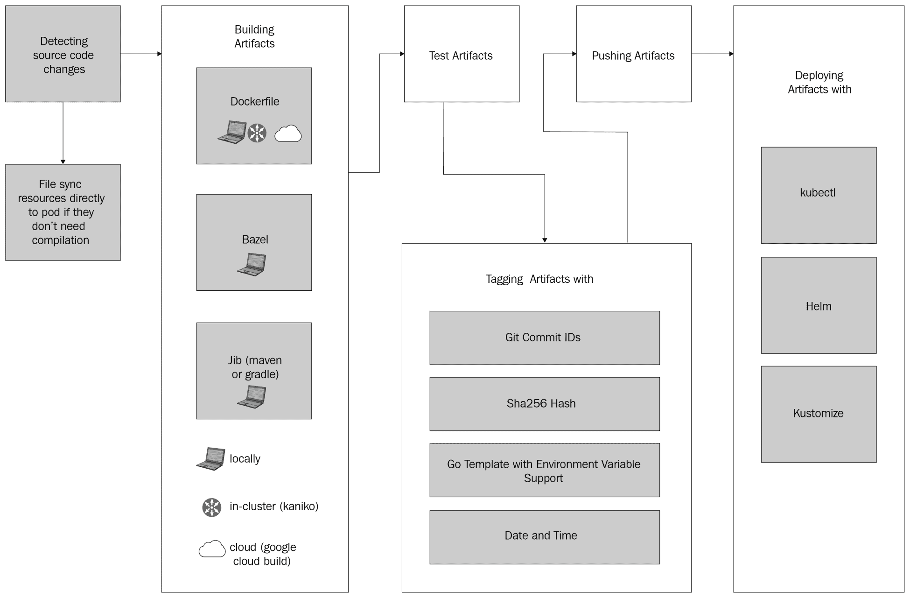
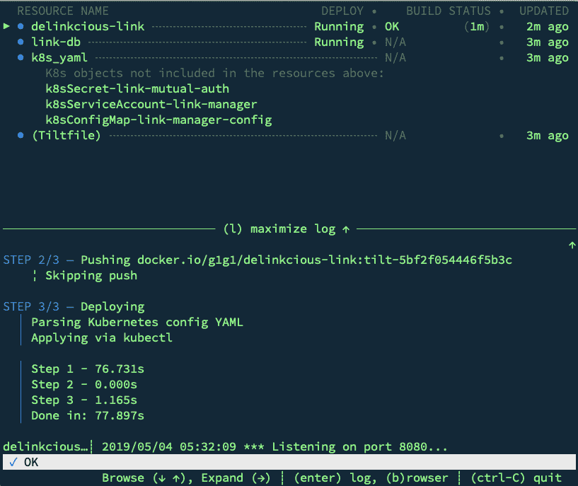
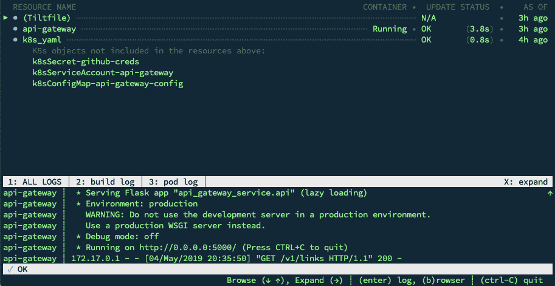
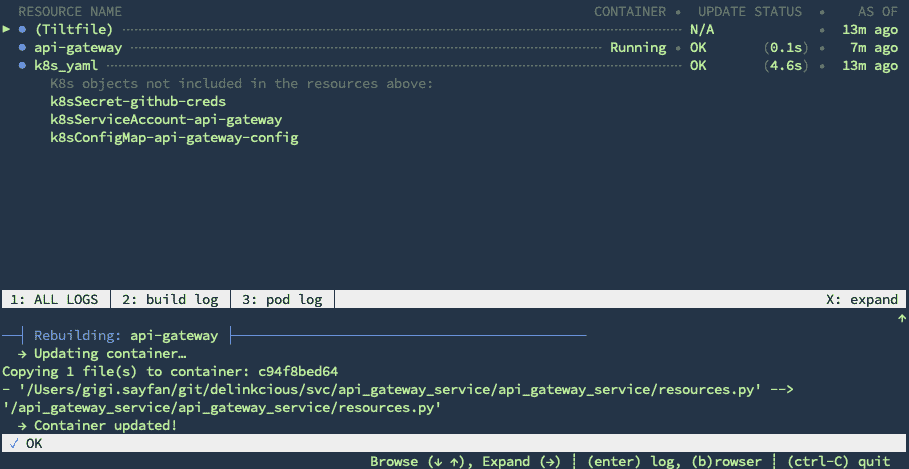

# 第十一章：部署微服务

在本章中，我们将处理两个相关但分开的主题：生产部署和开发部署。这两个领域使用的关注点、流程和工具都非常不同。在两种情况下，目标都是将新软件部署到集群中，但其他一切都不同。对于生产部署，保持系统稳定、能够获得可预测的构建和部署体验，最重要的是识别并能够回滚错误的部署是可取的。对于开发部署，希望为每个开发人员拥有隔离的部署，快速周转，并且能够避免在源代码控制或**持续集成** / **持续部署**（**CI**/**CD**）系统（包括镜像注册表）中堆积临时开发版本。因此，分歧的重点有利于将生产部署与开发部署隔离开来。

在本章中，我们将涵盖以下主题：

+   Kubernetes 部署

+   部署到多个环境

+   了解部署策略（滚动更新、蓝绿部署、金丝雀部署）

+   回滚部署

+   管理版本和升级

+   本地开发部署

# 技术要求

在本章中，我们将安装许多工具，包括以下内容：

+   KO

+   Ksync

+   Draft

+   Skaffold

+   Tilt

无需提前安装它们。

# 代码

代码分为两个 Git 存储库：

+   您可以在这里找到代码示例：[`github.com/PacktPublishing/Hands-On-Microservices-with-Kubernetes/tree/master/Chapter11`](https://github.com/PacktPublishing/Hands-On-Microservices-with-Kubernetes/tree/master/Chapter11)

+   您可以在这里找到更新的 Delinkcious 应用程序：[`github.com/the-gigi/delinkcious/releases/tag/v0.9`](https://github.com/the-gigi/delinkcious/releases/tag/v0.9)

# Kubernetes 部署

我们在《第一章》中简要讨论了部署，*开发人员的 Kubernetes 简介*，并且我们在几乎每一章中都使用了 Kubernetes 部署。然而，在深入研究更复杂的模式和策略之前，回顾基本构建块以及 Kubernetes 部署、Kubernetes 服务和扩展或自动扩展之间的关系将是有用的。

部署是通过 ReplicaSet 管理 pod 的 Kubernetes 资源。Kubernetes ReplicaSet 是一组由一组共同的标签标识并具有一定数量副本的 pod。ReplicaSet 与其 pod 之间的连接是 pod 元数据中的 `ownerReferences` 字段。ReplicaSet 控制器确保始终运行正确数量的副本。如果某个 pod 因任何原因死亡，ReplicaSet 控制器将安排一个新的 pod 来替代它。以下图示了这种关系：



部署和 ReplicaSet

我们还可以使用 kubectl 在元数据中观察所有权链。首先，让我们获取社交图管理器 pod 的名称，并从 `ownerReferences` 元数据中找到其 ReplicaSet 所有者的名称：

```
$ kubectl get po -l svc=social-graph,app=manager
NAME READY STATUS RESTARTS AGE
social-graph-manager-7d84ffc5f7-bst7w 1/1 Running 53 20d

 $ kubectl get po social-graph-manager-7d84ffc5f7-bst7w -o jsonpath="{.metadata.ownerReferences[0]['name']}"
 social-graph-manager-7d84ffc5f7

 $ kubectl get po social-graph-manager-7d84ffc5f7-bst7w -o jsonpath="{.metadata.ownerReferences[0]['kind']}"
 ReplicaSet
```

接下来，我们将获取拥有 ReplicaSet 的部署的名称：

```
$ kubectl get rs social-graph-manager-7d84ffc5f7 -o jsonpath="{.metadata.ownerReferences[0]['name']}"
 graph-manager

 $ kubectl get rs social-graph-manager-7d84ffc5f7 -o jsonpath="{.metadata.ownerReferences[0]['kind']}"
 Deployment
```

因此，如果 ReplicaSet 控制器负责管理 pod 的数量，那么 `Deployment` 对象添加了什么呢？`Deployment` 对象封装了部署的概念，包括部署策略和部署历史。它还提供了面向部署的操作，如更新部署和回滚部署，我们稍后会看到。

# 部署到多个环境

在本节中，我们将在新的 staging 命名空间中为 Delinkcious 创建一个 staging 环境。`staging` 命名空间将是默认命名空间的一个完整副本，将作为我们的生产环境。

首先，让我们创建命名空间：

```
$ kubectl create ns staging
namespace/staging created
```

然后，在 Argo CD 中，我们可以创建一个名为 `staging` 的新项目：

Argo CD staging 项目

现在，我们需要配置所有服务，以便 Argo CD 可以将它们同步到 staging 环境。现在在 UI 中执行这项工作可能有点繁琐，因为我们有大量的服务。相反，我们将使用 Argo CD CLI 和一个名为 `bootstrap_staging.py` 的 Python 3 程序来自动化这个过程。该程序需要以下内容：

+   已创建 staging 命名空间。

+   Argo CD CLI 已安装并在路径中。

+   Argo CD 服务可以通过本地主机的端口 `8080` 访问。

+   Argo CD 管理员密码配置为环境变量。

要在本地主机上的端口 `80` 上暴露 Argo CD，我们可以运行以下命令：

```
kubectl port-forward -n argocd svc/argocd-server 8080:443
```

让我们来分解程序并了解它是如何工作的。这是一个很好的基础，您可以通过自动化 CLI 工具来开发自己的定制 CI/CD 解决方案。唯一的依赖是 Python 的标准库模块：`subprocess`（允许您运行命令行工具）和 `os`（用于访问环境变量）。在这里，我们只需要运行 Argo CD CLI。

`run()` 函数隐藏了所有实现细节，并提供了一个方便的接口，您只需要将参数作为字符串传递。`run()` 函数将准备一个适当的命令列表，可以传递给 `subprocess` 模块的 `check_output()` 函数，捕获输出，并将其从字节解码为字符串：

```
import os
 import subprocess

def run(cmd):
     cmd = ('argocd ' + cmd).split()
     output = subprocess.check_output(cmd)
     return output.decode('utf-8')
```

`login()` 函数利用 `run()`，从环境中获取管理员密码，并构造适当的命令字符串，带有所有必要的标志，以便您可以作为管理员用户登录到 Argo CD：

```
def login():
     host = 'localhost:8080'
     password = os.environ['ARGOCD_PASSWORD']
     cmd = f'login {host} --insecure --username admin --password {password}'
     output = run(cmd)
     print(output)
```

`get_apps()` 函数接受一个命名空间，并返回其中 Argo CD 应用程序的相关字段。这个函数将在 `default` 命名空间和 `staging` 命名空间上都被使用。该函数调用 `app list` 命令，解析输出，并用相关信息填充一个 Python 字典：

```
def get_apps(namespace):
     """ """
     output = run(f'app list -o wide')
     keys = 'name project namespace path repo'.split()
     apps = []
     lines = output.split('\n')
     headers = [h.lower() for h in lines[0].split()]
     for line in lines[1:]:
         items = line.split()
         app = {k: v for k, v in zip(headers, items) if k in keys}
         if app:
             apps.append(app)
     return apps
```

`create_project()` 函数接受创建新的 Argo CD 项目所需的所有信息。请注意，多个 Argo CD 项目可以共存于同一个 Kubernetes 命名空间中。它还允许访问所有集群资源，这对于创建应用程序是必要的。由于我们已经在 Argo CD UI 中创建了项目，所以在这个程序中不需要使用它，但是如果将来需要创建更多项目，保留它是很好的：

```
def create_project(project, cluster, namespace, description, repo):
     """ """
     cmd = f'proj create {project} --description {description} -d {cluster},{namespace} -s {repo}'
     output = run(cmd)
     print(output)

     # Add access to resources
     cmd = f'proj allow-cluster-resource {project} "*" "*"'
     output = run(cmd)
     print(output)
```

最后一个通用函数被称为 `create_app()`，它接受创建 Argo CD 应用程序所需的所有信息。它假设 Argo CD 正在目标集群内运行，因此 `--dest-server` 始终是 `https://kubernetes.default.svc`：

```
def create_app(name, project, namespace, repo, path):
     """ """
     cmd = f"""app create {name}-staging --project {project} --dest-server https://kubernetes.default.svc
               --dest-namespace {namespace} --repo {repo} --path {path}"""
     output = run(cmd)
     print(output)
```

`copy_apps_from_default_to_staging()` 函数使用了我们之前声明的一些函数。它获取默认命名空间中的所有应用程序，对它们进行迭代，并在暂存项目和命名空间中创建相同的应用程序：

```
def copy_apps_from_default_to_staging():
     apps = get_apps('default')

     for a in apps:
         create_app(a['name'], 'staging', 'staging', a['repo'], a['path'])
```

最后，这是 `main` 函数：

```
def main():
     login()
     copy_apps_from_default_to_staging()

     apps = get_apps('staging')
     for a in apps:
         print(a)

 if __name__ == '__main__':
     main()
```

现在我们有了两个环境，让我们考虑一些工作流程和推广策略。每当有变更被推送时，GitHub CircleCI 将会检测到它。如果所有的测试都通过了，它将为每个服务烘烤一个新的镜像并将其推送到 Docker Hub。问题是，在部署方面应该发生什么？Argo CD 有同步策略，我们可以配置它们在 Docker Hub 上有新镜像时自动同步/部署。例如，一个常见的做法是自动部署到 staging，只有在 staging 上通过了各种测试（例如 `smoke` 测试）后才部署到 production。从 staging 到 production 的推广可能是自动的或手动的。

没有一种适合所有情况的答案。即使在同一个组织中，不同的部署策略和策略通常也会用于具有不同需求的项目或服务。

让我们来看一些更常见的部署策略以及它们能够实现的用例。

# 理解部署策略

在 Kubernetes 中部署一个服务的新版本意味着用运行版本 *X* 的 *N* 个后台 pod 替换为运行版本 *X+1* 的 *N* 个后台 pod。从运行版本 *X* 的 N 个 pod 到运行版本 *X+1* 的 N 个 pod 有多种方法。Kubernetes 部署支持两种默认策略：`Recreate` 和 `RollingUpdate`（默认策略）。蓝绿部署和金丝雀部署是另外两种流行的策略。在深入研究各种部署策略以及它们的优缺点之前，了解在 Kubernetes 中更新部署的过程是很重要的。

只有当部署规范的 pod 模板发生变化时，才会出现部署的新一组 pod。这通常发生在您更改 pod 模板的镜像版本或容器的标签集时。请注意，扩展部署（增加或减少其副本数量）*不*是更新，因此不会使用部署策略。任何新添加的 pod 中将使用与当前运行的 pod 相同版本的镜像。

# 重新创建部署

一个微不足道但天真的做法是终止所有运行版本 *X* 的 pod，然后创建一个新的部署，其中 pod 模板规范中的镜像版本设置为 *X+1*。这种方法有一些问题：

+   在新的 pod 上线之前，服务将不可用。

+   如果新版本有问题，服务将在过程被逆转之前不可用（忽略错误和数据损坏）。

`Recreate`部署策略适用于开发，或者当您希望有短暂的中断，但确保没有同时存在的版本混合。短暂的中断可能是可以接受的，例如，如果服务从队列中获取其工作，并且在升级到新版本时服务短暂下线没有不良后果。另一种情况是，如果您希望以不向后兼容的方式更改服务或其依赖项的公共 API。在这种情况下，当前的 pod 必须一次性终止，并且必须部署新的 pod。对于不兼容更改的多阶段部署有解决方案，但在某些情况下，更容易和可接受的方法是直接切断联系，并支付短暂中断的成本。

要启用这种策略，编辑部署的清单，将策略类型更改为`Recreate`，并删除`rollingUpdate`部分（只有在类型为`RollingUpdate`时才允许这样做）：

```
$ kubectl edit deployment user-manager
 deployment.extensions/user-manager edited

 $ kubectl get deployment user-manager -o yaml | grep strategy -A 1
 strategy:
 type: Recreate
```

对于大多数服务，希望在升级时保持服务连续性和零停机时间，并在检测到问题时立即回滚。`RollingUpdate`策略解决了这些情况。

# 滚动更新

默认的部署策略是`RollingUpdate`：

```
$ kubectl get deployment social-graph-manager -o yaml | grep strategy -A 4
 strategy:
 rollingUpdate:
 maxSurge: 25%
 maxUnavailable: 25%
 type: RollingUpdate
```

滚动更新的工作方式如下：pod 的总数（旧的和新的）将是当前副本数加上最大浪涌。部署控制器将开始用新的 pod 替换旧的 pod，确保不超过限制。最大浪涌可以是绝对数，比如 4，也可以是百分比，比如 25%。例如，如果部署的副本数是 4，最大浪涌是 25%，那么可以添加一个额外的新 pod，并终止一个旧的 pod。`maxUnavailable`是在部署期间低于副本数的 pod 的数量。

以下图示说明了滚动更新的工作方式：

滚动更新

滚动更新在新版本与当前版本兼容时是有意义的。准备处理请求的活动 pod 的数量保持在您使用`maxSurge`和`maxUnavailable`指定的副本数的合理范围内，并且逐渐地，所有当前的 pod 都被新的 pod 替换。整体服务不会中断。

然而，有时您必须立即替换所有的 pod，对于必须保持可用性的关键服务，`Recreate`策略是行不通的。这就是蓝绿部署的用武之地。

# 蓝绿部署

蓝绿部署是一个众所周知的模式。其思想是不更新现有部署；相反，您创建一个带有新版本的全新部署。最初，您的新版本不提供服务流量。然后，当您验证新部署已经运行良好（甚至可以对其运行一些`smoke`测试），您一次性将所有流量从当前版本切换到新版本。如果在切换到新版本后遇到任何问题，您可以立即将所有流量切换回先前的部署，该部署仍在运行。当您确信新部署运行良好时，您可以销毁先前的部署。

蓝绿部署的最大优势之一是它们不必在单个 Kubernetes 部署的级别上运行。在微服务架构中，您必须同时更新多个交互服务时，这一点至关重要。如果您尝试同时更新多个 Kubernetes 部署，可能会出现一些服务已经被替换，而另一些没有（即使您接受`Recreate`策略的成本）。如果在部署过程中出现单个服务的问题，现在您必须回滚所有其他服务。通过蓝绿部署，您可以避免这些问题，并完全控制何时要一次性切换到所有服务的新版本。

如何从蓝色（当前）切换到绿色（新）？与 Kubernetes 兼容的传统方法是在负载均衡器级别进行操作。大多数需要如此复杂部署策略的系统都会有负载均衡器。当您使用负载均衡器切换流量时，您的绿色部署包括绿色 Kubernetes 部署和绿色 Kubernetes 服务，以及任何其他资源（如果需要更改），如密码和配置映射。如果需要更新多个服务，那么您将拥有一组相互引用的绿色资源。

如果您有像 contour 这样的 Ingress 控制器，那么它通常可以用于在需要时将流量从蓝色切换到绿色，然后再切换回来。

以下图表说明了蓝绿部署的工作原理：



蓝绿部署

让我们为 link manager 服务进行单一服务的蓝绿部署。我们将起点称为*blue*，并且我们希望在没有中断的情况下部署*green*版本的 link manager。这是计划：

1.  向当前的`link-manager`部署添加`deployment: blue`标签。

1.  更新`link-manager`服务选择器以匹配`deployment: blue`标签。

1.  实现`LinkManager`的新版本，该版本使用`[green]`字符串作为每个链接描述的前缀。

1.  向部署的 pod 模板规范添加`deployment: green`标签。

1.  提升版本号。

1.  让 CircleCI 创建一个新版本。

1.  将新版本部署为名为`green-link-manager`的单独部署。

1.  更新`link-manager`服务选择器以匹配`deployment: green`标签。

1.  验证服务返回的链接描述，并包括`[green]`前缀。

这可能听起来很复杂，但就像许多 CI/CD 流程一样，一旦你建立了一个模式，你就可以自动化并构建围绕它的工具。这样你就可以在没有人类参与的情况下执行复杂的工作流程，或者在重要的关键点（例如，在真正部署到生产环境之前）注入人工审查和批准。让我们详细介绍一下步骤。

# 添加部署-蓝色标签

我们可以编辑部署，并手动添加`deployment: blue`，除了现有的`svc: link`和`app: manager`标签：

```
$ kubectl edit deployment link-manager 
deployment.extensions/link-manager edited
```

这将触发 pod 的重新部署，因为我们改变了标签。让我们验证新的 pod 是否有`deployment: blue`标签。这里有一个相当花哨的`kubectl`命令，使用自定义列来显示所有匹配`svc=link`和`app=manager`的 pod 的名称、部署标签和 IP 地址。

如你所见，所有三个 pod 都有`deployment:blue`标签，正如预期的那样：

```
$ kubectl get po -l svc=link,app=manager
 -o custom columns="NAME:.metadata.name,DEPLOYMENT:.metadata.labels.deployment,IP:.status.podIP" 
NAME                           DEPLOYMENT IP 
link-manager-65d4998d47-chxpj  blue       172.17.0.37 
link-manager-65d4998d47-jwt7x  blue       172.17.0.36 
link-manager-65d4998d47-rlfhb  blue       172.17.0.35
```

我们甚至可以验证 IP 地址是否与`link-manager`服务的端点匹配：

```
$ kubectl get ep link-manager
 NAME ENDPOINTS AGE
 link-manager 172.17.0.35:8080,172.17.0.36:8080,172.17.0.37:8080 21d
```

现在 pod 都带有`blue`标签，我们需要更新服务。

# 更新 link-manager 服务以仅匹配蓝色 pod

服务，你可能还记得，匹配任何带有`svc: link`和`app: manager`标签的 pod：

```
$ kubectl get svc link-manager -o custom-columns=SELECTOR:.spec.selector
SELECTOR 
map[app:manager svc:link]
```

通过添加`deployment: blue`标签，我们没有干扰匹配。然而，为了准备我们的绿色部署，我们应该确保服务只匹配当前蓝色部署的 pod。

让我们将`deployment: blue`标签添加到服务的`selector`中：

```
selector: app: manager svc: link deployment: blue
```

我们可以通过使用以下命令来验证它是否起作用：

```
$ kubectl get svc link-manager -o custom-columns=SELECTOR:.spec.selector 
SELECTOR 
map[app:manager deployment:blue svc:link]
```

在切换到绿色版本之前，让我们在代码中做出更改，以清楚表明这是一个不同的版本。

# 在每个链接的描述前加上[绿色]

让我们在链接服务的传输层中做这个。

目标文件是[`github.com/the-gigi/delinkcious/blob/master/svc/link_service/service/transport.go#L26`](https://github.com/the-gigi/delinkcious/blob/master/svc/link_service/service/transport.go#L26)。

更改非常小。在`newLink()`函数中，我们将描述前缀为`[green]`字符串：

```
func newLink(source om.Link) link { 
return link{ 
Url: source.Url, 
Title: source.Title, 
Description: "[green] " + source.Description, 
Status: source.Status, 
Tags: source.Tags, 
CreatedAt: source.CreatedAt.Format(time.RFC3339), 
UpdatedAt: source.UpdatedAt.Format(time.RFC3339), } }
```

为了部署我们的新绿色版本，我们需要创建一个新的镜像。这需要提升 Delinkcious 版本号。

# 提升版本号

Delinkcious 版本在`[build.sh]`文件中维护（[`github.com/the-gigi/delinkcious/blob/master/build.sh#L6`](https://github.com/the-gigi/delinkcious/blob/master/build.sh#L6)），CircleCI 从中调用，即`[.circleci/config.yml]`文件（[`github.com/the-gigi/delinkcious/blob/master/.circleci/config.yml#L28`](https://github.com/the-gigi/delinkcious/blob/master/.circleci/config.yml#L28)）。

`STABLE_TAG`变量控制版本号。当前版本是`0.3`。让我们将其提升到`0.4`：

```
#!/bin/bash
set -eo pipefail
IMAGE_PREFIX='g1g1' STABLE_TAG='0.4'
TAG="{CIRCLE_BUILD_NUM}" ...
```

好的。我们提升了版本号，现在可以让 CircleCI 构建一个新的镜像。

# 让 CircleCI 构建新镜像

由于 GitOps 和我们的 CircleCI 自动化，这一步只涉及将我们的更改推送到 GitHub。CircleCI 检测到更改，构建新代码，创建新的 Docker 镜像，并将其推送到 Docker Hub 注册表。就是这样：



Docker Hub 链接服务 0.4

现在新镜像已经构建并推送到 Docker Hub 注册表，我们可以将其部署到集群作为绿色部署。

# 部署新的（绿色）版本

好的 - 我们在 Docker Hub 上有了我们的新的`delinkcious-link:0.4`镜像。让我们将其部署到集群中。请记住，我们希望将其与我们当前的（蓝色）部署一起部署，即`link-manager`。让我们创建一个名为`green-link-manager`的新部署。它与我们的蓝色部署的区别如下：

+   名称是`green-link-manager`。

+   Pod 模板规范具有`deployment: green`标签。

+   镜像版本是`0.4`。

```
apiVersion: apps/v1
kind: Deployment
metadata:
 name: green-link-manager
 labels:
 svc: link
 app: manager
 deployment: green
spec:
 replicas: 3
 selector:
 matchLabels:
 svc: link
 app: manager
 deployment: green
 template:
 metadata:
 labels:
 svc: link
 app: manager
 deployment: green
 spec:
 serviceAccount: link-manager
 containers:
 - name: link-manager
 image: g1g1/delinkcious-link:0.4
 imagePullPolicy: Always
 ports:
 - containerPort: 8080
 envFrom:
 - configMapRef:
 name: link-manager-config
 volumeMounts:
 - name: mutual-auth
 mountPath: /etc/delinkcious
 readOnly: true
 volumes:
 - name: mutual-auth
 secret:
 secretName: link-mutual-auth
```

现在，是时候部署了：

```
$ kubectl apply -f green_link_manager.yaml
deployment.apps/green-link-manager created
```

在我们更新服务以使用绿色部署之前，让我们先审查一下集群。正如您所看到的，我们有蓝色和绿色部署并行运行：

```
$ kubectl get po -l svc=link,app=manager -o custom-columns="NAME:.metadata.name,DEPLOYMENT:.metadata.labels.deployment"
NAME                                  DEPLOYMENT
green-link-manager-5874c6cd4f-2ldfn   green
green-link-manager-5874c6cd4f-mvm5v   green
green-link-manager-5874c6cd4f-vcj9s   green
link-manager-65d4998d47-chxpj         blue
link-manager-65d4998d47-jwt7x         blue
link-manager-65d4998d47-rlfhb         blue
```

# 更新链接管理器服务以使用绿色部署

首先，让我们确保服务仍在使用蓝色部署。当我们得到一个链接描述时，不应该有任何`[green]`前缀：

```
$ http "${DELINKCIOUS_URL}/v1.0/links" "Access-Token: ${DELINKCIOUS_TOKEN}"'
HTTP/1.0 200 OK
Content-Length: 214
Content-Type: application/json
Date: Tue, 30 Apr 2019 06:02:03 GMT
Server: Werkzeug/0.14.1 Python/3.7.2

{
 "err": "",
 "links": [
 {
 "CreatedAt": "2019-04-30T06:01:47Z",
 "Description": "nothing to see here...",
 "Status": "invalid",
 "Tags": null,
 "Title": "gg",
 "UpdatedAt": "2019-04-30T06:01:47Z",
 "Url": "http://gg.com"
 }
 ]
}
```

描述是`没有什么可看的..*.*`。这一次，我们将使用`kubectl patch`命令应用补丁，而不是交互式地使用`kubectl edit`编辑服务，以应用一个将部署标签从`blue`切换到`green`的补丁。这是补丁文件-`green-patch.yaml`：

```
 spec:
   selector:
     deployment: green
```

让我们应用补丁：

```
$ kubectl patch service/link-manager --patch "$(cat green-patch.yaml)"
 service/link-manager patched 
```

最后一步是验证服务现在是否使用绿色部署。

# 验证服务现在是否使用绿色 pod 来处理请求。

让我们有条不紊地进行，从服务中的选择器开始：

```
$ kubectl get svc link-manager -o jsonpath="{.spec.selector.deployment}"
 **green** 
```

好的-选择器是绿色的。让我们再次获取链接，看看`[green]`前缀是否出现：

```
$ http "${DELINKCIOUS_URL}/v1.0/links" "Access-Token: ${DELINKCIOUS_TOKEN}"'

 HTTP/1.0 200 OK
 Content-Length: 221
 Content-Type: application/json
 Date: Tue, 30 Apr 2019 06:19:43 GMT
 Server: Werkzeug/0.14.1 Python/3.7.2

 {
 "err": "",
 "links": [
 {
 "CreatedAt": "2019-04-30T06:01:47Z",
 "Description": "[green] nothing to see here...",
 "Status": "invalid",
 "Tags": null,
 "Title": "gg",
 "UpdatedAt": "2019-04-30T06:01:47Z",
 "Url": "http://gg.com"
 }
 ]
 }
```

是的！描述现在是`[green] 这里没有什么可看的...`

现在，我们可以摆脱蓝色部署，我们的服务将继续针对绿色部署运行：

```
$ kubectl delete deployment link-manager
 deployment.extensions "link-manager" deleted

 $ kubectl get po -l svc=link,app=manager
 NAME                                  READY   STATUS    RESTARTS   AGE
 green-link-manager-5874c6cd4f-2ldfn   1/1     Running   5          1h
 green-link-manager-5874c6cd4f-mvm5v   1/1     Running   5          1h
 green-link-manager-5874c6cd4f-vcj9s   1/1     Running   5          1h
```

我们已成功在 Delinkcious 上执行了蓝绿部署。让我们讨论最后一个模式，即金丝雀部署。

# 金丝雀部署

金丝雀部署是另一种复杂的部署模式。考虑一个拥有大量用户的大规模分布式系统的情况。您想要引入服务的新版本。您已经尽力测试了这个变化，但是生产系统太复杂，无法在测试环境中完全模拟。因此，您无法确定新版本不会引起一些问题。你该怎么办？您可以使用金丝雀部署。其想法是，某些变化必须在生产环境中进行测试，然后您才能相对确定它们能够按预期工作。金丝雀部署模式允许您限制新版本可能引起的损害，如果出现问题。

Kubernetes 上的基本金丝雀部署通过在大多数 pod 上运行当前版本，只在少数 pod 上运行新版本来工作。大多数请求将由当前版本处理，只有一小部分请求将由新版本处理。

这假设了一个轮询负载均衡算法（默认），或者任何其他分配请求更或多或少均匀地跨所有 pod 的算法。

以下图表说明了金丝雀部署的外观：

！[](assets/a183a687-f439-473e-95f6-4b69491d0f41.png)

金丝雀部署

请注意，金丝雀部署要求您的当前版本和新版本可以共存。例如，如果您的更改涉及模式更改，则您的当前版本和新版本是不兼容的，天真的金丝雀部署将无法工作。

基本金丝雀部署的好处在于它使用现有的 Kubernetes 对象，并且可以由外部的操作员进行配置。无需自定义代码或将其他组件安装到您的集群中。但是，基本金丝雀部署有一些限制：

+   粒度为 K/N（最坏情况是 N = 1 的单例）。

+   无法控制对同一服务的不同请求的不同百分比（例如，仅读请求的金丝雀部署）。

+   无法控制同一用户对同一版本的所有请求。

在某些情况下，这些限制太严重，需要另一种解决方案。复杂的金丝雀部署通常利用应用程序级别的知识。这可以通过 Ingress 对象、服务网格或专用的应用程序级别流量整形器来实现。我们将在第十三章中看一个例子，*服务网格 - 与 Istio 一起使用*。

是时候进行 link 服务的实际金丝雀部署了。

# 为 Delinkcious 使用基本金丝雀部署

创建金丝雀部署与蓝绿部署非常相似。我们的`link-manager`服务当前正在运行绿色部署。这意味着它具有`deployment: green`的选择器。金丝雀是黄色的，所以我们将创建一个新版本的代码，该代码在链接描述前加上`[yellow]`。让我们的目标是将 10%的请求发送到新版本。为了实现这一点，我们将将当前版本扩展到九个副本，并添加一个具有新版本的部署。这就是金丝雀的技巧 - 我们将从服务选择器中删除部署标签。这意味着它将选择两个 pod；即`deployment: green`和`deployment: yellow`。我们也可以从部署中删除标签（因为没有人是基于此标签进行选择），但最好将它们保留为元数据，以及以防我们想要进行另一个蓝绿部署。

以下是计划：

1.  构建代码的新版本。

1.  创建一个新版本的副本计数为 1 的部署，标记为`deployment: yellow`。

1.  将当前的绿色部署扩展到九个副本。

1.  更新服务以选择`svc: link`和`app: manager`（忽略`deployment: <color>`）。

1.  对服务运行多个查询，并验证由金丝雀部署提供服务的请求比例为 10%。

代码更改是`trivial: [green] -> [yellow]`：

```
func newLink(source om.Link) link {
     return link{
         Url:         source.Url,
         Title:       source.Title,
         Description: "[green] " + source.Description,
         Status:      source.Status,
         Tags:        source.Tags,
         CreatedAt:   source.CreatedAt.Format(time.RFC3339),
         UpdatedAt:   source.UpdatedAt.Format(time.RFC3339),
     }
 }
```

然后，我们需要将`build.sh`中的版本从`0.4`升级到`0.5`：

```
#!/bin/bash

 set -eo pipefail

 IMAGE_PREFIX='g1g1'
 STABLE_TAG='0.4'

 TAG="${STABLE_TAG}.${CIRCLE_BUILD_NUM}" ...
```

一旦我们将这些更改推送到 GitHub，CircleCI 将构建并推送一个新的镜像到`DockerHub: g1g1/delinkcious-link:0.5`。

在这一点上，我们可以创建一个新的`0.5`版本的部署，一个单独的副本，并更新标签。让我们称之为`yellow_link_manager.yaml`：

```
--- apiVersion: apps/v1
 kind: Deployment
 metadata:
   name: yellow-link-manager
   labels:
     svc: link
     app: manager
     deployment: yellow
 spec:
   replicas: 1
   selector:
     matchLabels:
       svc: link
       app: manager
       deployment: yellow
   template:
     metadata:
       labels:
         svc: link
         app: manager
         deployment: yellow
     spec:
       serviceAccount: link-manager
       containers:
       - name: link-manager
         image: g1g1/delinkcious-link:0.5
         imagePullPolicy: Always
         ports:
         - containerPort: 8080
         envFrom:
         - configMapRef:
             name: link-manager-config
         volumeMounts:
         - name: mutual-auth
           mountPath: /etc/delinkcious
           readOnly: true
       volumes:
       - name: mutual-auth
         secret:
           secretName: link-mutual-auth
```

下一步是部署我们的金丝雀：

```
$ kubectl apply -f yellow_link_manager.yaml
 deployment.apps/yellow-link-manager created 
```

在更改服务以包含金丝雀部署之前，让我们将绿色部署扩展到 9 个副本，以便在激活金丝雀后它可以接收 90%的流量：

```
$ kubectl scale --replicas=9 deployment/green-link-manager
 deployment.extensions/green-link-manager scaled

 $ kubectl get po -l svc=link,app=manager
 NAME                                  READY   STATUS    RESTARTS   AGE
 green-link-manager-5874c6cd4f-2ldfn    1/1    Running   10         15h
 green-link-manager-5874c6cd4f-9csxz    1/1    Running   0          52s
 green-link-manager-5874c6cd4f-c5rqn    1/1    Running   0          52s
 green-link-manager-5874c6cd4f-mvm5v    1/1    Running   10         15h
 green-link-manager-5874c6cd4f-qn4zj    1/1    Running   0          52s
 green-link-manager-5874c6cd4f-r2jxf    1/1    Running   0          52s
 green-link-manager-5874c6cd4f-rtwsj    1/1    Running   0          52s
 green-link-manager-5874c6cd4f-sw27r    1/1    Running   0          52s
 green-link-manager-5874c6cd4f-vcj9s    1/1    Running   10         15h
 yellow-link-manager-67847d6b85-n97b5   1/1    Running   4        6m20s
```

好了，我们有九个绿色的 pod 和一个黄色（金丝雀）的 pod 在运行。让我们更新服务，只基于`svc: link`和`app: manager`标签进行选择，这将包括所有十个 pod。我们需要删除`deployment: green`标签。

我们之前使用的 YAML 补丁文件方法在这里不起作用，因为它只能添加或更新标签。这次我们将使用 JSON 补丁，使用*remove*操作，并指定选择器中*deployment*键的路径。

请注意，在打补丁之前，选择器中有`deployment: green`，而在打补丁之后，只剩下`svc: link`和`app: manager`：

```
$ kubectl get svc link-manager -o custom-columns=NAME:.metadata.name,SELECTOR:.spec.selector
 NAME           SELECTOR
 link-manager   map[app:manager deployment:green svc:link]

 $ kubectl patch svc link-manager --type=json -p='[{"op": "remove", "path": "/spec/selector/deployment"}]'
 service/link-manager patched

 $ kubectl get svc link-manager -o custom-columns=NAME:.metadata.name,SELECTOR:.spec.selector
 NAME           SELECTOR
 link-manager   map[app:manager svc:link]
```

现在开始表演。我们将向 Delinkcious 发送 30 个 GET 请求并检查描述：

```
$ for i in {1..30}
 > do
 >   http "${DELINKCIOUS_URL}/v1.0/links" "Access-Token: ${DELINKCIOUS_TOKEN}" | jq .links[0].Description
 > done

 "[green] nothing to see here..."
 "[yellow] nothing to see here..."
 "[green] nothing to see here..."
 "[green] nothing to see here..."
 "[green] nothing to see here..."
 "[green] nothing to see here..."
 "[green] nothing to see here..."
 "[green] nothing to see here..."
 "[green] nothing to see here..."
 "[yellow] nothing to see here..."
 "[green] nothing to see here..."
 "[green] nothing to see here..."
 "[green] nothing to see here..."
 "[green] nothing to see here..."
 "[green] nothing to see here..."
 "[yellow] nothing to see here..."
 "[green] nothing to see here..."
 "[yellow] nothing to see here..."
 "[yellow] nothing to see here..."
 "[green] nothing to see here..."
 "[green] nothing to see here..."
 "[green] nothing to see here..."
 "[green] nothing to see here..."
 "[yellow] nothing to see here..."
 "[green] nothing to see here..."
 "[green] nothing to see here..."
 "[green] nothing to see here..."
 "[green] nothing to see here..."
 "[green] nothing to see here..."
 "[green] nothing to see here..."
```

有趣的是-我们得到了 24 个绿色的响应和 6 个黄色的响应。这比预期的要高得多（平均三个黄色的响应）。我又运行了几次，第二次运行时又得到了六个黄色的响应，第三次运行时只得到了一个黄色的响应。这都是在 Minikube 上运行的，所以负载均衡可能有点特殊。让我们宣布胜利。

# 使用金丝雀部署进行 A/B 测试

金丝雀部署也可以用于支持 A/B 测试。只要我们有足够的 pod 来处理负载，我们可以部署任意多个版本。每个版本都可以包含特殊代码来记录相关数据，然后您可以获得见解并将用户行为与特定版本相关联。这是可能的，但您可能需要构建大量的工具和约定使其可用。如果 A/B 测试是设计工作流程的重要部分，我建议选择一个已建立的 A/B 测试解决方案。在我看来，重复发明 A/B 测试轮子是不值得的。

让我们考虑当出现问题时该怎么办，以便尽快恢复到正常状态。

# 回滚部署

在部署后出现问题时，最佳做法是回滚更改，恢复到已知可用的上一个版本。您进行此操作的方式取决于您采用的部署模式。让我们逐一考虑它们。

# 回滚标准的 Kubernetes 部署

Kubernetes 部署保留历史记录。例如，如果我们编辑用户管理器部署并将图像版本设置为`0.5`，那么现在我们可以看到有两个修订版：

```
$ kubectl get po -l svc=user,app=manager -o jsonpath="{.items[0].spec.containers[0].image}"
 g1g1/delinkcious-user:0.5

 $ kubectl rollout history deployment user-manager
 deployment.extensions/user-manager
 REVISION  CHANGE-CAUSE
 1         <none>
 2         <none>
```

`CHANGE-CAUSE`列默认情况下不记录。让我们再次进行更改，将版本更改为 0.4，但使用`--record=true`标志：

```
$ kubectl edit deployment user-manager --record=true
 deployment.extensions/user-manager edited

 $ kubectl rollout history deployment user-manager
 deployment.extensions/user-manager
 REVISION  CHANGE-CAUSE
 1         <none>
 2         <none>
 3         kubectl edit deployment user-manager --record=true
```

好的。让我们回滚到原始的 0.3 版本。那将是修订版 1。我们也可以使用`rollout history`命令查看特定修订版的情况：

```
$ kubectl rollout history deployment user-manager --revision=1
 deployment.extensions/user-manager with revision #1
 Pod Template:
 Labels:    app=manager
 pod-template-hash=6fb9878576
 svc=user
 Containers:
 user-manager:
 Image:    g1g1/delinkcious-user:0.3
 Port:    7070/TCP
 Host Port:    0/TCP
 Limits:
 cpu:    250m
 memory:    64Mi
 Requests:
 cpu:    250m
 memory:    64Mi
 Environment Variables from:
 user-manager-config    ConfigMap    Optional: false
 Environment:    <none>
 Mounts:    <none>
 Volumes:    <none>
```

如您所见，修订版 1 具有版本 0.3。回滚的命令如下：

```
$ kubectl rollout undo deployment user-manager --to-revision=1
 deployment.extensions/user-manager rolled back

 $ kubectl get deployment user-manager -o jsonpath="{.spec.template.spec.containers[0].image}"
 g1g1/delinkcious-user:0.3
```

回滚将使用滚动更新的相同机制，逐渐替换 pod，直到所有正在运行的 pod 都具有正确的版本。

# 回滚蓝绿部署

Kubernetes 不直接支持蓝绿部署。从绿色切换回蓝色（假设蓝色部署的 pod 仍在运行）非常简单。您只需更改`Service`选择器，选择`deployment: blue`而不是`deployment: green`。从蓝色立即切换到绿色，反之亦然，是蓝绿部署模式的主要动机，因此这么简单也就不足为奇了。一旦切换回蓝色，您可以删除绿色部署并找出问题所在。

# 回滚金丝雀部署

金丝雀部署可能更容易回滚。大多数 pod 运行经过验证的旧版本。金丝雀部署的 pod 仅提供少量请求。如果检测到金丝雀部署出现问题，只需删除部署。您的主要部署将继续提供传入请求。如果必要（例如，您的金丝雀部署提供了少量但重要的流量），您可以扩展主要部署以弥补不再存在的金丝雀 pod。

# 在模式、API 或有效负载更改后处理回滚

您选择的部署策略通常取决于新版本引入的更改的性质。例如，如果您的更改涉及破坏性的数据库模式更改，比如将 A 表拆分为 B 和 C 表，那么您不能简单地部署新版本来读取/写入 B 和 C。数据库需要先进行迁移。然而，如果遇到问题并希望回滚到先前的版本，那么您将在相反的方向上遇到相同的问题。您的旧版本将尝试从 A 表读取/写入，而 A 表已经不存在了。如果更改配置文件或某些网络协议的有效负载格式，也可能出现相同的问题。如果您不协调 API 更改，可能会破坏客户端。

解决这些兼容性问题的方法是在多个部署中执行这些更改，其中每个部署与上一个部署完全兼容。这需要一些规划和工作。让我们考虑将 A 表拆分为 B 表和 C 表的情况。假设我们处于版本 1.0，并最终希望最终使用版本 2.0。

我们的第一个更改将标记为版本 1.1。它将执行以下操作：

+   创建 B 和 C 表（但保留 A 表）。

+   更改代码以写入 B 和 C。

+   更改代码以从 A、B 和 C 读取并合并结果（旧数据来自 A，而新数据来自 B 和 C）。

+   如果需要删除数据，只需标记为已删除。

我们部署版本 1.1，如果发现有问题，我们将回滚到版本 1.0。我们所有的旧数据仍然在 A 表中，而版本 1.0 与之完全兼容。我们可能已经丢失或损坏了 B 表和 C 表中的少量数据，但这是我们之前没有充分测试的代价。版本 1.1 可能是一个金丝雀部署，因此只丢失了少量请求。

然后，我们发现问题，修复它们，并部署版本 1.2，这与版本 1.1 写入 B 和 C 的方式相同，但是从 A、B 和 C 读取，并且不删除 A 中的数据。

我们观察一段时间，直到我们确信版本 1.2 按预期工作。

下一步是迁移数据。我们将 A 表中的数据写入 B 表和 C 表。活动部署版本 1.2 继续从 B 和 C 读取，并且仅合并 A 中缺失的数据。在完成所有代码更改之前，我们仍然保留 A 中的所有旧数据。

此时，所有数据都在 B 表和 C 表中。我们部署版本 1.3，它忽略 A 表，并完全针对 B 表和 C 表工作。

我们再次观察，如果遇到 1.3 的任何问题，可以回到版本 1.2，并发布版本 1.4、1.5 等。但是，在某个时候，我们的代码将按预期工作，然后我们可以将最终版本重命名/重新标记为 2.0，或者只是剪切一个除版本号外完全相同的新版本。

最后一步是删除 A 表。

这可能是一个缓慢的过程，每当部署新版本时都需要运行大量测试，但在进行可能损坏数据的危险更改时是必要的。

当然，您将在开始之前备份数据，但是对于高吞吐量系统，即使在糟糕的升级期间短暂的中断也可能非常昂贵。

底线是包含模式更改的更新是复杂的。管理的方法是执行多阶段升级，其中每个阶段与上一个阶段兼容。只有在证明当前阶段正常工作时才能前进。单个微服务拥有每个数据存储的原则的好处是，至少 DB 模式更改受限于单个服务，并且不需要跨多个服务协调。

# 版本和依赖管理

管理版本是一个棘手的话题。在基于微服务的架构中，您的微服务可能具有许多依赖项，以及许多内部和外部客户端。有几类版本化资源，它们都需要不同的管理策略和版本化方案。

# 管理公共 API

公共 API 是在集群外部使用的网络 API，通常由大量用户和/或开发人员使用，他们可能与您的组织有或没有正式关系。公共 API 可能需要身份验证，但有时可能是匿名的。公共 API 的版本控制方案通常只涉及主要版本，例如 V1、V2 等。Kubernetes API 就是这种版本控制方案的一个很好的例子，尽管它还有 API 组的概念，并使用 alpha 和 beta 修饰符，因为它面向开发人员。

Delinkcious 到目前为止使用了`<major>.<minor>`版本控制方案的单一公共 API：

```
 api = Api(app)
     resource_map = (
         (Link, '/v1.0/links'),
         (Followers, '/v1.0/followers'),
         (Following, '/v1.0/following'),
     )
```

这有点过度了，只有一个主要版本就足够了。让我们来改变它（当然还有所有受影响的测试）：

```
     api = Api(app)
     resource_map = (
         (Link, '/v1/links'),
         (Followers, '/v1/followers'),
         (Following, '/v1/following'),
     )
```

请注意，即使在编写本书的过程中我们进行了重大更改，我们仍然保持相同的版本。这没问题，因为目前还没有外部用户，所以我们有权更改我们的公共 API。然而，一旦我们正式发布我们的应用程序，如果我们进行重大更改而不更改 API 版本，我们就有义务考虑用户的负担。这是一个相当糟糕的反模式。

# 管理跨服务依赖

跨服务依赖通常被定义和记录为内部 API。然而，对实现和/或合同的微小更改可能会显着影响其他服务。例如，如果我们更改`object_model/types.go`中的结构，可能需要修改大量代码。在经过充分测试的单体库中，这不是一个问题，因为进行更改的开发人员可以确保所有相关的消费者和测试都已更新。许多系统由多个存储库构建，可能很难识别所有的消费者。在这些情况下，重大更改可能会保留，并在部署后被发现。

Delinkcious 是一个单体库，实际上在其端点的 URL 中根本没有使用任何版本控制方案。这是社交图管理器的 API：

```
     r := mux.NewRouter()
     r.Methods("POST").Path("/follow").Handler(followHandler)
     r.Methods("POST").Path("/unfollow").Handler(unfollowHandler)
     r.Methods("GET").Path("/following/{username}").Handler(getFollowingHandler)
     r.Methods("GET").Path("/followers/{username}").Handler(getFollowersHandler)
```

如果您永远不打算运行同一服务的多个版本，这种方法是可以接受的。在大型系统中，这不是一种可扩展的方法。总会有一些消费者不愿意立即升级到最新和最好的版本。

# 管理第三方依赖

第三方依赖有三种不同的版本：

+   您构建软件的库和软件包（如第二章中讨论的*使用微服务入门*）

+   通过 API 由您的代码访问的第三方服务

+   您用于操作和运行系统的服务

例如，如果您在云中运行系统，那么您的云提供商就是一个巨大的依赖（Kubernetes 可以帮助减轻风险）。另一个很好的例子是将第三方服务用作 CI/CD 解决方案。

选择第三方依赖时，您会放弃一些（或很多）控制权。您应该始终考虑如果第三方依赖突然变得不可用或不可接受会发生什么。这可能有很多原因：

+   开源项目被放弃或失去动力

+   第三方提供商关闭

+   库存在太多安全漏洞

+   服务存在太多故障

假设您明智地选择了依赖，让我们考虑两种情况：

+   升级到库的新版本

+   升级到第三方服务的新 API 版本

每次升级都需要相应升级系统中使用这些依赖的任何组件（库或服务）。通常，这些升级不应该修改任何服务的 API，也不应该修改库的公共接口。它们可能会改变您的服务的运行配置文件（希望是更好的，比如更少的内存，更高的性能）。

升级您的服务很简单。您只需部署依赖新第三方依赖的新版本服务，然后就可以继续进行。对第三方库的更改可能会更加复杂。您需要识别所有依赖于这个第三方库的库。升级您的库，然后识别使用任何（现在升级过的）库的每个服务，并升级这些服务。

强烈建议为您的库和软件包使用语义化版本控制。

# 管理基础设施和工具链

您的基础架构和工具链也必须小心管理，甚至进行版本控制。在大型系统中，您的 CI/CD 流水线通常会调用各种脚本来自动化重要任务，比如迁移数据库、预处理数据和配置云资源。这些内部工具可能会发生重大变化。容器化系统中另一个重要的类别是基础镜像的版本。代码基础设施方法结合 GitOps，主张将系统的这些方面进行版本控制并存储在源代码控制系统（Git）中。

到目前为止，我们已经涵盖了很多关于真实部署的黑暗角落和困难用例，以及如何安全可靠地演进和升级大型系统。让我们回到个别开发人员。对于需要在集群中进行快速编辑-测试-调试循环的开发人员，有一套非常不同的要求和关注点。

# 本地开发部署

开发人员希望快速迭代。当我对某些代码进行更改时，我希望尽快运行测试，如果有问题，尽快修复。我们已经看到这在单元测试中运行得很好。然而，当系统使用微服务架构打包为容器并部署到 Kubernetes 集群时，这是不够的。为了真正评估变更的影响，我们经常需要构建一个镜像（其中可能包括更新 Kubernetes 清单，如部署、秘钥和配置映射）并将其部署到集群中。在 Minikube 上本地开发非常棒，但即使部署到本地 Minikube 集群也需要时间和精力。在第十章中，*测试微服务*，我们使用 Telepresence 进行了交互式调试，效果很好。然而，Telepresence 有其自己的怪癖和缺点，并不总是最适合的工具。在接下来的小节中，我们将介绍几种其他替代方案，在某些情况下可能是更好的选择。

# Ko

Ko（[`github.com/google/ko`](https://github.com/google/ko)）是一个非常有趣的 Go 特定工具。它的目标是简化和隐藏构建图像的过程。其想法是，在 Kubernetes 部署中，您将图像路径从注册表替换为 Go 导入路径。Ko 将读取此导入路径，为您构建 Docker 图像，将其发布到注册表（如果使用 Minikube，则为本地），并将其部署到您的集群中。Ko 提供了指定基本图像和在生成的图像中包含静态数据的方法。

让我们试一试，稍后讨论体验。

您可以通过标准的`go get`命令安装 Ko：

```
go get github.com/google/ko/cmd/ko
```

Ko 要求您在`GOPATH`中工作。出于各种原因，我通常不在`GOPATH`中工作（Delinkcious 使用不需要`GOPATH`的 Go 模块）。为了适应 Ko，我使用了以下代码：

```
 $ export GOPATH=~/go
 $ mkdir -p ~/go/src/github.com/the-gigi
 $ cd ~/go/src/github.com/the-gigi
 $ ln -s ~/git/delinkcious delinkcious
 $ cd delinkcious
 $ go get -d ./...
```

在这里，我复制了 Go 在`GOPATH`下期望的目录结构，包括在 GitHub 上复制到 Delinkcious 的路径。然后，我使用`go get -d ./...`递归地获取了 Delinkcious 的所有依赖项。

最后的准备步骤是为本地开发设置 Ko。当 Ko 构建图像时，我们不应将其推送到 Docker Hub 或任何远程注册表。我们希望快速本地循环。Ko 允许您以各种方式执行此操作。其中最简单的方法之一如下：

```
export KO_DOCKER_REPO=ko.local
```

其他方法包括配置文件或在运行 Ko 时传递`-L`标志。

现在，我们可以继续使用 Ko。这是`ko-link-manager.yaml`文件，其中将图像替换为链接管理器服务的 Go 导入路径（`github.com/the-gigi/delinkcious/svc/link_service`）。请注意，我将`imagePullPolicy`从`Always`更改为`IfNotPresent`。

`Always`策略是安全且已准备就绪的策略，但在本地工作时，它将忽略本地的 Ko 镜像，而是从 Docker Hub 拉取：

```
---
 apiVersion: apps/v1
 kind: Deployment
 metadata:
   name: ko-link-manager
   labels:
     svc: link
     app: manager
 spec:
   replicas: 1
   selector:
     matchLabels:
       svc: link
       app: manager
   template:
     metadata:
       labels:
         svc: link
         app: manager
     spec:
       serviceAccount: link-manager
       containers:
       - name: link-manager
         image: "github.com/the-gigi/delinkcious/svc/link_service"
         imagePullPolicy: IfNotPresent
         ports:
         - containerPort: 8080
         envFrom:
         - configMapRef:
             name: link-manager-config
         volumeMounts:
         - name: mutual-auth
           mountPath: /etc/delinkcious
           readOnly: true
       volumes:
       - name: mutual-auth
         secret:
           secretName: link-mutual-auth
```

下一步是在修改后的部署清单上运行 Ko：

```
$ ko apply -f ko_link_manager.yaml
 2019/05/01 14:29:31 Building github.com/the-gigi/delinkcious/svc/link_service
 2019/05/01 14:29:34 Using base gcr.io/distroless/static:latest for github.com/the-gigi/delinkcious/svc/link_service
 2019/05/01 14:29:34 No matching credentials were found, falling back on anonymous
 2019/05/01 14:29:36 Loading ko.local/link_service-1819ff5de960487aed3f9074cd43cc03:1c862ed08cf571c6a82a3e4a1eb2d79dbe122fc4901e73f88b51f0731d4cd565
 2019/05/01 14:29:38 Loaded ko.local/link_service-1819ff5de960487aed3f9074cd43cc03:1c862ed08cf571c6a82a3e4a1eb2d79dbe122fc4901e73f88b51f0731d4cd565
 2019/05/01 14:29:38 Adding tag latest
 2019/05/01 14:29:38 Added tag latest
 deployment.apps/ko-link-manager configured
```

为了测试部署，让我们运行我们的`smoke`测试：

```
 $ go run smoke.go
 2019/05/01 14:35:59 ======= Links =======
 2019/05/01 14:35:59 ===== Add Link ======
 2019/05/01 14:35:59 Adding new link - title: 'Gigi on Github', url: 'https://github.com/the-gigi'
 2019/05/01 14:36:00 ======= Links =======
 2019/05/01 14:36:00 title: 'Gigi on Github', url: 'https://github.com/the-gigi', status: 'pending', description: '[yellow] '
 2019/05/01 14:36:04 ======= Links =======
 2019/05/01 14:36:04 title: 'Gigi on Github', url: 'https://github.com/the-gigi', status: 'valid', description: '[yellow] '
```

一切看起来都很好。链接描述包含我们金丝雀部署工作的`[yellow]`前缀。让我们将其更改为`[ko]`，看看 Ko 可以重新部署有多快：

```
func newLink(source om.Link) link {
     return link{
         Url:         source.Url,
         Title:       source.Title,
         Description: "[ko] " + source.Description,
         Status:      source.Status,
         Tags:        source.Tags,
         CreatedAt:   source.CreatedAt.Format(time.RFC3339),
         UpdatedAt:   source.UpdatedAt.Format(time.RFC3339),
     }
 }
```

在修改后的代码上再次运行 Ko 只需 19 秒，一直到在集群中部署。这令人印象深刻：

```
$ ko apply -f ko_link_manager.yaml
 2019/05/01 14:39:37 Building github.com/the-gigi/delinkcious/svc/link_service
 2019/05/01 14:39:52 Using base gcr.io/distroless/static:latest for github.com/the-gigi/delinkcious/svc/link_service
 2019/05/01 14:39:52 No matching credentials were found, falling back on anonymous
 2019/05/01 14:39:54 Loading ko.local/link_service-1819ff5de960487aed3f9074cd43cc03:1af7800585ca70a390da7e68e6eef506513e0f5d08cabc05a51c453e366ededf
 2019/05/01 14:39:56 Loaded ko.local/link_service-1819ff5de960487aed3f9074cd43cc03:1af7800585ca70a390da7e68e6eef506513e0f5d08cabc05a51c453e366ededf
 2019/05/01 14:39:56 Adding tag latest
 2019/05/01 14:39:56 Added tag latest
 deployment.apps/ko-link-manager configured
```

`smoke`测试有效，并且描述现在包含`[ko]`前缀而不是`[yellow]`，这证明 Ko 按照广告中的方式工作，并且确实快速构建了一个 Docker 容器并将其部署到了集群中：

```
$ go run smoke.go
 2019/05/01 22:12:10 ======= Links =======
 2019/05/01 22:12:10 ===== Add Link ======
 2019/05/01 22:12:10 Adding new link - title: 'Gigi on Github', url: 'https://github.com/the-gigi'
 2019/05/01 22:12:10 ======= Links =======
 2019/05/01 22:12:10 title: 'Gigi on Github', url: 'https://github.com/the-gigi', status: 'pending', description: '[ko] '
 2019/05/01 22:12:14 ======= Links =======
 2019/05/01 22:12:14 title: 'Gigi on Github', url: 'https://github.com/the-gigi', status: 'valid', description: '[ko] '
```

让我们来看看 Ko 构建的镜像。为了做到这一点，我们将`ssh`进入 Minikube 节点并检查 Docker 镜像：

```
$ mk ssh
 _             _
 _         _ ( )           ( )
 ___ ___  (_)  ___  (_)| |/')  _   _ | |_      __
 /' _ ` _ `\| |/' _ `\| || , <  ( ) ( )| '_`\  /'__`\
 | ( ) ( ) || || ( ) || || |\`\ | (_) || |_) )(  ___/
 (_) (_) (_)(_)(_) (_)(_)(_) (_)`\___/'(_,__/'`\____)

 $ docker images | grep ko
 ko.local/link_service-1819ff5de960487aed3f9074cd43cc03           1af7800585ca70a390da7e68e6eef506513e0f5d08cabc05a51c453e366ededf   9188384722a5        49 years ago        14.1MB
 ko.local/link_service-1819ff5de960487aed3f9074cd43cc03           latest                                                             9188384722a5        49 years ago        14.1MB
```

镜像似乎由于某种原因具有 Unix 纪元（1970 年）开始的创建日期。除此之外，一切看起来都很好。请注意，该镜像比我们正常的链接管理器要大，因为 Ko 默认使用[gcr.io/distroless/base:latest](http://gcr.io/distroless/base:latest)作为基础镜像，而 Delinkcious 使用 SCRATCH 镜像。如果你愿意，你可以使用`.ko.yaml`配置文件覆盖基础镜像。

简而言之，Ko 易于安装、配置，并且运行非常好。不过，我觉得它太过受限：

+   这是一个仅适用于 Go 的工具。

+   你必须将你的代码放在`GOPATH`中，并使用标准的 Go 目录结构（在 Go 1.11+模块中已过时）。

+   你必须修改你的清单（或者使用 Go 导入路径创建一个副本）。

在将新的 Go 服务集成到 CI/CD 系统之前，测试它可能是一个不错的选择。

# Ksync

Ksync 是一个非常有趣的工具。它根本不构建镜像。它直接在集群中的运行容器内部同步本地目录和远程目录中的文件。这是非常简化的操作，特别是如果你同步到本地的 Minikube 集群。然而，这种便利是有代价的。Ksync 特别适用于使用动态语言（如 Python 和 Node）实现的服务，可以在同步更改时进行热重载应用程序。如果你的应用程序不支持热重载，Ksync 可以在每次更改后重新启动容器。让我们开始工作吧：

1.  安装 Ksync 非常简单，但记得在将其直接传输到`bash`之前检查你要安装的内容！

```
curl https://vapor-ware.github.io/gimme-that/gimme.sh | bash
```

如果你愿意，你可以使用`go`命令来安装它：

```
go get github.com/vapor-ware/ksync/cmd/ksync
```

1.  我们还需要启动 Ksync 的集群端组件，它将在每个节点上创建一个 DaemonSet 来监听更改并将其反映到运行的容器中：

```
ksync init
```

1.  现在，我们可以告诉 Ksync 监听更改。这是一个阻塞操作，Ksync 将永远监听。我们可以在一个单独的终端或选项卡中运行它：

```
ksync watch
```

1.  设置的最后一部分是在目标 pod 或多个 pod 上的本地目录和远程目录之间建立映射。通常情况下，我们通过标签选择器来识别 pod。唯一使用动态语言的 Delinkcious 服务是 API 网关，所以我们将在这里使用它：

```
cd svc/api_gateway_service ksync create --selector=svc=api-gateway $PWD /api_gateway_service
```

1.  我们可以通过修改 API 网关来测试 Ksync 是否有效。让我们在`get()`方法中添加一个 Ksync 消息：

```
def get(self):
     """Get all links
     """
     username, email = _get_user()
     parser = RequestParser()
     parser.add_argument('url_regex', type=str, required=False)
     parser.add_argument('title_regex', type=str, required=False)
     parser.add_argument('description_regex', type=str, required=False)
     parser.add_argument('tag', type=str, required=False)
     parser.add_argument('start_token', type=str, required=False)
     args = parser.parse_args()
     args.update(username=username)
     r = requests.get(self.base_url, params=args)

     if not r.ok:
         abort(r.status_code, message=r.content)

     result = r.json()
     result.update(ksync='Yeah, it works!')
     return result
```

1.  几秒钟后，我们将看到来自 Ksync 的`是的，它有效了！`消息。这是一个巨大的成功：

```
$ http "${DELINKCIOUS_URL}/v1/links" "Access-Token: ${DELINKCIOUS_TOKEN}"'
HTTP/1.0 200 OK Content-Length: 249 Content-Type: application/json Date: Thu, 02 May 2019 17:17:07 GMT Server: Werkzeug/0.14.1 Python/3.7.2
{ "err": "", "ksync": "Yeah, it works!", "links": [ { "CreatedAt": "2019-05-02T05:12:10Z", "Description": "[ko] ", "Status": "valid", "Tags": null, "Title": "Gigi on Github", "UpdatedAt": "2019-05-02T05:12:10Z", "Url": "https://github.com/the-gigi" } ] }
```

总之，Ksync 非常简洁和快速。我真的很喜欢它不会烘烤图像，将它们推送到注册表，然后部署到集群的事实。如果您的所有工作负载都使用动态语言，那么使用 Ksync 是一个明智的选择。

# Draft

Draft 是微软的另一个工具（最初来自 Deis），它可以快速构建图像而无需 Dockerfile。它使用各种语言的标准构建包。看起来似乎您无法提供自己的基础图像。这有两个问题：

+   您的服务可能不仅仅是代码，可能还依赖于您在 Dockerfile 中设置的东西。

+   Draft 使用的基础图像相当大。

Draft 依赖于 Helm，因此您必须在集群上安装 Helm。安装非常灵活，支持许多方法。

您可以确信 Draft 在 Windows 上运行良好，不像云原生领域中许多其他工具，其中 Windows 是一个二等公民。这种心态开始改变，因为微软、Azure 和 AKS 是 Kubernetes 生态系统的重要贡献者。好的，让我们来试用一下 Draft：

1.  在 macOS 上安装`draft`（假设您已经安装了 Helm）就像做以下操作一样简单：

```
brew install azure/draft/draft
```

1.  让我们配置 Draft，将其图像直接推送到 Minikube（与 Ko 相同）：

```
$ draft init
$ draft init Installing default plugins... Installation of default plugins complete Installing default pack repositories... Installation of default pack repositories complete $DRAFT_HOME has been configured at /Users/gigi.sayfan/.draft. Happy Sailing!
$ eval $(minikube docker-env)
```

像往常一样，让我们在描述中添加一个前缀`[draft]`：

```
func newLink(source om.Link) link { return link{ Url: source.Url, Title: source.Title, Description: "[draft]" + source.Description, Status: source.Status, Tags: source.Tags, CreatedAt: source.CreatedAt.Format(time.RFC3339), UpdatedAt: source.UpdatedAt.Format(time.RFC3339), } }
```

1.  接下来，我们让 draft 通过调用`draft create`命令准备，并使用`--app`选择 Helm 发布名称：

```
$ draft create --app draft-link-manager --> Draft detected Go (67.381270%) --> Ready to sail
```

1.  最后，我们可以部署到集群：

```
$ draft up
Draft Up Started: 'draft-link-manager': 01D9XZD650WS93T46YE4QJ3V70 draft-link-manager: Building Docker Image: SUCCESS (9.0060s) draft-link-manager: Pushing Docker Image
```

不幸的是，draft 在`推送 Docker 镜像`阶段挂起了。过去它对我有用，所以也许是最新版本的一个新问题。

总的来说，draft 相当简单，但太有限了。它创建的大图像和无法提供自己的基础图像是致命缺陷。文档也非常稀少。我建议只在您使用 Windows 且其他工具不够好时使用它。

# Skaffold

Skaffold（[`skaffold.dev/`](https://skaffold.dev/)）是一个非常完整的解决方案。它非常灵活，支持本地开发和与 CI/CD 集成，并且有出色的文档。以下是 Skaffold 的一些特点：

+   检测代码更改，构建图像，推送和部署。

+   可以直接将源文件同步到 pod 中（就像 Ksync 一样）。

+   它有一个复杂的概念模型，包括构建器、测试器、部署器、标签策略和推送策略。

+   您可以自定义每个方面。

+   通过从头到尾运行 Skaffold 来集成您的 CI/CD 流水线，或者使用特定阶段作为构建模块。

+   通过配置文件、用户级别配置、环境变量或命令行标志进行每个环境的配置。

+   这是一个客户端工具-无需在集群中安装任何东西。

+   自动将容器端口转发到本地机器。

+   聚合部署的 pod 的日志。

这是一个说明 Skaffold 工作流程的图表：



Skaffold

让我们安装 Skaffold 并试用一下：

```
$ brew install skaffold
```

接下来，让我们在`link_service`目录中创建一个配置文件。Skaffold 将询问我们关于不同元素使用哪个 Dockerfile 的一些问题，例如数据库和服务本身：

```
$ skaffold init ? Choose the dockerfile to build image postgres:11.1-alpine None (image not built from these sources) ? Choose the dockerfile to build image g1g1/delinkcious-link:0.6 Dockerfile WARN[0014] unused dockerfiles found in repository: [Dockerfile.dev] apiVersion: skaffold/v1beta9 kind: Config build: artifacts: - image: g1g1/delinkcious-link:0.6 deploy: kubectl: manifests: - k8s/configmap.yaml - k8s/db.yaml - k8s/link_manager.yaml - k8s/secrets.yaml
Do you want to write this configuration to skaffold.yaml? [y/n]: y Configuration skaffold.yaml was written You can now run [skaffold build] to build the artifacts or [skaffold run] to build and deploy or [skaffold dev] to enter development mode, with auto-redeploy.
```

让我们尝试使用 Skaffold 构建一个图像：

```
$ skaffold build Generating tags... - g1g1/delinkcious-link:0.6 -> g1g1/delinkcious-link:0.6:v0.6-79-g6b178c6-dirty Tags generated in 2.005247255s Starting build... Found [minikube] context, using local docker daemon. Building [g1g1/delinkcious-link:0.6]... Sending build context to Docker daemon 10.75kB Complete in 4.717424985s FATA[0004] build failed: building [g1g1/delinkcious-link:0.6]: build artifact: docker build: Error response from daemon: invalid reference format
```

哦，不好-它失败了。我进行了一些搜索，发现了一个未解决的问题：

```
https://github.com/GoogleContainerTools/skaffold/issues/1749 
```

Skaffold 是一个大型解决方案。它不仅仅是本地开发。它也有一个相当复杂的学习曲线（例如，同步文件需要手动设置每个目录和文件类型）。如果您喜欢它的模型，并且在 CI/CD 解决方案中使用它，那么在本地开发中使用它也是有意义的。一定要试试看，并自行决定。如果您有类似 Delinkcious 的混合系统，它可以构建图像以及直接同步文件，这是一个很大的优势。

# Tilt

最后，但绝对不是最不重要的，是 Tilt。Tilt 是我迄今为止最喜欢的开发工具。Tilt 也非常全面和灵活。它以一种称为 Starlark 的语言编写的 Tiltfile 为中心（[`github.com/bazelbuild/starlark/`](https://github.com/bazelbuild/starlark/)），这是 Python 的一个子集。我立刻就着迷了。Tilt 的特别之处在于，它不仅仅是自动构建图像并将其部署到集群或同步文件。它实际上为您提供了一个完整的实时开发环境，提供了大量信息，突出显示事件和错误，并让您深入了解集群中正在发生的事情。让我们开始吧。

让我们安装 Tilt 然后开始做生意：

```
brew tap windmilleng/tap brew install windmilleng/tap/tilt
```

我为链接服务编写了一个非常通用的 Tiltfile。

```
# Get all the YAML files
script = """python -c 'from glob import glob; print(",".join(glob("k8s/*.yaml")))'""" yaml_files = str(local(script))[:-1] yaml_files = yaml_files.split(',') for f in yaml_files: k8s_yaml(f)

# Get the service name
script = """import os; print('-'.join(os.getcwd().split("/")[-1].split("_")[:-1])""" name = str(local(script))[:-1]
docker_build('g1g1/delinkcious-' + name, '.', dockerfile='Dockerfile.dev')
```

让我们分解并分析一下。首先，我们需要 k8s 子目录下的所有 YAML 文件。我们可以直接编码它们，但这样做有什么乐趣呢？此外，不同的服务将有不同的 YAML 文件列表。Skylark 类似于 Python，但不能使用 Python 库。例如，glob 库非常适合使用通配符枚举文件。以下是列出`k8s`子目录中所有带有`.yaml`后缀的文件的 Python 代码：

```
Python 3.7.3 (default, Mar 27 2019, 09:23:15) [Clang 10.0.1 (clang-1001.0.46.3)] on darwin Type "help", "copyright", "credits" or "license" for more information. >>> from glob import glob >>> glob("k8s/*.yaml") ['k8s/db.yaml', 'k8s/secrets.yaml', 'k8s/link_manager.yaml', 'k8s/configmap.yaml']
```

我们无法直接在 Starlark 中执行这个操作，但我们可以使用`local()`函数，它允许我们运行任何命令并捕获输出。因此，我们可以通过 Tilt 的`local()`函数执行先前的 Python 代码，通过运行 Python 解释器并通过 Tilt 的`local()`函数执行一个小脚本来实现：

```
script = """python -c 'from glob import glob; print(",".join(glob("k8s/*.yaml")))'""" yaml_files = str(local(script))[:-1]
```

这里有一些额外的细节。首先，我们将从 glob 返回的文件列表转换为逗号分隔的字符串。但是，`local()`函数返回一个名为 Blob 的 Tilt 对象。我们只需要一个普通字符串，所以我们通过用`str()`函数包装`local()`调用来将 blob 转换为字符串。最后，我们移除最后一个字符（最后的`[:-1]`），这是一个换行符（因为我们使用了 Python 的`print()`函数）。

最终结果是，在`yaml_files`变量中，我们有一个字符串，它是所有 YAML 清单的逗号分隔列表。

接下来，我们将这个逗号分隔的字符串拆分回 Python/Starlark 文件名列表：

```
yaml_files = yaml_files.split(',')
```

对于这些文件中的每一个，我们调用 Tilt 的`k8s_yaml()`函数。这个函数告诉 Tilt 监视这些文件的更改：

```
for f in yaml_files: k8s_yaml(f)
```

接下来，我们重复之前的技巧，并执行一个 Python 一行代码，从当前目录名称中提取服务名称。所有 Delinkcious 服务目录都遵循相同的命名约定，即`<service name>_service`。这个一行代码将当前目录拆分，丢弃最后一个组件（始终为`service`），并通过`-`作为分隔符将组件连接起来。

现在，我们需要获取服务名称：

```
script = """import os; print('-'.join(os.getcwd().split("/")[-1].split("_")[:-1]),""" name = str(local(script))[:-1]
```

现在我们有了服务名称，最后一步是通过调用 Tilt 的`docker_build()`函数来构建镜像。请记住，Delinkcious 使用的 Docker 镜像命名约定是`g1g1/delinkcious-<service name>`。我这里还使用了一个特殊的`Dockerfile.dev`，它与生产环境的 Dockerfile 不同，更方便调试和故障排除。如果您没有指定 Docker 文件，那么默认为`Dockerfile`：

```
docker_build('g1g1/delinkcious-' + name, '.', dockerfile='Dockerfile.dev')
```

这可能看起来非常复杂和费解，但好处是我可以将此文件放在任何服务目录中，它将按原样工作。

对于链接服务，等效的硬编码文件如下：

```
k8s_yam('k8s/db.yaml') k8s_yam('k8s/secrets.yaml') k8s_yam('k8s/link_manager.yaml') k8s_yam(''k8s/configmap.yaml'')
docker_build('g1g1/delinkcious-link, '.', dockerfile='Dockerfile.dev')
```

这并不算太糟糕，但是每次添加新的清单时，您都必须记得更新 Tiltfile，并且您需要为每个服务保留一个单独的 Tiltfile。

让我们看看 Tilt 的实际效果。当我们输入`tilt up`时，我们将看到以下文本 UI：



Tilt

在 Tilt 控制台中，您可以做很多事情，包括检查日志和探索错误。Tilt 不断显示更新和系统状态，并始终尝试呈现最有用的信息。

看到 Tilt 使用自己的标签构建图像很有趣：

```
$ kubectl get po link-manager-654959fd78-9rnnh -o jsonpath="{.spec.containers[0].image}"
docker.io/g1g1/delinkcious-link:tilt-2b1afed5db0064f2
```

让我们进行标准更改，看看 Tilt 的反应：

```
func newLink(source om.Link) link { return link{ Url: source.Url, Title: source.Title, Description: "[tilt] " + source.Description, Status: source.Status, Tags: source.Tags, CreatedAt: source.CreatedAt.Format(time.RFC3339), UpdatedAt: source.UpdatedAt.Format(time.RFC3339), } }
```

Tilt 检测到更改并构建了一个新的图像，然后迅速部署到集群中：

```
$ http "${DELINKCIOUS_URL}/v1/links" "Access-Token: ${DELINKCIOUS_TOKEN}" HTTP/1.0 200 OK Content-Length: 221 Content-Type: application/json Date: Sat, 04 May 2019 07:38:32 GMT Server: Werkzeug/0.14.1 Python/3.7.2
{ "err": "", "links": [ { "CreatedAt": "2019-05-04T07:38:28Z", "Description": "[tilt] nothing to see here...", "Status": "pending", "Tags": null, "Title": "gg", "UpdatedAt": "2019-05-04T07:38:28Z", "Url": "http://gg.com" } ] }
```

让我们尝试一些文件同步。我们必须在调试模式下运行 Flask 才能使热重新加载起作用。只需在 Dockerfile 的`ENTRYPOINT`中添加`FLASK_DEBUG=1`即可：

```
FROM g1g1/delinkcious-python-flask-grpc:0.1 MAINTAINER Gigi Sayfan "the.gigi@gmail.com" COPY . /api_gateway_service WORKDIR /api_gateway_service EXPOSE 5000 ENTRYPOINT FLASK_DEBUG=1 python run.py
```

您可以决定是否要使用单独的`Dockerfile.dev`文件与 Tilt 一起使用，就像我们用于链接服务一样。这是一个使用 Tilt 的实时更新功能的 API 网关服务的 Tiltfile：

```
# Get all the YAML files
yaml_files = str(local("""python -c 'from glob import glob; print(",".join(glob("k8s/*.yaml")))'"""))[:-1] yaml_files = yaml_files.split(',') for f in yaml_files: k8s_yaml(f)
```

```
# Get the service name
script = """python -c 'import os; print("-".join(os.getcwd().split("/")[-1].split("_")[:-1]))'""" name = str(local(script))[:-1]
docker_build('g1g1/delinkcious-' + name, '.', live_update=[ # when requirements.txt changes, we need to do a full build fall_back_on('requirements.txt'), # Map the local source code into the container under /api_gateway_service sync('.', '/api_gateway_service'), ])
```

在这一点上，我们可以运行`tilt up`并访问`/links`端点：

```
$ http "${DELINKCIOUS_URL}/v1/links" "Access-Token: ${DELINKCIOUS_TOKEN}"
HTTP/1.0 200 OK 
Content-Length: 221 
Content-Type: application/json 
Date: Sat, 04 May 2019 20:39:42 GMT 
Server: Werkzeug/0.14.1 Python/3.7.2
{ 
"err": "", 
"links": [ { 
"CreatedAt": "2019-05-04T07:38:28Z", 
"Description": "[tilt] nothing to see here...", 
"Status": "pending", 
"Tags": null, 
"Title": "gg", 
"UpdatedAt": "2019-05-04T07:38:28Z", 
"Url": "http://gg.com" 
} ] 
}
```

Tilt 将向我们显示请求和成功的`200`响应：



Tilt API 网关

让我们做一点小改动，看看 tilt 是否能够检测到并同步容器中的代码。在`resources.py`文件中，让我们在`GET links`的结果中添加键值对- `tilt: Yeah, sync works!!`。

```
class Link(Resource): host = os.environ.get('LINK_MANAGER_SERVICE_HOST', 'localhost') port = os.environ.get('LINK_MANAGER_SERVICE_PORT', '8080') base_url = 'http://{}:{}/links'.format(host, port)
def get(self):
     """Get all links
     """
     username, email = _get_user()
     parser = RequestParser()
     parser.add_argument('url_regex', type=str, required=False)
     parser.add_argument('title_regex', type=str, required=False)
     parser.add_argument('description_regex', type=str, required=False)
     parser.add_argument('tag', type=str, required=False)
     parser.add_argument('start_token', type=str, required=False)
     args = parser.parse_args()
     args.update(username=username)
     r = requests.get(self.base_url, params=args)

     if not r.ok:
         abort(r.status_code, message=r.content)
     r['tilt'] = 'Yeah, sync works!!!'
     return r.json()
```

正如您在以下截图中所看到的，Tilt 检测到了`resources.py`中的代码更改，并将新文件复制到容器中：



Tilt API 网关 2

让我们再次调用端点并观察结果。它按预期工作。在结果中，我们得到了链接后的预期键值：

```
$ http "${DELINKCIOUS_URL}/v1/links" "Access-Token:
${DELINKCIOUS_TOKEN}"

HTTP/1.0 200 OK 
Content-Length: 374 
Content-Type: application/json 
Date: Sat, 04 May 2019 21:06:13 GMT 
Server: Werkzeug/0.14.1 Python/3.7.2
{
 "err": "", 
"links": 
[ { 
"CreatedAt": "2019-05-04T07:38:28Z", 
"Description": "[tilt] nothing to see here...", 
"Status": "pending", 
"Tags": null, 
"Title": "gg", "UpdatedAt": 
"2019-05-04T07:38:28Z", 
"Url": "http://gg.com" 
} ], 
"tilt": "Yeah, 
sync works!!!" 
} 
```

总的来说，Tilt 做得非常好。它基于一个坚实的概念模型，执行得非常好，解决了本地开发的问题，比其他任何工具都要好。Tiltfile 和 Starlark 功能强大而简洁。它支持完整的 Docker 构建和动态语言的文件同步。

# 总结

在本章中，我们涵盖了与部署到 Kubernetes 相关的广泛主题。我们从深入研究 Kubernetes 部署对象开始，考虑并实施了对多个环境（例如，暂存和生产）的部署。我们深入研究了滚动更新、蓝绿部署和金丝雀部署等高级部署策略，并在 Delinkcious 上对它们进行了实验。然后，我们看了一下如何回滚失败的部署以及管理依赖和版本的关键主题。之后，我们转向本地开发，并调查了多个用于快速迭代的工具，您可以对代码进行更改，它们会自动部署到您的集群。我们涵盖了 Ko、Ksync、Draft、Skaffold 和我个人最喜欢的 Tilt。

在这一点上，您应该对各种部署策略有深入的了解，知道何时在您的系统上使用它们，并且对 Kubernetes 的本地开发工具有丰富的实践经验，可以将其整合到您的工作流程中。

在下一章中，我们将把它提升到下一个级别，并严肃地监控我们的系统。我们将研究故障模式，如何设计自愈系统，自动扩展，配置和性能。然后，我们将考虑日志记录，收集指标和分布式跟踪。

# 进一步阅读

如果您想了解本章涵盖的更多内容，请参考以下链接：

+   **KO**: [`github.com/google/ko`](https://github.com/google/ko)

+   **Ksync**: [`vapor-ware.github.io/ksync/`](https://vapor-ware.github.io/ksync/)

+   **Draft**: [`draft.sh/`](https://draft.sh/)

+   **Skaffold**: [`skaffold.dev/`](https://skaffold.dev/)

+   **Tilt**: [`docs.tilt.dev`](https://docs.tilt.dev)
