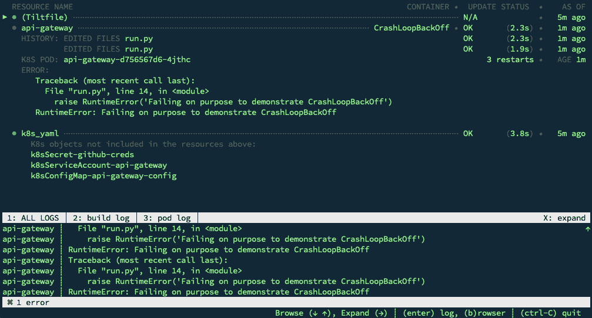
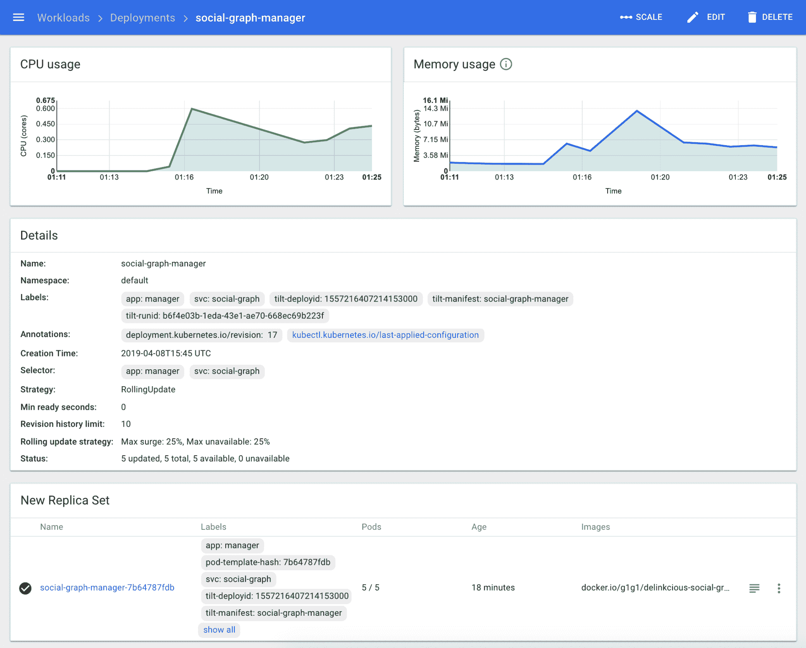
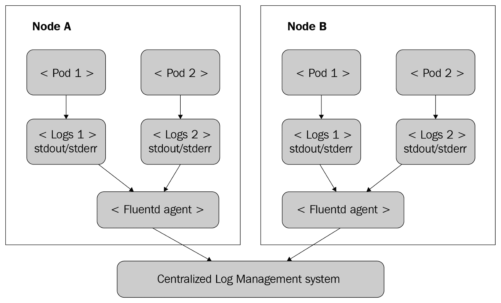
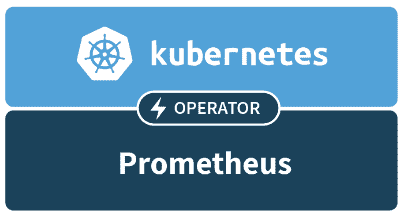
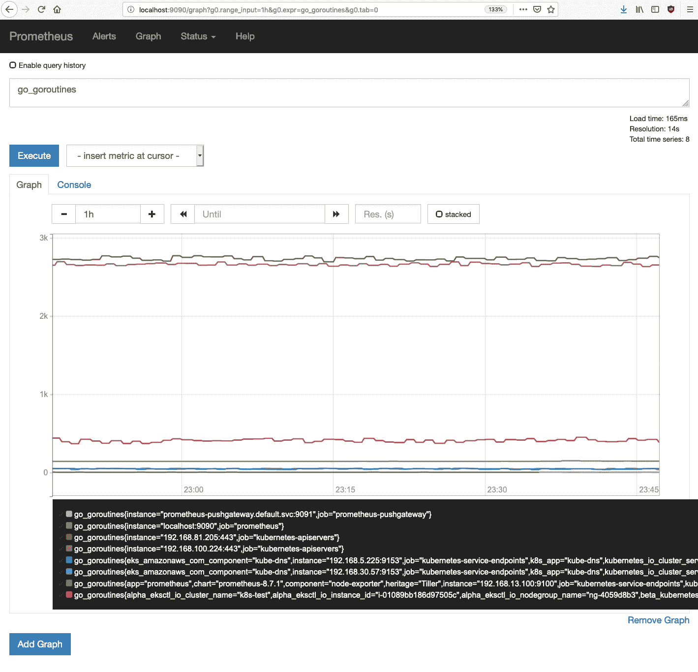
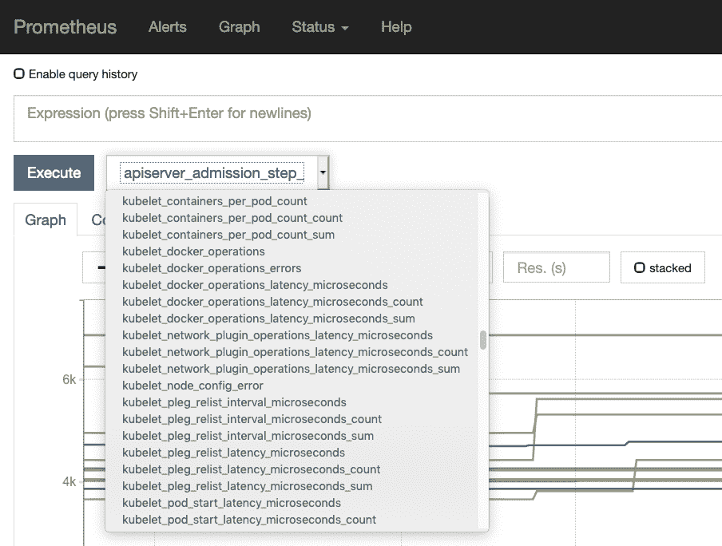
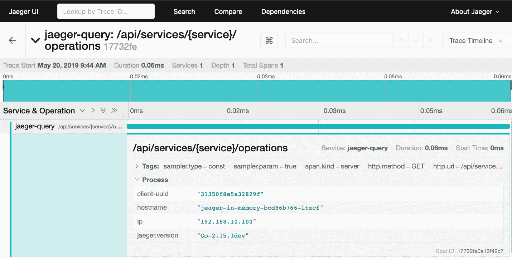

# 监控、日志记录和指标

在本章中，我们将重点关注在 Kubernetes 上运行大规模分布式系统的操作方面，以及如何设计系统以及要考虑什么以确保一流的操作姿态。也就是说，事情总会出现问题，你必须准备好尽快检测、解决问题并做出响应。Kubernetes 提供的操作最佳实践包括以下内容：

+   自愈

+   自动缩放

+   资源管理

然而，集群管理员和开发人员必须了解这些功能是如何工作的，如何配置和交互，以便正确理解它们。高可用性、健壮性、性能、安全性和成本之间总是需要权衡。重要的是要意识到所有这些因素及其之间的关系会随着时间的推移而发生变化，必须定期重新审视和评估。

这就是监控的作用。监控就是要了解系统的运行情况。有几个信息来源与不同的目的相关：

+   **日志记录**：您明确记录应用程序代码中的相关信息（您使用的库也可能会记录）。

+   **指标**：收集有关系统的详细信息，如 CPU、内存、磁盘使用情况、磁盘 I/O、网络和自定义应用程序指标。

+   **跟踪**：附加 ID 以跟踪请求跨多个微服务。

在本章中，我们将看到 Go-kit、Kubernetes 和生态系统如何实现并支持所有相关的用例。

本章涵盖以下主题：

+   使用 Kubernetes 进行自愈

+   自动缩放 Kubernetes 集群

+   使用 Kubernetes 配置资源

+   正确的性能

+   日志记录

+   在 Kubernetes 上收集指标

+   警报

+   分布式跨越

# 技术要求

在本章中，我们将在集群中安装几个组件：

+   **Prometheus**：指标和警报解决方案

+   **Fluentd**：中央日志代理

+   **Jaeger**：分布式跟踪系统

# 代码

代码分为两个 Git 存储库：

+   您可以在这里找到代码示例：[`github.com/PacktPublishing/Hands-On-Microservices-with-Kubernetes/tree/master/Chapter12`](https://github.com/PacktPublishing/Hands-On-Microservices-with-Kubernetes/tree/master/Chapter12)

+   您可以在这里找到更新后的 Delinkcious 应用程序：[`github.com/the-gigi/delinkcious/releases/tag/v0.10`](https://github.com/the-gigi/delinkcious/releases/tag/v0.10)

# 使用 Kubernetes 进行自愈

自愈是由无数物理和虚拟组件构成的大规模系统的一个非常重要的属性。基于大型 Kubernetes 集群运行的微服务系统就是一个典型的例子。组件可能以多种方式失败。自愈的前提是整个系统不会失败，并且能够自动修复自己，即使这可能会导致系统在暂时的降低容量下运行。

这些可靠系统的基本构建块如下：

+   冗余

+   可观测性

+   自动恢复

基本前提是每个组件都可能失败 - 机器崩溃，磁盘损坏，网络连接中断，配置可能不同步，新软件发布存在错误，第三方服务中断等等。冗余意味着没有单点故障。您可以运行许多组件的多个副本，如节点和 Pod，将数据写入多个数据存储，并在多个数据中心、可用区或地区部署系统。您甚至可以在多个云平台上部署系统（特别是如果您使用 Kubernetes）。当然，冗余是有限的。完全的冗余非常昂贵。例如，在 AWS 和 GKE 上运行完全冗余的系统可能是很少有公司能够负担或甚至需要的奢侈品。

可观测性是检测出问题发生的能力。您必须监视您的系统，并了解您观察到的信号，以便检测异常情况。这是在进行补救和恢复之前的第一步。

自动化的自愈和恢复在理论上是不需要的。您可以有一个团队的操作员整天观察仪表板，并在识别出问题时采取纠正措施。实际上，这种方法是不可扩展的。人类反应、解释和行动都很慢 - 更不用说他们更容易出错。也就是说，大多数自动化解决方案都是从后来成本重复手动干预变得清晰的手动流程开始的。如果某些问题只是偶尔发生，那么可能可以通过手动干预来解决。

让我们讨论几种故障模式，并看看 Kubernetes 如何帮助所有自愈的支柱。

# 容器故障

Kubernetes 在 pod 内运行容器。如果容器因任何原因而死亡，Kubernetes 将默认立即检测并重新启动它。Kubernetes 的行为可以通过 pod 规范的`restartPolicy`文件来控制。可能的值为`Always`（默认值），`OnFailure`和`Never`。请注意，重启策略适用于 pod 中的所有容器。无法针对每个容器指定重启策略。这似乎有点短视，因为您可能在一个 pod 中有多个需要不同重启策略的容器。

如果一个容器一直失败，它将进入`CrashOff`状态。让我们通过向 API 网关引入有意的错误来看看这种情况：

```
import os
 from api_gateway_service.api import app
 def main():
     port = int(os.environ.get('PORT', 5000))
     login_url = 'http://localhost:{}/login'.format(port)
     print('If you run locally, browse to', login_url)
     host = '0.0.0.0'
     app.run(host=host, port=port)

 if __name__ == "__main__":
     raise RuntimeError('Failing on purpose to demonstrate CrashLoopBackOff')
     main()
```

进行倾斜后，我们可以看到 API 网关进入`CrashLoopBackOff`状态。这意味着它一直失败，Kubernetes 一直重新启动它。回退部分是重新启动尝试之间的延迟。Kubernetes 使用指数回退延迟，从 10 秒开始，每次加倍，最长延迟为 5 分钟：



崩溃循环回退

这种方法非常有用，因为如果故障是暂时的，那么 Kubernetes 会通过重新启动容器来自我修复，直到暂时问题消失。但是，如果问题持续存在，那么容器状态和错误日志将保留下来，并提供可供高级恢复流程使用的可观察性，或者作为人为操作员或开发人员的最后手段。

# 节点故障

当节点失败时，节点上的所有 pod 将变得不可用，Kubernetes 将安排它们在集群中的其他节点上运行。假设您设计的系统具有冗余性，并且失败的节点不是单点故障，系统应该会自动恢复。如果集群只有几个节点，那么节点的丢失对集群处理流量的能力可能会有重大影响。

# 系统性故障

有时会发生系统性故障。其中一些如下：

+   总网络故障（整个集群无法访问）

+   数据中心故障

+   可用性区域故障

+   区域故障

+   云服务提供商故障

在这些情况下，你可能没有通过设计实现冗余（成本效益比不经济）。系统将会宕机。用户将会经历中断。重要的是不要丢失或损坏任何数据，并且能够在根本原因得到解决后尽快恢复在线。然而，如果你的组织必须以任何代价保持在线，Kubernetes 将为你提供选项。操作词是*将*，即将来。这项工作是在一个名为联邦 v2 的项目下进行的（v1 由于存在太多问题而被弃用）。

你将能够在不同的数据中心、不同的可用性区域、不同的地区甚至不同的云提供商中启动一个完整的 Kubernetes 集群，甚至一组集群。你将能够将这些物理分布的集群作为一个单一的逻辑集群来运行、管理和处理，并且希望在这些集群之间无缝地进行故障转移。

如果你想要实现这种集群级别的冗余，你可以考虑使用 gardener（[`gardener.cloud/`](https://gardener.cloud/)）项目来构建它。

# 自动缩放 Kubernetes 集群

自动缩放就是将你的系统调整到需求。这可能意味着向部署添加更多的副本，扩展现有节点的容量，或者添加新的节点。虽然扩展你的集群不是一个失败，但它遵循与自愈相同的模式。你可以将与需求不一致的集群视为不健康。如果集群配置不足，那么请求将无法处理或等待时间太长，这可能导致超时或性能不佳。如果集群配置过多，那么你将为你不需要的资源付费。在这两种情况下，即使 pod 和服务本身正在运行，你也可以将集群视为不健康。

就像自愈一样，你首先需要检测到你需要扩展你的集群，然后你可以采取正确的行动。有几种方法可以扩展集群的容量：你可以添加更多的 pod，你可以添加新的节点，你可以增加现有节点的容量。让我们详细地回顾一下它们。

# 水平 pod 自动缩放

水平 Pod 自动缩放器是一个控制器，旨在根据 Pod 的负载调整部署中的 Pod 数量。是否应该扩展（增加 Pod）或缩减（删除 Pod）部署的决定基于指标。水平 Pod 自动缩放器默认支持 CPU 利用率，但也可以添加自定义指标。水平自动缩放器的好处在于它位于标准 Kubernetes 部署的顶部，只需调整其副本数量。部署本身和 Pod 都不知道它们正在被缩放：


水平 Pod 自动缩放器

前面的图表说明了水平自动缩放器的工作原理。

# 使用水平 Pod 自动缩放器

我们可以使用 kubectl 进行自动缩放。由于自动缩放器依赖 Heapster 和度量服务器，我们需要使用`minikube addons`命令启用它们。我们已经启用了 Heapster，所以这应该足够了：

```
$ minikube addons enable metrics-server
 metrics-server was successfully enabled
```

我们还必须在部署的 Pod 规范中指定 CPU 请求：

```
    resources:
       requests:
         cpu: 100m
```

资源请求是 Kubernetes 承诺可以为容器提供的资源。这样，水平 Pod 自动缩放器可以确保只有在能够为新 Pod 提供所请求的最低 CPU 时才会启动新的 Pod。

让我们介绍一些代码，这些代码将导致社交图管理器浪费大量的 CPU：

```
func wasteCPU() {
     fmt.Println("wasteCPU() here!")
     go func() {
         for {
             if rand.Int() % 8000 == 0 {
                 time.Sleep(50 * time.Microsecond)
             }
         }
     }()
 }
```

在这里，我们根据 50%的 CPU 利用率在 1 到 5 个 Pod 之间调整社交图管理器：

```
$ kubectl autoscale deployment social-graph-manager --cpu-percent=50 --min=1 --max=5
```

运行倾斜并部署浪费 CPU 的代码后，CPU 利用率增加，越来越多的 Pod 被创建，最多达到五个。这是 Kubernetes 仪表板的屏幕截图，显示了 CPU、Pod 和水平 Pod 自动缩放器：



Hp 仪表板

让我们来看看水平 Pod 自动缩放器本身：

```
$ kubectl get hpa
NAME   REFERENCE  TARGETS    MINPODS   MAXPODS   REPLICAS   AGE
social-graph-manager   Deployment/social-graph-manager   138%/50%   1         5         5          12h
```

如您所见，当前负载为 CPU 利用率的`138%`，这意味着需要超过一个 CPU 核心，这大于 50%。因此，社交图管理器将继续运行五个 Pod（允许的最大数量）。

水平 Pod 自动缩放器是 Kubernetes 的一个长期存在的通用机制。它仅依赖于内部组件来收集指标。我们在这里演示了默认的基于 CPU 的自动缩放，但它也可以配置为基于多个自定义指标工作。现在是时候看一些其他自动缩放方法了。

# 集群自动缩放

Pod 自动缩放对开发人员和运维人员来说是一份礼物 - 他们不需要手动调整服务的规模或编写自己的半成品自动缩放脚本。Kubernetes 提供了一个经过良好设计、良好实现和经过实战测试的强大解决方案。然而，这就留下了集群容量的问题。如果 Kubernetes 尝试向集群添加更多的 Pod，但集群已经运行到最大容量，那么 Pod 自动缩放器将失败。另一方面，如果您过度配置集群，以防 Pod 自动缩放器需要添加更多的 Pod，那么您就是在浪费金钱。

进入 `auto-scaler` 集群 ([`github.com/kubernetes/autoscaler/tree/master/cluster-autoscaler`](https://github.com/kubernetes/autoscaler/tree/master/cluster-autoscaler))。

这是一个自 Kubernetes 1.8 版以来一直可用的 Kubernetes 项目。它适用于 GCP、AWS、Azure、AliCloud 和 BaiduCloud。如果 GKE、EKS 和 AKS 为您提供了托管的控制平面（它们负责管理 Kubernetes 本身），那么集群自动缩放器为您提供了一个托管的数据平面。它将根据您的需求和配置向集群添加或删除节点。

调整集群大小的触发器是当 Kubernetes 由于资源不足而无法调度 Pod 时。这与水平 Pod 自动缩放器非常配合。结合起来，这种组合可以使您拥有一个真正弹性的 Kubernetes 集群，可以根据当前负载自动增长和收缩（在一定范围内）。

集群自动缩放器本质上非常简单。它不关心为什么无法调度 Pod。只要无法调度 Pod，它就会向集群添加节点。它会删除空节点或者它们的 Pod 可以被重新调度到其他节点上的节点。也就是说，它并不是一个完全没有头脑的机制。

它了解几个 Kubernetes 概念，并在决定增长或收缩集群时考虑它们：

+   Pod 中断预算

+   整体资源约束

+   亲和性和反亲和性

+   Pod 优先级和抢占

例如，如果无法调度具有最佳努力优先级的 Pod，集群自动缩放器将不会扩展集群。特别是，它不会删除具有以下一个或多个属性的节点：

+   使用本地存储

+   带有注释`"cluster-autoscaler.kubernetes.io/scale-down-disabled": "true"`

+   主机 Pod 带有注释`"cluster-autoscaler.kubernetes.io/safe-to-evict": "false"`

+   带有限制性`PodDisruptionBudget`的主机节点

添加节点的总时间通常不到 5 分钟。集群自动缩放器每 10 秒扫描一次未调度的 Pod，并在必要时立即提供新节点。但是，云提供商需要 3-4 分钟来提供并将节点附加到集群。

让我们转向另一种形式的自动缩放：垂直 Pod 自动缩放。

# 垂直 Pod 自动缩放

垂直 Pod 自动缩放器目前（Kubernetes 1.15）处于 Beta 阶段。它承担了与自动缩放相关的不同任务-微调 CPU 和内存请求。考虑一个实际上并不做太多事情并且需要 100 MiB 内存的 Pod，但它当前请求了 500 MiB。首先，这是对分配给 Pod 的 400 MiB 内存的净浪费，而且从来没有被使用。然而，影响可能更大。因为 Pod 更加臃肿，它可能会阻止其他 Pod 在其旁边被调度。

垂直自动缩放器通过监视 Pod 的实际 CPU 和内存使用情况并自动调整其请求来解决这个问题。它还要求您安装度量服务器。

这非常酷。垂直 Pod 自动缩放器以几种模式工作：

+   **初始**: 在创建 Pod 时分配资源请求

+   **自动**: 在创建 Pod 时分配资源请求，并在 Pod 的生命周期中更新它们

+   **重建**: 类似于 Auto，当需要更新资源请求时，Pod 总是重新启动

+   **updatedOff**: 不修改资源请求，但可以查看建议

目前，Auto 的工作方式与重建相同，并在每次更改时重新启动 Pod。将来，它将使用原地更新。让我们来试试垂直自动缩放器。安装过程相当粗糙，需要克隆 Git 存储库并运行一个 shell 脚本（该脚本运行许多其他 shell 脚本）：

```
$ git clone https://github.com/kubernetes/autoscaler.git
$ cd autoscaler/vertical-pod-autoscaler/hack/ 
$ ./vpa-up.sh
```

它安装了一个服务、两个 CRD 和三个 Pod：

```
$ kubectl -n kube-system get svc | grep vpa
vpa-webhook    ClusterIP   10.103.169.18    <none>        443/TCP

$ kubectl -n kube-system get po | grep vpa
vpa-admission-controller-68c748777d-92hbg 1/1  Running   0   72s
vpa-recommender-6fc8c67d85-shh8g          1/1  Running   0   77s
vpa-updater-786b96955c-8mcrc              1/1  Running   0   78s

$ kubectl get crd | grep vertical
verticalpodautoscalercheckpoints.autoscaling.k8s.io  2019-05-08T04:58:24Z
verticalpodautoscalers.autoscaling.k8s.io            2019-05-08T04:58:24Z
```

让我们为链接管理器部署创建一个 VPA 配置文件。我们将把模式设置为`Off`，这样它只会建议 CPU 和内存请求的适当值，但不会实际设置它们：

```
apiVersion: autoscaling.k8s.io/v1beta2
kind: VerticalPodAutoscaler
metadata:
  name: link-manager
spec:
  targetRef:
    apiVersion: "extensions/v1beta1"
    kind:       Deployment
    name:       link-manager
  updatePolicy:
    updateMode: "Off"
```

我们可以创建并检查建议：

```
$ kubectl create -f link-manager-vpa.yaml
 verticalpodautoscaler.autoscaling.k8s.io/link-manager created

$ kubectl get vpa link-manager -o jsonpath="{.status.recommendation.containerRecommendations[0].lowerBound}"
 map[cpu:25m memory:262144k]

$ kubectl get vpa link-manager -o jsonpath="{.status.recommendation.containerRecommendations[0].target}"
 map[cpu:25m memory:262144k]
```

我不建议在这一点上让垂直 Pod 自动缩放器在你的系统上失控。它仍然在变化中，并且有一些严重的限制。最大的限制是它不能与水平 Pod 自动缩放器并行运行。

一个有趣的方法，如果你想利用它来微调你的资源请求，是在一个模拟你的生产集群的测试集群上运行一段时间，关闭水平 Pod 自动缩放器，看看它的表现如何。

# 使用 Kubernetes 配置资源

传统上，资源的配置一直是操作员或系统管理员的工作。然而，采用 DevOps 方法后，开发人员经常被要求自行配置资源。如果组织有一个传统的 IT 部门，他们通常更关心开发人员应该具有什么权限来配置资源以及他们应该设置什么全局限制。在本节中，我们将从两个角度来看资源配置的问题。

# 你应该配置什么资源？

重要的是要区分 Kubernetes 资源和它们所依赖的基础设施资源。对于 Kubernetes 资源，Kubernetes API 是一个好方法。你如何与 API 交互取决于你，但我建议你生成 YAML 文件，并在你的 CI/CD 流水线中通过`kubectl create`或`kubectl apply`来运行它们。

像`kubectl run`和`kubectl scale`这样的命令对于交互式地探索你的集群和运行临时任务是有用的，但它们违背了声明性基础设施即代码的原则。

你也可以直接访问 Kubernetes API 的 REST 端点，或者如果你使用一些高级编程语言如 Python 实现非常复杂的 CI/CD 工作流程，可以使用客户端库。即使在那里，你也可以考虑只调用`kubectl`。

让我们转向您的集群正在运行的基础架构层。主要资源是计算、内存和存储。节点结合了计算、内存和本地存储。共享存储是单独配置的。在云中，您可能会使用预配置的云存储。这意味着您的主要关注点是为您的集群配置节点和外部存储。但这还不是全部。您还需要通过网络层连接所有这些节点，并考虑权限。Kubernetes 集群中的网络大部分时间由 CNI 提供者负责。每个 Pod 都有自己的 IP 地址的著名的扁平网络模型是 Kubernetes 的最佳特性之一，它为开发人员简化了许多事情。

在 Kubernetes 上，权限和访问通常由**基于角色的访问控制**（**RBAC**）处理，正如我们在第六章中详细讨论的那样，《使用 Kubernetes 保护微服务》。

在我们努力实现自动配置的情况下，对资源施加合理的配额和限制非常重要。

# 定义容器限制

在 Kubernetes 上，我们可以为每个容器定义 CPU 和内存限制。这确保容器不会使用超过限制的资源。它有两个主要目的：

+   防止同一节点上的容器和 Pod 相互争夺资源

+   通过了解 Pod 将使用的最大资源量，帮助 Kubernetes 以最有效的方式调度 Pod

我们在第六章中从安全角度审视了限制，《在 Kubernetes 上保护微服务》。重点是控制爆炸半径。如果容器受到损害，它可能会利用为其配置的资源限制以上的资源。

以下是为`user-manager`服务设置 CPU 和内存限制的示例。它遵循了将资源限制和资源请求设置为相同值的最佳实践：

```
apiVersion: apps/v1
kind: Deployment
metadata:
  name: user-manager
  labels:
    svc: user
    app: manager
spec:
  replicas: 1
  selector:
    matchLabels:
      svc: user
      app: manager
  template:
    metadata:
      labels:
        svc: user
        app: manager
    spec:
      containers:
      - name: user-manager
        image: g1g1/delinkcious-user:0.3
        imagePullPolicy: Always
        ports:
        - containerPort: 7070
        resources:
          requests:
            memory: 64Mi
            cpu: 250m
          limits:
            memory: 64Mi
            cpu: 250m
```

设置容器限制非常有用，但它无法解决许多 Pod 或其他资源的不受控制的分配问题。这就是资源配额发挥作用的地方。

# 指定资源配额

Kubernetes 允许您针对每个命名空间指定配额。您可以设置不同类型的配额，例如 CPU、内存和各种对象的计数，包括持久卷索赔。让我们为 Delinkcious 的默认命名空间设置一些配额：

```
apiVersion: v1
kind: List
items:
- apiVersion: v1
  kind: ResourceQuota
  metadata:
    name: awesome-quota
  spec:
    hard:
      cpu: "1000"
      memory: 200Gi
      pods: "100"
```

以下是应用于`quota`的命令：

```
$ kubectl create -f resource-quota.yaml 
resourcequota/awesome-quota created
```

现在，我们可以检查实际使用的资源配额对象，并将其与配额进行比较，以查看我们的接近程度：

```
$ kubectl get resourcequota awesome-quota -o yaml | grep status -A 8
status:
 hard:
 cpu: 1k
 memory: 200Gi
 pods: "100"
 used:
 cpu: 350m
 memory: 64Mi
 pods: "10"
```

显然，这个资源配额远远超出了集群的当前使用情况。这没关系。它不分配或保留任何资源。这只是意味着配额并不是非常限制性的。

资源配额还有许多微妙和选项。有适用于具有特定条件或状态（`Terminating`、`NotTerminating`、`BestEffort`和`NotBestEffort`）的资源的范围。有些资源是特定于某些优先级类别的配额。要点是，您可以变得非常精细，并提供资源配额策略来控制集群中的资源分配，即使在配置错误或攻击的情况下。

到目前为止，我们已经覆盖了资源配额，并可以继续实际配置资源。有几种方法可以做到这一点，对于复杂的系统，我们可能希望使用其中一些，如果不是全部。

# 手动配置

手动配置听起来像是一种反模式，但在实践中在几种情况下是有用的；例如，如果您正在管理物理上必须配置服务器、将它们连接在一起并安装存储的本地集群。另一个常见的用例是在开发过程中，当您想要开发自己的自动配置，但又需要进行交互式实验（可能不是在生产环境）。然而，即使在生产环境中，如果您发现了一些错误配置或其他问题，您可能需要通过手动配置一些资源来应对危机。

# 利用自动缩放

在云上，强烈建议使用我们之前讨论过的自动缩放解决方案。水平 Pod 自动缩放器是一个不错的选择。集群自动缩放器也很棒，如果您的集群处理非常动态的工作负载，并且您不想经常过度配置。垂直自动缩放器可能是在这一点上对资源请求进行微调的最佳选择。

# 自动化配置自己的资源

如果您有更复杂的需求，您总是可以自己动手。Kubernetes 鼓励同时运行自己的控制器，可以监视不同的事件并通过配置一些资源或者在本地运行一些工具来响应，或者作为您的 CI/CD 流水线的一部分，检查集群的状态并做出一些配置决策。

一旦你的集群得到了适当的配置，你应该开始考虑性能问题。性能很有趣，因为你需要考虑很多权衡。

# 正确理解性能

性能之所以重要，有很多原因，我们很快就会深入探讨。了解何时是尝试提高性能的合适时机非常重要。我的指导原则是：让它工作，让它正确，让它快。也就是说，首先，让系统做任何需要做的事情，无论多么慢和笨拙。然后，清理架构和代码。现在，你准备好提高性能并考虑重构、变化以及其他可能影响性能的因素了。

但是，性能改进有一个初步步骤，那就是性能分析和基准测试。试图在没有衡量你尝试改进的内容的情况下提高性能，就好像试图让你的代码在没有编写任何测试的情况下正确运行一样。这不仅是徒劳的，而且，即使你真的幸运地提高了性能，没有测量，你怎么知道呢？

让我们了解一些关于性能的事情。它使一切变得复杂。然而，它通常是一个必要的恶。当性能影响用户体验或成本时，提高性能就变得重要。更糟糕的是，提高用户体验通常是有成本的。找到平衡点很困难。不幸的是，平衡点不会固定不变。你的系统会发展，用户数量会增长，技术会改变，资源成本也会改变。例如，一个小型社交媒体初创公司没有必要建立自己的数据中心，但像 Facebook 这样的社交媒体巨头现在设计他们自己的定制服务器来挤出更多性能并节省成本。规模变化很大。

底线是，为了做出这些决定，你必须了解你的系统如何运作，并能够衡量每个组件以及对系统性能产生影响的变化。

# 性能和用户体验

用户体验完全取决于感知性能。我点击按钮后，我在屏幕上看到漂亮的图片需要多快？显然，你可以通过改进系统的实际性能来提高性能，购买更快的硬件，以并行方式运行任务，改进算法，将依赖项升级到更新和更高性能的版本等等。但是，很多时候，更多的是关于更智能的架构，通过添加缓存、提供近似结果和将工作推送到客户端来减少工作量。然后，还有预取的方法，你可以在需要之前尝试做一些工作，以预测用户的需求。

用户体验决策可以显著影响性能。比如考虑一个聊天程序，客户端每秒钟不断地轮询服务器以获取每次按键操作，与每分钟只检查一次新消息的用户体验是不同的，后者的性能成本是前者的 60 倍。

# 性能和高可用性

系统中最糟糕的例行事务之一就是超时。超时意味着用户无法及时得到答案。超时意味着你做了很多工作，现在都白费了。你可能有重试逻辑，用户最终会得到答案，但性能会受到影响。当你的系统及其所有组件都具有高可用性（并且没有过载）时，你可以最大程度地减少超时的发生。如果你的系统非常冗余，甚至可以将相同的请求多次发送到不同的后端，每当其中一个响应时，你就有了答案。

另一方面，一个高可用和冗余的系统有时需要与所有分片/后端（或至少是多数派）同步，以确保你拥有最新的、最新的答案。当然，在高可用系统上插入或更新数据也更加复杂，通常需要更长的时间。如果冗余跨越多个可用区、地区或大陆，响应时间可能会增加数个数量级。

# 性能和成本

性能和成本之间有着非常有趣的关系。有许多方法可以提高性能。其中一些方法可以降低成本，比如优化你的代码，压缩你发送的数据，或者将计算推送到客户端。然而，其他提高性能的方法会增加成本，比如在更强大的硬件上运行，将数据复制到靠近客户端的多个位置，并预取未请求的数据。

最终，这是一个商业决策。即使是双赢的性能改进并不总是像改进算法那样优先级高。例如，您可以花费大量时间想出比以前算法快 10 倍的算法。但是计算时间可能在整个处理请求的时间中是微不足道的，因为它被数据库访问、序列化数据和发送给客户端所主导。在这种情况下，您只是浪费了本来可以用来开发更有用的东西的时间，可能使您的代码不稳定并引入了错误，并使您的代码更难理解。再次强调，良好的指标和分析将帮助您确定系统中值得改进性能和成本的热点。

# 性能和安全

性能和安全通常是相互对立的。安全通常倾向于在整个系统内外推动加密。强大的身份验证和授权方法可能是必要的，但会带来性能开销。然而，安全有时间接地通过倡导削减不必要的功能和减少系统的表面积来帮助性能。这种产生更紧凑系统的简约方法使您能够专注于改善性能的更小目标。通常，安全系统不会随意添加可能在没有仔细考虑的情况下损害性能的任意功能。

之后，我们将探讨如何使用 Kubernetes 收集和使用指标，但首先让我们来看看日志记录，这是监控系统的另一个支柱。

# 日志记录

日志记录是在系统运行过程中记录消息的能力。日志消息通常是结构化的并带有时间戳。在诊断问题和解决系统故障时，它们通常是不可或缺的。在进行事后分析并发现根本原因时，它们也至关重要。在大规模分布式系统中，将有许多组件记录日志消息。收集、整理和筛选这些消息是一项非常重要的任务。但首先，让我们考虑记录哪些信息是有用的。

# 您应该记录什么？

这是一个百万美元的问题。一个简单的方法是记录*一切*。你永远不可能有太多的数据，很难预测在尝试弄清楚系统出了什么问题时你会需要什么数据。然而，一切到底意味着什么？显然你可以走得太远。例如，你可以记录代码中每一个小函数的每一个调用，包括所有的参数，以及当前状态，或者记录每一个网络调用的有效负载。有时，有安全和监管限制会阻止你记录某些数据，比如**受保护的健康信息**（**PHI**）和**个人可识别信息**（**PII**）。你需要足够了解你的系统来决定哪种信息对你是相关的。一个很好的起点是记录所有的传入请求以及你的微服务之间的交互，以及你的微服务和第三方服务之间的交互。

# 日志记录与错误报告

错误是一种特殊的信息。有些错误是你的代码可以处理的（例如，通过重试或使用一些替代方法）。然而，也有一些错误必须尽快处理，否则系统将遭受部分或完全的停机。但即使不紧急的错误有时也需要记录大量的信息。你可以像记录其他信息一样记录错误，但通常值得将错误记录到专用的错误报告服务，比如 Rollbar 或 Sentry。错误的一个关键信息是包含堆栈中每个帧的状态（局部变量）的堆栈跟踪。对于生产系统，我建议你使用专门的错误报告服务，而不仅仅是记录日志。

# 追求完美的 Go 日志记录接口的探索

Delinkcious 主要是用 Go 实现的，所以让我们来谈谈 Go 中的日志记录。有一个标准库 Logger，它是一个结构体而不是一个接口。它是可配置的，你可以在创建它时传递一个`io.Writer`对象。然而，`Logger`结构的方法是固定的，不支持日志级别或结构化日志记录。而且，只有一个输出写入器的事实在某些情况下可能是一个限制。这是标准 Logger 的规范：

```
type Logger struct { ... } // Not an interface!

func New(out io.Writer, prefix string, flag int) *Logger

// flag controls date, time, µs, UTC, caller

// Log
func (l *Logger) Print(v ...interface{})
func (l *Logger) Printf(format string, v ...interface{})
func (l *Logger) Println(v ...interface{})

// Log and call os.Exit(1)
func (l *Logger) Fatal(v ...interface{})
func (l *Logger) Fatalf(format string, v ...interface{})
func (l *Logger) Fatalln(v ...interface{})

// Log and panic
func (l *Logger) Panic(v ...interface{})
func (l *Logger) Panicf(format string, v ...interface{})
func (l *Logger) Panicln(v ...interface{})

func (l *Logger) Output(calldepth int, s string) error
```

如果你需要这些功能，你需要使用另一个库，它位于标准库`Logger`之上。有几个包提供了各种不同的风格：

+   `glog`: [`godoc.org/github.com/golang/glog`](https://godoc.org/github.com/golang/glog)

+   `logrus`: [`github.com/Sirupsen/logrus`](https://github.com/Sirupsen/logrus)

+   `loggo`: [`godoc.org/github.com/juju/loggo`](https://godoc.org/github.com/juju/loggo)

+   `log15`: [`github.com/inconshreveable/log15`](https://github.com/inconshreveable/log15)

它们以不同的方式处理接口、可比性和可玩性。然而，我们正在使用 Go-kit，它对日志记录有自己的看法。

# 使用 Go-kit 记录日志

Go-kit 拥有有史以来最简单的接口。只有一个方法`Log()`，它接受一个可以是任何类型的键和值列表：

```
type Logger interface {
 Log(keyvals ...interface{}) error
}
```

这里的基本思想是，Go-kit 对于如何记录消息没有意见。您总是添加时间戳吗？您有日志级别吗？什么级别？所有这些问题的答案都取决于您。您获得一个完全通用的接口，您决定要记录哪些键值。

# 使用 Go-kit 设置记录器

好的。接口是通用的，但我们需要一个实际的记录器对象来使用。Go-kit 支持几种写入器和记录器对象，可以生成熟悉的日志格式，如 JSON、logfmt 或 logrus。让我们使用 JSON 格式和同步写入器设置一个记录器。同步写入器可以安全地从多个 Go 例程中使用，JSON 格式化器将键值格式化为 JSON 字符串。此外，我们可以添加一些默认字段，例如服务名称，这是日志消息在源代码中的来源，以及当前时间戳。由于我们可能希望从多个服务中使用相同的记录器规范，让我们将其放在一个所有服务都可以使用的包中。最后一件事是添加一个`Fatal()`函数，它将转发到标准的`log.Fatal()`函数。这允许当前使用`Fatal()`的代码继续工作而无需更改。这是 Delinkcious 日志包，其中包含记录器的工厂函数和`Fatal()`函数：

```
package log

import (
  kit_log "github.com/go-kit/kit/log"
  std_log "log"
  "os"
)

func NewLogger(service string) (logger kit_log.Logger) {
  w := kit_log.NewSyncWriter(os.Stderr)
  logger = kit_log.NewJSONLogger(w)
  logger = kit_log.With(logger, "service", service)
  logger = kit_log.With(logger, "timestamp", kit_log.DefaultTimestampUTC)
  logger = kit_log.With(logger, "called from", kit_log.DefaultCaller)

  return
}

func Fatal(v ... interface{}) {
  std_log.Fatal(v...)
}
```

写入器只是写入标准错误流，这将被捕获并发送到 Kubernetes 容器日志中。

让我们看看我们的记录器是如何工作的，让我们把它附加到我们的链接服务上。

# 使用日志中间件

让我们考虑一下我们想要实例化记录器的地方，然后在哪里使用它并记录消息。这很重要，因为我们需要确保记录器对代码中需要记录消息的所有地方都是可用的。一个微不足道的方法是只需将记录器参数添加到所有接口中，并以这种方式传播记录器。然而，这样做会非常破坏性，并违反我们清晰的对象模型。记录是一个实现和操作细节。理想情况下，它不应出现在我们的对象模型类型或接口中。此外，它是一个 Go-kit 类型，到目前为止，我们已经成功地使我们的对象模型甚至我们的领域包完全不知道它们被 Go-kit 包装。Delinkcious 服务在 SVC 下是唯一知道 Go-kit 的代码部分。

让我们尝试保持这种状态。Go-kit 提供了中间件概念，允许我们以一种松散耦合的方式链接多个中间件组件。服务的所有中间件组件都实现了服务接口，一个小的包装器允许 Go-kit 依次调用它们。让我们从包装器开始，它只是一个接受`LinkManager`接口并返回`LinkManager`接口的函数类型：

```
type linkManagerMiddleware func(om.LinkManager) om.LinkManager
```

`logging_middleware.go`文件有一个名为`newLoggingMiddlware()`的工厂函数，它接受一个记录器对象并返回一个与`linkManagerMiddleware`匹配的函数。这个函数又实例化了`loggingMiddelware`结构，将链中的下一个组件和记录器传递给它：

```
// implement function to return ServiceMiddleware
func newLoggingMiddleware(logger log.Logger) linkManagerMiddleware {
  return func(next om.LinkManager) om.LinkManager {
    return loggingMiddleware{next, logger}
  }
}
```

这可能会很令人困惑，但基本思想是能够链接任意中间件组件，执行一些工作并让其余的计算继续进行。我们之所以有这么多层间接性，是因为 Go-kit 对我们的类型和接口一无所知，所以我们必须通过编写这些样板代码来协助。正如我之前提到的，所有这些都可以自动生成，也应该自动生成。让我们来看看`loggingMiddleware`结构及其方法。结构本身有一个`linkManager`接口，它是链中的下一个组件和记录器对象：

```
type loggingMiddleware struct {
  next om.LinkManager
  logger log.Logger
}
```

作为`LinkManager`中间件组件，它必须实现`LinkManager`接口方法。这是`GetLinks()`的实现。它使用记录器记录一些值，特别是方法名称，即`GetLinks`，请求对象，结果和持续时间。然后，它调用链中下一个组件的`GetLinks()`方法。

```
func (m loggingMiddleware) GetLinks(request om.GetLinksRequest) (result om.GetLinksResult, err error) {
  defer func(begin time.Time) {
    m.logger.Log(
      "method", "GetLinks",
      "request", request,
      "result", result,
      "duration", time.Since(begin),
    )
  }(time.Now())
  result, err = m.next.GetLinks(request)
  return
}
```

为了简单起见，其他方法只是调用链中的下一个组件而不做任何事情：

```
func (m loggingMiddleware) AddLink(request om.AddLinkRequest) error {
  return m.next.AddLink(request)
}

func (m loggingMiddleware) UpdateLink(request om.UpdateLinkRequest) error {
  return m.next.UpdateLink(request)
}

func (m loggingMiddleware) DeleteLink(username string, url string) error {
  return m.next.DeleteLink(username, url)
}
```

中间件链概念非常强大。中间件可以在将输入传递给下一个组件之前预处理输入，它可以短路并立即返回而不调用下一个组件，或者它可以对来自下一个组件的结果进行后处理。

让我们看看在运行冒烟测试时从链接服务中的日志输出。对于人类来说，它看起来有点混乱，但所有必要的信息都在那里，清晰标记并且可以随时进行大规模分析。它很容易使用 grep，并且很容易使用`jq`等工具进行深入挖掘。

```
$ kubectl logs svc/link-manager
{"called from":"link_service.go:133","msg":"*** listening on ***","port":"8080","service":"link manager","timestamp":"2019-05-13T02:44:42.588578835Z"}
{"called from":"logging_middleware.go:25","duration":"1.526953ms","method":"GetLinks","request":{"UrlRegex":"","TitleRegex":"","DescriptionRegex":"","Username":"Gigi Sayfan","Tag":"","StartToken":""},"result":{"Links":[],"NextPageToken":""},"service":"link manager","timestamp":"2019-05-13T02:45:05.302342532Z"}
{"called from":"logging_middleware.go:25","duration":"591.148µs","method":"GetLinks","request":{"UrlRegex":"","TitleRegex":"","DescriptionRegex":"","Username":"Gigi Sayfan","Tag":"","StartToken":""},"result":{"Links":[{"Url":"https://github.com/the-gigi","Title":"Gigi on Github","Description":"","Status":"pending","Tags":null,"CreatedAt":"2019-05-13T02:45:05.845411Z","UpdatedAt":"2019-05-13T02:45:05.845411Z"}],"NextPageToken":""},"service":"link manager","timestamp":"2019-05-13T02:45:06.134842509Z"}
{"called from":"logging_middleware.go:25","duration":"911.499µs","method":"GetLinks","request":{"UrlRegex":"","TitleRegex":"","DescriptionRegex":"","Username":"Gigi Sayfan","Tag":"","StartToken":""},"result":{"Links":[{"Url":"https://github.com/the-gigi","Title":"Gigi on Github","Description":"","Status":"pending","Tags":null,"CreatedAt":"2019-05-13T02:45:05.845411Z","UpdatedAt":"2019-05-13T02:45:05.845411Z"}],"NextPageToken":""},"service":"link manager","timestamp":"2019-05-13T02:45:09.438915897Z"}

```

由于 Go-kit，我们已经有了一个强大而灵活的日志记录机制。然而，使用`kubectl logs`手动获取日志并不具备可扩展性。对于真实世界的系统，我们需要集中式日志管理。

# Kubernetes 的集中式日志记录

在 Kubernetes 中，容器写入标准输出和标准错误流。Kubernetes 使这些日志可用（例如，通过`kubectl logs`）。甚至可以通过使用`kubectl logs -p`获取容器的上一次运行的日志，但是，如果 Pod 被重新调度，那么它的容器和它们的日志就会消失。如果节点本身崩溃，您也会丢失日志。即使对于具有大量服务的集群，所有日志都是可用的，筛选容器日志并尝试理解系统状态是一项非平凡的任务。进入集中式日志记录。其想法是运行一个日志代理，可以作为每个 Pod 中的边缘容器，或者作为每个节点上的守护程序集，监听所有日志，并实时将它们发送到一个集中的位置，那里可以对它们进行聚合、过滤和排序。当然，您也可以直接从您的容器显式地记录到集中式日志记录服务。

在我看来，最简单和最健壮的方法是使用守护进程集。集群管理员确保在每个节点上安装了一个日志代理，就这样。无需更改您的 pod 规范以注入侧边容器，也无需依赖特殊库与远程日志记录服务通信。您的代码写入标准输出和标准错误，就完成了。您可能使用的大多数其他服务，如 Web 服务器和数据库，也可以配置为写入标准输出和标准错误。

在 Kubernetes 上最流行的日志代理之一是 Fluentd（[`www.fluentd.org`](https://www.fluentd.org)）。它也是一个 CNCF 毕业项目。除非您有非常充分的理由使用其他日志代理，否则应该使用 Fluentd。下面是一个图表，说明了 Fluentd 如何作为一个 DaemonSet 适配到 Kubernetes 中，部署到每个节点，拉取所有 pod 的日志，并将它们发送到一个集中的日志管理系统：



Fluentd

让我们谈谈日志管理系统。在开源世界中，ELK 堆栈——ElasticSearch、LogStash 和 Kibana——是非常流行的组合。ElasticSearch 存储日志并提供各种切片和切块的方式。LogStash 是日志摄取管道，Kibana 是一个强大的可视化解决方案。Fluentd 可以替代 LogStash 作为日志代理，你可以得到 EFK 堆栈——ElasticSearch、Fluentd 和 Kibana 在 Kubernetes 上运行得非常好。还有 Helm 图表和 GitHub 存储库，可以在您的 Kubernetes 集群上一键安装 EFK。然而，你也应该考虑集群外的日志记录服务。正如我们之前讨论过的，日志对故障排除和事后分析非常有帮助。如果您的集群出现问题，您可能无法在最需要的时候访问日志。Fluentd 可以与大量的数据输出集成。在这里查看完整列表：[`www.fluentd.org/dataoutputs`](https://www.fluentd.org/dataoutputs)。我们已经涵盖了日志记录，现在是时候谈谈指标了。

# 在 Kubernetes 上收集指标

指标是许多有趣用例的关键组件，如自愈、自动缩放和警报。作为一个分布式平台，Kubernetes 在指标方面提供了非常强大的功能，具有强大而通用且灵活的指标 API。

Kubernetes 一直支持通过 cAdvisor（集成到 kube-proxy 中）和 Heapster（[`github.com/kubernetes-retired/heapster`](https://github.com/kubernetes-retired/heapster)）来支持度量。但是，cAdvisor 在 Kubernetes 1.12 中被移除，Heapster 在 Kubernetes 1.13 中被移除。您仍然可以安装它们（就像我们之前在 minikube 上使用 Heapster 插件一样），但它们不再是 Kubernetes 的一部分，也不再推荐使用。在 Kubernetes 上进行度量的新方法是使用度量 API 和度量服务器（[`github.com/kubernetes-incubator/metrics-server`](https://github.com/kubernetes-incubator/metrics-server)）。

# 介绍 Kubernetes 度量 API

Kubernetes 度量 API 非常通用。它支持节点和 Pod 度量，以及自定义度量。度量有一个使用字段，一个时间戳和一个窗口（度量收集的时间范围）。以下是节点度量的 API 定义：

```
// resource usage metrics of a node.
type NodeMetrics struct {
  metav1.TypeMeta
  metav1.ObjectMeta

  // The following fields define time interval from which metrics were
  // collected from the interval [Timestamp-Window, Timestamp].
  Timestamp metav1.Time
  Window metav1.Duration

  // The memory usage is the memory working set.
  Usage corev1.ResourceList
}

// NodeMetricsList is a list of NodeMetrics.
type NodeMetricsList struct {
  metav1.TypeMeta
  // Standard list metadata.
  // More info: https://git.k8s.io/community/contributors/devel/api-conventions.md#types-kinds
  metav1.ListMeta

  // List of node metrics.
  Items []NodeMetrics
}
```

使用字段类型为`ResourceList`，但实际上是资源名称到数量的映射：

```
// ResourceList is a set of (resource name, quantity) pairs.
type ResourceList map[ResourceName]resource.Quantity
```

还有另外两个与度量相关的 API：外部度量 API 和自定义度量 API。它们旨在通过任意自定义度量或来自 Kubernetes 外部的度量（例如云提供商监控）来扩展 Kubernetes 度量。您可以注释这些额外的度量并将其用于自动缩放。

# 了解 Kubernetes 度量服务器

Kubernetes 度量服务器是 Heapster 和 cAdvisor 的现代替代品。它实现了度量 API 并提供节点和 Pod 度量。这些度量由各种自动缩放器使用，并且在处理尽力而为的情况时，Kubernetes 调度器本身也会使用这些度量。根据您的 Kubernetes 发行版，度量服务器可能已安装或未安装。如果需要安装它，您可以使用 helm。例如，在 AWS EKS 上，您必须自己安装度量服务器，使用以下命令（您可以选择任何命名空间）：

```
helm install stable/metrics-server \
 --name metrics-server \
 --version 2.0.4 \
 --namespace kube-system
```

通常，您不直接与度量服务器交互。您可以使用`kubectl get --raw`命令访问度量：

```
$ kubectl get --raw "/apis/metrics.k8s.io/v1beta1/nodes" | jq .
{
 "kind": "NodeMetricsList",
 "apiVersion": "metrics.k8s.io/v1beta1",
 "metadata": {
 "selfLink": "/apis/metrics.k8s.io/v1beta1/nodes"
 },
 "items": [
 {
 "metadata": {
 "name": "ip-192-168-13-100.ec2.internal",
 "selfLink": "/apis/metrics.k8s.io/v1beta1/nodes/ip-192-168-13-100.ec2.internal",
 "creationTimestamp": "2019-05-17T20:05:29Z"
 },
 "timestamp": "2019-05-17T20:04:54Z",
 "window": "30s",
 "usage": {
 "cpu": "85887417n",
 "memory": "885828Ki"
 }
 }
 ]
}
```

此外，您还可以使用非常有用的`kubectl`命令，即`kubectl top`，它可以快速查看节点或 Pod 的性能概况：

```
$ kubectl top nodes
NAME                        CPU(cores) CPU%  MEMORY(bytes)  MEMORY%
ip-192-168-13-100.ec2.internal   85m   4%     863Mi           11%

$ kubectl top pods
NAME                                    CPU(cores)   MEMORY(bytes)
api-gateway-795f7dcbdb-ml2tm            1m           23Mi
link-db-7445d6cbf7-2zs2m                1m           32Mi
link-manager-54968ff8cf-q94pj           0m           4Mi
nats-cluster-1                          1m           3Mi
nats-operator-55dfdc6868-fj5j2          2m           11Mi
news-manager-7f447f5c9f-c4pc4           0m           1Mi
news-manager-redis-0                    1m           1Mi
social-graph-db-7565b59467-dmdlw        1m           31Mi
social-graph-manager-64cdf589c7-4bjcn   0m           1Mi
user-db-0                               1m           32Mi
user-manager-699458447-6lwjq            1m           1Mi
```

请注意，截至撰写时的 Kubernetes 1.15（当前版本），Kubernetes 仪表板尚未与性能指标服务器集成。它仍然需要 Heapster。我相信您很快就能与 metrics-server 一起使用。

metrics-server 是用于 CPU 和内存的标准 Kubernetes 指标解决方案，但是，如果您想进一步考虑自定义指标，那么 Prometheus 是一个明显的选择。与大多数 Kubernetes 不同，在指标领域有大量选项，Prometheus 在所有其他免费和开源选项中脱颖而出。

# 使用 Prometheus

Prometheus（[`prometheus.io/`](https://prometheus.io/)）是一个开源的 CNCF 毕业项目（仅次于 Kubernetes 本身）。它是 Kubernetes 的事实标准指标收集解决方案。它具有令人印象深刻的功能集，在 Kubernetes 上有大量安装基础，并且拥有活跃的社区。一些突出的功能如下：

+   通用的多维数据模型，其中每个指标都被建模为键值对的时间序列

+   一个强大的查询语言，称为 PromQL，可以让您生成报告、图形和表格

+   内置警报引擎，其中警报由 PromQL 查询定义和触发

+   强大的可视化 - Grafana，控制台模板语言等

+   与 Kubernetes 之外的其他基础设施组件的许多集成

让我们看看以下参考资料：

+   **使用 Prometheus 监视您的 Kubernetes 部署**：[ https://supergiant.io/blog/monitoring-your-kubernetes-deployments-with-prometheus/](https://supergiant.io/blog/monitoring-your-kubernetes-deployments-with-prometheus/)

+   **使用自定义指标配置 Kubernetes 自动缩放**：[`docs.bitnami.com/kubernetes/how-to/configure-autoscaling-custom-metrics/`](https://docs.bitnami.com/kubernetes/how-to/configure-autoscaling-custom-metrics/)

# 将 Prometheus 部署到集群中

Prometheus 是一个功能强大的项目，具有许多功能、选项和集成。部署和管理它并不是一项微不足道的任务。有一些项目可以提供帮助。Prometheus operator（[`github.com/coreos/prometheus-operator`](https://github.com/coreos/prometheus-operator)）提供了一种使用 Kubernetes 资源深度配置 Prometheus 的方法。

操作员概念（[`coreos.com/blog/introducing-operators.html`](https://coreos.com/blog/introducing-operators.html)）是由 CoreOS 在 2016 年引入的（后来被 RedHat 收购，再后来被 IBM 收购）。Kubernetes 操作员是负责使用 Kubernetes CRD 在集群内管理有状态应用程序的控制器。实际上，操作员在实践中扩展了 Kubernetes API，以在管理像 Prometheus 这样的外部组件时提供无缝体验。实际上，Prometheus 操作员是第一个操作员（连同 Etcd 操作员）：



Prometheus 操作员

kube-promethus（[`github.com/coreos/kube-prometheus`](https://github.com/coreos/kube-prometheus)）项目是建立在 Prometheus 操作员之上的，并添加了以下内容：

+   Grafana 可视化

+   高可用的 Prometheus 集群

+   高可用的`Alertmanager`集群

+   用于 Kubernetes 度量标准 API 的适配器

+   通过 Prometheus 节点导出器获取内核和操作系统度量标准

+   通过`kube-state-metrics`获取 Kubernetes 对象状态的各种度量标准

Prometheus 操作员带来了在 Kubernetes 命名空间中启动 Prometheus 实例、配置它并通过标签定位服务的能力。

现在，我们将使用 helm 部署一个完整的 Prometheus 安装：

```
$ helm install --name prometheus stable/prometheus
 This will create service accounts, RBAC roles, RBAC bindings, deployments, services and even a daemon set. In addition it will print the following information to connect to different components:
```

可以通过集群内以下 DNS 名称的端口`80`访问 Prometheus 服务器：`prometheus-server.default.svc.cluster.local`。

通过在同一个 shell 中运行以下命令来获取 Prometheus 服务器 URL：

```
  export POD_NAME=$(kubectl get pods --namespace default -l "app=prometheus,component=server" -o jsonpath="{.items[0].metadata.name}")
  kubectl --namespace default port-forward $POD_NAME 9090
```

Prometheus `alertmanager`可以通过集群内以下 DNS 名称的端口`80`访问：

```
prometheus-alertmanager.default.svc.cluster.local
```

通过在同一个 shell 中运行以下命令来获取`Alertmanager` URL：

```
export POD_NAME=$(kubectl get pods --namespace default -l "app=prometheus,component=alertmanager" -o jsonpath="{.items[0].metadata.name}")
  kubectl --namespace default port-forward $POD_NAME 9093
```

Prometheus `pushgateway`可以通过集群内以下 DNS 名称的端口 9091 访问：

```
 prometheus-pushgateway.default.svc.cluster.local
```

通过在同一个 shell 中运行以下命令来获取`PushGateway` URL：

```
  export POD_NAME=$(kubectl get pods --namespace default -l "app=prometheus,component=pushgateway" -o jsonpath="{.items[0].metadata.name}")
  kubectl --namespace default port-forward $POD_NAME 9091
```

让我们看看安装了哪些服务：

```
$ kubectl get svc -o name | grep prom
service/prometheus-alertmanager
service/prometheus-kube-state-metrics
service/prometheus-node-exporter
service/prometheus-pushgateway
service/prometheus-server
```

一切似乎都很正常。让我们按照说明查看一下 Prometheus web UI：

```
$ export POD_NAME=$(kubectl get pods --namespace default -l "app=prometheus,component=server" -o jsonpath="{.items[0].metadata.name}")

$ kubectl port-forward $POD_NAME 9090
Forwarding from 127.0.0.1:9090 -> 9090
Forwarding from [::1]:9090 -> 9090
```

我们现在可以浏览到`localhost:9090`并进行一些检查。让我们检查一下集群中 goroutines 的数量：



Prometheus web UI

Prometheus 收集的指标数量令人震惊。有数百种不同的内置指标。打开指标选择下拉菜单时，看看右侧滚动条有多小：



Prometheus 下拉菜单

比你所需的指标要多得多，但它们每一个对于某些特定的故障排除任务都可能很重要。

# 从 Delinkcious 记录自定义指标

好的：Prometheus 已安装并自动收集标准指标，但我们也想记录自己的自定义指标。Prometheus 以拉模式工作。想要提供指标的服务需要公开一个`/metrics`端点（也可以使用其 Push Gateway 将指标推送到 Prometheus）。让我们利用 Go-kit 的中间件概念，并添加一个类似于日志中间件的指标中间件。我们将利用 Prometheus 提供的 Go 客户端库。

客户端库提供了几种原语，如计数器、摘要、直方图和仪表。为了理解如何从 Go 服务记录指标，我们将对链接服务的每个端点进行仪器化，记录请求的数量（计数器）以及所有请求的摘要（摘要）。让我们从一个名为 pkg/metrics 的单独库中提供工厂函数。该库提供了一个方便的包装器，围绕 Prometheus Go 客户端。Go-kit 在 Prometheus Go 客户端的顶部有自己的抽象层，但除非你打算切换到另一个指标提供程序（如`statsd`），否则它并没有提供太多价值。这对于 Delinkcious 和你的系统来说也不太可能。服务名称、指标名称和帮助字符串将用于稍后构建完全限定的指标名称：

```
package metrics

import (
  "github.com/prometheus/client_golang/prometheus"
  "github.com/prometheus/client_golang/prometheus/promauto"
)

func NewCounter(service string, name string, help string) prometheus.Counter {
  opts := prometheus.CounterOpts{
    Namespace: "",
    Subsystem: service,
    Name: name,
    Help: help,
  }
  counter := promauto.NewCounter(opts)
  return counter
}

func NewSummary(service string, name string, help string) prometheus.Summary {
  opts := prometheus.SummaryOpts{
    Namespace: "",
    Subsystem: service,
    Name: name,
    Help: help,
  }

  summary := promauto.NewSummary(opts)
  return summary
}
```

下一步是构建中间件。它应该看起来非常熟悉，因为它几乎与日志中间件完全相同。`newMetricsMiddleware()`函数为每个端点创建一个计数器和摘要指标，并将其作为我们之前定义的通用`linkManagerMiddleware`函数返回（一个接受下一个中间件并返回自身以组装所有实现`om.LinkManager`接口的组件链的函数）：

```
package service

import (
  "github.com/prometheus/client_golang/prometheus"
  "github.com/the-gigi/delinkcious/pkg/metrics"
  om "github.com/the-gigi/delinkcious/pkg/object_model"
  "strings"
  "time"
)

// implement function to return ServiceMiddleware
func newMetricsMiddleware() linkManagerMiddleware {
  return func(next om.LinkManager) om.LinkManager {
    m := metricsMiddleware{next,
      map[string]prometheus.Counter{},
      map[string]prometheus.Summary{}}
    methodNames := []string{"GetLinks", "AddLink", "UpdateLink", "DeleteLink"}
    for _, name := range methodNames {
      m.requestCounter[name] = metrics.NewCounter("link",
                                                  strings.ToLower(name)+"_count",
                                                  "count # of requests")
      m.requestLatency[name] = metrics.NewSummary("link",
                                                  strings.ToLower(name)+"_summary",
                                                  "request summary in milliseconds")

    }
    return m
  }
```

`metricsMiddleware`结构存储了下一个中间件和两个映射。一个映射是方法名称到 Prometheus 计数器的映射，而另一个映射是方法名称到 Prometheus 摘要的映射。它们被`LinkManager`接口方法用于分别记录每个方法的指标：

```
type metricsMiddleware struct {
  next om.LinkManager
  requestCounter map[string]prometheus.Counter
  requestLatency map[string]prometheus.Summary
}
```

中间件方法使用执行操作的模式，这种情况下是记录指标，然后调用下一个组件。这是`GetLinks()`方法：

```
func (m metricsMiddleware) GetLinks(request om.GetLinksRequest) (result om.GetLinksResult, err error) {
  defer func(begin time.Time) {
    m.recordMetrics("GetLinks", begin)
  }(time.Now())
  result, err = m.next.GetLinks(request)
  return
}
```

实际的指标记录是由`recordMetrics()`方法完成的，它接受方法名称（这里是`GetLinks`）和开始时间。它被延迟到`GetLinks()`方法的结尾，这使它能够计算`GetLinks()`方法本身的持续时间。它使用与方法名称匹配的映射中的计数器和摘要：

```
func (m metricsMiddleware) recordMetrics(name string, begin time.Time) {
  m.requestCounter[name].Inc()
  durationMilliseconds := float64(time.Since(begin).Nanoseconds() * 1000000)
  m.requestLatency[name].Observe(durationMilliseconds)
}
```

到目前为止，我们的指标中间件已经准备就绪，但我们仍然需要将其连接到中间件链并将其公开为`/metrics`端点。由于我们已经完成了所有的准备工作，这只是链接服务的`Run()`方法中的两行代码：

```
// Hook up the metrics middleware
svc = newMetricsMiddleware()(svc)

...

// Expose the metrics endpoint
r.Methods("GET").Path("/metrics").Handler(promhttp.Handler())
```

现在，我们可以查询`/metrics`端点并查看返回的指标。让我们运行三次烟雾测试并检查`GetLinks()`和`AddLink()`方法的指标。正如预期的那样，`AddLink()`方法在每次烟雾测试中被调用一次（总共三次），而`GetLinks()`方法在每次测试中被调用三次，总共九次。我们还可以看到帮助字符串。

总结分位数在处理大型数据集时非常有用：

```
$ http http://localhost:8080/metrics | grep 'link_get\|add'

# HELP link_addlink_count count # of requests
# TYPE link_addlink_count counter
link_addlink_count 3
# HELP link_addlink_summary request summary in milliseconds
# TYPE link_addlink_summary summary
link_addlink_summary{quantile="0.5"} 2.514194e+12
link_addlink_summary{quantile="0.9"} 2.565382e+12
link_addlink_summary{quantile="0.99"} 2.565382e+12
link_addlink_summary_sum 7.438251e+12
link_addlink_summary_count 3
# HELP link_getlinks_count count # of requests
# TYPE link_getlinks_count counter
link_getlinks_count 9
# HELP link_getlinks_summary request summary in milliseconds
# TYPE link_getlinks_summary summary
link_getlinks_summary{quantile="0.5"} 5.91539e+11
link_getlinks_summary{quantile="0.9"} 8.50423e+11
link_getlinks_summary{quantile="0.99"} 8.50423e+11
link_getlinks_summary_sum 5.710272e+12
link_getlinks_summary_count 9

```

自定义指标非常好。然而，除了查看大量的数字、图表和直方图，欣赏你的手工作品之外，指标的真正价值在于通知自动化系统或您有关系统状态的变化。这就是警报的作用。

# 警报

对于关键系统来说，警报非常重要。你可以尽可能地计划和构建弹性功能，但你永远无法构建一个无懈可击的系统。构建强大可靠系统的正确心态是尽量减少故障，但也要承认故障会发生。当故障发生时，你需要快速检测并警报相关人员，以便他们能够调查和解决问题。请注意，我明确说了*警报人员*。如果你的系统具有自愈能力，那么你可能有兴趣查看系统能够自行纠正的问题报告。我不认为这些是故障，因为系统设计用于处理它们。例如，容器可以崩溃多少次都可以；kubelet 将继续重新启动它们。从 Kubernetes 的角度来看，容器崩溃并不被视为故障。如果容器内运行的应用程序没有设计来处理这样的崩溃和重启，那么你可能需要为这种情况配置警报，但这是你的决定。

我想提出的主要观点是，失败是一个很大的词。许多可能被视为失败的事情包括内存耗尽、服务器崩溃、磁盘损坏、间歇性或长时间的网络中断，以及数据中心下线。然而，如果你为此进行设计并采取缓解措施，它们并不是系统的失败。系统将按设计继续运行，可能以降低的容量，但仍在运行。如果这些事件经常发生并且显著地降低了系统的总吞吐量或用户体验，你可能需要调查根本原因并加以解决。这都是定义**服务水平目标**（**SLOs**）和**服务水平协议**（**SLAs**）的一部分。只要你在 SLAs 范围内运作，系统就不会失败，即使多个组件失败，即使服务未达到其 SLO。

# 接受组件故障

接受失败意味着认识到在一个大型系统中，组件会经常失败。这并不是一个不寻常的情况。你希望尽量减少组件的故障，因为每次故障都会有各种成本，即使整个系统仍在运行。但这种情况会发生。大多数组件故障可以通过自动处理或通过设置冗余来处理。然而，系统不断发展，大多数系统并不处于每个组件故障都有相应应对措施的完美状态。因此，从理论上讲，本来可以预防的组件故障可能会变成系统故障。例如，如果你将日志写入本地磁盘并且不旋转日志文件，那么最终你的磁盘空间会用完（非常常见的故障），如果使用该磁盘的服务器正在运行一些关键组件而没有冗余，那么你就会面临系统故障。

# 勉强接受系统故障

因此，系统故障是会发生的。即使是最大的云服务提供商也会不时发生故障。系统故障有不同的级别，从临时短暂的非关键子系统故障，到整个系统长时间的完全停机，甚至到大规模数据丢失。一个极端的例子是恶意攻击者针对一家公司及其所有备份，这可能会使其破产。这更多地与安全有关，但了解系统故障的整个范围是很好的。

处理系统故障的常见方法是冗余、备份和分隔。这些是可靠的方法，但成本高，正如我们之前提到的，它们并不能预防所有故障。在最大程度地减少系统故障的可能性和影响之后，下一步是计划快速的灾难恢复。

# 考虑人为因素

现在，我们严格处于人们对实际事件做出反应的领域。一些关键系统可能会由人们进行 24/7 实时监控，他们会认真观察系统状态并随时准备采取行动。大多数公司会根据各种触发器设置警报。请注意，即使对于复杂系统，你有 24/7 实时监控，你仍然需要向监控系统的人员提供警报，因为对于这样的系统，通常会有大量描述当前状态的数据和信息。

让我们来看看一个合理的警报计划的几个方面，这对人们非常有效。

# 警告与警报

让我们再次考虑磁盘空间不足的情况。这是一个随着时间而恶化的情况。随着越来越多的数据记录到日志文件中，磁盘空间逐渐减少。如果你没有采取任何措施，你会发现当应用程序开始发出奇怪的错误时，通常是实际故障的下游，你将不得不追溯到源头。我曾经历过这种情况；这并不好玩。更好的方法是定期检查磁盘空间，并在超过一定阈值时（例如 95%）发出警报。但为什么要等到情况变得危急？在这种逐渐恶化的情况下，更好的做法是在早期（例如 75%）检测到问题并通过某种机制发出警告。这将给系统操作员充足的时间做出反应，而不会引发不必要的危机。

# 考虑严重级别

这就引出了警报严重级别。不同的严重级别需要不同的响应。不同的组织可以定义自己的级别。例如，PagerDuty 有一个 1-5 的等级，遵循 DEFCON 阶梯。我个人更喜欢警报的两个级别：*在凌晨 3 点叫醒我*和*可以等到早上*。我喜欢以实际的方式来考虑严重级别。对于每个严重级别，你会执行什么样的响应或后续工作？如果你总是对 3-5 级别的严重性做同样的事情，那么将它们分类为 3、4 和 5 级别与将它们归为单一的低优先级严重级别有什么好处呢？

你的情况可能不同，所以确保考虑所有利益相关者。生产事故并不好玩。

# 确定警报通道

警报通道与严重级别紧密相关。让我们考虑以下选项：

+   叫醒电话给值班工程师

+   即时消息到公共频道

+   电子邮件

通常，同一事件会被广播到多个通道。显然，叫醒电话是最具侵入性的，即时消息（例如，slack）可能会弹出通知，但必须有人在附近看到它。电子邮件通常更具信息性。结合多个通道是很常见的。例如，值班工程师接到叫醒电话，团队事件通道收到一条消息，团队经理收到一封电子邮件。

# 优化嘈杂的警报

嘈杂的警报是一个问题。如果警报太多 - 尤其是低优先级的警报 - 那么就会出现两个主要问题：

+   这会分散所有收到通知的人的注意力（尤其是在半夜被叫醒的可怜工程师）。

+   这可能导致人们忽略警报。

您不希望因为大量嘈杂的低优先级警报而错过重要的警报。调整警报是一门艺术，也是一个持续的过程。

我建议阅读并采纳 Rob Ewaschuk（前 Google 网站可靠性工程师）的《关于警报的我的哲学》（[`docs.google.com/document/d/199PqyG3UsyXlwieHaqbGiWVa8eMWi8zzAn0YfcApr8Q/edit`](https://docs.google.com/document/d/199PqyG3UsyXlwieHaqbGiWVa8eMWi8zzAn0YfcApr8Q/edit)）。

# 利用 Prometheus 警报管理器

警报自然而然地依赖于指标。除了作为一个出色的指标收集器外，Prometheus 还提供了一个警报管理器。我们已经将其作为整体 Prometheus 安装的一部分安装了：

```
$ kubectl get svc prometheus-alertmanager
NAME                      TYPE     CLUSTER-IP EXTERNAL-IP PORT(S) AGE
prometheus-alertmanager  ClusterIP  10.100.109.90 <none>  80/TCP   24h
```

我们不会配置任何警报，因为我不想为 Delinkcious 值班。

警报管理器具有以下概念模型：

+   分组

+   集成

+   抑制

+   沉默

分组处理将多个信号合并为单个通知。例如，如果您的许多服务使用 AWS S3 并且出现故障，那么许多服务可能会触发警报。但是通过分组，您可以配置警报管理器仅发送一个通知。

集成是通知目标。警报管理器支持许多目标，如电子邮件、PagerDuty、Slack、HipChat、PushOver、OpsGenie、VictoOps 和微信。对于所有其他集成，建议使用通用的 HTTP webhook 集成。

抑制是一个有趣的概念，您可以跳过发送通知，如果其他警报已经触发。这是在分组之上的另一种方式，可以避免为相同的高级问题发送多个通知。

沉默只是一种暂时静音某些警报的机制。如果您的警报规则没有与分组和抑制清晰地配置，或者即使一些有效的警报仍在触发，但您已经处理了情况，并且暂时不需要更多通知，这将非常有用。您可以在 Web UI 中配置沉默。

# 在 Prometheus 中配置警报

您可以通过在 Prometheus 服务器配置文件中配置规则来触发警报。这些警报由警报管理器处理，根据其配置决定如何处理这些警报。以下是一个示例：

```
groups:
- name: link-manager
  rules:
  - alert: SlowAddLink
    expr: link_addlink_summary{quantile="0.5"} > 5
    for: 1m
    labels:
      severity: critical
    annotations:
      description: the AddLink() method takes more than 5 seconds for more than half of the request in the last minute
      summary: the AddLink() method takes too long
```

规则有一个表达式，如果为真，则触发警报。有一个时间段（这里是 1 分钟），条件必须为真，这样您就可以避免触发一次性异常（如果您选择的话）。警报有与之关联的严重性和一些注释。

在处理了指标和警报之后，让我们继续看看在警报触发并通知我们有问题时该怎么做。

# 分布式跟踪

警报通知您有什么问题可能会很模糊，比如“网站出了问题”。这对于故障排除、检测根本原因和修复并不是很有用。特别是对于基于微服务的架构，每个用户请求可能由大量微服务处理，每个组件可能以有趣的方式失败。有几种方法可以尝试缩小范围：

+   查看最近的部署和配置更改。

+   检查您的第三方依赖是否遭受了中断。

+   如果根本原因尚未解决，请考虑类似的问题。

如果幸运的话，您可以立即诊断问题。然而，在调试大规模分布式系统时，您真的不想依赖运气。最好是有一个系统的方法。进入分布式跟踪。

我们将使用 Jaeger（[`www.jaegertracing.io/`](https://www.jaegertracing.io/)）分布式跟踪系统。这是又一个 CNCF 项目，最初是 Uber 的开源项目。Jaeger 可以帮助解决的问题如下：

+   分布式事务监控

+   性能和延迟优化

+   根本原因分析

+   服务依赖分析

+   分布式上下文传播

在我们可以使用 Jaeger 之前，我们需要将其安装到集群中。

# 安装 Jaeger

安装 Jaeger 的最佳方式是使用 Jaeger-operator，所以让我们首先安装运算符：

```
$ kubectl create -f https://raw.githubusercontent.com/jaegertracing/jaeger-operator/master/deploy/crds/jaegertracing_v1_jaeger_crd.yaml
customresourcedefinition.apiextensions.k8s.io/jaegers.jaegertracing.io created
$ kubectl create -f https://raw.githubusercontent.com/jaegertracing/jaeger-operator/master/deploy/service_account.yaml
serviceaccount/jaeger-operator created
$ kubectl create -f https://raw.githubusercontent.com/jaegertracing/jaeger-operator/master/deploy/role.yaml
clusterrole.rbac.authorization.k8s.io/jaeger-operator created
$ kubectl create -f https://raw.githubusercontent.com/jaegertracing/jaeger-operator/master/deploy/role_binding.yaml
clusterrolebinding.rbac.authorization.k8s.io/jaeger-operator created
$ kubectl create -f https://raw.githubusercontent.com/jaegertracing/jaeger-operator/master/deploy/operator.yaml
deployment.apps/jaeger-operator created
```

安装了运算符之后，我们可以使用以下清单创建一个 Jaeger 实例：

```
apiVersion: jaegertracing.io/v1
kind: Jaeger
metadata:
  name: jaeger-in-memory
spec:
  agent:
    strategy: DaemonSet
```

这是一个简单的内存实例。您还可以创建由 Elasticsearch 和 Cassandra 支持的实例：

Jaeger UI

Jaeger 有一个非常漂亮的 Web UI，可以让您深入了解和探索分布式工作流程。

# 将跟踪集成到您的服务中

这里有几个步骤，但其要点是，你可以将跟踪视为另一种形式的中间件。核心抽象是 span。一个请求涉及多个微服务，你记录这些 span 并将日志与它们关联起来。

这是跟踪中间件，类似于日志中间件，不同之处在于它为`GetLinks()`方法启动一个 span，而不是记录日志。像往常一样，有一个工厂函数返回一个`linkManagerMiddleware`函数，调用链中的下一个中间件。工厂函数接受一个跟踪器，它可以启动和结束一个 span：

```
package service

import (
  "github.com/opentracing/opentracing-go"
  om "github.com/the-gigi/delinkcious/pkg/object_model"
)

func newTracingMiddleware(tracer opentracing.Tracer) linkManagerMiddleware {
  return func(next om.LinkManager) om.LinkManager {
    return tracingMiddleware{next, tracer}
  }
}

type tracingMiddleware struct {
  next om.LinkManager
  tracer opentracing.Tracer
}

func (m tracingMiddleware) GetLinks(request om.GetLinksRequest) (result om.GetLinksResult, err error) {
  defer func(span opentracing.Span) {
    span.Finish()
  }(m.tracer.StartSpan("GetLinks"))
  result, err = m.next.GetLinks(request)
  return
}
```

让我们添加以下函数来创建一个 Jaeger 跟踪器：

```
// createTracer returns an instance of Jaeger Tracer that samples
// 100% of traces and logs all spans to stdout.
func createTracer(service string) (opentracing.Tracer, io.Closer) {
  cfg := &jaegerconfig.Configuration{
    ServiceName: service,
    Sampler: &jargerconfig.SamplerConfig{
      Type: "const",
      Param: 1,
    },
    Reporter: &jaegerconfig.ReporterConfig{
      LogSpans: true,
    },
  }
  logger := jaegerconfig.Logger(jaeger.StdLogger)
  tracer, closer, err := cfg.NewTracer(logger)
  if err != nil {
    panic(fmt.Sprintf("ERROR: cannot create tracer: %v\n", err))
  }
  return tracer, closer
}
```

然后，`Run()`函数创建一个新的跟踪器和一个跟踪中间件，将其挂接到中间件链上：

```
// Create a tracer
 tracer, closer := createTracer("link-manager")
 defer closer.Close()

 ...

 // Hook up the tracing middleware
 svc = newTracingMiddleware(tracer)(svc)
```

运行完烟雾测试后，我们可以搜索日志以查找 span 的报告。我们期望有三个 span，因为烟雾测试调用了`GetLinks()`三次：

```
$ kubectl logs svc/link-manager | grep span
2019/05/20 16:44:17 Reporting span 72bce473b1af5236:72bce473b1af5236:0:1
2019/05/20 16:44:18 Reporting span 6e9f45ce1bb0a071:6e9f45ce1bb0a071:0:1
2019/05/20 16:44:21 Reporting span 32dd9d1edc9e747a:32dd9d1edc9e747a:0:1
```

跟踪和 Jaeger 还有很多内容。这只是刚刚开始涉及到表面。我鼓励你多了解它，尝试它，并将其整合到你的系统中。

# 总结

在本章中，我们涵盖了许多主题，包括自愈、自动扩展、日志记录、度量和分布式跟踪。监控分布式系统很困难。仅仅安装和配置各种监控服务如 Fluentd、Prometheus 和 Jaeger 就是一个不小的项目。管理它们之间的交互以及你的服务如何支持日志记录、仪器化和跟踪增加了另一层复杂性。我们已经看到，Go-kit 的中间件概念使得以一种与核心业务逻辑解耦的方式更容易地添加这些运营关注点。一旦你为这些系统建立了所有的监控，就会有一系列新的挑战需要考虑 - 你如何从所有的数据中获得洞察？你如何将其整合到你的警报和事件响应流程中？你如何不断改进对系统的理解和改进你的流程？这些都是你必须自己回答的难题，但你可能会在接下来的*进一步阅读*部分中找到一些指导。

在下一章中，我们将探讨服务网格和 Istio 这个令人兴奋的世界。服务网格是一个真正的创新，可以真正地减轻服务的许多运营问题，让它们专注于它们的核心领域。然而，像 Istio 这样的服务网格有着广泛的应用范围，需要克服相当大的学习曲线。服务网格的好处是否能够弥补增加的复杂性？我们很快就会找出答案。

# 进一步阅读

请参考以下链接，了解本章涵盖的更多内容：

+   **Kubernetes federation**: [`github.com/kubernetes-sigs/federation-v2`](https://github.com/kubernetes-sigs/federation-v2)

+   **Kubernetes autoscaler**: [`github.com/kubernetes/autoscaler`](https://github.com/kubernetes/autoscaler)

+   **The hunt for a logger interface**: [`go-talks.appspot.com/github.com/ChrisHines/talks/structured-logging/structured-logging.slide#1`](https://go-talks.appspot.com/github.com/ChrisHines/talks/structured-logging/structured-logging.slide#1)

+   **Gradener**: [`gardener.cloud`](https://gardener.cloud)

+   **Prometheus**: [`prometheus.io/docs/introduction/overview/`](https://prometheus.io/docs/introduction/overview/)

+   **Fluentd**: [`www.fluentd.org/`](https://www.fluentd.org/)

+   **Cluster-level logging**: [`kubernetes.io/docs/concepts/cluster-administration/logging/#cluster-level-logging-architectures`](https://kubernetes.io/docs/concepts/cluster-administration/logging/#cluster-level-logging-architectures)

+   **Monitoring best practices**: [`docs.google.com/document/d/199PqyG3UsyXlwieHaqbGiWVa8eMWi8zzAn0YfcApr8Q/edit#`](https://docs.google.com/document/d/199PqyG3UsyXlwieHaqbGiWVa8eMWi8zzAn0YfcApr8Q/edit#)

+   **Jaeger**: [`github.com/jaegertracing/jaeger`](https://github.com/jaegertracing/jaeger)
