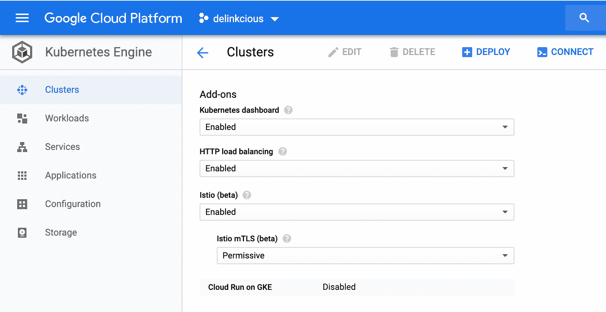
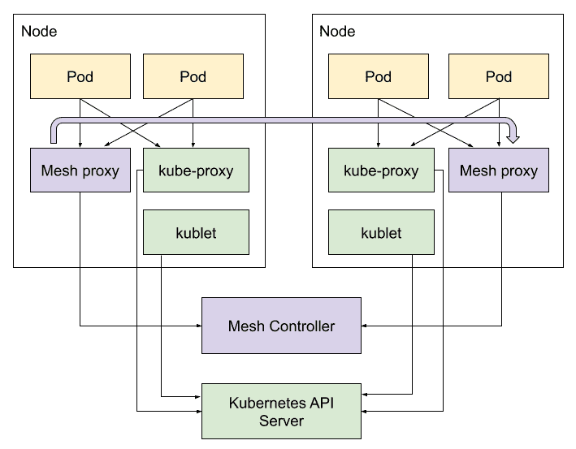
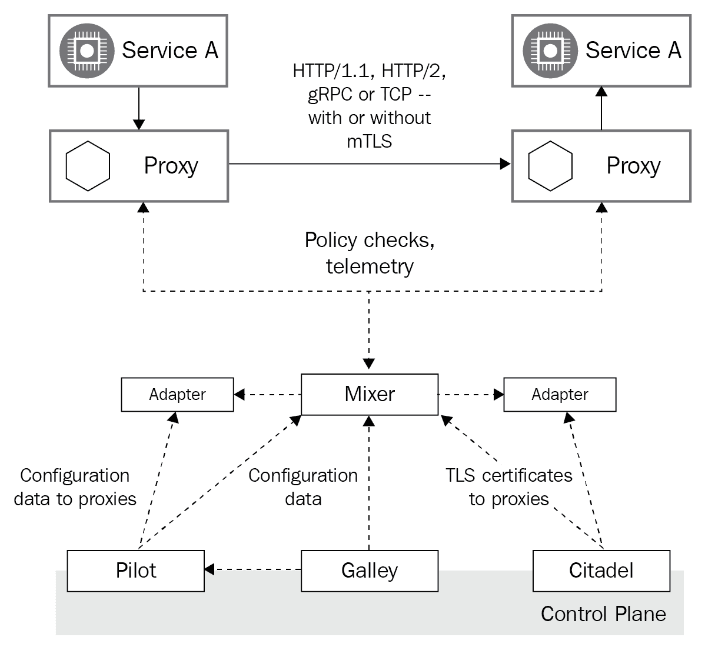
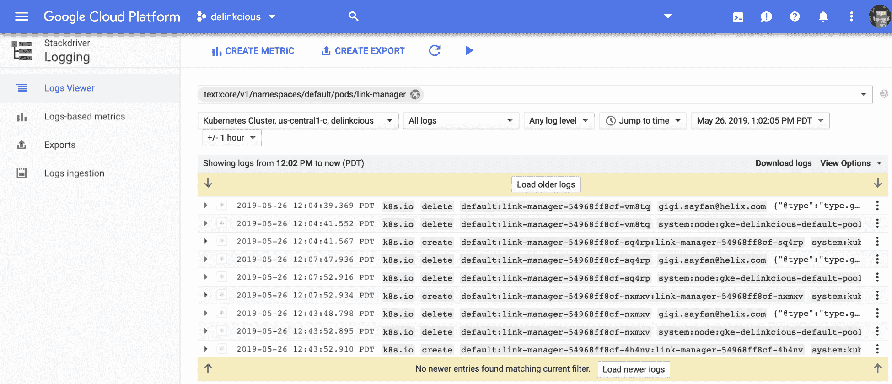
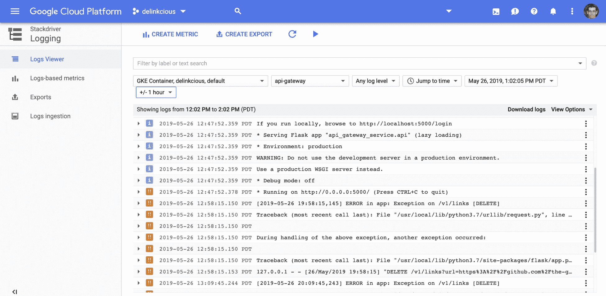
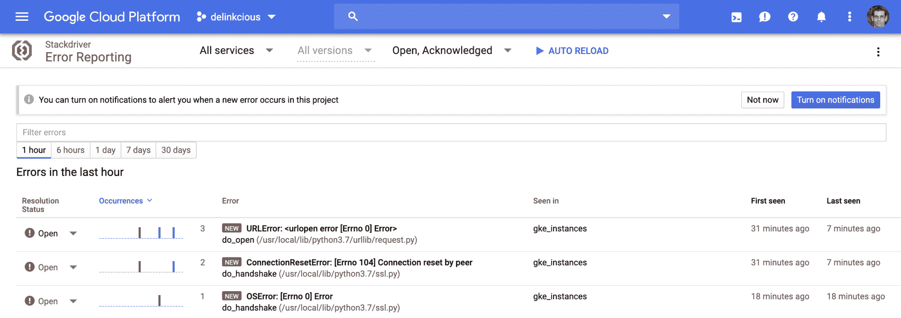
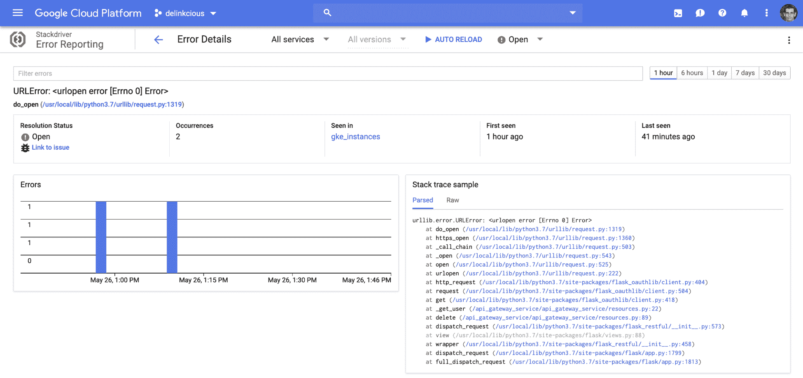

# 第十三章：服务网格 - 与 Istio 一起工作

在本章中，我们将回顾服务网格和特别是 Istio 这一热门话题。这令人兴奋，因为服务网格是一个真正的游戏改变者。它将许多复杂的任务从服务中移出到独立的代理中。这是一个巨大的胜利，特别是在多语言环境中，不同的服务是用不同的编程语言实现的，或者如果你需要将一些遗留应用迁移到你的集群中。

在本章中，我们将涵盖以下主题：

+   服务网格是什么

+   Istio 为我们带来了什么

+   Istio 上的 Delinkcious

+   Istio 的替代方案

# 技术要求

在本章中，我们将使用 Istio。我选择在本章中使用**Google Kubernetes Engine**（**GKE**），因为 Istio 可以作为附加组件在 GKE 上启用，无需您安装它。这有以下两个好处：

+   它节省了安装时间

+   它展示了 Delinkcious 可以在云中运行，而不仅仅是在本地

要安装 Istio，您只需在 GKE 控制台中启用它，并选择 mTLS 模式，这是服务之间的相互认证。我选择了宽容模式，这意味着集群内部通信默认情况下不加密，服务将接受加密和非加密连接。您可以针对每个服务进行覆盖。对于生产集群，我建议使用严格的 mTLS 模式，其中所有连接必须加密：



Istio 将安装在自己的`istio-system`命名空间中，如下所示：

```
$ kubectl -n istio-system get po

NAME READY STATUS RESTARTS AGE
istio-citadel-6995f7bd9-69qhw 1/1 Running 0 11h
istio-cleanup-secrets-6xkjx 0/1 Completed 0 11h
istio-egressgateway-57b96d87bd-8lld5 1/1 Running 0 11h
istio-galley-6d7dd498f6-pm8zz 1/1 Running 0 11h
istio-ingressgateway-ddd557db7-b4mqq 1/1 Running 0 11h
istio-pilot-5765d76b8c-l9n5n 2/2 Running 0 11h
istio-policy-5b47b88467-tfq4b 2/2 Running 0 11h
istio-sidecar-injector-6b9fbbfcf6-vv2pt 1/1 Running 0 11h
istio-telemetry-65dcd9ff85-dxrhf 2/2 Running 0 11h
promsd-7b49dcb96c-cn49l 2/2 Running 1 11h
```

# 代码

您可以在[`github.com/the-gigi/delinkcious/releases/tag/v0.11`](https://github.com/the-gigi/delinkcious/releases/tag/v0.11)找到更新的 Delinkcious 应用程序。

# 什么是服务网格？

让我们首先回顾一下微服务面临的问题，与单体应用相比，看看服务网格是如何解决这些问题的，然后你就会明白我为什么对它们如此兴奋。在设计和编写 Delinkcious 时，应用代码相当简单。我们跟踪用户、他们的链接以及他们的关注/被关注关系。我们还进行一些链接检查，并将最近的链接存储在新闻服务中。最后，我们通过 API 公开所有这些功能。

# 将单体应用与微服务进行比较

在单体系统中实现所有这些功能本来很容易。在 Delinkcious 单体系统中部署、监控和调试也很简单。然而，随着 Delinkcious 在功能上的增长，以及用户和开发团队的增加，单体应用程序的缺点变得更加明显。这就是为什么我们选择了基于微服务的方法。然而，在这个过程中，我们不得不编写大量的代码，安装许多额外的工具，并配置许多与 Delinkcious 应用程序本身无关的组件。我们明智地利用了 Kubernetes 和 Go kit 来清晰地将所有这些额外的关注点与 Delinkcious 领域代码分离，但这是一项艰苦的工作。

例如，如果安全性是高优先级，您会希望在系统中对服务间调用进行身份验证和授权。我们在 Delinkcious 中通过引入链接服务和社交图服务之间的共享密钥来实现这一点。我们必须配置一个密钥，确保它只能被这两个服务访问，并添加代码来验证每个调用是否来自正确的服务。在许多服务中维护（例如，轮换密钥）和演变这一点并不是一件容易的事情。

这是另一个例子，即分布式跟踪。在单体系统中，整个调用链可以通过堆栈跟踪来捕获。在 Delinkcious 中，您必须安装分布式跟踪服务，例如 Jaeger，并修改代码以记录跨度。

在单体系统中进行集中日志记录是微不足道的，因为单体系统已经是一个集中的实体。

总之，微服务带来了许多好处，但它们要管理和控制得多困难。

# 使用共享库来管理微服务的横切关注点

最常见的方法之一是在一个库或一组库中实现所有这些关注点。所有微服务都包含或依赖于处理所有这些横切面问题的共享库，如配置、日志记录、秘钥管理、跟踪、速率限制和容错。这在理论上听起来很不错；让服务处理应用领域，让一个共享库或一组库处理常见的关注点。Netflix 的 Hystrix 就是一个很好的例子，它是一个处理延迟和容错的 Java 库。Twitter 的 Finagle 是另一个很好的例子，它是一个针对 JVM 的 Scala 库。许多组织使用一系列这样的库，并经常编写自己的库。

然而，在实践中，这种方法有严重的缺点。第一个问题是，作为一个编程语言库，它自然是用特定的语言实现的（例如，在 Hystrix 的情况下是 Java）。你的系统可能有多种语言的微服务（即使 Delinkcious 也有 Go 和 Python 服务）。使用不同编程语言实现的微服务是最大的好处之一。共享库（或库）显著地阻碍了这一方面。这是因为你最终会有几个不太吸引人的选项，如下所示：

+   你将所有的微服务限制在一个编程语言中。

+   你为你使用的每种编程语言维护跨语言共享库，使其行为相同。

+   你接受不同的服务将以不同的方式与你的集中服务进行交互（例如，不同的日志格式或缺失的跟踪）。

所有这些选项都相当糟糕。但事情并没有就此结束；假设你选择了前面提到的一些选项的组合。这很可能会包括大量的自定义代码，因为没有现成的库能够提供你所需的一切。现在，你想要更新你的共享代码库。由于它被所有或大多数服务共享，这意味着你必须对所有服务进行全面升级。然而，很可能你不能一次性关闭系统并升级所有服务。

相反，您将不得不以滚动更新的形式进行。即使是蓝绿部署也无法立即在多个服务之间完成。问题在于，通常，共享代码与您如何管理服务之间的共享秘密或身份验证有关。例如，如果服务 A 升级到共享库的新版本，而服务 B 仍在以前的版本上，它们可能无法通信。这会导致停机，可能会影响许多服务。您可以找到一种以向后兼容的方式引入更改的方法，但这更加困难且容易出错。

好的，所以跨所有服务共享库是有用的，但很难管理。让我们看看服务网格如何帮助。

# 使用服务网格来管理微服务的横切关注点

服务网格是一组智能代理和额外的控制基础设施组件。代理部署在集群中的每个节点上。代理拦截所有服务之间的通信，并可以代表您执行许多工作，以前必须由服务（或服务使用的共享库）完成。服务网格的一些责任如下：

+   通过重试和自动故障转移可靠地传递请求

+   延迟感知负载平衡

+   根据灵活和动态的路由规则路由请求（这也被称为流量整形）

+   通过截止日期进行断路

+   服务对服务的身份验证和授权

+   报告指标和支持分布式跟踪

所有这些功能对于许多大规模云原生应用程序都很重要。从服务中卸载它们是一个巨大的胜利。诸如智能流量整形之类的功能需要构建专门的可靠服务，而无需服务网格。

以下图表说明了服务网格嵌入到 Kubernetes 集群中的方式：



服务网格听起来确实是革命性的。让我们看看它们如何适应 Kubernetes。

# 了解 Kubernetes 与服务网格之间的关系

乍一看，服务网格听起来与 Kubernetes 本身非常相似。Kubernetes 将 kubelet 和 kube-proxy 部署到每个节点上，而服务网格则部署自己的代理。Kubernetes 有一个控制平面，kubelet/kube-proxy 与之交互，而服务网格有自己的控制平面，网格代理与之交互。

我喜欢把服务网格看作是对 Kubernetes 的一个补充。Kubernetes 主要负责调度 pod 并为其提供扁平网络模型和服务发现，以便不同的 pod 和服务之间可以相互通信。这就是服务网格接管并以更精细的方式管理这种服务与服务之间的通信。在负载平衡和网络策略方面有一层薄薄的重叠，但总体而言，服务网格是对 Kubernetes 的一个很好的补充。

同样重要的是要意识到这两种令人惊叹的技术并不依赖于彼此。显然，您可以在没有服务网格的情况下运行 Kubernetes 集群。此外，许多服务网格可以与其他非 Kubernetes 平台一起工作，例如 Mesos、Nomad、Cloud Foundry 和基于 Consul 的部署。

现在我们了解了什么是服务网格，让我们来看一个具体的例子。

# Istio 带来了什么？

Istio 是一个服务网格，最初由 Google、IBM 和 Lyft 开发。它于 2017 年中期推出并迅速获得成功。它带来了一个统一的模型，具有控制平面和数据平面，围绕 Envoy 代理构建，具有很大的动力，并已经成为其他项目的基础。当然，它是开源的，是**Cloud Native Computing Foundation** (**CNCF**)项目。在 Kubernetes 中，每个 Envoy 代理都被注入为参与网格的每个 pod 的旁路容器。

让我们探索 Istio 架构，然后深入了解它提供的服务。

# 了解 Istio 架构

Istio 是一个提供了许多功能的大型框架，它有多个部分相互交互，并与 Kubernetes 组件（主要是间接和不显眼地）交互。它分为控制平面和数据平面。数据平面是一组代理（每个 pod 一个）。它们的控制平面是一组负责配置代理和收集数据遥测的组件。

以下图表说明了 Istio 的不同部分，它们之间的关系以及它们之间交换的信息：



让我们深入了解每个组件，从 Envoy 代理开始。

# 使者

Envoy 是一个用 C++实现的高性能代理。它由 Lyft 开发，作为 Istio 的数据平面，但它也是一个独立的 CNCF 项目，可以单独使用。对于服务网格中的每个 pod，Istio 注入（自动或通过`istioctl` CLI）一个 Envoy 侧容器来处理繁重的工作：

+   代理 HTTP、HTTP/2 和 gRPC 流量之间的 pod

+   复杂的负载平衡

+   mTLS 终止

+   HTTP/2 和 gRPC 代理

+   提供服务健康状况

+   对不健康服务的断路

+   基于百分比的流量整形

+   注入故障进行测试

+   详细的度量

Envoy 代理控制其 pod 的所有传入和传出通信。这是 Istio 最重要的组件。Envoy 的配置并不是微不足道的，这是 Istio 控制平面处理的一个很大的部分。

下一个组件是 Pilot。

# 飞行员

Pilot 负责平台无关的服务发现、动态负载平衡和路由。它将高级路由规则和弹性从自己的规则 API 转换为 Envoy 配置。这种抽象层允许 Istio 在多个编排平台上运行。Pilot 获取所有特定于平台的信息，将其转换为 Envoy 数据平面配置格式，并通过 Envoy 数据平面 API 传播到每个 Envoy 代理。Pilot 是无状态的；在 Kubernetes 中，所有配置都存储为 etcd 上的**自定义资源定义**（**CRD**）。

# 混合器

Mixer 负责抽象度量收集和策略。这些方面通常通过直接访问特定后端的 API 来在服务中实现。这样做的好处是可以减轻服务开发人员的负担，并将控制权交给配置 Istio 的运营商。它还允许您在不改变代码的情况下轻松切换后端。Mixer 可以与以下类型的后端一起工作：

+   日志记录

+   授权

+   配额

+   遥测

+   计费

Envoy 代理与 Mixer 之间的交互很简单 - 在每个请求之前，代理调用 Mixer 进行前置条件检查，这可能导致请求被拒绝；在每个请求之后，代理向 Mixer 报告度量。Mixer 具有适配器 API，以便为任意基础设施后端进行扩展。这是其设计的一个重要部分。

# Citadel

Citadel 负责 Istio 中的证书和密钥管理。它与各种平台集成，并与它们的身份机制保持一致。例如，在 Kubernetes 中，它使用服务账户；在 AWS 上，它使用 AWS IAM；在 GCP/GKE 上，它可以使用 GCP IAM。Istio PKI 基于 Citadel。它使用 X.509 证书以 SPIFEE 格式作为服务身份的载体。

以下是 Kubernetes 中的工作流程：

+   Citadel 为现有的服务账户创建证书和密钥对。

+   Citadel 监视 Kubernetes API 服务器，以便为新的服务账户提供证书和密钥对。

+   Citadel 将证书和密钥存储为 Kubernetes 秘密。

+   Kubernetes 将秘密挂载到与服务账户关联的每个新 pod 中（这是标准的 Kubernetes 实践）。

+   当证书过期时，Citadel 会自动旋转 Kubernetes 秘密。

+   Pilot 生成安全命名信息，将服务账户与 Istio 服务关联起来。然后 Pilot 将安全命名信息传递给 Envoy 代理。

我们将要介绍的最后一个主要组件是 Galley。

# Galley

Galley 是一个相对简单的组件。它的工作是在不同平台上抽象用户配置。它将摄入的配置提供给 Pilot 和 Mixer。

现在我们已经将 Istio 分解为其主要组件，让我们看看它如何完成作为服务网格的职责。第一能力是流量管理。

# 使用 Istio 管理流量

Istio 在集群内部的网络级别运行，管理服务之间的通信，以及管理如何将服务暴露给外部世界。它提供了许多功能，如请求路由、负载平衡、自动重试和故障注入。让我们从路由请求开始，回顾所有这些功能。

# 路由请求

Istio 引入了自己的虚拟服务作为 CRD。Istio 服务具有一个在 Kubernetes 服务中不存在的版本概念。同一图像可以部署为虚拟服务的不同版本。例如，您可以将生产环境或分段环境表示为同一服务的不同版本。Istio 允许您配置规则，确定如何将流量路由到服务的不同版本。

这样的工作方式是 Pilot 将入口和出口规则发送到代理，以确定请求应该由哪里处理。然后在 Kubernetes 中将规则定义为 CRD。以下是一个简单的示例，定义了`link-manager`服务的虚拟服务：

```
apiVersion: networking.istio.io/v1alpha3
kind: VirtualService
metadata:
 name: link-manager
spec:
  hosts:
  - link-manager # same as link-manager.default.svc.cluster.local
  http:
  - route:
    - destination:
        host: link-manager
```

让我们看看 Istio 如何进行负载均衡。

# 负载均衡

Istio 具有自己的平台无关的服务发现，适配器适用于底层平台（例如 Kubernetes）。它依赖于底层平台管理的服务注册表的存在，并删除不健康的实例以更新其负载均衡池。目前支持三种负载均衡算法：

+   轮询

+   随机

+   加权最少请求

Envoy 还有一些其他算法，例如 Maglev、环形哈希和加权轮询，Istio 目前还不支持。

Istio 还执行定期健康检查，以验证池中的实例实际上是健康的，并且如果它们未通过配置的健康检查阈值，可以暂时将它们从负载均衡中移除。

您可以通过单独的`DestinationRule` CRD 在目标规则中配置负载均衡，如下所示：

```
apiVersion: networking.istio.io/v1alpha3
kind: DestinationRule
metadata:
  name: link-manager
spec:
  host: link-manager
  trafficPolicy:
    loadBalancer:
      simple: ROUND_ROBIN
```

您可以按端口指定不同的算法，如下所示：

```
apiVersion: networking.istio.io/v1alpha3
kind: DestinationRule
metadata:
  name: link-manager
spec:
  host: link-manager
  trafficPolicy:
    portLevelSettings:
    - port:
        number: 80
      loadBalancer:
        simple: LEAST_CONN
    - port:
        number: 8080
      loadBalancer:
        simple: ROUND_ROBIN
```

现在，让我们看看 Istio 如何帮助我们自动处理故障。

# 处理故障

Istio 提供了许多处理故障的机制，包括以下内容：

+   超时

+   重试（包括退避和抖动）

+   速率限制

+   健康检查

+   断路器

所有这些都可以通过 Istio CRD 进行配置。

例如，以下代码演示了如何在 TCP 级别（HTTP 也支持）设置`link-manager`服务的连接限制和超时：

```
apiVersion: networking.istio.io/v1alpha3
kind: DestinationRule
metadata:
   name: link-manager
spec:
  host: link-manager
  trafficPolicy:
     connectionPool:
       tcp:
         maxConnections: 200
         connectTimeout: 45ms
         tcpKeepalive:
           time: 3600s
           interval: 75s
```

断路器是通过在给定时间段内明确检查应用程序错误（例如，5XX HTTP 状态代码）来完成的。这是在`outlierDetection`部分完成的。以下示例每 2 分钟检查 10 个连续错误。如果服务超过此阈值，实例将被从池中驱逐 5 分钟：

```
apiVersion: networking.istio.io/v1alpha3
kind: DestinationRule
metadata:
  name: link-manager
spec:
  host: link-manager
  trafficPolicy:
     outlierDetection:
       consecutiveErrors: 10
       interval: 2m
       baseEjectionTime: 5m
```

请注意，就 Kubernetes 而言，服务可能没问题，因为容器正在运行。

Istio 提供了许多处理操作级别错误和故障的方式，这很棒。在测试分布式系统时，重要的是测试某些组件失败时的行为。Istio 通过允许您故意注入故障来支持这种用例。

# 注入故障进行测试

Istio 的故障处理机制并不能神奇地修复错误。自动重试可以自动处理间歇性故障，但有些故障需要应用程序甚至人工操作员来处理。事实上，Istio 故障处理的错误配置本身可能导致故障（例如，配置的超时时间太短）。可以通过人为注入故障来测试系统在故障存在的情况下的行为。Istio 可以注入两种类型的故障：中止和延迟。您可以在虚拟服务级别配置故障注入。

以下是一个示例，其中将在`link-manager`服务的 10%的所有请求中添加 5 秒的延迟，以模拟系统的重负载：

```
apiVersion: networking.istio.io/v1alpha3
kind: VirtualService
metadata:
   name: link-manager
 spec:
   hosts:
   - link-manager
   http:
   - fault:
       delay:
         percent: 10
         fixedDelay: 5s
```

在压力和故障存在的情况下进行测试是一个巨大的好处，但所有测试都是不完整的。当部署新版本时，您可能希望将其部署给一小部分用户，或者让新版本处理一小部分所有请求。这就是金丝雀部署的用武之地。

# 进行金丝雀部署

我们之前发现了如何在 Kubernetes 中执行金丝雀部署。如果我们想将 10%的请求转发到我们的金丝雀版本，我们必须部署当前版本的九个 pod 和一个金丝雀 pod 以获得正确的比例。Kubernetes 的负载均衡与部署的 pod 紧密耦合。这是次优的。Istio 有更好的负载均衡方法，因为它在网络级别运行。您可以简单地配置服务的两个版本，并决定百分之多少的请求发送到每个版本，而不管每个版本运行多少个 pod。

以下是一个示例，Istio 将分割流量并将 95%发送到服务的 v1，5%发送到服务的 v2：

```
apiVersion: networking.istio.io/v1alpha3
kind: VirtualService
metadata:
  name: link-service
spec:
  hosts:
    - reviews
  http:
  - route:
    - destination:
        host: link-service
        subset: v1
       weight: 95
     - destination:
         host: reviews
         subset: v2
       weight: 5
```

子集 v1 和 v2 是根据标签在目标规则中定义的。在这种情况下，标签是`version: v1`和`version: v2`：

```
apiVersion: networking.istio.io/v1alpha3
 kind: DestinationRule
 metadata:
   name: link-manager
 spec:
   host: link-manager
   subsets:
   - name: v1
     labels:
       version: v1
   - name: v2
     labels:
       version: v2
```

这是对 Istio 流量管理能力的相当全面的覆盖，但还有更多可以发现的。让我们把注意力转向安全。

# 使用 Istio 保护您的集群

Istio 的安全模型围绕三个主题展开：身份、认证和授权。

# 理解 Istio 的身份

Istio 管理自己的身份模型，可以代表人类用户、服务或服务组。在 Kubernetes 中，Istio 使用 Kubernetes 的服务账户来表示身份。Istio 使用其 PKI（通过 Citadel）为其管理的每个 pod 创建强大的加密身份。它为每个服务账户创建一个 x.509 证书（以 SPIFEE 格式）和一对密钥，并将它们作为秘密注入到 pod 中。Pilot 管理了 DNS 服务名称和允许运行它们的身份之间的映射。当客户端调用服务时，它们可以验证服务确实是由允许的身份运行的，并且可以检测到恶意服务。有了强大的身份验证，让我们来看看 Istio 的身份验证是如何工作的。

# 使用 Istio 对用户进行身份验证

Istio 认证是基于策略的。有两种类型的策略：命名空间策略和网格策略。命名空间策略适用于单个命名空间。网格策略适用于整个集群。只能有一个网格策略，类型为`MeshPolicy`，并且必须命名为`default`。以下是一个要求所有服务使用 mTLS 的网格策略示例：

```
apiVersion: "authentication.istio.io/v1alpha1"
 kind: "MeshPolicy"
 metadata:
   name: "default"
 spec:
   peers:
   - mtls: {}
```

命名空间策略的类型为`Policy`。如果不指定命名空间，则它将应用于默认命名空间。每个命名空间只能有一个策略，并且也必须被称为`default`。以下策略使用目标选择器仅适用于`api-gateway`服务和链接服务的端口`8080`：

```
apiVersion: "authentication.istio.io/v1alpha1"
 kind: "Policy"
 metadata:
   name: "default"
   namespace: "some-ns"
 spec:
   targets:
    - name: api-gateway
    - name: link-manager
      ports:
      - number: 8080
```

这个想法是为了避免歧义；策略是从服务到命名空间再到网格解析的。如果存在一个狭窄的策略，它将优先。

Istio 提供了通过 mTLS 进行对等体身份验证或通过 JWT 进行源身份验证。

您可以通过`peers`部分配置对等体身份验证，如下所示：

```
peers:
   - mtls: {}
```

您可以通过`origins`部分配置源身份，如下所示：

```
origins:
 - jwt:
     issuer: "https://accounts.google.com"
     jwksUri: "https://www.googleapis.com/oauth2/v3/certs"
     trigger_rules:
     - excluded_paths:
       - exact: /healthcheck
```

如您所见，可以为特定路径配置源身份验证（通过包括或排除路径）。在前面的示例中，`/healthcheck`路径被豁免于身份验证，这对于经常需要从负载均衡器或远程监控服务调用的健康检查端点是有意义的。

默认情况下，如果存在对等体部分，则使用对等体身份验证。如果没有，则不会设置身份验证。要强制进行源身份验证，可以将以下内容添加到策略中：

```
principalBinding: USE_ORIGIN
```

现在我们已经了解了 Istio 如何对请求进行身份验证，让我们来看看它是如何进行授权的。

# 使用 Istio 授权请求

服务通常公开多个端点。服务 A 可能只允许调用服务 B 的特定端点。服务 A 必须首先对服务 B 进行身份验证，然后还必须对特定请求进行授权。Istio 通过扩展 Kubernetes 用于授权对其 API 服务器的请求的**基于角色的访问控制**（**RBAC**）来支持这一点。

重要的是要注意，授权默认处于关闭状态。要启用它，您可以创建一个`ClusterRbacConfig`对象。模式控制授权的启用方式，如下所示：

+   `OFF`表示授权已禁用（默认）。

+   `ON`表示授权对整个网格中的所有服务启用。

+   `ON_WITH_INCLUSION`表示授权对所有包含的命名空间和服务启用。

+   `ON_WITH_EXCLUSION`表示授权对所有命名空间和服务启用，除了被排除的。

以下是授权在除了`kube-system`和`development`之外的所有命名空间上启用的示例：

```
apiVersion: "rbac.istio.io/v1alpha1"
 kind: ClusterRbacConfig
 metadata:
   name: default
 spec:
   mode: 'ON_WITH_EXCLUSION'
   exclusion:
     namespaces: ["kube-system", "development"]
```

实际授权在服务级别操作，与 Kubernetes 的 RBAC 模型非常相似。在 Kubernetes 中有`Role`、`ClusterRole`、`RoleBinding`和`ClusterRoleBinding`，在 Istio 中有`ServiceRole`和`ServiceRoleBinding`。

基本的细粒度是`namespace/service/path/method`。您可以使用通配符进行分组。例如，以下角色授予默认命名空间中所有 Delinkcious 管理者和 API 网关的 GET 和 HEAD 访问权限：

```
apiVersion: "rbac.istio.io/v1alpha1"
 kind: ServiceRole
 metadata:
   name: full-access-reader
   namespace: default
 spec:
   rules:
   - services: ["*-manager", "api-gateway"]
     paths:
     methods: ["GET", "HEAD"]
```

但是，Istio 还提供了通过约束和属性进行更进一步的控制。您可以通过源命名空间或 IP、标签、请求标头和其他属性来限制规则。

您可以参考[`istio.io/docs/reference/config/authorization/constraints-and-properties/`](https://istio.io/docs/reference/config/authorization/constraints-and-properties/)获取更多详细信息。

一旦您有了`ServiceRole`，您需要将其与允许执行请求操作的主体（例如服务账户或人类用户）的列表进行关联。以下是如何定义`ServiceRoleBinding`：

```
apiVersion: "rbac.istio.io/v1alpha1"
 kind: ServiceRoleBinding
 metadata:
   name: test-binding-products
   namespace: default
 spec:
   subjects:
   - user: "service-account-delinkcious"
   - user: "istio-ingress-service-account"
     properties:
       request.auth.claims[email]: "the.gigi@gmail.com"
   roleRef:
     kind: ServiceRole
     name: "full-access-reader"
```

通过将主体用户设置为`*`，可以使角色对经过身份验证或未经身份验证的用户公开可用。

Istio 授权有很多内容，我们无法在这里涵盖。您可以阅读以下主题：

+   TCP 协议的授权

+   宽容模式（实验性）

+   调试授权问题

+   通过 Envoy 过滤器进行授权

一旦请求在那里得到授权，如果未能符合策略检查，仍可能被拒绝。

# 使用 Istio 执行策略

Istio 策略执行类似于 Kubernetes 中的准入控制器的工作方式。Mixer 有一组适配器，在请求处理之前和之后被调用。在我们进一步深入之前，重要的是要注意，默认情况下策略执行是禁用的。如果您使用 helm 安装 Istio，可以通过提供以下标志来启用它：

```
--set global.disablePolicyChecks=false.
```

在 GKE 上，它是启用的；以下是如何检查这一点：

```
$ kubectl -n istio-system get cm istio -o jsonpath="{@.data.mesh}" | grep disablePolicyChecks
disablePolicyChecks: false
```

如果结果是`disablePolicyChecks: false`，那么它已经启用。否则，通过编辑 Istio ConfigMap 并将其设置为 false 来启用它。

一种常见的策略类型是速率限制。您可以通过配置配额对象、将它们绑定到特定服务并定义混合器规则来强制执行速率限制。在 Istio 演示应用程序中可以找到一个很好的例子，网址为[`raw.githubusercontent.com/istio/istio/release-1.1/samples/bookinfo/policy/mixer-rule-productpage-ratelimit.yaml`](https://raw.githubusercontent.com/istio/istio/release-1.1/samples/bookinfo/policy/mixer-rule-productpage-ratelimit.yaml)。

您还可以通过创建 Mixer 适配器来添加自己的策略。有三种内置类型的适配器，如下：

+   检查

+   配额

+   报告

这并不是微不足道的；您将不得不实现一个可以处理专用模板中指定的数据的 gRPC 服务。现在，让我们来看看 Istio 为我们收集的指标。

# 使用 Istio 收集指标

Istio 在每个请求之后收集指标。指标被发送到 Mixer。Envoy 是主要的指标生产者，但如果愿意，您也可以添加自己的指标。指标的配置模型基于多个 Istio 概念：属性、实例、模板、处理程序、规则和 Mixer 适配器。

以下是一个计算所有请求并将其报告为`request-count`指标的示例实例：

```
apiVersion: config.istio.io/v1alpha2
 kind: instance
 metadata:
   name: request-count
   namespace: istio-system
 spec:
   compiledTemplate: metric
   params:
     value: "1" # count each request
     dimensions:
       reporter: conditional((context.reporter.kind | "inbound") == "outbound", "client", "server")
       source: source.workload.name | "unknown"
       destination: destination.workload.name | "unknown"
       message: '"counting requests..."'
     monitored_resource_type: '"UNSPECIFIED"'```

现在，我们可以配置一个 Prometheus 处理器来接收指标。Prometheus 是一个编译适配器（它是 Mixer 的一部分），因此我们可以在规范中直接使用它。`spec | params | metrics` 部分包含一种 `COUNTER`，一个 Prometheus 指标名称（`request_count`），以及最重要的，我们刚刚定义的实例名称，它是指标的来源：

```

Now, we can configure a Prometheus handler to receive the metrics. Prometheus is a compiled adapter (which is part of Mixer), so we can just use it in the spec. The `spec | params | metrics` section has a kind of `COUNTER`, a Prometheus metric name (`request_count`), and, most importantly, the instance name that we just defined, which is the source of the metrics:

```

最后，我们用一条规则将所有内容串联起来，如下所示：

```

Finally, we tie it all together with a rule, as follows:

```

好的，Istio 确实非常强大。但有没有一些情况下你不应该使用 Istio 呢？

# 何时应避免使用 Istio？

Istio 提供了大量价值。然而，这些价值并非没有代价。Istio 的侵入性和复杂性带来了一些显著的缺点。在采用 Istio 之前，您应该考虑这些缺点：

+   在已经复杂的 Kubernetes 之上增加额外的概念和管理系统，使得学习曲线变得非常陡峭。

+   配置问题的故障排除具有挑战性。

+   与其他项目的整合可能缺失或部分完成（例如，NATS 和 Telepresence）。

+   代理会增加延迟并消耗 CPU 和内存资源。

如果您刚开始接触 Kubernetes，我建议您先熟悉它，然后再考虑使用 Istio。

既然我们了解了 Istio 的核心内容，让我们探讨 Delinkcious 如何从 Istio 中获益。

# Delinkcious 在 Istio 上

通过 Istio，Delinkcious 可以潜在地摆脱大量额外负担。那么，为什么将此功能从 Delinkcious 服务或 Go kit 中间件迁移到 Istio 是一个好主意呢？

嗯，原因在于这种功能通常与应用领域无关。我们投入了大量工作来仔细分离关注点并将 Delinkcious 领域与它们的部署和管理方式隔离。然而，只要所有这些关注点都由微服务本身处理，我们就需要每次进行操作更改时修改代码并重新构建它们。即使很多这些操作是数据驱动的，它也可能使故障排除和调试问题变得困难，因为当故障发生时，并不总是容易确定它是由于领域代码中的错误还是操作代码中的错误。

让我们来看一些具体的例子，其中 Istio 可以简化 Delinkcious。

# 移除服务间的相互认证

如您所记，在第六章，*在 Kubernetes 上保护微服务*中，我们创建了 `link-manager` 服务与 `social-graph-manager` 服务之间的相互秘密：

```

Okay, so Istio is amazingly powerful. But are there any situations where you shouldn't use Istio?

# When should you avoid Istio?

Istio provides a lot of value. However, this value is not without a cost. The intrusive nature of Istio and its complexity have some significant downsides. You should consider these downsides before you adopt Istio:

*   Additional concepts and management systems on top of the already complex Kubernetes make the learning curve very steep.
*   Troubleshooting configuration issues is challenging.
*   Integration with other projects might be missing or partial (for example, NATS and Telepresence).
*   The proxies add latency and consume CPU and memory resources.

If you're just starting with Kubernetes, I recommend waiting until you get the hang of it before you even consider using Istio.

Now that we understand what Istio is all about, let's explore how Delinkcious can benefit from Istio.

# Delinkcious on Istio

With Istio, Delinkcious can potentially shed a lot of extra baggage. So, why is it a good idea to move this functionality from Delinkcious services or Go kit middleware to Istio?

Well, the reason is that this functionality is often unrelated to the application domain. We invested a lot of work to carefully separate concerns and isolate the Delinkcious domain from the way they are deployed and managed. However, as long as all of those concerns are addressed by the microservices themselves, we will need to make changes to the code and rebuild them every time we want to make an operational change. Even if a lot of this is data-driven, it can make it difficult to troubleshoot and debug issues because, when a failure happens, it's not always easy to determine whether it was due to a bug in the domain code or the operational code.

Let's take a look at some specific examples where Istio can simplify Delinkcious.

# Removing mutual authentication between services

As you may recall, in [Chapter 6](f7718dfe-8c96-495b-9089-36b9bbced4c8.xhtml), *Securing Microservices on Kubernetes*, we created a mutual secret between the `link-manager` service and the `social-graph-manager` service:

```

这需要大量的协调和明确的工作来编码秘密，然后将秘密挂载到容器中：

```

It required a lot of coordination and explicit work to encode the secrets, and then mount the secrets into the containers:

```

然后，链接管理器必须通过我们实现的 `auth_util` 包获取秘密，并将其作为请求头注入：

```

Then, the link manager had to get the secret through the `auth_util` package we had to implement, and inject it as a header to the request:

```

最后，社交图谱管理器必须意识到这一方案，并明确检查调用者是否被允许：

```

Finally, the social graph manager has to be aware of this scheme and explicitly check whether the caller is allowed:

```

这涉及到大量与服务本身无关的工作。想象一下，管理数百个相互作用的微服务中的数千种方法。这种方法繁琐、易错，并且每当增加或删除交互时，都需要对两个服务进行代码更改。

使用 Istio，我们可以完全将其外部化为一个角色和一个角色绑定。以下是一个允许您调用`/following`端点的 GET 方法的角色：

```

That's a lot of work that has nothing to do with the service itself. Imagine managing access to hundreds of interacting microservices with thousands of methods. This approach is cumbersome, error-prone, and requires code changes being made to two services whenever you add or remove an interaction.

With Istio, we can externalize this completely as a role and a role binding. Here is a role that allows you to call the GET method of the `/following` endpoint:

```

为了仅允许链接服务调用该方法，我们可以将角色绑定到`link-manager`服务帐户作为主体用户：

```

In order to allow only the link service to call the method, we can bind the role to the `link-manager` service account as the subject user:

```

如果稍后我们需要允许其他服务调用`/following`端点，我们可以向此角色绑定添加更多主体。社交服务本身不需要知道哪些服务被允许调用其方法。调用服务不需要明确提供任何凭据。服务网格会处理所有这些。

Istio 真正能帮助 Delinkcious 的另一个领域是金丝雀部署。

# 利用更佳的金丝雀部署

在第十一章，*部署微服务*中，我们使用 Kubernetes 部署和服务进行金丝雀部署。为了将 10%的流量转向金丝雀版本，我们将当前版本扩展到九个副本，并创建了一个金丝雀部署，为新版本设置一个副本。我们为两个部署使用了相同的标签（`svc: link`和`app: manager`）。

`link-manager`服务在两个部署前均匀地分配了负载，实现了我们目标的 90/10 分割：

```

If, later, we need to allow other services to call the `/following` endpoint, we can add more subjects to this role binding. The social service itself doesn't need to know what service is allowed to call its methods. The calling services don't need to provide any credentials explicitly. The service mesh takes care of all that.

Another area where Istio can really help Delinkcious is with canary deployments.

# Utilizing better canary deployments

In [Chapter 11](ba776b0b-35e6-4fbd-9450-78b155daa743.xhtml), *Deploying Microservices*, we used Kubernetes deployments and services to do canary deployments. In order to divert 10% of the traffic to a canary version, we scaled the current version to nine replicas and created a canary deployment, with one replica for the new version. We used the same labels (`svc: link` and `app: manager`) for both deployments.

The `link-manager` service in front of both deployments distributed the load evenly between all the pods, creating the 90/10 split we were aiming for:

```

这虽然可行，但它将金丝雀部署与扩展部署耦合在一起。这可能会很昂贵，特别是如果您需要运行金丝雀部署一段时间直到您确信它没问题。理想情况下，您不应该需要为了将一定百分比的流量转向新版本而创建更多的 pod。

Istio 的子集概念的流量整形能力完美地解决了这一用例。以下虚拟服务将流量按 90/10 的比例分配给名为`v0.5`的子集和另一个名为`canary`的子集：

```

This works, but it couples canary deployments with scaling deployments. This can be expensive, especially if you need to run the canary deployment for a while until you are confident that it is okay. Ideally, you shouldn't need to create more pods just to divert a certain percentage of your traffic to a new version.

The traffic shaping capabilities with the subset concepts of Istio address this use case perfectly. The following virtual service splits the traffic into a ratio of 90/10 between a subset called `v0.5` and another subset called `canary`:

```

使用 Istio 的虚拟服务和子集进行金丝雀部署对 Delinkcious 非常有利。Istio 还能帮助进行日志记录和错误报告。

# 自动日志记录和错误报告

当在 GKE 上运行 Delinkcious 并使用 Istio 插件时，您将获得与 Stackdriver 的自动集成，这是一个一站式监控商店，包括指标、集中式日志记录、错误报告和分布式跟踪。以下是搜索`link-manager`日志时的 Stackdriver 日志查看器：



或者，您可以通过下拉列表按服务名称进行筛选。以下是指定 api-gateway 时的样子：



有时，错误报告视图正是您所需要的：



然后，您可以深入任何错误并获取大量额外信息，这将帮助您理解出了什么问题以及如何修复它：



尽管 Istio 提供了大量价值，并且在 Stackdriver 的情况下，您还能享受到自动设置的好处，但它并非总是顺风顺水——它存在一些限制和粗糙之处。

# 适应 NATS

我在将 Istio 部署到 Delinkcious 集群时发现的一个限制是，NATS 与 Istio 不兼容，因为它需要直接连接，并且在 Envoy 代理劫持通信时会中断。解决方案是阻止 Istio 注入边车容器，并接受 NATS 将不会被管理。将`NatsCluster` CRD 添加到 Pod 规范的以下注释中为我们完成了这项工作：`sidecar.istio.io/inject: "false"`:

```

Doing canary deployments with Istio's virtual services and subsets is great for Delinkcious. Istio can help with logging and error reporting, too.

# Automatic logging and error reporting

When running Delinkcious on GKE with the Istio add-on, you get automatic integration with Stackdriver, which is a one-stop shop for monitoring, including metrics, centralized logging, error reporting, and distributed tracing. Here is the Stackdriver log viewer for when you are searching for the `link-manager` logs:


Alternatively, you can filter by service name through the drop-down list. Here is what it looks like when specifying the api-gateway:


Sometimes, the error reporting view is what you need:


Then, you can drill down into any error and get a lot of additional information that will help you understand what went wrong and how to fix it:


While Istio provides a lot of value and, in the case of Stackdriver, you benefit from automatic setup too, it is not always smooth riding – it has some limitations and rough edges.

# Accommodating NATS

One of the limitations I discovered when deploying Istio into the Delinkcious cluster is that NATS doesn't work with Istio because it requires direct connections and it breaks when the Envoy proxy hijacks the communication. The solution is to prevent Istio from injecting the sidecar container and accepting that NATS will not be managed. Adding the`NatsCluster` CRD to the following annotation to the pod spec does the work for us: `sidecar.istio.io/inject: "false"`:

```

前面的代码是带有注释的完整`NatsCluster`资源定义。

# 审视 Istio 的影响范围

Istio 在集群中部署了大量内容，因此让我们回顾其中一些。值得庆幸的是，Istio 控制平面被隔离在其专有的`istio-system`命名空间中，但 CRD 始终是集群范围的，而 Istio 在这些方面并不吝啬：

```

The preceding code is the complete `NatsCluster` resource definition with the annotation in place.

# Examining the Istio footprint

Istio deploys a lot of stuff into the cluster, so let's review some of it. Mercifully, the Istio control plane is isolated in its own `istio-system` namespace, but CRDs are always cluster-wide and Istio doesn't skimp on those:

```

除了所有那些 CRD 之外，Istio 将其所有组件安装到 Istio 命名空间中：

```

In addition to all of those CRDs, Istio installs all its components into the Istio namespace:

```

最后，当然，Istio 将其边车代理安装到每个 Pod 中（除了 Nats，我们在那里禁用了它）。如您所见，默认命名空间中的每个 Pod 都有两个容器（在`READY`列下显示 2/2）。一个容器负责工作，另一个则是 Istio 代理边车容器：

```

Finally, Istio, of course, installs its sidecar proxies into each pod (except Nats, where we disabled it). As you can see, each pod in the default namespace has two containers (2/2 under the `READY` column). One container does the work and the other is the Istio proxy sidecar container:

```

如果您认为 Istio 过于庞大和复杂，您可能仍希望通过追求替代方案来享受服务网格的好处。

# Istio 的替代方案

Istio 虽然势头强劲，但并不一定是最适合您的服务网格。让我们来看看其他一些服务网格并考虑它们的特性。

# Linkerd 2.0

Buoyant 是在 2016 年创造了术语“服务网格”的公司，并推出了第一个服务网格——Linkerd。它基于 Twitter 的 Finagle，并用 Scala 实现。此后，Buoyant 开发了一个专注于 Kubernetes 的新服务网格，称为 Conduit（用 Rust 和 Go 实现），后来（在 2018 年 7 月）将其改名为 Linkerd 2.0。它像 Istio 一样是一个 CNCF 项目。Linkerd 2.0 还使用可以自动或手动注入的旁路容器。

由于其轻量级设计和在 Rust 中更紧密实现数据平面代理，Linkerd 2.0 应该优于 Istio，并在控制平面消耗更少的资源。您可以参考以下资源获取更多信息：

+   CPU 和内存：[`istio.io/docs/concepts/performance-and-scalability/#cpu-and-memory`](https://istio.io/docs/concepts/performance-and-scalability/#cpu-and-memory)

+   Linkerd 2.0 和 Istio 性能基准测试：[`medium.com/@ihcsim/linkerd-2-0-and-istio-performance-benchmark-df290101c2bb`](https://medium.com/@ihcsim/linkerd-2-0-and-istio-performance-benchmark-df290101c2bb)

+   Istio 和 Linkerd CPU 性能基准测试：[`medium.com/@michael_87395/benchmarking-istio-linkerd-cpu-c36287e32781`](https://medium.com/@michael_87395/benchmarking-istio-linkerd-cpu-c36287e32781)

Buoyant 是一家较小的公司，似乎在功能上略逊于 Istio。

# Envoy

Istio 的数据平面是 Envoy，它完成所有繁重的工作。您可能会发现 Istio 的控制平面过于复杂，并希望删除这一间接层，并构建自己的控制平面直接与 Envoy 交互。在某些特定情况下，这可能很有用；例如，如果您想使用 Istio 不支持的 Envoy 提供的负载均衡算法。

# HashiCorp Consul

Consul 并不完全符合服务网格的所有要求，但它提供了服务发现、服务身份验证和 mTLS 授权。它并不特定于 Kubernetes，并且没有得到 CNCF 的认可。如果您已经在使用 Consul 或其他 HashiCorp 产品，您可能更喜欢将其用作服务网格。

# AWS App Mesh

如果您在 AWS 上运行基础设施，您应该考虑 AWS App Mesh。这是一个较新的项目，专门针对 AWS，并且还使用 Envoy 作为其数据平面。可以肯定地假设它将与 AWS IAM 网络和监控技术最好地集成。目前尚不清楚 AWS App Mesh 是否将成为 Kubernetes 的更好的服务网格，或者其主要目的是为 ECS 提供服务网格的好处- AWS 的专有容器编排解决方案。

# 其他

还有一些其他的服务网格。我只是在这里提一下，这样你就可以进一步了解它们。其中一些与 Istio 有某种形式的集成。它们的价值并不总是很清楚，因为它们不是开放的：

+   Aspen Mesh

+   Kong Mesh

+   AVI Networks 通用服务网格

# 无网格选项

您可以完全避免使用服务网格，而使用诸如 Go kit、Hystrix 或 Finagle 之类的库。您可能会失去外部服务网格的好处，但如果您严格控制所有微服务，并且它们都使用相同的编程语言，那么库方法可能对您非常有效。这在概念上和操作上更简单，它将管理横切关注点的责任转移到开发人员身上。

# 总结

在本章中，我们看了服务网格，特别是 Istio。Istio 是一个复杂的项目；它位于 Kubernetes 之上，并创建了一种带有代理的影子集群。Istio 具有出色的功能；它可以在非常精细的级别上塑造流量，提供复杂的身份验证和授权，执行高级策略，收集大量信息，并帮助扩展您的集群。

我们介绍了 Istio 的架构，其强大的功能，并探讨了 Delinkcious 如何从这些功能中受益。

然而，Istio 远非简单。它创建了大量的自定义资源，并且以复杂的方式重叠和扩展现有的 Kubernetes 资源（VirtualService 与 Service）。

我们还回顾了 Istio 的替代方案，包括 Linkerd 2.0、纯 Envoy、AWS App Mesh 和 Consul。

到目前为止，您应该对服务网格的好处以及 Istio 对您的项目能做什么有了很好的理解。您可能需要进行一些额外的阅读和实验，以便做出明智的决定，即立即将 Istio 纳入您的系统，考虑其中一种替代方案，或者只是等待。

我相信服务网格和特别是 Istio 将非常重要，并且将成为纳入大型 Kubernetes 集群的标准最佳实践。

在下一章中，也是最后一章，我们将继续讨论微服务、Kubernetes 和其他新兴趋势的未来，比如无服务器。

# 进一步阅读

您可以参考以下资源，了解本章涵盖的更多信息：

+   **Istio**：[`istio.io`](https://istio.io)

+   **Hystrix**：[`github.com/Netflix/Hystrix`](https://github.com/Netflix/Hystrix)

+   **Finagle**：[`twitter.github.io/finagle/`](https://twitter.github.io/finagle/)

+   **Envo**：[`www.envoyproxy.io/`](https://www.envoyproxy.io/)

+   **Spiffe**：[`spiffe.io`](https://spiffe.io)

+   **Configuration**：[`istio.io/docs/reference/config/`](https://istio.io/docs/reference/config/)
