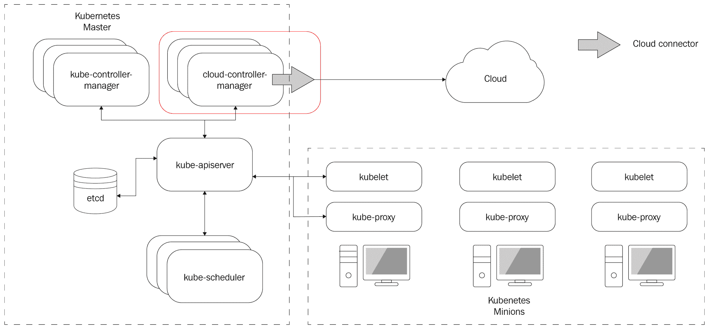
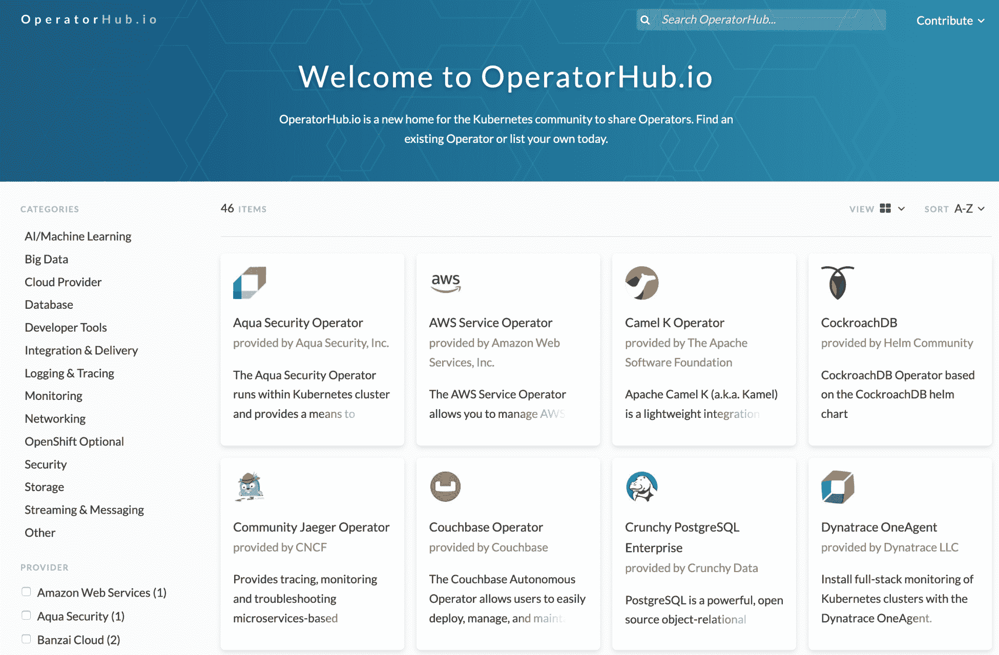

# 微服务和 Kubernetes 的未来

明天的软件系统将会更大、更复杂，能够处理更多的数据，并且对我们的世界产生更大的影响。想想无人驾驶汽车和无处不在的机器人。人类处理复杂性的能力不会扩展。这意味着我们将不得不采用分而治之的方法来构建这些复杂的软件系统。基于微服务的架构将继续取代单体架构。然后，挑战将转移到协调所有这些微服务成为一个连贯整体。这就是 Kubernetes 作为标准编排解决方案的作用所在。

在本章中，我们将讨论微服务和 Kubernetes 的近期发展。我们将关注近期的发展，因为创新的速度令人惊叹，试图展望更远的未来是徒劳的。长期愿景是，人工智能可能会进步到大部分软件开发可以自动化的程度。在这一点上，人类处理复杂性的限制可能不适用，而由人工智能开发的软件将无法被人类理解。

因此，让我们把遥远的未来放在一边，以亲身实践的精神讨论新兴技术、标准和趋势，这些将在未来几年内变得相关，你可能想要了解。

我们将涵盖一些微服务主题，例如以下内容：

+   微服务与无服务器函数

+   微服务、容器和编排

+   gRPC/gRPC-Web

+   HTTP/3

+   GraphQL

我们还将讨论一些 Kubernetes 主题：

+   Kubernetes 的可扩展性

+   服务网格集成

+   基于 Kubernetes 的无服务器计算

+   Kubernetes 和虚拟机

+   集群自动缩放

+   使用操作员

让我们从微服务开始。

# 微服务的未来

微服务是构建现代大规模系统的主要方法。但是，它们是否会继续是首选？让我们找出答案。

# 微服务与无服务器函数

关于微服务的未来最大的问题之一是，无服务器函数是否会使微服务过时。答案绝对是否定的。无服务器函数有许多很好的优点，以及一些严重的限制，比如冷启动和时间限制。当你的函数调用其他函数时，这些限制会累积。如果你想应用指数退避的重试逻辑，函数的执行时间限制就会成为一个很大的问题。一个长时间运行的服务可以保持本地状态和与数据存储的连接，并更快地响应请求。但对我来说，无服务器函数最大的问题是它们代表一个单一的函数，相当于一个服务的单一端点。我发现将一个封装完整领域的服务抽象出来是非常有价值的。如果你试图将一个有 10 个方法的服务转移到无服务器函数，那么你将遇到管理问题。

所有这些 10 个功能都需要访问相同的数据存储，并且可能需要修改多个功能。所有这些功能都需要类似的访问、配置和凭据来访问各种依赖关系。微服务将继续是大型、云原生分布式系统的支柱。然而，很多工作将被转移到无服务器函数，这是有道理的。我们可能会看到一些系统完全由无服务器函数组成，但这将是被迫的，并且必须做出妥协。

让我们看看微服务和容器之间的共生关系。

# 微服务、容器和编排

当你将一个单体应用程序分解成微服务，或者从头开始构建一个基于微服务的系统时，你最终会得到很多服务。你需要打包、部署、升级和配置所有这些微服务。容器解决了打包问题。没有容器，很难扩展基于微服务的系统。随着系统中微服务数量的增加，需要一个专门的解决方案来编排各种容器和进行最佳调度。这就是 Kubernetes 的优势所在。分布式系统的未来是更多的微服务，打包成更多的容器，需要 Kubernetes 来管理它们。我在这里提到 Kubernetes，是因为在 2019 年，Kubernetes 赢得了容器编排之战。

许多微服务的另一个方面是它们需要通过网络相互通信。在单体架构中，大多数交互只是函数调用，但在微服务环境中，许多交互需要命中端点或进行远程过程调用。这就是 gRPC 的作用。

# gRPC 和 gRPC-Web

gRPC 是谷歌的远程过程调用协议。多年来，出现了许多 RPC 协议。我仍然记得 CORBA 和 DCOM 以及 Java RMI 的日子。快进到现代网络，REST 击败了 SOAP 成为 Web API 领域的大猩猩。但是，如今，gRPC 正在击败 REST。gRPC 提供了基于契约的模型，具有强类型、基于 protobuf 的高效负载，并自动生成客户端代码。这种组合非常强大。REST 的最后避难所是其无处不在和从浏览器中运行的 Web 应用程序调用携带 JSON 负载的 REST API 的便利性。

但是，即使这种优势正在消失。您始终可以在 gRPC 服务前面放置一个与 REST 兼容的 gRPC 网关，但我认为这是一种权宜之计。另一方面，gRPC-web 是一个完整的 JavaScript 库，可以让 Web 应用程序简单地调用 gRPC 服务。参见[`github.com/grpc/grpc-web/tree/master/packages/grpc-web`](https://github.com/grpc/grpc-web/tree/master/packages/grpc-web)。

# GraphQL

如果 gRPC 是集群内的 REST 杀手，那么 GraphQL 就是边缘的 REST 杀手。GraphQL 只是一种更优越的范例。它给前端开发人员很大的自由来发展他们的设计。它将前端的需求与后端的严格 API 解耦，并作为完美的 BFF（面向前端的后端）模式。参见[`samnewman.io/patterns/architectural/bff/`](https://samnewman.io/patterns/architectural/bff/)。

与 gRPC 合同类似，GraphQL 服务的结构化模式对于大规模系统非常诱人。

此外，GraphQL 解决了传统 REST API 中可怕的*N+1*问题，其中您首先从 REST 端点获取*N*个资源列表，然后您必须进行*N*次更多的调用（每个资源一个）以获取列表中每个*N*项的相关资源。

我预计随着开发人员变得更加舒适，意识增强，工具改进和学习材料变得更加可用，GraphQL 将获得越来越多的关注。

# HTTP/3 即将到来

Web 是建立在 HTTP 之上的。毫无疑问。这个协议的表现非常出色。以下是一个快速回顾：1991 年，Tim-Berneres-Lee 提出了 HTTP 0.9 来支持他对万维网的构想。1996 年，HTTP 工作组发布了信息性 RFC 1945，推出了 HTTP 1.0，以促进 20 世纪 90 年代末的互联网繁荣。1997 年，发布了 HTTP 1.1 的第一个官方 RFC 2068。1999 年，RFC 2616 对 HTTP 1.1 进行了一些改进，并成为了两个十年的主要标准。2015 年，基于 Google 的 SPDY 协议发布了 HTTP/2，并且所有主要浏览器都支持它。

gRPC 建立在 HTTP/2 之上，修复了以前版本的 HTTP 中的许多问题，并提供了以下功能：

+   二进制帧和压缩

+   使用流进行多路复用（在同一个 TCP 连接上进行多个请求）

+   更好的流量控制

+   服务器推送

听起来很不错。HTTP/3 会给我们带来什么？它提供了与 HTTP/2 相同的功能集。然而，HTTP/2 基于 TCP，不支持流。这意味着流是在 HTTP/2 级别实现的。HTTP/3 基于 QUIC，这是一种基于 UDP 的可靠传输。细节超出了范围，但底线是 HTTP/3 将具有更好的性能，并且始终是安全的。

广泛采用 HTTP/3 可能仍需要一段时间，因为许多企业会在其网络上阻止或限制 UDP。然而，其优势是令人信服的，而且相比 REST API，基于 HTTP/3 的 gRPC 将具有更大的性能优势。

这些是将影响微服务的主要未来趋势。让我们看看 Kubernetes 的下一步发展。

# Kubernetes 的未来

Kubernetes 是不可或缺的。我敢做一个大胆的预测，说它将在未来几十年内一直存在。它无可否认地是容器编排领域的当前领导者，但更重要的是，它的设计方式非常可扩展。任何潜在的改进都可以建立在 Kubernetes 提供的良好基础之上（例如服务网格），或者替换这些基础（如网络插件、存储插件和自定义调度器）。很难想象会有一个全新的平台能够使 Kubernetes 过时，而不是改进和整合它。

此外，Kubernetes 背后的行业动力以及它在 CNCF 的开放开发和管理方式都很鼓舞人心。尽管它起源于谷歌，但没有人认为它是谷歌的项目。它被视为一个真正使每个人受益的开源项目。

现在，考虑到 Kubernetes 满足了整个领域的需求，从业余爱好者在笔记本电脑上玩转本地 Kubernetes，到在本地或云端进行测试的开发人员，一直到需要对其自己的本地数据中心进行认证和支持的大型企业。

对 Kubernetes 唯一的批评就是它很难学。目前是这样，但它会变得越来越容易。有很多好的培训材料。开发人员和运维人员会获得经验。很容易找到信息，社区也很大且充满活力。

很多人说 Kubernetes 很快就会变得无聊，并成为一个看不见的基础设施层。我不认同这个观点。Kubernetes 体验中的一些难点，比如设置集群和在集群中安装大量额外软件，会变得无聊，但我认为在未来 5 年里我们会看到各个方面的创新。

让我们深入了解具体的技术和趋势。

# Kubernetes 的可扩展性

这是一个很容易的选择。Kubernetes 一直被设计为一个可扩展的平台。但是，一些扩展机制需要合并到主 Kubernetes 存储库中。Kubernetes 开发人员早早地意识到了这些限制，并在各个方面引入了更松散耦合的机制来扩展 Kubernetes，并替换过去被视为核心组件的部分。

# 抽象容器运行时

Docker 曾经是 Kubernetes 支持的唯一容器运行时。然后它为现在已废弃的 RKT 运行时添加了特殊支持。然而，后来，它引入了**容器运行时接口**（**CRI**）作为通过标准接口集成任何容器运行时的方法。以下是一些实现 CRI 并可在 Kubernetes 中使用的运行时：

+   Docker（当然）

+   CRI-O（支持任何 OCI 镜像）

+   Containerd（于 2019 年 2 月成为 CNCF 毕业生）

+   Frakti（Kata 容器）

+   PouchContainer（P2P 镜像分发，可选的基于 VM）

# 抽象网络

Kubernetes 网络始终需要 Container Networking Interface（CNI）插件。这是另一个 CNCF 项目。它允许在网络和网络安全领域进行大量创新。

您可以在这里找到支持 CNI（超出 Kubernetes 范围）的平台的长列表，以及更长的插件列表[`github.com/containernetworking/cni.`](https://github.com/containernetworking/cni)

我期望 CNI 仍然是网络解决方案的标准接口。一个非常有趣的项目是 Cilium，它利用扩展的伯克利数据包过滤器（eBPF）在 Linux 内核级别提供非常高性能的网络和安全性，这可能抵消一些服务网格边车代理的开销。

# 抽象存储

Kubernetes 具有基于卷和持久卷索赔的抽象存储模型。它支持大量的内部存储解决方案。这意味着这些存储解决方案必须内置到 Kubernetes 代码库中。

早期（在 Kubernetes 1.2 中），Kubernetes 团队引入了一种特殊类型的插件，称为 FlexVolume，它提供了一个用于 out-of-tree 插件的接口。存储提供商可以提供实现 FlexVolume 接口的自己的驱动程序，并且可以作为存储层而不修改 Kubernetes 本身。但是，FlexVolume 方法仍然相当笨拙。它需要在每个节点上安装特殊的驱动程序，并且在某些情况下还需要在主节点上安装。

在 Kubernetes 1.13 中，容器存储接口（CSI）成熟到了一般可用（GA）状态，并提供了一个基于现代 gRPC 的接口，用于实现 out-of-tree 存储插件。很快，Kubernetes 甚至将通过 CSI 支持原始块存储（在 Kubernetes 1.14 中引入为 beta）。

以下图表说明了 CSI 在 Kubernetes 集群中的位置，以及它如何整洁地隔离存储提供商：

！

容器存储接口

趋势是用基于 CSI 的实现替换所有 in-tree 和 FlexVolume 插件，这将允许从核心 Kubernetes 代码库中删除大部分功能。

# 云提供商接口

Kubernetes 在云平台（如 Google 的 GKE，微软的 AKS，亚马逊的 EKS，阿里巴巴的 AliCloud，IBM 的云 Kubernetes 服务，DigitalOcean 的 Kubernetes 服务，VMware 的 Cloud PKS 和甲骨文的 Kubernetes 容器引擎）中取得了很大成功。

在早期，将 Kubernetes 集成到云平台需要大量的工作，并涉及定制多个 Kubernetes 控制平面组件，如 API 服务器、kubelet 和控制器管理器。

为了让云平台提供商更容易，Kubernetes 引入了**云控制器管理器**（**CCM**）。CCM 通过一组稳定的接口将云提供商需要实现的所有部分抽象出来。现在，Kubernetes 与云提供商之间的接触点被正式化，更容易理解并确保集成成功。让我们看看以下图表：

云控制器管理器

上述图表说明了 Kubernetes 集群与主机云平台之间的交互。

# 服务网格集成

我在第十三章的结尾提到过，*服务网格-使用 Istio*，服务网格非常重要。它们补充了 Kubernetes 并增加了很多价值。虽然 Kubernetes 提供了资源的管理和调度以及可扩展的 API，但服务网格提供了管理集群中容器之间流量的下一层。

这种共生关系非常强大。在 GKE 上，Istio 已经只需点击一个按钮即可。我预计大多数 Kubernetes 发行版都会提供安装 Istio（或者在 EKS 的情况下可能是 AWS 应用程序网格）作为初始设置的选项。

在这一点上，我预计很多其他解决方案会将 Istio 视为标准组件并在其基础上构建。在这个领域值得关注的一个有趣项目是 Kyma（[`kyma-project.io/`](https://kyma-project.io/)），它旨在轻松安装一系列最佳的云原生组件。Kyna 采用可扩展和开放的 Kubernetes，并添加了一套有见地的、良好集成的组件，例如以下内容：

+   Helm

+   Dex

+   Istio

+   Knative

+   Prometheus

+   Grafana

+   Jeager

+   Kubeless

+   Loki

+   Velero（前身为 Ark）

+   Minio

# Kubernetes 上的无服务器计算

正如我们在第九章中讨论的，*在 Kubernetes 上运行无服务器任务*，无服务器计算非常流行。市面上有很多解决方案。让我们在这里区分两个不同的解决方案：

+   **函数即服务**（**FaaS**）

+   **服务器即服务**（**SaaS**）

| **FaaS** | **SaaS** |
| --- | --- |
| **FaaS**意味着您可以启动一个函数，无论是作为打包成镜像的源代码，还是作为预打包的镜像。然后，这个镜像被安排在您的集群上，并运行到完成。您仍然需要管理和扩展集群中的节点，并确保您有足够的容量来运行长时间运行的服务和函数。 |

显然，您可以混合搭配，并运行 Kubernetes 集群自动缩放器，也可以运行一些函数作为服务框架，以获得两者的好处。

到目前为止，一切都很好。但是，Kubernetes 通常部署在具有自己非 Kubernetes 解决方案的公共云平台上。例如，在 AWS 中，您有 Lambda 函数（FaaS）以及 Fargate（SaaS）。Microsoft Azure 拥有 Azure Functions 和使用虚拟 kubelet 的容器实例，您可以弹性地扩展您的 AKS 集群。谷歌有 Cloud Functions 和 Cloud Run。

看到公共云提供商如何将他们的产品与 Kubernetes 集成将会很有趣。Google Cloud Run 是建立在 Knative 之上的，并且已经可以在您的 GKE 集群或 Google 的基础设施上运行（因此它独立于 Kubernetes）。

我预测 Knative 将成为另一个标准组件，其他 FaaS 解决方案将在 Kubernetes 上使用它作为构建块，因为它非常便携，并得到谷歌和 Pivotal 等主要参与者的支持。它从一开始就被设计为一组松散耦合的可插拔组件，让您可以替换您喜欢的组件。

# Kubernetes 最初是 Docker 容器的编排平台。许多特定于 Docker 的假设被构建进去。Kubernetes 1.3 添加了对 CoreOS rkt 的特殊支持，并开始了朝向解耦的运行时体验的旅程。Kubernetes 1.5 引入了 CRI，其中 kubelet 通过 gRPC 与容器运行时引擎通信。CRI 在 Kubernetes 1.6 中稳定。

**SaaS**意味着您不需要预配和管理集群中的节点。您的集群会根据负载自动增长和缩小。Kubernetes 集群自动缩放器在 Kubernetes 上提供了这种能力。

正如我之前在讨论容器运行时的抽象时提到的，CRI 为多个运行时实现打开了大门。一类运行时扩展是轻量级或微型虚拟机。这似乎有点适得其反，因为容器运动最大的动机之一是虚拟机对于动态云应用来说太过沉重。

事实证明，容器在隔离方面并不是百分之百可靠。对于许多用例来说，安全性问题比其他任何问题都更重要。解决方案是重新引入虚拟机，但轻量化。现在，行业已经积累了一些与容器相关的经验，可以设计下一代虚拟机，找到铁壁般的隔离和高性能/低资源之间的平衡点。

以下是一些最重要的项目：

+   gVisor

+   Firecracker

+   Kata containers

# gVisor

gVisor 是谷歌的一个开源项目。它是一个位于主机内核前面的用户空间内核沙箱。它公开了一个名为 runsc 的**Open Container Initiative**（**OCI**）接口。它还有一个 CRI 插件，可以直接与 Kubernetes 接口。gVisor 提供的保护只是部分的。如果容器被入侵，用户内核和特殊的 secomp 策略提供额外的安全层，但这并不是完全隔离。gVisor 被谷歌 AppEngine 使用。

# Firecracker

Firecracker 是 AWS 的一个开源项目。它是一个使用 KVM 管理微型虚拟机的虚拟机监视器。它专门设计用于运行安全的多租户容器和函数作为服务。它目前只能在英特尔 CPU 上运行，但计划支持 AMD 和 ARM。

AWS Lambda 和 AWS Fargate 已经在使用 Firecracker。目前，Firecracker 在 Kubernetes 上不能轻松使用。计划通过 containerd 提供容器集成。参考链接：[`github.com/firecracker-microvm/firecracker-containerd/`](https://github.com/firecracker-microvm/firecracker-containerd/)。

# Kata containers

这是另一个由**OpenStack 基金会**（**OSF**）管理的开源解决方案，即 Kata 容器。它结合了英特尔的 clear 容器和 Hyper.sh RunV 的技术。它支持多个虚拟化程序，如 QEMU、NEMU，甚至 Firecracker。Kata 容器的目标是构建基于硬件虚拟化的安全容器运行时，用于工作负载隔离。Kata 容器已经可以通过 containerd 在 Kubernetes 上使用。

很难说它会如何摇摆。已经有一些整合。对安全和可靠的容器运行时有很强的需求。所有项目都可以在 Kubernetes 上使用，或者计划很快将它们集成起来。这可能是云原生领域最重要但又看不见的改进之一。主要问题是那些轻量级虚拟机可能会为某些用例引入太多性能开销。

# 集群自动缩放

如果您处理波动负载（可以肯定地说任何非平凡系统都是如此），那么您有三个选择：

+   过度配置您的集群。

+   尝试找到一个理想的大小并处理停机，超时和性能慢。

+   根据需求扩大和缩小您的集群。

让我们更详细地讨论前述选项：

+   选项 1 很昂贵。您支付资源，大部分时间都没有充分利用。它确实给您带来了一些宁静，但最终，您可能会遇到需求暂时超过甚至超过您过度配置的容量的情况。

+   选项 2 实际上不是一个选项。如果您选择了过度配置并低估了，您可能会发现自己在那里。

+   选项 3 是您想要的地方。您的集群容量与您的工作负载相匹配。您始终可以满足您的 SLO 和 SLA，并且不必支付未使用的容量。但是，尝试手动弹性地管理您的集群是行不通的。

解决方案是自动执行。这就是集群自动缩放器的作用。我相信，对于大规模集群，集群自动缩放器将成为标准组件。可能会有其他自定义控制器，根据自定义指标调整集群大小，或者调整节点以外的其他资源。

我完全期待所有大型云提供商投资并解决与集群自动缩放相关的所有当前问题，并确保它在其平台上无缝运行。

Kubernetes 社区中另一个突出的趋势是通过 Kubernetes 操作员提供复杂组件，这已成为最佳实践。

# 使用操作员

Kubernetes 操作员是封装了某些应用程序的操作知识的控制器。它可以管理安装、配置、更新、故障转移等。操作员通常依赖于 CRD 来保持自己的状态，并可以自动响应事件。提供操作员正在迅速成为发布新的复杂软件的方式。

Helm 图表适用于将位安装到集群上（操作员可能会使用 Helm 图表进行此操作），但与复杂组件相关的持续管理很多，如数据存储、监控解决方案、CI/CD 流水线、消息代理和无服务器框架。

这里的趋势非常明显：复杂的项目将提供操作员作为标准功能。

有两个支持这一趋势的有趣项目。

OperatorHub（[`operatorhub.io/`](https://operatorhub.io/)）是一个经过筛选的 Kubernetes 操作员索引，人们可以在那里找到精心打包的软件来安装到他们的集群上。OperatorHub 由 RedHat（现在是 IBM 的一部分）、亚马逊、微软和谷歌发起。它按类别和提供商进行了很好的组织，并且易于搜索。以下是主页的截图：

操作员中心

操作员非常有用，但他们需要对 Kubernetes 的工作原理、控制器、协调逻辑的概念、如何创建 CRD 以及如何与 Kubernetes API 服务器交互有相当好的了解。这并不是什么难事，但也不是微不足道的。如果你想开发自己的操作员，有一个名为 Operator Framework 的项目（[`github.com/operator-framework`](https://github.com/operator-framework)）。Operator Framework 提供了一个 SDK，可以让您轻松开始使用您的操作员。有关使用 Go 编写操作员、使用 Ansible 或 Helm 的指南。

操作员显著减少了复杂性，但如果您需要管理多个集群怎么办？这就是集群联邦的用武之地。

# 联邦

管理单个大型 Kubernetes 集群并不简单。管理多个地理分布式集群要困难得多。特别是如果您试图将多个集群视为一个大的逻辑集群。在高可用性、故障转移、负载平衡、安全性和延迟方面会出现许多挑战。

对于许多非常庞大的系统，多个集群是必需的。有时，对于较小的系统也是必需的。以下是一些用例：

+   混合式本地/云

+   地理分布式冗余和可用性

+   多提供商冗余和可用性

+   非常庞大的系统（节点比单个 Kubernetes 集群能处理的要多）

Kubernetes 尝试通过 Kubernetes 联邦 V1 提案和实施来解决这个问题。但它失败了，从未达到 GA。但是，然后出现了 V2，网址是[`github.com/kubernetes-sigs/federation-v2.`](https://github.com/kubernetes-sigs/federation-v2)

所有大型云提供商都有混合本地/云系统的产品。这些包括以下内容：

+   Google Anthos

+   GKE 本地 - AWS Outposts：Microsoft Azure Stack

此外，许多第三方 Kubernetes 解决方案提供跨云甚至裸金属管理多个集群。在这方面最有前途的项目之一是 Gardener（[`gardener.cloud/`](https://gardener.cloud/)），它可以让您管理数千个集群。它通过拥有一个管理许多种子集群（作为自定义资源）的花园集群来运行，这些种子集群可以有射击集群。

我认为这是一个自然的进步。一旦行业掌握了管理单个集群的艺术，那么掌握一系列集群将成为下一个挑战。

# 总结

在本章中，我们看了一下微服务和 Kubernetes 接下来的发展方向。所有指标显示，无论是微服务还是 Kubernetes，在设计、构建、演进和操作云原生、大规模、分布式系统时都将继续发挥重要作用。这是个好消息。小型程序、脚本和移动应用不会消失，但后端系统将变得更大，处理更多数据，并负责管理我们生活中越来越多的方面。虚拟现实、传感器和人工智能等技术将需要处理和存储越来越多的数据。

在微服务世界的短期发展中，gRPC 将成为一种流行的服务间通信和公共接口传输方式。Web 客户端将能够通过 gRPC for web 消费 gRPC。GraphQL 是另一项创新，与 REST API 相比是一项重大改进。行业仍需要一些时间来理解如何设计和构建基于微服务的架构。构建单个微服务很简单。构建一整套协调的微服务系统则是另一回事。

容器和 Kubernetes 解决了基于微服务的架构所面临的一些难题。新技术，如服务网格，将迅速获得关注。无服务器计算（SaaS 和 FaaS）将帮助开发人员更快地部署和更新应用程序。容器和虚拟化的融合将导致更安全的系统。运维人员将使更大更有用的构建块成为现实。集群联邦将成为可扩展系统的新前沿。

到目前为止，您应该对即将到来的情况有一个很好的了解，知道可以预期什么。这些知识将使您能够提前规划，并对现在应该投资哪些技术以及哪些技术需要更多成熟进行自己的评估。

简而言之，我们正处在一个激动人心的新时代的开端，我们将学会如何在前所未有的规模上创建可靠的系统。继续学习，掌握所有可用的惊人技术，构建自己的系统，并回馈社区。

# 进一步阅读

阅读列表非常广泛，因为我们讨论了许多值得关注和跟进的新项目和技术：

+   gRPC： [`grpc.io/`](https://grpc.io/)

+   Frakti 运行时：[`github.com/kubernetes/frakti`](https://github.com/kubernetes/frakti)

+   Containerd：[`containerd.io/`](https://containerd.io/)

+   PouchContainer：[`github.com/alibaba/pouch`](https://github.com/alibaba/pouch)

+   Kata 容器：[`katacontainers.io/`](https://katacontainers.io/)

+   Kubernetes 和云提供商：[`medium.com/@the.gigi/kubernetes-and-cloud-providers-b7a6227d3198`](https://medium.com/@the.gigi/kubernetes-and-cloud-providers-b7a6227d3198)

+   扩展 Kubernetes：[`www.youtube.com/watch?v=qVZnU8rXAEU`](https://www.youtube.com/watch?v=qVZnU8rXAEU)

+   Azure Functions：[`azure.microsoft.com/en-us/services/functions/`](https://azure.microsoft.com/en-us/services/functions/)

+   Azure 容器实例：[`azure.microsoft.com/en-us/services/container-instances/`](https://azure.microsoft.com/en-us/services/container-instances/)

+   Google Cloud Run：[`cloud.google.com/blog/products/serverless/announcing-cloud-run-the-newest-member-of-our-serverless-compute-stack`](https://cloud.google.com/blog/products/serverless/announcing-cloud-run-the-newest-member-of-our-serverless-compute-stack)

+   gVisor: [`gvisor.dev/`](https://gvisor.dev/)

+   Firecracker: [`firecracker-microvm.github.io/`](https://firecracker-microvm.github.io/)

+   Kata Containers: [`katacontainers.io/`](https://katacontainers.io/)

+   Gardener: [`gardener.cloud/`](https://gardener.cloud/)

+   Operator Framework: [`github.com/operator-framework/operator-sdk`](https://github.com/operator-framework/operator-sdk)

+   HTTP/3 explained: [`http3-explained.haxx.se`](https://http3-explained.haxx.se)
