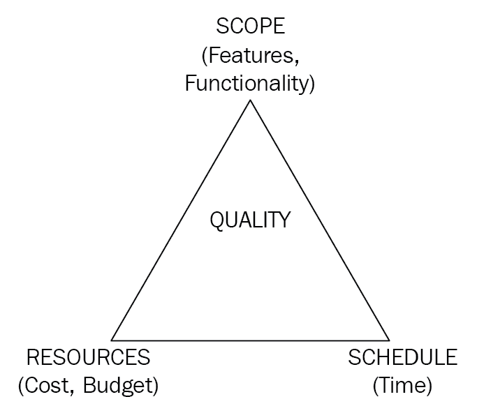
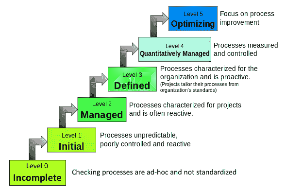

# 第一章：软件质量保证概述

作为人类，我们会犯错吗？答案是压倒性的“是”。有一些质量控制和决策失误的例子震惊了世界，并给涉及的公司带来了巨大的损失。例如，我们都记得挑战者号航天飞机在发射时爆炸的悲剧事故。这是一个简单的疏忽还是可能充分测试系统以控制故障威胁并避免爆炸的情况？

要弄清楚此类事件的底细，我们需要向参与设计和生产这些系统的人学习。错误通常是不可避免的，可以发生在生产的任何阶段，原因可能是需求不清晰、赶工满足截止日期或对系统的了解不足。然而，我们可以遵循一个过程，可以帮助减少制造或引入任何新错误，同时防止重复已知错误。这需要改变思维过程，并依赖制定标准实践，以生产更成功的产品。让我们首先了解质量意味着什么，然后再开始我们的旅程，重塑自己，创造可持续和可重复的最佳实践，交付无缺陷的软件。

在本章中，我们将涵盖以下主题：

+   什么是质量？

+   我们如何确保质量？

+   软件测试思维过程

+   质量管理体系

+   软件开发生命周期与软件测试生命周期

+   测试类型

+   准备测试数据和管理测试工件

# 什么是质量？

质量，就像任何其他度量标准一样，需要一个参照框架或标准，以便我们与客户需求进行比较。这些标准可以帮助我们维护和促进产品的一致性，最小化所需的重新工作量，并生产面向客户的产品。

质量可以用不同的方式定义。根据国际标准化组织（ISO）13628-2:2006，质量可以定义为符合指定要求。

ISO 9000 提出了七个主要的 ISO 原则，围绕着制造优质产品：

+   客户关注

+   领导力

+   人员的参与

+   过程方法

+   改进

+   基于证据的决策

+   关系管理

质量...

# 为什么要关心质量？

建立品牌需要大量工作，继续建立并保持对品牌的信任需要更多的工作。为了在当今竞争激烈的市场中生存并保持良好的声誉，组织在软件开发生命周期中加入测试阶段，并投入时间测试和调试软件产品。构建质量产品可以降低风险并提高性能。设计良好的产品可以减少用户的不满和挫折感。它还提高了产品的可靠性，改善了最终用户的体验，从而使客户满意。

# 谁对质量负责？

产品和服务对其客户群有直接影响，因为它们发布到市场上解决客户面临的问题。因此，提供此类服务或产品的组织在它们上市前后都有责任质量。组织需要考虑可能影响产品的内部和外部环境因素。这需要适当的规划和委派，以便为产品的每个方面分配团队和资源。通常，团队包括以下角色：

+   产品经理

+   项目经理

+   质量保证（QA）经理

+   业务分析师

+   软件开发人员

+   QA 工程师/测试人员

这个团队致力于...

# 我们如何确保质量？

质量保证是任何业务成功的关键。软件开发过程经历了各种阶段，确保每一步的质量是必不可少的。在前一节中，我们看到了为什么交付质量产品很重要。在本节中，我们将学习如何交付质量产品。

在规定的时间内交付一个明确定义的项目范围，以一定的预算，并且符合客户期望的一定质量标准是使项目成功的关键因素。然而，在这些因素之间达到合理的权衡是必要的，以便快速上市并保持竞争力。

例如，如果项目范围增加，而资源和时间保持不变，这将直接影响质量，因为团队需要在规定的时间内交付更多。由于他们的工作时间不变，团队可能不得不削减测试时间或减少测试覆盖范围以按时交付。以下图表描述了铁三角：

铁三角

三角形的目标——也称为铁三角——帮助我们成功交付项目。为了确保质量，我们需要满足铁三角的目标。传统的项目管理三角形包括以下内容：

| **范围** |
| --- |

+   确保我们已经与客户验证和确认了项目范围，并排除了项目范围之外的内容

+   确保我们已经设计了需求规格说明文档和完成项目所需的所有支持文档

+   确保我们已经确定了所有测试用例和场景，以验证需求文档和测试计划中规定的范围

|

| **时间** |
| --- |

+   确保所有活动及其依赖活动都得到适当规划

+   确保活动也包括会议时间、批准的假期、资源可用性和缓冲时间作为应急计划的一部分

+   确保每个项目启动都按时进行

|

| **成本** |
| --- |

+   确保已经确定了基于技能和预算的所有资源

+   确保已经获取或更新了所有必需的工具、供应商产品和购买许可证，以适应指定的预算

|

| **质量** |
| --- |

+   确保测试经理和测试领导已经进行了需求差距分析，并准备好了测试计划

+   确保测试计划列出了可能影响软件产品质量的所有因素，如资源、他们的技能水平、所需工具、范围内的事项、范围外的事项、测试策略、测试方法、兼容性和支持的浏览器版本

|

铁三角帮助项目经理分析和理解在满足这些因素时的权衡。必须达到适当的平衡，以确保所需的质量水平，从而生产成功的产品。

# 软件测试思维过程

软件产品是一个多学科团队共同努力制作的具体产品，以满足客户需求。尽管团队由多个角色组成，如经理、分析师、开发人员和测试人员，但每个角色对于交付合适和稳健的产品都是必不可少的。这要求每个贡献者都参与到质量过程中。

如果每个角色都在确保质量方面发挥作用，为什么我们还需要测试人员的独立角色呢？一个简单的原因是引入一双新的眼睛。虽然开发人员可能测试他们自己的代码或软件，但确保质量需要不同的思维方式。开发人员的思维方式是证明他们的软件能够工作，但测试人员的...

# 质量管理系统

到目前为止，我们已经看到了确保项目质量的各种方法，但是我们如何评估我们选择的质量体系是否有效呢？如果一个组织需要将其工作外包给另一个组织，并且需要知道承包商是否能够提供质量服务和产品，这就更成为一个关注点。对质量体系的需求进行审计需要使用**质量管理体系**（QMS）。

QMS 是一套标准，定义了组织如何满足客户和其他利益相关者的要求。质量标准是一套指南，而不是实际标准，在软件行业被广泛接受，具有明确定义的流程和评估指标，以帮助改进软件的质量。选择标准的动机留给企业和管理层决定。一旦获得认证，根据选择的认证，有必要制定质量计划。

所有质量标准都有相同的基本原则：

+   明确定义的软件开发流程

+   将人与流程相结合，以协同作用和促进对质量改进计划的承诺

+   强制执行为每个流程生成文档的要求

因此，流程应该被用作质量改进的促进者，而不是阻碍。管理层有责任在组织内营造一个在开发的明确定义框架内工作的文化，同时促进激励措施，以在开发过程的每一步推动质量。

有几个软件工程标准是由主要的标准化和认证机构制定的。ISO 9000 和**能力成熟度模型集成**（CMMI）是软件工程和产品开发组织中最广泛使用的国际标准。让我们详细了解它们，以了解如何实施标准可以帮助组织确保质量。

# ISO 9000 系列

ISO 9000 是由 ISO 定义的一套标准。如果一个组织需要获得认证，它将认证最新的标准 ISO 9001:2015，这取代了之前的版本 ISO 9001:2008。ISO 9001:2015 提供了推动组织持续改进的指南。

这个最新的更新是基于**高级结构**（HLS）—附录 SL，它帮助组织将多个管理系统纳入核心业务流程并提高效率。

ISO 9001:2015 标准规定了 10 个条款，总结如下：

+   **条款 1（范围）**：解释标准的用途和涵盖的内容。范围条款涵盖以下方面：

+   标准的目标和目的...

# CMMI

CMMI 是一套指南，使组织能够生产高质量的软件并提高其性能。CMMI 主要是为了评估组织承担美国国防部的大型开发项目的能力而开发的。

CMMI 于 2018 年 3 月发布了模型的第 2 版。这是从第 1.3 版的更新。CMMI v2.0 分为 4 个类别和 10 个能力，25 个实践领域。

现在让我们了解这些类别和实践领域：

+   **执行**：这个类别涉及设计和开发符合客户需求的高质量产品，同时减少供应链风险。执行阶段包括四个能力和 10 个实践领域，如下：

+   **确保质量**（ENQ）：

+   **开发和管理需求**：获取需求，确保利益相关者的相互理解，并调整需求、计划和工作产品。

+   **流程质量保证**：验证和促进执行的流程和产生的产品的质量改进。

+   **验证和验证**：这个实践领域的流程应该做到以下几点：

+   验证所选的解决方案和组件是否满足其要求

+   验证所选的解决方案和组件在其目标环境中是否实现其预期用途

+   同行评审：利用专业人员和同行审查产品，以识别和解决问题。

+   工程和产品开发（EDP）：

+   产品整合：整合和交付符合所需功能的高质量解决方案

+   技术解决方案：设计和构建满足客户要求的解决方案

+   交付和管理服务（DMS）：

+   服务交付管理：在符合服务级别协议（SLA）的情况下交付产品和服务

+   战略服务管理：建立和维护有关组织能力和战略需求的数据，这些数据作为标准服务

+   选择和管理供应商（SMS）：

+   供应商来源选择：通过评估供应商交付的解决方案是否满足预期要求来选择供应商

+   供应商协议管理：与选定的供应商建立协议，并确保供应商和收购方都遵守条款

+   管理：这个类别涉及提高员工生产力，同时管理来自波特五力模型的干扰，以实现市场速度。这个类别包括三个能力和七个实践领域，如下所示：

+   计划和管理工作（PMW）：

+   估算：预测生产高质量产品或解决方案所需的铁三角因素。

+   规划：制定描述基于组织标准和约束条件的交付流程的计划。这包括预算、时间表和资源，以及利益相关者和开发团队。

+   监控和控制：跟踪项目的进展，以确保如果项目偏离计划，则采取适当的控制措施。

+   业务韧性管理（MBR）：

+   风险管理和机会管理：识别、记录和管理潜在风险和机会

+   事件解决和预防：分析不符合要求，找出根本原因，并制定计划防止事件再次发生

+   连续性：制定应急计划，以在紧急情况下维持运营

+   管理劳动力（MWF）：

+   组织培训：开发人员的技能和知识，使他们有效高效地履行自己的角色

+   启用：这个类别涉及确保利益相关者的认同并确保产品的完整性。它包括一个能力和三个实践领域，如下所示：

+   支持实施（SI）：

+   因果分析和解决方案：了解所有结果的根本原因，并采取措施防止不符合要求的再次发生和/或确保符合要求

+   决策分析和解决方案：使用记录的过程做出和记录决策，分析替代方案

+   配置管理：使用版本控制、变更控制和适当的审计机制管理交付的完整性

+   改进：这个类别涉及确保绩效目标支持业务需求，同时建立可持续的效率。它包括两个能力和五个实践领域，如下所示：

+   提高绩效（IMP）：

+   过程管理：管理和实施持续改进流程和基础设施，以确定支持以可持续方式实现业务目标的最有利的流程改进

+   过程资产开发：记录和维护用于执行工作的流程列表

+   管理绩效和测量：使用测量和分析来管理绩效，以实现业务目标

+   维持习惯和坚持（SHP）：

+   **治理：**在过程活动的赞助和治理方面，向高层管理人员提供建议

+   **实施基础设施：**确保组织中重要的流程得到持续使用和改进

要了解更多关于新的 CMMI v2.0 的信息，请访问[`www.cmmiinstitute.com/cmmi/model-viewer`](https://www.cmmiinstitute.com/cmmi/model-viewer)。

# 成熟度水平

前面提到的类别和过程领域基本上是改善组织业务绩效的因素。根据组织如何实施这些过程领域，它们所处的等级被称为**成熟度水平**。

以下图表显示了软件过程成熟度的水平。根据软件过程成熟度，组织可以处于这六个成熟度水平中的一个。

https://commons.wikimedia.org/wiki/File:Characteristics_of_Capability_Maturity_Model.svg

让我们详细看看这些成熟度水平：

+   **成熟度水平 0（不完整）：**在这个水平上的组织...

# 软件开发生命周期与软件测试生命周期

**软件开发生命周期**（**SDLC**）是开发和交付软件产品或服务的过程，详细说明了从设计、编码和测试到发布后维护的端到端阶段。**软件测试生命周期**（**STLC**）是 SDLC 的一个子集。让我们详细探讨 SDLC 和 STLC。

# SDLC

SDLC 是一个计划和组织良好的过程，将软件开发任务分成各个阶段。这些阶段帮助团队构建符合范围、时间、成本和质量因素的产品。它还帮助项目经理在每个阶段监控和控制项目活动，并有效地进行风险分析。

任何传统的 SDLC 都包括以下基本但关键的阶段：

+   **需求分析：**软件产品存在是为了解决客户的问题。因此，了解客户需求对于构建产品至关重要。需求分析是实现这一目标的阶段。这是我们试图回答问题的阶段，*我们想要构建什么，为什么？*

+   我们创建正式文件...

# STLC

STLC 是 SDLC 的一部分。这是一种系统化的方法，可以确保软件产品或服务的质量。与 SDLC 一样，STLC 也包括不同的阶段，列举如下：

+   **需求分析：**一旦项目启动，团队就开始积极地收集客户需求。在这个阶段，测试人员、业务分析师和开发人员仔细研究用户提出的每个规格。在 STLC 的需求分析阶段，测试人员可以做以下事情：

+   测试人员需要将更广泛和更复杂的需求分解为更小的部分，以了解可测试的需求、测试范围和验证关键点，并确定需求中的差距

+   他们可以与开发人员和业务分析师就技术或软件需求、限制和依赖关系等问题澄清疑虑，并改进建议或强调需要添加到需求中的缺失信息

+   测试人员还可以在进入测试计划阶段之前，突出风险并制定风险缓解策略

+   **测试计划：**这是测试人员（通常是主管测试人员或经理）根据时间、范围和资源等各种因素计划测试活动和里程碑，以帮助他们跟踪项目的进展。让我们看看测试人员在测试计划期间执行的一些活动：

+   在这个阶段，测试人员计划测试活动和策略，这些活动和策略可以在随后的测试阶段有效地使用

+   此外，需要确定测试范围，并标记超出范围的部分

+   他们还需要根据当前产品需求决定在测试执行阶段实施的测试技术和类型。

+   此外，了解工具的要求以及所需资源的数量和其技能水平可以帮助他们更好地规划任务。

考虑这些因素和所选项目的时间表，测试人员可以准备一个有效的测试计划，以适应项目预算，并帮助团队创建一个高质量的产品。

+   测试设计：这是测试团队开始分解每个需求并将其转换为测试场景的地方。这些测试场景涵盖了正常路径、正向测试、需要验证的关键路径以及需要使用不同参数进行验证的功能。它还包括负面场景、验收测试以及基于用户交互工作流和数据流的场景。

+   根据应用程序的类型和需求分析中列出的测试类型，测试人员可以开始创建自动化测试脚本，添加压力和负载测试的场景，并进行性能测试，以帮助测试人员更好地测试应用程序并发现更多缺陷。

+   一旦场景准备好并经过审查，测试人员就会开始准备测试用例或测试脚本（在自动化测试的情况下），以列出详细的步骤。

+   一个场景可以有一个或多个测试用例，而一个需求可以与一个或多个场景相关联。在创建需求跟踪矩阵（RTM）时，这种映射是有帮助的。

+   环境设置：建立一个独立的测试环境总是一个良好的做法。保持测试代码与开发代码分开可以帮助测试人员和开发人员在特定版本中调试代码并更快地找到根本原因。此外，这使开发人员有机会在代码和其副本中进行错误修复，并在其环境中验证修复是否有效，然后再将其发送给测试人员。这样可以节省记录缺陷和收集工件所需的时间和精力。

+   在设置环境时，测试人员需要确保已配置所需版本的工具、软件、硬件和测试数据。

+   他们还需要确保他们有权限访问具有所需角色的环境，以测试应用程序、数据库和其他所需工具。测试环境应模拟最终用户的环境。这有助于记录产品的已知行为，并有助于在交付后管理期望。

+   测试执行：一旦代码由开发人员准备并经过单元测试，它就会部署到测试环境中，以便测试人员可以启动测试执行阶段。

+   测试人员执行的第一个测试是冒烟测试，以验证软件产品或服务是否满足基本要求。

+   软件通过冒烟测试后，测试人员可以继续验证过程，按照测试计划阶段计划的测试类型进行。

+   在执行阶段，测试人员将不良结果记录为缺陷。一旦缺陷被修复，测试人员需要重新测试已更改的部分以及未更改的应用程序部分，作为回归测试的一部分。

+   测试报告：对于测试人员、领导和经理来说，跟踪和监控项目的进展非常重要，这样可以更容易地及早识别障碍或风险。这也有助于灵活地提供解决方案并解决问题。

+   报告测试有助于利益相关者了解每次迭代或测试周期后测试执行的状态。

+   这也有助于缺陷管理人员识别依赖于缺陷的受阻测试用例。

+   相应地，其优先级或严重性可以更改，以帮助推进测试执行。

+   在所有迭代结束时，将准备一份最终报告，其中包括测试执行阶段发现的缺陷数量、关闭或标记为推迟的缺陷数量，以及通过或标记为 N/A 的测试用例数量。除此报告外，还要验证所有工件，并确保在需要时已添加。

+   **闭环：**在闭环阶段，测试经理或测试负责人确保所有测试按计划成功完成。

+   团队领导或经理确保所有必需的可交付成果和闭环文件按照评估标准获得批准和接受，并作为闭环阶段的一部分签署批准。

在接下来的章节中，我们将更多地了解 STLC 中的每个阶段，以及在 Jira 中的实际实施和使用其插件。

# 测试类型

为了确保产品的质量，我们需要了解我们的应用程序及其测试需求，使其更加健壮和无错误。根据客户需求和我们正在开发的产品类型，我们可以在 STLC 的测试计划阶段提出所需的测试类型列表。

在本节中，我们将学习在测试执行阶段可以使用的不同测试类型。

+   **黑盒测试：**关注应用程序通过一组已知的输入参数产生的外部行为、规范和期望的最终结果，而不是代码的内部结构。这里的主要目标是验证软件是否符合最终用户的预期...

# 准备测试数据和管理测试工件

在软件测试中，使用有效或无效参数以及不同的输入值集来验证测试场景是否至关重要，以确保其行为符合设计的测试。为了验证端到端的场景和顺利的路径工作流程，我们需要创建测试数据。然而，有时，测试的要求是将系统带到可以开始测试的初始级别。所有这些都可以作为测试数据准备阶段的一部分完成。

根据系统要求，测试人员可以创建不同的授权和未授权用户集，具有不同的角色，例如管理员或客户支持执行人员，他们都具有不同的权限集来访问应用程序。创建一组并发用户以访问应用程序也是测试数据准备的一部分。

测试人员可能还需要使用不同类型的文件，例如`.doc`、`.docx`、`.txt`、`.pdf`、`.xls`、`.xlsx`、`.csv`、`.png`或`.jpeg`来导入数据，以确保它按照测试用例中定义的方式工作或不工作。在这些文件中，他们可以添加有效或无效的用户，留下一些字段为空，或添加不可接受的值，这将破坏应用程序或引发错误。

测试人员还使用这些文件作为其自动化测试脚本的输入，这些脚本通过插入从这些输入文件中读取的测试数据来进行测试验证。

# 管理测试工件

管理测试工件涉及存储和管理作为测试执行阶段的一部分生成的证据，或者也可以是在 SDLC 的任何阶段之后生成的一组可交付成果。

正确管理这些工件非常有用：

+   在缺陷记录和重新测试期间生成的工件可以节省开发人员和测试人员的时间，避免他们不得不调试代码的每个部分，使用指定的测试数据、构建版本和环境重现测试。日志错误文件、截屏、带有结果集的数据库查询、输入参数、测试期间使用的应用程序的 URL、环境、测试日期、构建编号等。

+   生成的可交付成果...

# 总结

在本章中，我们详细讨论了软件质量保证。让我们总结一下重要的观点——优质产品指的是符合客户要求的产品。ISO/IEC 25010:2011 质量模型列举了 13 个特征，帮助我们评估产品的质量。生产优质产品需要产品开发团队中互补的技能和角色的结合。范围、时间、成本和质量是相互交织的，因此在开发满足组织能力和客户满意度的产品时，平衡它们是必不可少的。测试破坏的态度对于测试人员在其职业生涯中取得成功是必要的。我们看了一下测试人员需要带到工作中的思维过程，以精通这项工作。质量管理体系解决了开发优质产品所需遵循的流程。我们详细讨论了 ISO 9001:2015 和 CMMI v2.0。我们看了一下 SDLC 的五个阶段，并了解了 STLC 如何融入其中。我们讨论了测试人员在根据客户和产品需求规划测试时可以利用的七种测试类型。在最后一节中，我们了解了测试数据和工件是如何准备、管理、保留和共享的，以实现有效的测试管理。

在下一章中，我们将研究 Jira 中的项目组织，并探讨 Zephyr、Test Management 和 synapseRT 插件，这些插件将用于在 Jira 中实现测试管理。
